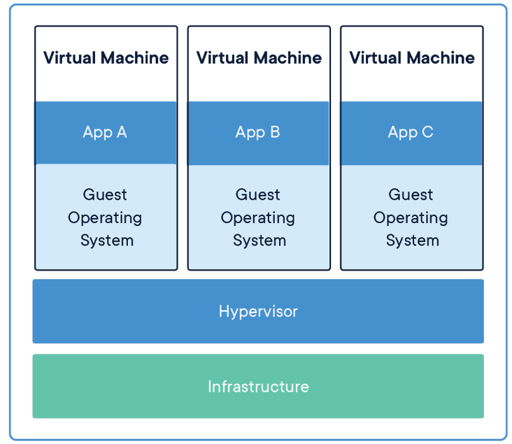
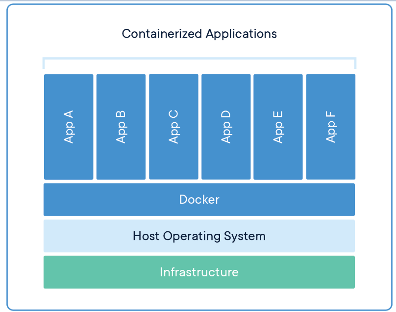
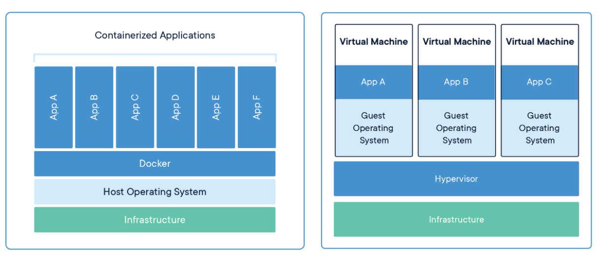

# 应用（Application）部署容器化演进之路

# 一、应用程序部署痛点

## 1.1 应用程序部署流程

**举例：部署一个JAVA编程语言开发的Web应用，以War包放入Tomcat方式部署。**

- 部署过程如下：
  - 服务器配置运行环境:JAVA代码运行环境，例如JDK或JRE
  - 服务器上安装Tomcat web中间件，用于运行War包
  - 把JAVA Web对应的War包放置于Tomcat对应目录
  - 在服务器上启动Tomcat应用
  - 可选：涉及数据库（MySQL）或缓存系统(Redis)等都需要逐一部署。

## 1.2 应用程序扩缩容

- 涉及多台服务器部署相同的上述环境
- 痛点：上述环境部署要重新实施一遍，较浪费人力与物力成本

## 1.3 应用程序多环境部署

- 环境：本地测试环境、预发布环境、生产环境
- 在本地测试环境运行没有问题，但在预发布环境中出现了问题，甚至上面2种环境都没有问题，到了生产环境就有问题了。
- 需求：一次成功，可到处运行。

# 二、 计算资源应用演进过程

## 2.1 使用物理服务器痛点

- 从物理服务器自身管理角度

  - 物理服务器环境部署人力成本大，特别是在自动化手段不足的情况下，依靠人肉运维的方式解决。
  - 当物理服务器出现宕机后，服务器重启时间过长，短则1-2分钟，长则3-5分钟，有背于服务器在线时长达到99.999999999%标准的要求
  - 物理服务器在应用程序运行期间硬件出现故障，解决较麻烦
  - 物理服务器计算资源不能有效调度使用，无法发挥其充足资源的优势

  

- 从物理服务器部署应用程序角度

  - 物理服务器环境部署浪费时间，没有自动化运维手段，时间是成倍增加的
  - 在物理服务器上进行应用程序配置变更，需要重新实施前述步骤

## 2.2 使用虚拟机优点与缺点

### 2.2.1 使用虚拟机优秀点

- 从虚拟机本身管理角度
  - 虚拟机较物理服务器轻量，可借助虚拟机模板实现虚拟机快捷生成及应用
  - 虚拟机中部署应用与物理服务器一样可控性强，且当虚拟机出现故障时，可直接使用新的虚拟机代替
  - 在物理服务器中使用虚拟机可高效使用物理服务器的资源
  - 虚拟机与物理服务器一样可达到良好的应用程序运行环境的隔离

- 从在虚拟机中部署应用程序角度
  - 在虚拟机中部署应用，容易扩容及缩容实现
  - 与物理服务器相比较，当部署应用程序的虚拟机出现宕机时，可以快速启动，时间通常可达秒级，10秒或20秒即可启动，应用程序可以继续提供服务
  - 应用程序迁移方便

### 2.2.2 使用虚拟机缺点

- 虚拟机管理软件本身占用物理服务器计算资源较多，例如:VMware Workstation Pro就会占用物理服务器大量资源，所以一般在企业应用中使用KVM虚拟机较多。
- 虚拟机底层硬件消耗物理服务器资源较大，例如：虚拟机操作系统硬盘，会直接占用大量物理服务器硬盘空间
- 相较于容器技术，虚拟机启动时间过长，容器启动可按毫秒级计算
- 虚拟机对物理服务器硬件资源调用添加了调链条，存在浪费时间的现象，所以虚拟机性能弱于物理服务器
- 由于应用程序是直接部署在虚拟机硬盘上，应用程序迁移时，需要连同虚拟机硬盘中的操作系统一同迁移，会导致迁移文件过大，浪费更多的存储空间及时间消耗过长

## 2.3 使用容器的优点与缺点

### 2.3.1 使用容器的优点

- 不需要为容器安装操作系统，可以节约大量时间
- 不需要通过手动的方式在容器中部署应用程序的运行环境，直接部署应用就可以了
- 不需要管理容器网络，以自动调用的方式访问容器中应用提供的服务
- 方便分享与构建应用容器，一次构建，到处运行
- 毫秒级启动
- 容器可直接使用物理服务器硬件资源，物理服务器硬件资源利用率高，性能较好。

### 2.3.2 使用容器的缺点

对于对使用物理服务器、虚拟机已成为习惯的小伙伴来说，容器化可控性不强，最直观的就是对容器管理访问，总想按物理服务器或虚拟机的方式去管理它，其实容器与物理服务器、虚拟机管理方式上有着本质的区别的，最好不要管理。

# 三、 What is a Container?

## 3.1 容器定义

- 虚拟机
  - 采用虚拟化技术手段实现物理服务器计算资源打包的方式，为应用程序提供类物理服务器运行环境
  - 能够实现应用程序与应用程序之间的隔离
  - 使用自动化技术部署应用程序及应用程序迁移较方便
  - 可横向扩展
- 容器
  - 容器是轻量级物理服务器计算资源的打包方式，即轻量级虚拟机，为应用程序提供类虚拟机运行环境。
  - 可在物理服务器中实现高密度部署

- 容器与虚拟机对比

| 对比属性               | 容器（Container） | 虚拟机（VM）       |
| ---------------------- | ----------------- | ------------------ |
| 隔离性                 | 基于进程隔离      | 提供资源的完全隔离 |
| 启动时间               | 毫秒级或秒级      | 秒级或分钟级       |
| 内核                   | 共用宿主机内核    | 使用独立内核       |
| 占用资源               | MB级              | GB级               |
| 系统支持容量（同级别） | 支持上千个容器    | 几十台虚拟机       |

## 3.2 容器功能

- 安装容器管理工具，例如Docker,Containerd等，把应用以容器化的方式运行

- 应用在自己的容器中运行，实现应用程序间隔离

- 应用程序运行的容器可以生成应用程序模板文件，即容器镜像（Image），其不可变，即为云原生代表技术基础设施不可变,且可以在其它的物理服务器中运行。

  

## 3.3 容器解决了什么问题

- 快速交付和部署应用 (镜像与容器)
- 资源的高效利用和隔离 (在物理机上实现高密度部署)
- 便捷迁移和扩缩容(一次构建，多处运行)

# 四、使用容器步骤

- 安装容器管理工具 
  - Docker   (Docker公司)
  - Containerd  (2017年docker捐给CNCF云原生计算基金会)
  - Pouch  (阿里云)

- 搜索/下载容器镜像(Image)
- 使用容器镜像生成容器(容器镜像中的应用程序启动)
- 终端用户(互联网用户或其它应用程序)访问
- 迁移部署(可直接把正在运行的容器打包成新的容器镜像，在其它主机上运行即可。)

