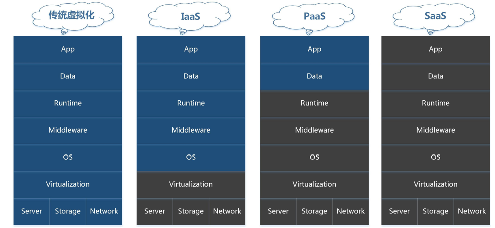
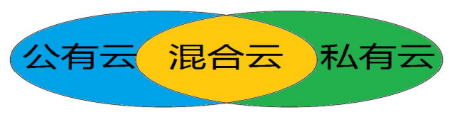
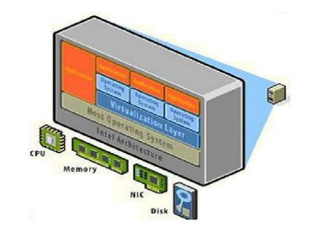

# 云计算

# 一、计算资源使用方式

## 1.1 主机资源使用方式

在云计算出现之前，常用的主机资源使用方式有：

- 自己购买物理机
- IDC托管物理机
- IDC租用物理机
- 虚拟机
- 虚拟主机

## 1.2 传统资源管理方式

### 1.2.1 资源方面

- 初期投入/后期维护成本高
- 后期资源闲置浪费

### 1.2.2 人力方面

- 纯手工操作，自动化能力差
- 技术水平限制，资源分配不合理

### 1.2.3 最终效果

- 人力物力成本大
- 资源利用率低

# 二、为什么要用云计算

## 2.1 对提供商而言

- 海量资源动态管理
- 资源灵活调配
- 资源高效率使用
- 技术团队高效使用

## 2.2 对客户而言

- 使用方式多：通过网络访问，服务无处不在
- 投入成本低：按需使用的自助服务，资源可以弹性伸缩

# 三、云计算历史

2006年 Google提出"云计算"概念
2009年 美日韩将其纳入政府议程
2010年 中国将其纳入战略性产业，云计算开始在中国进入迅速发展期
2013年 政府工信部发布基于云计算的政务平台设计指南
2015年 云计算脱离争论不休和宣扬阶段，开始进入落地实施阶段

# 四、云计算定义

## 4.1 从表现形式定义

- 底层由物理硬件构建出一个环境，在这个环境上运行一个操作系统，对终端用户而言，当我们需要用到一个操作系统或应用实现特殊功能时，它只需要向CloudOS提出申请而就能够立即申请获取一个对应的请求环境，这个环境我们可以随时终止，开启等功能。
- 对于用户而言，无需关心它所需要的计算能力从哪里来，有别于传统使用计算机操作系统的状况(看得见、摸得着)

## 4.2 从具体应用定义

- 云计算是一种资源交付的模式，即打包资源给客户使用。
- 它的特点是：基于网络、按需付费、弹性拓展。
- 云服务提供商基于有效的网络通信对所有资源进行统一管理，客户对使用的计算资源按需付费，计算资源使用过程中支持弹性拓展，客户只需投入很少的管理工作就可以高效率的使用计算资源。

# 五、云计算实现方式

## 5.1 传统/私有方式

优点：所有事情都亲自做，可控
缺点：用户成本比较高，要求自身技术水平高
典型软件：传统物理主机

## 5.2 Iaas

IaaS（基础设施即服务）

- 优点：底层硬件到操作系统，都不需要用户操心，省事，可以集中精力做业务项目。
- 缺点：服务商提供的东西，非自己自由定制，所以不可控
- 典型软件：OpenStack，CloudStack

## 5.3 PaaS

PaaS（平台即服务）

Management 是 云计算实现的一种方式，因为包含众多组件，所以也有人称之为Cloud OS

- 优点：我不会运维，我只会开发，底层到运行环境，都不需要用户操心，省事，可以集中精力做应用项目
- 缺点：服务商提供的东西，定制太强，不灵活，只适用于特殊的应用项目，
- 典型软件：Docker、Rocket、Openshift...

## 5.4 SaaS

SaaS（软件即服务）

- 优点：所有东西都由服务商提供，自己只需要花钱使用就行了，对于广大(大中小)企业来说，SaaS是采用先进技术实施信息化的最好途径。例如：企业邮箱服务，财务软件云服务
- 缺点：对客户来说，所有东西都不可控，安全不安全，看情况

# 六、云计算应用分类

## 6.1 公有云

- 普遍性
- 用户按需使用，成本低廉，管理方面。
- 用户的数据保存在公有云的提供商那里，从技术上来讲，数据安全是没有办法保证的，这能从业务层面上来看待。
- 比如：银行不用公有云
- 举例：亚马逊、阿里云、openstack

## 6.2 私有云

- 专用性
- 所有资源都自己提供，安全有保障
- 技术/人力/业务成本高昂，资源利用效率低。
- 举例：vmware、企业云。。。

## 6.3 混合云

- 协调性
- 核心业务用私有云，临时需求/轻量级业务需求使用公有云
- 成本的最优使用效率

# 七、虚拟化与云计算

## 7.1 虚拟化

- 虚拟化是一种技术，它的目的在于提高资源的使用率，并将底层硬件和上层的应用软件进行隔离，使得上层软件及应用计算变得更加弹性可控。最终达到有限成本的高价值。
- 默认情况下，虚拟化技术默认并不对外提供使用抽象的上层应用软件服务组件，一个没有被服务化的虚拟化环境只能被称为"资源池"，只有内部管理人员才可以操作。

## 7.2 云计算

云计算是以虚拟化技术为核心技术和基础，面向服务架构(SOA)的一种实现,将虚拟化环境"资源池"隐藏起来，将其上层 应用软件形成丰富的云管理接口，达到所有人自由使用所有资源的一种现象，它是一种资源使用模式的变革。

> 虚拟化是一种技术，云计算是一种计算资源交付模式。