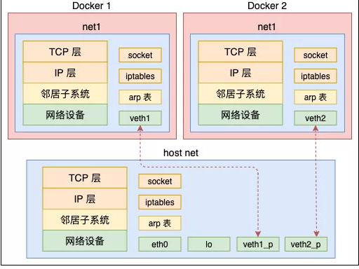
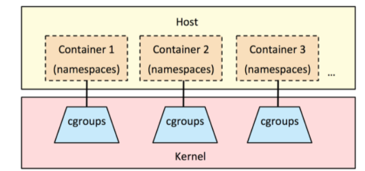

# 容器技术所涉及Linux内核关键技术

# 一、容器技术前世今生

## 1.1 1979年 — chroot

- 容器技术的概念可以追溯到1979年的UNIX chroot。
- 它是一套“UNIX操作系统”系统，旨在将其root目录及其它子目录变更至文件系统内的新位置，且只接受特定进程的访问。
- 这项功能的设计目的在于为每个进程提供一套隔离化磁盘空间。
- 1982年其被添加至BSD当中。

## 1.2 2000年 — FreeBSD Jails

- FreeBSD Jails是由Derrick T. Woolworth于2000年在FreeBSD研发协会中构建而成的早期容器技术之一。
- 这是一套“操作系统”系统，与chroot的定位类似，不过其中包含有其它进程沙箱机制以对文件系统、用户及网络等资源进行隔离。
- 通过这种方式，它能够为每个Jail、定制化软件安装包乃至配置方案等提供一个对应的IP地址。

## 1.3 2001年 — Linux VServer

- Linux VServer属于另一种jail机制，其能够被用于保护计算机系统之上各分区资源的安全(包括文件系统、CPU时间、网络地址以及内存等)。
- 每个分区被称为一套安全背景(security context)，而其中的虚拟化系统则被称为一套虚拟私有服务器。

## 1.4 2004年 — Solaris容器

- Solaris容器诞生之时面向x86与SPARC系统架构，其最初亮相于2004年2月的Solaris 10 Build 51 beta当中，随后于2005年正式登陆Solaris 10的完整版本。
- Solaris容器相当于将系统资源控制与由分区提供的边界加以结合。各分区立足于单一操作系统实例之内以完全隔离的虚拟服务器形式运行。

## 1.5 2005年 — OpenVZ

- OpenVZ与Solaris容器非常相似，且使用安装有补丁的Linux内核以实现虚拟化、隔离能力、资源管理以及检查点交付。
- 每套OpenVZ容器拥有一套隔离化文件系统、用户与用户群组、一套进程树、网络、设备以及IPC对象。

## 1.6 2006年 — Process容器

- Process容器于2006年由谷歌公司推出，旨在对一整套进程集合中的资源使用量(包括CPU、内存、磁盘I/O以及网络等等)加以限制、分配与隔离。
- 此后其被更名为Control Groups(即控制组)，从而避免其中的“容器”字眼与Linux内核2.6.24中的另一术语出现冲突。这表明了谷歌公司率先重视容器技术的敏锐眼光以及为其做出的突出贡献。

## 1.7 2007年 — Control Groups

Control Groups也就是谷歌实现的cgroups，其于2007年被添加至Linux内核当中。

## 1.8 2008年 — LXC

- LXC指代的是Linux Containers
- 是第一套完整的Linux容器管理实现方案。
- 其功能通过cgroups以及Linux namespaces实现。
- LXC通过liblxc库进行交付，并提供可与Python3、Python2、Lua、Go、Ruby以及Haskell等语言相对接的API。
- 相较于其它容器技术，LXC能够在无需任何额外补丁的前提下运行在原版Linux内核之上。

## 1.9 2011年 — Warden

- Warden由CloudFoundry公司于2011年所建立，其利用LXC作为初始阶段，随后又将其替换为自家实现方案。
- 与LXC不同，Warden并不会与Linux紧密耦合。相反，其能够运行在任意能够提供多种隔离环境方式的操作系统之上。Warden以后台进程方式运行并提供API以实现容器管理。

## 1.10 2013年 — LMCTFY

- Lmctfy代表的是“Let Me Contain That For You(帮你实现容器化)”。它其实属于谷歌容器技术堆栈的开源版本，负责提供Linux应用程序容器。谷歌公司在该项目的起步阶段宣称其能够提供值得信赖的性能表现、高资源利用率、共享资源机制、充裕的发展空间以及趋近于零的额外资源消耗。
- 2013年10月lmctfy的首个版本正式推出，谷歌公司在2015年决定将lmctfy的核心概念与抽象机制转化为libcontainer。在失去了主干之后，如今lmctfy已经失去一切积极的发展势头。

　　Libcontainer项目最初由Docker公司建立，如今已经被归入开放容器基金会的管辖范畴。

## 1.11 2013年-Docker

- 在2013年Docker刚发布的时候，它是一款基于LXC的开源容器管理引擎。
- 把LXC复杂的容器创建与使用方式简化为Docker自己的一套命令体系。
- 随着Docker的不断发展，它开始有了更为远大的目标，那就是反向定义容器的实现标准，将底层实现都抽象化到Libcontainer的接口。这就意味着，底层容器的实现方式变成了一种可变的方案，无论是使用namespace、cgroups技术抑或是使用systemd等其他方案，只要实现了Libcontainer定义的一组接口，Docker都可以运行。这也为Docker实现全面的跨平台带来了可能。

# 二、NameSpace

## 2.1 NameSpace介绍

- 很多编程语言都包含了命名空间的概念，我们可以认为命名空间是一种封装，封装本身实际上实现了代码的隔离

- 在操作系统中命名空间命名空间提供的是系统资源的隔离，其中系统资源包括了：进程、网络、文件系统......

- 实际上linux系统实现命名空间主要目的之一就是为了实现轻量级虚拟化服务，也就是我们说的容器，在同一个命名空间下的进程可以感知彼此的变化，而对其他命名空间的进程一无所知，这样就可以让容器中的进程产生一个错觉，仿佛它自己置身于一个独立的系统环境当中，以此达到独立和隔离的目的。

## 2.2 Linux系统中NameSpace分类

|   命名空间   |             描述             |                             作用                             |                             备注                             |
| :----------: | :--------------------------: | :----------------------------------------------------------: | :----------------------------------------------------------: |
| 进程命名空间 |          隔离进程ID          | Linux通过命名空间管理进程号，同一个进程，在不同的命名空间进程号不同 |       进程命名空间是一个父子结构，子空间对于父空间可见       |
| 网络命名空间 | 隔离网络设备、协议栈、端口等 |                通过网络命名空间，实现网络隔离                |  docker采用虚拟网络设备，将不同命名空间的网络设备连接到一起  |
| IPC命名空间  |        隔离进程间通信        |                        进程间交互方法                        | PID命名空间和IPC命名空间可以组合起来用，同一个IPC名字空间内的进程可以彼此看见，允许进行交互，不同空间进程无法交互 |
| 挂载命名空间 |          隔离挂载点          |                         隔离文件目录                         | 进程运行时可以将挂载点与系统分离，使用这个功能时，我们可以达到 chroot 的功能，而在安全性方面比 chroot 更高 |
| UTS命名空间  |    隔离Hostname和NIS域名     | 让容器拥有独立的主机名和域名，从而让容器看起来像个独立的主机 |           目的是独立出主机名和网络信息服务（NIS）            |
| 用户命名空间 |      隔离用户和group ID      |        每个容器内上的用户跟宿主主机上不在一个命名空间        | 同进程 ID 一样，用户 ID 和组 ID 在命名空间内外是不一样的，并且在不同命名空间内可以存在相同的 ID |

## 2.3 NameSpace应用案例

> 以net namespace为例

- 在 Linux 中，网络命名空间可以被认为是隔离的拥有单独网络栈（网卡、路由转发表、iptables）的环境。网络命名空间经常用来隔离网络设备和服务，只有拥有同样网络命名空间的设备，才能看到彼此。
- 从逻辑上说，网络命名空间是网络栈的副本，拥有自己的网络设备、路由选择表、邻接表、Netfilter表、网络套接字、网络procfs条目、网络sysfs条目和其他网络资源。
- 从系统的角度来看，当通过clone()系统调用创建新进程时，传递标志CLONE_NEWNET将在新进程中创建一个全新的网络命名空间。
- 从用户的角度来看，我们只需使用工具ip（package is iproute2）来创建一个新的持久网络命名空间。

### 2.3.1 创建net命名空间

~~~powershell
创建名称为msb的网络命名空间
# ip netns add msb
~~~

~~~powershell
查看已创建的网络命名空间
# ip netns ls
msb
~~~

### 2.3.2 删除net命名空间

~~~powershell
删除已创建的网络命名空间
# ip netns delete msb
~~~

### 2.3.3 在net命名空间中执行命令

~~~powershell
在网络命名空间中执行bash命令，如果想退出，需要使用exit
# ip netns exec msb bash
~~~

### 2.3.4 在net命令空间中执行查看网络连接(网卡)命令

~~~powershell
在网络命名空间中查看网络命名空间中的网卡信息
# ip link
1: lo: <LOOPBACK> mtu 65536 qdisc noop state DOWN mode DEFAULT group default qlen 1000
    link/loopback 00:00:00:00:00:00 brd 00:00:00:00:00:00
~~~

~~~powershell
在Linux主机系统中查看
# ip netns exec msb ip link list
1: lo: <LOOPBACK> mtu 65536 qdisc noop state DOWN mode DEFAULT group default qlen 1000
    link/loopback 00:00:00:00:00:00 brd 00:00:00:00:00:00
~~~

### 2.3.5 退出当前的net命名空间

~~~powershell
退出已进入的网络命名空间
# exit
exit
~~~

### 2.3.6 在net命名空间中执行多条命令

~~~powershell
在网络命名空间中查看路由表
# route -n
Kernel IP routing table
Destination     Gateway         Genmask         Flags Metric Ref    Use Iface
~~~

~~~powershell
在网络命名空间中查看防火墙规则
# iptables -t nat -nL
Chain PREROUTING (policy ACCEPT)
target     prot opt source               destination         

Chain INPUT (policy ACCEPT)
target     prot opt source               destination         

Chain OUTPUT (policy ACCEPT)
target     prot opt source               destination         

Chain POSTROUTING (policy ACCEPT)
target     prot opt source               destination
~~~

### 2.3.7 创建虚拟网卡

> 同时创建一对虚拟网卡

~~~powershell
创建虚拟网卡对
# ip link add veth0 type veth peer name veth1
~~~

~~~powershell
在物理机上查看
# ip a s
......
10: veth1@veth0: <BROADCAST,MULTICAST,M-DOWN> mtu 1500 qdisc noop state DOWN group default qlen 1000
    link/ether de:44:f8:b7:12:65 brd ff:ff:ff:ff:ff:ff
11: veth0@veth1: <BROADCAST,MULTICAST,M-DOWN> mtu 1500 qdisc noop state DOWN group default qlen 1000
    link/ether 46:5e:89:8c:cb:b3 brd ff:ff:ff:ff:ff:ff
~~~

### 2.3.8 迁移虚拟网卡到命名空间中

>这两个网卡还都属于“default”或“global”命名空间，和物理网卡一样。把其中一个网卡转移到命名空间msb中。

~~~powershell
把创建的veth1网卡添加到msb网络命名空间中
# ip link set veth1 netns msb
~~~

~~~powershell
在Linux系统命令行查看网络命名空间中的网络
# ip netns exec msb ip link
1: lo: <LOOPBACK> mtu 65536 qdisc noop state DOWN mode DEFAULT group default qlen 1000
    link/loopback 00:00:00:00:00:00 brd 00:00:00:00:00:00
10: veth1@if11: <BROADCAST,MULTICAST> mtu 1500 qdisc noop state DOWN mode DEFAULT group default qlen 1000
    link/ether de:44:f8:b7:12:65 brd ff:ff:ff:ff:ff:ff link-netnsid 0
~~~

### 2.3.9 命名空间中迁出虚拟网卡

~~~powershell
在Linux系统命令行把虚拟网卡veth1从网络命名空间删除
# ip netns exec msb ip link delete veth1
~~~

~~~powershell
在Linux系统命令行查看结果
# ip netns exec msb ip link
1: lo: <LOOPBACK> mtu 65536 qdisc noop state DOWN mode DEFAULT group default qlen 1000
    link/loopback 00:00:00:00:00:00 brd 00:00:00:00:00:00
~~~

### 2.3.10 配置虚拟网卡IP地址

~~~powershell
再次创建虚拟网卡，添加到msb网络命名空间，并设置IP地址
# ip link add veth0 type veth peer name veth1
# ip link set veth1 netns msb
# ip netns exec msb ip addr add 192.168.50.2/24 dev veth1
~~~

~~~powershell
在Linux系统命令行查看网络状态
# ip netns exec msb ip addr
1: lo: <LOOPBACK> mtu 65536 qdisc noop state DOWN group default qlen 1000
    link/loopback 00:00:00:00:00:00 brd 00:00:00:00:00:00
12: veth1@if13: <BROADCAST,MULTICAST> mtu 1500 qdisc noop state DOWN group default qlen 1000
    link/ether fe:20:ac:a8:13:4c brd ff:ff:ff:ff:ff:ff link-netnsid 0
    inet 192.168.50.2/24 scope global veth1
       valid_lft forever preferred_lft forever
~~~

~~~powershell
启动虚拟网卡,veth1与lo全部要启动
# ip netns exec msb ip link set veth1 up

# ip netns exec msb ip link set lo up
~~~

~~~powershell
为物理机veth0添加IP地址

# ip a s
......
15: veth0@if14: <BROADCAST,MULTICAST> mtu 1500 qdisc noop state DOWN group defau
lt qlen 1000
    link/ether 2e:b4:40:c8:73:dc brd ff:ff:ff:ff:ff:ff link-netnsid 0
~~~

~~~powershell
# ip addr add 192.168.50.3/24 dev veth0

# ip a s veth0
15: veth0@if14: <BROADCAST,MULTICAST> mtu 1500 qdisc noop state DOWN group default qlen 1000
    link/ether 2e:b4:40:c8:73:dc brd ff:ff:ff:ff:ff:ff link-netnsid 0
    inet 192.168.50.3/24 scope global veth0
       valid_lft forever preferred_lft forever
~~~

~~~powershell
# ip link set veth0 up
~~~

~~~powershell
在宿主机上ping msb中的veth1
# ping 192.168.50.2
PING 192.168.50.2 (192.168.50.2) 56(84) bytes of data.
64 bytes from 192.168.50.2: icmp_seq=1 ttl=64 time=0.102 ms
64 bytes from 192.168.50.2: icmp_seq=2 ttl=64 time=0.068 ms
64 bytes from 192.168.50.2: icmp_seq=3 ttl=64 time=0.068 ms
~~~

~~~powershell
在msb中的veth1 ping 宿主机上veth0
# ip netns exec msb ping 192.168.50.3
PING 192.168.50.3 (192.168.50.3) 56(84) bytes of data.
64 bytes from 192.168.50.3: icmp_seq=1 ttl=64 time=0.053 ms
64 bytes from 192.168.50.3: icmp_seq=2 ttl=64 time=0.031 ms
64 bytes from 192.168.50.3: icmp_seq=3 ttl=64 time=0.029 ms
~~~

~~~powershell
如果需要访问本机的其它网段，可手动添加如下默认路由条目。
# ip netns exec msb ip route add default via 192.168.50.3
~~~

> 关于如何ping通外网主机，可设置路由转发完成。

# 三、CGroups

## 3.1 CGroups介绍

- Control groups(cgroups) 控制组

- linux内核提供的可以限制、记录、隔离进程组所使用的物理资源的机制。为容器而生，没有cgroups就没有今天的容器技术。

## 3.2 CGroups功能

- 资源限制（Resource Limitation）：cgroups 可以对进程组使用的资源总额进行限制。如设定应用运行时使用内存的上限，一旦超过这个配额就发出 OOM（Out of Memory）。
- 优先级分配（Prioritization）：通过分配的 CPU 时间片数量及硬盘 IO 带宽大小，实际上就相当于控制了进程运行的优先级。
- 资源统计（Accounting）： cgroups 可以统计系统的资源使用量，如 CPU 使用时长、内存用量等等，这个功能非常适用于计费。
- 进程控制（Control）：cgroups 可以对进程组执行挂起、恢复等操作。

## 3.3 CGroups应用案例

### 3.3.1 安装及开启服务

~~~shell
[root@localhost ~]# yum -y install libcgroup
[root@localhost ~]# systemctl start cgconfig.service 	
[root@localhost ~]# systemctl enable cgconfig.service
~~~

### 3.3.2 限制进程使用CPU

#### 3.3.2.1 查看cpu shares

~~~powershell
查看资源限制子系统
[root@localhost ~]# lssubsys
cpuset
cpu,cpuacct
memory
devices
freezer
net_cls,net_prio
blkio
perf_event
hugetlb
pids

查看子系统配置文件所在位置
[root@localhost ~]# ls /sys/fs/cgroup/
blkio  cpuacct      cpuset   freezer  memory   net_cls,net_prio  perf_event  systemd
cpu    cpu,cpuacct  devices  hugetlb  net_cls  net_prio          pids
[root@localhost ~]# ls /sys/fs/cgroup/cpu
cgroup.clone_children  cpuacct.stat          cpu.cfs_quota_us   cpu.stat
cgroup.event_control   cpuacct.usage         cpu.rt_period_us   notify_on_release
cgroup.procs           cpuacct.usage_percpu  cpu.rt_runtime_us  release_agent
cgroup.sane_behavior   cpu.cfs_period_us     cpu.shares         tasks

查看CPU时间分片，用于保证分组所得到的CPU分片总量。
[root@localhost ~]# cat /sys/fs/cgroup/cpu/cpu.shares
1024
~~~

#### 3.3.2.2 使用CPU子系统创建2个group分组

~~~shell
[root@localhost ~]# vim /etc/cgconfig.conf
group lesscpu {
	cpu{
		cpu.shares=200;
	}	
}
group morecpu {
	cpu{
		cpu.shares=800;
	}	
}

[root@localhost ~]# systemctl restart cgconfig
~~~

准备一个脚本

~~~powershell
#!/bin/bash

a=1
while true
do

        a=$[$a+1]
done

~~~

将将要运行的应用程序分配到指定分组(**请使用单CPU机器,三个终端验证**)

~~~shell
终端1# cgexec -g cpu:lesscpu sh /tmp/1.sh

终端2# cgexec -g cpu:morecpu sh /tmp/1.sh

终端3# top
~~~

**PS: 如果主机有多CPU，为了验证效果，可以进行如下操作**

~~~shell
# lscpu
# echo 0 > /sys/devices/system/cpu/cpu0/online
# echo 1 > /sys/devices/system/cpu/cpu1/online
~~~

