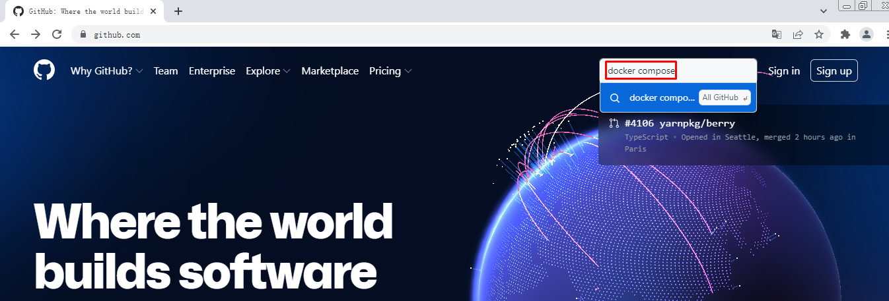
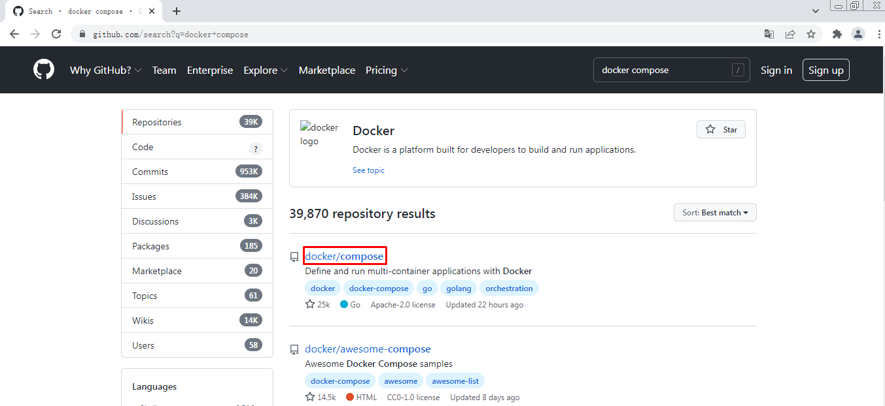
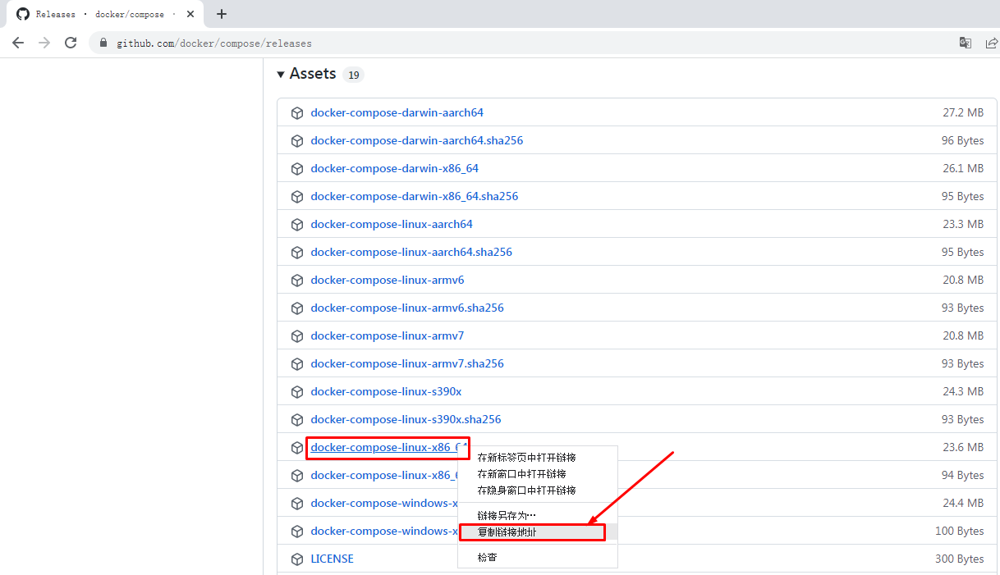
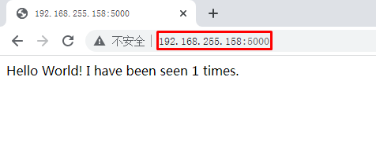

# Docker容器服务编排利器 Docker Compose应用实战

# 一、使用Docker Compose必要性及定义

用容器运行一个服务,需要使用`docker run`命令。但如果我要运行多个服务呢?

假设我要运行一个web服务,还要运行一个db服务,那么是用一个容器运行,还是用多个容器运行呢?

一个容器运行多个服务会造成镜像的复杂度提高,**docker倾向于一个容器运行一个应用**。

那么复杂的架构就会需要很多的容器,并且需要它们之间有关联(容器之间的依赖和连接)就更复杂了。

这个复杂的问题需要解决,这就涉及到了**==容器编排==**的问题了。

- Compose
  - 编排
    - 是对多个容器进行启动和管理的方法
    - 例如：LNMT，先启动MySQL,再启动Tomcat，最后启动Nginx
- 服务架构的演进
  - 单体服务架构
  - 分布式服务架构
  - 微服务架构
  - 超微服务架构
- 容器编排工具
  - docker machine
    - 在虚拟机中部署docker容器引擎的工具
  - docker compose
    - 是一个用于定义和运行多容器Docker的应用程序工具
  - docker swarm
    - 是Docker Host主机批量管理及资源调度管理工具
  - mesos+marathon
    - mesos 对计算机计算资源进行管理和调度
    - marathon 服务发现及负载均衡的功能
  - kubernetes
    - google开源的容器编排工具

# 二、Docker Compose应用参考资料

- 网址
  - https://docs.docker.com/compose/

- yaml格式
  - https://yaml.org/

# 三、Docker Compose应用最佳实践步骤

## 3.1 概念

- 工程（project）
- 服务 (Service)
- 容器 (Container)

## 3.2 步骤

1.定义应用的Dockerfile文件，为了anywhere进行构建。

2.使用docker-compose.yaml定义一套服务，这套服务可以一起在一个隔离环境中运行。

3.使用docker-compose up就可以启动整套服务。

# 四、Docker Compose安装

~~~powershell
# wget https://github.com/docker/compose/releases/download/v2.2.3/docker-compose-linux-x86_64
~~~

~~~powershell
# mv docker-compose-linux-x86_64 /usr/bin/docker-compose
~~~

~~~powershell
# chmod +x /usr/bin/docker-compose
~~~

~~~powershell
# docker-compose version
Docker Compose version v2.2.3
~~~

# 五、Docker Compose应用案例

> 运行Python语言开发的网站

## 5.1 网站文件准备

~~~powershell
# mkdir flaskproject
[root@localhost ~]# cd flaskproject/
[root@localhost flaskproject]#
~~~

~~~powershell
[root@localhost flaskproject]# vim app.py
[root@localhost flaskproject]# cat app.py
import time

import redis
from flask import Flask

app = Flask(__name__)
cache = redis.Redis(host='redis', port=6379)

def get_hit_count():
    retries = 5
    while True:
        try:
            return cache.incr('hits')
        except redis.exceptions.ConnectionError as exc:
            if retries == 0:
                raise exc
            retries -= 1
            time.sleep(0.5)

@app.route('/')
def hello():
    count = get_hit_count()
    return 'Hello World! I have been seen {} times.\n'.format(count)
~~~

~~~powershell
[root@localhost flaskproject]# vim requirements.txt
[root@localhost flaskproject]# cat requirements.txt
flask
redis
~~~

## 5.2 Dockerfile文件准备

~~~powershell
[root@localhost flaskproject]# vim Dockerfile
[root@localhost flaskproject]# cat Dockerfile
FROM python:3.7-alpine
WORKDIR /code
ENV FLASK_APP app.py
ENV FLASK_RUN_HOST 0.0.0.0
RUN apk add --no-cache gcc musl-dev linux-headers
COPY requirements.txt requirements.txt
RUN pip install -r requirements.txt
COPY . .
CMD ["flask", "run"]
~~~

## 5.3 Compose文件准备

~~~powershell
[root@localhost flaskproject]# vim docker-compose.yaml
[root@localhost flaskproject]# cat docker-compose.yaml
version: '3'
services:
  web:
    build: .
    ports:
      - "5000:5000"
  redis:
    image: "redis:alpine"
~~~

## 5.4 使用docker-compose up启动容器

~~~powershell
[root@localhost flaskproject]# ls
app.py  docker-compose.yaml  Dockerfile  requirements.txt
~~~

~~~powershell
[root@localhost flaskproject]# docker-compose up
~~~

~~~powershell
输出：
[+] Running 7/7
 ⠿ redis Pulled                                                                         15.8s
   ⠿ 59bf1c3509f3 Pull complete                                                          2.9s
   ⠿ 719adce26c52 Pull complete                                                          3.0s
   ⠿ b8f35e378c31 Pull complete                                                          5.8s
   ⠿ d034517f789c Pull complete                                                          6.5s
   ⠿ 3772d4d76753 Pull complete                                                          6.6s
   ⠿ 211a7f52febb Pull complete                                                          6.8s
Sending build context to Docker daemon     714B
Step 1/9 : FROM python:3.7-alpine
3.7-alpine: Pulling from library/python
59bf1c3509f3: Already exists
07a400e93df3: Already exists
bdabb07397e1: Already exists
cd0af01c7b70: Already exists
d0f18e022200: Already exists
Digest: sha256:5a776e3b5336827faf7a1c3a191b73b5b2eef4cdcfe8b94f59b79cb749a2b5d8
Status: Downloaded newer image for python:3.7-alpine
 ---> e72b511ad78e
Step 2/9 : WORKDIR /code
 ---> Running in 2b9d07bef719
Removing intermediate container 2b9d07bef719
 ---> 7d39e96fadf1
Step 3/9 : ENV FLASK_APP app.py
 ---> Running in 9bcb28bd632a
Removing intermediate container 9bcb28bd632a
 ---> 79f656a616d5
Step 4/9 : ENV FLASK_RUN_HOST 0.0.0.0
 ---> Running in 8470c2dbd6c2
Removing intermediate container 8470c2dbd6c2
 ---> e212ba688fcd
Step 5/9 : RUN apk add --no-cache gcc musl-dev linux-headers
 ---> Running in 6e9ca0766bc8
fetch https://dl-cdn.alpinelinux.org/alpine/v3.15/main/x86_64/APKINDEX.tar.gz
fetch https://dl-cdn.alpinelinux.org/alpine/v3.15/community/x86_64/APKINDEX.tar.gz
(1/13) Installing libgcc (10.3.1_git20211027-r0)
(2/13) Installing libstdc++ (10.3.1_git20211027-r0)
(3/13) Installing binutils (2.37-r3)
(4/13) Installing libgomp (10.3.1_git20211027-r0)
(5/13) Installing libatomic (10.3.1_git20211027-r0)
(6/13) Installing libgphobos (10.3.1_git20211027-r0)
(7/13) Installing gmp (6.2.1-r1)
(8/13) Installing isl22 (0.22-r0)
(9/13) Installing mpfr4 (4.1.0-r0)
(10/13) Installing mpc1 (1.2.1-r0)
(11/13) Installing gcc (10.3.1_git20211027-r0)
(12/13) Installing linux-headers (5.10.41-r0)
(13/13) Installing musl-dev (1.2.2-r7)
Executing busybox-1.34.1-r3.trigger
OK: 143 MiB in 49 packages
Removing intermediate container 6e9ca0766bc8
 ---> 273d4f04dfbc
Step 6/9 : COPY requirements.txt requirements.txt
 ---> daf51c54e8ba
Step 7/9 : RUN pip install -r requirements.txt
 ---> Running in 2aa2d30c5311
Collecting flask
  Downloading Flask-2.0.3-py3-none-any.whl (95 kB)
Collecting redis
  Downloading redis-4.1.3-py3-none-any.whl (173 kB)
Collecting Jinja2>=3.0
  Downloading Jinja2-3.0.3-py3-none-any.whl (133 kB)
Collecting itsdangerous>=2.0
  Downloading itsdangerous-2.0.1-py3-none-any.whl (18 kB)
Collecting click>=7.1.2
  Downloading click-8.0.3-py3-none-any.whl (97 kB)
Collecting Werkzeug>=2.0
  Downloading Werkzeug-2.0.3-py3-none-any.whl (289 kB)
Collecting deprecated>=1.2.3
  Downloading Deprecated-1.2.13-py2.py3-none-any.whl (9.6 kB)
Collecting packaging>=20.4
  Downloading packaging-21.3-py3-none-any.whl (40 kB)
Collecting importlib-metadata>=1.0
  Downloading importlib_metadata-4.11.1-py3-none-any.whl (17 kB)
Collecting wrapt<2,>=1.10
  Downloading wrapt-1.13.3-cp37-cp37m-musllinux_1_1_x86_64.whl (78 kB)
Collecting typing-extensions>=3.6.4
  Downloading typing_extensions-4.1.1-py3-none-any.whl (26 kB)
Collecting zipp>=0.5
  Downloading zipp-3.7.0-py3-none-any.whl (5.3 kB)
Collecting MarkupSafe>=2.0
  Downloading MarkupSafe-2.0.1-cp37-cp37m-musllinux_1_1_x86_64.whl (30 kB)
Collecting pyparsing!=3.0.5,>=2.0.2
  Downloading pyparsing-3.0.7-py3-none-any.whl (98 kB)
Installing collected packages: zipp, typing-extensions, wrapt, pyparsing, MarkupSafe, importlib-metadata, Werkzeug, packaging, Jinja2, itsdangerous, deprecated, click, redis, flask
Successfully installed Jinja2-3.0.3 MarkupSafe-2.0.1 Werkzeug-2.0.3 click-8.0.3 deprecated-1.2.13 flask-2.0.3 importlib-metadata-4.11.1 itsdangerous-2.0.1 packaging-21.3 pyparsing-3.0.7 redis-4.1.3 typing-extensions-4.1.1 wrapt-1.13.3 zipp-3.7.0
WARNING: Running pip as the 'root' user can result in broken permissions and conflicting behaviour with the system package manager. It is recommended to use a virtual environment instead: https://pip.pypa.io/warnings/venv
WARNING: You are using pip version 21.2.4; however, version 22.0.3 is available.
You should consider upgrading via the '/usr/local/bin/python -m pip install --upgrade pip' command.
Removing intermediate container 2aa2d30c5311
 ---> dd8f52b132f8
Step 8/9 : COPY . .
 ---> b36938a26cf5
Step 9/9 : CMD ["flask", "run"]
 ---> Running in 260cbfa02959
Removing intermediate container 260cbfa02959
 ---> fa04dfec6ff2
Successfully built fa04dfec6ff2
Successfully tagged flaskproject_web:latest

Use 'docker scan' to run Snyk tests against images to find vulnerabilities and learn how to fix them
[+] Running 3/3
 ⠿ Network flaskproject_default    Created                                               0.1s
 ⠿ Container flaskproject-redis-1  Created                                               0.1s
 ⠿ Container flaskproject-web-1    Created                                               0.1s
Attaching to flaskproject-redis-1, flaskproject-web-1
flaskproject-redis-1  | 1:C 15 Feb 2022 14:14:21.696 # oO0OoO0OoO0Oo Redis is starting oO0OoO0OoO0Oo
flaskproject-redis-1  | 1:C 15 Feb 2022 14:14:21.696 # Redis version=6.2.6, bits=64, commit=00000000, modified=0, pid=1, just started
flaskproject-redis-1  | 1:C 15 Feb 2022 14:14:21.696 # Warning: no config file specified, using the default config. In order to specify a config file use redis-server /path/to/redis.conf
flaskproject-redis-1  | 1:M 15 Feb 2022 14:14:21.697 * monotonic clock: POSIX clock_gettime
flaskproject-redis-1  | 1:M 15 Feb 2022 14:14:21.698 * Running mode=standalone, port=6379.
flaskproject-redis-1  | 1:M 15 Feb 2022 14:14:21.698 # WARNING: The TCP backlog setting of 511 cannot be enforced because /proc/sys/net/core/somaxconn is set to the lower value of 128.
flaskproject-redis-1  | 1:M 15 Feb 2022 14:14:21.698 # Server initialized
flaskproject-redis-1  | 1:M 15 Feb 2022 14:14:21.698 # WARNING overcommit_memory is set to 0! Background save may fail under low memory condition. To fix this issue add 'vm.overcommit_memory = 1' to /etc/sysctl.conf and then reboot or run the command 'sysctl vm.overcommit_memory=1' for this to take effect.
flaskproject-redis-1  | 1:M 15 Feb 2022 14:14:21.698 * Ready to accept connections
flaskproject-web-1    |  * Serving Flask app 'app.py' (lazy loading)
flaskproject-web-1    |  * Environment: production
flaskproject-web-1    |    WARNING: This is a development server. Do not use it in a production deployment.
flaskproject-web-1    |    Use a production WSGI server instead.
flaskproject-web-1    |  * Debug mode: off
flaskproject-web-1    |  * Running on all addresses.
flaskproject-web-1    |    WARNING: This is a development server. Do not use it in a production deployment.
flaskproject-web-1    |  * Running on http://172.18.0.2:5000/ (Press CTRL+C to quit)
~~~

## 5.5 访问

