# 轻量级或工业级容器管理工具 Containerd

# 一、Containerd介绍

## 1.0 前言

- 早在2016年3月，Docker 1.11的Docker Engine里就包含了containerd，而现在则是把containerd从Docker Engine里彻底剥离出来，作为一个独立的开源项目独立发展，目标是提供一个更加开放、稳定的容器运行基础设施。和原先包含在Docker Engine里containerd相比，独立的containerd将具有更多的功能，可以涵盖整个容器运行时管理的所有需求。

- containerd并不是直接面向最终用户的，而是主要用于集成到更上层的系统里，比如Swarm, Kubernetes, Mesos等容器编排系统。
- containerd以Daemon的形式运行在系统上，通过暴露底层的gRPC API，上层系统可以通过这些API管理机器上的容器。
- 每个containerd只负责一台机器，Pull镜像，对容器的操作（启动、停止等），网络，存储都是由containerd完成。具体运行容器由runC负责，实际上只要是符合OCI规范的容器都可以支持。
- 对于容器编排服务来说，运行时只需要使用containerd+runC，更加轻量，容易管理。
- 独立之后containerd的特性演进可以和Docker Engine分开，专注容器运行时管理，可以更稳定。

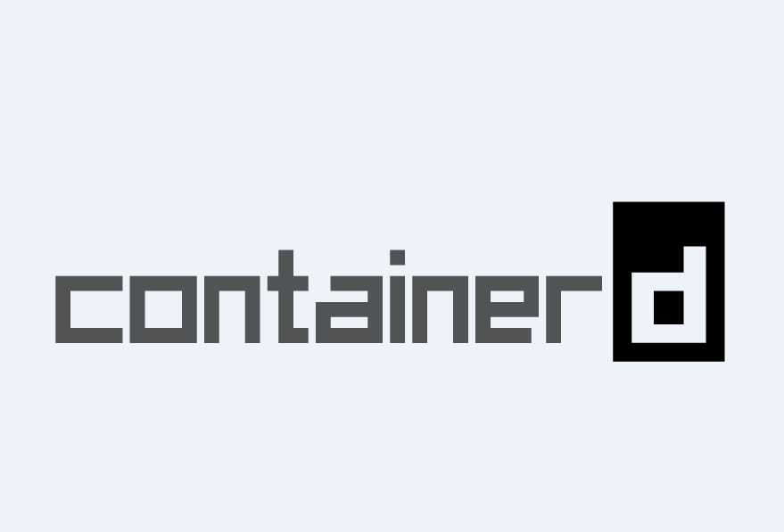

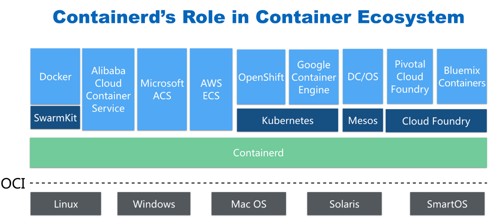

## 1.1 Containerd前世今生

2013年docker公司在推出docker产品后,由于其对全球技术产生了一定的影响力，Google公司明显感觉到自己公司内部所使用的Brog系统江湖地位受到的威胁，希望Docker公司能够与自己联合打造一款开源的容器运行时作为Docker核心依赖，但Docker公司拒绝了；接着Google公司联合RedHat、IBM等公司说服Docker公司把其容器核心技术libcontainer捐给中立社区(OCI,Open Container Intiative)，并更名为runC。
为了进一步遏制Docker在未来技术市场影响力，避免在容器市场上Docker一家独大，Google公司带领导RedHat、IBM等成立了CNCF(Cloud Native Computing Fundation)基金会，即云原生计算基金会。CNCF的目标很明确，既然在容器应用领域无法与Docker相抗衡，那就做Google更有经验的技术市场------大规模容器编排应用场景，Google公司把自己内部使用的Brog系统开源------Kubernetes，也就是我们今天所说的云原生技术生态。

2016年Docker公司推出了Docker Swarm，意在一统Docker生态，让Docker既可以实现容器应用管理，也可以实现大规模容器编排，经过近1年左右时间的市场验证后，发现在容器编排方面无法独立抗衡kubernetes,所以Docker公司于2017年正式宣布原生支持Kubernetes,至此，Docker在大规模容器编排应用市场败下阵来，但是Docker依然不甘心失败，把Docker核心依赖Containerd捐给了CNCF，依此说明Docker依旧是一个PaaS平台。

2020年CNCF基金会宣布Kubernetes 1.20版本将不再仅支持Docker容器管理工具，此事的起因主要也与Docker捐给CNCF基金会的Containerd有关，早期为了实现Kubernetes能够使用Docker实现容器管理，专门在Kubernetes组件中集成一个shim（垫片）技术，用来将Kubernetes容器运行时接口（CRI，Container Runntime Interface）调用翻译成Docker的API,这样就可以很好地使用Docker了，但是随着Kubernetes在全球技术市场的广泛应用，有更多的容器管理工具的出现，它们都想能够借助于Kubernetes被用户所使用，所以就提出标准化容器运行时接口，只要适配了这个接口就可以集成到Kubernetes生态当中，所以Kubernetes取消了对shim的维护，并且由于Containerd技术的成功，可以实现无缝对接Kubernetes，所以接下来Kubernetes容器运行时的主角是Containerd。

## 1.2 Containerd架构

### 1.2.1 架构图

Containerd设计的目的是为了嵌入到Kubernetes中使用，它是一个工业级的容器运行时，不提供给开发人员和终端用户直接使用，这样就避免了与Docker产生竞争，但事实上，Containerd已经实现大多数容器管理功能，例如：容器生命周期管理、容器镜像传输和管理、容器存储与网络管理等。

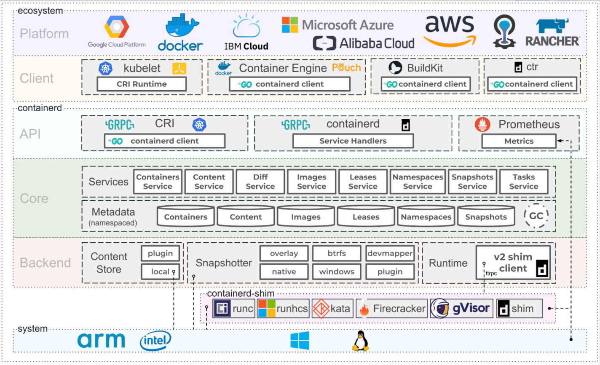

- Containerd 采用标准的 C/S 架构
  - 服务端通过 GRPC 协议提供稳定的 API
  - 客户端通过调用服务端的 API 进行高级的操作

- 
  为了实现解耦，Containerd 将不同的职责划分给不同的组件，每个组件就相当于一个子系统（subsystem）。连接不同子系统的组件被称为模块。

- Containerd 两大子系统为：

  - Bundle : 在 Containerd 中，Bundle 包含了配置、元数据和根文件系统数据，你可以理解为容器的文件系统。而 Bundle 子系统允许用户从镜像中提取和打包 Bundles。
  - Runtime : Runtime 子系统用来执行 Bundles，比如创建容器。

  其中，每一个子系统的行为都由一个或多个模块协作完成（架构图中的 Core 部分）。每一种类型的模块都以插件的形式集成到 Containerd 中，而且插件之间是相互依赖的。

  例如，上图中的每一个长虚线的方框都表示一种类型的插件，包括 Service Plugin、Metadata Plugin、GC Plugin、Runtime Plugin 等，其中 Service Plugin 又会依赖 Metadata Plugin、GC Plugin 和 Runtime Plugin。每一个小方框都表示一个细分的插件，例如 Metadata Plugin 依赖 Containers Plugin、Content Plugin 等。 

### 1.2.2 常用插件

- **Content Plugin** : 提供对镜像中可寻址内容的访问，所有不可变的内容都被存储在这里。
- **Snapshot Plugin** : 用来管理容器镜像的文件系统快照。镜像中的每一个 layer 都会被解压成文件系统快照，类似于 Docker 中的 `graphdriver`。
- **Metrics** : 暴露各个组件的监控指标。

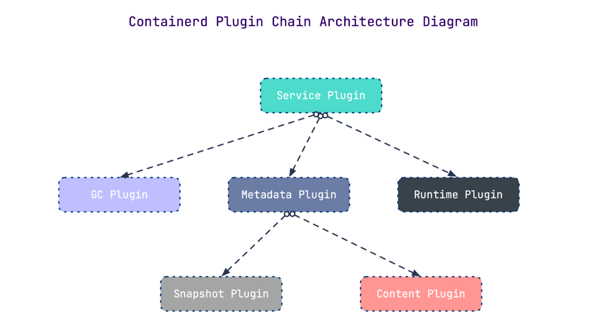

### 1.2.3 架构缩略图

Containerd 被分为三个大块：`Storage`、`Metadata` 和 `Runtime`

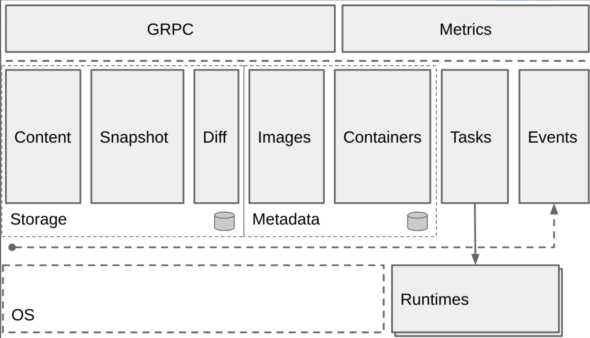

### 1.2.4 与其它容器运行时工具性能对比

这是使用 bucketbench 对 Docker、crio 和 Containerd 的性能测试结果，包括启动、停止和删除容器，以比较它们所耗的时间：

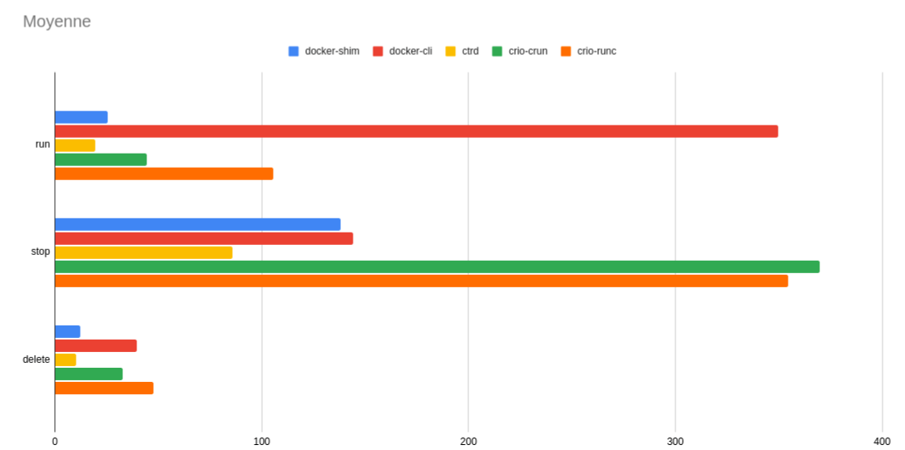

结论： Containerd 在各个方面都表现良好，总体性能优于 `Docker` 和 `crio` 。

# 二、Containerd安装

> 课程操作系统环境为centos7u6

## 2.1 YUM方式安装

### 2.1.1 获取YUM源

~~~powershell
获取阿里云YUM源
# wget -O /etc/yum.repos.d/docker-ce.repo https://mirrors.aliyun.com/docker-ce/linux/centos/docker-ce.repo
~~~

~~~powershell
查看YUM源中Containerd软件
# yum list | grep containerd
containerd.io.x86_64                        1.4.12-3.1.el7             docker-ce-stable
~~~

### 2.1.2 使用yum命令安装

~~~powershell
安装Containerd.io软件，即可安装Containerd
# yum -y install containerd.io
~~~

### 2.1.3 验证安装及启动服务

~~~powershell
使用rpm -qa命令查看是否安装
# rpm -qa | grep containerd
containerd.io-1.4.12-3.1.el7.x86_64
~~~

~~~powershell
设置containerd服务启动及开机自启动
# systemctl enable containerd
# systemctl start containerd
~~~

~~~powershell
查看containerd服务启动状态
# systemctl status containerd
● containerd.service - containerd container runtime
   Loaded: loaded (/usr/lib/systemd/system/containerd.service; enabled; vendor preset: disabled)
   Active: active (running) since 五 2022-02-18 11:38:30 CST; 9s ago 此行第二列及第三列表示其正在运行状态
     Docs: https://containerd.io
  Process: 59437 ExecStartPre=/sbin/modprobe overlay (code=exited, status=0/SUCCESS)
 Main PID: 59439 (containerd)
    Tasks: 7
   Memory: 19.5M
   CGroup: /system.slice/containerd.service
           └─59439 /usr/bin/containerd
           ......
~~~

### 2.1.4 验证可用性

~~~powershell
安装Containerd时ctr命令亦可使用，ctr命令主要用于管理容器及容器镜像等。
使用ctr命令查看Containerd客户端及服务端相关信息。
# ctr version
Client:
  Version:  1.4.12
  Revision: 7b11cfaabd73bb80907dd23182b9347b4245eb5d
  Go version: go1.16.10

Server:
  Version:  1.4.12
  Revision: 7b11cfaabd73bb80907dd23182b9347b4245eb5d
  UUID: 3c4b142d-d91d-44a5-aae2-9673785d4b2c
~~~

## 2.2 二进制方式安装

Containerd有两种安装包：

* 第一种是`containerd-xxx`,这种包用于单机测试没问题，不包含runC，需要提前安装。
* 第二种是`cri-containerd-cni-xxxx`，包含runc和k8s里的所需要的相关文件。k8s集群里需要用到此包。虽然包含runC，但是依赖系统中的seccomp（安全计算模式，是一种限制容器调用系统资源的模式。）

### 2.2.1 获取安装包

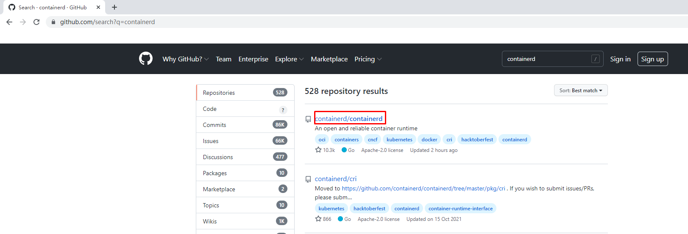

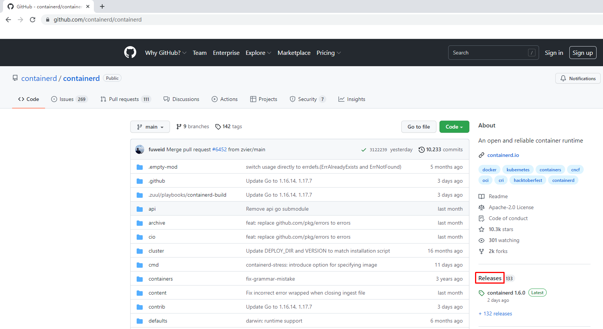

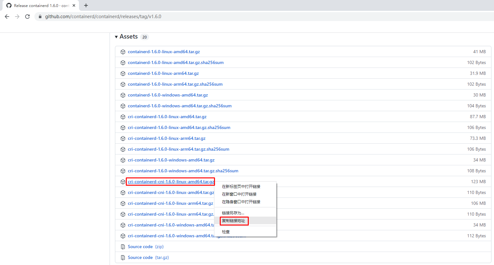

~~~powershell
下载Containerd安装包
# wget https://github.com/containerd/containerd/releases/download/v1.6.0/cri-containerd-cni-1.6.0-linux-amd64.tar.gz
~~~

### 2.2.2  安装并测试可用性

#### 2.2.2.1 安装containerd

~~~powershell
查看已获取的安装包
# ls
cri-containerd-cni-1.6.0-linux-amd64.tar.gz
~~~

~~~powershell
解压已下载的软件包
# tar xf cri-containerd-cni-1.6.0-linux-amd64.tar.gz
~~~

~~~powershell
查看解压后目录
# ls
etc opt  usr 
~~~

~~~powershell
查看etc目录，主要为containerd服务管理配置文件及cni虚拟网卡配置文件
# ls etc
cni  crictl.yaml  systemd
# ls etc/systemd/
system
# ls etc/systemd/system/
containerd.service

查看opt目录，主要为gce环境中使用containerd配置文件及cni插件
# ls opt
cni  containerd
# ls opt/containerd/
cluster
# ls opt/containerd/cluster/
gce  version
# ls opt/containerd/cluster/gce
cloud-init  cni.template  configure.sh  env

查看usr目录，主要为containerd运行时文件，包含runc
# ls usr
local
# ls usr/local/
bin  sbin
# ls usr/local/bin
containerd  containerd-shim  containerd-shim-runc-v1  containerd-shim-runc-v2  containerd-stress  crictl  critest  ctd-decoder  ctr
# ls usr/local/sbin
runc
~~~

#### 2.2.2.2 查看containerd安装位置 

~~~powershell
查看containerd.service文件，了解containerd文件安装位置
# cat etc/systemd/system/containerd.service

# Copyright The containerd Authors.
#
# Licensed under the Apache License, Version 2.0 (the "License");
# you may not use this file except in compliance with the License.
# You may obtain a copy of the License at
#
#     http://www.apache.org/licenses/LICENSE-2.0
#
# Unless required by applicable law or agreed to in writing, software
# distributed under the License is distributed on an "AS IS" BASIS,
# WITHOUT WARRANTIES OR CONDITIONS OF ANY KIND, either express or implied.
# See the License for the specific language governing permissions and
# limitations under the License.

[Unit]
Description=containerd container runtime
Documentation=https://containerd.io
After=network.target local-fs.target

[Service]
ExecStartPre=-/sbin/modprobe overlay
ExecStart=/usr/local/bin/containerd 查看此位置,把containerd二进制文件放置于此处即可完成安装。

Type=notify
Delegate=yes
KillMode=process
Restart=always
RestartSec=5
# Having non-zero Limit*s causes performance problems due to accounting overhead
# in the kernel. We recommend using cgroups to do container-local accounting.
LimitNPROC=infinity
LimitCORE=infinity
LimitNOFILE=infinity
# Comment TasksMax if your systemd version does not supports it.
# Only systemd 226 and above support this version.
TasksMax=infinity
OOMScoreAdjust=-999

[Install]
WantedBy=multi-user.target
~~~

#### 2.2.2.3 复制containerd运行时文件至系统

~~~powershell
查看宿主机/usr/local/bin目录，里面没有任何内容。
# ls /usr/local/bin/

查看解压后usr/local/bin目录，里面包含containerd运行时文件
# ls usr/
local
# ls usr/local/
bin  sbin
# ls usr/local/bin/
containerd  containerd-shim  containerd-shim-runc-v1  containerd-shim-runc-v2  containerd-stress  crictl  critest  ctd-decoder  ctr

复制containerd文件至/usr/local/bin目录中，本次可仅复制containerd一个文件也可复制全部文件。
# cp usr/local/bin/containerd /usr/local/bin/
# ls /usr/local/bin/
containerd
~~~

#### 2.2.2.4 添加containerd.service文件至系统

~~~powershell
查看解压后的etc/system目录
# ls etc
cni  crictl.yaml  systemd

# ls etc/systemd/
system

# ls etc/systemd/system/
containerd.service

复制containerd服务管理配置文件至/usr/lib/systemd/system/目录中
# cp etc/systemd/system/containerd.service /usr/lib/systemd/system/containerd.service

查看复制后结果
# ls /usr/lib/systemd/system/containerd.service
/usr/lib/systemd/system/containerd.service
~~~

#### 2.2.2.5 查看containerd使用帮助

~~~powershell
# containerd --help
NAME:
   containerd -
                    __        _                     __
  _________  ____  / /_____ _(_)___  ___  _________/ /
 / ___/ __ \/ __ \/ __/ __ `/ / __ \/ _ \/ ___/ __  /
/ /__/ /_/ / / / / /_/ /_/ / / / / /  __/ /  / /_/ /
\___/\____/_/ /_/\__/\__,_/_/_/ /_/\___/_/   \__,_/

high performance container runtime

USAGE:
   containerd [global options] command [command options] [arguments...]

VERSION:
   v1.6.0

DESCRIPTION:

containerd is a high performance container runtime whose daemon can be started
by using this command. If none of the *config*, *publish*, or *help* commands
are specified, the default action of the **containerd** command is to start the
containerd daemon in the foreground.

A default configuration is used if no TOML configuration is specified or located
at the default file location. The *containerd config* command can be used to
generate the default configuration for containerd. The output of that command
can be used and modified as necessary as a custom configuration.

COMMANDS:
   config    information on the containerd config
   publish   binary to publish events to containerd
   oci-hook  provides a base for OCI runtime hooks to allow arguments to be injected.
   help, h   Shows a list of commands or help for one command

GLOBAL OPTIONS:
   --config value, -c value     path to the configuration file (default: "/etc/containerd/config.toml")
   --log-level value, -l value  set the logging level [trace, debug, info, warn, error, fatal, panic]
   --address value, -a value    address for containerd's GRPC server
   --root value                 containerd root directory
   --state value                containerd state directory
   --help, -h                   show help
   --version, -v                print the version
~~~

#### 2.2.2.6 生成containerd模块配置文件

##### 2.2.2.6.1 生成默认模块配置文件

Containerd 的默认配置文件为 `/etc/containerd/config.toml`，可以使用`containerd config default > /etc/containerd/config.toml`命令创建一份模块配置文件

~~~powershell
创建配置文件目录
# mkdir /etc/containerd
~~~

~~~powershell
生成配置文件
# containerd config default > /etc/containerd/config.toml
~~~

~~~powershell
查看配置文件
# cat /etc/containerd/config.toml
disabled_plugins = []
imports = []
oom_score = 0
plugin_dir = ""
required_plugins = []
root = "/var/lib/containerd"
state = "/run/containerd"
temp = ""
version = 2

[cgroup]
  path = ""

[debug]
  address = ""
  format = ""
  gid = 0
  level = ""
  uid = 0

[grpc]
  address = "/run/containerd/containerd.sock"
  gid = 0
  max_recv_message_size = 16777216
  max_send_message_size = 16777216
  tcp_address = ""
  tcp_tls_ca = ""
  tcp_tls_cert = ""
  tcp_tls_key = ""
  uid = 0

[metrics]
  address = ""
  grpc_histogram = false

[plugins]

  [plugins."io.containerd.gc.v1.scheduler"]
    deletion_threshold = 0
    mutation_threshold = 100
    pause_threshold = 0.02
    schedule_delay = "0s"
    startup_delay = "100ms"

  [plugins."io.containerd.grpc.v1.cri"]
    device_ownership_from_security_context = false
    disable_apparmor = false
    disable_cgroup = false
    disable_hugetlb_controller = true
    disable_proc_mount = false
    disable_tcp_service = true
    enable_selinux = false
    enable_tls_streaming = false
    enable_unprivileged_icmp = false
    enable_unprivileged_ports = false
    ignore_image_defined_volumes = false
    max_concurrent_downloads = 3
    max_container_log_line_size = 16384
    netns_mounts_under_state_dir = false
    restrict_oom_score_adj = false
    sandbox_image = "k8s.gcr.io/pause:3.6"  由于网络原因，此处被替换
    selinux_category_range = 1024
    stats_collect_period = 10
    stream_idle_timeout = "4h0m0s"
    stream_server_address = "127.0.0.1"
    stream_server_port = "0"
    systemd_cgroup = false
    tolerate_missing_hugetlb_controller = true
    unset_seccomp_profile = ""

    [plugins."io.containerd.grpc.v1.cri".cni]
      bin_dir = "/opt/cni/bin"
      conf_dir = "/etc/cni/net.d"
      conf_template = ""
      ip_pref = ""
      max_conf_num = 1

    [plugins."io.containerd.grpc.v1.cri".containerd]
      default_runtime_name = "runc"
      disable_snapshot_annotations = true
      discard_unpacked_layers = false
      ignore_rdt_not_enabled_errors = false
      no_pivot = false
      snapshotter = "overlayfs"

      [plugins."io.containerd.grpc.v1.cri".containerd.default_runtime]
        base_runtime_spec = ""
        cni_conf_dir = ""
        cni_max_conf_num = 0
        container_annotations = []
        pod_annotations = []
        privileged_without_host_devices = false
        runtime_engine = ""
        runtime_path = ""
        runtime_root = ""
        runtime_type = ""

        [plugins."io.containerd.grpc.v1.cri".containerd.default_runtime.options]

      [plugins."io.containerd.grpc.v1.cri".containerd.runtimes]

        [plugins."io.containerd.grpc.v1.cri".containerd.runtimes.runc]
          base_runtime_spec = ""
          cni_conf_dir = ""
          cni_max_conf_num = 0
          container_annotations = []
          pod_annotations = []
          privileged_without_host_devices = false
          runtime_engine = ""
          runtime_path = ""
          runtime_root = ""
          runtime_type = "io.containerd.runc.v2"

          [plugins."io.containerd.grpc.v1.cri".containerd.runtimes.runc.options]
            BinaryName = ""
            CriuImagePath = ""
            CriuPath = ""
            CriuWorkPath = ""
            IoGid = 0
            IoUid = 0
            NoNewKeyring = false
            NoPivotRoot = false
            Root = ""
            ShimCgroup = ""
            SystemdCgroup = false

      [plugins."io.containerd.grpc.v1.cri".containerd.untrusted_workload_runtime]
        base_runtime_spec = ""
        cni_conf_dir = ""
        cni_max_conf_num = 0
        container_annotations = []
        pod_annotations = []
        privileged_without_host_devices = false
        runtime_engine = ""
        runtime_path = ""
        runtime_root = ""
        runtime_type = ""

        [plugins."io.containerd.grpc.v1.cri".containerd.untrusted_workload_runtime.options]

    [plugins."io.containerd.grpc.v1.cri".image_decryption]
      key_model = "node"

    [plugins."io.containerd.grpc.v1.cri".registry]
      config_path = ""

      [plugins."io.containerd.grpc.v1.cri".registry.auths]

      [plugins."io.containerd.grpc.v1.cri".registry.configs]

      [plugins."io.containerd.grpc.v1.cri".registry.headers]

      [plugins."io.containerd.grpc.v1.cri".registry.mirrors]

    [plugins."io.containerd.grpc.v1.cri".x509_key_pair_streaming]
      tls_cert_file = ""
      tls_key_file = ""

  [plugins."io.containerd.internal.v1.opt"]
    path = "/opt/containerd"

  [plugins."io.containerd.internal.v1.restart"]
    interval = "10s"

  [plugins."io.containerd.internal.v1.tracing"]
    sampling_ratio = 1.0
    service_name = "containerd"

  [plugins."io.containerd.metadata.v1.bolt"]
    content_sharing_policy = "shared"

  [plugins."io.containerd.monitor.v1.cgroups"]
    no_prometheus = false

  [plugins."io.containerd.runtime.v1.linux"]
    no_shim = false
    runtime = "runc"
    runtime_root = ""
    shim = "containerd-shim"
    shim_debug = false

  [plugins."io.containerd.runtime.v2.task"]
    platforms = ["linux/amd64"]
    sched_core = false

  [plugins."io.containerd.service.v1.diff-service"]
    default = ["walking"]

  [plugins."io.containerd.service.v1.tasks-service"]
    rdt_config_file = ""

  [plugins."io.containerd.snapshotter.v1.aufs"]
    root_path = ""

  [plugins."io.containerd.snapshotter.v1.btrfs"]
    root_path = ""

  [plugins."io.containerd.snapshotter.v1.devmapper"]
    async_remove = false
    base_image_size = ""
    discard_blocks = false
    fs_options = ""
    fs_type = ""
    pool_name = ""
    root_path = ""

  [plugins."io.containerd.snapshotter.v1.native"]
    root_path = ""

  [plugins."io.containerd.snapshotter.v1.overlayfs"]
    root_path = ""
    upperdir_label = false

  [plugins."io.containerd.snapshotter.v1.zfs"]
    root_path = ""

  [plugins."io.containerd.tracing.processor.v1.otlp"]
    endpoint = ""
    insecure = false
    protocol = ""

[proxy_plugins]

[stream_processors]

  [stream_processors."io.containerd.ocicrypt.decoder.v1.tar"]
    accepts = ["application/vnd.oci.image.layer.v1.tar+encrypted"]
    args = ["--decryption-keys-path", "/etc/containerd/ocicrypt/keys"]
    env = ["OCICRYPT_KEYPROVIDER_CONFIG=/etc/containerd/ocicrypt/ocicrypt_keyprovider.conf"]
    path = "ctd-decoder"
    returns = "application/vnd.oci.image.layer.v1.tar"

  [stream_processors."io.containerd.ocicrypt.decoder.v1.tar.gzip"]
    accepts = ["application/vnd.oci.image.layer.v1.tar+gzip+encrypted"]
    args = ["--decryption-keys-path", "/etc/containerd/ocicrypt/keys"]
    env = ["OCICRYPT_KEYPROVIDER_CONFIG=/etc/containerd/ocicrypt/ocicrypt_keyprovider.conf"]
    path = "ctd-decoder"
    returns = "application/vnd.oci.image.layer.v1.tar+gzip"

[timeouts]
  "io.containerd.timeout.bolt.open" = "0s"
  "io.containerd.timeout.shim.cleanup" = "5s"
  "io.containerd.timeout.shim.load" = "5s"
  "io.containerd.timeout.shim.shutdown" = "3s"
  "io.containerd.timeout.task.state" = "2s"

[ttrpc]
  address = ""
  gid = 0
  uid = 0
~~~

##### 2.2.2.6.2 替换默认配置文件

但上述配置文件后期改动的地方较多，这里直接换成可单机使用也可k8s环境使用的配置文件并配置好镜像加速器。

~~~powershell
# vim /etc/containerd/config.toml

# cat /etc/containerd/config.toml
root = "/var/lib/containerd"
state = "/run/containerd"
oom_score = -999

[grpc]
  address = "/run/containerd/containerd.sock"
  uid = 0
  gid = 0
  max_recv_message_size = 16777216
  max_send_message_size = 16777216

[debug]
  address = ""
  uid = 0
  gid = 0
  level = ""

[metrics]
  address = ""
  grpc_histogram = false

[cgroup]
  path = ""

[plugins]
  [plugins.cgroups]
    no_prometheus = false
  [plugins.cri]
    stream_server_address = "127.0.0.1"
    stream_server_port = "0"
    enable_selinux = false
    sandbox_image = "easzlab/pause-amd64:3.2"
    stats_collect_period = 10
    systemd_cgroup = false
    enable_tls_streaming = false
    max_container_log_line_size = 16384
    [plugins.cri.containerd]
      snapshotter = "overlayfs"
      no_pivot = false
      [plugins.cri.containerd.default_runtime]
        runtime_type = "io.containerd.runtime.v1.linux"
        runtime_engine = ""
        runtime_root = ""
      [plugins.cri.containerd.untrusted_workload_runtime]
        runtime_type = ""
        runtime_engine = ""
        runtime_root = ""
    [plugins.cri.cni]
      bin_dir = "/opt/kube/bin"
      conf_dir = "/etc/cni/net.d"
      conf_template = "/etc/cni/net.d/10-default.conf"
    [plugins.cri.registry]
      [plugins.cri.registry.mirrors]
        [plugins.cri.registry.mirrors."docker.io"]
          endpoint = [
            "https://docker.mirrors.ustc.edu.cn",
            "http://hub-mirror.c.163.com"
          ]
        [plugins.cri.registry.mirrors."gcr.io"]
          endpoint = [
            "https://gcr.mirrors.ustc.edu.cn"
          ]
        [plugins.cri.registry.mirrors."k8s.gcr.io"]
          endpoint = [
            "https://gcr.mirrors.ustc.edu.cn/google-containers/"
          ]
        [plugins.cri.registry.mirrors."quay.io"]
          endpoint = [
            "https://quay.mirrors.ustc.edu.cn"
          ]
        [plugins.cri.registry.mirrors."harbor.kubemsb.com"] 此处添加了本地容器镜像仓库 Harbor,做为本地容器镜像仓库。
          endpoint = [
            "http://harbor.kubemsb.com"
          ]
    [plugins.cri.x509_key_pair_streaming]
      tls_cert_file = ""
      tls_key_file = ""
  [plugins.diff-service]
    default = ["walking"]
  [plugins.linux]
    shim = "containerd-shim"
    runtime = "runc"
    runtime_root = ""
    no_shim = false
    shim_debug = false
  [plugins.opt]
    path = "/opt/containerd"
  [plugins.restart]
    interval = "10s"
  [plugins.scheduler]
    pause_threshold = 0.02
    deletion_threshold = 0
    mutation_threshold = 100
    schedule_delay = "0s"
    startup_delay = "100ms"
~~~

#### 2.2.2.7 启动containerd服务并设置开机自启动

~~~powershell
# systemctl enable containerd
Created symlink from /etc/systemd/system/multi-user.target.wants/containerd.service to /usr/lib/systemd/system/containerd.service.
# systemctl start containerd
~~~

~~~powershell
# systemctl status containerd
● containerd.service - containerd container runtime
   Loaded: loaded (/usr/lib/systemd/system/containerd.service; enabled; vendor preset: disabled)
   Active: active (running) since 五 2022-02-18 13:02:37 CST; 7s ago
     Docs: https://containerd.io
  Process: 60383 ExecStartPre=/sbin/modprobe overlay (code=exited, status=0/SUCCESS)
 Main PID: 60384 (containerd)
    Tasks: 8
   Memory: 20.0M
   CGroup: /system.slice/containerd.service
           └─60384 /usr/local/bin/containerd
           ......
~~~

#### 2.2.2.8 复制ctr命令至系统

~~~powershell
# ls usr/local/bin/
containerd  containerd-shim  containerd-shim-runc-v1  containerd-shim-runc-v2  containerd-stress  crictl  critest  ctd-decoder  ctr
# cp usr/local/bin/ctr /usr/bin/
~~~

#### 2.2.2.9 查看已安装containerd服务版本

~~~powershell
# ctr version
Client:
  Version:  v1.6.0
  Revision: 39259a8f35919a0d02c9ecc2871ddd6ccf6a7c6e
  Go version: go1.17.2

Server:
  Version:  v1.6.0
  Revision: 39259a8f35919a0d02c9ecc2871ddd6ccf6a7c6e
  UUID: c1972cbe-884a-41b0-867f-f8a58c168e6d
~~~

#### 2.2.2.10 安装runC

> 由于二进制包中提供的runC默认需要系统中安装seccomp支持，需要单独安装，且不同版本runC对seccomp版本要求一致，所以建议单独下载runC 二进制包进行安装，里面包含了seccomp模块支持。

##### 2.2.2.10.1 获取runC

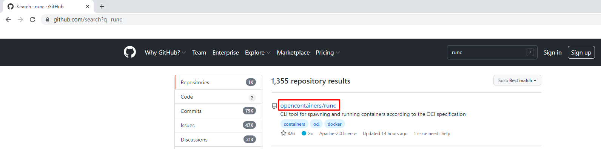

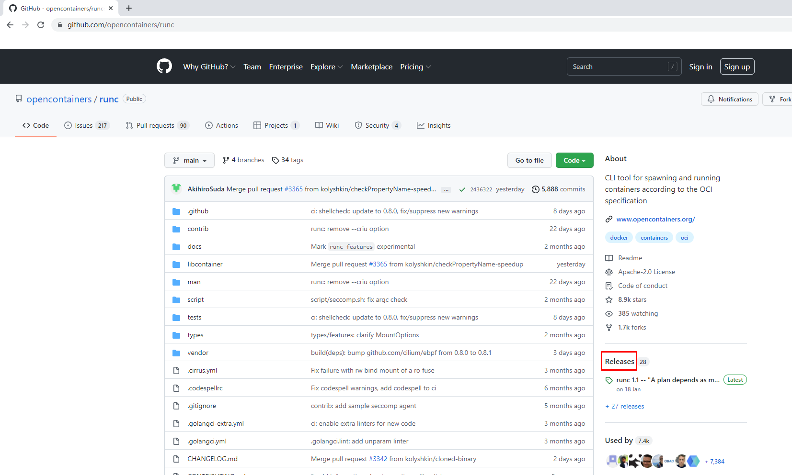

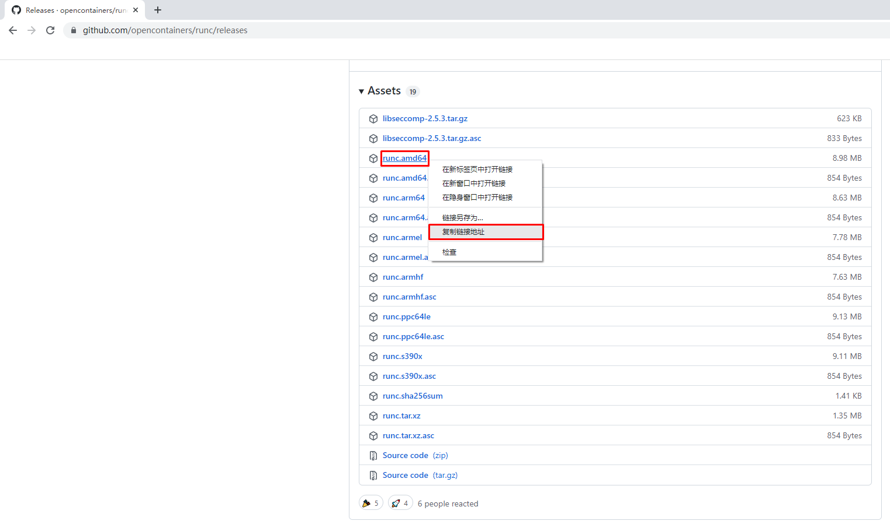

~~~powershell
使用wget下载
# wget https://github.com/opencontainers/runc/releases/download/v1.1.0/runc.amd64
~~~

##### 2.2.2.10.2 安装runC并验证安装结果

~~~powershell
查看已下载文件 
# ls
runc.amd64
~~~

~~~powershell
安装runC
# mv runc.amd64 /usr/sbin/runc
~~~

~~~powershell
为runC添加可执行权限
# chmod +x /usr/sbin/runc
~~~

~~~powershell
使用runc命令验证是否安装成功
# runc -v
runc version 1.1.0
commit: v1.1.0-0-g067aaf85
spec: 1.0.2-dev
go: go1.17.6
libseccomp: 2.5.3
~~~

# 三、Containerd容器镜像管理

## 3.1 Containerd容器镜像管理命令

* docker使用docker images命令管理镜像
* 单机containerd使用ctr images命令管理镜像,containerd本身的CLI
* k8s中containerd使用crictl images命令管理镜像,Kubernetes社区的专用CLI工具

~~~powershell
获取命令帮助
# ctr --help
NAME:
   ctr -
        __
  _____/ /______
 / ___/ __/ ___/
/ /__/ /_/ /
\___/\__/_/

containerd CLI

USAGE:
   ctr [global options] command [command options] [arguments...]

VERSION:
   v1.6.0

DESCRIPTION:

ctr is an unsupported debug and administrative client for interacting
with the containerd daemon. Because it is unsupported, the commands,
options, and operations are not guaranteed to be backward compatible or
stable from release to release of the containerd project.

COMMANDS:
   plugins, plugin            provides information about containerd plugins
   version                    print the client and server versions
   containers, c, container   manage containers
   content                    manage content
   events, event              display containerd events
   images, image, i           manage images
   leases                     manage leases
   namespaces, namespace, ns  manage namespaces
   pprof                      provide golang pprof outputs for containerd
   run                        run a container
   snapshots, snapshot        manage snapshots
   tasks, t, task             manage tasks
   install                    install a new package
   oci                        OCI tools
   shim                       interact with a shim directly
   help, h                    Shows a list of commands or help for one command

GLOBAL OPTIONS:
   --debug                      enable debug output in logs
   --address value, -a value    address for containerd's GRPC server (default: "/run/containerd/containerd.sock") [$CONTAINERD_ADDRESS]
   --timeout value              total timeout for ctr commands (default: 0s)
   --connect-timeout value      timeout for connecting to containerd (default: 0s)
   --namespace value, -n value  namespace to use with commands (default: "default") [$CONTAINERD_NAMESPACE]
   --help, -h                   show help
   --version, -v                print the version
~~~

~~~powershell
获取命令帮助
# ctr images
NAME:
   ctr images - manage images

USAGE:
   ctr images command [command options] [arguments...]

COMMANDS:
   check                    check existing images to ensure all content is available locally
   export                   export images
   import                   import images
   list, ls                 list images known to containerd
   mount                    mount an image to a target path
   unmount                  unmount the image from the target
   pull                     pull an image from a remote
   push                     push an image to a remote
   delete, del, remove, rm  remove one or more images by reference
   tag                      tag an image
   label                    set and clear labels for an image
   convert                  convert an image

OPTIONS:
   --help, -h  show help
~~~

## 3.2 查看镜像

~~~powershell
# ctr images ls
REF TYPE DIGEST SIZE PLATFORMS LABELS
~~~

## 3.3 下载镜像

containerd支持oci标准的镜像，所以可以直接使用docker官方或dockerfile构建的镜像

~~~powershell
# ctr images pull --all-platforms docker.io/library/nginx:alpine

docker.io/library/nginx:alpine:                                                   resolved       |++++++++++++++++++++++++++++++++++++++|
docker.io/library/nginx:alpine:                                                   resolved       |++++++++++++++++++++++++++++++++++++++|
index-sha256:da9c94bec1da829ebd52431a84502ec471c8e548ffb2cedbf36260fd9bd1d4d3:    done           |++++++++++++++++++++++++++++++++++++++|
manifest-sha256:050385609d832fae11b007fbbfba77d0bba12bf72bc0dca0ac03e09b1998580f: done           |++++++++++++++++++++++++++++++++++++++|
layer-sha256:f2303c6c88653b9a6739d50f611c170b9d97d161c6432409c680f6b46a5f112f:    done           |++++++++++++++++++++++++++++++++++++++|
config-sha256:bef258acf10dc257d641c47c3a600c92f87be4b4ce4a5e4752b3eade7533dcd9:   done           |++++++++++++++++++++++++++++++++++++++|
layer-sha256:59bf1c3509f33515622619af21ed55bbe26d24913cedbca106468a5fb37a50c3:    done           |++++++++++++++++++++++++++++++++++++++|
layer-sha256:8d6ba530f6489d12676d7f61628427d067243ba4a3a512c3e28813b977cb3b0e:    done           |++++++++++++++++++++++++++++++++++++++|
layer-sha256:5288d7ad7a7f84bdd19c1e8f0abb8684b5338f3da86fe9ae1d7f0e9bc2de6595:    done           |++++++++++++++++++++++++++++++++++++++|
layer-sha256:39e51c61c033442d00c40a30b2a9ed01f40205875fbd8664c50b4dc3e99ad5cf:    done           |++++++++++++++++++++++++++++++++++++++|
layer-sha256:ee6f71c6f4a82b2afd01f92bdf6be0079364d03020e8a2c569062e1c06d3822b:    done           |++++++++++++++++++++++++++++++++++++++|
elapsed: 11.0s                                                                    total:  8.7 Mi (809.5 KiB/s)                                    
unpacking linux/amd64 sha256:da9c94bec1da829ebd52431a84502ec471c8e548ffb2cedbf36260fd9bd1d4d3...
done: 1.860946163s
~~~

~~~powershell
说明：
这里ctr命令pull镜像时，不能直接把镜像名字写成`nginx:alpine`
~~~

~~~powershell
查看已下载容器镜像
# ctr images ls
REF                            TYPE                                                      DIGEST                                                                  SIZE    PLATFORMS                                                                                LABELS
docker.io/library/nginx:alpine application/vnd.docker.distribution.manifest.list.v2+json sha256:da9c94bec1da829ebd52431a84502ec471c8e548ffb2cedbf36260fd9bd1d4d3 9.7 MiB linux/386,linux/amd64,linux/arm/v6,linux/arm/v7,linux/arm64/v8,linux/ppc64le,linux/s390x -
~~~

| REF                            | TYPE                                                      | DIGEST                                                       |
| ------------------------------ | --------------------------------------------------------- | ------------------------------------------------------------ |
| docker.io/library/nginx:alpine | application/vnd.docker.distribution.manifest.list.v2+json | sha256:da9c94bec1da829ebd52431a84502ec471c8e548ffb2cedbf36260fd9bd1d4d3 |

| SIZE    | PLATFORMS                                                    | LABELS |
| ------- | ------------------------------------------------------------ | ------ |
| 9.7 MiB | linux/386,linux/amd64,linux/arm/v6,linux/arm/v7,linux/arm64/v8,linux/ppc64le,linux/s390x | -      |

~~~powershell
指定平台下载容器镜像
# ctr images pull --platform linux/amd64 docker.io/library/nginx:alpine
~~~

## 3.4 镜像挂载

> 方便查看镜像中包含的内容。

~~~powershell
把已下载的容器镜像挂载至当前文件系统
# ctr images mount docker.io/library/nginx:alpine /mnt
sha256:af2fcce448e2e4451a5f4796a9bf9cb5c9b5f88e0d6d10029cada42fb9d268ac
/mnt
[root@localhost ~]# ls /mnt
bin  dev  docker-entrypoint.d  docker-entrypoint.sh  etc  home  lib  media  mnt  opt  proc  root  run  sbin  srv  sys  tmp  usr  var
~~~

~~~powershell
卸载
# umount /mnt
~~~

## 3.5 镜像导出

~~~powershell
把容器镜像导出
# ctr i export --all-platforms nginx.img docker.io/library/nginx:alpine
~~~

~~~powershell
说明
--all-platforms,导出所有平台镜像，本版本为1.6版本，1.4版本不需要添加此选项。
~~~

~~~powershell
查看已导出容器镜像
# ls
nginx.img

# ls -lh
总用量 196M

-rw-r--r--  1 root root  73M 2月  18 14:48 nginx.img

~~~

## 3.6 镜像删除

~~~powershell
删除指定容器镜像
# ctr image rm docker.io/library/nginx:alpine
docker.io/library/nginx:alpine

再次查看容器镜像
[root@192 ~]# ctr images ls
REF TYPE DIGEST SIZE PLATFORMS LABELS
~~~

## 3.7 镜像导入

~~~powershell
导入容器镜像
# ctr images import nginx.img
unpacking docker.io/library/nginx:alpine (sha256:da9c94bec1da829ebd52431a84502ec471c8e548ffb2cedbf36260fd9bd1d4d3)...done
~~~

## 3.8 修改镜像tag

~~~powershell
# ctr images tag docker.io/library/nginx:alpine nginx:alpine
nginx:alpine
~~~

~~~powershell
说明：
把docker.io/library/nginx:alpine 修改为 nginx:alpine
~~~

~~~powershell
查看修改后的容器镜像
# ctr images ls
REF                            TYPE                                                      DIGEST                                                                  SIZE    PLATFORMS                                                                                LABELS
docker.io/library/nginx:alpine application/vnd.docker.distribution.manifest.list.v2+json sha256:da9c94bec1da829ebd52431a84502ec471c8e548ffb2cedbf36260fd9bd1d4d3 9.7 MiB linux/386,linux/amd64,linux/arm/v6,linux/arm/v7,linux/arm64/v8,linux/ppc64le,linux/s390x -
nginx:alpine                   application/vnd.docker.distribution.manifest.list.v2+json sha256:da9c94bec1da829ebd52431a84502ec471c8e548ffb2cedbf36260fd9bd1d4d3 9.7 MiB linux/386,linux/amd64,linux/arm/v6,linux/arm/v7,linux/arm64/v8,linux/ppc64le,linux/s390x -
~~~

~~~powershell
修改后对容器镜像做检查比对
# ctr images check
REF                            TYPE                                                      DIGEST                                                                  STATUS         SIZE            UNPACKED
docker.io/library/nginx:alpine application/vnd.docker.distribution.manifest.list.v2+json sha256:da9c94bec1da829ebd52431a84502ec471c8e548ffb2cedbf36260fd9bd1d4d3 complete (7/7) 9.7 MiB/9.7 MiB true

nginx:alpine                   application/vnd.docker.distribution.manifest.list.v2+json sha256:da9c94bec1da829ebd52431a84502ec471c8e548ffb2cedbf36260fd9bd1d4d3 complete (7/7) 9.7 MiB/9.7 MiB true
~~~

# 四、Containerd容器管理

## 4.1 获取命令帮助

### 4.1.1 获取ctr命令帮助

~~~powershell
[root@localhost ~]# ctr --help
NAME:
   ctr -
        __
  _____/ /______
 / ___/ __/ ___/
/ /__/ /_/ /
\___/\__/_/

containerd CLI

USAGE:
   ctr [global options] command [command options] [arguments...]

VERSION:
   v1.6.0

DESCRIPTION:

ctr is an unsupported debug and administrative client for interacting
with the containerd daemon. Because it is unsupported, the commands,
options, and operations are not guaranteed to be backward compatible or
stable from release to release of the containerd project.

COMMANDS:
   plugins, plugin            provides information about containerd plugins
   version                    print the client and server versions
   containers, c, container   manage containers
   content                    manage content
   events, event              display containerd events
   images, image, i           manage images
   leases                     manage leases
   namespaces, namespace, ns  manage namespaces
   pprof                      provide golang pprof outputs for containerd
   run                        run a container
   snapshots, snapshot        manage snapshots
   tasks, t, task             manage tasks
   install                    install a new package
   oci                        OCI tools
   shim                       interact with a shim directly
   help, h                    Shows a list of commands or help for one command

GLOBAL OPTIONS:
   --debug                      enable debug output in logs
   --address value, -a value    address for containerd's GRPC server (default: "/run/containerd/containerd.sock") [$CONTAINERD_ADDRESS]
   --timeout value              total timeout for ctr commands (default: 0s)
   --connect-timeout value      timeout for connecting to containerd (default: 0s)
   --namespace value, -n value  namespace to use with commands (default: "default") [$CONTAINERD_NAMESPACE]
   --help, -h                   show help
   --version, -v                print the version
~~~

### 4.1.2 获取创建静态容器命令帮助

~~~powershell
# ctr container --help
NAME:
   ctr containers - manage containers

USAGE:
   ctr containers command [command options] [arguments...]

COMMANDS:
   create                   create container
   delete, del, remove, rm  delete one or more existing containers
   info                     get info about a container
   list, ls                 list containers
   label                    set and clear labels for a container
   checkpoint               checkpoint a container
   restore                  restore a container from checkpoint

OPTIONS:
   --help, -h  show help
~~~

~~~powershell
说明：

使用`ctr container create `命令创建容器后，容器并没有处于运行状态，其只是一个静态的容器。这个 container 对象只是包含了运行一个容器所需的资源及配置的数据结构，例如： namespaces、rootfs 和容器的配置都已经初始化成功了，只是用户进程(本案例为nginx)还没有启动。需要使用`ctr tasks`命令才能获取一个动态容器。
~~~

### 4.1.3 获取动态容器命令帮助

~~~powershell
# ctr run --help
NAME:
   ctr run - run a container

USAGE:
   ctr run [command options] [flags] Image|RootFS ID [COMMAND] [ARG...]
   
OPTIONS:
   --rm                                    remove the container after running
   --null-io                               send all IO to /dev/null
   --log-uri value                         log uri
   --detach, -d                            detach from the task after it has started execution
   --fifo-dir value                        directory used for storing IO FIFOs
   --cgroup value                          cgroup path (To disable use of cgroup, set to "" explicitly)
   --platform value                        run image for specific platform
   --cni                                   enable cni networking for the container
   --runc-binary value                     specify runc-compatible binary
   --runc-root value                       specify runc-compatible root
   --runc-systemd-cgroup                   start runc with systemd cgroup manager
   --uidmap container-uid:host-uid:length  run inside a user namespace with the specified UID mapping range; specified with the format container-uid:host-uid:length
   --gidmap container-gid:host-gid:length  run inside a user namespace with the specified GID mapping range; specified with the format container-gid:host-gid:length
   --remap-labels                          provide the user namespace ID remapping to the snapshotter via label options; requires snapshotter support
   --cpus value                            set the CFS cpu quota (default: 0)
   --cpu-shares value                      set the cpu shares (default: 1024)
   --snapshotter value                     snapshotter name. Empty value stands for the default value. [$CONTAINERD_SNAPSHOTTER]
   --snapshotter-label value               labels added to the new snapshot for this container.
   --config value, -c value                path to the runtime-specific spec config file
   --cwd value                             specify the working directory of the process
   --env value                             specify additional container environment variables (e.g. FOO=bar)
   --env-file value                        specify additional container environment variables in a file(e.g. FOO=bar, one per line)
   --label value                           specify additional labels (e.g. foo=bar)
   --mount value                           specify additional container mount (e.g. type=bind,src=/tmp,dst=/host,options=rbind:ro)
   --net-host                              enable host networking for the container
   --privileged                            run privileged container
   --read-only                             set the containers filesystem as readonly
   --runtime value                         runtime name (default: "io.containerd.runc.v2")
   --runtime-config-path value             optional runtime config path
   --tty, -t                               allocate a TTY for the container
   --with-ns value                         specify existing Linux namespaces to join at container runtime (format '<nstype>:<path>')
   --pid-file value                        file path to write the task's pid
   --gpus value                            add gpus to the container
   --allow-new-privs                       turn off OCI spec's NoNewPrivileges feature flag
   --memory-limit value                    memory limit (in bytes) for the container (default: 0)
   --device value                          file path to a device to add to the container; or a path to a directory tree of devices to add to the container
   --cap-add value                         add Linux capabilities (Set capabilities with 'CAP_' prefix)
   --cap-drop value                        drop Linux capabilities (Set capabilities with 'CAP_' prefix)
   --seccomp                               enable the default seccomp profile
   --seccomp-profile value                 file path to custom seccomp profile. seccomp must be set to true, before using seccomp-profile
   --apparmor-default-profile value        enable AppArmor with the default profile with the specified name, e.g. "cri-containerd.apparmor.d"
   --apparmor-profile value                enable AppArmor with an existing custom profile
   --rdt-class value                       name of the RDT class to associate the container with. Specifies a Class of Service (CLOS) for cache and memory bandwidth management.
   --rootfs                                use custom rootfs that is not managed by containerd snapshotter
   --no-pivot                              disable use of pivot-root (linux only)
   --cpu-quota value                       Limit CPU CFS quota (default: -1)
   --cpu-period value                      Limit CPU CFS period (default: 0)
   --rootfs-propagation value              set the propagation of the container rootfs
~~~

~~~powershell
说明：
使用`ctr run`命令可以创建一个静态容器并使其运行。一步到位运行容器。
~~~

## 4.2 查看容器

container表示静态容器，可用c缩写代表container

~~~powershell
# ctr container ls
CONTAINER    IMAGE    RUNTIME
~~~

或

~~~powershell
# ctr c ls
CONTAINER    IMAGE    RUNTIME
~~~

## 4.3 查看任务

task表示容器里跑的进程, 可用t缩写代表task

~~~powershell
# ctr task ls
TASK    PID    STATUS
~~~

 或

~~~powershell
# ctr t ls
TASK    PID    STATUS
~~~

## 4.4 创建静态容器

~~~powershell
# ctr c create docker.io/library/nginx:alpine nginx1
~~~

~~~powershell
# ctr container ls
CONTAINER    IMAGE                             RUNTIME
nginx1       docker.io/library/nginx:alpine    io.containerd.runc.v2
~~~

~~~powershell
查看容器详细信息
# ctr container info nginx1
~~~

## 4.5 静态容器启动为动态容器

~~~powershell
复制containerd连接runC垫片工具至系统
# ls usr/local/bin/
containerd  containerd-shim  containerd-shim-runc-v1  containerd-shim-runc-v2  containerd-stress  crictl  critest  ctd-decoder  ctr
[root@localhost ~]# cp usr/local/bin/containerd-shim-runc-v2 /usr/bin/
~~~

~~~powershell
启动task，即表时在容器中运行了进程，即为动态容器。
# ctr task start -d nginx1
/docker-entrypoint.sh: /docker-entrypoint.d/ is not empty, will attempt to perform configuration
/docker-entrypoint.sh: Looking for shell scripts in /docker-entrypoint.d/
~~~

~~~powershell
说明：
-d表示daemon或者后台的意思，否则会卡住终端
~~~

~~~powershell
查看容器所在宿主机进程，是以宿主机进程的方式存在的。
# ctr task ls
TASK      PID     STATUS
nginx1    3395    RUNNING
~~~

~~~powershell
查看容器的进程(都是物理机的进程)
# ctr task ps nginx1
PID     INFO
3395    -
3434    -
~~~

~~~powershell
物理机查看到相应的进程
# ps -ef | grep 3395
root       3395   3375  0 19:16 ?        00:00:00 nginx: master process nginx -g daemon off;
101        3434   3395  0 19:16 ?        00:00:00 nginx: worker process
~~~

## 4.6 进入容器操作

~~~powershell
# ctr task exec --exec-id 1 nginx1 /bin/sh

ifconfig 查看网卡信息
lo        Link encap:Local Loopback
          inet addr:127.0.0.1  Mask:255.0.0.0
          inet6 addr: ::1/128 Scope:Host
          UP LOOPBACK RUNNING  MTU:65536  Metric:1
          RX packets:0 errors:0 dropped:0 overruns:0 frame:0
          TX packets:0 errors:0 dropped:0 overruns:0 carrier:0
          collisions:0 txqueuelen:1000
          RX bytes:0 (0.0 B)  TX bytes:0 (0.0 B)

curl 127.0.0.1 访问本地提供的web服务
  % Total    % Received % Xferd  Average Speed   Time    Time     Time  Current
                                 Dload  Upload   Total   Spent    Left  Speed
  0     0    0     0    0     0      0      0 --:--:-- --:--:-- --:--:--     0<!DOCTYPE html>
<html>
<head>
<title>Welcome to nginx!</title>

</head>
<body>
<h1>Welcome to nginx!</h1>

If you see this page, the nginx web server is successfully installed and
working. Further configuration is required.

For online documentation and support please refer to
<a href="http://nginx.org/">nginx.org</a>. 
Commercial support is available at
<a href="http://nginx.com/">nginx.com</a>.

<em>Thank you for using nginx.</em>

</body>
</html>
100   615  100   615    0     0   429k      0 --:--:-- --:--:-- --:--:--  600k
~~~

~~~powershell
说明：
为exec进程设定一个id，可以随意输入，只要保证唯一即可，也可使用$RANDOM变量。
~~~

## 4.7 直接运行一个动态容器

~~~powershell
# ctr run -d --net-host docker.io/library/nginx:alpine nginx2
/docker-entrypoint.sh: /docker-entrypoint.d/ is not empty, will attempt to perform configuration
/docker-entrypoint.sh: Looking for shell scripts in /docker-entrypoint.d/
~~~

~~~powershell
说明：
* -d 代表dameon，后台运行
* --net-host 代表容器的IP就是宿主机的IP(相当于docker里的host类型网络)
~~~

~~~powershell
查看已运行容器
# ctr container ls
CONTAINER    IMAGE                             RUNTIME
nginx2       docker.io/library/nginx:alpine    io.containerd.runc.v2
~~~

~~~powershell
查看已运行容器中运行的进程,既tasks
# ctr tasks ls
TASK      PID     STATUS
nginx2    4061    RUNNING
~~~

~~~powershell
进入容器
# ctr task exec --exec-id 1 -t nginx2 /bin/sh
~~~

~~~powershell
/ # ifconfig 
ens33     Link encap:Ethernet  HWaddr 00:0C:29:B1:B6:1D
          inet addr:192.168.10.164  Bcast:192.168.10.255  Mask:255.255.255.0
          inet6 addr: fe80::2b33:40ed:9311:8812/64 Scope:Link
          inet6 addr: fe80::adf4:a8bc:a1c:a9f7/64 Scope:Link
          UP BROADCAST RUNNING MULTICAST  MTU:1500  Metric:1
          RX packets:55360 errors:0 dropped:0 overruns:0 frame:0
          TX packets:30526 errors:0 dropped:0 overruns:0 carrier:0
          collisions:0 txqueuelen:1000
          RX bytes:53511295 (51.0 MiB)  TX bytes:2735050 (2.6 MiB)

lo        Link encap:Local Loopback
          inet addr:127.0.0.1  Mask:255.0.0.0
          inet6 addr: ::1/128 Scope:Host
          UP LOOPBACK RUNNING  MTU:65536  Metric:1
          RX packets:68 errors:0 dropped:0 overruns:0 frame:0
          TX packets:68 errors:0 dropped:0 overruns:0 carrier:0
          collisions:0 txqueuelen:1000
          RX bytes:5916 (5.7 KiB)  TX bytes:5916 (5.7 KiB)

virbr0    Link encap:Ethernet  HWaddr 52:54:00:E9:51:82
          inet addr:192.168.122.1  Bcast:192.168.122.255  Mask:255.255.255.0
          UP BROADCAST MULTICAST  MTU:1500  Metric:1
          RX packets:0 errors:0 dropped:0 overruns:0 frame:0
          TX packets:0 errors:0 dropped:0 overruns:0 carrier:0
          collisions:0 txqueuelen:1000
          RX bytes:0 (0.0 B)  TX bytes:0 (0.0 B)
~~~

~~~powershell
为容器中运行的网站添加网站文件
/ # echo "nginx2" > /usr/share/nginx/html/index.html
/ # exit
~~~

~~~powershell
在宿主机上访问网站
[root@localhost ~]# curl 192.168.10.164
nginx2
~~~

## 4.8 暂停容器

~~~powershell
查看容器状态
# ctr tasks ls
TASK      PID     STATUS
nginx2    4061    RUNNING
~~~

~~~powershell
暂停容器
# ctr tasks pause nginx2
~~~

~~~powershell
再次查看容器状态，看到其状态为PAUSED，表示停止。
# ctr tasks ls
TASK      PID     STATUS
nginx2    4061    PAUSED
~~~

~~~powershell
[root@localhost ~]# curl http://192.168.10.164
在宿主机访问，发现不可以访问到网站
~~~

## 4.9 恢复容器

~~~powershell
使用resume命令恢复容器
# ctr tasks resume nginx2
~~~

~~~powershell
查看恢复后状态
# ctr tasks ls
TASK      PID     STATUS
nginx2    4061    RUNNING
~~~

~~~powershell
在宿主机上访问容器中提供的服务
# curl http://192.168.10.164
nginx2
~~~

## 4.10 停止容器

~~~powershell
# ctr tasks --help
NAME:
   ctr tasks - manage tasks

USAGE:
   ctr tasks command [command options] [arguments...]

COMMANDS:
   attach                   attach to the IO of a running container
   checkpoint               checkpoint a container
   delete, del, remove, rm  delete one or more tasks
   exec                     execute additional processes in an existing container
   list, ls                 list tasks
   kill                     signal a container (default: SIGTERM)
   pause                    pause an existing container
   ps                       list processes for container
   resume                   resume a paused container
   start                    start a container that has been created
   metrics, metric          get a single data point of metrics for a task with the built-in Linux runtime

OPTIONS:
   --help, -h  show help

~~~

~~~powershell
使用kill命令停止容器中运行的进程，既为停止容器
# ctr tasks kill nginx2
~~~

~~~powershell
查看容器停止后状态，STATUS为STOPPED
# ctr tasks ls
TASK      PID     STATUS
nginx1    3395    RUNNING
nginx2    4061    STOPPED
~~~

## 4.11 删除容器

~~~powershell
# ctr tasks delete nginx2
必须先停止tasks或先删除task，再删除容器
~~~

~~~powershell
查看静态容器，确认其还存在于系统中
# ctr container ls
CONTAINER    IMAGE                             RUNTIME
nginx2       docker.io/library/nginx:alpine    io.containerd.runc.v2
~~~

~~~powershell
删除容器
# ctr container delete nginx2
~~~

# 五、Containerd使用私有容器镜像仓库 Harbor

## 5.1 Harbor准备

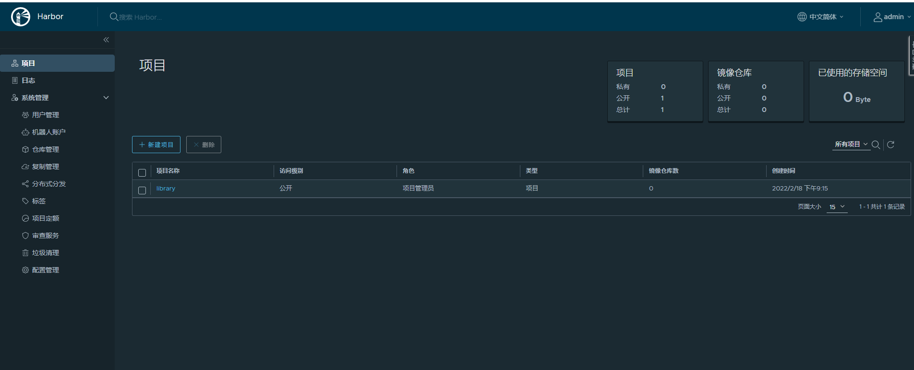

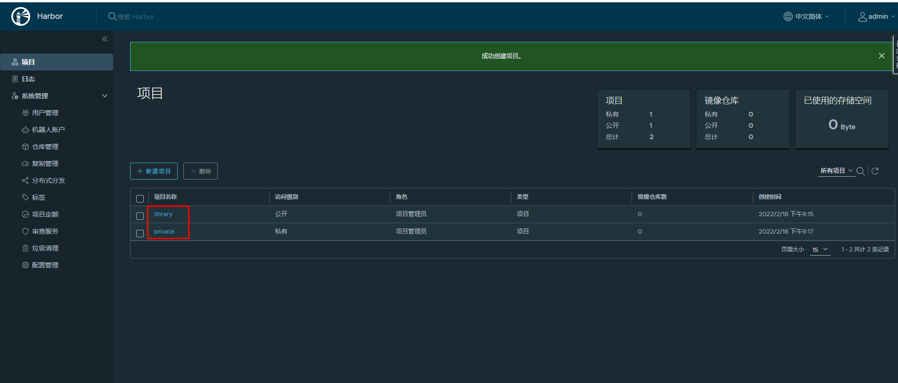

## 5.2 配置Containerd使用Harbor仓库

### 5.2.1 Harbor主机名解析

> 在所有安装containerd宿主机上添加此配置信息。

~~~powershell
# vim /etc/hosts
# cat /etc/hosts
127.0.0.1   localhost localhost.localdomain localhost4 localhost4.localdomain4
::1         localhost localhost.localdomain localhost6 localhost6.localdomain6
192.168.10.165 harbor.kubemsb.com
~~~

~~~powershell
说明
* 192.168.10.165是harbor的IP

* harbor.kubemsb.com建议用FQDN形式，如果用类似harbor这种短名，后面下载镜像会出问题
~~~

### 5.2.2 修改Containerd配置文件

~~~powershell
此配置文件已提前替换过，仅修改本地容器镜像仓库地址即可。
# vim /etc/containerd/config.toml
# cat /etc/containerd/config.toml
root = "/var/lib/containerd"
state = "/run/containerd"
oom_score = -999

[grpc]
  address = "/run/containerd/containerd.sock"
  uid = 0
  gid = 0
  max_recv_message_size = 16777216
  max_send_message_size = 16777216

[debug]
  address = ""
  uid = 0
  gid = 0
  level = ""

[metrics]
  address = ""
  grpc_histogram = false

[cgroup]
  path = ""

[plugins]
  [plugins.cgroups]
    no_prometheus = false
  [plugins.cri]
    stream_server_address = "127.0.0.1"
    stream_server_port = "0"
    enable_selinux = false
    sandbox_image = "easzlab/pause-amd64:3.2"
    stats_collect_period = 10
    systemd_cgroup = false
    enable_tls_streaming = false
    max_container_log_line_size = 16384
    [plugins.cri.containerd]
      snapshotter = "overlayfs"
      no_pivot = false
      [plugins.cri.containerd.default_runtime]
        runtime_type = "io.containerd.runtime.v1.linux"
        runtime_engine = ""
        runtime_root = ""
      [plugins.cri.containerd.untrusted_workload_runtime]
        runtime_type = ""
        runtime_engine = ""
        runtime_root = ""
    [plugins.cri.cni]
      bin_dir = "/opt/kube/bin"
      conf_dir = "/etc/cni/net.d"
      conf_template = "/etc/cni/net.d/10-default.conf"
    [plugins.cri.registry]
      [plugins.cri.registry.mirrors]
        [plugins.cri.registry.mirrors."docker.io"]
          endpoint = [
            "https://docker.mirrors.ustc.edu.cn",
            "http://hub-mirror.c.163.com"
          ]
        [plugins.cri.registry.mirrors."gcr.io"]
          endpoint = [
            "https://gcr.mirrors.ustc.edu.cn"
          ]
        [plugins.cri.registry.mirrors."k8s.gcr.io"]
          endpoint = [
            "https://gcr.mirrors.ustc.edu.cn/google-containers/"
          ]
        [plugins.cri.registry.mirrors."quay.io"]
          endpoint = [
            "https://quay.mirrors.ustc.edu.cn"
          ]
        [plugins.cri.registry.mirrors."harbor.kubemsb.com"]   在此处添加,在镜像加速器下面添加这一段
          endpoint = [
            "http://harbor.kubemsb.com"
          ]
    [plugins.cri.x509_key_pair_streaming]
      tls_cert_file = ""
      tls_key_file = ""
  [plugins.diff-service]
    default = ["walking"]
  [plugins.linux]
    shim = "containerd-shim"
    runtime = "runc"
    runtime_root = ""
    no_shim = false
    shim_debug = false
  [plugins.opt]
    path = "/opt/containerd"
  [plugins.restart]
    interval = "10s"
  [plugins.scheduler]
    pause_threshold = 0.02
    deletion_threshold = 0
    mutation_threshold = 100
    schedule_delay = "0s"
    startup_delay = "100ms"
~~~

~~~powershell
重启containerd，以便于重新加载配置文件。
# systemctl restart containerd
~~~

### 5.2.3  ctr下载镜像

~~~powershell
下载容器镜像
# ctr images pull --platform linux/amd64 docker.io/library/nginx:latest
~~~

~~~powershell
说明:
* --platform linux/amd64 指定系统平台，也可以使用--all-platforms指定所有平台镜像。

~~~

~~~powershell
输出：
docker.io/library/nginx:latest:                                                   resolved       |++++++++++++++++++++++++++++++++++++++|
index-sha256:2834dc507516af02784808c5f48b7cbe38b8ed5d0f4837f16e78d00deb7e7767:    done           |++++++++++++++++++++++++++++++++++++++|
manifest-sha256:bb129a712c2431ecce4af8dde831e980373b26368233ef0f3b2bae9e9ec515ee: done           |++++++++++++++++++++++++++++++++++++++|
layer-sha256:b559bad762bec166fd028483dd2a03f086d363ee827d8c98b7268112c508665a:    done           |++++++++++++++++++++++++++++++++++++++|
config-sha256:c316d5a335a5cf324b0dc83b3da82d7608724769f6454f6d9a621f3ec2534a5a:   done           |++++++++++++++++++++++++++++++++++++++|
layer-sha256:5eb5b503b37671af16371272f9c5313a3e82f1d0756e14506704489ad9900803:    done           |++++++++++++++++++++++++++++++++++++++|
layer-sha256:1ae07ab881bd848493ad54c2ba32017f94d1d8dbfd0ba41b618f17e80f834a0f:    done           |++++++++++++++++++++++++++++++++++++++|
layer-sha256:78091884b7bea0fa918527207924e9993bcc21bf7f1c9687da40042ceca31ac9:    done           |++++++++++++++++++++++++++++++++++++++|
layer-sha256:091c283c6a66ad0edd2ab84cb10edacc00a1a7bc5277f5365c0d5c5457a75aff:    done           |++++++++++++++++++++++++++++++++++++++|
layer-sha256:55de5851019b8f65ed6e28120c6300e35e556689d021e4b3411c7f4e90a9704b:    done           |++++++++++++++++++++++++++++++++++++++|
elapsed: 20.0s                                                                    total:  53.2 M (2.7 MiB/s)
unpacking linux/amd64 sha256:2834dc507516af02784808c5f48b7cbe38b8ed5d0f4837f16e78d00deb7e7767...
done: 3.028652226s
~~~

~~~powershell
查看已下载容器镜像
# ctr images ls
REF                              TYPE                                                      DIGEST                                                                  SIZE      PLATFORMS                                                                                                                          LABELS

docker.io/library/nginx:latest   application/vnd.docker.distribution.manifest.list.v2+json sha256:2834dc507516af02784808c5f48b7cbe38b8ed5d0f4837f16e78d00deb7e7767 54.1 MiB  linux/386,linux/amd64,linux/arm/v5,linux/arm/v7,linux/arm64/v8,linux/mips64le,linux/ppc64le,linux/s390x                            -
~~~

### 5.2.4 ctr上传镜像

>上传到Harbor library公有项目

~~~powershell
重新生成新的tag
# ctr images tag docker.io/library/nginx:latest harbor.kubemsb.com/library/nginx:latest
harbor.kubemsb.com/library/nginx:latest
~~~

~~~powershell
查看已生成容器镜像
# ctr images ls
REF                                     TYPE                                                      DIGEST                                                                  SIZE      PLATFORMS                                                                                                                          LABELS
docker.io/library/nginx:latest          application/vnd.docker.distribution.manifest.list.v2+json sha256:2834dc507516af02784808c5f48b7cbe38b8ed5d0f4837f16e78d00deb7e7767 54.1 MiB  linux/386,linux/amd64,linux/arm/v5,linux/arm/v7,linux/arm64/v8,linux/mips64le,linux/ppc64le,linux/s390x                            -
harbor.kubemsb.com/library/nginx:latest application/vnd.docker.distribution.manifest.list.v2+json sha256:2834dc507516af02784808c5f48b7cbe38b8ed5d0f4837f16e78d00deb7e7767 54.1 MiB  linux/386,linux/amd64,linux/arm/v5,linux/arm/v7,linux/arm64/v8,linux/mips64le,linux/ppc64le,linux/s390x                            -
~~~

~~~powershell
推送容器镜像至Harbor
# ctr images push --platform linux/amd64 --plain-http -u admin:Harbor12345 harbor.kubemsb.com/library/nginx:latest
~~~

~~~powershell
说明:

* 先tag再push
* 因为我们harbor是http协议，不是https协议，所以需要加上`--plain-http`
* `--user admin:Harbor12345`指定harbor的用户名与密码
~~~

~~~powershell
输出：
manifest-sha256:0fd68ec4b64b8dbb2bef1f1a5de9d47b658afd3635dc9c45bf0cbeac46e72101: done           |++++++++++++++++++++++++++++++++++++++|
config-sha256:dd025cdfe837e1c6395365870a491cf16bae668218edb07d85c626928a60e478:   done           |++++++++++++++++++++++++++++++++++++++|
elapsed: 0.5 s                                                                    total:  9.3 Ki (18.1 KiB/s)
~~~

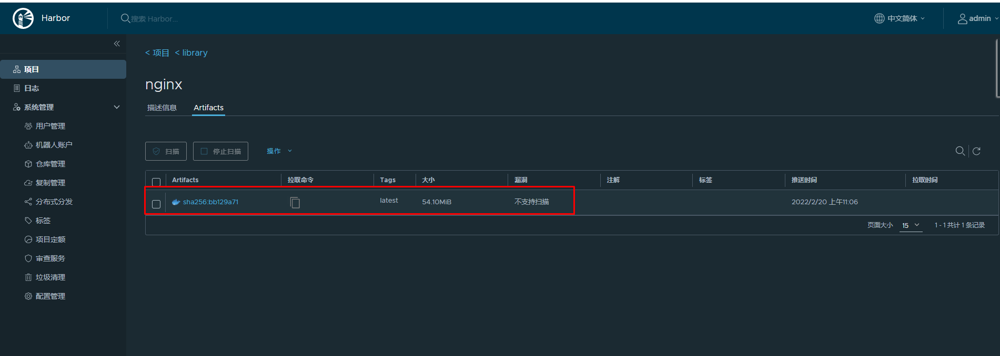

~~~powershell
下载已上传容器镜像
# ctr images pull --plain-http harbor.kubemsb.com/library/nginx:latest
~~~

# 六、Containerd NameSpace管理

> containerd中namespace的作用为:隔离运行的容器，可以实现运行多个容器。

~~~powershell
查看命令帮助
# ctr namespace --help
NAME:
   ctr namespaces - manage namespaces

USAGE:
   ctr namespaces command [command options] [arguments...]

COMMANDS:
   create, c   create a new namespace
   list, ls    list namespaces
   remove, rm  remove one or more namespaces
   label       set and clear labels for a namespace

OPTIONS:
   --help, -h  show help
~~~

~~~powershell
列出已有namespace
# ctr namespace ls
NAME    LABELS
default
k8s.io
~~~

~~~powershell
创建namespace
# ctr namespace create kubemsb

[root@localhost ~]# ctr namespace ls
NAME    LABELS
default
k8s.io
kubemsb 此命名空间为新添加的
~~~

~~~powershell
删除namespace
# ctr namespace rm kubemsb
kubemsb

再次查看是否删除
[root@localhost ~]# ctr namespace ls
NAME    LABELS
default
k8s.io
~~~

~~~powershell
查看指定namespace中是否有用户进程在运行
# ctr -n kubemsb tasks ls
TASK    PID    STATUS
~~~

~~~powershell
在指定namespace中下载容器镜像
# ctr -n kubemsb images pull docker.io/library/nginx:latest
~~~

~~~powershell
在指定namespace中创建静态容器
# ctr -n kubemsb container create docker.io/library/nginx:latest nginxapp
~~~

~~~powershell
查看在指定namespace中创建的容器
# ctr -n kubemsb container ls
CONTAINER    IMAGE                             RUNTIME
nginxapp     docker.io/library/nginx:latest    io.containerd.runc.v2
~~~

# 七、Containerd Network管理

> 默认Containerd管理的容器仅有lo网络，无法访问容器之外的网络，可以为其添加网络插件，使用容器可以连接外网。CNI（Container Network Interface）

## 7.1 创建CNI网络

| [*containernetworking*/*cni*](https://github.com/containernetworking/cni) | [ CNI v1.0.1](https://github.com/containernetworking/cni/releases/tag/v1.0.1) |
| ------------------------------------------------------------ | ------------------------------------------------------------ |
| [*containernetworking*/*plugins*](https://github.com/containernetworking/plugins) | [ CNI Plugins v1.0.1](https://github.com/containernetworking/plugins/releases/tag/v1.0.1) |

### 7.1.1 获取CNI工具源码

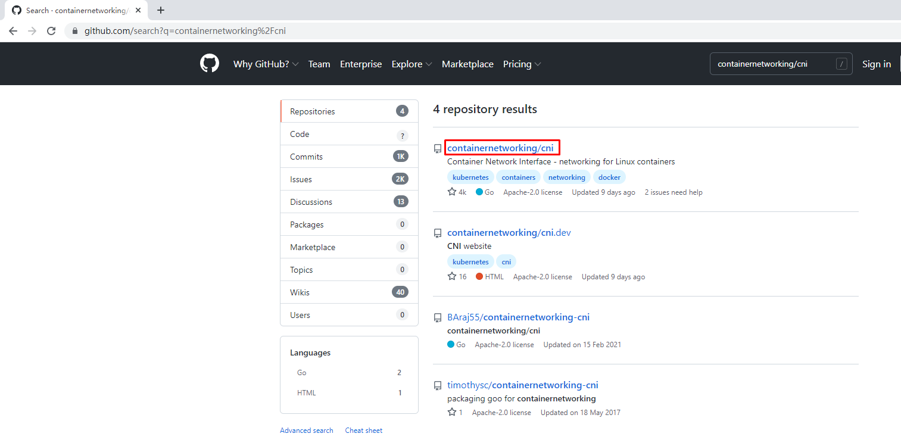

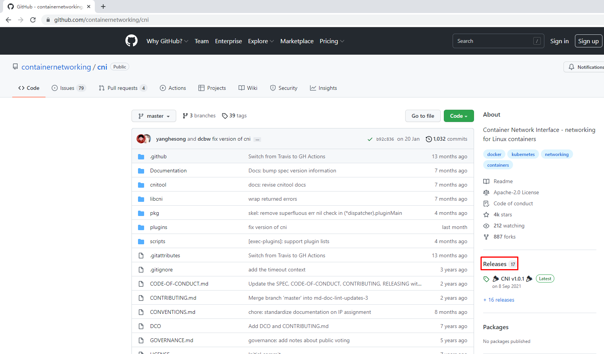

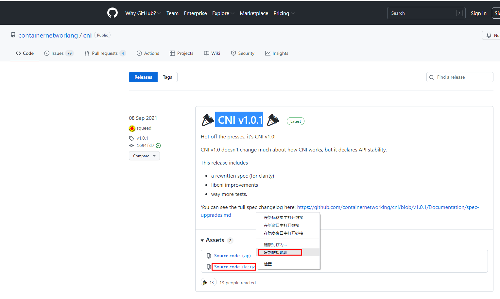

~~~powershell
使用wget下载cni工具源码包
# wget https://github.com/containernetworking/cni/archive/refs/tags/v1.0.1.tar.gz
~~~

~~~powershell
查看已下载cni工具源码包
# ls
v1.0.1.tar.gz

解压已下载cni工具源码包
# tar xf v1.0.1.tar.gz

查看解压后已下载cni工具源码包
# ls
cni-1.0.1

重命名已下载cni工具源码包目录
# mv cni-1.0.1 cni

查看重新命名后目录
# ls
cni

查看cni工具目录中包含的文件
# ls cni
cnitool             CONTRIBUTING.md  DCO            go.mod  GOVERNANCE.md  LICENSE   MAINTAINERS  plugins    RELEASING.md  scripts  test.sh
CODE-OF-CONDUCT.md  CONVENTIONS.md   Documentation  go.sum  libcni         logo.png  pkg          README.md  ROADMAP.md    SPEC.md
~~~

### 7.1.2 获取CNI Plugins（CNI插件）

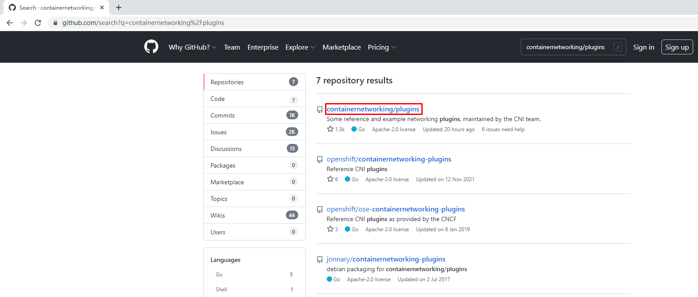

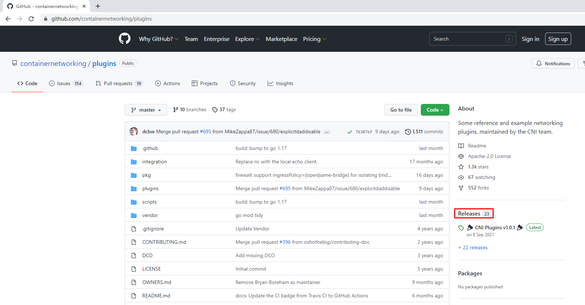

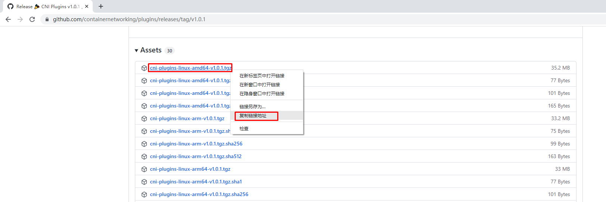

~~~powershell
使用wget下载cni插件工具源码包
# wget https://github.com/containernetworking/plugins/releases/download/v1.0.1/cni-plugins-linux-amd64-v1.0.1.tgz
~~~

~~~powershell
查看已下载cni插件工具源码包
# ls
cni-plugins-linux-amd64-v1.0.1.tgz
cni

创建cni插件工具解压目录
# mkdir /home/cni-plugins

解压cni插件工具至上述创建的目录中
# tar xf cni-plugins-linux-amd64-v1.0.1.tgz -C /home/cni-plugins

查看解压后目录
# ls cni-plugins
bandwidth  bridge  dhcp  firewall  host-device  host-local  ipvlan  loopback  macvlan  portmap  ptp  sbr  static  tuning  vlan  vrf
~~~

### 7.1.3 准备CNI网络配置文件

> 准备容器网络配置文件，用于为容器提供网关、IP地址等。

~~~powershell
创建名为mynet的网络，其中包含名为cni0的网桥
# vim /etc/cni/net.d/10-mynet.conf
# cat /etc/cni/net.d/10-mynet.conf
{
  "cniVersion": "1.0.0",
  "name": "mynet",
  "type": "bridge",
  "bridge": "cni0",
  "isGateway": true,
  "ipMasq": true,
  "ipam": {
    "type": "host-local",
    "subnet": "10.66.0.0/16",
    "routes": [
      { "dst": "0.0.0.0/0" }
   ]
  }
}
~~~

~~~powershell
# vim /etc/cni/net.d/99-loopback.conf
# cat /etc/cni/net.d/99-loopback.conf
{
  "cniVerion": "1.0.0",
  "name": "lo",
  "type": "loopback"
}
~~~

### 7.1.4  生成CNI网络

~~~powershell
获取epel源
# wget -O /etc/yum.repos.d/epel.repo http://mirrors.aliyun.com/repo/epel-7.repo

安装jq
# yum -y install jq
~~~

~~~powershell
进入cni工具目录
# cd cni
[root@localhost cni]# ls
cnitool             CONTRIBUTING.md  DCO            go.mod  GOVERNANCE.md  LICENSE   MAINTAINERS  plugins    RELEASING.md  scripts  test.sh
CODE-OF-CONDUCT.md  CONVENTIONS.md   Documentation  go.sum  libcni         logo.png  pkg          README.md  ROADMAP.md    SPEC.md

必须在scripts目录中执行，需要依赖exec-plugins.sh文件，再次进入scripts目录
[root@localhost cni]# cd scripts/ 

查看执行脚本文件
[root@localhost scripts]# ls
docker-run.sh  exec-plugins.sh  priv-net-run.sh  release.sh

执行脚本文件，基于/etc/cni/net.d/目录中的*.conf配置文件生成容器网络
[root@localhost scripts]# CNI_PATH=/home/cni-plugins ./priv-net-run.sh echo "Hello World"
Hello World
~~~

~~~powershell
在宿主机上查看是否生成容器网络名为cni0的网桥
# ip a s
......
5: cni0: <NO-CARRIER,BROADCAST,MULTICAST,UP> mtu 1500 qdisc noqueue state DOWN group default qlen 1000
    link/ether 36:af:7a:4a:d6:12 brd ff:ff:ff:ff:ff:ff
    inet 10.66.0.1/16 brd 10.66.255.255 scope global cni0
       valid_lft forever preferred_lft forever
    inet6 fe80::34af:7aff:fe4a:d612/64 scope link
       valid_lft forever preferred_lft forever
~~~

~~~powershell
在宿主机上查看其路由表情况
# ip route
default via 192.168.10.2 dev ens33 proto dhcp metric 100
10.66.0.0/16 dev cni0 proto kernel scope link src 10.66.0.1
192.168.10.0/24 dev ens33 proto kernel scope link src 192.168.10.164 metric 100
192.168.122.0/24 dev virbr0 proto kernel scope link src 192.168.122.1
~~~

## 7.2 为Containerd容器配置网络功能

### 7.2.1 创建一个容器

~~~powershell
# ctr images ls
REF TYPE DIGEST SIZE PLATFORMS LABELS

# ctr images pull docker.io/library/busybox:latest

# ctr run -d docker.io/library/busybox:latest busybox

# ctr container ls
CONTAINER    IMAGE                               RUNTIME
busybox      docker.io/library/busybox:latest    io.containerd.runc.v2

# ctr tasks ls
TASK       PID     STATUS
busybox    8377    RUNNING
~~~

### 7.2.2 进入容器查看其网络情况

~~~powershell
# ctr tasks exec --exec-id $RANDOM -t busybox sh

/ # ip a s
1: lo: <LOOPBACK,UP,LOWER_UP> mtu 65536 qdisc noqueue qlen 1000
    link/loopback 00:00:00:00:00:00 brd 00:00:00:00:00:00
    inet 127.0.0.1/8 scope host lo
       valid_lft forever preferred_lft forever
    inet6 ::1/128 scope host
       valid_lft forever preferred_lft forever
~~~

### 7.2.3 获取容器进程ID及其网络命名空间

~~~powershell
在宿主机中完成指定容器进程ID获取
# pid=$(ctr tasks ls | grep busybox | awk '{print $2}')
# echo $pid
8377

~~~

~~~powershell
在宿主机中完成指定容器网络命名空间路径获取
# netnspath=/proc/$pid/ns/net
# echo $netnspath
/proc/8377/ns/net
~~~

### 7.2.4 为指定容器添加网络配置

~~~powershell
确认执行脚本文件时所在的目录
[root@localhost scripts]# pwd
/home/cni/scripts
~~~

~~~powershell
执行脚本文件为容器添加网络配置
[root@localhost scripts]# CNI_PATH=/home/cni-plugins ./exec-plugins.sh add $pid $netnspath
~~~

~~~powershell
进入容器确认是否添加网卡信息
# ctr tasks exec --exec-id $RANDOM -t busybox sh
/ # ip a s
1: lo: <LOOPBACK,UP,LOWER_UP> mtu 65536 qdisc noqueue qlen 1000
    link/loopback 00:00:00:00:00:00 brd 00:00:00:00:00:00
    inet 127.0.0.1/8 scope host lo
       valid_lft forever preferred_lft forever
    inet6 ::1/128 scope host
       valid_lft forever preferred_lft forever
2: eth0@if7: <BROADCAST,MULTICAST,UP,LOWER_UP,M-DOWN> mtu 1500 qdisc noqueue
    link/ether a2:35:b7:e0:60:0a brd ff:ff:ff:ff:ff:ff
    inet 10.66.0.3/16 brd 10.66.255.255 scope global eth0
       valid_lft forever preferred_lft forever
    inet6 fe80::a035:b7ff:fee0:600a/64 scope link
       valid_lft forever preferred_lft forever
       
在容器中ping容器宿主机IP地址
/ # ping -c 2 192.168.10.164
PING 192.168.10.164 (192.168.10.164): 56 data bytes
64 bytes from 192.168.10.164: seq=0 ttl=64 time=0.132 ms
64 bytes from 192.168.10.164: seq=1 ttl=64 time=0.044 ms

--- 192.168.10.164 ping statistics ---
2 packets transmitted, 2 packets received, 0% packet loss
round-trip min/avg/max = 0.044/0.088/0.132 ms

在容器中ping宿主机所在网络的网关IP地址
/ # ping -c 2 192.168.10.2
PING 192.168.10.2 (192.168.10.2): 56 data bytes
64 bytes from 192.168.10.2: seq=0 ttl=127 time=0.338 ms
64 bytes from 192.168.10.2: seq=1 ttl=127 time=0.280 ms

--- 192.168.10.2 ping statistics ---
2 packets transmitted, 2 packets received, 0% packet loss
round-trip min/avg/max = 0.280/0.309/0.338 ms

在容器中ping宿主机所在网络中的其它主机IP地址
/ # ping -c 2 192.168.10.165
PING 192.168.10.165 (192.168.10.165): 56 data bytes
64 bytes from 192.168.10.165: seq=0 ttl=63 time=0.422 ms
64 bytes from 192.168.10.165: seq=1 ttl=63 time=0.908 ms

--- 192.168.10.165 ping statistics ---
2 packets transmitted, 2 packets received, 0% packet loss
round-trip min/avg/max = 0.422/0.665/0.908 ms

~~~

~~~powershell
在容器中开启httpd服务
/ # echo "containerd net web test" > /tmp/index.html
/ # httpd -h /tmp

/ # wget -O - -q 127.0.0.1
containerd net web test
/ # exit

~~~

~~~powershell
在宿主机访问容器提供的httpd服务
[root@localhost scripts]# curl http://10.66.0.3
containerd net web test
~~~

# 八、Containerd容器数据持久化存储

> 实现把宿主机目录挂载至Containerd容器中，实现容器数据持久化存储

~~~powershell
# ctr container create docker.io/library/busybox:latest busybox3 --mount type=bind,src=/tmp,dst=/hostdir,options=rbind:rw
~~~

~~~powershell
说明：
创建一个静态容器，实现宿主机目录与容器挂载
src=/tmp 为宿主机目录
dst=/hostdir 为容器中目录
~~~

~~~powershell
运行用户进程
# ctr tasks start -d busybox3 bash
~~~

~~~powershell
进入容器，查看是否挂载成功
# ctr tasks exec --exec-id $RANDOM -t busybox3 sh

/ # ls /hostdir
VMwareDnD
systemd-private-cf1fe70805214c80867e7eb62dff5be7-bolt.service-MWV1Ju
systemd-private-cf1fe70805214c80867e7eb62dff5be7-chronyd.service-6B6j8p
systemd-private-cf1fe70805214c80867e7eb62dff5be7-colord.service-6fI31A
systemd-private-cf1fe70805214c80867e7eb62dff5be7-cups.service-tuK4zI
systemd-private-cf1fe70805214c80867e7eb62dff5be7-rtkit-daemon.service-vhP67o
tracker-extract-files.0
vmware-root_703-3988031936
vmware-root_704-2990744159
vmware-root_713-4290166671

向容器中挂载目录中添加文件
/ # echo "hello world" > /hostdir/test.txt

退出容器
/ # exit

在宿主机上查看被容器挂载的目录中是否添加了新的文件，已添加表明被容器挂载成功，并可以读写此目录中内容。
[root@localhost ~]# cat /tmp/test.txt
hello world
~~~

# 九、与其它Containerd容器共享命名空间

> 当需要与其它Containerd管理的容器共享命名空间时，可使用如下方法。

~~~powershell
# ctr tasks ls
TASK        PID      STATUS
busybox3    13778    RUNNING
busybox     8377     RUNNING
busybox1    12469    RUNNING
~~~

~~~powershell
# ctr container create --with-ns "pid:/proc/13778/ns/pid" docker.io/library/busybox:latest busybox4
[root@localhost ~]# ctr tasks start -d busybox4 bash
[root@localhost ~]# ctr tasks exec --exec-id $RANDOM -t busybox3 sh
/ # ps aux
PID   USER     TIME  COMMAND
    1 root      0:00 sh
   20 root      0:00 sh
   26 root      0:00 sh
   32 root      0:00 ps aux

~~~

# 十、Docker集成Containerd实现容器管理

目前Containerd主要任务还在于解决容器运行时的问题，对于其周边生态还不完善，所以可以借助Docker结合Containerd来实现Docker完整的功能应用。

~~~powershell
准备Docker安装YUM源
# wget -O /etc/yum.repos.d/docker-ce.repo https://mirrors.aliyun.com/docker-ce/linux/centos/docker-ce.repo
~~~

~~~powershell
安装Docker-ce
# yum -y install docker-ce
~~~

~~~powershell
修改Docker服务文件，以便使用已安装的containerd。
# vim /etc/systemd/system/multi-user.target.wants/docker.service

修改前：
[Service]
Type=notify
# the default is not to use systemd for cgroups because the delegate issues still
# exists and systemd currently does not support the cgroup feature set required
# for containers run by docker
ExecStart=/usr/bin/dockerd -H fd:// --containerd=/run/containerd/containerd.sock 此处
ExecReload=/bin/kill -s HUP $MAINPID

修改后：

[Service]
Type=notify
# the default is not to use systemd for cgroups because the delegate issues still
# exists and systemd currently does not support the cgroup feature set required
# for containers run by docker
ExecStart=/usr/bin/dockerd --containerd  /run/containerd/containerd.sock --debug 此处
ExecReload=/bin/kill -s HUP $MAINPID
TimeoutSec=0
RestartSec=2
Restart=always

~~~

~~~powershell
设置docker daemon启动并设置其开机自启动
# systemctl daemon-reload
# systemctl enable docker
Created symlink from /etc/systemd/system/multi-user.target.wants/docker.service to /usr/lib/systemd/system/docker.service.
# systemctl start docker
~~~

~~~powershell
查看其启动后进程
# ps aux | grep docker
root      16270  0.0  3.1 1155116 63320 ?       Ssl  12:09   0:00 /usr/bin/dockerd --containerd /run/containerd/containerd.sock --debug
~~~

~~~powershell
使用docker运行容器
# docker run -d nginx:latest
......
219a9c6727bcd162d0a4868746c513a277276a110f47e15368b4229988003c13
~~~

~~~powershell
使用docker ps命令查看正在运行的容器
# docker ps
CONTAINER ID   IMAGE          COMMAND                  CREATED          STATUS          PORTS     NAMES
219a9c6727bc   nginx:latest   "/docker-entrypoint.…"   14 seconds ago   Up 13 seconds   80/tcp    happy_tu
~~~

~~~powershell
使用ctr查看是否添加一个新的namespace，本案例中发现添加一个moby命名空间，即为docker使用的命名空间。
# ctr namespace ls
NAME    LABELS
default
k8s.io
kubemsb
moby
~~~

~~~powershell
查看moby命名空间，发现使用docker run运行的容器包含在其中。
# ctr -n moby container ls
CONTAINER                                                           IMAGE    RUNTIME
219a9c6727bcd162d0a4868746c513a277276a110f47e15368b4229988003c13    -        io.containerd.runc.v2
~~~

~~~powershell
使用ctr能够查看到一个正在运行的容器，既表示docker run运行的容器是被containerd管理的。
# ctr -n moby tasks ls
TASK                                                                PID      STATUS
219a9c6727bcd162d0a4868746c513a277276a110f47e15368b4229988003c13    16719    RUNNING
~~~

~~~powershell
使用docker stop停止且使用docker rm删除容器后再观察，发现容器被删除。
# docker stop 219;docker rm 219
219
219

# ctr -n moby container ls
CONTAINER    IMAGE    RUNTIME

# ctr -n moby tasks ls
TASK    PID    STATUS
~~~

