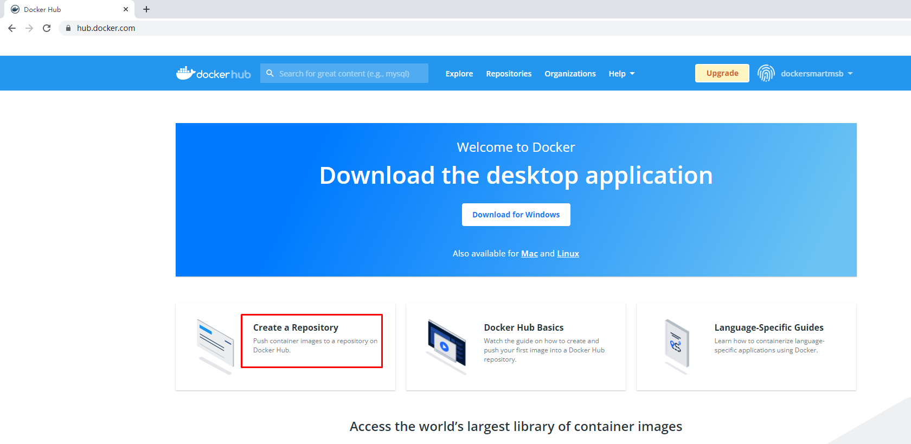
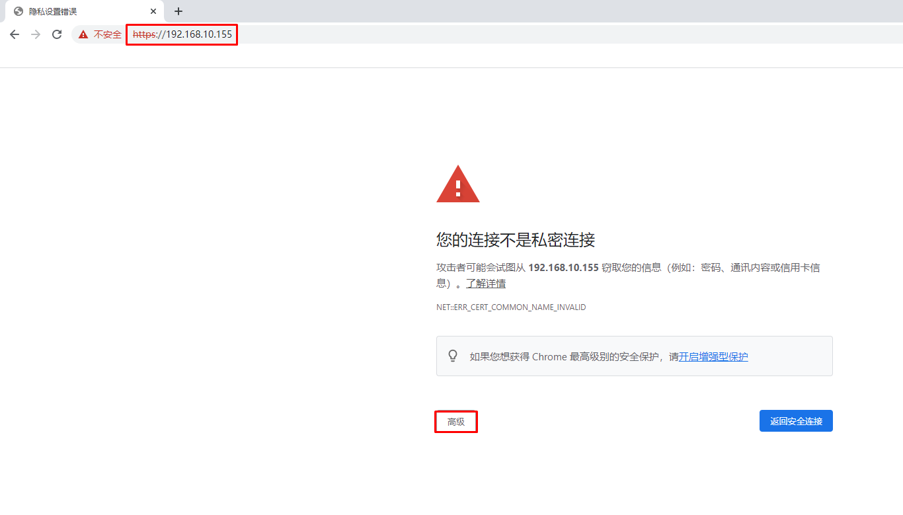
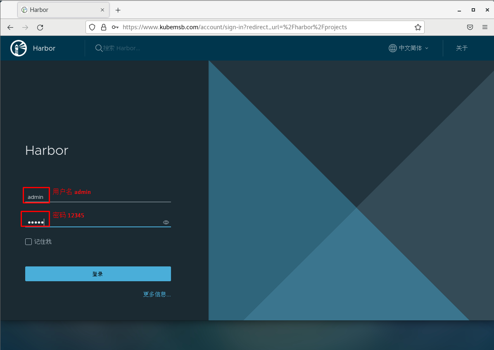
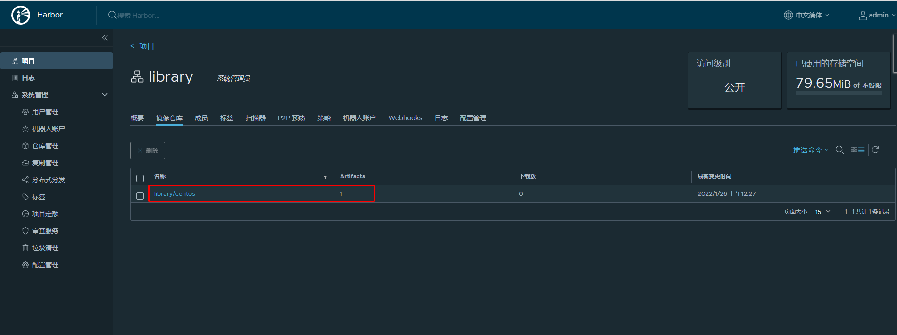

# Docker容器镜像加速器及本地容器镜像仓库

# 一、容器镜像加速器

> 由于国内访问国外的容器镜像仓库速度比较慢，因此国内企业创建了容器镜像加速器，以方便国内用户使用容器镜像。

## 1.1 获取阿里云容器镜像加速地址

## 1.2 配置docker daemon使用加速器

~~~powershell
添加daemon.json配置文件
# vim /etc/docker/daemon.json
# cat /etc/docker/daemon.json
{
        "registry-mirrors": ["https://s27w6kze.mirror.aliyuncs.com"]
}
~~~

~~~powershell
重启docker
# systemctl daemon-reload
# systemctl restart docker
~~~

~~~powershell
尝试下载容器镜像
# docker pull centos
~~~

# 二、容器镜像仓库

## 2.1 docker hub

### 2.1.1 注册

> 准备邮箱及用户ID

### 2.1.2 登录

### 2.1.3 创建容器镜像仓库

### 2.1.4 在本地登录Docker Hub

~~~powershell
默认可以不添加docker hub容器镜像仓库地址
# docker login 
Login with your Docker ID to push and pull images from Docker Hub. If you don't have a Docker ID, head over to https://hub.docker.com to create one.
Username: dockersmartmsb
Password:
WARNING! Your password will be stored unencrypted in /root/.docker/config.json.
Configure a credential helper to remove this warning. See
https://docs.docker.com/engine/reference/commandline/login/#credentials-store

Login Succeeded 成功
~~~

~~~powershell
登出
# docker logout
Removing login credentials for https://index.docker.io/v1/
~~~

### 2.1.5 上传容器镜像

> 在登录Docker Hub主机上传容器镜像,向全球用户共享容器镜像。

~~~powershell
为容器镜像重新打标记

原始容器镜像
# docker images
REPOSITORY   TAG       IMAGE ID       CREATED        SIZE
centos       latest    5d0da3dc9764   4 months ago   231MB

重新为容器镜像打标记
# docker tag centos:latest dockersmartmsb/centos:v1

重新打标记后容器镜像
# docker images
REPOSITORY              TAG       IMAGE ID       CREATED        SIZE
dockersmartmsb/centos   v1        5d0da3dc9764   4 months ago   231MB
centos                  latest    5d0da3dc9764   4 months ago   231MB
~~~

~~~powershell
上传容器镜像至docker hub
# docker push dockersmartmsb/centos:v1
The push refers to repository [docker.io/dockersmartmsb/centos]
74ddd0ec08fa: Mounted from library/centos
v1: digest: sha256:a1801b843b1bfaf77c501e7a6d3f709401a1e0c83863037fa3aab063a7fdb9dc size: 529
~~~

### 2.1.6 下载容器镜像

~~~powershell
在其它主机上下载

下载
# docker pull dockersmartmsb/centos:v1
v1: Pulling from dockersmartmsb/centos
a1d0c7532777: Pull complete
Digest: sha256:a1801b843b1bfaf77c501e7a6d3f709401a1e0c83863037fa3aab063a7fdb9dc
Status: Downloaded newer image for dockersmartmsb/centos:v1
docker.io/dockersmartmsb/centos:v1

查看下载后容器镜像
# docker images
REPOSITORY              TAG       IMAGE ID       CREATED        SIZE
dockersmartmsb/centos   v1        5d0da3dc9764   4 months ago   231MB
~~~

## 2.2 harbor

### 2.2.1 获取 docker compose二进制文件

~~~powershell
下载docker-compose二进制文件
# wget https://github.com/docker/compose/releases/download/1.25.0/docker-compose-Linux-x86_64
~~~

~~~powershell
查看已下载二进制文件
# ls
docker-compose-Linux-x86_64
~~~

~~~powershell
移动二进制文件到/usr/bin目录，并更名为docker-compose
# mv docker-compose-Linux-x86_64 /usr/bin/docker-compose
~~~

~~~powershell
为二进制文件添加可执行权限
# chmod +x /usr/bin/docker-compose
~~~

~~~powershell
安装完成后，查看docker-compse版本
# docker-compose version
docker-compose version 1.25.0, build 0a186604
docker-py version: 4.1.0
CPython version: 3.7.4
OpenSSL version: OpenSSL 1.1.0l  10 Sep 2019
~~~

### 2.2.2 获取harbor安装文件

~~~powershell
下载harbor离线安装包
# wget https://github.com/goharbor/harbor/releases/download/v2.4.1/harbor-offline-installer-v2.4.1.tgz
~~~

~~~powershell
查看已下载的离线安装包
# ls
harbor-offline-installer-v2.4.1.tgz
~~~

### 2.2.3 获取TLS文件

~~~powershell
查看准备好的证书
# ls
kubemsb.com_nginx.zip
~~~

~~~powershell
解压证书压缩包文件
# unzip kubemsb.com_nginx.zip
Archive:  kubemsb.com_nginx.zip
Aliyun Certificate Download
  inflating: 6864844_kubemsb.com.pem
  inflating: 6864844_kubemsb.com.key
~~~

~~~powershell
查看解压出的文件
# ls
6864844_kubemsb.com.key
6864844_kubemsb.com.pem
~~~

### 2.2.4 修改配置文件

~~~powershell
解压harbor离线安装包
# tar xf harbor-offline-installer-v2.4.1.tgz
~~~

~~~powershell
查看解压出来的目录
# ls
harbor 
~~~

~~~powershell
移动证书到harbor目录
# # mv 6864844_kubemsb.com.* harbor

查看harbor目录
# ls harbor
6864844_kubemsb.com.key  6864844_kubemsb.com.pem  common.sh  harbor.v2.4.1.tar.gz  harbor.yml.tmpl  install.sh  LICENSE  prepare
~~~

~~~powershell
创建配置文件
# cd harbor/
# mv harbor.yml.tmpl harbor.yml
~~~

~~~powershell
修改配置文件内容

# vim harbor.yml

# Configuration file of Harbor

# The IP address or hostname to access admin UI and registry service.
# DO NOT use localhost or 127.0.0.1, because Harbor needs to be accessed by external clients.
hostname: www.kubemsb.com 修改为域名，而且一定是证书签发的域名

# http related config
http:
  # port for http, default is 80. If https enabled, this port will redirect to https port
  port: 80

# https related config
https:
  # https port for harbor, default is 443
  port: 443
  # The path of cert and key files for nginx
  certificate: /root/harbor/6864844_kubemsb.com.pem 证书
  private_key: /root/harbor/6864844_kubemsb.com.key 密钥

# # Uncomment following will enable tls communication between all harbor components
# internal_tls:
#   # set enabled to true means internal tls is enabled
#   enabled: true
#   # put your cert and key files on dir
#   dir: /etc/harbor/tls/internal

# Uncomment external_url if you want to enable external proxy
# And when it enabled the hostname will no longer used
# external_url: https://reg.mydomain.com:8433

# The initial password of Harbor admin
# It only works in first time to install harbor
# Remember Change the admin password from UI after launching Harbor.
harbor_admin_password: 12345 访问密码
......
~~~

### 2.2.5 执行预备脚本

~~~powershell
# ./prepare
~~~

~~~powershell
输出
prepare base dir is set to /root/harbor
Clearing the configuration file: /config/portal/nginx.conf
Clearing the configuration file: /config/log/logrotate.conf
Clearing the configuration file: /config/log/rsyslog_docker.conf
Generated configuration file: /config/portal/nginx.conf
Generated configuration file: /config/log/logrotate.conf
Generated configuration file: /config/log/rsyslog_docker.conf
Generated configuration file: /config/nginx/nginx.conf
Generated configuration file: /config/core/env
Generated configuration file: /config/core/app.conf
Generated configuration file: /config/registry/config.yml
Generated configuration file: /config/registryctl/env
Generated configuration file: /config/registryctl/config.yml
Generated configuration file: /config/db/env
Generated configuration file: /config/jobservice/env
Generated configuration file: /config/jobservice/config.yml
Generated and saved secret to file: /data/secret/keys/secretkey
Successfully called func: create_root_cert
Generated configuration file: /compose_location/docker-compose.yml
Clean up the input dir
~~~

### 2.2.6 执行安装脚本

~~~powershell
# ./install.sh
~~~

~~~powershell
输出
[Step 0]: checking if docker is installed ...

Note: docker version: 20.10.12

[Step 1]: checking docker-compose is installed ...

Note: docker-compose version: 1.25.0

[Step 2]: loading Harbor images ...

[Step 3]: preparing environment ...

[Step 4]: preparing harbor configs ...
prepare base dir is set to /root/harbor

[Step 5]: starting Harbor ...
Creating network "harbor_harbor" with the default driver
Creating harbor-log ... done
Creating harbor-db     ... done
Creating registry      ... done
Creating registryctl   ... done
Creating redis         ... done
Creating harbor-portal ... done
Creating harbor-core   ... done
Creating harbor-jobservice ... done
Creating nginx             ... done
✔ ----Harbor has been installed and started successfully.----
~~~

### 2.2.7 验证运行情况

~~~powershell
# docker ps
CONTAINER ID   IMAGE                                COMMAND                  CREATED              STATUS                        PORTS                                                                            NAMES
71c0db683e4a   goharbor/nginx-photon:v2.4.1         "nginx -g 'daemon of…"   About a minute ago   Up About a minute (healthy)   0.0.0.0:80->8080/tcp, :::80->8080/tcp, 0.0.0.0:443->8443/tcp, :::443->8443/tcp   nginx
4e3b53a86f01   goharbor/harbor-jobservice:v2.4.1    "/harbor/entrypoint.…"   About a minute ago   Up About a minute (healthy)                                                                                    harbor-jobservice
df76e1eabbf7   goharbor/harbor-core:v2.4.1          "/harbor/entrypoint.…"   About a minute ago   Up About a minute (healthy)                                                                                    harbor-core
eeb4d224dfc4   goharbor/harbor-portal:v2.4.1        "nginx -g 'daemon of…"   About a minute ago   Up About a minute (healthy)                                                                                    harbor-portal
70e162c38b59   goharbor/redis-photon:v2.4.1         "redis-server /etc/r…"   About a minute ago   Up About a minute (healthy)                                                                                    redis
8bcc0e9b06ec   goharbor/harbor-registryctl:v2.4.1   "/home/harbor/start.…"   About a minute ago   Up About a minute (healthy)                                                                                    registryctl
d88196398df7   goharbor/registry-photon:v2.4.1      "/home/harbor/entryp…"   About a minute ago   Up About a minute (healthy)                                                                                    registry
ed5ba2ba9c82   goharbor/harbor-db:v2.4.1            "/docker-entrypoint.…"   About a minute ago   Up About a minute (healthy)                                                                                    harbor-db
dcb4b57c7542   goharbor/harbor-log:v2.4.1           "/bin/sh -c /usr/loc…"   About a minute ago   Up About a minute (healthy)   127.0.0.1:1514->10514/tcp                                                        harbor-log

~~~

### 2.2.8 访问harbor UI界面

#### 2.2.8.1 在物理机通过浏览器访问

#### 2.2.8.2 在Docker Host主机通过域名访问

~~~powershell
添加域名解析
# vim /etc/hosts
# cat /etc/hosts
127.0.0.1   localhost localhost.localdomain localhost4 localhost4.localdomain4
::1         localhost localhost.localdomain localhost6 localhost6.localdomain6
192.168.10.155 www.kubemsb.com
~~~

# 三、docker镜像上传至Harbor及从harbor下载

## 3.1  修改docker daemon使用harbor

~~~powershell
添加/etc/docker/daemon.json文件，默认不存在，需要手动添加
# vim /etc/docker/daemon.json
# cat /etc/docker/daemon.json
{
        "insecure-registries": ["www.kubemsb.com"]
}
~~~

~~~powershell
重启加载daemon配置
# systemctl daemon-reload
~~~

~~~powershell
重启docker
# systemctl restart docker
~~~

## 3.2 docker tag

~~~powershell
查看已有容器镜像文件
# docker images
REPOSITORY                      TAG       IMAGE ID       CREATED        SIZE
centos                          latest    5d0da3dc9764   4 months ago   231MB
~~~

~~~powershell
为已存在镜像重新添加tag
# docker tag centos:latest www.kubemsb.com/library/centos:v1
~~~

~~~powershell
再次查看本地容器镜像
# docker images
REPOSITORY                       TAG       IMAGE ID       CREATED        SIZE
centos                           latest    5d0da3dc9764   4 months ago   231MB
www.kubemsb.com/library/centos   v1        5d0da3dc9764   4 months ago   231MB
~~~

## 3.3 docker push

~~~powershell
# docker login www.kubemsb.com
Username: admin  用户名 admin
Password:        密码   12345
WARNING! Your password will be stored unencrypted in /root/.docker/config.json.
Configure a credential helper to remove this warning. See
https://docs.docker.com/engine/reference/commandline/login/#credentials-store

Login Succeeded 登陆成功
~~~

~~~powershell
推送本地容器镜像到harbor仓库
# docker push www.kubemsb.com/library/centos:v1
~~~

## 3.4 docker pull

> 在其它主机上下载或使用harbor容器镜像仓库中的容器镜像

~~~powershell
在本地添加域名解析
# vim /etc/hosts
# cat /etc/hosts
127.0.0.1   localhost localhost.localdomain localhost4 localhost4.localdomain4
::1         localhost localhost.localdomain localhost6 localhost6.localdomain6
192.168.10.155 www.kubemsb.com
~~~

~~~powershell
在本地添加/etc/docker/daemon.json文件，其中为本地主机访问的容器镜像仓库
# vim /etc/docker/daemon.json
# cat /etc/docker/daemon.json
{
        "insecure-registries": ["www.kubemsb.com"]
}
~~~

~~~powershell
# systemctl daemon-reload
# systemctl restart docker
~~~

~~~powershell
下载容器镜像
# docker pull www.kubemsb.com/library/centos:v1
v1: Pulling from library/centos
Digest: sha256:a1801b843b1bfaf77c501e7a6d3f709401a1e0c83863037fa3aab063a7fdb9dc
Status: Downloaded newer image for www.kubemsb.com/library/centos:v1
www.kubemsb.com/library/centos:v1
~~~

~~~powershell
查看已下载的容器镜像
# docker images
REPOSITORY                       TAG       IMAGE ID       CREATED        SIZE
www.kubemsb.com/library/centos   v1        5d0da3dc9764   4 months ago   231MB
~~~

