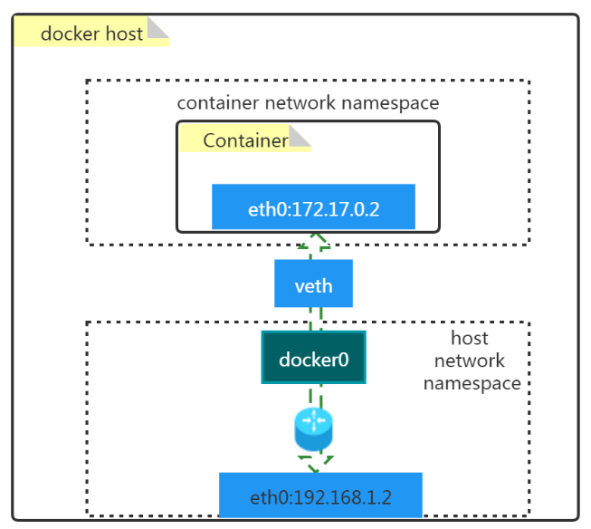
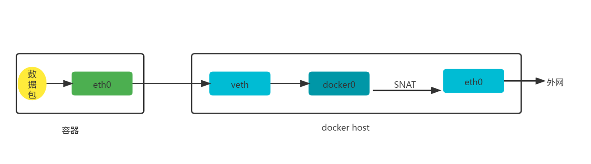
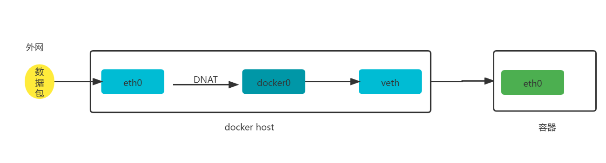
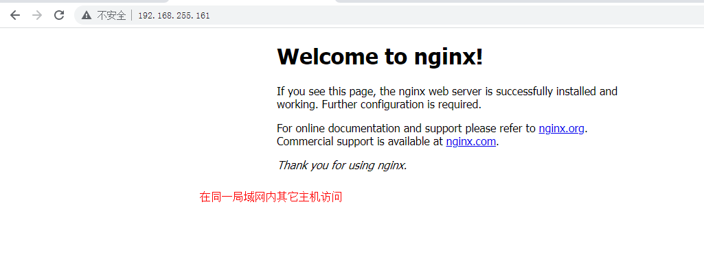
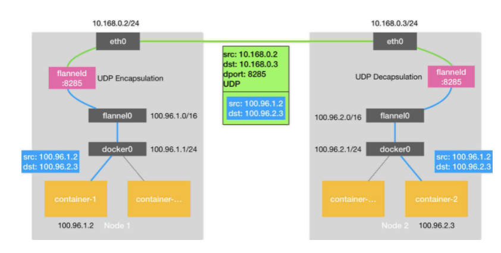

# Docker容器网络与通信原理深度解析

# 一、Docker容器默认网络模型

## 1.1 原理图




## 1.2 名词解释

- docker0
  - 是一个二层网络设备，即网桥
  - 通过网桥可以将Linux支持的不同的端口连接起来
  - 实现类交换机多对多的通信
- veth pair
  - 虚拟以太网（Ethernet）设备
  - 成对出现,用于解决网络命名空间之间的隔离
  - 一端连接Container network namespace，另一端连接host network namespace


# 二、Docker容器默认网络模型工作原理

## 2.1 容器访问外网



~~~powershell
# docker run -d --name web1 -p 8081:80 nginx:latest
~~~


~~~powershell
# iptables -t nat -vnL POSTROUTING
~~~


~~~powershell
输出：
Chain POSTROUTING (policy ACCEPT 7 packets, 766 bytes)
 pkts bytes target     prot opt in     out     source               destination
    0     0 MASQUERADE  tcp  --  *      *       172.17.0.2           172.17.0.2           tcp dpt:80
~~~


## 2.2 外网访问容器





~~~powershell
# iptables -t nat -vnL DOCKER
~~~


~~~powershell
输出：
Chain DOCKER (2 references)
 pkts bytes target     prot opt in     out     source               destination
    0     0 DNAT       tcp  --  !docker0 *       0.0.0.0/0            0.0.0.0/0            tcp dpt:8081 to:172.17.0.2:80
~~~


# 三、Docker容器四种网络模型


| 模式                                                         | 使用方法                                   | 说明                                                         |
| ------------------------------------------------------------ | ------------------------------------------ | ------------------------------------------------------------ |
| bridge [桥接式网络(Bridge container A)]                      | --network    bridge                        | 桥接容器，除了有一块本地回环接口(Loopback interface)外，还有一块私有接口(Private interface)通过容器虚拟接口(Container virtual interface)连接到桥接虚拟接口(Docker bridge virtual interface)，之后通过逻辑主机接口(Logical host interface)连接到主机物理网络(Physical network interface)。<br/>桥接网卡默认会分配到172.17.0.0/16的IP地址段。<br/>如果我们在创建容器时没有指定网络模型，默认就是(Nat)桥接网络，这也就是为什么我们在登录到一个容器后，发现IP地址段都在172.17.0.0/16网段的原因。 |
| host  [开放式容器(Open container)]                           | --network  host                            | 比联盟式网络更开放，我们知道联盟式网络是多个容器共享网络(Net),而开放式容器(Open contaner)就直接共享了宿主机的名称空间。因此物理网卡有多少个，那么该容器就能看到多少网卡信息。我们可以说Open container是联盟式容器的衍生。 |
| none [封闭式网络(Closed container)]                          | --network   none                           | 封闭式容器，只有本地回环接口(Loopback interface，和咱们服务器看到的lo接口类似)，无法与外界进行通信。 |
| container [联盟式网络(Joined container A \| Joined container B ] | --network   container:c1(容器名称或容器ID) | 每个容器都各有一部分名称空间(Mount,PID,User)，另外一部分名称空间是共享的(UTS,Net,IPC)。<br/>由于它们的网络是共享的，因此各个容器可以通过本地回环接口(Loopback interface)进行通信。<br/>除了共享同一组本地回环接口(Loopback interface)外，还有一块一块私有接口(Private interface)通过联合容器虚拟接口(Joined container virtual interface)连接到桥接虚拟接口(Docker bridge virtual interface)，之后通过逻辑主机接口(Logical host interface)连接到主机物理网络(Physical network interface)。 |


# 四、Docker容器四种网络模型应用案例

## 4.1 查看已有的网络模型

~~~powershell
查看已有的网络模型
# docker network ls
NETWORK ID     NAME      DRIVER    SCOPE
a26c79961d8c   bridge    bridge    local
d04ce0d0e6ca   host      host      local
a369d8e58a41   none      null      local
~~~


~~~powershell
查看已有网络模型详细信息
# docker network inspect bridge
[
    {
        "Name": "bridge",
        "Id": "a26c79961d8c3a5f66a7de782b773291e4902badc60d0614745e01b18f506907",
        "Created": "2022-02-08T11:45:25.607195911+08:00",
        "Scope": "local",
        "Driver": "bridge",
        "EnableIPv6": false,
        "IPAM": {
            "Driver": "default",
            "Options": null,
            "Config": [
                {
                    "Subnet": "172.17.0.0/16",
                    "Gateway": "172.17.0.1"
                }
            ]
        },
        "Internal": false,
        "Attachable": false,
        "Ingress": false,
        "ConfigFrom": {
            "Network": ""
        },
        "ConfigOnly": false,
        "Containers": {
            "dbac5dd601b960c91bee8fafcabc0a6e6091bff14d5fccfa80ca2c74df8891ad": {
                "Name": "web1",
                "EndpointID": "2c1d8c66f7f46d6d76e5c384b1729a90441e1398496b3112124ba65d255432a1",
                "MacAddress": "02:42:ac:11:00:02",
                "IPv4Address": "172.17.0.2/16",
                "IPv6Address": ""
            }
        },
        "Options": {
            "com.docker.network.bridge.default_bridge": "true",
            "com.docker.network.bridge.enable_icc": "true",
            "com.docker.network.bridge.enable_ip_masquerade": "true",
            "com.docker.network.bridge.host_binding_ipv4": "0.0.0.0",
            "com.docker.network.bridge.name": "docker0",
            "com.docker.network.driver.mtu": "1500"
        },
        "Labels": {}
    }
]
~~~


~~~powershell
查看docker支持的网络模型
# docker info | grep Network
  Network: bridge host ipvlan macvlan null overlay
~~~


## 4.2 创建指定类型的网络模型


### 4.2.1 bridge


~~~powershell
查看创建网络模型的帮助方法
# docker network create --help
~~~


~~~powershell
创建一个名称为mybr0的网络
# docker network create -d bridge --subnet "192.168.100.0/24" --gateway "192.168.100.1" -o com.docker.network.bridge.name=docker1 mybr0
~~~


~~~powershell
查看已创建网络
# docker network ls
NETWORK ID     NAME      DRIVER    SCOPE
......
a6a1ad36c3c0   mybr0     bridge    local
......
~~~


~~~powershell
在docker host主机上可以看到多了一个网桥docker1
# ifconfig
docker1: flags=4099<UP,BROADCAST,MULTICAST>  mtu 1500
        inet 192.168.100.1  netmask 255.255.255.0  broadcast 192.168.100.255
        ether 02:42:14:aa:f5:04  txqueuelen 0  (Ethernet)
        RX packets 0  bytes 0 (0.0 B)
        RX errors 0  dropped 0  overruns 0  frame 0
        TX packets 20  bytes 1598 (1.5 KiB)
        TX errors 0  dropped 0 overruns 0  carrier 0  collisions 0
~~~


~~~powershell
启动一个容器并连接到已创建mybr0网络
# docker run -it --network mybr0 --rm busybox
/ # ifconfig
eth0      Link encap:Ethernet  HWaddr 02:42:C0:A8:65:02
          inet addr:192.168.100.2  Bcast:192.168.100.255  Mask:255.255.255.0
          UP BROADCAST RUNNING MULTICAST  MTU:1500  Metric:1
          RX packets:18 errors:0 dropped:0 overruns:0 frame:0
          TX packets:0 errors:0 dropped:0 overruns:0 carrier:0
          collisions:0 txqueuelen:0
          RX bytes:2185 (2.1 KiB)  TX bytes:0 (0.0 B)

lo        Link encap:Local Loopback
          inet addr:127.0.0.1  Mask:255.0.0.0
          UP LOOPBACK RUNNING  MTU:65536  Metric:1
          RX packets:0 errors:0 dropped:0 overruns:0 frame:0
          TX packets:0 errors:0 dropped:0 overruns:0 carrier:0
          collisions:0 txqueuelen:1000
          RX bytes:0 (0.0 B)  TX bytes:0 (0.0 B)

/ # exit
~~~


### 4.2.2 host

~~~powershell
查看host类型的网络模型
# docker network ls
NETWORK ID     NAME      DRIVER    SCOPE
......
d04ce0d0e6ca   host      host      local
......
~~~


~~~powershell
查看host网络模型的详细信息
# docker network inspect host
[
    {
        "Name": "host",
        "Id": "d04ce0d0e6ca8e6226937f19033ef2c3f05b47ed63e06492d5c3071904fbb80b",
        "Created": "2022-01-21T16:12:05.30970114+08:00",
        "Scope": "local",
        "Driver": "host",
        "EnableIPv6": false,
        "IPAM": {
            "Driver": "default",
            "Options": null,
            "Config": []
        },
        "Internal": false,
        "Attachable": false,
        "Ingress": false,
        "ConfigFrom": {
            "Network": ""
        },
        "ConfigOnly": false,
        "Containers": {},
        "Options": {},
        "Labels": {}
    }
]
~~~


~~~powershell
创建容器使用host网络模型，并查看其网络信息
# docker run -it --network host --rm busybox
/ # ifconfig
docker0   Link encap:Ethernet  HWaddr 02:42:11:B8:9A:C5
          inet addr:172.17.0.1  Bcast:172.17.255.255  Mask:255.255.0.0
          inet6 addr: fe80::42:11ff:feb8:9ac5/64 Scope:Link
          UP BROADCAST MULTICAST  MTU:1500  Metric:1
          RX packets:53 errors:0 dropped:0 overruns:0 frame:0
          TX packets:94 errors:0 dropped:0 overruns:0 carrier:0
          collisions:0 txqueuelen:0
          RX bytes:6924 (6.7 KiB)  TX bytes:7868 (7.6 KiB)

docker1   Link encap:Ethernet  HWaddr 02:42:14:AA:F5:04
          inet addr:192.168.100.1  Bcast:192.168.100.255  Mask:255.255.255.0
          UP BROADCAST MULTICAST  MTU:1500  Metric:1
          RX packets:0 errors:0 dropped:0 overruns:0 frame:0
          TX packets:0 errors:0 dropped:0 overruns:0 carrier:0
          collisions:0 txqueuelen:0
          RX bytes:0 (0.0 B)  TX bytes:0 (0.0 B)


ens33     Link encap:Ethernet  HWaddr 00:0C:29:AF:89:0B
          inet addr:192.168.255.161  Bcast:192.168.255.255  Mask:255.255.255.0
          inet6 addr: fe80::44fc:2662:bfab:2b93/64 Scope:Link
          UP BROADCAST RUNNING MULTICAST  MTU:1500  Metric:1
          RX packets:157763 errors:0 dropped:0 overruns:0 frame:0
          TX packets:50865 errors:0 dropped:0 overruns:0 carrier:0
          collisions:0 txqueuelen:1000
          RX bytes:205504721 (195.9 MiB)  TX bytes:3626119 (3.4 MiB)

lo        Link encap:Local Loopback
          inet addr:127.0.0.1  Mask:255.0.0.0
          inet6 addr: ::1/128 Scope:Host
          UP LOOPBACK RUNNING  MTU:65536  Metric:1
          RX packets:88 errors:0 dropped:0 overruns:0 frame:0
          TX packets:88 errors:0 dropped:0 overruns:0 carrier:0
          collisions:0 txqueuelen:1000
          RX bytes:8196 (8.0 KiB)  TX bytes:8196 (8.0 KiB)

virbr0    Link encap:Ethernet  HWaddr 52:54:00:EB:01:E5
          inet addr:192.168.122.1  Bcast:192.168.122.255  Mask:255.255.255.0
          UP BROADCAST MULTICAST  MTU:1500  Metric:1
          RX packets:0 errors:0 dropped:0 overruns:0 frame:0
          TX packets:0 errors:0 dropped:0 overruns:0 carrier:0
          collisions:0 txqueuelen:1000
          RX bytes:0 (0.0 B)  TX bytes:0 (0.0 B)

/ # exit
~~~


**运行Nginx服务**


~~~powershell
创建用于运行nginx应用的容器，使用host网络模型
# docker run -d --network host nginx:latest
~~~


~~~powershell
查看容器运行状态
# docker ps
CONTAINER ID   IMAGE          COMMAND                  CREATED         STATUS         PORTS     NAMES
f6677b213271   nginx:latest   "/docker-entrypoint.…"   7 seconds ago   Up 6 seconds             youthful_shtern
~~~


~~~powershell
查看docker host 80端口状态
# ss -anput | grep ":80"
tcp    LISTEN     0      511       *:80                    *:*                   users:(("nginx",pid=42866,fd=7),("nginx",pid=42826,fd=7))
tcp    LISTEN     0      511      :::80                   :::*                   users:(("nginx",pid=42866,fd=8),("nginx",pid=42826,fd=8))
~~~


~~~powershell
使用curl命令访问docker host主机IP地址，验证是否可以对nginx进行访问，如可访问，则说明容器与docker host共享网络命名空间
# curl http://192.168.255.161
<!DOCTYPE html>
<html>
<head>
<title>Welcome to nginx!</title>
<style>
html { color-scheme: light dark; }
body { width: 35em; margin: 0 auto;
font-family: Tahoma, Verdana, Arial, sans-serif; }
</style>
</head>
<body>
<h1>Welcome to nginx!</h1>
<p>If you see this page, the nginx web server is successfully installed and
working. Further configuration is required.</p>

<p>For online documentation and support please refer to
<a href="http://nginx.org/">nginx.org</a>.<br/>
Commercial support is available at
<a href="http://nginx.com/">nginx.com</a>.</p>

<p><em>Thank you for using nginx.</em></p>
</body>
</html>
~~~





### 4.2.3 none


~~~powershell
查看none类型的网络模型
# docker network ls
NETWORK ID     NAME      DRIVER    SCOPE
......
a369d8e58a41   none      null      local
~~~


~~~powershell
查看none网络模型详细信息
# docker network inspect none
[
    {
        "Name": "none",
        "Id": "a369d8e58a41ce2e3c25f2273b059e984dd561bfa7e79077a0cce9b3a925b9c9",
        "Created": "2022-01-21T16:12:05.217801814+08:00",
        "Scope": "local",
        "Driver": "null",
        "EnableIPv6": false,
        "IPAM": {
            "Driver": "default",
            "Options": null,
            "Config": []
        },
        "Internal": false,
        "Attachable": false,
        "Ingress": false,
        "ConfigFrom": {
            "Network": ""
        },
        "ConfigOnly": false,
        "Containers": {},
        "Options": {},
        "Labels": {}
    }
]
~~~


~~~powershell
创建容器使用none网络模型，并查看其网络状态
# docker run -it --network none --rm busybox:latest
/ # ifconfig
lo        Link encap:Local Loopback
          inet addr:127.0.0.1  Mask:255.0.0.0
          UP LOOPBACK RUNNING  MTU:65536  Metric:1
          RX packets:0 errors:0 dropped:0 overruns:0 frame:0
          TX packets:0 errors:0 dropped:0 overruns:0 carrier:0
          collisions:0 txqueuelen:1000
          RX bytes:0 (0.0 B)  TX bytes:0 (0.0 B)

/ # exit
~~~


### 4.2.4 联盟网络


~~~powershell
创建c1容器，使用默认网络模型
# docker run -it --name c1 --rm busybox:latest
/ # ifconfig
eth0      Link encap:Ethernet  HWaddr 02:42:AC:11:00:02
          inet addr:172.17.0.2  Bcast:172.17.255.255  Mask:255.255.0.0
          UP BROADCAST RUNNING MULTICAST  MTU:1500  Metric:1
          RX packets:16 errors:0 dropped:0 overruns:0 frame:0
          TX packets:0 errors:0 dropped:0 overruns:0 carrier:0
          collisions:0 txqueuelen:0
          RX bytes:1916 (1.8 KiB)  TX bytes:0 (0.0 B)

lo        Link encap:Local Loopback
          inet addr:127.0.0.1  Mask:255.0.0.0
          UP LOOPBACK RUNNING  MTU:65536  Metric:1
          RX packets:0 errors:0 dropped:0 overruns:0 frame:0
          TX packets:0 errors:0 dropped:0 overruns:0 carrier:0
          collisions:0 txqueuelen:1000
          RX bytes:0 (0.0 B)  TX bytes:0 (0.0 B)
~~~


~~~powershell
查看c1容器状态
# docker ps
CONTAINER ID   IMAGE            COMMAND   CREATED          STATUS          PORTS     NAMES
0905bc8ebfb6   busybox:latest   "sh"      13 seconds ago   Up 11 seconds             c1
~~~


~~~powershell
创建c2容器，与c1容器共享网络命名空间
# docker run -it --name c2 --network container:c1 --rm busybox:latest
/ # ifconfig
eth0      Link encap:Ethernet  HWaddr 02:42:AC:11:00:02
          inet addr:172.17.0.2  Bcast:172.17.255.255  Mask:255.255.0.0
          UP BROADCAST RUNNING MULTICAST  MTU:1500  Metric:1
          RX packets:22 errors:0 dropped:0 overruns:0 frame:0
          TX packets:0 errors:0 dropped:0 overruns:0 carrier:0
          collisions:0 txqueuelen:0
          RX bytes:2574 (2.5 KiB)  TX bytes:0 (0.0 B)

lo        Link encap:Local Loopback
          inet addr:127.0.0.1  Mask:255.0.0.0
          UP LOOPBACK RUNNING  MTU:65536  Metric:1
          RX packets:0 errors:0 dropped:0 overruns:0 frame:0
          TX packets:0 errors:0 dropped:0 overruns:0 carrier:0
          collisions:0 txqueuelen:1000
          RX bytes:0 (0.0 B)  TX bytes:0 (0.0 B)
~~~


~~~powershell
在c2容器中创建文件并开启httpd服务
/ # echo "hello world" >> /tmp/index.html
/ # ls /tmp
index.html
/ # httpd -h /tmp

验证80端口是否打开
/ # netstat -npl
Active Internet connections (only servers)
Proto Recv-Q Send-Q Local Address           Foreign Address         State       PID/Program name
tcp        0      0 :::80                   :::*                    LISTEN      10/httpd
~~~


~~~powershell
在c1容器中进行访问验证
# docker exec c1 wget -O - -q 127.0.0.1
hello world
~~~


~~~powershell
查看c1容器/tmp目录，发现没有在c2容器中创建的文件，说明c1与c2仅共享了网络命名空间，没有共享文件系统
# docker exec c1 ls /tmp
~~~


# 五、跨Docker Host容器间通信实现

## 5.1  跨Docker Host容器间通信必要性

- 由于Docker容器运行的环境类似于在局域网中运行服务一样，无法直接被外界访问，如果采用在Docker Host利用端口映射方式会导致端口被严重消耗。
- 能够实现不同的Docker Host方便访问其它Docker Host之上的容器提供的服务


## 5.2 跨Docker Host容器间通信实现方案

### 5.2.1 Docker原生方案

- overlay
  - 基于VXLAN封装实现Docker原生overlay网络
- macvlan
  - Docker主机网卡接口逻辑上分为多个子接口，每个子接口标识一个VLAN，容器接口直接连接Docker Host
- 网卡接口
  - 通过路由策略转发到另一台Docker Host


### 5.2.2 第三方方案

#### 5.2.2.1 隧道方案

- Flannel
  - 支持UDP和VLAN封装传输方式
- Weave
  - 支持UDP和VXLAN
- OpenvSwitch
  - 支持VXLAN和GRE协议


#### 5.2.2.2 路由方案

- Calico
  - 支持BGP协议和IPIP隧道
  - 每台宿主机作为虚拟路由，通过BGP协议实现不同主机容器间通信。


## 5.3 Flannel

### 5.3.1 overlay network介绍

Overlay网络是指在不改变现有网络基础设施的前提下，通过某种约定通信协议，把二层报文封装在IP报文之上的新的数据格式。这样不但能够充分利用成熟的IP路由协议进程数据分发；而且在Overlay技术中采用扩展的隔离标识位数，能够突破VLAN的4000数量限制支持高达16M的用户，并在必要时可将广播流量转化为组播流量，避免广播数据泛滥。

　　因此，Overlay网络实际上是目前最主流的容器跨节点数据传输和路由方案。

### 5.3.2 Flannel介绍

Flannel是 CoreOS 团队针对 Kubernetes 设计的一个覆盖网络（Overlay Network）工具，其目的在于帮助每一个使用 Kuberentes 的 CoreOS 主机拥有一个完整的子网。 Flannel通过给每台宿主机分配一个子网的方式为容器提供虚拟网络，它基于Linux TUN/TAP，使用UDP封装IP包来创建overlay网络，并借助etcd维护网络的分配情况。 Flannel is a simple and easy way to configure a layer 3 network fabric designed for Kubernetes.


### 5.3.3 Flannel工作原理

Flannel是CoreOS团队针对Kubernetes设计的一个网络规划服务，简单来说，它的功能是让集群中的不同节点主机创建的Docker容器都具有全集群唯一的虚拟IP地址。但在默认的Docker配置中，每个Node的Docker服务会分别负责所在节点容器的IP分配。Node内部的容器之间可以相互访问,但是跨主机(Node)网络相互间是不能通信。Flannel设计目的就是为集群中所有节点重新规划IP地址的使用规则，从而使得不同节点上的容器能够获得"同属一个内网"且"不重复的"IP地址，并让属于不同节点上的容器能够直接通过内网IP通信。 Flannel 使用etcd存储配置数据和子网分配信息。flannel 启动之后，后台进程首先检索配置和正在使用的子网列表，然后选择一个可用的子网，然后尝试去注册它。etcd也存储这个每个主机对应的ip。flannel 使用etcd的watch机制监视`/coreos.com/network/subnets`下面所有元素的变化信息，并且根据它来维护一个路由表。为了提高性能，flannel优化了Universal TAP/TUN设备，对TUN和UDP之间的ip分片做了代理。 如下原理图：





```text
1、数据从源容器中发出后，经由所在主机的docker0虚拟网卡转发到flannel0虚拟网卡，这是个P2P的虚拟网卡，flanneld服务监听在网卡的另外一端。
2、Flannel通过Etcd服务维护了一张节点间的路由表，该张表里保存了各个节点主机的子网网段信息。
3、源主机的flanneld服务将原本的数据内容UDP封装后根据自己的路由表投递给目的节点的flanneld服务，数据到达以后被解包，然后直接进入目的节点的flannel0虚拟网卡，然后被转发到目的主机的docker0虚拟网卡，最后就像本机容器通信一样的由docker0路由到达目标容器。
```


## 5.4 ETCD

etcd是CoreOS团队于2013年6月发起的开源项目，它的目标是构建一个高可用的分布式键值(key-value)数据库。etcd内部采用`raft`协议作为一致性算法，etcd基于Go语言实现。

etcd作为服务发现系统，特点：

- 简单：安装配置简单，而且提供了HTTP API进行交互，使用也很简单
- 安全：支持SSL证书验证
- 快速：根据官方提供的benchmark数据，单实例支持每秒2k+读操作
- 可靠：采用raft算法，实现分布式系统数据的可用性和一致性


## 5.5 ETCD部署

> 主机防火墙及SELINUX均关闭。

### 5.5.1  主机名称配置

~~~powershell
# hostnamectl set-hostname node1
~~~


~~~powershell
# hostnamectl set-hostname node2
~~~


### 5.5.2 主机IP地址配置

~~~powershell
# vim /etc/sysconfig/network-scripts/ifcfg-ens33
# cat /etc/sysconfig/network-scripts/ifcfg-ens33
TYPE="Ethernet"
PROXY_METHOD="none"
BROWSER_ONLY="no"
BOOTPROTO="none"
DEFROUTE="yes"
IPV4_FAILURE_FATAL="no"
IPV6INIT="yes"
IPV6_AUTOCONF="yes"
IPV6_DEFROUTE="yes"
IPV6_FAILURE_FATAL="no"
IPV6_ADDR_GEN_MODE="stable-privacy"
NAME="ens33"
UUID="6c020cf7-4c6e-4276-9aa6-0661670da705"
DEVICE="ens33"
ONBOOT="yes"
IPADDR="192.168.255.154"
PREFIX="24"
GATEWAY="192.168.255.2"
DNS1="119.29.29.29"
~~~


~~~powershell
# vim /etc/sysconfig/network-scripts/ifcfg-ens33
# cat /etc/sysconfig/network-scripts/ifcfg-ens33
TYPE="Ethernet"
PROXY_METHOD="none"
BROWSER_ONLY="no"
BOOTPROTO="none"
DEFROUTE="yes"
IPV4_FAILURE_FATAL="no"
IPV6INIT="yes"
IPV6_AUTOCONF="yes"
IPV6_DEFROUTE="yes"
IPV6_FAILURE_FATAL="no"
IPV6_ADDR_GEN_MODE="stable-privacy"
NAME="ens33"
UUID="6c020cf7-4c6e-4276-9aa6-0661670da705"
DEVICE="ens33"
ONBOOT="yes"
IPADDR="192.168.255.155"
PREFIX="24"
GATEWAY="192.168.255.2"
DNS1="119.29.29.29"
~~~


### 5.5.3 主机名与IP地址解析

~~~powershell
# vim /etc/hosts
[root@node1 ~]# cat /etc/hosts
127.0.0.1   localhost localhost.localdomain localhost4 localhost4.localdomain4
::1         localhost localhost.localdomain localhost6 localhost6.localdomain6
192.168.255.154 node1
192.168.255.155 node2
~~~


~~~powershell
# vim /etc/hosts
[root@node2 ~]# cat /etc/hosts
127.0.0.1   localhost localhost.localdomain localhost4 localhost4.localdomain4
::1         localhost localhost.localdomain localhost6 localhost6.localdomain6
192.168.255.154 node1
192.168.255.155 node2
~~~


### 5.5.4 开启内核转发

> 所有Docker Host

~~~powershell
# vim /etc/sysctl.conf
[root@node1 ~]# cat /etc/sysctl.conf
......
net.ipv4.ip_forward=1
~~~


~~~powershell
# sysctl -p
~~~


~~~powershell
# vim /etc/sysctl.conf
[root@node2 ~]# cat /etc/sysctl.conf
......
net.ipv4.ip_forward=1
~~~


~~~powershell
# sysctl -p
~~~


### 5.5.5 etcd安装

> etcd集群


~~~powershell
[root@node1 ~]# yum -y install etcd
~~~


~~~powershell
[root@node2 ~]# yum -y install etcd
~~~


### 5.5.6 etcd配置

~~~powershell
# vim /etc/etcd/etcd.conf
[root@node1 ~]# cat /etc/etcd/etcd.conf
#[Member]
#ETCD_CORS=""
ETCD_DATA_DIR="/var/lib/etcd/node1.etcd"
#ETCD_WAL_DIR=""
ETCD_LISTEN_PEER_URLS="http://0.0.0.0:2380"
ETCD_LISTEN_CLIENT_URLS="http://0.0.0.0:2379,http://0.0.0.0:4001"
#ETCD_MAX_SNAPSHOTS="5"
#ETCD_MAX_WALS="5"
ETCD_NAME="node1"
#ETCD_SNAPSHOT_COUNT="100000"
#ETCD_HEARTBEAT_INTERVAL="100"
#ETCD_ELECTION_TIMEOUT="1000"
#ETCD_QUOTA_BACKEND_BYTES="0"
#ETCD_MAX_REQUEST_BYTES="1572864"
#ETCD_GRPC_KEEPALIVE_MIN_TIME="5s"
#ETCD_GRPC_KEEPALIVE_INTERVAL="2h0m0s"
#ETCD_GRPC_KEEPALIVE_TIMEOUT="20s"
#
#[Clustering]
ETCD_INITIAL_ADVERTISE_PEER_URLS="http://192.168.255.154:2380"
ETCD_ADVERTISE_CLIENT_URLS="http://192.168.255.154:2379,http://192.168.255.155:4001"
#ETCD_DISCOVERY=""
#ETCD_DISCOVERY_FALLBACK="proxy"
#ETCD_DISCOVERY_PROXY=""
#ETCD_DISCOVERY_SRV=""
ETCD_INITIAL_CLUSTER="node1=http://192.168.255.154:2380,node2=http://192.168.255.155:2380"
#ETCD_INITIAL_CLUSTER_TOKEN="etcd-cluster"
#ETCD_INITIAL_CLUSTER_STATE="new"
#ETCD_STRICT_RECONFIG_CHECK="true"
#ETCD_ENABLE_V2="true"
#
#[Proxy]

~~~


~~~powershell
# vim /etc/etcd/etcd.conf
[root@node2 ~]# cat /etc/etcd/etcd.conf
#[Member]
#ETCD_CORS=""
ETCD_DATA_DIR="/var/lib/etcd/node2.etcd"
#ETCD_WAL_DIR=""
ETCD_LISTEN_PEER_URLS="http://0.0.0.0:2380"
ETCD_LISTEN_CLIENT_URLS="http://0.0.0.0:2379,http://0.0.0.0:4001"
#ETCD_MAX_SNAPSHOTS="5"
#ETCD_MAX_WALS="5"
ETCD_NAME="node2"
#ETCD_SNAPSHOT_COUNT="100000"
#ETCD_HEARTBEAT_INTERVAL="100"
#ETCD_ELECTION_TIMEOUT="1000"
#ETCD_QUOTA_BACKEND_BYTES="0"
#ETCD_MAX_REQUEST_BYTES="1572864"
#ETCD_GRPC_KEEPALIVE_MIN_TIME="5s"
#ETCD_GRPC_KEEPALIVE_INTERVAL="2h0m0s"
#ETCD_GRPC_KEEPALIVE_TIMEOUT="20s"
#
#[Clustering]
ETCD_INITIAL_ADVERTISE_PEER_URLS="http://192.168.255.155:2380"
ETCD_ADVERTISE_CLIENT_URLS="http://192.168.255.155:2379,http://192.168.255.155:4001"
#ETCD_DISCOVERY=""
#ETCD_DISCOVERY_FALLBACK="proxy"
#ETCD_DISCOVERY_PROXY=""
#ETCD_DISCOVERY_SRV=""
ETCD_INITIAL_CLUSTER="node1=http://192.168.255.154:2380,node2=http://192.168.255.155:2380"
#ETCD_INITIAL_CLUSTER_TOKEN="etcd-cluster"
#ETCD_INITIAL_CLUSTER_STATE="new"
#ETCD_STRICT_RECONFIG_CHECK="true"
#ETCD_ENABLE_V2="true"
#
#[Proxy]

~~~


### 5.5.7 启动etcd服务


~~~powershell
[root@node1 ~]# systemctl enable etcd

[root@node1 ~]# systemctl start etcd
~~~


~~~powershell
[root@node2 ~]# systemctl enable etcd

[root@node2 ~]# systemctl start etcd
~~~


### 5.5.8 检查端口状态


~~~powershell
# netstat -tnlp | grep -E  "4001|2380"
~~~


~~~powershell
输出结果：
tcp6       0      0 :::2380                 :::*                    LISTEN      65318/etcd
tcp6       0      0 :::4001                 :::*                    LISTEN      65318/etcd
~~~


### 5.5.9 检查etcd集群是否健康


~~~powershell
# etcdctl -C http://192.168.255.154:2379 cluster-health
~~~


~~~powershell
输出：
member 5be09658727c5574 is healthy: got healthy result from http://192.168.255.154:2379
member c48e6c7a65e5ca43 is healthy: got healthy result from http://192.168.255.155:2379
cluster is healthy
~~~


~~~powershell
# etcdctl member list
~~~


~~~powershell
输出：
5be09658727c5574: name=node1 peerURLs=http://192.168.255.154:2380 clientURLs=http://192.168.255.154:2379,http://192.168.255.155:4001 isLeader=true
c48e6c7a65e5ca43: name=node2 peerURLs=http://192.168.255.155:2380 clientURLs=http://192.168.255.155:2379,http://192.168.255.155:4001 isLeader=false
~~~


## 5.6 Flannel部署

### 5.6.1 Flannel安装


~~~powershell
[root@node1 ~]# yum -y install flannel
~~~


~~~powershell
[root@node2 ~]# yum -y install flannel
~~~


### 5.6.2 修改Flannel配置文件


~~~powershell
[root@node1 ~]# vim /etc/sysconfig/flanneld
[root@node1 ~]# cat /etc/sysconfig/flanneld
# Flanneld configuration options

# etcd url location.  Point this to the server where etcd runs
FLANNEL_ETCD_ENDPOINTS="http://192.168.255.154:2379,http://192.168.255.155:2379"

# etcd config key.  This is the configuration key that flannel queries
# For address range assignment
FLANNEL_ETCD_PREFIX="/atomic.io/network"

# Any additional options that you want to pass
#FLANNEL_OPTIONS=""
FLANNEL_OPTIONS="--logtostderr=false --log_dir=/var/log/ --etcd endpoints=http://192.168.255.154:2379,http://192.168.255.155:2379 --iface=ens33"
~~~


~~~powershell
[root@node2 ~]# vim /etc/sysconfig/flanneld
[root@node2 ~]# cat /etc/sysconfig/flanneld
# Flanneld configuration options

# etcd url location.  Point this to the server where etcd runs
FLANNEL_ETCD_ENDPOINTS="http://192.168.255.154:2379,http://192.168.255.155:2379"

# etcd config key.  This is the configuration key that flannel queries
# For address range assignment
FLANNEL_ETCD_PREFIX="/atomic.io/network"

# Any additional options that you want to pass
#FLANNEL_OPTIONS=""
FLANNEL_OPTIONS="--logtostderr=false --log_dir=/var/log/ --etcd-endpoints=http://192.168.255.154:2379,http://192.168.255.155:2379 --iface=ens33"
~~~


### 5.6.3 配置etcd中关于flannel的key

Flannel使用Etcd进行配置，来保证多个Flannel实例之间的配置一致性，所以需要在etcd上进行如下配置（**'/[http://atomic.io/network/config](https://link.zhihu.com/?target=http%3A//atomic.io/network/config)**'这个key与上面的/etc/sysconfig/flannel中的配置项FLANNEL_ETCD_PREFIX是相对应的，错误的话启动就会出错）

>该ip网段可以任意设定，随便设定一个网段都可以。容器的ip就是根据这个网段进行自动分配的，ip分配后，容器一般是可以对外联网的（网桥模式，只要Docker Host能上网即可。）


~~~powershell
[root@node1 ~]# etcdctl mk /atomic.io/network/config '{"Network":"172.21.0.0/16"}'
{"Network":"172.21.0.0/16"}
~~~

或

~~~powershell
[root@node1 ~]# etcdctl set /atomic.io/network/config '{"Network":"172.21.0.0/16"}'
{"Network":"172.21.0.0/16"}
~~~


~~~powershell
[root@node1 ~]# etcdctl get /atomic.io/network/config
{"Network":"172.21.0.0/16"}
~~~


### 5.6.4 启动Flannel服务


~~~powershell
[root@node1 ~]# systemctl enable flanneld;systemctl start flanneld
~~~


~~~powershell
[root@node2 ~]# systemctl enable flanneld;systemctl start flanneld
~~~


### 5.6.5 查看各node中flannel产生的配置信息

~~~powershell
[root@node1 ~]# ls /run/flannel/
docker  subnet.env
[root@node1 ~]# cat /run/flannel/subnet.env
FLANNEL_NETWORK=172.21.0.0/16
FLANNEL_SUBNET=172.21.31.1/24
FLANNEL_MTU=1472
FLANNEL_IPMASQ=false
~~~


~~~powershell
[root@node1 ~]# ip a s
......
5: docker0: <NO-CARRIER,BROADCAST,MULTICAST,UP> mtu 1500 qdisc noqueue state DOWN group default
    link/ether 02:42:63:d1:9e:0b brd ff:ff:ff:ff:ff:ff
    inet 172.17.0.1/16 brd 172.17.255.255 scope global docker0
       valid_lft forever preferred_lft forever
6: flannel0: <POINTOPOINT,MULTICAST,NOARP,UP,LOWER_UP> mtu 1472 qdisc pfifo_fast state UNKNOWN group default qlen 500
    link/none
    inet 172.21.31.0/16 scope global flannel0
       valid_lft forever preferred_lft forever
    inet6 fe80::edfa:d8b0:3351:4126/64 scope link flags 800
       valid_lft forever preferred_lft forever
~~~


~~~powershell
[root@node2 ~]# ls /run/flannel/
docker  subnet.env
[root@node2 ~]# cat /run/flannel/subnet.env
FLANNEL_NETWORK=172.21.0.0/16
FLANNEL_SUBNET=172.21.55.1/24
FLANNEL_MTU=1472
FLANNEL_IPMASQ=false
~~~


~~~powershell
[root@node2 ~]# ip a s
......
5: docker0: <NO-CARRIER,BROADCAST,MULTICAST,UP> mtu 1500 qdisc noqueue state DOWN group default
    link/ether 02:42:e1:16:68:de brd ff:ff:ff:ff:ff:ff
    inet 172.17.0.1/16 brd 172.17.255.255 scope global docker0
       valid_lft forever preferred_lft forever
6: flannel0: <POINTOPOINT,MULTICAST,NOARP,UP,LOWER_UP> mtu 1472 qdisc pfifo_fast state UNKNOWN group default qlen 500
    link/none
    inet 172.21.55.0/16 scope global flannel0
       valid_lft forever preferred_lft forever
    inet6 fe80::f895:9b5a:92b1:78aa/64 scope link flags 800
       valid_lft forever preferred_lft forever
~~~


## 5.7 Docker网络配置

> --bip=172.21.31.1/24 --ip-masq=true --mtu=1472 放置于启动程序后


~~~powershell
[root@node1 ~]# vim /usr/lib/systemd/system/docker.service
[root@node1 ~]# cat /usr/lib/systemd/system/docker.service
[Unit]
Description=Docker Application Container Engine
Documentation=https://docs.docker.com
After=network-online.target firewalld.service containerd.service
Wants=network-online.target
Requires=docker.socket containerd.service

[Service]
Type=notify
# the default is not to use systemd for cgroups because the delegate issues still
# exists and systemd currently does not support the cgroup feature set required
# for containers run by docker
ExecStart=/usr/bin/dockerd -H fd:// --containerd=/run/containerd/containerd.sock --bip=172.21.31.1/24 --ip-masq=true --mtu=1472
ExecReload=/bin/kill -s HUP $MAINPID
TimeoutSec=0
RestartSec=2
Restart=always

# Note that StartLimit* options were moved from "Service" to "Unit" in systemd 229.
# Both the old, and new location are accepted by systemd 229 and up, so using the old location
# to make them work for either version of systemd.
StartLimitBurst=3

# Note that StartLimitInterval was renamed to StartLimitIntervalSec in systemd 230.
# Both the old, and new name are accepted by systemd 230 and up, so using the old name to make
# this option work for either version of systemd.
StartLimitInterval=60s

# Having non-zero Limit*s causes performance problems due to accounting overhead
# in the kernel. We recommend using cgroups to do container-local accounting.
LimitNOFILE=infinity
LimitNPROC=infinity
LimitCORE=infinity

# Comment TasksMax if your systemd version does not support it.
# Only systemd 226 and above support this option.
TasksMax=infinity

# set delegate yes so that systemd does not reset the cgroups of docker containers
Delegate=yes

# kill only the docker process, not all processes in the cgroup
KillMode=process
OOMScoreAdjust=-500

[Install]
WantedBy=multi-user.target
~~~


~~~powershell
[root@node2 ~]# vim /usr/lib/systemd/system/docker.service
[root@node2 ~]# cat /usr/lib/systemd/system/docker.service
[Unit]
Description=Docker Application Container Engine
Documentation=https://docs.docker.com
After=network-online.target firewalld.service containerd.service
Wants=network-online.target
Requires=docker.socket containerd.service

[Service]
Type=notify
# the default is not to use systemd for cgroups because the delegate issues still
# exists and systemd currently does not support the cgroup feature set required
# for containers run by docker
ExecStart=/usr/bin/dockerd -H fd:// --containerd=/run/containerd/containerd.sock --bip=172.21.55.1/24 --ip-masq=true --mtu=1472
ExecReload=/bin/kill -s HUP $MAINPID
TimeoutSec=0
RestartSec=2
Restart=always

# Note that StartLimit* options were moved from "Service" to "Unit" in systemd 229.
# Both the old, and new location are accepted by systemd 229 and up, so using the old location
# to make them work for either version of systemd.
StartLimitBurst=3

# Note that StartLimitInterval was renamed to StartLimitIntervalSec in systemd 230.
# Both the old, and new name are accepted by systemd 230 and up, so using the old name to make
# this option work for either version of systemd.
StartLimitInterval=60s

# Having non-zero Limit*s causes performance problems due to accounting overhead
# in the kernel. We recommend using cgroups to do container-local accounting.
LimitNOFILE=infinity
LimitNPROC=infinity
LimitCORE=infinity

# Comment TasksMax if your systemd version does not support it.
# Only systemd 226 and above support this option.
TasksMax=infinity

# set delegate yes so that systemd does not reset the cgroups of docker containers
Delegate=yes

# kill only the docker process, not all processes in the cgroup
KillMode=process
OOMScoreAdjust=-500

[Install]
WantedBy=multi-user.target
~~~


~~~powershell
[root@node1 ~]# systemctl daemon-reload
[root@node1 ~]# systemctl restart docker
~~~


~~~powershell
[root@node1 ~]# ip a s
......
5: docker0: <NO-CARRIER,BROADCAST,MULTICAST,UP> mtu 1500 qdisc noqueue state DOWN group default
    link/ether 02:42:63:d1:9e:0b brd ff:ff:ff:ff:ff:ff
    inet 172.21.31.1/24 brd 172.21.31.255 scope global docker0
       valid_lft forever preferred_lft forever
6: flannel0: <POINTOPOINT,MULTICAST,NOARP,UP,LOWER_UP> mtu 1472 qdisc pfifo_fast state UNKNOWN group default qlen 500
    link/none
    inet 172.21.31.0/16 scope global flannel0
       valid_lft forever preferred_lft forever
    inet6 fe80::edfa:d8b0:3351:4126/64 scope link flags 800
       valid_lft forever preferred_lft forever
~~~


~~~powershell
[root@node2 ~]# systemctl daemon-reload
[root@node2 ~]# systemctl restart docker
~~~


~~~powershell
[root@node2 ~]# ip a s
......
5: docker0: <NO-CARRIER,BROADCAST,MULTICAST,UP> mtu 1500 qdisc noqueue state DOWN group default
    link/ether 02:42:e1:16:68:de brd ff:ff:ff:ff:ff:ff
    inet 172.21.55.1/24 brd 172.21.55.255 scope global docker0
       valid_lft forever preferred_lft forever
6: flannel0: <POINTOPOINT,MULTICAST,NOARP,UP,LOWER_UP> mtu 1472 qdisc pfifo_fast state UNKNOWN group default qlen 500
    link/none
    inet 172.21.55.0/16 scope global flannel0
       valid_lft forever preferred_lft forever
    inet6 fe80::f895:9b5a:92b1:78aa/64 scope link flags 800
       valid_lft forever preferred_lft forever
~~~


## 5.8 跨Docker Host容器间通信验证


~~~powershell
[root@node1 ~]# docker run -it --rm busybox:latest

/ # ifconfig
eth0      Link encap:Ethernet  HWaddr 02:42:AC:15:1F:02
          inet addr:172.21.31.2  Bcast:172.21.31.255  Mask:255.255.255.0
          UP BROADCAST RUNNING MULTICAST  MTU:1472  Metric:1
          RX packets:21 errors:0 dropped:0 overruns:0 frame:0
          TX packets:0 errors:0 dropped:0 overruns:0 carrier:0
          collisions:0 txqueuelen:0
          RX bytes:2424 (2.3 KiB)  TX bytes:0 (0.0 B)

lo        Link encap:Local Loopback
          inet addr:127.0.0.1  Mask:255.0.0.0
          UP LOOPBACK RUNNING  MTU:65536  Metric:1
          RX packets:0 errors:0 dropped:0 overruns:0 frame:0
          TX packets:0 errors:0 dropped:0 overruns:0 carrier:0
          collisions:0 txqueuelen:1000
          RX bytes:0 (0.0 B)  TX bytes:0 (0.0 B)


/ # ping 172.21.55.2
PING 172.21.55.2 (172.21.55.2): 56 data bytes
64 bytes from 172.21.55.2: seq=0 ttl=60 time=2.141 ms
64 bytes from 172.21.55.2: seq=1 ttl=60 time=1.219 ms
64 bytes from 172.21.55.2: seq=2 ttl=60 time=0.730 ms
^C
--- 172.21.55.2 ping statistics ---
3 packets transmitted, 3 packets received, 0% packet loss
round-trip min/avg/max = 0.730/1.363/2.141 ms
~~~


~~~powershell
[root@node2 ~]# docker run -it --rm busybox:latest

/ # ifconfig
eth0      Link encap:Ethernet  HWaddr 02:42:AC:15:37:02
          inet addr:172.21.55.2  Bcast:172.21.55.255  Mask:255.255.255.0
          UP BROADCAST RUNNING MULTICAST  MTU:1472  Metric:1
          RX packets:19 errors:0 dropped:0 overruns:0 frame:0
          TX packets:0 errors:0 dropped:0 overruns:0 carrier:0
          collisions:0 txqueuelen:0
          RX bytes:2246 (2.1 KiB)  TX bytes:0 (0.0 B)

lo        Link encap:Local Loopback
          inet addr:127.0.0.1  Mask:255.0.0.0
          UP LOOPBACK RUNNING  MTU:65536  Metric:1
          RX packets:0 errors:0 dropped:0 overruns:0 frame:0
          TX packets:0 errors:0 dropped:0 overruns:0 carrier:0
          collisions:0 txqueuelen:1000
          RX bytes:0 (0.0 B)  TX bytes:0 (0.0 B)


/ # ping 172.21.31.2
PING 172.21.31.2 (172.21.31.2): 56 data bytes
64 bytes from 172.21.31.2: seq=0 ttl=60 time=1.286 ms
64 bytes from 172.21.31.2: seq=1 ttl=60 time=0.552 ms
^C
--- 172.21.31.2 ping statistics ---
2 packets transmitted, 2 packets received, 0% packet loss
round-trip min/avg/max = 0.552/0.919/1.286 ms

~~~