# Docker主机集群化方案 Docker Swarm

# 一、docker swarm介绍

Docker Swarm是Docker官方提供的一款集群管理工具，其主要作用是把若干台Docker主机抽象为一个整体，并且通过一个入口统一管理这些Docker主机上的各种Docker资源。Swarm和Kubernetes比较类似，但是更加轻，具有的功能也较kubernetes更少一些。

- 是docker host集群管理工具
- docker官方提供的
- docker 1.12版本以后
- 用来统一集群管理的，把整个集群资源做统一调度
- 比kubernetes要轻量化
- 实现scaling 规模扩大或缩小
- 实现rolling update 滚动更新或版本回退
- 实现service discovery 服务发现
- 实现load balance 负载均衡
- 实现route mesh 路由网格，服务治理

# 二、docker swarm概念与架构

> 参考网址：https://docs.docker.com/swarm/overview/

## 2.1 架构

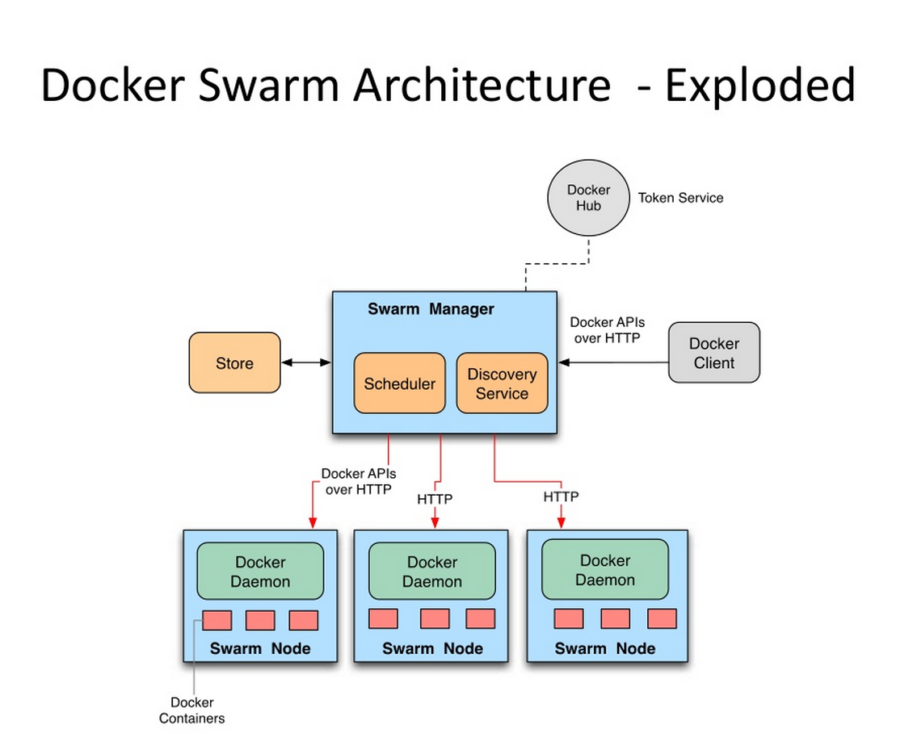

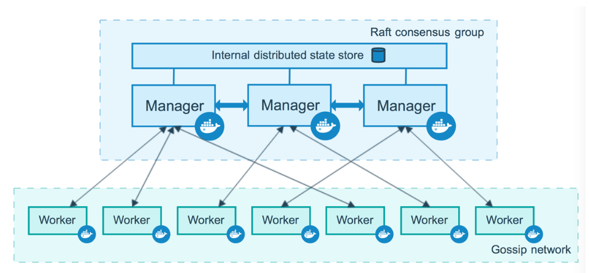

## 2.2 概念

**节点 (node):** 就是一台docker host上面运行了docker engine.节点分为两类:

- 管理节点(manager node) 负责管理集群中的节点并向工作节点分配任务
- 工作节点(worker node) 接收管理节点分配的任务，运行任务

~~~powershell
# docker node ls
~~~

**服务(services):** 在工作节点运行的，由多个任务共同组成

~~~powershell
# docker service ls
~~~

**任务(task):** 运行在工作节点上容器或容器中包含应用，是集群中调度最小管理单元

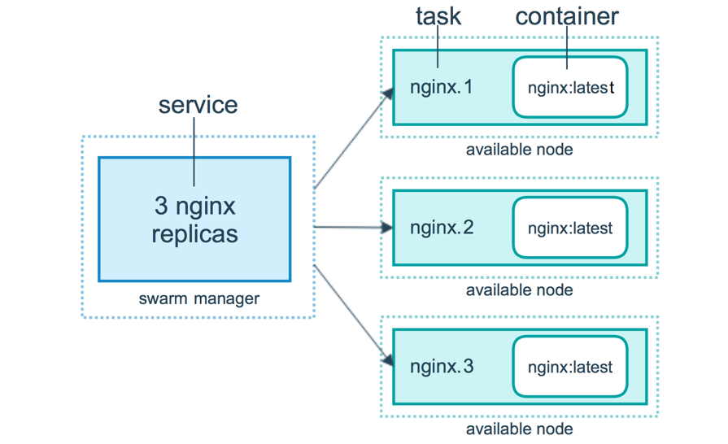

# 三、docker swarm集群部署

> 部署3主2从节点集群，另需提前准备1台本地容器镜像仓库服务器(Harbor)

## 3.1 容器镜像仓库 Harbor准备

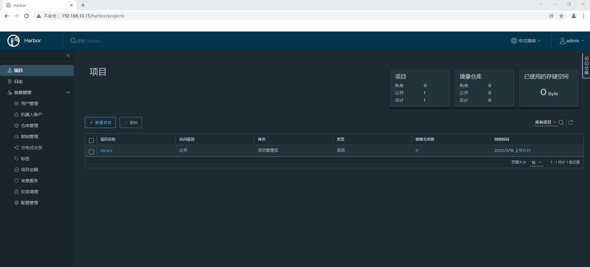

## 3.2 主机准备

### 3.2.1 主机名

~~~powershell
# hostnamectl set-hostname xxx
~~~

~~~powershell
说明：
sm1 管理节点1
sm2 管理节点2
sm3 管理节点3
sw1 工作节点1
sw2 工作节点2
~~~

### 3.2.2 IP地址

~~~powershell
编辑网卡配置文件
# vim /etc/sysconfig/network-scripts/ifcfg-ens33
# cat /etc/sysconfig/network-scripts/ifcfg-ens33
TYPE="Ethernet"
PROXY_METHOD="none"
BROWSER_ONLY="no"
BOOTPROTO="none" 修改为静态
DEFROUTE="yes"
IPV4_FAILURE_FATAL="no"
IPV6INIT="yes"
IPV6_AUTOCONF="yes"
IPV6_DEFROUTE="yes"
IPV6_FAILURE_FATAL="no"
IPV6_ADDR_GEN_MODE="stable-privacy"
NAME="ens33"

DEVICE="ens33"
ONBOOT="yes"

添加如下内容：
IPADDR="192.168.10.xxx"
PREFIX="24"
GATEWAY="192.168.10.2"
DNS1="119.29.29.29"

~~~

~~~powershell
说明：
sm1 管理节点1 192.168.10.10
sm2 管理节点2 192.168.10.11
sm3 管理节点3 192.168.10.12
sw1 工作节点1 192.168.10.13
sw2 工作节点2 192.168.10.14
~~~

### 3.2.3 主机名与IP地址解析

~~~powershell
编辑主机/etc/hosts文件，添加主机名解析
# vim /etc/hosts
# cat /etc/hosts
127.0.0.1   localhost localhost.localdomain localhost4 localhost4.localdomain4
::1         localhost localhost.localdomain localhost6 localhost6.localdomain6
192.168.10.10 sm1
192.168.10.11 sm2
192.168.10.12 sm3
192.168.10.13 sw1
192.168.10.14 sw2
~~~

### 3.3.4 主机时间同步

~~~powershell
添加计划任务，实现时间同步，同步服务器为time1.aliyun.com
# crontab -e
no crontab for root - using an empty one
crontab: installing new crontab

查看添加后计划任务
# crontab -l
0 */1 * * * ntpdate time1.aliyun.com
~~~

### 3.2.5 主机安全设置

~~~powershell
关闭防火墙并查看其运行状态
# systemctl stop firewalld;systemctl disable firewalld
# firewall-cmd --state
not running
~~~

~~~powershell
使用非交互式修改selinux配置文件
# sed -ri 's/SELINUX=enforcing/SELINUX=disabled/' /etc/selinux/config

重启所有的主机系统
# reboot

重启后验证selinux是否关闭
# sestatus
SELinux status:                 disabled
~~~

## 3.3 docker安装

### 3.3.1 docker安装

~~~powershell
下载YUM源
# wget -O /etc/yum.repos.d/docker-ce.repo https://mirrors.aliyun.com/docker-ce/linux/centos/docker-ce.repo
~~~

~~~powershell
安装docker-ce
# yum -y install docker-ce
~~~

~~~powershell
启动docker服务并设置为开机自启动
# systemctl enable docker;systemctl start docker
~~~

### 3.3.2 配置docker daemon使用harbor

~~~powershell
添加daemon.json文件，配置docker daemon使用harbor
# vim /etc/docker/daemon.json
# cat /etc/docker/daemon.json
{
        "insecure-registries": ["http://192.168.10.15"]
}
~~~

~~~powershell
重启docker服务
# ystemctl restart docker
~~~

~~~powershell
深度登录harbor
# docker login 192.168.10.15
Username: admin
Password: 12345
WARNING! Your password will be stored unencrypted in /root/.docker/config.json.
Configure a credential helper to remove this warning. See
https://docs.docker.com/engine/reference/commandline/login/#credentials-store

Login Succeeded
~~~

## 3.4 docker swarm集群初始化

### 3.4.1 获取docker swarm命令帮助

~~~powershell
获取docker swarm命令使用帮助
# docker swarm --help

Usage:  docker swarm COMMAND

Manage Swarm

Commands:
  ca          Display and rotate the root CA
  init        Initialize a swarm                    初始化
  join        Join a swarm as a node and/or manager 加入集群
  join-token  Manage join tokens                    集群加入时token管理
  leave       Leave the swarm                       离开集群
  unlock      Unlock swarm
  unlock-key  Manage the unlock key
  update      Update the swarm                      更新集群
~~~

### 3.4.2 在管理节点初始化

> 本次在sm1上初始化

~~~powershell
初始化集群
# docker swarm init --advertise-addr 192.168.10.10 --listen-addr 192.168.10.10:2377
Swarm initialized: current node (j42cwubrr70pwxdpmesn1cuo6) is now a manager.

To add a worker to this swarm, run the following command:

    docker swarm join --token SWMTKN-1-297iry1n2jeh30oopsjecvsco1uuvl15t2jz6jxabdpf0xkry4-6pddlyiq5f1i35w8d7q4bl1co 192.168.10.10:2377

To add a manager to this swarm, run 'docker swarm join-token manager' and follow the instructions.
~~~

~~~powershell
说明：
--advertise-addr 当主机有多块网卡时使用其选择其中一块用于广播,用于其它节点连接管理节点使用
--listen-addr    监听地址，用于承载集群流量使用
~~~

### 3.4.3 添加工作节点到集群

~~~powershell
使用初始化过程中生成的token加入集群
[root@sw1 ~]# docker swarm join --token SWMTKN-1-297iry1n2jeh30oopsjecvsco1uuvl15t2jz6jxabdpf0xkry4-6pddlyiq5f1i35w8d7q4bl1co 192.168.10.10:2377
This node joined a swarm as a worker.
~~~

~~~powershell
查看已加入的集群
# docker node ls
ID                            HOSTNAME   STATUS    AVAILABILITY   MANAGER STATUS   ENGINE VERSION
j42cwubrr70pwxdpmesn1cuo6 *   sm1        Ready     Active         Leader           20.10.12
4yb34kuma6i9g5hf30vkxm9yc     sw1        Ready     Active                          20.10.12
~~~

> 如果使用的token已过期，可以再次生成新的加入集群的方法，如下命令所示。

~~~powershell
重新生成用于添加工作点的token
[root@sm1 ~]# docker swarm join-token worker
To add a worker to this swarm, run the following command:

    docker swarm join --token SWMTKN-1-297iry1n2jeh30oopsjecvsco1uuvl15t2jz6jxabdpf0xkry4-6pddlyiq5f1i35w8d7q4bl1co 192.168.10.10:2377
~~~

~~~powershell
加入至集群
[root@sw2 ~]# docker swarm join --token SWMTKN-1-297iry1n2jeh30oopsjecvsco1uuvl15t2jz6jxabdpf0xkry4-6pddlyiq5f1i35w8d7q4bl1co 192.168.10.10:2377
This node joined a swarm as a worker.
~~~

~~~powershell
查看node状态
# docker node ls
ID                            HOSTNAME   STATUS    AVAILABILITY   MANAGER STATUS   ENGINE VERSION
j42cwubrr70pwxdpmesn1cuo6 *   sm1        Ready     Active         Leader           20.10.12
4yb34kuma6i9g5hf30vkxm9yc     sw1        Ready     Active                          20.10.12
mekitdu1xbpcttgupwuoiwg91     sw2        Ready     Active                          20.10.12
~~~

### 3.4.4 添加管理节点到集群

~~~powershell
生成用于添加管理节点加入集群所使用的token
[root@sm1 ~]# docker swarm join-token manager
To add a manager to this swarm, run the following command:

    docker swarm join --token SWMTKN-1-297iry1n2jeh30oopsjecvsco1uuvl15t2jz6jxabdpf0xkry4-7g85apo82mwz8ttmgdr7onfhu 192.168.10.10:2377
~~~

~~~powershell
加入集群
[root@sm2 ~]# docker swarm join --token SWMTKN-1-297iry1n2jeh30oopsjecvsco1uuvl15t2jz6jxabdpf0xkry4-7g85apo82mwz8ttmgdr7onfhu 192.168.10.10:2377
This node joined a swarm as a manager.
~~~

~~~powershell
加入集群
[root@sm3 ~]# docker swarm join --token SWMTKN-1-297iry1n2jeh30oopsjecvsco1uuvl15t2jz6jxabdpf0xkry4-7g85apo82mwz8ttmgdr7onfhu 192.168.10.10:2377
This node joined a swarm as a manager.
~~~

~~~powershell
查看节点状态
# docker node ls
ID                            HOSTNAME   STATUS    AVAILABILITY   MANAGER STATUS   ENGINE VERSION
j42cwubrr70pwxdpmesn1cuo6 *   sm1        Ready     Active         Leader           20.10.12
nzpmehm8n87b9a17or2el10lc     sm2        Ready     Active         Reachable        20.10.12
xc2x9z1b33rwdfxc5sdpobf0i     sm3        Ready     Active         Reachable        20.10.12
4yb34kuma6i9g5hf30vkxm9yc     sw1        Ready     Active                          20.10.12
mekitdu1xbpcttgupwuoiwg91     sw2        Ready     Active                          20.10.12
~~~

### 3.4.5 模拟管理节点出现故障

#### 3.4.5.1 停止docker服务并查看结果

~~~powershell
停止docker服务
[root@sm1 ~]# systemctl stop docker
~~~

~~~powershell
查看node状态，发现sm1不可达，状态为未知，并重启选择出leader
[root@sm2 ~]# docker node ls
ID                            HOSTNAME   STATUS    AVAILABILITY   MANAGER STATUS   ENGINE VERSION
j42cwubrr70pwxdpmesn1cuo6     sm1        Unknown   Active         Unreachable      20.10.12
nzpmehm8n87b9a17or2el10lc *   sm2        Ready     Active         Leader           20.10.12
xc2x9z1b33rwdfxc5sdpobf0i     sm3        Ready     Active         Reachable        20.10.12
4yb34kuma6i9g5hf30vkxm9yc     sw1        Ready     Active                          20.10.12
mekitdu1xbpcttgupwuoiwg91     sw2        Ready     Active                          20.10.12
~~~

#### 3.4.5.2 启动docker服务并查看结果

~~~powershell
再次重动docker
[root@sm1 ~]# systemctl start docker
~~~

~~~powershell
观察可以得知sm1是可达状态，但并不是Leader
[root@sm1 ~]# docker node ls
ID                            HOSTNAME   STATUS    AVAILABILITY   MANAGER STATUS   ENGINE VERSION
j42cwubrr70pwxdpmesn1cuo6 *   sm1        Ready     Active         Reachable        20.10.12
nzpmehm8n87b9a17or2el10lc     sm2        Ready     Active         Leader           20.10.12
xc2x9z1b33rwdfxc5sdpobf0i     sm3        Ready     Active         Reachable        20.10.12
4yb34kuma6i9g5hf30vkxm9yc     sw1        Ready     Active                          20.10.12
mekitdu1xbpcttgupwuoiwg91     sw2        Ready     Active                          20.10.12
~~~

# 四、docker swarm集群应用

## 4.1 容器镜像准备

> 准备多个版本的容器镜像，以便于后期使用测试。

### 4.1.1 v1版本

~~~powershell
生成网站文件v1版
[root@harbor nginximg]# vim index.html
[root@harbor nginximg]# cat index.html
v1
~~~

~~~powershell
编写Dockerfile文件，用于构建容器镜像
[root@harbor nginximg]# vim Dockerfile
[root@harbor nginximg]# cat Dockerfile
FROM nginx:latest

MAINTAINER  'tom<tom@kubemsb.com>'

ADD index.html /usr/share/nginx/html

RUN echo "daemon off;" >> /etc/nginx/nginx.conf

EXPOSE 80

CMD /usr/sbin/nginx
~~~

~~~powershell
使用docker build构建容器镜像
[root@harbor nginximg]# docker build -t 192.168.10.15/library/nginx:v1 .
~~~

~~~powershell
登录harbor
# docker login 192.168.10.15
Username: admin
Password: 12345
~~~

~~~powershell
推送容器镜像至harbor
# docker push 192.168.10.15/library/nginx:v1
~~~

### 4.1.2 v2版本

~~~powershell
生成网站文件v2版
[root@harbor nginximg]# vim index.html
[root@harbor nginximg]# cat index.html
v2
~~~

~~~powershell
编写Dockerfile文件，用于构建容器镜像
[root@harbor nginximg]# vim Dockerfile
[root@harbor nginximg]# cat Dockerfile
FROM nginx:latest

MAINTAINER  'tom<tom@kubemsb.com>'

ADD index.html /usr/share/nginx/html

RUN echo "daemon off;" >> /etc/nginx/nginx.conf

EXPOSE 80

CMD /usr/sbin/nginx
~~~

~~~powershell
使用docker build构建容器镜像
[root@harbor nginximg]# docker build -t 192.168.10.15/library/nginx:v2 .
~~~

~~~powershell
推送镜像至Harbor
[root@harbor nginximg]# docker push 192.168.10.15/library/nginx:v2
~~~

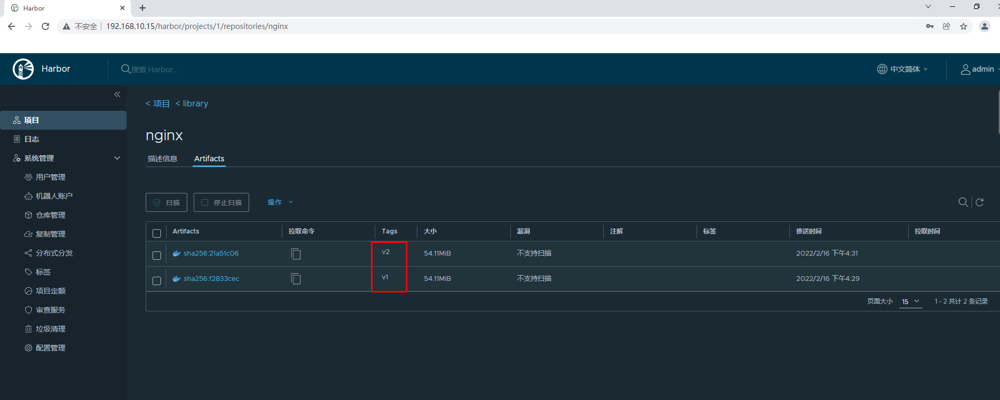

## 4.2 发布服务

在docker swarm中,对外暴露的是服务（service)，而不是容器。

为了保持高可用架构，它准许同时启动多个容器共同支撑一个服务，如果一个容器挂了，它会自动使用另一个容器

### 4.2.1 使用`docker service ls`查看服务

>在管理节点（manager node）上操作

~~~powershell
[root@sm1 ~]# docker service ls
ID        NAME      MODE      REPLICAS   IMAGE     PORTS
~~~

### 4.2.2 发布服务

~~~powershell
[root@sm1 ~]# docker service create --name nginx-svc-1 --replicas 1 --publish 80:80  192.168.10.15/library/nginx:v1
ucif0ibkjqrd7meal6vqwnduz
overall progress: 1 out of 1 tasks
1/1: running   [==================================================>]
verify: Service converged
~~~

~~~powershell
说明
* 创建一个服务,名为nginx_svc-1
* replicas 1指定1个副本
* --publish 80:80  将服务内部的80端口发布到外部网络的80端口
* 使用的镜像为`192.168.10.15/library/nginx:v1`
~~~

### 4.2.3 查看已发布服务

~~~powershell
[root@sm1 ~]# docker service ls
ID             NAME          MODE         REPLICAS   IMAGE                            PORTS
ucif0ibkjqrd   nginx-svc-1   replicated   1/1        192.168.10.15/library/nginx:v1   *:80->80/tcp
~~~

### 4.2.4 查看已发布服务容器

~~~powershell
[root@sm1 ~]# docker service ps  nginx-svc-1
ID             NAME            IMAGE                            NODE      DESIRED STATE   CURRENT STATE            ERROR     PORTS
47t0s0egf6xf   nginx-svc-1.1   192.168.10.15/library/nginx:v1   sw1       Running         Running 48 minutes ago

~~~

~~~powershell
[root@sw1 ~]# docker ps
CONTAINER ID   IMAGE                            COMMAND                  CREATED          STATUS          PORTS     NAMES
1bdf8981f511   192.168.10.15/library/nginx:v1   "/docker-entrypoint.…"   53 minutes ago   Up 53 minutes   80/tcp    nginx-svc-1.1.47t0s0egf6xf1n8m0c0jez3q0
~~~

### 4.2.5 访问已发布的服务

~~~powershell
[root@sm1 ~]# curl http://192.168.10.10
v1
[root@sm1 ~]# curl http://192.168.10.11
v1
[root@sm1 ~]# curl http://192.168.10.12
v1
[root@sm1 ~]# curl http://192.168.10.13
v1
[root@sm1 ~]# curl http://192.168.10.14
v1
~~~

**在集群之外的主机访问**

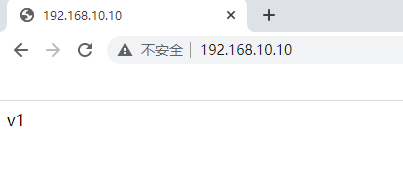

## 4.3 服务扩展

使用scale指定副本数来扩展

~~~powershell
[root@sm1 ~]# docker service scale nginx-svc-1=2
nginx-svc-1 scaled to 2
overall progress: 2 out of 2 tasks
1/2: running   [==================================================>]
2/2: running   [==================================================>]
verify: Service converged
~~~

~~~powershell
[root@sm1 ~]# docker service ls
ID             NAME          MODE         REPLICAS   IMAGE                            PORTS
ucif0ibkjqrd   nginx-svc-1   replicated   2/2        192.168.10.15/library/nginx:v1   *:80->80/tcp
~~~

~~~powershell
[root@sm1 ~]# docker service ps nginx-svc-1
ID             NAME            IMAGE                            NODE      DESIRED STATE   CURRENT STATE               ERROR     PORTS
47t0s0egf6xf   nginx-svc-1.1   192.168.10.15/library/nginx:v1   sw1       Running         Running about an hour ago
oy16nuh5udn0   nginx-svc-1.2   192.168.10.15/library/nginx:v1   sw2       Running         Running 57 seconds ago

~~~

~~~powershell
[root@sw1 ~]# docker ps
CONTAINER ID   IMAGE                            COMMAND                  CREATED             STATUS             PORTS     NAMES
1bdf8981f511   192.168.10.15/library/nginx:v1   "/docker-entrypoint.…"   About an hour ago   Up About an hour   80/tcp    nginx-svc-1.1.47t0s0egf6xf1n8m0c0jez3q0
~~~

~~~powershell
[root@sw2 ~]# docker ps
CONTAINER ID   IMAGE                            COMMAND                  CREATED              STATUS              PORTS     NAMES
0923c0d10223   192.168.10.15/library/nginx:v1   "/docker-entrypoint.…"   About a minute ago   Up About a minute   80/tcp    nginx-svc-1.2.oy16nuh5udn0s1hda5bcpr9hd
~~~

**问题：现在仅扩展为2个副本，如果把服务扩展到3个副本，集群会如何分配主机呢？**

~~~powershell
[root@sm1 ~]# docker service scale nginx-svc-1=3
nginx-svc-1 scaled to 3
overall progress: 3 out of 3 tasks
1/3: running   [==================================================>]
2/3: running   [==================================================>]
3/3: running   [==================================================>]
verify: Service converged
~~~

~~~powershell
[root@sm1 ~]# docker service ps nginx-svc-1
ID             NAME            IMAGE                            NODE      DESIRED STATE   CURRENT STATE               ERROR     PORTS
47t0s0egf6xf   nginx-svc-1.1   192.168.10.15/library/nginx:v1   sw1       Running         Running about an hour ago
oy16nuh5udn0   nginx-svc-1.2   192.168.10.15/library/nginx:v1   sw2       Running         Running 12 minutes ago
mn9fwxqbc9d1   nginx-svc-1.3   192.168.10.15/library/nginx:v1   sm1       Running         Running 9 minutes ago
~~~

~~~powershell
说明：
当把服务扩展到一定数量时，管理节点也会参与到负载运行中来。
~~~

## 4.4 服务裁减

~~~powershell
[root@sm1 ~]# docker service scale nginx-svc-1=2
nginx-svc-1 scaled to 2
overall progress: 2 out of 2 tasks
1/2: running   [==================================================>]
2/2: running   [==================================================>]
verify: Service converged
~~~

~~~powershell
[root@sm1 ~]# docker service ls
ID             NAME          MODE         REPLICAS   IMAGE                            PORTS
ucif0ibkjqrd   nginx-svc-1   replicated   2/2        192.168.10.15/library/nginx:v1   *:80->80/tcp
~~~

~~~powershell
[root@sm1 ~]# docker service ps nginx-svc-1
ID             NAME            IMAGE                            NODE      DESIRED STATE   CURRENT STATE            ERROR     PORTS
47t0s0egf6xf   nginx-svc-1.1   192.168.10.15/library/nginx:v1   sw1       Running         Running 2 hours ago
oy16nuh5udn0   nginx-svc-1.2   192.168.10.15/library/nginx:v1   sw2       Running         Running 29 minutes ago
~~~

## 4.5 负载均衡

> 服务中包含多个容器时，每次访问将以轮询的方式访问到每个容器

~~~powershell
修改sw1主机中容器网页文件
[root@sw1 ~]# docker ps
CONTAINER ID   IMAGE                            COMMAND                  CREATED             STATUS             PORTS     NAMES
1bdf8981f511   192.168.10.15/library/nginx:v1   "/docker-entrypoint.…"   About an hour ago   Up About an hour   80/tcp    nginx-svc-1.1.47t0s0egf6xf1n8m0c0jez3q0
[root@sw1 ~]# docker exec -it 1bdf bash
root@1bdf8981f511:/# echo "sw1 web" > /usr/share/nginx/html/index.html
root@1bdf8981f511:/# exit
~~~

~~~powershell
修改sw2主机中容器网页文件
[root@sw2 ~]# docker ps
CONTAINER ID   IMAGE                            COMMAND                  CREATED          STATUS          PORTS     NAMES
0923c0d10223   192.168.10.15/library/nginx:v1   "/docker-entrypoint.…"   42 minutes ago   Up 42 minutes   80/tcp    nginx-svc-1.2.oy16nuh5udn0s1hda5bcpr9hd
[root@sw2 ~]# docker exec -it 0923 bash
root@0923c0d10223:/# echo "sw2 web" > /usr/share/nginx/html/index.html
root@0923c0d10223:/# exit
~~~

~~~powershell
[root@sm1 ~]# curl http://192.168.10.10
sw1 web
[root@sm1 ~]# curl http://192.168.10.10
sw2 web
[root@sm1 ~]# curl http://192.168.10.10
sw1 web
[root@sm1 ~]# curl http://192.168.10.10
sw2 web
~~~

## 4.6  删除服务

~~~powershell
[root@sm1 ~]# docker service ls
ID             NAME          MODE         REPLICAS   IMAGE                            PORTS
ucif0ibkjqrd   nginx-svc-1   replicated   2/2        192.168.10.15/library/nginx:v1   *:80->80/tcp
~~~

~~~powershell
[root@sm1 ~]# docker service rm nginx-svc-1
nginx-svc-1
~~~

~~~powershell
[root@sm1 ~]# docker service ls
ID        NAME      MODE      REPLICAS   IMAGE     PORTS
~~~

## 4.7 服务版本更新

~~~powershell
[root@sm1 ~]# docker service create --name nginx-svc --replicas=1 --publish 80:80 192.168.10.15/library/nginx:v1
yz3wq6f1cgf10vtq5ne4qfwjz
overall progress: 1 out of 1 tasks
1/1: running   [==================================================>]
verify: Service converged
~~~

~~~powershell
[root@sm1 ~]# curl http://192.168.10.10
v1
~~~

~~~powershell
[root@sm1 ~]# docker service update nginx-svc --image 192.168.10.15/library/nginx:v2
nginx-svc
overall progress: 1 out of 1 tasks
1/1: running   [==================================================>]
verify: Service converged
~~~

~~~powershell
[root@sm1 ~]# curl http://192.168.10.10
v2
~~~

## 4.8 服务版本回退

~~~powershell
[root@sm1 ~]# docker service update nginx-svc --image 192.168.10.15/library/nginx:v1
nginx-svc
overall progress: 1 out of 1 tasks
1/1: running   [==================================================>]
verify: Service converged
~~~

## 4.9 服务版本滚动间隔更新

~~~powershell
# docker service create --name nginx-svc --replicas 60 --publish 80:80 192.168.10.15/library/nginx:v1
pqrt561dckg2wfpect3vf9ll0
overall progress: 60 out of 60 tasks
verify: Service converged
~~~

~~~powershell
[root@sm1 ~]# docker service update --replicas 60 --image 192.168.10.15/library/nginx:v2 --update-parallelism 5 --update-delay 30s nginx-svc
nginx-svc
overall progress: 3 out of 3 tasks
1/3: running   [==================================================>]
2/3: running   [==================================================>]
3/3: running   [==================================================>]
verify: Service converged
~~~

~~~powershell
说明
* --update-parallelism 5 指定并行更新数量
* --update-delay 30s 指定更新间隔时间
~~~

~~~powershell
docker swarm滚动更新会造成节点上有exit状态的容器,可以考虑清除
命令如下：
[root@sw1 ~]# docker container prune
WARNING! This will remove all stopped containers.
Are you sure you want to continue? [y/N] y
~~~

## 4.10 副本控制器

> 副本控制器

~~~powershell
[root@sm1 ~]# docker service ls
ID             NAME        MODE         REPLICAS   IMAGE                            PORTS
yz3wq6f1cgf1   nginx-svc   replicated   3/3        192.168.10.15/library/nginx:v2   *:80->80/tcp
~~~

~~~powershell
[root@sm1 ~]# docker service ps nginx-svc
ID             NAME              IMAGE                            NODE      DESIRED STATE   CURRENT STATE          ERROR     PORTS
x78l0santsbb   nginx-svc.1       192.168.10.15/library/nginx:v2   sw2       Running         Running 3 hours ago
ura9isskfxku    \_ nginx-svc.1   192.168.10.15/library/nginx:v1   sm1       Shutdown        Shutdown 3 hours ago
z738gvgazish    \_ nginx-svc.1   192.168.10.15/library/nginx:v2   sw1       Shutdown        Shutdown 3 hours ago
3qsrkkxn32bl    \_ nginx-svc.1   192.168.10.15/library/nginx:v1   sm3       Shutdown        Shutdown 3 hours ago
psbi0mxu3amy   nginx-svc.2       192.168.10.15/library/nginx:v2   sw1       Running         Running 3 hours ago
zpjw39bwhd78   nginx-svc.3       192.168.10.15/library/nginx:v2   sm1       Running         Running 3 hours ago
~~~

~~~~powershell
[root@sm1 ~]# docker ps
CONTAINER ID   IMAGE                            COMMAND                  CREATED       STATUS       PORTS     NAMES
81fffd9132d8   192.168.10.15/library/nginx:v2   "/docker-entrypoint.…"   3 hours ago   Up 3 hours   80/tcp    nginx-svc.3.zpjw39bwhd78pw49svpy4q8zd
[root@sm1 ~]# docker stop 81fffd9132d8;docker rm 81fffd9132d8
81fffd9132d8
81fffd9132d8
~~~~

~~~powershell
[root@sm1 ~]# docker service ls
ID             NAME        MODE         REPLICAS   IMAGE                            PORTS
yz3wq6f1cgf1   nginx-svc   replicated   3/3        192.168.10.15/library/nginx:v2   *:80->80/tcp
[root@sm1 ~]# docker service ps nginx-svc
ID             NAME              IMAGE                            NODE      DESIRED STATE   CURRENT STATE            ERROR                         PORTS
x78l0santsbb   nginx-svc.1       192.168.10.15/library/nginx:v2   sw2       Running         Running 3 hours ago
ura9isskfxku    \_ nginx-svc.1   192.168.10.15/library/nginx:v1   sm1       Shutdown        Shutdown 3 hours ago
z738gvgazish    \_ nginx-svc.1   192.168.10.15/library/nginx:v2   sw1       Shutdown        Shutdown 3 hours ago
3qsrkkxn32bl    \_ nginx-svc.1   192.168.10.15/library/nginx:v1   sm3       Shutdown        Shutdown 3 hours ago
psbi0mxu3amy   nginx-svc.2       192.168.10.15/library/nginx:v2   sw1       Running         Running 3 hours ago
qv6ya3crz1fj   nginx-svc.3       192.168.10.15/library/nginx:v2   sm1       Running         Running 13 seconds ago
zpjw39bwhd78    \_ nginx-svc.3   192.168.10.15/library/nginx:v2   sm1       Shutdown        Failed 19 seconds ago    "task: non-zero exit (137)"
~~~

## 4.11 在指定网络中发布服务

~~~powershell
[root@sm1 ~]# docker network create -d overlay tomcat-net
mrkgccdfddy8zg92ja6fpox7p
[root@sm1 ~]# docker network ls
NETWORK ID     NAME              DRIVER    SCOPE
5ba369c13795   bridge            bridge    local
54568abb541a   docker_gwbridge   bridge    local
4edcb5c4a324   host              host      local
l6xmfxiiseqk   ingress           overlay   swarm
5d06d748c9c7   none              null      local
mrkgccdfddy8   tomcat-net        overlay   swarm
[root@sm1 ~]# docker network inspect tomcat-net
[
    {
        "Name": "tomcat-net",
        "Id": "mrkgccdfddy8zg92ja6fpox7p",
        "Created": "2022-02-16T13:56:52.338589006Z",
        "Scope": "swarm",
        "Driver": "overlay",
        "EnableIPv6": false,
        "IPAM": {
            "Driver": "default",
            "Options": null,
            "Config": [
                {
                    "Subnet": "10.0.1.0/24",
                    "Gateway": "10.0.1.1"
                }
            ]
        },
        "Internal": false,
        "Attachable": false,
        "Ingress": false,
        "ConfigFrom": {
            "Network": ""
        },
        "ConfigOnly": false,
        "Containers": null,
        "Options": {
            "com.docker.network.driver.overlay.vxlanid_list": "4097"
        },
        "Labels": null
    }
]
~~~

~~~powershell
说明：
创建名为tomcat-net的覆盖网络(Overlay Netowork)，这是个二层网络，处于该网络下的docker容器，即使宿主机不一样，也能相互访问
~~~

~~~powershell
# docker service create --name tomcat \
--network tomcat-net \
-p 8080:8080 \
--replicas 2 \
tomcat:7.0.96-jdk8-openjdk
~~~

~~~powershell
说明：
创建名为tomcat的服务，使用了刚才创建的覆盖网络
~~~

~~~powershell
[root@sm1 ~]# docker service ls
ID             NAME      MODE         REPLICAS   IMAGE                        PORTS
wgqkz8vymxkr   tomcat    replicated   2/2        tomcat:7.0.96-jdk8-openjdk   *:8080->8080/tcp
~~~

~~~powershell
[root@sm1 ~]# docker service ps tomcat
ID             NAME       IMAGE                        NODE      DESIRED STATE   CURRENT STATE            ERROR     PORTS
fsx1fnssbmtg   tomcat.1   tomcat:7.0.96-jdk8-openjdk   sm3       Running         Running 49 seconds ago
gq0ogycj7orb   tomcat.2   tomcat:7.0.96-jdk8-openjdk   sm2       Running         Running 58 seconds ago
~~~

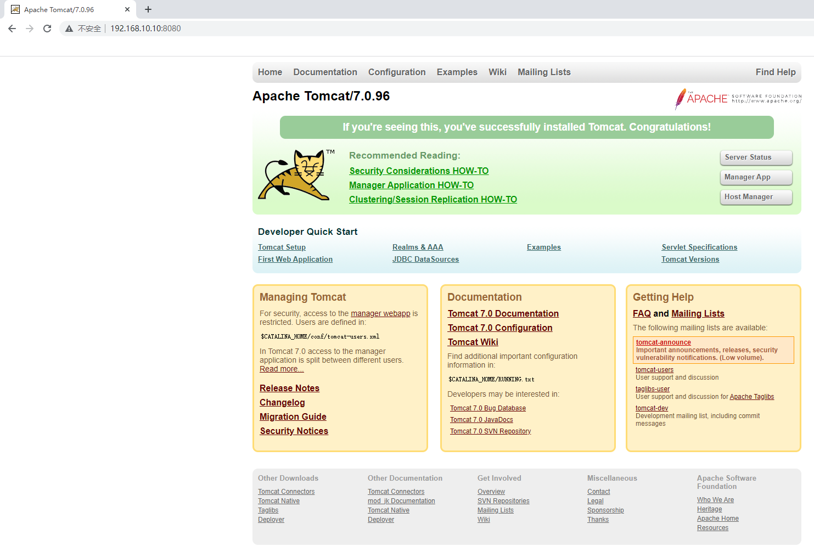

## 4.12 服务网络模式

- 服务模式一共有两种：Ingress和Host，如果不指定，则默认的是Ingress；

  - Ingress模式下，到达Swarm任何节点的8080端口的流量，都会映射到任何服务副本的内部80端口，就算该节点上没有tomcat服务副本也会映射；

  

~~~powershell
# docker service create --name tomcat \
--network tomcat-net \
-p 8080:8080 \
--replicas 2 \
tomcat:7.0.96-jdk8-openjdk
~~~

~~~powershell
[root@sm1 ~]# docker service ps tomcat
ID             NAME       IMAGE                        NODE      DESIRED STATE   CURRENT STATE           ERROR     PORTS
fsx1fnssbmtg   tomcat.1   tomcat:7.0.96-jdk8-openjdk   sm3       Running         Running 8 minutes ago
gq0ogycj7orb   tomcat.2   tomcat:7.0.96-jdk8-openjdk   sm2       Running         Running 8 minutes ago
~~~

~~~powershell
[root@sm2 ~]# docker ps
CONTAINER ID   IMAGE                        COMMAND             CREATED         STATUS         PORTS      NAMES
f650498c8e71   tomcat:7.0.96-jdk8-openjdk   "catalina.sh run"   9 minutes ago   Up 9 minutes   8080/tcp   tomcat.2.gq0ogycj7orbu4ua1dwk140as

[root@sm2 ~]# docker inspect f650498c8e71 | grep IPAddress
            "SecondaryIPAddresses": null,
            "IPAddress": "",
                    "IPAddress": "10.0.0.24", ingress IP地址
                    "IPAddress": "10.0.1.9",  容器IP地址

~~~

~~~powershell
[root@sm3 ~]# docker ps
CONTAINER ID   IMAGE                        COMMAND             CREATED         STATUS         PORTS      NAMES
9d0c412717d7   tomcat:7.0.96-jdk8-openjdk   "catalina.sh run"   9 minutes ago   Up 9 minutes   8080/tcp   tomcat.1.fsx1fnssbmtgv3qh84fgqknlh

[root@sm3 ~]# docker inspect 9d0c412717d7 | grep IPAddress
            "SecondaryIPAddresses": null,
            "IPAddress": "",
                    "IPAddress": "10.0.0.23",
                    "IPAddress": "10.0.1.8",

~~~

~~~powershell
[root@sm1 ~]# ss -anput | grep ":8080"
tcp    LISTEN     0      128    [::]:8080               [::]:*                   users:(("dockerd",pid=2727,fd=54))
~~~

~~~powershell
[root@sm2 ~]# ss -anput | grep ":8080"
tcp    LISTEN     0      128    [::]:8080               [::]:*                   users:(("dockerd",pid=1229,fd=26))
~~~

~~~powershell
[root@sm3 ~]# ss -anput | grep ":8080"
tcp    LISTEN     0      128    [::]:8080               [::]:*                   users:(("dockerd",pid=1226,fd=22))
~~~

~~~powershell
[root@sw1 ~]# ss -anput | grep ":8080"
tcp    LISTEN     0      128    [::]:8080               [::]:*                   users:(("dockerd",pid=1229,fd=39))
~~~

~~~powershell
[root@sw2 ~]# ss -anput | grep ":8080"
tcp    LISTEN     0      128    [::]:8080               [::]:*                   users:(("dockerd",pid=1229,fd=22))
~~~

- Host模式下，仅在运行有容器副本的机器上开放端口，使用Host模式的命令如下：

~~~powershell
# docker service create --name tomcat \
--network tomcat-net \
--publish published=8080,target=8080,mode=host \
--replicas 3 \
tomcat:7.0.96-jdk8-openjdk
~~~

~~~powershell
[root@sm1 ~]# docker service ps tomcat
ID             NAME       IMAGE                        NODE      DESIRED STATE   CURRENT STATE            ERROR     PORTS
x6022h0oungs   tomcat.1   tomcat:7.0.96-jdk8-openjdk   sw1       Running         Running 19 seconds ago             *:8080->8080/tcp,*:8080->8080/tcp
jmnthwqi6ubf   tomcat.2   tomcat:7.0.96-jdk8-openjdk   sm1       Running         Running 18 seconds ago             *:8080->8080/tcp,*:8080->8080/tcp
nvcbijnfy2es   tomcat.3   tomcat:7.0.96-jdk8-openjdk   sw2       Running         Running 19 seconds ago             *:8080->8080/tcp,*:8080->8080/tcp

~~~

~~~powershell
[root@sm1 ~]# ss -anput | grep ":8080"
tcp    LISTEN     0      128       *:8080                  *:*                   users:(("docker-proxy",pid=20963,fd=4))
tcp    LISTEN     0      128    [::]:8080               [::]:*                   users:(("docker-proxy",pid=20967,fd=4))
~~~

~~~powershell
[root@sw1 ~]# ss -anput | grep ":8080"
tcp    LISTEN     0      128       *:8080                  *:*                   users:(("docker-proxy",pid=20459,fd=4))
tcp    LISTEN     0      128    [::]:8080               [::]:*                   users:(("docker-proxy",pid=20463,fd=4))
~~~

~~~powershell
[root@sw2 ~]# ss -anput | grep ":8080"
tcp    LISTEN     0      128       *:8080                  *:*                   users:(("docker-proxy",pid=19938,fd=4))
tcp    LISTEN     0      128    [::]:8080               [::]:*                   users:(("docker-proxy",pid=19942,fd=4))
~~~

~~~powershell
没有被映射端口
[root@sm2 ~]# ss -anput | grep ":8080"

[root@sm3 ~]# ss -anput | grep ":8080"
~~~

## 4.13 服务数据持久化存储

### 4.13.1 本地存储

#### 4.13.1.1 在集群所有主机上创建本地目录

~~~powershell
# mkdir -p /data/nginxdata
~~~

#### 4.13.1.2 发布服务时挂载本地目录到容器中

~~~powershell
[root@sm1 ~]# docker service create --name nginx-svc --replicas 3 --mount "type=bind,source=/data/nginxdata,target=/usr/share/nginx/html" --publish 80:80  192.168.10.15/library/nginx:v1

s31z75rniv4p53ycbqch3xbqm
overall progress: 3 out of 3 tasks
1/3: running   [==================================================>]
2/3: running   [==================================================>]
3/3: running   [==================================================>]
verify: Service converged
~~~

#### 4.13.1.3 验证是否使用本地目录

~~~powershell
[root@sm1 ~]# docker service ls
ID             NAME        MODE         REPLICAS   IMAGE                            PORTS
s31z75rniv4p   nginx-svc   replicated   3/3        192.168.10.15/library/nginx:v1   *:80->80/tcp

~~~

~~~powershell
[root@sm1 ~]# docker service ps nginx-svc
ID             NAME          IMAGE                            NODE      DESIRED STATE   CURRENT STATE            ERROR     PORTS
vgfhk4lksbtp   nginx-svc.1   192.168.10.15/library/nginx:v1   sm2       Running         Running 54 seconds ago
v2bs9araxeuc   nginx-svc.2   192.168.10.15/library/nginx:v1   sw2       Running         Running 59 seconds ago
1m7fobr3cscz   nginx-svc.3   192.168.10.15/library/nginx:v1   sm3       Running         Running 59 seconds ago
~~~

~~~powershell
[root@sm2 ~]# ls /data/nginxdata/
[root@sm2 ~]# echo "sm2 web" > /data/nginxdata/index.html
~~~

~~~powershell
[root@sm3 ~]# ls /data/nginxdata/
[root@sm3 ~]# echo "sm3 web" > /data/nginxdata/index.html
~~~

~~~powershell
[root@sw2 ~]# ls /data/nginxdata
[root@sw2 ~]# echo "sw2 web" > /data/nginxdata/index.html
~~~

~~~powershell
[root@sm1 ~]# curl http://192.168.10.10
sm2 web
[root@sm1 ~]# curl http://192.168.10.10
sm3 web
[root@sm1 ~]# curl http://192.168.10.10
sw2 web
~~~

> 存在数据一致性问题

### 4.13.2 网络存储

* 网络存储卷可以实现跨docker宿主机的数据共享,数据持久保存到网络存储卷中
* 在创建service时添加卷的挂载参数,网络存储卷可以帮助自动挂载(**但需要集群节点都创建该网络存储卷**)

#### 4.13.2.1 部署NFS存储

> 本案例以NFS提供远程存储为例

> 在192.168.10.15服务器上部署NFS服务，共享目录为docker swarm集群主机使用。

~~~powershell
[root@harbor ~]# mkdir /opt/dockervolume

~~~

~~~powershell
[root@harbor ~]# yum -y install nfs-utils
~~~

~~~powershell
[root@harbor ~]# vim /etc/exports
[root@harbor ~]# cat /etc/exports
/opt/dockervolume       *(rw,sync,no_root_squash)
~~~

~~~powershell
[root@harbor ~]# systemctl enable nfs-server

[root@harbor ~]# systemctl start nfs-server
~~~

~~~powershell
[root@harbor ~]# showmount -e
Export list for harbor:
/opt/dockervolume *
~~~

#### 4.13.2.2 为集群所有主机安装nfs-utils软件

~~~powershell
# yum -y install nfs-utils
~~~

~~~powershell
# showmount -e 192.168.10.15
Export list for 192.168.10.15:
/opt/dockervolume *
~~~

#### 4.13.2.3 创建存储卷

> 集群中所有节点

~~~powershell
# docker volume create  --driver local --opt type=nfs --opt o=addr=192.168.10.15,rw --opt device=:/opt/dockervolume nginx_volume
nginx_volume

~~~

~~~powershell
# docker volume ls
DRIVER    VOLUME NAME
local     nginx_volume
~~~

~~~powershell
# docker volume inspect nginx_volume
[
    {
        "CreatedAt": "2022-02-16T23:29:11+08:00",
        "Driver": "local",
        "Labels": {},
        "Mountpoint": "/var/lib/docker/volumes/nginx_volume/_data",
        "Name": "nginx_volume",
        "Options": {
            "device": ":/opt/dockervolume",
            "o": "addr=192.168.10.15,rw",
            "type": "nfs"
        },
        "Scope": "local"
    }
]
~~~

#### 4.13.2.4 发布服务

~~~powershell
[root@sm1 ~]# docker service create  --name nginx-svc --replicas 3 --publish 80:80 --mount "type=volume,source=nginx_volume,target=/usr/share/nginx/html"  192.168.10.15/library/nginx:v1
uh6k84b87n8vciuirln4zqb4v
overall progress: 3 out of 3 tasks
1/3: running   [==================================================>]
2/3: running   [==================================================>]
3/3: running   [==================================================>]
verify: Service converged
~~~

#### 4.13.2.5 验证

~~~powershell
[root@sm1 ~]# docker service ls
ID             NAME        MODE         REPLICAS   IMAGE                            PORTS
uh6k84b87n8v   nginx-svc   replicated   3/3        192.168.10.15/library/nginx:v1   *:80->80/tcp
[root@sm1 ~]# docker service ps nginx-svc
ID             NAME          IMAGE                            NODE      DESIRED STATE   CURRENT STATE            ERROR     PORTS
k2vxpav5oadf   nginx-svc.1   192.168.10.15/library/nginx:v1   sw2       Running         Running 43 seconds ago
v8fh0r89wt5i   nginx-svc.2   192.168.10.15/library/nginx:v1   sw1       Running         Running 43 seconds ago
xb0nyft8ou4d   nginx-svc.3   192.168.10.15/library/nginx:v1   sm1       Running         Running 43 seconds ago
~~~

~~~powershell
[root@sm1 ~]# df -Th | grep nfs
:/opt/dockervolume      nfs        50G  8.9G   42G   18% /var/lib/docker/volumes/nginx_volume/_data
~~~

~~~powershell
[root@sw1 ~]# df -Th | grep nfs
:/opt/dockervolume      nfs        50G  8.9G   42G   18% /var/lib/docker/volumes/nginx_volume/_data
~~~

~~~powershell
[root@sw2 ~]# df -Th | grep nfs
:/opt/dockervolume      nfs        50G  8.9G   42G   18% /var/lib/docker/volumes/nginx_volume/_data
~~~

~~~powershell
[root@harbor ~]# echo "nfs test" > /opt/dockervolume/index.html
~~~

~~~powershell
[root@sm1 ~]# curl http://192.168.10.10
nfs test
[root@sm1 ~]# curl http://192.168.10.11
nfs test
[root@sm1 ~]# curl http://192.168.10.12
nfs test
[root@sm1 ~]# curl http://192.168.10.13
nfs test
[root@sm1 ~]# curl http://192.168.10.14
nfs test

~~~

## 4.14 服务互联与服务发现

如果一个nginx服务与一个mysql服务之间需要连接,在docker swarm如何实现呢?

**方法1:**

把mysql服务也使用 `--publish`参数发布到外网,但这样做的缺点是:mysql这种服务发布到外网不安全

**方法2:**

将mysql服务等运行在内部网络,只需要nginx服务能够连接mysql就可以了,在docker swarm中可以使用==**overlay**==网络来实现。

但现在还有个问题,服务副本数发生变化时,容器内部的IP发生变化时,我们希望仍然能够访问到这个服务, 这就是**==服务发现（service discovery)==**.

**通过服务发现, service的使用者都不需要知道service运行在哪里,IP是多少,有多少个副本,就能让service通信**

下面使用`docker network ls`查看到的ingress网络就是一个overlay类型的网络,但它不支持服务发现

~~~powershell
[root@sm1 ~]# docker network ls
NETWORK ID     NAME              DRIVER    SCOPE
5ba369c13795   bridge            bridge    local
54568abb541a   docker_gwbridge   bridge    local
4edcb5c4a324   host              host      local
l6xmfxiiseqk   ingress           overlay   swarm 此处
5d06d748c9c7   none              null      local
mrkgccdfddy8   tomcat-net        overlay   swarm
~~~

我们**需要自建一个overlay网络来实现服务发现, 需要相互通信的service也必须属于同一个overlay网络**

~~~powershell
[root@sm1 ~]# docker network create --driver overlay --subnet 192.168.100.0/24 self-network
ejpf8zzig5rjsgefqucopcsdt
~~~

说明:

* --driver overlay指定为overlay类型
* --subnet 分配网段
* self-network  为自定义的网络名称

~~~powershell
[root@sm1 ~]# docker network ls
NETWORK ID     NAME              DRIVER    SCOPE
5ba369c13795   bridge            bridge    local
54568abb541a   docker_gwbridge   bridge    local
4edcb5c4a324   host              host      local
l6xmfxiiseqk   ingress           overlay   swarm
5d06d748c9c7   none              null      local
ejpf8zzig5rj   self-network      overlay   swarm 此处
mrkgccdfddy8   tomcat-net        overlay   swarm
~~~

**验证自动发现**

1, 发布nignx-svc服务,指定在自建的overlay网络

~~~powershell
[root@sm1 ~]# docker service create --name nginx-svc --replicas 3 --network self-network --publish 80:80  192.168.10.15/library/nginx:v1
rr21tvm1xpi6vk3ic83tfy9e5
overall progress: 3 out of 3 tasks
1/3: running   [==================================================>]
2/3: running   [==================================================>]
3/3: running   [==================================================>]
verify: Service converged
~~~

2, 发布一个busybox服务,也指定在自建的overlay网络

~~~powershell
[root@sm1 ~]# docker service create --name test --network self-network  busybox sleep 100000
w14lzhhzdyqwt18lrby4euw98
overall progress: 1 out of 1 tasks
1/1: running   [==================================================>]
verify: Service converged
~~~

说明:

* 服务名为test

* busybox是一个集成了linux常用命令的软件,这里使用它可以比较方便的测试与nginx_service的连通性
* 没有指定副本,默认1个副本
* 因为它并不是长时间运行的daemon守护进程,所以运行一下就会退出.sleep 100000是指定一个长的运行时间,让它有足够的时间给我们测试

3, 查出test服务在哪个节点运行的容器

~~~powershell
[root@sm1 ~]# docker service ps test
ID             NAME      IMAGE            NODE      DESIRED STATE   CURRENT STATE                ERROR     PORTS
x8nkifpdtyw5   test.1    busybox:latest   sm2       Running         Running about a minute ago
~~~

4, 去运行test服务的容器节点查找容器的名称

~~~powershell
[root@sm2 ~]# docker ps
CONTAINER ID   IMAGE            COMMAND          CREATED              STATUS              PORTS     NAMES
8df13819bd5c   busybox:latest   "sleep 100000"   About a minute ago   Up About a minute             test.1.x8nkifpdtyw5177zhr0r1lxad
~~~

5, 使用查找出来的容器名称,执行命令测试

~~~powershell
[root@sm2 ~]# docker exec -it test.1.x8nkifpdtyw5177zhr0r1lxad ping -c 2 nginx-svc
PING nginx-svc (192.168.100.2): 56 data bytes
64 bytes from 192.168.100.2: seq=0 ttl=64 time=0.093 ms
64 bytes from 192.168.100.2: seq=1 ttl=64 time=0.162 ms

--- nginx-svc ping statistics ---
2 packets transmitted, 2 packets received, 0% packet loss
round-trip min/avg/max = 0.093/0.127/0.162 ms
~~~

**测试的结果为: test服务可以ping通nginx_service服务,并且返回的IP为自建网络的一个IP(192.168.100.2)**

~~~powershell
[root@sm1 ~]# docker service inspect nginx-svc
[
  ......
            "VirtualIPs": [
                {
                    "NetworkID": "l6xmfxiiseqkl57wnsm4cykps",
                    "Addr": "10.0.0.36/24"
                },
                {
                    "NetworkID": "ejpf8zzig5rjsgefqucopcsdt",
                    "Addr": "192.168.100.2/24" 与此处IP地址保持一致。
                }
            ]
        }
    }
]
~~~

6, 分别去各个节点查找nginx_service服务的各个容器(3个副本),发现它们的IP与上面ping的IP都不同

~~~powershell
[root@sm1 ~]# docker inspect nginx-svc.1.6nxixaw3tn2ld3vklfjldnpl5 | grep IPAddress
            "SecondaryIPAddresses": null,
            "IPAddress": "",
                    "IPAddress": "10.0.0.37",
                    "IPAddress": "192.168.100.3",
~~~

~~~powershell
[root@sw1 ~]# docker inspect nginx-svc.3.steywkaxfboynglx4bsji6jd1 | grep -i ipaddress
            "SecondaryIPAddresses": null,
            "IPAddress": "",
                    "IPAddress": "10.0.0.39",
                    "IPAddress": "192.168.100.5",
~~~

~~~powershell
[root@sw2 ~]# docker inspect nginx-svc.2.rz1iifb9eg0tos7r59cbesucd | grep -i ipaddress
            "SecondaryIPAddresses": null,
            "IPAddress": "",
                    "IPAddress": "10.0.0.38",
                    "IPAddress": "192.168.100.4",
~~~

7, 后续测试, 将nginx_service服务扩展,裁减,更新,回退.都不影响test服务访问nginx-svc。

**结论: 在自建的overlay网络内,通过服务发现可以实现服务之间通过服务名(不用知道对方的IP)互联,而且不会受服务内副本个数和容器内IP变化等的影响。**

## 4.15 docker swarm网络

在 Swarm Service 中有三个重要的网络概念：

-  **Overlay networks** 管理 Swarm 中 Docker 守护进程间的通信。你可以将服务附加到一个或多个已存在的 `overlay` 网络上，使得服务与服务之间能够通信。
-  **ingress network** 是一个特殊的 `overlay` 网络，用于服务节点间的负载均衡。当任何 Swarm 节点在发布的端口上接收到请求时，它将该请求交给一个名为 `IPVS` 的模块。`IPVS` 跟踪参与该服务的所有IP地址，选择其中的一个，并通过 `ingress` 网络将请求路由到它。
   初始化或加入 Swarm 集群时会自动创建 `ingress` 网络，大多数情况下，用户不需要自定义配置，但是 docker 17.05 和更高版本允许你自定义。
-  **docker_gwbridge**是一种桥接网络，将 `overlay` 网络（包括 `ingress` 网络）连接到一个单独的 Docker 守护进程的物理网络。默认情况下，服务正在运行的每个容器都连接到本地 Docker 守护进程主机的 `docker_gwbridge` 网络。
   `docker_gwbridge` 网络在初始化或加入 Swarm 时自动创建。大多数情况下，用户不需要自定义配置，但是 Docker 允许自定义。

| 名称            | 类型    | 注释 |
| --------------- | ------- | ---- |
| docker_gwbridge | bridge  | none |
| ingress         | overlay | none |
| custom-network  | overlay | none |

- docker_gwbridge和ingress是swarm自动创建的，当用户执行了docker swarm init/connect之后。

- docker_gwbridge是bridge类型的负责本机container和主机直接的连接

- ingress负责service在多个主机container之间的路由。

- custom-network是用户自己创建的overlay网络，通常我们都需要创建自己的network并把service挂在上面。

 

# 五、docker stack

## 5.1 docker stack介绍

早期使用service发布，每次只能发布一个service。

yaml可以发布多个服务，但是使用docker-compose只能在一台主机发布。

一个stack就是一组有关联的服务的组合，可以一起编排，一起发布, 一起管理

## 5.2 docker stack与docker compose区别

- Docker stack会忽略了“构建”指令，无法使用stack命令构建新镜像，它是需要镜像是预先已经构建好的。 所以docker-compose更适合于开发场景；
- Docker Compose是一个Python项目，在内部，它使用Docker API规范来操作容器。所以需要安装Docker -compose，以便与Docker一起在您的计算机上使用；
- Docker Stack功能包含在Docker引擎中。你不需要安装额外的包来使用它，docker stacks 只是swarm mode的一部分。
- Docker stack不支持基于第2版写的docker-compose.yml ，也就是version版本至少为3。然而Docker Compose对版本为2和3的 文件仍然可以处理；
- docker stack把docker compose的所有工作都做完了，因此docker stack将占主导地位。同时，对于大多数用户来说，切换到使用docker stack既不困难，也不需要太多的开销。如果您是Docker新手，或正在选择用于新项目的技术，请使用docker stack。

## 5.3 docker stack常用命令

| 命令                  | 描述                       |
| --------------------- | -------------------------- |
| docker stack deploy   | 部署新的堆栈或更新现有堆栈 |
| docker stack ls       | 列出现有堆栈               |
| docker stack ps       | 列出堆栈中的任务           |
| docker stack rm       | 删除一个或多个堆栈         |
| docker stack services | 列出堆栈中的服务           |

## 5.4 部署wordpress案例

1, 编写YAML文件

~~~powershell
[root@sm1 ~]# vim stack1.yaml
[root@sm1 ~]# cat stack1.yaml
version: '3'
services:
  db:
    image: mysql:5.7
    environment:
      MYSQL_ROOT_PASSWORD: somewordpress
      MYSQL_DATABASE: wordpress
      MYSQL_USER: wordpress
      MYSQL_PASSWORD: wordpress
    deploy:
      replicas: 1

  wordpress:
    depends_on:
      - db
    image: wordpress:latest
    ports:
      - "8010:80"
    environment:
      WORDPRESS_DB_HOST: db:3306
      WORDPRESS_DB_USER: wordpress
      WORDPRESS_DB_PASSWORD: wordpress
      WORDPRESS_DB_NAME: wordpress
    deploy:
      replicas: 1
      placement:
        constraints: [node.role == manager]
~~~

说明:

* placement的constraints限制此容器在manager节点

2, 使用docker stack发布

~~~powershell
[root@sm1 ~]# docker stack deploy -c stack1.yaml stack1
Creating network stack1_default						创建自建的overlay网络
Creating service stack1_db							创建stack1_db服务
Creating service stack1_wordpress					创建stack1_wordpress服务
~~~

**如果报错,使用`docker stack rm stack1`删除.排完错再启动**

~~~powershell
[root@sm1 ~]# docker stack ls
NAME      SERVICES   ORCHESTRATOR
stack1    2          Swarm
~~~

~~~powershell
[root@sm1 ~]# docker service ls
ID             NAME               MODE         REPLICAS   IMAGE              PORTS
tw1a8rnde2yr   stack1_db          replicated   1/1        mysql:5.7
zf1h2r4m12li   stack1_wordpress   replicated   1/1        wordpress:latest   *:8010->80/tcp
~~~

3, 验证

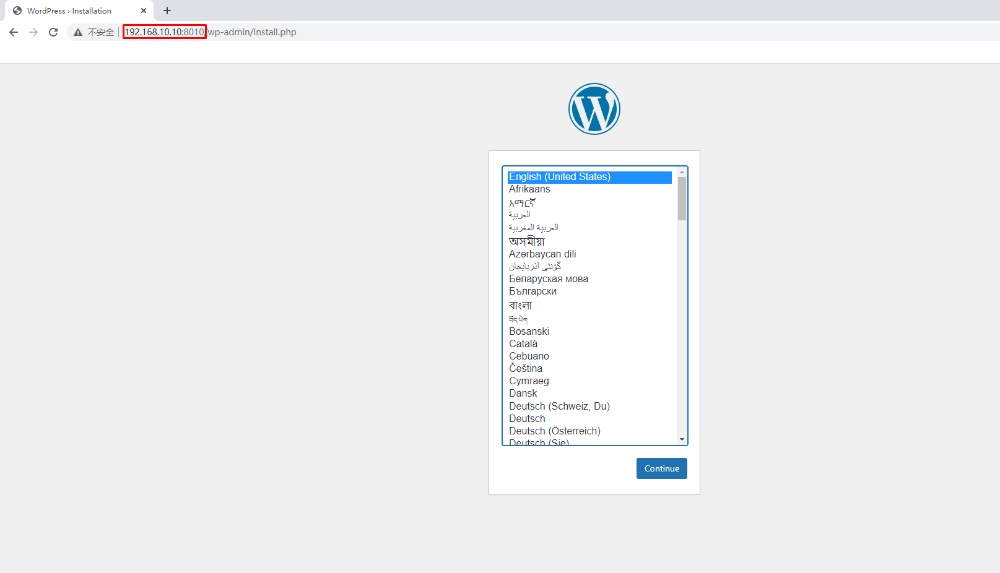

## 5.5  部署nginx与web管理服务案例

1, 编写YAML文件

~~~powershell
[root@sm1 ~]# vim stack2.yaml
[root@sm1 ~]# cat stack2.yaml
version: "3"
services:
  nginx:
    image: 192.168.10.15/library/nginx:v1
    ports:
      - 80:80
    deploy:
      mode: replicated
      replicas: 3

  visualizer:
    image: dockersamples/visualizer
    ports:
      - "9001:8080"
    volumes:
      - "/var/run/docker.sock:/var/run/docker.sock"
    deploy:
      replicas: 1
      placement:
        constraints: [node.role == manager]

  portainer:
    image: portainer/portainer
    ports:
      - "9000:9000"
    volumes:
      - "/var/run/docker.sock:/var/run/docker.sock"
    deploy:
      replicas: 1
      placement:
        constraints: [node.role == manager]
~~~

说明: stack中共有3个service

* nginx服务,3个副本
* visualizer服务: 图形查看docker swarm集群
* portainer服务: 图形管理docker swarm集群

2,使用docker stack发布

~~~powershell
[root@sm1 ~]# docker stack deploy -c stack2.yaml stack2
Creating network stack2_default
Creating service stack2_portainer
Creating service stack2_nginx
Creating service stack2_visualizer

如果报错,使用docker stack rm stack2删除.排完错再启动
~~~

~~~powershell
[root@sm1 ~]# docker stack ps stack2
ID             NAME                  IMAGE                             NODE      DESIRED STATE   CURRENT STATE             ERROR     PORTS
zpkt1780g2nr   stack2_nginx.1        192.168.10.15/library/nginx:v1    sm2       Running         Running 54 seconds ago
9iqdgw2fxk0s   stack2_nginx.2        192.168.10.15/library/nginx:v1    sm3       Running         Running 54 seconds ago
4h0ob7b4ho2a   stack2_nginx.3        192.168.10.15/library/nginx:v1    sw2       Running         Running 54 seconds ago
jpp7h6qheh4j   stack2_portainer.1    portainer/portainer:latest        sm1       Running         Running 21 seconds ago
ty0mktx60typ   stack2_visualizer.1   dockersamples/visualizer:latest   sm1       Running         Starting 22 seconds ago
~~~

3,验证

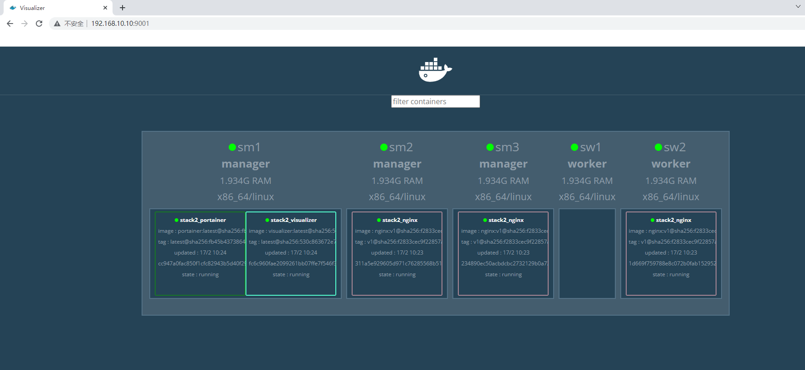

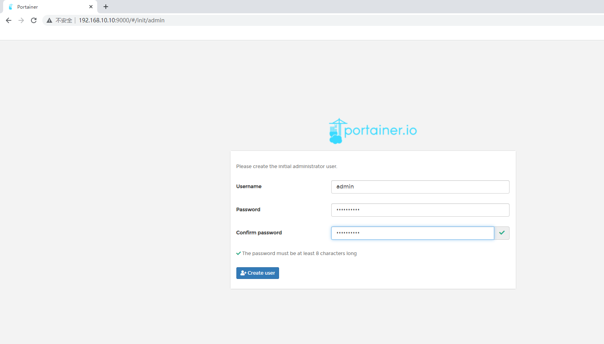

## 5.6 nginx+haproxy+nfs案例

1,在docker swarm管理节点上准备配置文件

~~~powershell
[root@sm1 ~]# mkdir -p /docker-stack/haproxy
[root@sm1 ~]# cd /docker-stack/haproxy/

[root@sm1 haproxy]# vim haproxy.cfg
global
  log 127.0.0.1 local0
  log 127.0.0.1 local1 notice

defaults
  log global
  mode http
  option httplog
  option dontlognull
  timeout connect 5000ms
  timeout client 50000ms
  timeout server 50000ms
  stats uri /status

frontend balancer
    bind *:8080
    mode http
    default_backend web_backends

backend web_backends
    mode http
    option forwardfor
    balance roundrobin
    server web1 nginx1:80 check
    server web2 nginx2:80 check
    server web3 nginx3:80 check
    option httpchk GET /
    http-check expect status 200

~~~

2, 编写YAML编排文件

~~~powershell
[root@sm1 haproxy]# vim stack3.yml
[root@sm1 haproxy]# vim stack3.yaml
[root@sm1 haproxy]# cat stack3.yaml
version: "3"
services:
  nginx1:
    image: 192.168.10.15/library/nginx:v1
    deploy:
      mode: replicated
      replicas: 1
      restart_policy:
        condition: on-failure
    volumes:
    - "nginx_vol:/usr/share/nginx/html"

  nginx2:
    image: 192.168.10.15/library/nginx:v1
    deploy:
      mode: replicated
      replicas: 1
      restart_policy:
        condition: on-failure
    volumes:
    - "nginx_vol:/usr/share/nginx/html"

  nginx3:
    image: 192.168.10.15/library/nginx:v1
    deploy:
      mode: replicated
      replicas: 1
      restart_policy:
        condition: on-failure
    volumes:
    - "nginx_vol:/usr/share/nginx/html"

  haproxy:
    image: haproxy:latest
    volumes:
      - "./haproxy.cfg:/usr/local/etc/haproxy/haproxy.cfg:ro"
    ports:
      - "8080:8080"
    deploy:
      replicas: 1
      placement:
        constraints: [node.role == manager]

volumes:
  nginx_vol:
    driver: local
    driver_opts:
      type: "nfs"
      o: "addr=192.168.10.15,rw"
      device: ":/opt/dockervolume"
~~~

3, 发布

~~~powershell
[root@sm1 haproxy]# docker stack deploy -c stack3.yml stack3
Creating network stack3_default
Creating service stack3_nginx3
Creating service stack3_haproxy
Creating service stack3_nginx1
Creating service stack3_nginx2
~~~

4, 验证

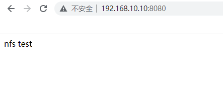

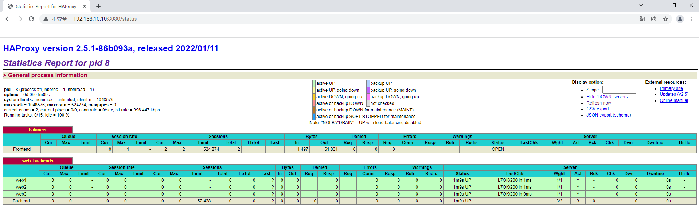

