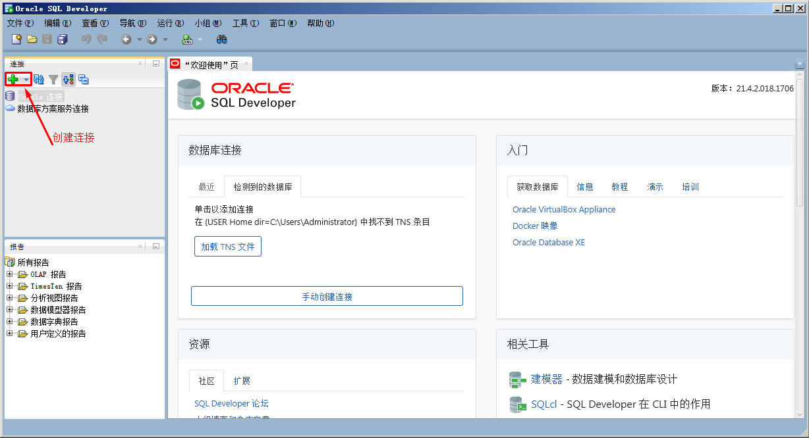
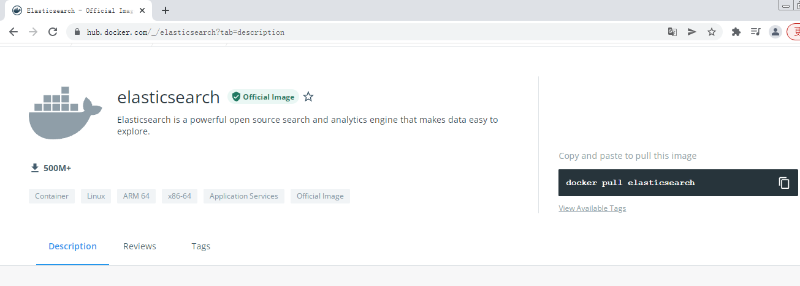

# Docker容器化部署企业级应用集群

# 一、Docker容器化部署企业级应用

## 1.1 使用Docker容器化部署企业级应用必要性

- 有利于快速实现企业级应用部署
- 有利于快速实现企业级应用恢复

## 1.2 使用Docker容器化部署企业级应用参考资料

# 二、使用Docker容器实现Nginx部署

## 2.1 获取参考资料

## 2.2 运行Nginx应用容器

> 不在docker host暴露端口

~~~powershell
# docker run -d --name nginx-server -v /opt/nginx-server:/usr/share/nginx/html:ro nginx
664cd1bbda4ad2a71cbd09f0c6baa9b34db80db2d69496670a960be07b9521cb
~~~

~~~powershell
# docker ps
CONTAINER ID   IMAGE       COMMAND                  CREATED          STATUS          PORTS                                                  NAMES
664cd1bbda4a   nginx       "/docker-entrypoint.…"   4 seconds ago    Up 3 seconds    80/tcp                                                 nginx-server
~~~

~~~powershell
# docker inspect 664 | grep IPAddress
            "SecondaryIPAddresses": null,
            "IPAddress": "172.17.0.3",
                    "IPAddress": "172.17.0.3",
~~~

~~~powershell
# curl http://172.17.0.3
<html>
<head><title>403 Forbidden</title></head>
<body>

<h1>403 Forbidden</h1>

nginx/1.21.6

</body>
</html>
~~~

~~~powershell
# ls /opt
nginx-server
# echo "nginx is working" > /opt/nginx-server/index.html
~~~

~~~powershell
# curl http://172.17.0.3
nginx is working
~~~

## 2.3 运行Nginx应用容器

>在docker host暴露80端口

~~~powershell
# docker run -d -p 80:80 --name nginx-server-port -v /opt/nginx-server-port:/usr/share/nginx/html:ro nginx
~~~

~~~powershell
# docker ps
CONTAINER ID   IMAGE       COMMAND                  CREATED             STATUS             PORTS                                                  NAMES
74dddf51983d   nginx       "/docker-entrypoint.…"   3 seconds ago       Up 2 seconds       0.0.0.0:80->80/tcp, :::80->80/tcp                      nginx-server-port
~~~

~~~powershell
# ls /opt
nginx-server  nginx-server-port
~~~

~~~powershell
# echo "nginx is running" > /opt/nginx-server-port/index.html
~~~

**在宿主机上访问**

~~~powershell
# docker top nginx-server-port
UID                 PID                 PPID                C                   STIME               TTY                 TIME                CMD
root                22195               22163               0                   15:08               ?                   00:00:00            nginx: master process nginx -g daemon off;
101                 22387               22195               0                   15:08               ?                   00:00:00            nginx: worker process

~~~

## 2.4 运行Nginx应用容器

> 挂载配置文件,需要创建一个nginx容器，把配置文件复制出来修改后使用。

~~~powershell
# docker cp nginxwebcontainername:/etc/nginx/nginx.conf /opt/nginxcon/
修改后即可使用
~~~

~~~powershell
# ls /opt/nginxcon/nginx.conf
/opt/nginxcon/nginx.conf
~~~

~~~powershell
# docker run -d \
-p 82:80 --name nginx-server-conf \
-v /opt/nginx-server-conf:/usr/share/nginx/html:ro \
-v /opt/nginxcon/nginx.conf:/etc/nginx/nginx.conf:ro \
nginx
76251ec44e5049445399303944fc96eb8161ccb49e27b673b99cb2492009523c
~~~

~~~powershell
# docker top nginx-server-conf
UID                 PID                 PPID                C                   STIME               TTY                 TIME                CMD
root                25005               24972               0                   15:38               ?                   00:00:00            nginx: master process nginx -g daemon off;
101                 25178               25005               0                   15:38               ?                   00:00:00            nginx: worker process
101                 25179               25005               0                   15:38               ?                   00:00:00            nginx: worker process
~~~

# 三、使用Docker容器实现Tomcat部署

## 3.1 获取参考资料

## 3.2 运行tomcat应用容器

### 3.2.1 不暴露端口运行

~~~powershell
# docker run -d --rm tomcat:9.0
~~~

~~~powershell
# docker ps
CONTAINER ID   IMAGE        COMMAND                  CREATED             STATUS             PORTS                                                  NAMES
c20a0e781246   tomcat:9.0   "catalina.sh run"        27 seconds ago      Up 25 seconds      8080/tcp                                               heuristic_cori
~~~

### 3.2.2 暴露端口运行

~~~powershell
# docker run -d -p 8080:8080 --rm tomcat:9.0
2fcf5762314373c824928490b871138a01a94abedd7e6814ad5f361d09fbe1de
~~~

~~~powershell
# docker ps
CONTAINER ID   IMAGE        COMMAND                  CREATED             STATUS             PORTS                                                  NAMES
2fcf57623143   tomcat:9.0   "catalina.sh run"        3 seconds ago       Up 1 second        0.0.0.0:8080->8080/tcp, :::8080->8080/tcp              eloquent_chatelet
~~~

**在宿主机访问**

~~~powershell
# docker exec 2fc ls /usr/local/tomcat/webapps
里面为空，所以可以添加网站文件。
~~~

### 3.2.3 暴露端口及添加网站文件

~~~powershell
# docker run -d -p 8081:8080 -v /opt/tomcat-server:/usr/local/tomcat/webapps/ROOT tomcat:9.0
f456e705d48fc603b7243a435f0edd6284558c194e105d87befff2dccddc0b63
~~~

~~~powershell
# docker ps
CONTAINER ID   IMAGE        COMMAND             CREATED         STATUS         PORTS                                       NAMES
f456e705d48f   tomcat:9.0   "catalina.sh run"   3 seconds ago   Up 2 seconds   0.0.0.0:8081->8080/tcp, :::8081->8080/tcp   cool_germain
~~~

~~~powershell
# echo "tomcat running" > /opt/tomcat-server/index.html
~~~

**在宿主机访问**

# 四、使用Docker容器实现MySQL部署

## 4.1 单节点MySQL部署

~~~powershell
# docker run -p 3306:3306 \
 --name mysql \
 -v /opt/mysql/log:/var/log/mysql \
 -v /opt/mysql/data:/var/lib/mysql \
 -v /opt/mysql/conf:/etc/mysql \
 -e MYSQL_ROOT_PASSWORD=root \
 -d \
 mysql:5.7
~~~

~~~powershell
# docker ps
CONTAINER ID   IMAGE       COMMAND                  CREATED          STATUS          PORTS                                                  NAMES
6d16ca21cf31   mysql:5.7   "docker-entrypoint.s…"   32 seconds ago   Up 30 seconds   0.0.0.0:3306->3306/tcp, :::3306->3306/tcp, 33060/tcp   mysql
~~~

~~~powershell
通过容器中客户端访问
# docker exec -it mysql mysql -uroot -proot
mysql: [Warning] Using a password on the command line interface can be insecure.
Welcome to the MySQL monitor.  Commands end with ; or \g.
Your MySQL connection id is 4
Server version: 5.7.37 MySQL Community Server (GPL)

Copyright (c) 2000, 2022, Oracle and/or its affiliates.

Oracle is a registered trademark of Oracle Corporation and/or its
affiliates. Other names may be trademarks of their respective
owners.

Type 'help;' or '\h' for help. Type '\c' to clear the current input statement.

mysql>
~~~

~~~powershell
在docker host上访问
# yum -y install mariadb

# mysql -h 192.168.255.157 -uroot -proot -P 3306
Welcome to the MariaDB monitor.  Commands end with ; or \g.
Your MySQL connection id is 7
Server version: 5.7.37 MySQL Community Server (GPL)

Copyright (c) 2000, 2018, Oracle, MariaDB Corporation Ab and others.

Type 'help;' or '\h' for help. Type '\c' to clear the current input statement.

MySQL [(none)]> show databases;
+--------------------+
| Database           |
+--------------------+
| information_schema |
| mysql              |
| performance_schema |
| sys                |
+--------------------+
4 rows in set (0.00 sec)
~~~

## 4.2 MySQL主从复制集群部署

### 4.2.1 MySQL主节点部署

~~~powershell
# docker run -p 3306:3306 \
 --name mysql-master \
 -v /opt/mysql-master/log:/var/log/mysql \
 -v /opt/mysql-master/data:/var/lib/mysql \
 -v /opt/mysql-master/conf:/etc/mysql \
 -e MYSQL_ROOT_PASSWORD=root \
 -d mysql:5.7
~~~

~~~powershell
# docker ps
CONTAINER ID   IMAGE       COMMAND                  CREATED          STATUS          PORTS                                                  NAMES
2dbbed8e35c7   mysql:5.7   "docker-entrypoint.s…"   58 seconds ago   Up 57 seconds   0.0.0.0:3306->3306/tcp, :::3306->3306/tcp, 33060/tcp   mysql-master
~~~

### 4.2.2 MySQL主节点配置

~~~powershell
# vim /opt/mysql-master/conf/my.cnf
# cat /opt/mysql-master/conf/my.cnf
[client]
default-character-set=utf8

[mysql]
default-character-set=utf8

[mysqld]
init_connect='SET collation_connection = utf8_unicode_ci'
init_connect='SET NAMES utf8'
character-set-server=utf8
collation-server=utf8_unicode_ci
skip-character-set-client-handshake
skip-name-resolve

server_id=1
log-bin=mysql-bin
read-only=0
binlog-do-db=kubemsb_test

replicate-ignore-db=mysql
replicate-ignore-db=sys
replicate-ignore-db=information_schema
replicate-ignore-db=performance_schema
~~~

### 4.2.3 MySQL从节点部署

~~~powershell
# docker run -p 3307:3306 \
 --name mysql-slave \
 -v /opt/mysql-slave/log:/var/log/mysql \
 -v /opt/mysql-slave/data:/var/lib/mysql \
 -v /opt/mysql-slave/conf:/etc/mysql \
 -e MYSQL_ROOT_PASSWORD=root \
 -d 
 --link mysql-master:mysql-master
 mysql:5.7
~~~

~~~powershell
# docker ps
CONTAINER ID   IMAGE       COMMAND                  CREATED         STATUS         PORTS                                                  NAMES
caf7bf3fc68f   mysql:5.7   "docker-entrypoint.s…"   8 seconds ago   Up 6 seconds   33060/tcp, 0.0.0.0:3307->3306/tcp, :::3307->3306/tcp   mysql-slave
~~~

### 4.2.4 MySQL从节点配置

~~~powershell
# vim /opt/mysql-slave/conf/my.cnf
# cat /opt/mysql-slave/conf/my.cnf
[client]
default-character-set=utf8

[mysql]
default-character-set=utf8

[mysqld]
init_connect='SET collation_connection = utf8_unicode_ci'
init_connect='SET NAMES utf8'
character-set-server=utf8
collation-server=utf8_unicode_ci
skip-character-set-client-handshake
skip-name-resolve

server_id=2
log-bin=mysql-bin
read-only=1
binlog-do-db=kubemsb_test

replicate-ignore-db=mysql
replicate-ignore-db=sys
replicate-ignore-db=information_schema
replicate-ignore-db=performance_schema
~~~

### 4.2.5 master节点配置

~~~powershell
# mysql -h 192.168.255.157 -uroot -proot -P 3306
Welcome to the MariaDB monitor.  Commands end with ; or \g.
Your MySQL connection id is 2
Server version: 5.7.37 MySQL Community Server (GPL)

Copyright (c) 2000, 2018, Oracle, MariaDB Corporation Ab and others.

Type 'help;' or '\h' for help. Type '\c' to clear the current input statement.

MySQL [(none)]>
~~~

~~~powershell
授权
MySQL [(none)]> grant replication slave on *.* to 'backup'@'%' identified by '123456';
~~~

~~~powershell
重启容器，使用配置生效
# docker restart mysql-master
~~~

~~~powershell
查看状态
MySQL [(none)]> show master status\G
*************************** 1. row ***************************
             File: mysql-bin.000001
         Position: 154
     Binlog_Do_DB: kubemsb_test
 Binlog_Ignore_DB:
Executed_Gtid_Set:
1 row in set (0.00 sec)
~~~

### 4.2.6 slave节点配置

~~~powershell
# docker restart mysql-slave
~~~

~~~powershell
# mysql -h 192.168.255.157 -uroot -proot -P 3307
Welcome to the MariaDB monitor.  Commands end with ; or \g.
Your MySQL connection id is 2
Server version: 5.7.37 MySQL Community Server (GPL)

Copyright (c) 2000, 2018, Oracle, MariaDB Corporation Ab and others.

Type 'help;' or '\h' for help. Type '\c' to clear the current input statement.

MySQL [(none)]>
~~~

~~~powershell
MySQL [(none)]> change master to master_host='mysql-master', master_user='backup', master_password='123456', master_log_file='mysql-bin.000001', master_log_pos=154, master_port=3306;
~~~

~~~powershell
MySQL [(none)]> start slave;
~~~

~~~powershell
MySQL [(none)]> show slave status\G
*************************** 1. row ***************************
               Slave_IO_State: Waiting for master to send event
                  Master_Host: mysql-master
                  Master_User: backup
                  Master_Port: 3306
                Connect_Retry: 60
              Master_Log_File: mysql-bin.000001
          Read_Master_Log_Pos: 154
               Relay_Log_File: e0872f94c377-relay-bin.000002
                Relay_Log_Pos: 320
        Relay_Master_Log_File: mysql-bin.000001
             Slave_IO_Running: Yes
            Slave_SQL_Running: Yes
              Replicate_Do_DB:
          Replicate_Ignore_DB: mysql,sys,information_schema,performance_schema
           Replicate_Do_Table:
       Replicate_Ignore_Table:
      Replicate_Wild_Do_Table:
  Replicate_Wild_Ignore_Table:
                   Last_Errno: 0
                   Last_Error:
                 Skip_Counter: 0
          Exec_Master_Log_Pos: 154
              Relay_Log_Space: 534
              Until_Condition: None
               Until_Log_File:
                Until_Log_Pos: 0
           Master_SSL_Allowed: No
           Master_SSL_CA_File:
           Master_SSL_CA_Path:
              Master_SSL_Cert:
            Master_SSL_Cipher:
               Master_SSL_Key:
        Seconds_Behind_Master: 0
Master_SSL_Verify_Server_Cert: No
                Last_IO_Errno: 0
                Last_IO_Error:
               Last_SQL_Errno: 0
               Last_SQL_Error:
  Replicate_Ignore_Server_Ids:
             Master_Server_Id: 1
                  Master_UUID: 0130b415-8b21-11ec-8982-0242ac110002
             Master_Info_File: /var/lib/mysql/master.info
                    SQL_Delay: 0
          SQL_Remaining_Delay: NULL
      Slave_SQL_Running_State: Slave has read all relay log; waiting for more updates
           Master_Retry_Count: 86400
                  Master_Bind:
      Last_IO_Error_Timestamp:
     Last_SQL_Error_Timestamp:
               Master_SSL_Crl:
           Master_SSL_Crlpath:
           Retrieved_Gtid_Set:
            Executed_Gtid_Set:
                Auto_Position: 0
         Replicate_Rewrite_DB:
                 Channel_Name:
           Master_TLS_Version:
1 row in set (0.00 sec)
~~~

### 4.2.7 验证MySQL集群可用性

~~~powershell
在MySQL Master节点添加kubemsb_test数据库
# mysql -h 192.168.255.157 -uroot -proot -P3306

MySQL [(none)]> create database kubemsb_test;
Query OK, 1 row affected (0.00 sec)

MySQL [(none)]> show databases;
+--------------------+
| Database           |
+--------------------+
| information_schema |
| kubemsb_test       |     |
| mysql              |
| performance_schema |
| sys                |
+--------------------+
6 rows in set (0.00 sec)
~~~

~~~powershell
在MySQL Slave节点查看同步情况
# mysql -h 192.168.255.157 -uroot -proot -P3307

MySQL [(none)]> show databases;
+--------------------+
| Database           |
+--------------------+
| information_schema |
| kubemsb_test       |
| mysql              |
| performance_schema |
| sys                |
+--------------------+
5 rows in set (0.00 sec)
~~~

# 五、使用Docker容器实现Oracle部署

## 5.1 获取参考资料

## 5.2 运行oracle容器

~~~powershell
# docker pull oracleinanutshell/oracle-xe-11g
~~~

~~~powershell
# docker run -h oracle --name oracle -d -p 49160:22 -p 49161:1521 -p 49162:8080 oracleinanutshell/oracle-xe-11g
237db949020abf2cee12e3193fa8a34d9dfadaafd9d5604564668d4472abe0b2
~~~

~~~powershell
# docker ps
CONTAINER ID   IMAGE                             COMMAND                  CREATED         STATUS         PORTS                                                                                                                               NAMES
237db949020a   oracleinanutshell/oracle-xe-11g   "/bin/sh -c '/usr/sb…"   7 seconds ago   Up 4 seconds   0.0.0.0:49160->22/tcp, :::49160->22/tcp, 0.0.0.0:49161->1521/tcp, :::49161->1521/tcp, 0.0.0.0:49162->8080/tcp, :::49162->8080/tcp   oracle
~~~

~~~powershell
说明：
49160 为ssh端口
49161 为sqlplus端口
49162 为oem端口
~~~

~~~powershell
oracle数据库连接信息
port:49161
sid:xe
username:system
password:oracle

SYS用户密码为:oracle
~~~

## 5.3 下载客户端连接工具

下载链接地址：https://www.oracle.com/tools/downloads/sqldev-downloads.html

# 六、使用Docker容器实现ElasticSearch+Kibana部署

## 6.1 获取参考资料

### 6.1.1 ES部署参考资料

### 6.1.2 Kibana部署参考资料

## 6.2 ES部署

~~~powershell
# docker pull elasticsearch:7.17.0
~~~

~~~powershell
# mkdir -p /opt/es/config
# mkdir -p /opt/es/data
~~~

~~~powershell
# echo "http.host: 0.0.0.0" >> /opt/es/config/elasticsearch.yml
~~~

~~~powershell
# chmod -R 777 /opt/es/
~~~

~~~powershell
# docker run --name elasticsearch -p 9200:9200 -p 9300:9300 \
-e "discovery.type=single-node" \
-e ES_JAVA_OPTS="-Xms64m -Xmx512m" \
-v /opt/es/config/elasticsearch.yml:/usr/share/elasticsearch/config/elasticsearch.yml \
-v /opt/es/data:/usr/share/elasticsearch/data \
-v /opt/es/plugins:/usr/share/elasticsearch/plugins \
-d elasticsearch:7.17.0
~~~

~~~powershell
# docker ps
CONTAINER ID   IMAGE                 COMMAND                  CREATED          STATUS          PORTS                                                                                  NAMES
e1c306e6e5a3   elasticsearch:7.17.0   "/bin/tini -- /usr/l…"   22 seconds ago   Up 20 seconds   0.0.0.0:9200->9200/tcp, :::9200->9200/tcp, 0.0.0.0:9300->9300/tcp, :::9300->9300/tcp   elasticsearch
~~~

## 6.3 Kibana部署

~~~powershell
# docker pull kibana:7.17.0
~~~

~~~powershell
# docker run --name kibana -e ELASTICSEARCH_HOSTS=http://192.168.255.157:9200 -p 5601:5601 \
-d kibana:7.17.0
~~~

~~~powershell
# docker ps
CONTAINER ID   IMAGE                  COMMAND                  CREATED         STATUS         PORTS                                                                                  NAMES
fb60e73f9cd5   kibana:7.17.0          "/bin/tini -- /usr/l…"   2 minutes ago   Up 2 minutes   0.0.0.0:5601->5601/tcp, :::5601->5601/tcp                                              kibana
~~~

# 七、使用Docker容器实现Redis部署

## 7.1 获取参考资料

## 7.2 运行Redis容器

~~~powershell
# mkdir -p /opt/redis/conf
~~~

~~~powershell
# touch /opt/redis/conf/redis.conf
~~~

~~~powershell
# docker run -p 6379:6379 --name redis -v /opt/redis/data:/data \
-v /opt/redis/conf:/etc/redis \
-d redis redis-server /etc/redis/redis.conf
~~~

~~~powershell
# docker ps
CONTAINER ID   IMAGE                  COMMAND                  CREATED          STATUS          PORTS                                                                                  NAMES
9bd2b39cd92a   redis                  "docker-entrypoint.s…"   44 seconds ago   Up 42 seconds   0.0.0.0:6379->6379/tcp, :::6379->6379/tcp                                              redis
~~~

## 7.3 验证

~~~powershell
# wget -O /etc/yum.repos.d/epel.repo http://mirrors.aliyun.com/repo/epel-7.repo
~~~

~~~powershell
# yum -y install redis
~~~

~~~powershell
# redis-cli -h 192.168.255.157 -p 6379

192.168.255.157:6379> set test1 a
OK
192.168.255.157:6379> get test1
"a"
~~~

## 7.4 Redis集群

安装redis-cluster；3主3从方式，从为了同步备份，主进行slot数据分片

~~~powershell
编辑运行多个redis容器脚本文件
# vim redis-cluster.sh
# cat redis-cluster.sh
for port in $(seq 8001 8006); \
do \
mkdir -p /mydata/redis/node-${port}/conf
touch /mydata/redis/node-${port}/conf/redis.conf
cat << EOF >/mydata/redis/node-${port}/conf/redis.conf
port ${port}
cluster-enabled yes
cluster-config-file nodes.conf
cluster-node-timeout 5000
cluster-announce-ip 192.168.255.157
cluster-announce-port ${port}
cluster-announce-bus-port 1${port}
appendonly yes
EOF
docker run -p ${port}:${port} -p 1${port}:1${port} --name redis-${port} \
-v /mydata/redis/node-${port}/data:/data \
-v /mydata/redis/node-${port}/conf/redis.conf:/etc/redis/redis.conf \
-d redis:5.0.7 redis-server /etc/redis/redis.conf; \
done
~~~

~~~powershell
执行脚本
# sh redis-cluster.sh
~~~

~~~powershell
查看已运行容器
# docker ps
CONTAINER ID   IMAGE         COMMAND                  CREATED              STATUS              PORTS                                                                                                NAMES
8d53864a98ce   redis:5.0.7   "docker-entrypoint.s…"   About a minute ago   Up About a minute   0.0.0.0:8006->8006/tcp, :::8006->8006/tcp, 6379/tcp, 0.0.0.0:18006->18006/tcp, :::18006->18006/tcp   redis-8006
e2b5da0f0605   redis:5.0.7   "docker-entrypoint.s…"   2 minutes ago        Up About a minute   0.0.0.0:8005->8005/tcp, :::8005->8005/tcp, 6379/tcp, 0.0.0.0:18005->18005/tcp, :::18005->18005/tcp   redis-8005
70e8e8f15aea   redis:5.0.7   "docker-entrypoint.s…"   2 minutes ago        Up 2 minutes        0.0.0.0:8004->8004/tcp, :::8004->8004/tcp, 6379/tcp, 0.0.0.0:18004->18004/tcp, :::18004->18004/tcp   redis-8004
dff8e4bf02b4   redis:5.0.7   "docker-entrypoint.s…"   2 minutes ago        Up 2 minutes        0.0.0.0:8003->8003/tcp, :::8003->8003/tcp, 6379/tcp, 0.0.0.0:18003->18003/tcp, :::18003->18003/tcp   redis-8003
c34dc4c423ef   redis:5.0.7   "docker-entrypoint.s…"   2 minutes ago        Up 2 minutes        0.0.0.0:8002->8002/tcp, :::8002->8002/tcp, 6379/tcp, 0.0.0.0:18002->18002/tcp, :::18002->18002/tcp   redis-8002
b8cb5feffb43   redis:5.0.7   "docker-entrypoint.s…"   2 minutes ago        Up 2 minutes        0.0.0.0:8001->8001/tcp, :::8001->8001/tcp, 6379/tcp, 0.0.0.0:18001->18001/tcp, :::18001->18001/tcp   redis-8001
~~~

~~~powershell
登录redis容器
# docker exec -it redis-8001 bash
root@b8cb5feffb43:/data#
~~~

~~~powershell
创建redis-cluster
root@b8cb5feffb43:/data# redis-cli --cluster create 192.168.255.157:8001 192.168.255.157:8002 192.168.255.157:8003 192.168.255.157:8004 192.168.255.157:8005 192.168.255.157:8006 --cluster-replicas 1
~~~

~~~powershell
输出：
>>> Performing hash slots allocation on 6 nodes...
Master[0] -> Slots 0 - 5460
Master[1] -> Slots 5461 - 10922
Master[2] -> Slots 10923 - 16383
Adding replica 192.168.255.157:8005 to 192.168.255.157:8001
Adding replica 192.168.255.157:8006 to 192.168.255.157:8002
Adding replica 192.168.255.157:8004 to 192.168.255.157:8003
>>> Trying to optimize slaves allocation for anti-affinity
[WARNING] Some slaves are in the same host as their master
M: abd07f1a2679fe77558bad3ff4b7ab70ec41efa5 192.168.255.157:8001
   slots:[0-5460] (5461 slots) master
M: 40e69202bb3eab13a8157c33da6240bb31f2fd6f 192.168.255.157:8002
   slots:[5461-10922] (5462 slots) master
M: 9a927abf3c2982ba9ffdb29176fc8ffa77a2cf03 192.168.255.157:8003
   slots:[10923-16383] (5461 slots) master
S: 81d0a4056328830a555fcd75cf523d4c9d52205c 192.168.255.157:8004
   replicates 9a927abf3c2982ba9ffdb29176fc8ffa77a2cf03
S: 8121a28519e5b52e4817913aa3969d9431bb68af 192.168.255.157:8005
   replicates abd07f1a2679fe77558bad3ff4b7ab70ec41efa5
S: 3a8dd5343c0b8f5580bc44f6b3bb5b4371d4dde5 192.168.255.157:8006
   replicates 40e69202bb3eab13a8157c33da6240bb31f2fd6f
Can I set the above configuration? (type 'yes' to accept): yes 输入yes
>>> Nodes configuration updated
>>> Assign a different config epoch to each node
>>> Sending CLUSTER MEET messages to join the cluster
Waiting for the cluster to join
.....
>>> Performing Cluster Check (using node 192.168.255.157:8001)
M: abd07f1a2679fe77558bad3ff4b7ab70ec41efa5 192.168.255.157:8001
   slots:[0-5460] (5461 slots) master
   1 additional replica(s)
S: 81d0a4056328830a555fcd75cf523d4c9d52205c 192.168.255.157:8004
   slots: (0 slots) slave
   replicates 9a927abf3c2982ba9ffdb29176fc8ffa77a2cf03
M: 40e69202bb3eab13a8157c33da6240bb31f2fd6f 192.168.255.157:8002
   slots:[5461-10922] (5462 slots) master
   1 additional replica(s)
S: 8121a28519e5b52e4817913aa3969d9431bb68af 192.168.255.157:8005
   slots: (0 slots) slave
   replicates abd07f1a2679fe77558bad3ff4b7ab70ec41efa5
M: 9a927abf3c2982ba9ffdb29176fc8ffa77a2cf03 192.168.255.157:8003
   slots:[10923-16383] (5461 slots) master
   1 additional replica(s)
S: 3a8dd5343c0b8f5580bc44f6b3bb5b4371d4dde5 192.168.255.157:8006
   slots: (0 slots) slave
   replicates 40e69202bb3eab13a8157c33da6240bb31f2fd6f
[OK] All nodes agree about slots configuration.
>>> Check for open slots...
>>> Check slots coverage...
[OK] All 16384 slots covered.
~~~

# 八、使用Docker容器实现RabbitMQ部署

## 8.1 获取参考资料

## 8.2 部署RabbitMQ

> 部署带管理控制台的RabbitMQ

~~~powershell
# docker run -d --name rabbitmq -p 5671:5671 -p 5672:5672 -p 4369:4369 -p 25672:25672 -p 15671:15671 -p 15672:15672 -v /opt/rabbitmq:/var/lib/rabbitmq rabbitmq:management
~~~

~~~powershell
# docker ps
CONTAINER ID   IMAGE                 COMMAND                  CREATED          STATUS         PORTS                                                                                                                                                                                                                                             NAMES
97d28093faa4   rabbitmq:management   "docker-entrypoint.s…"   11 seconds ago   Up 6 seconds   0.0.0.0:4369->4369/tcp, :::4369->4369/tcp, 0.0.0.0:5671-5672->5671-5672/tcp, :::5671-5672->5671-5672/tcp, 0.0.0.0:15671-15672->15671-15672/tcp, :::15671-15672->15671-15672/tcp, 0.0.0.0:25672->25672/tcp, :::25672->25672/tcp, 15691-15692/tcp   rabbitmq
~~~

~~~powershell
端口说明：
4369, 25672 (Erlang发现&集群端口)
5672, 5671 (AMQP端口)
15672 (web管理后台端口)
61613, 61614 (STOMP协议端口)
1883, 8883 (MQTT协议端口)
~~~

