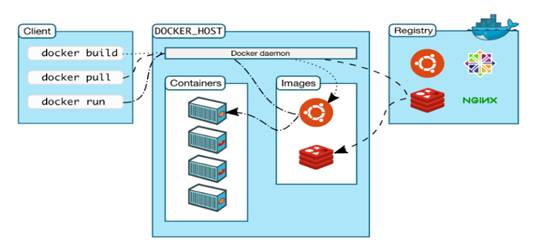
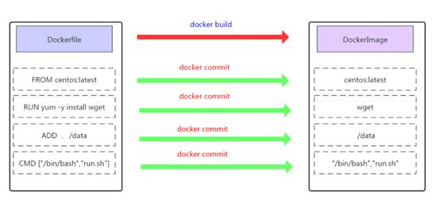
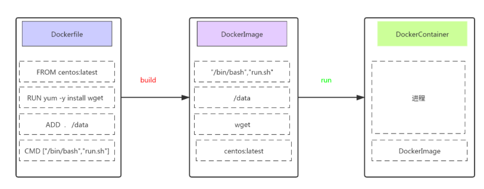

# Dockerfile精讲及新型容器镜像构建技术

# 一、容器与容器镜像之间的关系

说到Docker管理的容器不得不说容器镜像，主要因为容器镜像是容器模板，通过容器镜像我们才能快速创建容器。

如下图所示：




> Docker Daemon通过容器镜像创建容器。

 

# 二、容器镜像分类

- 操作系统类
  - CentOS
  - Ubuntu
  - 在dockerhub下载或自行制作
- 应用类
  - Tomcat
  - Nginx
  - MySQL
  - Redis


# 三、容器镜像获取的方法

主要有以下几种：

1、在DockerHub直接下载

2、把操作系统中文件系统打包为容器镜像

3、把正在运行的容器打包为容器镜像，即docker commit

4、通过Dockerfile实现容器镜像的自定义及生成


# 四、容器镜像获取方法演示

## 4.1 在DockerHub直接下载


~~~powershell
# docker pull centos:latest
~~~


~~~powershell
# docker pull nginx:latest
~~~


## 4.2 把操作系统中文件系统打包为容器镜像

### 4.2.1 安装一个最化的操作系统


### 4.2.2 把操作系统中文件系统进行打包

~~~powershell
# tar --numeric-owner --exclude=/proc --exclude=/sys -cvf centos7u6.tar /
~~~


### 4.2.3 把打包后文件加载至本地文件系统生成本地容器镜像


~~~powershell
# ls
centos7u6.tar
~~~


~~~powershell
# docker import centos7u6.tar centos7u6:v1
~~~


~~~powershell
# docker images
REPOSITORY   TAG       IMAGE ID       CREATED         SIZE
centos7u6    v1        130cb005b2dc   7 seconds ago   1.09GB
~~~


~~~powershell
# docker run -it centos7u6:v1 bash
[root@50f24f688b4d /]# ip a s
1: lo: <LOOPBACK,UP,LOWER_UP> mtu 65536 qdisc noqueue state UNKNOWN group default qlen 1000
    link/loopback 00:00:00:00:00:00 brd 00:00:00:00:00:00
    inet 127.0.0.1/8 scope host lo
       valid_lft forever preferred_lft forever
7: eth0@if8: <BROADCAST,MULTICAST,UP,LOWER_UP> mtu 1500 qdisc noqueue state UP group default
    link/ether 02:42:ac:11:00:02 brd ff:ff:ff:ff:ff:ff link-netnsid 0
    inet 172.17.0.2/16 brd 172.17.255.255 scope global eth0
       valid_lft forever preferred_lft forever
~~~


## 4.3 把正在运行的容器打包为容器镜像

### 4.3.1 运行一个容器

~~~powershell
# docker run -it centos7u6:v1 bash
~~~


### 4.3.2 在容器中安装应用

~~~powershell
[root@064aace45718 /]# yum -y install httpd
~~~


### 4.3.3 把正在运行的容器打包为容器镜像


~~~powershell
[root@064aace45718 /]# ctrl + p +q
~~~


~~~powershell
# docker commit 064aace45718 centos7u6-httpd:v1
~~~


~~~powershell
# docker images
REPOSITORY        TAG       IMAGE ID       CREATED         SIZE
centos7u6-httpd   v1        30ec9d728880   6 seconds ago   1.29GB
~~~


~~~powershell
# docker run -it centos7u6-httpd:v1 bash
[root@01a1373b4a3f /]# rpm -qa | grep httpd
httpd-tools-2.4.6-97.el7.centos.4.x86_64
httpd-2.4.6-97.el7.centos.4.x86_64
~~~


## 4.4 通过Dockerfile实现容器镜像的自定义及生成

### 4.4.1 Dockerfile介绍

Dockerfile是一种能够被Docker程序解释的剧本。Dockerfile由一条一条的指令组成，并且有自己的书写格式和支持的命令。当我们需要在容器镜像中指定自己额外的需求时，只需在Dockerfile上添加或修改指令，然后通过docker build生成我们自定义的容器镜像（image）。




### 4.4.2 Dockerfile指令

- 构建类指令
  - 用于构建image
  - 其指定的操作不会在运行image的容器上执行（FROM、MAINTAINER、RUN、ENV、ADD、COPY）

 

- 设置类指令
  - 用于设置image的属性
  - 其指定的操作将在运行image的容器中执行（CMD、ENTRYPOINT、USER 、EXPOSE、VOLUME、WORKDIR、ONBUILD）


- 指令说明


| 指令    | 描述                                                |
| ------- | --------------------------------------------------- |
| FROM    | 构建新镜像基于的基础镜像                            |
| LABEL   | 标签                                                |
| RUN     | 构建镜像时运行的Shell命令                           |
| COPY    | 拷贝文件或目录到镜像中                              |
| ADD     | 解压压缩包并拷贝                                    |
| ENV     | 设置环境变量                                        |
| USER    | 为RUN、CMD和ENTRYPOINT执行命令指定运行用户          |
| EXPOSE  | 声明容器运行的服务端口                              |
| WORKDIR | 为RUN、CMD、ENTRYPOINT、COPY和ADD设置工作目录       |
| CMD     | 运行容器时默认执行，如果有多个CMD指令，最后一个生效 |


- 指令详细解释


通过`man docker_file`可以查看到详细的说明,这里简单的翻译并列出常用的指令

1, **FROM**

FROM指令用于指定其后构建新镜像所使用的基础镜像。

FROM指令必是Dockerfile文件中的首条命令。

FROM指令指定的基础image可以是官方远程仓库中的，也可以位于本地仓库，优先本地仓库。

```powershell
格式:FROM <image>:<tag>
例:FROM centos:latest
```

2, **RUN**

RUN指令用于在**构建**镜像中执行命令，有以下两种格式:

* shell格式

~~~powershell
格式:RUN <命令>
例:RUN echo 'kubemsb' > /var/www/html/index.html
~~~

* exec格式

~~~powershell
格式:RUN ["可执行文件", "参数1", "参数2"]
例:RUN ["/bin/bash", "-c", "echo kubemsb > /var/www/html/index.html"]
~~~

**注意:** 按优化的角度来讲:当有多条要执行的命令,不要使用多条RUN,尽量使用&&符号与\符号连接成一行。因为多条RUN命令会让镜像建立多层(总之就是会变得臃肿了:smiley:)。

~~~powershell
RUN yum install httpd httpd-devel -y
RUN echo test > /var/www/html/index.html
可以改成
RUN yum install httpd httpd-devel -y && echo test > /var/www/html/index.html
或者改成
RUN yum install httpd httpd-devel -y  \
    && echo test > /var/www/html/index.html
~~~

3, **CMD**

CMD不同于RUN,CMD用于指定在容器启动时所要执行的命令,而RUN用于指定镜像构建时所要执行的命令。

~~~powershell
格式有三种:
CMD ["executable","param1","param2"]
CMD ["param1","param2"]
CMD command param1 param2
~~~

每个Dockerfile只能有一条CMD命令。如果指定了多条命令，只有最后一条会被执行。

如果用户启动容器时候指定了运行的命令，则会覆盖掉CMD指定的命令。

~~~powershell
什么是启动容器时指定运行的命令?
# docker run -d -p 80:80 镜像名 运行的命令
~~~


4, **EXPOSE**

EXPOSE指令用于指定容器在运行时监听的端口

~~~powershell
格式:EXPOSE <port> [<port>...]
例:EXPOSE 80 3306 8080
~~~

上述运行的端口还需要使用docker run运行容器时通过-p参数映射到宿主机的端口.

5, **ENV**

ENV指令用于指定一个环境变量.

~~~powershell
格式:ENV <key> <value> 或者 ENV <key>=<value>
例:ENV JAVA_HOME /usr/local/jdkxxxx/
~~~

6, **ADD**

ADD指令用于把宿主机上的文件拷贝到镜像中

~~~powershell
格式:ADD <src> <dest>
<src>可以是一个本地文件或本地压缩文件，还可以是一个url,
如果把<src>写成一个url，那么ADD就类似于wget命令
<dest>路径的填写可以是容器内的绝对路径，也可以是相对于工作目录的相对路径
~~~

7, **COPY**

COPY指令与ADD指令类似,但COPY的源文件只能是本地文件

~~~powershell
格式:COPY <src> <dest>
~~~

8, **ENTRYPOINT**

ENTRYPOINT与CMD非常类似

相同点：
一个Dockerfile只写一条，如果写了多条，那么只有最后一条生效
都是容器启动时才运行

不同点：
如果用户启动容器时候指定了运行的命令，ENTRYPOINT不会被运行的命令覆盖，而CMD则会被覆盖

~~~powershell
格式有两种:
ENTRYPOINT ["executable", "param1", "param2"]
ENTRYPOINT command param1 param2
~~~

9,  **VOLUME**

VOLUME指令用于把宿主机里的目录与容器里的目录映射. 

只指定挂载点,docker宿主机映射的目录为自动生成的。

~~~powershell
格式:VOLUME ["<mountpoint>"]
~~~

10, **USER**

USER指令设置启动容器的用户(像hadoop需要hadoop用户操作，oracle需要oracle用户操作),可以是用户名或UID

~~~powershell
USER daemon
USER 1001
~~~

**注意**：如果设置了容器以daemon用户去运行，那么RUN,CMD和ENTRYPOINT都会以这个用户去运行
镜像构建完成后，通过docker run运行容器时，可以通过-u参数来覆盖所指定的用户

11, **WORKDIR**

WORKDIR指令设置工作目录,类似于cd命令。不建议使用`RUN cd /root` ,建议使用WORKDIR

~~~powershell
WORKDIR /root
~~~


### 4.4.3 Dockerfile基本构成

- 基础镜像信息

- 维护者信息

- 镜像操作指令

- 容器启动时执行指令

### 4.4.4 Dockerfile生成容器镜像方法



### 4.4.5 Dockerfile生成容器镜像案例

#### 4.4.5.0 使用Dockerfile生成容器镜像步骤


~~~powershell
第一步：创建一个文件夹（目录）

第二步：在文件夹（目录）中创建Dockerfile文件(并编写)及其它文件

第三步：使用`docker build`命令构建镜像

第四步：使用构建的镜像启动容器
~~~


#### 4.4.5.1 使用Dockerfile生成Nginx容器镜像


~~~powershell
[root@localhost ~]# mkdir nginxroot
[root@localhost ~]# cd nginxroot
[root@localhost nginxroot]#
~~~


~~~powershell
[root@localhost nginxroot]# echo "nginx's running" >> index.html
[root@localhost nginxroot]# ls
index.html
[root@localhost nginxroot]# cat index.html
nginx's running
~~~


~~~powershell
[root@localhost nginxroot]# vim Dockerfile
[root@localhost nginxroot]# cat Dockerfile
FROM centos:centos7

MAINTAINER "www.kubemsb.com"

RUN yum -y install wget

RUN wget -O /etc/yum.repos.d/epel.repo http://mirrors.aliyun.com/repo/epel-7.repo

RUN yum -y install nginx

ADD index.html /usr/share/nginx/html/

RUN echo "daemon off;" >> /etc/nginx/nginx.conf

EXPOSE 80

CMD /usr/sbin/nginx
~~~


~~~powershell
[root@localhost nginxroot]# docker build -t centos7-nginx:v1 .
~~~


~~~powershell
输出：
Sending build context to Docker daemon  3.072kB
第一步：下载基础镜像
Step 1/9 : FROM centos:centos7
 ---> eeb6ee3f44bd
第二步：维护者信息
Step 2/9 : MAINTAINER "www.kubemsb.com"
 ---> Using cache
 ---> f978e524772c
 
第三步：安装wget
Step 3/9 : RUN yum -y install wget
 ---> Running in 4e0fc3854088
Loaded plugins: fastestmirror, ovl
Determining fastest mirrors
 * base: mirrors.huaweicloud.com
 * extras: mirrors.tuna.tsinghua.edu.cn
 * updates: mirrors.tuna.tsinghua.edu.cn
Resolving Dependencies
--> Running transaction check
---> Package wget.x86_64 0:1.14-18.el7_6.1 will be installed
--> Finished Dependency Resolution

Dependencies Resolved

================================================================================
 Package        Arch             Version                   Repository      Size
================================================================================
Installing:
 wget           x86_64           1.14-18.el7_6.1           base           547 k

Transaction Summary
================================================================================
Install  1 Package

Total download size: 547 k
Installed size: 2.0 M
Downloading packages:
warning: /var/cache/yum/x86_64/7/base/packages/wget-1.14-18.el7_6.1.x86_64.rpm: Header V3 RSA/SHA256 Signature, key ID f4a80eb5: NOKEY
Public key for wget-1.14-18.el7_6.1.x86_64.rpm is not installed
Retrieving key from file:///etc/pki/rpm-gpg/RPM-GPG-KEY-CentOS-7
Importing GPG key 0xF4A80EB5:
 Userid     : "CentOS-7 Key (CentOS 7 Official Signing Key) <security@centos.org>"
 Fingerprint: 6341 ab27 53d7 8a78 a7c2 7bb1 24c6 a8a7 f4a8 0eb5
 Package    : centos-release-7-9.2009.0.el7.centos.x86_64 (@CentOS)
 From       : /etc/pki/rpm-gpg/RPM-GPG-KEY-CentOS-7
Running transaction check
Running transaction test
Transaction test succeeded
Running transaction
  Installing : wget-1.14-18.el7_6.1.x86_64                                  1/1
install-info: No such file or directory for /usr/share/info/wget.info.gz
  Verifying  : wget-1.14-18.el7_6.1.x86_64                                  1/1

Installed:
  wget.x86_64 0:1.14-18.el7_6.1

Complete!
Removing intermediate container 4e0fc3854088
 ---> 369e33a2152a
 
第四步：使用wget下载YUM源
Step 4/9 : RUN wget -O /etc/yum.repos.d/epel.repo http://mirrors.aliyun.com/repo/epel-7.repo
 ---> Running in 4bdfc0a1c844
--2022-02-10 06:18:07--  http://mirrors.aliyun.com/repo/epel-7.repo
Resolving mirrors.aliyun.com (mirrors.aliyun.com)... 221.195.209.65, 221.195.209.64, 221.195.209.70, ...
Connecting to mirrors.aliyun.com (mirrors.aliyun.com)|221.195.209.65|:80... connected.
HTTP request sent, awaiting response... 200 OK
Length: 664 [application/octet-stream]
Saving to: '/etc/yum.repos.d/epel.repo'

     0K                                                       100%  158M=0s

2022-02-10 06:18:07 (158 MB/s) - '/etc/yum.repos.d/epel.repo' saved [664/664]

Removing intermediate container 4bdfc0a1c844
 ---> 1d73faa62447
 
第五步：安装Nginx
Step 5/9 : RUN yum -y install nginx
 ---> Running in 51b50c2ce841
Loaded plugins: fastestmirror, ovl
Loading mirror speeds from cached hostfile
 * base: mirrors.huaweicloud.com
 * extras: mirrors.tuna.tsinghua.edu.cn
 * updates: mirrors.tuna.tsinghua.edu.cn
Resolving Dependencies
--> Running transaction check
---> Package nginx.x86_64 1:1.20.1-9.el7 will be installed
--> Processing Dependency: nginx-filesystem = 1:1.20.1-9.el7 for package: 1:nginx-1.20.1-9.el7.x86_64
--> Processing Dependency: libcrypto.so.1.1(OPENSSL_1_1_0)(64bit) for package: 1:nginx-1.20.1-9.el7.x86_64
--> Processing Dependency: libssl.so.1.1(OPENSSL_1_1_0)(64bit) for package: 1:nginx-1.20.1-9.el7.x86_64
--> Processing Dependency: libssl.so.1.1(OPENSSL_1_1_1)(64bit) for package: 1:nginx-1.20.1-9.el7.x86_64
--> Processing Dependency: nginx-filesystem for package: 1:nginx-1.20.1-9.el7.x86_64
--> Processing Dependency: openssl for package: 1:nginx-1.20.1-9.el7.x86_64
--> Processing Dependency: redhat-indexhtml for package: 1:nginx-1.20.1-9.el7.x86_64
--> Processing Dependency: system-logos for package: 1:nginx-1.20.1-9.el7.x86_64
--> Processing Dependency: libcrypto.so.1.1()(64bit) for package: 1:nginx-1.20.1-9.el7.x86_64
--> Processing Dependency: libprofiler.so.0()(64bit) for package: 1:nginx-1.20.1-9.el7.x86_64
--> Processing Dependency: libssl.so.1.1()(64bit) for package: 1:nginx-1.20.1-9.el7.x86_64
--> Running transaction check
---> Package centos-indexhtml.noarch 0:7-9.el7.centos will be installed
---> Package centos-logos.noarch 0:70.0.6-3.el7.centos will be installed
---> Package gperftools-libs.x86_64 0:2.6.1-1.el7 will be installed
---> Package nginx-filesystem.noarch 1:1.20.1-9.el7 will be installed
---> Package openssl.x86_64 1:1.0.2k-24.el7_9 will be installed
--> Processing Dependency: openssl-libs(x86-64) = 1:1.0.2k-24.el7_9 for package: 1:openssl-1.0.2k-24.el7_9.x86_64
--> Processing Dependency: make for package: 1:openssl-1.0.2k-24.el7_9.x86_64
---> Package openssl11-libs.x86_64 1:1.1.1k-2.el7 will be installed
--> Running transaction check
---> Package make.x86_64 1:3.82-24.el7 will be installed
---> Package openssl-libs.x86_64 1:1.0.2k-19.el7 will be updated
---> Package openssl-libs.x86_64 1:1.0.2k-24.el7_9 will be an update
--> Finished Dependency Resolution

Dependencies Resolved

================================================================================
 Package               Arch        Version                   Repository    Size
================================================================================
Installing:
 nginx                 x86_64      1:1.20.1-9.el7            epel         587 k
Installing for dependencies:
 centos-indexhtml      noarch      7-9.el7.centos            base          92 k
 centos-logos          noarch      70.0.6-3.el7.centos       base          21 M
 gperftools-libs       x86_64      2.6.1-1.el7               base         272 k
 make                  x86_64      1:3.82-24.el7             base         421 k
 nginx-filesystem      noarch      1:1.20.1-9.el7            epel          24 k
 openssl               x86_64      1:1.0.2k-24.el7_9         updates      494 k
 openssl11-libs        x86_64      1:1.1.1k-2.el7            epel         1.5 M
Updating for dependencies:
 openssl-libs          x86_64      1:1.0.2k-24.el7_9         updates      1.2 M

Transaction Summary
================================================================================
Install  1 Package  (+7 Dependent packages)
Upgrade             ( 1 Dependent package)

Total download size: 26 M
Downloading packages:
Delta RPMs disabled because /usr/bin/applydeltarpm not installed.
--------------------------------------------------------------------------------
Total                                              3.1 MB/s |  26 MB  00:08
Running transaction check
Running transaction test
Transaction test succeeded
Running transaction
  Installing : centos-logos-70.0.6-3.el7.centos.noarch                     1/10
  Installing : centos-indexhtml-7-9.el7.centos.noarch                      2/10
  Installing : 1:make-3.82-24.el7.x86_64                                   3/10
  Installing : gperftools-libs-2.6.1-1.el7.x86_64                          4/10
  Installing : 1:openssl11-libs-1.1.1k-2.el7.x86_64                        5/10
  Updating   : 1:openssl-libs-1.0.2k-24.el7_9.x86_64                       6/10
  Installing : 1:openssl-1.0.2k-24.el7_9.x86_64                            7/10
  Installing : 1:nginx-filesystem-1.20.1-9.el7.noarch                      8/10
  Installing : 1:nginx-1.20.1-9.el7.x86_64                                 9/10
  Cleanup    : 1:openssl-libs-1.0.2k-19.el7.x86_64                        10/10
  Verifying  : 1:nginx-filesystem-1.20.1-9.el7.noarch                      1/10
  Verifying  : 1:nginx-1.20.1-9.el7.x86_64                                 2/10
  Verifying  : 1:openssl-libs-1.0.2k-24.el7_9.x86_64                       3/10
  Verifying  : 1:openssl11-libs-1.1.1k-2.el7.x86_64                        4/10
  Verifying  : gperftools-libs-2.6.1-1.el7.x86_64                          5/10
  Verifying  : 1:make-3.82-24.el7.x86_64                                   6/10
  Verifying  : 1:openssl-1.0.2k-24.el7_9.x86_64                            7/10
  Verifying  : centos-indexhtml-7-9.el7.centos.noarch                      8/10
  Verifying  : centos-logos-70.0.6-3.el7.centos.noarch                     9/10
  Verifying  : 1:openssl-libs-1.0.2k-19.el7.x86_64                        10/10

Installed:
  nginx.x86_64 1:1.20.1-9.el7

Dependency Installed:
  centos-indexhtml.noarch 0:7-9.el7.centos
  centos-logos.noarch 0:70.0.6-3.el7.centos
  gperftools-libs.x86_64 0:2.6.1-1.el7
  make.x86_64 1:3.82-24.el7
  nginx-filesystem.noarch 1:1.20.1-9.el7
  openssl.x86_64 1:1.0.2k-24.el7_9
  openssl11-libs.x86_64 1:1.1.1k-2.el7

Dependency Updated:
  openssl-libs.x86_64 1:1.0.2k-24.el7_9

Complete!
Removing intermediate container 51b50c2ce841
 ---> 88a7d7a2c522
 
第六步：添加文件至容器
Step 6/9 : ADD index.html /usr/share/nginx/html/
 ---> a2226a4d6720
第七步：设置nginx服务运行方式
Step 7/9 : RUN echo "daemon off;" >> /etc/nginx/nginx.conf
 ---> Running in 01d623937807
Removing intermediate container 01d623937807
 ---> 53fddea5b491
 
第八步：暴露端口
Step 8/9 : EXPOSE 80
 ---> Running in 9b73fcf7ee1b
Removing intermediate container 9b73fcf7ee1b
 ---> 903377216b23
第九步：运行命令，执行nginx二进制文件
Step 9/9 : CMD /usr/sbin/nginx
 ---> Running in 58037652952c
Removing intermediate container 58037652952c
 ---> 944d27b80f1f
 
生成镜像，并为镜像打标记：
Successfully built 944d27b80f1f
Successfully tagged centos7-nginx:v1
~~~


~~~powershell
[root@localhost nginxroot]# docker images
REPOSITORY        TAG       IMAGE ID       CREATED             SIZE
centos7-nginx     v1        944d27b80f1f   3 minutes ago       587MB
~~~


~~~powershell
[root@localhost ~]# docker run -d -p 8081:80 centos7-nginx:v1
~~~


~~~powershell
[root@localhost ~]# curl http://localhost:8081
nginx's running
~~~


#### 4.4.5.2 使用Dockerfile生成Tomcat容器镜像


~~~powershell
[root@localhost ~]# mkdir tomcatdir
[root@localhost ~]# cd tomcatdir/
[root@localhost tomcatdir]#
~~~


~~~powershell
[root@localhost tomcatdir]# echo "tomcat is running" >> index.html
~~~


~~~powershell
[root@localhost tomcatdir]# ls
Dockerfile  jdk index.html
jdk为目录
index.html 网站首页
~~~


~~~powershell
[root@localhost tomcatdir]# vim Dockerfile
[root@localhost tomcatdir]# cat Dockerfile
FROM centos:centos7

MAINTAINER "www.kubemsb.com"

ENV VERSION=8.5.75
ENV JAVA_HOME=/usr/local/jdk
ENV TOMCAT_HOME=/usr/local/tomcat

RUN yum -y install wget

RUN wget https://dlcdn.apache.org/tomcat/tomcat-8/v${VERSION}/bin/apache-tomcat-${VERSION}.tar.gz

RUN tar xf apache-tomcat-${VERSION}.tar.gz

RUN mv apache-tomcat-${VERSION} /usr/local/tomcat

RUN rm -rf apache-tomcat-${VERSION}.tar.gz /usr/local/tomcat/webapps/*

RUN mkdir /usr/local/tomcat/webapps/ROOT

ADD ./index.html /usr/local/tomcat/webapps/ROOT/

ADD ./jdk /usr/local/jdk


RUN echo "export TOMCAT_HOME=/usr/local/tomcat" >> /etc/profile

RUN echo "export JAVA_HOME=/usr/local/jdk" >> /etc/profile

RUN echo "export PATH=${TOMCAT_HOME}/bin:${JAVA_HOME}/bin:$PATH" >> /etc/profile

RUN echo "export CLASSPATH=.:${JAVA_HOME}/lib/dt.jar:${JAVA_HOME}/lib/tools.jar" >> /etc/profile


RUN source /etc/profile

EXPOSE 8080

CMD ["/usr/local/tomcat/bin/catalina.sh","run"]
~~~


~~~powershell
[root@localhost tomcatdir]# docker build -t centos-tomcat:v1 .                           

Sending build context to Docker daemon  398.9MB
Step 1/20 : FROM centos:centos7
 ---> eeb6ee3f44bd
Step 2/20 : MAINTAINER "www.kubemsb.com"
 ---> Using cache
 ---> f978e524772c
Step 3/20 : ENV VERSION=8.5.75
 ---> Using cache
 ---> 792767bbdb22
Step 4/20 : ENV JAVA_HOME=/usr/local/jdk
 ---> Using cache
 ---> 6eb3855650f0
Step 5/20 : ENV TOMCAT_HOME=/usr/local/tomcat
 ---> Using cache
 ---> e38bdbbfd19d
Step 6/20 : RUN yum -y install wget
 ---> Using cache
 ---> 4c6aafa6d8ba
Step 7/20 : RUN wget http://dlcdn.apache.org/tomcat/tomcat-8/v${VERSION}/bin/apache-tomcat-${VERSION}.tar.gz
 ---> Using cache
 ---> 9bdb6f636a5f
Step 8/20 : RUN tar xf apache-tomcat-${VERSION}.tar.gz
 ---> Using cache
 ---> 6abe5cb0ef26
Step 9/20 : RUN mv apache-tomcat-${VERSION} /usr/local/tomcat
 ---> Using cache
 ---> b3907af15c22
Step 10/20 : RUN rm -rf apache-tomcat-${VERSION}.tar.gz /usr/local/tomcat/webapps/*
 ---> Using cache
 ---> b775439344e3
Step 11/20 : RUN mkdir /usr/local/tomcat/webapps/ROOT
 ---> Using cache
 ---> 149ad46776eb
Step 12/20 : ADD ./index.html /usr/local/tomcat/webapps/ROOT/
 ---> 064579c39a46
Step 13/20 : ADD ./jdk /usr/local/jdk
 ---> 477fd38dfbcf
Step 14/20 : RUN echo "export TOMCAT_HOME=/usr/local/tomcat" >> /etc/profile
 ---> Running in 3fc9bc5e8ba5
Removing intermediate container 3fc9bc5e8ba5
 ---> 3c43bccd5779
Step 15/20 : RUN echo "export JAVA_HOME=/usr/local/jdk" >> /etc/profile
 ---> Running in 80f8150f0e80
Removing intermediate container 80f8150f0e80
 ---> e01307ccb02a
Step 16/20 : RUN echo "export PATH=${TOMCAT_HOME}/bin:${JAVA_HOME}/bin:$PATH" >> /etc/profile
 ---> Running in 92a6a4fd1cbc
Removing intermediate container 92a6a4fd1cbc
 ---> 1d26f53b7095
Step 17/20 : RUN echo "export CLASSPATH=.:${JAVA_HOME}/lib/dt.jar:${JAVA_HOME}/lib/tools.jar" >> /etc/profile
 ---> Running in fb5ee1710c36
Removing intermediate container fb5ee1710c36
 ---> d2eaff35dce3
Step 18/20 : RUN source /etc/profile
 ---> Running in 0422af810b35
Removing intermediate container 0422af810b35
 ---> fc6d285288ca
Step 19/20 : EXPOSE 8080
 ---> Running in eeb64d4f9e94
Removing intermediate container eeb64d4f9e94
 ---> 05ec1c6d06cf
Step 20/20 : CMD ["/usr/local/tomcat/bin/catalina.sh","run"]
 ---> Running in 66b7851e2772
Removing intermediate container 66b7851e2772
 ---> ad338289055c
Successfully built ad338289055c
Successfully tagged centos-tomcat:v1
~~~


~~~powershell
# docker images
REPOSITORY        TAG       IMAGE ID       CREATED          SIZE
centos-tomcat     v1        ad338289055c   6 minutes ago    797MB
~~~


~~~powershell
# docker run -d -p 8082:8080 centos-tomcat:v1
~~~


~~~powershell
# curl http://localhost:8082
tomcat is running
~~~


### 4.4.6 使用Dockerfile生成容器镜像优化

#### 4.4.6.1 减少镜像分层

Dockerfile中包含多种指令，如果涉及到部署最多使用的算是RUN命令了，使用RUN命令时，不建议每次安装都使用一条单独的RUN命令，可以把能够合并安装指令合并为一条，这样就可以减少镜像分层。

~~~powershell
FROM centos:latest
MAINTAINER www.kubemsb.com
RUN yum install epel-release -y 
RUN yum install -y gcc gcc-c++ make -y
RUN wget http://docs.php.net/distributions/php-5.6.36.tar.gz
RUN tar zxf php-5.6.36.tar.gz
RUN cd php-5.6.36
RUN ./configure --prefix=/usr/local/php 
RUN make -j 4 
RUN make install
EXPOSE 9000
CMD ["php-fpm"]
~~~


**优化内容如下：**


~~~powershell
FROM centos:latest
MAINTAINER www.kubemsb.com
RUN yum install epel-release -y && \
    yum install -y gcc gcc-c++ make

RUN wget http://docs.php.net/distributions/php-5.6.36.tar.gz && \
    tar zxf php-5.6.36.tar.gz && \
    cd php-5.6.36 && \
    ./configure --prefix=/usr/local/php && \
    make -j 4 && make install
EXPOSE 9000
CMD ["php-fpm"]
~~~


#### 4.4.6.2 清理无用数据

- 一次RUN形成新的一层，如果没有在同一层删除，无论文件是否最后删除，都会带到下一层，所以要在每一层清理对应的残留数据，减小镜像大小。
- 把生成容器镜像过程中部署的应用软件包做删除处理


~~~powershell
FROM centos:latest
MAINTAINER www.kubemsb.com
RUN yum install epel-release -y && \
    yum install -y gcc gcc-c++ make gd-devel libxml2-devel \
    libcurl-devel libjpeg-devel libpng-devel openssl-devel \
    libmcrypt-devel libxslt-devel libtidy-devel autoconf \
    iproute net-tools telnet wget curl && \
    yum clean all && \
    rm -rf /var/cache/yum/*

RUN wget http://docs.php.net/distributions/php-5.6.36.tar.gz && \
    tar zxf php-5.6.36.tar.gz && \
    cd php-5.6.36 && \
    ./configure --prefix=/usr/local/php \
    make -j 4 && make install && \
    cd / && rm -rf php*
~~~


#### 4.4.6.3 多阶段构建镜像

项目容器镜像有两种，一种直接把项目代码复制到容器镜像中，下次使用容器镜像时即可直接启动；另一种把需要对项目源码进行编译，再复制到容器镜像中使用。

不论是哪种方法都会让制作镜像复杂了些，并也会让容器镜像比较大，建议采用分阶段构建镜像的方法实现。


~~~powershell
$ git clone https://github.com/kubemsb/tomcat-java-demo
$ cd tomcat-java-demo
$ vi Dockerfile
FROM maven AS build
ADD ./pom.xml pom.xml
ADD ./src src/
RUN mvn clean package

FROM kubemsb/tomcat
RUN rm -rf /usr/local/tomcat/webapps/ROOT
COPY --from=build target/*.war /usr/local/tomcat/webapps/ROOT.war

$ docker build -t demo:v1 .
$ docker container run -d -v demo:v1
~~~


~~~powershell
第一个 FROM 后边多了个 AS 关键字，可以给这个阶段起个名字
第二个 FROM 使用上面构建的 Tomcat 镜像，COPY 关键字增加了 —from 参数，用于拷贝某个阶段的文件到当前阶段。
~~~


# 五、新型容器镜像构建技术 BuildPacks


