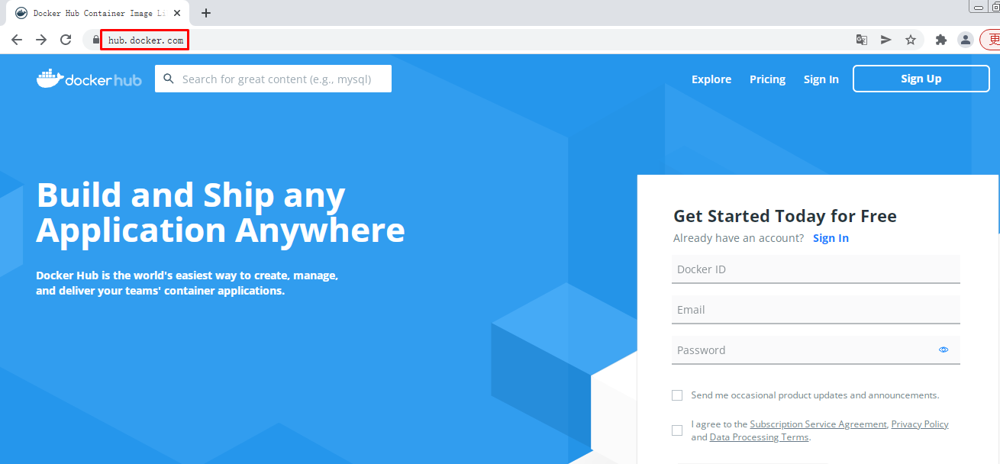
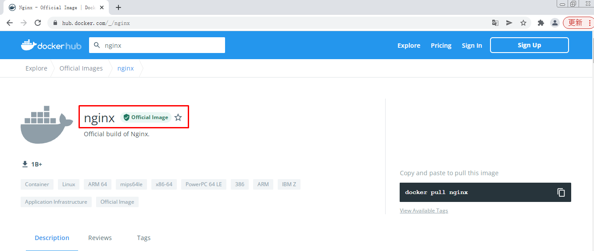
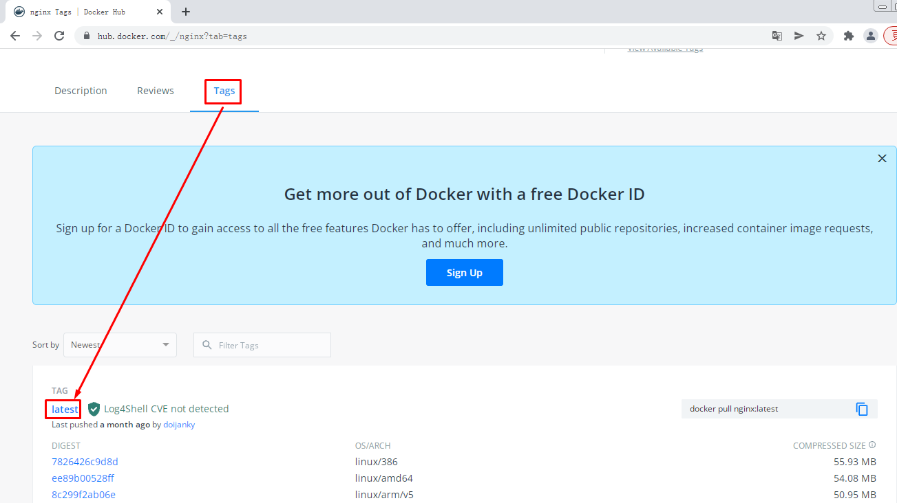
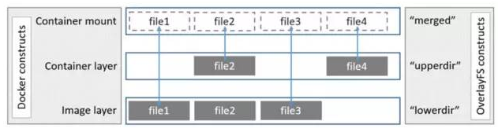

# Docker容器镜像

# 一、Docker容器镜像操作

## 2.1 查看本地容器镜像

### 2.1.1 使用docker images命令查看

~~~powershell
# docker images
REPOSITORY   TAG       IMAGE ID       CREATED        SIZE
bash         latest    5557e073f11c   2 weeks ago    13MB
nginx        latest    605c77e624dd   3 weeks ago    141MB
centos       latest    5d0da3dc9764   4 months ago   231MB
~~~

### 2.1.2 使用docker image命令查看

~~~powershell
# docker image list
REPOSITORY   TAG       IMAGE ID       CREATED        SIZE
bash         latest    5557e073f11c   2 weeks ago    13MB
nginx        latest    605c77e624dd   3 weeks ago    141MB
centos       latest    5d0da3dc9764   4 months ago   231MB
~~~

### 2.1.3 查看docker容器镜像本地存储位置

> 考虑到docker容器镜像会占用本地存储空间，建议搭建其它存储系统挂载到本地以便解决占用大量本地存储的问题。

~~~powershell
# ls /var/lib/docker
buildkit  containers  image  network  overlay2  plugins  runtimes  swarm  tmp  trust  volumes
~~~

## 2.2 搜索Docker Hub容器镜像

### 2.2.1 命令行搜索

~~~powershell
# docker search centos
~~~

~~~powershell
输出
NAME                              DESCRIPTION                                     STARS     OFFICIAL   AUTOMATED
centos                            The official build of CentOS.                   6987      [OK]
ansible/centos7-ansible           Ansible on Centos7                              135                  [OK]
consol/centos-xfce-vnc            Centos container with "headless" VNC session…   135                  [OK]
jdeathe/centos-ssh                OpenSSH / Supervisor / EPEL/IUS/SCL Repos - …   121                  [OK]
~~~

### 2.2.2 Docker Hub Web界面搜索

## 2.3 Docker 容器镜像下载

~~~powershell
# docker pull centos
~~~

## 2.4 Docker容器镜像删除方法

~~~powershell
# docker images
REPOSITORY   TAG       IMAGE ID       CREATED        SIZE
bash         latest    5557e073f11c   2 weeks ago    13MB
nginx        latest    605c77e624dd   3 weeks ago    141MB
centos       latest    5d0da3dc9764   4 months ago   231MB
~~~

~~~powershell
# docker rmi centos
Untagged: centos:latest
Untagged: centos@sha256:a27fd8080b517143cbbbab9dfb7c8571c40d67d534bbdee55bd6c473f432b177
Deleted: sha256:5d0da3dc976460b72c77d94c8a1ad043720b0416bfc16c52c45d4847e53fadb6
Deleted: sha256:74ddd0ec08fa43d09f32636ba91a0a3053b02cb4627c35051aff89f853606b59
~~~

或

~~~powershell
# docker images
REPOSITORY   TAG       IMAGE ID       CREATED        SIZE
centos       latest    5d0da3dc9764   4 months ago   231MB
~~~

~~~powershell
# docker rmi 5d0da3dc9764
~~~

# 二、Docker容器镜像介绍

## 2.1 Docker Image

- Docker 镜像是只读的容器模板，是Docker容器基础
- 为Docker容器提供了静态文件系统运行环境（rootfs）
- 是容器的静止状态
- 容器是镜像的运行状态

## 2.2 联合文件系统

### 2.2.1 联合文件系统定义

- 联合文件系统(union filesystem)
- 联合文件系统是实现联合挂载技术的文件系统
- 联合挂载技术可以实现在一个挂载点同时挂载多个文件系统，将挂载点的原目录与被挂载内容进行整合，使得最终可见的文件系统包含整合之后的各层文件和目录

### 2.2.2 图解

## 2.3 Docker Overlay2

容器文件系统有多种存储驱动实现方式：aufs，devicemapper，overlay，overlay2 等，本次以overlay2为例进行说明。

### 2.3.1 概念

- registry/repository： registry 是 repository 的集合，repository 是镜像的集合。
- image：image 是存储镜像相关的元数据，包括镜像的架构，镜像默认配置信息，镜像的容器配置信息等等。它是“逻辑”上的概念，并无物理上的镜像文件与之对应。
- layer：layer(镜像层) 组成了镜像，单个 layer 可以被多个镜像共享。

### 2.3.2 查看Docker Host存储驱动方式

~~~powershell
# docker info | grep overlay
 Storage Driver: overlay2
~~~

### 2.3.3 了解images分层

~~~powershell
# docker pull nginx
Using default tag: latest
latest: Pulling from library/nginx
a2abf6c4d29d: Pull complete
a9edb18cadd1: Pull complete
589b7251471a: Pull complete
186b1aaa4aa6: Pull complete
b4df32aa5a72: Pull complete
a0bcbecc962e: Pull complete
Digest: sha256:0d17b565c37bcbd895e9d92315a05c1c3c9a29f762b011a10c54a66cd53c9b31
Status: Downloaded newer image for nginx:latest
docker.io/library/nginx:latest
~~~

可以看到上述下载的镜像分为6层，如何找到这6层存储在Docker Host哪个位置呢？

首先查看nginx镜像

~~~powershell
# docker images
REPOSITORY   TAG       IMAGE ID       CREATED        SIZE
nginx        latest    605c77e624dd   3 weeks ago    141MB
~~~

通过其Image ID 605c77e624dd 就可以找到存储位置

~~~powershell
# ls /var/lib/docker/image/overlay2/
distribution  imagedb  layerdb  repositories.json
~~~

这个目录是查找的入口，非常重要。它存储了镜像管理的元数据。

- repositories.json 记录了 repo 与镜像 ID 的映射关系
- imagedb 记录了镜像架构，操作系统，构建镜像的容器 ID 和配置以及 rootfs 等信息
- layerdb 记录了每层镜像层的元数据。

通过短 ID 查找 repositories.json 文件，找到镜像 nginx 的长 ID，通过长 ID 在 imagedb 中找到该镜像的元数据：

~~~powershell
# cat /var/lib/docker/image/overlay2/repositories.json | grep 605c77e624dd
{"Repositories":"nginx":{"nginx:latest":"sha256:605c77e624ddb75e6110f997c58876baa13f8754486b461117934b24a9dc3a85","nginx@sha256:0d17b565c37bcbd895e9d92315a05c1c3c9a29f762b011a10c54a66cd53c9b31":"sha256:605c77e624ddb75e6110f997c58876baa13f8754486b461117934b24a9dc3a85"}}}}
~~~

~~~powershell
# cat /var/lib/docker/image/overlay2/imagedb/content/sha256/605c77e624ddb75e6110f997c58876baa13f8754486b461117934b24a9dc3a85
......
"os":"linux","rootfs":{"type":"layers","diff_ids":["sha256:2edcec3590a4ec7f40cf0743c15d78fb39d8326bc029073b41ef9727da6c851f","sha256:e379e8aedd4d72bb4c529a4ca07a4e4d230b5a1d3f7a61bc80179e8f02421ad8","sha256:b8d6e692a25e11b0d32c5c3dd544b71b1085ddc1fddad08e68cbd7fda7f70221","sha256:f1db227348d0a5e0b99b15a096d930d1a69db7474a1847acbc31f05e4ef8df8c","sha256:32ce5f6a5106cc637d09a98289782edf47c32cb082dc475dd47cbf19a4f866da","sha256:d874fd2bc83bb3322b566df739681fbd2248c58d3369cb25908d68e7ed6040a6"]}}
~~~

这里仅保留我们想要的元数据 rootfs。在 rootfs 中看到 layers 有6层，这6层即对应镜像的6层镜像层。并且，自上而下分别映射到容器的底层到顶层。找到了镜像的6层，接下来的问题是每层的文件内容在哪里呢？

layerdb 元数据会给我们想要的信息，通过底层 diff-id: 2edcec3590a4ec7f40cf0743c15d78fb39d8326bc029073b41ef9727da6c851f 我们查到最底层镜像层的 cache_id，通过 cache_id 即可查找到镜像层的文件内容：

~~~powershell
# ls /var/lib/docker/image/overlay2/layerdb/sha256/2edcec3590a4ec7f40cf0743c15d78fb39d8326bc029073b41ef9727da6c851f
cache-id  diff  size  tar-split.json.gz
~~~

~~~powershell
# cat /var/lib/docker/image/overlay2/layerdb/sha256/2edcec3590a4ec7f40cf0743c15d78fb39d8326bc029073b41ef9727da6c851f/cache-id
85c4c5ecdac6c0d197f899dac227b9d493911a9a5820eac501bb5e9ae361f4c7
~~~

~~~powershell
# cat /var/lib/docker/image/overlay2/layerdb/sha256/2edcec3590a4ec7f40cf0743c15d78fb39d8326bc029073b41ef9727da6c851f/diff
sha256:2edcec3590a4ec7f40cf0743c15d78fb39d8326bc029073b41ef9727da6c851f
~~~

使用 cacheID 查找文件内容

~~~powershell
# ls /var/lib/docker/overlay2/85c4c5ecdac6c0d197f899dac227b9d493911a9a5820eac501bb5e9ae361f4c7
committed  diff  link
# ls /var/lib/docker/overlay2/85c4c5ecdac6c0d197f899dac227b9d493911a9a5820eac501bb5e9ae361f4c7/diff
bin   dev  home  lib64  mnt  proc  run   srv  tmp  var
boot  etc  lib   media  opt  root  sbin  sys  usr
~~~

上示例中，镜像元数据和镜像层内容是分开存储的。因此通过 cache-id 我们需要到 /var/lib/docker/overlay2 目录下查看镜像层内容，它就存在 diff 目录下，其中 link 存储的是镜像层对应的短 ID，后面会看到它的用场。

找到了镜像层的最底层，接着查找镜像层的“中间层”，发现在 layerdb 目录下没有 diff-id e379e8aedd4d72bb4c529a4ca07a4e4d230b5a1d3f7a61bc80179e8f02421ad8的镜像层：

~~~powershell
# ls /var/lib/docker/image/overlay2/layerdb/sha256/e379e8aedd4d72bb4c529a4ca07a4e4d230b5a1d3f7a61bc80179e8f02421ad8
ls: 无法访问/var/lib/docker/image/overlay2/layerdb/sha256/e379e8aedd4d72bb4c529a4ca07a4e4d230b5a1d3f7a61bc80179e8f02421ad8: 没有那个文件或目录
~~~

这是因为 docker 引入了内容寻址机制，该机制会根据文件内容来索引镜像和镜像层。docker 利用 rootfs 中的 diff_id 计算出内容寻址的 chainID，通过 chainID 获取 layer 相关信息，最终索引到镜像层文件内容。

对于最底层镜像层其 diff_id 即是 chainID。因此我们可以查找到它的文件内容。除最底层外，chainID 需通过公式 chainID(n) = SHA256(chain(n-1) diffID(n)) 计算得到，计算“中间层” chainID：

~~~powershell
# echo -n "sha256:2edcec3590a4ec7f40cf0743c15d78fb39d8326bc029073b41ef9727da6c851f sha256:e379e8aedd4d72bb4c529a4ca07a4e4d230b5a1d3f7a61bc80179e8f02421ad8" | sha256sum -
780238f18c540007376dd5e904f583896a69fe620876cabc06977a3af4ba4fb5  -
~~~

根据 “中间层” chainID 查找文件内容：

~~~powershell
# ls /var/lib/docker/image/overlay2/layerdb/sha256/780238f18c540007376dd5e904f583896a69fe620876cabc06977a3af4ba4fb5
cache-id  diff  parent  size  tar-split.json.gz
~~~

~~~powershell
# cat /var/lib/docker/image/overlay2/layerdb/sha256/780238f18c540007376dd5e904f583896a69fe620876cabc06977a3af4ba4fb5/cache-id
57e1f1b11e26f748161b7fccbf2ba6b24c2f98dc8a821729f0be215ad267498c
~~~

~~~powershell
# cat /var/lib/docker/image/overlay2/layerdb/sha256/780238f18c540007376dd5e904f583896a69fe620876cabc06977a3af4ba4fb5/diff
sha256:e379e8aedd4d72bb4c529a4ca07a4e4d230b5a1d3f7a61bc80179e8f02421ad8
~~~

~~~powershell
# cat /var/lib/docker/image/overlay2/layerdb/sha256/780238f18c540007376dd5e904f583896a69fe620876cabc06977a3af4ba4fb5/parent
sha256:2edcec3590a4ec7f40cf0743c15d78fb39d8326bc029073b41ef9727da6c851f
~~~

~~~powershell
镜像层文件内容
# ls /var/lib/docker/overlay2/57e1f1b11e26f748161b7fccbf2ba6b24c2f98dc8a821729f0be215ad267498c
committed  diff  link  lower  work
# ls /var/lib/docker/overlay2/57e1f1b11e26f748161b7fccbf2ba6b24c2f98dc8a821729f0be215ad267498c/diff/
docker-entrypoint.d  etc  lib  tmp  usr  var
~~~

~~~powershell
镜像层文件内容短 ID
# cat /var/lib/docker/overlay2/57e1f1b11e26f748161b7fccbf2ba6b24c2f98dc8a821729f0be215ad267498c/link
24GM2IZVPTUROAG7AWJO5ZWE6B
~~~

~~~powershell
“父”镜像层文件内容短 ID
# cat /var/lib/docker/overlay2/57e1f1b11e26f748161b7fccbf2ba6b24c2f98dc8a821729f0be215ad267498c/lower
l/SICZO4QNVZEVOIJ4HDXVDKNYA2
~~~

找到最底层文件内容和“中间层”文件内容，再去找最顶层文件内容就变的不难了

## 2.4 Docker容器与镜像

通过 docker run 命令启动一个镜像为 nginx的容器：

~~~powershell
# docker run -d nginx:latest
3272831107a3499afe8160b0cd423e2ac4223522f1995b7be3504a1d3d272878
# docker ps | grep nginx
3272831107a3   nginx:latest   "/docker-entrypoint.…"   11 seconds ago   Up 9 seconds   80/tcp    angry_beaver
~~~

~~~powershell
# mount | grep overlay
overlay on /var/lib/docker/overlay2/b3f5c8b42ac055c715216e376cfe44571f618a876f481533ec1434aa0bc4f8ed/merged type overlay (rw,relatime,seclabel,lowerdir=/var/lib/docker/overlay2/l/MS2X66BYF6UZ7EKUWMZJKCF4HO:/var/lib/docker/overlay2/l/ODJROQUGY3WQMOGQ3BLYZGIAG4:/var/lib/docker/overlay2/l/Q5LOBFJRH5M7M5CMSWW5L4VYOY:/var/lib/docker/overlay2/l/ZR35FN2E3WEARZV4HLRU373FT7:/var/lib/docker/overlay2/l/NSM2PTAT6TIT2H6G3HFNGZJH5N:/var/lib/docker/overlay2/l/24GM2IZVPTUROAG7AWJO5ZWE6B:/var/lib/docker/overlay2/l/SICZO4QNVZEVOIJ4HDXVDKNYA2,upperdir=/var/lib/docker/overlay2/b3f5c8b42ac055c715216e376cfe44571f618a876f481533ec1434aa0bc4f8ed/diff,workdir=/var/lib/docker/overla 2/b3f5c8b42ac055c715216e376cfe44571f618a876f481533ec1434aa0bc4f8ed/work)
~~~

可以看到，启动容器会 mount 一个 overlay 的联合文件系统到容器内。这个文件系统由三层组成：

- lowerdir：只读层，即为镜像的镜像层。
- upperdir：读写层，该层是容器的读写层，对容器的读写操作将反映在读写层。
- workdir： overlayfs 的内部层，用于实现从只读层到读写层的 copy_up 操作。
- merge：容器内作为同一视图联合挂载点的目录。

这里需要着重介绍的是容器的 lowerdir 镜像只读层，查看只读层的短 ID：

~~~powershell
lowerdir=/var/lib/docker/overlay2/l/MS2X66BYF6UZ7EKUWMZJKCF4HO
/var/lib/docker/overlay2/l/ODJROQUGY3WQMOGQ3BLYZGIAG4
/var/lib/docker/overlay2/l/Q5LOBFJRH5M7M5CMSWW5L4VYOY
/var/lib/docker/overlay2/l/ZR35FN2E3WEARZV4HLRU373FT7
/var/lib/docker/overlay2/l/NSM2PTAT6TIT2H6G3HFNGZJH5N
/var/lib/docker/overlay2/l/24GM2IZVPTUROAG7AWJO5ZWE6B
/var/lib/docker/overlay2/l/SICZO4QNVZEVOIJ4HDXVDKNYA2
~~~

镜像层只有6层这里的短 ID 却有7个？
在 /var/lib/docker/overlay2/l 目录下我们找到了答案：

~~~powershell
# cd /var/lib/docker/overlay2/l
# pwd
/var/lib/docker/overlay2/l
# ls
24GM2IZVPTUROAG7AWJO5ZWE6B  LZEAXJGRW6HKBBGGB2N4CWMSVJ  R2XTGODAA67NQJM44MIKMDUF4W
5OI5WMJ2FP7QI7IFWDMHLBRDDN  MS2X66BYF6UZ7EKUWMZJKCF4HO  SICZO4QNVZEVOIJ4HDXVDKNYA2
644ISPHLTBSSC2KLP6BGHHHZPR  NSM2PTAT6TIT2H6G3HFNGZJH5N  ZR35FN2E3WEARZV4HLRU373FT7
6CQUILQSJNVTMFFV3ABCCOGOYG  ODJROQUGY3WQMOGQ3BLYZGIAG4
BQENAYC44O2ZCZFT5URMH5OADK  Q5LOBFJRH5M7M5CMSWW5L4VYOY
~~~

~~~powershell
# ls -l MS2X66BYF6UZ7EKUWMZJKCF4HO/
总用量 0
drwxr-xr-x. 4 root root 43 1月  25 01:27 dev
drwxr-xr-x. 2 root root 66 1月  25 01:27 etc
[root@192 l]# ls -l ODJROQUGY3WQMOGQ3BLYZGIAG4/
总用量 0
drwxr-xr-x. 2 root root 41 12月 30 03:28 docker-entrypoint.d

[root@192 l]# ls -l Q5LOBFJRH5M7M5CMSWW5L4VYOY/
总用量 0
drwxr-xr-x. 2 root root 41 12月 30 03:28 docker-entrypoint.d
[root@192 l]# ls -l ZR35FN2E3WEARZV4HLRU373FT7/
总用量 0
drwxr-xr-x. 2 root root 45 12月 30 03:28 docker-entrypoint.d
[root@192 l]# ls -l NSM2PTAT6TIT2H6G3HFNGZJH5N/
总用量 4
-rwxrwxr-x. 1 root root 1202 12月 30 03:28 docker-entrypoint.sh
[root@192 l]# ls -l 24GM2IZVPTUROAG7AWJO5ZWE6B/
总用量 4
drwxr-xr-x.  2 root root    6 12月 30 03:28 docker-entrypoint.d
drwxr-xr-x. 18 root root 4096 12月 30 03:28 etc
drwxr-xr-x.  4 root root   45 12月 20 08:00 lib
drwxrwxrwt.  2 root root    6 12月 30 03:28 tmp
drwxr-xr-x.  7 root root   66 12月 20 08:00 usr
drwxr-xr-x.  5 root root   41 12月 20 08:00 var
[root@192 l]# ls -l SICZO4QNVZEVOIJ4HDXVDKNYA2/
总用量 12
drwxr-xr-x.  2 root root 4096 12月 20 08:00 bin
drwxr-xr-x.  2 root root    6 12月 12 01:25 boot
drwxr-xr-x.  2 root root    6 12月 20 08:00 dev
drwxr-xr-x. 30 root root 4096 12月 20 08:00 etc
drwxr-xr-x.  2 root root    6 12月 12 01:25 home
drwxr-xr-x.  8 root root   96 12月 20 08:00 lib
drwxr-xr-x.  2 root root   34 12月 20 08:00 lib64
drwxr-xr-x.  2 root root    6 12月 20 08:00 media
drwxr-xr-x.  2 root root    6 12月 20 08:00 mnt
drwxr-xr-x.  2 root root    6 12月 20 08:00 opt
drwxr-xr-x.  2 root root    6 12月 12 01:25 proc
drwx------.  2 root root   37 12月 20 08:00 root
drwxr-xr-x.  3 root root   30 12月 20 08:00 run
drwxr-xr-x.  2 root root 4096 12月 20 08:00 sbin
drwxr-xr-x.  2 root root    6 12月 20 08:00 srv
drwxr-xr-x.  2 root root    6 12月 12 01:25 sys
drwxrwxrwt.  2 root root    6 12月 20 08:00 tmp
drwxr-xr-x. 11 root root  120 12月 20 08:00 usr
drwxr-xr-x. 11 root root  139 12月 20 08:00 var
~~~

镜像层ODJROQUGY3WQMOGQ3BLYZGIAG4/Q5LOBFJRH5M7M5CMSWW5L4VYOY/ZR35FN2E3WEARZV4HLRU373FT7/NSM2PTAT6TIT2H6G3HFNGZJH5N/24GM2IZVPTUROAG7AWJO5ZWE6B/SICZO4QNVZEVOIJ4HDXVDKNYA2 分别对应镜像的6层镜像层文件内容，它们分别映射到镜像层的 diff 目录。而 MS2X66BYF6UZ7EKUWMZJKCF4HO映射的是容器的初始化层 init，该层内容是和容器配置相关的文件内容，它是只读的。

启动了容器，docker 将镜像的内容 mount 到容器中。那么，如果在容器内写文件会对镜像有什么影响呢？

## 2.5 容器内写文件

不难理解，镜像层是只读的，在容器中写文件其实是将文件写入到 overlay 的可读写层。

这里有几个 case 可以测试：

- 读写层不存在该文件，只读层存在。
- 读写层存在该文件，只读层不存在。
- 读写层和只读层都不存在该文件。

我们简单构建一种读写层和只读层都不存在的场景：

~~~powershell
# docker run -it centos:latest bash
[root@355e99982248 /]# touch msb.txt
[root@355e99982248 /]# ls
bin  etc   lib    lost+found  mnt      opt   root  sbin  sys  usr
dev  home  lib64  media       msb.txt  proc  run   srv   tmp  var
~~~

查看读写层是否有该文件：

~~~powershell
查看镜像是否有变化
# docker images
REPOSITORY   TAG       IMAGE ID       CREATED        SIZE
ubuntu       latest    d13c942271d6   2 weeks ago    72.8MB
bash         latest    5557e073f11c   2 weeks ago    13MB
nginx        latest    605c77e624dd   3 weeks ago    141MB
centos       latest    5d0da3dc9764   4 months ago   231MB

[root@localhost ~]# cat /var/lib/docker/image/overlay2/repositories.json | grep 5d0da3dc9764
{"Repositories"{"centos:latest":"sha256:5d0da3dc976460b72c77d94c8a1ad043720b0416bfc16c52c45d4847e53fadb6","centos@sha256:a27fd8080b517143cbbbab9dfb7c8571c40d67d534bbdee55bd6c473f432b177":"sha256:5d0da3dc976460b72c77d94c8a1ad043720b0416bfc16c52c45d4847e53fadb6"}}}

[root@localhost ~]# cat /var/lib/docker/image/overlay2/imagedb/content/sha256/5d0da3dc976460b72c77d94c8a1ad043720b0416bfc16c52c45d4847e53fadb6
{"os":"linux","rootfs":{"type":"layers","diff_ids":["sha256:74ddd0ec08fa43d09f32636ba91a0a3053b02cb4627c35051aff89f853606b59"]}}

[root@localhost ~]# ls 
/var/lib/docker/image/overlay2/layerdb/sha256/74ddd0ec08fa43d09f32636ba91a0a3053b02cb4627c35051aff89f853606b59:
cache-id  diff  size  tar-split.json.gz
[root@localhost ~]# cat /var/lib/docker/image/overlay2/layerdb/sha256/74ddd0ec08fa43d09f32636ba91a0a3053b02cb4627c35051aff89f853606b59/cache-id
b17bc5c5103514923a30983c48f909e06f366b7aa1e85f112b67abb3ef5cd0cb

[root@localhost ~]# cat /var/lib/docker/image/overlay2/layerdb/sha256/74ddd0ec08fa43d09f32636ba91a0a3053b02cb4627c35051aff89f853606b59/diff
sha256:74ddd0ec08fa43d09f32636ba91a0a3053b02cb4627c35051aff89f853606b59

[root@localhost ~]# ls /var/lib/docker/overlay2/b17bc5c5103514923a30983c48f909e06f366b7aa1e85f112b67abb3ef5cd0cb
committed  diff  link
[root@localhost ~]# ls /var/lib/docker/overlay2/b17bc5c5103514923a30983c48f909e06f366b7aa1e85f112b67abb3ef5cd0cb/diff/
bin  etc   lib    lost+found  mnt  proc  run   srv  tmp  var
dev  home  lib64  media       opt  root  sbin  sys  usr

查看容器是否有变化
[root@localhost ~]# mount | grep overlay
type overlay (rw,relatime,seclabel,lowerdir=/var/lib/docker/overlay2/l/R2W2LEMDPRIUFYDVSLIQSCYTGX:/var/lib/docker/overlay2/l/R2XTGODAA67NQJM44MIKMDUF4W,upperdir=/var/lib/docker overlay2/7f0b54c748171872ce564305e394547555cb1182abf802c2262384be3dc78a8f/diff,workdir=/var/lib/docker/overlay2/7f0b54c748171872ce564305e394547555cb1182abf802c2262384be3dc78a8f/work)

[root@localhost ~]# ls -l /var/lib/docker/overlay2/l/
总用量 0

lrwxrwxrwx. 1 root root 77 1月  25 01:41 R2W2LEMDPRIUFYDVSLIQSCYTGX -> ../7f0b54c748171872ce564305e394547555cb1182abf802c2262384be3dc78a8f-init/diff
lrwxrwxrwx. 1 root root 72 1月  25 00:29 R2XTGODAA67NQJM44MIKMDUF4W -> ../b17bc5c5103514923a30983c48f909e06f366b7aa1e85f112b67abb3ef5cd0cb/diff

[root@localhost ~]# ls /var/lib/docker/overlay2/7f0b54c748171872ce564305e394547555cb1182abf802c2262384be3dc78a8f/diff
msb.txt

[root@localhost ~]# ls /var/lib/docker/overlay2/7f0b54c748171872ce564305e394547555cb1182abf802c2262384be3dc78a8f/merged/
bin  etc   lib    lost+found  mnt      opt   root  sbin  sys  usr
dev  home  lib64  media       msb.txt  proc  run   srv   tmp  var

~~~

# 三、Docker容器镜像操作命令

## 3.1  docker commit

上节提到容器内写文件会反映在 overlay 的可读写层，那么读写层的文件内容可以做成镜像吗？

可以。docker 通过 commit 和 build 操作实现镜像的构建。commit 将容器提交为一个镜像，build 在一个镜像的基础上构建镜像。

使用 commit 将上节的容器提交为一个镜像：

~~~powershell
[root@355e99982248 /]#   ctrl+p+q
~~~

~~~powershell
# docker ps
CONTAINER ID   IMAGE           COMMAND                  CREATED          STATUS          PORTS     NAMES
355e99982248   centos:latest   "bash"                   21 minutes ago   Up 21 minutes             fervent_perlman
~~~

~~~powershell
# docker commit 355e99982248
sha256:8965dcf23201ed42d4904e2f10854d301ad93b34bea73f384440692e006943de
~~~

~~~powershell
# docker images
REPOSITORY   TAG       IMAGE ID       CREATED              SIZE
<none>       <none>    8965dcf23201   About a minute ago   231MB
~~~

image 短 ID 8965dcf23201 即为容器提交的镜像，查看镜像的 imagedb 元数据：

~~~powershell
# cat  /var/lib/docker/image/overlay2/imagedb/content/sha256/8965dcf23201ed42d4904e2f10854d301ad93b34bea73f384440692e006943de
......
"os":"linux","rootfs":{"type":"layers","diff_ids":["sha256:74ddd0ec08fa43d09f32636ba91a0a3053b02cb4627c35051aff89f853606b59","sha256:551c3089b186b4027e949910981ff1ba54114610f2aab9359d28694c18b0203b"]}}
~~~

可以看到镜像层自上而下的前1个镜像层 diff_id 和 centos 镜像层 diff_id 是一样的，说明每层镜像层可以被多个镜像共享。而多出来的一层镜像层内容即是上节我们写入文件的内容：

~~~powershell
# echo -n "sha256:74ddd0ec08fa43d09f32636ba91a0a3053b02cb4627c35051aff89f853606b59 sha256:551c3089b186b4027e949910981ff1ba54114610f2aab9359d28694c18b0203b" | sha256sum -
92f7208b1cc0b5cc8fe214a4b0178aa4962b58af8ec535ee7211f335b1e0ed3b  -
~~~

~~~powershell
# cd /var/lib/docker/image/overlay2/layerdb/sha256/92f7208b1cc0b5cc8fe214a4b0178aa4962b58af8ec535ee7211f335b1e0ed3b
[root@192 92f7208b1cc0b5cc8fe214a4b0178aa4962b58af8ec535ee7211f335b1e0ed3b]# ls
cache-id  diff  parent  size  tar-split.json.gz

[root@192 92f7208b1cc0b5cc8fe214a4b0178aa4962b58af8ec535ee7211f335b1e0ed3b]# cat cache-id
250dc0b4f2c5f27952241a55cd4c286bfaaf8af4b77c9d0a38976df4c147cb95

[root@192 92f7208b1cc0b5cc8fe214a4b0178aa4962b58af8ec535ee7211f335b1e0ed3b]# ls /var/lib/docker/overlay2/250dc0b4f2c5f27952241a55cd4c286bfaaf8af4b77c9d0a38976df4c147cb95
diff  link  lower  work

[root@192 92f7208b1cc0b5cc8fe214a4b0178aa4962b58af8ec535ee7211f335b1e0ed3b]# ls /var/lib/docker/overlay2/250dc0b4f2c5f27952241a55cd4c286bfaaf8af4b77c9d0a38976df4c147cb95/diff
msb.txt

~~~

## 3.2 docker save

> 导出容器镜像，方便分享。

~~~powershell
# docker save -o centos.tar centos:latest  
~~~

~~~powershell
# ls

centos.tar  
~~~

## 3.3 docker load

> 把他人分享的容器镜像导入到本地，这通常是容器镜像分发方式之一。

~~~powershell
# docker load -i centos.tar
~~~

## 3.4 docker export

> 把正在运行的容器导出

~~~powershell
# docker ps
CONTAINER ID   IMAGE           COMMAND                  CREATED       STATUS       PORTS     NAMES
355e99982248   centos:latest   "bash"                   7 hours ago   Up 7 hours             fervent_perlman
~~~

~~~powershell
# docker export -o centos7.tar 355e99982248
~~~

~~~powershell
# ls
centos7.tar
~~~

## 3.5 docker import

> 导入使用docker export导入的容器做为本地容器镜像。

~~~powershell
# ls
centos7.tar 
~~~

~~~powershell
# docker import centos7.tar centos7:v1
~~~

~~~powershell
# docker images
REPOSITORY   TAG       IMAGE ID       CREATED              SIZE
centos7      v1        3639f9a13231   17 seconds ago       231MB
~~~

通过docker save与docker load及docker export与docker import分享容器镜像都是非常麻烦的，有没有更方便的方式分享容器镜像呢？

