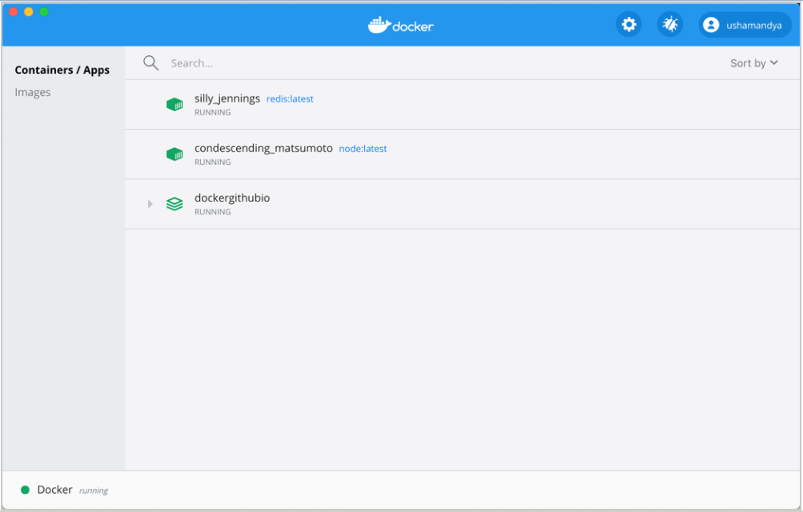

# 容器管理工具 Docker生态架构及部署

# 一、Docker生态架构

## 1.1 Docker Containers Are Everywhere

## 1.2 生态架构

### 1.2.1 Docker Host

用于安装Docker daemon的主机，即为Docker Host，并且该主机中可基于容器镜像运行容器。

### 1.2.2 Docker daemon

用于管理Docker Host中运行的容器、容器镜像、容器网络等，管理由Containerd.io提供的容器。

### 1.2.3 Registry

容器镜像仓库，用于存储已生成容器运行模板的仓库，用户使用时，可直接从容器镜像仓库中下载容器镜像，即容器运行模板，就可以运行容器镜像中包含的应用了。例如：Docker Hub,也可以使用Harbor实现企业私有的容器镜像仓库。

### 1.2.4 Docker client

Docker Daemon客户端工具，用于同Docker Daemon进行通信，执行用户指令，可部署在Docker Host上，也可以部署在其它主机，能够连接到Docker Daemon即可操作。

### 1.2.5 Image

把应用运行环境及计算资源打包方式生成可再用于启动容器的不可变的基础设施的模板文件，主要用于基于其启动一个容器。

### 1.2.6 Container

由容器镜像生成，用于应用程序运行的环境，包含容器镜像中所有文件及用户后添加的文件，属于基于容器镜像生成的可读写层，这也是应用程序活跃的空间。

### 1.2.7 Docker Dashboard

> 仅限于MAC与Windows操作系统上安装使用。

Docker Dashboard 提供了一个简单的界面，使您能够直接从您的机器管理您的容器、应用程序和映像，而无需使用 CLI 来执行核心操作。

## 1.3 Docker版本

- Docker-ce Docker社区版，主要用于个人开发者测试使用，免费版本
- Docker-ee Docker企业版，主要用于为企业开发及应用部署使用，收费版本，免费试用一个月，2020年因国际政治原因曾一度限制中国企业使用。

# 二、Docker部署

> 安装Docker-ce版本。

## 2.1 使用YUM源部署

> YUM源可以使用官方YUM源、清华大学开源镜像站配置YUM源，也可以使用阿里云开源镜像站提供的YUM源，建议选择使用阿里云开源镜像站提供的YUM源，原因速度快。

### 2.1.1 获取阿里云开源镜像站YUM源文件

~~~powershell
在docker host上使用 wget下载到/etc/yum.repos.d目录中即可。
# wget -O /etc/yum.repos.d/docker-ce.repo https://mirrors.aliyun.com/docker-ce/linux/centos/docker-ce.repo
~~~

### 2.1.2 安装Docker-ce

> 在docker host上安装即可，本次使用YUM源中稳定版本，由于版本在不断更新，不同的时间安装版本也不相同，使用方法基本一致。

~~~powershell
直接安装docker-ce，此为docker daemon，所有依赖将被yum自动安装，含docker client等。
# yum -y install docker-ce
~~~

### 2.1.3 配置Docker Daemon启动文件

> 由于Docker使用过程中会对Centos操作系统中的Iptables防火墙中的FORWARD链默认规划产生影响及需要让Docker Daemon接受用户自定义的daemon.json文件，需要要按使用者要求的方式修改。

~~~powershell
# vim /usr/lib/systemd/system/docker.service
~~~

### 2.1.4 启动Docker服务并查看已安装版本

~~~powershell
重启加载daemon文件
# systemctl daemon-reload

启动docker daemon
# systemctl start docker

设置开机自启动
# systemctl enable docker
~~~

~~~powershell
使用docker version客户端命令查看已安装docker软件版本
# docker version
Client: Docker Engine - Community 客户端
 Version:           20.10.12
 API version:       1.41
 Go version:        go1.16.12
 Git commit:        e91ed57
 Built:             Mon Dec 13 11:45:41 2021
 OS/Arch:           linux/amd64
 Context:           default
 Experimental:      true

Server: Docker Engine - Community Docker管理引擎
 Engine:
  Version:          20.10.12
  API version:      1.41 (minimum version 1.12)
  Go version:       go1.16.12
  Git commit:       459d0df
  Built:            Mon Dec 13 11:44:05 2021
  OS/Arch:          linux/amd64
  Experimental:     false
 containerd:
  Version:          1.4.12
  GitCommit:        7b11cfaabd73bb80907dd23182b9347b4245eb5d
 runc:
  Version:          1.0.2
  GitCommit:        v1.0.2-0-g52b36a2
 docker-init:
  Version:          0.19.0
  GitCommit:        de40ad0
~~~

## 2.2 使用二进制文件部署

> 官方不建议此种部署方式，主因为不能自动更新，在条件有限制的情况下使用。

二进制安装参考网址：https://docs.docker.com/engine/install/binaries/

~~~powershell
获取二进制文件，此文件中包含dockerd与docker 2个文件。
# wget https://download.docker.com/linux/static/stable/x86_64/docker-20.10.9.tgz
~~~

~~~powershell
解压下载的文件
# tar xf docker-20.10.9.tgz
查看解压出的目录
# ls docker
containerd       containerd-shim-runc-v2  docker   docker-init   runc
containerd-shim  ctr                      dockerd  docker-proxy
~~~

~~~powershell
安装解压后的所有二进制文件
# cp docker/* /usr/bin/
~~~

~~~powershell
运行Daemon
# dockerd &

会有大量的信息输出，停止后，直接回车即可使用。
~~~

>如果您需要使用其他选项启动守护程序，请相应地修改上述命令或创建并编辑文件`/etc/docker/daemon.json` 以添加自定义配置选项。

~~~powershell
确认是否可以使用docker客户端命令
# which docker
/usr/bin/docker

使用二进制安装的docker客户端
# docker version
Client:
 Version:           20.10.9
 API version:       1.41
 Go version:        go1.16.8
 Git commit:        c2ea9bc
 Built:             Mon Oct  4 16:03:22 2021
 OS/Arch:           linux/amd64
 Context:           default
 Experimental:      true

Server: Docker Engine - Community
 Engine:
  Version:          20.10.9
  API version:      1.41 (minimum version 1.12)
  Go version:       go1.16.8
  Git commit:       79ea9d3
  Built:            Mon Oct  4 16:07:30 2021
  OS/Arch:          linux/amd64
  Experimental:     false
 containerd:
  Version:          v1.4.11
  GitCommit:        5b46e404f6b9f661a205e28d59c982d3634148f8
 runc:
  Version:          1.0.2
  GitCommit:        v1.0.2-0-g52b36a2d
 docker-init:
  Version:          0.19.0
  GitCommit:        de40ad0

~~~

