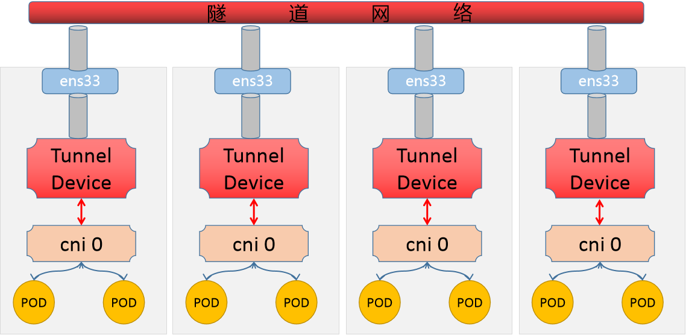
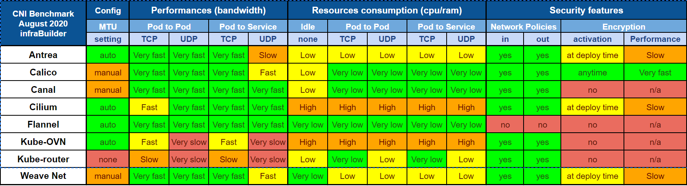
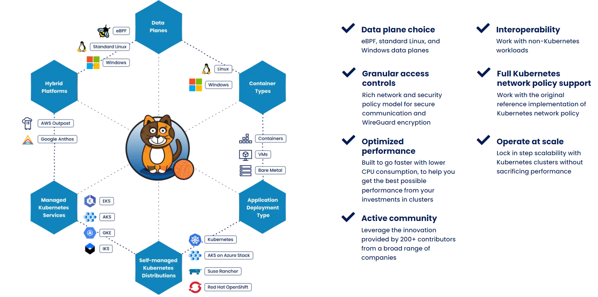
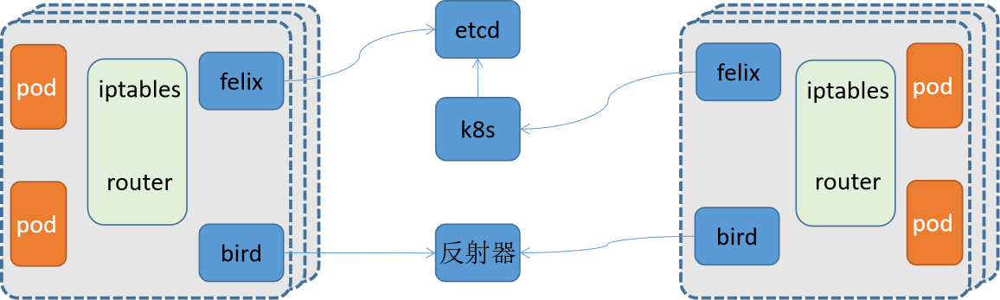
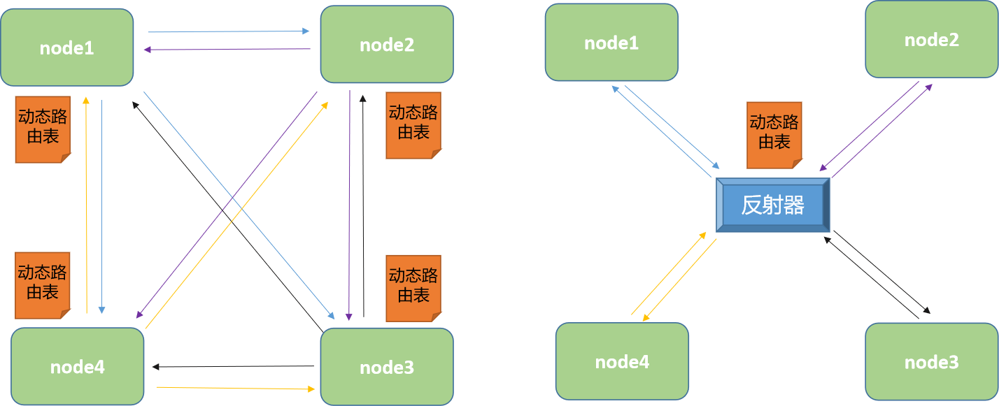
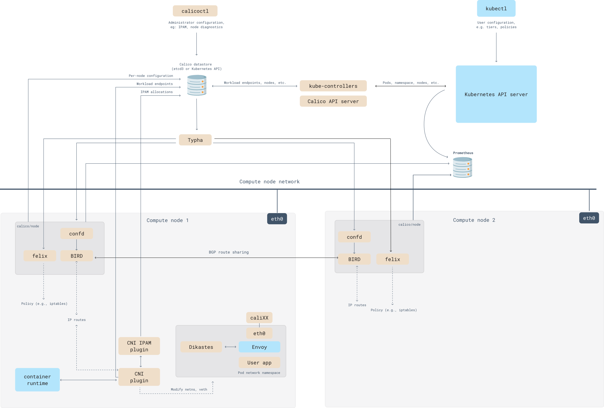

# kubernetes网络解决方案 Calico

# 一、CNI方案

学习目标

这一节，我们从 基础原理、方案解读、小结 三个方面来学习

**基础原理**

容器访问模式


```powershell
方法1： 虚拟网桥 + 虚拟网卡对
方法2： 多路复用 + 内核级的VLAN模块
方法3： 硬件交换 + 硬件虚拟化
```


CNI简介

```powershell
	根据我们对于容器的基本了解，他虽然可以借助于虚拟网桥docker0实现一定程度的网络功能，但是在大范围容器访问层面，其没有最好的网络解决方案，只能借助于一些第三方的网络解决方案来实现容器级别的跨网络通信能力。
	CNI的全称是Container Network Interface，Google和CoreOS联合定制的多容器通信的网络模型。在Kubernetes中通过一个CNI接口来替代docker0，它在宿主机上的默认名字叫cni0。它没有使用Docker的网络模型的原因有两个：1 不想被Docker要挟，2 自有的网络namespace设计有关。
```



```powershell
CNI的设计思想即为：Kubernetes在启动Pod的pause容器之后，直接调用CNI网络插件，从而实现为Pod内部应用容器所在的Network Namespace配置符合预期的网络信息。这里面需要特别关注两个方面：
	- Container必须有自己的网络命名空间的环境，也就是endpoint地址。
	- Container所在的网段必须能够注册网络地址信息

对容器网络的设置和操作都通过插件（Plugin）进行具体实现，CNI插件包括两种类型：CNIPlugin和IPAM（IP Address Management）Plugin。CNI Plugin负责为容器配置网络资源，IPAM Plugin负责对容器的IP地址进行分配和管理。IPAM Plugin作为CNI Plugin的一部分，与CNI Plugin一起工作。
```

```powershell
在Kubernetes中，CNI对于容器网络的设置主要是以CNI Plugin插件的方式来为容器配置网络资源，它主要有三种模式：
	MainPlugin
		- 用来创建具体的网络设备的二进制文件
		- 比如bridge、ipvlan、vlan、host-device
	IPAM Plugin
		- IPAM 就是 IP Address Management
		- 负责对容器的IP地址进行分配和管理，作为CNI Plugin的一部分，与CNI Plugin一起工作
	Meta Plugin
		- 由CNI社区维护的内部插件功能模块,常见的插件功能模块有以下几种
		- flannel 专门为Flannel项目提供的插件
		- tuning 通过sysctl调整网络设备参数的二进制文件
		- portmap 通过iptables配置端口映射的二进制文件
		- bandwidth 使用 Token Bucket Filter (TBF)来进行限流的二进制文件
		- firewall 通过iptables或者firewalled添加规则控制容器的进出流量
```

```powershell
更多详情查看：https://github.com/containernetworking/cni/blob/main/SPEC.md
```

CNI目前被谁管理？

```powershell
	在 Kubernetes 1.24 之前，CNI 插件也可以由 kubelet 使用命令行参数 cni-bin-dir 和 network-plugin 管理。而在Kubernetes 1.24 移除了这些命令行参数， CNI 的管理不再是 kubelet 的工作。而变成下层的容器引擎需要做的事情了，比如cri-dockerd服务的启动文件
```

```powershell
查看服务文件 /etc/systemd/system/cri-docker.service
ExecStart=/usr/local/bin/cri-dockerd --network-plugin=cni --cni-conf-dir=/etc/cni/net.d --cni-bin-dir=/opt/cni/bin ...

注意：
	/opt/cni/bin 目录是部署kubernetes的时候，安装的cni-tools软件包自动创建出来的，这里面包含了很多的网络命令工具
```

```powershell
flannel的CNI配置文件
# cat /etc/cni/net.d/10-flannel.conflist
{
  "name": "cbr0",
  "plugins": [
    {
      "type": "flannel",  # 为Flannel项目提供的插件，配置容器网络
      "delegate": {
        "hairpinMode": true,
        "isDefaultGateway": true
      }
    },
    {
      "type": "portmap", # 通过iptables配置端口映射的二进制文件，配置端口映射
      "capabilities": {
        "portMappings": true
      }
    }
  ]
}
```

```powershell
calico的CNI配置文件
# cat /etc/cni/net.d/10-calico.conflist
{
  "name": "k8s-pod-network",
  "cniVersion": "0.3.1",
  "plugins": [
    {
      "type": "calico",
      "log_level": "info",
      "log_file_path": "/var/log/calico/cni/cni.log",
      "datastore_type": "kubernetes",
      "nodename": "kubernetes-master",
      "mtu": 0,
      "ipam": {
          "type": "host-local",
          "subnet": "usePodCidr"
      },
      "policy": {
          "type": "k8s"
      },
      "kubernetes": {
          "kubeconfig": "/etc/cni/net.d/calico-kubeconfig"
      }
    },
    {
      "type": "portmap",
      "snat": true,
      "capabilities": {"portMappings": true}
    },
    {
      "type": "bandwidth",
      "capabilities": {"bandwidth": true}
    }
  ]
}
```

**方案解读**

```powershell
kubernetes提供了很多的网络解决方案，相关的资料如下：
	https://kubernetes.io/zh-cn/docs/concepts/cluster-administration/addons/
```

flannel方案

```powershell
项目地址：https://github.com/coreos/flannel

	Flannel是CoreOS 开发的项目，它是容器编排系统中最成熟的网络方案之一，旨在实现更好的容器间和主机间网络，由于其稳定和配置简单，所以它是CNI最早引入的一套方案。常见的 Kubernetes 集群部署工具和许多 Kubernetes 发行版都可以默认安装 Flannel。
	如果你需要一个稳定而又简单的网络功能的话，不那么在乎安全性的话，Flannel是一个很好的选择。
```

calico方案

```powershell
项目地址：https://github.com/projectcalico/cni-plugin
	
	Calico 是 Kubernetes 生态系统中另一种流行的网络选择。虽然 Flannel 被公认为是最简单的选择，但 Calico 以其性能、灵活性而闻名。Calico 的功能更为全面，除了通用的网络连接，还涉及网络安全和网络策略管理，甚至Calico还可以在微服务的网络治理中进行整合。Calico CNI 插件在 CNI 框架内封装了 Calico 的功能。
	如果对你的环境而言，支持网络策略是非常重要的一点，而且你对其他性能和功能也有需求，那么 Calico 会是一个理想的选择。
```

canal方案

```powershell
项目地址：https://github.com/projectcalico/canal

	Canal 试图将 Flannel 提供的网络功能与 Calico 的网络策略功能集成在一起，只不过在研发的时候，发现Flannel 和 Calico 这两个项目的标准化和灵活性都想当标准，那集成就没必要了，所以目前这个项目“烂尾”了。由于Canal的思路很好，业界习惯性地将 Flannel 和 Calico 的功能组合实施称为“Canal”。
	对于那些喜欢 Flannel 提供的网络模型，同时喜欢 Calico 的网络策略功能的人来说，Canal是一个选择。
```

weave方案

```powershell
项目地址：https://www.weave.works/oss/net/

	Weave 是由 Weaveworks 提供的一种 Kubernetes CNI 网络选项，它在集群中的每个节点上部署路由组件，从而实现主机之间创建更加灵活的网状 overlay 网络，借助于内核级别的Open vSwitch 配置，从而实现具有一定程度的智能路由功能。除此之外，weave还具有想当的网络策略功能，网络加密传输功能等。
	对于那些寻求功能丰富的网络、同时希望不要增加大量复杂性或管理难度的人来说，Weave 是一个很好的选择。
```



```powershell
bandwidth - 带宽、consumption - 消耗、encryption - 加密
资料来源：
https://docs.google.com/spreadsheets/d/12dQqSGI0ZcmuEy48nA0P_bPl7Yp17fNg7De47CYWzaM/edit#gid=404703955
```


**小结**

```

```


# 二、 Calico环境

学习目标

这一节，我们从 基础知识、原理解读、小结 三个方面来学习

**基础知识**

简介

```
	Calico是一个开源的虚拟化网络方案,用于为云原生应用实现互联及策略控制.相较于 Flannel 来说,Calico 的优势是对网络策略(network policy),它允许用户动态定义 ACL 规则控制进出容器的数据报文,实现为 Pod 间的通信按需施加安全策略.不仅如此,Calico 还可以整合进大多数具备编排能力的环境,可以为 虚机和容器提供多主机间通信的功能。
	Calico 本身是一个三层的虚拟网络方案,它将每个节点都当作路由器,将每个节点的容器都当作是节点路由器的一个终端并为其分配一个 IP 地址,各节点路由器通过 BGP(Border Gateway Protocol)学习生成路由规则,从而将不同节点上的容器连接起来.因此,Calico 方案其实是一个纯三层的解决方案,通过每个节点协议栈的三层（网络层）确保容器之间的连通性,这摆脱了 flannel host-gw 类型的所有节点必须位于同一二层网络的限制,从而极大地扩展了网络规模和网络边界。

官方地址：https://www.tigera.io/project-calico/
最新版本：v3.24.1 (20220827)、 v3.20.6 (20220802)、v3.21.6 (20220722)、 v3.23.3 (20220720)、v3.22.4 (20220720)
```

网络模型

```
Calico为了实现更广层次的虚拟网络的应用场景，它支持多种网络模型来满足需求。
underlay network - BGP(三层虚拟网络解决方案)
overlay network - IPIP(双层IP实现跨网段效果)、VXLAN(数据包标识实现大二层上的跨网段通信)
```

设计思想

```
Calico不使用隧道或者NAT来实现转发，而是巧妙的把所有二三层流量转换成三层流量，并通过host上路由配置完成跨host转发。
```

为什么用calico



**原理解读**

calico

```powershell
	Calico是一个开源的虚拟化网络方案,用于为云原生应用实现互联及策略控制.相较于 Flannel 来说,Calico 的优势是对网络策略(network policy),它允许用户动态定义 ACL 规则控制进出容器的数据报文,实现为 Pod 间的通信按需施加安全策略.不仅如此,Calico 还可以整合进大多数具备编排能力的环境,可以为 虚机和容器提供多主机间通信的功能。
	我们平常使用Calico主要用到的是它的网络策略功能
```

软件结构



```powershell
Felix
	每个节点都有，负责配置路由、ACL、向etcd宣告状态等
BIRD
	每个节点都有，负责把 Felix 写入Kernel的路由信息 分发到整个 Calico网络，确保 workload 连通
etcd
	存储calico自己的状态数据，可以结合kube-apiserver来工作
	官方推荐；
        < 50节点,可以结合 kube-apiserver 来实现数据的存储
        > 50节点,推荐使用独立的ETCD集群来进行处理。
    参考资料：
    	https://projectcalico.docs.tigera.io/getting-started/kubernetes/self-managed-onprem/onpremises#install-calico
Route Reflector
	路由反射器，用于集中式的动态生成所有主机的路由表，非必须选项
	超过100个节点推荐使用：
	https://projectcalico.docs.tigera.io/getting-started/kubernetes/rancher#concepts
Calico编排系统插件
	实现更广范围的虚拟网络解决方案。
	
参考资料：https://docs.projectcalico.org/reference/architecture/overview
```

工作模式



```powershell
对于节点量少的情况下，我们推荐使用左侧默认的模式，当节点量多的时候，我们推荐使用右侧的反射器模式
```

**小结**

```

```


## 2.1  Calico部署

学习目标

这一节，我们从 环境解析、简单实践、小结 三个方面来学习

**环境解析**

k8s环境上的calico逻辑



```powershell
confd 
	- 统一管控 Calico 数据存储以及 BGP 配置的轻量级的配置管理工具。
	- 当配置文件发生变化时，动态更新和生成BIRD 配置文件
Dikastes
	- 为 Istio 服务网格实施网络策略。作为 Istio Envoy 的 sidecar 代理在集群上运行。
CNI plugin	
	- 为 Kubernetes 集群提供 Calico 网络，必须安装在 Kubernetes 集群中的每个节点上。
Datastore plugin
	- 独立使用etcd作为Calico的数据存储平台，特点在于独立扩展数据存储
	- 结合K8s的apiserver实现数据存储到etcd中，特点在于使用 Kubernetes的存储、RBAC、审计功能为Calico服务
IPAM plugin
	- 使用 Calico 的 IP 池资源来控制 IP 地址如何分配给集群内的 Pod。
kube-controllers
	- 监控 Kubernetes API 并根据集群状态执行操作
	- 主要是策略、命名空间、服务账号、负载、节点等通信策略的控制
Typha
	- 通过减少每个节点对数据存储的影响来增加规模。在数据存储和 Felix 实例之间作为守护进程运行。
	
参考资料：
	https://projectcalico.docs.tigera.io/reference/architecture/overview
```

基础环境支持

```powershell
linux 主机基本要求：
    x86-64、arm64、ppc64le 或 s390x 处理器
    2CPU
    2GB 内存
    10GB 可用磁盘空间
    RedHat Enterprise Linux 7.x+、CentOS 7.x+、Ubuntu 16.04+ 或 Debian 9.x+
	确保 Calico 可以在主机上进行管理cali和接口
其他需求：
	kubernetes集群配置了 --pod-network-cidr 属性
参考资料：
	https://projectcalico.docs.tigera.io/getting-started/kubernetes/quickstart
```

部署解析

```powershell
对于calico在k8s集群上的部署来说，为了完成上面四个组件的部署，这里会涉及到两个部署组件
```

| 组件名                 | 组件作用                                                     |
| ---------------------- | ------------------------------------------------------------ |
| calico-node            | 需要部署到所有集群节点上的代理守护进程，提供封装好的Felix和BIRD |
| calico-kube-controller | 专用于k8s上对calico所有节点管理的中央控制器。负责calico与k8s集群的协同及calico核心功能实现。 |

部署步骤

```powershell
1 获取资源配置文件
	从calico官网获取相关的配置信息
2 定制CIDR配置
	定制calico自身对于pod网段的配置信息，并且清理无关的网络其他插件
3 定制pod的manifest文件分配网络配置
	默认的k8s集群在启动的时候，会有一个cidr的配置，有可能与calico进行冲突，那么我们需要修改一下
4 应用资源配置文件
```

```powershell
注意事项：
	对于calico来说，它自己会生成自己的路由表，如果路由表中存在响应的记录，默认情况下会直接使用，而不是覆盖掉当前主机的路由表
	所以如果我们在部署calico之前，曾经使用过flannel，尤其是flannel的host-gw模式的话，一定要注意，在使用calico之前，将之前所有的路由表信息清空，否则无法看到calico的tunl的封装效果
```

**简单实践**

环境部署

```powershell
1 获取资源清单文件
mkdir /data/kubernetes/network/calico -p
cd /data/kubernetes/network/calico/
curl https://docs.projectcalico.org/manifests/calico.yaml -O
cp calico.yaml{,.bak}
```

```powershell
2 配置资源清单文件
# vim calico.yaml
---- 官网推荐的修改内容
4546             - name: CALICO_IPV4POOL_CIDR
4547               value: "10.244.0.0/16"
---- 方便我们的后续实验，新增调小子网段的分配
4548             - name: CALICO_IPV4POOL_BLOCK_SIZE
4549               value: "24"
配置解析：
	开放默认注释的CALICO_IPV4POOL_CIDR变量，然后定制我们当前的pod的网段范围即可
	原则上来说，我们修改官方提示的属性即可
```

```powershell
3 定制pod的manifest文件分配网络配置
# vim calico.yaml
---- 修改下面的内容
  64           "ipam": {
  65               "type": "calico-ipam"
  66           },
---- 修改后的内容
  64           "ipam": {
  65               "type": "host-local",
  66               "subnet": "usePodCidr"
  67           },
---- 定制calico使用k8s集群节点的地址
4551             - name: USE_POD_CIDR
4552               value: "true"
配置解析:
	Calico默认并不会从Node.Spec.PodCIDR中分配地址，但可通过USE_POD_CIDR变量并结合host-local这一IPAM插件以强制从PodCIDR中分配地址
```

```powershell
4 定制默认的docker镜像
查看默认的镜像
# grep docker.io calico.yaml | uniq
          image: docker.io/calico/cni:v3.24.1
          image: docker.io/calico/node:v3.24.1
          image: docker.io/calico/kube-controllers:v3.24.1
获取镜像
for i in $(grep docker.io calico.yaml | uniq | awk -F'/' '{print $NF}')
do
  docker pull calico/$i
  docker tag calico/$i kubernetes-register.superopsmsb.com/google_containers/$i
  docker push kubernetes-register.superopsmsb.com/google_containers/$i
  docker rmi calico/$i
done

修改为定制的镜像
sed -i 's#docker.io/calico#kubernetes-register.superopsmsb.com/google_containers#g' calico.yaml

查看效果
# grep google calico.yaml
          image: kubernetes-register.superopsmsb.com/google_containers/cni:v3.24.1
          image: kubernetes-register.superopsmsb.com/google_containers/cni:v3.24.1
          image: kubernetes-register.superopsmsb.com/google_containers/node:v3.24.1
          image: kubernetes-register.superopsmsb.com/google_containers/node:v3.24.1
          image: kubernetes-register.superopsmsb.com/google_containers/kube-controllers:v3.24.1
```

```powershell
5 应用资源配置文件
清理之前的flannel插件
kubectl delete -f kube-flannel.yml
kubectl get pod -n kube-system | grep flannel

这个时候，先清除旧网卡，然后最好重启一下主机，直接清空所有的路由表信息
ifconfig flannel.1
reboot

重启后，查看网络效果
注意：
	为了避免后续calico网络测试的异常，我们这里最好只留下一个网卡 eth0
```

```powershell
应用calico插件
kubectl apply -f calico.yaml
 
在calico-node部署的时候，会启动多个进程
# kubectl get pod -n kube-system | egrep 'NAME|calico'
NAME                                        READY   STATUS              RESTARTS       AGE
calico-kube-controllers-549f7748b5-xqz8j    0/1     ContainerCreating   0              9s
calico-node-74c5w                           0/1     Init:0/3            0              9s
...

环境部署完毕后，查看效果
# kubectl get pod -n kube-system | egrep 'NAME|calico'
NAME                                        READY   STATUS    RESTARTS       AGE
calico-kube-controllers-549f7748b5-xqz8j    0/1     Running   0              39s
calico-node-74c5w                           0/1     Running   0              39s
...
```

```powershell
每个calico节点上都有多个进程，分别来处理不同的功能
]# ps aux | egrep 'NAME | calico'
root       9315  0.5  1.1 1524284 43360 ?       Sl   15:29   0:00 calico-node -confd
root       9316  0.2  0.8 1155624 32924 ?       Sl   15:29   0:00 calico-node -monitor-token
root       9317  2.8  1.0 1598528 40992 ?       Sl   15:29   0:02 calico-node -felix
root       9318  0.3  0.9 1155624 35236 ?       Sl   15:29   0:00 calico-node -monitor-addresses
root       9319  0.3  0.8 1155624 33460 ?       Sl   15:29   0:00 calico-node -status-reporter
root       9320  0.2  0.7 1155624 30364 ?       Sl   15:29   0:00 calico-node -allocate-tunnel-addrs
```

测试效果

```powershell
获取镜像
docker pull nginx
docket tag nginx kubernetes-register.superopsmsb.com/superopsmsb/nginx:1.23.1
docker push kubernetes-register.superopsmsb.com/superopsmsb/nginx:1.23.1
docker rmi nginx
```

```powershell
创建一个deployment
kubectl create deployment pod-deployment --image=kubernetes-register.superopsmsb.com/superopsmsb/nginx:1.23.1 --replicas=3

查看pod
# kubectl get pod
NAME                             READY   STATUS    RESTARTS   AGE
pod-deployment-554dff674-267gq   1/1     Running   0          48s
pod-deployment-554dff674-c8cjs   1/1     Running   0          48s
pod-deployment-554dff674-pxrwb   1/1     Running   0          48s

暴露一个service
kubectl expose deployment pod-deployment --port=80 --target-port=80

确认效果
kubectl get service
curl 10.108.138.97
```


**小结**

```

```


## 2.2  简单实践

学习目标

这一节，我们从 网络解析、命令完善、小结 三个方面来学习

**网络解析**

calico部署完毕后，会生成一系列的自定义配置属性信息

```powershell
自动生成一个api版本信息
# kubectl api-versions  | grep crd
crd.projectcalico.org/v1

该api版本信息中有大量的配置属性
kubectl api-resources  | grep crd.pro
```

```powershell
这里面的 ippools 里面包含了calico相关的网络属性信息
# kubectl get ippools
NAME                  AGE
default-ipv4-ippool   37m

查看这里配置的calico相关的信息
# kubectl get ippools default-ipv4-ippool -o yaml
apiVersion: crd.projectcalico.org/v1
kind: IPPool
...
spec:
  allowedUses:
  - Workload
  - Tunnel
  blockSize: 24
  cidr: 10.244.0.0/16
  ipipMode: Always
  natOutgoing: true
  nodeSelector: all()
  vxlanMode: Never
结果显式：
	这里的calico采用的模型就是 ipip模型，分配的网段是使我们定制的 cidr网段，而且子网段也是我们定制的 24位掩码
```

环境创建完毕后，会生成一个tunl0的网卡，所有的流量会走这个tunl0网卡

```powershell
确认网卡和路由信息
]# ifconfig | grep flags
]# ip route list | grep tun
10.244.1.0/24 via 10.0.0.13 dev tunl0 proto bird onlink
10.244.2.0/24 via 10.0.0.14 dev tunl0 proto bird onlink
10.244.3.0/24 via 10.0.0.15 dev tunl0 proto bird onlink
10.244.4.0/24 via 10.0.0.16 dev tunl0 proto bird onlink
10.244.5.0/24 via 10.0.0.17 dev tunl0 proto bird onlink
结果显示：
	calico模型中，默认使用的是tunl0虚拟网卡实现数据包的专线转发
```

测试效果

```powershell
由于在calico的默认网络模型是 IPIP，所以我们在进行数据包测试的时候，可以通过直接抓取宿主机数据包，来发现双层ip效果
kubectl get pod -o wide

在master1上采用ping的方式来测试 node2上的节点pod
[root@kubernetes-master1 /data/kubernetes/network/calico]# ping -c 1 10.244.4.3
PING 10.244.4.3 (10.244.4.3) 56(84) bytes of data.
64 bytes from 10.244.4.3: icmp_seq=1 ttl=63 time=0.794 ms
```

```powershell
在node2上检测数据包的效果
[root@kubernetes-node2 ~]# tcpdump -i eth0 -nn ip host 10.0.0.16 and host 10.0.0.12
tcpdump: verbose output suppressed, use -v or -vv for full protocol decode
listening on eth0, link-type EN10MB (Ethernet), capture size 262144 bytes
15:38:52.231680 IP 10.0.0.12 > 10.0.0.16: IP 10.244.0.1 > 10.244.4.3: ICMP echo request, id 19189, seq 1, length 64 (ipip-proto-4)
15:38:52.231989 IP 10.0.0.16 > 10.0.0.12: IP 10.244.4.3 > 10.244.0.1: ICMP echo reply, id 19189, seq 1, length 64 (ipip-proto-4)
15:38:54.666538 IP 10.0.0.16.33992 > 10.0.0.12.179: Flags [P.], seq 4281052787:4281052806, ack 3643645463, win 58, length 19: BGP
15:38:54.666962 IP 10.0.0.12.179 > 10.0.0.16.33992: Flags [.], ack 19, win 58, length 0
结果显式：
	每个数据包都是基于双层ip嵌套的方式来进行传输，而且协议是 ipip-proto-4
	结合路由的分发详情，可以看到具体的操作效果。
	具体效果：10.244.0.1 -> 10.0.0.12 -> 10.0.0.16 -> 10.244.6.3
```


**命令完善**

简介

```powershell
	calico本身是一个复杂的系统，复杂到它自己提供一个非常重要的Restful接口，结合calicoctl命令来管理自身的相关属性信息，calicoctl可以直接与etcd进行操作，也可以通过kube-apiserver的方式与etcd来进行操作。默认情况下，它与kube-apiserver通信的认证方式与kubectl的命令使用同一个context。但是我们还是推荐，使用手工定制的一个配置文件。

	calicoctl 是运行在集群之外的，用于管理集群功能的一个重要的组件。calicoctl 的安装方式很多，常见的方式有：单主机方式、kubectl命令插件方式、pod方式、主机容器方式。我们需要自己选择一种适合自己的方式
	参考资料：https://projectcalico.docs.tigera.io/getting-started/kubernetes/hardway/the-calico-datastore#install
```

```powershell
获取专用命令
cd /usr/local/bin/
curl -L https://github.com/projectcalico/calico/releases/download/v3.24.1/calicoctl-linux-amd64 -o calicoctl
chmod +x calicoctl

查看帮助
# calicoctl --help
Usage:
  calicoctl [options] <command> [<args>...]
```

命令的基本演示

```powershell
查看ip的管理
calicoctl ipam --help

查看ip的信息
# calicoctl ipam show
+----------+---------------+-----------+------------+--------------+
| GROUPING |     CIDR      | IPS TOTAL | IPS IN USE |   IPS FREE   |
+----------+---------------+-----------+------------+--------------+
| IP Pool  | 10.244.0.0/16 |     65536 | 0 (0%)     | 65536 (100%) |
+----------+---------------+-----------+------------+--------------+
```

```powershell
查看信息的显式效果
calicoctl ipam show --help

显式相关的配置属性
# calicoctl ipam show --show-configuration
+--------------------+-------+
|      PROPERTY      | VALUE |
+--------------------+-------+
| StrictAffinity     | false |
| AutoAllocateBlocks | true  |
| MaxBlocksPerHost   |     0 |
+--------------------+-------+
```

将calico整合到kubectl里面

```powershell
定制kubectl 插件子命令
# cd /usr/local/bin/
# cp -p calicoctl kubectl-calico

测试效果
# kubectl calico --help
Usage:
  kubectl-calico [options] <command> [<args>...]
  
后续的操作基本上都一样了，比如获取网络节点效果
[root@kubernetes-master1 /usr/local/bin]# kubectl calico node status
Calico process is running.

IPv4 BGP status
+--------------+-------------------+-------+----------+-------------+
| PEER ADDRESS |     PEER TYPE     | STATE |  SINCE   |    INFO     |
+--------------+-------------------+-------+----------+-------------+
| 10.0.0.15    | node-to-node mesh | up    | 07:30:48 | Established |
| 10.0.0.17    | node-to-node mesh | up    | 07:30:48 | Established |
| 10.0.0.13    | node-to-node mesh | up    | 07:30:48 | Established |
| 10.0.0.14    | node-to-node mesh | up    | 07:30:51 | Established |
| 10.0.0.16    | node-to-node mesh | up    | 07:31:41 | Established |
+--------------+-------------------+-------+----------+-------------+

IPv6 BGP status
No IPv6 peers found.
注意：
	这里查看的是除了自己网段之外的其他节点的路由信息
```

**小结**

```

```

## 2.3  BGP实践

学习目标

这一节，我们从 bgp改造、反射器实践、小结 三个方面来学习

**bgp改造**

简介

```powershell
	对于现有的calico环境，我们如果需要使用BGP环境，我们可以直接使用一个配置清单来进行修改calico环境即可。我们这里先来演示一下如何使用calicoctl修改配置属性。
```

```powershell
获取当前的配置属性
# kubectl calico get ipPools
NAME                  CIDR            SELECTOR
default-ipv4-ippool   10.244.0.0/16   all()

# kubectl calico get ipPools default-ipv4-ippool -o yaml
apiVersion: projectcalico.org/v3
kind: IPPool
...
spec:
  blockSize: 24
  cidr: 10.244.0.0/16
  ipipMode: Always
  natOutgoing: true
  nodeSelector: all()
  vxlanMode: Never
```

```powershell
定制资源配置文件
kubectl calico get ipPools default-ipv4-ippool -o yaml > default-ipv4-ippool.yaml

修改配置文件
# cat default-ipv4-ippool.yaml
apiVersion: projectcalico.org/v3
kind: IPPool
metadata:
  name: default-ipv4-ippool
spec:
  blockSize: 24
  cidr: 10.244.0.0/16
  ipipMode: CrossSubnet
  natOutgoing: true
  nodeSelector: all()
  vxlanMode: Never
  配置解析：
  	仅仅将原来的Always 更换成 CrossSubnet(跨节点子网) 模式即可
  	vxlanMode 的两个值可以实现所谓的 BGP with vxlan的效果
  	
应用资源配置文件
# kubectl calico apply -f default-ipv4-ippool.yaml
Successfully applied 1 'IPPool' resource(s)
```

检查效果

```powershell
查看路由信息
[root@kubernetes-master1 ~]# ip route list | grep via
default via 10.0.0.2 dev eth0
10.244.1.0/24 via 10.0.0.13 dev eth0 proto bird
10.244.2.0/24 via 10.0.0.14 dev eth0 proto bird
10.244.3.0/24 via 10.0.0.15 dev eth0 proto bird
10.244.4.0/24 via 10.0.0.16 dev eth0 proto bird
10.244.5.0/24 via 10.0.0.17 dev eth0 proto bird

结果显式：
	更新完毕配置后，动态路由的信息就发生改变了，不再完全是 tunl0 网卡了，而是变成了通过具体的物理网卡eth0 转发出去了
```

```powershell
在master1上ping在节点node2上的pod
[root@kubernetes-master1 ~]# ping -c 1 10.244.4.3
PING 10.244.4.3 (10.244.4.3) 56(84) bytes of data.
64 bytes from 10.244.4.3: icmp_seq=1 ttl=63 time=0.671 ms

由于这次是直接通过节点进行转发的，所以我们在node2节点上抓包的时候，直接通过内层ip抓取即可。
[root@kubernetes-node2 ~]# tcpdump -i eth0 -nn ip host 10.244.4.3
tcpdump: verbose output suppressed, use -v or -vv for full protocol decode
listening on eth0, link-type EN10MB (Ethernet), capture size 262144 bytes
15:47:32.906462 IP 10.0.0.12 > 10.244.4.3: ICMP echo request, id 28248, seq 1, length 64
15:47:32.906689 IP 10.244.4.3 > 10.0.0.12: ICMP echo reply, id 28248, seq 1, length 64
结果显示：
	他们实现了直接的连通，无需进行数据包的转换了，效率更高一点
```


**反射器实践**

当前节点的网络效果

```powershell
查看当前节点的网络效果
[root@kubernetes-master1 ~]# kubectl calico node status
Calico process is running.

IPv4 BGP status
+--------------+-------------------+-------+----------+-------------+
| PEER ADDRESS |     PEER TYPE     | STATE |  SINCE   |    INFO     |
+--------------+-------------------+-------+----------+-------------+
| 10.0.0.15    | node-to-node mesh | up    | 07:30:48 | Established |
| 10.0.0.17    | node-to-node mesh | up    | 07:30:48 | Established |
| 10.0.0.13    | node-to-node mesh | up    | 07:30:48 | Established |
| 10.0.0.14    | node-to-node mesh | up    | 07:30:51 | Established |
| 10.0.0.16    | node-to-node mesh | up    | 07:31:41 | Established |
+--------------+-------------------+-------+----------+-------------+
```

需求

```powershell
	当前的calico节点的网络状态是 BGP peer 的模型效果，也就是说 每个节点上都要维护 n-1 个路由配置信息，整个集群中需要维护 n*(n-1) 个路由效果，这在节点量非常多的场景中，不是我们想要的。
	所以我们需要实现一种 BGP reflecter 的效果。
```

```powershell
	如果我们要做 BGP reflecter 效果的话，需要对反射器角色做冗余，如果我们的集群是一个多主集群的话，可以将集群的master节点作为bgp的reflecter角色，从而实现反射器的冗余。
    1 定制反射器角色
    2 后端节点使用反射器
    3 关闭默认的网格效果
```

1 创建反射器角色

```powershell
定制资源定义文件 01-calico-reflector-master.yaml
apiVersion: projectcalico.org/v3
kind: Node
metadata:
  labels:
    route-reflector: true
  name: kubernetes-master1
spec:
  bgp:
    ipv4Address: 10.0.0.12/16
    ipv4IPIPTunnelAddr: 10.244.0.1
    routeReflectorClusterID: 1.1.1.1
属性解析；
	metadata.labels 是非常重要的，因为它需要被后面的节点来进行获取
    metadata.name 的属性，必须是通过 calicoctl get nodes 获取到的节点名称。
    spec.bgp.ipv4Address必须是 指定节点的ip地址
    spec.bgp.ipv4IPIPTunnelAddr必须是 指定节点上tunl0的地址
    spec.bgp.routeReflectorClusterID 是BGP网络中的唯一标识，所以这里的集群标识只要唯一就可以了
    
应用资源配置文件
kubectl calico apply -f 01-calico-reflector-master.yaml
```

2 更改节点的网络模型为 reflecter模型

```powershell
定制资源定义文件 02-calico-reflector-bgppeer.yaml
kind: BGPPeer
apiVersion: projectcalico.org/v3
metadata:
  name: bgppeer-demo
spec:
  nodeSelector: all()
  peerSelector: route-reflector=="true"
属性解析；
    spec.nodeSelector 指定的所有后端节点
    spec.peerSelector 指定的是反射器的标签，标识所有的后端节点与这个反射器进行数据交流
    
应用资源配置文件
kubectl calico apply -f 02-calico-reflector-bgppeer.yaml
```

3 关闭默认的网格效果

```powershell
定制资源定义文件 03-calico-reflector-defaultconfig.yaml
apiVersion: projectcalico.org/v3
kind: BGPConfiguration
metadata:
  name: default
spec:
  logSeverityScreen: Info
  nodeToNodeMeshEnabled: false
  asNumber: 63400
  
属性解析；
	metadata.name 在这里最好是default，因为我们要对BGP默认的网络效果进行关闭
    spec.nodeToNodeMeshEnabled 关闭后端节点的BGP peer默认状态 -- 即点对点通信关闭
    spec.asNumber 指定的是后端节点间使用反射器的时候，我们要在一个标志号内，这里随意写一个
    
应用资源配置文件
kubectl calico apply -f 03-calico-reflector-defaultconfig.yaml
```

```powershell
查看效果
[root@kubernetes-master1 ~/txt]# kubectl calico node status
...
IPv4 BGP status
+--------------+---------------+-------+----------+-------------+
| PEER ADDRESS |   PEER TYPE   | STATE |  SINCE   |    INFO     |
+--------------+---------------+-------+----------+-------------+
| 10.0.0.13    | node specific | up    | 07:51:47 | Established |
| 10.0.0.14    | node specific | up    | 07:51:49 | Established |
| 10.0.0.15    | node specific | up    | 07:51:49 | Established |
| 10.0.0.16    | node specific | up    | 07:51:47 | Established |
| 10.0.0.17    | node specific | up    | 07:51:47 | Established |
+--------------+---------------+-------+----------+-------------+
结果显式：
	默认的点对点通信方式就已经丢失了，剩下了反射器模式
```


**小结**

```

```


## 2.4  策略实践

学习目标

这一节，我们从 属性解读、基本控制、小结 三个方面来学习。

**属性解读**

策略简介

```powershell
	为了使用Network Policy，Kubernetes引入了一个新的资源对象Network Policy，供用户设置Pod间网络访问的策略。策略控制器用于监控指定区域创建对象(pod)时所生成的新API端点，并按需为其附加网络策略。

	对于Pod对象来说，网络流量分为 流入(Ingress)和流出(Egress)两个方向，每个方向包含允许和禁止两种控制策略，默认情况下，所有的策略都是允许的，应用策略后，所有未经明确允许的流量都将拒绝。
```


```powershell
注意：
	网络策略的控制，可以是多个级别：
		集群级别、namespace级别、Pod级别、ip级别、端口级别
```

资源对象属性

```powershell
apiVersion: networking.k8s.io/v1  	# 资源隶属的API群组及版本号
kind: NetworkPolicy  				# 资源类型的名称，名称空间级别的资源；
metadata:  							# 资源元数据
  	name <string>  					# 资源名称标识
  	namespace <string>  			# NetworkPolicy是名称空间级别的资源
spec:  								# 期望的状态
  	podSelector <Object>  			# 当前规则生效的一组目标Pod对象，必选字段；空值表示当前名称空间中的所有Pod资源
  	policyTypes <[]string>  		# Ingress表示生效ingress字段；Egress表示生效egress字段，同时提供表示二者均有效
	ingress <[]Object>  			# 入站流量源端点对象列表，白名单，空值表示“所有”
	- from <[]Object>  				# 具体的端点对象列表，空值表示所有合法端点
	  - ipBlock  <Object> 			# IP地址块范围内的端点，不能与另外两个字段同时使用
	  - namespaceSelector <Object> 	# 匹配的名称空间内的端点
	    podSelector <Object>		# 由Pod标签选择器匹配到的端点，空值表示<none>
	  ports <[]Object>  			# 具体的端口对象列表，空值表示所有合法端口
	egress <[]Object>  				# 出站流量目标端点对象列表，白名单，空值表示“所有”
	- to <[]Object>  				# 具体的端点对象列表，空值表示所有合法端点，格式同ingres.from；
	  ports <[]Object>  			# 具体的端口对象列表，空值表示所有合法端口
	  
注意：
	入栈和出栈哪个策略生效，由 policyTypes 来决定。
	如果仅配置了podSelector，表明，当前限制仅限于当前的命名空间
```

配置示例

```powershell
apiVersion:  networking.k8s.io/v1
kind: NetworkPolicy
metadata:
  name: test-network-policy
  namespace: default
spec:
  podSelector:
    matchLabels:
      role: db
  policyTypes:
  - Ingress
  - Egress
  ingress:
  - from:
    - ipBlock:
        cidr: 10.244.0.0/16
        except:
        - 10.244.1.0/24
    - namespacesSelector:
        matchLabels:
          project: develop
    - podSelector:
        matchLabels:
          arch: frontend
    ports:
    - protocol: TCP
      port: 6379
  egress:
  - to:
    - ipBlock:
        cidr: 10.244.0.0/24
      ports:
      - protocol: TCP
        port: 3306
```

准备工作

```powershell
在default命名空间创建应用
[root@kubernetes-master1 ~]# kubectl create deployment nginx-web --image=kubernetes-register.superopsmsb.com/superopsmsb/nginx_web:v0.1
[root@kubernetes-master1 ~]# kubectl expose deployment nginx-web --port=80

在superopsmsb命名空间创建应用
[root@kubernetes-master1 ~]# kubectl create deployment nginx-web --image=kubernetes-register.superopsmsb.com/superopsmsb/nginx_web:v0.1 --namespace=superopsmsb
[root@kubernetes-master1 ~]# kubectl expose deployment nginx-web --port=80 --namespace=superopsmsb

确认效果
[root@kubernetes-master1 ~]# kubectl  get pod -o wide
NAME            			 READY... AGE   IP           ...
nginx-web-5865bb968d-759lc   1/1  ... 10s   10.244.1.4   ...

[root@kubernetes-master1 ~]# kubectl  get pod -o wide -n superopsmsb
NAME            			 READY... AGE   IP           ...
nginx-web-65d688fd6-h6sbpp   1/1  ... 10s   10.244.1.5   ...
```

```powershell
开启superopsmsb的测试容器
[root@kubernetes-master1 ~]# kubectl  exec -it nginx-web-65d688fd6-h6sbp -n superopsmsb -- /bin/bash
root@nginx-web-65d688fd6-h6sbp:/# apt update; apt install net-tools iputils-ping dnsutils curl -y
```

```powershell
进入到容器里面查看效果
[root@kubernetes-master1 ~]# kubectl  exec -it nginx-web-5865bb968d-759lc -- /bin/bash
root@nginx-web-5865bb968d-759lc:/# apt update; apt install net-tools iputils-ping dnsutils curl -y

域名检测
root@nginx-web-5865bb968d-759lc:/# nslookup nginx-web
Server:         10.96.0.10
Address:        10.96.0.10#53
Name:   nginx-web.default.svc.cluster.local
Address: 10.101.181.105

root@nginx-web-5865bb968d-759lc:/# nslookup nginx-web.superopsmsb.svc.cluster.local
Server:         10.96.0.10
Address:        10.96.0.10#53
Name:   nginx-web.superopsmsb.svc.cluster.local
Address: 10.105.110.175

ping检测
root@nginx-web-5865bb968d-759lc:/# ifconfig | grep 244
        inet 10.244.1.4  netmask 255.255.255.255  broadcast 0.0.0.0
        RX packets 22442  bytes 20956160 (19.9 MiB)
root@nginx-web-5865bb968d-759lc:/# ping -c 1 10.244.1.5
PING 10.244.1.5 (10.244.1.5) 56(84) bytes of data.
64 bytes from 10.244.1.5: icmp_seq=1 ttl=63 time=0.357 ms
```


**基本控制**

默认拒绝规则

```powershell
查看资源清单文件
# cat 01_kubernetes_secure_networkpolicy_refuse.yaml
apiVersion: networking.k8s.io/v1
kind: NetworkPolicy
metadata:
  name: deny-all-ingress
  namespace: superopsmsb
spec:
  podSelector: {}
  policyTypes: ["Ingress", "Egress"]
  
应用资源清单文件
# kubectl  apply -f 01_kubernetes_secure_networkpolicy_refuse.yaml
networkpolicy.networking.k8s.io/deny-all-ingress created
```

```powershell

```


```powershell
尝试default空间资源访问superopsmsb空间资源
root@nginx-web-5865bb968d-759lc:/# ping -c 1 10.244.1.5
PING 10.244.1.5 (10.244.1.5) 56(84) bytes of data.

--- 10.244.1.5 ping statistics ---
1 packets transmitted, 0 received, 100% packet loss, time 0ms

root@nginx-web-5865bb968d-759lc:/# curl nginx-web.superopsmsb.svc.cluster.local
curl: (28) Failed to connect to nginx-web.superopsmsb.svc.cluster.local port 80: Connection timed out
结果显示:
	访问失败
	
default空间资源访问非superopsmsb空间资源正常。
root@nginx-web-5865bb968d-759lc:/# curl nginx-web
Hello Nginx, nginx-web-5865bb968d-759lc-1.23.0
```

默认启用规则

```powershell
查看资源清单文件
# cat 02_kubernetes_secure_networkpolicy_allow.yaml
apiVersion: networking.k8s.io/v1
kind: NetworkPolicy
metadata:
  name: allow-all-ingress
  namespace: superopsmsb
spec:
  podSelector: {}
  policyTypes: ["Ingress", "Egress"]
  egress:
  - {}
  ingress:
  - {}
  
应用资源清单文件
# kubectl  apply -f 02_kubernetes_secure_networkpolicy_allow.yaml
networkpolicy.networking.k8s.io/allow-all-ingress created
```

```powershell
在default空间访问superopsmsb空间资源
root@nginx-web-5865bb968d-759lc:/# curl nginx-web.superopsmsb.svc.cluster.local
Hello Nginx, nginx-web-65d688fd6-h6sbp-1.23.0
root@nginx-web-5865bb968d-759lc:/# ping -c 1 10.244.1.5
PING 10.244.1.5 (10.244.1.5) 56(84) bytes of data.
64 bytes from 10.244.1.5: icmp_seq=1 ttl=63 time=0.181 ms
结果显示：
	网络策略成功了，而且多个网络策略可以叠加
	注意：仅仅同名策略或者同类型策略可以覆盖
	
清理网络策略
# kubectl  delete -f 02_kubernetes_secure_networkpolicy_allow.yaml
```

当前namespace的流量限制

```powershell
查看资源清单文件
# cat 03_kubernetes_secure_networkpolicy_ns.yaml
apiVersion: networking.k8s.io/v1
kind: NetworkPolicy
metadata:
  name: allow-current-ns
  namespace: superopsmsb
spec:
  podSelector: {}
  policyTypes: ["Ingress", "Egress"]
  egress:
  - to:
    - podSelector: {}
  ingress:
  - from:
    - podSelector: {}
配置解析：
    虽然设置了egress和ingress属性，但是下面的podSelector没有选择节点，表示只有当前命名空间所有节点不受限制
    
应用资源清单文件
# kubectl  apply -f 03_kubernetes_secure_networkpolicy_ns.yaml
networkpolicy.networking.k8s.io/allow-current-ns created
```

```powershell
default资源访问superopsmsb资源
root@nginx-web-5865bb968d-759lc:/# curl nginx-web.superopsmsb.svc.cluster.local
curl: (28) Failed to connect to nginx-web.superopsmsb.svc.cluster.local port 80: Connection timed out
root@nginx-web-5865bb968d-759lc:/# ping -c 1 10.244.1.5
PING 10.244.1.5 (10.244.1.5) 56(84) bytes of data.
结果显示：
	访问失败
```

```powershell
superopsmsb资源访问同命名空间的其他资源
root@nginx-web-65d688fd6-h6sbp:/# ping 10.244.1.2
PING 10.244.1.2 (10.244.1.2) 56(84) bytes of data.
64 bytes from 10.244.1.2: icmp_seq=1 ttl=63 time=0.206 ms
结果显示：
	同命名空间可以正常访问
```


**小结**

```powershell

```


## 2.5  流量管控

学习目标

这一节，我们从 ip限制实践、pod限制实践、小结 三个方面来学习。

**ip限制知识**

准备工作

```powershell
准备同名空间的两个测试pod
终端1
kubectl run superopsmsb-client1 --image=kubernetes-register.superopsmsb.com/superopsmsb/busybox -n superopsmsb --rm -it -- /bin/sh

终端2
kubectl run superopsmsb-client2 --image=kubernetes-register.superopsmsb.com/superopsmsb/busybox -n superopsmsb --rm -it -- /bin/sh
```


简介

```powershell
查看资源清单文件
# cat 04_kubernetes_secure_networkpolicy_ns_pod.yaml
apiVersion: networking.k8s.io/v1
kind: NetworkPolicy
metadata:
  name: deny-ns-pod
  namespace: superopsmsb
spec:
  podSelector: {}
  policyTypes: ["Ingress", "Egress"]
  egress:
  - to:
    - podSelector: {}
  ingress:
  - from:
    - ipBlock:
        cidr: 10.244.0.0/16
        except:
        - 10.244.2.0/24
    ports:
    - protocol: TCP
      port: 80
  配置解析：
    虽然设置了egress和ingress属性，但是下面的podSelector没有选择节点，表示只有当前命名空间所有节点不受限制
    
应用资源对象文件
# kubectl  apply -f 04_kubernetes_secure_networkpolicy_ns_pod.yaml
networkpolicy.networking.k8s.io/deny-ns-pod created
```

```powershell
3网段测试容器查看效果
/ # ifconfig | grep 244
          inet addr:10.244.3.7  Bcast:0.0.0.0  Mask:255.255.255.255
/ # wget 10.244.1.5
Connecting to 10.244.1.5 (10.244.1.5:80)
index.html           100% |*****************************************************|    46   0:00:00 ETA
/
```

```powershell
2网段测试容器查看效果
/ # ifconfig | grep 244
          inet addr:10.244.2.6  Bcast:0.0.0.0  Mask:255.255.255.255
/ # wget 10.244.1.5
Connecting to 10.244.1.5 (10.244.1.5:80)
wget: can't connect to remote host (10.244.1.5): Connection timed out
/
结果显示：
	同namespace可以进行ip级别的访问测试
```


**pod限制实践**

实践

```powershell
查看在ip限制的基础上，扩充pod限制资源清单文件
# cat 05_kubernetes_secure_networkpolicy_ns_port.yaml
apiVersion: networking.k8s.io/v1
kind: NetworkPolicy
metadata:
  name: egress-controller
  namespace: superopsmsb
spec:
  podSelector: {}
  policyTypes: ["Egress"]
  egress:
  - to: 
    ports:
    - protocol: UDP
      port: 53
  - to:
    ports:
    - protocol: TCP
      port: 80 
  配置解析：
    虽然设置了egress和ingress属性，但是下面的podSelector没有选择节点，表示只有当前命名空间所有节点不受限制
    
应用资源对象文件
# kubectl apply -f 05_kubernetes_secure_networkpolicy_ns_port.yaml
networkpolicy.networking.k8s.io/egress-controller created
```

```powershell
在所有pod测试容器中
/ # nslookup nginx-web.default.svc.cluster.local
Server:    10.96.0.10
Address 1: 10.96.0.10 kube-dns.kube-system.svc.cluster.local

Name:      nginx-web.default.svc.cluster.local
Address 1: 10.101.181.105 nginx-web.default.svc.cluster.local
/ # nslookup nginx-web
Server:    10.96.0.10
Address 1: 10.96.0.10 kube-dns.kube-system.svc.cluster.local

Name:      nginx-web
Address 1: 10.105.110.175 nginx-web.superopsmsb.svc.cluster.local
结果显示：	
	在不影响之前的策略的前提下，扩充了dns的解析功能
```

**小结**

```powershell

```

## 2.6  基准测试

学习目标

这一节，我们从 软件简介、简单实践、小结 三个方面来学习

**软件简介**

简介

```powershell
	knb 全称 Kubernetes Network Benchmark,它是一个 bash 脚本，它将在目标 Kubernetes 集群上启动网络基准测试。
	
参考资料：
	https://github.com/InfraBuilder/k8s-bench-suite
```

```powershell
它的主要特点如下：
    依赖很少的普通 bash 脚本
    完成基准测试仅需 2 分钟
    能够仅选择要运行的基准测试的子集
    测试TCP 和 UDP带宽
    自动检测 CNI MTU
    在基准报告中包括主机 cpu 和 ram 监控
    能够使用 plotly/orca 基于结果数据创建静态图形图像（参见下面的示例）
    无需 ssh 访问，只需通过标准 kubectl访问目标集群
    不需要高权限，脚本只会在两个节点上启动非常轻量级的 Pod。
    它提供了数据的图形生成镜像和配套的服务镜像
```

准备工作

```powershell
master节点下载核心服务镜像
docker pull olegeech/k8s-bench-suite

特定node节点下载镜像
docker pull infrabuilder/bench-custom-monitor
docker pull infrabuilder/bench-iperf3
docker pull quay.io/plotly/orca
```

注意事项

```powershell
由于需要测试k8s节点间的网络通信质量并且将结果输出，所以它在操作的过程中需要提前做一些准备
	1 准备k8s集群的认证config文件
	2 准备数据文件的映射目录
```

**简单实践**

命令解析

```powershell
对于容器内部的knb命令来说，它的基本格式如下：
	knb --verbose --client-node 客户端节点 --server-node 服务端节点
	
注意：
	docker run时候，可以通过NODE_AUTOSELECT从集群中自动选择几个节点来运行测试
		- 如果master节点的污点无法容忍，从而导致失败
```

```powershell
查看命令帮助
docker run -it --hostname knb --name knb --rm -v /tmp/my-graphs:/my-graphs -v /root/.kube/config:/.kube/config olegeech/k8s-bench-suite --help

注意：
	如果网络效果不是很好的话，会因为镜像无法获取而导致失败，需要重试几次即可
	所以，如果可以的话，提前下载到特定的工作节点上
```

测试效果

```powershell
生成检测数据
docker run -it --hostname knb --name knb --rm -v /tmp/my-graphs:/my-graphs -v /root/.kube/config:/.kube/config olegeech/k8s-bench-suite --verbose --server-node kubernetes-node1 --client-node kubernetes-node2 -o data -f /my-graphs/mybench.knbdata
```

```powershell
以json方式显示数据
docker run -it --hostname knb --name knb --rm -v /tmp/my-graphs:/my-graphs -v /root/.kube/config:/.kube/config olegeech/k8s-bench-suite -fd /my-graphs/mybench.knbdata -o json
```

```powershell
根据数据进行绘图展示
 docker run -it --hostname knb --name knb --rm -v /tmp/my-graphs:/my-graphs -v /root/.kube/config:/.kube/config olegeech/k8s-bench-suite -fd /my-graphs/mybench.knbdata --plot --plot-dir /my-graphs/
```

```powershell
设定数据的图形样式
docker run -it --hostname knb --name knb --rm -v /tmp/my-graphs:/my-graphs -v /root/.kube/config:/.kube/config olegeech/k8s-bench-suite -fd /my-graphs/mybench.knbdata --plot --plot-args '--width 900 --height 600' --plot-dir /my-graphs
```


**小结**