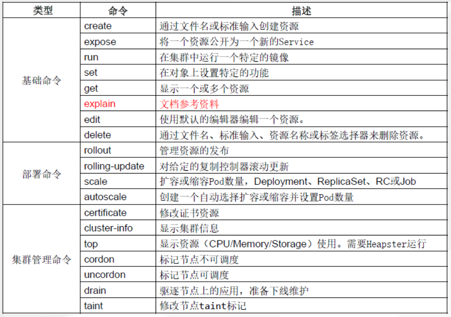

# kubernetes集群命令语法

## kubernetes集群客户端命令 kubectl

## 一、kubectl命令帮助

集群中的管理操作几乎都可以使用`kubectl`命令完成

```powershell
[root@k8s-master1 ~]## kubectl -h
```


## 二、kubectl命令说明




## 三、kubectl命令补全


~~~powershell
yum install -y bash-completion
source /usr/share/bash-completion/bash_completion
source <(kubectl completion bash)
kubectl completion bash > ~/.kube/completion.bash.inc
source '/root/.kube/completion.bash.inc'  
source $HOME/.bash_profile
~~~

## Kubernetes集群Node管理

## 一、查看集群信息

~~~powershell
[root@k8s-master1 ~]## kubectl cluster-info
Kubernetes control plane is running at https://192.168.10.100:6443
CoreDNS is running at https://192.168.10.100:6443/api/v1/namespaces/kube-system/services/kube-dns:dns/proxy

To further debug and diagnose cluster problems, use 'kubectl cluster-info dump'.
~~~

## 二、查看节点信息

### 2.1 查看集群节点信息

~~~powershell
[root@k8s-master1 ~]## kubectl get nodes
NAME          STATUS   ROLES    AGE     VERSION
k8s-master1   Ready    <none>   2d20h   v1.21.10
k8s-master2   Ready    <none>   2d20h   v1.21.10
k8s-master3   Ready    <none>   2d20h   v1.21.10
k8s-worker1   Ready    <none>   2d20h   v1.21.10
~~~


### 2.2 查看集群节点详细信息

~~~powershell
[root@k8s-master1 ~]## kubectl get nodes -o wide
NAME          STATUS   ROLES    AGE     VERSION    INTERNAL-IP     EXTERNAL-IP   OS-IMAGE                KERNEL-VERSION               CONTAINER-RUNTIME
k8s-master1   Ready    <none>   2d20h   v1.21.10   192.168.10.12   <none>        CentOS Linux 7 (Core)   5.17.0-1.el7.elrepo.x86_64   containerd://1.6.1
k8s-master2   Ready    <none>   2d20h   v1.21.10   192.168.10.13   <none>        CentOS Linux 7 (Core)   5.17.0-1.el7.elrepo.x86_64   containerd://1.6.1
k8s-master3   Ready    <none>   2d20h   v1.21.10   192.168.10.14   <none>        CentOS Linux 7 (Core)   5.17.0-1.el7.elrepo.x86_64   containerd://1.6.1
k8s-worker1   Ready    <none>   2d20h   v1.21.10   192.168.10.15   <none>        CentOS Linux 7 (Core)   5.17.0-1.el7.elrepo.x86_64   containerd://1.6.1
~~~


### 2.3 查看节点描述详细信息

~~~powershell
[root@k8s-master1 ~]## kubectl describe node k8s-master1
Name:               k8s-master1
Roles:              <none>
Labels:             beta.kubernetes.io/arch=amd64
                    beta.kubernetes.io/os=linux
                    kubernetes.io/arch=amd64
                    kubernetes.io/hostname=k8s-master1
                    kubernetes.io/os=linux
Annotations:        node.alpha.kubernetes.io/ttl: 0
                    projectcalico.org/IPv4Address: 192.168.10.12/24
                    projectcalico.org/IPv4IPIPTunnelAddr: 10.244.159.128
                    volumes.kubernetes.io/controller-managed-attach-detach: true
CreationTimestamp:  Tue, 22 Mar 2022 23:47:53 +0800
Taints:             <none>
Unschedulable:      false
Lease:
  HolderIdentity:  k8s-master1
  AcquireTime:     <unset>
  RenewTime:       Fri, 25 Mar 2022 20:38:38 +0800
Conditions:
  Type                 Status  LastHeartbeatTime                 LastTransitionTime                Reason                       Message
  ----                 ------  -----------------                 ------------------                ------                       -------
  NetworkUnavailable   False   Wed, 23 Mar 2022 00:14:05 +0800   Wed, 23 Mar 2022 00:14:05 +0800   CalicoIsUp                   Calico is running on this node
  MemoryPressure       False   Fri, 25 Mar 2022 20:36:09 +0800   Tue, 22 Mar 2022 23:47:53 +0800   KubeletHasSufficientMemory   kubelet has sufficient memory available
  DiskPressure         False   Fri, 25 Mar 2022 20:36:09 +0800   Tue, 22 Mar 2022 23:47:53 +0800   KubeletHasNoDiskPressure     kubelet has no disk pressure
  PIDPressure          False   Fri, 25 Mar 2022 20:36:09 +0800   Tue, 22 Mar 2022 23:47:53 +0800   KubeletHasSufficientPID      kubelet has sufficient PID available
  Ready                True    Fri, 25 Mar 2022 20:36:09 +0800   Fri, 25 Mar 2022 00:30:10 +0800   KubeletReady                 kubelet is posting ready status
Addresses:
  InternalIP:  192.168.10.12
  Hostname:    k8s-master1
Capacity:
  cpu:                2
  ephemeral-storage:  51175Mi
  hugepages-1Gi:      0
  hugepages-2Mi:      0
  memory:             3994696Ki
  pods:               110
Allocatable:
  cpu:                2
  ephemeral-storage:  48294789041
  hugepages-1Gi:      0
  hugepages-2Mi:      0
  memory:             3892296Ki
  pods:               110
System Info:
  Machine ID:                 a2c5254d78184027930ef5ba59f52d61
  System UUID:                e9dc4d56-4819-1544-2b93-21af423126d2
  Boot ID:                    e45fcd72-4fc2-45b5-be15-7d944a6b8bcd
  Kernel Version:             5.17.0-1.el7.elrepo.x86_64
  OS Image:                   CentOS Linux 7 (Core)
  Operating System:           linux
  Architecture:               amd64
  Container Runtime Version:  containerd://1.6.1
  Kubelet Version:            v1.21.10
  Kube-Proxy Version:         v1.21.10
PodCIDR:                      10.244.2.0/24
PodCIDRs:                     10.244.2.0/24
Non-terminated Pods:          (3 in total)
  Namespace                   Name                              CPU Requests  CPU Limits  Memory Requests  Memory Limits  Age
  ---------                   ----                              ------------  ----------  ---------------  -------------  ---
  default                     nginx-web-bbh48                   0 (0%)        0 (0%)      0 (0%)           0 (0%)         2d20h
  kube-system                 calico-node-nkxrs                 250m (12%)    0 (0%)      0 (0%)           0 (0%)         2d20h
  kube-system                 metrics-server-8bb87844c-ptkxm    100m (5%)     0 (0%)      200Mi (5%)       0 (0%)         11h
Allocated resources:
  (Total limits may be over 100 percent, i.e., overcommitted.)
  Resource           Requests    Limits
  --------           --------    ------
  cpu                350m (17%)  0 (0%)
  memory             200Mi (5%)  0 (0%)
  ephemeral-storage  0 (0%)      0 (0%)
  hugepages-1Gi      0 (0%)      0 (0%)
  hugepages-2Mi      0 (0%)      0 (0%)
Events:              <none>

~~~


## 三、worker node节点管理集群

* **如果是kubeasz安装，所有节点(包括master与node)都已经可以对集群进行管理**


* 如果是kubeadm安装，在node节点上管理时会报如下错误

~~~powershell
[root@k8s-worker1 ~]## kubectl get nodes
The connection to the server localhost:8080 was refused - did you specify the right host or port?
~~~

 只要把master上的管理文件`/etc/kubernetes/admin.conf`拷贝到node节点的`$HOME/.kube/config`就可以让node节点也可以实现kubectl命令管理

1, 在node节点的用户家目录创建`.kube`目录

~~~powershell
[root@k8s-worker1 ~]## mkdir /root/.kube
~~~

2, 在master节点做如下操作

~~~powershell
[root@k8s-worker1 ~]## scp /etc/kubernetes/admin.conf node1:/root/.kube/config
~~~

3, 在worker node节点验证

~~~powershell
[root@k8s-worker1 ~]## kubectl get nodes
NAME          STATUS   ROLES    AGE     VERSION
k8s-master1   Ready    <none>   2d20h   v1.21.10
k8s-master2   Ready    <none>   2d20h   v1.21.10
k8s-master3   Ready    <none>   2d20h   v1.21.10
k8s-worker1   Ready    <none>   2d20h   v1.21.10
~~~


## 四、节点标签(label)

* k8s集群如果由大量节点组成，可将节点打上对应的标签，然后通过标签进行筛选及查看,更好的进行资源对象的相关选择与匹配

### 4.1 查看节点标签信息

~~~powershell
[root@k8s-master1 ~]## kubectl get node --show-labels
NAME          STATUS   ROLES    AGE     VERSION    LABELS
k8s-master1   Ready    <none>   2d20h   v1.21.10   beta.kubernetes.io/arch=amd64,beta.kubernetes.io/os=linux,kubernetes.io/arch=amd64,kubernetes.io/hostname=k8s-master1,kubernetes.io/os=linux
k8s-master2   Ready    <none>   2d20h   v1.21.10   beta.kubernetes.io/arch=amd64,beta.kubernetes.io/os=linux,kubernetes.io/arch=amd64,kubernetes.io/hostname=k8s-master2,kubernetes.io/os=linux
k8s-master3   Ready    <none>   2d20h   v1.21.10   beta.kubernetes.io/arch=amd64,beta.kubernetes.io/os=linux,kubernetes.io/arch=amd64,kubernetes.io/hostname=k8s-master3,kubernetes.io/os=linux
k8s-worker1   Ready    <none>   2d20h   v1.21.10   beta.kubernetes.io/arch=amd64,beta.kubernetes.io/os=linux,kubernetes.io/arch=amd64,kubernetes.io/hostname=k8s-worker1,kubernetes.io/os=linux
~~~


### 4.2 设置节点标签信息

#### 4.2.1 设置节点标签

为节点`k8s-worker1`打一个`region=huanai` 的标签

~~~powershell
[root@k8s-master1 ~]## kubectl label node k8s-worker1 region=huanai
node/k8s-worker1 labeled
~~~


#### 4.2.2 查看所有节点标签

~~~powershell
[root@k8s-master1 ~]## kubectl get node --show-labels
NAME          STATUS   ROLES    AGE     VERSION    LABELS
k8s-master1   Ready    <none>   2d21h   v1.21.10   beta.kubernetes.io/arch=amd64,beta.kubernetes.io/os=linux,kubernetes.io/arch=amd64,kubernetes.io/hostname=k8s-master1,kubernetes.io/os=linux
k8s-master2   Ready    <none>   2d21h   v1.21.10   beta.kubernetes.io/arch=amd64,beta.kubernetes.io/os=linux,kubernetes.io/arch=amd64,kubernetes.io/hostname=k8s-master2,kubernetes.io/os=linux
k8s-master3   Ready    <none>   2d21h   v1.21.10   beta.kubernetes.io/arch=amd64,beta.kubernetes.io/os=linux,kubernetes.io/arch=amd64,kubernetes.io/hostname=k8s-master3,kubernetes.io/os=linux
k8s-worker1   Ready    <none>   2d21h   v1.21.10   beta.kubernetes.io/arch=amd64,beta.kubernetes.io/os=linux,kubernetes.io/arch=amd64,kubernetes.io/hostname=k8s-worker1,kubernetes.io/os=linux,region=huanai
~~~


#### 4.2.3 查看所有节点带region的标签

~~~powershell
[root@k8s-master1 ~]## kubectl get nodes -L region
NAME          STATUS   ROLES    AGE     VERSION    REGION
k8s-master1   Ready    <none>   2d21h   v1.21.10
k8s-master2   Ready    <none>   2d21h   v1.21.10
k8s-master3   Ready    <none>   2d21h   v1.21.10
k8s-worker1   Ready    <none>   2d21h   v1.21.10   huanai
~~~


### 4.3 多维度标签

#### 4.3.1 设置多维度标签

也可以加其它的多维度标签,用于不同的需要区分的场景

如把`k8s-master3`标签为华南区,A机房,测试环境,游戏业务

~~~powershell
[root@k8s-master1 ~]## kubectl label node k8s-master3 zone=A env=test bussiness=game
node/k8s-master3 labeled
~~~

~~~powershell
[root@k8s-master1 ~]## kubectl get nodes k8s-master3 --show-labels
NAME          STATUS   ROLES    AGE     VERSION    LABELS
k8s-master3   Ready    <none>   2d21h   v1.21.10   beta.kubernetes.io/arch=amd64,beta.kubernetes.io/os=linux,bussiness=game,env=test,kubernetes.io/arch=amd64,kubernetes.io/hostname=k8s-master3,kubernetes.io/os=linux,zone=A
~~~

#### 4.3.2 显示节点的相应标签

~~~powershell
[root@k8s-master1 ~]## kubectl get nodes -L region,zone
NAME          STATUS   ROLES    AGE     VERSION    REGION   ZONE
k8s-master1   Ready    <none>   2d21h   v1.21.10
k8s-master2   Ready    <none>   2d21h   v1.21.10
k8s-master3   Ready    <none>   2d21h   v1.21.10            A
k8s-worker1   Ready    <none>   2d21h   v1.21.10   huanai
~~~

#### 4.3.3 查找`region=huanai`的节点

~~~powershell
[root@k8s-master1 ~]## kubectl get nodes -l region=huanai
NAME          STATUS   ROLES    AGE     VERSION
k8s-worker1   Ready    <none>   2d21h   v1.21.10
~~~


#### 4.3.4 标签的修改

~~~powershell
[root@k8s-master1 ~]## kubectl label node k8s-master3 bussiness=ad --overwrite=true
node/k8s-master3 labeled
加上--overwrite=true覆盖原标签的value进行修改操作
~~~

~~~powershell
[root@k8s-master1 ~]## kubectl get nodes -L bussiness
NAME          STATUS   ROLES    AGE     VERSION    BUSSINESS
k8s-master1   Ready    <none>   2d21h   v1.21.10
k8s-master2   Ready    <none>   2d21h   v1.21.10
k8s-master3   Ready    <none>   2d21h   v1.21.10   ad
k8s-worker1   Ready    <none>   2d21h   v1.21.10
~~~


#### 4.3.5  标签的删除

使用key加一个减号的写法来取消标签

~~~powershell
[root@k8s-master1 ~]## kubectl label node k8s-worker1 region-
node/k8s-worker1 labeled
~~~


#### 4.3.6  标签选择器

标签选择器主要有2类:

* 等值关系: =, !=
* 集合关系: KEY in {VALUE1, VALUE2......}

~~~powershell
[root@k8s-master1 ~]## kubectl label node k8s-master2 env=test1
node/k8s-master2 labeled
[root@k8s-master1 ~]## kubectl label node k8s-master3 env=test2
node/k8s-master3 labeled
~~~

~~~powershell
[root@k8s-master1 ~]## kubectl get node -l "env in(test1,test2)"
NAME          STATUS   ROLES    AGE     VERSION
k8s-master2   Ready    <none>   2d21h   v1.21.10
k8s-master3   Ready    <none>   2d21h   v1.21.10
~~~


## Kubernetes集群声明式文件YAML

## 一、YAML介绍

  YAML 的意思是：仍是一种标记语言，但为了强调这种语言以数据做为中心，而不是以标记语言为重点。是一个可读性高，用来表达数据序列的格式。

## 二、基本语法

```powershell
1.低版本缩进时不允许使用Tab键，只允许使用空格
2.缩进的空格数目不重要，只要相同层级的元素左侧对齐即可
3.## 标识注释，从这个字符一直到行尾，都会被解释器忽略
```


## 三、YAML  支持的数据结构

- 对象：键值对的集合，又称为映射（mapping）/ 哈希（hashes） / 字典（dictionary）
- 数组：一组按次序排列的值，又称为序列（sequence） / 列表 （list）
- 纯量（scalars）：单个的、不可再分的值  

####### 对象类型：对象的一组键值对，使用冒号结构表示

```powershell
name: Steve
age: 18
```

Yaml 也允许另一种写法，将所有键值对写成一个行内对象

```powershell
hash: { name: Steve, age: 18 }
```

####### 数组类型：一组连词线开头的行，构成一个数组

```powershell
animal
- Cat
- Dog

```

数组也可以采用行内表示法  

```powershell
animal: [Cat, Dog]
```

####### 复合结构：对象和数组可以结合使用，形成复合结构

```powershell
1 languages:
2 - Ruby 
3 - Perl 
4 - Python
5 websites:
6 YAML: yaml.org 
7 Ruby: ruby-lang.org 
8 Python: python.org 
9 Perl: use.perl.org  

```

####### **纯量：纯量是最基本的、不可再分的值。以下数据类型都属于纯量**

```powershell
1 字符串  布尔值  整数 浮点数 Null 
2 时间  日期

数值直接以字面量的形式表示
number: 12.30

布尔值用true和false表示
isSet: true

null用 ~ 表示
parent: ~

时间采用 ISO8601 格式
iso8601: 2001-12-14t21:59:43.10-05:00

日期采用复合 iso8601 格式的年、月、日表示
date: 1976-07-31

YAML 允许使用两个感叹号，强制转换数据类型
e: !!str 123
f: !!str true
```

####### 字符串

字符串默认不使用引号表示

```powershell
str: 这是一行字符串
```

如果字符串之中包含空格或特殊字符，需要放在引号之中

```power
str: '内容：  字符串'
```

单引号和双引号都可以使用，双引号不会对特殊字符转义

```powershell
s1: '内容\n字符串'
s2: "内容\n字符串"
```

单引号之中如果还有单引号，必须连续使用两个单引号转义

```powershell
str: 'labor''s day'
```

字符串可以写成多行，从第二行开始，必须有一个单空格缩进。换行符会被转为 空格

```powershell
str: 这是一段
  多行
  字符串
```

多行字符串可以使用|保留换行符，也可以使用>折叠换行

```powershell
this: |
Foo
Bar
that
Foo
Bar
```


## 四、Kubernetes集群中资源对象描述方法

在kubernetes中，一般使用ymal格式的文件来创建符合我们预期期望的pod,这样的yaml文件称为资源清单文件。

### 4.1 常用字段

| 参数名                                      | 字段类型 | 说明                                                         |
| ------------------------------------------- | -------- | ------------------------------------------------------------ |
| version                                     | String   | 这里是指的是K8S API的版本，目前基本上是v1，可以用 kubectl api-versions命令查询 |
| kind                                        | String   | 这里指的是yam文件定义的资源类型和角色，比如:Pod              |
| metadata                                    | Object   | 元数据对象，固定值就写 metadata                              |
| metadata.name                               | String   | 元数据对象的名字，这里由我们编写，比如命名Pod的名字          |
| metadata.namespace                          | String   | 元数据对象的命名空间，由我们自身定义                         |
| Spec                                        | Object   | 详细定义对象，固定值就写Spec                                 |
| spec. containers[]                          | list     | 这里是Spec对象的容器列表定义，是个列表                       |
| spec containers [].name                     | String   | 这里定义容器的名字                                           |
| spec.containers [].image                    | String   | 这里定义要用到的镜像名称                                     |
| spec.containers [].imagePullPolicy          | String   | 定义镜像拉取策路，有 Always、 Never、Ifnotpresent三个值可选：(1) Always:意思是每次都尝试重新拉取镜像；(2) Never:表示仅使用本地镜像；(3) IfNotPresent:如果本地有镜像就使用本地镜像，没有就拉取在线镜像。上面三个值都没设置的话，默认是 Always。 |
| spec containers [].command[]                | List     | 指定容器启动命令，因为是数组可以指定多个。不指定则使用镜像打包时使用的启动命令。 |
| spec.containers [].args                     | List     | 指定容器启动命令参数，因为是数组可以指定多个.                |
| spec.containers [].workDir                  | String   | 指定容器的工作目录                                           |
| spec.containers[]. volumeMounts[]           | List     | 指定容器内部的存储卷配置                                     |
| spec.containers[]. volumeMounts[].name      | String   | 指定可以被容器挂载的存储卷的名称                             |
| spec.containers[]. volumeMounts[].mountPath | String   | 指定可以被容器挂载的存储卷的路径                             |
| spec.containers[]. volumeMounts[].readOnly  | String   | 设置存储卷路径的读写模式，ture或者 false，默认为读写模式     |
| spec.containers [].ports[]                  | String   | 指容器需要用到的端口列表                                     |
| spec.containers [].ports[].name             | String   | 指定端口名称                                                 |
| spec.containers [].ports[].containerPort    | String   | 指定容器需要监听的端口号                                     |
| spec.containers [].ports[].hostPort         | String   | 指定容器所在主机需要监听的端口号，默认跟上面 containerPort相同，注意设置了 hostPort同一台主机无法启动该容器的相同副本(因为主机的端口号不能相同，这样会冲突) |
| spec.containers [].ports[].protocol         | String   | 指定端口协议，支持TCP和UDP，默认值为TCP                      |
| spec.containers [].env[]                    | List     | 指定容器运行前需设的环境变量列表                             |
| spec.containers [].env[].name               | String   | 指定环境变量名称                                             |
| spec.containers [].env[].value              | String   | 指定环境变量值                                               |
| spec.containers[].resources                 | Object   | 指定资源 限制和资源请求的值（这里开始就是设置容器的资源上限） |
| spec.containers[].resources.limits          | Object   | 指定设置容器运行时资源的运行上限                             |
| spec.containers[].resources.limits.cpu      | String   | 指定CPU限制，单位为core数，将用于docker run -- cpu-shares参数 |
| spec.containers[].resources.limits.memory   | String   | 指定MEM内存的限制，单位为MiB、GiB                            |
| spec.containers[].resources.requests        | Object   | 指定容器启动和调度时的限制设置                               |
| spec.containers[].resources.requests.cpu    | String   | CPU请求，单位为core数，容器启动时初始化可用数量              |
| spec.containers[].resources.requests.memory | String   | 内存请求，单位为MiB、GiB，容器启动时初始化可用数量           |
| sepc.restartPolicy                          | String   | 定义Pod的重启策略，可选值为Always、OnFailure,默认值为Always。1.Always:Pod一旦终止运行，则无论容器时如何终止的，kubelet服务都将重启它。2.OnFailure:只有Pod以非零退出码终止时，kubelet才会重启该容器。如果容器正常结束（退出码为0），则kubelet将不会重启它。3.Never:Pod终止后，kubelet将退出码报告给Master,不会重启该Pod。 |
| spec.nodeSelector                           | Object   | 定义Node的Label过滤标签，以key:value格式指定。               |
| spec.imagePullSecrets                       | Object   | 定义pull镜像时使用secret名称，以name:secretkey格式指定。     |
| spec.hostNetwork                            | Boolean  | 定义是否使用主机网络模式，默认值为false。设置true表示使用宿主机网络，不使用docker网桥，同时设置了true将无法在同一台宿主机上启动第二个副本。 |


### 4.2 举例说明

#### 4.2.1 使用声明式文件YAML创建namespace

~~~powershell
apiVersion: v1
kind: Namespace
metadata:
  name: test
~~~


#### 4.2.2 使用声明式文件YAML创建pod

~~~powershell
apiVersion: v1
kind: Pod
metadata:
  name: pod1
spec:
  containers:
  - name: k8sonline1
    image: nginx:latest
    imagePullPolicy: IfNotPresent
~~~

## Kubernetes集群命名空间（Namespace）

## 一、命名空间(namespace)作用

* Namespace是对一组资源和对象的抽象集合.
* 常见的 pod, service, deployment 等都是属于某一个namespace的（默认是 default）
* 不是所有资源都属于namespace，如nodes, persistent volume，namespace 等资源则不属于任何 namespace


## 二、查看namespace

~~~powershell
[root@k8s-master1 ~]## kubectl get namespaces       ## namespaces可以简写为namespace或ns
NAME              STATUS   AGE
default           Active   130m			## 所有未指定Namespace的对象都会被默认分配在default命名空间
kube-node-lease   Active   130m			
kube-public       Active   130m			## 此命名空间下的资源可以被所有人访问
kube-system       Active   130m			## 所有由Kubernetes系统创建的资源都处于这个命名空间
~~~

## 三、查看namespace里的资源

**使用`kubectl get all --namespace=命名空间名称`可以查看此命名空间下的所有资源**

~~~powershell
[root@k8s-master1 ~]## kubectl get all --namespace=kube-system
NAME                                             READY   STATUS    RESTARTS   AGE
pod/calico-kube-controllers-7fdc86d8ff-cskfq     1/1     Running   3          5d1h
pod/calico-node-9dpc9                            1/1     Running   2          5d1h
pod/calico-node-jdmxw                            1/1     Running   3          5d1h
pod/calico-node-krwps                            1/1     Running   2          5d1h
pod/calico-node-tttlr                            1/1     Running   2          5d1h
pod/coredns-65dbdb44db-mm7cr                     1/1     Running   2          5d1h
pod/dashboard-metrics-scraper-545bbb8767-q66bc   1/1     Running   2          5d1h
pod/kubernetes-dashboard-65665f84db-nll6k        1/1     Running   4          5d1h
pod/metrics-server-869ffc99cd-8f4jd              1/1     Running   3          5d1h

NAME                                TYPE        CLUSTER-IP     EXTERNAL-IP   PORT(S)                  AGE
service/dashboard-metrics-scraper   ClusterIP   10.2.246.128   <none>        8000/TCP                 5d1h
service/kube-dns                    ClusterIP   10.2.0.2       <none>        53/UDP,53/TCP,9153/TCP   5d1h
service/kubernetes-dashboard        NodePort    10.2.213.30    <none>        443:21351/TCP            5d1h
service/metrics-server              ClusterIP   10.2.232.121   <none>        443/TCP                  5d1h

NAME                         DESIRED   CURRENT   READY   UP-TO-DATE   AVAILABLE   NODE SELECTOR                 AGE
daemonset.apps/calico-node   4         4         4       4            4           beta.kubernetes.io/os=linux   5d1h

NAME                                        READY   UP-TO-DATE   AVAILABLE   AGE
deployment.apps/calico-kube-controllers     1/1     1            1           5d1h
deployment.apps/coredns                     1/1     1            1           5d1h
deployment.apps/dashboard-metrics-scraper   1/1     1            1           5d1h
deployment.apps/kubernetes-dashboard        1/1     1            1           5d1h
deployment.apps/metrics-server              1/1     1            1           5d1h

NAME                                                   DESIRED   CURRENT   READY   AGE
replicaset.apps/calico-kube-controllers-7fdc86d8ff     1         1         1       5d1h
replicaset.apps/coredns-65dbdb44db                     1         1         1       5d1h
replicaset.apps/dashboard-metrics-scraper-545bbb8767   1         1         1       5d1h
replicaset.apps/kubernetes-dashboard-65665f84db        1         1         1       5d1h
replicaset.apps/metrics-server-869ffc99cd              1         1         1       5d1h

~~~

**使用`kubectl get 资源类型 --namespace=命名空间名称`可以查看此命名空间下的对应的资源**

~~~powershell
[root@k8s-master1 ~]## kubectl get pod --namespace=kube-system
NAME                                         READY   STATUS    RESTARTS   AGE
calico-kube-controllers-7fdc86d8ff-cskfq     1/1     Running   3          5d1h
calico-node-9dpc9                            1/1     Running   2          5d1h
calico-node-jdmxw                            1/1     Running   3          5d1h
calico-node-krwps                            1/1     Running   2          5d1h
calico-node-tttlr                            1/1     Running   2          5d1h
coredns-65dbdb44db-mm7cr                     1/1     Running   2          5d1h
dashboard-metrics-scraper-545bbb8767-q66bc   1/1     Running   2          5d1h
kubernetes-dashboard-65665f84db-nll6k        1/1     Running   4          5d1h
metrics-server-869ffc99cd-8f4jd              1/1     Running   3          5d1h
~~~


## 四、创建namespace 

### 4.1 命令创建

~~~powershell
[root@k8s-master1 ~]## kubectl create namespace ns1
namespace/ns1 created

[root@k8s-master1 ~]## kubectl get ns
NAME              STATUS   AGE
default           Active   5d1h
kube-node-lease   Active   5d1h
kube-public       Active   5d1h
kube-system       Active   5d1h
ns1               Active   10s
~~~


### 4.2 YAML文件创建

* k8s中几乎所有的资源都可以通这YAML编排来创建
* 可以使用`kubectl edit 资源类型 资源名`编辑资源的YAML语法

~~~powershell
[root@k8s-master1 ~]## kubectl edit namespace ns1
......
~~~

* 也可使用`kubectl get 资源类型 资源名 -o yaml`来查看

~~~powershell
[root@k8s-master1 ~]## kubectl get ns ns1 -o yaml
......
~~~

* ==**还可通过`kubectl explain 资源类型`来查看语法文档**== 

~~~powershell
[root@k8s-master1 ~]## kubectl explain namespace				   ## 查看namespace相关语法参数
~~~

~~~powershell
[root@k8s-master1 ~]## kubectl explain namespace.metadata	   ## 查看namespace下级metadata的相关语法参数
~~~

~~~powershell
[root@k8s-master1 ~]## kubectl explain namespace.metadata.name  ## 查看namespace下级metadata再下级name的相关语法参数
~~~


编写创建namespace的YAML文件

~~~powershell
[root@k8s-master1 ~]## vim create_ns2.yml
apiVersion: v1							## api版本号
kind: Namespace							## 类型为namespace
metadata:								## 定义namespace的元数据属性
  name: ns2					    		## 定义name属性为ns2
~~~

使用`kubctl apply -f`应用YAML文件

~~~powershell
[root@k8s-master1 ~]## kubectl apply -f create_ns2.yml
namespace/ns2 created
~~~

~~~powershell
[root@k8s-master1 ~]## kubectl get ns
NAME              STATUS   AGE
default           Active   5d2h
kube-node-lease   Active   5d2h
kube-public       Active   5d2h
kube-system       Active   5d2h
ns1               Active   10m
ns2               Active   46s
~~~


## 五、删除namespace

**注意:** 

* 删除一个namespace会自动删除所有属于该namespace的资源(类似mysql中drop库会删除库里的所有表一样，请慎重操作)
* default,kube-system,kube-public命名空间不可删除

### 5.1 命令删除

~~~powershell
[root@k8s-master1 ~]## kubectl delete namespace ns1
namespace "ns1" deleted
~~~


### 5.2 YAML文件删除

~~~powershell
[root@k8s-master1 ~]## kubectl delete -f create_ns2.yml
namespace "ns2" deleted
~~~

~~~powershell
[root@k8s-master1 ~]## kubectl get ns
NAME              STATUS   AGE
default           Active   5d2h
kube-node-lease   Active   5d2h
kube-public       Active   5d2h
kube-system       Active   5d2h
~~~

