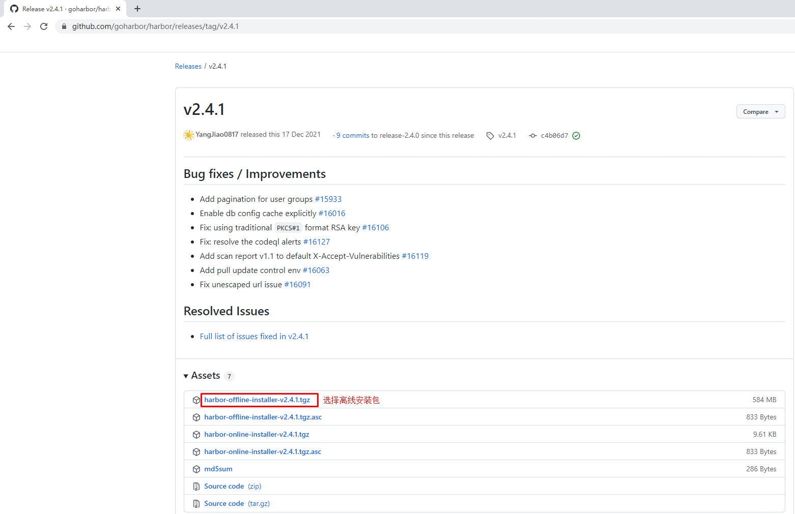

# Kubernetes集群公共服务

# 一、Kubernetes集群核心服务

# 二、Kubernetes公共服务

# 三、Kubernetes集群公共服务 域名解析 DNS

## 3.1 主机IP地址及域名规划

| 序号 | 提供服务 | IP地址         | 域名               | 备注            |
| ---- | -------- | -------------- | ------------------ | --------------- |
| 1    | DNS      | 192.168.10.211 |                    |                 |
| 2    | Nginx    | 192.168.10.212 | yaml.kubemsb.com   |                 |
| 3    | Harbor   | 192.168.10.213 | harbor.kubemsb.com | www.kubemsb.com |
| 4    | NFS      | 192.168.10.214 | nfs.kubemsb.com    |                 |

## 3.2 域名解析 DNS配置

- bind9

~~~powershell
[root@localhost ~]# hostnamectl set-hostname dns
~~~

~~~powershell
[root@dns ~]# cat /etc/sysconfig/network-scripts/ifcfg-ens33
TYPE="Ethernet"
PROXY_METHOD="none"
BROWSER_ONLY="no"
BOOTPROTO="static"
DEFROUTE="yes"
IPV4_FAILURE_FATAL="no"
IPV6INIT="yes"
IPV6_AUTOCONF="yes"
IPV6_DEFROUTE="yes"
IPV6_FAILURE_FATAL="no"
IPV6_ADDR_GEN_MODE="stable-privacy"
NAME="eth0"
DEVICE="eth0"
ONBOOT="yes"
IPADDR="192.168.10.211"
PREFIX="24"
GATEWAY="192.168.10.2"
DNS1="192.168.10.211"
DNS2="119.29.29.29"
~~~

~~~powershell
[root@dns ~]# firewall-cmd --state
not running
[root@dns ~]# echo $?
252
[root@dns ~]# sestatus
SELinux status:                 disabled
[root@dns ~]# echo $?
0

或关闭
[root@dns ~]# systemctl disable firewalld;systemctl stop firewalld

[root@dns ~]# sed -ri.bak 's/SELINUX=enforcing/SELINUX=disabled/' /etc/selinux/config
~~~

~~~powershell
[root@dns ~]# yum -y install bind
~~~

~~~powershell
[root@dns ~]# cat -n /etc/named.conf
     1  //
     2  // named.conf
     3  //
     4  // Provided by Red Hat bind package to configure the ISC BIND named(8) DNS
     5  // server as a caching only nameserver (as a localhost DNS resolver only).
     6  //
     7  // See /usr/share/doc/bind*/sample/ for example named configuration files.
     8  //
     9  // See the BIND Administrator's Reference Manual (ARM) for details about the
    10  // configuration located in /usr/share/doc/bind-{version}/Bv9ARM.html
    11
    12  options {
    13          listen-on port 53 { 127.0.0.1;any; };
    14          listen-on-v6 port 53 { ::1; };
    15          directory       "/var/named";
    16          dump-file       "/var/named/data/cache_dump.db";
    17          statistics-file "/var/named/data/named_stats.txt";
    18          memstatistics-file "/var/named/data/named_mem_stats.txt";
    19          recursing-file  "/var/named/data/named.recursing";
    20          secroots-file   "/var/named/data/named.secroots";
    21          allow-query     { localhost;any; };
    22
    23          /*
    24           - If you are building an AUTHORITATIVE DNS server, do NOT enable recursion.
    25           - If you are building a RECURSIVE (caching) DNS server, you need to enable
    26             recursion.
    27           - If your recursive DNS server has a public IP address, you MUST enable access
    28             control to limit queries to your legitimate users. Failing to do so will
    29             cause your server to become part of large scale DNS amplification
    30             attacks. Implementing BCP38 within your network would greatly
    31             reduce such attack surface
    32          */
    33          recursion yes;
    34
    35          dnssec-enable yes;
    36          dnssec-validation yes;
    37
    38          /* Path to ISC DLV key */
    39          bindkeys-file "/etc/named.root.key";
    40
    41          managed-keys-directory "/var/named/dynamic";
    42
    43          pid-file "/run/named/named.pid";
    44          session-keyfile "/run/named/session.key";
    45  };
    46
    47  logging {
    48          channel default_debug {
    49                  file "data/named.run";
    50                  severity dynamic;
    51          };
    52  };
    53
    54  zone "." IN {
    55          type hint;
    56          file "named.ca";
    57  };
    58
    59  include "/etc/named.rfc1912.zones";
    60  include "/etc/named.root.key";
~~~

~~~powershell
[root@dns ~]# tail -6 /etc/named.rfc1912.zones

zone "kubemsb.com" IN {
        type master;
        file "kubemsb.com.zone";
        allow-update { none; };
};
~~~

~~~powershell
[root@dns ~]# cd /var/named/
[root@dns named]# ls
data  dynamic  named.ca  named.empty  named.localhost  named.loopback  slaves
[root@dns named]# cp -p named.localhost kubemsb.com.zone
[root@dns named]# ll
总用量 20
drwxrwx--- 2 named named    6 4月   7 22:41 data
drwxrwx--- 2 named named    6 4月   7 22:41 dynamic
-rw-r----- 1 root  named 2253 4月   5 2018 named.ca
-rw-r----- 1 root  named  152 12月 15 2009 named.empty
-rw-r----- 1 root  named  152 6月  21 2007 named.localhost
-rw-r----- 1 root  named  168 12月 15 2009 named.loopback
drwxrwx--- 2 named named    6 4月   7 22:41 slaves
-rw-r----- 1 root  named  152 6月  21 2007 kubemsb.com.zone
~~~

~~~powershell
[root@dns named]# cat kubemsb.com.zone
$TTL 1D
@       IN SOA  kubemsb.com admin.kubemsb.com. (
                                        0       ; serial
                                        1D      ; refresh
                                        1H      ; retry
                                        1W      ; expire
                                        3H )    ; minimum
@       NS      ns.kubemsb.com.
ns      A       192.168.10.211
yaml    A       192.168.10.212
harbor  A       192.168.10.213
nfs	    A		192.168.10.214
~~~

~~~powershell
[root@dns named]# systemctl enable named
[root@dns named]# systemctl start named
~~~

## 3.3 域名解析 DNS解析验证

~~~powershell
[root@dns named]# yum -y  install bind-utils
~~~

~~~powershell
[root@dns named]# nslookup
> server
Default server: 192.168.10.211
Address: 192.168.10.211#53
Default server: 119.29.29.29
Address: 119.29.29.29#53
> ns.kubemsb.com
Server:         192.168.10.211
Address:        192.168.10.211#53

Name:   ns.kubemsb.com
Address: 192.168.10.211

> yaml.kubemsb.com
Server:         192.168.10.211
Address:        192.168.10.211#53

Name:   yaml.kubemsb.com
Address: 192.168.10.212
~~~

# 四、Kubernetes集群公共服务 YAML资源清单文件托管服务 Nginx

~~~powershell
[root@localhost ~]# hostnamectl set-hostname nginx
~~~

~~~powershell
[root@localhost ~]# cat /etc/sysconfig/network-scripts/ifcfg-ens33
TYPE="Ethernet"
PROXY_METHOD="none"
BROWSER_ONLY="no"
BOOTPROTO="static"
DEFROUTE="yes"
IPV4_FAILURE_FATAL="no"
IPV6INIT="yes"
IPV6_AUTOCONF="yes"
IPV6_DEFROUTE="yes"
IPV6_FAILURE_FATAL="no"
IPV6_ADDR_GEN_MODE="stable-privacy"
NAME="eth0"
DEVICE="eth0"
ONBOOT="yes"
IPADDR="192.168.10.212"
PREFIX="24"
GATEWAY="192.168.10.2"
DNS1="192.168.10.211"
DNS2="119.29.29.29"
~~~

~~~powershell
[root@nginx ~]# firewall-cmd --state
not running
[root@nginx ~]# sestatus
SELinux status:                 disabled
~~~

~~~powershell
[root@nginx ~]# wget http://nginx.org/download/nginx-1.18.0.tar.gz
~~~

~~~powershell
[root@nginx ~]# ls soft/
echo-nginx-module-0.61.tar.gz  nginx-1.18.0.tar.gz  ngx-fancyindex-0.4.3.tar.gz
~~~

~~~powershell
[root@nginx ~]# yum -y install gcc prce-devel zlib-devel openssl-devel
~~~

~~~powershell
[root@nginx ~]# cd soft/
[root@nginx soft]# ls
echo-nginx-module-0.61.tar.gz  nginx-1.18.0.tar.gz  ngx-fancyindex-0.4.3.tar.gz
[root@nginx soft]# tar xf ngx-fancyindex-0.4.3.tar.gz
[root@nginx soft]# tar xf nginx-1.18.0.tar.gz
[root@nginx soft]# tar xf echo-nginx-module-0.61.tar.gz
[root@nginx soft]# ls
echo-nginx-module-0.61         nginx-1.18.0         ngx-fancyindex-0.4.3
echo-nginx-module-0.61.tar.gz  nginx-1.18.0.tar.gz  ngx-fancyindex-0.4.3.tar.gz
~~~

~~~powershell
[root@nginx nginx-1.18.0]# ./configure --prefix=/usr/local/nginx  --with-http_ssl_module --with-http_stub_status_module --with-http_realip_module --add-module=/root/soft/ngx-fancyindex-0.4.3/ --add-module=/root/soft/echo-nginx-module-0.61
~~~

~~~powershell
[root@nginx nginx-1.18.0]# make && make install
~~~

~~~powershell
[root@nginx soft]# cat nginx_manager.sh
#!/usr/bin/bash
# nginx manager

# 定义变量
nginx_base="/usr/local/nginx"
nginxd="$nginx_base/sbin/nginx"
nginx_pid="$nginx_base/logs/nginx.pid"

# 调用系统函数，为输出文字添加颜色
if [ -f /etc/init.d/functions ];then
        source /etc/init.d/functions
fi

# 检测nginx进程是否存在及进程数量是否正常
if [ -f $nginx_pid ];then
        nginx_process_pid=`cat $nginx_pid`
        nginx_process_num=`ps aux | grep "$nginx_process_pid" | wc -l`
fi

# 封装功能

start () {
        if [ -f $nginx_pid ] && [ $nginx_process_num -ge 2 ];then
                echo "nginx already start"
        elif [ ! -f $nginx_pid ] || [ -z "$nginx_process_num" ];then
                action "nginx start" $nginxd
        fi
}

stop () {
        if [ -f $nginx_pid ] && [ $nginx_process_num -ge 2 ];then
                action "nginx stop" kill -s QUIT $nginx_process_pid
        else
                echo "nginx already stop"
        fi
}

status () {
        if [ -f $nginx_pid ] && [ $nginx_process_num -ge 2 ];then
                echo "nginx running"
        else
                echo "nginx stopped"
        fi
}

reload () {
        if [ -f $nginx_pid ] && [ $nginx_process_num -ge 2 ];then
                kill -s HUP $nginx_process_pid
        else
                echo "nginx stopped"
        fi

}

# 调用函数

case $1 in

        start)
                start
                ;;
        stop)
                stop
                ;;
        restart)
                stop
                sleep 1
                start
                ;;
        status)
                status
                ;;
        reload)
                reload
                ;;
        *)
                echo "命令用法: $0 start|stop|restart|status|reload"
esac
~~~

~~~powershell
[root@nginx ~]# cat /usr/local/nginx/conf/nginx.conf

#user  nobody;
worker_processes  1;

#error_log  logs/error.log;
#error_log  logs/error.log  notice;
#error_log  logs/error.log  info;

#pid        logs/nginx.pid;

events {
    worker_connections  1024;
}

http {
    include       mime.types;
    default_type  application/octet-stream;

    #log_format  main  '$remote_addr - $remote_user [$time_local] "$request" '
    #                  '$status $body_bytes_sent "$http_referer" '
    #                  '"$http_user_agent" "$http_x_forwarded_for"';

    #access_log  logs/access.log  main;

    sendfile        on;
    #tcp_nopush     on;

    #keepalive_timeout  0;
    keepalive_timeout  65;

    #gzip  on;

    server {
        listen       80;
        server_name  192.168.10.212;

        #charset koi8-r;

        #access_log  logs/host.access.log  main;
        root   html;

        location / {
            fancyindex on;
            fancyindex_exact_size off;
            index  index;
        }

        #error_page  404              /404.html;

        # redirect server error pages to the static page /50x.html
        #
        error_page   500 502 503 504  /50x.html;
        location = /50x.html {
            root   html;
        }

        # proxy the PHP scripts to Apache listening on 127.0.0.1:80
        #
        #location ~ \.php$ {
        #    proxy_pass   http://127.0.0.1;
        #}

        # pass the PHP scripts to FastCGI server listening on 127.0.0.1:9000
        #
        #location ~ \.php$ {
        #    root           html;
        #    fastcgi_pass   127.0.0.1:9000;
        #    fastcgi_index  index.php;
        #    fastcgi_param  SCRIPT_FILENAME  /scripts$fastcgi_script_name;
        #    include        fastcgi_params;
        #}

        # deny access to .htaccess files, if Apache's document root
        # concurs with nginx's one
        #
        #location ~ /\.ht {
        #    deny  all;
        #}
    }

    # another virtual host using mix of IP-, name-, and port-based configuration
    #
    #server {
    #    listen       8000;
    #    listen       somename:8080;
    #    server_name  somename  alias  another.alias;

    #    location / {
    #        root   html;
    #        index  index.html index.htm;
    #    }
    #}

    # HTTPS server
    #
    #server {
    #    listen       443 ssl;
    #    server_name  localhost;

    #    ssl_certificate      cert.pem;
    #    ssl_certificate_key  cert.key;

    #    ssl_session_cache    shared:SSL:1m;
    #    ssl_session_timeout  5m;

    #    ssl_ciphers  HIGH:!aNULL:!MD5;
    #    ssl_prefer_server_ciphers  on;

    #    location / {
    #        root   html;
    #        index  index.html index.htm;
    #    }
    #}

}
~~~

> 

~~~powershell
[root@nginx ~]# cat /etc/rc.d/rc.local
#!/bin/bash
# THIS FILE IS ADDED FOR COMPATIBILITY PURPOSES
#
# It is highly advisable to create own systemd services or udev rules
# to run scripts during boot instead of using this file.
#
# In contrast to previous versions due to parallel execution during boot
# this script will NOT be run after all other services.
#
# Please note that you must run 'chmod +x /etc/rc.d/rc.local' to ensure
# that this script will be executed during boot.

touch /var/lock/subsys/local
/root/soft/nginx_manager.sh start
~~~

~~~powershell
[root@nginx ~]# ll /etc/rc.d/rc.local
-rw-r--r-- 1 root root 507 5月  12 10:27 /etc/rc.d/rc.local
[root@nginx ~]# chmod 744 /etc/rc.d/rc.local
[root@nginx ~]# ll /etc/rc.d/rc.local
-rwxr--r-- 1 root root 507 5月  12 10:27 /etc/rc.d/rc.local
~~~

# 五、Kubernetes集群容器镜像仓库 Harbor

## 5.0 主机名及IP地址配置

~~~powershell
[root@localhost ~]# hostnamectl set-hostname harbor
~~~

~~~powershell
[root@localhost ~]# cat /etc/sysconfig/network-scripts/ifcfg-ens33
TYPE="Ethernet"
PROXY_METHOD="none"
BROWSER_ONLY="no"
BOOTPROTO="static"
DEFROUTE="yes"
IPV4_FAILURE_FATAL="no"
IPV6INIT="yes"
IPV6_AUTOCONF="yes"
IPV6_DEFROUTE="yes"
IPV6_FAILURE_FATAL="no"
IPV6_ADDR_GEN_MODE="stable-privacy"
NAME="eth0"
DEVICE="eth0"
ONBOOT="yes"
IPADDR="192.168.10.213"
PREFIX="24"
GATEWAY="192.168.10.2"
DNS1="192.168.10.211"
DNS2="119.29.29.29"
~~~

## 5.1  docker ce安装

### 5.1.1 Docker安装YUM源准备

>使用阿里云开源软件镜像站。

~~~powershell
# wget https://mirrors.aliyun.com/docker-ce/linux/centos/docker-ce.repo -O /etc/yum.repos.d/docker-ce.repo
~~~

### 5.1.2  Docker安装

~~~powershell
# yum -y install docker-ce
~~~

### 5.1.3 启动Docker服务

~~~powershell
# systemctl enable --now docker
~~~

## 5.2  获取 docker compose二进制文件

~~~powershell
下载docker-compose二进制文件
# wget https://github.com/docker/compose/releases/download/1.25.0/docker-compose-Linux-x86_64
~~~

~~~powershell
查看已下载二进制文件
# ls
docker-compose-Linux-x86_64
~~~

~~~powershell
移动二进制文件到/usr/bin目录，并更名为docker-compose
# mv docker-compose-Linux-x86_64 /usr/bin/docker-compose
~~~

~~~powershell
为二进制文件添加可执行权限
# chmod +x /usr/bin/docker-compose
~~~

~~~powershell
安装完成后，查看docker-compse版本
# docker-compose version
docker-compose version 1.25.0, build 0a186604
docker-py version: 4.1.0
CPython version: 3.7.4
OpenSSL version: OpenSSL 1.1.0l  10 Sep 2019
~~~

## 5.3 获取harbor安装文件

~~~powershell
下载harbor离线安装包
# wget https://github.com/goharbor/harbor/releases/download/v2.4.1/harbor-offline-installer-v2.4.1.tgz
~~~

~~~powershell
查看已下载的离线安装包
# ls
harbor-offline-installer-v2.4.1.tgz
~~~

## 5.4  获取TLS文件

~~~powershell
查看准备好的证书
# ls
kubemsb.com_nginx.zip
~~~

~~~powershell
解压证书压缩包文件
# unzip kubemsb.com_nginx.zip
Archive:  kubemsb.com_nginx.zip
Aliyun Certificate Download
  inflating: 6864844_kubemsb.com.pem
  inflating: 6864844_kubemsb.com.key
~~~

~~~powershell
查看解压出的文件
# ls
6864844_kubemsb.com.key
6864844_kubemsb.com.pem
~~~

## 5.5  修改配置文件

~~~powershell
解压harbor离线安装包
# tar xf harbor-offline-installer-v2.4.1.tgz
~~~

~~~powershell
查看解压出来的目录
# ls
harbor 
~~~

~~~powershell
移动证书到harbor目录
# # mv 6864844_kubemsb.com.* harbor

查看harbor目录
# ls harbor
6864844_kubemsb.com.key  6864844_kubemsb.com.pem  common.sh  harbor.v2.4.1.tar.gz  harbor.yml.tmpl  install.sh  LICENSE  prepare
~~~

~~~powershell
创建配置文件
# cd harbor/
# mv harbor.yml.tmpl harbor.yml
~~~

~~~powershell
修改配置文件内容

# vim harbor.yml

# Configuration file of Harbor

# The IP address or hostname to access admin UI and registry service.
# DO NOT use localhost or 127.0.0.1, because Harbor needs to be accessed by external clients.
hostname: www.kubemsb.com 修改为域名，而且一定是证书签发的域名

# http related config
http:
  # port for http, default is 80. If https enabled, this port will redirect to https port
  port: 80

# https related config
https:
  # https port for harbor, default is 443
  port: 443
  # The path of cert and key files for nginx
  certificate: /root/harbor/6864844_kubemsb.com.pem 证书
  private_key: /root/harbor/6864844_kubemsb.com.key 密钥

# # Uncomment following will enable tls communication between all harbor components
# internal_tls:
#   # set enabled to true means internal tls is enabled
#   enabled: true
#   # put your cert and key files on dir
#   dir: /etc/harbor/tls/internal

# Uncomment external_url if you want to enable external proxy
# And when it enabled the hostname will no longer used
# external_url: https://reg.mydomain.com:8433

# The initial password of Harbor admin
# It only works in first time to install harbor
# Remember Change the admin password from UI after launching Harbor.
harbor_admin_password: 12345 访问密码
......
~~~

## 5.6  执行预备脚本

~~~powershell
# ./prepare
~~~

~~~powershell
输出
prepare base dir is set to /root/harbor
Clearing the configuration file: /config/portal/nginx.conf
Clearing the configuration file: /config/log/logrotate.conf
Clearing the configuration file: /config/log/rsyslog_docker.conf
Generated configuration file: /config/portal/nginx.conf
Generated configuration file: /config/log/logrotate.conf
Generated configuration file: /config/log/rsyslog_docker.conf
Generated configuration file: /config/nginx/nginx.conf
Generated configuration file: /config/core/env
Generated configuration file: /config/core/app.conf
Generated configuration file: /config/registry/config.yml
Generated configuration file: /config/registryctl/env
Generated configuration file: /config/registryctl/config.yml
Generated configuration file: /config/db/env
Generated configuration file: /config/jobservice/env
Generated configuration file: /config/jobservice/config.yml
Generated and saved secret to file: /data/secret/keys/secretkey
Successfully called func: create_root_cert
Generated configuration file: /compose_location/docker-compose.yml
Clean up the input dir
~~~

## 5.7  执行安装脚本

~~~powershell
# ./install.sh
~~~

~~~powershell
输出
[Step 0]: checking if docker is installed ...

Note: docker version: 20.10.12

[Step 1]: checking docker-compose is installed ...

Note: docker-compose version: 1.25.0

[Step 2]: loading Harbor images ...

[Step 3]: preparing environment ...

[Step 4]: preparing harbor configs ...
prepare base dir is set to /root/harbor

[Step 5]: starting Harbor ...
Creating network "harbor_harbor" with the default driver
Creating harbor-log ... done
Creating harbor-db     ... done
Creating registry      ... done
Creating registryctl   ... done
Creating redis         ... done
Creating harbor-portal ... done
Creating harbor-core   ... done
Creating harbor-jobservice ... done
Creating nginx             ... done
✔ ----Harbor has been installed and started successfully.----
~~~

## 5.8  验证运行情况

~~~powershell
# docker ps
CONTAINER ID   IMAGE                                COMMAND                  CREATED              STATUS                        PORTS                                                                            NAMES
71c0db683e4a   goharbor/nginx-photon:v2.4.1         "nginx -g 'daemon of…"   About a minute ago   Up About a minute (healthy)   0.0.0.0:80->8080/tcp, :::80->8080/tcp, 0.0.0.0:443->8443/tcp, :::443->8443/tcp   nginx
4e3b53a86f01   goharbor/harbor-jobservice:v2.4.1    "/harbor/entrypoint.…"   About a minute ago   Up About a minute (healthy)                                                                                    harbor-jobservice
df76e1eabbf7   goharbor/harbor-core:v2.4.1          "/harbor/entrypoint.…"   About a minute ago   Up About a minute (healthy)                                                                                    harbor-core
eeb4d224dfc4   goharbor/harbor-portal:v2.4.1        "nginx -g 'daemon of…"   About a minute ago   Up About a minute (healthy)                                                                                    harbor-portal
70e162c38b59   goharbor/redis-photon:v2.4.1         "redis-server /etc/r…"   About a minute ago   Up About a minute (healthy)                                                                                    redis
8bcc0e9b06ec   goharbor/harbor-registryctl:v2.4.1   "/home/harbor/start.…"   About a minute ago   Up About a minute (healthy)                                                                                    registryctl
d88196398df7   goharbor/registry-photon:v2.4.1      "/home/harbor/entryp…"   About a minute ago   Up About a minute (healthy)                                                                                    registry
ed5ba2ba9c82   goharbor/harbor-db:v2.4.1            "/docker-entrypoint.…"   About a minute ago   Up About a minute (healthy)                                                                                    harbor-db
dcb4b57c7542   goharbor/harbor-log:v2.4.1           "/bin/sh -c /usr/loc…"   About a minute ago   Up About a minute (healthy)   127.0.0.1:1514->10514/tcp                                                        harbor-log

~~~

## 5.9 访问harbor UI界面

### 5.9.1  在物理机通过浏览器访问

### 5.9.2  在虚拟机中通过浏览器访问

## 5.10 本地docker daemon配置使用本地容器镜像仓库

~~~powershell
[root@harbor ~]# vim /etc/docker/daemon.json
[root@harbor ~]# cat /etc/docker/daemon.json
{
        "insecure-registries": ["http://www.kubemsb.com"]
}
~~~

~~~powershell
[root@harbor ~]# systemctl restart docker
~~~

~~~powershell
[root@harbor ~]# docker login www.kubemsb.com
Username: admin
Password: 12345
WARNING! Your password will be stored unencrypted in /root/.docker/config.json.
Configure a credential helper to remove this warning. See
https://docs.docker.com/engine/reference/commandline/login/#credentials-store

Login Succeeded
~~~

## 5.11 Kubernetes集群所有节点配置使用本地容器镜像仓库

~~~powershell
[root@k8s-* ~]# vim /etc/docker/daemon.json
[root@k8s-* ~]# cat /etc/docker/daemon.json
{
        "insecure-registries": ["http://www.kubemsb.com"]
}
~~~

~~~powershell
[root@k8s-* ~]# systemctl restart docker
~~~

~~~powershell
[root@k8s-* ~]# docker login www.kubemsb.com
Username: admin
Password: 12345
WARNING! Your password will be stored unencrypted in /root/.docker/config.json.
Configure a credential helper to remove this warning. See
https://docs.docker.com/engine/reference/commandline/login/#credentials-store

Login Succeeded
~~~

# 六、Kubernetes集群数据持久化存储服务 网络文件系统 NFS

## 6.1 NFS服务准备

~~~powershell
[root@localhost ~]# hostnamectl set-hostname nfs
~~~

~~~powershell
[root@localhost ~]# cat /etc/sysconfig/network-scripts/ifcfg-ens33
TYPE="Ethernet"
PROXY_METHOD="none"
BROWSER_ONLY="no"
BOOTPROTO="static"
DEFROUTE="yes"
IPV4_FAILURE_FATAL="no"
IPV6INIT="yes"
IPV6_AUTOCONF="yes"
IPV6_DEFROUTE="yes"
IPV6_FAILURE_FATAL="no"
IPV6_ADDR_GEN_MODE="stable-privacy"
NAME="eth0"
DEVICE="eth0"
ONBOOT="yes"
IPADDR="192.168.10.214"
PREFIX="24"
GATEWAY="192.168.10.2"
DNS1="192.168.10.211"
DNS2="119.29.29.29"
~~~

~~~powershell
[root@nfs ~]# firewall-cmd --state
not running

[root@nfs ~]# sestatus
SELinux status:                 disabled
~~~

~~~powershell
[root@nfs ~]# lsblk
NAME                MAJ:MIN RM  SIZE RO TYPE MOUNTPOINT
vda                 252:0    0  100G  0 disk
├─vda1              252:1    0    1G  0 part /boot
└─vda2              252:2    0   99G  0 part
  ├─centos_192-root 253:0    0   50G  0 lvm  /
  ├─centos_192-swap 253:1    0  3.9G  0 lvm  [SWAP]
  └─centos_192-home 253:2    0 45.1G  0 lvm  /home
sdb                 252:16   0  100G  0 disk

~~~

~~~powershell
[root@nfs ~]# mkfs.xfs /dev/sdb
meta-data=/dev/vdb               isize=512    agcount=4, agsize=6553600 blks
         =                       sectsz=512   attr=2, projid32bit=1
         =                       crc=1        finobt=0, sparse=0
data     =                       bsize=4096   blocks=26214400, imaxpct=25
         =                       sunit=0      swidth=0 blks
naming   =version 2              bsize=4096   ascii-ci=0 ftype=1
log      =internal log           bsize=4096   blocks=12800, version=2
         =                       sectsz=512   sunit=0 blks, lazy-count=1
realtime =none                   extsz=4096   blocks=0, rtextents=0
[root@nfs ~]# mkdir /sdb
[root@nfs ~]# echo -e "/dev/sdb\t/sdb\txfs\tdefaults\t0 0" >> /etc/fstab
[root@nfs ~]# tail -1 /etc/fstab
/dev/vdb        /vdb    xfs     defaults 0 0
[root@nfs ~]# mount -a

[root@nfs ~]# df -Th
文件系统                    类型      容量  已用  可用 已用% 挂载点
devtmpfs                    devtmpfs  2.0G     0  2.0G    0% /dev
tmpfs                       tmpfs     2.0G     0  2.0G    0% /dev/shm
tmpfs                       tmpfs     2.0G  8.6M  2.0G    1% /run
tmpfs                       tmpfs     2.0G     0  2.0G    0% /sys/fs/cgroup
/dev/mapper/centos_192-root xfs        50G  2.1G   48G    5% /
/dev/mapper/centos_192-home xfs        46G   33M   46G    1% /home
/dev/vda1                   xfs      1014M  163M  852M   16% /boot
tmpfs                       tmpfs     250M     0  250M    0% /run/user/0
/dev/sdb                    xfs       100G   33M  100G    1% /vdb

~~~

~~~powershell
[root@nfs ~]# yum -y install nfs-utils
~~~

~~~powershell
[root@nfs ~]# cat /etc/exports
/sdb *(rw,sync,no_root_squash)
~~~

~~~powershell
[root@nfs ~]# systemctl enable nfs-server;systemctl start nfs-server
Created symlink from /etc/systemd/system/multi-user.target.wants/nfs-server.service to /usr/lib/systemd/system/nfs-server.service.
[root@nfs ~]# systemctl status nfs-server
~~~

~~~powershell
[root@nfs ~]# showmount -e
Export list for nfs:
/sdb *
~~~

~~~powershell
为了模拟在k8s集群主机中验证nfs可用性
[root@k8s-master01 ~]# yum -y install nfs-utils
[root@k8s-master01 ~]# showmount -e nfs.kubemsb.com
Export list for nfs.kubemsb.com:
/sdb *
~~~

## 6.2 k8s持久存储动态供给准备

1.下载并创建storageclass

~~~powershell
[root@k8s-master1 ~]# wget https://raw.githubusercontent.com/kubernetes-sigs/nfs-subdir-external-provisioner/master/deploy/class.yaml

[root@k8s-master1 ~]# mv class.yaml storageclass-nfs.yml
~~~

~~~powershell
[root@k8s-master1 ~]# cat storageclass-nfs.yml
apiVersion: storage.k8s.io/v1
kind: StorageClass				# 类型
metadata:
  name: nfs-client		# 名称,要使用就需要调用此名称
provisioner: k8s-sigs.io/nfs-subdir-external-provisioner 	# 动态供给插件
parameters:
  archiveOnDelete: "false"		# 删除数据时是否存档，false表示不存档，true表示存档
~~~

~~~powershell
[root@k8s-master1 ~]# kubectl apply -f storageclass-nfs.yml
storageclass.storage.k8s.io/managed-nfs-storage created
~~~

~~~powershell
[root@k8s-master1 ~]# kubectl get storageclass
NAME         PROVISIONER                                   RECLAIMPOLICY   VOLUMEBINDINGMODE   ALLOWVOLUMEEXPANSION   AGE
nfs-client   k8s-sigs.io/nfs-subdir-external-provisioner   Delete          Immediate           false                  10s

# RECLAIMPOLICY pv回收策略，pod或pvc被删除后，pv是否删除还是保留。
# VOLUMEBINDINGMODE Immediate 模式下PVC与PV立即绑定，主要是不等待相关Pod调度完成，不关心其运行节点，直接完成绑定。相反的 WaitForFirstConsumer模式下需要等待Pod调度完成后进行PV绑定。
# ALLOWVOLUMEEXPANSION pvc扩容
~~~

2.下载并创建rbac

因为storage自动创建pv需要经过kube-apiserver，所以需要授权。

~~~powershell
[root@k8s-master1 ~]# wget https://raw.githubusercontent.com/kubernetes-sigs/nfs-subdir-external-provisioner/master/deploy/rbac.yaml

[root@k8s-master1 ~]# mv rbac.yaml storageclass-nfs-rbac.yaml
~~~

~~~powershell
[root@k8s-master1 ~]# cat storageclass-nfs-rbac.yaml
apiVersion: v1
kind: ServiceAccount
metadata:
  name: nfs-client-provisioner
  # replace with namespace where provisioner is deployed
  namespace: default
---
kind: ClusterRole
apiVersion: rbac.authorization.k8s.io/v1
metadata:
  name: nfs-client-provisioner-runner
rules:
  - apiGroups: [""]
    resources: ["persistentvolumes"]
    verbs: ["get", "list", "watch", "create", "delete"]
  - apiGroups: [""]
    resources: ["persistentvolumeclaims"]
    verbs: ["get", "list", "watch", "update"]
  - apiGroups: ["storage.k8s.io"]
    resources: ["storageclasses"]
    verbs: ["get", "list", "watch"]
  - apiGroups: [""]
    resources: ["events"]
    verbs: ["create", "update", "patch"]
---
kind: ClusterRoleBinding
apiVersion: rbac.authorization.k8s.io/v1
metadata:
  name: run-nfs-client-provisioner
subjects:
  - kind: ServiceAccount
    name: nfs-client-provisioner
    # replace with namespace where provisioner is deployed
    namespace: default
roleRef:
  kind: ClusterRole
  name: nfs-client-provisioner-runner
  apiGroup: rbac.authorization.k8s.io
---
kind: Role
apiVersion: rbac.authorization.k8s.io/v1
metadata:
  name: leader-locking-nfs-client-provisioner
  # replace with namespace where provisioner is deployed
  namespace: default
rules:
  - apiGroups: [""]
    resources: ["endpoints"]
    verbs: ["get", "list", "watch", "create", "update", "patch"]
---
kind: RoleBinding
apiVersion: rbac.authorization.k8s.io/v1
metadata:
  name: leader-locking-nfs-client-provisioner
  # replace with namespace where provisioner is deployed
  namespace: default
subjects:
  - kind: ServiceAccount
    name: nfs-client-provisioner
    # replace with namespace where provisioner is deployed
    namespace: default
roleRef:
  kind: Role
  name: leader-locking-nfs-client-provisioner
  apiGroup: rbac.authorization.k8s.io

~~~

~~~powershell
[root@k8s-master1 ~]# kubectl apply -f rbac.yaml
serviceaccount/nfs-client-provisioner created
clusterrole.rbac.authorization.k8s.io/nfs-client-provisioner-runner created
clusterrolebinding.rbac.authorization.k8s.io/run-nfs-client-provisioner created
role.rbac.authorization.k8s.io/leader-locking-nfs-client-provisioner created
rolebinding.rbac.authorization.k8s.io/leader-locking-nfs-client-provisioner created
~~~

3.创建动态供给的deployment

需要一个deployment来专门实现pv与pvc的自动创建

~~~powershell
[root@k8s-master1 ~]# vim deploy-nfs-client-provisioner.yml
apiVersion: apps/v1
kind: Deployment
metadata:
  name: nfs-client-provisioner
spec:
  replicas: 1
  strategy:
    type: Recreate
  selector:
    matchLabels:
      app: nfs-client-provisioner
  template:
    metadata:
      labels:
        app: nfs-client-provisioner
    spec:
      serviceAccount: nfs-client-provisioner
      containers:
        - name: nfs-client-provisioner
          image: registry.cn-beijing.aliyuncs.com/pylixm/nfs-subdir-external-provisioner:v4.0.0
          volumeMounts:
            - name: nfs-client-root
              mountPath: /persistentvolumes
          env:
            - name: PROVISIONER_NAME
              value: k8s-sigs.io/nfs-subdir-external-provisioner
            - name: NFS_SERVER
              value: 192.168.10.129
            - name: NFS_PATH
              value: /data/nfs
      volumes:
        - name: nfs-client-root
          nfs:
            server: 192.168.10.129
            path: /data/nfs
~~~

~~~powershell
[root@k8s-master1 ~]# kubectl apply -f deploy-nfs-client-provisioner.yml
deployment.apps/nfs-client-provisioner created
~~~

~~~powershell
[root@k8s-master1 ~]# kubectl get pods |grep nfs-client-provisioner
nfs-client-provisioner-5b5ddcd6c8-b6zbq   1/1     Running   0          34s
~~~

**扩展：**

~~~powershell
批量下载文件：
# for file in class.yaml deployment.yaml rbac.yaml  ; do wget https://raw.githubusercontent.com/kubernetes-incubator/external-storage/master/nfs-client/deploy/$file ; done
~~~

# 七、应用案例

## 7.1 YAML应用及镜像下载案例

~~~powershell
创建Pod资源清单文件
[root@nginx ~]# cat 01-create-pod.yaml
apiVersion: v1
kind: Pod
metadata:
  name: pod1
spec:
  containers:
  - name: c1
    image: www.kubemsb.com/library/nginx:latest
~~~

~~~powershell
[root@nginx ~]# kubectl apply -f http://yaml.kubemsb.com/01-create-pod.yaml
~~~

## 7.2 k8s持久化存储动态供给应用案例

~~~powershell
测试存储动态供给是否可用

# vim nginx-sc.yaml

---
apiVersion: v1
kind: Service
metadata:
  name: nginx
  labels:
    app: nginx
spec:
  ports:
  - port: 80
    name: web
  clusterIP: None
  selector:
    app: nginx
---
apiVersion: apps/v1
kind: StatefulSet
metadata:
  name: web
spec:
  selector:
    matchLabels:
      app: nginx
  serviceName: "nginx"
  replicas: 2
  template:
    metadata:
      labels:
        app: nginx
    spec:
      imagePullSecrets:
      - name: huoban-harbor
      terminationGracePeriodSeconds: 10
      containers:
      - name: nginx
        image: nginx:latest
        ports:
        - containerPort: 80
          name: web
        volumeMounts:
        - name: www
          mountPath: /usr/share/nginx/html
  volumeClaimTemplates:
  - metadata:
      name: www
    spec:
      accessModes: [ "ReadWriteOnce" ]
      storageClassName: "nfs-client"
      resources:
        requests:
          storage: 1Gi
~~~

~~~powershell
[root@k8s-master1 nfs]# kubectl get pods
NAME                                     READY   STATUS    RESTARTS   AGE
nfs-client-provisioner-9c988bc46-pr55n   1/1     Running   0          95s
web-0                                    1/1     Running   0          95s
web-1                                    1/1     Running   0          61s
~~~

~~~powershell
[root@nfsserver ~]# ls /data/nfs/
default-www-web-0-pvc-c4f7aeb0-6ee9-447f-a893-821774b8d11f  default-www-web-1-pvc-8b8a4d3d-f75f-43af-8387-b7073d07ec01 
~~~

