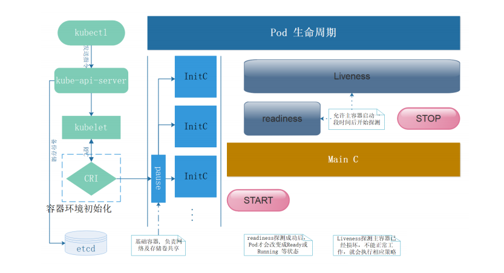

# Kubernetes核心

# 一、kubernetes核心概念

## 1.1 Pod

Pod是可以在 Kubernetes 中创建和管理的、最小的可部署的计算单元。

Pod就像豌豆荚一样，其中包含着一组（一个或多个）容器； 这些容器共享存储、网络、以及怎样运行这些容器的声明。


Pod就像一台物理服务器一样，其中包含一个或多个应用容器， 这些容器中运行着用户应用程序。

**举例说明Pod、Container、应用程序三者之间的关系：麻屋子,红帐子,里面住着白胖子。Pod就是麻屋子,Container就是红帐子,应用程序就是里面的白胖子。**


## 1.2 Controller

在 Kubernetes 中，用于管理和运行Pod的对象

在 Kubernetes 中，控制器通过监控集群的公共状态，并致力于将当前状态转变为期望的状态

**举例说明Controller(控制器)作用：房间里的温度自动调节器**

**当你设置了温度，告诉了温度自动调节器你的*期望状态（Desired State）*。 房间的实际温度是*当前状态（Current State）*。 通过对设备的开关控制，温度自动调节器让其当前状态接近期望状态。**

一个控制器至少追踪一种类型的 Kubernetes 资源。这些对象有一个代表期望状态的 `spec` 字段。 该资源的控制器负责确保其当前状态接近期望状态。

不同的类型的控制器所实现的控制方式不一样，例如：

- deployment 
  - 部署无状态应用
  - 部署无状态应用: 认为pod 都一样，没有顺序要求， 不用考虑在哪个node 运行，随意进行扩展和伸缩
  - 管理Pod和 ReplicaSet
  - 部署、滚动升级等
  - 典型的像web服务、分布式服务等
- StatefulSet 
  - 部署有状态应用
  - 有状态应用，每个pod 都独立运行，保持pod 启动顺序和唯一性； 有唯一的网络标识符，持久存储； 有序，比如mysql 主从； 主机名称固定。 而且其扩容以及升级等操作也是按顺序进行的操作。
- DaemonSet 
  - 部署守护进程
  - DaemonSet保证在每个Node上都运行一个容器副本，常用来部署一些集群的日志、监控或者其他系统管理应用。 新加入的node 也同样运行在一个pod 里面。
- job 
  - 一次性任务
  - Job负责批量处理短暂的一次性任务 (short lived one-off tasks)，即仅执行一次的任务，它保证批处理任务的一个或多个Pod成功结束。
- Cronjob 
  - 周期性定时任务


## 1.3 Label

### 1.3.1 Label介绍

Label是附着到object上（例如Pod）的键值对。可以在创建object的时候指定，也可以在object创建后随时指定。Labels的值对系统本身并没有什么含义，只是对用户才有意义。

一个Label是一个key=value的键值对，其中key与value由用户自己指定。

Label可以附加到各种资源对象上，例如Node、Pod、Service、RC等，一个资源对象可以定义任意数量的Label，同一个Label也可以被添加到任意数量的资源对象上去，Label通常在资源对象定义时确定，也可以在对象创建后动态添加或者删除。

我们可以通过指定的资源对象捆绑一个或多个不同的Label来实现多维度的资源分组管理功能，以便于灵活、方便地进行资源分配、调度、配置、部署等管理工作。例如：部署不同版本的应用到不同的环境中；或者监控和分析应用（日志记录、监控、告警）等。

一些常用abel示例如下所示:


版本标签："release" : "stable" , "release" : "canary"...

环境标签："environment" : "dev" , "environment" : "production"

架构标签："tier" : "frontend" , "tier" : "backend" , "tier" : "middleware"

分区标签："partition" : "customerA" , "partition" : "customerB"...

质量管控标签："track" : "daily" , "track" : "weekly"

Label相当于我们熟悉的“标签”，给某个资源对象定义一个Label，就相当于给它打了一个标签，随后可以通过Label Selector（标签选择器）查询和筛选拥有某些Label的资源对象，Kubernetes通过这种方式实现了类似SQL的简单又通用的对象查询机制。


### 1.3.2 Label语法及字符集

Label key的组成：

- 不得超过63个字符
- 可以使用前缀，使用/分隔，前缀必须是DNS子域，不得超过253个字符，系统中的自动化组件创建的label必须指定前缀，`kubernetes.io/`由kubernetes保留
- 起始必须是字母（大小写都可以）或数字，中间可以有连字符、下划线和点

Label value的组成：

- 不得超过63个字符
- 起始必须是字母（大小写都可以）或数字，中间可以有连字符、下划线和点


## 1.4 Label Selector

通过label selector，客户端／用户可以指定一个object集合，通过label selector对object的集合进行操作。

Label selector有两种类型：

- *equality-based（基于等式）* ：可以使用`=`、`==`、`!=`操作符，可以使用逗号分隔多个表达式
- *set-based*（基于集合） ：可以使用`in`、`notin`、`!`操作符，另外还可以没有操作符，直接写出某个label的key，表示过滤有某个key的object而不管该key的value是何值，`!`表示没有该label的object


**举例说明Label Selector**

**Label Selector可以被类比为SQL语句中的where查询条件，例如，name=redis-slave这个label Selector作用于Pod时，可以被类比为select * from pod where pod's name = 'redis-slave'这样的语句。**


## 1.5 Service

将运行在一组 Pods上的应用程序公开为网络服务的抽象方法。

由于Pod是非永久性资源对象，如果你使用Controller运行你的应用程序，你可以动态创建和销毁Pod，这样就会导致无法准确访问到所想要访问的Pod

例如：如果一组 Pod（称为“后端”）为集群内的其他 Pod（称为“前端”）提供功能， 那么前端如何找出并跟踪要连接的 IP 地址，以便前端可以使用提供工作负载的后端部分？

是一组iptables或ipvs规划，通过把客户端的请求转发到服务端（Pod）,如有多个Pod情况，亦可实现负载均衡的效果。

例如：一个图片处理后端，它运行了 3 个副本（Pod）。这些副本是可互换的 —— 前端不需要关心它们调用了哪个后端副本。 然而组成这一组后端程序的 Pod 实际上可能会发生变化， 前端客户端不应该也没必要知道，而且也不需要跟踪这一组后端的状态。


## 1.6 Endpoints

为Service管理后端Pod，当后端Pod被创建或销毁时，endpoints列表会更新Pod对应的IP地址，以便Service访问请求能够确保被响应。


## 1.7 DNS

为kubernetes集群内资源对象的访问提供名称解析，这样就可以实现通过DNS名称而非IP地址来访问服务。

- 实现集群内Service名称解析
- 实现集群内Pod内Container中应用访问互联网提供域名解析


# 二、Kubernetes核心概念之间的关系

## 2.1 Pod与Controller

pod 是通过Controller 实现应用的运维，比如伸缩，滚动升级等待。pod 和 controller 通过label 标签建立关系。


## 2.2 Pod与Service

service 是为了防止pod 失联，提供的服务发现，类似于微服务的注册中心。定义一组pod 的访问策略。可以为一组具有相同功能的容器应用提供一个统一的入口地址，并将请求负载分发到后端的各个容器应用上。

service 通过selector 来管控对应的pod。根据label 和 selector 建立关联，通过service 实现pod 的负载均衡。


## 2.3 Service与DNS

通过DNS实现对Service名称解析，以此达到访问后端Pod目的。


# 三、基于kubernetes集群容器化应用的微服务

## 3.1 服务部署方式介绍

- 单体服务架构
  - 所有服务进程运行在同一台主机内
- 分布式服务架构
  - 服务进程分布于不同的主机，其中一台主机出现故障，不影响其它主机上的服务运行
- 微服务架构
  - 使用容器化技术把分布式服务架构运行起来，并实现对不同的服务进程的高可用及快速发布等。


## 3.2 微服务架构服务组件（kubernetes核心概念）之间关系举例说明

以在kubernetes集群中运行LNMT应用为例：

把kubernetes集群看做是一个IDC机房，把LNMT Web架构应用以微服务（kubernetes集群资源对象）的方式部署到kubernetes集群中。


# Kubernetes集群核心概念 Pod

# 一、工作负载(workloads)

参考链接：https://kubernetes.io/zh/docs/concepts/workloads/

工作负载（workload）是在kubernetes集群中运行的应用程序。无论你的工作负载是单一服务还是多个一同工作的服务构成，在kubernetes中都可以使用pod来运行它。


workloads分为pod与controllers

- pod通过控制器实现应用的运行，如何伸缩，升级等
- controllers 在集群中管理pod
- pod与控制器之间通过label-selector相关联，是唯一的关联方式


在pod的YAML里指定pod标签

~~~powershell
定义标签
  labels: 
	app: nginx
~~~


在控制器的YAML里指定标签选择器匹配标签

~~~powershell
通过标签选择器选择对应的pod
  selector:
    matchLabels:
      app: nginx
~~~


# 二、pod介绍

## 2.1 pod定义与分类

参考链接: https://kubernetes.io/zh/docs/concepts/workloads/pods/

### 2.1.1 Pod定义

* Pod(豌豆荚) 是Kubernetes集群管理（创建、部署）与调度的最小计算单元，表示处于运行状态的一组容器。
* Pod不是进程，而是容器运行的环境。
* 一个Pod可以封装**一个容器或多个容器(主容器或sidecar边车容器)**
* 一个pod内的多个容器之间共享部分命名空间，例如：Net Namespace,UTS Namespace,IPC Namespace及存储资源
* 用户pod默认会被调度运行在node节点之上(不运行在master节点上，但也有例外情况)
* pod内的IP不是固定的，集群外不能直接访问pod


### 2.1.2 Pod分类

* **静态Pod**	也称之为“无控制器管理的自主式pod”，直接由特定节点上的 `kubelet` 守护进程管理， 不需要API 服务器看到它们，尽管大多数 Pod 都是通过控制面（例如，Deployment） 来管理的，对于静态 Pod 而言，`kubelet` 直接监控每个 Pod，并在其失效时重启之。
* **控制器管理的pod**   控制器可以控制pod的副本数，扩容与裁剪，版本更新与回滚等


## 2.2 查看pod方法

pod是一种计算资源，可以通过`kubectl get pod`来查看

~~~powershell
[root@k8s-master1 ~]# kubectl get pod		# pod或pods都可以，不指定namespace,默认是名为default的namespace
	
[root@k8s-master1 ~]# kubectl get pod -n kube-system
~~~


## 2.3 pod的YAML资源清单格式

先看一个yaml格式的pod定义文件解释

~~~powershell
# yaml格式的pod定义文件完整内容：
apiVersion: v1       #必选，api版本号，例如v1
kind: Pod       	#必选，Pod
metadata:       	#必选，元数据
  name: string       #必选，Pod名称
  namespace: string    #Pod所属的命名空间,默认在default的namespace
  labels:     		 # 自定义标签
    name: string     #自定义标签名字
  annotations:        #自定义注释列表
    name: string
spec:         #必选，Pod中容器的详细定义(期望)
  containers:      #必选，Pod中容器列表
  - name: string     #必选，容器名称
    image: string    #必选，容器的镜像名称
    imagePullPolicy: [Always | Never | IfNotPresent] #获取镜像的策略 Alawys表示下载镜像 IfnotPresent表示优先使用本地镜像，否则下载镜像，Nerver表示仅使用本地镜像
    command: [string]    #容器的启动命令列表，如不指定，使用打包时使用的启动命令
    args: [string]     #容器的启动命令参数列表
    workingDir: string     #容器的工作目录
    volumeMounts:    #挂载到容器内部的存储卷配置
    - name: string     #引用pod定义的共享存储卷的名称，需用volumes[]部分定义的的卷名
      mountPath: string    #存储卷在容器内mount的绝对路径，应少于512字符
      readOnly: boolean    #是否为只读模式
    ports:       #需要暴露的端口库号列表
    - name: string     #端口号名称
      containerPort: int   #容器需要监听的端口号
      hostPort: int    #容器所在主机需要监听的端口号，默认与Container相同
      protocol: string     #端口协议，支持TCP和UDP，默认TCP
    env:       #容器运行前需设置的环境变量列表
    - name: string     #环境变量名称
      value: string    #环境变量的值
    resources:       #资源限制和请求的设置
      limits:      #资源限制的设置
        cpu: string    #Cpu的限制，单位为core数，将用于docker run --cpu-shares参数
        memory: string     #内存限制，单位可以为Mib/Gib，将用于docker run --memory参数
      requests:      #资源请求的设置
        cpu: string    #Cpu请求，容器启动的初始可用数量
        memory: string     #内存清求，容器启动的初始可用数量
    livenessProbe:     #对Pod内个容器健康检查的设置，当探测无响应几次后将自动重启该容器，检查方法有exec、httpGet和tcpSocket，对一个容器只需设置其中一种方法即可
      exec:      #对Pod容器内检查方式设置为exec方式
        command: [string]  #exec方式需要制定的命令或脚本
      httpGet:       #对Pod内个容器健康检查方法设置为HttpGet，需要制定Path、port
        path: string
        port: number
        host: string
        scheme: string
        HttpHeaders:
        - name: string
          value: string
      tcpSocket:     #对Pod内个容器健康检查方式设置为tcpSocket方式
         port: number
       initialDelaySeconds: 0  #容器启动完成后首次探测的时间，单位为秒
       timeoutSeconds: 0   #对容器健康检查探测等待响应的超时时间，单位秒，默认1秒
       periodSeconds: 0    #对容器监控检查的定期探测时间设置，单位秒，默认10秒一次
       successThreshold: 0
       failureThreshold: 0
       securityContext:
         privileged:false
    restartPolicy: [Always | Never | OnFailure] # Pod的重启策略，Always表示一旦不管以何种方式终止运行，kubelet都将重启，OnFailure表示只有Pod以非0退出码退出才重启，Nerver表示不再重启该Pod
    nodeSelector: obeject  # 设置NodeSelector表示将该Pod调度到包含这个label的node上，以key：value的格式指定
    imagePullSecrets:    #Pull镜像时使用的secret名称，以key：secretkey格式指定
    - name: string
    hostNetwork: false     #是否使用主机网络模式，默认为false，如果设置为true，表示使用宿主机网络
    volumes:       #在该pod上定义共享存储卷列表
    - name: string     #共享存储卷名称 （volumes类型有很多种）
      emptyDir: {}     #类型为emtyDir的存储卷，与Pod同生命周期的一个临时目录。为空值
      hostPath: string     #类型为hostPath的存储卷，表示挂载Pod所在宿主机的目录
        path: string     #Pod所在宿主机的目录，将被用于同期中mount的目录
      secret:      #类型为secret的存储卷，挂载集群与定义的secret对象到容器内部
        scretname: string  
        items:     
        - key: string
          path: string
      configMap:     #类型为configMap的存储卷，挂载预定义的configMap对象到容器内部
        name: string
        items:
        - key: string
          path: string
~~~


**YAML格式查找帮助方法回顾**

~~~powershell
[root@k8s-master1 ~]# kubectl explain namespace

[root@k8s-master1 ~]# kubectl explain pod
[root@k8s-master1 ~]# kubectl explain pod.spec
[root@k8s-master1 ~]# kubectl explain pod.spec.containers
~~~


# 三、pod创建与验证

## 3.1 命令创建pod(v1.18变化)

- k8s之前版本中, kubectl run命令用于创建deployment控制器
- 在v1.18版本中, kubectl run命令改为创建pod

### 3.1.1 创建一个名为pod-nginx的pod

```powershell
[root@k8s-master1 ~]# kubectl run nginx1 --image=nginx:1.15-alpine
pod/nginx1 created
```

### 3.1.2 验证

```powershell
[root@k8s-master1 ~]# kubectl get pods
NAME             READY   STATUS    RESTARTS   AGE
nginx1           1/1     Running   0          41s
```


## 3.2 YAML创建pod

### 3.2.1 准备yaml文件

~~~powershell
[root@k8s-master1 ~]# vim pod1.yml
apiVersion: v1					# api版本
kind: Pod						# 资源类型为Pod
metadata:						
  name: pod-stress				# 自定义pod的名称
spec:
  containers:					# 定义pod里包含的容器
  - name: c1					# 自定义pod中的容器名
    image: polinux/stress		# 启动容器的镜像名
    command: ["stress"]			# 自定义启动容器时要执行的命令(类似dockerfile里的CMD)
    args: ["--vm", "1", "--vm-bytes", "150M", "--vm-hang", "1"] # 自定义启动容器执行命令的参数
    
# polinux/stress这个镜像用于压力测试,在启动容器时传命令与参数就是相当于分配容器运行时需要的压力
~~~

2, 通过yaml文件创建pod

```powershell
[root@k8s-master1 ~]# kubectl apply -f pod1.yml
pod/pod-stress created
```


### 3.2.2 查看pod信息

查看pod信息

```powershell
[root@k8s-master1 ~]# kubectl get pod
NAME          READY   STATUS    RESTARTS   AGE
pod-stress    1/1     Running   0          45s
```

查看pod详细信息

```powershell
[root@k8s-master1 ~]# kubectl get pods -o wide
NAME         READY   STATUS    RESTARTS   AGE   IP              NODE          NOMINATED NODE   READINESS GATES
pod-stress   1/1     Running   0          71s   10.244.194.72   k8s-worker1   <none>           <none>
```

描述pod详细信息

```powershell
[root@k8s-master1 ~]# kubectl describe pod pod-stress 
......
Events:
  Type    Reason     Age   From               Message
  ----    ------     ----  ----               -------
  Normal  Scheduled  102s  default-scheduler  Successfully assigned default/pod-stress to k8s-worker1
  Normal  Pulling    102s  kubelet            Pulling image "polinux/stress"
  Normal  Pulled     83s   kubelet            Successfully pulled image "polinux/stress" in 18.944533343s
  Normal  Created    83s   kubelet            Created container c1
  Normal  Started    82s   kubelet            Started container c1
```


## 3.3 删除pod

### 3.3.1 单个pod删除

方法1:

```powershell
[root@k8s-master1 ~]# kubectl delete pod pod-stress
pod "pod-stress" deleted
```

方法2:

```powershell
[root@k8s-master1 ~]# kubectl delete -f pod1.yml
```


### 3.3.2 多个pod删除

方法1: 后接多个pod名

```powershell
[root@k8s-master1 ~]# kubectl delete pod pod名1 pod名2 pod名3 ......
```

方法2: 通过awk截取要删除的pod名称，然后管道给xargs

```powershell
[root@k8s-master1 ~]# kubectl get pods |awk 'NR>1 {print $1}' |xargs kubectl  delete pod
```

方法3: 如果要删除的pod都在同一个非default的命名空间，则可直接删除命名空间

```powershell
[root@k8s-master1 ~]# kubectl delete ns xxxx
```


## 3.4 镜像拉取策略     

由imagePullPolicy参数控制

- Always : 不管本地有没有镜像，都要从仓库中下载镜像
- Never : 从来不从仓库下载镜像, 只用本地镜像,本地没有就算了
- IfNotPresent: 如果本地存在就直接使用, 不存在才从仓库下载

默认的策略是：

- 当镜像标签版本是latest，默认策略就是Always
- 如果指定特定版本默认拉取策略就是IfNotPresent。


1, 将上面的pod删除再创建，使用下面命令查看信息

~~~powershell
[root@k8s-master1 ~]# kubectl apply -f pod1.yml
[root@k8s-master1 ~]# kubectl delete -f pod1.yml
~~~

~~~powershell
[root@k8s-master1 ~]# kubectl describe pod pod-stress
......
Events:
  Type    Reason     Age   From               Message
  ----    ------     ----  ----               -------
  Normal  Scheduled  102s  default-scheduler  Successfully assigned default/pod-stress to k8s-worker1
  Normal  Pulling    102s  kubelet            Pulling image "polinux/stress"
  Normal  Pulled     83s   kubelet            Successfully pulled image "polinux/stress" in 18.944533343s
  Normal  Created    83s   kubelet            Created container c1
  Normal  Started    82s   kubelet            Started container c1
~~~

**说明: 可以看到第二行信息还是`pulling image`下载镜像**


2, 修改YAML

~~~powershell
[root@k8s-master1 ~]# vim pod1.yml
apiVersion: v1
kind: Pod
metadata:
  name: pod-stress
  namespace: default
spec:
  containers:
  - name: c1
    image: polinux/stress
    command: ["stress"]
    args: ["--vm", "1", "--vm-bytes", "150M", "--vm-hang", "1"]
    imagePullPolicy: IfNotPresent					#  增加了这一句
~~~

3，再次删除再创建

~~~powershell
[root@k8s-master1 ~]# kubectl describe pod pod-stress
......
Events:
  Type    Reason     Age   From               Message
  ----    ------     ----  ----               -------
  Normal  Scheduled  17s   default-scheduler  Successfully assigned default/pod-stress to k8s-worker1
  Normal  Pulled     17s   kubelet            Container image "polinux/stress" already present on machine
  Normal  Created    17s   kubelet            Created container c1
  Normal  Started    17s   kubelet            Started container c1
~~~

**说明: 第二行信息是说镜像已经存在，直接使用了**


## 3.5 pod的标签

* 为pod设置label,用于控制器通过label与pod关联
* 语法与前面学的node标签几乎一致


### 3.5.1 通过命令管理Pod标签

1. 查看pod的标签

~~~powershell
[root@k8s-master1 ~]# kubectl get pods --show-labels
NAME          READY   STATUS    RESTARTS   AGE   LABELS
pod-stress     1/1    Running   0          7m25s   <none>
~~~

2. 打标签,再查看

~~~powershell
[root@k8s-master1 ~]# kubectl label pod pod-stress region=huanai zone=A env=test bussiness=game
pod/pod-stress labeled

[root@k8s-master1 ~]# kubectl get pods --show-labels
NAME          READY   STATUS    RESTARTS   AGE     LABELS
pod-stress    1/1     Running   0          8m54s   bussiness=game,env=test,region=huanai,zone=A
~~~

3. 通过等值关系标签查询

~~~powershell
[root@k8s-master1 ~]# kubectl get pods -l zone=A
NAME         READY   STATUS    RESTARTS   AGE
pod-stress   1/1     Running   0          9m22s
~~~

4. 通过集合关系标签查询

~~~powershell
[root@k8s-master1 ~]# kubectl get pods -l "zone in (A,B,C)"
NAME         READY   STATUS    RESTARTS   AGE
pod-stress   1/1     Running   0          9m55s
~~~

5. 删除标签后再验证

~~~powershell
[root@k8s-master1 ~]# kubectl label pod pod-stress region- zone- env- bussiness-
pod/pod-stress labeled

[root@k8s-master1 ~]# kubectl get pods --show-labels
NAME          READY   STATUS    RESTARTS   AGE   LABELS
pod-stress    1/1     Running   0          16m     <none>
~~~

**小结:**

* pod的label与node的label操作方式几乎相同
* node的label用于pod调度到指定label的node节点
* pod的label用于controller关联控制的pod


### 3.5.2 通过YAML创建Pod时添加标签

1, 修改yaml

~~~powershell
[root@k8s-master1 ~]# vim pod1.yml
apiVersion: v1
kind: Pod
metadata:
  name: pod-stress
  namespace: default
  labels:
    env: dev
    app: nginx				# 直接在原来的yaml里加上多个标签
spec:
  containers:
  - name: c1
    image: polinux/stress
    command: ["stress"]
    args: ["--vm", "1", "--vm-bytes", "150M", "--vm-hang", "1"]
    imagePullPolicy: IfNotPresent
~~~

2, 直接apply应用

~~~powershell
[root@k8s-master1 ~]# kubectl apply -f pod1.yaml
pod/pod-stress1 configured			  # 这里是configured,表示修改了
~~~

3, 验证

~~~powershell
[root@k8s-master1 ~]# kubectl get pods --show-labels
NAME          READY   STATUS             RESTARTS   AGE     LABELS
pod-stress   1/1     Running            0          3m5s    app=nginx,env=dev		# 标签有了
~~~


## 3.6 pod资源限制

准备2个不同限制方式的创建pod的yaml文件

~~~powershell
[root@k8s-master1 ~]# vim pod2.yml
apiVersion: v1
kind: Namespace
metadata:
  name: namespace1
---
apiVersion: v1
kind: Pod
metadata:
  name: pod-stress2
  namespace: namespace1
spec:
  containers:
  - name: c1
    image: polinux/stress
    imagePullPolicy: IfNotPresent
    resources:
      limits:
        memory: "200Mi"
      requests:
        memory: "100Mi"
    command: ["stress"]				    # 启动容器时执行的命令
    args: ["--vm", "1", "--vm-bytes", "150M", "--vm-hang", "1"]  # 产生1个进程分配150M内存1秒后释放
~~~


~~~powershell
[root@k8s-master1 ~]# vim pod3.yml
apiVersion: v1
kind: Namespace
metadata:
  name: namespace1
---
apiVersion: v1
kind: Pod
metadata:
  name: pod-stress3
  namespace: namespace1
spec:
  containers:
  - name: c1
    image: polinux/stress
    imagePullPolicy: IfNotPresent
    resources:
      limits:
        memory: "200Mi"
      requests:
        memory: "150Mi"
    command: ["stress"]
    args: ["--vm", "1", "--vm-bytes", "250M", "--vm-hang", "1"]

~~~


~~~powershell
[root@k8s-master1 ~]# kubectl apply -f pod2.yml
namespace/namespace1 created
pod/pod-stress2 created

[root@k8s-master1 ~]# kubectl apply -f pod3.yml
namespace/namespace1 unchanged
pod/pod-stress3 created
~~~


~~~powershell
[root@k8s-master1 ~]# kubectl get namespace  |grep namespace1
namespace1        Active   1m28s

[root@k8s-master1 ~]# kubectl get pod -n namespace1
NAME          READY   STATUS      RESTARTS   AGE
pod-stress2   1/1     Running     0          2m2s
pod-stress3   0/1     OOMKilled   4          115s


查看会发现pod-stress3这个pod状态变为OOMKilled，因为它是内存不足所以显示Container被杀死
~~~

说明:  一旦pod中的容器挂了，容器会有重启策略， 如下：

*  Always：表示容器挂了总是重启，这是默认策略 

*  OnFailures：表容器状态为错误时才重启，也就是容器正常终止时才重启 

*  Never：表示容器挂了不予重启 

* 对于Always这种策略，容器只要挂了，就会立即重启，这样是很耗费资源的。所以Always重启策略是这么做的：第一次容器挂了立即重启，如果再挂了就要延时10s重启，第三次挂了就等20s重启...... 依次类推 

测试完后删除

~~~powershell
[root@k8s-master1 ~]# kubectl delete ns namespace1
~~~


## 3.7 pod包含多个容器

1, 准备yml文件

~~~powershell
[root@k8s-master1 ~]# vim pod4.yml
apiVersion: v1
kind: Pod
metadata:
  name: pod-stress4
spec:
  containers:
  - name: c1
    image: polinux/stress
    imagePullPolicy: IfNotPresent
    resources:
      limits:
        memory: "200Mi"
      requests:
        memory: "100Mi"
    command: ["stress"]
    args: ["--vm", "1", "--vm-bytes", "150M", "--vm-hang", "1"]
    
  - name: c2
    image: polinux/stress
    imagePullPolicy: IfNotPresent
    resources:
      limits:
        memory: "200Mi"
      requests:
        memory: "100Mi"
    command: ["stress"]
    args: ["--vm", "1", "--vm-bytes", "150M", "--vm-hang", "1"]
~~~

 2, 应用yml文件创建pod

~~~powershell
[root@k8s-master1 ~]# kubectl apply -f pod4.yml
pod/pod-stress4 created
~~~

3, 查看pod在哪个节点

~~~powershell
[root@k8s-master1 ~]# kubectl get pods  -o wide
NAME          READY   STATUS    RESTARTS   AGE     IP               NODE          NOMINATED NODE   READINESS GATES
pod-stress4   2/2     Running   0          70s     10.244.159.136   k8s-master1   <none>           <none>
可以看到有2个容器,运行在k8s-master1节点
~~~

4,在k8s-master1上验证,确实产生了2个容器

~~~powershell
[root@k8s-master1 ~]# docker ps -a |grep stress
d7827a963f9d        df58d15b053d              "stress --vm 1 --vm-…"   2 hours ago         Up 2 hours                                      k8s_c2_pod-stress4_default_a534bce1-3ffe-45f5-8128-34657e289b44_0
ae8e8f8d095b        df58d15b053d              "stress --vm 1 --vm-…"   2 hours ago         Up 2 hours                                      k8s_c1_pod-stress4_default_a534bce1-3ffe-45f5-8128-34657e289b44_0
e66461900426        easzlab/pause-amd64:3.2   "/pause"                 2 hours ago         Up 2 hours                                      k8s_POD_pod-stress4_default_a534bce1-3ffe-45f5-8128-34657e289b44_0
~~~

 或

~~~powershell
[root@k8s-master1 ~]# crictl ps
CONTAINER           IMAGE               CREATED             STATE               NAME                   ATTEMPT             POD ID
08cd23ac9b416       df58d15b053d1       2 hours ago         Running             c2                     0                   2dd084491f019
65f0ecba8dec3       df58d15b053d1       2 hours ago         Running             c1                     0                   2dd084491f019

~~~


## 3.8 对pod里的容器进行操作

### 3.8.1 命令帮助

~~~powershell
[root@k8s-master1 ~]# kubectl exec -h
~~~

### 3.8.2 不用交互直接执行命令

格式为: `kubectl exec pod名 -c 容器名 -- 命令`

**注意:** 

* -c 容器名为可选项,如果是1个pod中1个容器,则不用指定;
* 如果是1个pod中多个容器,不指定默认为第1个。

~~~powershell
[root@k8s-master1 ~]# kubectl exec pod-stress4 -c c2  -- touch /111

[root@k8s-master1 ~]# kubectl exec pod-stress4 -c c2  -- ls /111
/111
~~~

不指定容器名,则默认为pod里的第1个容器

~~~powershell
[root@k8s-master1 ~]# kubectl exec  pod-stress4  -- touch /222
Defaulting container name to c1.
Use 'kubectl describe pod/pod-stress4 -n default' to see all of the containers in this pod.
~~~


### 3.8.3 和容器交互操作

和docker exec几乎一样

~~~powershell
[root@k8s-master1 ~]# kubectl exec -it pod-stress4 -c c1 -- /bin/bash
bash-5.0# touch /333
bash-5.0# ls
222    bin    etc    lib    mnt    proc   run    srv    tmp    var
333    dev    home   media  opt    root   sbin   sys    usr
bash-5.0# exit
exit	   
~~~


## 3.9 验证pod中多个容器网络共享

1, 编写YAML

```powershell
[root@k8s-master1 ~]# vim pod-nginx.yaml
apiVersion: v1
kind: Pod
metadata:
  name: nginx2
spec:
  containers:
  - name: c1
    image: nginx:1.15-alpine

  - name: c2
    image: nginx:1.15-alpine
```

2, 应用YAML

```powershell
[root@k8s-master1 ~]# kubectl apply -f pod-nginx.yaml
pod/nginx2 created
```

3, 查看pod信息与状态

```powershell
[root@k8s-master1 ~]# kubectl describe pod nginx2
......
......
Events:
  Type    Reason     Age              From               Message
  ----    ------     ----             ----               -------
  Normal  Scheduled  25s              default-scheduler  Successfully assigned default/nginx2 to k8s-worker1
  Normal  Pulling    24s              kubelet            Pulling image "nginx:1.15-alpine"
  Normal  Pulled     5s               kubelet            Successfully pulled image "nginx:1.15-alpine" in 18.928009025s
  Normal  Created    5s               kubelet            Created container c1
  Normal  Started    5s               kubelet            Started container c1
  Normal  Pulled     2s (x2 over 5s)  kubelet            Container image "nginx:1.15-alpine" already present on machine
  Normal  Created    2s (x2 over 5s)  kubelet            Created container c2
  Normal  Started    2s (x2 over 5s)  kubelet            Started container c2

```


```powershell
[root@k8s-master1 ~]# kubectl get pods |grep nginx2
nginx2   1/2     CrashLoopBackOff   3          2m40s
有一个启不来，因为一个容器中两个pod是共用网络的，所以不能两个都占用80端口
```

有一个启不来，因为一个pod中两个容器是共用网络的，所以不能两个都占用80端口

通过查找`k8s-worker1`上面的容器，然后`docker logs或crictl logs containerID`查看，得到如下的报错，说明是端口被占用

```powershell
[root@k8s-worker1 ~]# docker logs k8s_c2_nginx2_default_51fd8e81-1c4b-4557-9498-9b25ed8a4c99_4
2020/11/21 04:29:12 [emerg] 1#1: bind() to 0.0.0.0:80 failed (98: Address in use)
nginx: [emerg] bind() to 0.0.0.0:80 failed (98: Address in use)
2020/11/21 04:29:12 [emerg] 1#1: bind() to 0.0.0.0:80 failed (98: Address in use)
nginx: [emerg] bind() to 0.0.0.0:80 failed (98: Address in use)
2020/11/21 04:29:12 [emerg] 1#1: bind() to 0.0.0.0:80 failed (98: Address in use)
nginx: [emerg] bind() to 0.0.0.0:80 failed (98: Address in use)
2020/11/21 04:29:12 [emerg] 1#1: bind() to 0.0.0.0:80 failed (98: Address in use)
nginx: [emerg] bind() to 0.0.0.0:80 failed (98: Address in use)
2020/11/21 04:29:12 [emerg] 1#1: bind() to 0.0.0.0:80 failed (98: Address in use)
nginx: [emerg] bind() to 0.0.0.0:80 failed (98: Address in use)
2020/11/21 04:29:12 [emerg] 1#1: still could not bind()
nginx: [emerg] still could not bind()

```


# 四、pod调度


## 4.1 pod调度流程


~~~powershell
Step1
通过kubectl命令应用资源清单文件（yaml格式）向api server 发起一个create pod 请求

Step2
api server接收到pod创建请求后，生成一个包含创建信息资源清单文件

Step3
apiserver 将资源清单文件中信息写入etcd数据库

Step4
Scheduler启动后会一直watch API Server，获取 podSpec.NodeName为空的Pod,即判断pod.spec.Node == null? 若为null，表示这个Pod请求是新的，需要创建，因此先进行调度计算（共计2步：1、过滤不满足条件的，2、选择优先级高的），找到合适的node，然后将信息在etcd数据库中更新分配结果：pod.spec.Node = nodeA (设置一个具体的节点)

Step5
kubelet 通过watch etcd数据库(即不停地看etcd中的记录)，发现有新的Node出现，如果这条记录中的Node与所在节点编号相同，即这个Pod由scheduler分配给自己，则调用node中的Container Runtime，进而创建container，并将创建后的结果返回到给api server用于更新etcd数据库中数据状态。
~~~


## 4.2 调度约束方法

我们为了实现容器主机资源平衡使用, 可以使用约束把pod调度到指定的node节点

- nodeName 用于将pod调度到指定的node名称上
- nodeSelector 用于将pod调度到匹配Label的node上


### 4.2.1  nodeName

1, 编写YAML文件

~~~powershell
[root@k8s-master1 ~]# vim pod-nodename.yml
apiVersion: v1
kind: Pod
metadata:
  name: pod-nodename
spec:
  nodeName: k8s-worker1                    # 通过nodeName调度到k8s-worker1节点
  containers:
  - name: nginx
    image: nginx:1.15-alpine
~~~

2, 应用YAML文件创建pod

~~~powershell
[root@k8s-master1 ~]# kubectl apply -f pod-nodename.yml
pod/pod-nodename created
~~~

3, 验证

~~~powershell
[root@k8s-master1 ~]# kubectl describe pod pod-nodename |tail -6
Events:
  Type    Reason   Age    From     Message
  ----    ------   ----   ----     -------
  Normal  Pulled   2m47s  kubelet  Container image "nginx:1.15-alpine" already present on machine
  Normal  Created  2m47s  kubelet  Created container nginx
  Normal  Started  2m47s  kubelet  Started container nginx

倒数第3行没有使用scheduler,而是直接给运行了,说明nodeName约束生效
~~~

### 4.2.2 nodeSelector

1, 为k8s-worker1打标签

~~~powershell
[root@k8s-master1 ~]# kubectl label nodes k8s-worker1 bussiness=game
node/k8s-worker1 labeled
~~~

2, 编写YAML文件

~~~powershell
[root@k8s-master1 ~]# vim pod-nodeselector.yml
apiVersion: v1
kind: Pod
metadata:
  name: pod-nodeselect
spec:
  nodeSelector:                         # nodeSelector节点选择器
    bussiness: game                     # 指定调度到标签为bussiness=game的节点
  containers:
  - name: nginx
    image: nginx:1.15-alpine
~~~

3,  应用YAML文件创建pod

~~~powershell
[root@k8s-master1 ~]# kubectl apply -f pod-nodeselector.yml
pod/pod-nodeselect created
~~~

4, 验证

~~~powershell
[root@k8s-master1 ~]# kubectl describe pod pod-nodeselect |tail -6
 Type    Reason     Age   From               Message
  ----    ------     ----  ----               -------
  Normal  Scheduled  20s   default-scheduler  Successfully assigned default/pod-nodeselect to k8s-worker1
  Normal  Pulled     19s   kubelet            Container image "nginx:1.15-alpine" already present on machine
  Normal  Created    19s   kubelet            Created container nginx
  Normal  Started    19s   kubelet            Started container nginx

仍然经过了scheduler,但确实分配到了 k8s-worker1上
~~~

有兴趣可以再删除后再创建,重复几次验证


# 五、pod的生命周期

## 5.1 Pod生命周期

* 有些pod(比如运行httpd服务),正常情况下会一直运行中,但如果手动删除它,此pod会终止
* 也有些pod(比如执行计算任务)，任务计算完后就会自动终止

上面两种场景中,pod从创建到终止的过程就是pod的生命周期。





### 5.1.1 容器启动

1. pod中的容器在创建前,有初始化容器(init container)来进行初始化环境
2. 初化完后,主容器(main container)开始启动

3. 主容器启动后,有一个**post start**的操作(启动后的触发型操作,或者叫启动后钩子)

4. post start后,就开始做健康检查

   * 第一个健康检查叫存活状态检查(liveness probe )，用来检查主容器存活状态的

   * 第二个健康检查叫准备就绪检查(readiness probe)，用来检查主容器是否启动就绪


### 5.1.2 容器终止

1. 可以在容器终止前设置**pre stop**操作(终止前的触发型操作,或者叫终止前钩子)
3. 当出现特殊情况不能正常销毁pod时,大概等待30秒会强制终止
3. 终止容器后还可能会重启容器(视容器重启策略而定)。


### 5.1.3 回顾容器重启策略

*  Always：表示容器挂了总是重启，这是默认策略 

*  OnFailures：表示容器状态为错误时才重启，也就是容器正常终止时不重启 

*  Never：表示容器挂了不予重启 

* 对于Always这种策略，容器只要挂了，就会立即重启，这样是很耗费资源的。所以Always重启策略是这么做的：第一次容器挂了立即重启，如果再挂了就要延时10s重启，第三次挂了就等20s重启...... 依次类推 


## 5.2 HealthCheck健康检查

当Pod启动时，容器可能会因为某种错误(服务未启动或端口不正确)而无法访问等。

### 5.2.1 Health Check方式

kubelet拥有两个检测器，它们分别对应不同的触发器(根据触发器的结构执行进一步的动作)

| 方式                         | 说明                                                         |
| ---------------------------- | ------------------------------------------------------------ |
| Liveness Probe(存活状态探测) | 指示容器是否正在运行。如果存活态探测失败，则 kubelet 会杀死容器， 并且容器将根据其[重启策略](https://kubernetes.io/zh/docs/concepts/workloads/pods/pod-lifecycle/#restart-policy)决定未来。如果容器不提供存活探针， 则默认状态为 `Success`。 |
| readiness Probe(就绪型探测)  | 指示容器是否准备好为请求提供服务。如果就绪态探测失败， 端点控制器将从与 Pod 匹配的所有服务的端点列表中删除该 Pod 的 IP 地址。 初始延迟之前的就绪态的状态值默认为 `Failure`。 如果容器不提供就绪态探针，则默认状态为 `Success`。注：检查后不健康，将容器设置为Notready;如果使用service来访问,流量不会转发给此种状态的pod |
| startup Probe                | 指示容器中的应用是否已经启动。如果提供了启动探针，则所有其他探针都会被 禁用，直到此探针成功为止。如果启动探测失败，`kubelet` 将杀死容器，而容器依其 [重启策略](https://kubernetes.io/zh/docs/concepts/workloads/pods/pod-lifecycle/#restart-policy)进行重启。 如果容器没有提供启动探测，则默认状态为 `Success`。 |


### 5.2.2 Probe探测方式

| 方式    | 说明                                                         |
| ------- | ------------------------------------------------------------ |
| Exec    | 执行命令                                                     |
| HTTPGet | http请求某一个URL路径                                        |
| TCP     | tcp连接某一个端口                                            |
| gRPC    | 使用 [gRPC](https://grpc.io/) 执行一个远程过程调用。 目标应该实现 [gRPC健康检查](https://grpc.io/grpc/core/md_doc_health-checking.html)。 如果响应的状态是 "SERVING"，则认为诊断成功。 gRPC 探针是一个 alpha 特性，只有在你启用了 "GRPCContainerProbe" [特性门控](https://kubernetes.io/zh/docs/reference/command-line-tools-reference/feature-gate/)时才能使用。 |


### 5.2.3 liveness-exec案例

1, 准备YAML文件

~~~powershell
[root@k8s-master1 ~]# vim pod-liveness-exec.yml
apiVersion: v1
kind: Pod
metadata:
  name: liveness-exec
  namespace: default
spec:
  containers:
  - name: liveness
    image: busybox
    imagePullPolicy: IfNotPresent
    args:
    - /bin/sh
    - -c
    - touch /tmp/healthy; sleep 30; rm -rf /tmp/healthy; sleep 600
    livenessProbe:
      exec:
        command:
        - cat
        - /tmp/healthy
      initialDelaySeconds: 5 				# pod启动延迟5秒后探测
      periodSeconds: 5 						# 每5秒探测1次
~~~

2, 应用YAML文件

~~~powershell
[root@k8s-master1 ~]# kubectl apply -f pod-liveness-exec.yml
~~~

3, 通过下面的命令观察

~~~powershell
[root@k8s-master1 ~]# kubectl describe pod liveness-exec
......
Events:
  Type     Reason     Age   From               Message
  ----     ------     ----  ----               -------
  Normal   Scheduled  40s   default-scheduler  Successfully assigned default/liveness-exec to k8s-worker1
  Normal   Pulled     38s   kubelet    Container image "busybox" already present on machine
  Normal   Created    37s   kubelet     Created container liveness
  Normal   Started    37s   kubelet     Started container liveness
  Warning  Unhealthy  3s    kubelet     Liveness probe failed: cat: can't open '/tmp/healthy': No such file or directory

看到40s前被调度以k8s-worker1节点,3s前健康检查出问题
~~~

4, 过几分钟再观察

~~~powershell
[root@k8s-master1 ~]# kubectl describe pod liveness-exec
......
Events:
  Type     Reason     Age                  From               Message
  ----     ------     ----                 ----               -------
  Normal   Scheduled  3m42s                default-scheduler  Successfully assigned default/liveness-exec to k8s-worker1
  Normal   Pulled     70s (x3 over 3m40s)  kubelet     Container image "busybox" already present on machine
  Normal   Created    70s (x3 over 3m39s)  kubelet     Created container liveness
  Normal   Started    69s (x3 over 3m39s)  kubelet     Started container liveness
  Warning  Unhealthy  26s (x9 over 3m5s)   kubelet     Liveness probe failed: cat: can't open '/tmp/healthy': No such file or directory
  Normal   Killing    26s (x3 over 2m55s)  kubelet     Container liveness failed liveness probe, will be restarted
~~~


~~~powershell
[root@k8s-master1 ~]# kubectl get pod
NAME            READY   STATUS    RESTARTS   AGE
liveness-exec   1/1     Running   3          4m12s

看到重启3次,慢慢地重启间隔时间会越来越长
~~~


### 拓展: 容器重启策略验证

~~~powershell
apiVersion: v1
kind: Pod
metadata:
  name: liveness-exec
  namespace: default
spec:
  restartPolicy: Never					# 把容器重启策略由默认的always改为Never
  containers:
  - name: liveness
    image: busybox
    imagePullPolicy: IfNotPresent
    args:
    - /bin/sh
    - -c
    - touch /tmp/healthy; sleep 30; rm -rf /tmp/healthy; sleep 600
    livenessProbe:
      exec:
        command:
        - cat
        - /tmp/healthy
      initialDelaySeconds: 5                         
      periodSeconds: 5                                 
~~~

请自行验证

验证结果为:

* 容器健康检查出现问题后，不再重启，也不会继续sleep 600秒，而是直接关闭了


### 5.2.4  liveness-httpget案例

1, 编写YMAL文件

~~~powershell
[root@k8s-master1 ~]# vim pod-liveness-httpget.yml
apiVersion: v1
kind: Pod
metadata:
  name: liveness-httpget
  namespace: default
spec:
  containers:
  - name: liveness
    image: nginx:1.15-alpine
    imagePullPolicy: IfNotPresent
    ports:							    # 指定容器端口，这一段不写也行，端口由镜像决定 
    - name: http						# 自定义名称，不需要与下面的port: http对应
      containerPort: 80					# 类似dockerfile里的expose 80
    livenessProbe:
      httpGet:                          # 使用httpGet方式
        port: http                      # http协议,也可以直接写80端口
        path: /index.html               # 探测家目录下的index.html
      initialDelaySeconds: 3            # 延迟3秒开始探测
      periodSeconds: 5                  # 每隔5s钟探测一次
~~~

2, 应用YAML文件

~~~powershell
[root@k8s-master1 ~]# kubectl apply -f pod-liveness-httpget.yml
~~~

3, 验证查看

~~~powershell
[root@k8s-master1 ~]# kubectl get pods
NAME               READY   STATUS             RESTARTS   AGE
liveness-httpget   1/1     Running            0          9s
~~~

4, 交互删除nginx里的主页文件

~~~powershell
[root@k8s-master1 ~]# kubectl exec -it liveness-httpget -- rm -rf /usr/share/nginx/html/index.html
~~~

5, 验证查看会发现


~~~powershell
[root@k8s-master1 ~]# kubectl get pod
NAME               READY   STATUS    RESTARTS   AGE
liveness-httpget   1/1     Running   1          11m

只restart一次
~~~


### 5.2.5  liveness-tcp案例

1, 编写YAML文件

~~~powershell
[root@k8s-master1 ~]# vim pod-liveness-tcp.yml
apiVersion: v1
kind: Pod
metadata:
  name: liveness-tcp
  namespace: default
spec:
  containers:
  - name: liveness
    image: nginx:1.15-alpine
    imagePullPolicy: IfNotPresent
    ports:
    - name: http
      containerPort: 80
    livenessProbe:
      tcpSocket:                        # 使用tcp连接方式
        port: 80                        # 连接80端口进行探测
      initialDelaySeconds: 3
      periodSeconds: 5
~~~

2, 应用YAML文件创建pod

~~~powershell
[root@k8s-master1 ~]# kubectl apply -f pod-liveness-tcp.yml
pod/liveness-tcp created
~~~

3, 查看验证

~~~powershell
[root@k8s-master1 ~]# kubectl get pod
NAME               READY   STATUS             RESTARTS   AGE
liveness-tcp       1/1     Running            0          14s
~~~

4, 交互关闭nginx

~~~powershell
[root@k8s-master1 ~]# kubectl exec -it liveness-tcp -- /usr/sbin/nginx -s stop
~~~

5, 再次验证查看


~~~powershell
[root@k8s-master1 ~]# kubectl get pod
NAME               READY   STATUS    RESTARTS   AGE
liveness-tcp       1/1     Running   1          5m13s

也只重启1次,重启后重新初始化了
~~~


### 5.2.6 readiness案例

1, 编写YAML文件

~~~powershell
[root@k8s-master1 ~]# vim pod-readiness-httpget.yml
apiVersion: v1
kind: Pod
metadata:
  name: readiness-httpget
  namespace: default
spec:
  containers:
  - name: readiness
    image: nginx:1.15-alpine
    imagePullPolicy: IfNotPresent
    ports:
    - name: http
      containerPort: 80
    readinessProbe:                     # 这里由liveness换成了readiness
      httpGet:
        port: http
        path: /index.html
      initialDelaySeconds: 3
      periodSeconds: 5
~~~

2, 应用YAML文件

~~~powershell
[root@k8s-master1 ~]# kubectl apply -f pod-readiness-httpget.yml
pod/readiness-httpget created
~~~

3, 验证查看

~~~powershell
[root@k8s-master1 ~]# kubectl get pod
NAME                READY   STATUS             RESTARTS   AGE
readiness-httpget   1/1     Running            0          10s
~~~

4, 交互删除nginx主页

~~~powershell
[root@k8s-master1 ~]# kubectl exec -it readiness-httpget -- rm -rf /usr/share/nginx/html/index.html
~~~

5, 再次验证


~~~powershell
[root@k8s-master1 ~]# kubectl get pod
NAME                READY   STATUS    RESTARTS   AGE
readiness-httpget   0/1     Running   0          2m49s

READY状态为0/1
~~~

6, 交互创建nginx主页文件再验证

~~~powershell
[root@k8s-master1 ~]# kubectl exec -it readiness-httpget -- touch /usr/share/nginx/html/index.html
~~~

~~~powershell
[root@k8s-master1 ~]# kubectl get pod
NAME                READY   STATUS             RESTARTS   AGE
readiness-httpget   1/1     Running            0          3m10s

READY状态又为1/1了
~~~

### 5.2.7 readiness+liveness综合案例

1, 编写YAML文件

~~~powershell
[root@k8s-master1 ~]# vim pod-readiness-liveiness.yml
apiVersion: v1
kind: Pod
metadata:
  name: readiness-liveness-httpget
  namespace: default
spec:
  containers:
  - name: readiness-liveness
    image: nginx:1.15-alpine
    imagePullPolicy: IfNotPresent
    ports:
    - name: http
      containerPort: 80
    livenessProbe:
      httpGet:
        port: http
        path: /index.html
      initialDelaySeconds: 1
      periodSeconds: 3
    readinessProbe:
      httpGet:
        port: http
        path: /index.html
      initialDelaySeconds: 5
      periodSeconds: 5
~~~

2, 应用YAML文件

~~~powershell
[root@k8s-master1 ~]# kubectl apply -f pod-readiness-liveiness.yml
pod/readiness-liveness-httpget created
~~~

3, 验证

~~~powershell
[root@k8s-master1 ~]# kubectl get pod |grep readiness-liveness-httpget
NAME                         READY   STATUS             RESTARTS   AGE
readiness-liveness-httpget   0/1     Running            0          6s
~~~


## 5.3 post-start

1, 编写YAML文件

~~~powershell
[root@k8s-master1 ~]# vim pod-poststart.yml

apiVersion: v1
kind: Pod
metadata:
  name: poststart
  namespace: default
spec:
  containers:
  - name: poststart
    image: nginx:1.15-alpine
    imagePullPolicy: IfNotPresent
    lifecycle:                                       # 生命周期事件
      postStart:
        exec:
          command: ["mkdir","-p","/usr/share/nginx/html/haha"]
~~~

2, 应用YMAL文件

~~~powershell
[root@k8s-master1 ~]# kubectl apply -f pod-poststart.yml
~~~

3, 验证

~~~powershell
[root@k8s-master1 ~]# kubectl get pods
NAME                         READY   STATUS             RESTARTS   AGE
poststart                    1/1     Running            0          25s
~~~


~~~powershell
[root@k8s-master1 ~]# kubectl exec -it poststart -- ls /usr/share/nginx/html -l
total 8
-rw-r--r-- 1 root root 494 Apr 16 13:08 50x.html
drwxr-xr-x 2 root root   6 Aug  5 05:33 haha			有创建此目录
-rw-r--r-- 1 root root 612 Apr 16 13:08 index.html
~~~

## 5.4 pre-stop

容器终止前执行的命令

1, 编写YAML文件

~~~powershell
[root@k8s-master1 ~]# vim prestop.yml
apiVersion: v1
kind: Pod
metadata:
  name: prestop
  namespace: default
spec:
  containers:
  - name: prestop
    image: nginx:1.15-alpine
    imagePullPolicy: IfNotPresent
    lifecycle:                                       # 生命周期事件
      preStop:                                       # preStop
        exec:
          command: ["/bin/sh","-c","sleep 60000000"]     # 容器终止前sleep 60000000秒
~~~

2, 应用YAML文件创建pod

~~~powershell
[root@k8s-master1 ~]# kubectl apply -f prestop.yml
pod/prestop created
~~~

3, 删除pod验证

~~~powershell
[root@k8s-master1 ~]# kubectl delete -f prestop.yml
pod "prestop" deleted		会在这一步等待一定的时间(大概30s-60s左右)才能删除,说明验证成功
~~~

**结论:** 当出现特殊情况不能正常销毁pod时,大概等待30秒会强制终止


## 5.5 pod故障排除

| 状态              | 描述                                                         |
| ----------------- | ------------------------------------------------------------ |
| Pending（悬决）   | Pod 已被 Kubernetes 系统接受，但有一个或者多个容器尚未创建亦未运行。此阶段包括等待 Pod 被调度的时间和通过网络下载镜像的时间。 |
| Running（运行中） | pod已经绑定到一个节点，并且已经创建了所有容器。至少有一个容器正在运行中，或正在启动或重新启动。 |
| completed（完成） | Pod中的所有容器都已成功终止，不会重新启动。                  |
| Failed（失败）    | Pod的所有容器均已终止，且至少有一个容器已在故障中终止。也就是说，容器要么以非零状态退出，要么被系统终止。 |
| Unknown（未知）   | 由于某种原因apiserver无法获得Pod的状态，通常是由于Master与Pod所在主机kubelet通信时出错。 |
| CrashLoopBackOff  | 多见于CMD语句错误或者找不到container入口语句导致了快速退出,可以用kubectl logs 查看日志进行排错 |

- kubectl describe pod  pod名
- kubectl logs pod  [-c CONTAINER]
- kubectl exec POD [-c CONTAINER] --COMMAND [args...]


# kubernetes核心概念 Controller


# 一、pod控制器controller

## 1.1 Controller作用及分类

controller用于控制pod

参考: https://kubernetes.io/zh/docs/concepts/workloads/controllers/


控制器主要分为:

* Deployments   部署无状态应用，控制pod升级,回退
* ReplicaSet       副本集,控制pod扩容,裁减
* ReplicationController(相当于ReplicaSet的老版本,现在建议使用Deployments加ReplicaSet替代RC)
* StatefulSets     部署有状态应用，结合Service、存储等实现对有状态应用部署
* DaemonSet     守护进程集，运行在所有集群节点(包括master), 比如使用filebeat,node_exporter
* Jobs                  一次性
* Cronjob            周期性


## 1.2 Deployment

### 1.2.1 Replicaset控制器的功能

- 支持新的基于集合的selector(以前的rc里没有这种功能)
- 通过改变Pod副本数量实现Pod的扩容和缩容


### 1.2.2 Deployment控制器的功能

- Deployment集成了上线部署、滚动升级、创建副本、回滚等功能
- Deployment里包含并使用了ReplicaSet


### 1.2.3 Deployment用于部署无状态应用

无状态应用的特点:

- 所有pod无差别
- 所有pod中容器运行同一个image
- 所有pod可以运行在集群中任意node上
- 所有pod无启动顺序先后之分
- 随意pod数量扩容或缩容
- 例如简单运行一个静态web程序


### 1.2.4 创建deployment类型应用

1, 准备YAML文件

~~~powershell
[root@k8s-master1 ~]# vim deployment-nginx.yml
apiVersion: apps/v1
kind: Deployment
metadata:
  name: deploy-nginx			# deployment名
spec:				
  replicas: 1					# 副本集,deployment里使用了replicaset
  selector:
    matchLabels:
      app: nginx				# 匹配的pod标签,表示deployment和rs控制器控制带有此标签的pod
  template:					    # 代表pod的配置模板
    metadata:
      labels:
        app: nginx				# pod的标签
    spec:
      containers:				# 以下为pod里的容器定义
      - name: nginx
        image: nginx:1.15-alpine
        imagePullPolicy: IfNotPresent
        ports:
        - containerPort: 80
~~~

2, 应用YAML文件创建deployment

~~~powershell
[root@k8s-master1 ~]# kubectl apply -f deployment-nginx.yml
deployment.apps/deploy-nginx created
~~~

3, 查看验证

~~~powershell
[root@k8s-master1 ~]# kubectl get deployment				# deployment可简写成depoly
NAME           READY   UP-TO-DATE   AVAILABLE   AGE
deploy-nginx   1/1     1            1           19s
~~~

~~~powershell
[root@k8s-master1 ~]# kubectl get pods
NAME                            READY   STATUS    RESTARTS   AGE
deploy-nginx-6c9764bb69-pbc2h   1/1     Running   0          75s
~~~

~~~powershell
[root@k8s-master1 ~]# kubectl get replicasets				# replicasets可简写成rs
NAME                      DESIRED   CURRENT   READY   AGE
deploy-nginx-6c9764bb69   1         1         1       2m6s
~~~


### 1.2.5 访问deployment

1,查看pod的IP地址

~~~powershell
[root@k8s-master1 ~]# kubectl get pods -o wide
NAME                            READY   STATUS    RESTARTS   AGE   IP               NODE          NOMINATED NODE   READINESS GATES
deploy-nginx-6d9d558bb6-88nr8   1/1     Running   0          39s   10.244.159.155   k8s-master1   <none>           <none>

pod在k8s-master1节点,pod的IP为10.244.159.155
~~~

2, 查看所有集群节点的网卡

~~~powershell
[root@k8s-master1 ~]# ifconfig tunl0 |head -2
tunl0: flags=193<UP,RUNNING,NOARP>  mtu 1480
        inet 10.244.159.128  netmask 255.255.255.255
~~~

~~~powershell
[root@k8s-master2 ~]# ifconfig tunl0 |head -2
tunl0: flags=193<UP,RUNNING,NOARP>  mtu 1480
        inet 10.244.224.0  netmask 255.255.255.255
~~~

~~~powershell
[root@k8s-master3 ~]# ifconfig tunl0 |head -2
tunl0: flags=193<UP,RUNNING,NOARP>  mtu 1480
        inet 10.244.135.192  netmask 255.255.255.255
~~~

~~~powershell
[root@k8s-worker1 ~]# ifconfig tunl0 |head -2
tunl0: flags=193<UP,RUNNING,NOARP>  mtu 1480
        inet 10.244.194.64  netmask 255.255.255.255
~~~

* 可以看到所有集群节点的IP都为`10.244.0.0/16`这个大网段内的子网

3, 在任意集群节点上都可以访问此deploy里pod

~~~powershell
# curl 10.244.159.155

结果是任意集群节点都可以访问这个POD,但集群外部是不能访问的
~~~


### 1.2.6 删除deployment中的pod

1, 删除pod（**注意: 是删除deployment中的pod**）

~~~powershell
[root@k8s-master1 ~]# kubectl delete pod deploy-nginx-6c9764bb69-pbc2h
pod "deploy-nginx-6c9764bb69-pbc2h" deleted
~~~

2, 再次查看,发现又重新启动了一个pod(**节点由k8s-master1转为k8s-worker1 了,IP地址也变化了**)

~~~powershell
[root@k8s-master1 ~]# kubectl get pods  -o wide
NAME                            READY   STATUS    RESTARTS   AGE   IP              NODE          NOMINATED NODE   READINESS GATES
deploy-nginx-6d9d558bb6-f2t6r   1/1     Running   0          28s   10.244.194.94   k8s-worker1   <none>           <none>

~~~

也就是说**==pod的IP不是固定的==**,比如把整个集群关闭再启动,pod也会自动启动,但是**IP地址也会变化**


**既然IP地址不是固定的,所以需要一个固定的访问endpoint给用户,那么这种方式就是service.**


### 1.2.7 pod版本升级

查看帮助

~~~powershell
[root@k8s-master1 ~]# kubectl set image -h
~~~

1, 升级前验证nginx版本

~~~powershell
[root@k8s-master1 ~]# kubectl describe pods deploy-nginx-6d9d558bb6-f2t6r | grep Image:
    Image:          nginx:1.15-alpine
    
[root@k8s-master1 ~]# kubectl exec deploy-nginx-6d9d558bb6-f2t6r -- nginx -v
nginx version: nginx/1.15.12
~~~

2, 升级为1.16版

~~~powershell
[root@k8s-master1 ~]# kubectl set image deployment deploy-nginx nginx=nginx:1.16-alpine --record
deployment.apps/deploy-nginx image updated
~~~

说明:

* `deployment deploy-nginx`代表名为deploy-nginx的deployment

* `nginx=nginx:1.16-alpine`前面的nginx为容器名

* --record  表示会记录

**容器名怎么查看?**

* `kubectl describe pod pod名`查看
* `kubectl edit deployment deployment名`来查看容器名
* `kubectl get deployment deployment名 -o yaml`来查看容器名

  

3, 验证

如果升级的pod数量较多，则需要一定时间，可通过下面命令查看是否已经成功

~~~powershell
[root@k8s-master1 ~]# kubectl rollout status deployment deploy-nginx	
deployment "deploy-nginx" successfully rolled out
~~~

验证 pod

~~~powershell
[root@k8s-master1 ~]# kubectl get pods
NAME                            READY   STATUS    RESTARTS   AGE
deploy-nginx-5f4749c8c8-nskp9   1/1     Running   0          104s     更新后,后面的id变了
~~~

验证版本

~~~powershell
[root@k8s-master1 ~]# kubectl describe pod deploy-nginx-5f4749c8c8-nskp9 |grep Image:
    Image:          nginx:1.16-alpine							升级为1.16了
    
[root@k8s-master1 ~]# kubectl exec deploy-nginx-5f4749c8c8-nskp9 -- nginx -v
nginx version: nginx/1.16.1										升级为1.16了
~~~


**练习:** 再将nginx1升级为1.17版

~~~powershell
[root@k8s-master1 ~]# kubectl set image deployment deploy-nginx nginx=nginx:1.17-alpine --record
deployment.apps/deploy-nginx image updated
~~~


### 1.2.8 pod版本回退

1, 查看版本历史信息

~~~powershell
[root@k8s-master1 ~]# kubectl rollout history deployment deploy-nginx
deployment.apps/deploy-nginx
REVISION  CHANGE-CAUSE
1         <none>												原1.15版
2         kubectl set image deployment deploy-nginx nginx=nginx:1.16-alpine --record=true
3         kubectl set image deployment deploy-nginx nginx=nginx:1.17-alpine --record=true
~~~

2, 定义要回退的版本（还需要执行才是真的回退版本)

~~~powershell
[root@k8s-master1 ~]# kubectl rollout history deployment deploy-nginx --revision=1
deployment.apps/deploy-nginx with revision #1
Pod Template:
  Labels:       app=nginx
        pod-template-hash=6c9764bb69
  Containers:
   nginx:
    Image:      nginx:1.15-alpine				可以看到这是要回退的1.15版本
    Port:       80/TCP
    Host Port:  0/TCP
    Environment:        <none>
    Mounts:     <none>
  Volumes:      <none>
~~~

3, 执行回退

~~~powershell
[root@k8s-master1 ~]# kubectl rollout undo deployment deploy-nginx --to-revision=1
deployment.apps/deploy-nginx rolled back
~~~

4, 验证

~~~powershell
[root@k8s-master1 ~]# kubectl rollout history deployment deploy-nginx
deployment.apps/deploy-nginx
REVISION  CHANGE-CAUSE
2         kubectl set image deployment deploy-nginx nginx=nginx:1.16-alpine --record=true
3         kubectl set image deployment deploy-nginx nginx=nginx:1.17-alpine --record=true
4         <none>						回到了1.15版,但revision的ID变了
~~~

~~~powershell
[root@k8s-master1 ~]# kubectl get pods
NAME                            READY   STATUS    RESTARTS   AGE
deploy-nginx-6c9764bb69-zgwpj   1/1     Running   0          54s
~~~

~~~powershell
[root@k8s-master1 ~]# kubectl describe pod deploy-nginx-6c9764bb69-zgwpj |grep Image:
    Image:          nginx:1.15-alpine				回到了1.15版

[root@k8s-master1 ~]# kubectl exec deploy-nginx-6c9764bb69-zgwpj -- nginx -v
nginx version: nginx/1.15.12						回到了1.15版
~~~


### 1.2.9 副本扩容

查看帮助

~~~powershell
[root@k8s-master1 ~]# kubectl scale -h
~~~

1, 扩容为2个副本

~~~powershell
[root@k8s-master1 ~]# kubectl scale deployment deploy-nginx --replicas=2
deployment.apps/deploy-nginx scaled
~~~

2, 查看

~~~powershell
[root@k8s-master1 ~]# kubectl get pods -o wide
NAME                            READY   STATUS    RESTARTS   AGE   IP               NODE          NOMINATED NODE   READINESS GATES
deploy-nginx-6d9d558bb6-4c64l   1/1     Running   0          27s   10.244.159.157   k8s-master1   <none>           <none>
deploy-nginx-6d9d558bb6-hkq2b   1/1     Running   0          71s   10.244.194.95    k8s-worker1   <none>           <none>

在两个node节点上各1个pod
~~~

3, 继续扩容(我们这里只有2个node,但是可以大于node节点数据)

~~~powershell
[root@master ~]# kubectl scale deployment deploy-nginx --replicas=4
deployment.extensions/nginx1 scaled
~~~

~~~powershell
[root@k8s-master1 ~]# kubectl get pods -o wide
NAME                            READY   STATUS    RESTARTS   AGE     IP               NODE          NOMINATED NODE   READINESS GATES
deploy-nginx-6d9d558bb6-4c64l   1/1     Running   0          87s     10.244.159.157   k8s-master1   <none>           <none>
deploy-nginx-6d9d558bb6-586dr   1/1     Running   0          31s     10.244.135.197   k8s-master3   <none>           <none>
deploy-nginx-6d9d558bb6-hkq2b   1/1     Running   0          2m11s   10.244.194.95    k8s-worker1   <none>           <none>
deploy-nginx-6d9d558bb6-kvgsc   1/1     Running   0          31s     10.244.224.13    k8s-master2   <none>           <none>
~~~


### 1.2.10 副本裁减

1, 指定副本数为1进行裁减

~~~powershell
[root@k8s-master1 ~]# kubectl scale deployment deploy-nginx --replicas=1
deployment.apps/deploy-nginx scaled
~~~

2, 查看验证

~~~powershell
[root@k8s-master1 ~]# kubectl get pods
NAME                            READY   STATUS    RESTARTS   AGE
deploy-nginx-6d9d558bb6-hkq2b   1/1     Running   0          2m56s
~~~


### 1.2.11 多副本滚动更新

1, 先扩容多点副本

~~~powershell
[root@k8s-master1 ~]# kubectl scale deployment deploy-nginx --replicas=16
deployment.apps/deploy-nginx scaled
~~~

2, 验证

~~~powershell
[root@master ~]# kubectl get pods
NAME                      READY   STATUS    RESTARTS   AGE
nginx1-7d9b8757cf-2hd48   1/1     Running   0          61s
nginx1-7d9b8757cf-5m72n   1/1     Running   0          61s
nginx1-7d9b8757cf-5w2xr   1/1     Running   0          61s
nginx1-7d9b8757cf-5wmdh   1/1     Running   0          61s
nginx1-7d9b8757cf-6szjj   1/1     Running   0          61s
nginx1-7d9b8757cf-9dgsw   1/1     Running   0          61s
nginx1-7d9b8757cf-dc7qj   1/1     Running   0          61s
nginx1-7d9b8757cf-l52pr   1/1     Running   0          61s
nginx1-7d9b8757cf-m7rt4   1/1     Running   0          26m
nginx1-7d9b8757cf-mdkj2   1/1     Running   0          61s
nginx1-7d9b8757cf-s79kp   1/1     Running   0          61s
nginx1-7d9b8757cf-shhvk   1/1     Running   0          61s
nginx1-7d9b8757cf-sv8gb   1/1     Running   0          61s
nginx1-7d9b8757cf-xbhf4   1/1     Running   0          61s
nginx1-7d9b8757cf-zgdgd   1/1     Running   0          61s
nginx1-7d9b8757cf-zzljl   1/1     Running   0          61s
nginx2-559567f789-8hstz   1/1     Running   1          114m
~~~

3, 滚动更新

~~~powershell
[root@k8s-master1 ~]# kubectl set image deployment deploy-nginx nginx=nginx:1.17-alpine --record
deployment.apps/deploy-nginx image updated
~~~

4, 验证

~~~powershell
[root@k8s-master1 ~]# kubectl rollout status deployment deploy-nginx
......
Waiting for deployment "deploy-nginx" rollout to finish: 13 of 16 updated replicas are available...
Waiting for deployment "deploy-nginx" rollout to finish: 14 of 16 updated replicas are available...
Waiting for deployment "deploy-nginx" rollout to finish: 15 of 16 updated replicas are available...
deployment "deploy-nginx" successfully rolled out
~~~


### 1.2.12 删除deployment

如果使用 `kubectl delete deployment deploy-nginx `命令删除deployment,那么里面的pod也会被自动删除


## 1.3 Replicaset

1, 编写YAML文件

~~~powershell
[root@master ~]# vim rs-nginx.yml
apiVersion: apps/v1
kind: ReplicaSet
metadata:
  name: rs-nginx
  namespace: default
spec:                    # replicaset的spec
  replicas: 2            # 副本数
  selector:              # 标签选择器,对应pod的标签
    matchLabels:
      app: nginx         # 匹配的label
  template:
    metadata:
      name: nginx		# pod名
      labels:           # 对应上面定义的标签选择器selector里面的内容
        app: nginx
    spec:               # pod的spec
      containers:
      - name: nginx
        image: nginx:1.15-alpine
        ports:
        - name: http
          containerPort: 80
~~~

2, 应用YAML文件

~~~powershell
[root@k8s-master1 ~]# kubectl apply -f rs-nginx.yml
replicaset.apps/rs-nginx created
~~~

3, 验证

~~~powershell
[root@k8s-master1 ~]# kubectl get rs
NAME       DESIRED   CURRENT   READY   AGE
rs-nginx   2         2         2       26s
~~~

~~~powershell
[root@k8s-master1 ~]# kubectl get pods
NAME             READY   STATUS    RESTARTS   AGE
rs-nginx-7j9hz   1/1     Running   0          44s
rs-nginx-pncsk   1/1     Running   0          43s
~~~

~~~powershell
[root@k8s-master1 ~]# kubectl get deployment
No resources found.

找不到deployment,说明创建rs并没有创建deployment
~~~


# 二、pod控制器Controller进阶

## 2.1 DaemonSet

### 2.1.1 DaemonSet介绍

- DaemonSet能够让所有（或者特定）的节点运行同一个pod。
- 当节点加入到K8S集群中，pod会被（DaemonSet）调度到该节点上运行，当节点从K8S集群中被移除，被DaemonSet调度的pod会被移除
- 如果删除DaemonSet，所有跟这个DaemonSet相关的pods都会被删除。
- 如果一个DaemonSet的Pod被杀死、停止、或者崩溃，那么DaemonSet将会重新创建一个新的副本在这台计算节点上。
- DaemonSet一般应用于日志收集、监控采集、分布式存储守护进程等


### 2.1.2 DaemonSet应用案例

1, 编写YAML文件

~~~~powershell
[root@master ~]# vim daemonset-nginx.yml
apiVersion: apps/v1
kind: DaemonSet
metadata:
  name: daemonset-nginx			
spec:
  selector:
    matchLabels:
      name: nginx-ds
  template:
    metadata:
      labels:
        name: nginx-ds
    spec:
      tolerations:						# tolerations代表容忍
      - key: node-role.kubernetes.io/master  # 能容忍的污点key
        effect: NoSchedule   # kubectl explain pod.spec.tolerations查看(能容忍的污点effect)
      containers:
      - name: nginx
        image: nginx:1.15-alpine
        imagePullPolicy: IfNotPresent
        resources:    # resources资源限制是为了防止master节点的资源被占太多(根据实际情况配置)
          limits:
            memory: 100Mi
          requests:
            memory: 100Mi
~~~~

2, apply应用YAML文件

~~~powershell
[root@k8s-master1 ~]# kubectl apply -f daemonset-nginx.yml
daemonset.apps/daemonset-nginx created
~~~

3, 验证

~~~powershell
[root@master ~]# kubectl get daemonset				# daemonset可简写为ds
[root@k8s-master1 ~]# kubectl get ds
NAME              DESIRED   CURRENT   READY   UP-TO-DATE   AVAILABLE   NODE SELECTOR   AGE
daemonset-nginx   4         4         4       4            4           <none>          114s
~~~

~~~powershell
[root@k8s-master1 ~]# kubectl get pods -o wide
NAME                    READY   STATUS    RESTARTS   AGE   IP               NODE          NOMINATED NODE   READINESS GATES
daemonset-nginx-94z6d   1/1     Running   0          6s    10.244.194.104   k8s-worker1   <none>           <none>
daemonset-nginx-hs9mk   1/1     Running   0          6s    10.244.135.206   k8s-master3   <none>           <none>
daemonset-nginx-jrcf5   1/1     Running   0          6s    10.244.159.167   k8s-master1   <none>           <none>
daemonset-nginx-sslpl   1/1     Running   0          6s    10.244.224.22    k8s-master2   <none>           <none>

k8s集群中每个节点都会运行一个pod
~~~


## 2.2 Job

### 2.2.1 Job介绍

- 对于ReplicaSet而言，它希望pod保持预期数目、持久运行下去，除非用户明确删除，否则这些对象一直存在，它们针对的是耐久性任务，如web服务等。
- 对于非耐久性任务，比如压缩文件，任务完成后，pod需要结束运行，不需要pod继续保持在系统中，这个时候就要用到Job。
- Job负责批量处理短暂的一次性任务 (short lived one-off tasks)，即仅执行一次的任务，它保证批处理任务的一个或多个Pod成功结束。


### 2.2.2 Job应用案例

#### 2.2.2.1 计算圆周率2000位

1, 编写YAML文件

~~~powershell
[root@master ~]# vim job1.yml
apiVersion: batch/v1
kind: Job
metadata:
  name: pi			# job名
spec:
  template:
    metadata:
      name: pi		# pod名
    spec:
      containers:
      - name: pi	   # 容器名
        image: perl	   # 此镜像有800多M,可提前导入到所有节点,也可能指定导入到某一节点然后指定调度到此节点
        imagePullPolicy: IfNotPresent
        command: ["perl",  "-Mbignum=bpi", "-wle", "print bpi(2000)"]
      restartPolicy: Never   # 执行完后不再重启
~~~

2, 应用YAML文件创建job

~~~powershell
[root@master ~]# kubectl apply -f job1.yml
job.batch/pi created
~~~

3,  验证

~~~powershell
[root@k8s-master1 ~]# kubectl get jobs
NAME   COMPLETIONS   DURATION   AGE
pi     1/1           11s        18s
~~~

~~~powershell
[root@k8s-master1 ~]# kubectl get pods
NAME                         READY   STATUS             RESTARTS   AGE
pi-tjq9b                     0/1     Completed          0         27s

Completed状态,也不再是ready状态
~~~

~~~powershell
[root@k8s-master1 ~]# kubectl logs pi-tjq9b
3.1415926535897932384626433832795028841971693993751058209749445923078164062862089986280348253421170679821480865132823066470938446095505822317253594081284811174502841027019385211055596446229489549303819644288109756659334461284756482337867831652712019091456485669234603486104543266482133936072602491412737245870066063155881748815209209628292540917153643678925903600113305305488204665213841469519415116094330572703657595919530921861173819326117931051185480744623799627495673518857527248912279381830119491298336733624406566430860213949463952247371907021798609437027705392171762931767523846748184676694051320005681271452635608277857713427577896091736371787214684409012249534301465495853710507922796892589235420199561121290219608640344181598136297747713099605187072113499999983729780499510597317328160963185950244594553469083026425223082533446850352619311881710100031378387528865875332083814206171776691473035982534904287554687311595628638823537875937519577818577805321712268066130019278766111959092164201989380952572010654858632788659361533818279682303019520353018529689957736225994138912497217752834791315155748572424541506959508295331168617278558890750983817546374649393192550604009277016711390098488240128583616035637076601047101819429555961989467678374494482553797747268471040475346462080466842590694912933136770289891521047521620569660240580381501935112533824300355876402474964732639141992726042699227967823547816360093417216412199245863150302861829745557067498385054945885869269956909272107975093029553211653449872027559602364806654991198818347977535663698074265425278625518184175746728909777727938000816470600161452491921732172147723501414419735685481613611573525521334757418494684385233239073941433345477624168625189835694855620992192221842725502542568876717904946016534668049886272327917860857843838279679766814541009538837863609506800642251252051173929848960841284886269456042419652850222106611863067442786220391949450471237137869609563643719172874677646575739624138908658326459958133904780275901

~~~

#### 2.2.2.2  创建固定次数job

1, 编写YAML文件

~~~powershell
[root@master ~]# vim job2.yml
apiVersion: batch/v1
kind: Job
metadata:
  name: busybox-job
spec:
  completions: 10                                               # 执行job的次数
  parallelism: 1                                                # 执行job的并发数
  template:
    metadata:
      name: busybox-job-pod
    spec:
      containers:
      - name: busybox
        image: busybox
        imagePullPolicy: IfNotPresent
        command: ["echo", "hello"]
      restartPolicy: Never
~~~

2, 应用YAML文件创建job

~~~powershell
[root@k8s-master1 ~]# kubectl apply -f job2.yml
job.batch/busybox-job created
~~~

3, 验证

~~~powershell
[root@k8s-master1 ~]# kubectl get job
NAME          COMPLETIONS   DURATION   AGE
busybox-job   2/10          9s         9s

[root@k8s-master1 ~]# kubectl get job
NAME          COMPLETIONS   DURATION   AGE
busybox-job   3/10          12s        12s

[root@k8s-master1 ~]# kubectl get job
NAME          COMPLETIONS   DURATION   AGE
busybox-job   4/10          15s        15s

[root@k8s-master1 ~]# kubectl get job
NAME          COMPLETIONS   DURATION   AGE
busybox-job   10/10         34s        48s

34秒左右结束
~~~


~~~powershell
[root@master ~]# kubectl get pods
NAME                         READY   STATUS             RESTARTS   AGE
busybox-job-5zn6l            0/1     Completed          0          34s
busybox-job-cm9kw            0/1     Completed          0          29s
busybox-job-fmpgt            0/1     Completed          0          38s
busybox-job-gjjvh            0/1     Completed          0          45s
busybox-job-krxpd            0/1     Completed          0          25s
busybox-job-m2vcq            0/1     Completed          0          41s
busybox-job-ncg78            0/1     Completed          0          47s
busybox-job-tbzz8            0/1     Completed          0          51s
busybox-job-vb99r            0/1     Completed          0          21s
busybox-job-wnch7            0/1     Completed          0          32s
~~~


#### 2.2.2.3 一次性备份MySQL数据库  

> 通过Job控制器创建应用备份MySQL数据库

##### 2.2.2.3.1  MySQL数据库准备

~~~powershell
[root@nginx jobcontroller]# cat 00_mysql.yaml
apiVersion: v1
kind: Service
metadata:
  name: mysql-test
  namespace: default
spec:
  ports:
  - port: 3306
    name: mysql
  clusterIP: None
  selector:
    app: mysql-dump

---

apiVersion: apps/v1
kind: StatefulSet
metadata:
  name: db
  namespace: default
spec:
  selector:
    matchLabels:
      app: mysql-dump
  serviceName: "mysql-test"
  template:
    metadata:
      labels:
        app: mysql-dump
    spec:
      nodeName: k8s-master3
      containers:
      - name: mysql
        image: mysql:5.7
        env:
        - name: MYSQL_ROOT_PASSWORD
          value: "abc123"
        ports:
        - containerPort: 3306
        volumeMounts:
        - mountPath: "/var/lib/mysql"
          name: mysql-data
      volumes:
      - name: mysql-data
        hostPath:
          path: /opt/mysqldata
~~~


##### 2.2.2.3.2  创建用于实现任务的资源清单文件

~~~powershell
[root@nginx jobcontroller]# cat 03_job.yaml
apiVersion: batch/v1
kind: Job
metadata:
  name: mysql-dump
spec:
  template:
    metadata:
      name: mysql-dump
    spec:
      nodeName: k8s-master2
      containers:
      - name: mysql-dump
        image: mysql:5.7
        command: ["/bin/sh","-c","mysqldump --host=mysql-test -uroot -pabc123 --databases mysql > /root/mysql2022.sql"]
        volumeMounts:
        - mountPath: "/root"
          name: mysql-data
      restartPolicy: Never
      volumes:
      - name: mysql-data
        hostPath:
          path: /opt/mysqldump
~~~


## 2.3 CronJob

### 2.3.1 CronJob介绍

* 类似于Linux系统的crontab，在指定的时间周期运行相关的任务
* 时间格式：分时日月周


### 2.3.2 CronJob应用案例

#### 2.3.2.1 周期性输出字符

1, 编写YAML文件

~~~powershell
[root@k8s-master1 ~]# vim cronjob.yml
apiVersion: batch/v1beta1
kind: CronJob
metadata:
  name: cronjob1
spec:
  schedule: "* * * * *"                 # 分时日月周
  jobTemplate:
    spec:
      template:
        spec:
          containers:
          - name: hello
            image: busybox
            args:
            - /bin/sh
            - -c
            - date; echo hello kubernetes
            imagePullPolicy: IfNotPresent
          restartPolicy: OnFailure
~~~

2, 应用YAML文件创建cronjob

~~~powershell
[root@k8s-master1 ~]# kubectl apply -f cronjob.yml
cronjob.batch/cronjob1 created
~~~

3, 查看验证

~~~powershell
[root@k8s-master1 ~]# kubectl get cronjob
NAME       SCHEDULE    SUSPEND   ACTIVE   LAST SCHEDULE   AGE
cronjob1   * * * * *   False     0        <none>          21s
~~~

~~~powershell
[root@k8s-master1 ~]# kubectl get pods
NAME                         READY   STATUS             RESTARTS   AGE
cronjob-1564993080-qlbgv     0/1     Completed          0          2m10s
cronjob-1564993140-zbv7f     0/1     Completed          0          70s
cronjob-1564993200-gx5xz     0/1     Completed          0          10s

看AGE时间,每分钟整点执行一次
~~~


#### 2.3.2.2 周期性备份MySQL数据库


##### 2.3.2.2.1 MySQL数据库准备

~~~powershell
[root@nginx jobcontroller]# cat 00_mysql.yaml
apiVersion: v1
kind: Service
metadata:
  name: mysql-test
  namespace: default
spec:
  ports:
  - port: 3306
    name: mysql
  clusterIP: None
  selector:
    app: mysql-dump

---

apiVersion: apps/v1
kind: StatefulSet
metadata:
  name: db
  namespace: default
spec:
  selector:
    matchLabels:
      app: mysql-dump
  serviceName: "mysql-test"
  template:
    metadata:
      labels:
        app: mysql-dump
    spec:
      nodeName: worker03
      containers:
      - name: mysql
        image: mysql:5.7
        env:
        - name: MYSQL_ROOT_PASSWORD
          value: "abc123"
        ports:
        - containerPort: 3306
        volumeMounts:
        - mountPath: "/var/lib/mysql"
          name: mysql-data
      volumes:
      - name: mysql-data
        hostPath:
          path: /opt/mysqldata
~~~


##### 2.3.2.2.2 Cronjob控制器类型应用资源清单文件

~~~powershell
[root@nginx jobcontroller]# cat 05_cronjob.yaml
apiVersion: batch/v1beta1
kind: CronJob
metadata:
  name: mysql-dump
spec:
  schedule: "*/1 * * * *"
  jobTemplate:
    spec:
      template:
        spec:
          nodeName: worker02
          containers:
          - name: c1
            image: mysql:5.7
            command: ["/bin/sh","-c","mysqldump --host=mysql-test -uroot -pabc123 --databases mysql > /root/mysql`date +%Y%m%d%H%M`.sql"]
            volumeMounts:
              - name: mysql-data
                mountPath: "/root"
          restartPolicy: Never
          volumes:
            - name: mysql-data
              hostPath:
                path: /opt/mysqldump
~~~


# Kubernetes核心概念 Controller之StatefulSet控制器

# 一、StatefulSet控制器作用

- StatefulSet 是用来管理有状态应用的控制器。

- StatefulSet 用来管理某Pod集合的部署和扩缩， 并为这些 Pod 提供持久存储和持久标识符。

- 参考: https://kubernetes.io/zh/docs/concepts/workloads/controllers/statefulset/


# 二、无状态应用与有状态应用

## 2.1 无状态应用

- 如nginx

* 请求本身包含了响应端为响应这一请求所需的全部信息。每一个请求都像首次执行一样，不会依赖之前的数据进行响应。
* 不需要持久化的数据
* 无状态应用的多个实例之间互不依赖，可以无序的部署、删除或伸缩


## 2.2 有状态应用

- 如mysql

* 前后请求有关联与依赖
* 需要持久化的数据
* 有状态应用的多个实例之间有依赖，不能相互替换：无论怎么调度，每个 Pod 都有一个永久不变的 ID。


# 三、StatefulSet的特点

- 稳定的、唯一的网络标识符。		(通过headless服务实现)
- 稳定的、持久的存储。			       (通过PV，PVC，storageclass实现)
- 有序的、优雅的部署和缩放。       
- 有序的、自动的滚动更新。           


# 四、StatefulSet的YAML组成

需要三个组成部分:

1. headless service:                 实现稳定，唯一的网络标识
2. statefulset类型资源:            写法和deployment几乎一致，就是类型不一样
3. volumeClaimTemplate :     指定存储卷


# 五、创建StatefulSet应用

- 参考: https://kubernetes.io/zh/docs/tutorials/stateful-application/basic-stateful-set/

## 5.1 编辑YAML资源清单文件

> 创建statelfulset应用来调用名为nfs-client的storageclass,以实现动态供给


```powershell
[root@k8s-master1 ~]# vim nginx-storageclass-nfs.yml
apiVersion: v1
kind: Service
metadata:
  name: nginx
  labels:
    app: nginx
spec:
  ports:
  - port: 80
    name: web
  clusterIP: None								   # 无头服务
  selector:
    app: nginx
---
apiVersion: apps/v1
kind: StatefulSet
metadata:
  name: web											# statefulset的名称
spec:
  serviceName: "nginx"
  replicas: 3										# 3个副本
  selector:
    matchLabels:
      app: nginx
  template:
    metadata:
      labels:
        app: nginx
    spec:
      containers:
      - name: nginx
        image: nginx:1.15-alpine
        ports:
        - containerPort: 80
          name: web
        volumeMounts:
        - name: www
          mountPath: /usr/share/nginx/html
  volumeClaimTemplates:
  - metadata:
      name: www
    spec:
      accessModes: [ "ReadWriteOnce" ]
      storageClassName: "nfs-client"		# 与前面定义的storageclass名称对应
      resources:
        requests:
          storage: 1Gi
```


```powershell
[root@k8s-master1 ~]# kubectl apply -f nginx-storageclass-nfs.yml
service/nginx created
statefulset.apps/web created
```


## 5.2 应用部署后验证

### 5.2.1 验证pod

> 产生了3个pod

```powershell
[root@k8s-master1 ~]# kubectl get pods |grep web
web-0                                     1/1     Running   0          1m15s
web-1                                     1/1     Running   0          1m7s
web-2                                     1/1     Running   0          57s
```


### 5.2.2 验证pv

> 自动产生了3个pv

```powershell
[root@k8s-master1 ~] # kubectl get pv
pvc-2436b20d-1be3-4c2e-87a9-5533e5c5e2c6  1Gi  RWO   Delete  Bound  default/www-web-0   nfs-client       3m
pvc-3114be74-5969-40eb-aeb3-87a3b9ae17bc  1Gi  RWO   Delete  Bound  default/www-web-1   nfs-client       2m
pvc-43afb71d-1d02-4699-b00c-71679fd75fc3  1Gi  RWO   Delete  ound   default/www-web-2   nfs-client       2m
```

### 5.2.3 验证pvc

> 自动产生了3个PVC

```powershell
[root@k8s-master1 ~]# kubectl get pvc |grep web
www-web-0  Bound   pvc-2436b20d-1be3-4c2e-87a9-5533e5c5e2c6   1Gi   RWO  nfs-client  3m
www-web-1  Bound   pvc-3114be74-5969-40eb-aeb3-87a3b9ae17bc   1Gi   RWO  nfs-client  2m
www-web-2  Bound   pvc-43afb71d-1d02-4699-b00c-71679fd75fc3   1Gi   RWO  nfs-client  2m
```


### 5.2.4 验证nfs服务目录

在nfs服务器（这里为hostos)的共享目录中发现自动产生了3个子目录

```powershell
[root@nfsserver ~]# ls /data/nfs/
default-www-web-0-pvc-2436b20d-1be3-4c2e-87a9-5533e5c5e2c6  
default-www-web-2-pvc-43afb71d-1d02-4699-b00c-71679fd75fc3
default-www-web-1-pvc-3114be74-5969-40eb-aeb3-87a3b9ae17bc  
```

3个子目录默认都为空目录

```powershell
[root@nfsserver ~]# tree /data/nfs/
/data/nfs/
├── default-www-web-0-pvc-2436b20d-1be3-4c2e-87a9-5533e5c5e2c6
├── default-www-web-1-pvc-3114be74-5969-40eb-aeb3-87a3b9ae17bc
└── default-www-web-2-pvc-43afb71d-1d02-4699-b00c-71679fd75fc3
```


### 5.2.5 验证存储持久性

在3个pod中其中一个创建一个主页文件

```powershell
[root@k8s-master1 ~]# kubectl exec -it web-0 -- /bin/sh
/ # echo "haha" >  /usr/share/nginx/html/index.html
/ # exit
```

在nfs服务器上发现文件被创建到了对应的目录中

```powershell
[root@nfsserver ~]# tree /data/nfs/
/data/nfs/
├── default-www-web-0-pvc-2436b20d-1be3-4c2e-87a9-5533e5c5e2c6
│   └── index.html								# 此目录里多了index.html文件，对应刚才在web-0的pod中的创建
├── default-www-web-1-pvc-3114be74-5969-40eb-aeb3-87a3b9ae17bc
└── default-www-web-2-pvc-43afb71d-1d02-4699-b00c-71679fd75fc3


[root@nfsserver ~]# cat /data/nfs/default-www-web-0-pvc-2436b20d-1be3-4c2e-87a9-5533e5c5e2c6/index.html
haha											# 文件内的内容也与web-0的pod中创建的一致

```

删除web-0这个pod,再验证

```powershell
[root@k8s-master1 ~]# kubectl delete pod web-0
pod "web-0" deleted


[root@k8s-master1 ~]# kubectl get pods |grep web			# 因为控制器的原因，会迅速再拉起web-0这个pod
web-0                                     1/1     Running   0          9s	  # 时间上看到是新拉起的pod
web-1                                     1/1     Running   0          37m
web-2                                     1/1     Running   0          37m

[root@k8s-master1 ~]# kubectl exec -it web-0 -- cat /usr/share/nginx/html/index.html
haha													# 新拉起的pod仍然是相同的存储数据

[root@nfsserver ~]# cat /data/nfs/default-www-web-0-pvc-2436b20d-1be3-4c2e-87a9-5533e5c5e2c6/index.html
haha													# nfs服务器上的数据还在
```

**结论: 说明数据可持久化**


### 5.2.6 访问验证


~~~powershell
验证Coredns是否可用
# kubectl get svc -n kube-system
NAME       TYPE        CLUSTER-IP   EXTERNAL-IP   PORT(S)                  AGE
kube-dns   ClusterIP   10.96.0.10   <none>        53/UDP,53/TCP,9153/TCP   6d23h

# dig -t a www.baidu.com @10.96.0.10
~~~


~~~powershell
# dig -t a nginx.default.svc.cluster.local. @10.96.0.10

....
;; ANSWER SECTION:
nginx.default.svc.cluster.local. 30 IN  A       10.224.194.75
nginx.default.svc.cluster.local. 30 IN  A       10.224.159.141
nginx.default.svc.cluster.local. 30 IN  A       10.224.126.6

~~~


~~~powershell
# dig -t a web-0.nginx.default.svc.cluster.local. @10.96.0.10
~~~


~~~powershell
在kubernetes集群内创建pod访问
# kubectl run -it busybox --image=radial/busyboxplus
/ # curl nginx.default.svc.cluster.local.
web-0
/ # curl web-0.nginx.default.svc.cluster.local.
web-0
~~~


# 六、已部署应用滚动更新(含金丝雀发布)

>它将按照与 Pod 终止相同的顺序（从最大序号到最小序号）进行，每次更新一个 Pod。
>
>StatefulSet可以使用partition参数来实现金丝雀更新，partition参数可以控制StatefulSet控制器更新的Pod。下面，我们就进行StatefulSet控制器的金丝雀更新实战。


~~~powershell
kubectl patch sts web -p '{"spec":{"updateStrategy":{"rollingUpdate":{"partition":2}}}}'
~~~


~~~powershell
说明：
使用patch参数来指定了StatefulSet控制器的partition参数为2，表示当更新时，只有Pod的编号大于等于2的才更新。
~~~


~~~powershell
# kubectl exec -it web-0 -- nginx -v
nginx version: nginx/1.15.12
~~~


~~~powershell
kubectl set image sts/web nginx=nginx:latest
~~~


~~~powershell
kubectl get pods -w
~~~


~~~powershell
# kubectl exec -it web-2 -- nginx -v
nginx version: nginx/1.21.6
~~~


~~~powershell
# kubectl get pods -o custom-columns=Name:metadata.name,Image:spec.containers[0].image
Name                                     Image
web-0                                    nginx:1.15-alpine
web-1                                    nginx:1.15-alpine
web-2                                    nginx:latest

~~~


**如何实现全部更新呢？**


~~~powershell
kubectl patch sts web -p '{"spec":{"updateStrategy":{"rollingUpdate":{"partition":0}}}}'
~~~


~~~powershell
kubectl set image sts/web nginx=nginx:latest
~~~


~~~powershell
# kubectl get pods -o custom-columns=Name:metadata.name,Image:spec.containers[0].image
~~~


# 七、已部署应用扩容与缩容

在StatefulSet扩容时，会创建一个新的Pod，该Pod与之前的所有Pod都是有顺序的，并且新Pod的序号最大。在缩容时，StatefulSet控制器删除的也是序号最大的Pod。


~~~powershell
# kubectl scale sts web --replicas=4
~~~


~~~powershell
# kubectl get pods -w
~~~

# kubernetes核心概念 Service

# 一、 service作用

使用kubernetes集群运行工作负载时，由于Pod经常处于用后即焚状态，Pod经常被重新生成，因此Pod对应的IP地址也会经常变化，导致无法直接访问Pod提供的服务，Kubernetes中使用了Service来解决这一问题，即在Pod前面使用Service对Pod进行代理，无论Pod怎样变化 ，只要有Label，就可以让Service能够联系上Pod，把PodIP地址添加到Service对应的端点列表（Endpoints）实现对Pod IP跟踪，进而实现通过Service访问Pod目的。


- 通过service为pod客户端提供访问pod方法，即可客户端访问pod入口
- 通过标签动态感知pod IP地址变化等
- 防止pod失联
- 定义访问pod访问策略
- 通过label-selector相关联
- 通过Service实现Pod的负载均衡（TCP/UDP 4层）
- 底层实现由kube-proxy通过userspace、iptables、ipvs三种代理模式


# 二、kube-proxy三种代理模式

- kubernetes集群中有三层网络，一类是真实存在的，例如Node Network、Pod Network,提供真实IP地址;一类是虚拟的，例如Cluster Network或Service Network，提供虚拟IP地址，不会出现在接口上，仅会出现在Service当中
- kube-proxy始终watch（监控）kube-apiserver上关于Service相关的资源变动状态，一旦获取相关信息kube-proxy都要把相关信息转化为当前节点之上的，能够实现Service资源调度到特定Pod之上的规则，进而实现访问Service就能够获取Pod所提供的服务

- kube-proxy三种代理模式：UserSpace模式、iptables模式、ipvs模式

  

## 2.1 UserSpace模式

userspace 模式是 kube-proxy 使用的第一代模式，该模式在 kubernetes v1.0 版本开始支持使用。

userspace 模式的实现原理图示如下：


kube-proxy 会为每个 Service 随机监听一个端口(proxy port)，并增加一条 iptables 规则。所以通过 ClusterIP:Port 访问 Service 的报文都 redirect 到 proxy port，kube-proxy 从它监听的 proxy port 收到报文以后，走 round robin(默认) 或是 session affinity(会话亲和力，即同一 client IP 都走同一链路给同一 pod 服务)，分发给对应的 pod。

由于 userspace 模式会造成所有报文都走一遍用户态（也就是 Service 请求会先从用户空间进入内核 iptables，然后再回到用户空间，由 kube-proxy 完成后端 Endpoints 的选择和代理工作），需要在内核空间和用户空间转换，流量从用户空间进出内核会带来性能损耗，所以这种模式效率低、性能不高，不推荐使用。


## 2.2 iptables模式

iptables 模式是 kube-proxy 使用的第二代模式，该模式在 kubernetes v1.1 版本开始支持，从 v1.2 版本开始成为 kube-proxy 的默认模式。

iptables 模式的负载均衡模式是通过底层 netfilter/iptables 规则来实现的，通过 Informer 机制 Watch 接口实时跟踪 Service 和 Endpoint 的变更事件，并触发对 iptables 规则的同步更新。

iptables 模式的实现原理图示如下：


通过图示我们可以发现在 iptables 模式下，kube-proxy 只是作为 controller，而不是 server，真正服务的是内核的 netfilter，体现在用户态的是 iptables。所以整体的效率会比 userspace 模式高。


## 2.3 ipvs模式

ipvs 模式被 kube-proxy 采纳为第三代模式，模式在 kubernetes v1.8 版本开始引入，在 v1.9 版本中处于 beta 阶段，在 v1.11 版本中正式开始使用。

ipvs(IP Virtual Server) 实现了传输层负载均衡，也就是 4 层交换，作为 Linux 内核的一部分。`ipvs`运行在主机上，在真实服务器前充当负载均衡器。ipvs 可以将基于 TCP 和 UDP 的服务请求转发到真实服务器上，并使真实服务器上的服务在单个 IP 地址上显示为虚拟服务。

ipvs 模式的实现原理图示如下：


ipvs 和 iptables 都是基于 netfilter 的，那么 ipvs 模式有哪些更好的性能呢？

- ipvs 为大型集群提供了更好的可拓展性和性能
- ipvs 支持比 iptables 更复杂的负载均衡算法（包括：最小负载、最少连接、加权等）
- ipvs 支持服务器健康检查和连接重试等功能
- 可以动态修改 ipset 的集合，即使 iptables 的规则正在使用这个集合


ipvs 依赖于 iptables。ipvs 会使用 iptables 进行包过滤、airpin-masquerade tricks(地址伪装)、SNAT 等功能，但是使用的是 iptables 的扩展 ipset，并不是直接调用 iptables 来生成规则链。通过 ipset 来存储需要 DROP 或 masquerade 的流量的源或目标地址，用于确保 iptables 规则的数量是恒定的，这样我们就不需要关心有多少 Service 或是 Pod 了。

使用 ipset 相较于 iptables 有什么优点呢？iptables 是线性的数据结构，而 ipset 引入了带索引的数据结构，当规则很多的时候，ipset 依然可以很高效的查找和匹配。我们可以将 ipset 简单理解为一个 IP(段) 的集合，这个集合的内容可以是 IP 地址、IP 网段、端口等，iptables 可以直接添加规则对这个“可变的集合进行操作”，这样就可以大大减少 iptables 规则的数量，从而减少性能损耗。

举一个例子，如果我们要禁止成千上万个 IP 访问我们的服务器，如果使用 iptables 就需要一条一条的添加规则，这样会在 iptables 中生成大量的规则；如果用 ipset 就只需要将相关的 IP 地址(网段)加入到 ipset 集合中，然后只需要设置少量的 iptables 规则就可以实现这个目标。

下面的表格是 ipvs 模式下维护的 ipset 表集合：

| 设置名称                       | 成员                                                         | 用法                                                         |
| :----------------------------- | :----------------------------------------------------------- | :----------------------------------------------------------- |
| KUBE-CLUSTER-IP                | 所有服务 IP + 端口                                           | 在 masquerade-all=true 或 clusterCIDR 指定的情况下对 Service Cluster IP 地址进行伪装，解决数据包欺骗问题 |
| KUBE-LOOP-BACK                 | 所有服务 IP + 端口 + IP                                      | 解决数据包欺骗问题                                           |
| KUBE-EXTERNAL-IP               | 服务外部 IP + 端口                                           | 将数据包伪装成 Service 的外部 IP 地址                        |
| KUBE-LOAD-BALANCER             | 负载均衡器入口 IP + 端口                                     | 将数据包伪装成 Load Balancer 类型的 Service                  |
| KUBE-LOAD-BALANCER-LOCAL       | 负载均衡器入口 IP + 端口 以及`externalTrafficPolicy=local`   | 接受数据包到 Load Balancer externalTrafficPolicy=local       |
| KUBE-LOAD-BALANCER-FW          | 负载均衡器入口 IP + 端口 以及`loadBalancerSourceRanges`      | 使用指定的 loadBalancerSourceRanges 丢弃 Load Balancer 类型 Service 的数据包 |
| KUBE-LOAD-BALANCER-SOURCE-CIDR | 负载均衡器入口 IP + 端口 + 源 CIDR                           | 接受 Load Balancer 类型 Service 的数据包，并指定 loadBalancerSourceRanges |
| KUBE-NODE-PORT-TCP             | NodePort 类型服务 TCP 端口                                   | 将数据包伪装成 NodePort（TCP）                               |
| KUBE-NODE-PORT-LOCAL-TCP       | NodePort 类型服务 TCP 端口，带有`externalTrafficPolicy=local` | 接受数据包到 NodePort 服务，使用 externalTrafficPolicy=local |
| KUBE-NODE-PORT-UDP             | NodePort 类型服务 UDP 端口                                   | 将数据包伪装成 NodePort(UDP)                                 |
| KUBE-NODE-PORT-LOCAL-UDP       | NodePort 类型服务 UDP 端口，使用`externalTrafficPolicy=local` | 接受数据包到 NodePort 服务，使用 externalTrafficPolicy=local |


## 2.4 iptables与ipvs对比

- iptables
  - 工作在内核空间
  - 优点
    - 灵活，功能强大（可以在数据包不同阶段对包进行操作）
  - 缺点
    - 表中规则过多时，响应变慢，即规则遍历匹配和更新，呈线性时延
- ipvs
  - 工作在内核空间
  - 优点
    - 转发效率高
    - 调度算法丰富：rr，wrr，lc，wlc，ip hash...
  - 缺点
    - 内核支持不全,低版本内核不能使用，需要升级到4.0或5.0以上。


- 使用iptables与ipvs时机
  - 1.10版本之前使用iptables(1.1版本之前使用UserSpace进行转发)
  - 1.11版本之后同时支持iptables与ipvs，默认使用ipvs，如果ipvs模块没有加载时，会自动降级至iptables


#  三、 service类型

Service类型决定了访问Service的方法

## 3.1 service类型

- ClusterIP

  - 默认，分配一个集群内部可以访问的虚拟IP

- NodePort

  - 在每个Node上分配一个端口作为外部访问入口
  - nodePort端口范围为:30000-32767

- LoadBalancer

  - 工作在特定的Cloud Provider上，例如Google Cloud，AWS，OpenStack

- ExternalName

  - 表示把集群外部的服务引入到集群内部中来，即实现了集群内部pod和集群外部的服务进行通信


## 3.2 Service参数

- port             访问service使用的端口

- targetPort  Pod中容器端口

- nodePort   通过Node实现外网用户访问k8s集群内service (30000-32767)


# 四、 Service创建

> Service的创建在工作中有两种方式，一是命令行创建，二是通过资源清单文件YAML文件创建。


## 4.1 ClusterIP类型

ClusterIP根据是否生成ClusterIP又可分为普通Service和Headless Service

Service两类：

- 普通Service: 

为Kubernetes的Service分配一个集群内部可访问的固定虚拟IP(Cluster IP), 实现集群内的访问。

- Headless Service: 

该服务不会分配Cluster IP, 也不通过kube-proxy做反向代理和负载均衡。而是通过DNS提供稳定的网络ID来访问，DNS会将headless service的后端直接解析为pod IP列表。


### 4.1.1 普通ClusterIP Service创建

#### 4.1.1.1 命令行创建Service

- 创建Deployment类型的应用

```powershell
[root@master01 ~]# cat 01_create_deployment_app_nginx.yaml
apiVersion: apps/v1
kind: Deployment
metadata:
  name: nginx-server1
spec:
  replicas: 2
  selector:
    matchLabels:
      app: nginx
  template:
     metadata:
       labels:
         app: nginx
     spec:
       containers:
       - name: c1
         image: nginx:1.15-alpine
         imagePullPolicy: IfNotPresent
         ports:
         - containerPort: 80
```


- 应用资源清单文件

~~~powershell
[root@master01 ~]# kubectl apply -f 01_create_deployment_app_nginx.yaml
~~~


- 验证Deployment类型的创建情况

```powershell
[root@master01 ~]# kubectl get deployment.apps
NAME            READY   UP-TO-DATE   AVAILABLE   AGE
nginx-server1   2/2     2            2           13s
```


- 创建ClusterIP类型service与Deployment类型应用关联

```powershell
命令创建service
[root@master01 ~]# kubectl expose deployment.apps nginx-server1 --type=ClusterIP --target-port=80 --port=80
```


~~~powershell
输出
service/nginx-server1 exposed
~~~


~~~powershell
说明
expose 创建service
deployment.apps 控制器类型
nginx-server1 应用名称，也是service名称
--type=ClusterIP 指定service类型
--target-port=80 指定Pod中容器端口
--port=80 指定service端口
~~~


#### 4.1.1.2 通过资源清单文件创建Service

~~~powershell
[root@master01 ~]# cat 02_create_deployment_app_nginx_with_service.yaml
apiVersion: apps/v1
kind: Deployment
metadata:
  name: nginx-server1
spec:
  replicas: 2
  selector:
    matchLabels:
      app: nginx
  template:
     metadata:
       labels:
         app: nginx
     spec:
       containers:
       - name: nginx-smart
         image: nginx:1.15-alpine
         imagePullPolicy: IfNotPresent
         ports:
         - containerPort: 80
---
apiVersion: v1
kind: Service
metadata:
  name: nginx-svc
spec:
  type: ClusterIP
  ports:
  - protocol: TCP
    port: 80
    targetPort: 80
  selector:
    app: nginx

~~~


~~~powershell
[root@master01 ~]# kubectl  apply -f 02_create_deployment_app_nginx_with_service.yaml
~~~


- 验证

```powershell
查看service
[root@master01 ~]# kubectl get service
NAME         TYPE        CLUSTER-IP       EXTERNAL-IP   PORT(S)    AGE
kubernetes   ClusterIP   10.96.0.1        <none>        443/TCP    4d15h
nginx-svc    ClusterIP   10.101.153.50   <none>        80/TCP    3s
```

```powershell
查看endpoints
[root@master01 ~]# kubectl get endpoints
NAME         ENDPOINTS                            AGE
kubernetes   192.168.122.30:6443                  4d15h
nginx-svc    172.16.189.74:80,172.16.235.150:80   8s
```

```powershell
查看Pod
[root@master01 ~]# kubectl get pods -l app=nginx
NAME                             READY   STATUS    RESTARTS   AGE
nginx-server1-77d4c485d8-gsrmq   1/1     Running   0          12s
nginx-server1-77d4c485d8-mmc52   1/1     Running   0          12s
```


#### 4.1.1.3 访问

```powershell
[root@master01 ~]# curl http://10.101.153.50:80
<!DOCTYPE html>
<html>
<head>
<title>Welcome to nginx!</title>
<style>
    body {
        width: 35em;
        margin: 0 auto;
        font-family: Tahoma, Verdana, Arial, sans-serif;
    }
</style>
</head>
<body>
<h1>Welcome to nginx!</h1>
<p>If you see this page, the nginx web server is successfully installed and
working. Further configuration is required.</p>

<p>For online documentation and support please refer to
<a href="http://nginx.org/">nginx.org</a>.<br/>
Commercial support is available at
<a href="http://nginx.com/">nginx.com</a>.</p>

<p><em>Thank you for using nginx.</em></p>
</body>
</html>
```


#### 4.1.1.4 两个pod里做成不同的主页方便测试负载均衡

```powershell
[root@master01 ~]# kubectl exec -it nginx-server1-77d4c485d8-gsrmq -- /bin/bash
root@deployment-nginx-6fcfb67547-nv7dn:/# cd /usr/share/nginx/html/
root@deployment-nginx-6fcfb67547-nv7dn:/usr/share/nginx/html# echo web1 > index.html
root@deployment-nginx-6fcfb67547-nv7dn:/usr/share/nginx/html# exit
exit
```

```powershell
[root@master01 ~]# kubectl exec -it nginx-server1-77d4c485d8-mmc52 -- /bin/bash
root@deployment-nginx-6fcfb67547-rqrcw:/# cd /usr/share/nginx/html/
root@deployment-nginx-6fcfb67547-rqrcw:/usr/share/nginx/html# echo web2 > index.html
root@deployment-nginx-6fcfb67547-rqrcw:/usr/share/nginx/html# exit
exit
```


####  4.1.1.5 测试

```powershell
[root@master01 ~]# curl 10.101.153.50
或
[root@master01 ~]# while true;do curl 10.101.153.50;sleep 1; done
```


### 4.1.2 Headless Service

- 普通的ClusterIP service是service name解析为cluster ip,然后cluster ip对应到后面的pod ip
- Headless service是指service name 直接解析为后面的pod ip

#### 4.1.2.1 编写用于创建Deployment控制器类型的资源清单文件

~~~powershell
[root@master01 ~]# cat 03_create_deployment_app_nginx.yaml
apiVersion: apps/v1
kind: Deployment
metadata:
  name: nginx-server1
spec:
  replicas: 2
  selector:
    matchLabels:
      app: nginx
  template:
     metadata:
       labels:
         app: nginx
     spec:
       containers:
       - name: nginx-smart
         image: nginx:1.15-alpine
         imagePullPolicy: IfNotPresent
         ports:
         - containerPort: 80
~~~


#### 4.1.2.2 通过资源清单文件创建headless Service

```powershell
编写YAML文件
命令
[root@master ~]# vim 04_headless-service.yml
apiVersion: v1
kind: Service
metadata:
  name: headless-service
  namespace: default
spec:
  type: ClusterIP     # ClusterIP类型,也是默认类型
  clusterIP: None     # None就代表是无头service
  ports:                                # 指定service 端口及容器端口
  - port: 80                            # service ip中的端口
    protocol: TCP
    targetPort: 80                      # pod中的端口
  selector:                             # 指定后端pod标签
     app: nginx                    # 可通过kubectl get pod -l app=nginx查看哪些pod在使用此标签
 
```


#### 4.1.2.3 应用资源清单文件创建headless Service

```powershell
命令
[root@master ~]# kubectl apply -f 04_headless_service.yml
输出
service/headless-service created
```


#### 4.1.2.4 查看已创建的headless Service

~~~powershell
命令
[root@master ~]# kubectl get svc
输出
NAME               TYPE        CLUSTER-IP       EXTERNAL-IP   PORT(S)          AGE
headless-service   ClusterIP   None             <none>        80/TCP           2m18s
kubernetes         ClusterIP   10.96.0.1        <none>        443/TCP          5d9h
可以看到headless-service没有CLUSTER-IP,用None表示
~~~


#### 4.1.2.5 DNS

DNS服务监视Kubernetes API,为每一个Service创建DNS记录用于域名解析

headless service需要DNS来解决访问问题

DNS记录格式为: <service-name>.<namespace-name>.svc.cluster.local.


##### 4.1.2.5.1 查看kube-dns服务的IP

```powershell
命令
[root@master1 ~]# kubectl get svc -n kube-system


输出
NAME             TYPE        CLUSTER-IP      EXTERNAL-IP   PORT(S)                  AGE
kube-dns         ClusterIP   10.96.0.2      <none>        53/UDP,53/TCP,9153/TCP   5d9h
metrics-server   ClusterIP   10.105.219.44   <none>        443/TCP                  45h
查看到coreDNS的服务地址是10.96.0.2
```


##### 4.1.2.5.2 在集群主机通过DNS服务地址查找无头服务的dns解析

```powershell
命令
[root@master01 ~]# dig -t A headless-service.default.svc.cluster.local. @10.96.0.2


输出
; <<>> DiG 9.11.4-P2-RedHat-9.11.4-16.P2.el7_8.2 <<>> -t A headless-service.default.svc.cluster.local. @10.96.0.2
;; global options: +cmd
;; Got answer:
;; WARNING: .local is reserved for Multicast DNS
;; You are currently testing what happens when an mDNS query is leaked to DNS
;; ->>HEADER<<- opcode: QUERY, status: NOERROR, id: 31371
;; flags: qr aa rd; QUERY: 1, ANSWER: 1, AUTHORITY: 0, ADDITIONAL: 1
;; WARNING: recursion requested but not available

;; OPT PSEUDOSECTION:
; EDNS: version: 0, flags:; udp: 4096
;; QUESTION SECTION:
;headless-service.default.svc.cluster.local. IN A #被解析域名

;; ANSWER SECTION:
headless-service.default.svc.cluster.local. 30 IN A 10.224.235.147 #注意这里IP

;; Query time: 0 msec
;; SERVER: 10.96.0.10#53(10.96.0.2)
;; WHEN: Sun May 17 10:58:50 CST 2020
;; MSG SIZE  rcvd: 129

```


##### 4.1.2.5.3  验证pod的IP

```powershell
命令
[root@master ~]# kubectl get pod -o wide
输出
NAME                                READY   STATUS             RESTARTS   AGE   IP               NODE      NOMINATED NODE   READINESS GATES
nginx-deployment-56bf6c9c8c-jmk7r   1/1     Running            0          35m   10.224.235.147   worker1   <none>           <none>


```


##### 4.1.2.5.4 在集群中创建一个pod验证

>创建一个镜像为busyboxplus:curl的pod，pod名称为bb2,用来解析域名


```powershell
命令
[root@master01 ~]# kubectl run bbp --image=busyboxplus:curl -it

或
[root@master01 ~]# kubectl run bbp --image=1.28 -it

输出
If you don't see a command prompt, try pressing enter.

解析域名
nslookup headless-service.default.svc.cluster.local.
访问命令
[ root@bbp:/ ]$ curl http://headless-service.default.svc.cluster.local.

输出
<!DOCTYPE html>
<html>
<head>
<title>Welcome to nginx!</title>
<style>
    body {
        width: 35em;
        margin: 0 auto;
        font-family: Tahoma, Verdana, Arial, sans-serif;
    }
</style>
</head>
<body>
<h1>Welcome to nginx!</h1>
<p>If you see this page, the nginx web server is successfully installed and
working. Further configuration is required.</p>

<p>For online documentation and support please refer to
<a href="http://nginx.org/">nginx.org</a>.<br/>
Commercial support is available at
<a href="http://nginx.com/">nginx.com</a>.</p>

<p><em>Thank you for using nginx.</em></p>
</body>
</html>
[ root@bbp:/ ]$ exit
Session ended, resume using 'kubectl attach bbp -c bbp -i -t' command when the pod is running
```


## 4.2 NodePort类型

- 创建资源清单文件

```powershell
[root@master01 ~]# cat 05_create_nodeport_service_app.yaml
apiVersion: apps/v1
kind: Deployment
metadata:
  name: nginx-app
  labels:
    app: nginx-app
spec:
  replicas: 2
  selector:
    matchLabels:
      app: nginx-app
  template:
    metadata:
      labels:
        app: nginx-app
    spec:
      containers:
      - name: c1
        image: nginx:1.15-alpine
        imagePullPolicy: IfNotPresent
        ports:
        - containerPort: 80
---
apiVersion: v1
kind: Service
metadata:
  name: nginx-app
spec:
  type: NodePort
  selector:
    app: nginx-app
  ports:
  - protocol: TCP
    nodePort: 30001
    port: 8060
    targetPort: 80
```

- 应用资源清单文件

```powershell
[root@master01 ~]# kubectl apply -f 05_create_nodeport_service_app.yaml
deployment.apps/nginx-app created
service/nginx-app created
```

- 验证service创建

```powershell
[root@master01 ~]# kubectl get deployment.apps
NAME         READY   UP-TO-DATE   AVAILABLE   AGE
nginx-app    2/2     2            2           26s


[root@master01 ~]# kubectl get svc
NAME         TYPE        CLUSTER-IP       EXTERNAL-IP   PORT(S)          AGE
kubernetes   ClusterIP   10.96.0.1        <none>        443/TCP          2d22h
nginx-app    NodePort    10.104.157.20    <none>        8060:30001/TCP   36s

[root@master01 ~]# kubectl get endpoints
NAME         ENDPOINTS                       AGE
kubernetes   192.168.122.10:6443             2d22h
nginx-app    172.16.1.24:80,172.16.2.20:80   2m10s


[root@master01 ~]# ss -anput | grep ":30001"
tcp    LISTEN     0      128      :::30001                :::*                   users:(("kube-proxy",pid=5826,fd=9))

[root@worker01 ~]# ss -anput | grep ":30001"
tcp    LISTEN     0      128      :::30001                :::*                   users:(("kube-proxy",pid=4937,fd=11))

[root@worker02 ~]# ss -anput | grep ":30001"
tcp    LISTEN     0      128      :::30001                :::*                   users:(("kube-proxy",pid=5253,fd=11))

```


```powershell
[root@master01 ~]# kubectl get pods
NAME                          READY   STATUS    RESTARTS   AGE
nginx-app-ffd5ccc78-cnwbx    1/1     Running   0          8m59s
nginx-app-ffd5ccc78-mz77g    1/1     Running   0          8m59s

[root@master01 ~]# kubectl exec -it nginx-app-ffd5ccc78-cnwbx -- bash
root@nginx-app-ffd5ccc78-cnwbx:/# echo "nginx-app-1" > /usr/share/nginx/html/index.html
root@nginx-app-ffd5ccc78-cnwbx:/# exit
exit
[root@master01 ~]# kubectl exec -it nginx-app-ffd5ccc78-mz77g -- bash
root@nginx-app-ffd5ccc78-mz77g:/# echo "nginx-app-2" > /usr/share/nginx/html/index.html
root@nginx-app-ffd5ccc78-mz77g:/# exit
exit
```

- 在与kubernetes 节点同一网络主机中访问k8s集群内service

```powershell
[root@bogon ~]# curl http://192.168.10.12:30001
nginx-app-2
[root@bogon ~]# curl http://192.168.10.13:30001
nginx-app-1
[root@bogon ~]# curl http://192.168.10.14:30001
nginx-app-1
[root@bogon ~]# curl http://192.168.10.15:30001
nginx-app-2
```


## 4.3 LoadBalancer

### 4.3.1 集群外访问过程

- #### 用户

- #### 域名

- #### 云服务提供商提供LB服务

- #### NodeIP:Port(service IP)

- #### Pod IP：端口


### 4.3.2  自建Kubernetes的LoadBalancer类型服务方案-MetalLB

MetalLB可以为kubernetes集群中的Service提供网络负载均衡功能。

MetalLB两大功能为:

- 地址分配，类似于DHCP
- 外部通告，一旦MetalLB为服务分配了外部IP地址，它就需要使群集之外的网络意识到该IP在群集中“存在”。MetalLB使用标准路由协议来实现此目的：ARP，NDP或BGP。


#### 4.3.2.1  参考资料

参考网址： https://metallb.universe.tf/installation/


#### 4.3.2.2  应用资源清单文件

~~~powershell
资源清单文件下载：
# kubectl apply -f https://raw.githubusercontent.com/metallb/metallb/v0.12.1/manifests/namespace.yaml
# kubectl apply -f https://raw.githubusercontent.com/metallb/metallb/v0.12.1/manifests/metallb.yaml
~~~


#### 4.3.2.3 准备metallb配置文件

~~~powershell
[root@nginx metallb]# cat metallb-conf.yaml
apiVersion: v1
kind: ConfigMap
metadata:
  namespace: metallb-system
  name: config
data:
  config: |
    address-pools:
    - name: default
      protocol: layer2
      addresses:
      - 192.168.10.90-192.168.10.100
 
192.168.10.90-192.168.10.100是集群节点服务器IP同一段。

~~~


~~~powershell
在master01节点应用资源清单文件
[root@master01 ~]# kubectl apply -f metallb-conf.yaml	
~~~


~~~powershell
验证配置
# kubectl describe configmap config -n metallb-system
Name:         config
Namespace:    metallb-system
Labels:       <none>
Annotations:  <none>

Data
====
config:
----
address-pools:
- name: default
  protocol: layer2
  addresses:
  - 192.168.10.90-192.168.10.100

Events:  <none>
~~~


#### 4.3.2.4发布Service类型为LoadBalancer的Deployment控制器类型应用

```powershell
创建Deployment控制器类型应用nginx-metallb及service，service类型为LoadBalancer

[root@master01 ~]# vim 02_nginx-metabllb.yaml
apiVersion: apps/v1
kind: Deployment
metadata:
  name: nginx-metallb
spec:
  selector:
    matchLabels:
      app: nginx
  template:
    metadata:
      labels:
        app: nginx
    spec:
      containers:
      - name: nginx-metallb1
        image: nginx:1.15-alpine
        imagePullPolicy: IfNotPresent
        ports:
        - containerPort: 80

---
apiVersion: v1
kind: Service
metadata:
  name: nginx-metallb
spec:
  ports:
  - port: 8090
    protocol: TCP
    targetPort: 80
  selector:
    app: nginx
  type: LoadBalancer
  
[root@master01 ~]# kubectl apply -f nginx.yaml
```


#### 4.3.2.5 验证

```powershell
[root@master01 ~]# kubectl get ns
NAME                   STATUS   AGE
default                Active   16d
kube-node-lease        Active   16d
kube-public            Active   16d
kube-system            Active   16d
kubernetes-dashboard   Active   13d
metallb-system         Active   130m
test1                  Active   12d
[root@master01 ~]# kubectl get pods -n metallb-system
NAME                         READY   STATUS    RESTARTS   AGE
controller-64f8f944d-qdf8m   1/1     Running   0          110m
speaker-cwzq7                1/1     Running   0          110m
speaker-qk5fb                1/1     Running   0          110m
speaker-wsllb                1/1     Running   0          110m
speaker-x4bwt                1/1     Running   0          110m

[root@master01 ~]# kubectl get svc
NAME            TYPE           CLUSTER-IP      EXTERNAL-IP      PORT(S)          AGE
kubernetes      ClusterIP      10.96.0.1       <none>           443/TCP          16d
nginx-metallb   LoadBalancer   10.105.239.69   192.168.10.90   8090:31372/TCP   106m

[root@master01 ~]# ping 192.168.10.90
PING 192.168.10.90 (192.168.10.90) 56(84) bytes of data.
64 bytes from 192.168.10.90: icmp_seq=1 ttl=64 time=3.45 ms
64 bytes from 192.168.10.90: icmp_seq=2 ttl=64 time=0.040 ms
```

#### 4.3.2.6 访问

```powershell
[root@master01 ~]# curl http://192.168.122.90:8090
<!DOCTYPE html>
<html>
<head>
<title>Welcome to nginx!</title>
<style>
    body {
        width: 35em;
        margin: 0 auto;
        font-family: Tahoma, Verdana, Arial, sans-serif;
    }
</style>
</head>
<body>
<h1>Welcome to nginx!</h1>
<p>If you see this page, the nginx web server is successfully installed and
working. Further configuration is required.</p>

<p>For online documentation and support please refer to
<a href="http://nginx.org/">nginx.org</a>.<br/>
Commercial support is available at
<a href="http://nginx.com/">nginx.com</a>.</p>

<p><em>Thank you for using nginx.</em></p>
</body>
</html>
```


**注意：使用kubeadm部署kubernetes集群修改方法**


~~~powershell
如果在IPVS模式下使用kube-proxy，从Kubernetes v1.14.2开始，必须启用ARP模式。

可以通过在当前集群中编辑kube-proxy配置来实现：
# kubectl edit configmap -n kube-system kube-proxy

并设置：
apiVersion: kubeproxy.config.k8s.io/v1alpha1
kind: KubeProxyConfiguration
mode: "ipvs"
ipvs:
  strictARP: true
~~~


## 4.4 ExternalName

### 4.4.1 ExternalName作用

- 把集群外部的服务引入到集群内部中来，实现了集群内部pod和集群外部的服务进行通信
- ExternalName 类型的服务适用于外部服务使用域名的方式，缺点是不能指定端口
- 还有一点要注意: 集群内的Pod会继承Node上的DNS解析规则。所以只要Node可以访问的服务，Pod中也可以访问到, 这就实现了集群内服务访问集群外服务


### 4.4.2   将公网域名引入

1, 编写YAML文件

```powershell
 [root@master01 ~]# vim externelname.yml
 
apiVersion: v1
kind: Service
metadata:
  name: my-externalname
  namespace: default
spec:
  type: ExternalName
  externalName: www.baidu.com                  # 对应的外部域名为www.baidu.com
 
```

2, 应用YAML文件

```powershell
 [root@master01 ~]# kubectl apply -f externelname.yml
 service/my-externalname created
```

3, 查看service

```powershell
 [root@master01 ~]# kubectl get svc |grep exter
 my-externalname    ExternalName   <none>         www.baidu.com   <none>         69s
```


4, 查看my-service的dns解析

```powershell
 [root@master01 ~]# dig -t A my-externalname.default.svc.cluster.local. @10.96.0.2
 
 ; <<>> DiG 9.9.4-RedHat-9.9.4-72.el7 <<>> -t A my-externalname.default.svc.cluster.local. @10.2.0.2
 ;; global options: +cmd
 ;; Got answer:
 ;; ->>HEADER<<- opcode: QUERY, status: NOERROR, id: 31378
 ;; flags: qr aa rd; QUERY: 1, ANSWER: 4, AUTHORITY: 0, ADDITIONAL: 1
 ;; WARNING: recursion requested but not available
 
 ;; OPT PSEUDOSECTION:
 ; EDNS: version: 0, flags:; udp: 4096
 ;; QUESTION SECTION:
 ;my-externalname.default.svc.cluster.local. IN A
 
 ;; ANSWER SECTION:
 my-externalname.default.svc.cluster.local. 5 IN CNAME www.baidu.com.
 www.baidu.com.          5       IN      CNAME   www.a.shifen.com.
 www.a.shifen.com.       5       IN      A       14.215.177.38           解析的是百度的IP
 www.a.shifen.com.       5       IN      A       14.215.177.39           解析的是百度的IP
 
 ;; Query time: 32 msec
 ;; SERVER: 10.2.0.2#53(10.96.0.2)
 ;; WHEN: Thu Nov 05 11:23:41 CST 2020
 ;; MSG SIZE  rcvd: 245
```


```powershell
 [root@master01 ~]# kubectl exec -it deploy-nginx-6c9764bb69-86gwj -- /bin/sh
 / # nslookup www.baidu.com
 ......
 Name:      www.baidu.com
 Address 1: 14.215.177.39
 Address 2: 14.215.177.38
 
 
 / # nslookup my-externalname.default.svc.cluster.local         
 ......
 Name:      my-externalname.default.svc.cluster.local
 Address 1: 14.215.177.38
 Address 2: 14.215.177.39
```

解析此`my-externalname.default.svc.cluster.local`域名和解析`www.baidu.com`是一样的结果


### 4.4.3 不同命名空间访问

1， 创建ns1命名空间和相关deploy, pod,service

```powershell
 [root@master01 ~]# vim ns1-nginx.yml
apiVersion: v1                                                  
kind: Namespace                                                 
metadata:                                                             
  name: ns1                                                     # 创建ns1命名空间
---
apiVersion: apps/v1
kind: Deployment
metadata:
  name: deploy-nginx                    
  namespace: ns1                                                # 属于ns1命名空间
spec:
  replicas: 1                                  
  selector:
    matchLabels:
      app: nginx                                
  template:                                        
    metadata:
      labels:
        app: nginx                             
    spec:
      containers:                              
      - name: nginx
        image: nginx:1.15-alpine
        imagePullPolicy: IfNotPresent
        ports:
        - containerPort: 80
---
apiVersion: v1
kind: Service
metadata:
  name: svc1                                # 服务名
  namespace: ns1                            # 属于ns1命名空间
spec:
  selector:
    app: nginx
  clusterIP: None                           # 无头service
  ports:
  - port: 80                         
    targetPort: 80                  
---
kind: Service
apiVersion: v1
metadata:
  name: external-svc1
  namespace: ns1                            #  属于ns1命名空间
spec:
  type: ExternalName
  externalName: svc2.ns2.svc.cluster.local   # 将ns2空间的svc2服务引入到ns1命名空间
   
   
 [root@master1 ~]# kubectl apply -f ns1-nginx.yml
 namespace/ns1 created
 deployment.apps/deploy-nginx created
 service/svc1 created
 
```


2， 创建ns2命名空间和相关deploy, pod,service

```powershell
[root@master01 ~]# vim ns1-nginx.yml
apiVersion: v1                                                  
kind: Namespace                                                 
metadata:                                                             
  name: ns2                                                     # 创建ns2命名空间
---
apiVersion: apps/v1
kind: Deployment
metadata:
  name: deploy-nginx                    
  namespace: ns2                                                # 属于ns2命名空间
spec:
  replicas: 1                                  
  selector:
    matchLabels:
      app: nginx                                
  template:                                        
    metadata:
      labels:
        app: nginx                             
    spec:
      containers:                              
      - name: nginx
        image: nginx:1.15-alpine
        imagePullPolicy: IfNotPresent
        ports:
        - containerPort: 80
---
apiVersion: v1
kind: Service
metadata:
  name: svc2                                # 服务名
  namespace: ns2                            # 属于ns2命名空间
spec:
  selector:
    app: nginx
  clusterIP: None                           # 无头service
  ports:
  - port: 80                         
    targetPort: 80                  
---
kind: Service
apiVersion: v1
metadata:
  name: external-svc1
  namespace: ns2                            #  属于ns2命名空间
spec:
  type: ExternalName
  externalName: svc1.ns1.svc.cluster.local   # 将ns1空间的svc1服务引入到ns2命名空间
```


```powershell
 [root@master01 ~]# kubectl apply -f ns2-nginx.yml
 namespace/ns2 created
 deployment.apps/deploy-nginx created
 service/svc2 created
 service/external-svc2 created
```


3,  在ns1命名空间的pod里验证

```powershell
 [root@master01 ~]# kubectl get pods -n ns1
 NAME                            READY   STATUS    RESTARTS   AGE
 deploy-nginx-6c9764bb69-g5xl8   1/1     Running   0          8m10s
```


```powershell
 [root@master01 ~]# kubectl exec -it -n ns1 deploy-nginx-6c9764bb69-g5xl8 -- /bin/sh
 / # nslookup svc1
 ......
 Name:      svc1
 Address 1: 10.3.166.140 deploy-nginx-6c9764bb69-g5xl8       IP与ns1里的podIP一致(见下面的查询结果)
 
 / # nslookup svc2.ns2.svc.cluster.local
 .....
 Name:      svc2.ns2.svc.cluster.local
 Address 1: 10.3.104.17 10-3-104-17.svc2.ns2.svc.cluster.local   IP与ns2里的podIP一致(见下面的查询结果)
 
 / # exit
 
```


```powershell
 [root@master01 ~]# kubectl get pods -o wide -n ns1
 NAME                            READY   STATUS    RESTARTS   AGE   IP             NODE             NOMINATED NODE   READINESS GATES
 deploy-nginx-6c9764bb69-g5xl8   1/1     Running   0          70m   10.3.166.140   192.168.122.13   <none>           <none>
 [root@master01 ~]# kubectl get pods -o wide -n ns2
 NAME                            READY   STATUS    RESTARTS   AGE   IP            NODE             NOMINATED NODE   READI            NESS GATES
 deploy-nginx-6c9764bb69-8psxl   1/1     Running   0          68m   10.3.104.17   192.168.122.14   <none>           <none>
 
```


反之，在ns2命名空间的pod里访问`svc1.ns1.svc.cluster.local`，解析的IP是ns1命名空间里的pod的IP(请自行验证)


4， 验证ns2中的pod的IP变化, ns1中的pod仍然可以使用`svc2.ns2.svc.cluster.local`访问

```powershell
 [root@master01 ~]# kubectl get pod -n ns2
 NAME                            READY   STATUS    RESTARTS   AGE
 deploy-nginx-6c9764bb69-8psxl   1/1     Running   0          81m
 
 [root@master01 ~]# kubectl delete pod deploy-nginx-6c9764bb69-8psxl -n ns2
 pod "deploy-nginx-6c9764bb69-8psxl" deleted                   因为有replicas控制器，所以删除pod会自动拉一个起来
 
 [root@master01 ~]# kubectl get pod -o wide -n ns2
 NAME                            READY   STATUS    RESTARTS   AGE     IP             NODE             NOMINATED NODE   READINESS GATES
 deploy-nginx-6c9764bb69-8qbz2   1/1     Running   0          5m36s   10.3.166.141   192.168.122.13   <none>           <none>
 
 pod名称变了,IP也变成了10.3.166.141
```

回到ns1中的pod验证

```powershell
 [root@master01 ~]# kubectl exec -it -n ns1 deploy-nginx-6c9764bb69-g5xl8 -- /bin/sh
 
 / # ping svc2.ns2.svc.cluster.local -c 2
 PING svc2.ns2.svc.cluster.local (10.3.166.141): 56 data bytes    解析的IP就是ns2中pod的新IP
 64 bytes from 10.3.166.141: seq=0 ttl=63 time=0.181 ms
 64 bytes from 10.3.166.141: seq=1 ttl=63 time=0.186 ms
 
 --- svc2.ns2.svc.cluster.local ping statistics ---
 2 packets transmitted, 2 packets received, 0% packet loss
 round-trip min/avg/max = 0.181/0.183/0.186 ms
 / # exit
 
```


# 五、sessionAffinity

> 会话粘贴

设置sessionAffinity为Clientip  (类似nginx的ip_hash算法,lvs的sh算法)


~~~powershell
[root@nginx ~]# cat 02_create_deployment_app_nginx_with_service.yaml
apiVersion: apps/v1
kind: Deployment
metadata:
  name: nginx-server1
spec:
  replicas: 2
  selector:
    matchLabels:
      app: nginx
  template:
     metadata:
       labels:
         app: nginx
     spec:
       containers:
       - name: c1
         image: nginx:1.15-alpine
         imagePullPolicy: IfNotPresent
         ports:
         - containerPort: 80
---
apiVersion: v1
kind: Service
metadata:
  name: nginx-svc
spec:
  type: ClusterIP
  ports:
  - protocol: TCP
    port: 80
    targetPort: 80
  selector:
    app: nginx
~~~


~~~powershell
[root@master01 ~]# kubectl apply -f 02_create_deployment_app_nginx_with_service.yaml
deployment.apps/nginx-server1 created
service/nginx-svc created
~~~


~~~powershell
[root@master01 ~]# kubectl get pods
NAME                             READY   STATUS    RESTARTS   AGE
nginx-server1-58845f75f4-9zlnw   1/1     Running   0          2m11s
nginx-server1-58845f75f4-ffqdt   1/1     Running   0          2m11s
[root@master01 ~]# kubectl exec -it nginx-server1-58845f75f4-9zlnw bash
kubectl exec [POD] [COMMAND] is DEPRECATED and will be removed in a future version. Use kubectl kubectl exec [POD] -- [COMMAND] instead.
root@nginx-server1-58845f75f4-9zlnw:/# echo web1 > /usr/share/nginx/html/index.html
root@nginx-server1-58845f75f4-9zlnw:/# exit
exit
[root@master01 ~]# kubectl exec -it nginx-server1-58845f75f4-ffqdt bash
kubectl exec [POD] [COMMAND] is DEPRECATED and will be removed in a future version. Use kubectl kubectl exec [POD] -- [COMMAND] instead.
root@nginx-server1-58845f75f4-ffqdt:/# echo web2 > /usr/share/nginx/html/index.html
root@nginx-server1-58845f75f4-ffqdt:/# exit
exit
~~~


~~~powershell
[root@master01 ~]# kubectl get svc
NAME         TYPE        CLUSTER-IP     EXTERNAL-IP   PORT(S)   AGE
kubernetes   ClusterIP   10.96.0.1      <none>        443/TCP   16d
nginx-svc    ClusterIP   10.100.53.31   <none>        80/TCP    3m53s
[root@master01 ~]# curl http://10.100.53.31
web1
[root@master01 ~]# curl http://10.100.53.31
web2
或
[root@master01 ~]# while true;do curl 10.100.53.31;sleep 1; done
~~~


```powershell
[root@master01 ~]# kubectl patch svc nginx-svc -p '{"spec":{"sessionAffinity":"ClientIP"}}'
service/nginx-svc patched

[root@master01 ~]# curl 10.100.53.31
web1
多次访问,会话粘贴
```

```powershell
设置回sessionAffinity为None
[root@master01 ~]# kubectl patch svc nginx-svc -p '{"spec":{"sessionAffinity":"None"}}'
service/my-service patched

```


~~~powershell
测试
[root@master01 ~]# curl 10.100.53.31
web1
多次访问,回到负载均衡
或
[root@master01 ~]# while true;do curl 10.100.53.31;sleep 1; done
web1
多次访问,会话粘贴

~~~


# 六、修改为ipvs调度方式（拓展）

> 部署方式不同，修改方法不一样。
>
> 本次主要介绍使用kubeadm部署集群方式，二进制部署较为简单。
>
> 二进制部署修改：/etc/kubernetes/kube-proxy.yaml文件即可。


从kubernetes1.8版本开始，新增了kube-proxy对ipvs的支持，在kubernetes1.11版本中被纳入了GA.


## 6.1 修改为IPVS调度方式前升级内核

> 现使用Centos7u6发布版本，默认内核版本为3.10.0，使用kubernetes为1.18.0时，可升级内核版本至4.18.0或5.6.0版本。


>在所有节点中安装,需要重启操作系统更换内核。以下升级方法供参考。


~~~powershell
[root@localhost ~]# yum -y install perl

[root@localhost ~]# rpm --import https://www.elrepo.org/RPM-GPG-KEY-elrepo.org

[root@localhost ~]# yum -y install https://www.elrepo.org/elrepo-release-7.0-4.el7.elrepo.noarch.rpm

[root@localhost ~]# yum  --enablerepo="elrepo-kernel"  -y install kernel-ml.x86_64 
此处升级为5.0以上版本。

[root@localhost ~]# grub2-set-default 0

[root@localhost ~]# grub2-mkconfig -o /boot/grub2/grub.cfg

[root@localhost ~]# reboot
~~~


## 6.2 修改kube-proxy的配置文件

```powershell
[root@master01 ~]# kubectl edit configmap kube-proxy -n kube-system
     26     iptables:
     27       masqueradeAll: false
     28       masqueradeBit: 14
     29       minSyncPeriod: 0s
     30       syncPeriod: 30s
     31     ipvs:
     32       excludeCIDRs: null
     33       minSyncPeriod: 0s
     34       scheduler: ""	  # 可以在这里修改ipvs的算法,默认为rr轮循算法
     35       strictARP: false
     36       syncPeriod: 30s
     37     kind: KubeProxyConfiguration
     38     metricsBindAddress: 127.0.0.1:10249
     39     mode: "ipvs"	  # 默认""号里为空,加上ipvs
```


## 6.3  查看kube-system的namespace中kube-proxy有关的pod

```powershell
[root@master01 ~]# kubectl get pods -n kube-system |grep kube-proxy
kube-proxy-69mv6                           1/1     Running   6          2d18h
kube-proxy-jpc6c                           1/1     Running   4          4d16h
kube-proxy-kq65l                           1/1     Running   4          4d16h
kube-proxy-lmphf                           1/1     Running   5          4d16h
```


## 6.4 验证kube-proxy-xxx的pod中的信息

```powershell
[root@master01 ~]# kubectl logs kube-proxy-jpc6c -n kube-system
W0517 00:55:10.914754       1 server_others.go:559] Unknown proxy mode "", assuming iptables proxy
I0517 00:55:10.923228       1 node.go:136] Successfully retrieved node IP: 192.168.122.32
I0517 00:55:10.923264       1 server_others.go:186] Using iptables Proxier.
I0517 00:55:10.923567       1 server.go:583] Version: v1.18.2
I0517 00:55:10.923965       1 conntrack.go:100] Set sysctl 'net/netfilter/nf_conntrack_max' to 131072
I0517 00:55:10.924001       1 conntrack.go:52] Setting nf_conntrack_max to 131072
I0517 00:55:10.924258       1 conntrack.go:83] Setting conntrack hashsize to 32768
I0517 00:55:10.927041       1 conntrack.go:100] Set sysctl 'net/netfilter/nf_conntrack_tcp_timeout_established' to 86400
I0517 00:55:10.927086       1 conntrack.go:100] Set sysctl 'net/netfilter/nf_conntrack_tcp_timeout_close_wait' to 3600
I0517 00:55:10.927540       1 config.go:315] Starting service config controller
I0517 00:55:10.927556       1 shared_informer.go:223] Waiting for caches to sync for service config
I0517 00:55:10.927576       1 config.go:133] Starting endpoints config controller
I0517 00:55:10.927594       1 shared_informer.go:223] Waiting for caches to sync for endpoints config
I0517 00:55:11.027749       1 shared_informer.go:230] Caches are synced for service config
I0517 00:55:11.027858       1 shared_informer.go:230] Caches are synced for endpoints config
```


## 6.5 重新启动kube-proxy

> 删除kube-proxy-xxx的所有pod，让它重新拉取新的kube-proxy-xxx的pod


~~~powershell
[root@master01 ~]# kubectl delete pod kube-proxy-69mv6 -n kube-system
pod "kube-proxy-69mv6" deleted

[root@master01 ~]# kubectl delete pod kube-proxy-jpc6c -n kube-system
pod "kube-proxy-jpc6c" deleted

[root@master01 ~]# kubectl delete pod kube-proxy-kq65l -n kube-system
pod "kube-proxy-kq65l" deleted

[root@master01 ~]# kubectl delete pod kube-proxy-lmphf -n kube-system
pod "kube-proxy-lmphf" deleted

~~~


~~~powershell
[root@master01 ~]# kubectl get pods -n kube-system |grep kube-proxy
kube-proxy-2mk2b                           1/1     Running   0          2m23s
kube-proxy-5bj87                           1/1     Running   0          30s
kube-proxy-7qq9l                           1/1     Running   0          52s
kube-proxy-tjtqf                           1/1     Running   0          80s

~~~


~~~powershell
随意查看其中1个或3个kube-proxy-xxx的pod,验证是否为IPVS方式了

[root@master1 ~]# kubectl logs kube-proxy-tjtqf -n kube-system
I0517 02:32:26.557696       1 node.go:136] Successfully retrieved node IP: 192.168.122.32
I0517 02:32:26.557745       1 server_others.go:259] Using ipvs Proxier.
W0517 02:32:26.557912       1 proxier.go:429] IPVS scheduler not specified, use rr by default
I0517 02:32:26.560008       1 server.go:583] Version: v1.18.2
I0517 02:32:26.560428       1 conntrack.go:52] Setting nf_conntrack_max to 131072
I0517 02:32:26.561094       1 config.go:315] Starting service config controller
I0517 02:32:26.562251       1 shared_informer.go:223] Waiting for caches to sync for service config
I0517 02:32:26.561579       1 config.go:133] Starting endpoints config controller
I0517 02:32:26.562271       1 shared_informer.go:223] Waiting for caches to sync for endpoints config
I0517 02:32:26.662541       1 shared_informer.go:230] Caches are synced for service config
I0517 02:32:26.662566       1 shared_informer.go:230] Caches are synced for endpoints config
~~~


