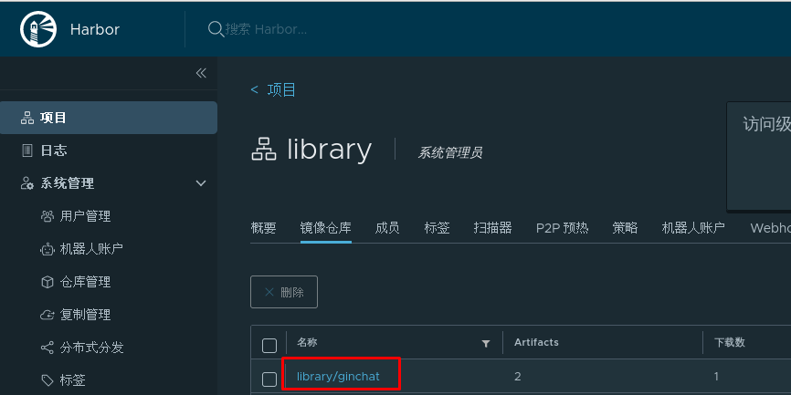
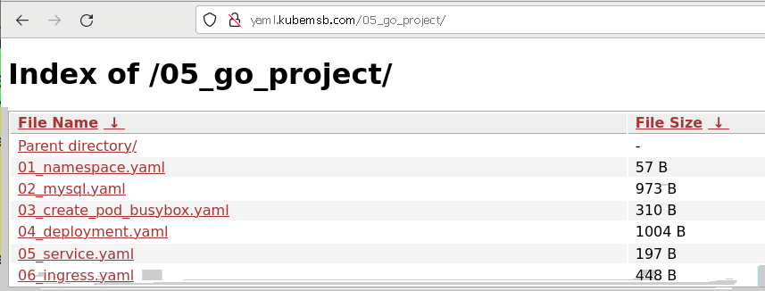
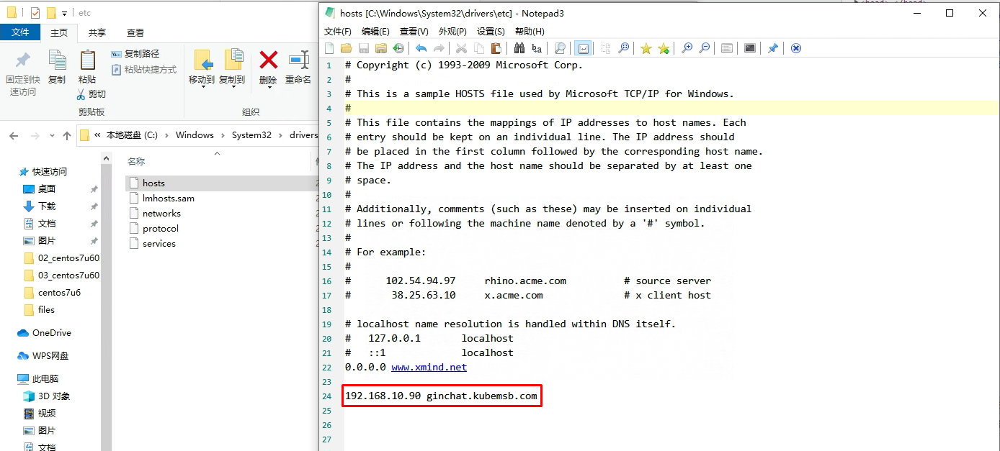
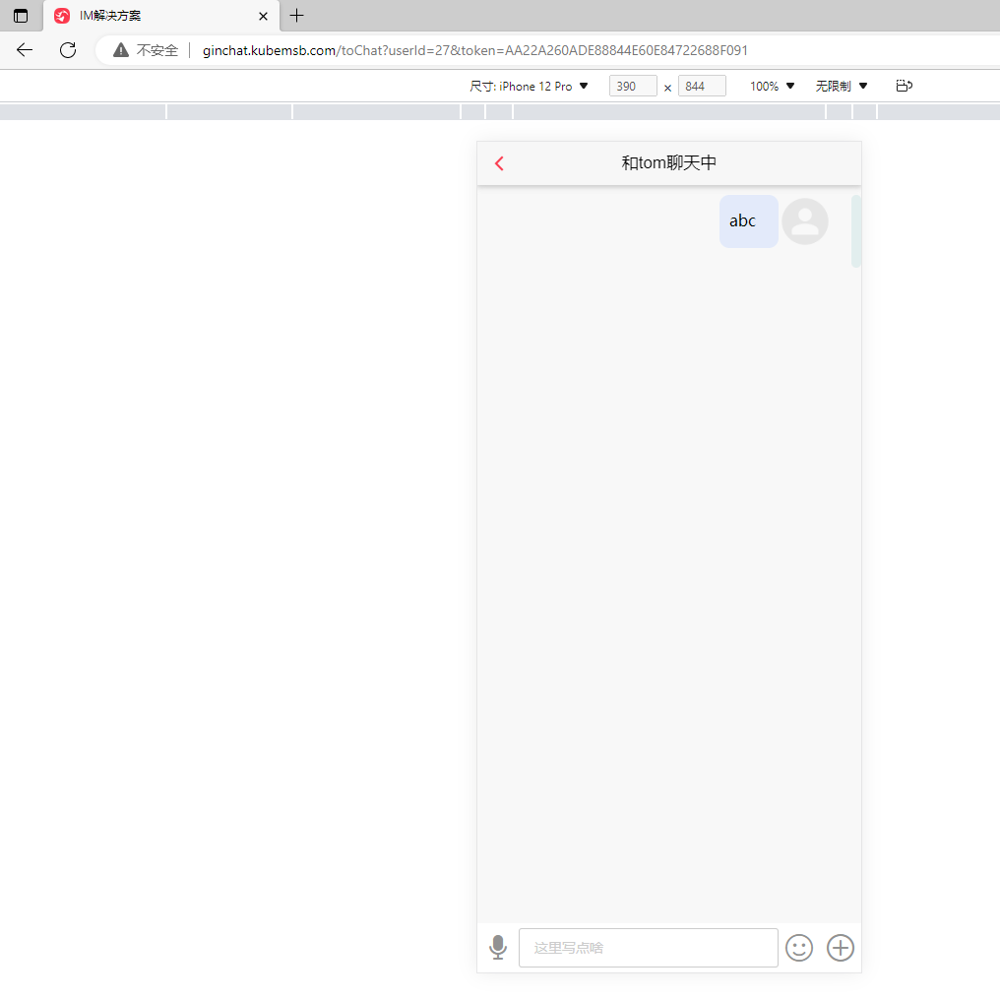
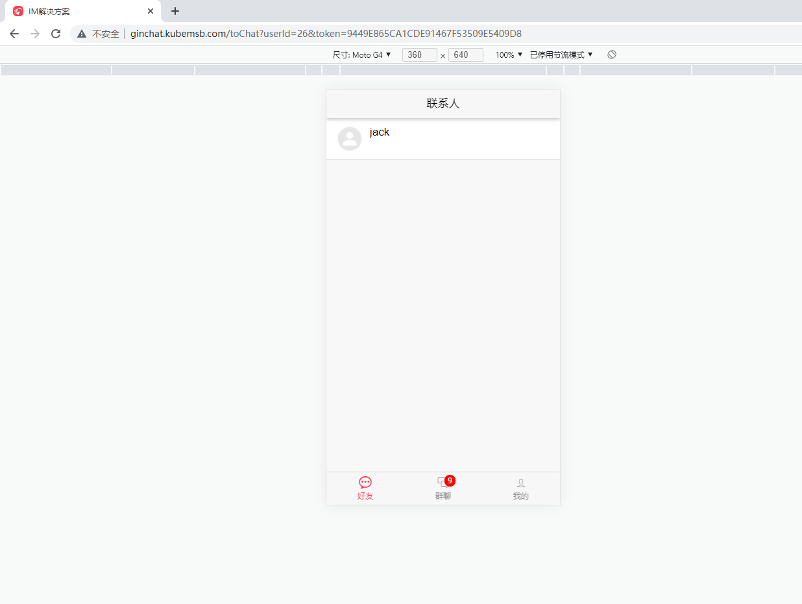

# Kubernetes集群golang项目上云部署

# 一、项目情况

本次上线部署的是一个基于Golang开发的百万并发的IM系统，提供平台用户基本聊天及群聊功能等。

# 二、项目源码

~~~powershell
[root@harbor ginchat-v1.0]# ls
asset  config  docs  go.mod  go.sum  index.html  main.go  models  router  service  test  utils  views
~~~

~~~powershell
前端：
index.html
views
asset

go源码：
go.mod
go.sum
main.go等

配置目录：
config/app.yaml
注意修改：mysql数据库地址及redis连接地址
~~~

~~~powershell
项目数据库文件
]# ls sql
init_ginchat.sql
~~~

# 三、项目部署第三方服务

## 3.1 数据库 MySQL

~~~powershell
创建命名空间资源清单文件
[root@nginx 05_go_project]# cat 01_namespace.yaml
apiVersion: v1
kind: Namespace
metadata:
  name: ginchat
~~~

~~~powershell
应用资源清单文件
# kubectl apply -f http://yaml.kubemsb.com/04_python_project/01_namespace.yaml
~~~

~~~powershell
创建部署MySQL数据库管理系统资源清单文件

[root@nginx 05_go_project]# cat 02_mysql.yaml
apiVersion: v1
kind: Service
metadata:
  name: ginchatmysql
  namespace: ginchat
spec:
  ports:
  - port: 3306
    name: mysql
  clusterIP: None
  selector:
    app: mysqlginchat

---

apiVersion: apps/v1
kind: StatefulSet
metadata:
  name: ginchatdb
  namespace: ginchat
spec:
  selector:
    matchLabels:
      app: mysqlginchat
  serviceName: "ginchatmysql"
  template:
    metadata:
      labels:
        app: mysqlginchat
    spec:
      containers:
      - name: mysql
        image: mysql:5.7
        env:
        - name: MYSQL_ROOT_PASSWORD
          value: "123456"
        - name: MYSQL_DATABASE
          value: ginchat
        ports:
        - containerPort: 3306
        volumeMounts:
        - mountPath: "/var/lib/mysql"
          name: mysql-ginchat

  volumeClaimTemplates:
  - metadata:
      name: mysql-ginchat
    spec:
      accessModes: ["ReadWriteMany"]
      storageClassName: "nfs-client"
      resources:
        requests:
          storage: 1Gi
~~~

~~~powershell
应用资源清单文件
# kubectl apply -f http://yaml.kubemsb.com/04_python_project/02_mysql.yaml
~~~

~~~powershell
查看数据库对应的pod
# kubectl get pods -n ginchat
NAME                       READY   STATUS    RESTARTS   AGE
ginchatdb-0                1/1     Running   0          9m
~~~

~~~powershell
导入项目数据
# kubectl exec -it ginchatdb-0 -n ginchat -- mysql -uroot -p123456 ginchat < init_ginchat.sql
~~~

~~~powershell
检查持久存储
# ls ginchat-mysql-ginchat-ginchatdb-0-pvc-6a01f107-e29a-462a-a24a-64aeb59f6432/
auto.cnf    ca.pem           client-key.pem  ib_buffer_pool  ib_logfile0  ibtmp1  performance_schema  public_key.pem   server-key.pem
ca-key.pem  client-cert.pem  ginchat         ibdata1         ib_logfile1  mysql   private_key.pem     server-cert.pem  sys
~~~

## 3.2 Redis

~~~powershell
# mkdir -p /opt/redis/conf
~~~

~~~powershell
# touch /opt/redis/conf/redis.conf
~~~

~~~powershell
# docker run -p 6379:6379 --name ginchatredis -v /opt/redis/data:/data -v /opt/redis/conf:/etc/redis -d redis redis-server /etc/redis/redis.conf
~~~

# 四、源码编译

## 4.1 项目源码

~~~powershell
# ls
asset  config  docs  go.mod  go.sum  index.html  main.go  models  router  service  test  utils  views
~~~

## 4.2 源码编译环境准备

~~~powershell
# wget https://storage.googleapis.com/golang/getgo/installer_linux
# chmod +x installer_linux
# ./installer_linux
# source /root/.bash_profile

~~~

~~~powershell
# go version
go version go1.18.3 linux/amd64
~~~

## 4.3 源码编译

~~~powershell
[root@harbor ginchat-v1.0]# mkdir bin
~~~

~~~powershell
[root@harbor ginchat-v1.0]# ls
asset  bin  config  docs  go.mod  go.sum  index.html  main.go  models  router  service  test  utils  views
~~~

~~~powershell
[root@harbor ginchat-v1.0]# go get && go build -o bin/ginchatd
~~~

~~~powershell
[root@harbor ginchat-v1.0]# ls bin
ginchatd
~~~

# 五、项目容器镜像制作

## 5.1 查看制品文件

> 把源码生成的制品文件及前端文件复制到一个新的目录中，内容如下：

~~~powershell
[root@harbor ~]## ls ginchat-v1.0/
asset  config  ginchatd  index.html  views
~~~

## 5.2 修改配置文件

~~~powershell
[root@harbor ~]# vim ginchat-v1.0/config/app.yml

mysql:
  dns: root:123456@tcp(ginchatdb-0.ginchatmysql.ginchat.svc.cluster.local:3306)/ginchat?charset=utf8mb4&parseTime=True&loc=Local
redis:
  addr: "192.168.10.213:6379"
  password: ""
  DB: 0
  poolSize: 30
  minIdleConn: 30
oos:
  Endpoint: "oss-cn-hangzhou.aliyuncs.com"
  AccessKeyId: "LTAI5tNCXPJwS3MstKoKgixh"
  AccessKeySecret: "YhHE8OyCMsqfjwOnxQ1oO7paYlDjVH"
  Bucket : "ginchat"

timeout:
  DelayHeartbeat: 3   #延迟心跳时间  单位秒
  HeartbeatHz: 30   #每隔多少秒心跳时间
  HeartbeatMaxTime: 30000  #最大心跳时间  ，超过此就下线
  RedisOnlineTime: 4  #缓存的在线用户时长   单位H

~~~

## 5.3 把制品文件打包

~~~powershell
[root@harbor ~]# tar cvzf ginchat.tgz ginchat-v1.0
~~~

## 5.4 制作容器镜像

~~~powershell
[root@harbor ~]# mkdir goginchatproject
~~~

~~~powershell
[root@harbor goginchatproject]# vim Dockerfile

FROM centos:centos7

ADD ./ginchat.tgz /

WORKDIR /ginchat-v1.0

RUN chmod +x /ginchat-v1.0/ginchatd

EXPOSE  8081

CMD /ginchat-v1.0/ginchatd
~~~

~~~powershell
[root@harbor ~]# ls goginchatproject/
Dockerfile  ginchat.tgz
~~~

~~~powershell
[root@harbor goginchatproject]# docker build -t www.kubemsb.com/library/ginchat:v1 .
~~~

~~~powershell
[root@harbor goginchatproject]# docker push www.kubemsb.com/library/ginchat:v1
~~~

# 六、项目部署资源清单文件编写

## 6.1 deployment资源清单文件

~~~powershell
[root@nginx 05_go_project]# cat 04_deployment.yaml
apiVersion: apps/v1
kind: Deployment
metadata:
  name: ginchat
  namespace: ginchat
spec:
  replicas: 1
  selector:
    matchLabels:
      project: ginchat
      app: ginchat-demo
  template:
    metadata:
      labels:
        project: ginchat
        app: ginchat-demo
    spec:
      imagePullSecrets:
      - name: harborreg #认证信息
      containers:
      - name: ginchat
        image: www.kubemsb.com/library/ginchat:v2 #镜像
        imagePullPolicy: Always
        ports:
        - containerPort: 8081
          name: web
          protocol: TCP
        resources:
          requests:
            cpu: 0.5
            memory: 1Gi
          limits:
            cpu: 1
            memory: 2Gi
        livenessProbe:
          httpGet:
            path: /
            port: 8081
          initialDelaySeconds: 30
          timeoutSeconds: 20
        readinessProbe:
          httpGet:
            path: /
            port: 8081
          initialDelaySeconds: 30
          timeoutSeconds: 20
~~~

## 6.2 service资源清单文件

~~~powershell
[root@nginx 05_go_project]# cat 05_service.yaml
apiVersion: v1
kind: Service
metadata:
  name: ginchatsvc
  namespace: ginchat
spec:
  selector:
    project: ginchat
    app: ginchat-demo
  ports:
  - name: web
    port: 80
    targetPort: 8081
~~~

## 6.3 ingress对象资源清单文件

~~~powershell
[root@nginx 05_go_project]# cat 06_ingress.yaml
apiVersion: networking.k8s.io/v1
kind: Ingress
metadata:
  name: ginchatingress
  namespace: ginchat
  annotations:
    ingressclass.kubernetes.io/is-default-class: "true"
    kubernetes.io/ingress.class: nginx
spec:
  rules:
    - host: ginchat.kubemsb.com
      http:
        paths:
        - pathType: Prefix
          path: /
          backend:
            service:
              name: ginchatsvc
              port:
                number: 80
~~~

# 七、项目部署

~~~powershell
[root@master01 ~]# kubectl apply -f  http://yaml.kubemsb.com/05_go_project/04_deployment.yaml
~~~

~~~powershell
[root@master01 ~]# kubectl apply -f http://yaml.kubemsb.com/05_go_project/05_service.yaml
~~~

~~~powershell
[root@master01 ~]# kubectl apply -f http://yaml.kubemsb.com/05_go_project/06_ingress.yaml
~~~

# 八、项目访问

~~~powershell
[root@master01 ~]# kubectl get pods -n ginchat
NAME                       READY   STATUS    RESTARTS   AGE
ginchat-5558d849c5-cq9qq   1/1     Running   0          15m
ginchatdb-0                1/1     Running   0          10m
~~~

