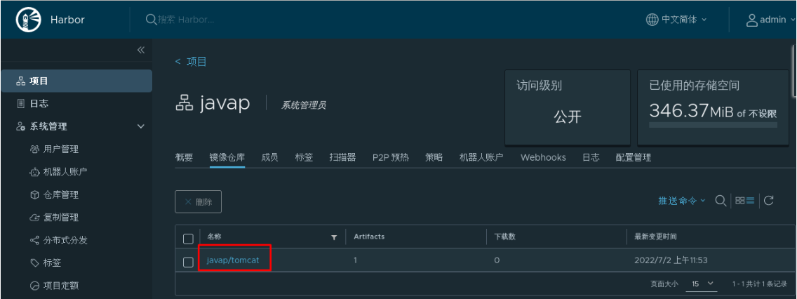
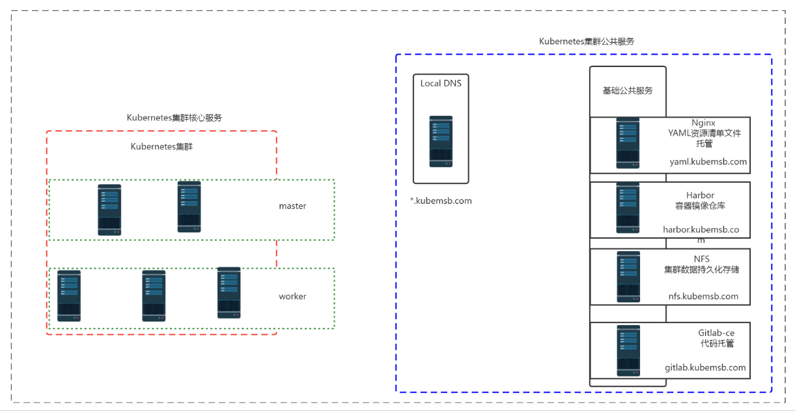
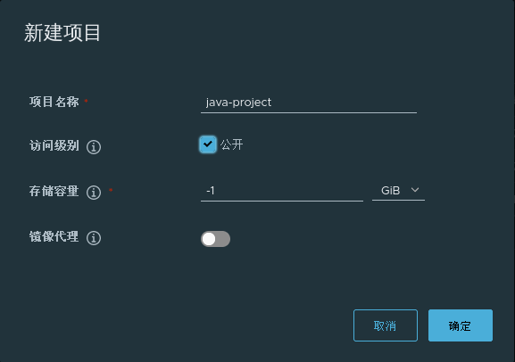
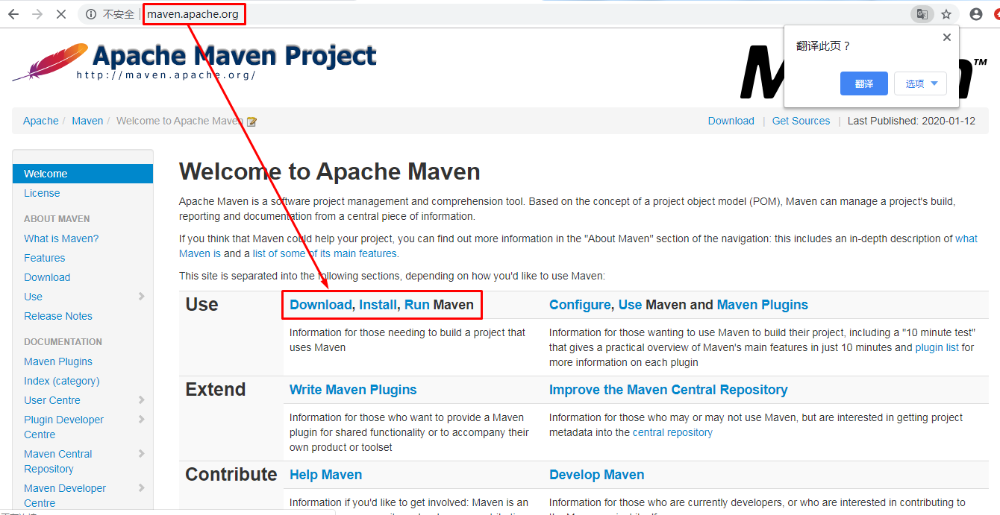
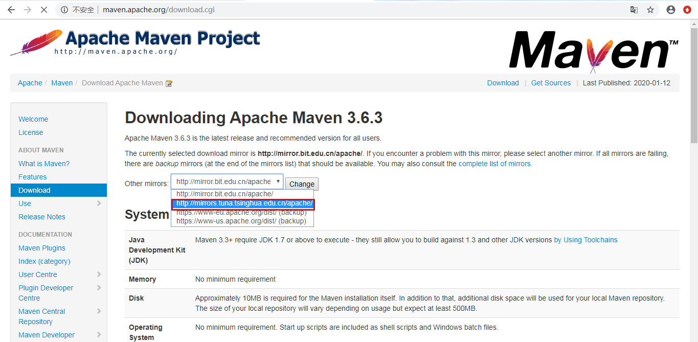
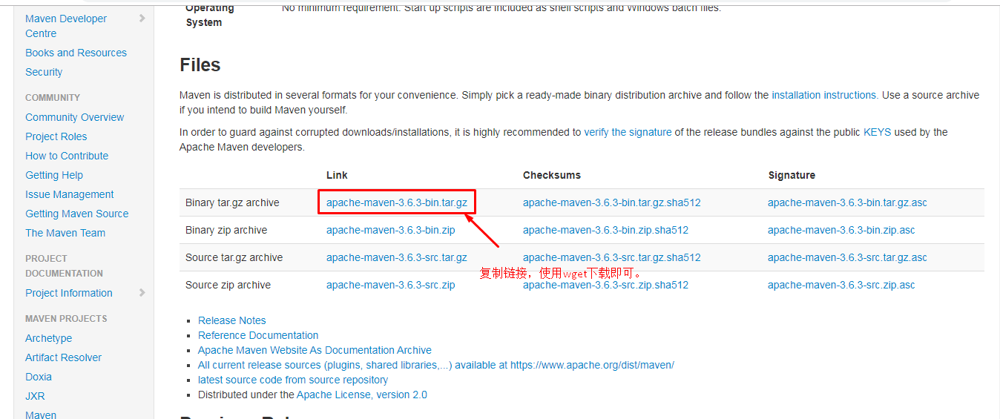
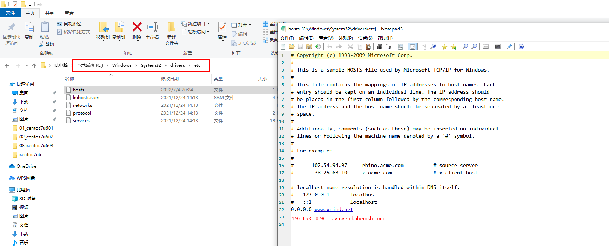

# kubernetes集群java项目上云部署

# 一、部署前准备工作

## 1.1 部署项目情况

### 1.1.1 业务部署架构

- 单体服务架构
- 分布式服务架构
- 微服务架构
- 超微服务架构

### 1.1.2 项目涉及第三方服务

- 关系型数据库系统 MySQL
- 缓存服务 Redis memcache
- 协调服务 zookeeper
- 消息中间件服务 kafka rabbitmq
- 服务注册 服务发现 nacos

### 1.1.3 项目所需要的资源

- 计算资源
  - cpu
  - 内存
- 存储资源
  - 本地存储
  - 网络存储

## 1.2 部署项目所需要的k8s资源

### 1.2.1 多k8s集群资源

- 测试环境
- 开发环境
- 预发布环境
- 生产环境

### 1.2.2 使用namespace隔离项目或环境

- 每项目独立使用namespace
- 每环境独立使用namespace

### 1.2.3 有状态应用部署

> 部署时考虑哪些系统使用有状态应用部署方式

- statefulset
- 数据持久化存储动态供给（pv及pvc）
- 例如：mysql

### 1.2.4 无状态应用部署

- deployment
- 数据持久化存储动态供给
- 例如：tomcat

### 1.2.5 暴露外部访问

- service类型 
  - 有状态应用部署使用headless service
  - 无状态应用部署使用ClusterIP
- 暴露服务方式
  - ingress
  - api gateway

### 1.2.6 密钥及配置管理

- configmap
  - mysql配置文件
- secret
  - k8s集群使用harbor私有项目仓库镜像

## 1.3 项目基础镜像准备

> 本次发布一个java项目，以war包方式发布，需要使用tomcat做为项目基础镜像。可直接下载使用，也可选择定制。

### 1.3.1  定制tomcat镜像

#### 1.3.1.1 直接下载

~~~powershell
直接下载
[root@harborserver ~]# docker pull tomcat
~~~

#### 1.3.1.2 通过Dockerfile文件定制

~~~powershell
[root@harborserver ~]# mkdir tomcatdockerfile
[root@harborserver ~]# cd tomcatdockerfile/
[root@harborserver tomcatdockerfile]# cat Dockerfile
FROM centos:centos7
MAINTAINER "admin<admin@kubemsb.com>"

ENV VERSION=8.5.81
ENV JAVA_HOME=/usr/local/jdk

RUN yum -y install wget

RUN wget https://dlcdn.apache.org/tomcat/tomcat-8/v${VERSION}/bin/apache-tomcat-${VERSION}.tar.gz --no-check-certificate

RUN tar xf apache-tomcat-${VERSION}.tar.gz

RUN mv apache-tomcat-${VERSION} /usr/local/tomcat

RUN rm -rf apache-tomcat-${VERSION}.tar.gz /usr/local/tomcat/webapps/*

RUN mkdir /usr/local/tomcat/webapps/ROOT

ADD ./jdk /usr/local/jdk

RUN echo "export TOMCAT_HOME=/usr/local/tomcat" >> /etc/profile

RUN echo "export JAVA_HOME=/usr/local/jdk" >> /etc/profile

RUN echo "export PATH=$TOMCAT_HOME/bin:$JAVA_HOME/bin:$PATH" >> /etc/profile

RUN echo "export CLASSPATH=.:$JAVA_HOME/lib/dt.jar:$JAVA_HOME/lib/tools.jar" >> /etc/profile

RUN source /etc/profile

EXPOSE 8080

CMD ["/usr/local/tomcat/bin/catalina.sh","run"]
~~~

~~~powershell
[root@harborserver tomcatdockerfile]# ll
总用量 4
-rw-r--r-- 1 root root 865 1月  15 16:44 Dockerfile
drwxr-xr-x 7   10  143 245 10月  6 2018 jdk
~~~

~~~powershell
[root@harborserver tomcatdockerfile]# docker build -t www.kubemsb.com/java-project/tomcat:8581 .

......
Successfully built db4db20a6c85
Successfully tagged www.kubemsb.com/java-project/tomcat:8581
~~~

~~~powershell
[root@harborserver ~]# docker images
REPOSITORY                           TAG        IMAGE ID       CREATED          SIZE
www.kubemsb.com/javap/tomcat         8581       db4db20a6c85   11 minutes ago   817MB
~~~

~~~powershell
[root@harborserver ~]# docker login www.kubemsb.com
Username: admin
Password: 12345
WARNING! Your password will be stored unencrypted in /root/.docker/config.json.
Configure a credential helper to remove this warning. See
https://docs.docker.com/engine/reference/commandline/login/#credentials-store

Login Succeeded

[root@harborserver ~]# docker push www.kubemsb.com/java-project/tomcat:8581
~~~

### 1.3.2 在harbor验证tomcat镜像是否上传

## 1.4 项目编排部署

### 1.4.1 项目资源

- JAVA项目源码
- JAVA项目容器镜像
- JAVA项目资源清单文件
- 数据库系统 MySQL

### 1.4.2 项目镜像构建方法

- 手动构建容器镜像（Dockerfile）
- 自动构建容器镜像（jenkins ci/cd）

## 1.5 项目部署工作流程

-  基于项目源码制作容器镜像
- 编写项目部署资源清单文件
- 使用资源清单文件创建项目 Service
- 使用ingress暴露服务实现项目对外可访问

## 1.6 项目部署基础环境架构

# 二、存储准备

> 本次使用NFS服务做为K8S集群后端存储，实现kubernetes集群持久存储动态供给，详细可见kubernetes集群公共服务章节。

~~~powershell
[root@master01 ~]# kubectl get storageclass
NAME         PROVISIONER                                   RECLAIMPOLICY   VOLUMEBINDINGMODE   ALLOWVOLUMEEXPANSION   AGE
nfs-client   k8s-sigs.io/nfs-subdir-external-provisioner   Delete          Immediate           false                  10s
~~~

# 三、项目容器镜像仓库及项目源码准备

## 3.1 项目容器容器仓库准备

### 3.1.1 Harbor部署

> 参考kubernetes集群公共服务中容器镜像托管仓库章节

### 3.1.2 Harbor添加项目容器镜像仓库

## 3.2 项目源码及编译环境准备

### 3.2.1 项目源码准备

~~~powershell
[root@harbor ~]# ls
anaconda-ks.cfg  initial-setup-ks.cfg  javaproject  公共  模板  视频  图片  文档  下载  音乐  桌面
[root@harbor ~]# cd javaproject/
[root@harbor javaproject]# ls
project-source  tomcatdockerfile
[root@harbor javaproject]# ls project-source/
db  pro-source
[root@harbor javaproject]# ls project-source/db
test.sql
[root@harbor javaproject]# ls project-source/pro-source/
java-project
[root@harbor javaproject]# ls project-source/pro-source/java-project/
Dockerfile   LICENSE  pom.xml  README.md  src  
[root@harbor javaproject]# ls project-source/pro-source/java-project/src
main 源码目录
~~~

~~~powershell
[root@harbor java-project]# cat Dockerfile
FROM www.kubemsb.com/java-project/tomcat:8581
LABEL maintainer "admin <admin@kubemsb.com>"
RUN rm -rf /usr/local/tomcat/webapps/*
ADD target/*.war /usr/local/tomcat/webapps/ROOT.war
~~~

~~~powershell
[root@harbor java-project]# cat README.md
> ### SQL文件: db/test.sql
> ### 数据库配置：src/main/resources/application.yml
~~~

~~~powershell
[root@harbor java-project]# cat src/main/resources/application.yml
server:
  port: 8080
spring:
  datasource:
    url: jdbc:mysql://db-0.mysql.javaproject:3306/test?characterEncoding=utf-8
    username: root
    password: 123456
    driver-class-name: com.mysql.jdbc.Driver
  freemarker:
    allow-request-override: false
    cache: true
    check-template-location: true
    charset: UTF-8
    content-type: text/html; charset=utf-8
    expose-request-attributes: false
    expose-session-attributes: false
    expose-spring-macro-helpers: false
    suffix: .ftl
    template-loader-path:
      - classpath:/templates/
~~~

### 3.2.2 项目编译环境准备 jdk & maven

> 用于对java项目代码进行编译打包代码

#### 3.2.2.1 下载maven

~~~powershell
[root@harborserver ~]# wget http://mirrors.tuna.tsinghua.edu.cn/apache/maven/maven-3/3.6.3/binaries/apache-maven-3.6.3-bin.tar.gz
~~~

#### 3.2.2.2  安装maven

~~~powershell
必须要有官方的jdk，不然maven会报错
[root@harborserver ~]# ls
jdk-8u191-linux-x64.tar.gz 

[root@harborserver ~]# tar xf jdk-8u191-linux-x64.tar.gz
[root@harborserver ~]# ls

jdk1.8.0_191  

[root@harborserver ~]# mv jdk1.8.0_191 /usr/local/jdk
[root@harborserver ~]# ls /usr/local/jdk
bin             lib          src.zip
COPYRIGHT       LICENSE      THIRDPARTYLICENSEREADME-JAVAFX.txt
include         man          THIRDPARTYLICENSEREADME.txt
javafx-src.zip  README.html
jre             release

[root@harborserver ~]# ls
apache-maven-3.6.3-bin.tar.gz        

[root@harborserver ~]# tar xf apache-maven-3.6.3-bin.tar.gz
[root@harborserver ~]# ls

apache-maven-3.6.3               

[root@harborserver ~]# mv apache-maven-3.6.3 /usr/local/maven

[root@harborserver ~]# ls /usr/local/maven/
bin  boot  conf  lib  LICENSE  NOTICE  README.txt

[root@harborserver ~]# cat /etc/profile.d/maven.sh
export JAVA_HOME=/usr/local/jdk
export MAVEN_HOME=/usr/local/maven
export PATH=${MAVEN_HOME}/bin:${JAVA_HOME}/bin:$PATH

[root@harborserver ~]# source /etc/profile

[root@harborserver ~]# mvn -v
Apache Maven 3.6.3 (cecedd343002696d0abb50b32b541b8a6ba2883f)
Maven home: /usr/local/maven
Java version: 1.8.0_191, vendor: Oracle Corporation, runtime: /usr/local/jdk/jre
Default locale: zh_CN, platform encoding: UTF-8
OS name: "linux", version: "3.10.0-1062.9.1.el7.x86_64", arch: "amd64", family: "unix"
~~~

# 四、项目部署

## 4.1  本项目部署思路

### 4.1.1 本次部署的应用

- 数据库 MySQL
- Web应用 Tomcat

### 4.1.2 有状态应用与无状态应用部署规划

- mysql
  - statefulset控制器
  - headless service
  - pv,pvc 存储资源动态供给

- tomcat（java应用）
  - deployment控制器
  - ClusterIP Service
  - Ingress 服务暴露实现集群外访问

## 4.2 项目资源清单文件准备

### 4.2.1 项目文件总览

~~~powershell
[root@harbor java-project]# pwd
/root/javaproject/project-source/pro-source/java-project
[root@harbor java-project]# ls
Dockerfile  LICENSE  pom.xml  README.md  src
~~~

~~~powershell
[root@nginx 03_java_project]# ls
01_ns.yaml  02_deployment.yaml  03_service.yaml  04_ingress.yaml  05_mysql.yaml  06_create_pod_busybox.yaml
~~~

### 4.2.2   资源清单文件准备

#### 4.2.2.1 namespace资源清单文件

> 用于实现项目隔离

~~~powershell
# cat 01_ns.yaml
apiVersion: v1
kind: Namespace
metadata:
  name: javaproject
~~~

#### 4.2.2.2 部署java项目资源清单文件

> 用于部署java项目

~~~powershell
# cat 02_deployment.yaml
apiVersion: apps/v1
kind: Deployment
metadata:
  name: java-project
  namespace: javaproject
spec:
  replicas: 2
  selector:
    matchLabels:
      project: www
      app: java-demo
  template:
    metadata:
      labels:
        project: www
        app: java-demo
    spec:
      imagePullSecrets:
      - name: harborreg #认证信息
      containers:
      - name: tomcat
        image: www.kubemsb.com/java-project/java-project:v1 #镜像
        imagePullPolicy: Always
        ports:
        - containerPort: 8080
          name: web
          protocol: TCP
        resources:
          requests:
            cpu: 0.5
            memory: 1Gi
          limits:
            cpu: 1
            memory: 2Gi
        livenessProbe:
          httpGet:
            path: /
            port: 8080
          initialDelaySeconds: 60
          timeoutSeconds: 20
        readinessProbe:
          httpGet:
            path: /
            port: 8080
          initialDelaySeconds: 60
          timeoutSeconds: 20
~~~

#### 4.2.2.3 项目服务（service）资源清单文件

> 用于创建service

~~~powershell
# cat 03_service.yaml
apiVersion: v1
kind: Service
metadata:
  name: java-project
  namespace: javaproject
spec:
  selector:
    project: www
    app: java-demo
  ports:
  - name: web
    port: 80
    targetPort: 8080
~~~

#### 4.2.2.4 Ingress对象资源清单文件

>  需要提前部署 ingress控制器

~~~powershell
# cat 04_ingress.yaml
apiVersion: networking.k8s.io/v1
kind: Ingress
metadata:
  name: java-project
  namespace: javaproject
  annotations:
    ingressclass.kubernetes.io/is-default-class: "true"
    kubernetes.io/ingress.class: nginx
spec:
  rules:
    - host: javaweb.kubemsb.com
      http:
        paths:
        - pathType: Prefix
          path: /
          backend:
            service:
              name: java-project
              port:
                number: 80
~~~

#### 4.2.2.5 mysql部署资源清单文件

~~~powershell
# cat 05_mysql.yaml
apiVersion: v1
kind: Service
metadata:
  name: mysql
  namespace: javaproject
spec:
  ports:
  - port: 3306
    name: mysql
  clusterIP: None
  selector:
    app: mysql-public

---

apiVersion: apps/v1
kind: StatefulSet
metadata:
  name: db
  namespace: javaproject
spec:
  selector:
    matchLabels:
      app: mysql-public
  serviceName: "mysql"
  template:
    metadata:
      labels:
        app: mysql-public
    spec:
      containers:
      - name: mysql
        image: mysql:5.7
        env:
        - name: MYSQL_ROOT_PASSWORD
          value: "123456"
        - name: MYSQL_DATABASE
          value: test
        ports:
        - containerPort: 3306
        volumeMounts:
        - mountPath: "/var/lib/mysql"
          name: mysql-data
  volumeClaimTemplates:
  - metadata:
      name: mysql-data
    spec:
      accessModes: ["ReadWriteMany"]
      storageClassName: "nfs-client"
      resources:
        requests:
          storage: 5Gi
~~~

#### 4.2.2.6 mysql访问测试pod

~~~powershell
# cat 06_create_pod_busybox.yaml
apiVersion: v1
kind: Pod
metadata:
  name: busybox-pod
spec:
  containers:
  - name: busybox-container
    image: busybox:1.28.4  #此镜像nslookup及ping命令都没有问题，不要下载最新版本和1.31。
    imagePullPolicy: IfNotPresent
    command:
    - sleep
    - "3600"
  restartPolicy: Always
~~~

## 4.3 项目数据库 Mysql部署

### 4.3.1    创建命名空间

~~~powershell
# kubectl apply -f http://yaml.kubemsb.com/03_java_project/01_ns.yaml
~~~

~~~powershell
[root@master01 ~]# kubectl get ns
NAME               STATUS   AGE
calico-apiserver   Active   7d15h
calico-system      Active   7d16h
default            Active   12d
ingress-nginx      Active   2d22h
javaproject        Active   6s
kube-node-lease    Active   12d
kube-public        Active   12d
kube-system        Active   12d
metallb-system     Active   2d22h
tigera-operator    Active   7d16h
~~~

### 4.3.2 部署数据库

~~~powershell
# kubectl apply -f http://yaml.kubemsb.com/03_java_project/05_mysql.yaml
~~~

~~~powershell
[root@master01 ~]# kubectl get all -n javaproject
NAME       READY   STATUS    RESTARTS   AGE
pod/db-0   1/1     Running   0          19s

NAME            TYPE        CLUSTER-IP   EXTERNAL-IP   PORT(S)    AGE
service/mysql   ClusterIP   None         <none>        3306/TCP   19s

NAME                  READY   AGE
statefulset.apps/db   1/1     19s
~~~

~~~powershell
[root@nfs ~]# ls /sdb/
javaproject-mysql-data-db-0-pvc-9f616f77-9995-4f11-ad57-833038186777

[root@nfs ~]# ls /sdb/javaproject-mysql-data-db-0-pvc-9f616f77-9995-4f11-ad57-833038186777/
auto.cnf    ca.pem           client-key.pem  ibdata1      ib_logfile1  mysql               private_key.pem  server-cert.pem  sys
ca-key.pem  client-cert.pem  ib_buffer_pool  ib_logfile0  ibtmp1       performance_schema  public_key.pem   server-key.pem   test
~~~

### 4.3.3 导入数据库 

~~~powershell
[root@harbor project-source]# scp db/test.sql 192.168.10.11:/root
~~~

~~~powershell
[root@master01 ~]# kubectl get pods -n javaproject
NAME   READY   STATUS    RESTARTS   AGE
db-0   1/1     Running   0          15m
[root@master01 ~]# kubectl cp test.sql db-0:/ -n javaproject
[root@master01 ~]# kubectl exec -it db-0 -n javaproject -- bash
root@db-0:/# ls
bin   dev                         entrypoint.sh  home  lib64  mnt  proc  run   srv  test.sql  usr
boot  docker-entrypoint-initdb.d  etc            lib   media  opt  root  sbin  sys  tmp       var
root@db-0:/# mysql -uroot -p123456
mysql: [Warning] Using a password on the command line interface can be insecure.
Welcome to the MySQL monitor.  Commands end with ; or \g.
Your MySQL connection id is 2
Server version: 5.7.38 MySQL Community Server (GPL)

Copyright (c) 2000, 2022, Oracle and/or its affiliates.

Oracle is a registered trademark of Oracle Corporation and/or its
affiliates. Other names may be trademarks of their respective
owners.

Type 'help;' or '\h' for help. Type '\c' to clear the current input statement.

mysql> use test;
Database changed
mysql> source /test.sql;
Query OK, 0 rows affected (0.00 sec)

Query OK, 0 rows affected, 1 warning (0.01 sec)

Query OK, 0 rows affected (0.02 sec)

mysql> show tables;
+----------------+
| Tables_in_test |
+----------------+
| user           |
+----------------+
1 row in set (0.00 sec)

mysql> desc user;
+-------+-------------+------+-----+---------+----------------+
| Field | Type        | Null | Key | Default | Extra          |
+-------+-------------+------+-----+---------+----------------+
| id    | bigint(20)  | NO   | PRI | NULL    | auto_increment |
| name  | varchar(30) | NO   |     | NULL    |                |
| age   | int(11)     | YES  |     | 0       |                |
| sex   | char(1)     | YES  |     | 0       |                |
+-------+-------------+------+-----+---------+----------------+
4 rows in set (0.02 sec)
~~~

### 4.3.4  验证数据库可用性

~~~powershell
# kubectl apply -f http://yaml.kubemsb.com/03_java_project/06_create_pod_busybox.yaml
~~~

~~~powershell
[root@master01 ~]# kubectl get pods
NAME                                      READY   STATUS    RESTARTS   AGE
busybox-pod                               1/1     Running   0          4s
nfs-client-provisioner-6446865dff-pqtfj   1/1     Running   1          5d22h
[root@master01 ~]# kubectl exec -it busybox-pod -- sh
/ # nslookup db-0.mysql.javaproject
Server:    10.96.0.10
Address 1: 10.96.0.10 kube-dns.kube-system.svc.cluster.local

Name:      db-0.mysql.javaproject
Address 1: 10.224.30.77 db-0.mysql.javaproject.svc.cluster.local
/ # nslookup db-0.mysql.javaproject.svc.cluster.local.
Server:    10.96.0.10
Address 1: 10.96.0.10 kube-dns.kube-system.svc.cluster.local

Name:      db-0.mysql.javaproject.svc.cluster.local.
Address 1: 10.224.30.77 db-0.mysql.javaproject.svc.cluster.local
~~~

## 4.4 项目源码编译打包

### 4.4.1 修改项目连接数据库地址

~~~powershell
[root@harbor java-project]# pwd
/root/javaproject/project-source/pro-source/java-project
[root@harbor java-project]# ls
Dockerfile  LICENSE  pom.xml  README.md  src
[root@harbor java-project]# cd src/
[root@harbor src]# ls
main
[root@harbor src]# cd main/
[root@harbor main]# ls
java  resources
[root@harbor main]# cd resources/
[root@harbor resources]# ls
application.yml  log4j.properties  static  templates
[root@harbor resources]# vim application.yml
[root@harbor resources]# cat application.yml
server:
  port: 8080
spring:
  datasource:
    url: jdbc:mysql://db-0.mysql.javaproject:3306/test?characterEncoding=utf-8
    username: root
    password: 123456
    driver-class-name: com.mysql.jdbc.Driver
  freemarker:
    allow-request-override: false
    cache: true
    check-template-location: true
    charset: UTF-8
    content-type: text/html; charset=utf-8
    expose-request-attributes: false
    expose-session-attributes: false
    expose-spring-macro-helpers: false
    suffix: .ftl
    template-loader-path:
      - classpath:/templates/
~~~

### 4.4.2 使用maven编译项目源码

~~~powershell
[root@harbor java-project]# pwd
/root/javaproject/project-source/pro-source/java-project
[root@harbor java-project]# mvn clean package
[INFO] Scanning for projects...
[INFO]
[INFO] ---------------------< com.kubemsb:kubemsb-tomcat >---------------------
[INFO] Building kubemsb-tomcat 0.0.1-Test
[INFO] --------------------------------[ war ]---------------------------------
[INFO]
[INFO] --- maven-clean-plugin:3.0.0:clean (default-clean) @ kubemsb-tomcat ---
[INFO]
[INFO] --- maven-resources-plugin:3.0.1:resources (default-resources) @ kubemsb-tomcat ---
[INFO] Using 'UTF-8' encoding to copy filtered resources.
[INFO] Copying 1 resource
[INFO] Copying 136 resources
[INFO]
[INFO] --- maven-compiler-plugin:3.7.0:compile (default-compile) @ kubemsb-tomcat ---
[INFO] Changes detected - recompiling the module!
[INFO] Compiling 7 source files to /root/javaproject/project-source/pro-source/java-project/target/classes
[INFO]
[INFO] --- maven-resources-plugin:3.0.1:testResources (default-testResources) @ kubemsb-tomcat ---
[INFO] Using 'UTF-8' encoding to copy filtered resources.
[INFO] skip non existing resourceDirectory /root/javaproject/project-source/pro-source/java-project/src/test/resources
[INFO]
[INFO] --- maven-compiler-plugin:3.7.0:testCompile (default-testCompile) @ kubemsb-tomcat ---
[INFO] No sources to compile
[INFO]
[INFO] --- maven-surefire-plugin:2.21.0:test (default-test) @ kubemsb-tomcat ---
[INFO] No tests to run.
[INFO]
[INFO] --- maven-war-plugin:3.1.0:war (default-war) @ kubemsb-tomcat ---
[INFO] Packaging webapp
[INFO] Assembling webapp [kubemsb-tomcat] in [/root/javaproject/project-source/pro-source/java-project/target/kubemsb-tomcat-0.0.1-Test]
[INFO] Processing war project
[INFO] Webapp assembled in [166 msecs]
[INFO] Building war: /root/javaproject/project-source/pro-source/java-project/target/kubemsb-tomcat-0.0.1-Test.war
[INFO] ------------------------------------------------------------------------
[INFO] BUILD SUCCESS
[INFO] ------------------------------------------------------------------------
[INFO] Total time:  4.594 s
[INFO] Finished at: 2022-07-05T12:02:11+08:00
[INFO] ------------------------------------------------------------------------
~~~

~~~powershell
[root@harbor java-project]# ls
Dockerfile  LICENSE  pom.xml  README.md  src  target
[root@harbor java-project]# ls target/
classes  generated-sources  kubemsb-tomcat-0.0.1-Test  kubemsb-tomcat-0.0.1-Test.war  maven-archiver  maven-status
~~~

## 4.5 生成项目容器镜像制品

~~~powershell
[root@harbor java-project]# pwd
/root/javaproject/project-source/pro-source/java-project
[root@harbor java-project]# ls
Dockerfile  LICENSE  pom.xml  README.md  src  target
[root@harbor java-project]# docker build -t www.kubemsb.com/java-project/java-project:v1 .
Sending build context to Docker daemon  42.44MB
Step 1/4 : FROM www.kubemsb.com/java-project/tomcat:8581
 ---> 7522e6998fbf
Step 2/4 : LABEL maintainer "admin <admin@kubemsb.com>"
 ---> Using cache
 ---> 4e61597e580c
Step 3/4 : RUN rm -rf /usr/local/tomcat/webapps/*
 ---> Using cache
 ---> fda908c158cd
Step 4/4 : ADD target/*.war /usr/local/tomcat/webapps/ROOT.war
 ---> c74ffbdeae67
Successfully built c74ffbdeae67
Successfully tagged www.kubemsb.com/java-project/java-project:v1
~~~

~~~powershell
[root@harbor java-project]# docker login www.kubemsb.com
Authenticating with existing credentials...
WARNING! Your password will be stored unencrypted in /root/.docker/config.json.
Configure a credential helper to remove this warning. See
https://docs.docker.com/engine/reference/commandline/login/#credentials-store

Login Succeeded

~~~

~~~powershell
[root@harbor java-project]# docker push www.kubemsb.com/java-project/java-project:v1
~~~

## 4.6 项目部署

~~~powershell
# kubectl apply -f http://yaml.kubemsb.com/03_java_project/02_deployment.yaml
~~~

~~~powershell
[root@master01 ~]# kubectl get pods -n javaproject
NAME                            READY   STATUS    RESTARTS   AGE
db-0                            1/1     Running   0          38m
java-project-6f74d5b85c-ckq42   0/1     Running   0          43s
java-project-6f74d5b85c-dvvcl   0/1     Running   0          43s
~~~

~~~powershell
# kubectl apply -f http://yaml.kubemsb.com/03_java_project/03_service.yaml
~~~

~~~powershell
[root@master01 ~]# kubectl get svc -n javaproject
NAME           TYPE        CLUSTER-IP      EXTERNAL-IP   PORT(S)    AGE
java-project   ClusterIP   10.106.90.232   <none>        80/TCP     57s
mysql          ClusterIP   None            <none>        3306/TCP   39m
~~~

~~~powershell
# kubectl apply -f http://yaml.kubemsb.com/03_java_project/04_ingress.yaml
~~~

~~~powershell
[root@master01 ~]# kubectl get ingress -n javaproject
NAME           CLASS    HOSTS                 ADDRESS         PORTS   AGE
java-project   <none>   javaweb.kubemsb.com   192.168.10.13   80      73s
~~~

# 五、访问验证

~~~powershell
[root@master01 ~]# kubectl get svc -n ingress-nginx
NAME                                 TYPE           CLUSTER-IP       EXTERNAL-IP     PORT(S)                      AGE
ingress-nginx-controller             LoadBalancer   10.97.68.236     192.168.10.90   80:32567/TCP,443:31146/TCP   2d22h
ingress-nginx-controller-admission   ClusterIP      10.106.171.219   <none>          443/TCP                      2d22h
~~~

