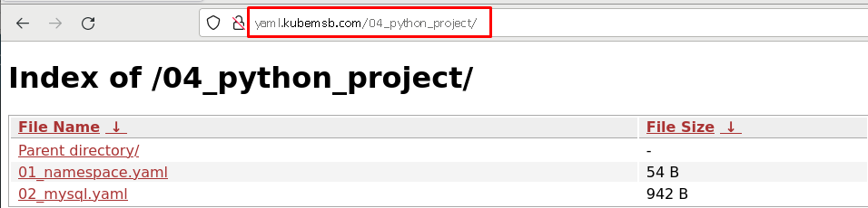
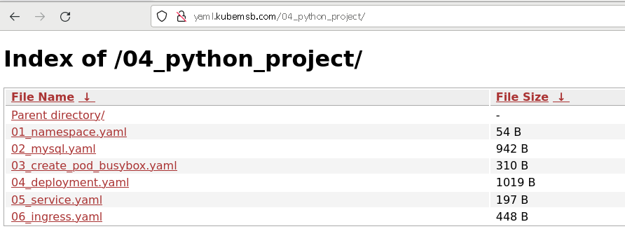
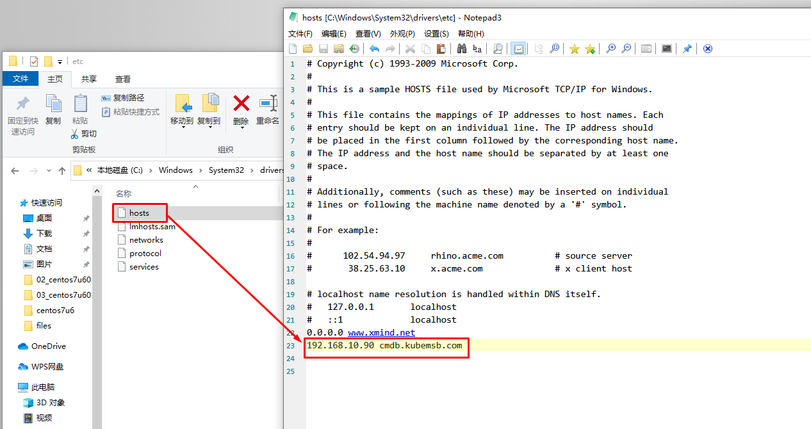
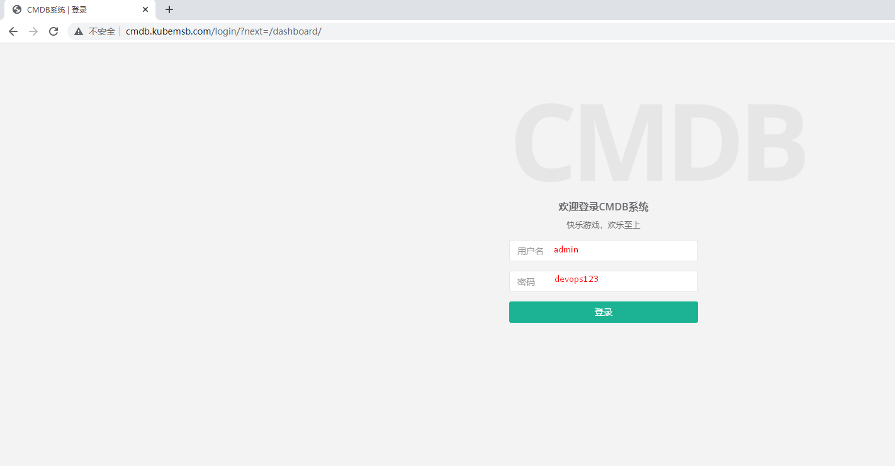
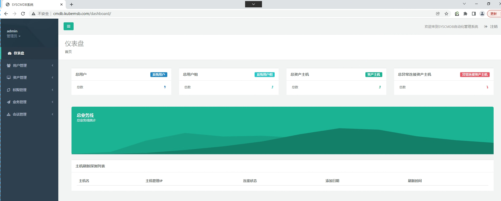

# kubernetes集群Python项目上云部署

# 一、项目资源及项目代码

~~~powershell
[root@localhost cmdb]# pwd
/root/cmdb
[root@localhost cmdb]# ls
db  pipsource  requirement  syscmdb

db用于存储项目数据库
pipsource用于存储pip源
requirement用于存储python项目依赖资源
syscmdb用于存储项目源代码
~~~

~~~powershell
[root@localhost cmdb]# ls db
cmdbdb.sql
~~~

~~~powershell
[root@localhost cmdb]# ls -a pipsource
.  ..  .pip
可以直接复制到基础镜像中，便于安装python项目依赖
~~~

~~~powershell
[root@localhost cmdb]# ls requirement
requirement.txt
[root@localhost cmdb]# cat requirement/requirement.txt
asn1crypto==0.24.0
astroid==2.1.0
autopep8==1.4.3
backcall==0.1.0
bcrypt==3.1.6
beautifulsoup4==4.7.1
certifi==2019.6.16
cffi==1.12.3
chardet==3.0.4
colorama==0.4.1
cryptography==2.4.2
decorator==4.4.0
Django==1.11.18
django-redis==4.10.0
Faker==2.0.2
geoip2==2.9.0
idna==2.8
ipython==7.6.0
ipython-genutils==0.2.0
isort==4.3.4
itchat==1.3.10
jedi==0.14.0
lazy-object-proxy==1.3.1
maxminddb==1.4.1
mccabe==0.6.1
paramiko==2.4.2
parso==0.5.0
pickleshare==0.7.5
pipenv==2018.11.26
prompt-toolkit==2.0.9
pyasn1==0.4.5
pycodestyle==2.5.0
pycparser==2.19
Pygments==2.4.2
pylint==2.2.2
pymongo==3.8.0
PyMySQL==0.9.3
PyNaCl==1.3.0
pypng==0.0.20
PyQRCode==1.2.1
python-dateutil==2.8.0
pytz==2019.1
redis==3.3.8
requests==2.22.0
six==1.12.0
soupsieve==1.9.1
text-unidecode==1.3
tornado==6.0.2
traitlets==4.3.2
urllib3==1.25.3
virtualenv==16.6.1
virtualenv-clone==0.5.3
wcwidth==0.1.7
webssh==1.4.5
wrapt==1.11.0
~~~

~~~powershell
[root@localhost cmdb]# ls syscmdb
dashboard  products   resources  syscmdb    users
manage.py  README.md  static     templates  util
~~~

# 二、项目基础镜像准备

项目基础镜像主要是为项目提供运行环境，可以考虑直接下载，也可以考虑定制。本次采用定制。

> 可以在harbor主机上准备，准备完成后，再上传到harbor仓库，以备后续使用。

## 2.1编辑用于生成基础镜像Dockerfile

~~~powershell
[root@harborserver ~]# mkdir pythonprojectbaseimage
[root@harborserver ~]# cd pythonprojectbaseimage/
[root@harborserver pythonprojectbaseimage]# ls
Dockerfile  pipsource  requirement

[root@harborserver pythonprojectbaseimage]# cat Dockerfile
FROM centos:centos7
MAINTAINER "admin<admin@kubemsb.com>"

WORKDIR /

ADD pipsource/.pip /root

ADD requirement/* /

RUN yum -y install python36 gcc gcc-c++ python3-devel

RUN pip3 install -r /requirement.txt
~~~

## 2.2 使用Dockerfile生成基础项目

~~~powershell
[root@harborserver pythonprojectbaseimage]# docker build -t www.kubemsb.com/library/pythonprojectbaseimage:v1 .
Sending build context to Docker daemon  6.144kB
Step 1/7 : FROM centos:centos7
 ---> 470671670cac
Step 2/7 : MAINTAINER "admin<admin@kubemsb.com>"
 ---> Using cache
 ---> 9974940d0406
Step 3/7 : WORKDIR /
 ---> Using cache
 ---> b804fad33075
Step 4/7 : ADD pipsource/.pip /root
 ---> Using cache
 ---> 72d7ea2ef23b
Step 5/7 : ADD requirement/* /
 ---> Using cache
 ---> 42ebd8ffb203
Step 6/7 : RUN yum -y install python36 gcc gcc-c++ python3-devel
 ---> Running in 35254e1d7411
 Step 7/7 : RUN pip3 install -r /requirement.txt
 ---> Running in 3f90c1c684a2
Successfully built cbf45af22bda
Successfully tagged www.kubemsb.com/library/pythonprojectbaseimage:v1

[root@harborserver pythonprojectbaseimage]# docker push www.kubemsb.com/library/pythonprojectbaseimage:v1
~~~

# 三、项目数据库部署

## 3.1 项目数据库文件准备

~~~powershell
[root@localhost cmdb]# ls
db  pipsource  requirement  syscmdb

db目录用于保存项目数据库

[root@localhost cmdb]# ls db
cmdbdb.sql
~~~

## 3.2 编辑数据库部署的资源清单文件

~~~powershell
[root@nginxk8syaml html]# pwd
/usr/share/nginx/html

[root@nginxk8syaml html]# mkdir 04_python_project
[root@nginxk8syaml html]# cd 04_python_project
[root@nginxk8syaml 04_python_project]# ls
mysql.yaml  namespace.yaml

[root@nginxk8syaml 04_python_project]# cat 01_namespace.yaml
apiVersion: v1
kind: Namespace
metadata:
  name: cmdb
  

[root@nginxk8syaml pythonproject-yaml]# cat 02_mysql.yaml
apiVersion: v1
kind: Service
metadata:
  name: cmdbmysql
  namespace: cmdb
spec:
  ports:
  - port: 3306
    name: mysql
  clusterIP: None
  selector:
    app: mysqlcmdb

---

apiVersion: apps/v1
kind: StatefulSet
metadata:
  name: cmdbdb
  namespace: cmdb
spec:
  selector:
    matchLabels:
      app: mysqlcmdb
  serviceName: "cmdbmysql"
  template:
    metadata:
      labels:
        app: mysqlcmdb
    spec:
      containers:
      - name: mysql
        image: mysql:5.7
        env:
        - name: MYSQL_ROOT_PASSWORD
          value: "123456"
        - name: MYSQL_DATABASE
          value: syscmdb
        ports:
        - containerPort: 3306
        volumeMounts:
        - mountPath: "/var/lib/mysql"
          name: mysql-cmdb
  volumeClaimTemplates:
  - metadata:
      name: mysql-cmdb
    spec:
      accessModes: ["ReadWriteMany"]
      storageClassName: "nfs-client"
      resources:
        requests:
          storage: 1Gi
~~~

## 3.3 应用数据库部署的资源清单文件

~~~powershell
[root@master01 ~]# kubectl apply -f http://yaml.kubemsb.com/04_python_project/01_namespace.yaml

[root@master01 ~]# kubectl apply -f http://yaml.kubemsb.com/04_python_project/02_mysql.yaml
~~~

## 3.4 导入数据库

### 3.4.1 在k8smaster节点找到数据库文件

~~~powershell
[root@master01 ~]# ls
syscmdb.sql
~~~

### 3.4.2 查找数据库访问地址

~~~powershell
[root@master01 ~]# kubectl get pods -n cmdb
NAME       READY   STATUS    RESTARTS   AGE
cmdbdb-0   1/1     Running   0          3m45s
[root@master01 ~]# kubectl get svc -n cmdb
NAME        TYPE        CLUSTER-IP   EXTERNAL-IP   PORT(S)    AGE
cmdbmysql   ClusterIP   None         <none>        3306/TCP   3m54s
[root@master01 ~]# kubectl get ns
NAME              STATUS   AGE
cmdb              Active   4m35s

使用命令进入查看
[root@master01 ~]# kubectl exec -it cmdbdb-0 sh -n cmdb
# mysql -uroot -p123456
mysql: [Warning] Using a password on the command line interface can be insecure.
Welcome to the MySQL monitor.  Commands end with ; or \g.
Your MySQL connection id is 2
Server version: 5.7.29 MySQL Community Server (GPL)

Copyright (c) 2000, 2020, Oracle and/or its affiliates. All rights reserved.

Oracle is a registered trademark of Oracle Corporation and/or its
affiliates. Other names may be trademarks of their respective
owners.

Type 'help;' or '\h' for help. Type '\c' to clear the current input statement.

mysql> show databases;
+--------------------+
| Database           |
+--------------------+
| information_schema |
| mysql              |
| performance_schema |
| sys                |
| syscmdb            |
+--------------------+
5 rows in set (0.01 sec)

测试连通性
[root@master01 ~]# kubectl apply -f http://yaml.kubemsb.com/04_python_project/03_create_pod_busybox.yaml

[root@master01 ~]# kubectl get pods
NAME                                      READY   STATUS    RESTARTS   AGE
busybox-pod                               1/1     Running   55         2d15h

[root@master01 ~]# kubectl exec -it busybox-pod sh                                    
/ # nslookup cmdbdb-0.cmdbmysql.cmdb
Server:    10.96.0.10
Address 1: 10.96.0.10 kube-dns.kube-system.svc.cluster.local

Name:      cmdbdb-0.cmdbmysql.cmdb
Address 1: 172.16.215.63 cmdbdb-0.cmdbmysql.cmdb.svc.cluster.local

[root@master01 ~]# kubectl exec -it busybox-pod sh
/ # ping cmdbdb-0.cmdbmysql.cmdb
PING cmdbdb-0.cmdbmysql.cmdb (172.16.215.63): 56 data bytes
64 bytes from 172.16.215.63: seq=0 ttl=62 time=0.448 ms
64 bytes from 172.16.215.63: seq=1 ttl=62 time=0.363 ms
64 bytes from 172.16.215.63: seq=2 ttl=62 time=0.543 ms
64 bytes from 172.16.215.63: seq=3 ttl=62 time=0.541 ms

--- cmdbdb-0.cmdbmysql.cmdb ping statistics ---
4 packets transmitted, 4 packets received, 0% packet loss
round-trip min/avg/max = 0.363/0.473/0.543 ms
~~~

**nfs server 验证**

~~~powershell
[root@nfsserver ~]# ls /sdb/cmdb-mysql-cmdb-cmdbdb-0-pvc-5aa89483-fc27-428a-a556-0204a8e12e61/syscmdb/
db.opt
里面没有数据表
~~~

### 3.4.3 导入数据表

~~~powershell
[root@master1 ~]# kubectl exec cmdbdb-0 -n cmdb -it -- mysql -uroot -p123456 syscmdb < cmdbdb.sql

[root@master1 ~]# kubectl exec -it cmdbdb-0 sh -n cmdb
# mysql -uroot -p123456
Type 'help;' or '\h' for help. Type '\c' to clear the current input statement.

mysql> use syscmdb;
Reading table information for completion of table and column names
You can turn off this feature to get a quicker startup with -A

Database changed
mysql> show tables;
+----------------------------+
| Tables_in_syscmdb          |
+----------------------------+
| auth_group                 |
| auth_group_permissions     |
| auth_permission            |
| auth_user                  |
| auth_user_groups           |
| auth_user_user_permissions |
| django_admin_log           |
| django_content_type        |
| django_migrations          |
| django_session             |
| products_product           |
| resources_disk             |
| resources_idc              |
| resources_network          |
| resources_server           |
| resources_serverauto       |
| resources_serveruser       |
| users_profile              |
+----------------------------+
18 rows in set (0.00 sec)
~~~

**nfs server  验证**

~~~powershell
[root@nfsserver ~]# ls /sdb/cmdb-mysql-cmdb-cmdbdb-0-pvc-5aa89483-fc27-428a-a556-0204a8e12e61/syscmdb/
auth_group.frm                  django_admin_log.frm     resources_idc.ibd
auth_group.ibd                  django_admin_log.ibd     resources_network.frm
auth_group_permissions.frm      django_content_type.frm  resources_network.ibd
auth_group_permissions.ibd      django_content_type.ibd  resources_serverauto.frm
auth_permission.frm             django_migrations.frm    resources_serverauto.ibd
auth_permission.ibd             django_migrations.ibd    resources_server.frm
auth_user.frm                   django_session.frm       resources_server.ibd
auth_user_groups.frm            django_session.ibd       resources_serveruser.frm
auth_user_groups.ibd            products_product.frm     resources_serveruser.ibd
auth_user.ibd                   products_product.ibd     users_profile.frm
auth_user_user_permissions.frm  resources_disk.frm       users_profile.ibd
auth_user_user_permissions.ibd  resources_disk.ibd
db.opt                          resources_idc.frm

里面已有数据表
~~~

# 四、项目镜像准备

## 4.1 目录及文件准备

~~~powershell
创建制作镜像文件目录
[root@harborserver ~]# mkdir pythonprojectimage
[root@harborserver ~]# cd pythonprojectimage/
[root@harborserver pythonprojectimage]# ls
Dockerfile  syscmdb

修改项目数据库连接文件

[root@harborserver pythonprojectimage]# vim syscmdb/syscmdb/settings.py
......
84 DATABASES = {
 85     'default': {
 86         'ENGINE': 'django.db.backends.mysql',
 87         'NAME': 'syscmdb',
 88         'USER': 'root',
 89         'PASSWORD': '123456',
 90         'HOST': 'cmdbdb-0.cmdbmysql.cmdb',
 91         'PORT': '3306',
 92     }
 93 }
......

编辑制作项目镜像Dockerfile

[root@harborserver pythonprojectimage]# cat Dockerfile
FROM www.kubemsb.com/python-project/pythonprojectbaseimage:v1

MAINTAINER "admin<admin@kubemsb.com>"

ADD . /

WORKDIR /syscmdb

EXPOSE 8000

CMD ["python3","manage.py","runserver","0.0.0.0:8000"]

~~~

## 4.2 制定镜像

~~~powershell
[root@harborserver pythonprojectimage]# docker build -t www.kubemsb.com/python-project/pythonprojectimage:v1 .
Sending build context to Docker daemon   26.5MB
Step 1/6 : FROM www.kubemsb.com/python-project/pythonprojectbaseimage:v1
 ---> cbf45af22bda
Step 2/6 : MAINTAINER "admin<admin@kubemsb.com>"
 ---> Running in 5c4842096cd4
Removing intermediate container 5c4842096cd4
 ---> ac510a15045d
Step 3/6 : ADD syscmdb /
 ---> 380a9d3815c2
Step 4/6 : WORKDIR /syscmdb
 ---> Running in 181e423d7b7c
Removing intermediate container 181e423d7b7c
 ---> 0c00978f568c
Step 5/6 : EXPOSE 8000
 ---> Running in fd34bab88e55
Removing intermediate container fd34bab88e55
 ---> c2f30e672d35
Step 6/6 : CMD ["python3","manage.py","runserver","*:8000"]
 ---> Running in 561d17f2dfba
Removing intermediate container 561d17f2dfba
 ---> b846c51ca3ba
Successfully built b846c51ca3ba
Successfully tagged www.kubemsb.com/python-project/pythonprojectimage:v1
~~~

## 4.3 上传镜像到harbor

~~~powershell
[root@harborserver pythonprojectimage]# docker push www.kubemsb.com/python-project/pythonprojectimage:v1
~~~

# 五、项目部署

## 5.1 项目部署资源清单准备

~~~powershell
[root@nginxk8syaml 04_python_project]# ls
deployment.yaml  ingress.yaml  mysql.yaml  namespace.yaml  service.yaml
~~~

### 5.1.1 deployment.yaml

~~~powershell
[root@nginxk8syaml 04_python_project]# cat 04_deployment.yaml
apiVersion: apps/v1
kind: Deployment
metadata:
  name: pythoncmdb
  namespace: cmdb
spec:
  replicas: 2
  selector:
    matchLabels:
      project: pythoncmdb
      app: cmdb-demo
  template:
    metadata:
      labels:
        project: pythoncmdb
        app: cmdb-demo
    spec:
      imagePullSecrets:
      - name: harborreg #认证信息
      containers:
      - name: cmdb
        image: www.kubemsb.com/library/pythonprojectimage:v1 #镜像
        imagePullPolicy: Always
        ports:
        - containerPort: 8000
          name: web
          protocol: TCP
        resources:
          requests:
            cpu: 0.5
            memory: 1Gi
          limits:
            cpu: 1
            memory: 2Gi
        livenessProbe:
          httpGet:
            path: /
            port: 8000
          initialDelaySeconds: 60
          timeoutSeconds: 20
        readinessProbe:
          httpGet:
            path: /
            port: 8000
          initialDelaySeconds: 60
          timeoutSeconds: 20
~~~

### 5.1.2 service.yaml

~~~powershell
[root@nginxk8syaml 04_python_project]# cat 05_service.yaml
apiVersion: v1
kind: Service
metadata:
  name: pythoncmdbsvc
  namespace: cmdb
spec:
  selector:
    project: pythoncmdb
    app: cmdb-demo
  ports:
  - name: web
    port: 80
    targetPort: 8000
# 由于使用ingress暴露，所以不使用NodePort
~~~

### 5.1.3 ingress.yaml

~~~powershell
[root@nginxk8syaml 04_python_project]# cat 06_ingress.yaml
apiVersion: networking.k8s.io/v1
kind: Ingress
metadata:
  name: pythoncmdbingress
  namespace: cmdb
  annotations:
    ingressclass.kubernetes.io/is-default-class: "true"
    kubernetes.io/ingress.class: nginx
spec:
  rules:
    - host: cmdb.kubemsb.com
      http:
        paths:
        - pathType: Prefix
          path: /
          backend:
            service:
              name: pythoncmdbsvc
              port:
                number: 80
~~~

## 5.2 应用项目部署资源清单

~~~powershell
[root@master01 ~]# kubectl apply -f http://yaml.kubemsb.com/04_python_project/04_deployment.yaml
deployment.apps/pythoncmdb created
[root@master01 ~]# kubectl apply -f http://yaml.kubemsb.com/04_python_project/05_service.yaml
service/pythoncmdbsvc created
[root@master01 ~]# kubectl apply -f http://yaml.kubemsb.com/04_python_project/06_ingress.yaml
ingress.networking.k8s.io/pythoncmdbingress created
~~~

# 六、项目部署验证及访问

## 6.1 验证

~~~powershell
[root@master01 ~]# kubectl get deployment.apps -n cmdb
NAME         READY   UP-TO-DATE   AVAILABLE   AGE
pythoncmdb   2/2     2            2           97s

[root@master01 ~]# kubectl get svc -n cmdb
NAME            TYPE        CLUSTER-IP     EXTERNAL-IP   PORT(S)    AGE
cmdbmysql       ClusterIP   None           <none>        3306/TCP   27m
pythoncmdbsvc   ClusterIP   10.101.36.94   <none>        80/TCP     89s

[root@master01 ~]# kubectl get pods -n cmdb
NAME                          READY   STATUS    RESTARTS   AGE
cmdbdb-0                      1/1     Running   0          27m
pythoncmdb-56d4d84fd4-l927b   1/1     Running   0          116s
pythoncmdb-56d4d84fd4-xb6kk   1/1     Running   0          116s

[root@master01 ~]# kubectl get ingress -n cmdb
NAME                CLASS    HOSTS              ADDRESS         PORTS   AGE
pythoncmdbingress   <none>   cmdb.kubemsb.com   192.168.10.13   80      87s
~~~

## 6.2 访问

