# DevOps

### 一、DevOps介绍

软件开发最开始是由两个团队组成：

- 开发计划由[开发团队]()从头开始设计和整体系统的构建。需要系统不停的迭代更新。
- [运维团队]()将开发团队的Code进行测试后部署上线。希望系统稳定安全运行。

这看似两个目标不同的团队需要协同完成一个软件的开发。

在开发团队指定好计划并完成coding后，需要提供到运维团队。

运维团队向开发团队反馈需要修复的BUG以及一些需要返工的任务。

这时开发团队需要经常等待运维团队的反馈。这无疑延长了事件并推迟了整个软件开发的周期。

会有一种方式，在开发团队等待的时候，让开发团队转移到下一个项目中。等待运维团队为之前的代码提供反馈。

可是这样就意味着一个完整的项目需要一个更长的周期才可以开发出最终代码。

----------

基于现在的互联网现状，更推崇敏捷式开发，这样就导致项目的迭代速度更快，但是由于开发团队与运维团队的沟通问题，会导致新版本上线的时间成本很高。这又违背的敏捷式开发的最初的目的。

那么如果让开发团队和运维团队整合到成一个团队，协同应对一套软件呢？这就被称为[DevOps]()。

[DevOps]()，字面意思是Development &Operations的缩写，也就是开发&运维。

虽然字面意思只涉及到了开发团队和运维团队，其实QA测试团队也是参与其中的。

网上可以查看到[DevOps]()的符号类似于一个无穷大的符号

|                [DevOps]()                |
| :--------------------------------------: |
| 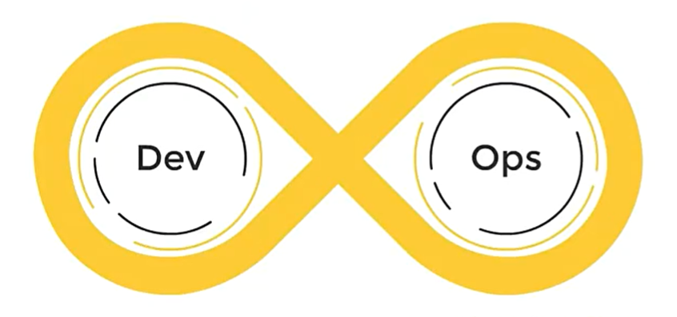 |

这表明[DevOps]()是一个不断提高效率并且持续不断工作的过程

[DevOps]()的方式可以让公司能够更快地应对更新和市场发展变化，开发可以快速交付，部署也更加稳定。

核心就在于[简化Dev和Ops团队之间的流程，使整体软件开发过程更快速。]()

整体的软件开发流程包括：

- PLAN：开发团队根据客户的目标制定开发计划
- CODE：根据PLAN开始编码过程，需要将不同版本的代码存储在一个库中。
- BUILD：编码完成后，需要将代码构建并且运行。
- TEST：成功构建项目后，需要测试代码是否存在BUG或错误。
- DEPLOY：代码经过手动测试和自动化测试后，认定代码已经准备好部署并且交给运维团队。
- OPERATE：运维团队将代码部署到生产环境中。
- MONITOR：项目部署上线后，需要持续的监控产品。
- INTEGRATE：然后将监控阶段收到的反馈发送回PLAN阶段，整体反复的流程就是[DevOps]()的核心，即持续集成、持续部署。

为了保证整体流程可以高效的完成，各个阶段都有比较常见的工具，如下图：

|               软件开发过程&涉及工具                |
| :--------------------------------------: |
|  |

最终可以给[DevOps]()下一个定义：[DevOps 强调的是高效组织团队之间如何通过自动化的工具协作和沟通来完成软件的生命周期管理，从而更快、更频繁地交付更稳定的软件。]()

自动化的工具协作和沟通来完成软件的生命周期管理

### 二、Code阶段工具

在code阶段，我们需要将不同版本的代码存储到一个仓库中，常见的版本控制工具就是SVN或者Git，这里我们采用Git作为版本控制工具，GitLab作为远程仓库。

#### 2.1 Git安装

https://git-scm.com/（傻瓜式安装）

#### 2.2 GitLab安装

单独准备服务器，采用Docker安装

- 查看GitLab镜像

  ```sh
  docker search gitlab
  ```

- 拉取GitLab镜像

  ```sh
  docker pull gitlab/gitlab-ce
  ```

- 准备docker-compose.yml文件

  ```yml
  version: '3.1'
  services:
    gitlab:
      image: 'gitlab/gitlab-ce:latest'
      container_name: gitlab
      restart: always
      environment:
        GITLAB_OMNIBUS_CONFIG: |
          external_url 'http://192.168.11.11:8929'
          gitlab_rails['gitlab_shell_ssh_port'] = 2224
      ports:
        - '8929:8929'
        - '2224:2224'
      volumes:
        - './config:/etc/gitlab'
        - './logs:/var/log/gitlab'
        - './data:/var/opt/gitlab'
  ```

- 启动容器（需要稍等一小会……）

  ```sh
  docker-compose up -d
  ```

- 访问GitLab首页

  |                    首页                    |
  | :--------------------------------------: |
  |  |

- 查看root用户初始密码

  ```sh
  docker exec -it gitlab cat /etc/gitlab/initial_root_password
  ```

  |                   初始密码                   |
  | :--------------------------------------: |
  | 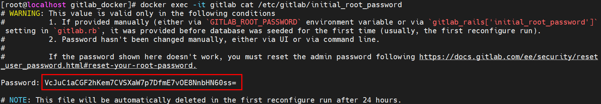 |

- 登录root用户

  |                登录成功后跳转页面                 |
  | :--------------------------------------: |
  | 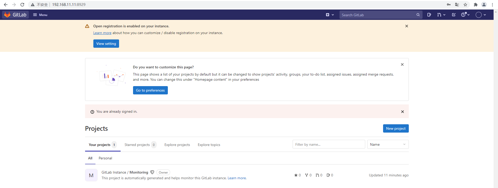 |

- 第一次登录后需要修改密码

  |                   修改密码                   |
  | :--------------------------------------: |
  | 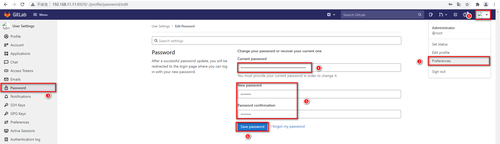 |

搞定后，即可像Gitee、GitHub一样使用。


### 三、Build阶段工具

构建Java项目的工具一般有两种选择，一个是Maven，一个是Gradle。

这里我们选择Maven作为项目的编译工具。

具体安装Maven流程不做阐述，但是需要确保配置好Maven仓库私服以及JDK编译版本。

### 四、Operate阶段工具

部署过程，会采用Docker进行部署，暂时只安装Docker即可，后续还需安装Kubenetes

#### 4.1 Docker安装

- 准备测试环境&生产环境

- 下载Docker依赖组件

  ```sh
  yum -y install yum-utils device-mapper-persistent-data lvm2
  ```

- 设置下载Docker的镜像源为阿里云

  ```sh
  yum-config-manager --add-repo http://mirrors.aliyun.com/docker-ce/linux/centos/docker-ce.repo
  ```

- 安装Docker服务

  ```sh
  yum -y install docker-ce
  ```

- 安装成功后，启动Docker并设置开机自启

  ```sh
  # 启动Docker服务
  systemctl start docker
  # 设置开机自动启动
  systemctl enable docker
  ```

- 测试安装成功

  ```sh
  docker version
  ```

  |                    效果                    |
  | :--------------------------------------: |
  | 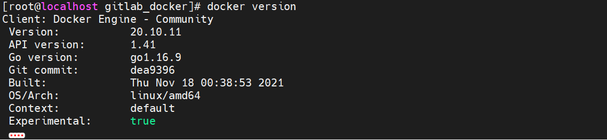 |

#### 4.2 Docker-Compose安装

- 下载Docker/Compose：https://github.com/docker/compose

- 将下载好的[docker-compose-Linux-x86_64]()文件移动到Linux操作系统：……

- 设置[docker-compose-Linux-x86_64]()文件权限，并移动到$PATH目录中

  ```sh
  # 设置文件权限
  chmod a+x docker-compose-Linux-x86_64
  # 移动到/usr/bin目录下，并重命名为docker-compose
  mv docker-compose-Linux-x86_64 /usr/bin/docker-compose
  ```

- 测试安装成功

  ```sh
  docker-compose version
  ```

  |                    效果                    |
  | :--------------------------------------: |
  | 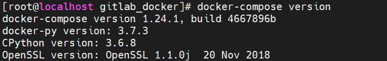 |

### 五、Integrate工具

持续集成、持续部署的工具很多，其中Jenkins是一个开源的持续集成平台。

Jenkins涉及到将编写完毕的代码发布到测试环境和生产环境的任务，并且还涉及到了构建项目等任务。

Jenkins需要大量的插件保证工作，安装成本较高，下面会基于Docker搭建Jenkins。

#### 5.1 Jenkins介绍

Jenkins是一个开源软件项目，是基于Java开发的一种持续集成工具

Jenkins应用广泛，大多数互联网公司都采用Jenkins配合GitLab、Docker、K8s作为实现[DevOps]()的核心工具。

Jenkins最强大的就在于插件，Jenkins官方提供了大量的插件库，来自动化CI/CD过程中的各种琐碎功能。

|                                          |                                          |
| :--------------------------------------: | :--------------------------------------: |
|  |  |

Jenkins最主要的工作就是将GitLab上可以构建的工程代码拉取并且进行构建，再根据流程可以选择发布到测试环境或是生产环境。

一般是GitLab上的代码经过大量的测试后，确定发行版本，再发布到生产环境。

CI/CD可以理解为：

- CI过程即是通过Jenkins将代码拉取、构建、制作镜像交给测试人员测试。
  - 持续集成：让软件代码可以持续的集成到主干上，并自动构建和测试。
- CD过程即是通过Jenkins将打好标签的发行版本代码拉取、构建、制作镜像交给运维人员部署。
  - 持续交付：让经过持续集成的代码可以进行手动部署。
  - 持续部署：让可以持续交付的代码随时随地的自动化部署。

|                  CI、CD                   |
| :--------------------------------------: |
| 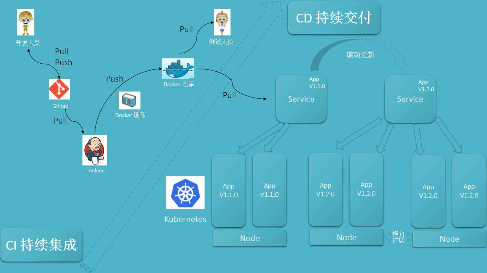 |


#### 5.2 Jenkins安装

- 拉取Jenkins镜像

  ```
  docker pull jenkins/jenkins
  ```

- 编写docker-compose.yml

  ```yml
  version: "3.1"
  services:
    jenkins:
      image: jenkins/jenkins
      container_name: jenkins
      ports:
        - 8080:8080
        - 50000:50000
      volumes:
        - ./data/:/var/jenkins_home/
  ```

- 首次启动会因为数据卷data目录没有权限导致启动失败，设置data目录写权限

  |                   错误日志                   |
  | :--------------------------------------: |
  | 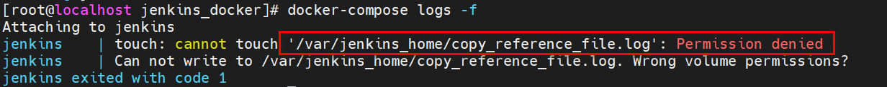 |

  ```sh
  chmod -R a+w data/
  ```

- 重新启动Jenkins容器后，由于Jenkins需要下载大量内容，但是由于默认下载地址下载速度较慢，需要重新设置下载地址为国内镜像站

  ```sh
  # 修改数据卷中的hudson.model.UpdateCenter.xml文件
  <?xml version='1.1' encoding='UTF-8'?>
  <sites>
    <site>
      <id>default</id>
      <url>https://updates.jenkins.io/update-center.json</url>
    </site>
  </sites>
  # 将下载地址替换为http://mirror.esuni.jp/jenkins/updates/update-center.json
  <?xml version='1.1' encoding='UTF-8'?>
  <sites>
    <site>
      <id>default</id>
      <url>http://mirror.esuni.jp/jenkins/updates/update-center.json</url>
    </site>
  </sites>
  # 清华大学的插件源也可以https://mirrors.tuna.tsinghua.edu.cn/jenkins/updates/update-center.json
  ```

- 再次重启Jenkins容器，访问Jenkins（需要稍微等会）

  |                Jenkins首页                 |
  | :--------------------------------------: |
  | 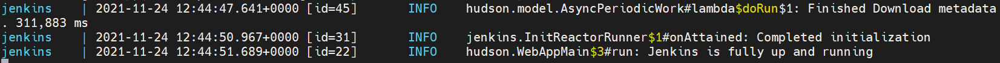 |
  | 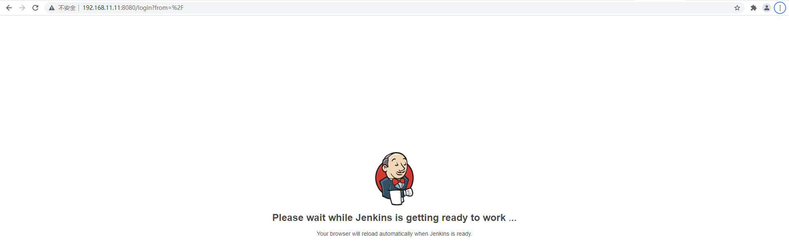 |

- 查看密码登录Jenkins，并登录下载插件

  ```sh
  docker exec -it jenkins cat /var/jenkins_home/secrets/initialAdminPassword
  ```

  |                 登录并下载插件                  |
  | :--------------------------------------: |
  |  |
  | 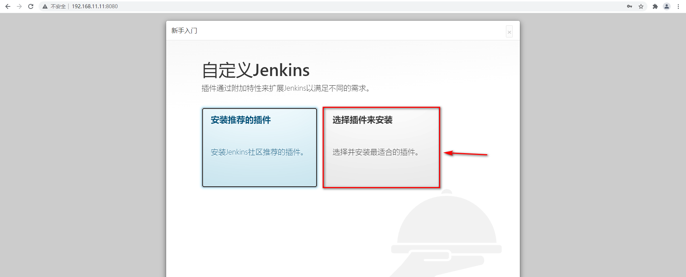 |

- 选择需要安装的插件

  |                选择需要安装的插件                 |
  | :--------------------------------------: |
  | 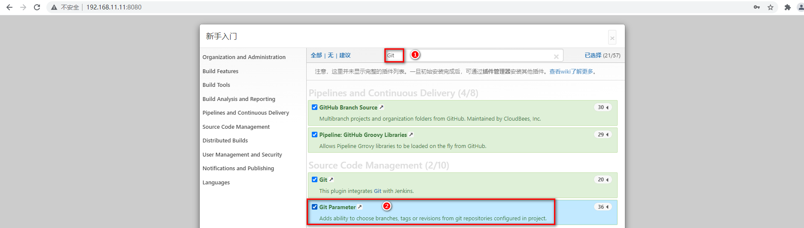 |
  | 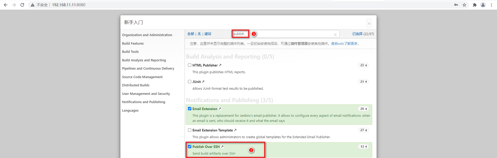 |
  | 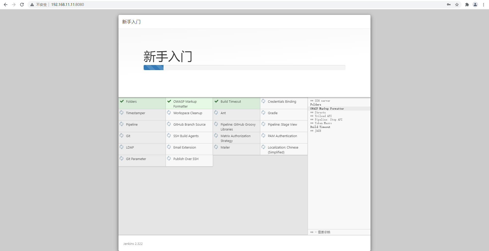 |

- 下载完毕设置信息进入首页（可能会出现下载失败的插件）

  |                                          |
  | ---------------------------------------- |
  | 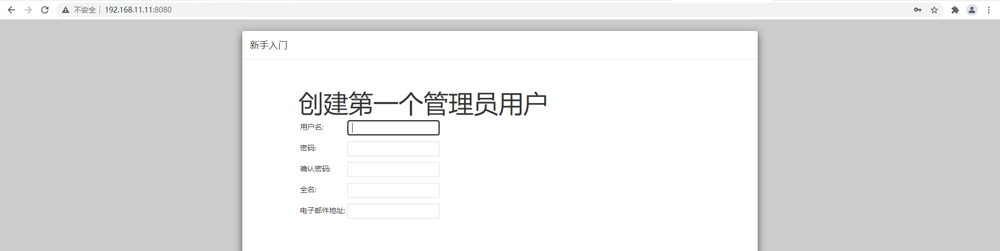 |
  |  |
  |  |


#### 5.3 Jenkins入门配置

由于Jenkins需要从Git拉取代码、需要本地构建、甚至需要直接发布自定义镜像到Docker仓库，所以Jenkins需要配置大量内容。

##### 5.3.1 构建任务

准备好GitLab仓库中的项目，并且通过Jenkins配置项目的实现当前项目的[DevOps]()基本流程。

- 构建Maven工程发布到GitLab（Gitee、Github均可）

  |                GitLab查看项目                |
  | :--------------------------------------: |
  |  |

- Jenkins点击左侧导航新建任务

  |                   新建任务                   |
  | :--------------------------------------: |
  | 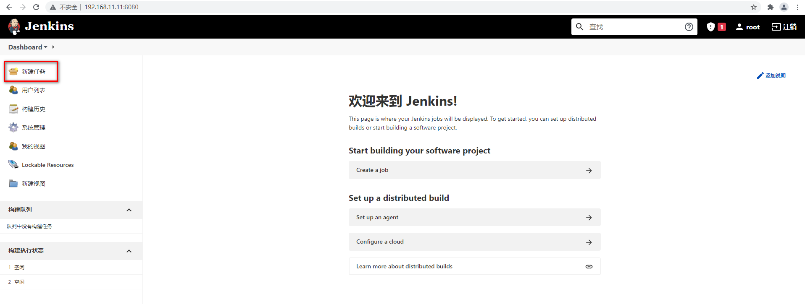 |

- 选择自由风格构建任务

  |                   构建任务                   |
  | :--------------------------------------: |
  | 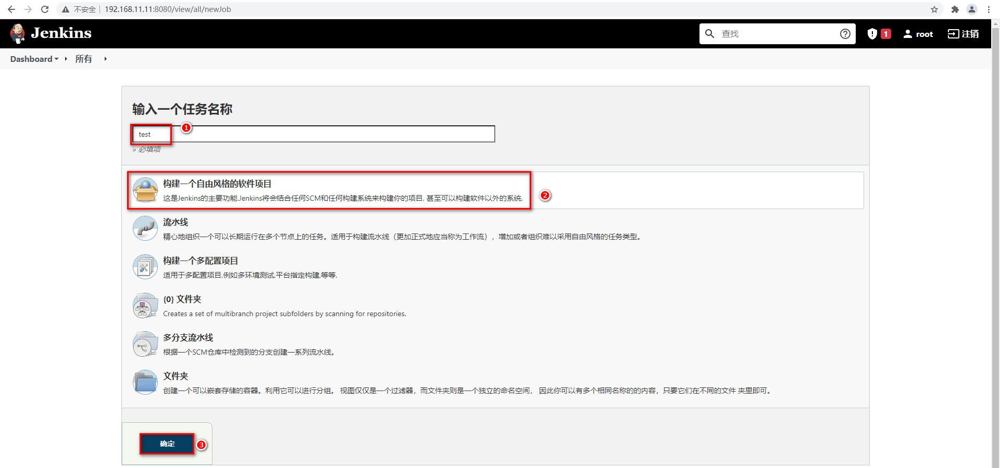 |

##### 5.3.1 配置源码拉取地址

Jenkins需要将Git上存放的源码存储到Jenkins服务所在磁盘的本地

- 配置任务源码拉取的地址

  |                   源码管理                   |
  | :--------------------------------------: |
  | 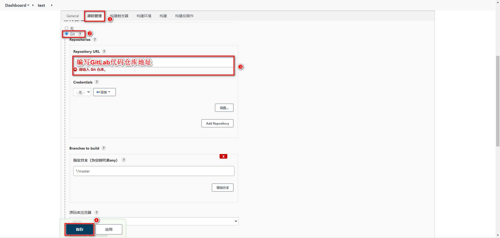 |

- Jenkins立即构建

  |              点击任务test中的立即构建              |
  | :--------------------------------------: |
  | 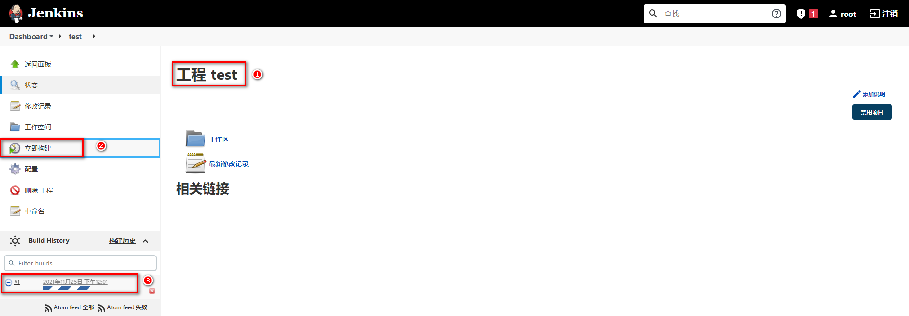 |

- 查看构建工程的日志，点击上述③的任务条即可

  |              查看任务拉取Git源码日志               |
  | :--------------------------------------: |
  | 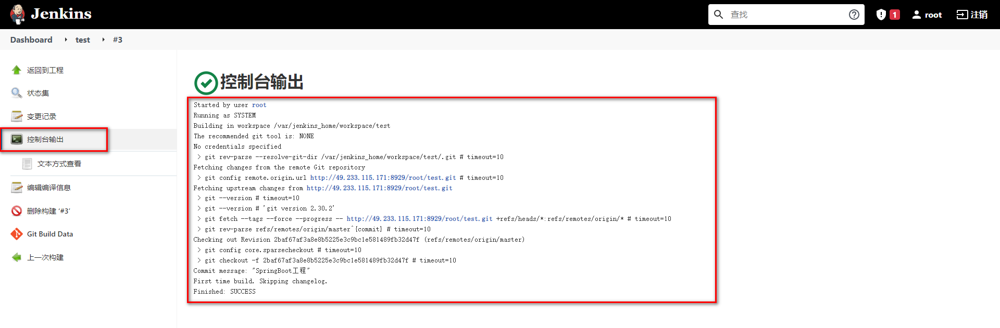 |

  可以看到源码已经拉取带Jenkins本地，可以根据第三行日志信息，查看Jenkins本地拉取到的源码。

- 查看Jenkins容器中[/var/jenkins_home/workspace/test]()的源码

  |                  源码存放位置                  |
  | :--------------------------------------: |
  |  |

##### 5.3.2 配置Maven构建代码

代码拉取到Jenkins本地后，需要在Jenkins中对代码进行构建，这里需要Maven的环境，而Maven需要Java的环境，接下来需要在Jenkins中安装JDK和Maven，并且配置到Jenkins服务。

- 准备JDK、Maven压缩包通过数据卷映射到Jenkins容器内部

  |                 数据卷存放位置                  |
  | :--------------------------------------: |
  | 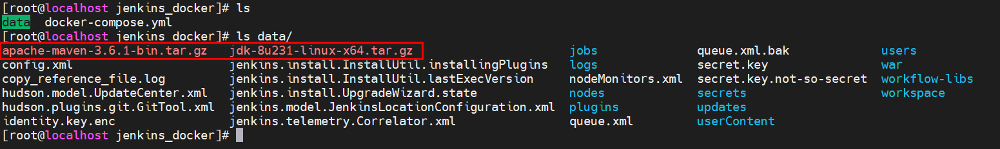 |

- 解压压缩包，并配置Maven的settings.xml

  ```xml
  <!-- 阿里云镜像地址 -->
  <mirror>  
      <id>alimaven</id>  
      <name>aliyun maven</name>  
      <url>http://maven.aliyun.com/nexus/content/groups/public/</url>
      <mirrorOf>central</mirrorOf>          
  </mirror>
  <!-- JDK1.8编译插件 -->
  <profile>
      <id>jdk-1.8</id>
      <activation>
          <activeByDefault>true</activeByDefault>
          <jdk>1.8</jdk>
      </activation>
      <properties>
          <maven.compiler.source>1.8</maven.compiler.source>
          <maven.compiler.target>1.8</maven.compiler.target>
          <maven.compiler.compilerVersion>1.8</maven.compiler.compilerVersion>
      </properties>        
  </profile>
  ```

- Jenkins配置JDK&Maven并保存

  |                                          |
  | ---------------------------------------- |
  | 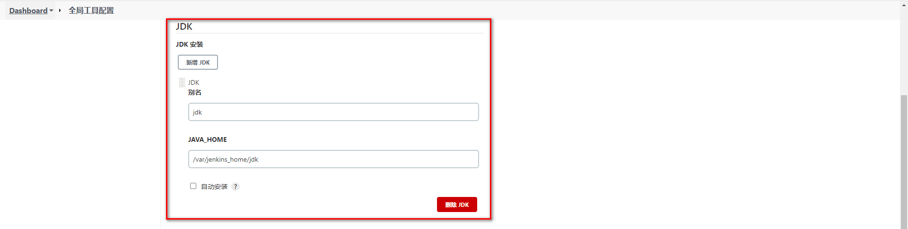 |
  |  |

- 配置Jenkins任务构建代码

  |               配置Maven构建代码                |
  | :--------------------------------------: |
  | 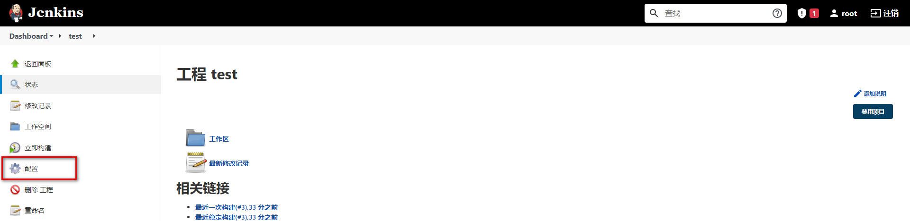 |
  | 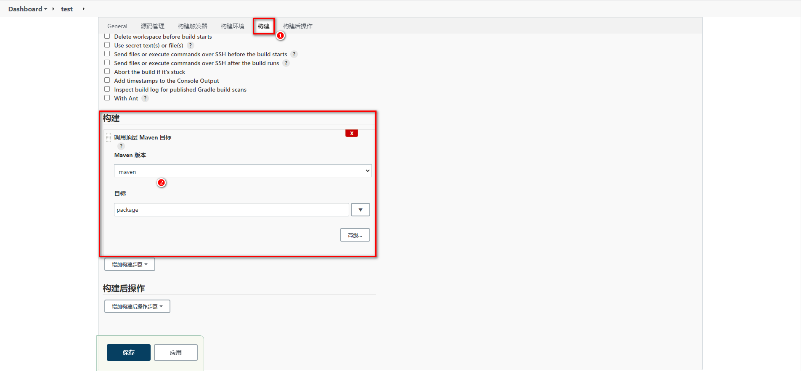 |

- 立即构建测试，查看target下的jar包

  |                   构建源码                   |
  | :--------------------------------------: |
  | 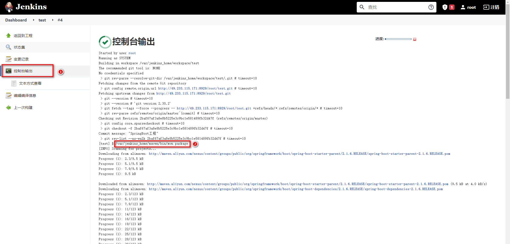 |
  |  |


##### 5.3.3 配置Publish发布&远程操作

jar包构建好之后，就可以根据情况发布到测试或生产环境，这里需要用到之前下载好的插件Publish Over SSH。

- 配置Publish Over SSH连接测试、生产环境

  |            Publish Over SSH配置            |
  | :--------------------------------------: |
  | 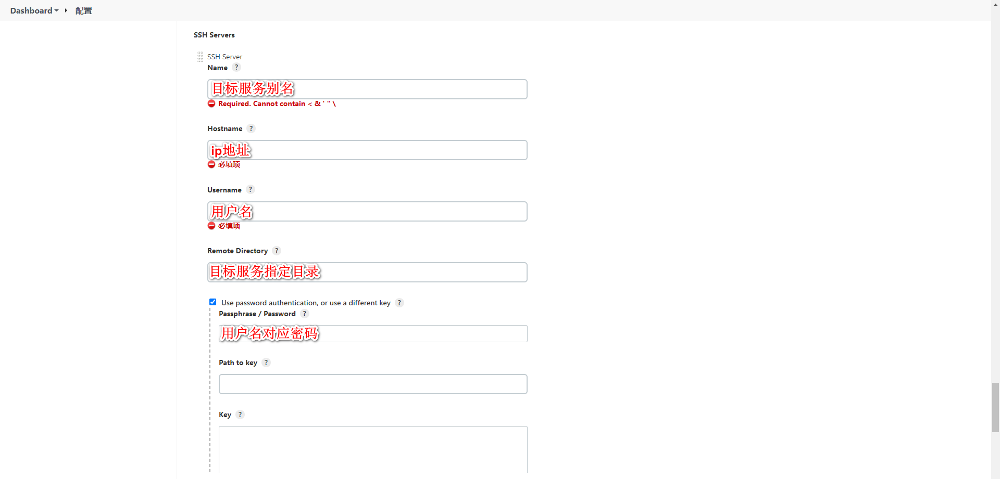 |

- 配置任务的构建后操作，发布jar包到目标服务

  |                 配置构建后操作                  |
  | :--------------------------------------: |
  |  |
  | 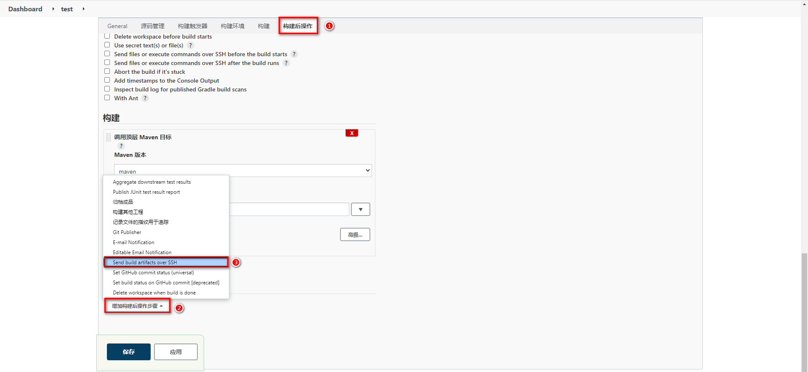 |
  | 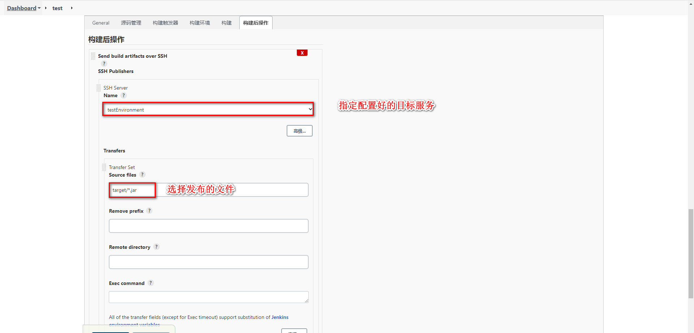 |

- 立即构建任务，并去目标服务查看

  |                   立即构建                   |
  | :--------------------------------------: |
  | 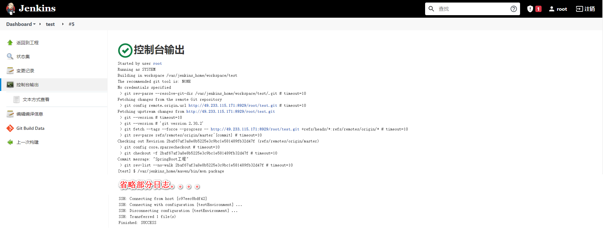 |
  | 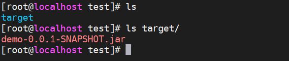 |


### 六、CI、CD入门操作

基于Jenkins拉取GitLab的SpringBoot代码进行构建发布到测试环境实现持续集成

基于Jenkins拉取GitLab指定发行版本的SpringBoot代码进行构建发布到生产环境实现CD实现持续部署

#### 6.1 持续集成

为了让程序代码可以自动推送到测试环境基于Docker服务运行，需要添加Docker配置和脚本文件让程序可以在集成到主干的同时运行起来。

- 添加Dockerfile文件

  |                 构建自定义镜像                  |
  | :--------------------------------------: |
  | 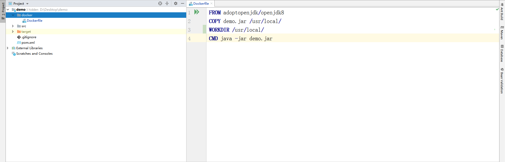 |

- 添加docker-compose.yml文件

  |               加载自定义镜像启动容器                |
  | :--------------------------------------: |
  | 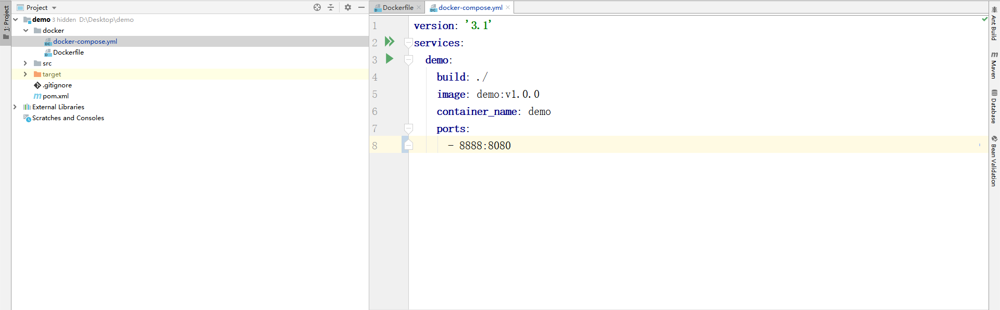 |

- 追加Jenkins构建后操作脚本命令

  |               构建后发布并执行脚本命令               |
  | :--------------------------------------: |
  |  |

- 发布到GitLab后由Jenkins立即构建并托送到目标服务器

  |                   构建日志                   |
  | :--------------------------------------: |
  |  |

- 测试部署到目标服务器程序

  |               查看目标服务器并测试接口               |
  | :--------------------------------------: |
  | 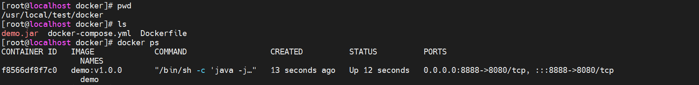 |
  | 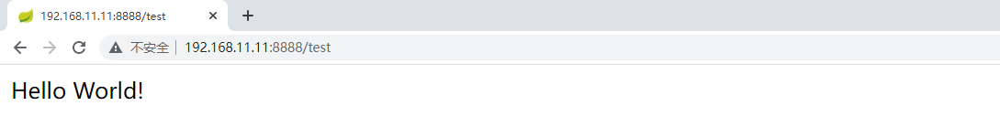 |

#### 6.2 持续交付、部署

程序代码在经过多次集成操作到达最终可以交付，持续交付整体流程和持续集成类似，不过需要选取指定的发行版本

- 下载Git Parameter插件

  |             下载Git Parameter              |
  | :--------------------------------------: |
  | 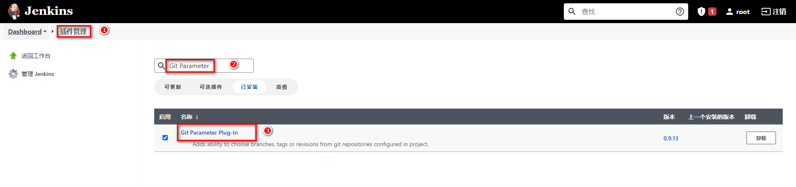 |

- 设置项目参数化构建

  |                基于Git标签构建                 |
  | :--------------------------------------: |
  |  |
  | 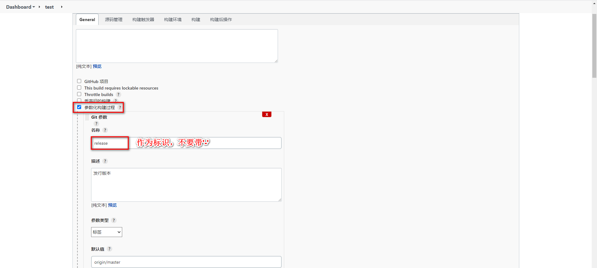 |

- 给项目添加tag版本

  |                 添加tag版本                  |
  | :--------------------------------------: |
  | 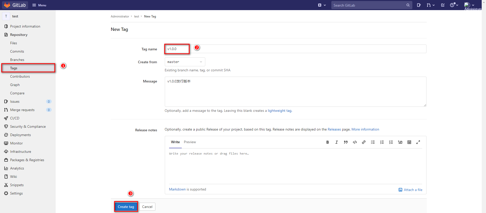 |

- 任务构建时，采用Shell方式构建，拉取指定tag版本代码

  |               切换指定标签并构建项目                |
  | :--------------------------------------: |
  | 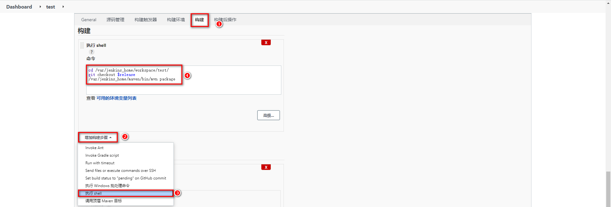 |

- 基于Parameter构建任务，任务发布到目标服务器

  |                   构建任务                   |
  | :--------------------------------------: |
  |  |


### 七、集成Sonar Qube

#### 7.1 Sonar Qube介绍

Sonar Qube是一个开源的代码分析平台，支持Java、Python、PHP、JavaScript、CSS等25种以上的语言，可以检测出重复代码、代码漏洞、代码规范和安全性漏洞的问题。

Sonar Qube可以与多种软件整合进行代码扫描，比如Maven，Gradle，Git，Jenkins等，并且会将代码检测结果推送回Sonar Qube并且在系统提供的UI界面上显示出来

|             Sonar Qube的UI界面              |
| :--------------------------------------: |
|  |


#### 7.2 Sonar Qube环境搭建

##### 7.2.1 Sonar Qube安装

Sonar Qube在7.9版本中已经放弃了对MySQL的支持，并且建议在商业环境中采用PostgreSQL，那么安装Sonar Qube时需要依赖PostgreSQL。

并且这里会安装Sonar Qube的长期支持版本[8.9]()

- 拉取镜像

  ```sh
  docker pull postgres
  docker pull sonarqube:8.9.3-community
  ```

- 编写docker-compoe.yml

  ```yml
  version: "3.1"
  services:
    db:
      image: postgres
      container_name: db
      ports:
        - 5432:5432
      networks:
        - sonarnet
      environment:
        POSTGRES_USER: sonar
        POSTGRES_PASSWORD: sonar
    sonarqube:
      image: sonarqube:8.9.3-community
      container_name: sonarqube
      depends_on:
        - db
      ports:
        - "9000:9000"
      networks:
        - sonarnet
      environment:
        SONAR_JDBC_URL: jdbc:postgresql://db:5432/sonar
        SONAR_JDBC_USERNAME: sonar
        SONAR_JDBC_PASSWORD: sonar
  networks:
    sonarnet:
      driver: bridge
  ```

- 启动容器

  ```
  docker-compose up -d
  ```

- 需要设置sysctl.conf文件信息

  |            设置vm.max_map_count            |
  | :--------------------------------------: |
  | 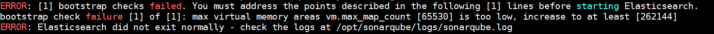 |
  | 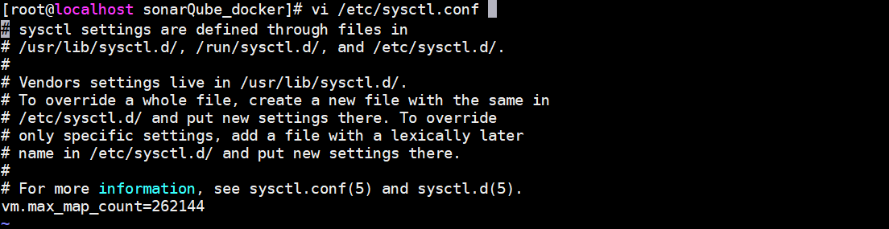 |

  并执行命令刷新

  ```
  sysctl -p
  ```

- 重新启动需要一定时间启动，可以可以查看容器日志，看到如下内容代表启动成功

  |                   容器日志                   |
  | :--------------------------------------: |
  | 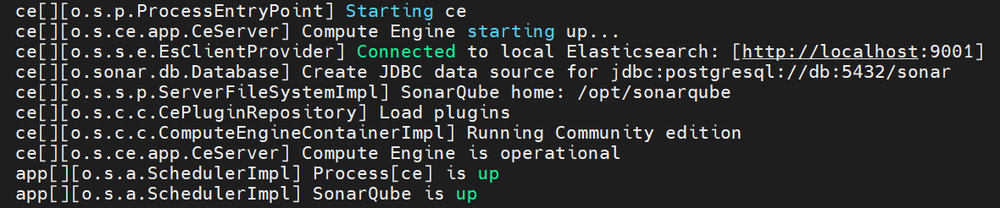 |

- 访问Sonar Qube首页

  |                    登录                    |
  | :--------------------------------------: |
  | 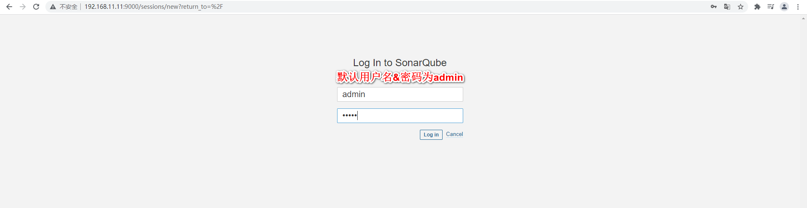 |

- 还需要重新设置一次密码

  |                  重新设置密码                  |
  | :--------------------------------------: |
  |  |

- Sonar Qube首页

  |               Sonar Qube首页               |
  | :--------------------------------------: |
  |  |

##### 7.2.2 安装中文插件

|                  安装中文插件                  |
| :--------------------------------------: |
| 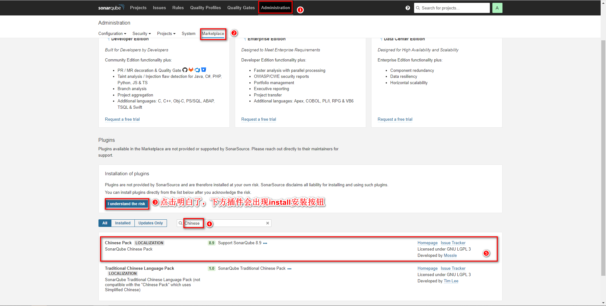 |

安装成功后需要重启，安装失败重新点击install重装即可。

安装成功后，会查看到重启按钮，点击即可

|                   重启按钮                   |
| :--------------------------------------: |
| 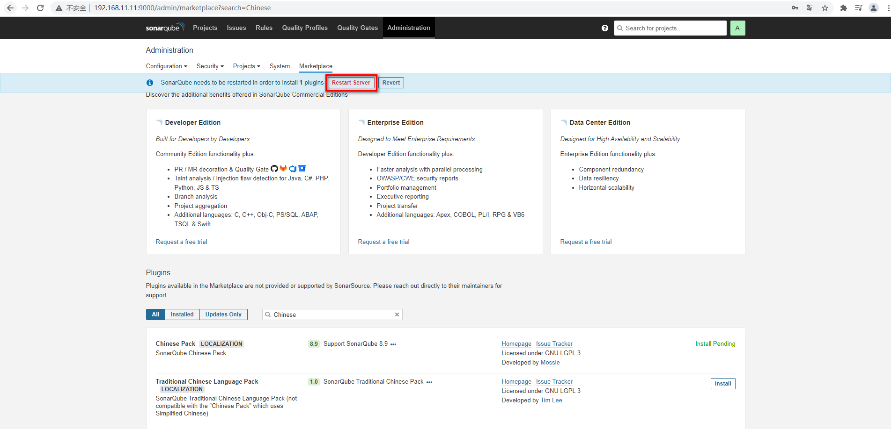 |

重启后查看效果

|                   首页效果                   |
| :--------------------------------------: |
|  |


#### 7.3 Sonar Qube基本使用

Sonar Qube的使用方式很多，Maven可以整合，也可以采用sonar-scanner的方式，再查看Sonar Qube的检测效果

##### 7.3.1 Maven实现代码检测

- 修改Maven的settings.xml文件配置Sonar Qube信息

  ```xml
  <profile>
      <id>sonar</id>
      <activation>
          <activeByDefault>true</activeByDefault>
      </activation>
      <properties>
          <sonar.login>admin</sonar.login>
          <sonar.password>123456789</sonar.password>
          <sonar.host.url>http://192.168.11.11:9000</sonar.host.url>
      </properties>
  </profile>
  ```

- 在代码位置执行命令：mvn sonar:sonar

  |                  执行代码检测                  |
  | :--------------------------------------: |
  | 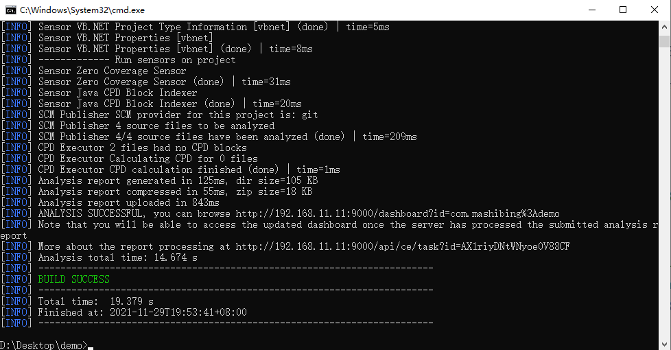 |

- 查看Sonar Qube界面检测结果

  |              Sonar Qube检测结果              |
  | :--------------------------------------: |
  |  |

##### 7.3.2 Sonar-scanner实现代码检测

- 下载Sonar-scanner：https://binaries.sonarsource.com/Distribution/sonar-scanner-cli/

  下载4.6.x版本即可，要求Linux版本

- 解压并配置sonar服务端信息

  - 由于是zip压缩包，需要安装unzip解压插件

    ```sh
    yum -y install unzip
    ```

  - 解压压缩包

    ```sh
    unzip sonar-scanner-cli/sonar-scanner-cli-4.6.0.2311-linux.zip
    ```

  - 配置sonarQube服务端地址，修改conf下的sonar-scanner.properties

    |                 配置服务端信息                  |
    | :--------------------------------------: |
    | 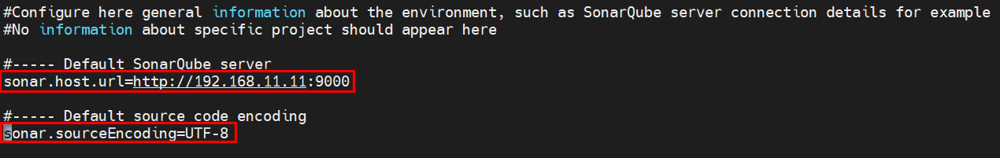 |

- 执行命令检测代码

  ```sh
  # 在项目所在目录执行以下命令
  ~/sonar-scanner/bin/sonar-scanner -Dsonar.sources=./ -Dsonar.projectname=demo -Dsonar.projectKey=java -Dsonar.java.binaries=target/
  ```

  [Ps：主要查看我的sonar-scanner执行命令的位置]()

  |                  查看日志信息                  |
  | :--------------------------------------: |
  | 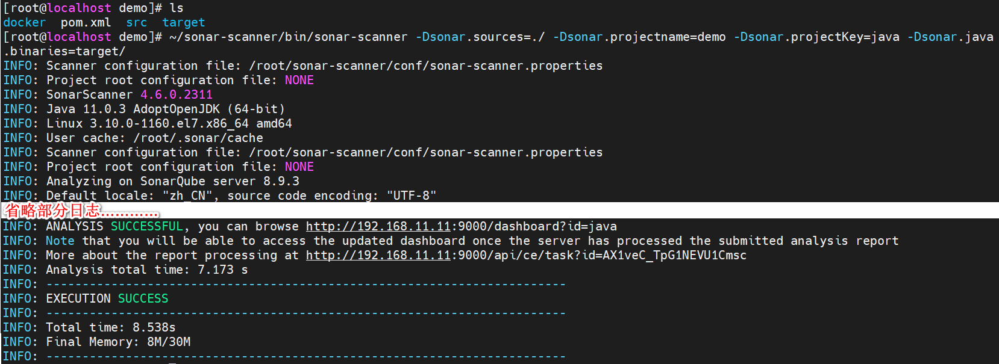 |

- 查看SonarQube界面检测结果

  |                   检测结果                   |
  | :--------------------------------------: |
  |  |

#### 7.4 Jenkins集成Sonar Qube

Jenkins继承Sonar Qube实现代码扫描需要先下载整合插件

##### 7.4.1 Jenkins安装插件

|              下载Sonar Qube插件              |
| :--------------------------------------: |
| 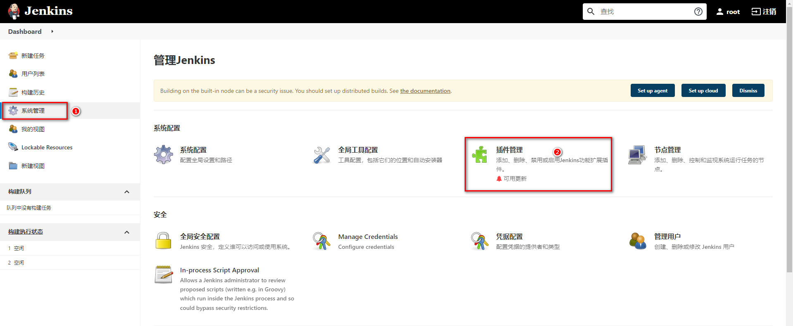 |
| 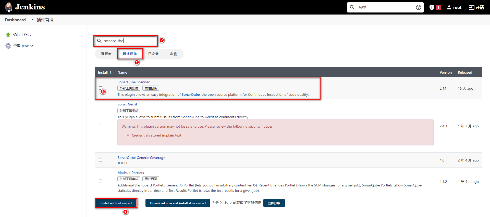 |
| 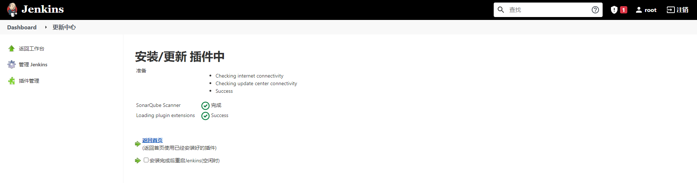 |

##### 7.4.2 Jenkins配置Sonar Qube

- 开启Sonar Qube权限验证

  |             开启Sonar Qube权限校验             |
  | :--------------------------------------: |
  |  |

- 获取Sonar Qube的令牌

  |                   获取令牌                   |
  | :--------------------------------------: |
  | 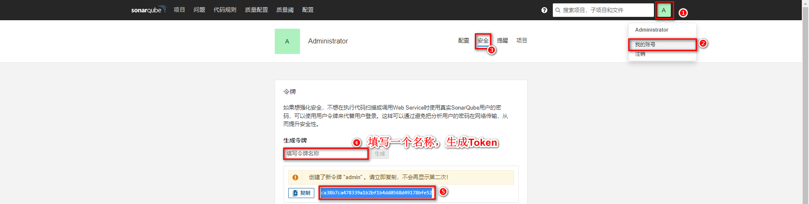 |

- 配置Jenkins的Sonar Qube信息

  |                                          |
  | ---------------------------------------- |
  | 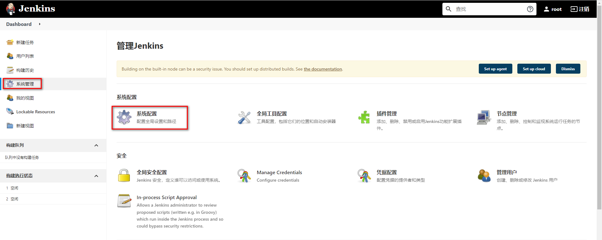 |
  | 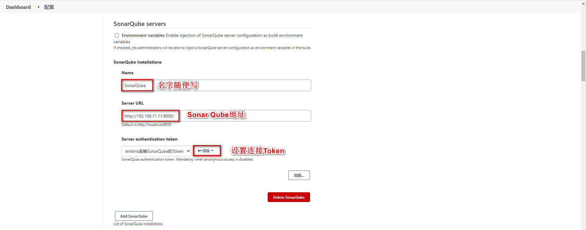 |
  | 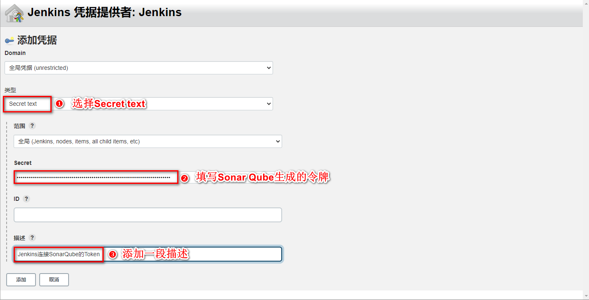 |


##### 7.4.3 配置Sonar-scanner

- 将Sonar-scaner添加到Jenkins数据卷中并配置全局配置

  |             配置Sonar-scanner              |
  | :--------------------------------------: |
  | 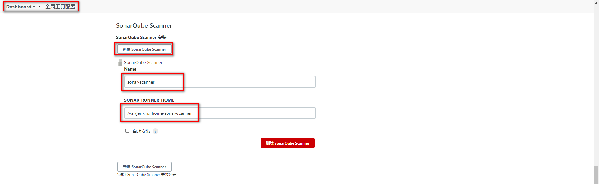 |

- 配置任务的Sonar-scanner

  |            配置任务的Sonar-scanner            |
  | :--------------------------------------: |
  | 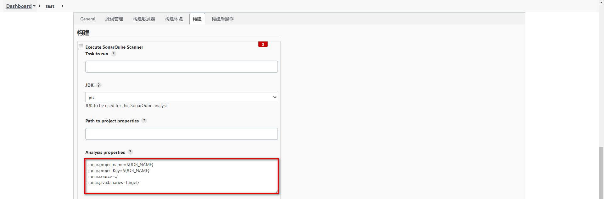 |

##### 7.4.4 构建任务

|                   构建任务                   |
| :--------------------------------------: |
| 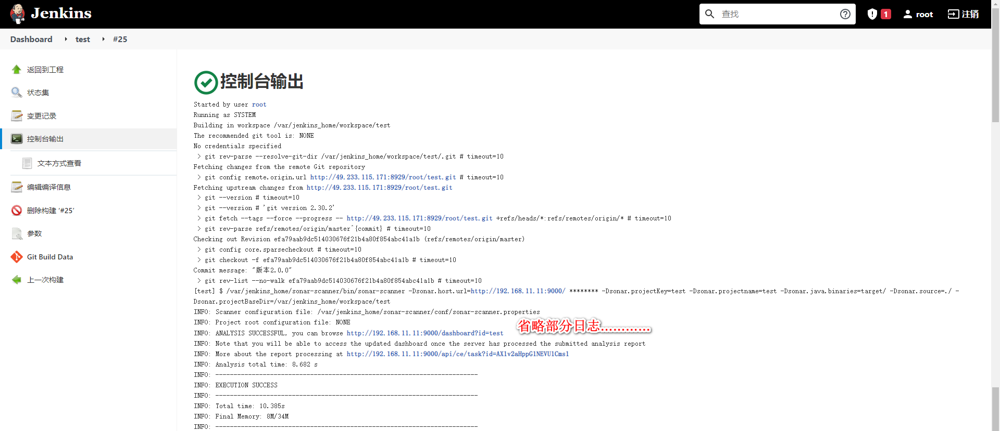 |
|  |


### 八、集成Harbor

#### 8.1 Harbor介绍

前面在部署项目时，我们主要采用Jenkins推送jar包到指定服务器，再通过脚本命令让目标服务器对当前jar进行部署，这种方式在项目较多时，每个目标服务器都需要将jar包制作成自定义镜像再通过docker进行启动，重复操作比较多，会降低项目部署时间。

我们可以通过Harbor作为私有的Docker镜像仓库。让Jenkins统一将项目打包并制作成Docker镜像发布到Harbor仓库中，只需要通知目标服务，让目标服务统一去Harbor仓库上拉取镜像并在本地部署即可。

Docker官方提供了Registry镜像仓库，但是Registry的功能相对简陋。Harbor是VMware公司提供的一款镜像仓库，提供了权限控制、分布式发布、强大的安全扫描与审查机制等功能

#### 8.2 Harbor安装

这里采用原生的方式安装Harbor。

- 下载Harbor安装包：https://github.com/goharbor/harbor/releases/download/v2.3.4/harbor-offline-installer-v2.3.4.tgz

- 拖拽到Linux并解压：

  ```
  tar -zxvf harbor-offline-installer-v2.3.4.tgz -C /usr/local/
  ```

- 修改Harbor配置文件：

  - 首先复制一份harbor.yml配置

    ```sh
    cp harbor.yml.tmpl harbor.yml
    ```

  - 编辑harbor.yml配置文件

    |                配置Harbor文件                |
    | :--------------------------------------: |
    | 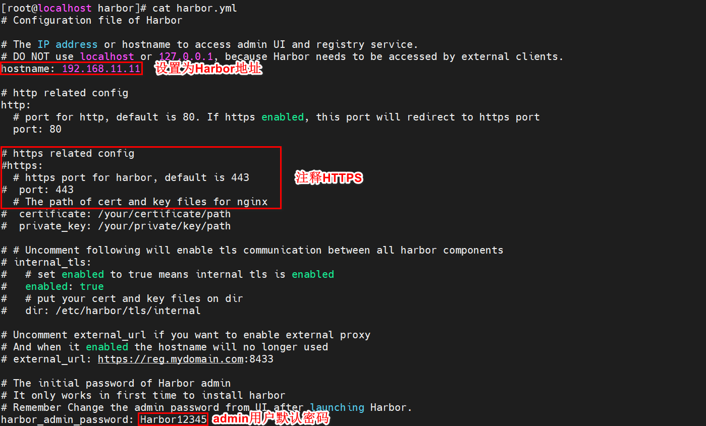 |

- 启动Harbor

  ```sh
  ./install.sh
  ```

  |                   查看日志                   |
  | :--------------------------------------: |
  | 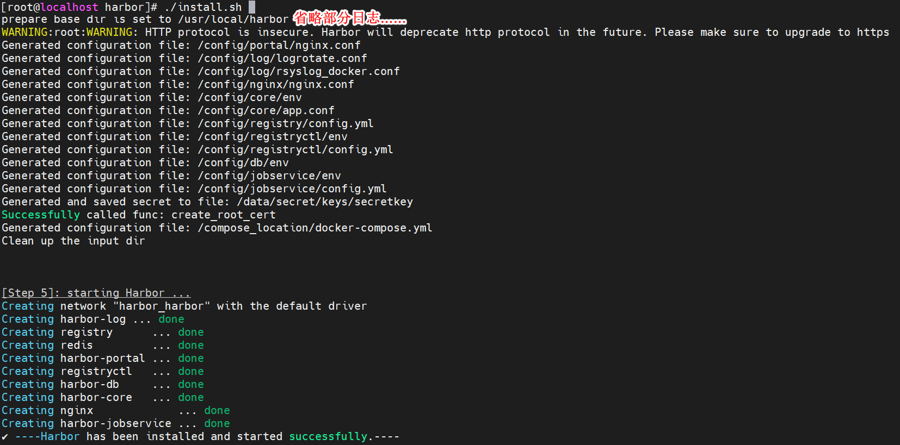 |

- 登录Harbor

  |                 登录Harbor                 |
  | :--------------------------------------: |
  |  |

- 首页信息

  |                   首页信息                   |
  | :--------------------------------------: |
  | 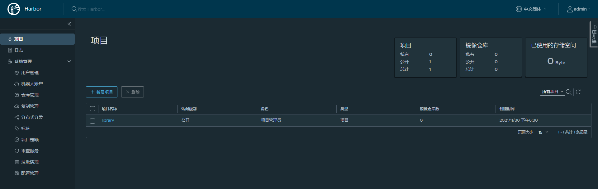 |

#### 8.3 Harbor使用方式

Harbor作为镜像仓库，主要的交互方式就是将镜像上传到Harbor上，以及从Harbor上下载指定镜像

在传输镜像前，可以先使用Harbor提供的权限管理，将项目设置为私有项目，并对不同用户设置不同角色，从而更方便管理镜像。

##### 8.3.1 添加用户构建项目

- 创建用户

  |                   创建用户                   |
  | :--------------------------------------: |
  | 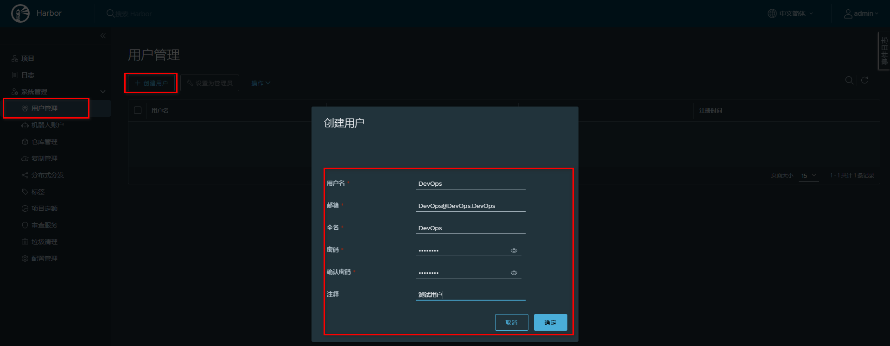 |

- 构建项目（设置为私有）

  |                   构建项目                   |
  | :--------------------------------------: |
  |  |

- 给项目追加用户

  |                  追加用户管理                  |
  | :--------------------------------------: |
  |  |

- 切换测试用户

  |                  切换测试用户                  |
  | :--------------------------------------: |
  | 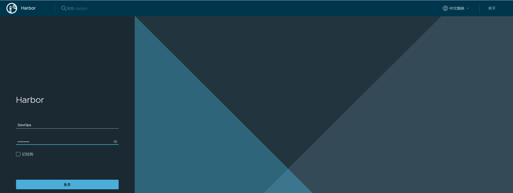 |

##### 8.3.2 发布镜像到Harbor

- 修改镜像名称

  名称要求：[harbor地址/项目名/镜像名:版本]()

  | 修改镜像名称                                   |
  | ---------------------------------------- |
  | 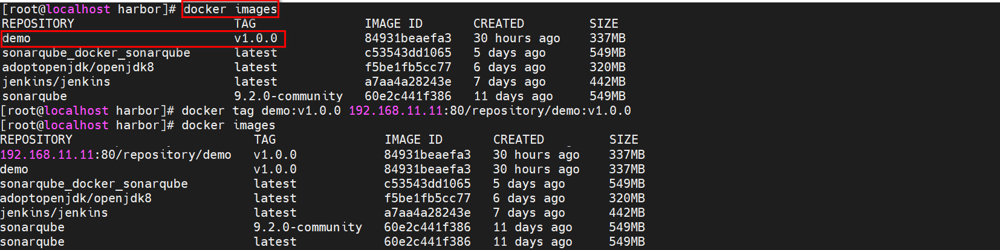 |

- 修改daemon.json，支持Docker仓库，并重启Docker

  |         修改daemon.json，支持Docker仓库         |
  | :--------------------------------------: |
  | 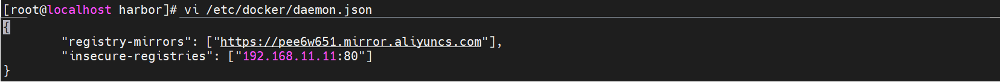 |

- 设置登录仓库信息

  ```sh
  docker login -u 用户名 -p 密码 Harbor地址
  ```

- 推送镜像到Harbor

  |               推送镜像到Harbor                |
  | :--------------------------------------: |
  | 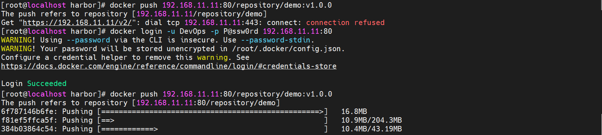 |
  |  |

##### 8.3.3 从Harbor拉取镜像ls

跟传统方式一样，不过需要先配置[/etc/docker/daemon.json]()文件

```json
{
        "registry-mirrors": ["https://pee6w651.mirror.aliyuncs.com"],
        "insecure-registries": ["192.168.11.11:80"]
}
```

|                   拉取镜像                   |
| :--------------------------------------: |
| 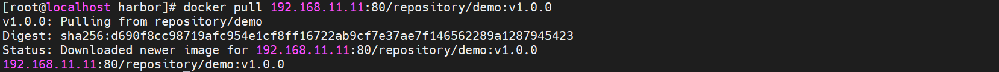 |

##### 8.3.4 Jenkins容器使用宿主机Docker

构建镜像和发布镜像到harbor都需要使用到docker命令。而在Jenkins容器内部安装Docker官方推荐直接采用宿主机带的Docker即可。

设置Jenkins容器使用宿主机Docker

- 设置宿主机docker.sock权限：

  ```sh
  sudo chown root:root /var/run/docker.sock
  sudo chmod o+rw /var/run/docker.sock
  ```

- 添加数据卷

  ```yml
  version: "3.1"
  services:
    jenkins:
      image: jenkins/jenkins
      container_name: jenkins
      ports:
        - 8080:8080
        - 50000:50000
      volumes:
        - ./data/:/var/jenkins_home/
        - /usr/bin/docker:/usr/bin/docker
        - /var/run/docker.sock:/var/run/docker.sock
        - /etc/docker/daemon.json:/etc/docker/daemon.json
  ```


##### 8.3.5 添加构建操作

|                 制作自定义镜像                  |
| :--------------------------------------: |
| 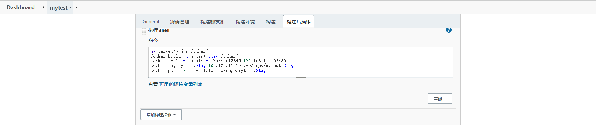 |


##### 8.3.6 编写部署脚本

部署项目需要通过Publish Over SSH插件，让目标服务器执行命令。为了方便一次性实现拉取镜像和启动的命令，推荐采用脚本文件的方式。

添加脚本文件到目标服务器，再通过Publish Over SSH插件让目标服务器执行脚本即可。

- 编写脚本文件，添加到目标服务器

  ```sh
  harbor_url=$1
  harbor_project_name=$2
  project_name=$3
  tag=$4
  port=$5

  imageName=$harbor_url/$harbor_project_name/$project_name:$tag

  containerId=`docker ps -a | grep ${project_name} | awk '{print $1}'`
  if [ "$containerId" != "" ] ; then
      docker stop $containerId
      docker rm $containerId
      echo "Delete Container Success"
  fi

  imageId=`docker images | grep ${project_name} | awk '{print $3}'`

  if [ "$imageId" != "" ] ; then
      docker rmi -f $imageId
      echo "Delete Image Success"
  fi

  docker login -u DevOps -p P@ssw0rd $harbor_url

  docker pull $imageName

  docker run -d -p $port:$port --name $project_name $imageName

  echo "Start Container Success"
  echo $project_name
  ```

  并设置权限为可执行

  ```
  chmod a+x deploy.sh
  ```

  |                    如图                    |
  | :--------------------------------------: |
  | 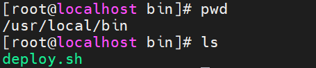 |

##### 8.3.7 配置构建后操作

|                  执行脚本文件                  |
| :--------------------------------------: |
| 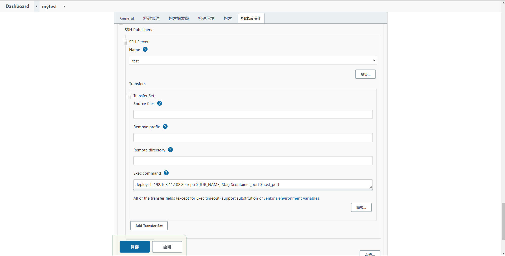 |


### 九、Jenkins流水线

#### 9.1 Jenkins流水线任务介绍

之前采用Jenkins的自由风格构建的项目，每个步骤流程都要通过不同的方式设置，并且构建过程中整体流程是不可见的，无法确认每个流程花费的时间，并且问题不方便定位问题。

Jenkins的Pipeline可以让项目的发布整体流程可视化，明确执行的阶段，可以快速的定位问题。并且整个项目的生命周期可以通过一个Jenkinsfile文件管理，而且Jenkinsfile文件是可以放在项目中维护。

所以Pipeline相对自由风格或者其他的项目风格更容易操作。

#### 9.2 Jenkins流水线任务

##### 9.2.1 构建Jenkins流水线任务

- 构建任务

  | 构建Jenkins流水线任务                           |
  | ---------------------------------------- |
  | 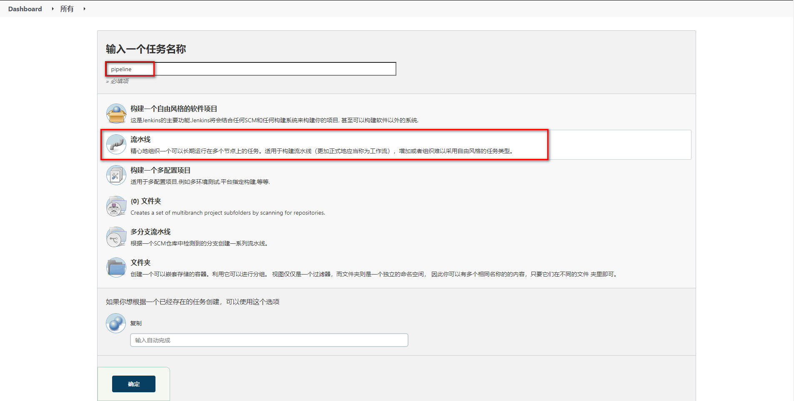 |

- 生成Groovy脚本

  |             Hello World脚本生成              |
  | :--------------------------------------: |
  | 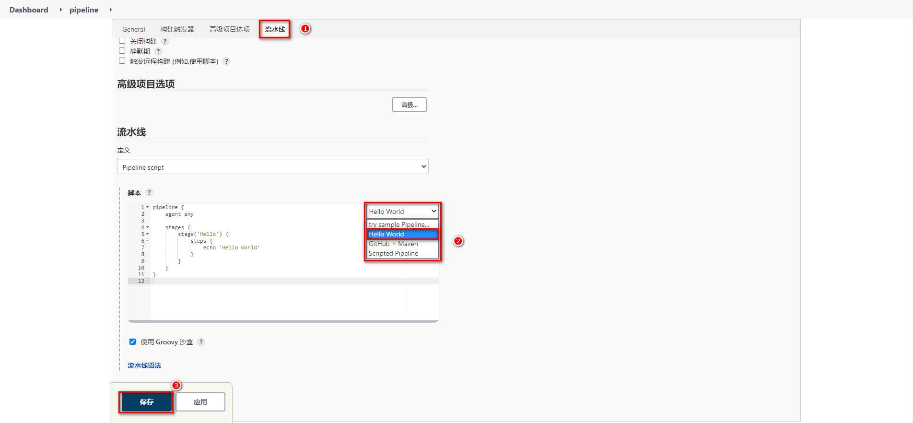 |

- 构建后查看视图

  |                 构建后查看视图                  |
  | :--------------------------------------: |
  | 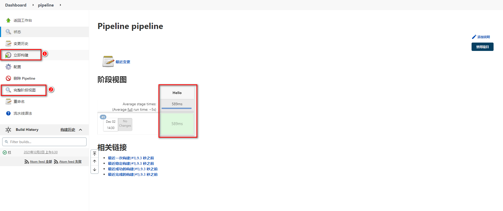 |

##### 9.2.2 Groovy脚本

- Groovy脚本基础语法

  ```sh
  // 所有脚本命令包含在pipeline{}中
  pipeline {  
  	// 指定任务在哪个节点执行（Jenkins支持分布式）
      agent any
      
      // 配置全局环境，指定变量名=变量值信息
      environment{
      	host = '192.168.11.11'
      }

      // 存放所有任务的合集
      stages {
      	// 单个任务
          stage('任务1') {
          	// 实现任务的具体流程
              steps {
                  echo 'do something'
              }
          }
  		// 单个任务
          stage('任务2') {
          	// 实现任务的具体流程
              steps {
                  echo 'do something'
              }
          }
          // ……
      }
  }
  ```

- 编写例子测试

  ```sh
  pipeline {
      agent any

      // 存放所有任务的合集
      stages {
          stage('拉取Git代码') {
              steps {
                  echo '拉取Git代码'
              }
          }

          stage('检测代码质量') {
              steps {
                  echo '检测代码质量'
              }
          }

          stage('构建代码') {
              steps {
                  echo '构建代码'
              }
          }

          stage('制作自定义镜像并发布Harbor') {
              steps {
                  echo '制作自定义镜像并发布Harbor'
              }
          }

          stage('基于Harbor部署工程') {
              steps {
                  echo '基于Harbor部署工程'
              }
          }
      }
  }
  ```

  |                配置Grovvy脚本                |
  | :--------------------------------------: |
  |  |

- 查看效果

  |                   查看效果                   |
  | :--------------------------------------: |
  |  |

[Ps：涉及到特定脚本，Jenkins给予了充足的提示，可以自动生成命令]()

|                  生成命令位置                  |
| :--------------------------------------: |
| 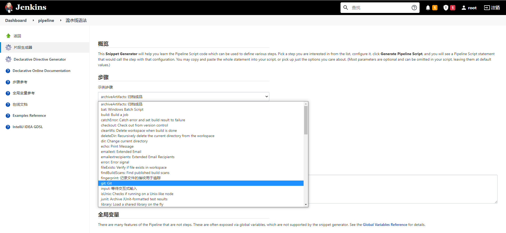 |

##### 9.2.3 Jenkinsfile实现

Jenkinsfile方式需要将脚本内容编写到项目中的Jenkinsfile文件中，每次构建会自动拉取项目并且获取项目中Jenkinsfile文件对项目进行构建

- 配置pipeline

  |                配置pipeline                |
  | :--------------------------------------: |
  | 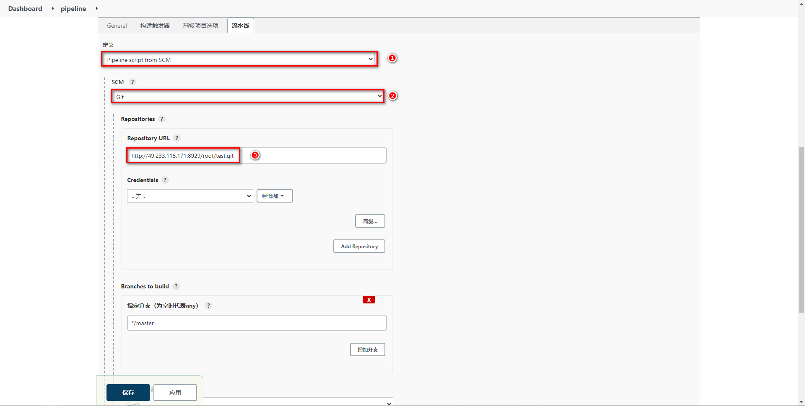 |

- 准备Jenkinsfile

  |             准备Jenkinsfile文件              |
  | :--------------------------------------: |
  |  |

- 测试效果

  |                   测试效果                   |
  | :--------------------------------------: |
  |  |


#### 9.3 Jenkins流水线任务实现

##### 9.3.1 参数化构建

添加参数化构建，方便选择不的项目版本

|                 Git参数化构建                 |
| :--------------------------------------: |
| 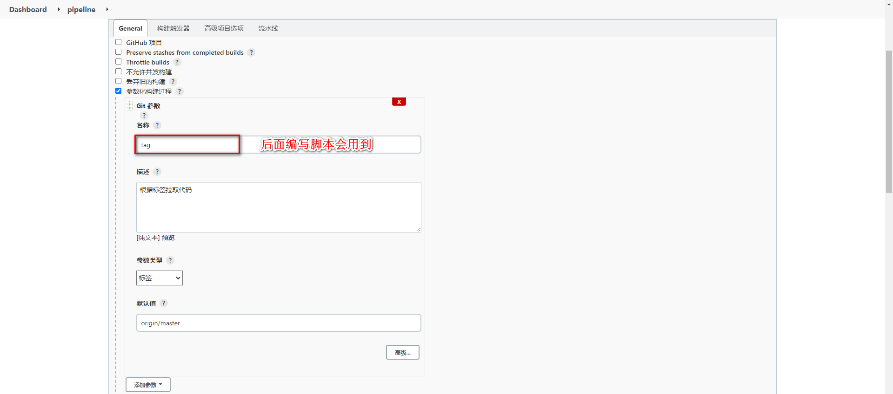 |

##### 9.3.2 拉取Git代码

通过流水线语法生成Checkout代码的脚本

|                   语法生成                   |
| :--------------------------------------: |
| 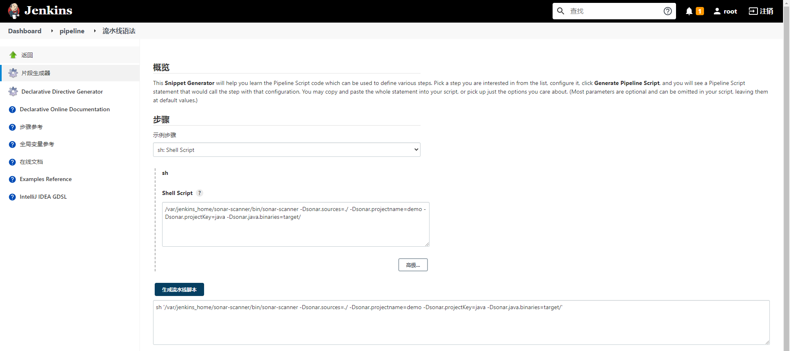 |

将*/master更改为标签[${tag}]()

```sh
pipeline {
    agent any
    stages {

        stage('拉取Git代码') {
            steps {
                checkout([$class: 'GitSCM', branches: [[name: '${tag}']], extensions: [], userRemoteConfigs: [[url: 'http://49.233.115.171:8929/root/test.git']]])
            }
        }
    }
}
```


##### 9.3.3 构建代码

通过脚本执行mvn的构建命令

```sh
pipeline {
    agent any

    stages {

        stage('拉取Git代码') {
            steps {
                checkout([$class: 'GitSCM', branches: [[name: '${tag}']], extensions: [], userRemoteConfigs: [[url: 'http://49.233.115.171:8929/root/test.git']]])
            }
        }

        stage('构建代码') {
            steps {
                sh '/var/jenkins_home/maven/bin/mvn clean package -DskipTests'
            }
        }
}

```


##### 9.3.4 代码质量检测

通过脚本执行sonar-scanner命令即可

```sh
pipeline {
    agent any

    stages {

        stage('拉取Git代码') {
            steps {
                checkout([$class: 'GitSCM', branches: [[name: '${tag}']], extensions: [], userRemoteConfigs: [[url: 'http://49.233.115.171:8929/root/test.git']]])
            }
        }

        stage('构建代码') {
            steps {
                sh '/var/jenkins_home/maven/bin/mvn clean package -DskipTests'
            }
        }

        stage('检测代码质量') {
            steps {
                sh '/var/jenkins_home/sonar-scanner/bin/sonar-scanner -Dsonar.sources=./ -Dsonar.projectname=${JOB_NAME} -Dsonar.projectKey=${JOB_NAME} -Dsonar.java.binaries=target/ -Dsonar.login=31388be45653876c1f51ec02f0d478e2d9d0e1fa' 
            }
        }
    }
}

```


##### 9.3.5 制作自定义镜像并发布

- 生成自定义镜像脚本

  ```sh
  pipeline {
      agent any
      environment{
          harborHost = '192.168.11.11:80'
          harborRepo = 'repository'
          harborUser = 'DevOps'
          harborPasswd = 'P@ssw0rd'
      }

      // 存放所有任务的合集
      stages {

          stage('拉取Git代码') {
              steps {
                  checkout([$class: 'GitSCM', branches: [[name: '${tag}']], extensions: [], userRemoteConfigs: [[url: 'http://49.233.115.171:8929/root/test.git']]])
              }
          }

          stage('构建代码') {
              steps {
                  sh '/var/jenkins_home/maven/bin/mvn clean package -DskipTests'
              }
          }

          stage('检测代码质量') {
              steps {
                  sh '/var/jenkins_home/sonar-scanner/bin/sonar-scanner -Dsonar.sources=./ -Dsonar.projectname=${JOB_NAME} -Dsonar.projectKey=${JOB_NAME} -Dsonar.java.binaries=target/ -Dsonar.login=31388be45653876c1f51ec02f0d478e2d9d0e1fa' 
              }
          }

          stage('制作自定义镜像并发布Harbor') {
              steps {
                  sh '''cp ./target/*.jar ./docker/
                  cd ./docker
                  docker build -t ${JOB_NAME}:${tag} ./'''

                  sh '''docker login -u ${harborUser} -p ${harborPasswd} ${harborHost}
                  docker tag ${JOB_NAME}:${tag} ${harborHost}/${harborRepo}/${JOB_NAME}:${tag}
                  docker push ${harborHost}/${harborRepo}/${JOB_NAME}:${tag}'''
              }
          }
      }
  }
  ```

- 生成Publish Over SSH脚本

  ```sh
  pipeline {
      agent any
      environment{
          harborHost = '192.168.11.11:80'
          harborRepo = 'repository'
          harborUser = 'DevOps'
          harborPasswd = 'P@ssw0rd'
      }

      // 存放所有任务的合集
      stages {

          stage('拉取Git代码') {
              steps {
                  checkout([$class: 'GitSCM', branches: [[name: '${tag}']], extensions: [], userRemoteConfigs: [[url: 'http://49.233.115.171:8929/root/test.git']]])
              }
          }

          stage('构建代码') {
              steps {
                  sh '/var/jenkins_home/maven/bin/mvn clean package -DskipTests'
              }
          }docker

          stage('检测代码质量') {
              steps {
                  sh '/var/jenkins_home/sonar-scanner/bin/sonar-scanner -Dsonar.sources=./ -Dsonar.projectname=${JOB_NAME} -Dsonar.projectKey=${JOB_NAME} -Dsonar.java.binaries=target/ -Dsonar.login=7d66af4b39cfe4f52ac0a915d4c9d5c513207098' 
              }
          }

          stage('制作自定义镜像并发布Harbor') {
              steps {
                  sh '''cp ./target/*.jar ./docker/
                  cd ./docker
                  docker build -t ${JOB_NAME}:${tag} ./'''

                  sh '''docker login -u ${harborUser} -p ${harborPasswd} ${harborHost}
                  docker tag ${JOB_NAME}:${tag} ${harborHost}/${harborRepo}/${JOB_NAME}:${tag}
                  docker push ${harborHost}/${harborRepo}/${JOB_NAME}:${tag}'''
              }
          }
          
          stage('目标服务器拉取镜像并运行') {
              steps {
                  sshPublisher(publishers: [sshPublisherDesc(configName: 'testEnvironment', transfers: [sshTransfer(cleanRemote: false, excludes: '', execCommand: "/usr/bin/deploy.sh $harborHost $harborRepo $JOB_NAME $tag $port ", execTimeout: 120000, flatten: false, makeEmptyDirs: false, noDefaultExcludes: false, patternSeparator: '[, ]+', remoteDirectory: '', remoteDirectorySDF: false, removePrefix: '', sourceFiles: '')], usePromotionTimestamp: false, useWorkspaceInPromotion: false, verbose: false)])
              }
          }
      }
  }
  ```

[Ps：由于采用变量，记得使用双引号](
)

#### 9.4 Jenkins流水线整合钉钉

在程序部署成功后，可以通过钉钉的机器人及时向群众发送部署的最终结果通知

- 安装插件

  |                   安装插件                   |
  | :--------------------------------------: |
  |  |

- 钉钉内部创建群组并构建机器人

  |              钉钉内部创建群组并构建机器人              |
  | :--------------------------------------: |
  |  |
  |  |
  | 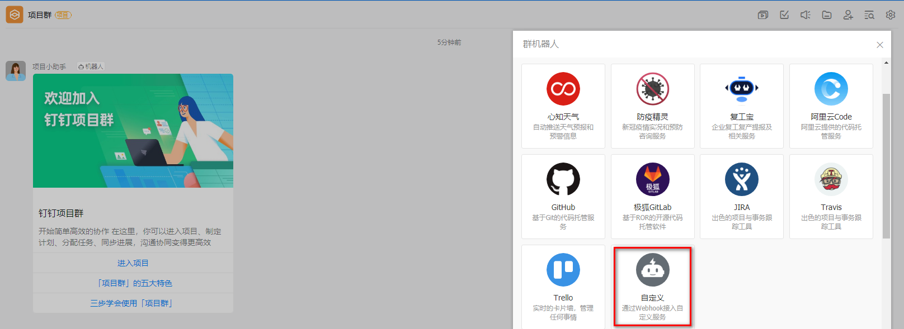 |

  最终或获取到Webhook信息

  ```
  https://oapi.dingtalk.com/robot/send?access_token=kej4ehkj34gjhg34jh5bh5jb34hj53b4
  ```

- 系统配置添加钉钉通知

  |                  配置钉钉通知                  |
  | :--------------------------------------: |
  | 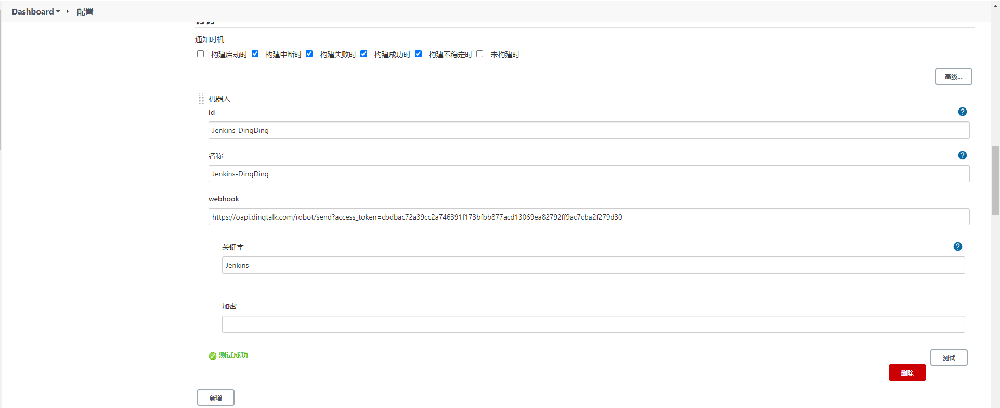 |


- 任务中追加流水线配置

  ```sh
  pipeline {
      agent any

      environment {
          sonarLogin = '2bab7bf7d5af25e2c2ca2f178af2c3c55c64d5d8'
          harborUser = 'admin'
          harborPassword = 'Harbor12345'
          harborHost = '192.168.11.12:8888'
          harborRepo = 'repository'
      }

      stages {
          stage('拉取Git代码'){
              steps {
                  checkout([$class: 'GitSCM', branches: [[name: '$tag']], extensions: [], userRemoteConfigs: [[url: 'http://49.233.115.171:8929/root/lsx.git']]])
              }
          }
          stage('Maven构建代码'){
              steps {
                  sh '/var/jenkins_home/maven/bin/mvn clean package -DskipTests'
              }
          }
          stage('SonarQube检测代码'){
              steps {
                  sh '/var/jenkins_home/sonar-scanner/bin/sonar-scanner -Dsonar.sources=./ -Dsonar.projectname=${JOB_NAME} -Dsonar.projectKey=${JOB_NAME} -Dsonar.java.binaries=target/ -Dsonar.login=${sonarLogin}'
              }
          }
          stage('制作自定义镜像'){
              steps {
                  sh '''cd docker
                  mv ../target/*.jar ./
                  docker build -t ${JOB_NAME}:$tag .
                  '''
              }
          }

          stage('推送自定义镜像'){
              steps {
                  sh '''docker login -u ${harborUser} -p ${harborPassword} ${harborHost}
                  docker tag ${JOB_NAME}:$tag ${harborHost}/${harborRepo}/${JOB_NAME}:$tag
                  docker push ${harborHost}/${harborRepo}/${JOB_NAME}:$tag'''
              }
          }

          stage('通知目标服务器'){
              steps {
                  sshPublisher(publishers: [sshPublisherDesc(configName: 'centos-docker', transfers: [sshTransfer(cleanRemote: false, excludes: '', execCommand: "/usr/bin/deploy.sh $harborHost $harborRepo $JOB_NAME $tag $port", execTimeout: 120000, flatten: false, makeEmptyDirs: false, noDefaultExcludes: false, patternSeparator: '[, ]+', remoteDirectory: '', remoteDirectorySDF: false, removePrefix: '', sourceFiles: '')], usePromotionTimestamp: false, useWorkspaceInPromotion: false, verbose: false)])
              }  
          }
      }
      post {
          success {
              dingtalk (
                  robot: 'Jenkins-DingDing',
                  type:'MARKDOWN',
                  title: "success: ${JOB_NAME}",
                  text: ["- 成功构建:${JOB_NAME}项目!\n- 版本:${tag}\n- 持续时间:${currentBuild.durationString}\n- 任务:#${JOB_NAME}"]
              )
          }
          failure {
              dingtalk (
                  robot: 'Jenkins-DingDing',
                  type:'MARKDOWN',
                  title: "fail: ${JOB_NAME}",
                  text: ["- 失败构建:${JOB_NAME}项目!\n- 版本:${tag}\n- 持续时间:${currentBuild.durationString}\n- 任务:#${JOB_NAME}"]
              )
          }
      }
  }
  ```

- 查看效果

  |                  钉钉通知效果                  |
  | :--------------------------------------: |
  | 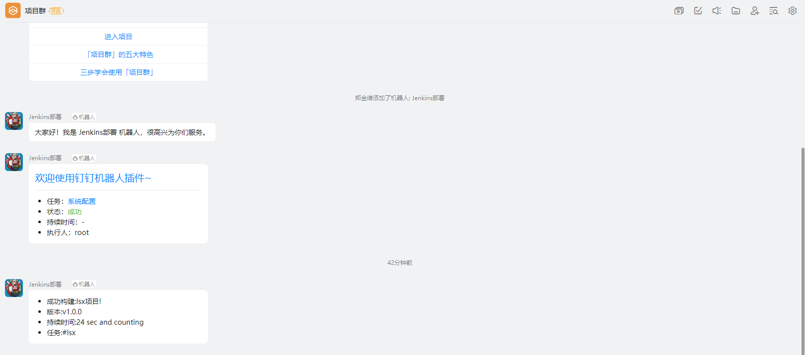 |


###十、Kubernetes编排工具

#### 10.1 Kubernetes介绍

Kubernetes是一个开源的，用于管理云平台中多个主机上的容器化的应用，Kubernetes的目标是让部署容器化的应用简单并且高效（powerful），Kubernetes提供了应用部署，规划，更新，维护的一种机制。

Kubernetes一个核心的特点就是能够自主的管理容器来保证云平台中的容器按照用户的期望状态运行着，管理员可以加载一个微型服务，让规划器来找到合适的位置，同时，Kubernetes也系统提升工具以及人性化方面，让用户能够方便的部署自己的应用。

Kubernetes主要能帮助我们完成：

- 服务发现和负载均衡

  Kubernetes 可以使用 DNS 名称或自己的 IP 地址公开容器，如果进入容器的流量很大， Kubernetes 可以负载均衡并分配网络流量，从而使部署稳定。

- 存储编排

  Kubernetes 允许你自动挂载你选择的存储系统，比如本地存储，类似Docker的数据卷。

- 自动部署和回滚

  你可以使用 Kubernetes 描述已部署容器的所需状态，它可以以受控的速率将实际状态 更改为期望状态。Kubernetes 会自动帮你根据情况部署创建新容器，并删除现有容器给新容器提供资源。

- 自动完成装箱计算

  Kubernetes 允许你设置每个容器的资源，比如CPU和内存。

- 自我修复

  Kubernetes 重新启动失败的容器、替换容器、杀死不响应用户定义的容器，并运行状况检查的容器。

- 秘钥与配置管理

  Kubernetes 允许你存储和管理敏感信息，例如密码、OAuth 令牌和 ssh 密钥。你可以在不重建容器镜像的情况下部署和更新密钥和应用程序配置，也无需在堆栈配置中暴露密钥。


#### 10.2 Kubernetes架构

Kubernetes 搭建需要至少两个节点，一个Master负责管理，一个Slave搭建在工作服务器上负责分配。

|               kubernetes架构               |
| :--------------------------------------: |
| 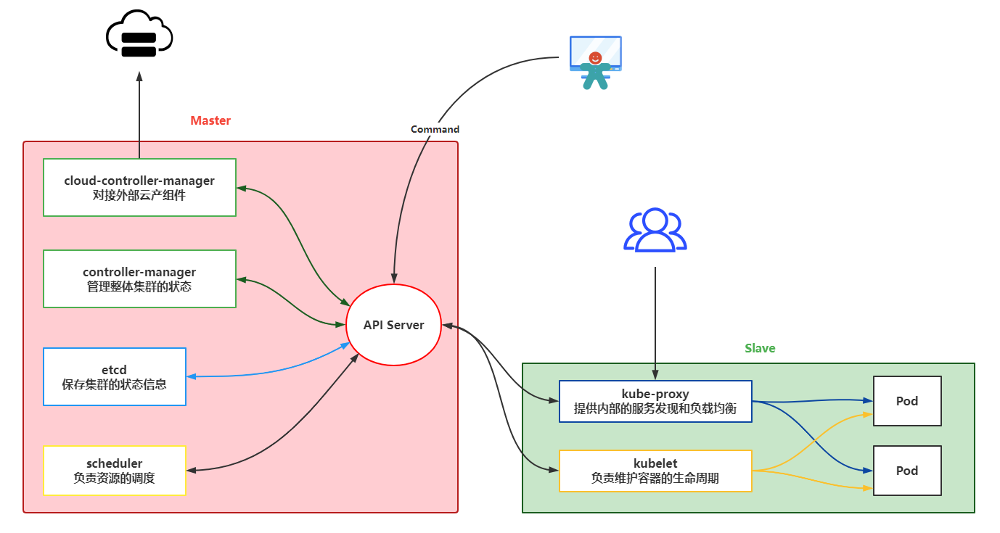 |

从图中可以看到各个组件的基本功能：

- API Server：作为K8s通讯的核心组件，K8s内部交互以及接收发送指令的组件。
- controller-manager：作为K8s的核心组件，主要做资源调度，根据集群情况分配资源
- etcd：一个key-value的数据库，存储存储集群的状态信息
- scheduler：负责调度每个工作节点
- cloud-controller-manager：负责调度其他云服务产品
- kubelet：管理Pods上面的容器。
- kube-proxy：负责处理其他Slave或客户端的请求。
- Pod：可以理解为就是运行的容器


#### 10.3 Kubernetes安装

这里会采用https://kuboard.cn/提供的方式安装K8s，安装单Master节点

- 要求使用Centos7.8版本：https://vault.centos.org/7.8.2003/isos/x86_64/CentOS-7-x86_64-Minimal-2003.iso
- 至少2台 **2核4G** 的服务器

安装流程

|                   安装流程                   |
| :--------------------------------------: |
| 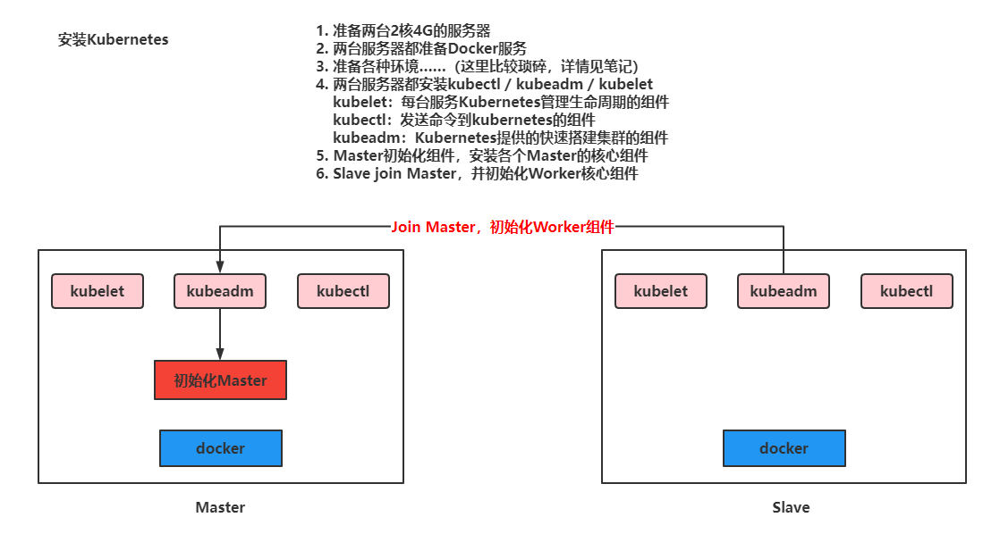 |

准备好服务器后开始安装

- 重新设置hostname，不允许为localhost

  ```sh
  # 修改 hostname，名字不允许使用下划线、小数点、大写字母，不能叫master
  hostnamectl set-hostname your-new-host-name
  # 查看修改结果
  hostnamectl status
  # 设置 hostname 解析
  echo "127.0.0.1   $(hostname)" >> /etc/hosts
  ```

- 要求2台服务之间可以相互通讯

- 安装软件

  ```sh
  # 阿里云 docker hub 镜像
  export REGISTRY_MIRROR=https://registry.cn-hangzhou.aliyuncs.com
  curl -sSL https://kuboard.cn/install-script/v1.19.x/install_kubelet.sh | sh -s 1.19.5
  ```

首先初始化Master节点

> 关于初始化时用到的环境变量
>
> - **APISERVER_NAME** 不能是 master 的 hostname
> - **APISERVER_NAME** 必须全为小写字母、数字、小数点，不能包含减号
> - **POD_SUBNET** 所使用的网段不能与 ***master节点/worker节点*** 所在的网段重叠。该字段的取值为一个 [CIDR](https://kuboard.cn/glossary/cidr.html) 值，如果您对 CIDR 这个概念还不熟悉，请仍然执行 export POD_SUBNET=10.100.0.0/16 命令，不做修改

- 设置ip，域名，网段并执行初始化操作

  ```sh
  # 只在 master 节点执行
  # 替换 x.x.x.x 为 master 节点实际 IP（请使用内网 IP）
  # export 命令只在当前 shell 会话中有效，开启新的 shell 窗口后，如果要继续安装过程，请重新执行此处的 export 命令
  export MASTER_IP=192.168.11.32
  # 替换 apiserver.demo 为 您想要的 dnsName
  export APISERVER_NAME=apiserver.demo
  # Kubernetes 容器组所在的网段，该网段安装完成后，由 kubernetes 创建，事先并不存在于您的物理网络中
  export POD_SUBNET=10.100.0.1/16
  echo "${MASTER_IP}    ${APISERVER_NAME}" >> /etc/hosts
  curl -sSL https://kuboard.cn/install-script/v1.19.x/init_master.sh | sh -s 1.19.5
  ```

- 检查Master启动状态

  ```sh
  # 只在 master 节点执行

  # 执行如下命令，等待 3-10 分钟，直到所有的容器组处于 Running 状态
  watch kubectl get pod -n kube-system -o wide

  # 查看 master 节点初始化结果
  kubectl get nodes -o wide
  ```


`Ps：如果出现NotReady的情况执行（最新版本的BUG，1.19一般没有）`

```sh
docker pull quay.io/coreos/flannel:v0.10.0-amd64 
mkdir -p /etc/cni/net.d/
cat <<EOF> /etc/cni/net.d/10-flannel.conf
{"name":"cbr0","type":"flannel","delegate": {"isDefaultGateway": true}}
EOF
mkdir /usr/share/oci-umount/oci-umount.d -p
mkdir /run/flannel/
cat <<EOF> /run/flannel/subnet.env
FLANNEL_NETWORK=172.100.0.0/16
FLANNEL_SUBNET=172.100.1.0/24
FLANNEL_MTU=1450
FLANNEL_IPMASQ=true
EOF
kubectl apply -f https://raw.githubusercontent.com/coreos/flannel/v0.9.1/Documentation/kube-flannel.yml
```

安装网络服务插件

```sh
export POD_SUBNET=10.100.0.0/16
kubectl apply -f https://kuboard.cn/install-script/v1.22.x/calico-operator.yaml
wget https://kuboard.cn/install-script/v1.22.x/calico-custom-resources.yaml
sed -i "s#192.168.0.0/16#${POD_SUBNET}#" calico-custom-resources.yaml
kubectl apply -f calico-custom-resources.yaml
```

初始化worker节点

- 获取Join命令参数，在Master节点执行

  ```sh
  # 只在 master 节点执行
  kubeadm token create --print-join-command
  ```

  |                   获取命令                   |
  | :--------------------------------------: |
  | 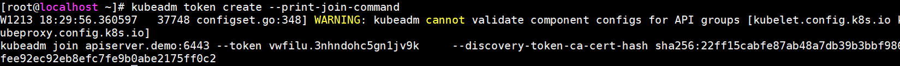 |


- 在worker节点初始化

  ```sh
  # 只在 worker 节点执行
  # 替换 x.x.x.x 为 master 节点的内网 IP
  export MASTER_IP=192.168.11.32
  # 替换 apiserver.demo 为初始化 master 节点时所使用的 APISERVER_NAME
  export APISERVER_NAME=apiserver.demo
  echo "${MASTER_IP}    ${APISERVER_NAME}" >> /etc/hosts

  # 替换为 master 节点上 kubeadm token create 命令的输出
  kubeadm join apiserver.demo:6443 --token vwfilu.3nhndohc5gn1jv9k     --discovery-token-ca-cert-hash sha256:22ff15cabfe87ab48a7db39b3bbf986fee92ec92eb8efc7fe9b0abe2175ff0c2
  ```

检查最终运行效果

- 在 master 节点上执行

  ```sh
  # 只在 master 节点执行
  kubectl get nodes -o wide
  ```

`Ps：如果出现NotReady的情况执行（最新版本的BUG，1.19一般没有）`

```sh
docker pull quay.io/coreos/flannel:v0.10.0-amd64 
mkdir -p /etc/cni/net.d/
cat <<EOF> /etc/cni/net.d/10-flannel.conf
{"name":"cbr0","type":"flannel","delegate": {"isDefaultGateway": true}}
EOF
mkdir /usr/share/oci-umount/oci-umount.d -p
mkdir /run/flannel/
cat <<EOF> /run/flannel/subnet.env
FLANNEL_NETWORK=172.100.0.0/16
FLANNEL_SUBNET=172.100.1.0/24
FLANNEL_MTU=1450
FLANNEL_IPMASQ=true
EOF
kubectl apply -f https://raw.githubusercontent.com/coreos/flannel/v0.9.1/Documentation/kube-flannel.yml
```

- 输出结果如下所示：

  ```sh
  [root@k8smaster ~]# kubectl get nodes
  ```

  |                  搭建成功效果                  |
  | :--------------------------------------: |
  | 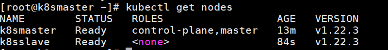 |


安装Kuboard管理K8s集群

- 安装Kuboard

  ```yml
  kubectl apply -f https://addons.kuboard.cn/kuboard/kuboard-v3.yaml
  # 您也可以使用下面的指令，唯一的区别是，该指令使用华为云的镜像仓库替代 docker hub 分发 Kuboard 所需要的镜像
  # kubectl apply -f https://addons.kuboard.cn/kuboard/kuboard-v3-swr.yaml
  ```

- 查看启动情况

  ```
  watch kubectl get pods -n kuboard
  ```

  |                   查看效果                   |
  | :--------------------------------------: |
  | 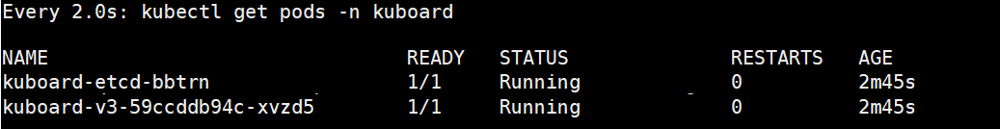 |

- 在浏览器中打开链接 http://your-node-ip-address:30080

  |                    首页                    |
  | :--------------------------------------: |
  | 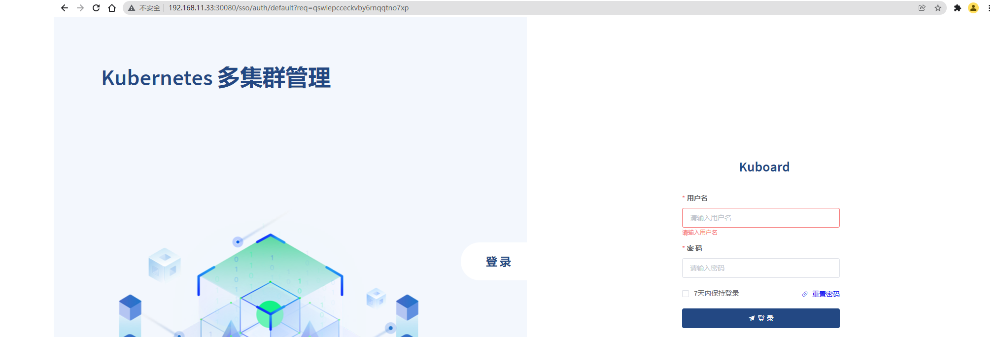 |

- 输入初始用户名和密码，并登录

  - 用户名： `admin`
  - 密码： `Kuboard123`

  |                   首页效果                   |
  | :--------------------------------------: |
  | 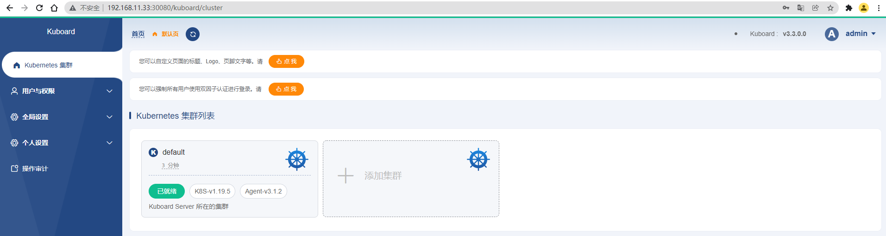 |


#### 10.4 Kubernetes操作

首先我们要了解Kubernetes在运行我们的资源时，关联到了哪些内容

* 资源的构建方式：

  * 采用kubectl的命令方式
  * yaml文件方式

##### 10.4.1 Namespace

* 命名空间：主要是为了对Kubernetes中运行的资源进行过隔离， 但是网络是互通的，类似Docker的容器，可以将多个资源配置到一个NameSpace中。而NameSpace可以对不同环境进行资源隔离，默认情况下Kubernetes提供了default命名空间，在构建资源时，如果不指定资源，默认采用default资源。
  命令方式：

  ```sh
  # 查看现有的全部命名空间
  kubectl get ns

  # 构建命名空间
  kubectl create ns 命名空间名称

  # 删除现有命名空间， 并且会删除空间下的全部资源
  kubectl delete ns 命名空间名称
  ```
  yaml文件方式：（构建资源时，设置命名空间）

  ```yaml
  apiVersion: v1
  kind: Namespace
  metadata:
    name: test
  ```

##### 10.4.2 Pod

* Pod：Kubernetes运行的一组容器，Pod是Kubernetes的最小单位，但是对于Docker而然，Pod中会运行多个Docker容器

  * 命令方式：
    ```bash
    # 查看所有运行的pod
    kubectl get pods -A

    # 查看指定Namespace下的Pod
    kubectl get pod [-n 命名空间]  #（默认default）

    # 创建Pod
    kubectl run pod名称 --image=镜像名称

    # 查看Pod详细信息
    kubectl describe pod pod名称

    # 删除pod
    kubectl delete pod pod名称 [-n 命名空间]  #（默认default）

    # 查看pod输出的日志
    kubectl logs -f pod名称

    # 进去pod容器内部
    kubectl exec -it pod名称 -- bash

    # 查看kubernetes给Pod分配的ip信息，并且通过ip和容器的端口，可以直接访问
    kubectl get pod -owide
    ```

  * yaml方式（推荐）
    ```yaml
    apiVersion: v1
    kind: Pod
    metadata:
      labels:
        run: 运行的pod名称
      name: pod名称
      namespace: 命名空间
    spec:
      containers:
      - image: 镜像名称
        name: 容器名称

    # 启动Pod：kubectl apply -f yaml文件名称
    # 删除Pod：kubectl delete -f yaml文件名称
    ```

  * Pod中运行多个容器

    ```yml
    apiVersion: v1
    kind: Pod
    metadata:
      labels:
        run: 运行的pod名称
      name: pod名称
      namespace: 命名空间
    spec:
      containers:
      - image: 镜像名称
        name: 容器名称
      - image: 镜像名称
        name: 容器名称
    …………    
    ```

    启动后可以查看到

    |                Kuboard效果                 |
    | :--------------------------------------: |
    | 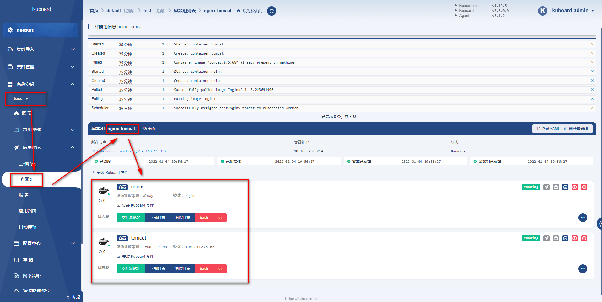 |

##### 10.4.3 Deployment

部署时，可以通过Deployment管理和编排Pod

Deployment部署实现

- 命令方式

  ```sh
  # 基于Deployment启动容器
  kubectl create deployment deployment名称 --image=镜像名称
  # 用deployment启动的容器会在被删除后自动再次创建，达到故障漂移的效果
  # 需要使用deploy的方式删除deploy
  # 查看现在的deployment
  kubectl get deployment

  # 删除deployment
  kubectl delete deployment deployment名称

  # 基于Deployment启动容器并设置Pod集群数
  kubectl create deployment deployment名称 --image=镜像名称 --replicas 集群个数
  ```

- [配置文件方式](https://kubernetes.io/zh/docs/concepts/workloads/controllers/deployment/)

  ```yml
  apiVersion: apps/v1
  kind: Deployment
  metadata:
    name: nginx-deployment
    labels:
      app: nginx
  spec:
    replicas: 3
    selector:
      matchLabels:
        app: nginx
    template:
      metadata:
        labels:
          app: nginx
      spec:
        containers:
        - name: nginx
         image: nginx
         ports:
         - containerPort: 80
  ```

  正常使用kubectl运行yaml即可

弹性伸缩功能

```sh
# 基于scale实现弹性伸缩
kubectl scale deploy/Deployment名称 --replicas 集群个数
# 或者修改yaml文件
kubectl edit deploy Deployment名称
```

|                 图形化页面修改                  |
| :--------------------------------------: |
| 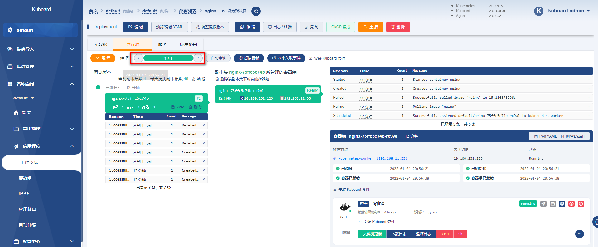 |

灰度发布

Deploy可以在部署新版本数据时，成功启动一个pod，才会下线一个老版本的Pod

```shell
kubectl set image deployment/Deployment名称 容器名=镜像:版本
```

 

##### 10.4.4 Service

可以将多个Pod对外暴露一个Service，让客户端可以通过Service访问到这一组Pod，并且可以实现负载均衡

ClusterIP方式：

ClusterIP是集群内部Pod之间的访问方式

- 命令实现效果

  ```sh
  # 通过生成service映射一个Deployment下的所有pod中的某一个端口的容器
  kubectl expose deployment Deployment名称 --port=Service端口号 --target-port=Pod内容器端口
  ```

  之后通过`kubectl get service`查看Service提供的ip，即可访问

  |           kubectl get service            |
  | :--------------------------------------: |
  |  |

  也可以通过`Deployment名称.namespace名称.svc`作为域名访问

  |                 在服务容器内执行                 |
  | :--------------------------------------: |
  | 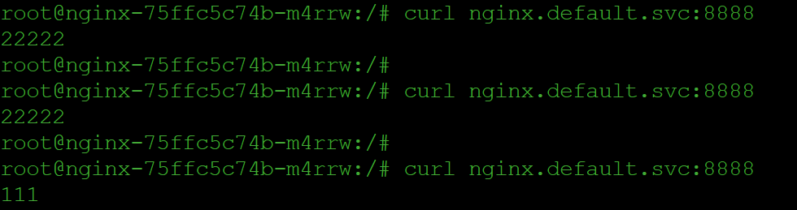 |

NodePort方式

ClusterIP的方式只能在Pod内部实现访问，但是一般需要对外暴露网关，所以需要NodePort的方式Pod外暴露访问

- 命令实现方式

  ```sh
  # 通过生成service映射一个Deployment下的所有pod中的某一个端口的容器
  kubectl expose deployment Deployment名称 --port=Service端口号 --target-port=Pod内容器端口 --type=NodePort
  ```

  |               查看Service效果                |
  | :--------------------------------------: |
  |  |
  |  |

Service也可以通过yaml文件实现

```yaml
apiVersion: v1
kind: Service
metadata:
  labels
    app: nginx
  name: nginx
  spec:
    selector:
      app: nginx
    ports:
    - port: 8888
     protocol: TCP
     targetPort: 80
```

通过apply启动就也可以创建Service

测试效果-Deployment部署，通过Service暴露

```yaml
apiVersion: apps/v1
kind: Deployment
metadata:
  name: nginx-deployment
  labels:
    app: nginx-deployment
spec:
  replicas: 2
  selector:
    matchLabels:
      app: nginx-deployment
  template:
    metadata:
      labels:
        app: nginx-deployment
    spec:
      containers:
      - name: nginx-deployment
        image: nginx
        ports:
        - containerPort: 80
---
apiVersion: v1
kind: Service
metadata:
  labels:
    app: nginx-service
  name: nginx-service
spec:
  selector:
    app: nginx-deployment
  ports:
  - port: 8888
    protocol: TCP
    targetPort: 80
  type: NodePort
```

可以查看到暴露的信息

|                Service信息                 |
| :--------------------------------------: |
| 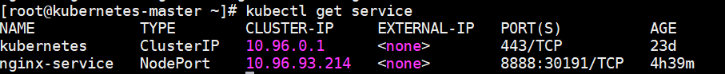 |

##### 10.4.5 Ingress

Kubernetes推荐将Ingress作为所有Service的入口，提供统一的入口，避免多个服务之间需要记录大量的IP或者域名，毕竟IP可能改变，服务太多域名记录不方便。

Ingress底层其实就是一个Nginx， 可以在Kuboard上直接点击安装

|                Kuboard安装                 |
| :--------------------------------------: |
|  |
| **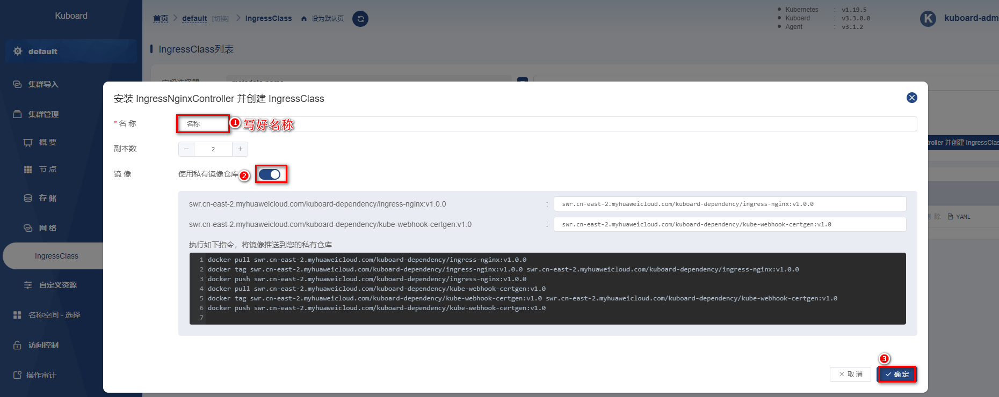** |

因为副本数默认为1，但是k8s整体集群就2个节点，所以显示下面即为安装成功

|                   安装成功                   |
| :--------------------------------------: |
| 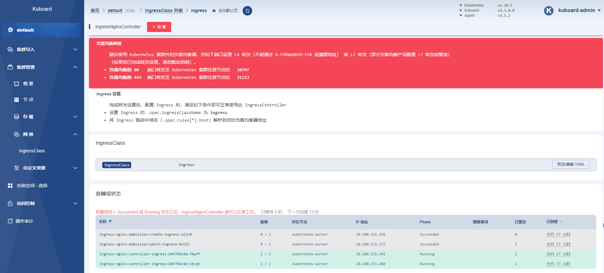 |

可以将Ingress接收到的请求转发到不同的Service中。

推荐使用yaml文件方式

```yaml
apiVersion: networking.k8s.io/v1
kind: Ingress
metadata:
  name: nginx-ingress
spec:
  ingressClassName: ingress
  rules:
  - host: nginx.mashibing.com
    http:
      paths:
      - path: /
        pathType: Prefix
        backend:
          service:
            name: nginx-service
            port:
              number: 8888
```

|                  启动时问题                   |
| :--------------------------------------: |
| 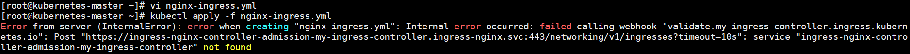 |

Kuboard安装的Ingress有admission的校验配置，需要先删除配置再启动

找到指定的ingress的校验信息，删除即可

|                   删除信息                   |
| :--------------------------------------: |
| 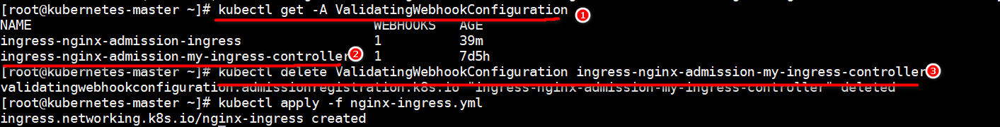 |

```sh
# 查看校验webhook的配置
kubectl get -A ValidatingWebhookConfiguration

# 删除指定的校验
kubectl delete ValidatingWebhookConfiguration ingress-nginx-admission-my-ingress-controller
```

配置本地hosts文件

|                 配置hosts                  |
| :--------------------------------------: |
| 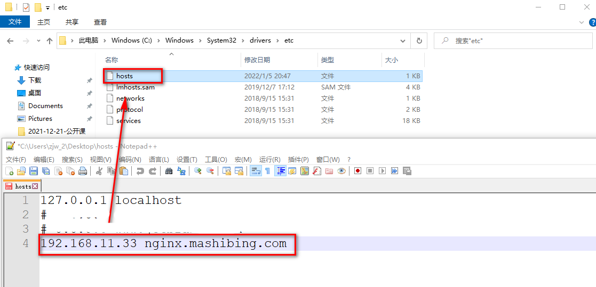 |

记下来既可以访问在Service中暴露的Nginx信息

|               服通过Ingress访问               |
| :--------------------------------------: |
| 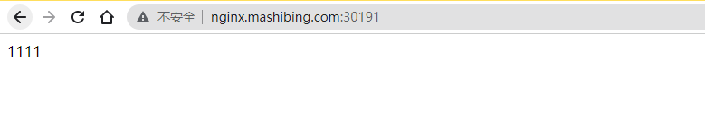 |

#### 10.5 Jenkins集成Kubernetes

##### 10.5.1 准备部署的yml文件

```yml
apiVersion: apps/v1
kind: Deployment
metadata:
  namespace: test
  name: pipeline
  labels:
    app: pipeline
spec:
  replicas: 2
  selector:
    matchLabels:
      app: pipeline
  template:
    metadata:
      labels:
        app: pipeline    
    spec:
      containers:
      - name: pipeline
        image: 192.168.11.102:80/repo/pipeline:v4.0.0
        imagePullPolicy: Always
        ports:
        - containerPort: 8080
---
apiVersion: v1
kind: Service
metadata:
  namespace: test
  labels:
    app: pipeline
  name: pipeline  
spec:
  selector:
    app: pipeline
  ports:
  - port: 8081
    targetPort: 8080
  type: NodePort
---
apiVersion: networking.k8s.io/v1
kind: Ingress
metadata:
  namespace: test
  name: pipeline
spec:
  ingressClassName: ingress
  rules:
  - host: mashibing.pipeline.com
    http:
      paths:
      - path: /
        pathType: Prefix
        backend:
          service:
            name: pipeline
            port:
              number: 8081
```


##### 10.5.2 Harbor私服配置

在尝试用kubernetes的yml文件启动pipeline服务时，会出现Kubernetes无法拉取镜像的问题，这里需要在kubernetes所在的Linux中配置Harbor服务信息，并且保证Kubernetes可以拉取Harbor上的镜像

- 设置Master和Worker的私服地址信息

  |              设置Harbor私服地址              |
  | :------------------------------------------: |
  | 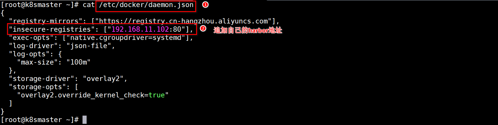 |

- 在Kuboard上设置私服密文信息

  |                设置密文并测试                |
  | :------------------------------------------: |
  | 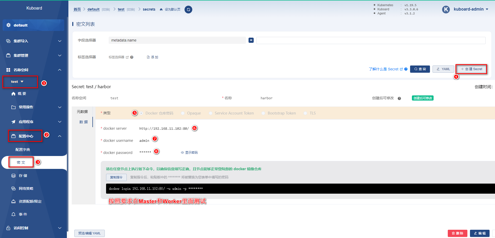 |

  按照复制指令的位置测试认证，效果如下

  |                   测试效果                   |
  | :------------------------------------------: |
  | 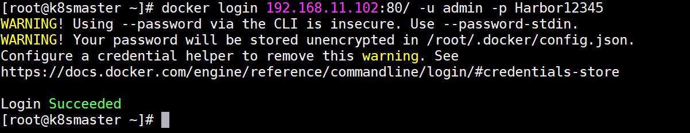 |

##### 10.5.3 测试使用效果

执行kubectl命令，基于yml启动服务，并且基于部署后服务的提示信息以及Ingress的设置，直接访问

|                                              |
| -------------------------------------------- |
|  |
|  |

##### 10.5.3 Jenkins远程调用

- 将pipeline.yml配置到Gitlab中

  |                 配置yml文件                  |
  | :------------------------------------------: |
  | 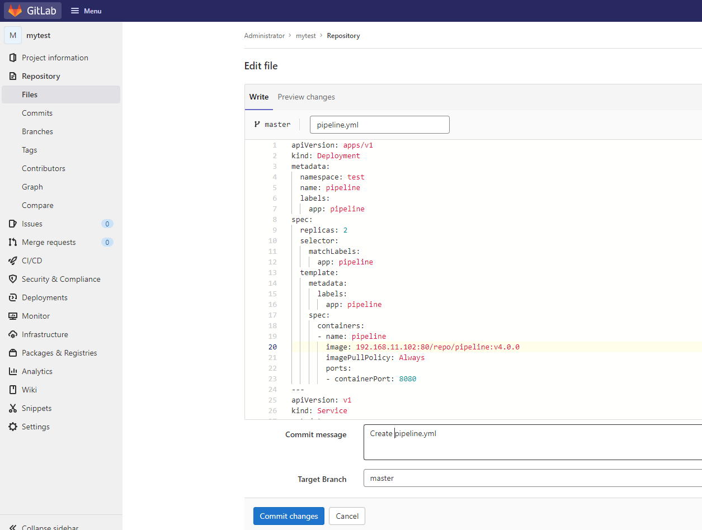 |

- 配置Jenkins的目标服务器，可以将yml文件传输到K8s的Master上

  |                设置目标服务器                |
  | :------------------------------------------: |
  | 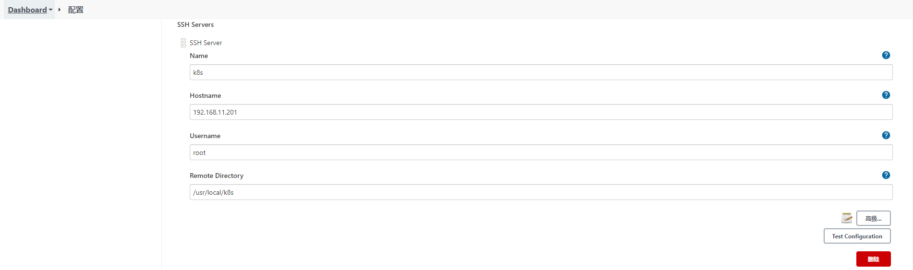 |

- 修改Jenkinsfile，重新设置流水线任务脚本，并测试效果

  |               传递yml文件脚本                |
  | :------------------------------------------: |
  | 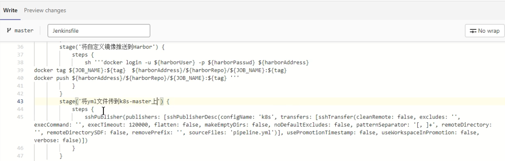 |
  |  |

- 设置Jenkins无密码登录k8s-master

  将Jenkins中公钥信息复制到k8s-master的~/.ssh/authorized_keysz中，保证远程连接无密码

  |             远程执行命令无需密码             |
  | :------------------------------------------: |
  | 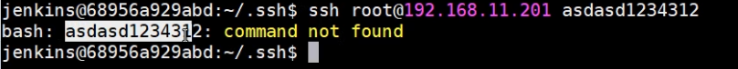 |

- 设置执行kubectl的脚本到Jenkinsfile

  |               设置Jenkinsfile                |
  | :------------------------------------------: |
  | 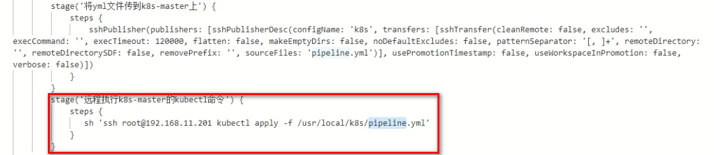 |

- 执行查看效果

  |                  执行流水线                  |
  | :------------------------------------------: |
  | 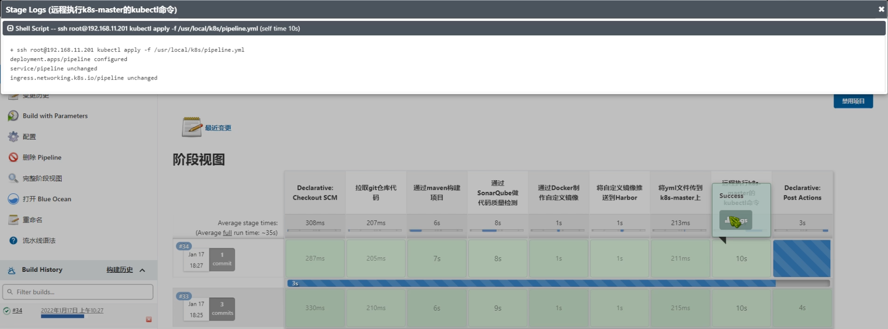 |

  可以查看到yml文件是由变化的， 这样k8s就会重新加载

- 查看效果

  |                     效果                     |
  | :------------------------------------------: |
  |  |

[Ps：这种方式更适应与CD操作，将项目将基于某个版本部署到指定的目标服务器]()

#### 10.6 基于GitLab的WebHooks

这里要实现自动化的一个CI操作，也就是开发人员Push代码到Git仓库后，Jenkins会自动的构建项目，将最新的提交点代码构建并进行打包部署，这里区别去上述的CD操作，CD操作需要基于某个版本进行部署，而这里每次都是将最新的提交点集成到主干上并测试。

##### 10.6.1 WebHooks通知

开启Jenkins的自动构建

|                  构建触发器                  |
| :------------------------------------------: |
| 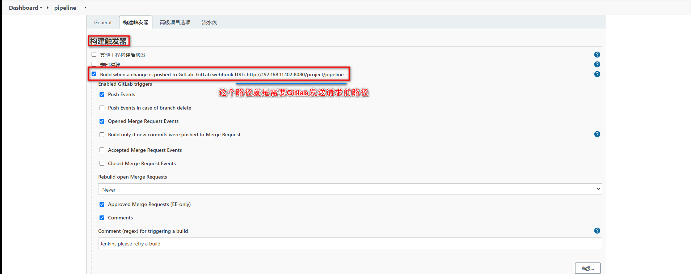 |

设置Gitlab的Webhooks

|             设置Gitlab的Webhooks             |
| :------------------------------------------: |
|  |

需要关闭Jenkins的Gitlab认证

|           关闭Jenkins的Gitlab认证            |
| :------------------------------------------: |
| 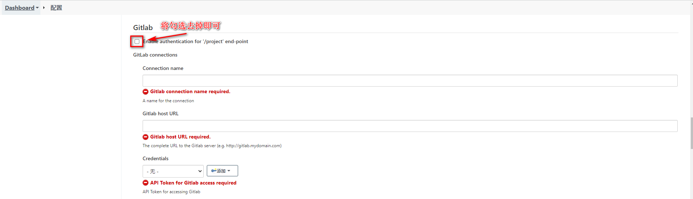 |

再次测试Gitlab

|                   再次测试                   |
| :------------------------------------------: |
| 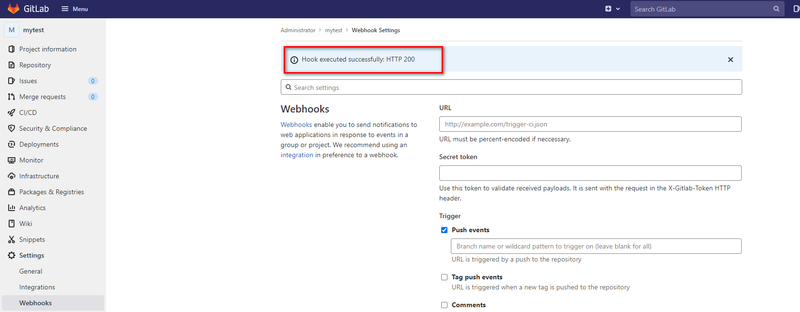 |

##### 10.6.2 修改配置

修改Jenkinsfile实现基于最新提交点实现持续集成效果，将之前引用${tag}的全部去掉

```json
// 所有的脚本命令都放在pipeline中
pipeline{
	// 指定任务再哪个集群节点中执行
	agent any

	// 声明全局变量，方便后面使用
	environment {
		harborUser = 'admin'
        harborPasswd = 'Harbor12345'
        harborAddress = '192.168.11.102:80'
        harborRepo = 'repo'
	}

    stages {
        stage('拉取git仓库代码') {
            steps {
                checkout([$class: 'GitSCM', branches: [[name: '*/master']], extensions: [], userRemoteConfigs: [[url: 'http://192.168.11.101:8929/root/mytest.git']]])
            }
        }
        stage('通过maven构建项目') {
            steps {
                sh '/var/jenkins_home/maven/bin/mvn clean package -DskipTests'
            }
        }
        stage('通过SonarQube做代码质量检测') {
            steps {
                sh '/var/jenkins_home/sonar-scanner/bin/sonar-scanner -Dsonar.source=./ -Dsonar.projectname=${JOB_NAME} -Dsonar.projectKey=${JOB_NAME} -Dsonar.java.binaries=./target/ -Dsonar.login=40306ae8ea69a4792df2ceb4d9d25fe8a6ab1701'
            }
        }
        stage('通过Docker制作自定义镜像') {
            steps {
                sh '''mv ./target/*.jar ./docker/
                docker build -t ${JOB_NAME}:latest ./docker/'''
            }
        }
        stage('将自定义镜像推送到Harbor') {
            steps {
                sh '''docker login -u ${harborUser} -p ${harborPasswd} ${harborAddress}
                docker tag ${JOB_NAME}:latest  ${harborAddress}/${harborRepo}/${JOB_NAME}:latest
                docker push ${harborAddress}/${harborRepo}/${JOB_NAME}:latest '''
            }
        }
        stage('将yml文件传到k8s-master上') {
            steps {
                sshPublisher(publishers: [sshPublisherDesc(configName: 'k8s', transfers: [sshTransfer(cleanRemote: false, excludes: '', execCommand: '', execTimeout: 120000, flatten: false, makeEmptyDirs: false, noDefaultExcludes: false, patternSeparator: '[, ]+', remoteDirectory: '', remoteDirectorySDF: false, removePrefix: '', sourceFiles: 'pipeline.yml')], usePromotionTimestamp: false, useWorkspaceInPromotion: false, verbose: false)])
            }
        }
        stage('远程执行k8s-master的kubectl命令') {
            steps {
               sh '''ssh root@192.168.11.201 kubectl apply -f /usr/local/k8s/pipeline.yml
                ssh root@192.168.11.201 kubectl rollout restart deployment pipeline -n test'''
            }
        }

    }
    post {
        success {
            dingtalk(
                robot: 'Jenkins-DingDing',
                type: 'MARKDOWN',
                title: "success: ${JOB_NAME}",
                text: ["- 成功构建：${JOB_NAME}! \n- 版本：latest \n- 持续时间：${currentBuild.durationString}" ]
            )
        }
        failure {
            dingtalk(
                robot: 'Jenkins-DingDing',
                type: 'MARKDOWN',
                title: "success: ${JOB_NAME}",
                text: ["- 构建失败：${JOB_NAME}! \n- 版本：latest \n- 持续时间：${currentBuild.durationString}" ]
            )
        }
    }
}

```

修改pipeline.yml，更改镜像版本

```yml
apiVersion: apps/v1
kind: Deployment
metadata:
  namespace: test
  name: pipeline
  labels:
    app: pipeline
spec:
  replicas: 2
  selector:
    matchLabels:
      app: pipeline
  template:
    metadata:
      labels:
        app: pipeline    
    spec:
      containers:
      - name: pipeline
        image: 192.168.11.102:80/repo/pipeline:latest   # 这里
        imagePullPolicy: Always
        ports:
        - containerPort: 8080
# 省略其他内容…………
```

##### 10.6.3 滚动更新

因为pipeline没有改变时，每次不会重新加载，这样会导致Pod中的容器不会动态更新，这里需要使用kubectl的rollout restart命令滚动更新

|                设置Jenkinsfle                |
| :------------------------------------------: |
| 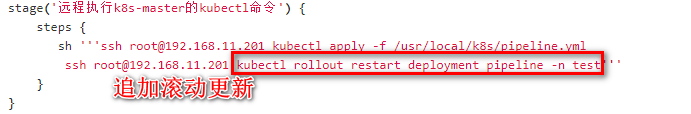 |
|  |


