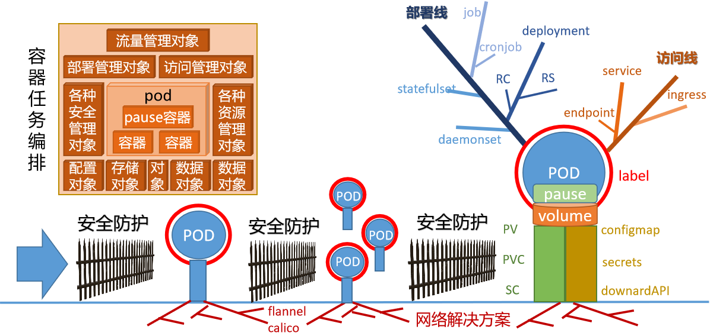

# 1 集群环境实践

## 1.1 单主集群

### 1.1.1 基础环境部署

学习目标

这一节，我们从 集群规划、主机认证、小结 三个方面来学习。

**集群规划**

简介

```powershell
在这里，我们以单主分布式的主机节点效果来演示kubernetes的最新版本的集群环境部署。
```


节点集群组件规划


```powershell
master节点
	kubeadm(集群环境)、kubectl(集群管理)、kubelet(节点状态)
	kube-apiserver、kube-controller-manager、kube-scheduler、etcd
	containerd(docker方式部署)、flannel(插件部署)
node节点
	kubeadm(集群环境)、kubelet(节点状态)
	kube-proxy、containerd(docker方式部署)、flannel(插件部署)
```

主机名规划

| 序号 | 主机ip    | 主机名规划                                               |
| ---- | --------- | -------------------------------------------------------- |
| 1    | 10.0.0.12 | kubernetes-master.superopsmsb.com  kubernetes-master     |
| 2    | 10.0.0.15 | kubernetes-node1.superopsmsb.com  kubernetes-node1       |
| 3    | 10.0.0.16 | kubernetes-node2.superopsmsb.com  kubernetes-node2       |
| 4    | 10.0.0.17 | kubernetes-node3.superopsmsb.com  kubernetes-node3       |
| 5    | 10.0.0.20 | kubernetes-register.superopsmsb.com  kubernetes-register |

```powershell
修改master节点主机的hosts文件
[root@localhost ~]# cat /etc/hosts
10.0.0.12 kubernetes-master.superopsmsb.com kubernetes-master
10.0.0.15 kubernetes-node1.superopsmsb.com  kubernetes-node1
10.0.0.16 kubernetes-node2.superopsmsb.com  kubernetes-node2
10.0.0.17 kubernetes-node3.superopsmsb.com  kubernetes-node3
10.0.0.20 kubernetes-register.superopsmsb.com  kubernetes-register
```


**主机认证**

简介

```powershell
	因为整个集群节点中的很多文件配置都是一样的，所以我们需要配置跨主机免密码认证方式来定制集群的认证通信机制，这样后续在批量操作命令的时候，就非常轻松了。
```

```powershell
为了让ssh通信速度更快一些，我们需要对ssh的配置文件进行一些基本的改造
[root@localhost ~]# egrep 'APIA|DNS' /etc/ssh/sshd_config
GSSAPIAuthentication no
UseDNS no
[root@localhost ~]# systemctl restart sshd

注意：
	这部分的操作，应该在所有集群主机环境初始化的时候进行设定
```

脚本内容

```powershell
[root@localhost ~]# cat /data/scripts/01_remote_host_auth.sh
#!/bin/bash
# 功能: 批量设定远程主机免密码认证
# 版本: v0.2
# 作者: 书记
# 联系: superopsmsb.com

# 准备工作
user_dir='/root'
host_file='/etc/hosts'
login_user='root'
login_pass='123456'
target_type=(部署 免密 同步 主机名 退出)

# 菜单
menu(){
  echo -e "\e[31m批量设定远程主机免密码认证管理界面\e[0m"
  echo "====================================================="
  echo -e "\e[32m 1: 部署环境   2: 免密认证   3: 同步hosts \e[0m"
  echo -e "\e[32m 4: 设定主机名 5：退出操作 \e[0m"
  echo "====================================================="
}
# expect环境
expect_install(){
  if [ -f /usr/bin/expect ]
  then
     echo -e "\e[33mexpect环境已经部署完毕\e[0m"
  else
     yum install expect -y >> /dev/null 2>&1 && echo -e "\e[33mexpect软件安装完毕\e[0m" || (echo -e "\e[33mexpect软件安装失败\e[0m" && exit)
  fi
}
# 秘钥文件生成环境
create_authkey(){
  # 保证历史文件清空
  [ -d ${user_dir}/.ssh ] && rm -rf ${user_dir}/.ssh/*
  # 构建秘钥文件对
  /usr/bin/ssh-keygen -t rsa -P "" -f ${user_dir}/.ssh/id_rsa
  echo -e "\e[33m秘钥文件已经创建完毕\e[0m"
}
# expect自动匹配逻辑
expect_autoauth_func(){
  # 接收外部参数
  command="$@"
  expect -c "
    spawn ${command}
    expect {
      \"yes/no\" {send \"yes\r\"; exp_continue}
      \"*password*\" {send \"${login_pass}\r\"; exp_continue}
      \"*password*\" {send \"${login_pass}\r\"}
   }"
}
# 跨主机传输文件认证
sshkey_auth_func(){
  # 接收外部的参数
  local host_list="$*"
  for ip in ${host_list}
  do
     # /usr/bin/ssh-copy-id -i ${user_dir}/.ssh/id_rsa.pub root@10.0.0.12
     cmd="/usr/bin/ssh-copy-id -i ${user_dir}/.ssh/id_rsa.pub"
     remote_host="${login_user}@${ip}"
     expect_autoauth_func ${cmd} ${remote_host}
  done
}

# 跨主机同步hosts文件
scp_hosts_func(){
  # 接收外部的参数
  local host_list="$*"
  for ip in ${host_list}
  do
     remote_host="${login_user}@${ip}"
     scp ${host_file} ${remote_host}:${host_file}
  done
}

# 跨主机设定主机名规划
set_hostname_func(){
  # 接收外部的参数
  local host_list="$*"
  for ip in ${host_list}
  do
     host_name=$(grep ${ip} ${host_file}|awk '{print $NF}')
     remote_host="${login_user}@${ip}"
     ssh ${remote_host} "hostnamectl set-hostname ${host_name}"
  done
}
# 帮助信息逻辑
Usage(){
  echo "请输入有效的操作id"
}
# 逻辑入口
while true
do
  menu
  read -p "请输入有效的操作id: " target_id
  if [ ${#target_type[@]} -ge ${target_id} ]
  then
    if [ ${target_type[${target_id}-1]} == "部署" ]
    then
       echo "开始部署环境操作..."
       expect_install
       create_authkey
    elif [ ${target_type[${target_id}-1]} == "免密" ]
    then
       read -p "请输入需要批量远程主机认证的主机列表范围(示例: {12..19}): " num_list
       ip_list=$(eval echo 10.0.0.$num_list)
       echo "开始执行免密认证操作..."
       sshkey_auth_func ${ip_list}
    elif [ ${target_type[${target_id}-1]} == "同步" ]
    then
       read -p "请输入需要批量远程主机同步hosts的主机列表范围(示例: {12..19}): " num_list
       ip_list=$(eval echo 10.0.0.$num_list)
       echo "开始执行同步hosts文件操作..."
       scp_hosts_func ${ip_list}
    elif [ ${target_type[${target_id}-1]} == "主机名" ]
    then
       read -p "请输入需要批量设定远程主机主机名的主机列表范围(示例: {12..19}): " num_list
       ip_list=$(eval echo 10.0.0.$num_list)
       echo "开始执行设定主机名操作..."
       set_hostname_func ${ip_list}
    elif [ ${target_type[${target_id}-1]} == "退出" ]
    then
       echo "开始退出管理界面..."
       exit
    fi
  else
    Usage
  fi
done
```

```powershell
为了更好的把环境部署成功，最好提前更新一下软件源信息
[root@localhost ~]# yum makecache
```

```powershell
查看脚本执行效果
[root@localhost ~]# /bin/bash /data/scripts/01_remote_host_auth.sh
批量设定远程主机免密码认证管理界面
=====================================================
 1: 部署环境   2: 免密认证   3: 同步hosts
 4: 设定主机名 5：退出操作
=====================================================
请输入有效的操作id: 1
开始部署环境操作...
expect环境已经部署完毕
Generating public/private rsa key pair.
Your identification has been saved in /root/.ssh/id_rsa.
Your public key has been saved in /root/.ssh/id_rsa.pub.
The key fingerprint is:
SHA256:u/Tzk0d9sNtG6r9Kx+6xPaENNqT3Lw178XWXQhX1yMw root@kubernetes-master
The key's randomart image is:
+---[RSA 2048]----+
|               .+|
|             + o.|
|              E .|
|             o.  |
|        S   +  +.|
|         . . *=+B|
|        o   o+B%O|
|       . o. +.O+X|
|        . .o.=+XB|
+----[SHA256]-----+
秘钥文件已经创建完毕
批量设定远程主机免密码认证管理界面
=====================================================
 1: 部署环境   2: 免密认证   3: 同步hosts
 4: 设定主机名 5：退出操作
=====================================================
请输入有效的操作id: 2
请输入需要批量远程主机认证的主机列表范围(示例: {12..19}): 12
开始执行免密认证操作...
spawn /usr/bin/ssh-copy-id -i /root/.ssh/id_rsa.pub root@10.0.0.12
...
Now try logging into the machine, with:   "ssh 'root@10.0.0.12'"
and check to make sure that only the key(s) you wanted were added.

批量设定远程主机免密码认证管理界面
=====================================================
 1: 部署环境   2: 免密认证   3: 同步hosts
 4: 设定主机名 5：退出操作
=====================================================
请输入有效的操作id: 2
请输入需要批量远程主机认证的主机列表范围(示例: {12..19}): {15..17}
开始执行免密认证操作...
spawn /usr/bin/ssh-copy-id -i /root/.ssh/id_rsa.pub root@10.0.0.15
...
Now try logging into the machine, with:   "ssh 'root@10.0.0.15'"
and check to make sure that only the key(s) you wanted were added.

spawn /usr/bin/ssh-copy-id -i /root/.ssh/id_rsa.pub root@10.0.0.16
...
Now try logging into the machine, with:   "ssh 'root@10.0.0.16'"
and check to make sure that only the key(s) you wanted were added.

spawn /usr/bin/ssh-copy-id -i /root/.ssh/id_rsa.pub root@10.0.0.17
...
Now try logging into the machine, with:   "ssh 'root@10.0.0.17'"
and check to make sure that only the key(s) you wanted were added.

批量设定远程主机免密码认证管理界面
=====================================================
 1: 部署环境   2: 免密认证   3: 同步hosts
 4: 设定主机名 5：退出操作
=====================================================
请输入有效的操作id: 2
请输入需要批量远程主机认证的主机列表范围(示例: {12..19}): 20
开始执行免密认证操作...
spawn /usr/bin/ssh-copy-id -i /root/.ssh/id_rsa.pub root@10.0.0.20
...
Now try logging into the machine, with:   "ssh 'root@10.0.0.20'"
and check to make sure that only the key(s) you wanted were added.

批量设定远程主机免密码认证管理界面
=====================================================
 1: 部署环境   2: 免密认证   3: 同步hosts
 4: 设定主机名 5：退出操作
=====================================================
请输入有效的操作id: 3
请输入需要批量远程主机同步hosts的主机列表范围(示例: {12..19}): 12
开始执行同步hosts文件操作...
hosts                                                               100%  470     1.2MB/s   00:00
批量设定远程主机免密码认证管理界面
=====================================================
 1: 部署环境   2: 免密认证   3: 同步hosts
 4: 设定主机名 5：退出操作
=====================================================
请输入有效的操作id: 3
请输入需要批量远程主机同步hosts的主机列表范围(示例: {12..19}): {15..17}
开始执行同步hosts文件操作...
hosts                                                               100%  470   226.5KB/s   00:00
hosts                                                               100%  470   458.8KB/s   00:00
hosts                                                               100%  470   533.1KB/s   00:00
批量设定远程主机免密码认证管理界面
=====================================================
 1: 部署环境   2: 免密认证   3: 同步hosts
 4: 设定主机名 5：退出操作
=====================================================
请输入有效的操作id: 3
请输入需要批量远程主机同步hosts的主机列表范围(示例: {12..19}): 20
开始执行同步hosts文件操作...
hosts                                                               100%  470   287.8KB/s   00:00
批量设定远程主机免密码认证管理界面
=====================================================
 1: 部署环境   2: 免密认证   3: 同步hosts
 4: 设定主机名 5：退出操作
=====================================================
请输入有效的操作id: 4
请输入需要批量设定远程主机主机名的主机列表范围(示例: {12..19}): 12
开始执行设定主机名操作...
批量设定远程主机免密码认证管理界面
=====================================================
 1: 部署环境   2: 免密认证   3: 同步hosts
 4: 设定主机名 5：退出操作
=====================================================
请输入有效的操作id: 4
请输入需要批量设定远程主机主机名的主机列表范围(示例: {12..19}): {15..17}
开始执行设定主机名操作...
批量设定远程主机免密码认证管理界面
=====================================================
 1: 部署环境   2: 免密认证   3: 同步hosts
 4: 设定主机名 5：退出操作
=====================================================
请输入有效的操作id: 4
请输入需要批量设定远程主机主机名的主机列表范围(示例: {12..19}): 20
开始执行设定主机名操作...
批量设定远程主机免密码认证管理界面
=====================================================
 1: 部署环境   2: 免密认证   3: 同步hosts
 4: 设定主机名 5：退出操作
=====================================================
请输入有效的操作id: 5
开始退出管理界面...
```

检查效果

```powershell
[root@localhost ~]# exec /bin/bash
[root@kubernetes-master ~]# for i in 12 {15..17} 20
> do
> name=$(ssh root@10.0.0.$i "hostname")
> echo 10.0.0.$i $name
> done
10.0.0.12 kubernetes-master
10.0.0.15 kubernetes-node1
10.0.0.16 kubernetes-node2
10.0.0.17 kubernetes-node3
10.0.0.20 kubernetes-register
```


**小结**

```

```


### 1.1.2 集群基础环境

学习目标

这一节，我们从 内核调整、软件源配置、小结 三个方面来学习。

**内核调整**

简介

```powershell
根据kubernetes官方资料的相关信息，我们需要对kubernetes集群是所有主机进行内核参数的调整。
```

禁用swap

```powershell
	部署集群时，kubeadm默认会预先检查当前主机是否禁用了Swap设备，并在未禁用时强制终止部署过程。因此，在主机内存资源充裕的条件下，需要禁用所有的Swap设备，否则，就需要在后文的kubeadm init及kubeadm join命令执行时额外使用相关的选项忽略检查错误

关闭Swap设备，需要分两步完成。
首先是关闭当前已启用的所有Swap设备：
swapoff -a
        
而后编辑/etc/fstab配置文件，注释用于挂载Swap设备的所有行。
方法一：手工编辑
vim /etc/fstab
# UUID=0a55fdb5-a9d8-4215-80f7-f42f75644f69 none  swap    sw      0       0

方法二：
sed -i 's/.*swap.*/#&/' /etc/fstab 
 	替换后位置的&代表前面匹配的整行内容
注意：
	只需要注释掉自动挂载SWAP分区项即可，防止机子重启后swap启用

内核(禁用swap)参数
cat >> /etc/sysctl.d/k8s.conf << EOF
vm.swappiness=0
EOF
sysctl -p /etc/sysctl.d/k8s.conf
```

网络参数

```powershell
配置iptables参数，使得流经网桥的流量也经过iptables/netfilter防火墙
cat >> /etc/sysctl.d/k8s.conf << EOF
net.bridge.bridge-nf-call-ip6tables = 1
net.bridge.bridge-nf-call-iptables = 1
net.ipv4.ip_forward = 1
EOF

配置生效
modprobe br_netfilter
modprobe overlay
sysctl -p /etc/sysctl.d/k8s.conf
```

```powershell
脚本方式
[root@localhost ~]# cat /data/scripts/02_kubernetes_kernel_conf.sh
#!/bin/bash
# 功能: 批量设定kubernetes的内核参数调整
# 版本: v0.1
# 作者: 书记
# 联系: superopsmsb.com

# 禁用swap
swapoff -a
sed -i 's/.*swap.*/#&/' /etc/fstab
cat >> /etc/sysctl.d/k8s.conf << EOF
vm.swappiness=0
EOF
sysctl -p /etc/sysctl.d/k8s.conf

# 打开网络转发
cat >> /etc/sysctl.d/k8s.conf << EOF
net.bridge.bridge-nf-call-ip6tables = 1
net.bridge.bridge-nf-call-iptables = 1
net.ipv4.ip_forward = 1
EOF

# 加载相应的模块
modprobe br_netfilter
modprobe overlay
sysctl -p /etc/sysctl.d/k8s.conf
```

脚本执行

```powershell
master主机执行效果
[root@kubernetes-master ~]# /bin/bash /data/scripts/02_kubernetes_kernel_conf.sh
vm.swappiness = 0
vm.swappiness = 0
net.bridge.bridge-nf-call-ip6tables = 1
net.bridge.bridge-nf-call-iptables = 1
net.ipv4.ip_forward = 1
```

```powershell
node主机执行效果
[root@kubernetes-master ~]# for i in {15..17};do ssh root@10.0.0.$i mkdir /data/scripts -p; scp /data/scripts/02_kubernetes_kernel_conf.sh root@10.0.0.$i:/data/scripts/02_kubernetes_kernel_conf.sh;ssh root@10.0.0.$i "/bin/bash /data/scripts/02_kubernetes_kernel_conf.sh";done
02_kubernetes_kernel_conf.sh                                        100%  537   160.6KB/s   00:00
vm.swappiness = 0
vm.swappiness = 0
net.bridge.bridge-nf-call-ip6tables = 1
net.bridge.bridge-nf-call-iptables = 1
net.ipv4.ip_forward = 1
02_kubernetes_kernel_conf.sh                                        100%  537   374.4KB/s   00:00
vm.swappiness = 0
vm.swappiness = 0
net.bridge.bridge-nf-call-ip6tables = 1
net.bridge.bridge-nf-call-iptables = 1
net.ipv4.ip_forward = 1
02_kubernetes_kernel_conf.sh                                        100%  537   154.5KB/s   00:00
vm.swappiness = 0
vm.swappiness = 0
net.bridge.bridge-nf-call-ip6tables = 1
net.bridge.bridge-nf-call-iptables = 1
net.ipv4.ip_forward = 1
```


**软件源配置**

简介

```powershell
	由于我们需要在多台主机上初始化kubernetes主机环境，所以我们需要在多台主机上配置kubernetes的软件源，以最简便的方式部署kubernetes环境。
```

定制阿里云软件源

```powershell
定制阿里云的关于kubernetes的软件源
[root@kubernetes-master ~]# cat > /etc/yum.repos.d/kubernetes.repo << EOF
[kubernetes]
name=Kubernetes
baseurl=https://mirrors.aliyun.com/kubernetes/yum/repos/kubernetes-el7-x86_64
enabled=1
gpgcheck=0
repo_gpgcheck=0
gpgkey=https://mirrors.aliyun.com/kubernetes/yum/doc/yum-key.gpg https://mirrors.aliyun.com/kubernetes/yum/doc/rpm-package-key.gpg
EOF

更新软件源
[root@kubernetes-master ~]# yum makecache fast
```

其他节点主机同步软件源

```powershell
[root@kubernetes-master ~]# for i in {15..17};do scp /etc/yum.repos.d/kubernetes.repo root@10.0.0.$i:/etc/yum.repos.d/kubernetes.repo;ssh root@10.0.0.$i "yum makecache fast";done
```


**小结**

```

```


### 1.1.3 容器环境

学习目标

这一节，我们从 Docker环境、环境配置、小结 三个方面来学习。

**Docker环境**

简介

```powershell
	由于kubernetes1.24版本才开始将默认支持的容器引擎转换为了Containerd了，所以这里我们还是以Docker软件作为后端容器的引擎，因为目前的CKA考试环境是以kubernetes1.23版本为基准的。
```

软件源配置

```powershell
安装基础依赖软件
[root@kubernetes-master ~]# yum install -y yum-utils device-mapper-persistent-data lvm2

定制专属的软件源
[root@kubernetes-master ~]# yum-config-manager --add-repo http://mirrors.aliyun.com/docker-ce/linux/centos/docker-ce.repo
```

安装软件

```powershell
确定最新版本的docker
[root@kubernetes-master ~]# yum list docker-ce --showduplicates | sort -r

安装最新版本的docker
[root@kubernetes-master ~]# yum install -y docker-ce
```

检查效果

```powershell
启动docker服务
[root@kubernetes-master ~]# systemctl restart docker

检查效果
[root@kubernetes-master ~]# docker version
Client: Docker Engine - Community
 Version:           20.10.17
 API version:       1.41
 Go version:        go1.17.11
 Git commit:        100c701
 Built:             Mon Jun  6 23:05:12 2022
 OS/Arch:           linux/amd64
 Context:           default
 Experimental:      true

Server: Docker Engine - Community
 Engine:
  Version:          20.10.17
  API version:      1.41 (minimum version 1.12)
  Go version:       go1.17.11
  Git commit:       a89b842
  Built:            Mon Jun  6 23:03:33 2022
  OS/Arch:          linux/amd64
  Experimental:     false
 containerd:
  Version:          1.6.6
  GitCommit:        10c12954828e7c7c9b6e0ea9b0c02b01407d3ae1
 runc:
  Version:          1.1.2
  GitCommit:        v1.1.2-0-ga916309
 docker-init:
  Version:          0.19.0
  GitCommit:        de40ad0
```


**环境配置**

需求

```powershell
1 镜像仓库
	默认安装的docker会从官方网站上获取docker镜像，有时候会因为网络因素无法获取，所以我们需要配置国内镜像仓库的加速器
2 kubernetes的改造
	kubernetes的创建容器，需要借助于kubelet来管理Docker，而默认的Docker服务进程的管理方式不是kubelet的类型，所以需要改造Docker的服务启动类型为systemd方式。
	
注意：
	默认情况下，Docker的服务修改有两种方式：
		1 Docker服务 - 需要修改启动服务文件，需要重载服务文件，比较繁琐。
		2 daemon.json文件 - 修改文件后，只需要重启docker服务即可，该文件默认情况下不存在。
```

定制docker配置文件

```powershell
定制配置文件
[root@kubernetes-master ~]# cat >> /etc/docker/daemon.json <<-EOF
{
  "registry-mirrors": [
    "http://74f21445.m.daocloud.io",
    "https://registry.docker-cn.com",
    "http://hub-mirror.c.163.com",
    "https://docker.mirrors.ustc.edu.cn"
  ], 
  "insecure-registries": ["10.0.0.20:80"], 
  "exec-opts": ["native.cgroupdriver=systemd"]
}
EOF

重启docker服务
[root@kubernetes-master ~]# systemctl restart docker
```

检查效果

```powershell
查看配置效果
[root@kubernetes-master ~]# docker info
Client:
 ...

Server:
 ...
 Cgroup Driver: systemd
 ...
 Insecure Registries:
  10.0.0.20:80
  127.0.0.0/8
 Registry Mirrors:
  http://74f21445.m.daocloud.io/
  https://registry.docker-cn.com/
  http://hub-mirror.c.163.com/
  https://docker.mirrors.ustc.edu.cn/
 Live Restore Enabled: false
```

docker环境定制脚本

```powershell
查看脚本内容
[root@localhost ~]# cat /data/scripts/03_kubernetes_docker_install.sh
#!/bin/bash
# 功能: 安装部署Docker容器环境
# 版本: v0.1
# 作者: 书记
# 联系: superopsmsb.com

# 准备工作

# 软件源配置
softs_base(){
  # 安装基础软件
  yum install -y yum-utils device-mapper-persistent-data lvm2
  # 定制软件仓库源
  yum-config-manager --add-repo http://mirrors.aliyun.com/docker-ce/linux/centos/docker-ce.repo
  # 更新软件源
  systemctl restart network
  yum makecache fast
}

# 软件安装
soft_install(){
  # 安装最新版的docker软件
  yum install -y docker-ce
  # 重启docker服务
  systemctl restart docker
}

# 加速器配置
speed_config(){
  # 定制加速器配置
cat > /etc/docker/daemon.json <<-EOF
{
  "registry-mirrors": [
    "http://74f21445.m.daocloud.io",
    "https://registry.docker-cn.com",
    "http://hub-mirror.c.163.com",
    "https://docker.mirrors.ustc.edu.cn"
  ],
  "insecure-registries": ["10.0.0.20:80"],
  "exec-opts": ["native.cgroupdriver=systemd"]
}
EOF
  # 重启docker服务
  systemctl restart docker
}

# 环境监测
docker_check(){
  process_name=$(docker info | grep 'p D' | awk '{print $NF}')
  [ "${process_name}" == "systemd" ] && echo "Docker软件部署完毕" || (echo "Docker软件部署失败" && exit)
}

# 软件部署
main(){
  softs_base
  soft_install
  speed_config
  docker_check
}

# 调用主函数
main
```

```powershell
其他主机环境部署docker
[root@kubernetes-master ~]# for i in {15..17} 20; do ssh root@10.0.0.$i "mkdir -p /data/scripts"; scp /data/scripts/03_kubernetes_docker_install.sh root@10.0.0.$i:/data/scripts/03_kubernetes_docker_install.sh; done

其他主机各自执行下面的脚本
/bin/bash /data/scripts/03_kubernetes_docker_install.sh
```


**小结**

```

```


### 1.1.4 仓库环境

学习目标

这一节，我们从 容器仓库、Harbor实践、小结 三个方面来学习。

**容器仓库**

简介

```powershell
	Harbor是一个用于存储和分发Docker镜像的企业级Registry服务器，虽然Docker官方也提供了公共的镜像仓库，但是从安全和效率等方面考虑，部署企业内部的私有环境Registry是非常必要的，Harbor除了存储和分发镜像外还具有用户管理，项目管理，配置管理和日志查询，高可用部署等主要功能。
	在本地搭建一个Harbor服务，其他在同一局域网的机器可以使用Harbor进行镜像提交和拉取，搭建前需要本地安装docker服务和docker-compose服务。
	最新的软件版本是 2.5.3，我们这里采用 2.5.0版本。
```

compose部署

```powershell
安装docker-compose
[root@kubernetes-register ~]# yum install -y docker-compose
```

harbor部署

```powershell
下载软件
[root@kubernetes-register ~]# mkdir /data/{softs,server} -p
[root@kubernetes-register ~]# cd /data/softs
[root@kubernetes-register ~]# wget https://github.com/goharbor/harbor/releases/download/v2.5.0/harbor-offline-installer-v2.5.0.tgz

解压软件
[root@kubernetes-register ~]# tar -zxvf harbor-offline-installer-v2.5.0.tgz -C  /data/server/
[root@kubernetes-register ~]# cd /data/server/harbor/

加载镜像
[root@kubernetes-register /data/server/harbor]# docker load < harbor.v2.5.0.tar.gz
[root@kubernetes-register /data/server/harbor]# docker images
REPOSITORY                      TAG       IMAGE ID       CREATED        SIZE
goharbor/harbor-exporter        v2.5.0    36396f138dfb   3 months ago   86.7MB
goharbor/chartmuseum-photon     v2.5.0    eaedcf1f700b   3 months ago   225MB
goharbor/redis-photon           v2.5.0    1e00fcc9ae63   3 months ago   156MB
goharbor/trivy-adapter-photon   v2.5.0    4e24a6327c97   3 months ago   164MB
goharbor/notary-server-photon   v2.5.0    6d5fe726af7f   3 months ago   112MB
goharbor/notary-signer-photon   v2.5.0    932eed8b6e8d   3 months ago   109MB
goharbor/harbor-registryctl     v2.5.0    90ef6b10ab31   3 months ago   136MB
goharbor/registry-photon        v2.5.0    30e130148067   3 months ago   77.5MB
goharbor/nginx-photon           v2.5.0    5041274b8b8a   3 months ago   44MB
goharbor/harbor-log             v2.5.0    89fd73f9714d   3 months ago   160MB
goharbor/harbor-jobservice      v2.5.0    1d097e877be4   3 months ago   226MB
goharbor/harbor-core            v2.5.0    42a54bc05b02   3 months ago   202MB
goharbor/harbor-portal          v2.5.0    c206e936f4f9   3 months ago   52.3MB
goharbor/harbor-db              v2.5.0    d40a1ae87646   3 months ago   223MB
goharbor/prepare                v2.5.0    36539574668f   3 months ago   268MB
```

```powershell
备份配置
[root@kubernetes-register /data/server/harbor]# cp harbor.yml.tmpl harbor.yml

修改配置
[root@kubernetes-register /data/server/harbor]# vim harbor.yml.tmpl
    # 修改主机名
    hostname: kubernetes-register.superopsmsb.com
    http:
      port: 80
    #https:  注释ssl相关的部分
      #  port: 443
      #  certificate: /your/certificate/path
      #  private_key: /your/private/key/path
    # 修改harbor的登录密码
    harbor_admin_password: 123456
    # 设定harbor的数据存储目录
    data_volume: /data/server/harbor/data
```

```powershell
配置harbor
[root@kubernetes-register /data/server/harbor]# ./prepare
prepare base dir is set to /data/server/harbor
WARNING:root:WARNING: HTTP protocol is insecure. Harbor will deprecate http protocol in the future. Please make sure to upgrade to https
...
Generated configuration file: /compose_location/docker-compose.yml
Clean up the input dir

启动harbor
[root@kubernetes-register /data/server/harbor]# ./install.sh
[Step 0]: checking if docker is installed ...
...
[Step 1]: checking docker-compose is installed ...
...
[Step 2]: loading Harbor images ...
...
Loaded image: goharbor/harbor-exporter:v2.5.0
[Step 3]: preparing environment ...
...
[Step 4]: preparing harbor configs ...
...
[Step 5]: starting Harbor ...
...
✔ ----Harbor has been installed and started successfully.----
```

```powershell
检查效果
[root@kubernetes-register /data/server/harbor]# docker-compose ps
      Name                     Command               State                  Ports
-------------------------------------------------------------------------------------------------
harbor-core         /harbor/entrypoint.sh            Up
harbor-db           /docker-entrypoint.sh 96 13      Up
harbor-jobservice   /harbor/entrypoint.sh            Up
harbor-log          /bin/sh -c /usr/local/bin/ ...   Up      127.0.0.1:1514->10514/tcp
harbor-portal       nginx -g daemon off;             Up
nginx               nginx -g daemon off;             Up      0.0.0.0:80->8080/tcp,:::80->8080/tcp
redis               redis-server /etc/redis.conf     Up
registry            /home/harbor/entrypoint.sh       Up
registryctl         /home/harbor/start.sh            Up
```

定制服务启动脚本

```powershell
定制服务启动脚本
[root@kubernetes-register /data/server/harbor]# cat /lib/systemd/system/harbor.service
[Unit]
Description=Harbor
After=docker.service systemd-networkd.service systemd-resolved.service
Requires=docker.service
Documentation=http://github.com/vmware/harbor

[Service]
Type=simple
Restart=on-failure
RestartSec=5
#需要注意harbor的安装位置
ExecStart=/usr/bin/docker-compose --file /data/server/harbor/docker-compose.yml up
ExecStop=/usr/bin/docker-compose --file /data/server/harbor/docker-compose.yml down

[Install]
WantedBy=multi-user.target
```

```powershell
加载服务配置文件
[root@kubernetes-register /data/server/harbor]# systemctl daemon-reload

启动服务
[root@kubernetes-register /data/server/harbor]# systemctl start harbor

检查状态
[root@kubernetes-register /data/server/harbor]# systemctl status harbor

设置开机自启动
[root@kubernetes-register /data/server/harbor]# systemctl enable harbor
```


**Harbor实践**

windows定制harbor的访问域名

```powershell
10.0.0.20 kubernetes-register.superopsmsb.com
```

浏览器访问域名，用户名: admin, 密码：123456


```powershell
输入用户名和密码后，点击登录，查看harbor的首页效果
```


创建工作账号

```powershell
点击用户管理，进入用户创建界面
```


```powershell
点击创建用户，进入用户创建界面
```


```powershell
点击确定后，查看创建用户效果
```


```powershell
点击左上角的管理员名称，退出终端页面
```

仓库管理

```powershell
采用普通用户登录到harbor中
```


```powershell
创建shuji用户专用的项目仓库，名称为 superopsmsb，权限为公开的
```


```powershell
点击确定后，查看效果
```


提交镜像

```powershell
准备docker的配置文件
[root@kubernetes-master ~]# grep insecure /etc/docker/daemon.json
  "insecure-registries": ["kubernetes-register.superopsmsb.com"],
[root@kubernetes-master ~]# systemctl restart docker
[root@kubernetes-master ~]# docker info | grep -A2 Insecure
 Insecure Registries:
  kubernetes-register.superopsmsb.com
  127.0.0.0/8
```

```powershell
登录仓库
[root@kubernetes-master ~]# docker login kubernetes-register.superopsmsb.com -u shuji
Password:   # 输入登录密码 A12345678a
WARNING! Your password will be stored unencrypted in /root/.docker/config.json.
Configure a credential helper to remove this warning. See
https://docs.docker.com/engine/reference/commandline/login/#credentials-store

Login Succeeded
```

```powershell
下载镜像
[root@kubernetes-master ~]# docker pull busybox

定制镜像标签
[root@kubernetes-master ~]# docker tag busybox kubernetes-register.superopsmsb.com/superopsmsb/busybox:v0.1

推送镜像
[root@kubernetes-master ~]# docker push kubernetes-register.superopsmsb.com/superopsmsb/busybox:v0.1
The push refers to repository [kubernetes-register.superopsmsb.com/superopsmsb/busybox]
7ad00cd55506: Pushed
v0.1: digest: sha256:dcdf379c574e1773d703f0c0d56d67594e7a91d6b84d11ff46799f60fb081c52 size: 527
```

```powershell
删除镜像
[root@kubernetes-master ~]# docker rmi busybox kubernetes-register.superopsmsb.com/superopsmsb/busybox:v0.1

下载镜像
[root@kubernetes-master ~]# docker pull kubernetes-register.superopsmsb.com/superopsmsb/busybox:v0.1
v0.1: Pulling from superopsmsb/busybox
19d511225f94: Pull complete
Digest: sha256:dcdf379c574e1773d703f0c0d56d67594e7a91d6b84d11ff46799f60fb081c52
Status: Downloaded newer image for kubernetes-register.superopsmsb.com/superopsmsb/busybox:v0.1
kubernetes-register.superopsmsb.com/superopsmsb/busybox:v0.1
结果显示：
	我们的harbor私有仓库就构建好了
```

同步所有的docker配置

```powershell
同步所有主机的docker配置
[root@kubernetes-master ~]# for i in 15 16 17;do scp /etc/docker/daemon.json root@10.0.0.$i:/etc/docker/daemon.json; ssh root@10.0.0.$i "systemctl restart docker"; done
daemon.json                                                                      100%  299   250.0KB/s   00:00
daemon.json                                                                      100%  299   249.6KB/s   00:00
daemon.json                                                                      100%  299   243.5KB/s   00:00
```

**小结**

```

```


### 1.1.5 master环境部署

学习目标

这一节，我们从 软件安装、环境初始化、小结 三个方面来学习。

**软件安装**

简介

```powershell
	我们已经把kubernetes集群所有主机的软件源配置完毕了，所以接下来，我们需要做的就是如何部署kubernetes环境
```

软件安装

```powershell
查看默认的最新版本
[root@kubernetes-master ~]# yum list kubeadm
已加载插件：fastestmirror
Loading mirror speeds from cached hostfile
可安装的软件包
kubeadm.x86_64                                   1.24.3-0                                   kubernetes

查看软件的最近版本
[root@kubernetes-master ~]# yum list kubeadm --showduplicates | sort -r | grep 1.2
kubeadm.x86_64                       1.24.3-0                         kubernetes
kubeadm.x86_64                       1.24.2-0                         kubernetes
kubeadm.x86_64                       1.24.1-0                         kubernetes
kubeadm.x86_64                       1.24.0-0                         kubernetes
kubeadm.x86_64                       1.23.9-0                         kubernetes
kubeadm.x86_64                       1.23.8-0                         kubernetes
...
```

```powershell
安装制定版本
[root@kubernetes-master ~]# yum install kubeadm-1.23.9-0 kubectl-1.23.9-0 kubelet-1.23.9-0 -y

注意：

```


```powershell
核心软件解析
	kubeadm 主要是对k8s集群来进行管理的，所以在master角色主机上安装
	kubelet 是以服务的方式来进行启动，主要用于收集节点主机的信息
	kubectl 主要是用来对集群中的资源对象进行管控，一半情况下，node角色的节点是不需要安装的。
依赖软件解析
    libnetfilter_xxx是Linux系统下网络数据包过滤的配置工具
    kubernetes-cni是容器网络通信的软件
	socat是kubelet的依赖
	cri-tools是CRI容器运行时接口的命令行工具
```

命令解读

```powershell
查看集群初始化命令
[root@kubernetes-master ~]# kubeadm version
kubeadm version: &version.Info{Major:"1", Minor:"23", GitVersion:"v1.23.9", GitCommit:"c1de2d70269039fe55efb98e737d9a29f9155246", GitTreeState:"clean", BuildDate:"2022-07-13T14:25:37Z", GoVersion:"go1.17.11", Compiler:"gc", Platform:"linux/amd64"}
[root@kubernetes-master ~]# kubeadm --help


    ┌──────────────────────────────────────────────────────────┐
    │ KUBEADM                                                  │
    │ Easily bootstrap a secure Kubernetes cluster             │
    │                                                          │
    │ Please give us feedback at:                              │
    │ https://github.com/kubernetes/kubeadm/issues             │
    └──────────────────────────────────────────────────────────┘

Example usage:

    Create a two-machine cluster with one control-plane node
    (which controls the cluster), and one worker node
    (where your workloads, like Pods and Deployments run).

    ┌──────────────────────────────────────────────────────────┐
    │ On the first machine:                                    │
    ├──────────────────────────────────────────────────────────┤
    │ control-plane# kubeadm init                              │
    └──────────────────────────────────────────────────────────┘

    ┌──────────────────────────────────────────────────────────┐
    │ On the second machine:                                   │
    ├──────────────────────────────────────────────────────────┤
    │ worker# kubeadm join <arguments-returned-from-init>      │
    └──────────────────────────────────────────────────────────┘

    You can then repeat the second step on as many other machines as you like.

Usage:
  kubeadm [command]

Available Commands:
  certs       Commands related to handling kubernetes certificates
  completion  Output shell completion code for the specified shell (bash or zsh)
  config      Manage configuration for a kubeadm cluster persisted in a ConfigMap in the cluster
  help        Help about any command
  init        Run this command in order to set up the Kubernetes control plane
  join        Run this on any machine you wish to join an existing cluster
  kubeconfig  Kubeconfig file utilities
  reset       Performs a best effort revert of changes made to this host by 'kubeadm init' or 'kubeadm join'
  token       Manage bootstrap tokens
  upgrade     Upgrade your cluster smoothly to a newer version with this command
  version     Print the version of kubeadm

Flags:
      --add-dir-header           If true, adds the file directory to the header of the log messages
  -h, --help                     help for kubeadm
      --log-file string          If non-empty, use this log file
      --log-file-max-size uint   Defines the maximum size a log file can grow to. Unit is megabytes. If the value is 0, the maximum file size is unlimited. (default 1800)
      --one-output               If true, only write logs to their native severity level (vs also writing to each lower severity level)
      --rootfs string            [EXPERIMENTAL] The path to the 'real' host root filesystem.
      --skip-headers             If true, avoid header prefixes in the log messages
      --skip-log-headers         If true, avoid headers when opening log files
  -v, --v Level                  number for the log level verbosity

Additional help topics:
  kubeadm alpha      Kubeadm experimental sub-commands

Use "kubeadm [command] --help" for more information about a command.
```

信息查看

```powershell
查看集群初始化时候的默认配置
[root@kubernetes-master ~]# kubeadm config print init-defaults
apiVersion: kubeadm.k8s.io/v1beta3
bootstrapTokens:
- groups:
  - system:bootstrappers:kubeadm:default-node-token
  token: abcdef.0123456789abcdef
  ttl: 24h0m0s
  usages:
  - signing
  - authentication
kind: InitConfiguration
localAPIEndpoint:
  advertiseAddress: 1.2.3.4
  bindPort: 6443
nodeRegistration:
  criSocket: /var/run/dockershim.sock
  imagePullPolicy: IfNotPresent
  name: node
  taints: null
---
apiServer:
  timeoutForControlPlane: 4m0s
apiVersion: kubeadm.k8s.io/v1beta3
certificatesDir: /etc/kubernetes/pki
clusterName: kubernetes
controllerManager: {}
dns: {}
etcd:
  local:
    dataDir: /var/lib/etcd
imageRepository: k8s.gcr.io
kind: ClusterConfiguration
kubernetesVersion: 1.23.0
networking:
  dnsDomain: cluster.local
  serviceSubnet: 10.96.0.0/12
scheduler: {}
注意：
    可以重点关注，master和node的注释信息、镜像仓库和子网信息
    这条命令可以生成定制的kubeadm.conf认证文件
```


```powershell
检查当前版本的kubeadm所依赖的镜像版本
[root@kubernetes-master ~]# kubeadm config images list
I0715 16:08:07.269149    7605 version.go:255] remote version is much newer: v1.24.3; falling back to: stable-1.23
k8s.gcr.io/kube-apiserver:v1.23.9
k8s.gcr.io/kube-controller-manager:v1.23.9
k8s.gcr.io/kube-scheduler:v1.23.9
k8s.gcr.io/kube-proxy:v1.23.9
k8s.gcr.io/pause:3.6
k8s.gcr.io/etcd:3.5.1-0
k8s.gcr.io/coredns/coredns:v1.8.6

检查指定版本的kubeadm所依赖的镜像版本
[root@kubernetes-master ~]# kubeadm config images list --kubernetes-version=v1.23.6
k8s.gcr.io/kube-apiserver:v1.23.6
k8s.gcr.io/kube-controller-manager:v1.23.6
k8s.gcr.io/kube-scheduler:v1.23.6
k8s.gcr.io/kube-proxy:v1.23.6
k8s.gcr.io/pause:3.6
k8s.gcr.io/etcd:3.5.1-0
k8s.gcr.io/coredns/coredns:v1.8.6
```

拉取环境依赖的镜像

```powershell
预拉取镜像文件
[root@kubernetes-master ~]# kubeadm config images pull
I0715 16:09:24.185598    7624 version.go:255] remote version is much newer: v1.24.3; falling back to: stable-1.23
failed to pull image "k8s.gcr.io/kube-apiserver:v1.23.9": output: Error response from daemon: Get "https://k8s.gcr.io/v2/": dial tcp 142.250.157.82:443: connect: connection timed out
, error: exit status 1
To see the stack trace of this error execute with --v=5 or higher
注意：
    由于默认情况下，这些镜像是从一个我们访问不到的网站上拉取的，所以这一步在没有实现科学上网的前提下，不要执行。
    推荐在初始化之前，更换一下镜像仓库，提前获取文件,比如我们可以从 
    	registry.aliyuncs.com/google_containers/镜像名称 获取镜像文件
```

```powershell
镜像获取脚本内容
[root@localhost ~]# cat /data/scripts/04_kubernetes_get_images.sh
#!/bin/bash
# 功能: 获取kubernetes依赖的Docker镜像文件
# 版本: v0.1
# 作者: 书记
# 联系: superopsmsb.com
# 定制普通环境变量
ali_mirror='registry.aliyuncs.com'
harbor_mirror='kubernetes-register.superopsmsb.com'
harbor_repo='google_containers'

# 环境定制
kubernetes_image_get(){
  # 获取脚本参数
  kubernetes_version="$1"
  # 获取制定kubernetes版本所需镜像
  images=$(kubeadm config images list --kubernetes-version=${kubernetes_version} | awk -F "/" '{print $NF}')

  # 获取依赖镜像
  for i in ${images}
  do
    docker pull ${ali_mirror}/${harbor_repo}/$i
    docker tag ${ali_mirror}/${harbor_repo}/$i  ${harbor_mirror}/${harbor_repo}/$i
    docker rmi ${ali_mirror}/${harbor_repo}/$i
  done
}

# 脚本的帮助
Usage(){
  echo "/bin/bash $0 "
}

# 脚本主流程
if [ $# -eq 0 ]
then
   read -p "请输入要获取kubernetes镜像的版本(示例: v1.23.9): " kubernetes_version
   kubernetes_image_get ${kubernetes_version}
else
   Usage
fi
```

```powershell
脚本执行效果
[root@kubernetes-master ~]# /bin/bash /data/scripts/04_kubernetes_get_images.sh
请输入要获取kubernetes镜像的版本(示例: v1.23.9): v1.23.9
...
```

```powershell
查看镜像
[root@kubernetes-master ~]# docker images
[root@kubernetes-master ~]# docker images | awk '{print $1,$2}'
REPOSITORY TAG
kubernetes-register.superopsmsb.com/google_containers/kube-apiserver v1.23.9
kubernetes-register.superopsmsb.com/google_containers/kube-controller-manager v1.23.9
kubernetes-register.superopsmsb.com/google_containers/kube-scheduler v1.23.9
kubernetes-register.superopsmsb.com/google_containers/kube-proxy v1.23.9
kubernetes-register.superopsmsb.com/google_containers/etcd 3.5.1-0
kubernetes-register.superopsmsb.com/google_containers/coredns v1.8.6
kubernetes-register.superopsmsb.com/google_containers/pause 3.6

harbor创建仓库
	登录harbor仓库，创建一个google_containers的公开仓库
	
登录仓库
[root@kubernetes-master ~]# docker login kubernetes-register.superopsmsb.com -u shuji
Password: # 输入A12345678a

提交镜像
[root@kubernetes-master ~]# for i in $(docker images | grep -v TAG | awk '{print $1":"$2}');do docker push $i;done
```

**环境初始化**

master主机环境初始化

```powershell
环境初始化命令
kubeadm init --kubernetes-version=1.23.9 \
--apiserver-advertise-address=10.0.0.12 \
--image-repository kubernetes-register.superopsmsb.com/google_containers \
--service-cidr=10.96.0.0/12 \
--pod-network-cidr=10.244.0.0/16 \
--ignore-preflight-errors=Swap
```

```powershell
参数解析：
     --apiserver-advertise-address 要设定为当前集群的master地址，而且必须为ipv4|ipv6地址
由于kubeadm init命令默认去外网获取镜像，这里我们使用--image-repository来指定使用国内镜像
	--kubernetes-version选项的版本号用于指定要部署的Kubenretes程序版本，它需要与当前的kubeadm支持的版本保持一致；该参数是必须的
    --pod-network-cidr选项用于指定分Pod分配使用的网络地址，它通常应该与要部署使用的网络插件（例如flannel、calico等）的默认设定保持一致，10.244.0.0/16是flannel默认使用的网络；
    --service-cidr用于指定为Service分配使用的网络地址，它由kubernetes管理，默认即为10.96.0.0/12；
    --ignore-preflight-errors=Swap 如果没有该项，必须保证系统禁用Swap设备的状态。一般最好加上  
    --image-repository 用于指定我们在安装kubernetes环境的时候，从哪个镜像里面下载相关的docker镜像，如果需要用本地的仓库，那么就用本地的仓库地址即可	
```

环境初始化过程

```powershell
环境初始化命令
[root@kubernetes-master ~]# kubeadm init --kubernetes-version=1.23.9 \
> --apiserver-advertise-address=10.0.0.12 \
> --image-repository kubernetes-register.superopsmsb.com/google_containers \
> --service-cidr=10.96.0.0/12 \
> --pod-network-cidr=10.244.0.0/16 \
> --ignore-preflight-errors=Swap

# 环境初始化过程
[init] Using Kubernetes version: v1.23.9
[preflight] Running pre-flight checks
        [WARNING Service-Docker]: docker service is not enabled, please run 'systemctl enable docker.service'
        [WARNING Service-Kubelet]: kubelet service is not enabled, please run 'systemctl enable kubelet.service'
[preflight] Pulling images required for setting up a Kubernetes cluster
[preflight] This might take a minute or two, depending on the speed of your internet connection
[preflight] You can also perform this action in beforehand using 'kubeadm config images pull'
[certs] Using certificateDir folder "/etc/kubernetes/pki"
[certs] Generating "ca" certificate and key
[certs] Generating "apiserver" certificate and key
[certs] apiserver serving cert is signed for DNS names [kubernetes kubernetes-master kubernetes.default kubernetes.default.svc kubernetes.default.svc.cluster.local] and IPs [10.96.0.1 10.0.0.12]
[certs] Generating "apiserver-kubelet-client" certificate and key
[certs] Generating "front-proxy-ca" certificate and key
[certs] Generating "front-proxy-client" certificate and key
[certs] Generating "etcd/ca" certificate and key
[certs] Generating "etcd/server" certificate and key
[certs] etcd/server serving cert is signed for DNS names [kubernetes-master localhost] and IPs [10.0.0.12 127.0.0.1 ::1]
[certs] Generating "etcd/peer" certificate and key
[certs] etcd/peer serving cert is signed for DNS names [kubernetes-master localhost] and IPs [10.0.0.12 127.0.0.1 ::1]
[certs] Generating "etcd/healthcheck-client" certificate and key
[certs] Generating "apiserver-etcd-client" certificate and key
[certs] Generating "sa" key and public key
[kubeconfig] Using kubeconfig folder "/etc/kubernetes"
[kubeconfig] Writing "admin.conf" kubeconfig file
[kubeconfig] Writing "kubelet.conf" kubeconfig file
[kubeconfig] Writing "controller-manager.conf" kubeconfig file
[kubeconfig] Writing "scheduler.conf" kubeconfig file
[kubelet-start] Writing kubelet environment file with flags to file "/var/lib/kubelet/kubeadm-flags.env"
[kubelet-start] Writing kubelet configuration to file "/var/lib/kubelet/config.yaml"
[kubelet-start] Starting the kubelet
[control-plane] Using manifest folder "/etc/kubernetes/manifests"
[control-plane] Creating static Pod manifest for "kube-apiserver"
[control-plane] Creating static Pod manifest for "kube-controller-manager"
[control-plane] Creating static Pod manifest for "kube-scheduler"
[etcd] Creating static Pod manifest for local etcd in "/etc/kubernetes/manifests"
[wait-control-plane] Waiting for the kubelet to boot up the control plane as static Pods from directory "/etc/kubernetes/manifests". This can take up to 4m0s
[apiclient] All control plane components are healthy after 11.006830 seconds
[upload-config] Storing the configuration used in ConfigMap "kubeadm-config" in the "kube-system" Namespace
[kubelet] Creating a ConfigMap "kubelet-config-1.23" in namespace kube-system with the configuration for the kubelets in the cluster
NOTE: The "kubelet-config-1.23" naming of the kubelet ConfigMap is deprecated. Once the UnversionedKubeletConfigMap feature gate graduates to Beta the default name will become just "kubelet-config". Kubeadm upgrade will handle this transition transparently.
[upload-certs] Skipping phase. Please see --upload-certs
[mark-control-plane] Marking the node kubernetes-master as control-plane by adding the labels: [node-role.kubernetes.io/master(deprecated) node-role.kubernetes.io/control-plane node.kubernetes.io/exclude-from-external-load-balancers]
[mark-control-plane] Marking the node kubernetes-master as control-plane by adding the taints [node-role.kubernetes.io/master:NoSchedule]
[bootstrap-token] Using token: vudfvt.fwpohpbb7yw2qy49
[bootstrap-token] Configuring bootstrap tokens, cluster-info ConfigMap, RBAC Roles
[bootstrap-token] configured RBAC rules to allow Node Bootstrap tokens to get nodes
[bootstrap-token] configured RBAC rules to allow Node Bootstrap tokens to post CSRs in order for nodes to get long term certificate credentials
[bootstrap-token] configured RBAC rules to allow the csrapprover controller automatically approve CSRs from a Node Bootstrap Token
[bootstrap-token] configured RBAC rules to allow certificate rotation for all node client certificates in the cluster
[bootstrap-token] Creating the "cluster-info" ConfigMap in the "kube-public" namespace
[kubelet-finalize] Updating "/etc/kubernetes/kubelet.conf" to point to a rotatable kubelet client certificate and key
[addons] Applied essential addon: CoreDNS
[addons] Applied essential addon: kube-proxy
# 基本初始化完毕后，需要做的一些事情
Your Kubernetes control-plane has initialized successfully!

To start using your cluster, you need to run the following as a regular user:
  # 定制kubernetes的登录权限
  mkdir -p $HOME/.kube
  sudo cp -i /etc/kubernetes/admin.conf $HOME/.kube/config
  sudo chown $(id -u):$(id -g) $HOME/.kube/config

Alternatively, if you are the root user, you can run:

  export KUBECONFIG=/etc/kubernetes/admin.conf
# 定制kubernetes的网络配置
You should now deploy a pod network to the cluster.
Run "kubectl apply -f [podnetwork].yaml" with one of the options listed at:
  https://kubernetes.io/docs/concepts/cluster-administration/addons/

Then you can join any number of worker nodes by running the following on each as root:
# node节点注册到master节点
kubeadm join 10.0.0.12:6443 --token vudfvt.fwpohpbb7yw2qy49 \
        --discovery-token-ca-cert-hash sha256:110b1efec63971fda17154782dc1179fa93ef90a8804be381e5a83a8a7748545
```

确认效果

```powershell
未设定权限前操作
[root@kubernetes-master ~]# kubectl get nodes
The connection to the server localhost:8080 was refused - did you specify the right host or port?

设定kubernetes的认证权限
[root@kubernetes-master ~]# mkdir -p $HOME/.kube
[root@kubernetes-master ~]# sudo cp -i /etc/kubernetes/admin.conf $HOME/.kube/config
[root@kubernetes-master ~]# sudo chown $(id -u):$(id -g) $HOME/.kube/config

再次检测
[root@kubernetes-master ~]# kubectl get nodes
NAME                STATUS     ROLES                  AGE     VERSION
kubernetes-master   NotReady   control-plane,master   4m10s   v1.23.9
```


**小结**

```

```


### 1.1.6 node环境部署

学习目标

这一节，我们从 节点初始化、网络环境配置、小结 三个方面来学习。

**节点初始化**

简介

```powershell
	对于node节点来说，我们无需对集群环境进行管理，所以不需要安装和部署kubectl软件，其他的正常安装，然后根据master节点的认证通信，我们可以进行节点加入集群的配置。
```

安装软件

```powershell
所有node节点都执行如下步骤：
[root@kubernetes-master ~]# for i in {15..17}; do ssh root@10.0.0.$i "yum install kubeadm-1.23.9-0 kubelet-1.23.9-0 -y";done
```

节点初始化(以node1为例)

```powershell
节点1进行环境初始化
[root@kubernetes-node1 ~]# kubeadm join 10.0.0.12:6443 --token vudfvt.fwpohpbb7yw2qy49 \
>         --discovery-token-ca-cert-hash sha256:110b1efec63971fda17154782dc1179fa93ef90a8804be381e5a83a8a7748545
[preflight] Running pre-flight checks
        [WARNING Service-Docker]: docker service is not enabled, please run 'systemctl enable docker.service'
        [WARNING Service-Kubelet]: kubelet service is not enabled, please run 'systemctl enable kubelet.service'
[preflight] Reading configuration from the cluster...
[preflight] FYI: You can look at this config file with 'kubectl -n kube-system get cm kubeadm-config -o yaml'
[kubelet-start] Writing kubelet configuration to file "/var/lib/kubelet/config.yaml"
[kubelet-start] Writing kubelet environment file with flags to file "/var/lib/kubelet/kubeadm-flags.env"
[kubelet-start] Starting the kubelet
[kubelet-start] Waiting for the kubelet to perform the TLS Bootstrap...

This node has joined the cluster:
* Certificate signing request was sent to apiserver and a response was received.
* The Kubelet was informed of the new secure connection details.

Run 'kubectl get nodes' on the control-plane to see this node join the cluster.
```

```powershell
回到master节点主机查看节点效果
[root@kubernetes-master ~]# kubectl get nodes
NAME                STATUS     ROLES                  AGE     VERSION
kubernetes-master   NotReady   control-plane,master   17m     v1.23.9
kubernetes-node2    NotReady   <none>                 2m10s   v1.23.9

所有节点都做完后，再次查看master的节点效果
[root@kubernetes-master ~]# kubectl get nodes
NAME                STATUS     ROLES                  AGE     VERSION
kubernetes-master   NotReady   control-plane,master   21m     v1.23.9
kubernetes-node1    NotReady   <none>                 110s    v1.23.9
kubernetes-node2    NotReady   <none>                 6m17s   v1.23.9
kubernetes-node3    NotReady   <none>                 17s     v1.23.9
```


**网络环境配置**

简介

```powershell
根据master节点初始化的效果，我们这里需要单独将网络插件的功能实现
```

插件环境部署

```powershell
创建基本目录
mkdir /data/kubernetes/flannel -p
cd /data/kubernetes/flannel

获取配置文件
wget https://raw.githubusercontent.com/flannel-io/flannel/master/Documentation/kube-flannel.yml
```

```powershell
获取相关镜像
[root@kubernetes-master /data/kubernetes/flannel]# grep image kube-flannel.yml | grep -v '#'
        image: rancher/mirrored-flannelcni-flannel-cni-plugin:v1.1.0
        image: rancher/mirrored-flannelcni-flannel:v0.18.1
        image: rancher/mirrored-flannelcni-flannel:v0.18.1
        
定制镜像标签
for i in $(grep image kube-flannel.yml | grep -v '#' | awk -F '/' '{print $NF}')
do
    docker pull rancher/$i
    docker tag rancher/$i kubernetes-register.superopsmsb.com/google_containers/$i
    docker push kubernetes-register.superopsmsb.com/google_containers/$i
    docker rmi rancher/$i
done
```

```powershell
备份配置文件
[root@kubernetes-master /data/kubernetes/flannel]# cp kube-flannel.yml{,.bak}

修改配置文件
[root@kubernetes-master /data/kubernetes/flannel]# sed -i '/ image:/s/rancher/kubernetes-register.superopsmsb.com\/google_containers/' kube-flannel.yml
[root@kubernetes-master /data/kubernetes/flannel]# sed -n '/ image:/p' kube-flannel.yml
        image: kubernetes-register.superopsmsb.com/google_containers/mirrored-flannelcni-flannel-cni-plugin:v1.1.0
        image: kubernetes-register.superopsmsb.com/google_containers/mirrored-flannelcni-flannel:v0.18.1
        image: kubernetes-register.superopsmsb.com/google_containers/mirrored-flannelcni-flannel:v0.18.1
        
应用配置文件
[root@kubernetes-master /data/kubernetes/flannel]# kubectl apply -f kube-flannel.yml
namespace/kube-flannel created
clusterrole.rbac.authorization.k8s.io/flannel created
clusterrolebinding.rbac.authorization.k8s.io/flannel created
serviceaccount/flannel created
configmap/kube-flannel-cfg created
daemonset.apps/kube-flannel-ds created
```

检查效果

```powershell
查看集群节点效果
[root@kubernetes-master /data/kubernetes/flannel]# kubectl  get nodes
NAME                STATUS   ROLES                  AGE   VERSION
kubernetes-master   Ready    control-plane,master   62m   v1.23.9
kubernetes-node1    Ready    <none>                 42m   v1.23.9
kubernetes-node2    Ready    <none>                 47m   v1.23.9
kubernetes-node3    Ready    <none>                 41m   v1.23.9

查看集群pod效果
[root@kubernetes-master /data/kubernetes/flannel]# kubectl  get pod -n kube-system
NAME                                        READY   STATUS    RESTARTS   AGE
coredns-5d555c984-gt4w9                     1/1     Running   0          62m
coredns-5d555c984-t4gps                     1/1     Running   0          62m
etcd-kubernetes-master                      1/1     Running   0          62m
kube-apiserver-kubernetes-master            1/1     Running   0          62m
kube-controller-manager-kubernetes-master   1/1     Running   0          62m
kube-proxy-48txz                            1/1     Running   0          43m
kube-proxy-5vdhv                            1/1     Running   0          41m
kube-proxy-cblk7                            1/1     Running   0          47m
kube-proxy-hglfm                            1/1     Running   0          62m
kube-scheduler-kubernetes-master            1/1     Running   0          62m
```

**小结**

```

```


### 1.1.7 集群环境实践

学习目标

这一节，我们从 基础功能、节点管理、小结 三个方面来学习。

**基础功能**

简介

```powershell
	目前kubernetes的集群环境已经部署完毕了，但是有些基础功能配置还是需要来梳理一下的。默认情况下，我们在master上执行命令的时候，没有办法直接使用tab方式补全命令，我们可以采取下面方式来实现。
```

命令补全

```powershell
获取相关环境配置
[root@kubernetes-master ~]# kubectl completion bash

加载这些配置
[root@kubernetes-master ~]# source <(kubectl completion bash)
	注意: "<(" 两个符号之间没有空格
	
放到当前用户的环境文件中
[root@kubernetes-master ~]# echo "source <(kubectl completion bash)" >> ~/.bashrc
[root@kubernetes-master ~]# echo "source <(kubeadm completion bash)" >> ~/.bashrc
[root@kubernetes-master ~]# source ~/.bashrc

测试效果
[root@kubernetes-master ~]# kubectl get n
namespaces                         networkpolicies.networking.k8s.io  nodes
[root@kubernetes-master ~]# kubeadm co
completion  config
```


**命令简介**

简介

```powershell
kubectl是kubernetes集群内部管理各种资源对象的核心命令，一般情况下，只有master主机才有
```

命令帮助

```powershell
注意：虽然kubernetes的kubectl命令的一些参数发生了变化，甚至是移除，但是不影响旧有命令的正常使用。
[root@kubernetes-master ~]# kubectl --help
kubectl controls the Kubernetes cluster manager.

 Find more information at: https://kubernetes.io/docs/reference/kubectl/overview/

Basic Commands (Beginner):  资源对象核心的基础命令
  create        Create a resource from a file or from stdin
  expose        Take a replication controller, service, deployment or pod and expose it as a new
Kubernetes service
  run           在集群中运行一个指定的镜像
  set           为 objects 设置一个指定的特征

Basic Commands (Intermediate):   资源对象的一些基本操作命令
  explain       Get documentation for a resource
  get           显示一个或更多 resources
  edit          在服务器上编辑一个资源
  delete        Delete resources by file names, stdin, resources and names, or by resources and
label selector

Deploy Commands:   应用部署相关的命令
  rollout       Manage the rollout of a resource
  scale         Set a new size for a deployment, replica set, or replication controller
  autoscale     Auto-scale a deployment, replica set, stateful set, or replication controller

Cluster Management Commands:  集群管理相关的命令
  certificate   修改 certificate 资源.
  cluster-info  Display cluster information
  top           Display resource (CPU/memory) usage
  cordon        标记 node 为 unschedulable
  uncordon      标记 node 为 schedulable
  drain         Drain node in preparation for maintenance
  taint         更新一个或者多个 node 上的 taints

Troubleshooting and Debugging Commands:  集群故障管理相关的命令
  describe      显示一个指定 resource 或者 group 的 resources 详情
  logs          输出容器在 pod 中的日志
  attach        Attach 到一个运行中的 container
  exec          在一个 container 中执行一个命令
  port-forward  Forward one or more local ports to a pod
  proxy         运行一个 proxy 到 Kubernetes API server
  cp            Copy files and directories to and from containers
  auth          Inspect authorization
  debug         Create debugging sessions for troubleshooting workloads and nodes

Advanced Commands:  集群管理高阶命令，一般用一个apply即可
  diff          Diff the live version against a would-be applied version
  apply         Apply a configuration to a resource by file name or stdin
  patch         Update fields of a resource
  replace       Replace a resource by file name or stdin
  wait          Experimental: Wait for a specific condition on one or many resources
  kustomize     Build a kustomization target from a directory or URL.

Settings Commands:  集群的一些设置性命令
  label         更新在这个资源上的 labels
  annotate      更新一个资源的注解
  completion    Output shell completion code for the specified shell (bash, zsh or fish)

Other Commands:  其他的相关命令
  alpha         Commands for features in alpha
  api-resources Print the supported API resources on the server
  api-versions  Print the supported API versions on the server, in the form of "group/version"
  config        修改 kubeconfig 文件
  plugin        Provides utilities for interacting with plugins
  version       输出 client 和 server 的版本信息

Usage:
  kubectl [flags] [options]

Use "kubectl <command> --help" for more information about a given command.
Use "kubectl options" for a list of global command-line options (applies to all commands).
```

命令的帮助

```powershell
查看子命令的帮助信息
样式1：kubectl 子命令 --help
样式2：kubectl help 子命令
```

```powershell
样式1实践
[root@kubernetes-master ~]# kubectl version --help
Print the client and server version information for the current context.

Examples:
  # Print the client and server versions for the current context
  kubectl version
  ...
  
样式2实践
[root@kubernetes-master ~]# kubectl help version
Print the client and server version information for the current context.

Examples:
  # Print the client and server versions for the current context
  kubectl version
```

简单实践

```powershell
查看当前节点效果
[root@kubernetes-master ~]# kubectl get nodes
NAME                STATUS   ROLES                  AGE   VERSION
kubernetes-master   Ready    control-plane,master   77m   v1.23.9
kubernetes-node1    Ready    <none>                 57m   v1.23.9
kubernetes-node2    Ready    <none>                 62m   v1.23.9
kubernetes-node3    Ready    <none>                 56m   v1.23.9

移除节点3
[root@kubernetes-master ~]# kubectl  delete node kubernetes-node3
node "kubernetes-node3" deleted

查看效果
[root@kubernetes-master ~]# kubectl get nodes
NAME                STATUS   ROLES                  AGE   VERSION
kubernetes-master   Ready    control-plane,master   77m   v1.23.9
kubernetes-node1    Ready    <none>                 57m   v1.23.9
kubernetes-node2    Ready    <none>                 62m   v1.23.9
```

```powershell
节点环境重置
[root@kubernetes-node3 ~]# kubeadm reset
[root@kubernetes-node3 ~]# systemctl restart kubelet docker
[root@kubernetes-node3 ~]# kubeadm join 10.0.0.12:6443 --token vudfvt.fwpohpbb7yw2qy49 --discovery-token-ca-cert-hash sha256:110b1efec63971fda17154782dc1179fa93ef90a8804be381e5a83a8a7748545
```

```powershell
master节点查看效果
[root@kubernetes-master ~]# kubectl get nodes
NAME                STATUS   ROLES                  AGE   VERSION
kubernetes-master   Ready    control-plane,master   82m   v1.23.9
kubernetes-node1    Ready    <none>                 62m   v1.23.9
kubernetes-node2    Ready    <none>                 67m   v1.23.9
kubernetes-node3    Ready    <none>                 55s   v1.23.9
```


**小结**

```

```


### 1.1.8 资源对象解读

学习目标

这一节，我们从 资源对象、命令解读、小结 三个方面来学习。

**资源对象**

简介

```powershell
根据之前的对于kubernetes的简介，我们知道kubernetes之所以在大规模的容器场景下的管理效率非常好，原因在于它将我们人工对于容器的手工操作全部整合到的各种资源对象里面。
在进行资源对象解读之前，我们需要给大家灌输一个基本的认识：
	kubernetes的资源对象有两种：
		默认的资源对象 - 默认的有五六十种，但是常用的也就那么一二十个。
		自定义的资源对象 - 用户想怎么定义就怎么定义，数量无法统计，仅需要了解想要了解的即可
```



常见资源缩写

| 最基础资源对象          |        |                            |      |
| ----------------------- | ------ | -------------------------- | ---- |
| 资源对象全称            | 缩写   | 资源对象全称               | 缩写 |
| pod/pods                | po     | node/nodes                 | no   |
| **最常见资源对象**      |        |                            |      |
| 资源对象全称            | 缩写   | 资源对象全称               | 缩写 |
| replication controllers | rc     | horizontal pod autoscalers | hpa  |
| replica sets            | rs     | persistent volume          | pv   |
| deployment              | deploy | persistent volume claims   | pvc  |
| services                | svc    |                            |      |
| **其他资源对象**        |        |                            |      |
| namespaces              | ns     | storage classes            | sc   |
| config maps             | cm     | clusters                   |      |
| daemon sets             | ds     | stateful sets              |      |
| endpoints               | ep     | secrets                    |      |
| events                  | ev     | jobs                       |      |
| ingresses               | ing    |                            |      |


**命令解读**

语法解读

```powershell
命令格式：
	kubectl [子命令] [资源类型] [资源名称] [其他标识-可选]
参数解析：
    子命令：操作Kubernetes资源对象的子命令，常见的有create、delete、describe、get等
        create	创建资源对象	describe 查找资源的详细信息
        delete	删除资源对象	get	获取资源基本信息
    资源类型：Kubernetes资源类型，举例：结点的资源类型是nodes，缩写no
    资源名称: Kubernetes资源对象的名称，可以省略。
    其他标识: 可选参数，一般用于信息的扩展信息展示
```

资源对象基本信息

```powershell
查看资源类型基本信息
[root@kubernetes-master ~]# kubectl  api-resources | head -2
NAME               SHORTNAMES   APIVERSION       NAMESPACED   KIND
bindings                        v1               true         Binding
[root@kubernetes-master ~]# kubectl  api-resources | grep -v NAME | wc -l
56

查看资源类型的版本信息
[root@kubernetes-master ~]# kubectl  api-versions | head -n2
admissionregistration.k8s.io/v1
apiextensions.k8s.io/v1
```

常见资源对象查看

```powershell
获取资源所在命名空间
[root@kubernetes-master ~]# kubectl get ns
NAME              STATUS   AGE
default           Active   94m
kube-flannel      Active   32m
kube-node-lease   Active   94m
kube-public       Active   94m
kube-system       Active   94m

获取命名空间的资源对象
[root@kubernetes-master ~]# kubectl  get pod
No resources found in default namespace.
[root@kubernetes-master ~]# kubectl  get pod -n kube-system
NAME                                        READY   STATUS    RESTARTS      AGE
coredns-5d555c984-gt4w9                     1/1     Running   0             149m
coredns-5d555c984-t4gps                     1/1     Running   0             149m
etcd-kubernetes-master                      1/1     Running   0             149m
kube-apiserver-kubernetes-master            1/1     Running   0             149m
kube-controller-manager-kubernetes-master   1/1     Running   0             149m
kube-proxy-48txz                            1/1     Running   0             129m
kube-proxy-cblk7                            1/1     Running   0             134m
kube-proxy-ds8x5                            1/1     Running   2 (69m ago)   70m
kube-proxy-hglfm                            1/1     Running   0             149m
kube-scheduler-kubernetes-master            1/1     Running   0             149m
```

```powershell
cs 获取集群组件相关资源
[root@kubernetes-master ~]# kubectl get cs
Warning: v1 ComponentStatus is deprecated in v1.19+
NAME                 STATUS    MESSAGE                         ERROR
controller-manager   Healthy   ok
scheduler            Healthy   ok
etcd-0               Healthy   {"health":"true","reason":""}
```

```powershell
sa 和 secrets 获取集群相关的用户相关信息
[root@kubernetes-master ~]# kubectl get sa
NAME      SECRETS   AGE
default   1         150m

[root@kubernetes-master ~]# kubectl get secrets
NAME                  TYPE                                  DATA   AGE
default-token-nc8rg   kubernetes.io/service-account-token   3      150m
```

信息查看命令

```powershell
查看资源对象
	kubectl get 资源类型 资源名称 <-o yaml/json/wide | -w>
	参数解析：
		-w 是实时查看资源的状态。
		-o 是以多种格式查看资源的属性信息
		--raw 从api地址中获取相关资源信息
		
描述资源对象
	kubectl describe 资源类型 资源名称
	注意：
		这个命令非常重要，一般我们应用部署排错时候，就用它。
		
查看资源应用的访问日志
	kubectl logs 资源类型 资源名称
	注意：
		这个命令非常重要，一般我们服务排错时候，就用它。
```

查看信息基本信息

```powershell
基本的资源对象简要信息
[root@kubernetes-master ~]# kubectl get nodes
NAME                STATUS   ROLES                  AGE    VERSION
kubernetes-master   Ready    control-plane,master   157m   v1.23.9
kubernetes-node1    Ready    <none>                 137m   v1.23.9
kubernetes-node2    Ready    <none>                 142m   v1.23.9
kubernetes-node3    Ready    <none>                 75m    v1.23.9

[root@kubernetes-master ~]# kubectl get nodes kubernetes-node1
NAME               STATUS   ROLES    AGE    VERSION
kubernetes-node1   Ready    <none>   137m   v1.23.9
```

```powershell
查看资源对象的属性信息
[root@kubernetes-master ~]# kubectl get nodes kubernetes-node1 -o yaml
apiVersion: v1
kind: Node
metadata:
  annotations:
  ...
```

```powershell
查看资源对象的扩展信息
[root@kubernetes-master ~]# kubectl get nodes kubernetes-node1 -o wide
NAME               STATUS   ROLES    AGE    VERSION   INTERNAL-IP   EXTERNAL-IP   OS-IMAGE                KERNEL-VERSION           CONTAINER-RUNTIME
kubernetes-node1   Ready    <none>   139m   v1.23.9   10.0.0.15     <none>        CentOS Linux 7 (Core)   3.10.0-1160.el7.x86_64   docker://20.10.17
```

查看资源的描述信息

```powershell
describe 查看资源对象的描述信息
[root@kubernetes-master ~]# kubectl  describe namespaces default
Name:         default
Labels:       kubernetes.io/metadata.name=default
Annotations:  <none>
Status:       Active

No resource quota.

No LimitRange resource.
```

```powershell
logs 查看对象的应用访问日志
[root@kubernetes-master ~]# kubectl -n kube-system logs kube-proxy-hglfm
I0715 08:35:01.883435       1 node.go:163] Successfully retrieved node IP: 10.0.0.12
I0715 08:35:01.883512       1 server_others.go:138] "Detected node IP" address="10.0.0.12"
I0715 08:35:01.883536       1 server_others.go:561] "Unknown proxy mode, assuming iptables proxy" proxyMode=""
```

**小结**

```

```


### 1.1.9 资源对象实践

学习目标

这一节，我们从 命令实践、应用实践、小结 三个方面来学习。

**命令实践**

准备资源

```powershell
从网上获取镜像
[root@kubernetes-master ~]# docker pull nginx

镜像打标签
[root@kubernetes-master ~]# docker tag nginx:latest kubernetes-register.superopsmsb.com/superopsmsb/nginx:1.23.0

提交镜像到仓库
[root@kubernetes-master ~]# docker push kubernetes-register.superopsmsb.com/superopsmsb/nginx:1.23.0

删除镜像
[root@kubernetes-master ~]# docker rmi nginx
```

创建资源对象

```powershell
创建一个应用
[root@kubernetes-master ~]# kubectl create deployment nginx --image=kubernetes-register.superopsmsb.com/superopsmsb/nginx:1.23.0

查看效果
[root@kubernetes-master ~]# kubectl get pod -o wide
NAME                   READY   STATUS    RESTARTS   AGE   IP           NODE               NOMINATED NODE   READINESS GATES
nginx-f44f65dc-99dvt   1/1     Running   0          13s   10.244.5.2   kubernetes-node3   <none>           <none>

访问效果
[root@kubernetes-master ~]# curl 10.244.5.2 -I
HTTP/1.1 200 OK
Server: nginx/1.23.0
```

```powershell
为应用暴露流量入口
[root@kubernetes-master ~]# kubectl expose deployment nginx --port=80 --type=NodePort

查看基本信息
[root@kubernetes-master ~]# kubectl expose deployment nginx --port=80 --type=NodePort
service/nginx exposed
[root@kubernetes-master ~]# kubectl  get service nginx
NAME    TYPE       CLUSTER-IP      EXTERNAL-IP   PORT(S)        AGE
nginx   NodePort   10.105.31.160   <none>        80:32505/TCP   8s
注意：
	这里的 NodePort 代表在所有的节点主机上都开启一个能够被外网访问的端口 32505
	
访问效果
[root@kubernetes-master ~]# curl 10.105.31.160 -I
HTTP/1.1 200 OK
Server: nginx/1.23.0

[root@kubernetes-master ~]# curl 10.0.0.12:32505 -I
HTTP/1.1 200 OK
Server: nginx/1.23.0
```

查看容器基本信息

```powershell
查看资源的访问日志
[root@kubernetes-master ~]# kubectl get pod
NAME                   READY   STATUS    RESTARTS   AGE
nginx-f44f65dc-99dvt   1/1     Running   0          9m47s
[root@kubernetes-master ~]# kubectl  logs nginx-f44f65dc-99dvt
...
10.244.0.0 - - [15/Jul/2022:12:45:57 +0000] "HEAD / HTTP/1.1" 200 0 "-" "curl/7.29.0" "-"
```

```powershell
查看资源的详情信息
[root@kubernetes-master ~]# kubectl describe pod nginx-f44f65dc-99dvt
# 资源对象的基本属性信息
Name:         nginx-f44f65dc-99dvt
Namespace:    default
Priority:     0
Node:         kubernetes-node3/10.0.0.17
Start Time:   Fri, 15 Jul 2022 20:44:17 +0800
Labels:       app=nginx
              pod-template-hash=f44f65dc
Annotations:  <none>
Status:       Running
IP:           10.244.5.2
IPs:
  IP:           10.244.5.2
Controlled By:  ReplicaSet/nginx-f44f65dc
# pod内部的容器相关信息
Containers:
  nginx:  # 容器的名称
    Container ID:   docker://8c0d89c8ab48e02495a2db4a2b2133c86811bd8064f800a16739f9532670d854
    Image:          kubernetes-register.superopsmsb.com/superopsmsb/nginx:1.23.0
    Image ID:       docker-pullable://kubernetes-register.superopsmsb.com/superopsmsb/nginx@sha256:33cef86aae4e8487ff23a6ca16012fac28ff9e7a5e9759d291a7da06e36ac958
    Port:           <none>
    Host Port:      <none>
    State:          Running
      Started:      Fri, 15 Jul 2022 20:44:24 +0800
    Ready:          True
    Restart Count:  0
    Environment:    <none>
    Mounts:
      /var/run/secrets/kubernetes.io/serviceaccount from kube-api-access-7sxtx (ro)
Conditions:
  Type              Status
  Initialized       True
  Ready             True
  ContainersReady   True
  PodScheduled      True
  
# pod内部数据相关的信息
Volumes:
  kube-api-access-7sxtx:
    Type:                    Projected (a volume that contains injected data from multiple sources)
    TokenExpirationSeconds:  3607
    ConfigMapName:           kube-root-ca.crt
    ConfigMapOptional:       <nil>
    DownwardAPI:             true
QoS Class:                   BestEffort
Node-Selectors:              <none>
Tolerations:                 node.kubernetes.io/not-ready:NoExecute op=Exists for 300s
                             node.kubernetes.io/unreachable:NoExecute op=Exists for 300s
# 资源对象在创建过程中遇到的各种信息，这段信息是非常重要的                             
Events:
  Type    Reason     Age   From               Message
  ----    ------     ----  ----               -------
  Normal  Scheduled  10m   default-scheduler  Successfully assigned default/nginx-f44f65dc-99dvt to kubernetes-node3
  Normal  Pulling    10m   kubelet            Pulling image "kubernetes-register.superopsmsb.com/superopsmsb/nginx:1.23.0"
  Normal  Pulled     10m   kubelet            Successfully pulled image "kubernetes-register.superopsmsb.com/superopsmsb/nginx:1.23.0" in 4.335869479s
  Normal  Created    10m   kubelet            Created container nginx
  Normal  Started    10m   kubelet            Started container nginx
```

```powershell
资源对象内部的容器信息
[root@kubernetes-master ~]# kubectl  exec -it nginx-f44f65dc-99dvt -- /bin/bash
root@nginx-f44f65dc-99dvt:/# env
KUBERNETES_SERVICE_PORT_HTTPS=443
KUBERNETES_SERVICE_PORT=443
HOSTNAME=nginx-f44f65dc-99dvt
...

修改nginx的页面信息
root@nginx-f44f65dc-99dvt:/# grep -A1 'location /' /etc/nginx/conf.d/default.conf
    location / {
        root   /usr/share/nginx/html;
root@nginx-f44f65dc-99dvt:/# echo $HOSTNAME > /usr/share/nginx/html/index.html
root@nginx-f44f65dc-99dvt:/# exit
exit

访问应用效果
[root@kubernetes-master ~]# curl 10.244.5.2
nginx-f44f65dc-99dvt
[root@kubernetes-master ~]# curl 10.0.0.12:32505
nginx-f44f65dc-99dvt
```


**应用实践**

资源的扩容缩容

```powershell
pod的容量扩充 
[root@kubernetes-master ~]# kubectl help scale

调整pod数量为3
[root@kubernetes-master ~]# kubectl scale --replicas=3 deployment nginx
deployment.apps/nginx scaled

查看效果
[root@kubernetes-master ~]# kubectl get deployment
NAME    READY   UP-TO-DATE   AVAILABLE   AGE
nginx   1/3     3            1           20m
[root@kubernetes-master ~]# kubectl get pod -o wide
NAME                   READY   STATUS    RESTARTS   AGE   IP           NODE               NOMINATED NODE   READINESS GATES
nginx-f44f65dc-99dvt   1/1     Running   0          20m   10.244.5.2   kubernetes-node3   <none>           <none>
nginx-f44f65dc-rskvx   1/1     Running   0          16s   10.244.2.4   kubernetes-node1   <none>           <none>
nginx-f44f65dc-xpkgq   1/1     Running   0          16s   10.244.1.2   kubernetes-node2   <none>           <none>
```

```powershell
pod的容量收缩
[root@kubernetes-master ~]# kubectl scale --replicas=1 deployment nginx
deployment.apps/nginx scaled
[root@kubernetes-master ~]# kubectl get deployment
NAME    READY   UP-TO-DATE   AVAILABLE   AGE
nginx   1/1     1            1           20m
```

资源的删除

```powershell
删除资源有两种方式
方法1：
    kubectl delete 资源类型 资源1 资源2 ... 资源n
    因为限制了资源类型，所以这种方法只能删除一种资源
方法2：
    kubectl delete 资源类型/资源
    因为删除对象的时候，指定了资源类型，所以我们可以通过这种资源类型限制的方式同时删除多种类型资源
```

```powershell
删除deployment资源
[root@kubernetes-master ~]# kubectl delete deployments nginx
deployment.apps "nginx" deleted
[root@kubernetes-master ~]# kubectl get deployment
No resources found in default namespace.

删除svc资源
[root@kubernetes-master ~]# kubectl delete svc nginx
service "nginx" deleted
[root@kubernetes-master ~]# kubectl get svc nginx
Error from server (NotFound): services "nginx" not found
```


**小结**

```

```


## 1.2 多主集群

### 1.2.1 集群环境解读

学习目标

这一节，我们从 集群规划、环境解读、小结 三个方面来学习。

**集群规划**

简介

```powershell
	在生产中，因为kubernetes的主角色主机对于整个集群的重要性不可估量，我们的kubernetes集群一般都会采用多主分布式效果。
	另外因为大规模环境下，涉及到的资源对象过于繁多，所以，kubernetes集群环境部署的时候，一般会采用属性高度定制的方式来实现。
	为了方便后续的集群环境升级的管理操作，我们在高可用的时候，部署 1.23.8的软件版本(当然只需要1.22+版本都可以，不允许出现大跨版本的出现。)
```

实验环境的效果图


```powershell
修改master节点主机的hosts文件
[root@localhost ~]# cat /etc/hosts
10.0.0.12 kubernetes-master1.superopsmsb.com kubernetes-master1
10.0.0.13 kubernetes-master2.superopsmsb.com kubernetes-master2
10.0.0.14 kubernetes-master3.superopsmsb.com kubernetes-master3
10.0.0.15 kubernetes-node1.superopsmsb.com  kubernetes-node1
10.0.0.16 kubernetes-node2.superopsmsb.com  kubernetes-node2
10.0.0.17 kubernetes-node3.superopsmsb.com  kubernetes-node3
10.0.0.18 kubernetes-ha1.superopsmsb.com  kubernetes-ha1
10.0.0.19 kubernetes-ha2.superopsmsb.com  kubernetes-ha2
10.0.0.20 kubernetes-register.superopsmsb.com  kubernetes-register
```

```powershell
脚本执行实现跨主机免密码认证和hosts文件同步
[root@localhost ~]# /bin/bash /data/scripts/01_remote_host_auth.sh
批量设定远程主机免密码认证管理界面
=====================================================
 1: 部署环境   2: 免密认证   3: 同步hosts
 4: 设定主机名 5：退出操作
=====================================================
请输入有效的操作id: 1
```

另外两台master主机的基本配置

```powershell
kubernetes的内核参数调整
/bin/bash /data/scripts/02_kubernetes_kernel_conf.sh

底层docker环境的部署
/bin/bash /data/scripts/03_kubernetes_docker_install.sh
```

```powershell
同步docker环境的基本配置
[root@kubernetes-master ~]# for i in 13 14
> do
>   scp /etc/docker/daemon.json root@10.0.0.$i:/etc/docker/daemon.json
>   ssh root@10.0.0.$i "systemctl restart docker"
> done
daemon.json                    100%  299    86.3KB/s   00:00
daemon.json                    100%  299    86.3KB/s   00:00
```

**环境解读**

环境组成

```powershell
	多主分布式集群的效果是在单主分布式的基础上，将master主机扩充到3台，作为一个主角色集群来存在，这个时候我们需要考虑数据的接入和输出。
	数据接入：
		三台master主机需要一个专属的控制平面来统一处理数据来源
			- 在k8s中，这入口一般是以port方式存在
	数据流出：
		在kubernetes集群中，所有的数据都是以etcd的方式来单独存储的，所以这里无序过度干预。
```

高可用梳理

```powershell
	为了保证所有数据都能够访问master主机，同时避免单台master出现异常，我们一般会通过高可用的方式将流量转交个后端，这里采用常见的 keepalived 和 haproxy的方式来实现。
```


其他功能

```powershell
	一般来说，对于大型集群来说，其内部的时间同步、域名解析、配置管理、持续交付等功能，都需要单独的主机来进行实现。由于我们这里主要来演示核心的多主集群环境，所以其他的功能，大家可以自由的向当前环境中补充。
```

**小结**

```

```


### 1.2.2 高可用环境实践

学习目标

这一节，我们从 高可用、高负载、高可用升级、小结 四个方面来学习。

**高可用**

简介

```powershell
	所谓的高可用，将核心业务使用多台(一般是2台)主机共同工作，支撑并保障核心业务的正常运行，尤其是业务的对外不间断的对外提供服务。核心特点就是"冗余"，它存在的目的就是为了解决单点故障(Single Point of Failure)问题的。
	高可用集群是基于高扩展基础上的一个更高层次的网站稳定性解决方案。网站的稳定性体现在两个方面：网站可用性和恢复能力
```

keepalived简介


软件安装

```powershell
我们在 10.0.0.18和10.0.0.19主机上部署keepalived软件
[root@kubernetes-ha1 ~]# yum install keepalived -y

查看配置文件模板
[root@kubernetes-ha1 ~]# rpm -ql keepalived | grep sample
/usr/share/doc/keepalived-1.3.5/samples
```

软件配置

```powershell
10.0.0.19主机配置高可用从节点
[root@kubernetes-ha2 ~]# cp /etc/keepalived/keepalived.conf{,.bak}
[root@kubernetes-ha2 ~]# cat /etc/keepalived/keepalived.conf
global_defs {
   router_id kubernetes_ha2
}

vrrp_instance VI_1 {
    state BACKUP   # 当前节点为高可用从角色
    interface eth0
    virtual_router_id 51
    priority 90
    advert_int 1   # 主备通讯时间间隔
    authentication {
        auth_type PASS
        auth_pass 1111
    }
    virtual_ipaddress {
        10.0.0.200 dev eth0 label eth0:1
    }
}

重启服务后查看效果
[root@kubernetes-ha2 ~]# systemctl restart keepalived.service
[root@kubernetes-ha2 ~]# ifconfig eth0:1
eth0:1: flags=4163<UP,BROADCAST,RUNNING,MULTICAST>  mtu 1500
        inet 10.0.0.200  netmask 255.255.255.255  broadcast 0.0.0.0
        ether 00:50:56:24:cd:0e  txqueuelen 1000  (Ethernet)
结果显示：
	高可用功能已经开启了
```

```powershell
10.0.0.18主机配置高可用主节点
[root@kubernetes-ha1 ~]# cp /etc/keepalived/keepalived.conf{,.bak}
从10.0.0.19主机拉取配置文件
[root@kubernetes-ha1 ~]# scp root@10.0.0.19:/etc/keepalived/keepalived.conf /etc/keepalived/keepalived.conf 

修改配置文件
[root@kubernetes-ha1 ~]# cat /etc/keepalived/keepalived.conf
global_defs {
   router_id kubernetes_ha1
}

vrrp_instance VI_1 {
    state MASTER   # 当前节点为高可用主角色
    interface eth0
    virtual_router_id 51
    priority 100
    advert_int 1
    authentication {
        auth_type PASS
        auth_pass 1111
    }
    virtual_ipaddress {
        10.0.0.200 dev eth0 label eth0:1
    }
}

启动服务
[root@kubernetes-ha1 ~]# systemctl start keepalived.service
[root@kubernetes-ha1 ~]# ifconfig eth0:1
eth0:1: flags=4163<UP,BROADCAST,RUNNING,MULTICAST>  mtu 1500
        inet 10.0.0.200  netmask 255.255.255.255  broadcast 0.0.0.0
        ether 00:50:56:2d:d9:0a  txqueuelen 1000  (Ethernet)
[root@kubernetes-ha2 ~]# ifconfig eth0:1
eth0:1: flags=4163<UP,BROADCAST,RUNNING,MULTICAST>  mtu 1500
        ether 00:50:56:24:cd:0e  txqueuelen 1000  (Ethernet)
结果显示：
	高可用的主节点把从节点的ip地址给夺过来了，实现了节点的漂移
```

```powershell
主角色关闭服务
[root@kubernetes-ha1 ~]# systemctl stop keepalived.service
[root@kubernetes-ha1 ~]# ifconfig eth0:1
eth0:1: flags=4163<UP,BROADCAST,RUNNING,MULTICAST>  mtu 1500
        ether 00:50:56:2d:d9:0a  txqueuelen 1000  (Ethernet)

从节点查看vip效果
[root@kubernetes-ha2 ~]# ifconfig eth0:1
eth0:1: flags=4163<UP,BROADCAST,RUNNING,MULTICAST>  mtu 1500
        inet 10.0.0.200  netmask 255.255.255.255  broadcast 0.0.0.0
        ether 00:50:56:24:cd:0e  txqueuelen 1000  (Ethernet)
        
主角色把vip抢过来
[root@kubernetes-ha1 ~]# systemctl start keepalived.service
eth0:1: flags=4163<UP,BROADCAST,RUNNING,MULTICAST>  mtu 1500
        inet 10.0.0.200  netmask 255.255.255.255  broadcast 0.0.0.0
        ether 00:50:56:2d:d9:0a  txqueuelen 1000  (Ethernet)
```

```powershell
注意：
	在演示实验环境的时候，如果你的主机资源不足，可以只开一台keepalived
```

**高负载**

简介

```powershell
	所谓的高负载集群，指的是在当前业务环境集群中，所有的主机节点都处于正常的工作活动状态，它们共同承担起用户的请求带来的工作负载压力，保证用户的正常访问。支持高可用的软件很多，比如nginx、lvs、haproxy、等，我们这里用的是haproxy。
	HAProxy是法国开发者 威利塔罗(Willy Tarreau) 在2000年使用C语言开发的一个开源软件，是一款具备高并发(一万以上)、高性能的TCP和HTTP负载均衡器，支持基于cookie的持久性，自动故障切换，支持正则表达式及web状态统计、它也支持基于数据库的反向代理。
```

软件安装

```powershell
我们在 10.0.0.18和10.0.0.19主机上部署haproxy软件
[root@kubernetes-ha1 ~]# yum install haproxy -y
```

软件配置

```powershell
10.0.0.18主机配置高负载
[root@kubernetes-ha1 ~]# cp /etc/haproxy/haproxy.cfg{,.bak}
[root@kubernetes-ha1 ~]# cat /etc/haproxy/haproxy.cfg
...
listen status
        bind 10.0.0.200:9999
        mode http
        log global
        stats enable
        stats uri /haproxy-status
        stats auth superopsmsb:123456

listen kubernetes-api-6443
        bind 10.0.0.200:6443
        mode tcp
        server kubernetes-master1 10.0.0.12:6443 check inter 3s fall 3 rise 5
        server kubernetes-master2 10.0.0.13:6443 check inter 3s fall 3 rise 5
        server kubernetes-master3 10.0.0.14:6443 check inter 3s fall 3 rise 5

重启服务后查看效果
[root@kubernetes-ha1 ~]# systemctl start haproxy.service
[root@kubernetes-ha1 ~]# netstat -tnulp | head -n4
Active Internet connections (only servers)
Proto Recv-Q Send-Q Local Address    Foreign Address   State       PID/Program name
tcp        0      0 10.0.0.200:6443  0.0.0.0:*         LISTEN      2790/haproxy
tcp        0      0 10.0.0.200:9999  0.0.0.0:*         LISTEN      2790/haproxy
```

```powershell
浏览器查看haproxy的页面效果 10.0.0.200:9999/haproxy-status,输入用户名和密码后效果如下
```


```powershell
10.0.0.19主机配置高可用主节点
[root@kubernetes-ha2 ~]# cp /etc/haproxy/haproxy.cfg{,.bak}
把10.0.0.18主机配置传递到10.0.0.19主机
[root@kubernetes-ha1 ~]# scp /etc/haproxy/haproxy.cfg root@10.0.0.19:/etc/haproxy/haproxy.cfg

默认情况下，没有vip的节点是无法启动haproxy的
[root@kubernetes-ha2 ~]# systemctl start haproxy
[root@kubernetes-ha2 ~]# systemctl status haproxy.service
● haproxy.service - HAProxy Load Balancer
   Loaded: loaded (/usr/lib/systemd/system/haproxy.service; disabled; vendor preset: disabled)
   Active: failed (Result: exit-code)
   ...
   
通过修改内核的方式，让haproxy绑定一个不存在的ip地址从而启动成功
[root@kubernetes-ha2 ~]# sysctl -a | grep nonlocal
net.ipv4.ip_nonlocal_bind = 0
net.ipv6.ip_nonlocal_bind = 0

开启nonlocal的内核参数
[root@kubernetes-ha2 ~]# echo 'net.ipv4.ip_nonlocal_bind = 1' >> /etc/sysctl.conf
[root@kubernetes-ha2 ~]# sysctl -p
net.ipv4.ip_nonlocal_bind = 1
注意：
	这一步最好在ha1上也做一下

再次启动haproxy服务
[root@kubernetes-ha2 ~]# systemctl start haproxy
[root@kubernetes-ha2 ~]# systemctl status haproxy | grep Active
   Active: active (running) since 六 2062-07-16 08:05:00 CST; 14s ago
[root@kubernetes-ha1 ~]# netstat -tnulp | head -n4
Active Internet connections (only servers)
Proto Recv-Q Send-Q Local Address    Foreign Address   State       PID/Program name
tcp        0      0 10.0.0.200:6443  0.0.0.0:*         LISTEN      3062/haproxy
tcp        0      0 10.0.0.200:9999  0.0.0.0:*         LISTEN      3062/haproxy
```

```powershell
主角色关闭服务
[root@kubernetes-ha1 ~]# systemctl stop keepalived.service
[root@kubernetes-ha1 ~]# ifconfig eth0:1
eth0:1: flags=4163<UP,BROADCAST,RUNNING,MULTICAST>  mtu 1500
        ether 00:50:56:2d:d9:0a  txqueuelen 1000  (Ethernet)

从节点查看vip效果
[root@kubernetes-ha2 ~]# ifconfig eth0:1
eth0:1: flags=4163<UP,BROADCAST,RUNNING,MULTICAST>  mtu 1500
        inet 10.0.0.200  netmask 255.255.255.255  broadcast 0.0.0.0
        ether 00:50:56:24:cd:0e  txqueuelen 1000  (Ethernet)
```

**高可用升级**

问题

```powershell
	目前我们实现了高可用的环境，无论keepalived是否在哪台主机存活，都有haproxy能够提供服务，但是在后续处理的时候，会出现一种问题，haproxy一旦故障，而keepalived没有同时关闭的话，会导致服务无法访问。效果如下
```


```powershell
	所以我们有必要对keeaplived进行升级，需要借助于其内部的脚本探测机制实现对后端haproxy进行探测，如果后端haproxy异常就直接把当前的keepalived服务关闭。
```

制作keepalived的脚本文件

```powershell
[root@localhost ~]# cat /etc/keepalived/check_haproxy.sh
#!/bin/bash
# 功能: keepalived检测后端haproxy的状态
# 版本: v0.1
# 作者: 书记
# 联系: superopsmsb.com

# 检测后端haproxy的状态
haproxy_status=$(ps -C haproxy --no-header | wc -l)
# 如果后端没有haproxy服务，则尝试启动一次haproxy
if [ $haproxy_status -eq 0 ];then
        systemctl start haproxy >> /dev/null 2>&1
        sleep 3
        # 如果重启haproxy还不成功的话，则关闭keepalived服务
        if [ $(ps -C haproxy --no-header | wc -l) -eq 0 ]
        then
           systemctl stop keepalived
        fi
fi

脚本赋予执行权限
[root@kubernetes-ha1 ~]# chmod +x /etc/keepalived/check_haproxy.sh
```

改造keepalived的配置文件

```powershell
查看10.0.0.18主机的高可用配置修改
[root@kubernetes-ha1 ~]# cat /etc/keepalived/keepalived.conf
global_defs {
   router_id kubernetes_ha1
}
# 定制keepalive检测后端haproxy服务
vrrp_script chk_haproxy {
  script "/bin/bash /etc/keepalived/check_haproxy.sh"
  interval 2
  weight -20   # 每次检测失败都降低权重值
}
vrrp_instance VI_1 {
    state MASTER
    interface eth0
    virtual_router_id 51
    priority 100
    advert_int 1
    authentication {
        auth_type PASS
        auth_pass 1111
    }
    # 应用内部的检测机制
    track_script {
        chk_haproxy
    }
    virtual_ipaddress {
        10.0.0.200 dev eth0 label eth0:1
    }
}
注意：
	keepalived所有配置后面不允许有任何空格，否则启动有可能出现异常
	
重启keepalived服务
[root@kubernetes-ha1 ~]# systemctl restart keepalived
```

```powershell
传递检测脚本给10.0.0.19主机
[root@kubernetes-ha1 ~]# scp /etc/keepalived/check_haproxy.sh root@10.0.0.19:/etc/keepalived/check_haproxy.sh

10.0.0.19主机，也将这两部分修改配置添加上，并重启keepalived服务
[root@kubernetes-ha2 ~]# systemctl restart keepalived
```

服务检测

```powershell
查看当前vip效果
[root@kubernetes-ha1 ~]# ifconfig eth0:1
eth0:1: flags=4163<UP,BROADCAST,RUNNING,MULTICAST>  mtu 1500
        inet 10.0.0.200  netmask 255.255.255.255  broadcast 0.0.0.0
        ether 00:50:56:2d:d9:0a  txqueuelen 1000  (Ethernet)
```

```powershell
因为haproxy内置的强制保证服务启动机制，无法通过stop的方式关闭，通过移除配置文件方式强制关闭haproxy
[root@kubernetes-ha1 ~]# mv /etc/haproxy/haproxy.cfg ./
[root@kubernetes-ha1 ~]# systemctl stop haproxy.service
[root@kubernetes-ha1 ~]# systemctl status haproxy.service | grep Active
   Active: failed (Result: exit-code)
   
10.0.0.18主机检查vip效果   
[root@kubernetes-ha1 ~]# ifconfig eth0:1
eth0:1: flags=4163<UP,BROADCAST,RUNNING,MULTICAST>  mtu 1500
        ether 00:50:56:2d:d9:0a  txqueuelen 1000  (Ethernet)
        
10.0.0.19主机检测vip效果
[root@kubernetes-ha2 ~]# ifconfig eth0:1
eth0:1: flags=4163<UP,BROADCAST,RUNNING,MULTICAST>  mtu 1500
        inet 10.0.0.200  netmask 255.255.255.255  broadcast 0.0.0.0
        ether 00:50:56:24:cd:0e  txqueuelen 1000  (Ethernet)
结果显示：
	到此为止，我们所有的高可用环境都梳理完毕了
```


**小结**

```

```


### 1.2.3 集群初始化实践

学习目标

这一节，我们从 配置解读、文件实践、小结 三个方面来学习。

**配置解读**

简介

```powershell
	对于kubernetes来说，它提供了高度定制配置的方式来设定集群环境，为了方便后续集群的升级等操作，我们这里安装 1.23.8版本。
```

环境准备

```powershell
所有kubernetes主机节点上都安装1.23.8版本的软件：
	yum remove kubeadm kubectl kubelet -y
	yum install kubeadm-1.23.8-0 kubectl-1.23.8-0 kubelet-1.23.8-0 -y
```

```powershell
执行脚本获取制定版本的kubernetes依赖的docker镜像
[root@kubernetes-master ~]# /bin/bash /data/scripts/04_kubernetes_get_images.sh
请输入要获取kubernetes镜像的版本(示例: v1.23.9): v1.23.8
...

提交镜像到远程仓库
[root@kubernetes-master ~]# for i in $(docker images | grep -v TAG | awk '{print $1":"$2}');do docker push $i;done
```

配置文件解读

```powershell
kubernetes的集群初始化两种方式：
    方法1：命令方式灵活，但是后期配置不可追溯
    方法2：文件方式繁琐，但是所有配置都可以控制
```

```powershell
查看集群初始化时候的默认配置
[root@kubernetes-master ~]# kubeadm config print init-defaults
apiVersion: kubeadm.k8s.io/v1beta3   # 不同版本的api版本不一样
# 认证授权相关的基本信息
bootstrapTokens:
- groups:
  - system:bootstrappers:kubeadm:default-node-token
  token: abcdef.0123456789abcdef
  ttl: 24h0m0s
  usages:
  - signing
  - authentication
kind: InitConfiguration
# 第一个master节点配置的入口
localAPIEndpoint:
  advertiseAddress: 1.2.3.4
  bindPort: 6443
# node节点注册到master集群的通信方式
nodeRegistration:
  criSocket: /var/run/dockershim.sock
  imagePullPolicy: IfNotPresent
  name: node
  taints: null
---
# 基本的集群属性信息
apiServer:
  timeoutForControlPlane: 4m0s
apiVersion: kubeadm.k8s.io/v1beta3
certificatesDir: /etc/kubernetes/pki
clusterName: kubernetes
controllerManager: {}
dns: {}
# kubernetes的数据管理方式
etcd:
  local:
    dataDir: /var/lib/etcd
# 镜像仓库的配置
imageRepository: k8s.gcr.io
kind: ClusterConfiguration
# kubernetes版本的定制
kubernetesVersion: 1.23.0
# kubernetes的网络基本信息
networking:
  dnsDomain: cluster.local
  serviceSubnet: 10.96.0.0/12
scheduler: {}
```

```powershell
修改配置文件，让其支持新master的内容
	bootstrapTokens.groups.ttl 修改为48h或者更大
	localAPIEndpoint.advertiseAddress 修改为当前主机的真实ip地址
	controlPlanelEndpoint 如果涉及到haproxy的方式，需要额外添加基于VIP的Endpoint地址
		注意：该项一般是在 dns{} 的上一行
	imageRepository 修改为我们能够访问到镜像的仓库地址
	kubernetesVersion 修改为当前的 k8s 的版本信息
	networking.serviceSubnet 改为自己的规划中的service地址信息，最好是大一点的私网地址段
```

配置文件变动

```powershell
创建专属目录
[root@kubernetes-master ~]# mkdir -p /data/kubernetes/cluster_init

在集群初始化节点上生成通信认证的配置信息
[root@kubernetes-master ~]# kubeadm config print init-defaults > /data/kubernetes/cluster_init/kubeadm-init-1-23-8.yml
```

```powershell
修改配置文件
[root@kubernetes-master ~]# cat /data/kubernetes/cluster_init/kubeadm-init-1-23-8.yml
apiVersion: kubeadm.k8s.io/v1beta3
bootstrapTokens:
- groups:
  - system:bootstrappers:kubeadm:default-node-token
  token: abcdef.0123456789abcdef
  ttl: 48h0m0s
  usages:
  - signing
  - authentication
kind: InitConfiguration
localAPIEndpoint:
  advertiseAddress: 10.0.0.12
  bindPort: 6443
nodeRegistration:
  criSocket: /var/run/dockershim.sock
  imagePullPolicy: IfNotPresent
  name: kubernetes-master1
  taints:
    - effect: NoSchedule
      key: node-role.kubernetes.io/master
---
apiServer:
  timeoutForControlPlane: 4m0s
apiVersion: kubeadm.k8s.io/v1beta3
certificatesDir: /etc/kubernetes/pki
clusterName: kubernetes
controllerManager: {}
controlPlaneEndpoint: 10.0.0.200:6443
dns: {}
etcd:
  local:
    dataDir: /var/lib/etcd
imageRepository: kubernetes-register.superopsmsb.com/google_containers
kind: ClusterConfiguration
kubernetesVersion: 1.23.8
networking:
  dnsDomain: cluster.local
  serviceSubnet: 10.96.0.0/12
  podSubnet: 10.244.0.0/16
scheduler: {}
```


**文件实践**

环境初始化

```powershell
初始化集群环境
[root@kubernetes-master ~]# kubeadm init --config /data/kubernetes/cluster_init/kubeadm-init-1-23-8.yml
[root@kubernetes-master ~]# kubeadm init --config /data/kubernetes/cluster_init/kubeadm-init-1-23-8.yml
[init] Using Kubernetes version: v1.23.8
[preflight] Running pre-flight checks
        [WARNING Service-Docker]: docker service is not enabled, please run 'systemctl enable docker.service'
        [WARNING Service-Kubelet]: kubelet service is not enabled, please run 'systemctl enable kubelet.service'
[preflight] Pulling images required for setting up a Kubernetes cluster
[preflight] This might take a minute or two, depending on the speed of your internet connection
[preflight] You can also perform this action in beforehand using 'kubeadm config images pull'
[certs] Using certificateDir folder "/etc/kubernetes/pki"
[certs] Generating "ca" certificate and key
[certs] Generating "apiserver" certificate and key
[certs] apiserver serving cert is signed for DNS names [kubernetes kubernetes-master1 kubernetes.default kubernetes.default.svc kubernetes.default.svc.cluster.local] and IPs [10.96.0.1 10.0.0.12 10.0.0.200]
[certs] Generating "apiserver-kubelet-client" certificate and key
[certs] Generating "front-proxy-ca" certificate and key
[certs] Generating "front-proxy-client" certificate and key
[certs] Generating "etcd/ca" certificate and key
[certs] Generating "etcd/server" certificate and key
[certs] etcd/server serving cert is signed for DNS names [kubernetes-master1 localhost] and IPs [10.0.0.12 127.0.0.1 ::1]
[certs] Generating "etcd/peer" certificate and key
[certs] etcd/peer serving cert is signed for DNS names [kubernetes-master1 localhost] and IPs [10.0.0.12 127.0.0.1 ::1]
[certs] Generating "etcd/healthcheck-client" certificate and key
[certs] Generating "apiserver-etcd-client" certificate and key
[certs] Generating "sa" key and public key
[kubeconfig] Using kubeconfig folder "/etc/kubernetes"
[kubeconfig] Writing "admin.conf" kubeconfig file
[kubeconfig] Writing "kubelet.conf" kubeconfig file
[kubeconfig] Writing "controller-manager.conf" kubeconfig file
[kubeconfig] Writing "scheduler.conf" kubeconfig file
[kubelet-start] Writing kubelet environment file with flags to file "/var/lib/kubelet/kubeadm-flags.env"
[kubelet-start] Writing kubelet configuration to file "/var/lib/kubelet/config.yaml"
[kubelet-start] Starting the kubelet
[control-plane] Using manifest folder "/etc/kubernetes/manifests"
[control-plane] Creating static Pod manifest for "kube-apiserver"
[control-plane] Creating static Pod manifest for "kube-controller-manager"
[control-plane] Creating static Pod manifest for "kube-scheduler"
[etcd] Creating static Pod manifest for local etcd in "/etc/kubernetes/manifests"
[wait-control-plane] Waiting for the kubelet to boot up the control plane as static Pods from directory "/etc/kubernetes/manifests". This can take up to 4m0s
[apiclient] All control plane components are healthy after 15.554614 seconds
[upload-config] Storing the configuration used in ConfigMap "kubeadm-config" in the "kube-system" Namespace
[kubelet] Creating a ConfigMap "kubelet-config-1.23" in namespace kube-system with the configuration for the kubelets in the cluster
NOTE: The "kubelet-config-1.23" naming of the kubelet ConfigMap is deprecated. Once the UnversionedKubeletConfigMap feature gate graduates to Beta the default name will become just "kubelet-config". Kubeadm upgrade will handle this transition transparently.
[upload-certs] Skipping phase. Please see --upload-certs
[mark-control-plane] Marking the node kubernetes-master1 as control-plane by adding the labels: [node-role.kubernetes.io/master(deprecated) node-role.kubernetes.io/control-plane node.kubernetes.io/exclude-from-external-load-balancers]
[mark-control-plane] Marking the node kubernetes-master1 as control-plane by adding the taints [node-role.kubernetes.io/master:NoSchedule]
[bootstrap-token] Using token: abcdef.0123456789abcdef
[bootstrap-token] Configuring bootstrap tokens, cluster-info ConfigMap, RBAC Roles
[bootstrap-token] configured RBAC rules to allow Node Bootstrap tokens to get nodes
[bootstrap-token] configured RBAC rules to allow Node Bootstrap tokens to post CSRs in order for nodes to get long term certificate credentials
[bootstrap-token] configured RBAC rules to allow the csrapprover controller automatically approve CSRs from a Node Bootstrap Token
[bootstrap-token] configured RBAC rules to allow certificate rotation for all node client certificates in the cluster
[bootstrap-token] Creating the "cluster-info" ConfigMap in the "kube-public" namespace
[kubelet-finalize] Updating "/etc/kubernetes/kubelet.conf" to point to a rotatable kubelet client certificate and key
[addons] Applied essential addon: CoreDNS
[addons] Applied essential addon: kube-proxy

Your Kubernetes control-plane has initialized successfully!

To start using your cluster, you need to run the following as a regular user:

  mkdir -p $HOME/.kube
  sudo cp -i /etc/kubernetes/admin.conf $HOME/.kube/config
  sudo chown $(id -u):$(id -g) $HOME/.kube/config

Alternatively, if you are the root user, you can run:

  export KUBECONFIG=/etc/kubernetes/admin.conf

You should now deploy a pod network to the cluster.
Run "kubectl apply -f [podnetwork].yaml" with one of the options listed at:
  https://kubernetes.io/docs/concepts/cluster-administration/addons/

# 这里多了一个主角色节点加入集群的步骤
You can now join any number of control-plane nodes by copying certificate authorities
and service account keys on each node and then running the following as root:

  kubeadm join 10.0.0.200:6443 --token abcdef.0123456789abcdef \
        --discovery-token-ca-cert-hash sha256:bfaed502274988b5615006e91337db9252707f2dd033e9d32670175bf8445d67 \
        --control-plane

Then you can join any number of worker nodes by running the following on each as root:

kubeadm join 10.0.0.200:6443 --token abcdef.0123456789abcdef \
        --discovery-token-ca-cert-hash sha256:bfaed502274988b5615006e91337db9252707f2dd033e9d32670175bf8445d67
```

```powershell
设定主角色主机的权限文件
[root@kubernetes-master1 ~]# mkdir -p $HOME/.kube
[root@kubernetes-master1 ~]# sudo cp -i /etc/kubernetes/admin.conf $HOME/.kube/config
[root@kubernetes-master1 ~]# sudo chown $(id -u):$(id -g) $HOME/.kube/config
```

master节点的集群加入

```powershell
获取master集群节点添加到控制平面的基本认证信息
[root@kubernetes-master1 ~]# kubeadm init phase upload-certs --upload-certs
I0716 10:13:59.447562  119631 version.go:255] remote version is much newer: v1.24.3; falling back to: stable-1.23
[upload-certs] Storing the certificates in Secret "kubeadm-certs" in the "kube-system" Namespace
[upload-certs] Using certificate key:
120fe6a5baad0ec32da4ae185728f5273e415aeb28e36de3b92ad4e1ecd7d69a
```

```powershell
构造master节点添加到控制平面的命令，在剩余的maste2和master3上执行
[root@kubernetes-master2 ~]# kubeadm join 10.0.0.200:6443 --token abcdef.0123456789abcdef --discovery-token-ca-cert-hash sha256:bfaed502274988b5615006e91337db9252707f2dd033e9d32670175bf8445d67 --control-plane --certificate-key 120fe6a5baad0ec32da4ae185728f5273e415aeb28e36de3b92ad4e1ecd7d69a
```

```powershell
所有master节点执行命令完毕后查看效果
[root@kubernetes-master3 ~]# kubectl get nodes
NAME                 STATUS     ROLES                  AGE     VERSION
kubernetes-master1   Ready      control-plane,master   16m     v1.23.8
kubernetes-master2   NotReady   control-plane,master   2m13s   v1.23.8
kubernetes-master3   NotReady   control-plane,master   68s     v1.23.8
```


**小结**

```

```


### 1.2.4 工作节点实践

学习目标

这一节，我们从 节点实践、dashboard实践、小结 三个方面来学习。

**节点实践**

将三个工作节点添加到kubernetes集群中

```powershell
三个节点执行的命令一致
kubeadm join 10.0.0.200:6443 --token abcdef.0123456789abcdef  --discovery-token-ca-cert-hash sha256:bfaed502274988b5615006e91337db9252707f2dd033e9d32670175bf8445d67
```

```powershell
节点执行命令完毕后，回到任意一台master上查看效果
[root@kubernetes-master3 ~]# kubectl get nodes
NAME                 STATUS     ROLES                  AGE     VERSION
kubernetes-master1   Ready      control-plane,master   16m     v1.23.8
kubernetes-master2   NotReady   control-plane,master   2m13s   v1.23.8
kubernetes-master3   NotReady   control-plane,master   68s     v1.23.8
kubernetes-node1     Ready      <none>                 44s     v1.23.8
kubernetes-node2     Ready      <none>                 25s     v1.23.8
kubernetes-node3     Ready      <none>                 35s     v1.23.8
结果显示：
	有的节点状态是Ready，有的不是，原因是我们的flannel环境还没有定制
```

定制网络环境

```powershell
master1节点上执行网络配置文件
[root@kubernetes-master1 ~]# kubectl apply -f /data/kubernetes/flannel/kube-flannel.yml
namespace/kube-flannel created
clusterrole.rbac.authorization.k8s.io/flannel created
clusterrolebinding.rbac.authorization.k8s.io/flannel created
serviceaccount/flannel created
configmap/kube-flannel-cfg created
daemonset.apps/kube-flannel-ds created
```

```powershell
再次查看节点效果
[root@kubernetes-master1 ~]# kubectl  get nodes
NAME                 STATUS   ROLES                  AGE     VERSION
kubernetes-master1   Ready    control-plane,master   18m     v1.23.8
kubernetes-master2   Ready    control-plane,master   3m48s   v1.23.8
kubernetes-master3   Ready    control-plane,master   2m43s   v1.23.8
kubernetes-node1     Ready    <none>                 2m19s   v1.23.8
kubernetes-node2     Ready    <none>                 2m      v1.23.8
kubernetes-node3     Ready    <none>                 2m10s   v1.23.8
```

**dashboard实践**

简介

```powershell
	目前来说，kubernetes的dashboard插件版本没有通用的，只能找到适合当前kubernetes版本的软件。另外，默认的dashboard有可能会受到各种因素的限制，我们还是希望去安装专门的kubernetes的可视化界面软件。
	
参考资料: https://kubernetes.io/docs/concepts/cluster-administration/addons/
```


```powershell
在这里，我们选择v2.5.1版本，这个版本对于1.23.x版本支持没有太大的问题。
[root@kubernetes-master1 ~]# mkdir /data/kubernetes/dashboard -p
[root@kubernetes-master1 ~]# cd /data/kubernetes/dashboard/
[root@kubernetes-master1 /data/kubernetes/dashboard]# wget https://raw.githubusercontent.com/kubernetes/dashboard/v2.5.1/aio/deploy/recommended.yaml
[root@kubernetes-master1 /data/kubernetes/dashboard]# mv recommended.yaml dashboard-2.5.1.yaml
[root@kubernetes-master1 /data/kubernetes/dashboard]# cp dashboard-2.5.1.yaml{，.bak}
```

修改配置文件

```powershell
添加相关配置
[root@kubernetes-master1 /data/kubernetes/dashboard]# vim dashboard-2.5.1.yaml
kind: Service
... 
spec:
  ports:
    - port: 443
      targetPort: 8443
      nodePort: 30443     # 增加此行
  type: NodePort          # 增加此行
  selector:
    k8s-app: kubernetes-dashboard
```

```powershell
定制依赖镜像
for i in $(grep 'image:' dashboard-2.5.1.yaml | grep -v '#' | awk -F '/' '{print $NF}')
do
    docker pull kubernetesui/$i
    docker tag kubernetesui/$i kubernetes-register.superopsmsb.com/google_containers/$i
    docker push kubernetes-register.superopsmsb.com/google_containers/$i
    docker rmi kubernetesui/$i
done

确认镜像
[root@kubernetes-master1 /data/kubernetes/dashboard]# docker images | egrep  'dashboard|scr' | awk '{print $1,$2}'
kubernetes-register.superopsmsb.com/google_containers/dashboard v2.5.1
kubernetes-register.superopsmsb.com/google_containers/metrics-scraper v1.0.7
```

```powershell
修改配置文件
[root@kubernetes-master1 /data/kubernetes/dashboard]# sed -i '/ image:/s/kubernetesui/kubernetes-register.superopsmsb.com\/google_containers/' dashboard-2.5.1.yaml
[root@kubernetes-master1 /data/kubernetes/dashboard]# sed -n '/ image:/p' dashboard-2.5.1.yaml
          image: kubernetes-register.superopsmsb.com/google_containers/dashboard:v2.5.1
          image: kubernetes-register.superopsmsb.com/google_containers/metrics-scraper:v1.0.7
```

应用配置文件

```powershell
[root@kubernetes-master1 /data/kubernetes/dashboard]# kubectl  apply -f dashboard-2.5.1.yaml
namespace/kubernetes-dashboard created
serviceaccount/kubernetes-dashboard created
service/kubernetes-dashboard created
secret/kubernetes-dashboard-certs created
secret/kubernetes-dashboard-csrf created
secret/kubernetes-dashboard-key-holder created
configmap/kubernetes-dashboard-settings created
role.rbac.authorization.k8s.io/kubernetes-dashboard created
clusterrole.rbac.authorization.k8s.io/kubernetes-dashboard created
rolebinding.rbac.authorization.k8s.io/kubernetes-dashboard created
clusterrolebinding.rbac.authorization.k8s.io/kubernetes-dashboard created
deployment.apps/kubernetes-dashboard created
service/dashboard-metrics-scraper created
deployment.apps/dashboard-metrics-scraper created

查看环境的准备效果
[root@kubernetes-master1 ~]# kubectl get all -n kubernetes-dashboard
```


浏览器访问效果


dashboard界面登录

```powershell
由于涉及到后续我们还没有整理的资料，所以大家执行执行一条命令即可，之余涉及到具体知识点，我们后续再说。
kubectl create serviceaccount  dashboard-admin -n kube-system
kubectl create clusterrolebinding  dashboard-admin --clusterrole=cluster-admin --serviceaccount=kube-system:dashboard-admin
kubernetes_user=$(kubectl -n kube-system get secret | grep dashboard-admin | awk '{print $1}')
kubectl describe secrets -n kube-system ${kubernetes_user}
```


```powershell
拷贝token信息，然后粘贴到浏览器界面的输入框中，然后点击登录，查看效果
```


**小结**

```

```


### 1.2.5 集群初始化解读

学习目标

这一节，我们从 流程简介、流程解读、小结 三个方面来学习。

```powershell
参考资料: https://kubernetes.io/docs/reference/setup-tools/kubeadm/kubeadm-init/#init-workflow
```

**流程简介**

参考资料

```powershell
https://kubernetes.io/docs/reference/setup-tools/kubeadm/kubeadm-init/#init-workflow
```

流程简介

```powershell
master节点启动：
    当前环境检查，确保当前主机可以部署kubernetes
    生成kubernetes对外提供服务所需要的各种私钥以及数字证书
    生成kubernetes控制组件的kubeconfig文件
    生成kubernetes控制组件的pod对象需要的manifest文件
    为集群控制节点添加相关的标识，不让主节点参与node角色工作
    生成集群的统一认证的token信息，方便其他节点加入到当前的集群
    进行基于TLS的安全引导相关的配置、角色策略、签名请求、自动配置策略
    为集群安装DNS和kube-porxy插件
```

```powershell
node节点加入
	当前环境检查，读取相关集群配置信息
	获取集群相关数据后启动kubelet服务
	获取认证信息后，基于证书方式进行通信
```

**流程解读**

master节点初始化流程

```powershell
1 当前环境检查，确保当前主机可以部署kubernetes
[init] Using Kubernetes version: v1.23.8
[preflight] Running pre-flight checks
        [WARNING Service-Docker]: docker service is not enabled, please run 'systemctl enable docker.s             ervice'
        [WARNING Service-Kubelet]: kubelet service is not enabled, please run 'systemctl enable kubele             t.service'
[preflight] Pulling images required for setting up a Kubernetes cluster
[preflight] This might take a minute or two, depending on the speed of your internet connection
[preflight] You can also perform this action in beforehand using 'kubeadm config images pull'
```

```powershell
2 生成kubernetes对外提供服务所需要的各种私钥以及数字证书
[certs] Using certificateDir folder "/etc/kubernetes/pki"
[certs] Generating "ca" certificate and key
[certs] Generating "apiserver" certificate and key
[certs] apiserver serving cert is signed for DNS names [kubernetes kubernetes-master1 kubernetes.default kubernetes.default.svc kubernetes.default.svc.cluster.local] and IPs [10.96.0.1 10.0.0.12 10.0.0.200]
[certs] Generating "apiserver-kubelet-client" certificate and key
[certs] Generating "front-proxy-ca" certificate and key
[certs] Generating "front-proxy-client" certificate and key
[certs] Generating "etcd/ca" certificate and key
[certs] Generating "etcd/server" certificate and key
[certs] etcd/server serving cert is signed for DNS names [kubernetes-master1 localhost] and IPs [10.0.0.12 127.0.0.1 ::1]
[certs] Generating "etcd/peer" certificate and key
[certs] etcd/peer serving cert is signed for DNS names [kubernetes-master1 localhost] and IPs [10.0.0.12 127.0.0.1 ::1]
[certs] Generating "etcd/healthcheck-client" certificate and key
[certs] Generating "apiserver-etcd-client" certificate and key
[certs] Generating "sa" key and public key
```

```powershell
3 生成kubernetes控制组件的kubeconfig文件及相关的启动配置文件
[kubeconfig] Using kubeconfig folder "/etc/kubernetes"
[kubeconfig] Writing "admin.conf" kubeconfig file
[kubeconfig] Writing "kubelet.conf" kubeconfig file
[kubeconfig] Writing "controller-manager.conf" kubeconfig file
[kubeconfig] Writing "scheduler.conf" kubeconfig file
[kubelet-start] Writing kubelet environment file with flags to file "/var/lib/kubelet/kubeadm-flags.env"
[kubelet-start] Writing kubelet configuration to file "/var/lib/kubelet/config.yaml"
[kubelet-start] Starting the kubelet
```

```powershell
4 生成kubernetes控制组件的pod对象需要的manifest文件
[control-plane] Using manifest folder "/etc/kubernetes/manifests"
[control-plane] Creating static Pod manifest for "kube-apiserver"
[control-plane] Creating static Pod manifest for "kube-controller-manager"
[control-plane] Creating static Pod manifest for "kube-scheduler"
[etcd] Creating static Pod manifest for local etcd in "/etc/kubernetes/manifests"
[wait-control-plane] Waiting for the kubelet to boot up the control plane as static Pods from directory "/etc/kubernetes/manifests". This can take up to 4m0s
[apiclient] All control plane components are healthy after 15.554614 seconds
[upload-config] Storing the configuration used in ConfigMap "kubeadm-config" in the "kube-system" Namespace
[kubelet] Creating a ConfigMap "kubelet-config-1.23" in namespace kube-system with the configuration for the kubelets in the cluster
NOTE: The "kubelet-config-1.23" naming of the kubelet ConfigMap is deprecated. Once the UnversionedKubeletConfigMap feature gate graduates to Beta the default name will become just "kubelet-config". Kubeadm upgrade will handle this transition transparently.
[upload-certs] Skipping phase. Please see --upload-certs
```

```powershell
5 为集群控制节点添加相关的标识，不让主节点参与node角色工作
[mark-control-plane] Marking the node kubernetes-master1 as control-plane by adding the labels: [node-role.kubernetes.io/master(deprecated) node-role.kubernetes.io/control-plane node.kubernetes.io/exclude-from-external-load-balancers]
[mark-control-plane] Marking the node kubernetes-master1 as control-plane by adding the taints [node-role.kubernetes.io/master:NoSchedule]
```

```powershell
6 生成集群的统一认证的token信息，方便其他节点加入到当前的集群
[bootstrap-token] Using token: abcdef.0123456789abcdef
[bootstrap-token] Configuring bootstrap tokens, cluster-info ConfigMap, RBAC Roles
[bootstrap-token] configured RBAC rules to allow Node Bootstrap tokens to get nodes
[bootstrap-token] configured RBAC rules to allow Node Bootstrap tokens to post CSRs in order for nodes to get long term certificate credentials
[bootstrap-token] configured RBAC rules to allow the csrapprover controller automatically approve CSRs from a Node Bootstrap Token
[bootstrap-token] configured RBAC rules to allow certificate rotation for all node client certificates in the cluster
[bootstrap-token] Creating the "cluster-info" ConfigMap in the "kube-public" namespace
```

```powershell
7 进行基于TLS的安全引导相关的配置、角色策略、签名请求、自动配置策略
[kubelet-finalize] Updating "/etc/kubernetes/kubelet.conf" to point to a rotatable kubelet client certificate and key
```

```powershell
8 为集群安装DNS和kube-porxy插件
[addons] Applied essential addon: CoreDNS
[addons] Applied essential addon: kube-proxy
```

node节点初始化流程

```powershell
1 当前环境检查，读取相关集群配置信息
[preflight] Running pre-flight checks
[preflight] Reading configuration from the cluster...
[preflight] FYI: You can look at this config file with 'kubectl -n kube-system get cm kubeadm-config -o yaml'
```

```powershell
2 获取集群相关数据后启动kubelet服务
[kubelet-start] Writing kubelet configuration to file "/var/lib/kubelet/config.yaml"
[kubelet-start] Writing kubelet environment file with flags to file "/var/lib/kubelet/kubeadm-flags.env"
[kubelet-start] Starting the kubelet
```

```powershell
3 获取认证信息后，基于证书方式进行通信
[kubelet-start] Waiting for the kubelet to perform the TLS Bootstrap...

This node has joined the cluster:
* Certificate signing request was sent to apiserver and a response was received.
* The Kubelet was informed of the new secure connection details.

Run 'kubectl get nodes' on the control-plane to see this node join the cluster.
```


**小结**

```

```


## 1.3 综合实践

### 1.3.1 应用案例解读

学习目标

这一节，我们从 环境规划、实践解读、小结 三个方面来学习。

**环境规划**

简介

```powershell
	为了让大家对于kubernetes在生产中如何工作，我们这里从0创建容器环境，然后迁移到kubernetes环境上，因为还没有涉及到kubernetes本身的功能学习，所以涉及到部分的资源清单文件，我们会直接粘贴复制，后面的资源清单信息，我们会依次进行手工编写处理。
```

环境规划


```powershell
	这里定制一个nginx代理后端的一个简单应用，后面所有的知识点应用，基本上都是基于这个架构进行上下延伸的。
```

访问分析

```powershell
用户访问 10.0.0.201，
	如果后面url关键字是 /,则将流量转交给 Nginx,应用返回 Hello Nginx 容器名-版本号
	如果后面url关键字是 /django/,则将流量转交给 Django,应用返回 Hello Django 容器名-版本号
	如果后面url关键字是 /tomcat/,则将流量转交给 Tomcat,应用返回 Hello Tomcat 容器名-版本号
```

基本思路

```powershell
1 定制各个专用的Docker镜像文件
2 定制kubernetes的专属资源清单文件
3 调试kubernetes的资源清单文件
4 开放外部高可用数据入口
```


**实践解读**

获取基本镜像

```powershell
获取依赖的基准镜像
[root@kubernetes-master1 ~]# for i in nginx django tomcat
do
    docker pull $i
    docker tag $i kubernetes-register.superopsmsb.com/superopsmsb/$i
    docker push kubernetes-register.superopsmsb.com/superopsmsb/$i
    docker rmi $i
done
查看效果
[root@kubernetes-master1 ~]# docker images | egrep 'nginx|djan|tom' | awk '{print $1,$2}'
kubernetes-register.superopsmsb.com/superopsmsb/nginx latest
kubernetes-register.superopsmsb.com/superopsmsb/tomcat latest
kubernetes-register.superopsmsb.com/superopsmsb/django latest
```

nginx镜像基本环境

```powershell
启动容器
[root@kubernetes-master1 ~]# docker run -d -P --name nginx-test kubernetes-register.superopsmsb.com/superopsmsb/nginx
538acda8cef9d834915b0953fc353d24f922d592d72a26595c0c6604377c6ab9

进入容器查看基本信息
[root@kubernetes-master1 ~]# docker exec -it nginx-test /bin/bash
root@538acda8cef9:/# env | egrep 'HOSTNAME|NGINX_VERSION'
HOSTNAME=538acda8cef9
NGINX_VERSION=1.23.0
root@538acda8cef9:/# grep root /etc/nginx/conf.d/default.conf
        root   /usr/share/nginx/html;
root@fc943556ab2b:/# echo "Hello Nginx, $HOSTNAME-$NGINX_VERSION" > /usr/share/nginx/html/index.html
root@fc943556ab2b:/# curl localhost
Hello Nginx, fc943556ab2b-1.23.0

移除容器
[root@kubernetes-master1 ~]# docker rm -f nginx-test
nginx-test
```

django基本环境

```powershell
准备外置目录，方便文件留存
[root@kubernetes-master1 ~]# mkdir /data/code -p

启动容器
[root@kubernetes-master1 ~]# docker run -it -p 8000:8000 -v /data/code:/data/code --name django-test kubernetes-register.superopsmsb.com/superopsmsb/django /bin/bash
root@9db574d98e95:/# cd /data/code/

创建项目和应用
root@9db574d98e95:/data/code# django-admin startproject blog
root@9db574d98e95:/data/code# cd blog/
root@9db574d98e95:/data/code/blog# python manage.py startapp app1
```

```powershell
由于容器内部环境不足，我们在宿主机环境下编辑文件
[root@kubernetes-master1 ~]# cat /data/code/blog/app1/views.py
from django.http import HttpResponse
import os
def index(request):
    # 获取系统环境变量
    hostname=os.environ.get("HOSTNAME")
    version=os.environ.get("DJANGO_VERSION")
    # 定制专属的信息输出
    message="{}, {}-{}\n".format("Hello Django", hostname, version)
    return HttpResponse(message)
    
定制应用的注册效果
[root@kubernetes-master1 ~]# cat /data/code/blog/blog/settings.py
...
ALLOWED_HOSTS = ['*']
...
INSTALLED_APPS = [
    ...
    'app1',
]

定制数据流转效果
[root@kubernetes-master1 ~]# cat /data/code/blog/blog/urls.py
...
from app1.views import *
urlpatterns = [
    url(r'^admin/', admin.site.urls),
    url(r'', index),
]
```

```powershell
容器内部启动服务
root@9db574d98e95:/data/code/blog# python manage.py runserver 0.0.0.0:8000
...
Starting development server at http://0.0.0.0:8000/
Quit the server with CONTROL-C.

容器外部访问效果
[root@kubernetes-master1 ~]# curl 10.0.0.12:8000
Hello Django, 2894f12ebd0c 1.10.4

移除容器
[root@kubernetes-master1 ~]# docker rm -f django-test
django-test
```

tomcat基本环境

```powershell
启动容器
[root@kubernetes-master1 ~]# docker run -d -P --name tomcat-test kubernetes-register.superopsmsb.com/superopsmsb/tomcat
8190d3afaa448142e573e826593258316e3480e38c575c864ec5c2708d132a33

进入容器查看基本信息
[root@kubernetes-master1 ~]# docker exec -it tomcat-test /bin/bash
root@8190d3afaa44:/usr/local/tomcat# env | egrep 'HOSTNAME|TOMCAT_VERSION'
HOSTNAME=8190d3afaa44
TOMCAT_VERSION=10.0.22
root@8190d3afaa44:/usr/local/tomcat# mv webapps webapps-bak
root@8190d3afaa44:/usr/local/tomcat# mv webapps.dist webapps
root@8190d3afaa44:/usr/local/tomcat# echo "Hello Tomcat, $HOSTNAME-$TOMCAT_VERSION" > webapps/ROOT/index.jsp
root@8190d3afaa44:/usr/local/tomcat# curl localhost:8080
Hello Tomcat, 8190d3afaa44-10.0.22

移除容器
[root@kubernetes-master1 ~]# docker rm -f tomcat-test
tomcat-test
```


**小结**

```

```


### 1.3.2 应用环境定制

学习目标

这一节，我们从 Nginx构建、Django构建、Tomcat构建、小结 四个方面来学习。

**Nginx构建**

创建镜像构建文件

```powershell
创建基准目录
[root@kubernetes-master1 ~]# mkdir /data/images/web/{nginx,tomcat,django} -p
```

定制Nginx镜像

创建准备文件

```powershell
准备基准代码文件
[root@kubernetes-master1 ~]# mkdir /data/images/web/nginx/scripts -p

创建服务启动文件
[root@kubernetes-master1 ~]# cat /data/images/web/nginx/scripts/startup.sh
#!/bin/bash
# 定制容器里面的nginx服务启动脚本

# 定制tomcat的首页内容
echo "Hello Nginx, $HOSTNAME-$NGINX_VERSION" > /usr/share/nginx/html/index.html

# 启动nginx
nginx -g "daemon off;"
```

```powershell
定制Dockerfile文件
[root@kubernetes-master1 ~]# cat /data/images/web/nginx/Dockerfile
# 构建一个基于nginx的定制镜像
# 基础镜像
FROM kubernetes-register.superopsmsb.com/superopsmsb/nginx
# 镜像作者
MAINTAINER shuji@superopsmsb.com

# 添加文件
ADD scripts/startup.sh /data/scripts/startup.sh

# 执行命令
CMD ["/bin/bash", "/data/scripts/startup.sh"]
```

```powershell
定制构造镜像
[root@kubernetes-master1 ~]# docker build -t kubernetes-register.superopsmsb.com/superopsmsb/nginx_web:v0.1 /data/images/web/nginx/

测试构造镜像
[root@kubernetes-master1 ~]# docker run -d --name nginx-test -p 666:80 kubernetes-register.superopsmsb.com/superopsmsb/nginx_web:v0.1
58b84726ff29b87e3c8e6a6489e4bead4d298bdd17ac08d90a05a8ad8674906e
[root@kubernetes-master1 ~]# curl 10.0.0.12:666
Hello Nginx, 58b84726ff29-1.23.0
[root@kubernetes-master1 ~]# docker rm -f nginx-test
nginx-test

提交镜像到远程仓库
[root@kubernetes-master1 ~]# docker push kubernetes-register.superopsmsb.com/superopsmsb/nginx_web:v0.1
```


**Django构建**

创建准备文件

```powershell
准备基准代码文件
[root@kubernetes-master1 ~]# mv /data/code/blog /data/images/web/django/
[root@kubernetes-master1 ~]# mkdir /data/images/web/nginx/scripts -p

创建服务启动文件
[root@kubernetes-master1 ~]# cat /data/images/web/django/scripts/startup.sh
#!/bin/bash
# 定制容器里面的django服务启动脚本

# 定制服务启动命令
python /data/code/blog/manage.py runserver 0.0.0.0:8000
```

定制Dockerfile

```powershell
定制Dockerfile文件
[root@kubernetes-master1 ~]# cat /data/images/web/django/Dockerfile
# 构建一个基于django的定制镜像
# 基础镜像
FROM kubernetes-register.superopsmsb.com/superopsmsb/django
# 镜像作者
MAINTAINER shuji@superopsmsb.com

# 拷贝文件
ADD blog /data/code/blog
ADD scripts/startup.sh /data/scripts/startup.sh

# 暴露django端口
EXPOSE 8000

# 定制容器的启动命令
CMD ["/bin/bash", "/data/scripts/startup.sh"]
```

```powershell
定制构造镜像
[root@kubernetes-master1 ~]# docker build -t kubernetes-register.superopsmsb.com/superopsmsb/django_web:v0.1 /data/images/web/django/

测试构造镜像
[root@kubernetes-master1 ~]# docker run -d --name django-test -p 666:8000 kubernetes-register.superopsmsb.com/superopsmsb/django_web:v0.1
d8f6a1a237f9276917ffc6e233315d02940437f91c64f43894fb3fab8fd50783
[root@kubernetes-master1 ~]# curl 10.0.0.12:666
Hello Django, d8f6a1a237f9 1.10.4
[root@kubernetes-master1 ~]# docker rm -f django-test
nginx-test

提交镜像到远程仓库
[root@kubernetes-master1 ~]# docker push kubernetes-register.superopsmsb.com/superopsmsb/django_web:v0.1
```

**Tomcat构建**

创建准备文件

```powershell
准备基准代码文件
[root@kubernetes-master1 ~]# mkdir /data/images/web/tomcat/scripts -p

创建服务启动文件
[root@kubernetes-master1 ~]# cat /data/images/web/tomcat/scripts/startup.sh
#!/bin/bash
# 定制容器里面的tomcat服务启动脚本

# 定制tomcat的首页内容
echo "Hello Tomcat, $HOSTNAME-$TOMCAT_VERSION" > /usr/local/tomcat/webapps/ROOT/index.jsp
# 启动tomcat
catalina.sh run
```

定制Dockerfile

```powershell
定制Dockerfile文件
[root@kubernetes-master1 ~]# cat /data/images/web/tomcat/Dockerfile
# 构建一个基于tomcat的定制镜像
# 基础镜像
FROM kubernetes-register.superopsmsb.com/superopsmsb/tomcat
# 镜像作者
MAINTAINER shuji@superopsmsb.com

# 拷贝文件
RUN mv webapps.dist/* webapps/

# 添加文件
ADD scripts/startup.sh /data/scripts/startup.sh

# 执行命令
CMD ["/bin/bash", "/data/scripts/startup.sh"]
```

```powershell
定制构造镜像
[root@kubernetes-master1 ~]# docker build -t kubernetes-register.superopsmsb.com/superopsmsb/tomcat_web:v0.1 /data/images/web/tomcat/

测试构造镜像
[root@kubernetes-master1 ~]# docker run -d --name tomcat-test -p 666:8080 kubernetes-register.superopsmsb.com/superopsmsb/tomcat_web:v0.1
e46eb26c49ab873351219e98d6e236fd0445aa39edb8edb0bf86560a808614fb
[root@kubernetes-master1 ~]# curl 10.0.0.12:666
Hello Tomcat, e46eb26c49ab-10.0.22
[root@kubernetes-master1 ~]# docker rm -f tomcat-test
tomcat-test

提交镜像到远程仓库
[root@kubernetes-master1 ~]# docker push kubernetes-register.superopsmsb.com/superopsmsb/tomcat_web:v0.1
```


**小结**

```

```


### 1.3.3 应用环境实践

学习目标

这一节，我们从 资源清单解读、应用环境实践、小结 三个方面来学习。

**资源清单解读**

创建基准配置文件

```powershell
创建基准目录
[root@kubernetes-master1 ~]# mkdir /data/kubernetes/cluster_test -p
```

nginx入口资源清单

```powershell
[root@kubernetes-master1 ~]# cat /data/kubernetes/cluster_test/01_kubernetes-nginx-proxy.yml
apiVersion: apps/v1
kind: Deployment
metadata:
  name: superopsmsb-nginx-proxy
  labels:
    app: nginx
spec:
  replicas: 1
  selector:
    matchLabels:
      app: nginx
  template:
    metadata:
      labels:
        app: nginx
    spec:
      containers:
      - name: nginx
        image: kubernetes-register.superopsmsb.com/superopsmsb/nginx
        ports:
        - containerPort: 80
---
apiVersion: v1
kind: Service
metadata:
  name: superopsmsb-nginx-proxy
  labels:
    app: superopsmsb-nginx-proxy
spec:
  type: NodePort
  selector:
    app: nginx
  ports:
    - protocol: TCP
      name: http
      port: 80
      targetPort: 80
      nodePort: 30080
```

nginx静态web资源清单

```powershell
[root@kubernetes-master1 ~]# cat /data/kubernetes/cluster_test/02_kubernetes-nginx-web.yml
apiVersion: apps/v1
kind: Deployment
metadata:
  name: superopsmsb-nginx-web
  labels:
    app: nginx-web
spec:
  replicas: 1
  selector:
    matchLabels:
      app: nginx-web
  template:
    metadata:
      labels:
        app: nginx-web
    spec:
      containers:
      - name: nginx
        image: kubernetes-register.superopsmsb.com/superopsmsb/nginx_web:v0.1
        ports:
        - containerPort: 80
---
apiVersion: v1
kind: Service
metadata:
  name: superopsmsb-nginx-web
  labels:
    app: nginx-web
spec:
  type: NodePort
  selector:
    app: nginx-web
  ports:
    - protocol: TCP
      name: http
      port: 80
      targetPort: 80
      nodePort: 31080
```

Django动态web资源清单

```powershell
[root@kubernetes-master1 ~]# cat /data/kubernetes/cluster_test/03_kubernetes-django-web.yml
apiVersion: apps/v1
kind: Deployment
metadata:
  name: superopsmsb-django-web
  labels:
    app: django
spec:
  replicas: 1
  selector:
    matchLabels:
      app: django
  template:
    metadata:
      labels:
        app: django
    spec:
      containers:
      - name: django
        image: kubernetes-register.superopsmsb.com/superopsmsb/django_web:v0.1
        ports:
        - containerPort: 8000
---
apiVersion: v1
kind: Service
metadata:
  name: superopsmsb-django-web
  labels:
    app: django-web
spec:
  type: NodePort
  selector:
    app: django
  ports:
    - protocol: TCP
      name: http
      port: 8000
      targetPort: 8000
      nodePort: 31800
```

Tomcat动态web资源清单

```powershell
[root@kubernetes-master1 ~]# cat /data/kubernetes/cluster_test/04_kubernetes-tomcat-web.yml
apiVersion: apps/v1
kind: Deployment
metadata:
  name: superopsmsb-tomcat-web
  labels:
    app: tomcat
spec:
  replicas: 1
  selector:
    matchLabels:
      app: tomcat
  template:
    metadata:
      labels:
        app: tomcat
    spec:
      containers:
      - name: django
        image: kubernetes-register.superopsmsb.com/superopsmsb/tomcat_web:v0.1
        ports:
        - containerPort: 8080
---
apiVersion: v1
kind: Service
metadata:
  name: superopsmsb-tomcat-web
  labels:
    app: tomcat-web
spec:
  type: NodePort
  selector:
    app: tomcat
  ports:
    - protocol: TCP
      name: http
      port: 8080
      targetPort: 8080
      nodePort: 31880
```


**应用环境实践**

创建环境应用

```powershell
应用所有的资源清单文件
[root@kubernetes-master1 ~]# kubectl  apply -f /data/kubernetes/cluster_test
deployment.apps/superopsmsb-nginx-proxy created
service/superopsmsb-nginx-proxy created
deployment.apps/superopsmsb-nginx-web created
service/superopsmsb-nginx-web created
deployment.apps/superopsmsb-django-web created
service/superopsmsb-django-web created
deployment.apps/superopsmsb-tomcat-web created
service/superopsmsb-tomcat-web created
```

```powershell
检查资源对象
[root@kubernetes-master1 ~]# kubectl  get svc,deployment,pod
```


检查效果

```powershell
[root@kubernetes-master1 ~]# curl 10.0.0.12:31800
Hello Django, superopsmsb-django-web-5bbcb646df-44hcz-1.10.4
[root@kubernetes-master1 ~]# curl 10.0.0.12:31080
Hello Nginx, 00cfe7d5a6e8-1.23.0
[root@kubernetes-master1 ~]# curl 10.0.0.12:31880
Hello Tomcat, 1734569458ff-10.0.22
[root@kubernetes-master1 ~]# curl -I -s 10.0.0.12:30080 | head -n2
HTTP/1.1 200 OK
Server: nginx/1.23.0
```


**小结**

```

```


### 1.3.4 应用环境升级

学习目标

这一节，我们从 需求定制、清单升级、小结 三个方面来学习。

**需求定制**

简介

```powershell
需求解析：
	1 nginx需要实现反向代理的功能
	2 nginx、tomcat和django的web应用不对外暴露端口
```

命令简介

```powershell
	我们需要在nginx-proxy的pod中定制各个反向代理的基本配置，这就需要连接到pod内部进行基本的操作。我们可以借助于 exec命令来实现。
	
命令格式：
	kubectl exec -it 资源对象 -- 容器命令
```

进入到容器内容进行操作

```powershell
进入nginx代理容器
[root@kubernetes-master1 ~]# kubectl  exec -it superopsmsb-nginx-proxy-7dcd57d844-z89qr -- /bin/bash
root@superopsmsb-nginx-proxy-7dcd57d844-z89qr:/#

安装基本测试环境命令
root@superopsmsb-nginx-proxy-7dcd57d844-z89qr:/# apt update
root@superopsmsb-nginx-proxy-7dcd57d844-z89qr:/# apt install vim net-tools iputils-ping dnsutils curl -y

在pod内部可以看到所有的后端应用的service地址
root@superopsmsb-nginx-proxy-7dcd57d844-z89qr:/# env | grep '_HOST'
SUPEROPSMSB_TOMCAT_WEB_SERVICE_HOST=10.111.147.205
SUPEROPSMSB_NGINX_WEB_SERVICE_HOST=10.111.115.222
KUBERNETES_SERVICE_HOST=10.96.0.1
SUPEROPSMSB_NGINX_PROXY_SERVICE_HOST=10.102.253.91
SUPEROPSMSB_DJANGO_WEB_SERVICE_HOST=10.108.200.190
```

```powershell
kubernetes内部提供了dns服务的能力
root@superopsmsb-nginx-proxy-7dcd57d844-z89qr:/# nslookup superopsmsb-django-web
Server:         10.96.0.10
Address:        10.96.0.10#53
Name:   superopsmsb-django-web.default.svc.cluster.local
Address: 10.108.200.190

root@superopsmsb-nginx-proxy-7dcd57d844-z89qr:/# nslookup superopsmsb-nginx-web
Server:         10.96.0.10
Address:        10.96.0.10#53
Name:   superopsmsb-nginx-web.default.svc.cluster.local
Address: 10.111.115.222

root@superopsmsb-nginx-proxy-7dcd57d844-z89qr:/# nslookup superopsmsb-tomcat-web
Server:         10.96.0.10
Address:        10.96.0.10#53
Name:   superopsmsb-tomcat-web.default.svc.cluster.local
Address: 10.111.147.205

后端服务可以直接通过域名来访问
root@superopsmsb-nginx-proxy-7dcd57d844-z89qr:/# curl superopsmsb-django-web:8000
Hello Django, superopsmsb-django-web-5bbcb646df-44hcz-1.10.4
root@superopsmsb-nginx-proxy-7dcd57d844-z89qr:/# curl superopsmsb-tomcat-web:8080
Hello Tomcat, 1734569458ff-10.0.22
root@superopsmsb-nginx-proxy-7dcd57d844-z89qr:/# curl superopsmsb-nginx-web
Hello Nginx, 00cfe7d5a6e8-1.23.0
```

定制反向配置

```powershell
定制nginx的代理配置文件
root@superopsmsb-nginx-proxy-7dcd57d844-z89qr:/# grep -Env '#|^$' /etc/nginx/conf.d/default.conf
1:server {
2:    listen       80;
3:    listen  [::]:80;
4:    server_name  localhost;
8:    location / {
9:      proxy_pass http://superopsmsb-nginx-web/;
10:    }
11:    location /django/ {
12:      proxy_pass http://superopsmsb-django-web:8000/;
13:    }
14:    location /tomcat/ {
15:      proxy_pass http://superopsmsb-tomcat-web:8080/;
16:    }
21:    error_page   500 502 503 504  /50x.html;
22:    location = /50x.html {
23:        root   /usr/share/nginx/html;
24:    }
48:}

检测配置文件
root@superopsmsb-nginx-proxy-7dcd57d844-z89qr:/# nginx -t
nginx: the configuration file /etc/nginx/nginx.conf syntax is ok
nginx: configuration file /etc/nginx/nginx.conf test is successful

重载配置文件
root@superopsmsb-nginx-proxy-7dcd57d844-z89qr:/# nginx -s reload
2022/07/16 07:08:46 [notice] 634#634: signal process started
```

外部主机测试效果

```powershell
测试nginx代理的数据跳转效果
root@superopsmsb-nginx-proxy-7dcd57d844-z89qr:/# curl superopsmsb-nginx-proxy
Hello Nginx, 00cfe7d5a6e8-1.23.0
root@superopsmsb-nginx-proxy-7dcd57d844-z89qr:/# curl superopsmsb-nginx-proxy/django/
Hello Django, superopsmsb-django-web-5bbcb646df-44hcz-1.10.4
root@superopsmsb-nginx-proxy-7dcd57d844-z89qr:/# curl superopsmsb-nginx-proxy/tomcat/
Hello Tomcat, 1734569458ff-10.0.22
```


**清单升级**

镜像构造

```powershell
定制nginx的配置文件
[root@kubernetes-master1 ~]# mkdir /data/images/proxy/nginx/conf -p
[root@kubernetes-master1 ~]# vim /data/images/proxy/nginx/conf/default.conf
server {
    listen       80;
    listen  [::]:80;
    server_name  localhost;
    location / {
      proxy_pass http://superopsmsb-nginx-web/;
    }
    location /django/ {
      proxy_pass http://superopsmsb-django-web:8000/;
    }
    location /tomcat/ {
      proxy_pass http://superopsmsb-tomcat-web:8080/;
    }
    error_page   500 502 503 504  /50x.html;
    location = /50x.html {
        root   /usr/share/nginx/html;
    }
}
```

```powershell
定制镜像的Dockerfile文件
[root@kubernetes-master1 ~]# cat /data/images/proxy/nginx/Dockerfile
# 构建一个基于nginx的定制镜像
# 基础镜像
FROM kubernetes-register.superopsmsb.com/superopsmsb/nginx
# 镜像作者
MAINTAINER shuji@superopsmsb.com

# 增加相关文件
ADD conf/default.conf /etc/nginx/conf.d/default.conf
```

```powershell
镜像的构建
[root@kubernetes-master1 ~]# docker build -t kubernetes-register.superopsmsb.com/superopsmsb/nginx_proxy:v0.1 /data/images/proxy/nginx/

镜像提交
[root@kubernetes-master1 ~]# docker push register.superopsmsb.com/superopsmsb/nginx_proxy:v0.1
```

改造资源清单文件

```powershell
[root@kubernetes-master1 ~]# cat /data/kubernetes/cluster_test/01_kubernetes-nginx-proxy-update.yml
apiVersion: apps/v1
kind: Deployment
metadata:
  name: superopsmsb-nginx-proxy
  labels:
    app: nginx
spec:
  replicas: 1
  selector:
    matchLabels:
      app: nginx
  template:
    metadata:
      labels:
        app: nginx
    spec:
      containers:
      - name: nginx
        image: kubernetes-register.superopsmsb.com/superopsmsb/nginx_proxy:v0.1
        ports:
        - containerPort: 80
---
apiVersion: v1
kind: Service
metadata:
  name: superopsmsb-nginx-proxy
  labels:
    app: superopsmsb-nginx-proxy
spec:
  type: NodePort
  selector:
    app: nginx
  ports:
    - protocol: TCP
      name: http
      port: 80
      targetPort: 80
      nodePort: 30080
```

测试效果

```powershell
应用资源清单文件
[root@kubernetes-master1 /data/kubernetes/cluster_test]# kubectl  delete -f 01_kubernetes-nginx-proxy.yml
[root@kubernetes-master1 /data/kubernetes/cluster_test]# kubectl  apply -f 01_kubernetes-nginx-proxy-update.yml
```

```powershell
测试效果
[root@kubernetes-master1 /data/kubernetes/cluster_test]# curl 10.0.0.12:30080
Hello Nginx, 00cfe7d5a6e8-1.23.0
[root@kubernetes-master1 /data/kubernetes/cluster_test]# curl 10.0.0.12:30080/django/
Hello Django, superopsmsb-django-web-5bbcb646df-44hcz-1.10.4
[root@kubernetes-master1 /data/kubernetes/cluster_test]# curl 10.0.0.12:30080/tomcat/
Hello Tomcat, 1734569458ff-10.0.22
```

**高可用**

改造keepalived配置

```powershell
10.0.0.18主机修改配置
[root@kubernetes-ha1 ~]# cat /etc/keepalived/keepalived.conf
...
vrrp_instance VI_2 {
    state BACKUP
    interface eth0
    virtual_router_id 52
    priority 100
    advert_int 1
    authentication {
        auth_type PASS
        auth_pass 2222
    }
    track_script {
        chk_haproxy
    }
    virtual_ipaddress {
        10.0.0.201 dev eth0 label eth0:2
    }
}

10.0.0.18重启服务
[root@kubernetes-ha1 ~]# systemctl restart keepalived.service
```

```powershell
10.0.0.19主机修改配置
[root@kubernetes-ha2 ~]# cat /etc/keepalived/keepalived.conf
...
vrrp_instance VI_2 {
    state MASTER
    interface eth0
    virtual_router_id 52
    priority 100
    advert_int 1
    authentication {
        auth_type PASS
        auth_pass 2222
    }
    track_script {
        chk_haproxy
    }
    virtual_ipaddress {
        10.0.0.201 dev eth0 label eth0:2
    }
}

10.0.0.19重启服务
[root@kubernetes-ha2 ~]# systemctl restart keepalived.service
```

```powershell
查看效果
[root@kubernetes-ha1 ~]# ifconfig eth0:1
eth0:1: flags=4163<UP,BROADCAST,RUNNING,MULTICAST>  mtu 1500
        inet 10.0.0.200  netmask 255.255.255.255  broadcast 0.0.0.0
        ether 00:50:56:2d:d9:0a  txqueuelen 1000  (Ethernet)
        
[root@kubernetes-ha2 ~]# ifconfig eth0:2
eth0:2: flags=4163<UP,BROADCAST,RUNNING,MULTICAST>  mtu 1500
        inet 10.0.0.201  netmask 255.255.255.255  broadcast 0.0.0.0
        ether 00:50:56:24:cd:0e  txqueuelen 1000  (Ethernet)
```

改造haproxy配置 - 两台主机的配置内容一样

```powershell
以10.0.0.18为例，修改配置文件
[root@kubernetes-ha1 ~]# cat /etc/haproxy/haproxy.cfg
...
listen kubernetes-nginx-30080
        bind 10.0.0.201:80
        mode tcp
        server kubernetes-master1 10.0.0.12:30080 check inter 3s fall 3 rise 5
        server kubernetes-master2 10.0.0.13:30080 check inter 3s fall 3 rise 5
        server kubernetes-master3 10.0.0.14:30080 check inter 3s fall 3 rise 5
        
重启haproxy服务
[root@kubernetes-ha1 ~]# systemctl restart haproxy.service
```

检查效果

```powershell
haproxy检查效果
[root@kubernetes-ha1 ~]# netstat -tnulp
Active Internet connections (only servers)
Proto Recv-Q Send-Q Local Address   Foreign Address   State       PID/Program name
tcp        0      0 10.0.0.200:6443 0.0.0.0:*         LISTEN      71198/haproxy
tcp        0      0 10.0.0.200:9999 0.0.0.0:*         LISTEN      71198/haproxy
tcp        0      0 10.0.0.201:80   0.0.0.0:*         LISTEN      71198/haproxy
```

```powershell
浏览器访问haproxy的状态页面效果
```


```powershell
找一个客户端访问vip
[root@kubernetes-master1 ~]# curl 10.0.0.201
Hello Nginx, superopsmsb-nginx-web-757bcb8fc9-lz6fh-1.23.0
[root@kubernetes-master1 ~]# curl 10.0.0.201/tomcat/
Hello Tomcat, superopsmsb-tomcat-web-66c86cb7bc-l2ml2-10.0.22
[root@kubernetes-master1 ~]# curl 10.0.0.201/django/
Hello Django, superopsmsb-django-web-5bbcb646df-xm8jf-1.10.4
```

# 1 网络管理

## 1.1Service

### 1.1.1 网络体系

学习目标

这一节，我们从 应用流程、细节解读、小结 三个方面来学习。

**应用流程**

资源对象体系


简介

```powershell
	通过对Pod及其管理资源RC和Deployment的实践，我们知道，我们所有的应用服务都是工作在pod资源中，由于每个Pod都有独立的ip地址，而大量的动态创建和销毁操作后，虽然pod资源的数量是控制住了，但是由于pod重新启动，导致他的IP很有可能发生了变化，假设我们这里有前段应用的pod和后端应用的pod，那么再剧烈变动的场景中，两个应用该如何自由通信呢？难道是让我们以类似nginx负载均衡的方式手工定制pod ip然后进行一一管理么？但是这是做不到的。 
	
	Kubernetes集群就为我们提供了这样的一个对象--Service，它定义了一组Pod的逻辑集合和一个用于访问它们的策略，它可以基于标签的方式自动找到对应的pod应用，而无需关心pod的ip地址变化与否，从而实现了类似负载均衡的效果.
	这个资源在master端的Controller组件中，由Service Controller 来进行统一管理。
```

service

```powershell
	service是Kubernetes里最核心的资源对象之一，每一个Service都是一个完整的业务服务，我们之前学到的Pod、RC、Deployment等资源对象都是为Service服务的。他们之间的关系如下图：
```


解析

```powershell
	Kubernetes 的 Service定义了一个服务的访问入口地址，前端的应用Pod通过Service访问其背后一组有Pod副本组成的集群示例，Service通过Label Selector访问指定的后端Pod，RC保证Service的服务能力和服务质量处于预期状态。

    Service是Kubernetes中最高一级的抽象资源对象，每个Service提供一个独立的服务，集群Service彼此间使用TCP/IP进行通信，将不同的服务组合在一起运行起来，就行了我们所谓的"系统"，效果如下图
```


**细节解读**

Pod入口

```powershell
	我们知道每个Pod都有一个专用的IP地址，加上Pod内部容器的Port端口，就组成了一个访问Pod专用的EndPoint(Pod IP+Container Port)，从而实现了用户外部资源访问Pod内部应用的效果。这个EndPoint资源在master端的Controller组件中，由EndPoint Controller 来进行统一管理。
```

kube-proxy

```powershell
	Pod是工作在不同的Node节点上，而Node节点上有一个kube-proxy组件，它本身就是一个软件负载均衡器，在内部有一套专有的负载均衡与会话保持机制，可以达到，接收到所有对Service请求，进而转发到后端的某个具体的Pod实例上，相应该请求。
    -- kube-proxy 其实就是 Service Controller位于各节点上的agent。
```

service表现

```powershell
	Kubernetes给Service分配一个全局唯一的虚拟ip地址--cluster IP，它不存在任何网络设备上，Service通过内容的标签选择器，指定相应该Service的Pod资源，这样以来，请求发给cluster IP，后端的Pod资源收到请求后，就会响应请求。

这种情况下，每个Service都有一个全局唯一通信地址，整个系统的内部服务间调用就变成了最基础的TCP/IP网络通信问题。如果我们的集群内部的服务想要和外部的网络进行通信，方法很多，比如：
    NodePort类型，通过在所有结点上增加一个对外的端口，用于接入集群外部请求
    ingress类型，通过集群附加服务功能，将外部的域名流量转交到集群内部。
```

service vs endpoint

```powershell
1 当创建 Service资源的时候，最重要的就是为Service指定能够提供服务的标签选择器，
2 Service Controller就会根据标签选择器创建一个同名的Endpoint资源对象。
3 Endpoint Controller开始介入，使用Endpoint的标签选择器(继承自Service标签选择器)，筛选符合条件的pod资源
4 Endpoint Controller 将符合要求的pod资源绑定到Endpoint上，并告知给Service资源，谁可以正常提供服务。
5 Service 根据自身的cluster IP向外提供由Endpoint提供的服务资源。

-- 所以Service 其实就是 为动态的一组pod资源对象 提供一个固定的访问入口。
```

**小结**

```

```


### 1.1.2 工作模型

学习目标

这一节，我们从 模型解读、类型解读、小结 三个方面来学习。

**模型解读**

简介

```powershell
	Service对象，对于当前集群的节点来说，本质上就是工作节点的一些iptables或ipvs规则，这些规则由kube-proxy进行实时维护，站在kubernetes的发展脉络上来说，kube-proxy将请求代理至相应端点的方式有三种：userspace/iptables/ipvs。目前我们主要用的是 iptables/ipvs 两种。
```

模式解析


```powershell
	userspace模型是k8s(1.1-1.2)最早的一种工作模型，作用就是将service的策略转换成iptables规则，这些规则仅仅做请求的拦截，而不对请求进行调度处理。
	该模型中，请求流量到达内核空间后，由套接字送往用户空间的kube-proxy，再由它送回内核空间，并调度至后端Pod。因为涉及到来回转发，效率不高，另外用户空间的转发，默认开启了会话粘滞，会导致流量转发给无效的pod上。
```

```powershell
	iptables模式是k8s(1.2-至今)默认的一种模式，作用是将service的策略转换成iptables规则，不仅仅包括拦截，还包括调度，捕获到达ClusterIP和Port的流量，并重定向至当前Service的代理的后端Pod资源。性能比userspace更加高效和可靠
缺点：
	不会在后端Pod无响应时自动重定向，而userspace可以
	中量级k8s集群(service有几百个)能够承受，但是大量级k8s集群(service有几千个)维护达几万条规则，难度较大
```

```powershell
	ipvs是自1.8版本引入，1.11版本起为默认设置，通过内核的Netlink接口创建相应的ipvs规则
请求流量的转发和调度功能由ipvs实现，余下的其他功能仍由iptables完成。ipvs流量转发速度快，规则同步性能好，且支持众多调度算法，如rr/lc/dh/sh/sed/nq等。

注意：
	对于我们kubeadm方式安装k8s集群来说，他会首先检测当前主机上是否已经包含了ipvs模块，如果加载了，就直接用ipvs模式，如果没有加载ipvs模块的话，会自动使用iptables模式。
```


**类型解读**

service类型

```powershell
	对于k8s来说，内部服务的自由通信可以满足我们环境的稳定运行，但是我们作为一个平台，其核心功能还是将平台内部的服务发布到外部环境，那么在k8s环境平台上，Service主要有四种样式来满足我们的需求，种类如下：
```

```powershell
ClusterIP
	这是service默认的服务暴露模式，主要针对的对象是集群内部。
NodePort
	在ClusterIP的基础上，以<NodeIP>:<NodePort>方式对外提供服务，默认端口范围沿用Docker初期的随机端口范围 30000~32767，但是NodePort设定的时候，会在集群所有节点上实现相同的端口。
	
LoadBalancer
	基于NodePort之上，使用运营商负载均衡器方式实现对外提供服务底层是基于IaaS云创建一个k8s云，同时该平台也支持LBaaS产品服务。
	
ExternalName
	当前k8s集群依赖集群外部的服务，那么通过externalName将外部主机引入到k8s集群内部外部主机名以 DNS方式解析为一个 CNAME记录给k8s集群的其他主机来使用这种Service既不会有ClusterIP，也不会有NodePort.而且依赖于内部的CoreDNS功能
```

**小结**

```

```

### 1.1.3 SVC实践

学习目标

这一节，我们从 资源实践、NodePort实践、小结 三个方面来学习。

**资源实践**

资源属性

```powershell
apiVersion: v1
kind: Service
metadata:
  name: …
  namespace: …
  labels:
    key1: value1
    key2: value2
spec:
  type <string>   					# Service类型，默认为ClusterIP
  selector <map[string]string>  	# 等值类型的标签选择器，内含“与”逻辑
  ports：  						   # Service的端口对象列表
  - name <string>  					# 端口名称
    protocol <string>  				# 协议，目前仅支持TCP、UDP和SCTP，默认为TCP
    port <integer>  				# Service的端口号
    targetPort  <string>  			# 后端目标进程的端口号或名称，名称需由Pod规范定义
    nodePort <integer>  			# 节点端口号，仅适用于NodePort和LoadBalancer类型
  clusterIP  <string>  				# Service的集群IP，建议由系统自动分配
  externalTrafficPolicy  <string> 	# 外部流量策略处理方式，Local表示由当前节点处理，Cluster表示向集群范围调度
  loadBalancerIP  <string>  		# 外部负载均衡器使用的IP地址，仅适用于LoadBlancer
  externalName <string>  			# 外部服务名称，该名称将作为Service的DNS CNAME值
```

手工方法

```powershell
创建一个应用
[root@kubernetes-master ~]# kubectl create deployment nginx --image=kubernetes-register.superopsmsb.com/superopsmsb/nginx_web:v0.1

创建多种类型svc
[root@kubernetes-master ~]# kubectl expose deployment nginx --port=80
[root@kubernetes-master ~]# kubectl expose deployment nginx --name=svc-default --port=80
[root@kubernetes-master ~]# kubectl expose deployment nginx --name=svc-nodeport --port=80 --type=NodePort
[root@kubernetes-master ~]# kubectl expose deployment nginx --name=svc-loadblancer --port=80 --type=LoadBalancer

查看效果
[root@kubernetes-master1 ~]# kubectl get svc
NAME             TYPE           CLUSTER-IP       EXTERNAL-IP   PORT(S)          AGE
nginx            ClusterIP      10.99.57.240     <none>        80/TCP           4m31s
svc-default      ClusterIP      10.103.54.139    <none>        80/TCP           3m2s
svc-loadblancer  LoadBalancer   10.104.39.177    <pending>     80:30778/TCP     2m44s
svc-nodeport     NodePort       10.100.104.140   <none>        80:32335/TCP     2m54s
```

资源对象方式

```powershell
查看对象标签
[root@kubernetes-master1 ~]# kubectl get pod --show-labels
NAME                                      READY   STATUS        RESTARTS   AGE     LABELS
nginx-f44f65dc-pbht6                      1/1     Running       0          8h      app=nginx,pod-template-hash=f44f65dc
```

简单实践

```powershell
定制资源清单文件
[root@kubernetes-master1 ~]# mkdir /data/kubernetes/service -p ; cd /data/kubernetes/service
[root@kubernetes-master1 /data/kubernetes/service]#
[root@kubernetes-master1 /data/kubernetes/service]# vim 01_kubernetes-service_test.yml
apiVersion: v1
kind: Service
metadata:
  name: superopsmsb-nginx-service
spec:
  selector:
    app: nginx
  ports:
  - name: http
    port: 80
    
应用资源清单文件
[root@kubernetes-master1 /data/kubernetes/service]# kubectl  apply -f 01_kubernetes-service_test.yml
service/superopsmsb-nginx-service created
```

```powershell
查看service效果
[root@kubernetes-master1 /data/kubernetes/service]# kubectl  describe svc superopsmsb-nginx-service
Name:              superopsmsb-nginx-service
...
IP:                10.109.240.56
IPs:               10.109.240.56
Port:              http  8000/TCP
TargetPort:        8000/TCP
Endpoints:         10.244.3.63:8000
...

访问service
[root@kubernetes-master1 /data/kubernetes/service]# curl -s  10.101.25.116 -I | head -n1
HTTP/1.1 200 OK
```


**NodePort实践**

属性解读

```powershell
NodePort会在所有的节点主机上，暴露一个指定或者随机的端口，供外部的服务能够正常的访问pod内部的资源。
```

简单实践

```powershell
[root@kubernetes-master1 /data/kubernetes/service]# vim 02_kubernetes-service_nodePort.yml
apiVersion: v1
kind: Service
metadata:
  name: superopsmsb-nginx-nodeport
spec:
  selector:
    app: nginx
  ports:
  - name: http
    port: 80
    nodePort: 30080
    
应用资源清单文件
[root@kubernetes-master1 /data/kubernetes/service]# kubectl  apply -f 02_kubernetes-service_nodePort.yml
service/superopsmsb-nginx-nodeport created

```

```powershell
检查效果
[root@kubernetes-master1 /data/kubernetes/service]# kubectl  describe  svc superopsmsb-nginx-nodeport
Name:                     superopsmsb-nginx-nodeport
...
Type:                     NodePort
IP Family Policy:         SingleStack
IP Families:              IPv4
IP:                       10.102.1.177
IPs:                      10.102.1.177
Port:                     http  80/TCP
TargetPort:               80/TCP
NodePort:                 http  30080/TCP
...

访问效果
[root@kubernetes-master1 /data/kubernetes/service]# curl 10.0.0.12:30080             Hello Nginx, nginx-6944855df5-8zjdn-1.23.0
```


**小结**

```

```


### 1.1.4 IPVS实践

学习目标

这一节，我们从 基础知识、简单实践、小结 三个方面来学习。

**基础知识**

简介


```powershell
关键点：
	ipvs会在每个节点上创建一个名为kube-ipvs0的虚拟接口，并将集群所有Service对象的ClusterIP和ExternalIP都配置在该接口； 
		- 所以每增加一个ClusterIP 或者 EternalIP，就相当于为 kube-ipvs0 关联了一个地址罢了。
    kube-proxy为每个service生成一个虚拟服务器( IPVS Virtual Server)的定义。
```

```powershell
基本流程：
	所以当前节点接收到外部流量后，如果该数据包是交给当前节点上的clusterIP，则会直接将数据包交给kube-ipvs0，而这个接口是内核虚拟出来的，而kube-proxy定义的VS直接关联到kube-ipvs0上。
	如果是本地节点pod发送的请求，基本上属于本地通信，效率是非常高的。
	默认情况下，这里的ipvs使用的是nat转发模型，而且支持更多的后端调度算法。仅仅在涉及到源地址转换的场景中，会涉及到极少量的iptables规则(应该不会超过20条)
```

```powershell
前提：当前操作系统需要提前加载ipvs模块
	yum install ipvsadm -y
```

kube-proxy

```powershell
	对于k8s来说，默认情况下，支持的规则是 iptables，我们可以通过多种方式对我们的代理模式进行更改，因为这些规则都是基于kube-proxy来定制的，所以，我们如果要更改代理模式的话，就需要调整kube-proxy的属性。
```

```powershell
在k8s集群中，关于kube-proxy的所有属性信息，我们可以通过一个 configmap 的资源对象来了解一下

[root@kubernetes-master1 ~]# kubectl describe configmap kube-proxy -n kube-system
Name:         kube-proxy
Namespace:    kube-system
Labels:       app=kube-proxy
...
iptables:
  masqueradeAll: false				# 这个属性打开的话，会对所有的请求都进行源地址转换
  ...
ipvs:
  excludeCIDRs: null
  minSyncPeriod: 0s
  scheduler: ""						# 调度算法，默认是randomrobin
  ...
kind: KubeProxyConfiguration
metricsBindAddress: ""
mode: ""							# 默认没有指定，就是使用 iptables 规则
...
```

查看默认模式

```powershell
通过kube-proxy-b8dpc的pod日志查看模式
[root@kubernetes-master1 /data/kubernetes/service]# kubectl logs kube-proxy-b8dpc -n kube-system
...
I0719 08:39:44.410078       1 server_others.go:561] "Unknown proxy mode, assuming iptables proxy" proxyMode=""
I0719 08:39:44.462438       1 server_others.go:206] "Using iptables Proxier"
...
```


**简单实践**

准备

```powershell
清理所有svc
[root@kubernetes-master1 /data/kubernetes/service]# for i in $(kubectl  get svc | egrep -v 'NAME|kubernetes' | awk '{print $1}')
> do
> kubectl delete svc $i
> done
```

修改kube-proxy模式

```powershell
我们在测试环境中，临时修改一下configmap中proxy的基本属性 - 临时环境推荐
[root@kubernetes-master1 /data/kubernetes/service]# kubectl edit configmap kube-proxy -n kube-system
	...
    mode: "ipvs"
    ...
    
重启所有的kube-proxy pod对象 
[root@kubernetes-master1 /data/kubernetes/service]# kubectl delete pod -n kube-system -l k8s-app=kube-proxy
```

```powershell
通过kube-proxy的pod日志查看模式
[root@kubernetes-master1 /data/kubernetes/service]# kubectl logs kube-proxy-fb9pz -n kube-system
...
I0721 10:31:40.408116       1 server_others.go:269] "Using ipvs Proxier"
I0721 10:31:40.408155       1 server_others.go:271] "Creating dualStackProxier for ipvs"
...
```

测试效果

```powershell
安装参考命令
[root@kubernetes-master1 /data/kubernetes/service]# yum install ipvsadm -y

查看规则效果
[root@kubernetes-master1 /data/kubernetes/service]# ipvsadm -Ln
IP Virtual Server version 1.2.1 (size=4096)
Prot LocalAddress:Port Scheduler Flags
  -> RemoteAddress:Port           Forward Weight ActiveConn InActConn
TCP  172.17.0.1:30443 rr
  -> 10.244.3.2:8443              Masq    1      0          0
  ...
```

```powershell
创建一个service
[root@kubernetes-master1 /data/kubernetes/service]# kubectl  apply -f 02_kubernetes-service_nodePort.yml
service/superopsmsb-nginx-nodeport created

查看svc的ip
[root@kubernetes-master1 /data/kubernetes/service]# kubectl  get svc superopsmsb-nginx-nodeport -o wide
NAME                         TYPE       CLUSTER-IP       EXTERNAL-IP   PORT(S)        AGE   SELECTOR
superopsmsb-nginx-nodeport   NodePort   10.106.138.242   <none>        80:30080/TCP   23s   app=nginx

查看ipvsadm规则
[root@kubernetes-master1 /data/kubernetes/service]# ipvsadm -Ln | grep -A1 10.106.138.242
TCP  10.106.138.242:80 rr
  -> 10.244.3.64:80               Masq    1      0          0
  
查看防火墙规则
[root@kubernetes-master1 /data/kubernetes/service]# iptables -t nat -S KUBE-NODE-PORT
-N KUBE-NODE-PORT
-A KUBE-NODE-PORT -p tcp -m comment --comment "Kubernetes nodeport TCP port for masquerade purpose" -m set --match-set KUBE-NODE-PORT-TCP dst -j KUBE-MARK-MASQ
结果显示：
	没有生成对应的防火墙规则
```


**小结**

```

```


## 1.2 其他资源

### 1.2.1 域名服务

学习目标

这一节，我们从 场景需求、域名测试、小结 三个方面来学习。

**场景需求**

简介

```powershell
	在传统的系统部署中，服务运行在一个固定的已知的 IP 和端口上，如果一个服务需要调用另外一个服务，可以通过地址直接调用，但是，在虚拟化或容器话的环境中，以我们的k8s集群为例，如果存在个位数个service我们可以很快的找到对应的clusterip地址，进而找到指定的资源，虽然ip地址不容易记住，因为service在创建的时候会为每个clusterip分配一个名称，我们同样可以根据这个名称找到对应的服务。但是，如果我们的集群中有1000个Service，我们如何找到指定的service呢？
```

```powershell
	虽然我们可以借助于传统的DNS机制来实现，但是在k8s集群中，服务实例的启动和销毁是很频繁的，服务地址在动态的变化，所以传统的方式配置DNS解析记录就不太好实现了。所以针对于这种场景，我们如果需要将请求发送到动态变化的服务实例上，可以通过一下两个步骤来实现：
	服务注册 — 创建服务实例后，主动将当前服务实例的信息，存储到一个集中式的服务管理中心。
	服务发现 — 当A服务需要找未知的B服务时，先去服务管理中心查找B服务地址，然后根据该地址找到B服务
```

DNS方案

```powershell
	专用于kubernetes集群中的服务注册和发现的解决方案就是KubeDNS。kubeDNS自从k8s诞生以来，其方案的具体实现样式前后经历了三代，分别是 SkyDNS、KubeDNS、CoreDNS(目前默认的)。
```


域名解析记录

```powershell
	Kubelet会为创建的每一个容器于/etc/resolv.conf配置文件中生成DNS查询客户端依赖到的必要配置，相关的配置信息源自于kubelet的配置参数，容器的DNS服务器由clusterDNS参数的值设定，它的取值为kube-system名称空间中的Service对象kube-dns的ClusterIP，默认为10.96.0.10.
	DNS搜索域的值由clusterDomain参数的值设定，若部署Kubernetes集群时未特别指定，其值将为cluster.local、svc.cluster.local和NAMESPACENAME.svc.cluster.local
```

```powershell
kubeadm 1.23.8 环境初始化配置文件中与dns相关的检索信息
[root@kubernetes-master1 ~]# grep -A1 networking /data/kubernetes/cluster_init/kubeadm_init_1.23.8.yml
networking:
  dnsDomain: cluster.local
```

资源对象的dns记录

```powershell
	对于kubernetes的内部资源对象来说，为了更好的绕过变化频率更高的ip地址的限制，它可以在内部以dns记录的方式进行对象发现，dns记录具有标准的名称格式：
	资源对象名.命名空间名.svc.cluster.local
```

**域名测试**

创建一个svc记录

```pow
[root@kubernetes-master1 /data/kubernetes/service]# kubectl  apply -f 01_kubernetes-service_test.yml
service/superopsmsb-nginx-service created
[root@kubernetes-master1 /data/kubernetes/service]# kubectl  get svc superopsmsb-nginx-service -o wide             NAME                        TYPE        CLUSTER-IP      EXTERNAL-IP   PORT(S)   AGE   SELECTOR
superopsmsb-nginx-service   ClusterIP   10.97.135.126   <none>        80/TCP    23s   app=nginx
```

资源对象的名称记录

```powershell
查看本地的pod效果
[root@kubernetes-master1 ~]# kubectl get pod
NAME                     READY   STATUS    RESTARTS   AGE
nginx-6944855df5-8zjdn   1/1     Running   0          38m

查看pod内部的resolv.conf文件
[root@kubernetes-master1 ~]# kubectl  exec -it nginx-6944855df5-8zjdn -- cat /etc/resolv.conf
nameserver 10.96.0.10
search default.svc.cluster.local svc.cluster.local cluster.local localhost
options ndots:5
可以看到：
	资源对象的查看dns的后缀主要有四种：
		default.svc.cluster.local
		svc.cluster.local
		cluster.local
		localhost
```

```powershell
查看内部的资源对象完整域名
[root@kubernetes-master1 /data/kubernetes/service]# kubectl  exec -it nginx-6944855df5-8zjdn -- /bin/bash
root@nginx-6944855df5-8zjdn:/# curl
curl: try 'curl --help' or 'curl --manual' for more information
root@nginx-6944855df5-8zjdn:/# curl superopsmsb-nginx-service
Hello Nginx, nginx-6944855df5-8zjdn-1.23.0
root@nginx-6944855df5-8zjdn:/# curl superopsmsb-nginx-service.default.svc.cluster.local
Hello Nginx, nginx-6944855df5-8zjdn-1.23.0
root@nginx-6944855df5-8zjdn:/# curl superopsmsb-nginx-service.default.svc.cluster.local.
Hello Nginx, nginx-6944855df5-8zjdn-1.23.0
```

内部dns测试效果

```powershell
安装dns测试工具
root@nginx-6944855df5-8zjdn:/# apt update
root@nginx-6944855df5-8zjdn:/# apt install dnsutils -y
```

```powershell
资源对象的查看效果
root@nginx-6944855df5-8zjdn:/# nslookup superopsmsb-nginx-service
Server:         10.96.0.10
Address:        10.96.0.10#53

Name:   superopsmsb-nginx-service.default.svc.cluster.local
Address: 10.97.135.126

root@nginx-6944855df5-8zjdn:/# nslookup 10.97.135.126
126.135.97.10.in-addr.arpa      name = superopsmsb-nginx-service.default.svc.cluster.local.

root@nginx-6944855df5-8zjdn:/# nslookup kubernetes
Server:         10.96.0.10
Address:        10.96.0.10#53

Name:   kubernetes.default.svc.cluster.local
Address: 10.96.0.1
```

```powershell
查看跨命名空间的资源对象
[root@kubernetes-master1 ~]# kubectl  get svc -n kube-system
NAME       TYPE        CLUSTER-IP   EXTERNAL-IP   PORT(S)                  AGE
kube-dns   ClusterIP   10.96.0.10   <none>        53/UDP,53/TCP,9153/TCP   2d2h

回到pod终端查看效果
root@nginx-6944855df5-8zjdn:/# nslookup kube-dns.kube-system.svc.cluster.local
Server:         10.96.0.10
Address:        10.96.0.10#53

Name:   kube-dns.kube-system.svc.cluster.local
Address: 10.96.0.10

root@nginx-6944855df5-8zjdn:/# nslookup 10.96.0.10
10.0.96.10.in-addr.arpa name = kube-dns.kube-system.svc.cluster.local.

root@nginx-6944855df5-8zjdn:/# nslookup kube-dns
Server:         10.96.0.10
Address:        10.96.0.10#53

** server can't find kube-dns: NXDOMAIN
结果显示：
	对于跨命名空间的资源对象必须使用完整的名称格式
```

pod资源对象解析

```powershell
查看pod资源对象
[root@kubernetes-master1 ~]# kubectl get pod -o wide
NAME                     READY   STATUS    RESTARTS   AGE   IP            ...
nginx-6944855df5-8zjdn   1/1     Running   0          56m   10.244.3.64   ...

构造资源对象名，pod的ip名称转换
root@nginx-6944855df5-8zjdn:/# nslookup 10-244-3-64.superopsmsb-nginx-service.default.svc.cluster.local.           Server:         10.96.0.10
Address:        10.96.0.10#53

Name:   10-244-3-64.superopsmsb-nginx-service.default.svc.cluster.local
Address: 10.244.3.64
```


**小结**

```

```


### 1.2.2 CoreDNS

学习目标

这一节，我们从 基础知识、简单实践、小结 三个方面来学习。

**基础知识**

简介

```powershell
	coredns是一个用go语言编写的开源的DNS服务，coredns是首批加入CNCF组织的云原生开源项目，并且作为已经在CNCF毕业的项目，coredns还是目前kubernetes中默认的dns服务。同时，由于coredns可以集成插件，它还能够实现服务发现的功能。

	coredns和其他的诸如bind、knot、powerdns、unbound等DNS服务不同的是：coredns非常的灵活，并且几乎把所有的核心功能实现都外包给了插件。如果你想要在coredns中加入Prometheus的监控支持，那么只需要安装对应的prometheus插件并且启用即可。
```

配置解析

```powershell
coredns的配置依然是存放在 configmap中
[root@kubernetes-master1 ~]# kubectl get cm coredns -n kube-system
NAME      DATA   AGE
coredns   1      2d2h
```

```powershell
查看配置详情
[root@kubernetes-master1 ~]# kubectl describe cm coredns -n kube-system
Name:         coredns
Namespace:    kube-system
Labels:       <none>
Annotations:  <none>

Data
====
Corefile:
----
.:53 {
    errors
    health {											# 健康检测
       lameduck 5s
    }
    ready
    kubernetes cluster.local in-addr.arpa ip6.arpa {	# 解析配置
       pods insecure
       fallthrough in-addr.arpa ip6.arpa
       ttl 30
    }
    prometheus :9153
    forward . /etc/resolv.conf {						# 转发配置	
       max_concurrent 1000
    }
    cache 30
    loop
    reload												# 自动加载
    loadbalance
}

BinaryData
====

Events:  <none>

```

```powershell
其他属性和示例：
	except 	domain					排除的域名

添加dns解析
    hosts {
        192.168.8.100 www.example.com
        fallthrough			# 在CoreDNS里面表示如果自己无法处理，则交由下个插件处理。
    }

```

**简单实践**

修改实践

```powershell
修改配置文件
[root@kubernetes-master1 ~]# kubectl edit cm coredns -n kube-system
...
        forward . /etc/resolv.conf {
           max_concurrent 1000
           except www.baidu.com.
        }
        hosts {
           10.0.0.20 harbor.superopsmsb.com
           fallthrough
        }
        ...
        注意：
        	多个dns地址间用空格隔开
        	排除的域名最好在末尾添加 “.”，对于之前的旧版本来说可能会出现无法保存的现象
```

测试效果

```powershell
同步dns的配置信息
[root@kubernetes-master1 ~]# kubectl delete pod -l k8s-app=kube-dns -n kube-system
pod "coredns-5d555c984-fmrht" deleted
pod "coredns-5d555c984-scvjh" deleted
 
删除旧pod，使用新pod测试 （可以忽略）
[root@kubernetes-master1 /data/kubernetes/service]# kubectl  get pod
NAME                     READY   STATUS    RESTARTS   AGE
nginx-6944855df5-8zjdn   1/1     Running   0          70m
[root@kubernetes-master1 /data/kubernetes/service]# kubectl  delete pod nginx-6944855df5-8zjdn
pod "nginx-6944855df5-8zjdn" deleted
```

```powershell
pod中测试效果
[root@kubernetes-master1 /data/kubernetes/service]# kubectl  exec -it nginx-6944855df5-9s4bd -- /bin/bash
root@nginx-6944855df5-9s4bd:/# apt update ; apt install dnsutils -y

测试效果
root@nginx-6944855df5-9s4bd:/# nslookup www.baidu.com
Server:         10.96.0.10
Address:        10.96.0.10#53

** server can't find www.baidu.com: SERVFAIL

root@nginx-6944855df5-9s4bd:/# nslookup harbor.superopsmsb.com
Server:         10.96.0.10
Address:        10.96.0.10#53

Name:   harbor.superopsmsb.com
Address: 10.0.0.20
```

清理环境

```powershell
将之前的配置清理掉
```


```

```

### 1.2.3 无头服务

学习目标

这一节，我们从 基础知识、简单实践、小结 三个方面来学习。

**基础知识**

简介

```powershell
	在kubernetes中，有一种特殊的无头service，它本身是Service，但是没有ClusterIP，这种svc在一些有状态的场景中非常重要。
```

```powershell
	无头服务场景下，k8s会将一个集群内部的所有成员提供唯一的DNS域名来作为每个成员的网络标识，集群内部成员之间使用域名通信，这个时候，就特别依赖service的selector属性配置了。
	无头服务管理的域名是如下的格式：$(service_name).$(k8s_namespace).svc.cluster.local。
```

pod资源对象的解析记录

```powershell
dns解析记录
	A记录
    	<a>-<b>-<c>-<d>.<service>.<ns>.svc.<zone>  A  PodIP
关键点：
      svc_name的解析结果从常规Service的ClusterIP，转为各个Pod的IP地址；
      反解，则从常规的clusterip解析为service name，转为从podip到hostname, <a>-<b>-<c>-<d>.<service>.<ns>.svc.<zone>
      <hostname>指的是a-b-c-d格式，而非Pod自己的主机名； 
```

**简单实践**

准备工作

```powershell
扩展pod对象数量
[root@kubernetes-master1 ~]# kubectl scale deployment nginx --replicas=3
deployment.apps/nginx scaled
[root@kubernetes-master1 ~]# kubectl get pod -o wide
NAME                     READY   STATUS    RESTARTS   AGE   IP            ...
nginx-6944855df5-9m44b   1/1     Running   0          5s    10.244.2.4   ...
nginx-6944855df5-9s4bd   1/1     Running   0          14m   10.244.3.2   kubernetes-node3   <none>           <none>
nginx-6944855df5-mswl4   1/1     Running   0          5s    10.244.1.3   kubernetes-node2   <none>           <none>
```

定制无头服务

```powershell
手工定制无头服务
[root@kubernetes-master1 ~]# kubectl create service clusterip service-headless --clusterip="None"
service/service-headless-cmd created

查看无头服务
[root@kubernetes-master1 ~]# kubectl get svc service-headless
NAME                   TYPE        CLUSTER-IP   EXTERNAL-IP   PORT(S)   AGE
service-headless       ClusterIP   None         <none>        <none>    6s
```

```powershell
资源清单文件定制无头服务
[root@kubernetes-master1 /data/kubernetes/service]# cat 03_kubernetes-service_headless.yml
apiVersion: v1
kind: Service
metadata:
  name: superopsmsb-nginx-headless
spec:
  selector:
    app: nginx
  ports:
  - name: http
    port: 80
  clusterIP: "None"
  
应用资源对象
[root@kubernetes-master1 /data/kubernetes/service]# kubectl  apply -f 03_kubernetes-service_headless.yml
service/superopsmsb-nginx-headless created
[root@kubernetes-master1 /data/kubernetes/service]# kubectl  get svc
NAME                         TYPE        CLUSTER-IP   EXTERNAL-IP   PORT(S)   AGE
kubernetes                   ClusterIP   10.96.0.1    <none>        443/TCP   6m33s
service-headless             ClusterIP   None         <none>        <none>    61s
superopsmsb-nginx-headless   ClusterIP   None         <none>        80/TCP    7s
```

测试效果

```powershell
进入测试容器
[root@kubernetes-master1 /data/kubernetes/service]# kubectl exec -it nginx-fd669dcb-h5d9d -- /bin/bash
root@nginx-fd669dcb-h5d9d:/# nslookup superopsmsb-nginx-headless
Server:         10.96.0.10
Address:        10.96.0.10#53

Name:   superopsmsb-nginx-headless.default.svc.cluster.local
Address: 10.244.2.4
Name:   superopsmsb-nginx-headless.default.svc.cluster.local
Address: 10.244.1.3
Name:   superopsmsb-nginx-headless.default.svc.cluster.local
Address: 10.244.3.2
结果显式：
	由于我们没有对域名做定向解析，那么找请求的时候，就像无头苍蝇似的，到处乱串
```

**小结**

```

```


## 1.3 flannel方案

### 1.3.1 网络方案

学习目标

这一节，我们从 存储原理、方案解读、小结 三个方面来学习。

**存储原理**

容器实现网络访问样式


```powershell
1  虚拟网桥：
	brdige，用纯软件的方式实现一个虚拟网络，用一个虚拟网卡接入到我们虚拟网桥上去。这样就能保证每一个容器和每一个pod都能有一个专用的网络接口，从而实现每一主机组件有网络接口。

2  多路复用：
	MacVLAN，借助于linux内核级的VLAN模块，在同一个物理网卡上配置多个 MAC 地址，每个 MAC 给一个Pod使用，然后借助物理网卡中的MacVLAN机制进行跨节点之间进行通信了。

3  硬件交换：
	很多网卡都已经支持"单根IOV的虚拟化"了，借助于单根IOV（SR-IOV）的方式，直接在物理主机虚拟出多个接口来，通信性能很高，然后每个虚拟网卡能够分配给容器使用。 
```

容器网络方案

```powershell
任何一种能够让容器自由通信的网络解决方案，必须包含三个功能：
	1 构建一个网络
	2 将容器接入到这个网络中
	3 实时维护所有节点上的路由信息，实现容器的通信
```

CNI方案

```powershell
1 所有节点的内核都启用了VXLAN的功能模块
	每个节点都启动一个cni网卡，并维护所有节点所在的网段的路由列表
2 node上的pod发出请求到达cni0
	根据内核的路由列表判断对端网段的节点位置
	经由 隧道设备 对数据包进行封装标识，对端节点的隧道设备解封标识数据包，
	当前数据包一看当前节点的路由表发现有自身的ip地址，这直接交给本地的pod
3 多个节点上的路由表信息维护，就是各种网络解决方案的工作位置

注意：
	我们可以部署多个网络解决方案，但是对于CNI来说，只会有一个生效。如果网络信息过多会导致冲突
```


**方案解读**

CNI插件

```powershell
	根据我们刚才对pod通信的回顾，多节点内的pod通信，k8s是通过CNI接口来实现网络通信的。CNI基本思想：创建容器时，先创建好网络名称空间，然后调用CNI插件配置这个网络，而后启动容器内的进程

CNI插件类别：main、meta、ipam
	main，实现某种特定的网络功能，如loopback、bridge、macvlan、ipvlan
	meta，自身不提供任何网络实现，而是调用其他插件，如flannel
	ipam，仅用于分配IP地址，不提供网络实现
```

常见方案

```powershell
Flannel
    提供叠加网络，基于linux TUN/TAP，使用UDP封装IP报文来创建叠加网络，并借助etcd维护网络分配情况

Calico
    基于BGP的三层网络，支持网络策略实现网络的访问控制。在每台机器上运行一个vRouter，利用内核转发数据包，并借助iptables实现防火墙等功能

kube-router
    K8s网络一体化解决方案，可取代kube-proxy实现基于ipvs的Service，支持网络策略、完美兼容BGP的高级特性 
  
其他网络解决方案：
    Canal: 由Flannel和Calico联合发布的一个统一网络插件，支持网络策略
    Weave Net: 多主机容器的网络方案，支持去中心化的控制平面
    Contiv:思科方案，直接提供多租户网络，支持L2(VLAN)、L3(BGP)、Overlay(VXLAN)

更多的解决方案，大家可以参考：
	https://kubernetes.io/docs/concepts/cluster-administration/addons/
```

**小结**

```

```


### 1.3.2 flannel

学习目标

这一节，我们从 信息查看、原理解读、小结 三个方面来学习。

**信息查看**

查看网络配置

```powershell
[root@kubernetes-master1 ~]# cat /etc/kubernetes/manifests/kube-controller-manager.yaml
apiVersion: v1
...
spec:
  containers:
  - command:
    - kube-controller-manager
    - --allocate-node-cidrs=true		
    ...
    - --cluster-cidr=10.244.0.0/16
 配置解析：
 	allocate-node-cidrs属性表示，每增加一个新的节点，都从cluster-cidr子网中切分一个新的子网网段分配给对应的节点上。
    这些相关的网络状态属性信息，会经过 kube-apiserver 存储到etcd中。
```

CNI配置

```powershell
	使用CNI插件编排网络，Pod初始化或删除时，kubelet会调用默认CNI插件，创建虚拟设备接口附加到相关的底层网络，设置IP、路由并映射到Pod对象网络名称空间.
	kubelet在/etc/cni/net.d目录查找cni json配置文件，基于type属性到/opt/cni/bin中查找相关插件的二进制文件，然后调用相应插件设置网络
```

网段配置

```powershell
查看网段配置
[root@kubernetes-master1 ~]# cat /run/flannel/subnet.env
FLANNEL_NETWORK=10.244.0.0/16
FLANNEL_SUBNET=10.244.0.1/24
FLANNEL_MTU=1450
FLANNEL_IPMASQ=true
```

网段分配原理

```powershell
分配原理解读
	集群的 kube-controller-manager 负责控制每个节点的网段分配
	集群的 etcd 负责存储所有节点的网络配置存储
	集群的 flannel 负责各个节点的路由表定制及其数据包的拆分和封装
	-- 所以flannel各个节点是平等的，仅负责数据平面的操作。网络功能相对来说比较简单。
	另外一种插件 calico相对于flannel来说，多了一个控制节点，来管控所有的网络节点的服务进程。
```

flannel网络

```powershell
pod效果
[root@kubernetes-master1 ~]# kubectl get pod -n kube-flannel  -o wide
NAME                    READY STATUS    ... IP          NODE               ...
kube-flannel-ds-b6hxm   1/1   Running   ... 10.0.0.15   kubernetes-node1   ...
kube-flannel-ds-bx7rq   1/1   Running   ... 10.0.0.12   kubernetes-master1 ...
kube-flannel-ds-hqwrk   1/1   Running   ... 10.0.0.13   kubernetes-master2 ...
kube-flannel-ds-npcw6   1/1   Running   ... 10.0.0.17   kubernetes-node3   ...
kube-flannel-ds-sx427   1/1   Running   ... 10.0.0.14   kubernetes-master3 ...
kube-flannel-ds-v5f4p   1/1   Running   ... 10.0.0.16   kubernetes-node2   ...
```

```powershell
网卡效果
[root@kubernetes-master1 ~]# for i in {12..17};do ssh root@10.0.0.$i ifconfig | grep -A1 flannel ;done
flannel.1: flags=4163<UP,BROADCAST,RUNNING,MULTICAST>  mtu 1450
        inet 10.244.0.0  netmask 255.255.255.255  broadcast 0.0.0.0
flannel.1: flags=4163<UP,BROADCAST,RUNNING,MULTICAST>  mtu 1450
        inet 10.244.4.0  netmask 255.255.255.255  broadcast 0.0.0.0
flannel.1: flags=4163<UP,BROADCAST,RUNNING,MULTICAST>  mtu 1450
        inet 10.244.5.0  netmask 255.255.255.255  broadcast 0.0.0.0
flannel.1: flags=4163<UP,BROADCAST,RUNNING,MULTICAST>  mtu 1450
        inet 10.244.1.0  netmask 255.255.255.255  broadcast 0.0.0.0
flannel.1: flags=4163<UP,BROADCAST,RUNNING,MULTICAST>  mtu 1450
        inet 10.244.2.0  netmask 255.255.255.255  broadcast 0.0.0.0
flannel.1: flags=4163<UP,BROADCAST,RUNNING,MULTICAST>  mtu 1450
        inet 10.244.3.0  netmask 255.255.255.255  broadcast 0.0.0.0
注意：
	flannel.1 后面的.1 就是 vxlan的网络标识。便于隧道正常通信。
```

```powershell
路由效果
[root@kubernetes-master1 ~]# ip route list | grep flannel
10.244.1.0/24 via 10.244.1.0 dev flannel.1 onlink
10.244.2.0/24 via 10.244.2.0 dev flannel.1 onlink
10.244.3.0/24 via 10.244.3.0 dev flannel.1 onlink
10.244.4.0/24 via 10.244.4.0 dev flannel.1 onlink
10.244.5.0/24 via 10.244.5.0 dev flannel.1 onlink
```


**原理解读**

flannel模型

```powershell
vxlan模型
	pod与Pod经由隧道封装后通信，各节点彼此间能通信就行，不要求在同一个二层网络
	这是默认采用的方式
host-gw模型
	Pod与Pod不经隧道封装而直接通信，要求各节点位于同一个二层网络	
	
vxlan directrouting模型
	它是vxlan和host-gw自由组合的一种模型
	位于同一个二层网络上的、但不同节点上的Pod间通信，无须隧道封装；但非同一个二层网络上的节点上的Pod间通信，仍须隧道封装
```


vxlan原理

```powershell
1 节点上的pod通过虚拟网卡对，连接到cni0的虚拟网络交换机上
	当有外部网络通信的时候，借助于 flannel.1网卡向外发出数据包
2 经过 flannel.1 网卡的数据包，借助于flanneld实现数据包的封装和解封
	最后送给宿主机的物理接口，发送出去
3 对于pod来说，它以为是通过 flannel.x -> vxlan tunnel -> flannel.x 实现数据通信
	因为它们的隧道标识都是".1"，所以认为是一个vxlan，直接路由过去了，没有意识到底层的通信机制。
注意：
	由于这种方式，是对数据报文进行了多次的封装，降低了当个数据包的有效载荷。所以效率降低了
```

host-gw原理

```powershell
1 节点上的pod通过虚拟网卡对，连接到cni0的虚拟网络交换机上。
2 pod向外通信的时候，到达CNI0的时候，不再直接交给flannel.1由flanneld来进行打包处理了。
3 cni0直接借助于内核中的路由表，通过宿主机的网卡交给同网段的其他主机节点
4 对端节点查看内核中的路由表，发现目标就是当前节点，所以交给对应的cni0，进而找到对应的pod。
```

**小结**

```

```


### 1.3.3 主机网络

学习目标

这一节，我们从 配置解读、简单实践、小结 三个方面来学习。

**配置解读**

配置文件

```powershell
我们在部署flannel的时候，有一个配置文件，在这个配置文件中的configmap中就定义了虚拟网络的接入功能。
[root@kubernetes-master1 /data/kubernetes/flannel]# cat kube-flannel.yml
kind: ConfigMap
...
data:
  cni-conf.json: |						cni插件的功能配置
    {
      "name": "cbr0",
      "cniVersion": "0.3.1",
      "plugins": [
        {
          "type": "flannel",			基于flannel实现网络通信
          "delegate": {
            "hairpinMode": true,
            "isDefaultGateway": true
          }
        },
        {
          "type": "portmap",			来实现端口映射的功能
          "capabilities": {
            "portMappings": true
          }
        }
      ]
    }
  net-conf.json: |						flannel的网址分配			
    {
      "Network": "10.244.0.0/16",
      "Backend": {
        "Type": "vxlan"					来新节点的时候，基于vxlan从network中获取子网
      }
    }
```

路由表信息

```powershell
[root@kubernetes-master1 ~]# ip route list | grep flannel
10.244.1.0/24 via 10.244.1.0 dev flannel.1 onlink
10.244.2.0/24 via 10.244.2.0 dev flannel.1 onlink
10.244.3.0/24 via 10.244.3.0 dev flannel.1 onlink
10.244.4.0/24 via 10.244.4.0 dev flannel.1 onlink
10.244.5.0/24 via 10.244.5.0 dev flannel.1 onlink

结果显示：
	如果数据包的目标是当前节点，这直接通过cni来进行处理
	如果数据包的目标是其他节点，这根据路由配置，交给对应节点上的flannel.1网卡来进行处理
		然后交给配套的flanneld对数据包进行封装
```

数据包转发解析

```powershell
发现目标地址
[root@kubernetes-master1 /data/kubernetes/flannel]# ip neigh | grep flannel
10.244.2.0 dev flannel.1 lladdr ca:d2:1b:08:40:c2 PERMANENT
10.244.5.0 dev flannel.1 lladdr 92:d8:04:76:cf:af PERMANENT
10.244.1.0 dev flannel.1 lladdr ae:08:68:7d:fa:31 PERMANENT
10.244.4.0 dev flannel.1 lladdr c2:ef:c2:a6:aa:04 PERMANENT
10.244.3.0 dev flannel.1 lladdr ee:dd:92:60:41:8a PERMANENT

转发给指定主机
[root@kubernetes-master1 /data/kubernetes/flannel]# bridge fdb show flannel.1 | grep flannel.1
ee:dd:92:60:41:8a dev flannel.1 dst 10.0.0.17 self permanent
ae:08:68:7d:fa:31 dev flannel.1 dst 10.0.0.15 self permanent
c2:ef:c2:a6:aa:04 dev flannel.1 dst 10.0.0.13 self permanent
ca:d2:1b:08:40:c2 dev flannel.1 dst 10.0.0.16 self permanent
92:d8:04:76:cf:af dev flannel.1 dst 10.0.0.14 self permanent
```

测试效果

```powershell
准备工作
[root@kubernetes-master1 ~]# kubectl scale deployment nginx --replicas=1
deployment.apps/nginx scaled

开启测试容器
[root@kubernetes-master1 ~]# kubectl run flannel-test --image="kubernetes-register.superopsmsb.com/superopsmsb/busybox:1.28" -it --rm --command -- /bin/sh

pod现状
[root@kubernetes-master1 ~]# kubectl get pod -o wide
NAME                  ...  IP           NODE             ...
flannel-test          ...  10.244.1.4   kubernetes-node1 ...
nginx-fd669dcb-h5d9d  ...  10.244.3.2   kubernetes-node3 ...
```

```powershell
测试容器发送测试数据
[root@kubernetes-master1 ~]# kubectl run flannel-test --image="kubernetes-register.superopsmsb.com/superopsmsb/busybox:1.28" -it --rm --command -- /bin/sh
If you don't see a command prompt, try pressing enter.
/ # ping -c 1 10.244.3.2
PING 10.244.3.2 (10.244.3.2): 56 data bytes
64 bytes from 10.244.3.2: seq=0 ttl=62 time=1.479 ms
...

Flannel默认使用8285端口作为UDP封装报文的端口，VxLan使用8472端口,我们在node3上抓取node1的数据包
[root@kubernetes-node3 ~]# tcpdump -i eth0 -en host 10.0.0.15  and udp port 8472
...
07:46:40.104526 00:50:56:37:14:42 > 00:50:56:37:ed:73, ethertype IPv4 (0x0800), length 148: 10.0.0.17.53162 > 10.0.0.15.otv: OTV, flags [I] (0x08), overlay 0, instance 1
ee:dd:92:60:41:8a > ae:08:68:7d:fa:31, ethertype IPv4 (0x0800), length 98: 10.244.3.2 > 10.244.1.4: ICMP echo reply, id 1792, seq 0, length 64

结果显示：
	这里面每一条数据，都包括了两层ip数据包
```

host-gw实践

```powershell
修改flannel的配置文件，将其转换为 host-gw 模型。
[root@kubernetes-master1 ~]# kubectl get cm -n kube-flannel
NAME               DATA   AGE
kube-flannel-cfg   2      82m

修改资源配置文件
[root@kubernetes-master1 ~]# kubectl  edit cm kube-flannel-cfg -n kube-flannel
...
  net-conf.json: |
    {
      "Network": "10.244.0.0/16",
      "Backend": {
        "Type": "host-gw"
      }
    }
    
重启pod
[root@kubernetes-master1 ~]# kubectl  delete pod -n kube-flannel -l app
[root@kubernetes-master1 ~]# kubectl get pod -n kube-flannel
NAME                    READY   STATUS    RESTARTS   AGE
kube-flannel-ds-5dw2r   1/1     Running   0          21s
kube-flannel-ds-d9bh2   1/1     Running   0          21s
kube-flannel-ds-jvn2f   1/1     Running   0          21s
kube-flannel-ds-kcrb4   1/1     Running   0          22s
kube-flannel-ds-ptlx8   1/1     Running   0          21s
kube-flannel-ds-wxqd7   1/1     Running   0          22s
```

检查信息

```powershell
查看路由信息
[root@kubernetes-master1 ~]# ip route list | grep 244
10.244.1.0/24 via 10.0.0.15 dev eth0
10.244.2.0/24 via 10.0.0.16 dev eth0
10.244.3.0/24 via 10.0.0.17 dev eth0
10.244.4.0/24 via 10.0.0.13 dev eth0
10.244.5.0/24 via 10.0.0.14 dev eth0

在flannel-test中继续wget测试
/ # wget 10.244.3.2
Connecting to 10.244.3.2 (10.244.3.2:80)
index.html           100% |***|    41   0:00:00 ETA
```

```powershell
在node3中继续抓包
[root@kubernetes-node3 ~]# tcpdump -i eth0 -nn host 10.244.1.4 and tcp port 80
...
08:01:46.930340 IP 10.244.3.2.80 > 10.244.1.4.59026: Flags [FP.], seq 232:273, ack 74, win 56, length 41: HTTP
08:01:46.930481 IP 10.244.1.4.59026 > 10.244.3.2.80: Flags [.], ack 232, win 58, length 0
08:01:46.931619 IP 10.244.1.4.59026 > 10.244.3.2.80: Flags [F.], seq 74, ack 274, win 58, length 0
08:01:46.931685 IP 10.244.3.2.80 > 10.244.1.4.59026: Flags [.], ack 75, win 56, length 0
结果显示：
	两个pod形成了直接的通信效果。
```


**小结**

```

```

