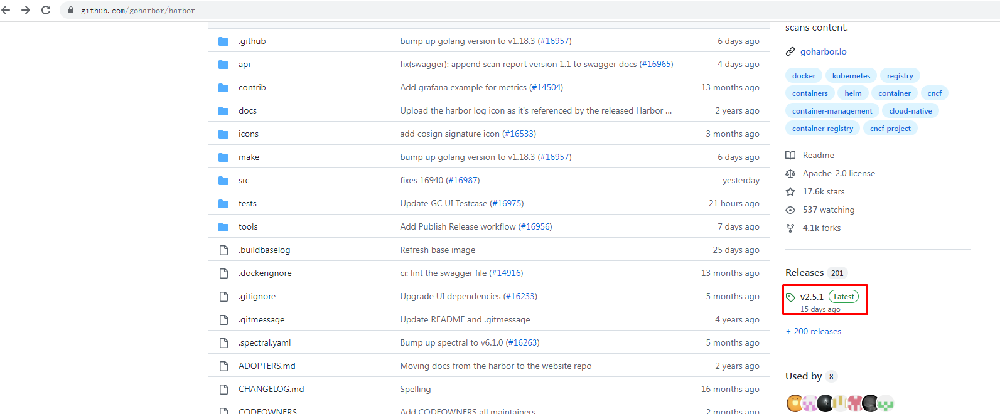
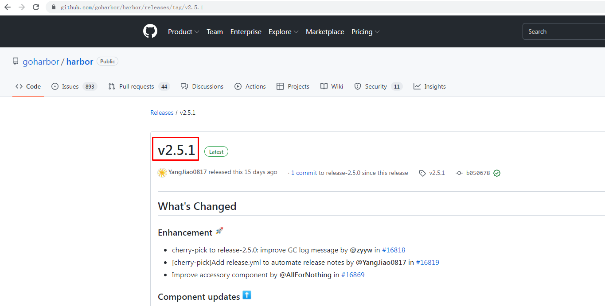
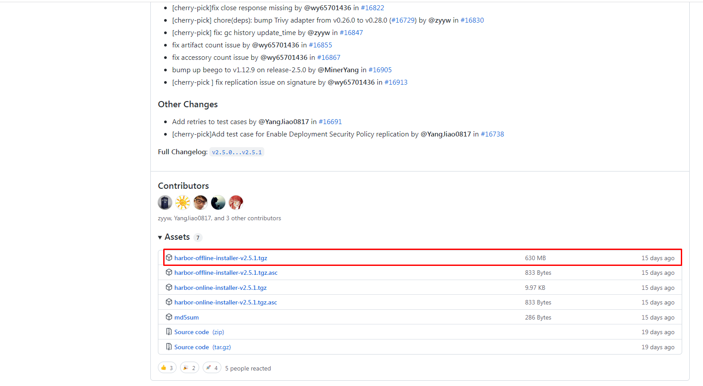

# Kubernetes集群使用容器镜像仓库Harbor

# 一、容器镜像仓库Harbor部署

## 1.1 在docker主机部署harbor

### 1.1.1 docker-ce安装

#### 1.1.1.1 获取YUM源

> 使用阿里云开源软件镜像站。


~~~powershell
# wget https://mirrors.aliyun.com/docker-ce/linux/centos/docker-ce.repo -O /etc/yum.repos.d/docker-ce.repo
~~~


#### 1.1.1.2 安装并设置启动及开机自启动


~~~powershell
# yum -y install docker-ce
~~~


~~~powershell
# systemctl enable --now docker
~~~


### 1.1.2 docker compose安装

~~~powershell
下载docker-compose二进制文件
# wget https://github.com/docker/compose/releases/download/1.25.0/docker-compose-Linux-x86_64
~~~


~~~powershell
查看已下载二进制文件
# ls
docker-compose-Linux-x86_64
~~~


~~~powershell
移动二进制文件到/usr/bin目录，并更名为docker-compose
# mv docker-compose-Linux-x86_64 /usr/bin/docker-compose
~~~


~~~powershell
为二进制文件添加可执行权限
# chmod +x /usr/bin/docker-compose
~~~


~~~powershell
安装完成后，查看docker-compse版本
# docker-compose version
docker-compose version 1.25.0, build 0a186604
docker-py version: 4.1.0
CPython version: 3.7.4
OpenSSL version: OpenSSL 1.1.0l  10 Sep 2019
~~~


### 1.1.3 获取harbor安装文件











~~~powershell
下载harbor离线安装包
# wget https://github.com/goharbor/harbor/releases/download/v2.5.1/harbor-offline-installer-v2.5.1.tgz
~~~


~~~powershell
查看已下载的离线安装包
# ls
harbor-offline-installer-v2.5.1.tgz
~~~


### 1.1.4  修改配置文件


~~~powershell
解压harbor离线安装包
# tar xf harbor-offline-installer-v2.5.1.tgz
~~~


~~~powershell
查看解压出来的目录
# ls
harbor 
~~~


~~~powershell
查看harbor目录
# ls harbor
common.sh  harbor.v2.5.1.tar.gz  harbor.yml.tmpl  install.sh  LICENSE  prepare
~~~


~~~powershell
创建配置文件
# cd harbor/
# mv harbor.yml.tmpl harbor.yml
~~~


~~~powershell
修改配置文件内容

# vim harbor.yml

# Configuration file of Harbor

# The IP address or hostname to access admin UI and registry service.
# DO NOT use localhost or 127.0.0.1, because Harbor needs to be accessed by external clients.
hostname: 192.168.10.250

# http related config
http:
  # port for http, default is 80. If https enabled, this port will redirect to https port
  port: 80

# https related config
# https:
  # https port for harbor, default is 443
#  port: 443
  # The path of cert and key files for nginx
#  certificate: /root/harbor/6864844_kubemsb.com.pem 
#  private_key: /root/harbor/6864844_kubemsb.com.key

# # Uncomment following will enable tls communication between all harbor components
# internal_tls:
#   # set enabled to true means internal tls is enabled
#   enabled: true
#   # put your cert and key files on dir
#   dir: /etc/harbor/tls/internal

# Uncomment external_url if you want to enable external proxy
# And when it enabled the hostname will no longer used
# external_url: https://reg.mydomain.com:8433

# The initial password of Harbor admin
# It only works in first time to install harbor
# Remember Change the admin password from UI after launching Harbor.
harbor_admin_password: 12345 访问密码
......
~~~


### 1.1.5 执行预备脚本


~~~powershell
# ./prepare
~~~


~~~powershell
输出
prepare base dir is set to /root/harbor
Clearing the configuration file: /config/portal/nginx.conf
Clearing the configuration file: /config/log/logrotate.conf
Clearing the configuration file: /config/log/rsyslog_docker.conf
Generated configuration file: /config/portal/nginx.conf
Generated configuration file: /config/log/logrotate.conf
Generated configuration file: /config/log/rsyslog_docker.conf
Generated configuration file: /config/nginx/nginx.conf
Generated configuration file: /config/core/env
Generated configuration file: /config/core/app.conf
Generated configuration file: /config/registry/config.yml
Generated configuration file: /config/registryctl/env
Generated configuration file: /config/registryctl/config.yml
Generated configuration file: /config/db/env
Generated configuration file: /config/jobservice/env
Generated configuration file: /config/jobservice/config.yml
Generated and saved secret to file: /data/secret/keys/secretkey
Successfully called func: create_root_cert
Generated configuration file: /compose_location/docker-compose.yml
Clean up the input dir
~~~


### 1.1.6 执行安装脚本


~~~powershell
# ./install.sh
~~~


~~~powershell
输出
[Step 0]: checking if docker is installed ...

Note: docker version: 20.10.12

[Step 1]: checking docker-compose is installed ...

Note: docker-compose version: 1.25.0

[Step 2]: loading Harbor images ...

[Step 3]: preparing environment ...

[Step 4]: preparing harbor configs ...
prepare base dir is set to /root/harbor

[Step 5]: starting Harbor ...
Creating network "harbor_harbor" with the default driver
Creating harbor-log ... done
Creating harbor-db     ... done
Creating registry      ... done
Creating registryctl   ... done
Creating redis         ... done
Creating harbor-portal ... done
Creating harbor-core   ... done
Creating harbor-jobservice ... done
Creating nginx             ... done
✔ ----Harbor has been installed and started successfully.----
~~~


### 1.1.7 验证运行情况


~~~powershell
# docker ps
CONTAINER ID   IMAGE                                COMMAND                  CREATED              STATUS                        PORTS                                                                            NAMES
71c0db683e4a   goharbor/nginx-photon:v2.5.1         "nginx -g 'daemon of…"   About a minute ago   Up About a minute (healthy)   0.0.0.0:80->8080/tcp, :::80->8080/tcp, 0.0.0.0:443->8443/tcp, :::443->8443/tcp   nginx
4e3b53a86f01   goharbor/harbor-jobservice:v2.5.1    "/harbor/entrypoint.…"   About a minute ago   Up About a minute (healthy)                                                                                    harbor-jobservice
df76e1eabbf7   goharbor/harbor-core:v2.5.1          "/harbor/entrypoint.…"   About a minute ago   Up About a minute (healthy)                                                                                    harbor-core
eeb4d224dfc4   goharbor/harbor-portal:v2.5.1        "nginx -g 'daemon of…"   About a minute ago   Up About a minute (healthy)                                                                                    harbor-portal
70e162c38b59   goharbor/redis-photon:v2.5.1         "redis-server /etc/r…"   About a minute ago   Up About a minute (healthy)                                                                                    redis
8bcc0e9b06ec   goharbor/harbor-registryctl:v2.5.1   "/home/harbor/start.…"   About a minute ago   Up About a minute (healthy)                                                                                    registryctl
d88196398df7   goharbor/registry-photon:v2.5.1      "/home/harbor/entryp…"   About a minute ago   Up About a minute (healthy)                                                                                    registry
ed5ba2ba9c82   goharbor/harbor-db:v2.5.1            "/docker-entrypoint.…"   About a minute ago   Up About a minute (healthy)                                                                                    harbor-db
dcb4b57c7542   goharbor/harbor-log:v2.5.1           "/bin/sh -c /usr/loc…"   About a minute ago   Up About a minute (healthy)   127.0.0.1:1514->10514/tcp                                                        harbor-log

~~~


### 1.1.8 访问harbor UI界面


## 1.2 在kubernetes集群中部署harbor

> 由于涉及后面技术内容，例如： pv、pvc、helm等，后期内容做介绍。


# 二、Kubernetes集群使用harbor仓库

## 2.1 通过secret使用harbor仓库

### 2.1.1 新建一个harbor私有仓库


### 2.1.2 kubernetes集群所有节点配置harbor仓库

```powershell
# vim /etc/docker/daemon.json

{							
  "insecure-registries": ["http://192.168.10.250"]			
}

# systemctl restart docker
```


### 2.1.3 上传nginx测试镜像到harbor

> docker-compose down停止harbor,修改后再启动。


~~~powershell
[root@harbor ~]# cat /etc/docker/daemon.json
{
        "insecure-registries": ["http://192.168.10.250"]
}
~~~


~~~powershell
[root@harbor ~]# systemctl restart docker
~~~


```powershell
[root@harbor ~]# docker pull nginx:1.15-alpine


[root@harbor ~]# docker login 192.168.10.250
Username: admin
Password:							这里密码是12345
WARNING! Your password will be stored unencrypted in /root/.docker/config.json.
Configure a credential helper to remove this warning. See
https://docs.docker.com/engine/reference/commandline/login/#credentials-store


[root@harbor ~]# docker tag nginx:1.15-alpine 192.168.10.250/test/nginx:v1

[root@harbor ~]# docker push 192.168.10.250/test/nginx:v1
```


### 2.1.4  创建docker-registry类型secret

```powershell
[root@k8s-master1 ~]# kubectl create secret docker-registry harbor-secret --docker-server=192.168.10.250 --docker-username=admin --docker-password=12345
```

说明: 

- 类型为docker-registry
- --docker-server指定harbor仓库的IP
- --docker-username指定harbor仓库的登录用户名
- --docker-password指定harbor仓库的登录密码

验证查看

```powershell
[root@k8s-master1 ~]# kubectl get secret |grep harbor-secret
harbor-secret                        kubernetes.io/dockerconfigjson        1      19s
```


~~~powershell
[root@k8s-master1 ~]# kubectl describe secret harbor-secret
Name:         harbor-secret
Namespace:    default
Labels:       <none>
Annotations:  <none>

Type:  kubernetes.io/dockerconfigjson

Data
====
.dockerconfigjson:  94 bytes
~~~


### 2.1.5 创建pod并使用secret

```powershell
[root@k8s-master1 ~]# vim pod-harbor.yml
apiVersion: v1
kind: Pod
metadata:
  name: pod-harbor
spec:
  containers:
  - name: c1
    image: 192.168.10.250/test/nginx:v1
  imagePullSecrets:                     # 定义镜像下载使用的secrets
  - name: harbor-secret					# 与上面的secret一致
```

```powershell
[root@k8s-master1 ~]# kubectl apply -f pod-harbor.yml
pod/pod-harbor created
```


### 2.1.6 验证pod

```powershell
[root@k8s-master1 ~]# kubectl describe pod pod-harbor
Events:
  Type    Reason     Age   From               Message
  ----    ------     ----  ----               -------
  Normal  Scheduled  16s   default-scheduler  Successfully assigned default/pod-harbor to k8s-worker1
  Normal  Pulling    15s   kubelet            Pulling image "192.168.10.250/test/nginx:v1"
  Normal  Pulled     14s   kubelet            Successfully pulled image "192.168.10.250/test/nginx:v1" in 630.869309ms
  Normal  Created    14s   kubelet            Created container c1
  Normal  Started    14s   kubelet            Started container c1

可以看到是从192.168.10.250/test/nginx:v1拉取的镜像
```


## 2.2 通过serviceaccout使用harbor仓库

### 2.2.1 设为serviceaccount默认规则

如果每次编写yaml文件都需要添加imagePullSecrets这2行配置，有点麻烦， 有没有在不需要添加这2行配置就可以实现下载harbor仓库里面的镜像呢？答案是有的，可以把secret配置到serviceAccount中即可。


### 2.2.2 创建serviceaccount及应用过程

1. 创建serviceaccount

```powershell
[root@k8s-master1 ~]# vim serviceaccount-harbor-sa.yaml
apiVersion: v1
kind: ServiceAccount
metadata:
  name: harbor-sa
  namespace: default

[root@k8s-master1 ~]# kubectl apply -f serviceaccount-harbor-sa.yaml
serviceaccount/harbor-sa created

[root@k8s-master1 ~]# kubectl get sa |grep harbor-sa
harbor-sa                1         14s
```

2.修改serviceaccount添加使用harbor-secret

~~~powershell
[root@k8s-master1 ~]# kubectl describe serviceaccount harbor-sa
Name:                harbor-sa
Namespace:           default
Labels:              <none>
Annotations:         <none>
Image pull secrets:  <none>
Mountable secrets:   harbor-sa-token-thxwq
Tokens:              harbor-sa-token-thxwq
Events:              <none>
~~~


```powershell
[root@k8s-master1 ~]# kubectl patch serviceaccount harbor-sa -n default  -p '{"imagePullSecrets": [{"name": "harbor-secret"}]}'
serviceaccount/harbor-sa patched

[root@k8s-master1 ~]# kubectl describe serviceaccount harbor-sa
Name:                harbor-sa
Namespace:           default
Labels:              <none>
Annotations:         <none>
Image pull secrets:  harbor-secret
Mountable secrets:   harbor-sa-token-thxwq
Tokens:              harbor-sa-token-thxwq
Events:              <none>

[root@k8s-master1 ~]# kubectl get serviceaccount harbor-sa -o yaml
apiVersion: v1
imagePullSecrets:
- name: harbor-secret					   # 确认,通过patch方式更新了
kind: ServiceAccount
......
```

3.修改yaml使用serviceAccount

```powershell
[root@k8s-master1 ~]# vim pod-harbor.yml
apiVersion: v1
kind: Pod
metadata:
  name: pod-harbor
spec:
  serviceAccount: harbor-sa					# 原来的2句换成使用harbor-sa这个serviceAccount
  containers:
  - name: c1
    image: 192.168.122.18/test/nginx:v1
```

4. 删除先前的重新创建pod验证

```powershell
[root@k8s-master1 ~]# kubectl delete pod pod-harbor
pod "pod-harbor" deleted

[root@k8s-master1 ~]# kubectl apply -f pod-harbor.yml
pod/pod-harbor created

[root@k8s-master1 ~]# kubectl get pods
NAME         READY   STATUS    RESTARTS   AGE
pod-harbor   1/1     Running   0          8s
```


~~~powershell
[root@k8s-master1 ~]# kubectl describe pods pod-harbor
Events:
  Type    Reason     Age   From               Message
  ----    ------     ----  ----               -------
  Normal  Scheduled  13s   default-scheduler  Successfully assigned default/pod-harbor to k8s-worker2
  Normal  Pulling    13s   kubelet            Pulling image "192.168.10.250/test/nginx:v1"
  Normal  Pulled     12s   kubelet            Successfully pulled image "192.168.10.250/test/nginx:v1" in 731.788686ms
  Normal  Created    12s   kubelet            Created container c1
  Normal  Started    12s   kubelet            Started container c1
~~~


补充: serviceAccount可以实现不同namespace下载镜像使用访问harbor账号的不同。