# helm部署prometheus监控系统及应用

# 一、helm安装

~~~powershell
wget https://get.helm.sh/helm-v3.8.2-linux-amd64.tar.gz
~~~

~~~powershell
tar xf helm-v3.8.2-linux-amd64.tar.gz
~~~

~~~powershell
mv linux-amd64/helm /bin/helm
~~~

~~~powershell
# helm version
version.BuildInfo{Version:"v3.8.2", GitCommit:"6e3701edea09e5d55a8ca2aae03a68917630e91b", GitTreeState:"clean", GoVersion:"go1.17.5"}
~~~

# 二、helm添加prometheus仓库

~~~powershell
helm repo add prometheus-community https://prometheus-community.github.io/helm-charts
~~~

~~~powershell
helm repo update
~~~

~~~powershell
# helm search repo prometheus
NAME                                                    CHART VERSION   APP VERSION     DESCRIPTION
prometheus-community/kube-prometheus-stack              37.2.0          0.57.0          kube-prometheus-stack collects Kubernetes manif.
~~~

# 三、使用helm安装prometheus全家桶

~~~powershell
# helm show values prometheus-community/kube-prometheus-stack > kube-prometheus-stack.yaml-default
~~~

~~~powershell
# cp kube-prometheus-stack.yaml-default kube-prometheus-stack.yaml
~~~

~~~powershell
# vim kube-prometheus-stack.yaml

2389     serviceMonitorSelectorNilUsesHelmValues: true

把true修改为false
~~~

~~~powershell
# helm install kps  prometheus-community/kube-prometheus-stack -f kube-prometheus-stack.yaml -n monitoring --create-namespace --version 37.2.0 --debug
~~~

~~~powershell
kubectl --namespace monitoring get pods -l "release=kps"
~~~

~~~powershell
# kubectl get svc -n monitoring
NAME                                     TYPE        CLUSTER-IP    EXTERNAL-IP   PORT(S)                      AGE
alertmanager-operated                    ClusterIP   None          <none>        9093/TCP,9094/TCP,9094/UDP   23m
kps-grafana                              ClusterIP   10.96.1.75    <none>        80/TCP                       24m
kps-kube-prometheus-stack-alertmanager   ClusterIP   10.96.0.115   <none>        9093/TCP                     24m
kps-kube-prometheus-stack-operator       ClusterIP   10.96.0.29    <none>        443/TCP                      24m
kps-kube-prometheus-stack-prometheus     ClusterIP   10.96.0.220   <none>        9090/TCP                     24m
kps-kube-state-metrics                   ClusterIP   10.96.1.192   <none>        8080/TCP                     24m
kps-prometheus-node-exporter             ClusterIP   10.96.3.21    <none>        9100/TCP                     24m
prometheus-operated                      ClusterIP   None          <none>        9090/TCP                     23m
~~~

~~~powershell
# kubectl get pods -n monitoring
NAME                                                    READY   STATUS    RESTARTS   AGE
alertmanager-kps-kube-prometheus-stack-alertmanager-0   2/2     Running   0          24m
kps-grafana-65f5f8f47d-zwt44                            3/3     Running   0          24m
kps-kube-prometheus-stack-operator-667b454c64-zlgq2     1/1     Running   0          24m
kps-kube-state-metrics-7d987f86f9-w5wkq                 1/1     Running   0          24m
kps-prometheus-node-exporter-7v4c8                      1/1     Running   0          24m
kps-prometheus-node-exporter-9gmjm                      1/1     Running   0          24m
kps-prometheus-node-exporter-lmdxp                      1/1     Running   0          24m
kps-prometheus-node-exporter-pf5kz                      1/1     Running   0          24m
prometheus-kps-kube-prometheus-stack-prometheus-0       2/2     Running   0          24m
~~~

# 四、配置prometheus及grafana访问

## 4.1 prometheus

~~~powershell
# cat pro.yaml
apiVersion: networking.k8s.io/v1
kind: Ingress
metadata:
  name: ingress-prometheus                    #自定义ingress名称
  namespace: monitoring
  annotations:
    ingressclass.kubernetes.io/is-default-class: "true"
    kubernetes.io/ingress.class: nginx
spec:
  rules:
  - host: prometheus.kubemsb.com                   # 自定义域名
    http:
      paths:
      - pathType: Prefix
        path: "/"
        backend:
          service:
            name: kps-kube-prometheus-stack-prometheus     # 对应上面创建的service名称
            port:
              number: 9090
~~~

~~~powershell
kubectl apply -f pro.yaml
~~~

> 把prometheus.kubemsb.com域名与ingress nginx controller svc对应的IP进行解析即可访问。

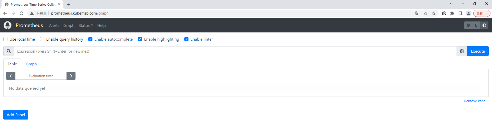

## 4.2 grafana

~~~powershell
# cat grafana.yaml
apiVersion: networking.k8s.io/v1
kind: Ingress
metadata:
  name: ingress-grafana                    #自定义ingress名称
  namespace: monitoring
  annotations:
    ingressclass.kubernetes.io/is-default-class: "true"
    kubernetes.io/ingress.class: nginx
spec:
  rules:
  - host: grafana.kubemsb.com                   # 自定义域名
    http:
      paths:
      - pathType: Prefix
        path: "/"
        backend:
          service:
            name: kps-grafana     # 对应上面创建的service名称
            port:
              number: 80
~~~

~~~powershell
kubectl apply -f grafana.yaml
~~~

~~~powershell
# kubectl get secret -n monitoring
NAME                                                               TYPE                 DATA   AGE
kps-grafana                                                        Opaque               3      28m
~~~

~~~powershell
# kubectl get  secret kps-grafana -n monitoring -o yaml
apiVersion: v1
data:
  admin-password: cHJvbS1vcGVyYXRvcg==
  admin-user: YWRtaW4=
  ldap-toml: ""
kind: Secret
metadata:
  annotations:
    meta.helm.sh/release-name: kps
    meta.helm.sh/release-namespace: monitoring
  creationTimestamp: "2022-07-14T05:52:02Z"
  labels:
    app.kubernetes.io/instance: kps
    app.kubernetes.io/managed-by: Helm
    app.kubernetes.io/name: grafana
    app.kubernetes.io/version: 9.0.2
    helm.sh/chart: grafana-6.32.2
  name: kps-grafana
  namespace: monitoring
  resourceVersion: "4929"
  uid: 98f435cf-4e27-475c-ade9-3562da262f37
type: Opaque
~~~

~~~powershell
# echo -n "YWRtaW4=" | base64 --decode
admin
~~~

~~~powershell
# echo -n "cHJvbS1vcGVyYXRvcg==" | base64 --decode
prom-operator
~~~

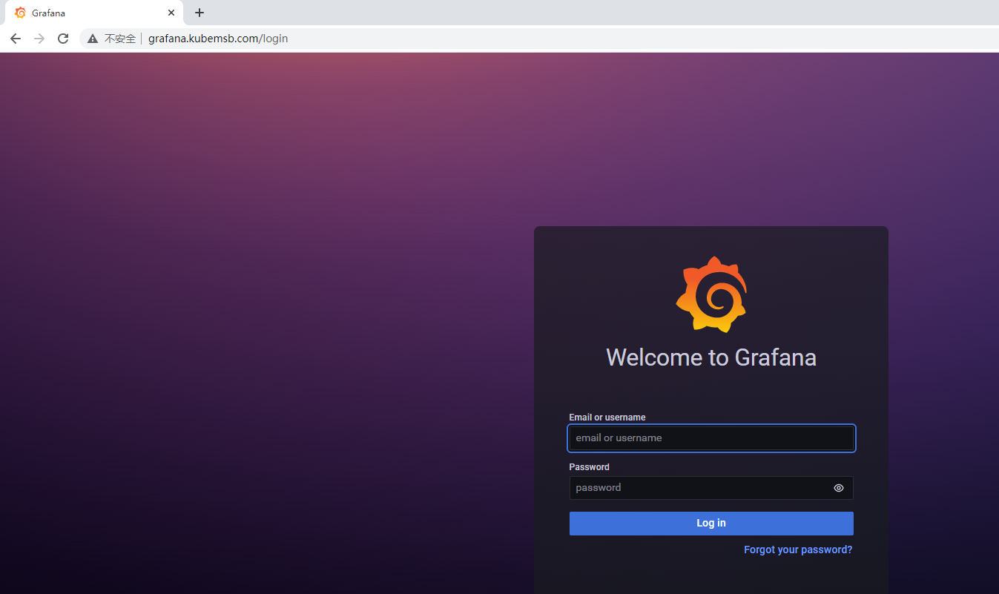

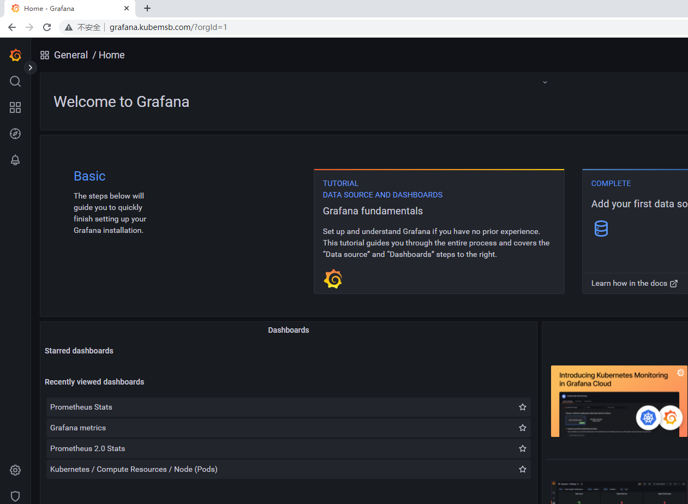

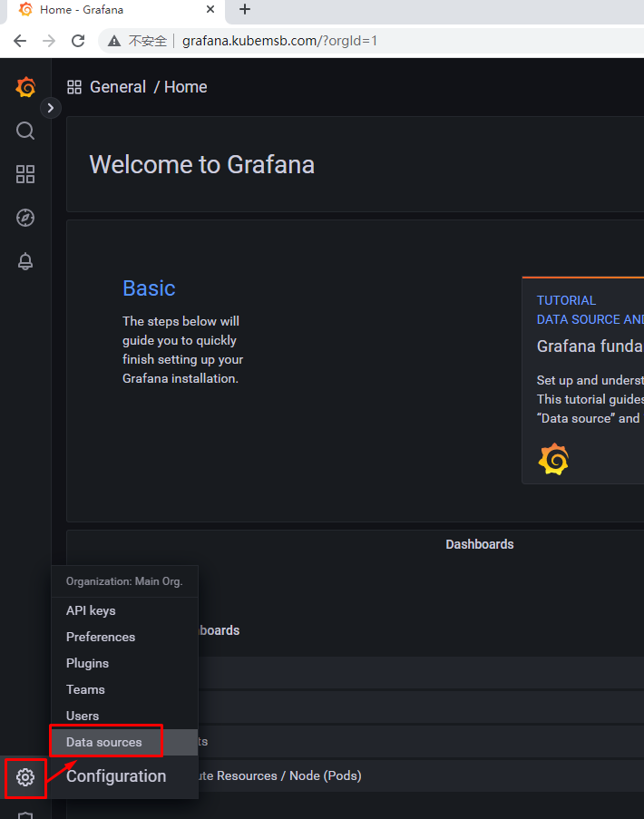

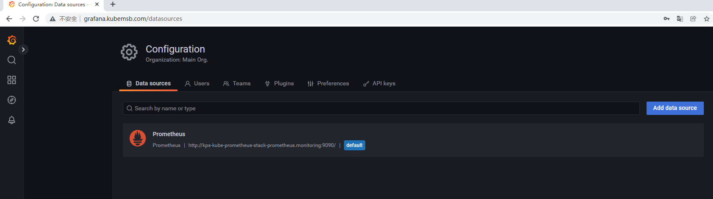

# 五、使用prometheus监控redis

## 5.1 redis集群部署

~~~powershell
# helm repo add bitnami https://charts.bitnami.com/bitnami
"bitnami" has been added to your repositories
~~~

~~~powershell
# helm repo update
~~~

~~~powershell
# helm search repo redis
NAME                                            CHART VERSION   APP VERSION     DESCRIPTION
bitnami/redis                                   17.0.1          7.0.3           Redis(R) is an open source, advanced key-value ...
bitnami/redis-cluster                           8.0.0           7.0.3           Redis(R) is an open source, scalable, distribut...
~~~

~~~powershell
# helm install redis bitnami/redis --set global.storageClass=managed-nfs-storage --set global.redis.password=root --set architecture=standalone --version 17.0.1 -n redisns --create-namespace --debug
~~~

~~~powershell
# kubectl get all -n redisns
NAME                 READY   STATUS    RESTARTS   AGE
pod/redis-master-0   1/1     Running   0          6m19s

NAME                     TYPE        CLUSTER-IP   EXTERNAL-IP   PORT(S)    AGE
service/redis-headless   ClusterIP   None         <none>        6379/TCP   6m19s
service/redis-master     ClusterIP   10.96.3.75   <none>        6379/TCP   6m19s

NAME                            READY   AGE
statefulset.apps/redis-master   1/1     6m19s
~~~

~~~powershell
# dig -t a redis-headless.redisns.svc.cluster.local @10.96.0.10
~~~

## 5.2 部署redis-exporter

~~~powershell
# cat d.yaml
apiVersion: apps/v1 # 版本
kind: Deployment # 资源
metadata:
  labels:
    app: redis-exporter # 标签
  name: redis-exporter # deploy的名称
  namespace: monitoring # 命名空间
spec:
  replicas: 1 # 副本
  selector:
    matchLabels:
      k8s-app: redis-exporter # po标签
  strategy: {}
  template:
    metadata:
      labels:
        k8s-app: redis-exporter # po标签
    spec:
      containers:
      - image: oliver006/redis_exporter:latest
        name: redis-exporter
        args: ["-redis.addr", "redis://redis-headless.redisns.svc.cluster.local:6379", "-redis.password", "root"]
        ports:
        - containerPort: 9121 # 默认暴露的端口号
          name: http
~~~

~~~powershell
kubectl apply -f d.yaml
~~~

~~~powershell
# kubectl get deployment -n monitoring
NAME                                 READY   UP-TO-DATE   AVAILABLE   AGE
kps-grafana                          1/1     1            1           57m
kps-kube-prometheus-stack-operator   1/1     1            1           57m
kps-kube-state-metrics               1/1     1            1           57m
redis-exporter                       1/1     1            1           22s
~~~

~~~powershell
# cat svc.yaml
apiVersion: v1 
kind: Service
metadata:
  name: redis-exporter 
  namespace: monitoring 
  labels:
    k8s-app: redis-exporter
spec:
  ports:
  - port: 9121 
    protocol: TCP
    name: http
  selector:
    k8s-app: redis-exporter
  type: ClusterIP 
~~~

~~~powershell
# kubectl apply -f svc.yaml
~~~

~~~powershell
# kubectl get svc -n monitoring
NAME                                     TYPE        CLUSTER-IP    EXTERNAL-IP   PORT(S)                      AGE
.....
redis-exporter                           ClusterIP   10.96.2.78    <none>        9121/TCP                     8s
~~~

~~~powershell
curl 10.96.2.78:9121/metrics | tail -1
...
redis_uptime_in_seconds 881
~~~

~~~powershell
# cat sm.yaml
apiVersion: monitoring.coreos.com/v1
kind: ServiceMonitor
metadata:
  name: redis-exporter 
  namespace: monitoring 
  labels:
    k8s-app: redis-exporter
spec:
  endpoints:
    - interval: 10s
      port: http # 这个是port 对应 Service.spec.ports.name
      scheme: http
  jobLabel: k8s-app
  selector:
    matchLabels:
      k8s-app: redis-exporter # 跟 svc 的 lables 保持一致
  namespaceSelector:
    matchNames:
    - monitoring # svc的命名空间
~~~

~~~powershell
# kubectl apply -f sm.yaml
~~~

~~~powershell
# kubectl get servicemonitor -n monitoring
NAME                                                AGE
......
redis-exporter                                      46s
~~~

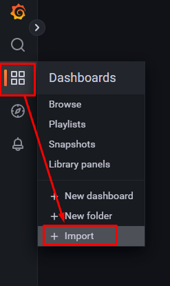

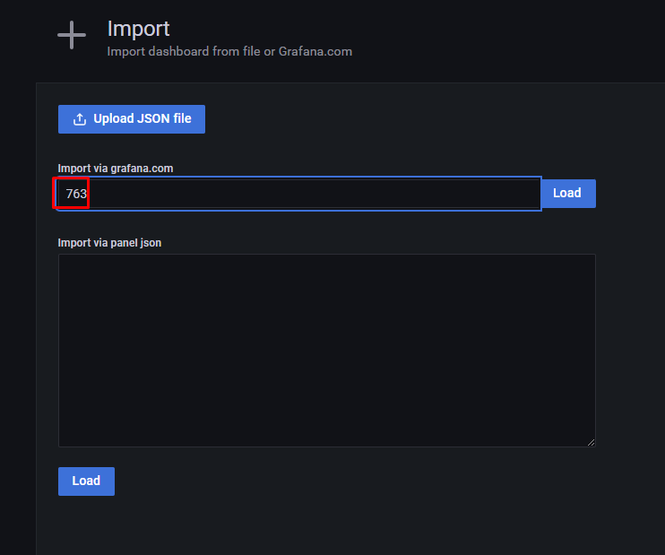

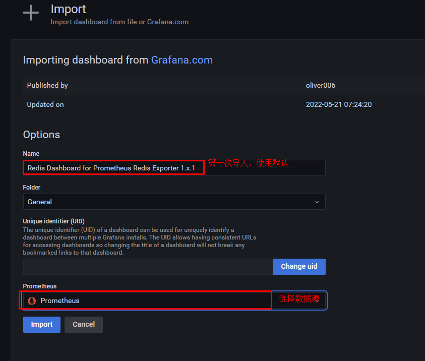

# helm部署prometheus监控系统及应用

# 一、helm安装

~~~powershell
wget https://get.helm.sh/helm-v3.8.2-linux-amd64.tar.gz
~~~

~~~powershell
tar xf helm-v3.8.2-linux-amd64.tar.gz
~~~

~~~powershell
mv linux-amd64/helm /bin/helm
~~~

~~~powershell
# helm version
version.BuildInfo{Version:"v3.8.2", GitCommit:"6e3701edea09e5d55a8ca2aae03a68917630e91b", GitTreeState:"clean", GoVersion:"go1.17.5"}
~~~

# 二、helm添加prometheus仓库

~~~powershell
helm repo add prometheus-community https://prometheus-community.github.io/helm-charts
~~~

~~~powershell
helm repo update
~~~

~~~powershell
# helm search repo prometheus
NAME                                                    CHART VERSION   APP VERSION     DESCRIPTION
prometheus-community/kube-prometheus-stack              37.2.0          0.57.0          kube-prometheus-stack collects Kubernetes manif.
~~~

# 三、使用helm安装prometheus全家桶

~~~powershell
# helm show values prometheus-community/kube-prometheus-stack > kube-prometheus-stack.yaml-default
~~~

~~~powershell
# cp kube-prometheus-stack.yaml-default kube-prometheus-stack.yaml
~~~

~~~powershell
# vim kube-prometheus-stack.yaml

2389     serviceMonitorSelectorNilUsesHelmValues: true

把true修改为false
~~~

~~~powershell
# helm install kps  prometheus-community/kube-prometheus-stack -f kube-prometheus-stack.yaml -n monitoring --create-namespace --version 37.2.0 --debug
~~~

~~~powershell
kubectl --namespace monitoring get pods -l "release=kps"
~~~

~~~powershell
# kubectl get svc -n monitoring
NAME                                     TYPE        CLUSTER-IP    EXTERNAL-IP   PORT(S)                      AGE
alertmanager-operated                    ClusterIP   None          <none>        9093/TCP,9094/TCP,9094/UDP   23m
kps-grafana                              ClusterIP   10.96.1.75    <none>        80/TCP                       24m
kps-kube-prometheus-stack-alertmanager   ClusterIP   10.96.0.115   <none>        9093/TCP                     24m
kps-kube-prometheus-stack-operator       ClusterIP   10.96.0.29    <none>        443/TCP                      24m
kps-kube-prometheus-stack-prometheus     ClusterIP   10.96.0.220   <none>        9090/TCP                     24m
kps-kube-state-metrics                   ClusterIP   10.96.1.192   <none>        8080/TCP                     24m
kps-prometheus-node-exporter             ClusterIP   10.96.3.21    <none>        9100/TCP                     24m
prometheus-operated                      ClusterIP   None          <none>        9090/TCP                     23m
~~~

~~~powershell
# kubectl get pods -n monitoring
NAME                                                    READY   STATUS    RESTARTS   AGE
alertmanager-kps-kube-prometheus-stack-alertmanager-0   2/2     Running   0          24m
kps-grafana-65f5f8f47d-zwt44                            3/3     Running   0          24m
kps-kube-prometheus-stack-operator-667b454c64-zlgq2     1/1     Running   0          24m
kps-kube-state-metrics-7d987f86f9-w5wkq                 1/1     Running   0          24m
kps-prometheus-node-exporter-7v4c8                      1/1     Running   0          24m
kps-prometheus-node-exporter-9gmjm                      1/1     Running   0          24m
kps-prometheus-node-exporter-lmdxp                      1/1     Running   0          24m
kps-prometheus-node-exporter-pf5kz                      1/1     Running   0          24m
prometheus-kps-kube-prometheus-stack-prometheus-0       2/2     Running   0          24m
~~~

# 四、配置prometheus及grafana访问

## 4.1 prometheus

~~~powershell
# cat pro.yaml
apiVersion: networking.k8s.io/v1
kind: Ingress
metadata:
  name: ingress-prometheus                    #自定义ingress名称
  namespace: monitoring
  annotations:
    ingressclass.kubernetes.io/is-default-class: "true"
    kubernetes.io/ingress.class: nginx
spec:
  rules:
  - host: prometheus.kubemsb.com                   # 自定义域名
    http:
      paths:
      - pathType: Prefix
        path: "/"
        backend:
          service:
            name: kps-kube-prometheus-stack-prometheus     # 对应上面创建的service名称
            port:
              number: 9090
~~~

~~~powershell
kubectl apply -f pro.yaml
~~~

> 把prometheus.kubemsb.com域名与ingress nginx controller svc对应的IP进行解析即可访问。

## 4.2 grafana

~~~powershell
# cat grafana.yaml
apiVersion: networking.k8s.io/v1
kind: Ingress
metadata:
  name: ingress-grafana                    #自定义ingress名称
  namespace: monitoring
  annotations:
    ingressclass.kubernetes.io/is-default-class: "true"
    kubernetes.io/ingress.class: nginx
spec:
  rules:
  - host: grafana.kubemsb.com                   # 自定义域名
    http:
      paths:
      - pathType: Prefix
        path: "/"
        backend:
          service:
            name: kps-grafana     # 对应上面创建的service名称
            port:
              number: 80
~~~

~~~powershell
kubectl apply -f grafana.yaml
~~~

~~~powershell
# kubectl get secret -n monitoring
NAME                                                               TYPE                 DATA   AGE
kps-grafana                                                        Opaque               3      28m
~~~

~~~powershell
# kubectl get  secret kps-grafana -n monitoring -o yaml
apiVersion: v1
data:
  admin-password: cHJvbS1vcGVyYXRvcg==
  admin-user: YWRtaW4=
  ldap-toml: ""
kind: Secret
metadata:
  annotations:
    meta.helm.sh/release-name: kps
    meta.helm.sh/release-namespace: monitoring
  creationTimestamp: "2022-07-14T05:52:02Z"
  labels:
    app.kubernetes.io/instance: kps
    app.kubernetes.io/managed-by: Helm
    app.kubernetes.io/name: grafana
    app.kubernetes.io/version: 9.0.2
    helm.sh/chart: grafana-6.32.2
  name: kps-grafana
  namespace: monitoring
  resourceVersion: "4929"
  uid: 98f435cf-4e27-475c-ade9-3562da262f37
type: Opaque
~~~

~~~powershell
# echo -n "YWRtaW4=" | base64 --decode
admin
~~~

~~~powershell
# echo -n "cHJvbS1vcGVyYXRvcg==" | base64 --decode
prom-operator
~~~

# 五、使用prometheus监控redis

## 5.1 使用helm实现redis集群部署

~~~powershell
# helm repo add bitnami https://charts.bitnami.com/bitnami
"bitnami" has been added to your repositories
~~~

~~~powershell
# helm repo update
~~~

~~~powershell
# helm search repo redis
NAME                                            CHART VERSION   APP VERSION     DESCRIPTION
bitnami/redis                                   17.0.1          7.0.3           Redis(R) is an open source, advanced key-value ...
bitnami/redis-cluster                           8.0.0           7.0.3           Redis(R) is an open source, scalable, distribut...
~~~

~~~powershell
# helm install redis bitnami/redis --set global.storageClass=managed-nfs-storage --set global.redis.password=root --set architecture=standalone --version 17.0.1 -n redisns --create-namespace --debug
~~~

~~~powershell
# kubectl get all -n redisns
NAME                 READY   STATUS    RESTARTS   AGE
pod/redis-master-0   1/1     Running   0          6m19s

NAME                     TYPE        CLUSTER-IP   EXTERNAL-IP   PORT(S)    AGE
service/redis-headless   ClusterIP   None         <none>        6379/TCP   6m19s
service/redis-master     ClusterIP   10.96.3.75   <none>        6379/TCP   6m19s

NAME                            READY   AGE
statefulset.apps/redis-master   1/1     6m19s
~~~

~~~powershell
# dig -t a redis-headless.redisns.svc.cluster.local @10.96.0.10
~~~

## 5.2 监控方案一：部署redis-exporter及serviceMonitor

~~~powershell
# cat d.yaml
apiVersion: apps/v1 # 版本
kind: Deployment # 资源
metadata:
  labels:
    app: redis-exporter # 标签
  name: redis-exporter # deploy的名称
  namespace: monitoring # 命名空间
spec:
  replicas: 1 # 副本
  selector:
    matchLabels:
      k8s-app: redis-exporter # po标签
  strategy: {}
  template:
    metadata:
      labels:
        k8s-app: redis-exporter # po标签
    spec:
      containers:
      - image: oliver006/redis_exporter:latest
        name: redis-exporter
        args: ["-redis.addr", "redis://redis-headless.redisns.svc.cluster.local:6379", "-redis.password", "root"]
        ports:
        - containerPort: 9121 # 默认暴露的端口号
          name: http
~~~

~~~powershell
kubectl apply -f d.yaml
~~~

~~~powershell
# kubectl get deployment -n monitoring
NAME                                 READY   UP-TO-DATE   AVAILABLE   AGE
kps-grafana                          1/1     1            1           57m
kps-kube-prometheus-stack-operator   1/1     1            1           57m
kps-kube-state-metrics               1/1     1            1           57m
redis-exporter                       1/1     1            1           22s
~~~

~~~powershell
# cat svc.yaml
apiVersion: v1 
kind: Service
metadata:
  name: redis-exporter 
  namespace: monitoring 
  labels:
    k8s-app: redis-exporter
spec:
  ports:
  - port: 9121 
    protocol: TCP
    name: http
  selector:
    k8s-app: redis-exporter
  type: ClusterIP 
~~~

~~~powershell
# kubectl apply -f svc.yaml
~~~

~~~powershell
# kubectl get svc -n monitoring
NAME                                     TYPE        CLUSTER-IP    EXTERNAL-IP   PORT(S)                      AGE
.....
redis-exporter                           ClusterIP   10.96.2.78    <none>        9121/TCP                     8s
~~~

~~~powershell
curl 10.96.2.78:9121/metrics | tail -1
...
redis_uptime_in_seconds 881
~~~

~~~powershell
# cat sm.yaml
apiVersion: monitoring.coreos.com/v1
kind: ServiceMonitor
metadata:
  name: redis-exporter 
  namespace: monitoring 
  labels:
    k8s-app: redis-exporter
spec:
  endpoints:
    - interval: 10s
      port: http # 这个是port 对应 Service.spec.ports.name
      scheme: http
  jobLabel: k8s-app
  selector:
    matchLabels:
      k8s-app: redis-exporter # 跟 svc 的 lables 保持一致
  namespaceSelector:
    matchNames:
    - monitoring # svc的命名空间
~~~

~~~powershell
# kubectl apply -f sm.yaml
~~~

~~~powershell
# kubectl get servicemonitor -n monitoring
NAME                                                AGE
......
redis-exporter                                      46s
~~~

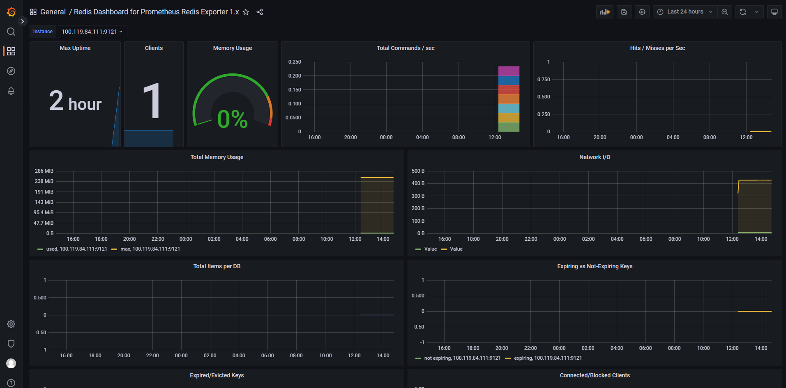

## 5.3 监控方案二：使用helm部署prometheus redis exporter监控redis

> 监控helm部署的redis

~~~powershell
查看服务是否存在
# kubectl get svc -n redisns
NAME             TYPE        CLUSTER-IP    EXTERNAL-IP   PORT(S)    AGE
redis-headless   ClusterIP   None          <none>        6379/TCP   5d13h
redis-master     ClusterIP   10.96.0.228   <none>        6379/TCP   5d13h
~~~

~~~powershell
查看是否有redis exporter
helm search repo redis
~~~

~~~powershell
下载prometheus-redis-exporter
# helm fetch prometheus-community/prometheus-redis-exporter
~~~

~~~powershell
解压prometheus-redis-exporter
# tar xf prometheus-redis-exporter-5.0.0.tgz
~~~

~~~powershell
进入prometheus-redis-exporter目录
# cd prometheus-redis-exporter/
~~~

~~~powershell
解析访问链接，确认是否可以访问
# dig -t a redis-headless.redisns.svc.cluster.local @10.96.0.10
~~~

~~~powershell
 修改values.yaml文件，重点看修改部分
 49 # If serviceMonitor.multipleTarget is enabled, this configuration is actually not used
 50 redisAddress: redis://redis-headless.redisns.svc.cluster.local:6379 配置redis访问地址
 51
 52 # deployment additional annotations and labels
 53 annotations: 把默认｛｝去掉
 54   prometheus.io/path: /metrics 默认此位置没有，复制过来即可
 55   prometheus.io/port: "9121" 默认此位置没有，复制过来即可
 56   prometheus.io/scrape: "true" 默认此位置没有，复制过来即可
 
 ...
  67 serviceMonitor:
 68   # When set true then use a ServiceMonitor to configure scraping
 69   enabled: true 默认为false，修改为true
 70   multipleTarget: false
 71   targets:
 72   # for every targets, url and name must be set,
 73   # an individual additionalRelabeling can be set for every target
 74     - url: "redis://redis-headless.redisns.svc.cluster.local:6379" 添加上面的redis访问地址
 75       name: "myold-redis" 设置redis监控名称
 76   # - url: "redis://my-redis-cluster:6379"

...
154 auth:
155   # Use password authentication
156   enabled: false
157   # Use existing secret (ignores redisPassword)
158   secret:
159     name: ""
160     key: ""
161   # Redis password (when not stored in a secret)
162   redisPassword: "root"  设置redis访问密码
163   # Redis user (version 6.X and above)
164   redisUser: ""

~~~

~~~powershell
安装prometheus-redis-exporter

helm install redis-monitor-old ./ -f values.yaml -n monitoring
~~~

## 5.4 使用helm部署prometheus redis exporter监控手动部署的redis

> 单独复制一份prometheus redis exporter即可

### 5.4 1 redis部署

~~~powershell
# vim redis.yaml
# cat redis.yaml
apiVersion: v1
kind: ConfigMap
metadata:
  name: redis
  namespace: test
data:
  redis.conf: |+
    requirepass redis@passwd
    maxmemory 268435456
---
apiVersion: apps/v1
kind: Deployment
metadata:
  name: redis
  namespace: test
  labels:
    app: redis
spec:
  selector:
    matchLabels:
      app: redis
  template:
    metadata:
      labels:
        app: redis
      annotations:
        version/date: "20220720"
        version/author: "fc"
    spec:
      containers:
      - name: redis
        image: redis
        imagePullPolicy: Always
        command: ["redis-server","/etc/redis/redis.conf"]
        ports:
        - containerPort: 6379
        volumeMounts:
        - name: redis-config
          mountPath: /etc/redis/redis.conf
          subPath: redis.conf
      volumes:
      - name: redis-config
        configMap:
          name: redis
          items:
          - key: redis.conf
            path: redis.conf
---
kind: Service
apiVersion: v1
metadata:
  name: redis
  namespace: test
spec:
  selector:
    app: redis
  ports:
  - port: 6379
    targetPort: 6379
~~~

~~~powershell
# kubectl apply -f redis.yaml
~~~

~~~powershell
# kubectl get all -n test
NAME                         READY   STATUS    RESTARTS   AGE
pod/redis-75f489d8f4-5gf4r   1/1     Running   0          82m

NAME            TYPE        CLUSTER-IP   EXTERNAL-IP   PORT(S)    AGE
service/redis   ClusterIP   10.96.2.16   <none>        6379/TCP   82m

NAME                    READY   UP-TO-DATE   AVAILABLE   AGE
deployment.apps/redis   1/1     1            1           82m

NAME                               DESIRED   CURRENT   READY   AGE
replicaset.apps/redis-75f489d8f4   1         1         1       82m
~~~

~~~powershell
下载prometheus-redis-exporter
# helm fetch prometheus-community/prometheus-redis-exporter
~~~

~~~powershell
解压prometheus-redis-exporter
# tar xf prometheus-redis-exporter-5.0.0.tgz
~~~

~~~powershell
# cd prometheus-redis-exporter/
~~~

~~~powershell
 # vim values.yaml
 
 ...
 49 # If serviceMonitor.multipleTarget is enabled, this configuration is actually not used
 50 redisAddress: redis://redis.test.svc.cluster.local:6379 修改为redis访问地址
 51
 52 # deployment additional annotations and labels
 53 annotations:
 54   prometheus.io/path: /metrics 默认没有，复制过来即可
 55   prometheus.io/port: "9121" 默认没有，复制过来即可
 56   prometheus.io/scrape: "true" 默认没有，复制过来即可
 57 labels: {}
 ...
 
 67 serviceMonitor:
 68   # When set true then use a ServiceMonitor to configure scraping
 69   enabled: true 默认为false,修改为true
 70   multipleTarget: false
 71   targets:
 72   # for every targets, url and name must be set,
 73   # an individual additionalRelabeling can be set for every target
 74     - url: "redis://redis.test.svc.cluster.local:6379" 默认没有开启，添加访问链接后开启即可
 75       name: "my-redis" 默认没有开启，开启即可，可以随意起名
 
 ...
 154 auth:
155   # Use password authentication
156   enabled: true
157   # Use existing secret (ignores redisPassword)
158   secret:
159     name: ""
160     key: ""
161   # Redis password (when not stored in a secret)
162   redisPassword: "redis@passwd" 密码要与redis配置文件中密码保持一致即可
163   # Redis user (version 6.X and above)
164   redisUser: ""

~~~

~~~powershell
helm install redis-monitor ./ -f values.yaml -n monitoring
~~~

## 5.5 实现helm部署prometheus redis exporter监控helm部署的redis集群

~~~powershell
# helm search repo redis
NAME                                            CHART VERSION   APP VERSION     DESCRIPTION
bitnami/redis                                   17.0.1          7.0.3           Redis(R) is an open source, advanced key-value ...
bitnami/redis-cluster                           8.0.0           7.0.3           Redis(R) is an open source, scalable, distribut...
~~~

~~~powershell
# helm install redis bitnami/redis --set global.storageClass=managed-nfs-storage --set global.redis.password=root  --version 17.0.1 -n redisns --create-namespace --debug
~~~

~~~powershell
下载prometheus-redis-exporter
# helm pull prometheus-community/prometheus-redis-exporter
~~~

~~~powershell
解压prometheus-redis-exporter
# tar xf prometheus-redis-exporter-5.0.0.tgz
~~~

~~~powershell
进入prometheus-redis-exporter目录
cd prometheus-redis-exporter/
~~~

~~~powershell
 # vim values.yaml
 
 ...
 49 # If serviceMonitor.multipleTarget is enabled, this configuration is actually not used
 50 redisAddress: redis://redis.redisnew.svc.cluster.local:6379 修改为redis访问地址
 51
 52 # deployment additional annotations and labels
 53 annotations:
 54   prometheus.io/path: /metrics 默认没有，复制过来即可
 55   prometheus.io/port: "9121" 默认没有，复制过来即可
 56   prometheus.io/scrape: "true" 默认没有，复制过来即可
 57 labels: {}
 ...
 
 67 serviceMonitor:
 68   # When set true then use a ServiceMonitor to configure scraping
 69   enabled: true 默认为false,修改为true
 70   multipleTarget: false
 71   targets:
 72   # for every targets, url and name must be set,
 73   # an individual additionalRelabeling can be set for every target
 74     - url: "redis://redis.redisnew.svc.cluster.local:6379" 默认没有开启，添加访问链接后开启即可
 75       name: "my-redis" 默认没有开启，开启即可，可以随意起名
 
 ...
 154 auth:
155   # Use password authentication
156   enabled: true
157   # Use existing secret (ignores redisPassword)
158   secret:
159     name: ""
160     key: ""
161   # Redis password (when not stored in a secret)
162   redisPassword: "root" 密码要与redis配置文件中密码保持一致即可
163   # Redis user (version 6.X and above)
164   redisUser: ""

~~~

~~~powershell
# helm install redisnew-exporter ./ -f values.yaml -n monitoring
~~~

# 六、使用prometheus监控mysql

## 6.1 mysql部署

~~~powershell
# vim mysql.yaml
# cat mysql.yaml
apiVersion: apps/v1
kind: Deployment
metadata:
  name: mysql
  namespace: test
spec:
  selector:
    matchLabels:
      app: mysql
  template:
    metadata:
      labels:
        app: mysql
    spec:
      containers:
      - image: mysql
        name: mysql
        env:
        - name: MYSQL_ROOT_PASSWORD
          value: root@mysql
---
apiVersion: v1
kind: Service
metadata:
  name: mysql
  namespace: test
spec:
  type: ClusterIP
  ports:
  - port: 3306
    targetPort: 3306
  selector:
    app: mysql
~~~

~~~powershell
# kubectl apply -f mysql.yaml
~~~

~~~powershell
# kubectl get pods -n test
NAME                     READY   STATUS    RESTARTS   AGE
mysql-98797c6bf-jpwvj    1/1     Running   0          72s
~~~

~~~powershell
# dig -t a mysql.test.svc.cluster.local @10.96.0.10
~~~

~~~powershell
连接信息汇总
host: mysql.test.svc.cluster.local
port: 3306
user: root
passwd: root@mysql
~~~

## 6.2 mysql exporter部署及验证

~~~powershell
# helm pull prometheus-community/prometheus-mysql-exporter
~~~

~~~powershell
# tar xf prometheus-mysql-exporter-1.8.1.tgz
~~~

~~~powershell
# cd prometheus-mysql-exporter
~~~

~~~powershell
# vim values.yaml

 20 serviceMonitor:
 21   # enabled should be set to true to enable prometheus-operator discovery of this service
 22   enabled: true 默认为false，修改为true
 23   # interval is the interval at which metrics should be scraped
 24   interval: 30s 开启
 25   # scrapeTimeout is the timeout after which the scrape is ended
 26   scrapeTimeout: 10s 开启
 27   #namespace: monitoring

123 # mysql connection params which build the DATA_SOURCE_NAME env var of the docker container
124 mysql:
125   db: ""
126   host: "mysql.test.svc.cluster.local"
127   param: ""
128   pass: "root@mysql"
129   port: 3306
130   protocol: ""
131   user: "root"

~~~

~~~powershell
# helm install prometheus-mysql-exporter ./ -f values.yaml -n monitoring
~~~

## 6.3 在prometheus web页面中Graph中查看

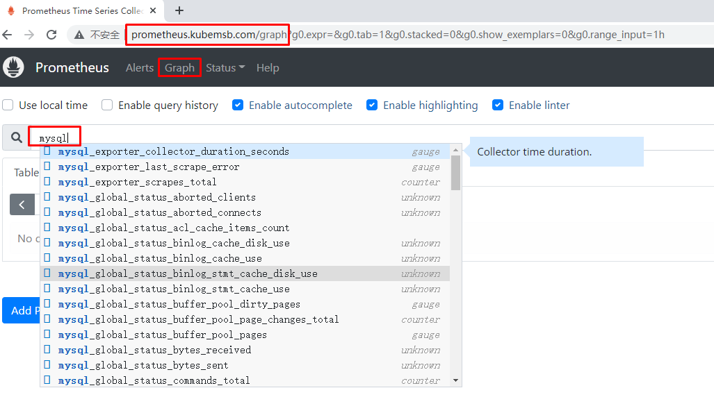

## 6.4 在grafana中添加dashboard

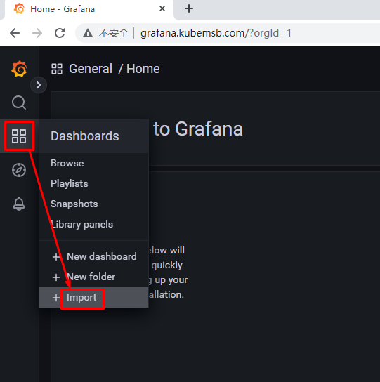

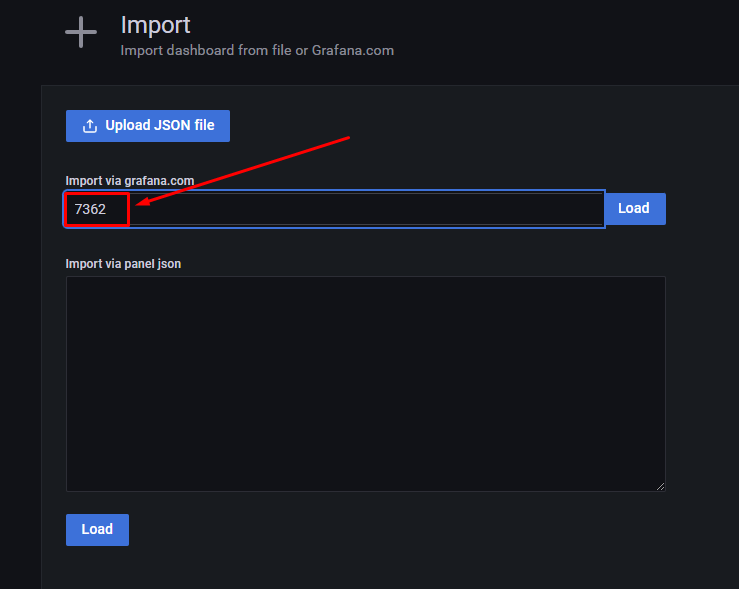

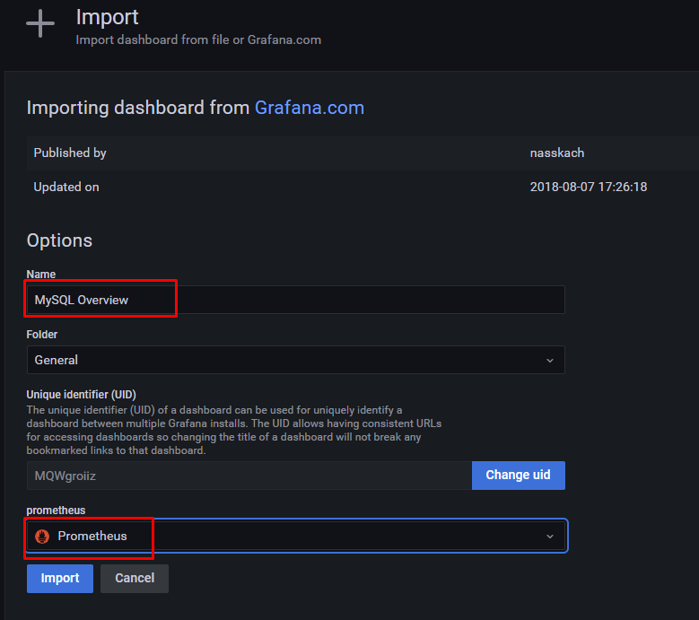

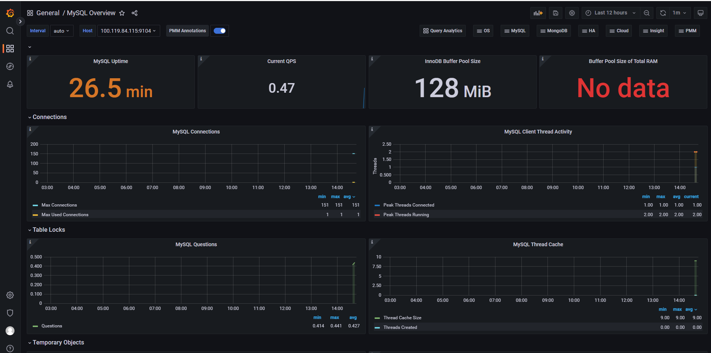

# 七、使用prometheus监控kafka

## 7.1 kafak部署

### 7.1.1 下载chart包

~~~powershell
# helm repo add bitnami https://charts.bitnami.com/bitnami
~~~

~~~powershell
# helm repo update
~~~

~~~powershell
# helm search repo zookeeper

NAME                            CHART VERSION   APP VERSION     DESCRIPTION
bitnami/zookeeper               10.0.2          3.8.0           Apache ZooKeeper provides a reliable, centraliz...
~~~

~~~powershell
# helm search repo kafka
NAME                                            CHART VERSION   APP VERSION     DESCRIPTION
bitnami/kafka                                   18.0.3          3.2.0           Apache Kafka is a distributed streaming platfor...
~~~

### 7.1.2  部署zookeeper

~~~powershell
# mkdir kafkadir
~~~

~~~powershell
# cd kafkadir
~~~

~~~powershell
# helm pull bitnami/zookeeper
~~~

~~~powershell
# ls
zookeeper-10.0.2.tgz
# tar xf zookeeper-10.0.2.tgz

# ls
zookeeper  zookeeper-10.0.2.tgz
~~~

~~~powershell
# cd zookeeper/
# ls
Chart.lock  charts  Chart.yaml  README.md  templates  values.yaml
~~~

> 主要配置时区、持久化存储、副本数等
>
> 首次部署时直接修改values中的配置，方便后期更新（upgrade）,也可以使用--set设置

~~~powershell
# vim values.yaml

# 手动添加时区
# 改模板没有extraEnvVars字段，直接复制以下3行内容，部署后，可通过logs查看时区是否正确

extraEnvVars:
  - name: TZ
    value: "Asia/Shanghai"
    
# 允许任意用户连接（默认开启）
allowAnonymousLogin: true

# 关闭认证（默认关闭）
auth:
  enable: false

# 修改副本数
replicaCount: 3

# 配置持久化存储
persistence:
  enabled: true
  storageClass: "managed-nfs-storage"
  accessModes:
  - ReadWriteOnce

~~~

~~~powershell
# vim values.yaml
 97 auth:
 98   client:
 99     ## @param auth.client.enabled Enable ZooKeeper client-server authentication. It uses SASL/Digest-MD5
100     ##
101     enabled: false 使用默认值就可以了
...

238 replicaCount: 3 默认为1，修改为3
...
添加时区
219 extraEnvVars: 
220   - name: TZ
221     value: "Asia/Shanghai"
...
581 persistence:
582   ## @param persistence.enabled Enable ZooKeeper data persistence using PVC. If false, use emptyDir
583   ##
584   enabled: true
585   ## @param persistence.existingClaim Name of an existing PVC to use (only when deploying a single replica)
586   ##
587   existingClaim: ""
588   ## @param persistence.storageClass PVC Storage Class for ZooKeeper data volume
589   ## If defined, storageClassName: <storageClass>
590   ## If set to "-", storageClassName: "", which disables dynamic provisioning
591   ## If undefined (the default) or set to null, no storageClassName spec is
592   ##   set, choosing the default provisioner.  (gp2 on AWS, standard on
593   ##   GKE, AWS & OpenStack)
594   ##
595   storageClass: "nfs-client"  添加一个存储类
596   ## @param persistence.accessModes PVC Access modes
597   ##
598   accessModes:
599     - ReadWriteOnce
600   ## @param persistence.size PVC Storage Request for ZooKeeper data volume
601   ##
602   size: 8Gi
603   ## @param persistence.annotations Annotations for the PVC

...

708   serviceMonitor:
709     ## @param metrics.serviceMonitor.enabled Create ServiceMonitor Resource for scraping metrics using Prometheus Operator
710     ##
711     enabled: true 默认为false，修改为true
712     ## @param metrics.serviceMonitor.namespace Namespace for the ServiceMonitor Resource (defaults to the Release Namespace)
713     ##
714     namespace: "kafka" 默认为空，修改为test
715     ## @param metrics.serviceMonitor.interval Interval at which metrics should be scraped.
716     ## ref: https://github.com/coreos/prometheus-operator/blob/master/Documentation/api.md#endpoint
717     ##
718     interval: "10" 默认为空，修改为10
719     ## @param metrics.serviceMonitor.scrapeTimeout Timeout after which the scrape is ended
720     ## ref: https://github.com/coreos/prometheus-operator/blob/master/Documentation/api.md#endpoint
721     ##
722     scrapeTimeout: "20" 默认为空，修改为20
~~~

~~~powershell
# kubectl create ns kafka
~~~

~~~powershell
# helm install zookeeper ./ -f values.yaml  -n kafka
~~~

~~~powershell
# kubectl get pods -n kafka
NAME          READY   STATUS    RESTARTS   AGE
zookeeper-0   1/1     Running   0          62s
zookeeper-1   1/1     Running   0          62s
zookeeper-2   1/1     Running   0          62s
~~~

~~~powershell
[root@nfsserver ~]# ls /sdb
kafka-data-zookeeper-1-pvc-9dbb13e2-3174-429b-90aa-3884459aaa23
kafka-data-zookeeper-2-pvc-0cffe920-2f16-4955-b80e-04e8d1571c82
kafka-data-zookeeper-0-pvc-a6ed8ed3-058a-4260-be1f-12d1be78b2a0
~~~

~~~powershell
# kubectl get svc -n kafka
NAME                 TYPE        CLUSTER-IP   EXTERNAL-IP   PORT(S)                      AGE
zookeeper            ClusterIP   10.96.2.24   <none>        2181/TCP,2888/TCP,3888/TCP   2m9s
zookeeper-headless   ClusterIP   None         <none>        2181/TCP,2888/TCP,3888/TCP   2m9s
~~~

~~~powershell
# dig -t a zookeeper-headless.kafka.svc.cluster.local @10.96.0.10
~~~

~~~powershell
# kubectl get ns
NAME              STATUS   AGE

kafka             Active   53m

[root@k8s-master01 kafkadir]# kubectl get pods -n kafka
NAME          READY   STATUS    RESTARTS   AGE
zookeeper-0   1/1     Running   0          52m
zookeeper-1   1/1     Running   0          52m
zookeeper-2   1/1     Running   0          52m

查看zookeeper状态
[root@k8s-master01 kafkadir]# kubectl exec -it zookeeper-0 -n kafka -- bash
@zookeeper-0:/$ zkServer.sh status
/opt/bitnami/java/bin/java
ZooKeeper JMX enabled by default
Using config: /opt/bitnami/zookeeper/bin/../conf/zoo.cfg
Client port found: 2181. Client address: localhost. Client SSL: false.
Mode: follower
~~~

### 7.1.3 部署kafka

~~~powershell
拉取kafka chart包
# helm pull bitnami/kafka
~~~

~~~powershell
# ls
kafka-18.0.3.tgz
~~~

~~~powershell
# tar xf kafka-18.0.3.tgz
~~~

~~~powershell
# cd kafka
~~~

#### 7.1.3.1 基础配置

> 设置时区、副本数、持久化存储、zookeeper连接等。

~~~powershell
# vim values.yaml

412 extraEnvVars:
413   - name: TZ
414     value: "Asia/Shanghai"
...
426 replicaCount: 3

...
 890 persistence:
 891   ## @param persistence.enabled Enable Kafka data persistence using PVC, note that ZooKeeper persistence is unaffected
 892   ##
 893   enabled: true
 894   ## @param persistence.existingClaim A manually managed Persistent Volume and Claim
 895   ## If defined, PVC must be created manually before volume will be bound
 896   ## The value is evaluated as a template
 897   ##
 898   existingClaim: ""
 899   ## @param persistence.storageClass PVC Storage Class for Kafka data volume
 900   ## If defined, storageClassName: <storageClass>
 901   ## If set to "-", storageClassName: "", which disables dynamic provisioning
 902   ## If undefined (the default) or set to null, no storageClassName spec is
 903   ## set, choosing the default provisioner.
 904   ##
 905   storageClass: "nfs-client" 指定存储类
 906   ## @param persistence.accessModes Persistent Volume Access Modes
 907   ##
 908   accessModes:
 909     - ReadWriteOnce
 910   ## @param persistence.size PVC Storage Request for Kafka data volume
 911   ##
 912   size: 8Gi
 913   ## @param persistence.annotations Annotations for the PVC
 
 ...
 1638 zookeeper:
1639   ## @param zookeeper.enabled Switch to enable or disable the ZooKeeper helm chart
1640   ##
1641   enabled: false 默认为true，修改为false,不使用内部zookeeper
1642   ## @param zookeeper.replicaCount Number of ZooKeeper nodes

...
1681 externalZookeeper:
1682   ## @param externalZookeeper.servers List of external zookeeper servers to use. Typically used in combination with 'zookeeperChrootPath'.
1683   ##
1684   servers: zookeeper 使用外部的zookeeper
~~~

#### 7.1.3.2 高可用配置

> 设置默认分区、默认副本数、日志过期时间，需要根据kafka节点数设定。

~~~powershell
# vim values.yaml

允许删除topic
138 deleteTopicEnable: true 默认为false

154 ## @param logRetentionHours The minimum age of a log file to be eligible for deletion due to age
 默认日志保留时间，为一周
156 logRetentionHours: 168 

166 ## @param defaultReplicationFactor Default replication factors for automatically created topics
自动创建topic默认的副本数
168 defaultReplicationFactor: 2

169 ## @param offsetsTopicReplicationFactor The replication factor for the offsets topic
用于配置offset记录的topic的partition的副本个数
171 offsetsTopicReplicationFactor: 2

172 ## @param transactionStateLogReplicationFactor The replication factor for the transaction topic
事务主题的复制因子
174 transactionStateLogReplicationFactor: 2

175 ## @param transactionStateLogMinIsr Overridden min.insync.replicas config for the transaction topic

177 transactionStateLogMinIsr: 2 默认为1修改为2

184 ## @param numPartitions The default number of log partitions per topic
新建Topic时默认的分区数
186 numPartitions: 3

~~~

#### 7.1.3.3 kafka部署

~~~powershell
# helm install kafka ./ -f values.yaml -n kafka
~~~

~~~powershell
输出内容：
NAME: kafka
LAST DEPLOYED: Wed Jul 20 18:59:51 2022
NAMESPACE: kafka
STATUS: deployed
REVISION: 1
TEST SUITE: None
NOTES:
CHART NAME: kafka
CHART VERSION: 18.0.3
APP VERSION: 3.2.0

** Please be patient while the chart is being deployed **

Kafka can be accessed by consumers via port 9092 on the following DNS name from within your cluster:

    kafka.kafka.svc.cluster.local

Each Kafka broker can be accessed by producers via port 9092 on the following DNS name(s) from within your cluster:

    kafka-0.kafka-headless.kafka.svc.cluster.local:9092
    kafka-1.kafka-headless.kafka.svc.cluster.local:9092
    kafka-2.kafka-headless.kafka.svc.cluster.local:9092

To create a pod that you can use as a Kafka client run the following commands:

    kubectl run kafka-client --restart='Never' --image docker.io/bitnami/kafka:3.2.0-debian-11-r12 --namespace kafka --command -- sleep infinity
    kubectl exec --tty -i kafka-client --namespace kafka -- bash

    PRODUCER:
        kafka-console-producer.sh \

            --broker-list kafka-0.kafka-headless.kafka.svc.cluster.local:9092,kafka-1.kafka-headless.kafka.svc.cluster.local:9092,kafka-2.kafka-headless.kafka.svc.cluster.local:9092 \
            --topic test

    CONSUMER:
        kafka-console-consumer.sh \

            --bootstrap-server kafka.kafka.svc.cluster.local:9092 \
            --topic test \
            --from-beginning
~~~

### 7.1.4 kafka调试

#### 7.1.4.1 查询与创建topic

~~~powershell
进入pod 
# kubectl exec -it kafka-0 -n kafka -- bash
~~~

~~~powershell
创建topic,3分区+2副本,注意kafka的版本，本次使用的是3.2.0

@kafka-0:/$ kafka-topics.sh --bootstrap-server kafka.kafka.svc.cluster.local:9092 --topic test001 --create --partitions 3 --replication-factor 2
Created topic test001.
~~~

~~~powershell
列出topic
@kafka-0:/$ kafka-topics.sh --list --bootstrap-server kafka.kafka.svc.cluster.local:9092
test001
~~~

~~~powershell
查看topic详情
@kafka-0:/$ kafka-topics.sh  --bootstrap-server kafka.kafka.svc.cluster.local:9092 --describe --topic test001
输入结果：
Topic: test001  TopicId: J5e8gTjPRV2b49NUWYwNaA PartitionCount: 3       ReplicationFactor: 2    Configs: flush.ms=1000,segment.bytes=1073741824,flush.messages=10000,max.message.bytes=1000012,retention.bytes=1073741824
        Topic: test001  Partition: 0    Leader: 1       Replicas: 1,2   Isr: 1,2
        Topic: test001  Partition: 1    Leader: 0       Replicas: 0,1   Isr: 0,1
        Topic: test001  Partition: 2    Leader: 2       Replicas: 2,0   Isr: 2,0
~~~

#### 7.1.4.2 生产者与消费者

~~~powershell
在一个窗口中打开生产者创建数据
@kafka-0:/$ kafka-console-producer.sh --broker-list kafka:9092 --topic test001
>kubemsb 输入kubemsb后回车
~~~

~~~powershell
在另一个窗口中使用消费者访问数据
# kubectl exec -it kafka-0 -n kafka -- bash
@kafka-0:/$ kafka-console-consumer.sh --bootstrap-server kafka:9092 --from-beginning --topic test001
kubemsb 显示
~~~

#### 7.1.4.3 修改与删除topic

~~~powershell
修改topic配置：增加分区至4个（分区只可增不可减）
@kafka-0:/$ kafka-topics.sh --alter  --bootstrap-server kafka:9092  --partitions 4 --topic test001

查看增加后的结果
@kafka-0:/$ kafka-topics.sh --describe --bootstrap-server kafka:9092 --topic test001

输出结果：
Topic: test001  TopicId: J5e8gTjPRV2b49NUWYwNaA PartitionCount: 4       ReplicationFactor: 2    Configs: flush.ms=1000,segment.bytes=1073741824,flush.messages=10000,max.message.bytes=1000012,retention.bytes=1073741824
        Topic: test001  Partition: 0    Leader: 1       Replicas: 1,2   Isr: 1,2
        Topic: test001  Partition: 1    Leader: 0       Replicas: 0,1   Isr: 0,1
        Topic: test001  Partition: 2    Leader: 2       Replicas: 2,0   Isr: 2,0
        Topic: test001  Partition: 3    Leader: 1       Replicas: 1,2   Isr: 1,2
~~~

~~~powershell
删除topic（需要设置deleteTopicEnable: true）
@kafka-0:/$ kafka-topics.sh --delete --bootstrap-server kafka:9092 --topic test001

验证是否删除
@kafka-0:/$ kafka-topics.sh --list --bootstrap-server kafka.kafka.svc.cluster.local:9092
__consumer_offsets
~~~

## 7.2 kafka exporter部署及验证

> 监控kafka之前可以创建topic

~~~powershell
获取kafka-exporter
# helm search repo kafka
NAME                                            CHART VERSION   APP VERSION     DESCRIPTION

prometheus-community/prometheus-kafka-exporter  1.6.0           v1.4.2          A Helm chart to export the metrics from Kafka i...
~~~

~~~powershell
# helm pull prometheus-community/prometheus-kafka-exporter
~~~

~~~powershell
# tar xf prometheus-kafka-exporter-1.6.0.tgz

# ls
prometheus-kafka-exporter
~~~

~~~powershell
链接kafka信息：
kafka.kafka.svc.cluster.local:9092
~~~

~~~powershell
# cd prometheus-kafka-exporter
# vim values.yaml
...
8 kafkaServer:
9   #- kafka-server:9092
10   - kafka.kafka.svc.cluster.local:9092

64 prometheus:
65   serviceMonitor:
66     enabled: true
67     namespace: monitoring
68     interval: "30s"
 
92 annotations:
93   prometheus.io/scrape: "true"
94   prometheus.io/path: "/metrics"
95   prometheus.io/port: "9308"

~~~

~~~powershell
# helm install kafka-exporter ./ -f values.yaml -n monitoring
~~~

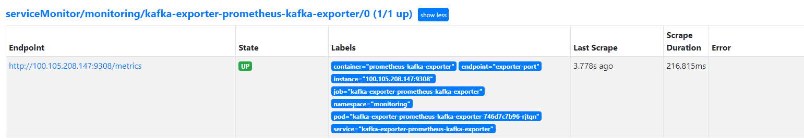

## 7.3 在prometheus web中Graph查看

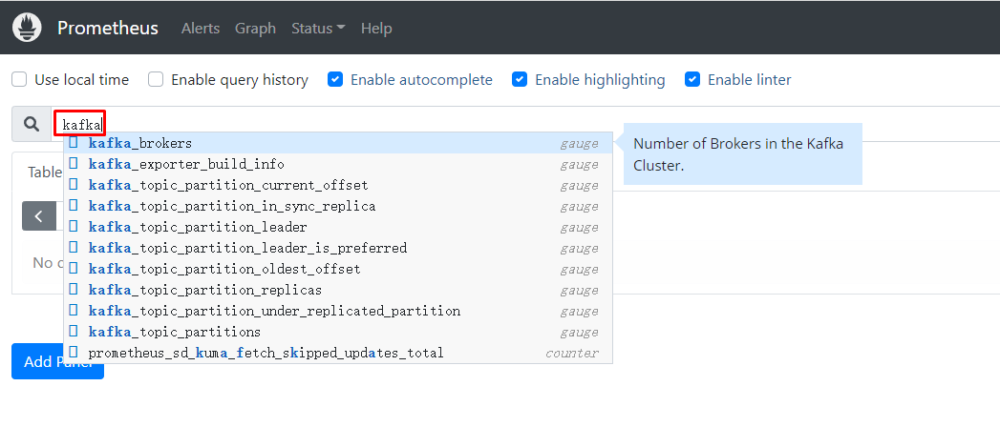

> 如果想采集更多的数据，需要对消费者进行配置(--consumer-property)，以便获取更多的数据

~~~powershell
# kubectl exec -it kafka-0 -n kafka -- bash
~~~

~~~powershell
@kafka-0:/$ kafka-topics.sh --bootstrap-server kafka.kafka.svc.cluster.local:9092 --topic test002 --create --partitions 3 --replication-factor 2
Created topic test002.
~~~

~~~powershell
创建生产者生产数据
!@kafka-0:/$ kafka-console-producer.sh --broker-list kafka:9092 --topic test002
>kubemsb
>abc
>hello
~~~

~~~powershell
创建消费者获取数据
# kubectl exec -it kafka-2 -n kafka -- bash
I have no name!@kafka-2:/$ kafka-console-consumer.sh --bootstrap-server kafka:9092 --from-beginning --topic test002 --consumer-property group.id=test
kubemsb
hello
abc
~~~

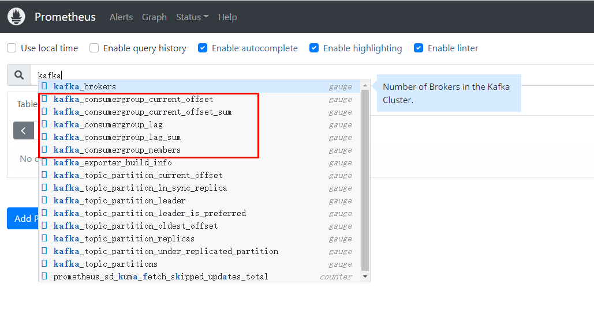

## 7.4 在grafana中添加kafka监控dashboard

> 7589

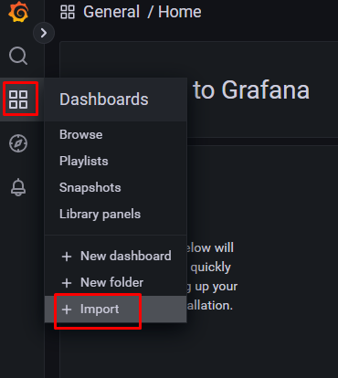

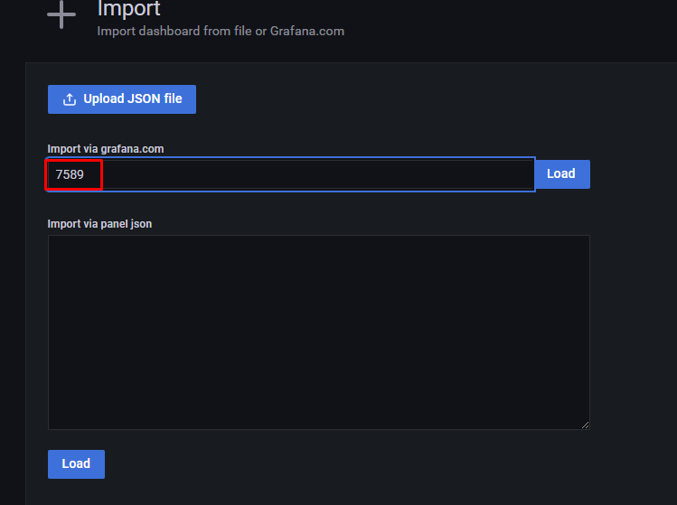

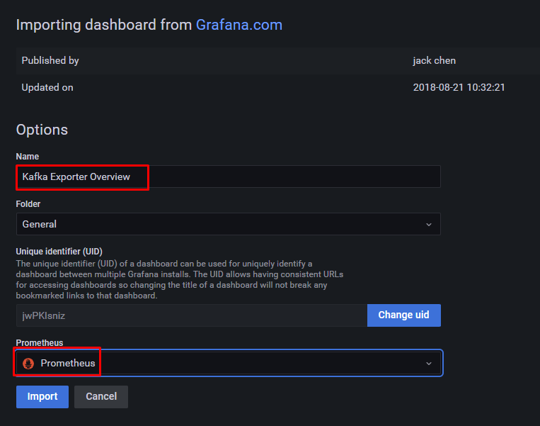

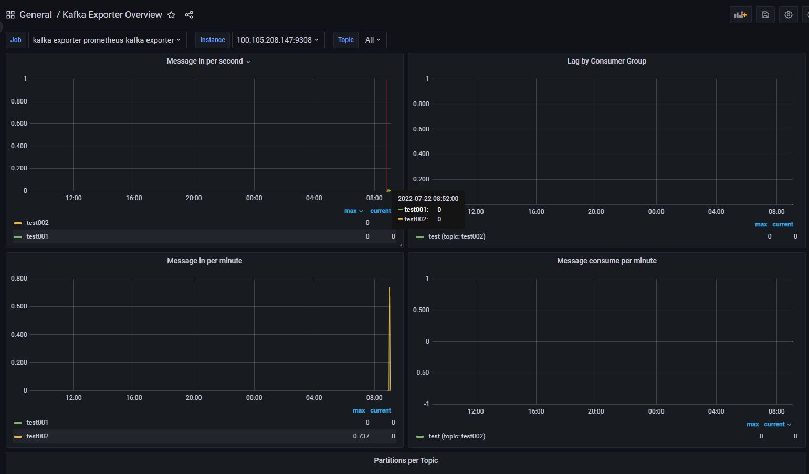

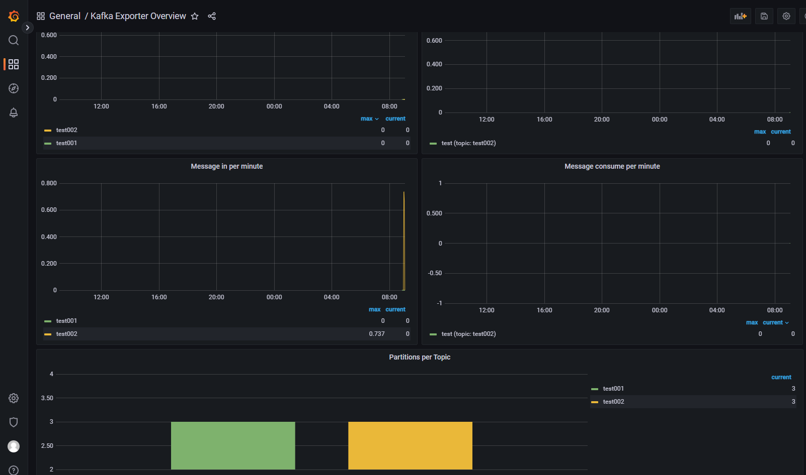

# 八、使用prometheus监控rabbitmq

## 8.1 rabbitmq部署

### 8.1.1 获取rabbitmq部署文件

~~~powershell
# helm repo add bitnami https://charts.bitnami.com/bitnami
~~~

~~~powershell
# helm repo update
~~~

~~~powershell
# helm search repo rabbitmq
~~~

~~~powershell
# mkdir rabbitmqdir
~~~

~~~powershell
# cd rabbitmqdir
~~~

~~~powershell
# helm pull bitnami/rabbitmq

~~~

~~~powershell
# ls
rabbitmq-10.1.15.tgz
~~~

~~~powershell
# tar xf rabbitmq-10.1.15.tgz

~~~

~~~powershell
# ls
rabbitmq  rabbitmq-10.1.15.tgz
~~~

### 8.1.2 配置rabbitmq

>- 配置持久化存储、副本数等
>- 建议首次部署时直接修改values中的配置，而不是用–set的方式，这样后期upgrade不必重复设置。

~~~powershell
# cd rabbitmq/
~~~

~~~powershell
# ls
Chart.lock  charts  Chart.yaml  README.md  templates  values.schema.json  values.yaml
~~~

#### 8.1.2.1 设置管理员密码

> 方案一:在values.yaml文件中指定

~~~powershell
 # vim values.yaml
 115 auth:
 116   ## @param auth.username RabbitMQ application username
 117   ## ref: https://github.com/bitnami/bitnami-docker-rabbitmq#environment-variables
 118   ##
 119   username: admin
 120   ## @param auth.password RabbitMQ application password
 121   ## ref: https://github.com/bitnami/bitnami-docker-rabbitmq#environment-variables
 122   ##
 123   password: "admin@mq"
 124   ## @param auth.existingPasswordSecret Existing secret with RabbitMQ credentials (must contain a value for `rabbitmq-password` key)
 125   ## e.g:
 126   ## existingPasswordSecret: name-of-existing-secret
 127   ##
 128   existingPasswordSecret: ""
 129   ## @param auth.erlangCookie Erlang cookie to determine whether different nodes are allowed to communicate with each other
 130   ## ref: https://github.com/bitnami/bitnami-docker-rabbitmq#environment-variables
 131   ##
 132   erlangCookie: "secretcookie"

~~~

> 方案二：在命令行执行时通过--set直接配置

~~~powershell
--set auth.username=admin,auth.password=admin@mq,auth.erlangCookie=secretcookie
~~~

#### 8.1.2.2 配置rabbitmq强制启动

>当rabbitmq启用持久化存储时，若rabbitmq所有pod同时宕机，将无法重新启动，因此有必要提前开启`clustering.forceBoot`

~~~powershell
 211 ## Clustering settings
 212 ##
 213 clustering:
 214   ## @param clustering.enabled Enable RabbitMQ clustering
 215   ##
 216   enabled: true
 217   ## @param clustering.addressType Switch clustering mode. Either `ip` or `hostname`
 218   ##
 219   addressType: hostname
 220   ## @param clustering.rebalance Rebalance master for queues in cluster when new replica is created
 221   ## ref: https://www.rabbitmq.com/rabbitmq-queues.8.html#rebalance
 222   ##
 223   rebalance: false
 224   ## @param clustering.forceBoot Force boot of an unexpectedly shut down cluster (in an unexpected order).
 225   ## forceBoot executes 'rabbitmqctl force_boot' to force boot cluster shut down unexpectedly in an unknown order
 226   ## ref: https://www.rabbitmq.com/rabbitmqctl.8.html#force_boot
 227   ##
 228   forceBoot: true  由默认的false修改为true
~~~

#### 8.1.2.3 配置时区

~~~powershell
 268 extraEnvVars:
 269   - name: TZ
 270     value: "Asia/Shanghai"
~~~

#### 8.1.2.4 指定副本数

~~~powershell
510 replicaCount: 3 由1修改为3
~~~

#### 8.1.2.5 设置持久化存储

~~~powershell
 776 persistence:
 777   ## @param persistence.enabled Enable RabbitMQ data persistence using PVC
 778   ##
 779   enabled: true
 780   ## @param persistence.storageClass PVC Storage Class for RabbitMQ data volume
 781   ## If defined, storageClassName: <storageClass>
 782   ## If set to "-", storageClassName: "", which disables dynamic provisioning
 783   ## If undefined (the default) or set to null, no storageClassName spec is
 784   ##   set, choosing the default provisioner.  (gp2 on AWS, standard on
 785   ##   GKE, AWS & OpenStack)
 786   ##
 787   storageClass: "nfs-client" 添加存储类
 788   ## @param persistence.selector Selector to match an existing Persistent Volume
 789   ## selector:
 790   ##   matchLabels:
 791   ##     app: my-app
 792   ##
 793   selector: {}
 794   ## @param persistence.accessModes PVC Access Modes for RabbitMQ data volume
 795   ##
 796   accessModes:
 797     - ReadWriteOnce
 798   ## @param persistence.existingClaim Provide an existing PersistentVolumeClaims
 799   ## The value is evaluated as a template
 800   ## So, for example, the name can depend on .Release or .Chart
 801   ##
 802   existingClaim: ""
 803   ## @param persistence.mountPath The path the volume will be mounted at
 804   ## Note: useful when using custom RabbitMQ images
 805   ##
 806   mountPath: /bitnami/rabbitmq/mnesia
 807   ## @param persistence.subPath The subdirectory of the volume to mount to
 808   ## Useful in dev environments and one PV for multiple services
 809   ##
 810   subPath: ""
 811   ## @param persistence.size PVC Storage Request for RabbitMQ data volume
 812   ## If you change this value, you might have to adjust `rabbitmq.diskFreeLimit` as well
 813   ##
 814   size: 5Gi
~~~

#### 8.1.2.6 关于service的设置说明

>- 默认通过ClusterIP暴露5672（amqp）和15672（web管理界面）等端口供集群内部使用，也可在外部访问，后面有说明
>- 不建议在values中直接配置nodeport，不方便后期灵活配置

### 8.1.3 部署rabbitmq

#### 8.1.3.1 创建命名空间

~~~powershell
# kubectl create namespace test
~~~

#### 8.1.3.2 安装

> 使用方式一方式安装

~~~powershell
# helm install rabbitmq ./ -f values.yaml -n test
~~~

~~~powershell
NAME: rabbitmq
LAST DEPLOYED: Mon Jul 25 10:38:57 2022
NAMESPACE: test
STATUS: deployed
REVISION: 1
TEST SUITE: None
NOTES:
CHART NAME: rabbitmq
CHART VERSION: 10.1.15
APP VERSION: 3.10.6** Please be patient while the chart is being deployed **

Credentials:
    echo "Username      : admin"
    echo "Password      : $(kubectl get secret --namespace test rabbitmq -o jsonpath="{.data.rabbitmq-password}" | base64 -d)"
    echo "ErLang Cookie : $(kubectl get secret --namespace test rabbitmq -o jsonpath="{.data.rabbitmq-erlang-cookie}" | base64 -d)"

Note that the credentials are saved in persistent volume claims and will not be changed upon upgrade or reinstallation unless the persistent volume claim has been deleted. If this is not the first installation of this chart, the credentials may not be valid.
This is applicable when no passwords are set and therefore the random password is autogenerated. In case of using a fixed password, you should specify it when upgrading.
More information about the credentials may be found at https://docs.bitnami.com/general/how-to/troubleshoot-helm-chart-issues/#credential-errors-while-upgrading-chart-releases.

RabbitMQ can be accessed within the cluster on port 5672 at rabbitmq.test.svc.cluster.local

To access for outside the cluster, perform the following steps:

To Access the RabbitMQ AMQP port:

    echo "URL : amqp://127.0.0.1:5672/"
    kubectl port-forward --namespace test svc/rabbitmq 5672:5672

To Access the RabbitMQ Management interface:

    echo "URL : http://127.0.0.1:15672/"
    kubectl port-forward --namespace test svc/rabbitmq 15672:15672
~~~

> 使用方式二方式安装,通过--set方式指定用户名与密码，方便后期通过upgrade进行更新。

~~~powershell
# helm install rabbitmq ./ -f values.yaml -n test --set auth.username=admin,auth.password=admin@mq,auth.erlangCookie=secretcookie
~~~

#### 8.1.3.3 查看rabbitmq安装状态

~~~powershell
# helm list -n test
NAME            NAMESPACE       REVISION        UPDATED                                 STATUS          CHART                   APP VERSION
rabbitmq        test            1               2022-07-25 10:38:57.262289654 +0800 CST deployed        rabbitmq-10.1.15        3.10.6
~~~

~~~powershell
# kubectl get sts -n test
NAME       READY   AGE
rabbitmq   3/3     4m54s
~~~

~~~powershell
# kubectl get pods -n test
NAME         READY   STATUS    RESTARTS   AGE
rabbitmq-0   1/1     Running   0          5m8s
rabbitmq-1   1/1     Running   0          4m6s
rabbitmq-2   1/1     Running   0          3m4s
~~~

~~~powershell
# kubectl get svc -n test
NAME                TYPE        CLUSTER-IP   EXTERNAL-IP   PORT(S)                                 AGE
rabbitmq            ClusterIP   10.96.3.23   <none>        5672/TCP,4369/TCP,25672/TCP,15672/TCP   4m29s
rabbitmq-headless   ClusterIP   None         <none>        4369/TCP,5672/TCP,25672/TCP,15672/TCP   4m29s
~~~

#### 8.1.3.4 查看rabbitmq集群状态

~~~powershell
集群状态
# kubectl exec -it rabbitmq-0 -n test -- bash
I have no name!@rabbitmq-0:/$ rabbitmqctl cluster_status
~~~

~~~powershell
列出策略（默认没有列出镜像模式）
I have no name!@rabbitmq-0:/$ rabbitmqctl list_policies
Listing policies for vhost "/" ...
~~~

~~~powershell
设置rabbitmq集群名称
I have no name!@rabbitmq-0:/$ rabbitmqctl set_cluster_name kubemsb_rabbitmq
Setting cluster name to kubemsb_rabbitmq ...
~~~

### 8.1.4 设置RabbitMQ集群外部访问方式

~~~powershell
[root@k8s-master01 rabbitmqdir]# cat 5672.yaml
apiVersion: networking.k8s.io/v1
kind: Ingress
metadata:
  name: rabbitmq-5672                    #自定义ingress名称
  namespace: test
  annotations:
    ingressclass.kubernetes.io/is-default-class: "true"
    kubernetes.io/ingress.class: nginx
spec:
  rules:
  - host: rabbitmq-5672.kubemsb.com                   # 自定义域名
    http:
      paths:
      - pathType: Prefix
        path: "/"
        backend:
          service:
            name: rabbitmq     # 对应上面创建的service名称
            port:
              number: 5672
~~~

~~~powershell
[root@k8s-master01 rabbitmqdir]# kubectl apply -f 5672.yaml
ingress.networking.k8s.io/rabbitmq-5672 created
~~~

~~~powershell
[root@k8s-master01 rabbitmqdir]# kubectl get ingress -n test
NAME             CLASS    HOSTS                        ADDRESS          PORTS   AGE
rabbitmq-5672    <none>   rabbitmq-5672.kubemsb.com    192.168.10.147   80      61s
~~~

~~~powershell
[root@k8s-master01 rabbitmqdir]# cat 15672.yaml
apiVersion: networking.k8s.io/v1
kind: Ingress
metadata:
  name: rabbitmq-15672                    #自定义ingress名称
  namespace: test
  annotations:
    ingressclass.kubernetes.io/is-default-class: "true"
    kubernetes.io/ingress.class: nginx
spec:
  rules:
  - host: rabbitmq-15672.kubemsb.com                   # 自定义域名
    http:
      paths:
      - pathType: Prefix
        path: "/"
        backend:
          service:
            name: rabbitmq     # 对应上面创建的service名称
            port:
              number: 15672
~~~

~~~powershell
[root@k8s-master01 rabbitmqdir]# kubectl apply -f 15672.yaml
ingress.networking.k8s.io/rabbitmq-15672 created
~~~

~~~powershell
[root@k8s-master01 rabbitmqdir]# kubectl get ingress -n test
NAME             CLASS    HOSTS                        ADDRESS          PORTS   AGE
rabbitmq-15672   <none>   rabbitmq-15672.kubemsb.com   192.168.10.147   80      54s
~~~

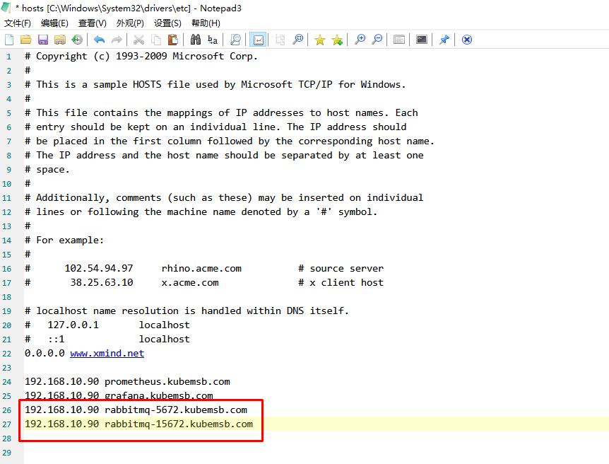

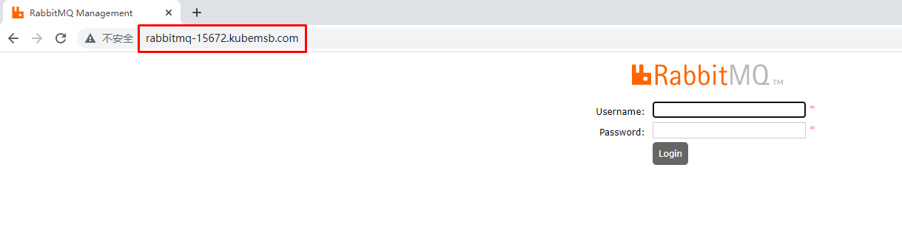

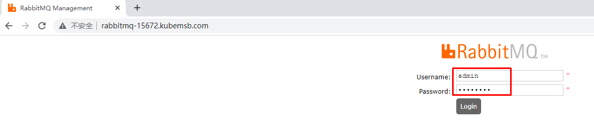

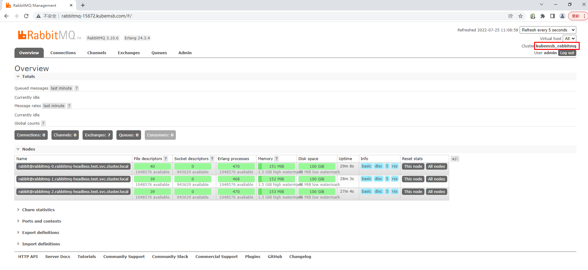

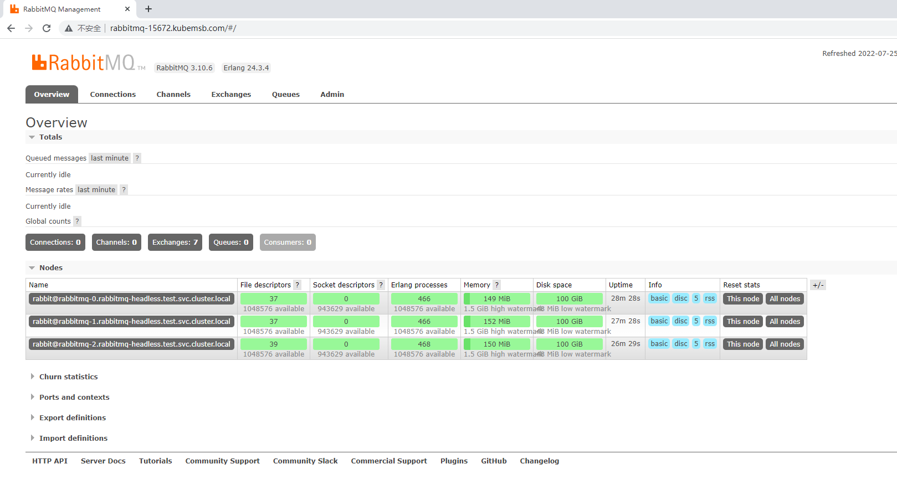

### 8.1.5 配置镜像模式实现集群高可用

>镜像模式：将需要消费的队列变为镜像队列，存在于多个节点，这样就可以实现 RabbitMQ 的 HA 高可用性。作用就是消息实体会主动在镜像节点之间实现同步，而不是像普通模式那样，在 consumer 消费数据时临时读取。缺点就是，集群内部的同步通讯会占用大量的网络带宽。

~~~powershell
# kubectl exec -it rabbitmq-0 -n test -- bash
~~~

~~~powershell
I have no name!@rabbitmq-0:/$ rabbitmqctl list_policies
Listing policies for vhost "/" ...
~~~

~~~powershell
I have no name!@rabbitmq-0:/$ rabbitmqctl set_policy ha-all "^" '{"ha-mode":"all","ha-sync-mode":"automatic"}'
Setting policy "ha-all" for pattern "^" to "{"ha-mode":"all","ha-sync-mode":"automatic"}" with priority "0" for vhost "/" ...
~~~

~~~powershell
I have no name!@rabbitmq-0:/$ rabbitmqctl list_policies
Listing policies for vhost "/" ...
vhost   name    pattern apply-to        definition      priority
/       ha-all  ^       all     {"ha-mode":"all","ha-sync-mode":"automatic"}    0
~~~

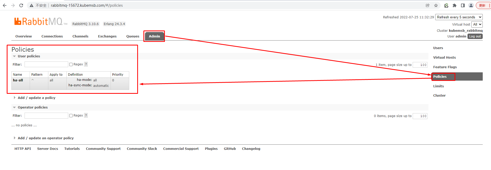

### 8.1.6 卸载rabbitmq

>  由于接下来要实现监控，所以这个位置的卸载方法根据个人情况执行即可

~~~powershell
卸载rabbitmq
# kubectl uninstall rabbitmq -n test
~~~

~~~powershell
删除pvc
# kubectl get pvc -n test
NAME              STATUS   VOLUME                                     CAPACITY   ACCESS MODES   STORAGECLASS   AGE
data-rabbitmq-0   Bound    pvc-a1d13494-5dd2-4728-bd89-8b7d03db7a32   5Gi        RWO            nfs-client     58m
data-rabbitmq-1   Bound    pvc-224dcc95-1fe5-4ac5-982f-35ba36e92b16   5Gi        RWO            nfs-client     57m
data-rabbitmq-2   Bound    pvc-97358dbc-068d-4076-b046-b5efc80fce1a   5Gi        RWO            nfs-client     56m

# kubectl delete pvc data-rabbitmq-0 data-rabbitmq-1 data-rabbitmq-2 -n test
~~~

~~~powershell
# kubectl delete -f 5672.yaml
~~~

~~~powershell
# kubectl delete -f 15672.yaml
~~~

## 8.2 rabbitmq exporter部署及验证

### 8.2.1 rabbitmq连接信息

~~~powershell
url:http://rabbitmq.test.svc.cluster.local:15672
username: admin
password: 15672
~~~

### 8.2.2 rabbitmq exporter chart包下载

~~~powershell
# helm search repo rabbitmq-exporter
NAME                                                    CHART VERSION   APP VERSION     DESCRIPTION
prometheus-community/prometheus-rabbitmq-exporter       1.2.0           v0.29.0         Rabbitmq metrics exporter for prometheus
~~~

~~~powershell
# helm pull prometheus-community/prometheus-rabbitmq-exporter
~~~

~~~powershell
# ls
prometheus-rabbitmq-exporter-1.2.0.tgz
~~~

### 8.2.3 解压并配置

~~~powershell
# tar xf prometheus-rabbitmq-exporter-1.2.0.tgz
~~~

~~~powershell
# ls
prometheus-rabbitmq-exporter
~~~

~~~powershell
# cd prometheus-rabbitmq-exporter/

# ls
Chart.yaml  README.md  templates  values.yaml
~~~

~~~powershell
# vim values.yaml
 33 loglevel: info
 34 rabbitmq:
 35   url: http://rabbitmq.test.svc.cluster.local:15672 修改访问地址
 36   user: admin 修改用户名
 37   password: admin@mq 修改用户名对应的密码
 38   # If existingPasswordSecret is set then password is ignored
 39   existingPasswordSecret: ~
 40   existingPasswordSecretKey: password
 41   capabilities: bert,no_sort
 42   include_queues: ".*"
 43   include_vhost: ".*"
 44   skip_queues: "^$"
 45   skip_verify: "false"
 46   skip_vhost: "^$"
 47   exporters: "exchange,node,overview,queue"
 48   output_format: "TTY"
 49   timeout: 30
 50   max_queues: 0
 51
 52 ## Additional labels to set in the Deployment object. Together with standard labels from
 53 ## the chart
 54 additionalLabels: {}
 55
 56 podLabels: {}
 57
 58 annotations: 把{}去掉，把下面三行前面的#去掉
 59   prometheus.io/scrape: "true"
 60   prometheus.io/path: "/metrics"
 61   prometheus.io/port: "9419"
 
 63 prometheus:
 64   monitor:
 65     enabled: true 把false修改为true
 66     additionalLabels: {}
 67     interval: 15s
 68     namespace: []

~~~

~~~powershell
# helm install rabbitmq-exporter ./ -f values.yaml -n monitoring
~~~

~~~powershell
# helm list -n monitoring
NAME                    NAMESPACE       REVISION        UPDATED                                 STATUS          CHART                                   APP VERSION

rabbitmq-exporter       monitoring      1               2022-07-25 12:03:31.769877663 +0800 CST deployed        prometheus-rabbitmq-exporter-1.2.0      v0.29.0
~~~

### 8.2.4 在prometheus web界面中查看

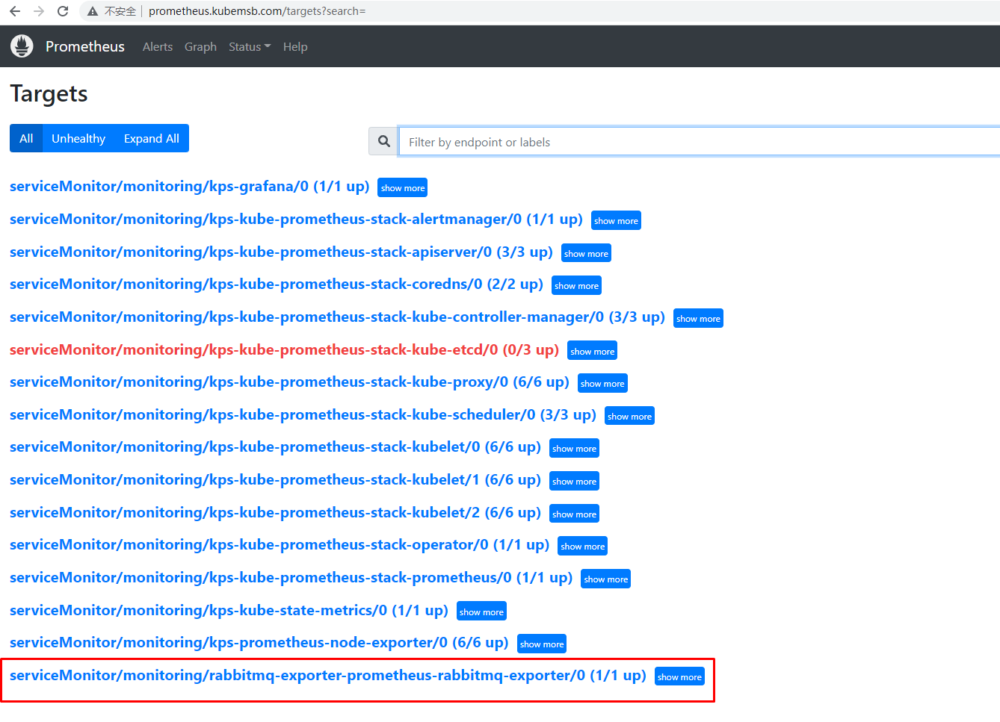

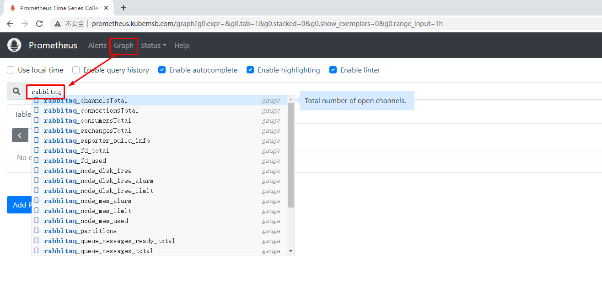

### 8.2.5 在grafana添加dashboard

> [RabbitMQ Monitoring](https://grafana.com/grafana/dashboards/4279)4279
>
> [RabbitMQ Metrics](https://grafana.com/grafana/dashboards/4371)4371

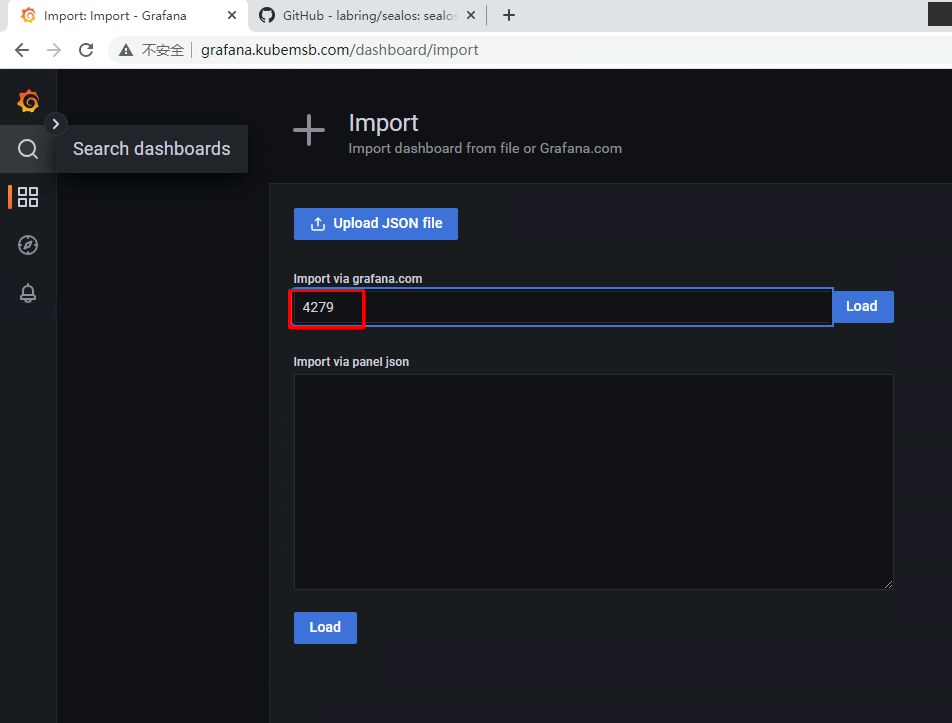

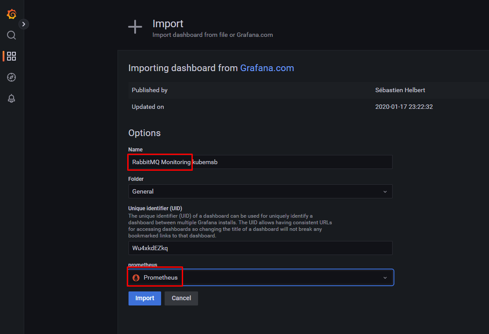

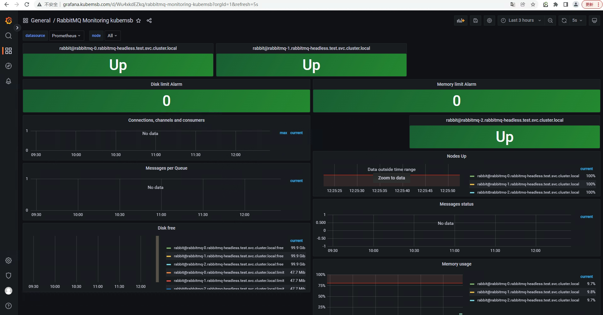

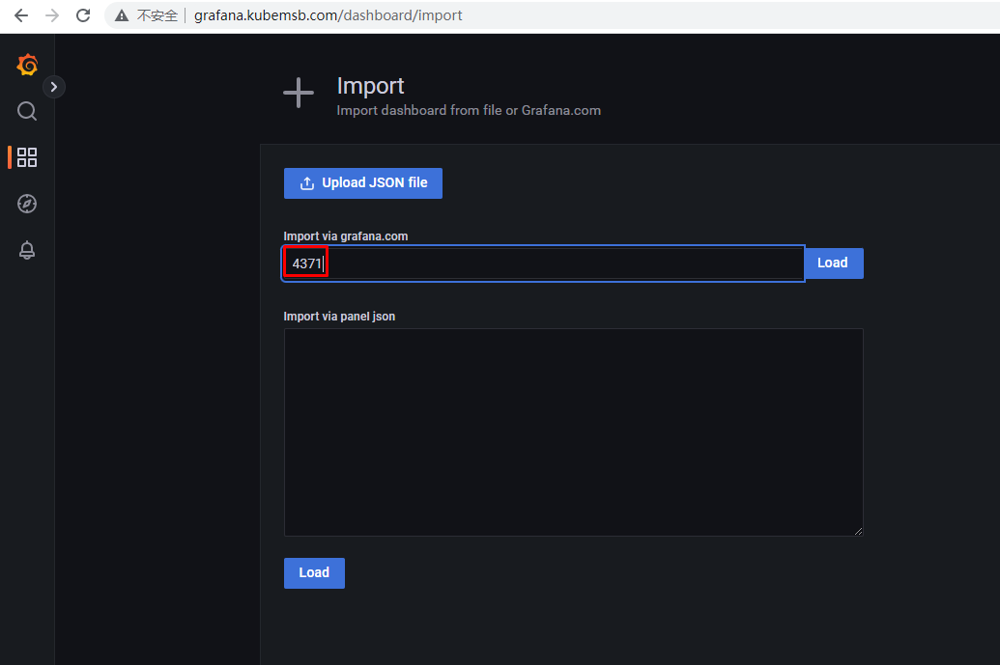

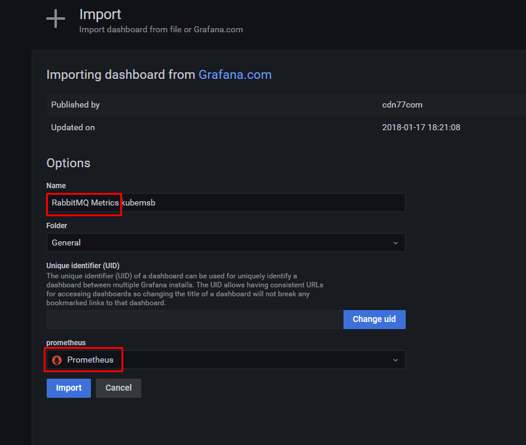

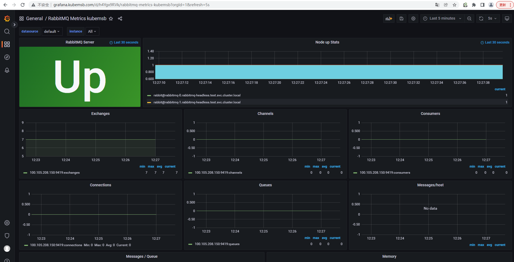

