# Kubernetes高可用集群二进制部署（Runtime Containerd）

Kubernetes（简称为：k8s）是Google在2014年6月开源的一个容器集群管理系统，使用Go语言开发，用于管理云平台中多个主机上的容器化的应用，Kubernetes的目标是让部署容器化的应用简单并且高效,Kubernetes提供了资源调度、部署管理、服务发现、扩容缩容、监控，维护等一整套功能，努力成为跨主机集群的自动部署、扩展以及运行应用程序容器的平台。 它支持一系列容器工具, 包括Docker、Containerd等。

# 一、集群环境准备

## 1.1 主机规划

| 主机IP地址     | 主机名      | 主机配置 | 主机角色    | 软件列表                                                     |
| -------------- | ----------- | -------- | ----------- | ------------------------------------------------------------ |
| 192.168.10.12  | k8s-master1 | 2C4G     | master      | kube-apiserver、kube-controller-manager、kube-scheduler、etcd、kubelet、kube-proxy、Containerd、runc |
| 192.168.10.13  | k8s-master2 | 2C4G     | master      | kube-apiserver、kube-controller-manager、kube-scheduler、etcd、kubelet、kube-proxy、Containerd、runc |
| 192.168.10.14  | k8s-master3 | 2C4G     | master      | kube-apiserver、kube-controller-manager、kube-scheduler、etcd、kubelet、kube-proxy、Containerd、runc |
| 192.168.10.15  | k8s-worker1 | 2C4G     | worker      | kubelet、kube-proxy、Containerd、runc                        |
| 192.168.10.10  | ha1         | 1C2G     | LB          | haproxy、keepalived                                          |
| 192.168.10.11  | ha2         | 1C2G     | LB          | haproxy、keepalived                                          |
| 192.168.10.100 | /           | /        | VIP(虚拟IP) |                                                              |

## 1.2 软件版本

| 软件名称   | 版本             | 备注      |
| ---------- | ---------------- | --------- |
| CentOS7    | kernel版本：5.17 |           |
| kubernetes | v1.21.10         |           |
| etcd       | v3.5.2           | 最新版本  |
| calico     | v3.19.4          |           |
| coredns    | v1.8.4           |           |
| containerd | 1.6.1            |           |
| runc       | 1.1.0            |           |
| haproxy    | 5.18             | YUM源默认 |
| keepalived | 3.5              | YUM源默认 |

## 1.3 网络分配

| 网络名称    | 网段            | 备注 |
| ----------- | --------------- | ---- |
| Node网络    | 192.168.10.0/24 |      |
| Service网络 | 10.96.0.0/16    |      |
| Pod网络     | 10.244.0.0/16   |      |

# 二、集群部署

## 2.1主机准备

### 2.1.1 主机名设置

~~~powershell
hostnamectl set-hostname xxx
~~~

~~~powershell
关于主机名参见1.1小节主机规划表
~~~

### 2.1.2 主机与IP地址解析

~~~powershell
cat >> /etc/hosts << EOF
192.168.10.10 ha1
192.168.10.11 ha2
192.168.10.12 k8s-master1
192.168.10.13 k8s-master2
192.168.10.14 k8s-master3
192.168.10.15 k8s-worker1
EOF
~~~

### 2.1.3 主机安全设置

#### 2.1.3.1 关闭防火墙

~~~powershell
systemctl stop firewalld
systmctl disable firewalld
firewall-cmd --state
~~~

#### 2.1.3.2 关闭selinux

~~~powershell
setenforce 0
sed -ri 's/SELINUX=enforcing/SELINUX=disabled/' /etc/selinux/config
sestatus
~~~

### 2.1.4 交换分区设置

~~~powershell
swapoff -a
sed -ri 's/.*swap.*/#&/' /etc/fstab
echo "vm.swappiness=0" >> /etc/sysctl.conf
sysctl -p
~~~

### 2.1.5 主机系统时间同步

~~~powershell
安装软件
yum -y install ntpdate

制定时间同步计划任务
crontab -e
0 */1 * * * ntpdate time1.aliyun.com
~~~

### 2.1.6 主机系统优化

> limit优化

~~~powershell
ulimit -SHn 65535
~~~

~~~powershell
cat <<EOF >> /etc/security/limits.conf
* soft nofile 655360
* hard nofile 131072
* soft nproc 655350
* hard nproc 655350
* soft memlock unlimited
* hard memlock unlimited
EOF
~~~

### 2.1.7 ipvs管理工具安装及模块加载

> 为集群节点安装，负载均衡节点不用安装

~~~powershell
yum -y install ipvsadm ipset sysstat conntrack libseccomp
~~~

~~~powershell
所有节点配置ipvs模块，在内核4.19+版本nf_conntrack_ipv4已经改为nf_conntrack， 4.18以下使用nf_conntrack_ipv4即可： 
 
modprobe -- ip_vs 
modprobe -- ip_vs_rr 
modprobe -- ip_vs_wrr 
modprobe -- ip_vs_sh 
modprobe -- nf_conntrack 
~~~

~~~powershell
创建 /etc/modules-load.d/ipvs.conf 并加入以下内容： 
cat >/etc/modules-load.d/ipvs.conf <<EOF 
ip_vs 
ip_vs_lc 
ip_vs_wlc 
ip_vs_rr 
ip_vs_wrr 
ip_vs_lblc 
ip_vs_lblcr 
ip_vs_dh 
ip_vs_sh 
ip_vs_fo 
ip_vs_nq 
ip_vs_sed 
ip_vs_ftp 
ip_vs_sh 
nf_conntrack 
ip_tables 
ip_set 
xt_set 
ipt_set 
ipt_rpfilter 
ipt_REJECT 
ipip 
EOF
~~~

### 2.1.8 加载containerd相关内核模块

~~~powershell
临时加载模块

modprobe overlay
modprobe br_netfilter
~~~

~~~powershell
永久性加载模块

cat > /etc/modules-load.d/containerd.conf << EOF
overlay
br_netfilter
EOF
~~~

~~~powershell
设置为开机启动
systemctl enable --now systemd-modules-load.service
~~~

### 2.1.9 Linux内核升级

> 在所有节点中安装,需要重新操作系统更换内核。

~~~powershell
[root@localhost ~]# yum -y install perl
~~~

~~~powershell
[root@localhost ~]# rpm --import https://www.elrepo.org/RPM-GPG-KEY-elrepo.org
~~~

~~~powershell
[root@localhost ~]# yum -y install https://www.elrepo.org/elrepo-release-7.0-4.el7.elrepo.noarch.rpm

~~~

~~~powershell
[root@localhost ~]# yum  --enablerepo="elrepo-kernel"  -y install kernel-ml.x86_64
~~~

~~~powershell
[root@localhost ~]# grub2-set-default 0
~~~

~~~powershell
[root@localhost ~]# grub2-mkconfig -o /boot/grub2/grub.cfg
~~~

### 2.1.10 Linux内核优化

~~~powershell
cat <<EOF > /etc/sysctl.d/k8s.conf
net.ipv4.ip_forward = 1
net.bridge.bridge-nf-call-iptables = 1
net.bridge.bridge-nf-call-ip6tables = 1
fs.may_detach_mounts = 1
vm.overcommit_memory=1
vm.panic_on_oom=0
fs.inotify.max_user_watches=89100
fs.file-max=52706963
fs.nr_open=52706963
net.netfilter.nf_conntrack_max=2310720

net.ipv4.tcp_keepalive_time = 600
net.ipv4.tcp_keepalive_probes = 3
net.ipv4.tcp_keepalive_intvl =15
net.ipv4.tcp_max_tw_buckets = 36000
net.ipv4.tcp_tw_reuse = 1
net.ipv4.tcp_max_orphans = 327680
net.ipv4.tcp_orphan_retries = 3
net.ipv4.tcp_syncookies = 1
net.ipv4.tcp_max_syn_backlog = 16384
net.ipv4.ip_conntrack_max = 131072
net.ipv4.tcp_max_syn_backlog = 16384
net.ipv4.tcp_timestamps = 0
net.core.somaxconn = 16384
EOF
~~~

~~~powershell
sysctl --system
~~~

~~~powershell
所有节点配置完内核后，重启服务器，保证重启后内核依旧加载
reboot -h now
~~~

~~~powershell
重启后查看ipvs模块加载情况：
lsmod | grep --color=auto -e ip_vs -e nf_conntrack
~~~

~~~powershell
重启后查看containerd相关模块加载情况：
lsmod | egrep 'br_netfilter | overlay'
~~~

### 2.1.11 其它工具安装(选装)

~~~powershell
yum install wget jq psmisc vim net-tools telnet yum-utils device-mapper-persistent-data lvm2 git lrzsz -y
~~~

## 2.2 负载均衡器准备

### 2.2.1 安装haproxy与keepalived

~~~powershell
yum -y install haproxy keepalived
~~~

### 2.2.2 HAProxy配置

~~~powershell
cat >/etc/haproxy/haproxy.cfg<<"EOF"
global
 maxconn 2000
 ulimit-n 16384
 log 127.0.0.1 local0 err
 stats timeout 30s

defaults
 log global
 mode http
 option httplog
 timeout connect 5000
 timeout client 50000
 timeout server 50000
 timeout http-request 15s
 timeout http-keep-alive 15s

frontend monitor-in
 bind *:33305
 mode http
 option httplog
 monitor-uri /monitor

frontend k8s-master
 bind 0.0.0.0:6443
 bind 127.0.0.1:6443
 mode tcp
 option tcplog
 tcp-request inspect-delay 5s
 default_backend k8s-master

backend k8s-master
 mode tcp
 option tcplog
 option tcp-check
 balance roundrobin
 default-server inter 10s downinter 5s rise 2 fall 2 slowstart 60s maxconn 250 maxqueue 256 weight 100
 server  k8s-master1  192.168.10.12:6443 check
 server  k8s-master2  192.168.10.13:6443 check
 server  k8s-master3  192.168.10.14:6443 check
EOF
~~~

### 2.2.3 KeepAlived

> 主从配置不一致，需要注意。

~~~powershell
ha1:

cat >/etc/keepalived/keepalived.conf<<"EOF"
! Configuration File for keepalived
global_defs {
   router_id LVS_DEVEL
script_user root
   enable_script_security
}
vrrp_script chk_apiserver {
   script "/etc/keepalived/check_apiserver.sh"
   interval 5
   weight -5
   fall 2 
rise 1
}
vrrp_instance VI_1 {
   state MASTER
   interface ens33
   mcast_src_ip 192.168.10.10
   virtual_router_id 51
   priority 100
   advert_int 2
   authentication {
       auth_type PASS
       auth_pass K8SHA_KA_AUTH
   }
   virtual_ipaddress {
       192.168.10.100
   }
   track_script {
      chk_apiserver
   }
}
EOF
~~~

~~~powershell
ha2:

cat >/etc/keepalived/keepalived.conf<<"EOF"
! Configuration File for keepalived
global_defs {
   router_id LVS_DEVEL
script_user root
   enable_script_security
}
vrrp_script chk_apiserver {
   script "/etc/keepalived/check_apiserver.sh"
  interval 5
   weight -5
   fall 2 
rise 1
}
vrrp_instance VI_1 {
   state BACKUP
   interface ens33
   mcast_src_ip 192.168.10.11
   virtual_router_id 51
   priority 99
   advert_int 2
   authentication {
       auth_type PASS
       auth_pass K8SHA_KA_AUTH
   }
   virtual_ipaddress {
       192.168.10.100
   }
   track_script {
      chk_apiserver
   }
}
EOF
~~~

### 2.2.4 健康检查脚本

> ha1及ha2均要配置

~~~powershell
cat > /etc/keepalived/check_apiserver.sh <<"EOF"
#!/bin/bash
err=0
for k in $(seq 1 3)
do
   check_code=$(pgrep haproxy)
   if [[ $check_code == "" ]]; then
       err=$(expr $err + 1)
       sleep 1
       continue
   else
       err=0
       break
   fi
done

if [[ $err != "0" ]]; then
   echo "systemctl stop keepalived"
   /usr/bin/systemctl stop keepalived
   exit 1
else
   exit 0
fi
EOF
~~~

~~~powershell
chmod +x /etc/keepalived/check_apiserver.sh
~~~

### 2.2.5 启动服务并验证

~~~powershell
systemctl daemon-reload
systemctl enable --now haproxy
systemctl enable --now keepalived
~~~

~~~powershell
ip address show
~~~

## 2.3 配置免密登录

> 在k8s-master1上操作

~~~powershell
ssh-keygen
~~~

~~~powershell
ssh-copy-id root@k8s-master1
ssh-copy-id root@k8s-master2
ssh-copy-id root@k8s-master3
ssh-copy-id root@k8s-worker1
~~~

~~~powershell
ssh root@k8s-master1
~~~

## 2.4 部署ETCD集群

> 在k8s-master1上操作。

### 2.4.1 创建工作目录

~~~powershell
mkdir -p /data/k8s-work
~~~

### 2.4.2 获取cfssl工具

~~~powershell
cd /data/k8s-work
wget https://pkg.cfssl.org/R1.2/cfssl_linux-amd64
wget https://pkg.cfssl.org/R1.2/cfssljson_linux-amd64
wget https://pkg.cfssl.org/R1.2/cfssl-certinfo_linux-amd64
~~~

~~~powershell
说明：
cfssl是使用go编写，由CloudFlare开源的一款PKI/TLS工具。主要程序有：

- cfssl，是CFSSL的命令行工具
- cfssljson用来从cfssl程序获取JSON输出，并将证书，密钥，CSR和bundle写入文件中。
~~~

~~~powershell
chmod +x cfssl*
~~~

~~~powershell
mv cfssl_linux-amd64 /usr/local/bin/cfssl
mv cfssljson_linux-amd64 /usr/local/bin/cfssljson
mv cfssl-certinfo_linux-amd64 /usr/local/bin/cfssl-certinfo
~~~

~~~powershell
# cfssl version
Version: 1.2.0
Revision: dev
Runtime: go1.6
~~~

### 2.4.3 创建CA证书

#### 2.4.3.1 配置ca证书请求文件

~~~powershell
cat > ca-csr.json <<"EOF"
{
  "CN": "kubernetes",
  "key": {
      "algo": "rsa",
      "size": 2048
  },
  "names": [
    {
      "C": "CN",
      "ST": "Beijing",
      "L": "Beijing",
      "O": "kubemsb",
      "OU": "CN"
    }
  ],
  "ca": {
          "expiry": "87600h"
  }
}
EOF
~~~

#### 2.4.3.2 创建ca证书

~~~powershell
cfssl gencert -initca ca-csr.json | cfssljson -bare ca
~~~

#### 2.4.3.3 配置ca证书策略

~~~powershell
cfssl print-defaults config > ca-config.json
~~~

~~~powershell
cat > ca-config.json <<"EOF"
{
  "signing": {
      "default": {
          "expiry": "87600h"
        },
      "profiles": {
          "kubernetes": {
              "usages": [
                  "signing",
                  "key encipherment",
                  "server auth",
                  "client auth"
              ],
              "expiry": "87600h"
          }
      }
  }
}
EOF
~~~

~~~powershell
server auth 表示client可以对使用该ca对server提供的证书进行验证

client auth 表示server可以使用该ca对client提供的证书进行验证
~~~

### 2.4.4 创建etcd证书

#### 2.4.4.1 配置etcd请求文件

~~~powershell
cat > etcd-csr.json <<"EOF"
{
  "CN": "etcd",
  "hosts": [
    "127.0.0.1",
    "192.168.10.12",
    "192.168.10.13",
    "192.168.10.14"
  ],
  "key": {
    "algo": "rsa",
    "size": 2048
  },
  "names": [{
    "C": "CN",
    "ST": "Beijing",
    "L": "Beijing",
    "O": "kubemsb",
    "OU": "CN"
  }]
}
EOF
~~~

#### 2.4.4.2 生成etcd证书

~~~powershell
cfssl gencert -ca=ca.pem -ca-key=ca-key.pem -config=ca-config.json -profile=kubernetes etcd-csr.json | cfssljson  -bare etcd
~~~

~~~powershell
# ls
输出
ca-config.json  ca.csr  ca-csr.json  ca-key.pem  ca.pem  etcd.csr  etcd-csr.json  etcd-key.pem  etcd.pem
~~~

### 2.4.5  部署etcd集群

#### 2.4.5.1 下载etcd软件包

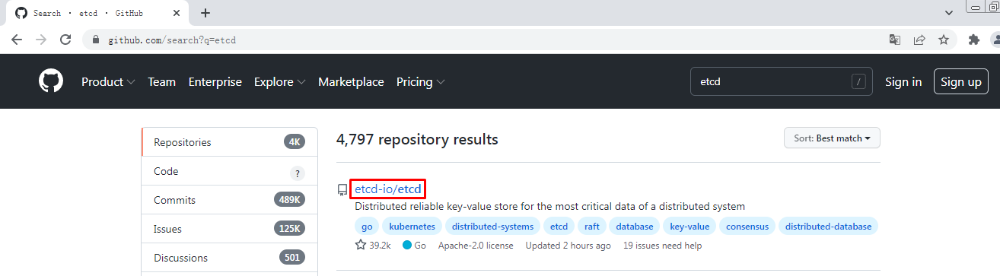

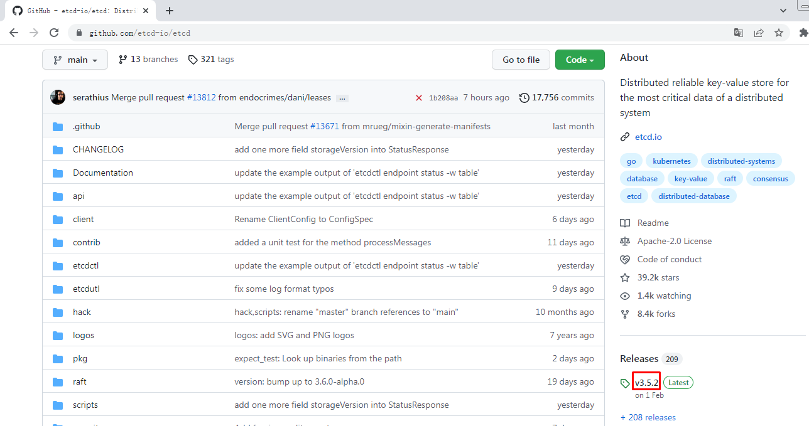

~~~powershell
wget https://github.com/etcd-io/etcd/releases/download/v3.5.2/etcd-v3.5.2-linux-amd64.tar.gz
~~~

#### 2.4.5.2 安装etcd软件

~~~powershell
tar -xvf etcd-v3.5.2-linux-amd64.tar.gz
cp -p etcd-v3.5.2-linux-amd64/etcd* /usr/local/bin/
~~~

#### 2.4.5.3 分发etcd软件

~~~powershell
scp etcd-v3.5.2-linux-amd64/etcd* k8s-master2:/usr/local/bin/

scp etcd-v3.5.2-linux-amd64/etcd* k8s-master3:/usr/local/bin/
~~~

#### 2.4.5.4 创建配置文件

~~~powershell
mkdir /etc/etcd
~~~

~~~powershell
cat >  /etc/etcd/etcd.conf <<"EOF"
#[Member]
ETCD_NAME="etcd1"
ETCD_DATA_DIR="/var/lib/etcd/default.etcd"
ETCD_LISTEN_PEER_URLS="https://192.168.10.12:2380"
ETCD_LISTEN_CLIENT_URLS="https://192.168.10.12:2379,http://127.0.0.1:2379"

#[Clustering]
ETCD_INITIAL_ADVERTISE_PEER_URLS="https://192.168.10.12:2380"
ETCD_ADVERTISE_CLIENT_URLS="https://192.168.10.12:2379"
ETCD_INITIAL_CLUSTER="etcd1=https://192.168.10.12:2380,etcd2=https://192.168.10.13:2380,etcd3=https://192.168.10.14:2380"
ETCD_INITIAL_CLUSTER_TOKEN="etcd-cluster"
ETCD_INITIAL_CLUSTER_STATE="new"
EOF
~~~

~~~powershell
说明：
ETCD_NAME：节点名称，集群中唯一
ETCD_DATA_DIR：数据目录
ETCD_LISTEN_PEER_URLS：集群通信监听地址
ETCD_LISTEN_CLIENT_URLS：客户端访问监听地址
ETCD_INITIAL_ADVERTISE_PEER_URLS：集群通告地址
ETCD_ADVERTISE_CLIENT_URLS：客户端通告地址
ETCD_INITIAL_CLUSTER：集群节点地址
ETCD_INITIAL_CLUSTER_TOKEN：集群Token
ETCD_INITIAL_CLUSTER_STATE：加入集群的当前状态，new是新集群，existing表示加入已有集群
~~~

#### 2.4.5.5 创建服务配置文件

~~~powershell
mkdir -p /etc/etcd/ssl
mkdir -p /var/lib/etcd/default.etcd
~~~

~~~powershell
cd /data/k8s-work
cp ca*.pem /etc/etcd/ssl
cp etcd*.pem /etc/etcd/ssl
~~~

~~~powershell
cat > /etc/systemd/system/etcd.service <<"EOF"
[Unit]
Description=Etcd Server
After=network.target
After=network-online.target
Wants=network-online.target

[Service]
Type=notify
EnvironmentFile=-/etc/etcd/etcd.conf
WorkingDirectory=/var/lib/etcd/
ExecStart=/usr/local/bin/etcd \
  --cert-file=/etc/etcd/ssl/etcd.pem \
  --key-file=/etc/etcd/ssl/etcd-key.pem \
  --trusted-ca-file=/etc/etcd/ssl/ca.pem \
  --peer-cert-file=/etc/etcd/ssl/etcd.pem \
  --peer-key-file=/etc/etcd/ssl/etcd-key.pem \
  --peer-trusted-ca-file=/etc/etcd/ssl/ca.pem \
  --peer-client-cert-auth \
  --client-cert-auth
Restart=on-failure
RestartSec=5
LimitNOFILE=65536

[Install]
WantedBy=multi-user.target
EOF
~~~

#### 2.4.5.6 同步etcd配置到集群其它master节点

~~~powershell
创建目录
mkdir -p /etc/etcd
mkdir -p /etc/etcd/ssl
mkdir -p /var/lib/etcd/default.etcd
~~~

~~~powershell
服务配置文件,需要修改etcd节点名称及IP地址
for i in k8s-master2 k8s-master3 \
do \
scp /etc/etcd/etcd.conf $i:/etc/etcd/ \
done
~~~

~~~powershell
k8s-master2:

cat /etc/etcd/etcd.conf
#[Member]
ETCD_NAME="etcd2"
ETCD_DATA_DIR="/var/lib/etcd/default.etcd"
ETCD_LISTEN_PEER_URLS="https://192.168.10.13:2380"
ETCD_LISTEN_CLIENT_URLS="https://192.168.10.13:2379,http://127.0.0.1:2379"

#[Clustering]
ETCD_INITIAL_ADVERTISE_PEER_URLS="https://192.168.10.13:2380"
ETCD_ADVERTISE_CLIENT_URLS="https://192.168.10.13:2379"
ETCD_INITIAL_CLUSTER="etcd1=https://192.168.10.12:2380,etcd2=https://192.168.10.13:2380,etcd3=https://192.168.10.14:2380"
ETCD_INITIAL_CLUSTER_TOKEN="etcd-cluster"
ETCD_INITIAL_CLUSTER_STATE="new"
~~~

~~~powershell
k8s-master3:

cat /etc/etcd/etcd.conf
#[Member]
ETCD_NAME="etcd3"
ETCD_DATA_DIR="/var/lib/etcd/default.etcd"
ETCD_LISTEN_PEER_URLS="https://192.168.10.14:2380"
ETCD_LISTEN_CLIENT_URLS="https://192.168.10.14:2379,http://127.0.0.1:2379"

#[Clustering]
ETCD_INITIAL_ADVERTISE_PEER_URLS="https://192.168.10.14:2380"
ETCD_ADVERTISE_CLIENT_URLS="https://192.168.10.14:2379"
ETCD_INITIAL_CLUSTER="etcd1=https://192.168.10.12:2380,etcd2=https://192.168.10.13:2380,etcd3=https://192.168.10.14:2380"
ETCD_INITIAL_CLUSTER_TOKEN="etcd-cluster"
ETCD_INITIAL_CLUSTER_STATE="new"
~~~

~~~powershell
证书文件
for i in k8s-master2 k8s-master3 \
do \
scp /etc/etcd/ssl/* $i:/etc/etcd/ssl \
done
~~~

~~~powershell
服务启动配置文件
for i in k8s-master2 k8s-master3 \
do \
scp /etc/systemd/system/etcd.service $i:/etc/systemd/system/ \
done
~~~

#### 2.4.5.7 启动etcd集群

~~~powershell
systemctl daemon-reload
systemctl enable --now etcd.service
systemctl status etcd
~~~

#### 2.4.5.8 验证集群状态

~~~powershell
ETCDCTL_API=3 /usr/local/bin/etcdctl --write-out=table --cacert=/etc/etcd/ssl/ca.pem --cert=/etc/etcd/ssl/etcd.pem --key=/etc/etcd/ssl/etcd-key.pem --endpoints=https://192.168.10.12:2379,https://192.168.10.13:2379,https://192.168.10.14:2379 endpoint health
~~~

~~~powershell
+----------------------------+--------+-------------+-------+
|          ENDPOINT          | HEALTH |    TOOK     | ERROR |
+----------------------------+--------+-------------+-------+
| https://192.168.10.14:2379 |   true | 10.393062ms |       |
| https://192.168.10.12:2379 |   true |  15.70437ms |       |
| https://192.168.10.13:2379 |   true | 15.871684ms |       |
+----------------------------+--------+-------------+-------+
~~~

~~~powershell
检查ETCD数据库性能
ETCDCTL_API=3 /usr/local/bin/etcdctl --write-out=table --cacert=/etc/etcd/ssl/ca.pem --cert=/etc/etcd/ssl/etcd.pem --key=/etc/etcd/ssl/etcd-key.pem --endpoints=https://192.168.10.12:2379,https://192.168.10.13:2379,https://192.168.10.14:2379 check perf
~~~

~~~powershell
59 / 60 Boooooooooooooooooooooooooooooooooooooooooooooooooooooooooooooooooooooooooooooooooooooooooooooooooooooooooooooooooooooooooooooooooooooom  !  98.33%
PASS: Throughput is 151 writes/s
PASS: Slowest request took 0.066478s
PASS: Stddev is 0.002354s
PASS
~~~

~~~powershell
ETCDCTL_API=3 /usr/local/bin/etcdctl --write-out=table --cacert=/etc/etcd/ssl/ca.pem --cert=/etc/etcd/ssl/etcd.pem --key=/etc/etcd/ssl/etcd-key.pem --endpoints=https://192.168.10.12:2379,https://192.168.10.13:2379,https://192.168.10.14:2379 member list
~~~

~~~powershell
+------------------+---------+-------+----------------------------+----------------------------+------------+
|        ID        | STATUS  | NAME  |         PEER ADDRS         |        CLIENT ADDRS        | IS LEARNER |
+------------------+---------+-------+----------------------------+----------------------------+------------+
| 9b449b0ff1d4c375 | started | etcd1 | https://192.168.10.12:2380 | https://192.168.10.12:2379 |      false |
| d1fbb74bc6a61e5c | started | etcd2 | https://192.168.10.13:2380 | https://192.168.10.13:2379 |      false |
| f60b205fb02fe23c | started | etcd3 | https://192.168.10.14:2380 | https://192.168.10.14:2379 |      false |
+------------------+---------+-------+----------------------------+----------------------------+------------+
~~~

~~~powershell
ETCDCTL_API=3 /usr/local/bin/etcdctl --write-out=table --cacert=/etc/etcd/ssl/ca.pem --cert=/etc/etcd/ssl/etcd.pem --key=/etc/etcd/ssl/etcd-key.pem --endpoints=https://192.168.10.12:2379,https://192.168.10.13:2379,https://192.168.10.14:2379 endpoint status
~~~

~~~powershell
+----------------------------+------------------+---------+---------+-----------+------------+-----------+------------+--------------------+--------+
|          ENDPOINT          |        ID        | VERSION | DB SIZE | IS LEADER | IS LEARNER | RAFT TERM | RAFT INDEX | RAFT APPLIED INDEX | ERRORS |
+----------------------------+------------------+---------+---------+-----------+------------+-----------+------------+--------------------+--------+
| https://192.168.10.12:2379 | 9b449b0ff1d4c375 |   3.5.2 |   24 MB |      true |      false |         2 |     403774 |             403774 |        |
| https://192.168.10.13:2379 | d1fbb74bc6a61e5c |   3.5.2 |   24 MB |     false |      false |         2 |     403774 |             403774 |        |
| https://192.168.10.14:2379 | f60b205fb02fe23c |   3.5.2 |   24 MB |     false |      false |         2 |     403774 |             403774 |        |
+----------------------------+------------------+---------+---------+-----------+------------+-----------+------------+--------------------+--------+
~~~

## 2.5 Kubernetes集群部署

### 2.5.1 Kubernetes软件包下载

~~~powershell
wget https://dl.k8s.io/v1.21.10/kubernetes-server-linux-amd64.tar.gz
~~~

### 2.5.2 Kubernetes软件包安装

~~~powershell
tar -xvf kubernetes-server-linux-amd64.tar.gz

cd kubernetes/server/bin/

cp kube-apiserver kube-controller-manager kube-scheduler kubectl /usr/local/bin/
~~~

### 2.5.3 Kubernetes软件分发

~~~powershell
scp kube-apiserver kube-controller-manager kube-scheduler kubectl k8s-master2:/usr/local/bin/
scp kube-apiserver kube-controller-manager kube-scheduler kubectl k8s-master3:/usr/local/bin/
~~~

~~~powershell
scp kubelet kube-proxy k8s-master1:/usr/local/bin
scp kubelet kube-proxy k8s-master2:/usr/local/bin
scp kubelet kube-proxy k8s-master3:/usr/local/bin
scp kubelet kube-proxy k8s-worker1:/usr/local/bin
~~~

### 2.5.4 在集群节点上创建目录

> 所有节点

~~~powershell
mkdir -p /etc/kubernetes/        
mkdir -p /etc/kubernetes/ssl     
mkdir -p /var/log/kubernetes 
~~~

### 2.5.5 部署api-server

#### 2.5.5.1 创建apiserver证书请求文件

~~~powershell
cat > kube-apiserver-csr.json << "EOF"
{
"CN": "kubernetes",
  "hosts": [
    "127.0.0.1",
    "192.168.10.12",
    "192.168.10.13",
    "192.168.10.14",
    "192.168.10.15",
    "192.168.10.16",
    "192.168.10.17",
    "192.168.10.18",
    "192.168.10.19",
    "192.168.10.20",
    "192.168.10.100",
    "10.96.0.1",
    "kubernetes",
    "kubernetes.default",
    "kubernetes.default.svc",
    "kubernetes.default.svc.cluster",
    "kubernetes.default.svc.cluster.local"
  ],
  "key": {
    "algo": "rsa",
    "size": 2048
  },
  "names": [
    {
      "C": "CN",
      "ST": "Beijing",
      "L": "Beijing",
      "O": "kubemsb",
      "OU": "CN"
    }
  ]
}
EOF
~~~

~~~powershell
说明：
如果 hosts 字段不为空则需要指定授权使用该证书的 IP（含VIP） 或域名列表。由于该证书被 集群使用，需要将节点的IP都填上，为了方便后期扩容可以多写几个预留的IP。
同时还需要填写 service 网络的首个IP(一般是 kube-apiserver 指定的 service-cluster-ip-range 网段的第一个IP，如 10.96.0.1)。
~~~

#### 2.5.5.2 生成apiserver证书及token文件

~~~powershell
cfssl gencert -ca=ca.pem -ca-key=ca-key.pem -config=ca-config.json -profile=kubernetes kube-apiserver-csr.json | cfssljson -bare kube-apiserver
~~~

~~~powershell
cat > token.csv << EOF
$(head -c 16 /dev/urandom | od -An -t x | tr -d ' '),kubelet-bootstrap,10001,"system:kubelet-bootstrap"
EOF
~~~

~~~powershell
说明：
创建TLS机制所需TOKEN
TLS Bootstraping：Master apiserver启用TLS认证后，Node节点kubelet和kube-proxy与kube-apiserver进行通信，必须使用CA签发的有效证书才可以，当Node节点很多时，这种客户端证书颁发需要大量工作，同样也会增加集群扩展复杂度。为了简化流程，Kubernetes引入了TLS bootstraping机制来自动颁发客户端证书，kubelet会以一个低权限用户自动向apiserver申请证书，kubelet的证书由apiserver动态签署。所以强烈建议在Node上使用这种方式，目前主要用于kubelet，kube-proxy还是由我们统一颁发一个证书。
~~~

#### 2.5.5.3 创建apiserver服务配置文件

~~~powershell
cat > /etc/kubernetes/kube-apiserver.conf << "EOF"
KUBE_APISERVER_OPTS="--enable-admission-plugins=NamespaceLifecycle,NodeRestriction,LimitRanger,ServiceAccount,DefaultStorageClass,ResourceQuota \
  --anonymous-auth=false \
  --bind-address=192.168.10.12 \
  --secure-port=6443 \
  --advertise-address=192.168.10.12 \
  --insecure-port=0 \
  --authorization-mode=Node,RBAC \
  --runtime-config=api/all=true \
  --enable-bootstrap-token-auth \
  --service-cluster-ip-range=10.96.0.0/16 \
  --token-auth-file=/etc/kubernetes/token.csv \
  --service-node-port-range=30000-32767 \
  --tls-cert-file=/etc/kubernetes/ssl/kube-apiserver.pem  \
  --tls-private-key-file=/etc/kubernetes/ssl/kube-apiserver-key.pem \
  --client-ca-file=/etc/kubernetes/ssl/ca.pem \
  --kubelet-client-certificate=/etc/kubernetes/ssl/kube-apiserver.pem \
  --kubelet-client-key=/etc/kubernetes/ssl/kube-apiserver-key.pem \
  --service-account-key-file=/etc/kubernetes/ssl/ca-key.pem \
  --service-account-signing-key-file=/etc/kubernetes/ssl/ca-key.pem  \
  --service-account-issuer=api \
  --etcd-cafile=/etc/etcd/ssl/ca.pem \
  --etcd-certfile=/etc/etcd/ssl/etcd.pem \
  --etcd-keyfile=/etc/etcd/ssl/etcd-key.pem \
  --etcd-servers=https://192.168.10.12:2379,https://192.168.10.13:2379,https://192.168.10.14:2379 \
  --enable-swagger-ui=true \
  --allow-privileged=true \
  --apiserver-count=3 \
  --audit-log-maxage=30 \
  --audit-log-maxbackup=3 \
  --audit-log-maxsize=100 \
  --audit-log-path=/var/log/kube-apiserver-audit.log \
  --event-ttl=1h \
  --alsologtostderr=true \
  --logtostderr=false \
  --log-dir=/var/log/kubernetes \
  --v=4"
EOF
~~~

#### 2.5.5.4 创建apiserver服务管理配置文件

~~~powershell
cat > /etc/systemd/system/kube-apiserver.service << "EOF"
[Unit]
Description=Kubernetes API Server
Documentation=https://github.com/kubernetes/kubernetes
After=etcd.service
Wants=etcd.service

[Service]
EnvironmentFile=-/etc/kubernetes/kube-apiserver.conf
ExecStart=/usr/local/bin/kube-apiserver $KUBE_APISERVER_OPTS
Restart=on-failure
RestartSec=5
Type=notify
LimitNOFILE=65536

[Install]
WantedBy=multi-user.target
EOF
~~~

#### 2.5.5.5 同步文件到集群master节点

~~~powershell
cp ca*.pem /etc/kubernetes/ssl/
~~~

~~~powershell
cp kube-apiserver*.pem /etc/kubernetes/ssl/
~~~

~~~powershell
cp token.csv /etc/kubernetes/
~~~

~~~powershell
scp /etc/kubernetes/token.csv k8s-master2:/etc/kubernetes
scp /etc/kubernetes/token.csv k8s-master3:/etc/kubernetes
~~~

~~~powershell
scp /etc/kubernetes/ssl/kube-apiserver*.pem k8s-master2:/etc/kubernetes/ssl
scp /etc/kubernetes/ssl/kube-apiserver*.pem k8s-master3:/etc/kubernetes/ssl
~~~

~~~powershell
scp /etc/kubernetes/ssl/ca*.pem k8s-master2:/etc/kubernetes/ssl
scp /etc/kubernetes/ssl/ca*.pem k8s-master3:/etc/kubernetes/ssl
~~~

~~~powershell
scp /etc/kubernetes/kube-apiserver.conf k8s-master2:/etc/kubernetes/kube-apiserver.conf

# cat /etc/kubernetes/kube-apiserver.conf
KUBE_APISERVER_OPTS="--enable-admission-plugins=NamespaceLifecycle,NodeRestriction,LimitRanger,ServiceAccount,DefaultStorageClass,ResourceQuota \
  --anonymous-auth=false \
  --bind-address=192.168.10.13 \
  --secure-port=6443 \
  --advertise-address=192.168.10.13 \
  --insecure-port=0 \
  --authorization-mode=Node,RBAC \
  --runtime-config=api/all=true \
  --enable-bootstrap-token-auth \
  --service-cluster-ip-range=10.96.0.0/16 \
  --token-auth-file=/etc/kubernetes/token.csv \
  --service-node-port-range=30000-32767 \
  --tls-cert-file=/etc/kubernetes/ssl/kube-apiserver.pem  \
  --tls-private-key-file=/etc/kubernetes/ssl/kube-apiserver-key.pem \
  --client-ca-file=/etc/kubernetes/ssl/ca.pem \
  --kubelet-client-certificate=/etc/kubernetes/ssl/kube-apiserver.pem \
  --kubelet-client-key=/etc/kubernetes/ssl/kube-apiserver-key.pem \
  --service-account-key-file=/etc/kubernetes/ssl/ca-key.pem \
  --service-account-signing-key-file=/etc/kubernetes/ssl/ca-key.pem  \
  --service-account-issuer=api \
  --etcd-cafile=/etc/etcd/ssl/ca.pem \
  --etcd-certfile=/etc/etcd/ssl/etcd.pem \
  --etcd-keyfile=/etc/etcd/ssl/etcd-key.pem \
  --etcd-servers=https://192.168.10.12:2379,https://192.168.10.13:2379,https://192.168.10.14:2379 \
  --enable-swagger-ui=true \
  --allow-privileged=true \
  --apiserver-count=3 \
  --audit-log-maxage=30 \
  --audit-log-maxbackup=3 \
  --audit-log-maxsize=100 \
  --audit-log-path=/var/log/kube-apiserver-audit.log \
  --event-ttl=1h \
  --alsologtostderr=true \
  --logtostderr=false \
  --log-dir=/var/log/kubernetes \
  --v=4"
~~~

~~~powershell
cp /etc/kubernetes/kube-apiserver.conf k8s-master3:/etc/kubernetes/kube-apiserver.conf

# cat /etc/kubernetes/kube-apiserver.conf
KUBE_APISERVER_OPTS="--enable-admission-plugins=NamespaceLifecycle,NodeRestriction,LimitRanger,ServiceAccount,DefaultStorageClass,ResourceQuota \
  --anonymous-auth=false \
  --bind-address=192.168.10.14 \
  --secure-port=6443 \
  --advertise-address=192.168.10.14 \
  --insecure-port=0 \
  --authorization-mode=Node,RBAC \
  --runtime-config=api/all=true \
  --enable-bootstrap-token-auth \
  --service-cluster-ip-range=10.96.0.0/16 \
  --token-auth-file=/etc/kubernetes/token.csv \
  --service-node-port-range=30000-32767 \
  --tls-cert-file=/etc/kubernetes/ssl/kube-apiserver.pem  \
  --tls-private-key-file=/etc/kubernetes/ssl/kube-apiserver-key.pem \
  --client-ca-file=/etc/kubernetes/ssl/ca.pem \
  --kubelet-client-certificate=/etc/kubernetes/ssl/kube-apiserver.pem \
  --kubelet-client-key=/etc/kubernetes/ssl/kube-apiserver-key.pem \
  --service-account-key-file=/etc/kubernetes/ssl/ca-key.pem \
  --service-account-signing-key-file=/etc/kubernetes/ssl/ca-key.pem  \
  --service-account-issuer=api \
  --etcd-cafile=/etc/etcd/ssl/ca.pem \
  --etcd-certfile=/etc/etcd/ssl/etcd.pem \
  --etcd-keyfile=/etc/etcd/ssl/etcd-key.pem \
  --etcd-servers=https://192.168.10.12:2379,https://192.168.10.13:2379,https://192.168.10.14:2379 \
  --enable-swagger-ui=true \
  --allow-privileged=true \
  --apiserver-count=3 \
  --audit-log-maxage=30 \
  --audit-log-maxbackup=3 \
  --audit-log-maxsize=100 \
  --audit-log-path=/var/log/kube-apiserver-audit.log \
  --event-ttl=1h \
  --alsologtostderr=true \
  --logtostderr=false \
  --log-dir=/var/log/kubernetes \
  --v=4"
~~~

~~~powershell
scp /etc/systemd/system/kube-apiserver.service k8s-master2:/etc/systemd/system/kube-apiserver.service

scp /etc/systemd/system/kube-apiserver.service k8s-master3:/etc/systemd/system/kube-apiserver.service
~~~

#### 2.5.5.6 启动apiserver服务

~~~powershell
systemctl daemon-reload
systemctl enable --now kube-apiserver

systemctl status kube-apiserver

# 测试
curl --insecure https://192.168.10.12:6443/
curl --insecure https://192.168.10.13:6443/
curl --insecure https://192.168.10.14:6443/
curl --insecure https://192.168.10.100:6443/
~~~

### 2.5.6 部署kubectl

#### 2.5.6.1 创建kubectl证书请求文件

~~~powershell
cat > admin-csr.json << "EOF"
{
  "CN": "admin",
  "hosts": [],
  "key": {
    "algo": "rsa",
    "size": 2048
  },
  "names": [
    {
      "C": "CN",
      "ST": "Beijing",
      "L": "Beijing",
      "O": "system:masters",             
      "OU": "system"
    }
  ]
}
EOF
~~~

~~~powershell
说明：

后续 kube-apiserver 使用 RBAC 对客户端(如 kubelet、kube-proxy、Pod)请求进行授权；
kube-apiserver 预定义了一些 RBAC 使用的 RoleBindings，如 cluster-admin 将 Group system:masters 与 Role cluster-admin 绑定，该 Role 授予了调用kube-apiserver 的所有 API的权限；
O指定该证书的 Group 为 system:masters，kubelet 使用该证书访问 kube-apiserver 时 ，由于证书被 CA 签名，所以认证通过，同时由于证书用户组为经过预授权的 system:masters，所以被授予访问所有 API 的权限；
注：
这个admin 证书，是将来生成管理员用的kubeconfig 配置文件用的，现在我们一般建议使用RBAC 来对kubernetes 进行角色权限控制， kubernetes 将证书中的CN 字段 作为User， O 字段作为 Group；
"O": "system:masters", 必须是system:masters，否则后面kubectl create clusterrolebinding报错。
~~~

#### 2.5.6.2 生成证书文件

~~~powershell
cfssl gencert -ca=ca.pem -ca-key=ca-key.pem -config=ca-config.json -profile=kubernetes admin-csr.json | cfssljson -bare admin
~~~

#### 2.5.6.3 复制文件到指定目录

~~~powershell
cp admin*.pem /etc/kubernetes/ssl/
~~~

#### 2.5.6.4 生成kubeconfig配置文件

kube.config 为 kubectl 的配置文件，包含访问 apiserver 的所有信息，如 apiserver 地址、CA 证书和自身使用的证书

~~~powershell
kubectl config set-cluster kubernetes --certificate-authority=ca.pem --embed-certs=true --server=https://192.168.10.100:6443 --kubeconfig=kube.config

kubectl config set-credentials admin --client-certificate=admin.pem --client-key=admin-key.pem --embed-certs=true --kubeconfig=kube.config

kubectl config set-context kubernetes --cluster=kubernetes --user=admin --kubeconfig=kube.config

kubectl config use-context kubernetes --kubeconfig=kube.config
~~~

#### 2.5.6.5 准备kubectl配置文件并进行角色绑定

~~~powershell
mkdir ~/.kube
cp kube.config ~/.kube/config
kubectl create clusterrolebinding kube-apiserver:kubelet-apis --clusterrole=system:kubelet-api-admin --user kubernetes --kubeconfig=/root/.kube/config
~~~

#### 2.5.6.6 查看集群状态

~~~powershell
export KUBECONFIG=$HOME/.kube/config
~~~

~~~powershell
查看集群信息
kubectl cluster-info

查看集群组件状态
kubectl get componentstatuses

查看命名空间中资源对象
kubectl get all --all-namespaces
~~~

#### 2.5.6.7 同步kubectl配置文件到集群其它master节点

~~~powershell
k8s-master2:
mkdir /root/.kube

k8s-master3:
mkdir /root/.kube
~~~

~~~powershell
scp /root/.kube/config k8s-master2:/root/.kube/config
scp /root/.kube/config k8s-master3:/root/.kube/config
~~~

#### 2.5.6.8 配置kubectl命令补全(可选)

~~~powershell
yum install -y bash-completion
source /usr/share/bash-completion/bash_completion
source <(kubectl completion bash)
kubectl completion bash > ~/.kube/completion.bash.inc
source '/root/.kube/completion.bash.inc'  
source $HOME/.bash_profile
~~~

### 2.5.7  部署kube-controller-manager

#### 2.5.7.1 创建kube-controller-manager证书请求文件

~~~powershell
cat > kube-controller-manager-csr.json << "EOF"
{
    "CN": "system:kube-controller-manager",
    "key": {
        "algo": "rsa",
        "size": 2048
    },
    "hosts": [
      "127.0.0.1",
      "192.168.10.12",
      "192.168.10.13",
      "192.168.10.14"
    ],
    "names": [
      {
        "C": "CN",
        "ST": "Beijing",
        "L": "Beijing",
        "O": "system:kube-controller-manager",
        "OU": "system"
      }
    ]
}
EOF
~~~

~~~powershell
说明：

hosts 列表包含所有 kube-controller-manager 节点 IP；
CN 为 system:kube-controller-manager;
O 为 system:kube-controller-manager，kubernetes 内置的 ClusterRoleBindings system:kube-controller-manager 赋予 kube-controller-manager 工作所需的权限
~~~

#### 2.5.7.2 创建kube-controller-manager证书文件

~~~powershell
cfssl gencert -ca=ca.pem -ca-key=ca-key.pem -config=ca-config.json -profile=kubernetes kube-controller-manager-csr.json | cfssljson -bare kube-controller-manager
~~~

~~~powershell
# ls

kube-controller-manager.csr     
kube-controller-manager-csr.json
kube-controller-manager-key.pem
kube-controller-manager.pem
~~~

#### 2.5.7.3  创建kube-controller-manager的kube-controller-manager.kubeconfig

~~~powershell
kubectl config set-cluster kubernetes --certificate-authority=ca.pem --embed-certs=true --server=https://192.168.10.100:6443 --kubeconfig=kube-controller-manager.kubeconfig

kubectl config set-credentials system:kube-controller-manager --client-certificate=kube-controller-manager.pem --client-key=kube-controller-manager-key.pem --embed-certs=true --kubeconfig=kube-controller-manager.kubeconfig

kubectl config set-context system:kube-controller-manager --cluster=kubernetes --user=system:kube-controller-manager --kubeconfig=kube-controller-manager.kubeconfig

kubectl config use-context system:kube-controller-manager --kubeconfig=kube-controller-manager.kubeconfig
~~~

#### 2.5.7.4 创建kube-controller-manager配置文件

~~~powershell
cat > kube-controller-manager.conf << "EOF"
KUBE_CONTROLLER_MANAGER_OPTS="--port=10252 \
  --secure-port=10257 \
  --bind-address=127.0.0.1 \
  --kubeconfig=/etc/kubernetes/kube-controller-manager.kubeconfig \
  --service-cluster-ip-range=10.96.0.0/16 \
  --cluster-name=kubernetes \
  --cluster-signing-cert-file=/etc/kubernetes/ssl/ca.pem \
  --cluster-signing-key-file=/etc/kubernetes/ssl/ca-key.pem \
  --allocate-node-cidrs=true \
  --cluster-cidr=10.244.0.0/16 \
  --experimental-cluster-signing-duration=87600h \
  --root-ca-file=/etc/kubernetes/ssl/ca.pem \
  --service-account-private-key-file=/etc/kubernetes/ssl/ca-key.pem \
  --leader-elect=true \
  --feature-gates=RotateKubeletServerCertificate=true \
  --controllers=*,bootstrapsigner,tokencleaner \
  --horizontal-pod-autoscaler-use-rest-clients=true \
  --horizontal-pod-autoscaler-sync-period=10s \
  --tls-cert-file=/etc/kubernetes/ssl/kube-controller-manager.pem \
  --tls-private-key-file=/etc/kubernetes/ssl/kube-controller-manager-key.pem \
  --use-service-account-credentials=true \
  --alsologtostderr=true \
  --logtostderr=false \
  --log-dir=/var/log/kubernetes \
  --v=2"
EOF
~~~

#### 2.5.7.5 创建服务启动文件

~~~powershell
cat > kube-controller-manager.service << "EOF"
[Unit]
Description=Kubernetes Controller Manager
Documentation=https://github.com/kubernetes/kubernetes

[Service]
EnvironmentFile=-/etc/kubernetes/kube-controller-manager.conf
ExecStart=/usr/local/bin/kube-controller-manager $KUBE_CONTROLLER_MANAGER_OPTS
Restart=on-failure
RestartSec=5

[Install]
WantedBy=multi-user.target
EOF
~~~

#### 2.5.7.6 同步文件到集群master节点

~~~powershell
cp kube-controller-manager*.pem /etc/kubernetes/ssl/
cp kube-controller-manager.kubeconfig /etc/kubernetes/
cp kube-controller-manager.conf /etc/kubernetes/
cp kube-controller-manager.service /usr/lib/systemd/system/
~~~

~~~powershell
scp  kube-controller-manager*.pem k8s-master2:/etc/kubernetes/ssl/
scp  kube-controller-manager*.pem k8s-master3:/etc/kubernetes/ssl/
scp  kube-controller-manager.kubeconfig kube-controller-manager.conf k8s-master2:/etc/kubernetes/
scp  kube-controller-manager.kubeconfig kube-controller-manager.conf k8s-master3:/etc/kubernetes/
scp  kube-controller-manager.service k8s-master2:/usr/lib/systemd/system/
scp  kube-controller-manager.service k8s-master3:/usr/lib/systemd/system/
~~~

~~~powershell
#查看证书
openssl x509 -in /etc/kubernetes/ssl/kube-controller-manager.pem -noout -text
~~~

#### 2.5.7.7 启动服务

~~~powershell
systemctl daemon-reload 
systemctl enable --now kube-controller-manager
systemctl status kube-controller-manager
~~~

~~~powershell
kubectl get componentstatuses
~~~

### 2.5.8 部署kube-scheduler

#### 2.5.8.1 创建kube-scheduler证书请求文件

~~~powershell
cat > kube-scheduler-csr.json << "EOF"
{
    "CN": "system:kube-scheduler",
    "hosts": [
      "127.0.0.1",
      "192.168.10.12",
      "192.168.10.13",
      "192.168.10.14"
    ],
    "key": {
        "algo": "rsa",
        "size": 2048
    },
    "names": [
      {
        "C": "CN",
        "ST": "Beijing",
        "L": "Beijing",
        "O": "system:kube-scheduler",
        "OU": "system"
      }
    ]
}
EOF
~~~

#### 2.5.8.2 生成kube-scheduler证书

~~~powershell
cfssl gencert -ca=ca.pem -ca-key=ca-key.pem -config=ca-config.json -profile=kubernetes kube-scheduler-csr.json | cfssljson -bare kube-scheduler
~~~

~~~powershell
# ls
kube-scheduler.csr
kube-scheduler-csr.json
kube-scheduler-key.pem
kube-scheduler.pem
~~~

#### 2.5.8.3 创建kube-scheduler的kubeconfig

~~~powershell
kubectl config set-cluster kubernetes --certificate-authority=ca.pem --embed-certs=true --server=https://192.168.10.100:6443 --kubeconfig=kube-scheduler.kubeconfig

kubectl config set-credentials system:kube-scheduler --client-certificate=kube-scheduler.pem --client-key=kube-scheduler-key.pem --embed-certs=true --kubeconfig=kube-scheduler.kubeconfig

kubectl config set-context system:kube-scheduler --cluster=kubernetes --user=system:kube-scheduler --kubeconfig=kube-scheduler.kubeconfig

kubectl config use-context system:kube-scheduler --kubeconfig=kube-scheduler.kubeconfig
~~~

#### 2.5.8.4 创建服务配置文件

~~~powershell
cat > kube-scheduler.conf << "EOF"
KUBE_SCHEDULER_OPTS="--address=127.0.0.1 \
--kubeconfig=/etc/kubernetes/kube-scheduler.kubeconfig \
--leader-elect=true \
--alsologtostderr=true \
--logtostderr=false \
--log-dir=/var/log/kubernetes \
--v=2"
EOF
~~~

#### 2.5.8.5创建服务启动配置文件

~~~powershell
cat > kube-scheduler.service << "EOF"
[Unit]
Description=Kubernetes Scheduler
Documentation=https://github.com/kubernetes/kubernetes

[Service]
EnvironmentFile=-/etc/kubernetes/kube-scheduler.conf
ExecStart=/usr/local/bin/kube-scheduler $KUBE_SCHEDULER_OPTS
Restart=on-failure
RestartSec=5

[Install]
WantedBy=multi-user.target
EOF
~~~

#### 2.5.8.6 同步文件至集群master节点

~~~powershell
cp kube-scheduler*.pem /etc/kubernetes/ssl/
cp kube-scheduler.kubeconfig /etc/kubernetes/
cp kube-scheduler.conf /etc/kubernetes/
cp kube-scheduler.service /usr/lib/systemd/system/
~~~

~~~powershell
scp  kube-scheduler*.pem k8s-master2:/etc/kubernetes/ssl/
scp  kube-scheduler*.pem k8s-master3:/etc/kubernetes/ssl/
scp  kube-scheduler.kubeconfig kube-scheduler.conf k8s-master2:/etc/kubernetes/
scp  kube-scheduler.kubeconfig kube-scheduler.conf k8s-master3:/etc/kubernetes/
scp  kube-scheduler.service k8s-master2:/usr/lib/systemd/system/
scp  kube-scheduler.service k8s-master3:/usr/lib/systemd/system/
~~~

#### 2.5.8.7 启动服务

~~~powershell
systemctl daemon-reload
systemctl enable --now kube-scheduler
systemctl status kube-scheduler
~~~

### 2.5.9 工作节点（worker node）部署

#### 2.5.9.1 Containerd安装及配置

##### 2.5.9.1.1 获取软件包

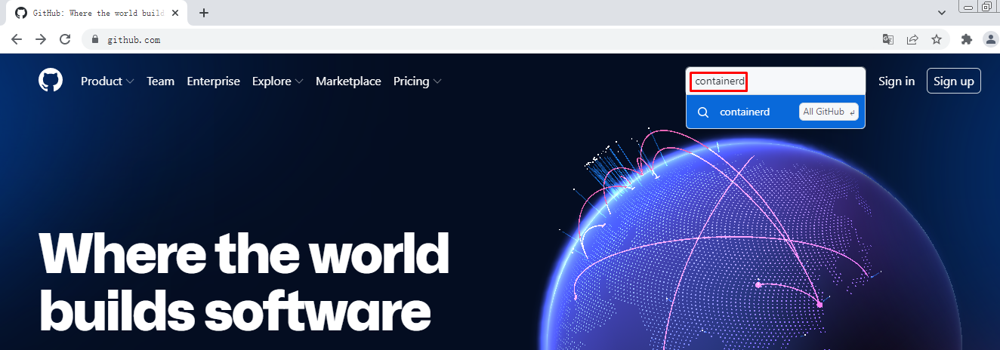

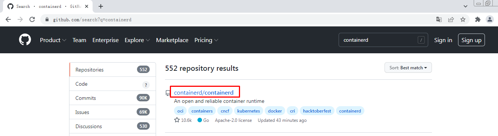

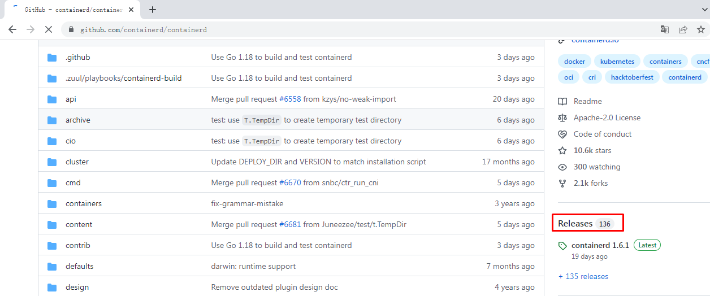

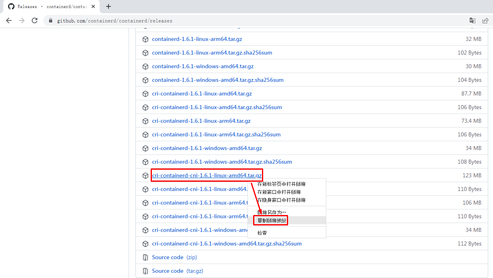

~~~powershell
wget https://github.com/containerd/containerd/releases/download/v1.6.1/cri-containerd-cni-1.6.1-linux-amd64.tar.gz
~~~

##### 2.5.9.1.2 安装containerd

~~~powershell
tar -xf cri-containerd-cni-1.6.1-linux-amd64.tar.gz -C /
~~~

~~~powershell
默认解压后会有如下目录：
etc
opt
usr
会把对应的目解压到/下对应目录中，这样就省去复制文件步骤。
~~~

##### 2.5.9.1.3 生成配置文件并修改

~~~powershell
mkdir /etc/containerd
~~~

~~~powershell
containerd config default >/etc/containerd/config.toml
~~~

~~~powershell
# ls /etc/containerd/
config.toml
~~~

~~~powershell
下面的配置文件中已修改，可不执行，仅修改默认时执行。
sed -i 's@systemd_cgroup = false@systemd_cgroup = true@' /etc/containerd/config.toml
~~~

~~~powershell
下面的配置文件中已修改，可不执行，仅修改默认时执行。
sed -i 's@k8s.gcr.io/pause:3.6@registry.aliyuncs.com/google_containers/pause:3.6@' /etc/containerd/config.toml
~~~

~~~powershell
# cat >/etc/containerd/config.toml<<EOF
root = "/var/lib/containerd"
state = "/run/containerd"
oom_score = -999

[grpc]
  address = "/run/containerd/containerd.sock"
  uid = 0
  gid = 0
  max_recv_message_size = 16777216
  max_send_message_size = 16777216

[debug]
  address = ""
  uid = 0
  gid = 0
  level = ""

[metrics]
  address = ""
  grpc_histogram = false

[cgroup]
  path = ""

[plugins]
  [plugins.cgroups]
    no_prometheus = false
  [plugins.cri]
    stream_server_address = "127.0.0.1"
    stream_server_port = "0"
    enable_selinux = false
    sandbox_image = "registry.aliyuncs.com/google_containers/pause:3.6"
    stats_collect_period = 10
    systemd_cgroup = true
    enable_tls_streaming = false
    max_container_log_line_size = 16384
    [plugins.cri.containerd]
      snapshotter = "overlayfs"
      no_pivot = false
      [plugins.cri.containerd.default_runtime]
        runtime_type = "io.containerd.runtime.v1.linux"
        runtime_engine = ""
        runtime_root = ""
      [plugins.cri.containerd.untrusted_workload_runtime]
        runtime_type = ""
        runtime_engine = ""
        runtime_root = ""
    [plugins.cri.cni]
      bin_dir = "/opt/cni/bin"
      conf_dir = "/etc/cni/net.d"
      conf_template = "/etc/cni/net.d/10-default.conf"
    [plugins.cri.registry]
      [plugins.cri.registry.mirrors]
        [plugins.cri.registry.mirrors."docker.io"]
          endpoint = [
            "https://docker.mirrors.ustc.edu.cn",
            "http://hub-mirror.c.163.com"
          ]
        [plugins.cri.registry.mirrors."gcr.io"]
          endpoint = [
            "https://gcr.mirrors.ustc.edu.cn"
          ]
        [plugins.cri.registry.mirrors."k8s.gcr.io"]
          endpoint = [
            "https://gcr.mirrors.ustc.edu.cn/google-containers/"
          ]
        [plugins.cri.registry.mirrors."quay.io"]
          endpoint = [
            "https://quay.mirrors.ustc.edu.cn"
          ]
        [plugins.cri.registry.mirrors."harbor.kubemsb.com"]
          endpoint = [
            "http://harbor.kubemsb.com"
          ]
    [plugins.cri.x509_key_pair_streaming]
      tls_cert_file = ""
      tls_key_file = ""
  [plugins.diff-service]
    default = ["walking"]
  [plugins.linux]
    shim = "containerd-shim"
    runtime = "runc"
    runtime_root = ""
    no_shim = false
    shim_debug = false
  [plugins.opt]
    path = "/opt/containerd"
  [plugins.restart]
    interval = "10s"
  [plugins.scheduler]
    pause_threshold = 0.02
    deletion_threshold = 0
    mutation_threshold = 100
    schedule_delay = "0s"
    startup_delay = "100ms"
EOF
~~~

##### 2.5.9.1.4 安装runc

> 由于上述软件包中包含的runc对系统依赖过多，所以建议单独下载安装。
>
> 默认runc执行时提示：runc: symbol lookup error: runc: undefined symbol: seccomp_notify_respond

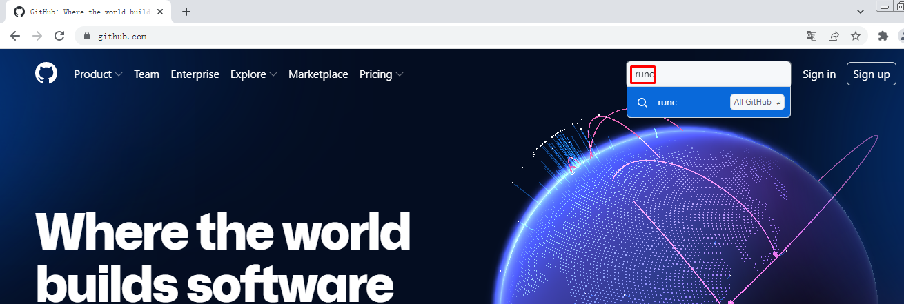

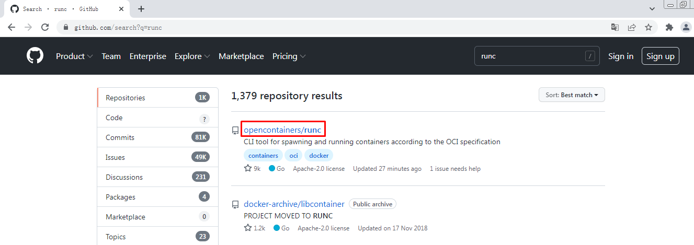

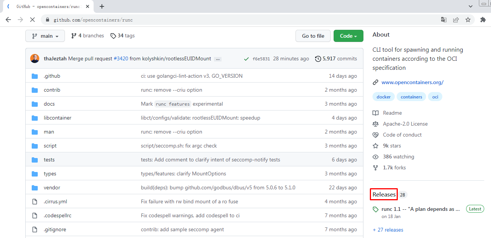

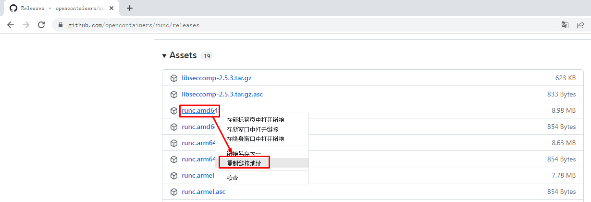

~~~powershell
 wget https://github.com/opencontainers/runc/releases/download/v1.1.0/runc.amd64
~~~

~~~powershell
chmod +x runc.amd64
~~~

~~~powershell
替换掉原软件包中的runc

mv runc.amd64 /usr/local/sbin/runc
~~~

~~~powershell
# runc -v
runc version 1.1.0
commit: v1.1.0-0-g067aaf85
spec: 1.0.2-dev
go: go1.17.6
libseccomp: 2.5.3
~~~

~~~powershell
 systemctl enable containerd
 systemctl start containerd
~~~

#### 2.5.9.2 部署kubelet

> 在k8s-master1上操作

##### 2.5.9.2.1 创建kubelet-bootstrap.kubeconfig

~~~powershell
BOOTSTRAP_TOKEN=$(awk -F "," '{print $1}' /etc/kubernetes/token.csv)

kubectl config set-cluster kubernetes --certificate-authority=ca.pem --embed-certs=true --server=https://192.168.10.100:6443 --kubeconfig=kubelet-bootstrap.kubeconfig

kubectl config set-credentials kubelet-bootstrap --token=${BOOTSTRAP_TOKEN} --kubeconfig=kubelet-bootstrap.kubeconfig

kubectl config set-context default --cluster=kubernetes --user=kubelet-bootstrap --kubeconfig=kubelet-bootstrap.kubeconfig

kubectl config use-context default --kubeconfig=kubelet-bootstrap.kubeconfig
~~~

~~~powershell
kubectl create clusterrolebinding cluster-system-anonymous --clusterrole=cluster-admin --user=kubelet-bootstrap

kubectl create clusterrolebinding kubelet-bootstrap --clusterrole=system:node-bootstrapper --user=kubelet-bootstrap --kubeconfig=kubelet-bootstrap.kubeconfig
~~~

~~~powershell
kubectl describe clusterrolebinding cluster-system-anonymous

kubectl describe clusterrolebinding kubelet-bootstrap
~~~

##### 2.5.9.2.2 创建kubelet配置文件

~~~powershell
cat > kubelet.json << "EOF"
{
  "kind": "KubeletConfiguration",
  "apiVersion": "kubelet.config.k8s.io/v1beta1",
  "authentication": {
    "x509": {
      "clientCAFile": "/etc/kubernetes/ssl/ca.pem"
    },
    "webhook": {
      "enabled": true,
      "cacheTTL": "2m0s"
    },
    "anonymous": {
      "enabled": false
    }
  },
  "authorization": {
    "mode": "Webhook",
    "webhook": {
      "cacheAuthorizedTTL": "5m0s",
      "cacheUnauthorizedTTL": "30s"
    }
  },
  "address": "192.168.10.12",
  "port": 10250,
  "readOnlyPort": 10255,
  "cgroupDriver": "systemd",                    
  "hairpinMode": "promiscuous-bridge",
  "serializeImagePulls": false,
  "clusterDomain": "cluster.local.",
  "clusterDNS": ["10.96.0.2"]
}
EOF
~~~

##### 2.5.9.2.3 创建kubelet服务启动管理文件

~~~powershell
cat > kubelet.service << "EOF"
[Unit]
Description=Kubernetes Kubelet
Documentation=https://github.com/kubernetes/kubernetes
After=docker.service
Requires=docker.service

[Service]
WorkingDirectory=/var/lib/kubelet
ExecStart=/usr/local/bin/kubelet \
  --bootstrap-kubeconfig=/etc/kubernetes/kubelet-bootstrap.kubeconfig \
  --cert-dir=/etc/kubernetes/ssl \
  --kubeconfig=/etc/kubernetes/kubelet.kubeconfig \
  --config=/etc/kubernetes/kubelet.json \
  --cni-bin-dir=/opt/cni/bin \
  --cni-conf-dir=/etc/cni/net.d \
  --container-runtime=remote \
  --container-runtime-endpoint=unix:///run/containerd/containerd.sock \
  --network-plugin=cni \
  --rotate-certificates \
  --pod-infra-container-image=registry.aliyuncs.com/google_containers/pause:3.2 \
  --root-dir=/etc/cni/net.d \
  --alsologtostderr=true \
  --logtostderr=false \
  --log-dir=/var/log/kubernetes \
  --v=2
Restart=on-failure
RestartSec=5

[Install]
WantedBy=multi-user.target
EOF
~~~

##### 2.5.9.2.4 同步文件到集群节点

~~~powershell
cp kubelet-bootstrap.kubeconfig /etc/kubernetes/
cp kubelet.json /etc/kubernetes/
cp kubelet.service /usr/lib/systemd/system/
~~~

~~~powershell
for i in  k8s-master2 k8s-master3 k8s-worker1;do scp kubelet-bootstrap.kubeconfig kubelet.json $i:/etc/kubernetes/;done

for i in  k8s-master2 k8s-master3 k8s-worker1;do scp ca.pem $i:/etc/kubernetes/ssl/;done

for i in k8s-master2 k8s-master3 k8s-worker1;do scp kubelet.service $i:/usr/lib/systemd/system/;done
~~~

~~~powershell
说明：
kubelet.json中address需要修改为当前主机IP地址。
~~~

##### 2.5.9.2.5 创建目录及启动服务

~~~powershell
mkdir -p /var/lib/kubelet
mkdir -p /var/log/kubernetes
~~~

~~~powershell
systemctl daemon-reload
systemctl enable --now kubelet

systemctl status kubelet
~~~

~~~powershell
# kubectl get nodes
NAME          STATUS     ROLES    AGE     VERSION
k8s-master1   NotReady   <none>   2m55s   v1.21.10
k8s-master2   NotReady   <none>   45s     v1.21.10
k8s-master3   NotReady   <none>   39s     v1.21.10
k8s-worker1   NotReady   <none>   5m1s    v1.21.10
~~~

~~~powershell
# kubectl get csr
NAME        AGE     SIGNERNAME                                    REQUESTOR           CONDITION
csr-b949p   7m55s   kubernetes.io/kube-apiserver-client-kubelet   kubelet-bootstrap   Approved,Issued
csr-c9hs4   3m34s   kubernetes.io/kube-apiserver-client-kubelet   kubelet-bootstrap   Approved,Issued
csr-r8vhp   5m50s   kubernetes.io/kube-apiserver-client-kubelet   kubelet-bootstrap   Approved,Issued
csr-zb4sr   3m40s   kubernetes.io/kube-apiserver-client-kubelet   kubelet-bootstrap   Approved,Issued
~~~

~~~powershell
说明：
确认kubelet服务启动成功后，接着到master上Approve一下bootstrap请求。
~~~

#### 2.5.9.3 部署kube-proxy

##### 2.5.9.3.1 创建kube-proxy证书请求文件

~~~powershell
cat > kube-proxy-csr.json << "EOF"
{
  "CN": "system:kube-proxy",
  "key": {
    "algo": "rsa",
    "size": 2048
  },
  "names": [
    {
      "C": "CN",
      "ST": "Beijing",
      "L": "Beijing",
      "O": "kubemsb",
      "OU": "CN"
    }
  ]
}
EOF
~~~

##### 2.5.9.3.2 生成证书

~~~powershell
cfssl gencert -ca=ca.pem -ca-key=ca-key.pem -config=ca-config.json -profile=kubernetes kube-proxy-csr.json | cfssljson -bare kube-proxy
~~~

~~~powershell
# ls kube-proxy*
kube-proxy.csr  kube-proxy-csr.json  kube-proxy-key.pem  kube-proxy.pem
~~~

##### 2.5.9.3.3 创建kubeconfig文件

~~~powershell
kubectl config set-cluster kubernetes --certificate-authority=ca.pem --embed-certs=true --server=https://192.168.10.100:6443 --kubeconfig=kube-proxy.kubeconfig

kubectl config set-credentials kube-proxy --client-certificate=kube-proxy.pem --client-key=kube-proxy-key.pem --embed-certs=true --kubeconfig=kube-proxy.kubeconfig

kubectl config set-context default --cluster=kubernetes --user=kube-proxy --kubeconfig=kube-proxy.kubeconfig

kubectl config use-context default --kubeconfig=kube-proxy.kubeconfig
~~~

##### 2.5.9.3.4 创建服务配置文件

~~~powershell
cat > kube-proxy.yaml << "EOF"
apiVersion: kubeproxy.config.k8s.io/v1alpha1
bindAddress: 192.168.10.12
clientConnection:
  kubeconfig: /etc/kubernetes/kube-proxy.kubeconfig
clusterCIDR: 10.244.0.0/16
healthzBindAddress: 192.168.10.12:10256
kind: KubeProxyConfiguration
metricsBindAddress: 192.168.10.12:10249
mode: "ipvs"
EOF
~~~

##### 2.5.9.3.5 创建服务启动管理文件

~~~powershell
cat >  kube-proxy.service << "EOF"
[Unit]
Description=Kubernetes Kube-Proxy Server
Documentation=https://github.com/kubernetes/kubernetes
After=network.target

[Service]
WorkingDirectory=/var/lib/kube-proxy
ExecStart=/usr/local/bin/kube-proxy \
  --config=/etc/kubernetes/kube-proxy.yaml \
  --alsologtostderr=true \
  --logtostderr=false \
  --log-dir=/var/log/kubernetes \
  --v=2
Restart=on-failure
RestartSec=5
LimitNOFILE=65536

[Install]
WantedBy=multi-user.target
EOF
~~~

##### 2.5.9.3.6 同步文件到集群工作节点主机

~~~powershell
cp kube-proxy*.pem /etc/kubernetes/ssl/
cp kube-proxy.kubeconfig kube-proxy.yaml /etc/kubernetes/
cp kube-proxy.service /usr/lib/systemd/system/
~~~

~~~powershell
for i in k8s-master2 k8s-master3 k8s-worker1;do scp kube-proxy.kubeconfig kube-proxy.yaml $i:/etc/kubernetes/;done
for i in k8s-master2 k8s-master3 k8s-worker1;do scp  kube-proxy.service $i:/usr/lib/systemd/system/;done
~~~

~~~powershell
说明：
修改kube-proxy.yaml中IP地址为当前主机IP.
~~~

##### 2.5.9.3.7 服务启动

~~~powershell
mkdir -p /var/lib/kube-proxy
~~~

~~~powershell
systemctl daemon-reload
systemctl enable --now kube-proxy

systemctl status kube-proxy
~~~

### 2.5.10 网络组件部署 Calico

#### 2.5.10.1 下载

~~~powershell
wget https://docs.projectcalico.org/v3.19/manifests/calico.yaml
~~~

#### 2.5.10.2 修改文件

~~~powershell
3683             - name: CALICO_IPV4POOL_CIDR
3684               value: "10.244.0.0/16"
~~~

#### 2.5.10.3 应用文件

~~~powershell
kubectl apply -f calico.yaml
~~~

#### 2.5.10.4 验证应用结果

~~~powershell
# kubectl get pods -A
NAMESPACE     NAME                                       READY   STATUS    RESTARTS   AGE
kube-system   calico-kube-controllers-7cc8dd57d9-tf2m5   1/1     Running   0          72s
kube-system   calico-node-llw5w                          1/1     Running   0          72s
kube-system   calico-node-mhh6g                          1/1     Running   0          72s
kube-system   calico-node-twj99                          1/1     Running   0          72s
kube-system   calico-node-zh6xl                          1/1     Running   0          72s
~~~

~~~powershell
# kubectl get nodes
NAME          STATUS   ROLES    AGE   VERSION
k8s-master1   Ready    <none>   55m   v1.21.10
k8s-master2   Ready    <none>   53m   v1.21.10
k8s-master3   Ready    <none>   53m   v1.21.10
k8s-worker1   Ready    <none>   57m   v1.21.10
~~~

### 2.5.10 部署CoreDNS

~~~powershell
cat >  coredns.yaml << "EOF"
apiVersion: v1
kind: ServiceAccount
metadata:
  name: coredns
  namespace: kube-system
---
apiVersion: rbac.authorization.k8s.io/v1
kind: ClusterRole
metadata:
  labels:
    kubernetes.io/bootstrapping: rbac-defaults
  name: system:coredns
rules:
  - apiGroups:
    - ""
    resources:
    - endpoints
    - services
    - pods
    - namespaces
    verbs:
    - list
    - watch
  - apiGroups:
    - discovery.k8s.io
    resources:
    - endpointslices
    verbs:
    - list
    - watch
---
apiVersion: rbac.authorization.k8s.io/v1
kind: ClusterRoleBinding
metadata:
  annotations:
    rbac.authorization.kubernetes.io/autoupdate: "true"
  labels:
    kubernetes.io/bootstrapping: rbac-defaults
  name: system:coredns
roleRef:
  apiGroup: rbac.authorization.k8s.io
  kind: ClusterRole
  name: system:coredns
subjects:
- kind: ServiceAccount
  name: coredns
  namespace: kube-system
---
apiVersion: v1
kind: ConfigMap
metadata:
  name: coredns
  namespace: kube-system
data:
  Corefile: |
    .:53 {
        errors
        health {
          lameduck 5s
        }
        ready
        kubernetes cluster.local  in-addr.arpa ip6.arpa {
          fallthrough in-addr.arpa ip6.arpa
        }
        prometheus :9153
        forward . /etc/resolv.conf {
          max_concurrent 1000
        }
        cache 30
        loop
        reload
        loadbalance
    }
---
apiVersion: apps/v1
kind: Deployment
metadata:
  name: coredns
  namespace: kube-system
  labels:
    k8s-app: kube-dns
    kubernetes.io/name: "CoreDNS"
spec:
  # replicas: not specified here:
  # 1. Default is 1.
  # 2. Will be tuned in real time if DNS horizontal auto-scaling is turned on.
  strategy:
    type: RollingUpdate
    rollingUpdate:
      maxUnavailable: 1
  selector:
    matchLabels:
      k8s-app: kube-dns
  template:
    metadata:
      labels:
        k8s-app: kube-dns
    spec:
      priorityClassName: system-cluster-critical
      serviceAccountName: coredns
      tolerations:
        - key: "CriticalAddonsOnly"
          operator: "Exists"
      nodeSelector:
        kubernetes.io/os: linux
      affinity:
         podAntiAffinity:
           preferredDuringSchedulingIgnoredDuringExecution:
           - weight: 100
             podAffinityTerm:
               labelSelector:
                 matchExpressions:
                   - key: k8s-app
                     operator: In
                     values: ["kube-dns"]
               topologyKey: kubernetes.io/hostname
      containers:
      - name: coredns
        image: coredns/coredns:1.8.4
        imagePullPolicy: IfNotPresent
        resources:
          limits:
            memory: 170Mi
          requests:
            cpu: 100m
            memory: 70Mi
        args: [ "-conf", "/etc/coredns/Corefile" ]
        volumeMounts:
        - name: config-volume
          mountPath: /etc/coredns
          readOnly: true
        ports:
        - containerPort: 53
          name: dns
          protocol: UDP
        - containerPort: 53
          name: dns-tcp
          protocol: TCP
        - containerPort: 9153
          name: metrics
          protocol: TCP
        securityContext:
          allowPrivilegeEscalation: false
          capabilities:
            add:
            - NET_BIND_SERVICE
            drop:
            - all
          readOnlyRootFilesystem: true
        livenessProbe:
          httpGet:
            path: /health
            port: 8080
            scheme: HTTP
          initialDelaySeconds: 60
          timeoutSeconds: 5
          successThreshold: 1
          failureThreshold: 5
        readinessProbe:
          httpGet:
            path: /ready
            port: 8181
            scheme: HTTP
      dnsPolicy: Default
      volumes:
        - name: config-volume
          configMap:
            name: coredns
            items:
            - key: Corefile
              path: Corefile
---
apiVersion: v1
kind: Service
metadata:
  name: kube-dns
  namespace: kube-system
  annotations:
    prometheus.io/port: "9153"
    prometheus.io/scrape: "true"
  labels:
    k8s-app: kube-dns
    kubernetes.io/cluster-service: "true"
    kubernetes.io/name: "CoreDNS"
spec:
  selector:
    k8s-app: kube-dns
  clusterIP: 10.96.0.2
  ports:
  - name: dns
    port: 53
    protocol: UDP
  - name: dns-tcp
    port: 53
    protocol: TCP
  - name: metrics
    port: 9153
    protocol: TCP
 
EOF
~~~

~~~powershell
kubectl apply -f coredns.yaml
~~~

~~~powershell
# kubectl get pods -A
NAMESPACE     NAME                                       READY   STATUS    RESTARTS   AGE
kube-system   calico-kube-controllers-7cc8dd57d9-tf2m5   1/1     Running   0          4m7s
kube-system   calico-node-llw5w                          1/1     Running   0          4m7s
kube-system   calico-node-mhh6g                          1/1     Running   0          4m7s
kube-system   calico-node-twj99                          1/1     Running   0          4m7s
kube-system   calico-node-zh6xl                          1/1     Running   0          4m7s
kube-system   coredns-675db8b7cc-ncnf6                   1/1     Running   0          26s
~~~

### 2.5.11 部署应用验证

~~~powershell
cat >  nginx.yaml  << "EOF"
---
apiVersion: v1
kind: ReplicationController
metadata:
  name: nginx-web
spec:
  replicas: 2
  selector:
    name: nginx
  template:
    metadata:
      labels:
        name: nginx
    spec:
      containers:
        - name: nginx
          image: nginx:1.19.6
          ports:
            - containerPort: 80
---
apiVersion: v1
kind: Service
metadata:
  name: nginx-service-nodeport
spec:
  ports:
    - port: 80
      targetPort: 80
      nodePort: 30001
      protocol: TCP
  type: NodePort
  selector:
    name: nginx
EOF
~~~

~~~powershell
kubectl apply -f nginx.yaml
~~~

~~~powershell
# kubectl get pods -o wide
NAME                     READY   STATUS    RESTARTS   AGE   IP              NODE          NOMINATED NODE   READINESS GATES
nginx-web-qzvw4   1/1     Running   0          58s   10.244.194.65   k8s-worker1   <none>           <none>
nginx-web-spw5t   1/1     Running   0          58s   10.244.224.1    k8s-master2   <none>           <none>
~~~

~~~powershell
# kubectl get all
NAME                         READY   STATUS    RESTARTS   AGE
pod/nginx-web-qzvw4   1/1     Running   0          2m2s
pod/nginx-web-spw5t   1/1     Running   0          2m2s

NAME                                     DESIRED   CURRENT   READY   AGE
replicationcontroller/nginx-web   2         2         2       2m2s

NAME                             TYPE        CLUSTER-IP      EXTERNAL-IP   PORT(S)        AGE
service/kubernetes               ClusterIP   10.96.0.1       <none>        443/TCP        3h37m
service/nginx-service-nodeport   NodePort    10.96.165.114   <none>        80:30001/TCP   2m2s
~~~

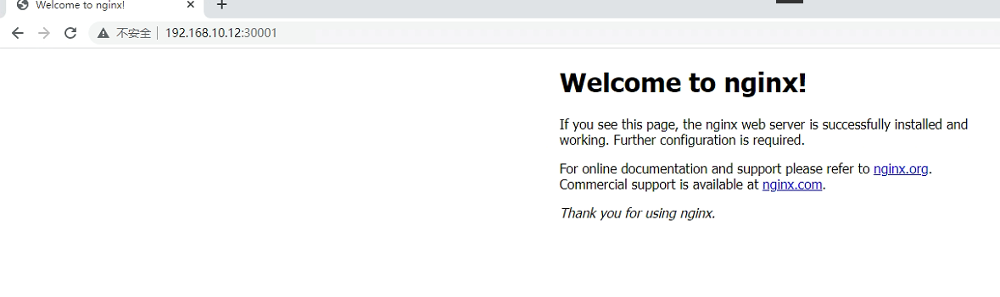