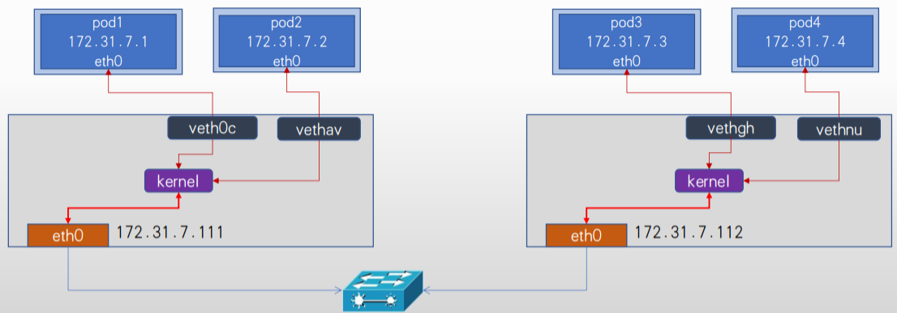
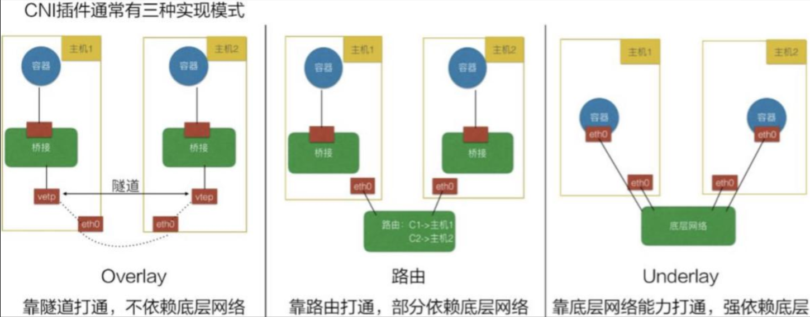
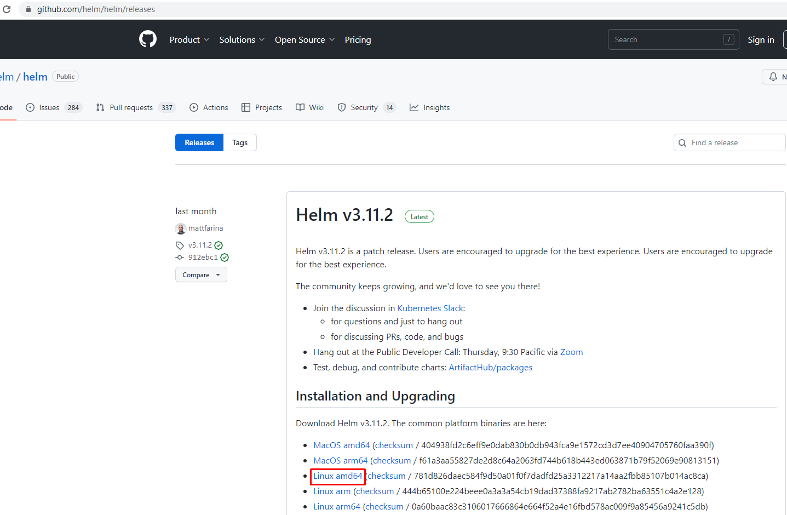
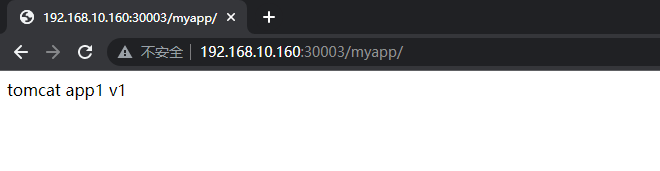
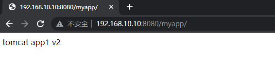
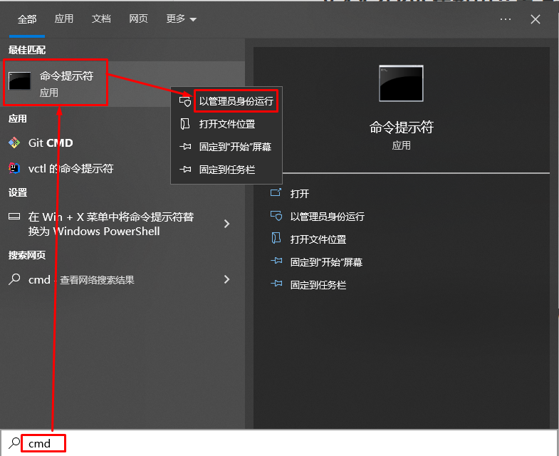
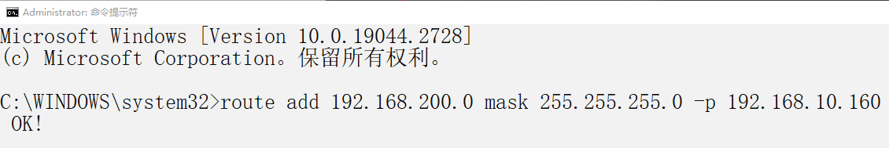
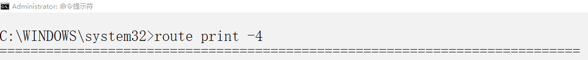
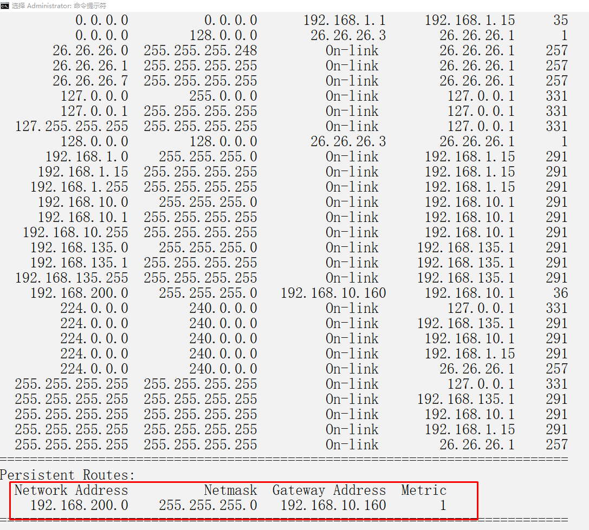
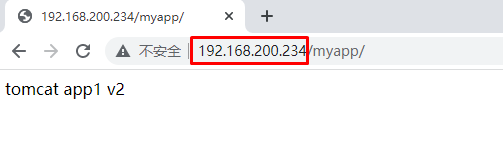

# k8s集群 underlay 网络方案 hybridnet

# 零、容器网络方案介绍

## 0.1 overlay 网络方案

基于VXLAN、 NVGRE等封装技术实现overlay叠加网络：

1、叠加网络/覆盖网络， 在物理网络的基础之上叠加实现新的虚拟网络， 即可使网络的中的容器可以相互通信。

2、优点是对物理网络的兼容性比较好， 可以实现pod的夸宿主机子网通信。

3、calico与flannel等网络插件都支持overlay网络。

4、缺点是有额外的封装与解封性能开销。

5、目前私有云使用比较多。

## 0.2 underlay网络方案

Underlay网络就是传统IT基础设施网络， 由交换机和路由器等设备组成， 借助以太网协议、 路由协议和VLAN协议等驱动， 它还是Overlay网络的底层网络， 为Overlay网络提供数据通信服务。 容器网络中的Underlay网络是指借助驱动程序将宿主机的底层网络接口直接暴露给容器使用的一种网络构建技术，较为常见的解决方案有MAC VLAN、 IP VLAN和直接路由等。

Underlay依赖于物理网络进行跨主机通信。

1、Mac Vlan模式：

MAC VLAN： 支持在同一个以太网接口上虚拟出多个网络接口(子接口)， 每个虚拟接口都拥有唯一的MAC地址并可配置网卡子接口IP，基于Docker宿主机物理网卡的不同子接口实现多个虚拟vlan，一个子接口就是一个虚拟vlan，容器通过宿主机的路由功能和外网保持通信。

2、IP VLAN模式：

IP VLAN类似于MAC VLAN， 它同样创建新的虚拟网络接口并为每个接口分配唯一的IP地址， 不同之处在于， 每个虚拟接口将共享使用物理接口的MAC地址。

## 0.3 K8S Pod通信简介

- Overlay网络：

Flannel Vxlan、 Calico BGP、 Calico Vxlan
将pod 地址信息封装在宿主机地址信息以内， 实现跨主机且可跨node子网的通信报文。

- 直接路由：

Flannel Host-gw、 Flannel VXLAN Directrouting、 Calico Directrouting
基于主机路由， 实现报文从源主机到目的主机的直接转发， 不需要进行报文的叠加封装， 性能比overlay更好。

- Underlay:

不需要为pod启用单独的虚拟机网络， 而是直接使用宿主机物理网络， pod甚至可以在k8s环境之外的节点直接访问(与node节点的网络被打通)， 相当于把pod当桥接模式的虚拟机使用， 比较方便k8s环境以外的访问访问k8s环境中的pod中的服务， 而且由于主机使用的宿主机网络， 其性能最好。

# 一、K8S集群部署

> 基于kubeadm部署K8S 1.26集群，pod network cidr为10.244.0.0/16，service为默认10.96.0.0/12

~~~powershell
方案1： 
pod可以选择overlay或者underlay， SVC使用overlay， 如果是underlay需要配置SVC使用宿主机的子网比如以下场景是overlay网络、 后期会用于overlay场景的pod， service会用于overlay的svc场景。
kubeadm init --apiserver-advertise-address=192.168.10.160 \
--apiserver-bind-port=6443 \
--kubernetes-version=v1.26.3 \
--pod-network-cidr=10.244.0.0/16 \
--service-cidr=10.96.0.0/12 \
--service-dns-domain=cluster.local \
--image-repository=registry.cn-hangzhou.aliyuncs.com/google_containers \
--cri-socket unix:///var/run/cri-dockerd.sock

--image-repository=“”为空则使用默认的google容器镜像仓库
--cri-socket  可以使用unix:///var/run/containerd/containerd.sock或unix:///var/run/cri-dockerd.sock
~~~

~~~powershell
方案2： 
pod可以选择overlay或者underlay， SVC使用underlay初始化
--pod-network-cidr=10.244.0.0/16会用于后期overlay的场景， underlay的网络CIDR后期单独指定， overlay会与underlay并存
--service-cidr=192.168.200.0/24用于后期的underlay svc， 通过SVC可以直接访问pod。
kubeadm init --apiserver-advertise-address=192.168.10.160 \
--apiserver-bind-port=6443 \
--kubernetes-version=v1.26.3 \
--pod-network-cidr=10.244.0.0/16 \
--service-cidr=192.168.200.0/24 \
--service-dns-domain=cluster.local \
--image-repository=registry.cn-hangzhou.aliyuncs.com/google_containers \
--cri-socket unix:///var/run/cri-dockerd.sock

--service-cidr= 与已存在的网段不能冲突
--image-repository=“”为空则使用默认的google容器镜像仓库
--cri-socket  可以使用unix:///var/run/containerd/containerd.sock或unix:///var/run/cri-dockerd.sock
~~~

# 二、Helm部署

> github链接：https://github.com/helm/helm/releases

~~~powershell
# wget https://get.helm.sh/helm-v3.11.2-linux-amd64.tar.gz
~~~

~~~powershell
[root@k8s-master01 ~]# ls
helm-v3.11.2-linux-amd64.tar.gz
[root@k8s-master01 ~]# tar xf helm-v3.11.2-linux-amd64.tar.gz
[root@k8s-master01 ~]# ls
 helm-v3.11.2-linux-amd64.tar.gz  linux-amd64 
 
[root@k8s-master01 ~]# ls linux-amd64/
helm  LICENSE  README.md
~~~

~~~powershell
[root@k8s-master01 ~]# mv linux-amd64/helm /usr/local/bin/helm
~~~

~~~powershell
[root@k8s-master01 ~]# helm version
version.BuildInfo{Version:"v3.11.2", GitCommit:"912ebc1cd10d38d340f048efaf0abda047c3468e", GitTreeState:"clean", GoVersion:"go1.18.10"}
~~~

# 三、部署hybridnet

~~~powershell
[root@k8s-master01 ~]# helm repo add hybridnet https://alibaba.github.io/hybridnet/
"hybridnet" has been added to your repositories
~~~

~~~powershell
[root@k8s-master01 ~]# helm repo list
NAME            URL
hybridnet       https://alibaba.github.io/hybridnet/
~~~

~~~powershell
[root@k8s-master01 ~]# helm repo update
Hang tight while we grab the latest from your chart repositories...
...Successfully got an update from the "hybridnet" chart repository
Update Complete. ⎈Happy Helming!⎈
~~~

~~~powershell
[root@k8s-master01 ~]# helm install hybridnet hybridnet/hybridnet -n kube-system --set init.cidr=10.244.0.0/16
~~~

~~~powershell
输出：
W0404 12:14:47.796075  111159 warnings.go:70] spec.template.spec.nodeSelector[beta.kubernetes.io/os]: deprecated since v1.14; use "kubernetes.io/os" instead
W0404 12:14:47.796100  111159 warnings.go:70] spec.template.metadata.annotations[scheduler.alpha.kubernetes.io/critical-pod]: non-functional in v1.16+; use the "priorityClassName" field instead
NAME: hybridnet
LAST DEPLOYED: Tue Apr  4 12:14:47 2023
NAMESPACE: kube-system
STATUS: deployed
REVISION: 1
TEST SUITE: None
~~~

~~~powershell
[root@k8s-master01 ~]# helm list -n kube-system
NAME            NAMESPACE       REVISION        UPDATED                                 STATUS          CHART           APP VERSION
hybridnet       kube-system     1               2023-04-04 12:14:47.158751157 +0800 CST deployed        hybridnet-0.6.0 0.8.0
~~~

~~~powershell
[root@k8s-master01 ~]# kubectl get pods -n kube-system
NAME                                   READY   STATUS    RESTARTS      AGE
calico-typha-c856d6bfd-7qnkk           1/1     Running   0             107s
calico-typha-c856d6bfd-l8nhw           1/1     Running   0             107s
calico-typha-c856d6bfd-slppp           1/1     Running   0             109s
coredns-787d4945fb-lfk42               1/1     Running   0             15h
coredns-787d4945fb-t8x2t               1/1     Running   0             15h
etcd-k8s-master01                      1/1     Running   0             15h
hybridnet-daemon-ls2rh                 1/2     Running   1 (19s ago)   114s
hybridnet-daemon-lxcb6                 1/2     Running   1 (70s ago)   114s
hybridnet-daemon-xp7t4                 1/2     Running   1 (30s ago)   114s
hybridnet-manager-55f5488b46-2x5qw     0/1     Pending   0             114s
hybridnet-manager-55f5488b46-ddpjw     0/1     Pending   0             109s
hybridnet-manager-55f5488b46-tx78h     0/1     Pending   0             109s
hybridnet-webhook-55d848f89c-8zrs2     0/1     Pending   0             114s
hybridnet-webhook-55d848f89c-9f9rf     0/1     Pending   0             114s
hybridnet-webhook-55d848f89c-q9xgn     0/1     Pending   0             114s
kube-apiserver-k8s-master01            1/1     Running   0             15h
kube-controller-manager-k8s-master01   1/1     Running   0             15h
kube-proxy-5v642                       1/1     Running   0             15h
kube-proxy-vnwhh                       1/1     Running   0             15h
kube-proxy-zgrj6                       1/1     Running   0             15h
kube-scheduler-k8s-master01            1/1     Running   0             15h
~~~

~~~powershell
此时hybridnet-manager、hybridnet-webhook pod Pending，通过describe查看发现集群没有节点打上master标签
~~~

~~~powershell
[root@k8s-master01 ~]# kubectl describe pods hybridnet-manager-55f5488b46-2x5qw -n kube-system
Name:                 hybridnet-manager-55f5488b46-2x5qw
Namespace:            kube-system
Priority:             2000000000
Priority Class Name:  system-cluster-critical
Service Account:      hybridnet
Node:                 <none>
Labels:               app=hybridnet
                      component=manager
                      pod-template-hash=55f5488b46
Annotations:          <none>
Status:               Pending
IP:
IPs:                  <none>
Controlled By:        ReplicaSet/hybridnet-manager-55f5488b46
Containers:
  hybridnet-manager:
    Image:      docker.io/hybridnetdev/hybridnet:v0.8.0
    Port:       9899/TCP
    Host Port:  9899/TCP
    Command:
      /hybridnet/hybridnet-manager
      --default-ip-retain=true
      --feature-gates=MultiCluster=false,VMIPRetain=false
      --controller-concurrency=Pod=1,IPAM=1,IPInstance=1
      --kube-client-qps=300
      --kube-client-burst=600
      --metrics-port=9899
    Environment:
      DEFAULT_NETWORK_TYPE:  Overlay
      DEFAULT_IP_FAMILY:     IPv4
      NAMESPACE:             kube-system (v1:metadata.namespace)
    Mounts:
      /var/run/secrets/kubernetes.io/serviceaccount from kube-api-access-ctkkr (ro)
Conditions:
  Type           Status
  PodScheduled   False
Volumes:
  kube-api-access-ctkkr:
    Type:                    Projected (a volume that contains injected data from multiple sources)
    TokenExpirationSeconds:  3607
    ConfigMapName:           kube-root-ca.crt
    ConfigMapOptional:       <nil>
    DownwardAPI:             true
QoS Class:                   BestEffort
Node-Selectors:              node-role.kubernetes.io/master=
Tolerations:                 :NoSchedule op=Exists
                             node.kubernetes.io/not-ready:NoExecute op=Exists for 300s
                             node.kubernetes.io/unreachable:NoExecute op=Exists for 300s
Events:
  Type     Reason            Age                    From               Message
  ----     ------            ----                   ----               -------
  Warning  FailedScheduling  3m32s (x2 over 3m34s)  default-scheduler  0/3 nodes are available: 3 node(s) didn't match Pod's node affinity/selector. preemption: 0/3 nodes are available: 3 Preemption is not helpful for scheduling..
~~~

~~~powershell
[root@k8s-master01 ~]# kubectl get node  --show-labels
NAME           STATUS   ROLES           AGE   VERSION   LABELS
k8s-master01   Ready    control-plane   15h   v1.26.3   beta.kubernetes.io/arch=amd64,beta.kubernetes.io/os=linux,kubernetes.io/arch=amd64,kubernetes.io/hostname=k8s-master01,kubernetes.io/os=linux,node-role.kubernetes.io/control-plane=,node.kubernetes.io/exclude-from-external-load-balancers=
k8s-worker01   Ready    <none>          15h   v1.26.3   beta.kubernetes.io/arch=amd64,beta.kubernetes.io/os=linux,kubernetes.io/arch=amd64,kubernetes.io/hostname=k8s-worker01,kubernetes.io/os=linux
k8s-worker02   Ready    <none>          15h   v1.26.3   beta.kubernetes.io/arch=amd64,beta.kubernetes.io/os=linux,kubernetes.io/arch=amd64,kubernetes.io/hostname=k8s-worker02,kubernetes.io/os=linux
~~~

~~~powershell
[root@k8s-master01 ~]# kubectl label node k8s-master01 node-role.kubernetes.io/master=
node/k8s-master01 labeled
~~~

~~~powershell
[root@k8s-master01 ~]# kubectl get nodes
NAME           STATUS   ROLES                  AGE   VERSION
k8s-master01   Ready    control-plane,master   15h   v1.26.3
k8s-worker01   Ready    <none>                 15h   v1.26.3
k8s-worker02   Ready    <none>                 15h   v1.26.3
~~~

~~~powershell
[root@k8s-master01 ~]# kubectl get node  --show-labels
NAME           STATUS   ROLES                  AGE   VERSION   LABELS
k8s-master01   Ready    control-plane,master   15h   v1.26.3   beta.kubernetes.io/arch=amd64,beta.kubernetes.io/os=linux,kubernetes.io/arch=amd64,kubernetes.io/hostname=k8s-master01,kubernetes.io/os=linux,networking.alibaba.com/overlay-network-attachment=true,node-role.kubernetes.io/control-plane=,node-role.kubernetes.io/master=,node.kubernetes.io/exclude-from-external-load-balancers=
k8s-worker01   Ready    <none>                 15h   v1.26.3   beta.kubernetes.io/arch=amd64,beta.kubernetes.io/os=linux,kubernetes.io/arch=amd64,kubernetes.io/hostname=k8s-worker01,kubernetes.io/os=linux,networking.alibaba.com/overlay-network-attachment=true
k8s-worker02   Ready    <none>                 15h   v1.26.3   beta.kubernetes.io/arch=amd64,beta.kubernetes.io/os=linux,kubernetes.io/arch=amd64,kubernetes.io/hostname=k8s-worker02,kubernetes.io/os=linux,networking.alibaba.com/overlay-network-attachment=true
~~~

~~~powershell
[root@k8s-master01 ~]# kubectl get pods -n kube-system -o wide
NAME                                   READY   STATUS    RESTARTS        AGE     IP               NODE           NOMINATED NODE   READINESS GATES
calico-typha-c856d6bfd-7qnkk           1/1     Running   0               9m17s   192.168.10.160   k8s-master01   <none>           <none>
calico-typha-c856d6bfd-l8nhw           1/1     Running   0               9m17s   192.168.10.161   k8s-worker01   <none>           <none>
calico-typha-c856d6bfd-slppp           1/1     Running   0               9m19s   192.168.10.162   k8s-worker02   <none>           <none>
coredns-787d4945fb-lfk42               1/1     Running   0               15h     10.88.0.3        k8s-master01   <none>           <none>
coredns-787d4945fb-t8x2t               1/1     Running   0               15h     10.88.0.2        k8s-master01   <none>           <none>
etcd-k8s-master01                      1/1     Running   0               15h     192.168.10.160   k8s-master01   <none>           <none>
hybridnet-daemon-ls2rh                 1/2     Running   1 (7m49s ago)   9m24s   192.168.10.161   k8s-worker01   <none>           <none>
hybridnet-daemon-lxcb6                 1/2     Running   1 (8m40s ago)   9m24s   192.168.10.162   k8s-worker02   <none>           <none>
hybridnet-daemon-xp7t4                 1/2     Running   1 (8m ago)      9m24s   192.168.10.160   k8s-master01   <none>           <none>
hybridnet-manager-55f5488b46-2x5qw     1/1     Running   0               9m24s   192.168.10.160   k8s-master01   <none>           <none>
hybridnet-manager-55f5488b46-ddpjw     0/1     Pending   0               9m19s   <none>           <none>         <none>           <none>
hybridnet-manager-55f5488b46-tx78h     0/1     Pending   0               9m19s   <none>           <none>         <none>           <none>
hybridnet-webhook-55d848f89c-8zrs2     0/1     Pending   0               9m24s   <none>           <none>         <none>           <none>
hybridnet-webhook-55d848f89c-9f9rf     1/1     Running   0               9m24s   192.168.10.160   k8s-master01   <none>           <none>
hybridnet-webhook-55d848f89c-q9xgn     0/1     Pending   0               9m24s   <none>           <none>         <none>           <none>
kube-apiserver-k8s-master01            1/1     Running   0               15h     192.168.10.160   k8s-master01   <none>           <none>
kube-controller-manager-k8s-master01   1/1     Running   0               15h     192.168.10.160   k8s-master01   <none>           <none>
kube-proxy-5v642                       1/1     Running   0               15h     192.168.10.160   k8s-master01   <none>           <none>
kube-proxy-vnwhh                       1/1     Running   0               15h     192.168.10.161   k8s-worker01   <none>           <none>
kube-proxy-zgrj6                       1/1     Running   0               15h     192.168.10.162   k8s-worker02   <none>           <none>
kube-scheduler-k8s-master01            1/1     Running   0               15h     192.168.10.160   k8s-master01   <none>           <none>
~~~

# 四、创建hybridnet网络

~~~powershell
[root@k8s-master01 ~]# mkdir /root/hybridnet
[root@k8s-master01 ~]# cd hybridnet/
[root@k8s-master01 hybridnet]#
~~~

~~~powershell
[root@k8s-master01 hybridnet]# kubectl label node k8s-master01 network=underlay-nethost
node/k8s-master01 labeled
[root@k8s-master01 hybridnet]# kubectl label node k8s-worker01 network=underlay-nethost
node/k8s-worker01 labeled
[root@k8s-master01 hybridnet]# kubectl label node k8s-worker02 network=underlay-nethost
node/k8s-worker02 labeled
~~~

~~~powershell
[root@k8s-master01 hybridnet]# kubectl get node --show-labels
NAME           STATUS   ROLES                  AGE   VERSION   LABELS
k8s-master01   Ready    control-plane,master   16h   v1.26.3   beta.kubernetes.io/arch=amd64,beta.kubernetes.io/os=linux,kubernetes.io/arch=amd64,kubernetes.io/hostname=k8s-master01,kubernetes.io/os=linux,network=underlay-nethost,networking.alibaba.com/overlay-network-attachment=true,node-role.kubernetes.io/control-plane=,node-role.kubernetes.io/master=,node.kubernetes.io/exclude-from-external-load-balancers=
k8s-worker01   Ready    <none>                 15h   v1.26.3   beta.kubernetes.io/arch=amd64,beta.kubernetes.io/os=linux,kubernetes.io/arch=amd64,kubernetes.io/hostname=k8s-worker01,kubernetes.io/os=linux,network=underlay-nethost,networking.alibaba.com/overlay-network-attachment=true
k8s-worker02   Ready    <none>                 15h   v1.26.3   beta.kubernetes.io/arch=amd64,beta.kubernetes.io/os=linux,kubernetes.io/arch=amd64,kubernetes.io/hostname=k8s-worker02,kubernetes.io/os=linux,network=underlay-nethost,networking.alibaba.com/overlay-network-attachment=true
~~~

~~~powershell
[root@k8s-master01 hybridnet]# vim 01-create-underlay-network.yaml
[root@k8s-master01 hybridnet]# cat 01-create-underlay-network.yaml
---
apiVersion: networking.alibaba.com/v1
kind: Network
metadata:
  name: underlay-network1
spec:
  netID: 0
  type: Underlay
  nodeSelector:
    network: "underlay-nethost"

---
apiVersion: networking.alibaba.com/v1
kind: Subnet
metadata:
  name: underlay-network1
spec:
  network: underlay-network1
  netID: 0
  range:
    version: "4"
    cidr: "192.168.10.0/24"
    gateway: "192.168.10.2"
    start: "192.168.10.10"
    end: "192.168.10.20"
~~~

~~~powershell
[root@k8s-master01 hybridnet]# kubectl create -f 01-create-underlay-network.yaml
~~~

~~~powershell
[root@k8s-master01 hybridnet]# kubectl get network
NAME                NETID   TYPE       MODE   V4TOTAL   V4USED   V4AVAILABLE   LASTALLOCATEDV4SUBNET   V6TOTAL   V6USED   V6AVAILABLE   LASTALLOCATEDV6SUBNET
init                4       Overlay           65534     2        65532         init                    0         0        0
underlay-network1   0       Underlay          11        0        11            underlay-network1       0         0        0
~~~

~~~powershell
[root@k8s-master01 hybridnet]# kubectl get subnet
NAME                VERSION   CIDR              START           END             GATEWAY        TOTAL   USED   AVAILABLE   NETID   NETWORK
init                4         10.244.0.0/16                                                    65534   2      65532               init
underlay-network1   4         192.168.10.0/24   192.168.10.10   192.168.10.20   192.168.10.2   11             11          0       underlay-network1
~~~

# 五、查看节点Labels信息

~~~powershell
[root@k8s-master01 hybridnet]# kubectl get nodes --show-labels
NAME           STATUS   ROLES                  AGE   VERSION   LABELS
k8s-master01   Ready    control-plane,master   16h   v1.26.3   beta.kubernetes.io/arch=amd64,beta.kubernetes.io/os=linux,kubernetes.io/arch=amd64,kubernetes.io/hostname=k8s-master01,kubernetes.io/os=linux,network=underlay-nethost,networking.alibaba.com/dualstack-address-quota=empty,networking.alibaba.com/ipv4-address-quota=nonempty,networking.alibaba.com/ipv6-address-quota=empty,networking.alibaba.com/overlay-network-attachment=true,networking.alibaba.com/underlay-network-attachment=true,node-role.kubernetes.io/control-plane=,node-role.kubernetes.io/master=,node.kubernetes.io/exclude-from-external-load-balancers=
k8s-worker01   Ready    <none>                 16h   v1.26.3   beta.kubernetes.io/arch=amd64,beta.kubernetes.io/os=linux,kubernetes.io/arch=amd64,kubernetes.io/hostname=k8s-worker01,kubernetes.io/os=linux,network=underlay-nethost,networking.alibaba.com/dualstack-address-quota=empty,networking.alibaba.com/ipv4-address-quota=nonempty,networking.alibaba.com/ipv6-address-quota=empty,networking.alibaba.com/overlay-network-attachment=true,networking.alibaba.com/underlay-network-attachment=true
k8s-worker02   Ready    <none>                 16h   v1.26.3   beta.kubernetes.io/arch=amd64,beta.kubernetes.io/os=linux,kubernetes.io/arch=amd64,kubernetes.io/hostname=k8s-worker02,kubernetes.io/os=linux,network=underlay-nethost,networking.alibaba.com/dualstack-address-quota=empty,networking.alibaba.com/ipv4-address-quota=nonempty,networking.alibaba.com/ipv6-address-quota=empty,networking.alibaba.com/overlay-network-attachment=true,networking.alibaba.com/underlay-network-attachment=true
~~~

~~~powershell
[root@k8s-master01 hybridnet]# kubectl describe nodes k8s-master01
Name:               k8s-master01
Roles:              control-plane,master
Labels:             beta.kubernetes.io/arch=amd64
                    beta.kubernetes.io/os=linux
                    kubernetes.io/arch=amd64
                    kubernetes.io/hostname=k8s-master01
                    kubernetes.io/os=linux
                    network=underlay-nethost
                    networking.alibaba.com/dualstack-address-quota=empty
                    networking.alibaba.com/ipv4-address-quota=nonempty
                    networking.alibaba.com/ipv6-address-quota=empty
                    networking.alibaba.com/overlay-network-attachment=true
                    networking.alibaba.com/underlay-network-attachment=true
                    node-role.kubernetes.io/control-plane=
                    node-role.kubernetes.io/master=
                    node.kubernetes.io/exclude-from-external-load-balancers=
Annotations:        kubeadm.alpha.kubernetes.io/cri-socket: unix:///var/run/containerd/containerd.sock
                    node.alpha.kubernetes.io/ttl: 0
                    projectcalico.org/IPv4Address: 192.168.10.160/24
                    projectcalico.org/IPv4VXLANTunnelAddr: 10.244.32.128
                    volumes.kubernetes.io/controller-managed-attach-detach: true
CreationTimestamp:  Mon, 03 Apr 2023 20:26:44 +0800
Taints:             node-role.kubernetes.io/control-plane:NoSchedule
Unschedulable:      false
Lease:
  HolderIdentity:  k8s-master01
  AcquireTime:     <unset>
  RenewTime:       Tue, 04 Apr 2023 12:35:31 +0800
Conditions:
  Type                 Status  LastHeartbeatTime                 LastTransitionTime                Reason                       Message
  ----                 ------  -----------------                 ------------------                ------                       -------
  NetworkUnavailable   False   Tue, 04 Apr 2023 11:59:24 +0800   Tue, 04 Apr 2023 11:59:24 +0800   CalicoIsUp                   Calico is running on this node
  MemoryPressure       False   Tue, 04 Apr 2023 12:31:18 +0800   Mon, 03 Apr 2023 20:26:39 +0800   KubeletHasSufficientMemory   kubelet has sufficient memory available
  DiskPressure         False   Tue, 04 Apr 2023 12:31:18 +0800   Mon, 03 Apr 2023 20:26:39 +0800   KubeletHasNoDiskPressure     kubelet has no disk pressure
  PIDPressure          False   Tue, 04 Apr 2023 12:31:18 +0800   Mon, 03 Apr 2023 20:26:39 +0800   KubeletHasSufficientPID      kubelet has sufficient PID available
  Ready                True    Tue, 04 Apr 2023 12:31:18 +0800   Mon, 03 Apr 2023 20:26:47 +0800   KubeletReady                 kubelet is posting ready status
Addresses:
  InternalIP:  192.168.10.160
  Hostname:    k8s-master01
Capacity:
  cpu:                4
  ephemeral-storage:  51175Mi
  hugepages-1Gi:      0
  hugepages-2Mi:      0
  memory:             4026120Ki
  pods:               110
Allocatable:
  cpu:                4
  ephemeral-storage:  48294789041
  hugepages-1Gi:      0
  hugepages-2Mi:      0
  memory:             3923720Ki
  pods:               110
System Info:
  Machine ID:                 f618107e5de3464bbfc77620a718fdd5
  System UUID:                B55A4D56-8EBB-7F7D-F774-2CAFA717C713
  Boot ID:                    289d296b-02fd-4135-a427-81143def0ed9
  Kernel Version:             3.10.0-1160.76.1.el7.x86_64
  OS Image:                   CentOS Linux 7 (Core)
  Operating System:           linux
  Architecture:               amd64
  Container Runtime Version:  containerd://1.7.0
  Kubelet Version:            v1.26.3
  Kube-Proxy Version:         v1.26.3
PodCIDR:                      10.244.0.0/24
PodCIDRs:                     10.244.0.0/24
Non-terminated Pods:          (11 in total)
  Namespace                   Name                                    CPU Requests  CPU Limits  Memory Requests  Memory Limits  Age
  ---------                   ----                                    ------------  ----------  ---------------  -------------  ---
  kube-system                 calico-typha-c856d6bfd-7qnkk            0 (0%)        0 (0%)      0 (0%)           0 (0%)         20m
  kube-system                 coredns-787d4945fb-lfk42                100m (2%)     0 (0%)      70Mi (1%)        170Mi (4%)     16h
  kube-system                 coredns-787d4945fb-t8x2t                100m (2%)     0 (0%)      70Mi (1%)        170Mi (4%)     16h
  kube-system                 etcd-k8s-master01                       100m (2%)     0 (0%)      100Mi (2%)       0 (0%)         16h
  kube-system                 hybridnet-daemon-xp7t4                  0 (0%)        0 (0%)      0 (0%)           0 (0%)         20m
  kube-system                 hybridnet-manager-55f5488b46-2x5qw      0 (0%)        0 (0%)      0 (0%)           0 (0%)         20m
  kube-system                 hybridnet-webhook-55d848f89c-9f9rf      0 (0%)        0 (0%)      0 (0%)           0 (0%)         20m
  kube-system                 kube-apiserver-k8s-master01             250m (6%)     0 (0%)      0 (0%)           0 (0%)         16h
  kube-system                 kube-controller-manager-k8s-master01    200m (5%)     0 (0%)      0 (0%)           0 (0%)         16h
  kube-system                 kube-proxy-5v642                        0 (0%)        0 (0%)      0 (0%)           0 (0%)         16h
  kube-system                 kube-scheduler-k8s-master01             100m (2%)     0 (0%)      0 (0%)           0 (0%)         16h
Allocated resources:
  (Total limits may be over 100 percent, i.e., overcommitted.)
  Resource           Requests    Limits
  --------           --------    ------
  cpu                850m (21%)  0 (0%)
  memory             240Mi (6%)  340Mi (8%)
  ephemeral-storage  0 (0%)      0 (0%)
  hugepages-1Gi      0 (0%)      0 (0%)
  hugepages-2Mi      0 (0%)      0 (0%)
Events:              <none>

~~~

~~~powershell
[root@k8s-master01 hybridnet]# kubectl describe nodes k8s-worker01
Name:               k8s-worker01
Roles:              <none>
Labels:             beta.kubernetes.io/arch=amd64
                    beta.kubernetes.io/os=linux
                    kubernetes.io/arch=amd64
                    kubernetes.io/hostname=k8s-worker01
                    kubernetes.io/os=linux
                    network=underlay-nethost
                    networking.alibaba.com/dualstack-address-quota=empty
                    networking.alibaba.com/ipv4-address-quota=nonempty
                    networking.alibaba.com/ipv6-address-quota=empty
                    networking.alibaba.com/overlay-network-attachment=true
                    networking.alibaba.com/underlay-network-attachment=true
Annotations:        kubeadm.alpha.kubernetes.io/cri-socket: unix:///var/run/containerd/containerd.sock
                    node.alpha.kubernetes.io/ttl: 0
                    projectcalico.org/IPv4Address: 192.168.10.161/24
                    projectcalico.org/IPv4VXLANTunnelAddr: 10.244.79.64
                    volumes.kubernetes.io/controller-managed-attach-detach: true
CreationTimestamp:  Mon, 03 Apr 2023 20:28:44 +0800
Taints:             <none>
Unschedulable:      false
Lease:
  HolderIdentity:  k8s-worker01
  AcquireTime:     <unset>
  RenewTime:       Tue, 04 Apr 2023 12:39:22 +0800
Conditions:
  Type                 Status  LastHeartbeatTime                 LastTransitionTime                Reason                       Message
  ----                 ------  -----------------                 ------------------                ------                       -------
  NetworkUnavailable   False   Tue, 04 Apr 2023 11:59:42 +0800   Tue, 04 Apr 2023 11:59:42 +0800   CalicoIsUp                   Calico is running on this node
  MemoryPressure       False   Tue, 04 Apr 2023 12:36:30 +0800   Mon, 03 Apr 2023 20:28:43 +0800   KubeletHasSufficientMemory   kubelet has sufficient memory available
  DiskPressure         False   Tue, 04 Apr 2023 12:36:30 +0800   Mon, 03 Apr 2023 20:28:43 +0800   KubeletHasNoDiskPressure     kubelet has no disk pressure
  PIDPressure          False   Tue, 04 Apr 2023 12:36:30 +0800   Mon, 03 Apr 2023 20:28:43 +0800   KubeletHasSufficientPID      kubelet has sufficient PID available
  Ready                True    Tue, 04 Apr 2023 12:36:30 +0800   Mon, 03 Apr 2023 20:28:47 +0800   KubeletReady                 kubelet is posting ready status
Addresses:
  InternalIP:  192.168.10.161
  Hostname:    k8s-worker01
Capacity:
  cpu:                4
  ephemeral-storage:  51175Mi
  hugepages-1Gi:      0
  hugepages-2Mi:      0
  memory:             4026128Ki
  pods:               110
Allocatable:
  cpu:                4
  ephemeral-storage:  48294789041
  hugepages-1Gi:      0
  hugepages-2Mi:      0
  memory:             3923728Ki
  pods:               110
System Info:
  Machine ID:                 f618107e5de3464bbfc77620a718fdd5
  System UUID:                7DD24D56-096D-7853-6E3E-0ED5FAB35AC3
  Boot ID:                    8f8f964d-a639-4a11-972d-043dca2f718e
  Kernel Version:             3.10.0-1160.76.1.el7.x86_64
  OS Image:                   CentOS Linux 7 (Core)
  Operating System:           linux
  Architecture:               amd64
  Container Runtime Version:  containerd://1.7.0
  Kubelet Version:            v1.26.3
  Kube-Proxy Version:         v1.26.3
PodCIDR:                      10.244.2.0/24
PodCIDRs:                     10.244.2.0/24
Non-terminated Pods:          (3 in total)
  Namespace                   Name                            CPU Requests  CPU Limits  Memory Requests  Memory Limits  Age
  ---------                   ----                            ------------  ----------  ---------------  -------------  ---
  kube-system                 calico-typha-c856d6bfd-l8nhw    0 (0%)        0 (0%)      0 (0%)           0 (0%)         24m
  kube-system                 hybridnet-daemon-ls2rh          0 (0%)        0 (0%)      0 (0%)           0 (0%)         24m
  kube-system                 kube-proxy-vnwhh                0 (0%)        0 (0%)      0 (0%)           0 (0%)         16h
Allocated resources:
  (Total limits may be over 100 percent, i.e., overcommitted.)
  Resource           Requests  Limits
  --------           --------  ------
  cpu                0 (0%)    0 (0%)
  memory             0 (0%)    0 (0%)
  ephemeral-storage  0 (0%)    0 (0%)
  hugepages-1Gi      0 (0%)    0 (0%)
  hugepages-2Mi      0 (0%)    0 (0%)
Events:              <none>

~~~

~~~powershell
[root@k8s-master01 hybridnet]# kubectl describe nodes k8s-worker02
Name:               k8s-worker02
Roles:              <none>
Labels:             beta.kubernetes.io/arch=amd64
                    beta.kubernetes.io/os=linux
                    kubernetes.io/arch=amd64
                    kubernetes.io/hostname=k8s-worker02
                    kubernetes.io/os=linux
                    network=underlay-nethost
                    networking.alibaba.com/dualstack-address-quota=empty
                    networking.alibaba.com/ipv4-address-quota=nonempty
                    networking.alibaba.com/ipv6-address-quota=empty
                    networking.alibaba.com/overlay-network-attachment=true
                    networking.alibaba.com/underlay-network-attachment=true
Annotations:        kubeadm.alpha.kubernetes.io/cri-socket: unix:///var/run/containerd/containerd.sock
                    node.alpha.kubernetes.io/ttl: 0
                    projectcalico.org/IPv4Address: 192.168.10.162/24
                    projectcalico.org/IPv4VXLANTunnelAddr: 10.244.69.192
                    volumes.kubernetes.io/controller-managed-attach-detach: true
CreationTimestamp:  Mon, 03 Apr 2023 20:28:39 +0800
Taints:             <none>
Unschedulable:      false
Lease:
  HolderIdentity:  k8s-worker02
  AcquireTime:     <unset>
  RenewTime:       Tue, 04 Apr 2023 12:39:49 +0800
Conditions:
  Type                 Status  LastHeartbeatTime                 LastTransitionTime                Reason                       Message
  ----                 ------  -----------------                 ------------------                ------                       -------
  NetworkUnavailable   False   Tue, 04 Apr 2023 12:00:08 +0800   Tue, 04 Apr 2023 12:00:08 +0800   CalicoIsUp                   Calico is running on this node
  MemoryPressure       False   Tue, 04 Apr 2023 12:36:02 +0800   Mon, 03 Apr 2023 20:28:39 +0800   KubeletHasSufficientMemory   kubelet has sufficient memory available
  DiskPressure         False   Tue, 04 Apr 2023 12:36:02 +0800   Mon, 03 Apr 2023 20:28:39 +0800   KubeletHasNoDiskPressure     kubelet has no disk pressure
  PIDPressure          False   Tue, 04 Apr 2023 12:36:02 +0800   Mon, 03 Apr 2023 20:28:39 +0800   KubeletHasSufficientPID      kubelet has sufficient PID available
  Ready                True    Tue, 04 Apr 2023 12:36:02 +0800   Mon, 03 Apr 2023 20:28:46 +0800   KubeletReady                 kubelet is posting ready status
Addresses:
  InternalIP:  192.168.10.162
  Hostname:    k8s-worker02
Capacity:
  cpu:                4
  ephemeral-storage:  51175Mi
  hugepages-1Gi:      0
  hugepages-2Mi:      0
  memory:             4026120Ki
  pods:               110
Allocatable:
  cpu:                4
  ephemeral-storage:  48294789041
  hugepages-1Gi:      0
  hugepages-2Mi:      0
  memory:             3923720Ki
  pods:               110
System Info:
  Machine ID:                 f618107e5de3464bbfc77620a718fdd5
  System UUID:                43224D56-1D27-9147-1CC6-B7FDBED96000
  Boot ID:                    86cbf2e5-324d-4457-8585-f599ddc38c7c
  Kernel Version:             3.10.0-1160.76.1.el7.x86_64
  OS Image:                   CentOS Linux 7 (Core)
  Operating System:           linux
  Architecture:               amd64
  Container Runtime Version:  containerd://1.7.0
  Kubelet Version:            v1.26.3
  Kube-Proxy Version:         v1.26.3
PodCIDR:                      10.244.1.0/24
PodCIDRs:                     10.244.1.0/24
Non-terminated Pods:          (3 in total)
  Namespace                   Name                            CPU Requests  CPU Limits  Memory Requests  Memory Limits  Age
  ---------                   ----                            ------------  ----------  ---------------  -------------  ---
  kube-system                 calico-typha-c856d6bfd-slppp    0 (0%)        0 (0%)      0 (0%)           0 (0%)         24m
  kube-system                 hybridnet-daemon-lxcb6          0 (0%)        0 (0%)      0 (0%)           0 (0%)         25m
  kube-system                 kube-proxy-zgrj6                0 (0%)        0 (0%)      0 (0%)           0 (0%)         16h
Allocated resources:
  (Total limits may be over 100 percent, i.e., overcommitted.)
  Resource           Requests  Limits
  --------           --------  ------
  cpu                0 (0%)    0 (0%)
  memory             0 (0%)    0 (0%)
  ephemeral-storage  0 (0%)    0 (0%)
  hugepages-1Gi      0 (0%)    0 (0%)
  hugepages-2Mi      0 (0%)    0 (0%)
Events:              <none>
~~~

# 六、创建pod使用overlay网络

~~~powershell
[root@k8s-master01 hybridnet]# vim 02-tomcat-app1-overlay.yaml
[root@k8s-master01 hybridnet]# cat 02-tomcat-app1-overlay.yaml
kind: Deployment
apiVersion: apps/v1
metadata:
  labels:
    app: myserver-tomcat-app1-deployment-overlay-label
  name: myserver-tomcat-app1-deployment-overlay
  namespace: myserver
spec:
  replicas: 1
  selector:
    matchLabels:
      app: myserver-tomcat-app1-overlay-selector
  template:
    metadata:
      labels:
        app: myserver-tomcat-app1-overlay-selector
    spec:
      containers:
      - name: myserver-tomcat-app1-container
        image: registry.cn-hangzhou.aliyuncs.com/zhangshijie/tomcat-app1:v1
        imagePullPolicy: IfNotPresent

        ports:
        - containerPort: 8080
          protocol: TCP
          name: http
        env:
        - name: "password"
          value: "123456"
        - name: "age"
          value: "18"

---
kind: Service
apiVersion: v1
metadata:
  labels:
    app: myserver-tomcat-app1-service-overlay-label
  name: myserver-tomcat-app1-service-overlay
  namespace: myserver
spec:
  type: NodePort
  ports:
  - name: http
    port: 80
    protocol: TCP
    targetPort: 8080
    nodePort: 30003
  selector:
    app: myserver-tomcat-app1-overlay-selector
~~~

~~~powershell
[root@k8s-master01 hybridnet]# kubectl create ns myserver
namespace/myserver created
~~~

~~~powershell
[root@k8s-master01 hybridnet]# kubectl create -f 02-tomcat-app1-overlay.yaml
deployment.apps/myserver-tomcat-app1-deployment-overlay created
service/myserver-tomcat-app1-service-overlay created
~~~

~~~powershell
[root@k8s-master01 hybridnet]# kubectl get pods -n myserver -o wide
NAME                                                        READY   STATUS    RESTARTS   AGE     IP              NODE           NOMINATED NODE   READINESS GATES
myserver-tomcat-app1-deployment-overlay-5bb44b6bf6-lnp68    1/1     Running   0          2m1s    10.244.0.17     k8s-worker02   <none>           <none>

~~~

~~~powershell
[root@k8s-master01 hybridnet]# kubectl get svc -n myserver
NAME                                   TYPE       CLUSTER-IP       EXTERNAL-IP   PORT(S)        AGE
myserver-tomcat-app1-service-overlay   NodePort   10.111.170.113   <none>        80:30003/TCP   40s
~~~

# 七、创建pod并使用underlay网络

~~~powershell
[root@k8s-master01 hybridnet]# vim 03-tomcat-app1-underlay.yaml
[root@k8s-master01 hybridnet]# cat 03-tomcat-app1-underlay.yaml
kind: Deployment
apiVersion: apps/v1
metadata:
  labels:
    app: myserver-tomcat-app1-deployment-underlay-label
  name: myserver-tomcat-app1-deployment-underlay
  namespace: myserver
spec:
  replicas: 1
  selector:
    matchLabels:
      app: myserver-tomcat-app1-underlay-selector
  template:
    metadata:
      labels:
        app: myserver-tomcat-app1-underlay-selector
      annotations:
        networking.alibaba.com/network-type: Underlay
    spec:
      containers:
      - name: myserver-tomcat-app1-container

        image: registry.cn-hangzhou.aliyuncs.com/zhangshijie/tomcat-app1:v2
        imagePullPolicy: IfNotPresent

        ports:
        - containerPort: 8080
          protocol: TCP
          name: http
        env:
        - name: "password"
          value: "123456"
        - name: "age"
          value: "18"

---
kind: Service
apiVersion: v1
metadata:
  labels:
    app: myserver-tomcat-app1-service-underlay-label
  name: myserver-tomcat-app1-service-underlay
  namespace: myserver
spec:
  ports:
  - name: http
    port: 80
    protocol: TCP
    targetPort: 8080
  selector:
    app: myserver-tomcat-app1-underlay-selector
~~~

~~~powershell
[root@k8s-master01 hybridnet]# kubectl create -f 03-tomcat-app1-underlay.yaml
deployment.apps/myserver-tomcat-app1-deployment-underlay created
service/myserver-tomcat-app1-service-underlay created
~~~

~~~powershell
[root@k8s-master01 hybridnet]# kubectl get pods -n myserver -o wide
NAME                                                        READY   STATUS    RESTARTS   AGE     IP              NODE           NOMINATED NODE   READINESS GATES
myserver-tomcat-app1-deployment-overlay-5bb44b6bf6-lnp68    1/1     Running   0          5m13s   10.244.0.17     k8s-worker02   <none>           <none>
myserver-tomcat-app1-deployment-underlay-7f65f45449-mvkj7   1/1     Running   0          10m     192.168.10.10   k8s-worker01   <none>           <none>
~~~

~~~powershell
[root@k8s-master01 hybridnet]# kubectl get svc -n myserver
NAME                                    TYPE        CLUSTER-IP       EXTERNAL-IP   PORT(S)        AGE
myserver-tomcat-app1-service-overlay    NodePort    10.111.170.113   <none>        80:30003/TCP   5m56s
myserver-tomcat-app1-service-underlay   ClusterIP   10.99.144.184    <none>        80/TCP         100s
~~~

~~~powershell
[root@k8s-master01 hybridnet]# curl http://192.168.10.10:8080/myapp/
tomcat app1 v2
~~~

# 八、创建service并使用underlay网络

## 8.1 K8S集群初始化注意事项

> 初始化完成后，把所有worker节点加入

~~~powershell
kubeadm init --apiserver-advertise-address=192.168.10.160 \
--apiserver-bind-port=6443 \
--kubernetes-version=v1.26.3 \
--pod-network-cidr=10.244.0.0/16 \
--service-cidr=192.168.200.0/24 \
--service-dns-domain=cluster.local \
--cri-socket unix:///var/run/containerd/containerd.sock
~~~

~~~powershell
--service-cidr=192.168.200.0/24 此位置指定的网段不能与本地已有网络冲突
~~~

~~~powershell
[root@k8s-master01 ~]# kubectl get svc
NAME         TYPE        CLUSTER-IP      EXTERNAL-IP   PORT(S)   AGE
kubernetes   ClusterIP   192.168.200.1   <none>        443/TCP   82m
~~~

~~~powershell
[root@k8s-master01 ~]# kubectl get svc -n kube-system
NAME                TYPE        CLUSTER-IP        EXTERNAL-IP   PORT(S)                  AGE
calico-typha        ClusterIP   192.168.200.249   <none>        5473/TCP                 79m
hybridnet-webhook   ClusterIP   192.168.200.149   <none>        443/TCP                  79m
kube-dns            ClusterIP   192.168.200.10    <none>        53/UDP,53/TCP,9153/TCP   83m
~~~

> k8s集群初始化成功后，必须先安装helm，再通过helm部署hybridnet后创建underlay网络。

## 8.2 创建underlay网络

~~~powershell
[root@k8s-master01 ~]# mkdir /root/hybridnet
[root@k8s-master01 ~]# cd hybridnet/
[root@k8s-master01 hybridnet]#
~~~

~~~powershell
[root@k8s-master01 hybridnet]# kubectl label node k8s-master01 network=underlay-nethost
node/k8s-master01 labeled
[root@k8s-master01 hybridnet]# kubectl label node k8s-worker01 network=underlay-nethost
node/k8s-worker01 labeled
[root@k8s-master01 hybridnet]# kubectl label node k8s-worker02 network=underlay-nethost
node/k8s-worker02 labeled
~~~

~~~powershell
[root@k8s-master01 hybridnet]# vim 01-underlay-network.yaml
[root@k8s-master01 hybridnet]# cat 01-underlay-network.yaml
---
apiVersion: networking.alibaba.com/v1
kind: Network
metadata:
  name: underlay-network1
spec:
  netID: 0
  type: Underlay
  nodeSelector:
    network: "underlay-nethost"

---
apiVersion: networking.alibaba.com/v1
kind: Subnet
metadata:
  name: underlay-network1
spec:
  network: underlay-network1
  netID: 0
  range:
    version: "4"
    cidr: "192.168.200.0/24"
    gateway: "192.168.200.254"
    start: "192.168.200.50"
    end: "192.168.200.200"
~~~

~~~powershell
[root@k8s-master01 hybridnet]# kubectl create -f 01-underlay-network.yaml
~~~

~~~powershell
[root@k8s-master01 hybridnet]# kubectl get network
NAME                NETID   TYPE       MODE   V4TOTAL   V4USED   V4AVAILABLE   LASTALLOCATEDV4SUBNET   V6TOTAL   V6USED   V6AVAILABLE   LASTALLOCATEDV6SUBNET
init                4       Overlay           65534     3        65531         init                    0         0        0
underlay-network1   0       Underlay          151       0        151           underlay-network1       0         0        0
~~~

~~~powershell
[root@k8s-master01 hybridnet]# kubectl get subnet
NAME                VERSION   CIDR               START            END               GATEWAY           TOTAL   USED   AVAILABLE   NETID   NETWORK
init                4         10.244.0.0/16                                                           65534   3      65531               init
underlay-network1   4         192.168.200.0/24   192.168.200.50   192.168.200.200   192.168.200.254   151            151         0       underlay-network1
~~~

## 8.3 创建service使用underlay网络

~~~powershell
[root@k8s-master01 hybridnet]# vim 02-service-underlay.yaml
[root@k8s-master01 hybridnet]# cat 02-service-underlay.yaml
kind: Deployment
apiVersion: apps/v1
metadata:
  labels:
    app: myserver-tomcat-app1-deployment-underlay-label
  name: myserver-tomcat-app1-deployment-underlay
  namespace: myserver
spec:
  replicas: 1
  selector:
    matchLabels:
      app: myserver-tomcat-app1-underlay-selector
  template:
    metadata:
      labels:
        app: myserver-tomcat-app1-underlay-selector
    spec:
      containers:
      - name: myserver-tomcat-app1-container

        image: registry.cn-hangzhou.aliyuncs.com/zhangshijie/tomcat-app1:v2
        imagePullPolicy: IfNotPresent

        ports:
        - containerPort: 8080
          protocol: TCP
          name: http
        env:
        - name: "password"
          value: "123456"
        - name: "age"
          value: "18"

---
kind: Service
apiVersion: v1
metadata:
  labels:
    app: myserver-tomcat-app1-service-underlay-label
  name: myserver-tomcat-app1-service-underlay
  namespace: myserver
  annotations:
    networking.alibaba.com/network-type: Underlay 重点注意这里
spec:
  ports:
  - name: http
    port: 80
    protocol: TCP
    targetPort: 8080
  selector:
    app: myserver-tomcat-app1-underlay-selector
~~~

~~~powershell
[root@k8s-master01 hybridnet]# kubectl create ns myserver
~~~

~~~powershell
[root@k8s-master01 hybridnet]# kubectl create -f 02-service-underlay.yaml
~~~

~~~powershell
[root@k8s-master01 hybridnet]# kubectl get pods -n myserver -o wide
NAME                                                        READY   STATUS    RESTARTS   AGE   IP           NODE           NOMINATED NODE   READINESS GATES
myserver-tomcat-app1-deployment-underlay-849f7f9cf5-x48x8   1/1     Running   0          13m   10.244.0.3   k8s-worker02   <none>           <none>

~~~

~~~powershell
[root@k8s-master01 hybridnet]# kubectl get svc -n myserver -o wide
NAME                                    TYPE        CLUSTER-IP        EXTERNAL-IP   PORT(S)   AGE   SELECTOR
myserver-tomcat-app1-service-underlay   ClusterIP   192.168.200.234   <none>        80/TCP    61m   app=myserver-tomcat-app1-underlay-selector
~~~

## 8.4 访问

### 8.4.1 在K8S集群内节点上访问

~~~powershell
[root@k8s-master01 hybridnet]# curl http://10.244.0.3:8080/myapp/
tomcat app1 v2
~~~

~~~powershell
[root@k8s-master01 hybridnet]# curl http://192.168.200.234/myapp/
tomcat app1 v2
~~~

### 8.4.2 在K8S集群外windows主机上访问

~~~powershell
C:\WINDOWS\system32>route add 192.168.200.0 mask 255.255.255.0 -p 192.168.10.160
说明：
去往192.168.200.0/24网段通过192.168.10.160，这个192.168.10.160为k8s集群节点IP地址。
~~~

