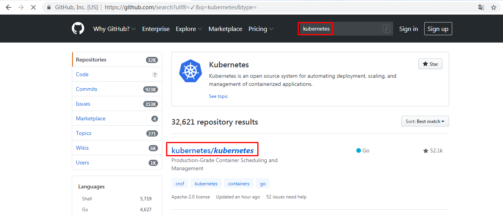
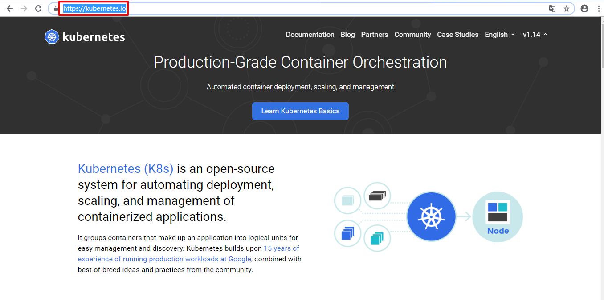

# Kubernetes介绍与集群架构

# 一、认识容器编排工具

- docker machine
  - 主要用于准备docker host
  - 现已弃用
  - 建议使用docker desktop
- docker compose
  - Compose 是一个用于定义和运行多容器 Docker 应用程序的工具。
  - 使用 Compose，您可以使用 YAML 文件来配置应用程序的服务。
  - 使用一个命令，您可以从您的配置中创建并启动所有服务。
- docker swarm
  - 内置于docker引擎中
  - 对docker引擎进行集群级别的管理
- 分布式设计，可以让集群资源更多，管理更多的主机
  - 声明式服务模型，通过YAML文件定义应用程序服务所需状态
  - 服务规模可扩大可缩小，保持用户期望状态
  - 服务发现
  - 负载均衡
  - 滚动更新等
  - docker service
  - docker stack
- kubernetes
  - Kubernetes作为一个容器集群管理系统，用于管理容器云平台中多个主机上的容器应用，Kubernetes的目标是让部署容器化的应用变得简单且高效，所以 Kubernetes 提供了应用部署，规划，更新，维护的一整套完整的机制。
  - Kubernetes没有固定要求容器的格式，但是Kubernetes使用它自己的API和命令行接口来进行容器编排。
  - 除了Docker容器之外，Kubernetes还支持其他多种容器，如 Containerd、rkt、CoreOS 等。
  - Kubernetes 是自成体系的管理工具，可以实现容器调度，资源管理，服务发现，健康检查，自动伸缩，更新升级等，也可以在应用模版配置中指定副本数量，服务要求（IO 优先；性能优先等），资源使用区间，标签（Labels等）来匹配特定要求达到预期状态等，这些特征便足以征服开发者，再加上 Kubernetes 有一个非常活跃的社区。它为用户提供了更多的选择以方便用户扩展编排容器来满足他们的需求。但是由于 Kubernetes 使用了自己的 API 接口，所以命令系统是另外一套系统，这也是 kubernetes 应用门槛比较高的原因所在。
- mesos+marathon
  - Apache Mesos 是一个分布式系统内核的开源集群管理器，Apache Mesos 的出现要远早于 Docker Swarm 和 Kubernetes。
  - 其结合Marathon 这个基于容器的应用程序的编排框架，它为 Docker Swarm 和 Kubernetes 提供了一个有效的替代方案。
  - Mesos 能够在同样的集群机器上运行多种分布式系统类型，可以更加动态高效的共享资源。
  - Messos 也提供服务失败检查，服务发布，服务跟踪，服务监控，资源管理和资源共享。
  -  Messos 可以扩展伸缩到数千个节点。
  - 如果你拥有很多的服务器而且想构建一个大的集群的时候，Mesos 就派上用场了。
  - 很多的现代化可扩展性的数据处理应用都可以在 Mesos 上运行，包括大数据框架 Hadoop、Kafka、Spark。
  - 但是大而全，往往就是对应的复杂和困难，这一点体现在 Messos 上是完全正确，与Docker 和 Docker Swarm 使用同一种 API 不同的，Mesos 和 Marathon 都有自己的 API，这使得它们比其他编排系统更加的复杂。Apache Mesos 是混合环境的完美编配工具，由于它包含容器和非容器的应用，虽然 Messos 很稳定，但是它的使用户快速学习应用变得更加困难，这也是在应用和部署场景下难于推广的原因之一。

| 分布式资源管理框架 | 主要特点                                       | 备注                       |
| ------------------ | ---------------------------------------------- | -------------------------- |
| Apache Mesos       | 功能强大，但系统复杂不易用                     | 2019年Twitter宣布弃用      |
| Docker Swarm       | 集成在docker引擎中，不需要单独安装，但功能较少 | 2019年阿里云宣布弃用       |
| Google Kubernetes  | 功能强大，但学习成本与管理成本高               | 目前没有替代者，多领域应用 |

# 二、认识kubernetes

## 2.1 kubernetes含义、起源、归属

### 2.1.1 含义

希腊语：舵手、飞行员

### 2.1.2 起源

- 源自于谷歌Borg

- 使用golang语言开发

- 简称为k8s

### 2.1.3 归属

现归属于CNCF

- 云原生(CloudNative)计算基金会

- 是一个开源软件基金会，致力于使云计算普遍性和持续性

- 官方：http://www.cncf.io

## 2.2 kubernetes版本

- 2014年9月第一个正式版本
- 2015年7月1.0版本正式发布
- 现在稳定版本为1.23
- 主要贡献者：Google,Redhat,Microsoft,IBM,Intel
- 代码托管github:<https://github.com/kubernetes/>

## 2.3 Kubernetes用户

- 2017年docker官方宣布原生支持kubernetes
- RedHat公司  PaaS平台  OpenShift核心是kubernetes
- Rancher平台核心是kubernetes
- 现国内大多数公司都可使用kubernetes进行传统IT服务转换，以实现高效管理等。

## 2.4 Kubernetes网址

- 官方网址

https://kubernetes.io/

https://kubernetes.io/zh/

- 中文社区

# 三、kubernetes架构

## 3.1 软件架构说明

- 有中心节点分布式架构
  - hadoop集群
  - ceph集群
- 无中心节点分布式架构
  - glusterFS

- kubernetes是具有中心节点的分布式架构,也就是说有master管理节点
  - Master Node
    - 中心节点
    - manager
    - 简单叫法
      - master节点
  - Minion Node
    - 工作节点
    - worker
    - 简单叫点
      - node节点
      - worker节点

## 3.2 Kubernetes架构图示图

# 四、Kubernetes集群节点组件

## 4.1 Master节点组件

master节点是集群管理中心，它的组件可以在集群内任意节点运行，但是为了方便管理所以会在一台主机上运行Master所有组件，**并且不在此主机上运行用户容器**

Master组件包括：

- kube-apiserver

​      用于暴露kubernetes API，任何的资源请求/调用操作都是通过kube-apiserver提供的接口进行。

- kube-controller-manager

​      控制器管理器，用于对控制器进行管理，它们是集群中处理常规任务的后台线程。

- kube-scheduler 
  
  监视新创建没有分配到Node的Pod，为Pod选择一个Node运行。
  
  
  
- ETCD
  
  是kubernetes提供默认的存储系统，保存所有集群数据。
  
  

## 4.2 Node节点组件介绍

node节点用于运行以及维护Pod, 管理volume(CVI)和网络(CNI)，维护pod及service等信息

Node组件包括：
- kubelet 
  - 负责维护容器的生命周期(创建pod，销毁pod)，同时也负责Volume(CVI)和网络(CNI)的管理
- kube-proxy 
  - 通过在主机上维护网络规则并执行连接转发来实现service(iptables/ipvs)
  - 随时与apiserver通信，把Service或Pod改变提交给apiserver，保存至etcd（可做高可用集群）中，负责service实现，从内部pod至service和从外部node到service访问。
- Container Runtime
  - 容器运行时(Container Runtime)
  - 负责镜像管理以及Pod和容器的真正运行
  - 支持docker/containerd/Rkt/Pouch/Kata等多种运行时

## 4.3 Add-ons介绍

Add-ons(附件)使功能更丰富，没它并不影响实际使用，可以与主体程序很好结合起来使用

- coredns/kube-dns:  负责为整个集群提供DNS服务
- Ingress Controller 为服务提供集群外部访问
- Heapster/Metries-server 提供集群资源监控(监控容器可以使用prometheus)
- Dashboard 提供集群GUI
- Federation 提供跨可用区的集群
- Fluentd-elasticsearch 提供集群日志采集、存储与查询

