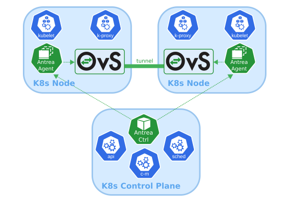
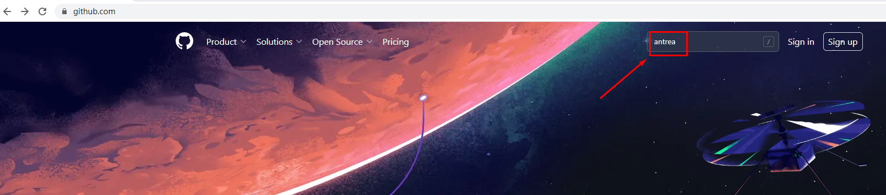
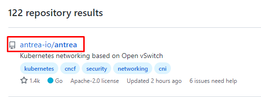
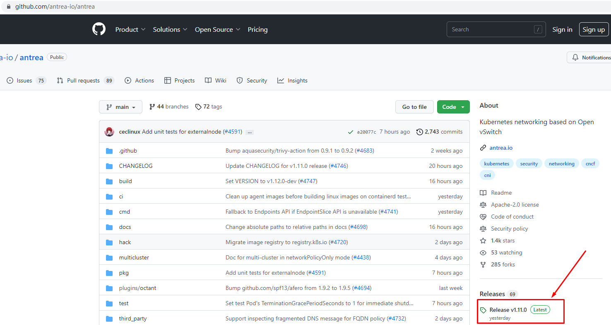
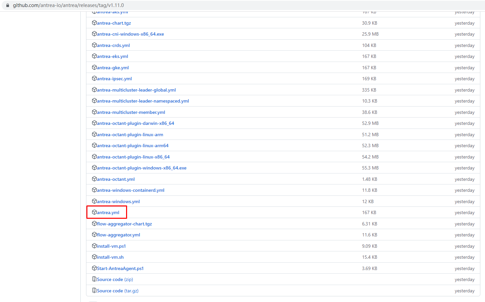
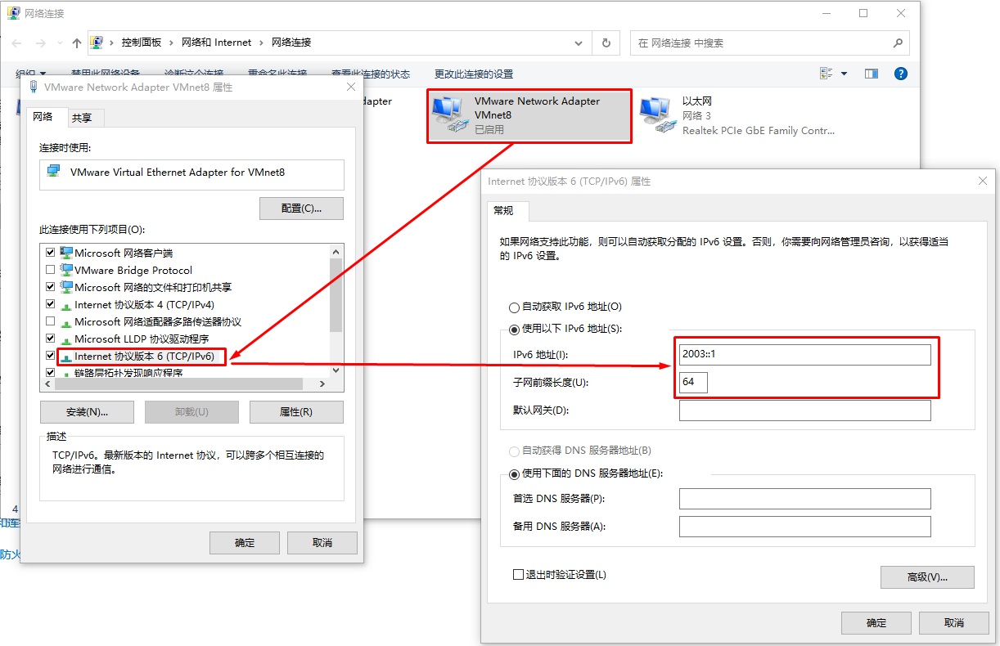
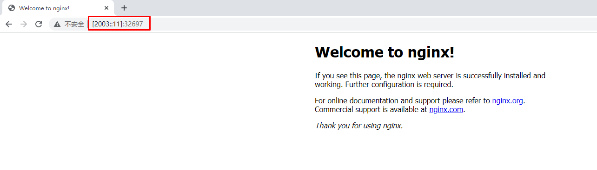

# K8S 1.22版本双栈协议（IPv4&IPv6）集群部署

# 一、部署说明

> 此笔记主要针对 k8s 1.22，其它版本请自行测试使用。
>
> 必须使用Open vSwitch功能。

# 二、主机准备

## 2.1 主机名配置

由于本次使用3台主机完成kubernetes集群部署，其中1台为master节点,名称为k8s-master01;其中2台为worker节点，名称分别为：k8s-worker01及k8s-worker02

~~~powershell
master节点
# hostnamectl set-hostname k8s-master01
~~~

~~~powershell
worker01节点
# hostnamectl set-hostname k8s-worker01
~~~

~~~powershell
worker02节点
# hostnamectl set-hostname k8s-worker02
~~~

## 2.2 主机IP地址配置

### 2.2.1 k8s-master节点

~~~powershell
[root@k8s-master01 ~]# vim /etc/sysconfig/network-scripts/ifcfg-ens33 
[root@k8s-master01 ~]# cat /etc/sysconfig/network-scripts/ifcfg-ens33
TYPE="Ethernet"
PROXY_METHOD="none"
BROWSER_ONLY="no"
BOOTPROTO="none"
DEFROUTE="yes"
IPV4_FAILURE_FATAL="no"
NAME="ens33"
UUID="063bfc1c-c7c2-4c62-89d0-35ae869e44e7"
DEVICE="ens33"
ONBOOT="yes"
IPADDR="192.168.10.160"
PREFIX="24"
GATEWAY="192.168.10.2"
DNS1="119.29.29.29"
IPV6INIT="yes"
IPV6_AUTOCONF="no"
IPV6_DEFROUTE="yes"
IPV6_FAILURE_FATAL="no"
IPV6_ADDR_GEN_MODE="stable-privacy"
IPV6ADDR=2003::11/64
IPV6_DEFAULTGW=2003::1
~~~

~~~powershell
[root@k8s-master01 ~]# systemctl restart network

~~~

~~~powershell
[root@k8s-master01 ~]# ip a s
~~~

### 2.2.2 k8s-worker01节点

~~~powershell
[root@k8s-worker01 ~]# vim /etc/sysconfig/network-scripts/ifcfg-ens33 
[root@k8s-worker01 ~]# cat /etc/sysconfig/network-scripts/ifcfg-ens33
TYPE="Ethernet"
PROXY_METHOD="none"
BROWSER_ONLY="no"
BOOTPROTO="none"
DEFROUTE="yes"
IPV4_FAILURE_FATAL="no"
NAME="ens33"
UUID="063bfc1c-c7c2-4c62-89d0-35ae869e44e7"
DEVICE="ens33"
ONBOOT="yes"
IPADDR="192.168.10.161"
PREFIX="24"
GATEWAY="192.168.10.2"
DNS1="119.29.29.29"
IPV6INIT="yes"
IPV6_AUTOCONF="no"
IPV6_DEFROUTE="yes"
IPV6_FAILURE_FATAL="no"
IPV6_ADDR_GEN_MODE="stable-privacy"
IPV6ADDR=2003::12/64
IPV6_DEFAULTGW=2003::1
~~~

~~~powershell
[root@k8s-worker01 ~]# systemctl restart network

~~~

~~~powershell
[root@k8s-worker01 ~]# ip a s
~~~

### 2.2.3 k8s-worker02节点

~~~powershell
[root@k8s-worker02 ~]# vim /etc/sysconfig/network-scripts/ifcfg-ens33 
[root@k8s-worker02 ~]# cat /etc/sysconfig/network-scripts/ifcfg-ens33
TYPE="Ethernet"
PROXY_METHOD="none"
BROWSER_ONLY="no"
BOOTPROTO="none"
DEFROUTE="yes"
IPV4_FAILURE_FATAL="no"
NAME="ens33"
UUID="063bfc1c-c7c2-4c62-89d0-35ae869e44e7"
DEVICE="ens33"
ONBOOT="yes"
IPADDR="192.168.10.162"
PREFIX="24"
GATEWAY="192.168.10.2"
DNS1="119.29.29.29"
IPV6INIT="yes"
IPV6_AUTOCONF="no"
IPV6_DEFROUTE="yes"
IPV6_FAILURE_FATAL="no"
IPV6_ADDR_GEN_MODE="stable-privacy"
IPV6ADDR=2003::13/64
IPV6_DEFAULTGW=2003::1
~~~

~~~powershell
[root@k8s-worker02 ~]# systemctl restart network

~~~

~~~powershell
[root@k8s-worker02 ~]# ip a s
~~~

### 2.2.4 在k8s-master上ping通ipv6地址

~~~powershell
[root@k8s-master01 ~]# ping6 -c 4 2003::11
PING 2003::11(2003::11) 56 data bytes
64 bytes from 2003::11: icmp_seq=1 ttl=64 time=0.030 ms
64 bytes from 2003::11: icmp_seq=2 ttl=64 time=0.065 ms
64 bytes from 2003::11: icmp_seq=3 ttl=64 time=0.037 ms
64 bytes from 2003::11: icmp_seq=4 ttl=64 time=0.030 ms

--- 2003::11 ping statistics ---
4 packets transmitted, 4 received, 0% packet loss, time 3083ms
rtt min/avg/max/mdev = 0.030/0.040/0.065/0.015 ms
~~~

~~~powershell
[root@k8s-master01 ~]# ping6 -c 4 2003::12
PING 2003::12(2003::12) 56 data bytes
64 bytes from 2003::12: icmp_seq=1 ttl=64 time=0.323 ms
64 bytes from 2003::12: icmp_seq=2 ttl=64 time=0.557 ms
64 bytes from 2003::12: icmp_seq=3 ttl=64 time=0.552 ms
64 bytes from 2003::12: icmp_seq=4 ttl=64 time=1.30 ms

--- 2003::12 ping statistics ---
4 packets transmitted, 4 received, 0% packet loss, time 3050ms
rtt min/avg/max/mdev = 0.323/0.685/1.308/0.371 ms
~~~

~~~powershell
[root@k8s-master01 ~]# ping6 -c 4 2003::13
PING 2003::13(2003::13) 56 data bytes
64 bytes from 2003::13: icmp_seq=1 ttl=64 time=0.370 ms
64 bytes from 2003::13: icmp_seq=2 ttl=64 time=0.348 ms
64 bytes from 2003::13: icmp_seq=3 ttl=64 time=0.491 ms
64 bytes from 2003::13: icmp_seq=4 ttl=64 time=0.497 ms

--- 2003::13 ping statistics ---
4 packets transmitted, 4 received, 0% packet loss, time 3059ms
rtt min/avg/max/mdev = 0.348/0.426/0.497/0.071 ms
~~~

## 2.3 主机名解析

~~~powershell
# vim /etc/hosts
# cat /etc/hosts
127.0.0.1   localhost localhost.localdomain localhost4 localhost4.localdomain4
::1         localhost localhost.localdomain localhost6 localhost6.localdomain6
192.168.10.160 k8s-master01
192.168.10.161 k8s-worker01
192.168.10.162 k8s-worker02
2003::11 k8s-master01
2003::12 k8s-worker01
2003::13 k8s-worker02
~~~

## 2.4 主机安全设置

> 所有主机均需操作。

~~~powershell
# systemctl stop firewalld && systemctl disable firewalld
~~~

~~~powershell
# sed -ri 's/SELINUX=enforcing/SELINUX=disabled/' /etc/selinux/config
~~~

## 2.5 升级操作系统内核

> 所有主机均需要操作。

~~~powershell
导入elrepo gpg key
# rpm --import https://www.elrepo.org/RPM-GPG-KEY-elrepo.org
~~~

~~~powershell
安装elrepo YUM源仓库
# yum -y install https://www.elrepo.org/elrepo-release-7.0-4.el7.elrepo.noarch.rpm
~~~

~~~powershell
安装kernel-ml版本，ml为长期稳定版本，lt为长期维护版本
# yum --enablerepo="elrepo-kernel" -y install kernel-lt.x86_64
~~~

~~~powershell
设置grub2默认引导为0
# grub2-set-default 0
~~~

~~~powershell
重新生成grub2引导文件
# grub2-mkconfig -o /boot/grub2/grub.cfg
~~~

~~~powershell
更新后，需要重启，使用升级的内核生效。
# reboot
~~~

~~~powershell
重启后，需要验证内核是否为更新对应的版本
# uname -r
~~~

#### 2.6   配置内核转发及网桥过滤

>所有主机均需要操作。

~~~powershell
添加网桥过滤及内核转发配置文件
# cat /etc/sysctl.d/k8s.conf
net.bridge.bridge-nf-call-ip6tables = 1
net.bridge.bridge-nf-call-iptables = 1
vm.swappiness = 0
~~~

~~~powershell
加载br_netfilter模块
# modprobe br_netfilter
~~~

~~~powershell
查看是否加载
# lsmod | grep br_netfilter
br_netfilter           22256  0
bridge                151336  1 br_netfilter
~~~

## 2.7 调整主机内核参数

~~~powershell
# vim /etc/sysctl.conf
添加如下内容：
net.ipv4.ip_forward = 1
net.ipv6.conf.all.forwarding = 1
net.ipv4.ip_nonlocal_bind = 1
~~~

~~~powershell
使其生效
# sysctl -p /etc/sysctl.conf
~~~

## 2.8 主机时钟同步设置

~~~powershell
# crontab -e
0 */1 * * * ntpdate time1.aliyun.com
~~~

## 2.9 主机swap分区设置

~~~powershell
临时关闭
# swapoff -a
~~~

~~~powershell
永远关闭swap分区，需要重启操作系统
# cat /etc/fstab
......

# /dev/mapper/centos-swap swap                    swap    defaults        0 0

在上一行中行首添加#
~~~

## 2.10 Open vSwitch

> 下载地址链接：http://www.openvswitch.org/download/
>
> OVS

~~~powershell
安装依赖
# yum -y install openssl openssl-devel
~~~

~~~powershell
查看是否存在python3
# yum list python3
~~~

~~~powershell
安装依赖
# yum install python3 python3-devel -y
~~~

~~~powershell
下载软件源码包
#  wget https://www.openvswitch.org/releases/openvswitch-2.16.2.tar.gz
~~~

~~~powershell
解压
# tar -xf openvswitch-2.16.2.tar.gz
~~~

~~~powershell
# cd openvswitch-2.16.2/
~~~

~~~powershell
[root@k8s-XXX openvswitch-2.16.2]# ./configure
~~~

~~~powershell
[root@k8s-XXX openvswitch-2.16.2]# make
~~~

~~~powershell
[root@k8s-XXX openvswitch-2.16.2]# make install
~~~

~~~powershell
加载模块至内核
# modprobe openvswitch
# lsmod | grep openvswitch
openvswitch           139264  2
nsh                    16384  1 openvswitch
nf_conncount           24576  1 openvswitch
nf_nat                 45056  5 ip6table_nat,xt_nat,openvswitch,iptable_nat,xt_MASQUERADE
nf_conntrack          147456  8 xt_conntrack,nf_nat,nfnetlink_cttimeout,xt_nat,openvswitch,nf_conntrack_netlink,nf_conncount,xt_MASQUERADE
nf_defrag_ipv6         24576  2 nf_conntrack,openvswitch
libcrc32c              16384  4 nf_conntrack,nf_nat,openvswitch,xfs
~~~

# 三、Docker安装

## 3.1 Docker安装YUM源准备

>使用阿里云开源软件镜像站。

~~~powershell
# wget https://mirrors.aliyun.com/docker-ce/linux/centos/docker-ce.repo -O /etc/yum.repos.d/docker-ce.repo
~~~

## 3.2  Docker安装

~~~powershell
# yum -y install docker-ce-20.10.17 docke-ce-cli-20.10.17
~~~

## 3.3 启动Docker服务

~~~powershell
# systemctl enable --now docker
~~~

## 3.4  修改cgroup方式

>/etc/docker/daemon.json 默认没有此文件，需要单独创建

~~~powershell
在/etc/docker/daemon.json添加如下内容

# cat /etc/docker/daemon.json
{
        "exec-opts": ["native.cgroupdriver=systemd"]
}
~~~

~~~powershell
# systemctl restart docker
~~~

# 四、k8s软件安装

## 4.1 YUM源准备

~~~powershell
# vim /etc/yum.repos.d/k8s.repo
# cat /etc/yum.repos.d/k8s.repo
[kubernetes]
name=Kubernetes
baseurl=https://mirrors.aliyun.com/kubernetes/yum/repos/kubernetes-el7-x86_64/
enabled=1
gpgcheck=0
repo_gpgcheck=0
gpgkey=https://mirrors.aliyun.com/kubernetes/yum/doc/yum-key.gpg https://mirrors.aliyun.com/kubernetes/yum/doc/rpm-package-key.gpg
~~~

## 4.2 K8S软件安装及kubelet配置

### 4.2.1 软件安装

~~~powershell
# yum -y install kubeadm-1.22.11-0 kubelet-1.22.11-0 kubectl-1.22.11-0
~~~

### 4.2.2 kubelet配置

>为了实现docker使用的cgroupdriver与kubelet使用的cgroup的一致性，建议修改如下文件内容。

~~~powershell
# vim /etc/sysconfig/kubelet
KUBELET_EXTRA_ARGS="--cgroup-driver=systemd"
~~~

~~~powershell
设置kubelet为开机自启动即可，由于没有生成配置文件，集群初始化后自动启动
# systemctl enable kubelet
~~~

## 4.3 K8S集群初始化配置文件准备

>默认 Kubernetes 下每个 node 使用 /24 掩码为 Pod 分配 IPv4 地址，使用 /64 掩码为 Pod 分配 IPv6 地址。可以通过 Controller-manager 参数调整掩码大小，本文会将 IPv4 掩码调整为 /25，IPv6 掩码调整为 /80。
>
>（k8s 强制限制 node 掩码不能比 CIDR 掩码小 16 以上，因此当 IPv6 CIDR 使用 /64 得掩码时，node 掩码不能大于 /80

~~~powershell
[root@k8s-master01 ~]# vim kubeadm-config.yaml
[root@k8s-master01 ~]# cat kubeadm-config.yaml
apiVersion: kubeadm.k8s.io/v1beta3
kind: ClusterConfiguration
networking:
  podSubnet: 10.244.0.0/16,2004::/64
  serviceSubnet: 10.96.0.0/16,2005::/110
controllerManager:
  extraArgs:
    "node-cidr-mask-size-ipv4": "25"
    "node-cidr-mask-size-ipv6": "80"
imageRepository: ""
clusterName: "smartgo-cluster"
kubernetesVersion: "v1.22.11"
---
apiVersion: kubeadm.k8s.io/v1beta3
kind: InitConfiguration
localAPIEndpoint:
  advertiseAddress: "192.168.10.160"
  bindPort: 6443
nodeRegistration:
  kubeletExtraArgs:
    node-ip: 192.168.10.160,2003::11
~~~

## 4.4 K8S集群初始化

~~~powershell
[root@k8s-master01 ~]# kubeadm init --config=kubeadm-config.yaml
~~~

~~~powershell
输出信息：
[init] Using Kubernetes version: v1.22.11
[preflight] Running pre-flight checks
        [WARNING Service-Kubelet]: kubelet service is not enabled, please run 'systemctl enable kubelet.service'
[preflight] Pulling images required for setting up a Kubernetes cluster
[preflight] This might take a minute or two, depending on the speed of your internet connection
[preflight] You can also perform this action in beforehand using 'kubeadm config images pull'
[certs] Using certificateDir folder "/etc/kubernetes/pki"
[certs] Generating "ca" certificate and key
[certs] Generating "apiserver" certificate and key
[certs] apiserver serving cert is signed for DNS names [k8s-master01 kubernetes kubernetes.default kubernetes.default.svc kubernetes.default.svc.cluster.local] and IPs [10.96.0.1 192.168.10.160]
[certs] Generating "apiserver-kubelet-client" certificate and key
[certs] Generating "front-proxy-ca" certificate and key
[certs] Generating "front-proxy-client" certificate and key
[certs] Generating "etcd/ca" certificate and key
[certs] Generating "etcd/server" certificate and key
[certs] etcd/server serving cert is signed for DNS names [k8s-master01 localhost] and IPs [192.168.10.160 127.0.0.1 ::1]
[certs] Generating "etcd/peer" certificate and key
[certs] etcd/peer serving cert is signed for DNS names [k8s-master01 localhost] and IPs [192.168.10.160 127.0.0.1 ::1]
[certs] Generating "etcd/healthcheck-client" certificate and key
[certs] Generating "apiserver-etcd-client" certificate and key
[certs] Generating "sa" key and public key
[kubeconfig] Using kubeconfig folder "/etc/kubernetes"
[kubeconfig] Writing "admin.conf" kubeconfig file
[kubeconfig] Writing "kubelet.conf" kubeconfig file
[kubeconfig] Writing "controller-manager.conf" kubeconfig file
[kubeconfig] Writing "scheduler.conf" kubeconfig file
[kubelet-start] Writing kubelet environment file with flags to file "/var/lib/kubelet/kubeadm-flags.env"
[kubelet-start] Writing kubelet configuration to file "/var/lib/kubelet/config.yaml"
[kubelet-start] Starting the kubelet
[control-plane] Using manifest folder "/etc/kubernetes/manifests"
[control-plane] Creating static Pod manifest for "kube-apiserver"
[control-plane] Creating static Pod manifest for "kube-controller-manager"
[control-plane] Creating static Pod manifest for "kube-scheduler"
[etcd] Creating static Pod manifest for local etcd in "/etc/kubernetes/manifests"
[wait-control-plane] Waiting for the kubelet to boot up the control plane as static Pods from directory "/etc/kubernetes/manifests". This can take up to 4m0s
[apiclient] All control plane components are healthy after 5.501915 seconds
[upload-config] Storing the configuration used in ConfigMap "kubeadm-config" in the "kube-system" Namespace
[kubelet] Creating a ConfigMap "kubelet-config" in namespace kube-system with the configuration for the kubelets in the cluster
[upload-certs] Skipping phase. Please see --upload-certs
[mark-control-plane] Marking the node k8s-master01 as control-plane by adding the labels: [node-role.kubernetes.io/control-plane node.kubernetes.io/exclude-from-external-load-balancers]
[mark-control-plane] Marking the node k8s-master01 as control-plane by adding the taints [node-role.kubernetes.io/control-plane:NoSchedule]
[bootstrap-token] Using token: tf68fl.pj4xsh62osypb4bj
[bootstrap-token] Configuring bootstrap tokens, cluster-info ConfigMap, RBAC Roles
[bootstrap-token] Configured RBAC rules to allow Node Bootstrap tokens to get nodes
[bootstrap-token] Configured RBAC rules to allow Node Bootstrap tokens to post CSRs in order for nodes to get long term certificate credentials
[bootstrap-token] Configured RBAC rules to allow the csrapprover controller automatically approve CSRs from a Node Bootstrap Token
[bootstrap-token] Configured RBAC rules to allow certificate rotation for all node client certificates in the cluster
[bootstrap-token] Creating the "cluster-info" ConfigMap in the "kube-public" namespace
[kubelet-finalize] Updating "/etc/kubernetes/kubelet.conf" to point to a rotatable kubelet client certificate and key
[addons] Applied essential addon: CoreDNS
[addons] Applied essential addon: kube-proxy

Your Kubernetes control-plane has initialized successfully!

To start using your cluster, you need to run the following as a regular user:

  mkdir -p $HOME/.kube
  sudo cp -i /etc/kubernetes/admin.conf $HOME/.kube/config
  sudo chown $(id -u):$(id -g) $HOME/.kube/config

Alternatively, if you are the root user, you can run:

  export KUBECONFIG=/etc/kubernetes/admin.conf

You should now deploy a pod network to the cluster.
Run "kubectl apply -f [podnetwork].yaml" with one of the options listed at:
  https://kubernetes.io/docs/concepts/cluster-administration/addons/

Then you can join any number of worker nodes by running the following on each as root:

kubeadm join 192.168.10.160:6443 --token tf68fl.pj4xsh62osypb4bj \
        --discovery-token-ca-cert-hash sha256:e4960afef684bbee72ae904356321997a6eef5bb0394a8d74b72ebaa0b638ecd

~~~

~~~powershell
[root@k8s-master01 ~]# mkdir -p $HOME/.kube
[root@k8s-master01 ~]#   sudo cp -i /etc/kubernetes/admin.conf $HOME/.kube/config
[root@k8s-master01 ~]#   sudo chown $(id -u):$(id -g) $HOME/.kube/config

~~~

~~~powershell
[root@k8s-master01 ~]# kubectl get nodes
NAME           STATUS     ROLES           AGE    VERSION
k8s-master01   NotReady   control-plane   2m5s   v1.22.11
~~~

## 4.5 把工作节点添加到K8S集群

### 4.5.1 创建kubeadm-config.yaml文件

> 用于添加worker节点

~~~powershell
[root@k8s-worker01 ~]# vim kubeadm-config.yaml

[root@k8s-worker01 ~]# cat kubeadm-config.yaml
apiVersion: kubeadm.k8s.io/v1beta3
kind: JoinConfiguration
discovery:
  bootstrapToken:
    apiServerEndpoint: 192.168.10.160:6443
    token: "tf68fl.pj4xsh62osypb4bj"
    caCertHashes:
    - "sha256:e4960afef684bbee72ae904356321997a6eef5bb0394a8d74b72ebaa0b638ecd"
nodeRegistration:
  kubeletExtraArgs:
    node-ip: 192.168.10.161,2003::12
~~~

~~~powershell
[root@k8s-worker01 ~]# kubeadm join --config=kubeadm-config.yaml
[preflight] Running pre-flight checks
        [WARNING Service-Kubelet]: kubelet service is not enabled, please run 'systemctl enable kubelet.service'
[preflight] Reading configuration from the cluster...
[preflight] FYI: You can look at this config file with 'kubectl -n kube-system get cm kubeadm-config -o yaml'
[kubelet-start] Writing kubelet configuration to file "/var/lib/kubelet/config.yaml"
[kubelet-start] Writing kubelet environment file with flags to file "/var/lib/kubelet/kubeadm-flags.env"
[kubelet-start] Starting the kubelet
[kubelet-start] Waiting for the kubelet to perform the TLS Bootstrap...

This node has joined the cluster:
* Certificate signing request was sent to apiserver and a response was received.
* The Kubelet was informed of the new secure connection details.

Run 'kubectl get nodes' on the control-plane to see this node join the cluster.
~~~

~~~powershell
[root@k8s-master01 ~]# kubectl get nodes
NAME           STATUS     ROLES           AGE   VERSION
k8s-master01   NotReady   control-plane   16m   v1.22.11
k8s-worker01   NotReady   <none>          88s   v1.22.11
~~~

~~~powershell
[root@k8s-worker02 ~]# vim kubeadm-config.yaml
[root@k8s-worker02 ~]# cat kubeadm-config.yaml
apiVersion: kubeadm.k8s.io/v1beta3
kind: JoinConfiguration
discovery:
  bootstrapToken:
    apiServerEndpoint: 192.168.10.160:6443
    token: "tf68fl.pj4xsh62osypb4bj"
    caCertHashes:
    - "sha256:e4960afef684bbee72ae904356321997a6eef5bb0394a8d74b72ebaa0b638ecd"
nodeRegistration:
  kubeletExtraArgs:
    node-ip: 192.168.10.162,2003::13
~~~

~~~powershell
[root@k8s-worker02 ~]# kubeadm join --config=kubeadm-config.yaml
[preflight] Running pre-flight checks
        [WARNING Service-Kubelet]: kubelet service is not enabled, please run 'systemctl enable kubelet.service'
[preflight] Reading configuration from the cluster...
[preflight] FYI: You can look at this config file with 'kubectl -n kube-system get cm kubeadm-config -o yaml'
[kubelet-start] Writing kubelet configuration to file "/var/lib/kubelet/config.yaml"
[kubelet-start] Writing kubelet environment file with flags to file "/var/lib/kubelet/kubeadm-flags.env"
[kubelet-start] Starting the kubelet
[kubelet-start] Waiting for the kubelet to perform the TLS Bootstrap...

This node has joined the cluster:
* Certificate signing request was sent to apiserver and a response was received.
* The Kubelet was informed of the new secure connection details.

Run 'kubectl get nodes' on the control-plane to see this node join the cluster.
~~~

~~~powershell
[root@k8s-master01 ~]# kubectl get nodes
NAME           STATUS     ROLES           AGE     VERSION
k8s-master01   NotReady   control-plane   19m     v1.22.11
k8s-worker01   NotReady   <none>          4m44s   v1.22.11
k8s-worker02   NotReady   <none>          31s     v1.22.11
~~~

# 五、网络工具Antrea部署

## 5.0 认识Antrea

Antrea 是一个旨在成为 Kubernetes 原生的[Kubernetes网络解决方案。](https://kubernetes.io/)[它在第 3/4 层运行，利用Open vSwitch](https://www.openvswitch.org/)作为网络数据平面，为 Kubernetes 集群提供网络和安全服务 。

Open vSwitch 是一种广泛采用的高性能可编程虚拟交换机；Antrea 利用它来实现 Pod 网络和安全功能。例如，Open vSwitch 使 Antrea 能够以非常有效的方式实施 Kubernetes 网络策略。

## 5.1 获取antrea部署文件

~~~powershell
[root@k8s-master01 ~]# wget https://github.com/antrea-io/antrea/releases/download/v1.11.0/antrea.yml
~~~

## 5.2 修改antrea部署文件

> 1、禁用overlay封装模式及SNAT模式
>
> 2、配置Service的IPv4及IPv6地址段。

~~~powershell
[root@k8s-master01 ~]# vim antrea.yml
~~~

~~~powershell
3022     trafficEncapMode: "encap"
3023
3024     # Whether or not to SNAT (using the Node IP) the egress traffic from a Pod to the external network.
3025     # This option is for the noEncap traffic mode only, and the default value is false. In the noEncap
3026     # mode, if the cluster's Pod CIDR is reachable from the external network, then the Pod traffic to
3027     # the external network needs not be SNAT'd. In the networkPolicyOnly mode, antrea-agent never
3028     # performs SNAT and this option will be ignored; for other modes it must be set to false.
3029     noSNAT: false

3022     trafficEncapMode: "noencap"
3023
3024     # Whether or not to SNAT (using the Node IP) the egress traffic from a Pod to the external network.
3025     # This option is for the noEncap traffic mode only, and the default value is false. In the noEncap
3026     # mode, if the cluster's Pod CIDR is reachable from the external network, then the Pod traffic to
3027     # the external network needs not be SNAT'd. In the networkPolicyOnly mode, antrea-agent never
3028     # performs SNAT and this option will be ignored; for other modes it must be set to false.
3029     noSNAT: true

~~~

~~~powershell
3097     serviceCIDR: ""
3098
3099     # ClusterIP CIDR range for IPv6 Services. It's required when using kube-proxy to provide IPv6 Service in a Dual-Stack
3100     # cluster or an IPv6 only cluster. The value should be the same as the configuration for kube-apiserver specified by
3101     # --service-cluster-ip-range. When AntreaProxy is enabled, this parameter is not needed.
3102     # No default value for this field.
3103     serviceCIDRv6: ""

3097     serviceCIDR: "10.96.0.0/16"
3098
3099     # ClusterIP CIDR range for IPv6 Services. It's required when using kube-proxy to provide IPv6 Service in a Dual-Stack
3100     # cluster or an IPv6 only cluster. The value should be the same as the configuration for kube-apiserver specified by
3101     # --service-cluster-ip-range. When AntreaProxy is enabled, this parameter is not needed.
3102     # No default value for this field.
3103     serviceCIDRv6: "2005::/110"

~~~

## 5.3 应用antrea部署文件

~~~powershell
[root@k8s-master01 ~]# kubectl create -f antrea.yml
~~~

~~~powershell
输出内容：
customresourcedefinition.apiextensions.k8s.io/antreaagentinfos.crd.antrea.io created
customresourcedefinition.apiextensions.k8s.io/antreacontrollerinfos.crd.antrea.io created
customresourcedefinition.apiextensions.k8s.io/clustergroups.crd.antrea.io created
customresourcedefinition.apiextensions.k8s.io/clusternetworkpolicies.crd.antrea.io created
customresourcedefinition.apiextensions.k8s.io/egresses.crd.antrea.io created
customresourcedefinition.apiextensions.k8s.io/externalentities.crd.antrea.io created
customresourcedefinition.apiextensions.k8s.io/externalippools.crd.antrea.io created
customresourcedefinition.apiextensions.k8s.io/externalnodes.crd.antrea.io created
customresourcedefinition.apiextensions.k8s.io/ippools.crd.antrea.io created
customresourcedefinition.apiextensions.k8s.io/networkpolicies.crd.antrea.io created
customresourcedefinition.apiextensions.k8s.io/supportbundlecollections.crd.antrea.io created
customresourcedefinition.apiextensions.k8s.io/tiers.crd.antrea.io created
customresourcedefinition.apiextensions.k8s.io/traceflows.crd.antrea.io created
customresourcedefinition.apiextensions.k8s.io/trafficcontrols.crd.antrea.io created
serviceaccount/antrea-agent created
serviceaccount/antctl created
serviceaccount/antrea-controller created
secret/antrea-agent-service-account-token created
secret/antctl-service-account-token created
configmap/antrea-config created
customresourcedefinition.apiextensions.k8s.io/groups.crd.antrea.io created
clusterrole.rbac.authorization.k8s.io/antrea-agent created
clusterrole.rbac.authorization.k8s.io/antctl created
clusterrole.rbac.authorization.k8s.io/antrea-cluster-identity-reader created
clusterrole.rbac.authorization.k8s.io/antrea-controller created
clusterrole.rbac.authorization.k8s.io/aggregate-antrea-policies-edit created
clusterrole.rbac.authorization.k8s.io/aggregate-antrea-policies-view created
clusterrole.rbac.authorization.k8s.io/aggregate-traceflows-edit created
clusterrole.rbac.authorization.k8s.io/aggregate-traceflows-view created
clusterrole.rbac.authorization.k8s.io/aggregate-antrea-clustergroups-edit created
clusterrole.rbac.authorization.k8s.io/aggregate-antrea-clustergroups-view created
clusterrolebinding.rbac.authorization.k8s.io/antrea-agent created
clusterrolebinding.rbac.authorization.k8s.io/antctl created
clusterrolebinding.rbac.authorization.k8s.io/antrea-controller created
service/antrea created
daemonset.apps/antrea-agent created
deployment.apps/antrea-controller created
apiservice.apiregistration.k8s.io/v1beta2.controlplane.antrea.io created
apiservice.apiregistration.k8s.io/v1beta1.system.antrea.io created
apiservice.apiregistration.k8s.io/v1alpha1.stats.antrea.io created
mutatingwebhookconfiguration.admissionregistration.k8s.io/crdmutator.antrea.io created
validatingwebhookconfiguration.admissionregistration.k8s.io/crdvalidator.antrea.io created
~~~

## 5.4 验证antrea部署是否成功

~~~powershell
[root@k8s-master01 ~]# kubectl get pods -n kube-system
NAME                                   READY   STATUS    RESTARTS   AGE
antrea-agent-2fzm4                     2/2     Running   0          99s
antrea-agent-9jp7g                     2/2     Running   0          99s
antrea-agent-vkmk4                     2/2     Running   0          99s
antrea-controller-789587f966-j62zq     1/1     Running   0          99s
coredns-787d4945fb-82tmg               1/1     Running   0          37m
coredns-787d4945fb-vdsln               1/1     Running   0          37m
etcd-k8s-master01                      1/1     Running   0          38m
kube-apiserver-k8s-master01            1/1     Running   0          38m
kube-controller-manager-k8s-master01   1/1     Running   0          38m
kube-proxy-4pvpv                       1/1     Running   0          37m
kube-proxy-4szqs                       1/1     Running   0          18m
kube-proxy-sl8h5                       1/1     Running   0          23m
kube-scheduler-k8s-master01            1/1     Running   0          38m
~~~

## 5.5 查看K8S集群节点主机路由信息

~~~powershell
[root@k8s-master01 ~]# route
Kernel IP routing table
Destination     Gateway         Genmask         Flags Metric Ref    Use Iface
default         gateway         0.0.0.0         UG    100    0        0 ens33
10.244.0.0      0.0.0.0         255.255.255.128 U     0      0        0 antrea-gw0
10.244.0.128    k8s-worker01    255.255.255.128 UG    0      0        0 ens33
10.244.1.0      k8s-worker02    255.255.255.128 UG    0      0        0 ens33
172.17.0.0      0.0.0.0         255.255.0.0     U     0      0        0 docker0
192.168.10.0    0.0.0.0         255.255.255.0   U     100    0        0 ens33
192.168.122.0   0.0.0.0         255.255.255.0   U     0      0        0 virbr0
~~~

~~~powershell
[root@k8s-master01 ~]# route -6
Kernel IPv6 routing table
Destination                    Next Hop                   Flag Met Ref Use If
[::]/96                        [::]                       !n   1024 2      0 lo
0.0.0.0/96                     [::]                       !n   1024 2      0 lo
2002:a00::/24                  [::]                       !n   1024 1      0 lo
2002:7f00::/24                 [::]                       !n   1024 2      0 lo
2002:a9fe::/32                 [::]                       !n   1024 1      0 lo
2002:ac10::/28                 [::]                       !n   1024 2      0 lo
2002:c0a8::/32                 [::]                       !n   1024 1      0 lo
2002:e000::/19                 [::]                       !n   1024 4      0 lo
2003::/64                      [::]                       U    100 7      0 ens33
2004::/80                      [::]                       U    256 3      0 antrea-gw0
2004::1:0:0:0/80               k8s-worker01               UG   1024 1      0 ens33
2004::2:0:0:0/80               k8s-worker02               UG   1024 1      0 ens33
3ffe:ffff::/32                 [::]                       !n   1024 1      0 lo
fe80::/64                      [::]                       U    100 1      0 ens33
[::]/0                         gateway                    UG   100 5      0 ens33
localhost/128                  [::]                       Un   0   7      0 lo
2003::/128                     [::]                       Un   0   3      0 ens33
k8s-master01/128               [::]                       Un   0   8      0 ens33
2004::/128                     [::]                       Un   0   3      0 antrea-gw0
k8s-master01/128               [::]                       Un   0   3      0 antrea-gw0
fe80::/128                     [::]                       Un   0   3      0 ens33
fe80::/128                     [::]                       Un   0   3      0 antrea-gw0
k8s-master01/128               [::]                       Un   0   4      0 ens33
k8s-master01/128               [::]                       Un   0   3      0 antrea-gw0
ff00::/8                       [::]                       U    256 3      0 ens33
ff00::/8                       [::]                       U    256 2      0 antrea-gw0
[::]/0                         [::]                       !n   -1  1      0 lo
~~~

> 需要在外部设备上设置静态路由使得pod可路由

# 六、测试双栈协议可用性

## 6.1 IPv6访问测试

~~~powershell
[root@k8s-master01 ~]# vim deployment.yaml
[root@k8s-master01 ~]# cat deployment.yaml
apiVersion: apps/v1
kind: Deployment
metadata:
  labels:
    app: nginxweb
  name: nginxweb
spec:
  replicas: 2
  selector:
    matchLabels:
      app: nginxweb
  template:
    metadata:
      labels:
        app: nginxweb
    spec:
      containers:
      - name: nginxweb
        image: nginx:latest
        imagePullPolicy: IfNotPresent
        ports:
        - containerPort: 80
          name: http
          protocol: TCP
~~~

~~~powershell
[root@k8s-master01 ~]# kubectl apply -f deployment.yaml
deployment.apps/nginxweb created
~~~

~~~powershell
[root@k8s-master01 ~]# kubectl get pods
NAME                        READY   STATUS    RESTARTS   AGE
nginxweb-5c77c86f4d-9fdgh   1/1     Running   0          4s
nginxweb-5c77c86f4d-hzk6x   1/1     Running   0          4s
~~~

~~~powershell
[root@k8s-master01 ~]# kubectl get pods -o yaml | grep ip
    - ip: 10.244.0.130
    - ip: 2004::1:0:0:2
    - ip: 10.244.1.2
    - ip: 2004::2:0:0:2
~~~

~~~powershell
[root@k8s-master01 ~]# kubectl describe pods nginxweb-5c77c86f4d-9fdgh
Name:         nginxweb-5c77c86f4d-9fdgh
Namespace:    default
Priority:     0
Node:         k8s-worker01/192.168.10.161
Start Time:   Fri, 24 Mar 2023 19:56:16 +0800
Labels:       app=nginxweb
              pod-template-hash=5c77c86f4d
Annotations:  <none>
Status:       Running
IP:           10.244.0.130
IPs:
  IP:           10.244.0.130
  IP:           2004::1:0:0:2
Controlled By:  ReplicaSet/nginxweb-5c77c86f4d
Containers:
  nginxweb:
    Container ID:   docker://68139623df054e7eb47f8a0fdb3891dc36c926ef36edc5b4c4dc25e81ffe3d01
    Image:          nginx:latest
    Image ID:       docker-pullable://nginx@sha256:617661ae7846a63de069a85333bb4778a822f853df67fe46a688b3f0e4d9cb87
    Port:           80/TCP
    Host Port:      0/TCP
    State:          Running
      Started:      Fri, 24 Mar 2023 19:56:18 +0800
    Ready:          True
    Restart Count:  0
    Environment:    <none>
    Mounts:
      /var/run/secrets/kubernetes.io/serviceaccount from kube-api-access-dgjq4 (ro)
Conditions:
  Type              Status
  Initialized       True
  Ready             True
  ContainersReady   True
  PodScheduled      True
Volumes:
  kube-api-access-dgjq4:
    Type:                    Projected (a volume that contains injected data from multiple sources)
    TokenExpirationSeconds:  3607
    ConfigMapName:           kube-root-ca.crt
    ConfigMapOptional:       <nil>
    DownwardAPI:             true
QoS Class:                   BestEffort
Node-Selectors:              <none>
Tolerations:                 node.kubernetes.io/not-ready:NoExecute op=Exists for 300s
                             node.kubernetes.io/unreachable:NoExecute op=Exists for 300s
Events:
  Type    Reason     Age   From               Message
  ----    ------     ----  ----               -------
  Normal  Scheduled  75s   default-scheduler  Successfully assigned default/nginxweb-5c77c86f4d-9fdgh to k8s-worker01
  Normal  Pulled     74s   kubelet            Container image "nginx:latest" already present on machine
  Normal  Created    74s   kubelet            Created container nginxweb
  Normal  Started    73s   kubelet            Started container nginxweb
~~~

~~~powershell
[root@k8s-master01 ~]# ping6 2004::1:0:0:2
PING 2004::1:0:0:2(2004::1:0:0:2) 56 data bytes
64 bytes from 2004::1:0:0:2: icmp_seq=8 ttl=62 time=2049 ms
64 bytes from 2004::1:0:0:2: icmp_seq=9 ttl=62 time=1024 ms
64 bytes from 2004::1:0:0:2: icmp_seq=10 ttl=62 time=2.42 ms
64 bytes from 2004::1:0:0:2: icmp_seq=11 ttl=62 time=0.370 ms
64 bytes from 2004::1:0:0:2: icmp_seq=12 ttl=62 time=0.651 ms
64 bytes from 2004::1:0:0:2: icmp_seq=13 ttl=62 time=1.30 ms
~~~

~~~powershell
[root@k8s-master01 ~]# ping6 2004::2:0:0:2
PING 2004::2:0:0:2(2004::2:0:0:2) 56 data bytes
64 bytes from 2004::2:0:0:2: icmp_seq=1 ttl=62 time=1.35 ms
64 bytes from 2004::2:0:0:2: icmp_seq=2 ttl=62 time=1.24 ms
~~~

~~~powershell
[root@k8s-master01 ~]# curl -g -6 [2004::1:0:0:2]
<!DOCTYPE html>
<html>
<head>
<title>Welcome to nginx!</title>

</head>
<body>
<h1>Welcome to nginx!</h1>

If you see this page, the nginx web server is successfully installed and
working. Further configuration is required.

For online documentation and support please refer to
<a href="http://nginx.org/">nginx.org</a>. 
Commercial support is available at
<a href="http://nginx.com/">nginx.com</a>.

<em>Thank you for using nginx.</em>

</body>
</html>
~~~

~~~powershell
[root@k8s-master01 ~]# curl -g -6 [2004::2:0:0:2]
<!DOCTYPE html>
<html>
<head>
<title>Welcome to nginx!</title>

</head>
<body>
<h1>Welcome to nginx!</h1>

If you see this page, the nginx web server is successfully installed and
working. Further configuration is required.

For online documentation and support please refer to
<a href="http://nginx.org/">nginx.org</a>. 
Commercial support is available at
<a href="http://nginx.com/">nginx.com</a>.

<em>Thank you for using nginx.</em>

</body>
</html>
~~~

## 6.2 双栈service测试

Kubernetes Service 的 IPv4 family 支持下列选项，默认为 IPv4 SingleStack：

- SingleStack
- PreferDualStack
- RequireDualStack

~~~powershell
[root@k8s-master01 ~]# vim service.yaml
[root@k8s-master01 ~]# cat service.yaml
apiVersion: v1
kind: Service
metadata:
  name: nginxweb-v6
spec:
  selector:
    app: nginxweb
  ports:
    - protocol: TCP
      port: 80
      targetPort: 80
  type: NodePort
  ipFamilyPolicy: RequireDualStack
~~~

~~~powershell
[root@k8s-master01 ~]# kubectl create -f service.yaml
service/nginxweb-v6 created
~~~

~~~powershell
[root@k8s-master01 ~]# kubectl get svc
NAME          TYPE        CLUSTER-IP     EXTERNAL-IP   PORT(S)        AGE
kubernetes    ClusterIP   10.96.0.1      <none>        443/TCP        63m
nginxweb-v6   NodePort    10.96.53.221   <none>        80:32697/TCP   22s
~~~

~~~powershell
[root@k8s-master01 ~]# kubectl get svc -o yaml
apiVersion: v1
items:
- apiVersion: v1
  kind: Service
  metadata:
    creationTimestamp: "2023-03-24T11:12:51Z"
    labels:
      component: apiserver
      provider: kubernetes
    name: kubernetes
    namespace: default
    resourceVersion: "205"
    uid: d1884296-7060-4dab-961b-3537de7490d0
  spec:
    clusterIP: 10.96.0.1
    clusterIPs:
    - 10.96.0.1
    internalTrafficPolicy: Cluster
    ipFamilies:
    - IPv4
    ipFamilyPolicy: SingleStack
    ports:
    - name: https
      port: 443
      protocol: TCP
      targetPort: 6443
    sessionAffinity: None
    type: ClusterIP
  status:
    loadBalancer: {}
- apiVersion: v1
  kind: Service
  metadata:
    creationTimestamp: "2023-03-24T12:16:26Z"
    name: nginxweb-v6
    namespace: default
    resourceVersion: "6905"
    uid: c2baa4f5-1ec8-43d3-9fc9-77f9236a4eba
  spec:
    clusterIP: 10.96.53.221
    clusterIPs:
    - 10.96.53.221
    - 2005::2c47
    externalTrafficPolicy: Cluster
    internalTrafficPolicy: Cluster
    ipFamilies:
    - IPv4
    - IPv6
    ipFamilyPolicy: RequireDualStack
    ports:
    - nodePort: 32697
      port: 80
      protocol: TCP
      targetPort: 80
    selector:
      app: nginxweb
    sessionAffinity: None
    type: NodePort
  status:
    loadBalancer: {}
kind: List
metadata:
  resourceVersion: ""
  selfLink: ""
~~~

~~~powershell
[root@k8s-master01 ~]# kubectl describe svc nginxweb-v6
Name:                     nginxweb-v6
Namespace:                default
Labels:                   <none>
Annotations:              <none>
Selector:                 app=nginxweb
Type:                     NodePort
IP Family Policy:         RequireDualStack
IP Families:              IPv4,IPv6
IP:                       10.96.53.221
IPs:                      10.96.53.221,2005::2c47
Port:                     <unset>  80/TCP
TargetPort:               80/TCP
NodePort:                 <unset>  32697/TCP
Endpoints:                10.244.0.130:80,10.244.1.2:80
Session Affinity:         None
External Traffic Policy:  Cluster
Events:                   <none>
~~~

~~~powershell
[root@k8s-master01 ~]# curl -g -6 [2005::2c47]
<!DOCTYPE html>
<html>
<head>
<title>Welcome to nginx!</title>

</head>
<body>
<h1>Welcome to nginx!</h1>

If you see this page, the nginx web server is successfully installed and
working. Further configuration is required.

For online documentation and support please refer to
<a href="http://nginx.org/">nginx.org</a>. 
Commercial support is available at
<a href="http://nginx.com/">nginx.com</a>.

<em>Thank you for using nginx.</em>

</body>
</html>
~~~

