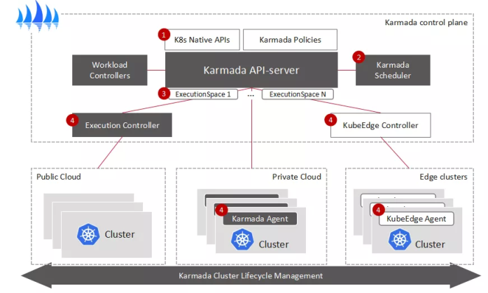
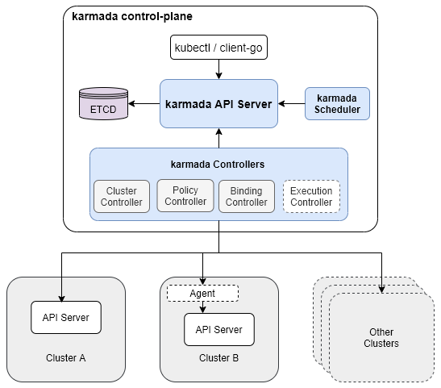
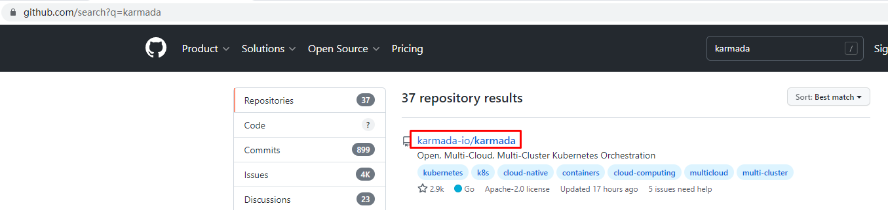
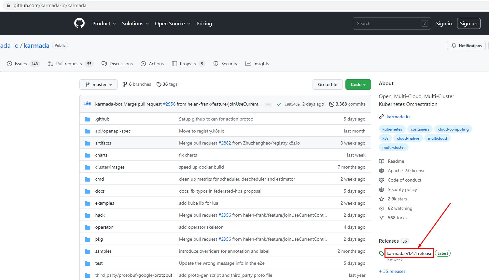
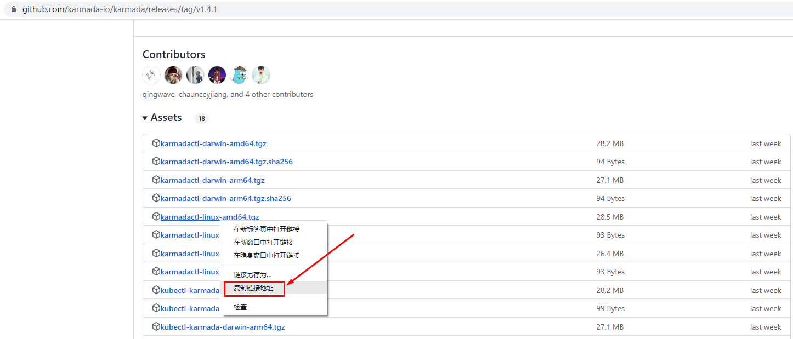
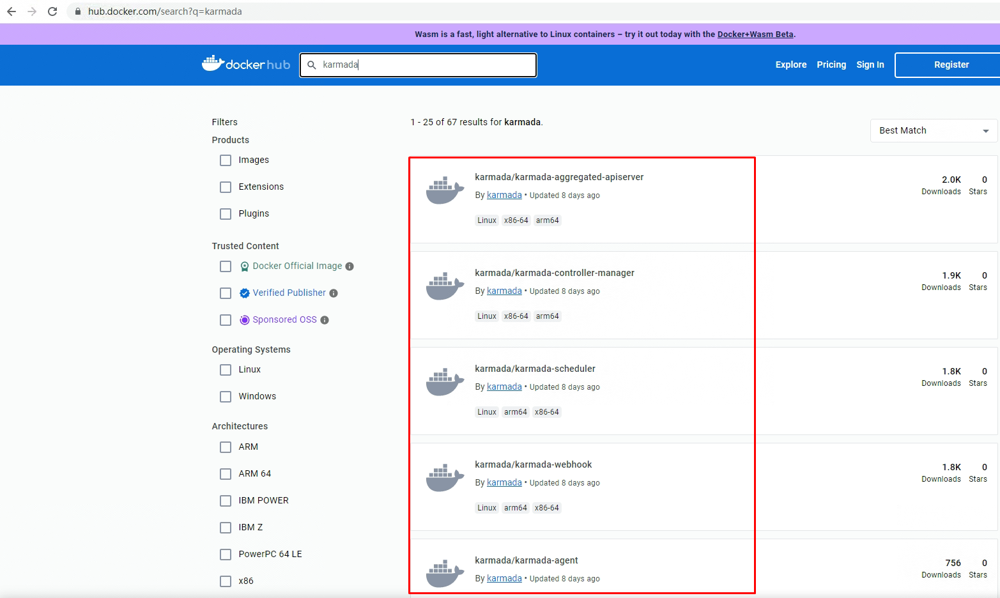

# karmada实现k8s集群联邦

# 一、karmada介绍

## 1.1 karmada是什么

Karmada(Kubernetes Armada)是一个Kubernetes管理系统，使您能够跨多个Kubernetes集群和云运行云原生应用程序，而无需更改您的应用程序。通过使用Kubernetes原生API并提供高级调度功能，Karmada实现了真正开放的多云Kubernetes。

Karmada旨在为多云和混合云场景中的多集群应用程序管理提供自动化功能，具有集中式多云管理，高可用性，故障恢复和流量调度等关键功能。

官方网站：https://karmada.io/

代码地址：https://github.com/karmada-io/karmada

## 1.2 karmada诞生背景

Karmada项目由华为云、工商银行、小红书、中国一汽等8家企业联合发起，沉淀了各企业在多云管理领域的丰富积累，于2021年4月25日在华为开发者大会2021(HDC.Cloud)上正式宣布开源。同年9月，Karmada项目正式捐赠给云原生计算基金会CNCF，成为CNCF首个多云容器编排项目。Karmada项目的加入，也将CNCF的云原生版图进一步扩展至分布式云领域。

CNCF总经理Priyanka Sharma对此表示：“华为一直是云原生社区与开发者生态的重要参与者，Karmada对所有企业构建多云业务架构至关重要，希望未来CNCF与华为云继续密切合作，持续帮助广大云原生开发者。”

Karmada自开源以来受到了广泛的关注和支持，目前在代码托管平台上已有超过30家大型企业/机构/高校参与社区开发及贡献。

## 1.3 karmada优势

Karmada结合了华为云容器平台MCP以及Kubernetes Federation核心实践，并融入了众多新技术：包括Kubernetes原生API支持、多层级高可用部署、多集群自动故障迁移、多集群应用自动伸缩、多集群服务发现等，并且提供原生Kubernetes平滑演进路径，让基于Karmada的多云方案无缝融入云原生技术生态，为企业提供从单集群到多云架构的平滑演进方案。Karmada的优势主要有以下几点：

1、K8s原生API兼容

- 既有应用配置及基础设施无需改造，由单集群架构平滑升级到多集群(多云)架构。
- 无缝集成Kubernetes现有工具链生态。

2、开箱即用

- 面向多场景的内置策略集，包括两地三中心、同城双活、异地容灾等。
- 支持应用的跨集群上的自动伸缩、故障迁移和负载均衡。

3、避免供应商锁定

- 与主流云提供商集成。
- 自动分配，跨集群迁移。
- 不受专有供应商编排的约束。

4、集中管理

- 与位置无关的群集管理。
- 支持公有云、本地或边缘的集群。

5、富有成效的多集群调度策略

- 多集群亲和性调度、应用跨集群拆分、资源重新平衡。
- 多维度多层次的高可用部署：区域/可用区/集群/供应商等。

6、开放和中立

- 由互联网、金融、制造、电信、云提供商等共同发起。
- 使用CNCF实现开放式治理的目标。

## 1.4 karmada架构

# 二、karmadactl安装

abc

~~~powershell
[root@k8s-master01 ~]# wget https://github.com/karmada-io/karmada/releases/download/v1.4.1/karmadactl-linux-amd64.tgz
~~~

~~~powershell
[root@k8s-master01 ~]# tar xf karmadactl-linux-amd64.tgz
~~~

~~~powershell
[root@k8s-master01 ~]# mv karmadactl /usr/local/bin/
~~~

# 三、karmada部署

~~~powershell
[root@k8s-master01 ~]# cat karmada.sh
karmadactl init \
--namespace='karmada-system' \
--port 30000 \
--etcd-image='registry.k8s.io/etcd:3.5.6-0' \
--etcd-pvc-size='10Gi' \
--etcd-storage-mode='PVC' \
--storage-classes-name='nfs-client' \
--etcd-replicas=1 \
--karmada-aggregated-apiserver-replicas=1 \
--karmada-apiserver-replicas=1 \
--karmada-controller-manager-replicas=1 \
--karmada-kube-controller-manager-replicas=1 \
--karmada-scheduler-replicas=1 \
--karmada-webhook-replicas=1 \
--karmada-aggregated-apiserver-image='docker.io/karmada/karmada-aggregated-apiserver:latest' \
--karmada-apiserver-image='registry.k8s.io/kube-apiserver:v1.24.9' \
--karmada-controller-manager-image='docker.io/karmada/karmada-controller-manager:latest' \
--karmada-kube-controller-manager-image='registry.k8s.io/kube-controller-manager:v1.24.9' \
--karmada-scheduler-image='docker.io/karmada/karmada-scheduler:latest' \
--karmada-webhook-image='docker.io/karmada/karmada-webhook:latest'
~~~

~~~powershell
[root@k8s-master01 ~]# kubectl get pods -n karmada-system
NAME                                            READY   STATUS    RESTARTS   AGE
etcd-0                                          1/1     Running   0          13h
karmada-agent-7d85f6cc69-x957m                  1/1     Running   0          13h
karmada-aggregated-apiserver-6577d5769f-h8nmp   1/1     Running   0          13h
karmada-apiserver-664446c84c-l5t26              1/1     Running   0          13h
karmada-controller-manager-776f8fcbff-fwjqv     1/1     Running   0          13h
karmada-scheduler-55dfc748b7-bw2t8              1/1     Running   0          13h
karmada-webhook-6cc85d8f86-hr52h                1/1     Running   0          13h
kube-controller-manager-7767d948d4-2s4vx        1/1     Running   0          13h
~~~

~~~powershell
Karmada is installed successfully.

Register Kubernetes cluster to Karmada control plane.

Register cluster with 'Push' mode

Step 1: Use "karmadactl join" command to register the cluster to Karmada control plane. --cluster-kubeconfig is kubeconfig of the member cluster.
(In karmada)~# MEMBER_CLUSTER_NAME=$(cat ~/.kube/config  | grep current-context | sed 's/: /\n/g'| sed '1d')
(In karmada)~# karmadactl --kubeconfig /etc/karmada/karmada-apiserver.config  join ${MEMBER_CLUSTER_NAME} --cluster-kubeconfig=$HOME/.kube/config

Step 2: Show members of karmada
(In karmada)~# kubectl --kubeconfig /etc/karmada/karmada-apiserver.config get clusters

Register cluster with 'Pull' mode

Step 1: Use "karmadactl register" command to register the cluster to Karmada control plane. "--cluster-name" is set to cluster of current-context by default.
(In member cluster)~# karmadactl register 192.168.10.160:30000 --token lw3mto.jv3qeoqtt7hm1vxl --discovery-token-ca-cert-hash sha256:11d5ff60b1fbeba0a4df9926157a4ac86d89ac649b5138a81bd763dbf6a7b7b0

Step 2: Show members of karmada
(In karmada)~# kubectl --kubeconfig /etc/karmada/karmada-apiserver.config get clusters
~~~

# 四、使用karmadactl创建k8s集群联邦

## 4.1 karmada push模式创建k8s集群联邦

~~~powershell
[root@k8s-master01 kubedir]# MEMBER_CLUSTER_NAME=$(cat ~/kubeconfigdir/config12  | grep current-context | sed 's/: /\n/g'| sed '1d')
[root@k8s-master01 kubedir]# echo ${MEMBER_CLUSTER_NAME}
member1
[root@k8s-master01 kubedir]# karmadactl --kubeconfig /etc/karmada/karmada-apiserver.config  join ${MEMBER_CLUSTER_NAME} --cluster-kubeconfig=$HOME/kubeconfigdir/config12
cluster(member1) is joined successfully
~~~

~~~powershell
[root@k8s-master01 kubedir]# kubectl --kubeconfig=config12 config use-context member2
Switched to context "member2".
[root@k8s-master01 kubedir]# MEMBER_CLUSTER_NAME=$(cat ~/kubeconfigdir/config12  | grep current-context | sed 's/: /\n/g'| sed '1d')
[root@k8s-master01 kubedir]# echo ${MEMBER_CLUSTER_NAME}
member2
[root@k8s-master01 kubedir]# karmadactl --kubeconfig /etc/karmada/karmada-apiserver.config  join ${MEMBER_CLUSTER_NAME} --cluster-kubeconfig=$HOME/kubeconfigdir/config12
cluster(member2) is joined successfully
~~~

~~~powershell
[root@k8s-master01 kubedir]# kubectl --kubeconfig /etc/karmada/karmada-apiserver.config get clusters
NAME      VERSION   MODE   READY   AGE
member1   v1.24.9   Push   True    96s
member2   v1.24.9   Push   True    59s
~~~

~~~powershell
删除member1集群
[root@k8s-master01 ~]# karmadactl  --kubeconfig /etc/karmada/karmada-apiserver.config unjoin member1

删除member2集群
[root@k8s-master01 ~]# karmadactl  --kubeconfig /etc/karmada/karmada-apiserver.config unjoin member2
~~~

## 4.2 karmada pull模式创建k8s集群联邦

~~~powershell
[root@k8s-master01 ~]# karmadactl register 192.168.10.160:30000 --token 2sh3py.li1p4o8gz4wqudrw --discovery-token-ca-cert-hash sha256:b1913d9f6410c2a4e19623223b141000a807cd2b15bbc3096ffc9a1dc39a5fe5 --cluster-name member1
[preflight] Running pre-flight checks
error execution phase preflight: [preflight] Some fatal errors occurred:
        [ERROR]: /etc/karmada/pki/ca.crt already exists

[preflight] Please check the above errors
[root@k8s-master01 ~]# rm -rf /etc/karmada/pki/ca.crt

[root@k8s-master01 ~]# karmadactl register 192.168.10.160:30000 --token 2sh3py.li1p4o8gz4wqudrw --discovery-token-ca-cert-hash sha256:b1913d9f6410c2a4e19623223b141000a807cd2b15bbc3096ffc9a1dc39a5fe5 --cluster-name member1
[preflight] Running pre-flight checks
[prefligt] All pre-flight checks were passed
[karmada-agent-start] Waiting to perform the TLS Bootstrap
[karmada-agent-start] Waiting to construct karmada-agent kubeconfig
[karmada-agent-start] Waiting the necessary secret and RBAC
[karmada-agent-start] Waiting karmada-agent Deployment
W0107 13:21:28.781319   28891 check.go:52] pod: karmada-agent-5dd59f9696-5tt82 not ready. status: ContainerCreating
W0107 13:21:29.784425   28891 check.go:52] pod: karmada-agent-5dd59f9696-5tt82 not ready. status: ContainerCreating
W0107 13:21:30.785356   28891 check.go:52] pod: karmada-agent-5dd59f9696-5tt82 not ready. status: ContainerCreating
W0107 13:21:31.785006   28891 check.go:52] pod: karmada-agent-5dd59f9696-5tt82 not ready. status: ContainerCreating
W0107 13:21:32.784396   28891 check.go:52] pod: karmada-agent-5dd59f9696-5tt82 not ready. status: ContainerCreating
W0107 13:21:33.784441   28891 check.go:52] pod: karmada-agent-5dd59f9696-5tt82 not ready. status: ContainerCreating
W0107 13:21:34.784517   28891 check.go:52] pod: karmada-agent-5dd59f9696-5tt82 not ready. status: ContainerCreating
W0107 13:21:35.785503   28891 check.go:52] pod: karmada-agent-5dd59f9696-5tt82 not ready. status: ContainerCreating
W0107 13:21:36.784929   28891 check.go:52] pod: karmada-agent-5dd59f9696-5tt82 not ready. status: ContainerCreating
W0107 13:21:37.784301   28891 check.go:52] pod: karmada-agent-5dd59f9696-5tt82 not ready. status: ContainerCreating
W0107 13:21:38.785135   28891 check.go:52] pod: karmada-agent-5dd59f9696-5tt82 not ready. status: ContainerCreating
I0107 13:21:39.784795   28891 check.go:49] pod: karmada-agent-5dd59f9696-5tt82 is ready. status: Running

cluster(member1) is joined successfully
~~~

~~~powershell
[root@k8s-master01 ~]# karmadactl register 192.168.10.160:30000 --token 2sh3py.li1p4o8gz4wqudrw --discovery-token-ca-cert-hash sha256:b1913d9f6410c2a4e19623223b141000a807cd2b15bbc3096ffc9a1dc39a5fe5 --cluster-name member2
[preflight] Running pre-flight checks
[prefligt] All pre-flight checks were passed
[karmada-agent-start] Waiting to perform the TLS Bootstrap
[karmada-agent-start] Waiting to construct karmada-agent kubeconfig
[karmada-agent-start] Waiting the necessary secret and RBAC
[karmada-agent-start] Waiting karmada-agent Deployment
W0107 13:21:44.795888   28340 check.go:52] pod: karmada-agent-76b7857fb4-zdnc9 not ready. status: ContainerCreating
W0107 13:21:45.798850   28340 check.go:52] pod: karmada-agent-76b7857fb4-zdnc9 not ready. status: ContainerCreating
W0107 13:21:46.798943   28340 check.go:52] pod: karmada-agent-76b7857fb4-zdnc9 not ready. status: ContainerCreating
W0107 13:21:47.800993   28340 check.go:52] pod: karmada-agent-76b7857fb4-zdnc9 not ready. status: ContainerCreating
W0107 13:21:48.799594   28340 check.go:52] pod: karmada-agent-76b7857fb4-zdnc9 not ready. status: ContainerCreating
W0107 13:21:49.799841   28340 check.go:52] pod: karmada-agent-76b7857fb4-zdnc9 not ready. status: ContainerCreating
W0107 13:21:50.799034   28340 check.go:52] pod: karmada-agent-76b7857fb4-zdnc9 not ready. status: ContainerCreating
W0107 13:21:51.799729   28340 check.go:52] pod: karmada-agent-76b7857fb4-zdnc9 not ready. status: ContainerCreating
W0107 13:21:52.801867   28340 check.go:52] pod: karmada-agent-76b7857fb4-zdnc9 not ready. status: ContainerCreating
I0107 13:21:53.799843   28340 check.go:49] pod: karmada-agent-76b7857fb4-zdnc9 is ready. status: Running

cluster(member2) is joined successfully
~~~

~~~powershell
[root@k8s-master01 ~]# kubectl --kubeconfig /etc/karmada/karmada-apiserver.config get clusters
NAME      VERSION   MODE   READY   AGE
member1   v1.24.9   Pull   True    119s
member2   v1.24.9   Pull   True    104s
~~~

# 五、利用karmada使用k8s集群联邦部署应用

## 5.1 部署应用

~~~powershell
准备nginx应用部署描述文件
[root@k8s-master01 nginxdir]# cat n1.yaml
apiVersion: apps/v1
kind: Deployment
metadata:
  name: nginx1                    # deployment名
spec:
  replicas: 1                                   # 副本集,deployment里使用了replicaset
  selector:
    matchLabels:
      app: nginx1                                # 匹配的pod标签,表示deployment和rs控制器控制带有此标签的pod
  template:                                         # 代表pod的配置模板
    metadata:
      labels:
        app: nginx1                              # pod的标签
    spec:
      containers:                               # 以下为pod里的容器定义
      - name: nginx1
        image: nginx:latest
        imagePullPolicy: IfNotPresent
        ports:
        - containerPort: 80
~~~

~~~powershell
不能这样部署
[root@k8s-master01 nginxdir]# kubectl apply -f n1.yaml
deployment.apps/nginx1 created
~~~

~~~powershell
像下面一样部署，注意这个位置部署的是模板，并没有实际运行在任何集群中。
[root@k8s-master01 nginxdir]# kubectl --kubeconfig /etc/karmada/karmada-apiserver.config apply -f n1.yaml
deployment.apps/nginx1 created
~~~

~~~powershell
查看已部署应用，没有发现有应用被创建
[root@k8s-master01 nginxdir]# karmadactl --kubeconfig /etc/karmada/karmada-apiserver.config get pods
NAME                                     CLUSTER   READY   STATUS    RESTARTS      AGE
nfs-client-provisioner-dfd8488d7-hhmwh   member1   1/1     Running   3 (24h ago)   30h
nfs-client-provisioner-dfd8488d7-rtmdj   member2   1/1     Running   2 (24h ago)   30h
~~~

~~~powershell
准备传播策略文件
[root@k8s-master01 pdir]# cat p1.yaml
apiVersion: policy.karmada.io/v1alpha1
kind: PropagationPolicy
metadata:
  name: example-policy # The default namespace is `default`.
spec:
  resourceSelectors:
    - apiVersion: apps/v1
      kind: Deployment
      name: nginx1 # If no namespace is specified, the namespace is inherited from the parent object scope.
  placement:
    clusterAffinity:
      clusterNames:
        - member1
~~~

~~~powershell
执行传播策略文件
[root@k8s-master01 pdir]# kubectl --kubeconfig /etc/karmada/karmada-apiserver.config apply -f p1.yaml
propagationpolicy.policy.karmada.io/example-policy created
~~~

~~~powershell
使用kubectl查看默认命名空间，有
[root@k8s-master01 pdir]# kubectl get pods
NAME                                     READY   STATUS    RESTARTS      AGE
nfs-client-provisioner-dfd8488d7-hhmwh   1/1     Running   3 (25h ago)   30h
nginx1-7bff55d4bd-lcbcn                  1/1     Running   0             44s

查看部署deployment
[root@k8s-master01 pdir]# kubectl --kubeconfig /etc/karmada/karmada-apiserver.config get deployment
NAME     READY   UP-TO-DATE   AVAILABLE   AGE
nginx1   1/1     1            1           3m9s
~~~

~~~powershell
查看pod
[root@k8s-master01 pdir]# karmadactl --kubeconfig /etc/karmada/karmada-apiserver.config get  pod
NAME                                     CLUSTER   READY   STATUS    RESTARTS      AGE
nfs-client-provisioner-dfd8488d7-hhmwh   member1   1/1     Running   3 (25h ago)   30h
nginx1-7bff55d4bd-lcbcn                  member1   1/1     Running   0             2m40s
nfs-client-provisioner-dfd8488d7-rtmdj   member2   1/1     Running   2 (25h ago)   30h
~~~

## 5.2 更新传播策略

~~~powershell
更新传播策略至其它集群，此处为member2
[root@k8s-master01 pdir]# cat p2.yaml
apiVersion: policy.karmada.io/v1alpha1
kind: PropagationPolicy
metadata:
  name: example-policy
spec:
  resourceSelectors:
    - apiVersion: apps/v1
      kind: Deployment
      name: nginx1
  placement:
    clusterAffinity:
      clusterNames: # Modify the selected cluster to propagate the Deployment.
        - member2
~~~

~~~powershell
执行更新后的传播策略文件

[root@k8s-master01 pdir]# kubectl --kubeconfig /etc/karmada/karmada-apiserver.config apply -f p2.yaml
propagationpolicy.policy.karmada.io/example-policy configured
~~~

~~~powershell
查看pod是否已在其它集群中运行，此处为member2
[root@k8s-master01 pdir]# karmadactl --kubeconfig /etc/karmada/karmada-apiserver.config get  pod
NAME                                     CLUSTER   READY   STATUS    RESTARTS      AGE
nfs-client-provisioner-dfd8488d7-hhmwh   member1   1/1     Running   3 (25h ago)   30h
nfs-client-provisioner-dfd8488d7-rtmdj   member2   1/1     Running   2 (25h ago)   30h
nginx1-7bff55d4bd-fm7kj                  member2   1/1     Running   0             28s
~~~

## 5.3 更新模板部署应用

~~~powershell
更新应用部署模板，把replicas由1修改为2
[root@k8s-master01 nginxdir]# cat n1.yaml
apiVersion: apps/v1
kind: Deployment
metadata:
  name: nginx1                    # deployment名
spec:
  replicas: 2                                   # 副本集,deployment里使用了replicaset
  selector:
    matchLabels:
      app: nginx1                                # 匹配的pod标签,表示deployment和rs控制器控制带有此标签的pod
  template:                                         # 代表pod的配置模板
    metadata:
      labels:
        app: nginx1                              # pod的标签
    spec:
      containers:                               # 以下为pod里的容器定义
      - name: nginx1
        image: nginx:latest
        imagePullPolicy: IfNotPresent
        ports:
        - containerPort: 80
~~~

~~~powershell
执行应用部署文件
[root@k8s-master01 nginxdir]# kubectl --kubeconfig /etc/karmada/karmada-apiserver.config apply -f n1.yaml
deployment.apps/nginx1 configured
~~~

~~~powershell
查看pod情况，发现pod由1个变为2个
[root@k8s-master01 nginxdir]# karmadactl --kubeconfig /etc/karmada/karmada-apiserver.config get  pod
NAME                                     CLUSTER   READY   STATUS    RESTARTS      AGE
nfs-client-provisioner-dfd8488d7-hhmwh   member1   1/1     Running   3 (25h ago)   30h
nfs-client-provisioner-dfd8488d7-rtmdj   member2   1/1     Running   2 (25h ago)   30h
nginx1-7bff55d4bd-fm7kj                  member2   1/1     Running   0             8m46s
nginx1-7bff55d4bd-llhv2                  member2   1/1     Running   0             5m12s
~~~

