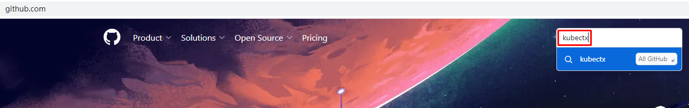
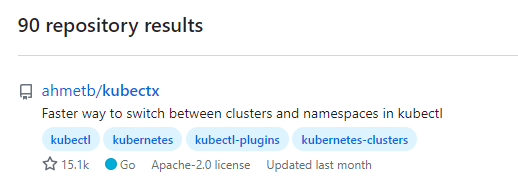
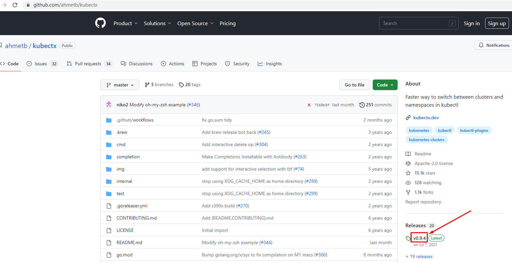
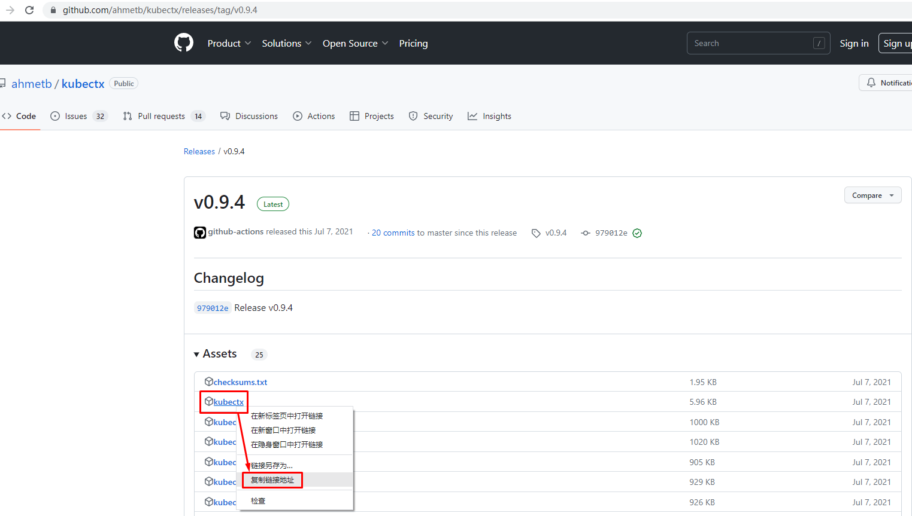

# 使用kubeconfig管理多集群方法

# 一、 k8s集群部署

> 准备多套k8s集群，可以使用kubeadm部署多套k8s集群。

~~~powershell
# wget  https://github.com/labring/sealos/releases/download/v4.1.7/sealos_4.1.7_linux_amd64.tar.gz  && \
    tar -zxvf sealos_4.1.7_linux_amd64.tar.gz sealos &&  chmod +x sealos && mv sealos /usr/bin
~~~

~~~powershell
[root@k8s-master01 ~]# cat sealos-install.sh
sealos run labring/kubernetes:v1.25.0 labring/helm:v3.8.2 labring/calico:v3.24.1 \
     --masters 192.168.10.140 \
     --nodes 192.168.10.141,192.168.10.142 -p centos
~~~

~~~powershell
[root@k8s-master01 ~]# cat sealos-install.sh
sealos run labring/kubernetes:v1.25.0 labring/helm:v3.8.2 labring/calico:v3.24.1 \
     --masters 192.168.10.160 \
     --nodes 192.168.10.161,192.168.10.162 -p centos
~~~

# 二、K8S多集群管理

## 2.1 获取多集群kubeconfig文件

~~~powershell
创建文件存储目录
[root@k8s-master01 ~]# mkdir kubeconfigdir
~~~

~~~powershell
获取第一个集群kubeconfig文件
[root@k8s-master01 ~]# cp /root/.kube/config kubeconfigdir/config1
~~~

~~~powershell
获取第二个集群kubeconfig文件
[root@k8s-master01 ~]# scp 192.168.10.160:/root/.kube/config kubeconfigdir/config2
~~~

## 2.2 合并多集群kubeconfig文件

> 可以选择手动合并，也可以选择自动全并。本案例为手动合并。
>
> 自动合并命令：# KUBECONFIG=./config1:./config2 kubectl config view --flatten > ./configX，前提需要修改config文件。

~~~powershell
合并后kubeconfig文件如下：

[root@k8s-master01 kubeconfigdir]# cat config12
apiVersion: v1
clusters:
- cluster:
    certificate-authority-data: LS0tLS1CRUdJTiBDRVJUSUZJQ0FURS0tLS0tCk1JSUMvakNDQWVhZ0F3SUJBZ0lCQURBTkJna3Foa2lHOXcwQkFRc0ZBREFWTVJNd0VRWURWUVFERXdwcmRXSmwKY201bGRHVnpNQjRYRFRJek1ERXdOVEExTWpJek1sb1hEVE16TURFd01qQTFNakl6TWxvd0ZURVRNQkVHQTFVRQpBeE1LYTNWaVpYSnVaWFJsY3pDQ0FTSXdEUVlKS29aSWh2Y05BUUVCQlFBRGdnRVBBRENDQVFvQ2dnRUJBTmJjClFkK0ttSkd2NDNJRG9yWXY1UmRSNkNVTkpvUE1CY3kveDd2U3FIM1dEbWJsWnM3NDMvbVJRUDE1NDNRSmlsbDYKNmV1WjQrSDBsZXVsRWNjQU9mN2dPOG5EaDJSTEQ0ZHc4bk51L2JWMnRnRjc5b1FSTUtDczN2TWwzcEwzZmZiVQpweHdQVXAzTktwb1pZZndNVTJvazVIZGxwbkdqQzVLRnkvb2FNcmNrUWFNQjhjaFhhckxoSDBCVHZXS29sWnUxCjJPa2VvRDJKRTl1czVDRkt4MDMxWmtjQVArbVpjM2JYejI0amZYOUI1L05BR3c2Vmx3bjNCR1dHR1pJczd4Q3cKbjdpS1dNMTJGZCsyM1Z0dUtMWDBzdnJsUkQxcHdFdUxvRVVGdHN0dEJqZmN6bHJtQkhTWEE4SHFRazE1bVRCWAo5U0ZSc2NpOEVHaTR1MS9UN0JFQ0F3RUFBYU5aTUZjd0RnWURWUjBQQVFIL0JBUURBZ0trTUE4R0ExVWRFd0VCCi93UUZNQU1CQWY4d0hRWURWUjBPQkJZRUZKRFVvYStGQklSeXduaHFPUDViWk1ZSmdWZEJNQlVHQTFVZEVRUU8KTUF5Q0NtdDFZbVZ5Ym1WMFpYTXdEUVlKS29aSWh2Y05BUUVMQlFBRGdnRUJBRWc3WmFMLzJNWE9BNi9qem5wTApqVTA4Z2lBV01Jc2pzWk10V3R2WFNEQ3g0UE10LzAzVENXb0hlYi9BTSszMHpkMXNqOWE5V281akNkdFB0WGtQClFIa3gyNWZheVpwVndiN0d1Qk8xNSsxdUFjRWtJWmhKNnhuT25sZlIyUkF2TTVodXV6RUtTeHRoZ3Nlay9wYlAKeFBYWkdzQS90T3dEbm55L1ZpMzNFVjlLampybVY4d0xLR0htRHVhM05hWjh2aUtBeHVscmNITUZ1ZXloSFdaUQpiSlNyS1FZSDJUaGt3ekw4SHd6cEZ3SEQvVDRTTHpQRkF2VVc5ZkxTVm16V0N2Mkd6RzhvQWR0WHYrQ2YyOXZECmEyMFJvWnE1UDcwdnVZdGF5UXpmM0o2aHBMRGRvUFBYUVRmUVo0NlRJZmlKdjM3RTgycXVYQ0JSNUlvOEI5Z0wKWXE4PQotLS0tLUVORCBDRVJUSUZJQ0FURS0tLS0tCg==
    server: https://192.168.10.140:6443
  name: member1
- cluster:
    certificate-authority-data: LS0tLS1CRUdJTiBDRVJUSUZJQ0FURS0tLS0tCk1JSUMvakNDQWVhZ0F3SUJBZ0lCQURBTkJna3Foa2lHOXcwQkFRc0ZBREFWTVJNd0VRWURWUVFERXdwcmRXSmwKY201bGRHVnpNQjRYRFRJek1ERXdOVEExTWpNeE5Gb1hEVE16TURFd01qQTFNak14TkZvd0ZURVRNQkVHQTFVRQpBeE1LYTNWaVpYSnVaWFJsY3pDQ0FTSXdEUVlKS29aSWh2Y05BUUVCQlFBRGdnRVBBRENDQVFvQ2dnRUJBT0JlCjFRUGhjY3ZPVGRUa1gySE1VOE53WXNiM01CWWNmbG5ERW1ENE9PRE1sNi8xdTRmYVhvc2RFMFNxUTlDYU5pamUKR09OU0lXc01zTlpmWVJ6Tk9mMlBlRXJyeGEwcE12RG5oNnEwSGtqVmQxdVZTNWhrbkNxY00rU0pnYUlhSXl5Zwp0RW00NFFWdFo2MGZhU1cxMFFWQXp5ZWJEYjJ3Wm1zSnhzRE5rbHprYzY4alVIK3N1dmxzMitjb1hnRWo1ditnCnlydjh2SjlPVklIdDlhd2VMU1h1YnhtZVpUOUZ6UDNRandkdTY3NjV3bFVFQ2E5YnZVWEY4MlVuYURnTWhVR1kKR2dqSVQrd09sN0ZGQVVrOFZXMm0xRnNaWlR6bmQwaDloRTI2MkZ1V2YzL29nZlcvbUIyMEo5ZzQ5Q0NoaVFGYQpCY0xUclJuZHhaWU5uZkdIalowQ0F3RUFBYU5aTUZjd0RnWURWUjBQQVFIL0JBUURBZ0trTUE4R0ExVWRFd0VCCi93UUZNQU1CQWY4d0hRWURWUjBPQkJZRUZIblhUUk52VkVxU1dEWUpROTFROGt3Y0I4ZnFNQlVHQTFVZEVRUU8KTUF5Q0NtdDFZbVZ5Ym1WMFpYTXdEUVlKS29aSWh2Y05BUUVMQlFBRGdnRUJBS3lYMmJ4d2cySVYxUEE0OThaNApaU290VFljNFZMc3hvdUNwNUY0U2dGSVIrc0pEWVc5R1RTRFpXbW9aczlQaE4vOFpEdDFQVjJMdU1waG00YStkCm83OW9PME10OHhvMGNsdGQzaUZXWkNRK0lzcHJoNUVTd0VuSmdCYmpDWGxObCs4T256VUJaQVRtZWw4dnY4LysKektITDdTNE03K1NOclN4ZGE1VHkwU2M4Mi8wS0RoUmZDMWtOZkhFMStuNWw4d2JVa1BmNDJkanY1eEFac2pQUwo1d1VTOCs4QXBQM0ZWNkNhRmJBdUlRbXFUL1pDdG9GYUZVVGxwUEFnRjBPa1AzelVXaTBrQzR3eG5vUVRXaW4yCnhEYWkvdmRPU1Qyd2FnU3dKOXRZd3ZsQmg4ZmQwdmM3bDlvMGREeklBYlh4OTBvdkZ0bzVCZ0VsT0FrQ3hTTisKc0E0PQotLS0tLUVORCBDRVJUSUZJQ0FURS0tLS0tCg==
    server: https://192.168.10.160:6443
  name: member2
contexts:
- context:
    cluster: member1
    user: member1-admin
  name: member1
- context:
    cluster: member2
    user: member2-admin
  name: member2
current-context: member1
kind: Config
preferences: {}
users:
- name: member1-admin
  user:
    client-certificate-data: LS0tLS1CRUdJTiBDRVJUSUZJQ0FURS0tLS0tCk1JSURJVENDQWdtZ0F3SUJBZ0lJR3ljSnc3LytXNGt3RFFZSktvWklodmNOQVFFTEJRQXdGVEVUTUJFR0ExVUUKQXhNS2EzVmlaWEp1WlhSbGN6QWVGdzB5TXpBeE1EVXdOVEl5TXpKYUZ3MHlOREF4TURVd05USXlNelJhTURReApGekFWQmdOVkJBb1REbk41YzNSbGJUcHRZWE4wWlhKek1Sa3dGd1lEVlFRREV4QnJkV0psY201bGRHVnpMV0ZrCmJXbHVNSUlCSWpBTkJna3Foa2lHOXcwQkFRRUZBQU9DQVE4QU1JSUJDZ0tDQVFFQXl3NEFmd1RYQllzSUZkZkIKcU9tWWZMbEpzS2VLZDdOS1pSZEZ4TmU5ejB6dTVnc1Zudm9HWXlmdkJXdWxTMDZjcDFuTGdOR1ZWUVN4SndKUQo5blo4cEQyV3h2QkVBRkdBdWoxUWtLaXZnMDkwSG1zbFZHbVE2blhDNkxzTm1QdFRSOVdpWnpmWjQyK2t3SGRJCjM1SGlNeEk2aXIva1BoZHBPc3ZaRWZzUGl1cDZpVDF2d1VKbFR4V00zZVF3d2ZRYW1MSHdGYUhpNFZvOTl4TUkKQllsUktpa2FYMFluQkFGZ2RVcEZ6Rk53TnpTWnFoQy9KaE1qQyt1OTVnakx5SENZVXhWU2xBRDc0TDErb1l2WQppNmZkM0RhQWx5VjRZYXRabytxSFhlbW5RdGMveEhwR3gwNVIxdnBZQmVnNGVXL0lhUER0a29UNEtzR0kyNm9DCithczZaUUlEQVFBQm8xWXdWREFPQmdOVkhROEJBZjhFQkFNQ0JhQXdFd1lEVlIwbEJBd3dDZ1lJS3dZQkJRVUgKQXdJd0RBWURWUjBUQVFIL0JBSXdBREFmQmdOVkhTTUVHREFXZ0JTUTFLR3ZoUVNFY3NKNGFqaitXMlRHQ1lGWApRVEFOQmdrcWhraUc5dzBCQVFzRkFBT0NBUUVBVGxwRlBzVW5qTGl4L0dINjMrZUY0ZEFYTmZvdW84bWl2cm1pCmVtSTUySzJZMHYzdlhBRkhHWi9GSDdML1VBMTMycmVGSlFHRmhBMHp1NnF5cUMzaHRWTnFsalQwQ3JkdjFVNnYKbE5KT2lVZnVRTXJkV3lDQ3BsdWxMREtQNnpXY0hpRXFacWx0UGVpVHZpdE5LcURvSXBwYXU3NUxCR2JGYVdxNgpESkRZZlBUL2JqM1RHV0V3VzEzWnczdjlnc3NzOVRSbHd6YzJTTmpOOHdSbktnaEh4N3dBSVlPTE51bzRXcUxwCldXdW5jYjJCRFZKQStUc0t1UTVxTUEvVHpLakVZdHR3S0VrTkdTTCt4eS9jRUIvanV4TnR0SXBkbnBhdWxJU3kKMlpuU2pxSkgrbzBxYjdzekJINlVLWVdscFYvZzVnSDlOb1RwVUxHSkdkSWZnaXRwdUE9PQotLS0tLUVORCBDRVJUSUZJQ0FURS0tLS0tCg==
    client-key-data: LS0tLS1CRUdJTiBSU0EgUFJJVkFURSBLRVktLS0tLQpNSUlFcFFJQkFBS0NBUUVBeXc0QWZ3VFhCWXNJRmRmQnFPbVlmTGxKc0tlS2Q3TktaUmRGeE5lOXowenU1Z3NWCm52b0dZeWZ2Qld1bFMwNmNwMW5MZ05HVlZRU3hKd0pROW5aOHBEMld4dkJFQUZHQXVqMVFrS2l2ZzA5MEhtc2wKVkdtUTZuWEM2THNObVB0VFI5V2laemZaNDIra3dIZEkzNUhpTXhJNmlyL2tQaGRwT3N2WkVmc1BpdXA2aVQxdgp3VUpsVHhXTTNlUXd3ZlFhbUxId0ZhSGk0Vm85OXhNSUJZbFJLaWthWDBZbkJBRmdkVXBGekZOd056U1pxaEMvCkpoTWpDK3U5NWdqTHlIQ1lVeFZTbEFENzRMMStvWXZZaTZmZDNEYUFseVY0WWF0Wm8rcUhYZW1uUXRjL3hIcEcKeDA1UjF2cFlCZWc0ZVcvSWFQRHRrb1Q0S3NHSTI2b0MrYXM2WlFJREFRQUJBb0lCQVFDN3R3UUthTVVISU5LbQpyc0Vma0dRaDJZRWdTS0tmcWlYNmNwdFRNRWNPMzRaek1JZ2FZZldKc1I4c21hbERoemNYRnRJbEVwdkU3d04rCmxvdVdiVThvM3E4RzFwTm0zL0hyT2tmQ2s4ODl5elFEOHZXZHBjSU1ualZEeGJqNlZrMVZPVkJicjZ4RXI2OVYKSm5FK0RiVlpsVjU5YW94c1FtUkxzS3ZLRFpqK3g4SnFhWnhMZkp2eEJPbnBvZ3JpSHhHRjA4Sm5BMTBqZFNlMApnY1Q3dFA4Wk1IeVhiWDVsYkFYQWp3VXJnNTJ2YUFBVEZkOTNUYTkrdDRwcWt5OU93RmZHR0p2bm9VLzRIZ1hqCjVvN0lIdWcxbVNhbXYvSlVvcXRKZW54MzAxVGNNSkxqS1Zlck4wbm85MGExYnpNQThiVzBEaWpiYjl3R043bFkKM0xDdTFMdEJBb0dCQU04NE0rdUJ2c05KbE5pZU9Zd1I1UUh4TjJPV3hnQTBjYSt5S09DYjBsMUpCOE9EK0lhUQpmbVdKTUlLeEpjQUZva0EwT3E3MmFEUlhTeWorcS9hQ2VUUkxPOHFlVjJLSFo5TGRYOW9BNGhqUVFqVm5pbGZSCkJ1dlhKd040bHdLcWR4aVZqN3R2cU0yYmVnZTdRejN2STViQTdIcGNZSnJOZWpmdUdSMDJZcVBaQW9HQkFQcmEKejNjUGFyanN1dGQxK3VQUWdwN0Y1V3Fud05uSUhtWTQ2SVp0YnQ5VnNaN2tRSlJZaHNjdkhMaVhVMmhWQ244agpSOU5WNHNOejQ4azdDU0RpQXdaNFZBYUFOM1N1OFBaNHZ5RFZJZVllK0tVUnJkM1RuRk10NFptc0UvWGlyV29GCmtNSndiK2lLMVJGc1VCU0NTSVBnQjZQOXZ6R3NaV0NnaVczT1I4OXRBb0dBRyt6M0VrWHA3MmQ3SjdZckN6VmUKSjJUYWtoRS9uY2R6aXJuM3lFMDNqRnJMTVE0WDhBcUkvaVgrNDUzNytHVEorTjBSQzRNcGgrUTd2TXFWWWlNegpNbGp4TmQwZzZhWlYxNVQ5MWVOSWxROTczTGFYYmo0OU1JdE9OcW1Kc0ZKSXVvZHRWMVUwNm9DSmNZRkxEbzJyCnZpVkJ1VHU1eVNMbjFhSEF3SzhUbkFFQ2dZRUF2amR6ZitXWjJIWHh5L1d6ZEZJazZmNUgwMU0zSWl6a0dFRm8KMko1Y3AwOVVxNWFLL2JJUEtUU3BRN1BEMUdZLzJsNUhWWkpYckR2UmEwS3Z6bFp6VXRHbGJYU0dHSjJiTEZvdApHOWxocGh5d0VJTlNZdFhXUVNDV1pDK2V4eUhHdTVGU3pvM3gzZFNBY29DK1RIN3FPODJDSGJFSTdNSzc4TVJxCjBXL005aFVDZ1lFQXBWTWxQL24xQ2VKWW12RDZwanNCMy9VaE9UUDlUN0wrWk9LNnlMZEwyNzlqeVRBUm1URGcKOHhWSitZNjZLSXluS3ZFaDlmaGZRZDdtbHJyYmNSK0RwSVdFRXkxN3JQQWpjbkNhVWNZVDJXVGlYcjROWVlmUgpIakdMQ2tLb3hWci9aV2lXUUJ2UVRoemZUd0RRaWVCS2xpT0hoY3h3bnl6Q2dWdm5Wc3hWbDF3PQotLS0tLUVORCBSU0EgUFJJVkFURSBLRVktLS0tLQo=
- name: member2-admin
  user:
    client-certificate-data: LS0tLS1CRUdJTiBDRVJUSUZJQ0FURS0tLS0tCk1JSURJVENDQWdtZ0F3SUJBZ0lJTytGWlFKV2RpYUF3RFFZSktvWklodmNOQVFFTEJRQXdGVEVUTUJFR0ExVUUKQXhNS2EzVmlaWEp1WlhSbGN6QWVGdzB5TXpBeE1EVXdOVEl6TVRSYUZ3MHlOREF4TURVd05USXpNVFphTURReApGekFWQmdOVkJBb1REbk41YzNSbGJUcHRZWE4wWlhKek1Sa3dGd1lEVlFRREV4QnJkV0psY201bGRHVnpMV0ZrCmJXbHVNSUlCSWpBTkJna3Foa2lHOXcwQkFRRUZBQU9DQVE4QU1JSUJDZ0tDQVFFQTV3OVB5R3EvMloxRnVtMkkKSkU0TmlONStwUnQyY01vV1RXdi9neTB0NmdMRE5yVTFnRFB1aWZ5SmhLM05veHdwWGJXTXY1dUQ5QzlwS3N2UwpjbW1IdUZQVFF6ZWpleGZuYkEwckhZSk9FK1krSWZhM1FZMTgzL0lJUXZGUGozMkJEdVVNZkNtcHFSbitZejVpCk1TVW1pWCtDelkxRC93REVJZ0FtOUZXTEV5cnkxZi8xMjhkVGRGU3JITFpab2xCbG00aWhIUUMxV0JBVFFsVlMKN2pMMmFNTGNPTDl5OXJGMkNVY3pUTTA1K2R2Z2ZFUGw4aVlVRVNieFRtVUFETmRBS2lGSitvZmFrc0RFaGxpMwpNVXNHNitLdFZVR2E0aTJJc3pYMTlNOHFZYWFNdHZyaDFlTHBaTld5NGwwSUVhd3NlaS9ZVm5OUE5hb0Jld3FnCnJ0bHFwd0lEQVFBQm8xWXdWREFPQmdOVkhROEJBZjhFQkFNQ0JhQXdFd1lEVlIwbEJBd3dDZ1lJS3dZQkJRVUgKQXdJd0RBWURWUjBUQVFIL0JBSXdBREFmQmdOVkhTTUVHREFXZ0JSNTEwMFRiMVJLa2xnMkNVUGRVUEpNSEFmSAo2akFOQmdrcWhraUc5dzBCQVFzRkFBT0NBUUVBcHJGdkNIS0k2WHlKbzZ2cTRSUmRqdUFjbHhBeTBQV2Fud2VZCnRKR2lKUlFncXJqaUNNQkZDSEdDcjZnTHY3RzUwSFNSL0UwbnpZWGdzQ2FKUFN4U2ZkSFJiRVRRMldWT2ExSVEKN1hUMnUzT1l4bDhSWXkwR2lNMWRyakxYOHQ4K0xXSVhYdFEzVGVkaFJwNEtvR2J5Z3BuVlJlKzNCOXhsbDFZQQoxRWxJL1QxV0t5Qk0waEdhdHB1Z2l2aXFaNFY2RVJkMzBtUmhmT1dqem5rNi9GTmFIRTRtL1J6cFVtNWZPbURBClVSWElBa05JZlZudENRRkVuejhDWmlaMkVyNG5HV0pwOWV1UU9Scyt5eUlGdkFWZjd5REYrUGV6SDVIUCtBL3YKbktGd0JxTUdyaHN0bEEyUHdvSE9wMnVQa01MKzdSSENQYWRMYVltejNRQWFCdGNyRWc9PQotLS0tLUVORCBDRVJUSUZJQ0FURS0tLS0tCg==
    client-key-data: LS0tLS1CRUdJTiBSU0EgUFJJVkFURSBLRVktLS0tLQpNSUlFb3dJQkFBS0NBUUVBNXc5UHlHcS8yWjFGdW0ySUpFNE5pTjUrcFJ0MmNNb1dUV3YvZ3kwdDZnTEROclUxCmdEUHVpZnlKaEszTm94d3BYYldNdjV1RDlDOXBLc3ZTY21tSHVGUFRRemVqZXhmbmJBMHJIWUpPRStZK0lmYTMKUVkxODMvSUlRdkZQajMyQkR1VU1mQ21wcVJuK1l6NWlNU1VtaVgrQ3pZMUQvd0RFSWdBbTlGV0xFeXJ5MWYvMQoyOGRUZEZTckhMWlpvbEJsbTRpaEhRQzFXQkFUUWxWUzdqTDJhTUxjT0w5eTlyRjJDVWN6VE0wNStkdmdmRVBsCjhpWVVFU2J4VG1VQUROZEFLaUZKK29mYWtzREVobGkzTVVzRzYrS3RWVUdhNGkySXN6WDE5TThxWWFhTXR2cmgKMWVMcFpOV3k0bDBJRWF3c2VpL1lWbk5QTmFvQmV3cWdydGxxcHdJREFRQUJBb0lCQUFNRHNSL0ZQTUdEQ3NEVwo0dnJPUmVEdVBpcTdRLzFPdGFIRzhldHRNSGNvR0JIanBWSUoyMmZUY3B2WGhLSkhJTWNITWxIaG5vUVdCa0kzCnJJUXZta1N1VzBnNk5wakpoQXhsMDVVcitRYkxieTRVUU9uTEJjRUtNRTluUklsenNyWldDS2FxQ0h1YlNqVlQKUUFheUhHR1kxMFVGUGNqYTRyUXEybGMvc25QS2lrMFpkcEZMZlduWUljTTdKSU5TTHZTRkJVWGxHV0hnZi9UbgpBSWNQMFpuWkZ0cHZhdS9MMXk4UUNzY2ZPVWo3YjJFbG5FU2xHRFdnUVcyZDBrdXppQ2dxRmtVZm5HdWVDNExuCnlySUVRSzBSM081TUt4ODM2TWN3TytTcDgrUmtMeitKYlUzTXprelhLVGZBSU5haVFuZ2Q5Zy9JaVpnbUtjUjQKMkFKSFBKa0NnWUVBNjVWTkdORURKaDlsWWlwQWZ6NHVRa1AydmN1VExaajNuVjU0OXlucERZQnFrWnFxSFhXYwpERm1OTWhpdm5VNnprSE02KzY1RWZGOTdQZTkvUmM2QnJrcUhlYWsvcjY2ajdVSVlPVklvR1FvMVZRQ2MyR0NhCnZIVVluL01rOHBRUDdwNHpyUmFxVWFoZm1Jc1JhTlVlZytWMnZsa1krQkNNblRQSTRvRllGSnNDZ1lFQSt4V24KU1RRUmczYWE5N0pwOUFDRTNNVGRHbStPcnExM0lDTU12Q2pKM0c2VFhaOS8wSC96NG1FMlQwMUVIVnIvZStBRQptVmk3VDU1ZWIzRVdRbElsdExKUTdQK1R3YnBheUFMamZqcDVRTGtZUEcvY1UwNnAycFhXOHU0L3dsUk5YbWVmCklkRGFpOTJPNzltOG4rZ1d3b1JzL3g1b21XamE4azkxR1NuV3RPVUNnWUVBa3dIWDJtU1RVbmJGRFR6UWdwYUsKeDA4aDZjM2ZTZFRxcjRrRWN6Zno5ampzUjIvOE4rWHNPc2luRTF2VU9wV2g5OEh3VEoyeW51bjJQZS8xdTluaAprcUZ2YUx2MHdleDQzdFVmeUtVNzRHUStZNHkrVTBmMVJ5VEsrUVVCU1Y2YmtvdW1NNXl4SzhPbDQ4cmtVa2FyCmhDTHN0bHRpK1dsYVZiNjYzSjFhR1lFQ2dZQjU4MWR2OTZrMTkrcG11akk1Ly9LSUk5bmNHQ2p0OEhTMm1DOTgKU0RkYktCM05VRVhOS0FoMWdJL1hUb2p4MVJ2WHQ4T2tFM1BPeFBYTEhOc1oxVHBaSEc2djNhYVBab3JuTUhmNwovRHllVWdoU2VtWkIxQ2d0Y2ErWUNGM1JiZzZ4OXBSVTRWTDBzZVRWM0NTQWFrSjdzY1FhMlZNbWg4WW9BSzI0ClRoanBmUUtCZ0FSUWRsTTZWbVVDTE9iZTgvTFNCckxjbEg1enFwdkx2M2VEeDhuN1BKdTl5aC9jbnAvaFd0ZU0Kd1cyaTUzUTVNUnFManJ5Zk4ra0E0c3BTVk45cTVHVnRYSWE5M1JkOENsc045UEMyMG1OK0pYOUhaUThLb015MQpVNmMybVlyVFhpYm9yNVBPNlB0aUdRaTNkREZWVDhzTnhZd0FzenliankxYjZUQmVDc3lMCi0tLS0tRU5EIFJTQSBQUklWQVRFIEtFWS0tLS0tCg==
~~~

~~~powershell
注：上述kubeconfig文件中clustername、username、contextname都可以根据企业实际情况进行替换。
~~~

~~~powershell
查看可管理的集群
[root@k8s-master01 kubeconfigdir]# kubectl --kubeconfig=config12 config get-clusters
NAME
member2
member1
~~~

~~~powershell
查看可管理的集群上下文
[root@k8s-master01 kubeconfigdir]# kubectl --kubeconfig=config12 config get-contexts
CURRENT   NAME      CLUSTER   AUTHINFO        NAMESPACE
          member1   member1   member1-admin
*         member2   member2   member2-admin
~~~

~~~powershell
查看当前上下文
[root@k8s-master01 kubeconfigdir]# kubectl --kubeconfig=config12 config current-context
member2
~~~

~~~powershell
切换上下文
[root@k8s-master01 kubeconfigdir]# kubectl --kubeconfig=config12 config use-context member1
Switched to context "member1".
~~~

~~~powershell
查看切换后当前上下文
[root@k8s-master01 kubeconfigdir]# kubectl --kubeconfig=config12 config current-context
member1
~~~

## 2.3 使用合并后kubeconfig管理多集群

~~~powershell
查看member1集群kube-system命名空间中pod信息

[root@k8s-master01 ~]# kubectl --kubeconfig /root/kubeconfigdir/config12 config use-context member1
Switched to context "member1".

[root@k8s-master01 ~]# kubectl --kubeconfig /root/kubeconfigdir/config12 config current-context
member1

[root@k8s-master01 ~]# kubectl --kubeconfig /root/kubeconfigdir/config12 get pods -n kube-system
NAME                                   READY   STATUS    RESTARTS      AGE
coredns-57575c5f89-4nl9k               1/1     Running   3 (39h ago)   45h
coredns-57575c5f89-9hjsn               1/1     Running   3 (39h ago)   45h
etcd-k8s-master01                      1/1     Running   3 (39h ago)   45h
kube-apiserver-k8s-master01            1/1     Running   5 (39h ago)   45h
kube-controller-manager-k8s-master01   1/1     Running   3 (39h ago)   45h
kube-proxy-4wp45                       1/1     Running   3 (39h ago)   45h
kube-proxy-pxz6p                       1/1     Running   3 (39h ago)   45h
kube-proxy-wvx9g                       1/1     Running   3 (39h ago)   45h
kube-scheduler-k8s-master01            1/1     Running   3 (39h ago)   45h
~~~

~~~powershell
查看member2集群kube-system命名空间中pod信息

[root@k8s-master01 ~]# kubectl --kubeconfig /root/kubeconfigdir/config12 config use-context member2
Switched to context "member2".

[root@k8s-master01 ~]# kubectl --kubeconfig /root/kubeconfigdir/config12 config current-context
member2

[root@k8s-master01 ~]# kubectl --kubeconfig /root/kubeconfigdir/config12 get pods -n kube-system
NAME                                   READY   STATUS    RESTARTS      AGE
coredns-57575c5f89-782l5               1/1     Running   3 (14h ago)   45h
coredns-57575c5f89-9tjcn               1/1     Running   3 (14h ago)   45h
etcd-k8s-master01                      1/1     Running   3 (14h ago)   45h
kube-apiserver-k8s-master01            1/1     Running   4 (12m ago)   45h
kube-controller-manager-k8s-master01   1/1     Running   3 (14h ago)   45h
kube-proxy-5nglp                       1/1     Running   3 (14h ago)   45h
kube-proxy-d7q6c                       1/1     Running   3 (14h ago)   45h
kube-proxy-dhr9d                       1/1     Running   3 (14h ago)   45h
kube-scheduler-k8s-master01            1/1     Running   3 (14h ago)   45h
~~~

## 2.4 kubectx

### 2.4.1 下载

~~~powershell
# wget https://github.com/ahmetb/kubectx/releases/download/v0.9.4/kubectx
~~~

### 2.4.2 安装及使用

~~~powershell
# ls
kubectx

# chmod +x kubectx

# mv kubectx /usr/local/bin/
~~~

~~~powershell
# cp configX /root/.kube/config
~~~

~~~powershell
# kubectx
member1
member2
~~~

~~~powershell
如果默认在member1集群，使用下面命令则会自动切换到member2
# kubectx -

Switched to context "member2".
~~~

~~~powershell
再次使用kubectx将切换到member1
# kubectx -

Switched to context "member1".
~~~

# 三、使用kubeconfig实现在不同k8s集群中部署应用

## 3.1 在member1集群中部署应用

~~~powershell
查看部署描述文件
[root@k8s-master01 nginxdir]# cat n1.yaml
apiVersion: apps/v1
kind: Deployment
metadata:
  name: nginx1                    # deployment名
spec:
  replicas: 2                                   # 副本集,deployment里使用了replicaset
  selector:
    matchLabels:
      app: nginx1                                # 匹配的pod标签,表示deployment和rs控制器控制带有此标签的pod
  template:                                         # 代表pod的配置模板
    metadata:
      labels:
        app: nginx1                              # pod的标签
    spec:
      containers:                               # 以下为pod里的容器定义
      - name: nginx1
        image: nginx:latest
        imagePullPolicy: IfNotPresent
        ports:
        - containerPort: 80
~~~

~~~powershell
确认所在目录
[root@k8s-master01 nginxdir]# pwd
/root/nginxdir

确认文件是否存在
[root@k8s-master01 nginxdir]# ls
n1.yaml

查看当前上下文
[root@k8s-master01 nginxdir]# kubectl --kubeconfig /root/kubeconfigdir/config12 config current-context
member2

切换当前上下文
[root@k8s-master01 nginxdir]# kubectl --kubeconfig /root/kubeconfigdir/config12 config use-context member1
Switched to context "member1".

部署nginx应用
[root@k8s-master01 nginxdir]# kubectl --kubeconfig /root/kubeconfigdir/config12 apply -f n1.yaml
deployment.apps/nginx1 created

查看部署的nginx对应的pod
[root@k8s-master01 nginxdir]# kubectl --kubeconfig /root/kubeconfigdir/config12 get pods
NAME                                     READY   STATUS              RESTARTS      AGE
nginx1-7bff55d4bd-nwztt                  1/1     Running             0             13s
nginx1-7bff55d4bd-rvhwp                  0/1     ContainerCreating   0             13s

切换上下文
[root@k8s-master01 nginxdir]# kubectl --kubeconfig /root/kubeconfigdir/config12 config use-context member2
Switched to context "member2".

确认member2集群中是否有部署nginx应用，结果：没有
[root@k8s-master01 nginxdir]# kubectl --kubeconfig /root/kubeconfigdir/config12 get pods
~~~

## 3.2 在member2集群中部署应用

~~~powershell
查看部署描述文件
[root@k8s-master01 nginxdir]# cat n1.yaml
apiVersion: apps/v1
kind: Deployment
metadata:
  name: nginx1                    # deployment名
spec:
  replicas: 2                                   # 副本集,deployment里使用了replicaset
  selector:
    matchLabels:
      app: nginx1                                # 匹配的pod标签,表示deployment和rs控制器控制带有此标签的pod
  template:                                         # 代表pod的配置模板
    metadata:
      labels:
        app: nginx1                              # pod的标签
    spec:
      containers:                               # 以下为pod里的容器定义
      - name: nginx1
        image: nginx:latest
        imagePullPolicy: IfNotPresent
        ports:
        - containerPort: 80
~~~

~~~powershell
切换上下文
[root@k8s-master01 nginxdir]# kubectl --kubeconfig /root/kubeconfigdir/config12 config use-context member2
Switched to context "member2".

确认当前上下文
[root@k8s-master01 nginxdir]# kubectl --kubeconfig /root/kubeconfigdir/config12 config current-context
member2

执行nginx应用部署
[root@k8s-master01 nginxdir]# kubectl --kubeconfig /root/kubeconfigdir/config12 apply -f n1.yaml
deployment.apps/nginx1 created

确认nginx应用部署对应的pod是否运行，结果：运行。
[root@k8s-master01 nginxdir]# kubectl --kubeconfig /root/kubeconfigdir/config12 get pods
NAME                                     READY   STATUS    RESTARTS      AGE
nfs-client-provisioner-dfd8488d7-rtmdj   1/1     Running   3 (14h ago)   45h
nginx1-7bff55d4bd-25vkz                  1/1     Running   0             8s
nginx1-7bff55d4bd-lfprt                  1/1     Running   0             8s
~~~

~~~powershell
删除不同集群中已部署的应用

删除member2集群中的应用
[root@k8s-master01 nginxdir]# kubectl --kubeconfig /root/kubeconfigdir/config12 config use-context member2
Switched to context "member2".

[root@k8s-master01 nginxdir]# kubectl --kubeconfig /root/kubeconfigdir/config12 delete -f n1.yaml
deployment.apps "nginx1" deleted

删除member1集群中的应用
[root@k8s-master01 nginxdir]# kubectl --kubeconfig /root/kubeconfigdir/config12 config use-context member1
Switched to context "member1".

[root@k8s-master01 nginxdir]# kubectl --kubeconfig /root/kubeconfigdir/config12 delete -f n1.yaml
deployment.apps "nginx1" deleted
~~~

# 四、 持久化存储准备

> 提前准备好NFS服务，主要为后续k8s联邦做准备。

~~~powershell
下载NFS做为后端持久化存储部署文件
# for file in class.yaml deployment.yaml rbac.yaml  ; do wget https://raw.githubusercontent.com/kubernetes-incubator/external-storage/master/nfs-client/deploy/$file ; done
~~~

~~~powershell
替换的镜像：registry.cn-beijing.aliyuncs.com/pylixm/nfs-subdir-external-provisioner:v4.0.0
~~~

~~~powershell
本次NFS服务器IP地址及共享目录：
192.168.10.166
/netshare
~~~

