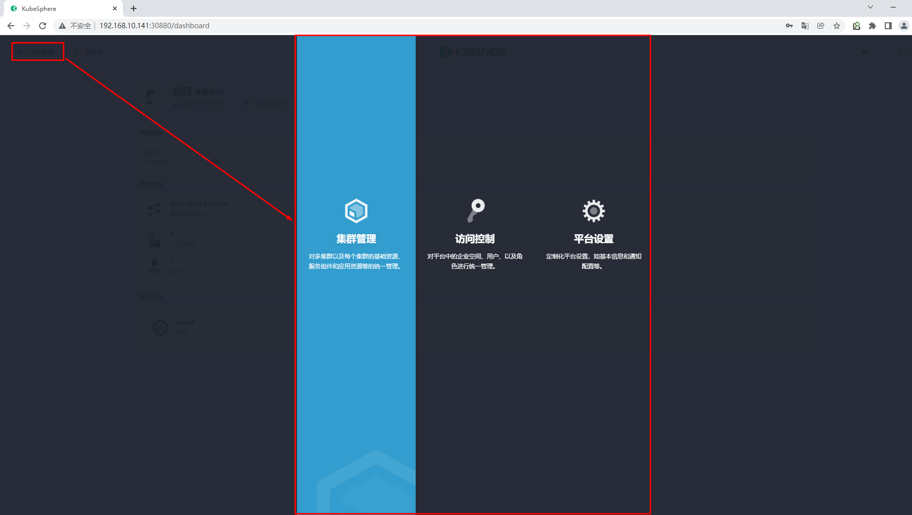
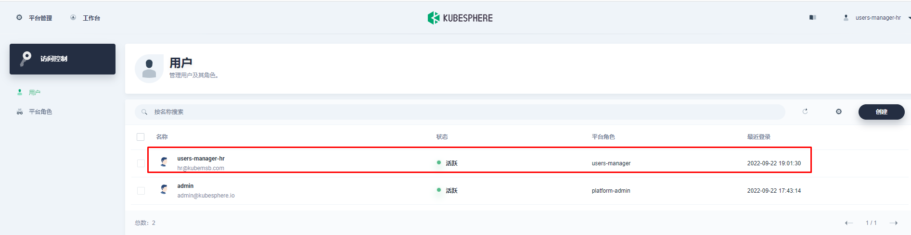
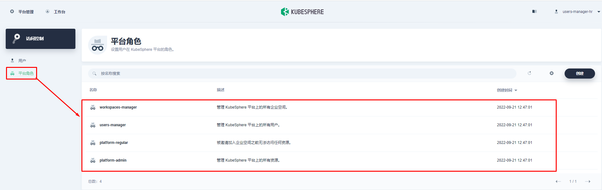
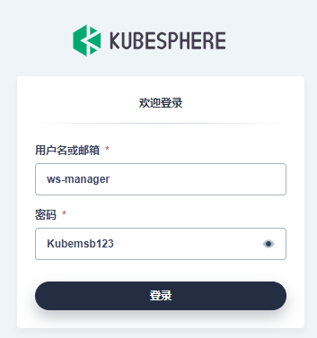
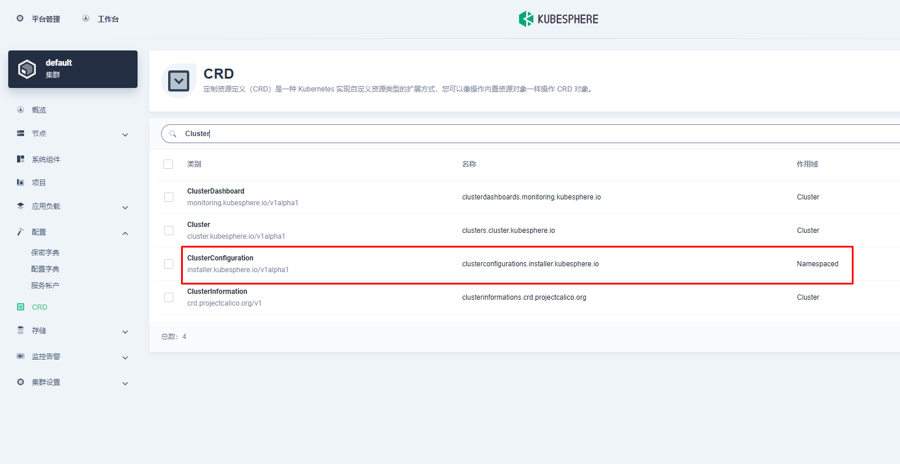

# 在Linux上以all in one模式安装kubernetes & kubesphere

于刚接触 KubeSphere 并想快速上手该容器平台的用户，All-in-One 安装模式是最佳的选择，它能够帮助您零配置快速部署 KubeSphere 和 Kubernetes。

# 一、Linux主机准备

若要以 All-in-One 模式进行安装，您仅需参考以下对机器硬件和操作系统的要求准备一台主机。

>如果您的机器至少有 8 核 CPU 和 16 GB 内存，则建议启用所有组件。

## 1.1 硬件推荐配置

| 操作系统                                               | 最低配置                            |
| :----------------------------------------------------- | :---------------------------------- |
| **Ubuntu** *16.04*, *18.04*                            | 2 核 CPU，4 GB 内存，40 GB 磁盘空间 |
| **Debian** *Buster*, *Stretch*                         | 2 核 CPU，4 GB 内存，40 GB 磁盘空间 |
| **CentOS** *7.x*                                       | 2 核 CPU，4 GB 内存，40 GB 磁盘空间 |
| **Red Hat Enterprise Linux 7**                         | 2 核 CPU，4 GB 内存，40 GB 磁盘空间 |
| **SUSE Linux Enterprise Server 15/openSUSE Leap 15.2** | 2 核 CPU，4 GB 内存，40 GB 磁盘空间 |

>以上的系统要求和以下的教程适用于没有启用任何可选组件的默认最小化安装。

## 1.2 节点要求

- 节点必须能够通过 `SSH` 连接。
- 节点上可以使用 `sudo`/`curl`/`openssl` 命令。

## 1.3 容器运行时

您的集群必须有一个可用的容器运行时。如果您使用 KubeKey 搭建集群，KubeKey 会默认安装最新版本的 Docker。或者，您也可以在创建集群前手动安装 Docker 或其他容器运行时。

| 支持的容器运行时              | 版本     |
| :---------------------------- | :------- |
| Docker                        | 19.3.8 + |
| containerd                    | 最新版   |
| CRI-O（试验版，未经充分测试） | 最新版   |
| iSula（试验版，未经充分测试） | 最新版   |

>如果您想在离线环境中部署 KubeSphere，请务必提前安装一个容器运行时。

~~~powershell
# wget https://mirrors.aliyun.com/docker-ce/linux/centos/docker-ce.repo -O /etc/yum.repos.d/docker-ce.repo
~~~

~~~powershell
# yum -y install docker-ce
~~~

~~~powershell
# systemctl enable --now docker
~~~

~~~powershell
# cat /etc/docker/daemon.json
{
        "exec-opts": ["native.cgroupdriver=systemd"]
}
~~~

~~~powershell
# systemctl restart docker
~~~

## 1.4 依赖项要求

>KubeKey 是用 Go 语言开发的一款全新的安装工具，代替了以前基于 ansible 的安装程序。KubeKey 为用户提供了灵活的安装选择，可以分别安装 KubeSphere 和 Kubernetes 或二者同时安装，既方便又高效。

KubeKey 可以将 Kubernetes 和 KubeSphere 一同安装。针对不同的 Kubernetes 版本，需要安装的依赖项可能有所不同。您可以参考以下列表，查看是否需要提前在节点上安装相关的依赖项。

| 依赖项      | Kubernetes 版本 ≥ 1.18 | Kubernetes 版本 < 1.18 |
| :---------- | :--------------------- | :--------------------- |
| `socat`     | 必须                   | 可选但建议             |
| `conntrack` | 必须                   | 可选但建议             |
| `ebtables`  | 可选但建议             | 可选但建议             |
| `ipset`     | 可选但建议             | 可选但建议             |

~~~powershell
# yum -y install socat conntrack ebtables ipset
~~~

## 1.5 网络和 DNS 要求

- 请确保 `/etc/resolv.conf` 中的 DNS 地址可用，否则，可能会导致集群中的 DNS 出现问题。
- 如果您的网络配置使用防火墙规则或安全组，请务必确保基础设施组件可以通过特定端口相互通信。建议您关闭防火墙。有关更多信息，请参见[端口要求](https://kubesphere.com.cn/docs/installing-on-linux/introduction/port-firewall/)。
- 支持的 CNI 插件：Calico 和 Flannel。其他插件也适用（例如 Cilium 和 Kube-OVN 等），但请注意它们未经充分测试。

> 提示：
>
> - 建议您的操作系统处于干净状态（不安装任何其他软件），否则可能会发生冲突。
> - 如果您无法从 dockerhub.io 下载容器镜像，建议提前准备仓库的镜像地址（即加速器）。

~~~powershell
# cat /etc/resolv.conf 

nameserver 119.29.29.29
~~~

~~~powershell
# firewall-cmd --state
not running
~~~

~~~powershell
# sestatus 
SELinux status:                 disabled
~~~

# 二、下载 KubeKey

> 2.1与2.2看情况使用。

## 2.1 通过GitHub/Googleapis获取kk

从 [GitHub Release Page](https://github.com/kubesphere/kubekey/releases) 下载 KubeKey 或直接使用以下命令。

~~~powershell
curl -sfL https://get-kk.kubesphere.io | VERSION=v2.0.0 sh -
~~~

~~~powershell
输出：
Downloading kubekey v2.0.0 from https://github.com/kubesphere/kubekey/releases/download/v2.0.0/kubekey-v2.0.0-linux-amd64.tar.gz ...

Kubekey v2.0.0 Download Complete!
~~~

~~~powershell
# ls
kk 绿色
~~~

>执行以上命令会下载最新版 KubeKey (v2.0.0)，您可以修改命令中的版本号下载指定版本。

为 `kk` 添加可执行权限：

> 默认不需要添加，注意观察，如果没有执行权限就添加。

~~~powershell
chmod +x kk
~~~

## 2.2 从正确的区域下载 KubeKey。

~~~powershell
export KKZONE=cn
~~~

执行以下命令下载kubekey

~~~powershell
curl -sfL https://get-kk.kubesphere.io | VERSION=v2.0.0 sh -
~~~

>在您下载 KubeKey 后，如果您将其传至新的机器，且访问 Googleapis 同样受限，在您执行以下步骤之前请务必再次执行 `export KKZONE=cn` 命令。

# 三、开始安装

在本快速入门教程中，您只需执行一个命令即可进行安装，其模板如下所示：

~~~powershell
./kk create cluster [--with-kubernetes version] [--with-kubesphere version]
~~~

若要同时安装 Kubernetes 和 KubeSphere，可参考以下示例命令：

~~~powershell
./kk create cluster --with-kubernetes v1.21.5 --with-kubesphere v3.2.1
~~~

>- 安装 KubeSphere 3.2.1 的建议 Kubernetes 版本：1.19.x、1.20.x、1.21.x 或 1.22.x（实验性支持）。如果不指定 Kubernetes 版本，KubeKey 将默认安装 Kubernetes v1.21.5。有关受支持的 Kubernetes 版本的更多信息，请参见[支持矩阵](https://kubesphere.com.cn/docs/installing-on-linux/introduction/kubekey/#支持矩阵)。
>- 一般来说，对于 All-in-One 安装，您无需更改任何配置。
>- 如果您在这一步的命令中不添加标志 `--with-kubesphere`，则不会部署 KubeSphere，KubeKey 将只安装 Kubernetes。如果您添加标志 `--with-kubesphere` 时不指定 KubeSphere 版本，则会安装最新版本的 KubeSphere。
>- KubeKey 会默认安装 [OpenEBS](https://openebs.io/) 为开发和测试环境提供 LocalPV 以方便新用户。对于其他存储类型，请参见[持久化存储配置](https://kubesphere.com.cn/docs/installing-on-linux/persistent-storage-configurations/understand-persistent-storage/)。

执行该命令后，KubeKey 将检查您的安装环境，结果显示在一张表格中。有关详细信息，请参见节点要求和依赖项要求。

# 四、验证安装结果

当您看到以下输出时，表明安装已经完成。

输入以下命令以检查安装结果。

~~~powershell
kubectl logs -n kubesphere-system $(kubectl get pod -n kubesphere-system -l app=ks-install -o jsonpath='{.items[0].metadata.name}') -f
~~~

输出信息会显示 Web 控制台的 IP 地址和端口号，默认的 NodePort 是 `30880`。现在，您可以使用默认的帐户和密码 (`admin/P@88w0rd`) 通过 `<NodeIP>:30880` 访问控制台。

~~~powershell
#####################################################
###              Welcome to KubeSphere!           ###
#####################################################

Console: http://192.168.10.223:30880
Account: admin
Password: P@88w0rd

NOTES：
  1. After you log into the console, please check the
     monitoring status of service components in
     "Cluster Management". If any service is not
     ready, please wait patiently until all components 
     are up and running.
  2. Please change the default password after login.

#####################################################
https://kubesphere.io             20xx-xx-xx xx:xx:xx
#####################################################
~~~

登录至控制台后，您可以在**系统组件**中查看各个组件的状态。如果要使用相关服务，您可能需要等待部分组件启动并运行。您也可以使用 `kubectl get pod --all-namespaces` 来检查 KubeSphere 相关组件的运行状况。

# 在kubernetes集群上最小化安装kubesphere

除了在 Linux 机器上安装 KubeSphere 之外，您还可以将其直接部署在现有的 Kubernetes 集群上。

# 一、准备工作

## 1.1 kubernetes集群节点硬件要求

- 确保您的机器满足最低硬件要求：CPU 大于或等于4 核，内存 大于或等于8 GB。

## 1.2  部署kubernetes集群

>- 如需在 Kubernetes 上安装 KubeSphere 3.2.1，您的 Kubernetes 版本必须为：1.19.x、1.20.x、1.21.x 或 1.22.x（实验性支持）。

可参考使用kubeadm部署kubernetes集群方法。

> 本案例采用4个节点，其中3个节点用于部署kubernetes集群，1个节点用于提供存储动态供给。

## 1.3 后端存储动态供给准备

> 在安装之前，需要配置kubernetes个课程上的默认存储类型。

### 1.3.1  准备硬盘

~~~powershell
查看准备的磁盘
[root@nfsserver ~]# lsblk
NAME            MAJ:MIN RM  SIZE RO TYPE MOUNTPOINT
sda               8:0    0  100G  0 disk
├─sda1            8:1    0    1G  0 part /boot
└─sda2            8:2    0   99G  0 part
  ├─centos-root 253:0    0   50G  0 lvm  /
  ├─centos-swap 253:1    0    2G  0 lvm  [SWAP]
  └─centos-home 253:2    0   47G  0 lvm  /home
sdb               8:16   0  100G  0 disk
~~~

### 1.3.2  安装NFS软件

~~~powershell
安装NFS软件，即是客户端也是服务器端
# yum -y install nfs-utils
~~~

### 1.3.3  NFS配置

~~~powershell
创建挂载点
# mkdir /netshare
~~~

~~~powershell
格式化硬盘
# mkfs.xfs /dev/sdb
~~~

~~~powershell
编辑文件系统配置文件
# vim /etc/fstab
在文件最后添加此行内容
/dev/sdb                /netshare               xfs     defaults        0 0
~~~

~~~powershell
手动挂载全部分区
# mount -a
~~~

~~~powershell
在本地查看文件系统挂载情况
# df -h
文件系统                 容量  已用  可用 已用% 挂载点

/dev/sdb                 100G   33M  100G    1% /netshare
~~~

~~~powershell
添加共享目录到配置文件
# vim /etc/exports
# cat /etc/exports
/netshare       *(rw,sync,no_root_squash)
~~~

~~~powershell
启动服务及设置开机自启动
# systemctl enable nfs-server
# systemctl start nfs-server
~~~

### 1.3.4 验证

~~~powershell
本地验证目录是否共享
# showmount -e
Export list for nfsserver:
/netshare *
~~~

~~~powershell
在k8s master节点验证目录是否共享
# showmount -e nfsserver.kubemsb.com
Export list for nfsserver.kubemsb.com:
/netshare *
~~~

~~~powershell
在k8s worker01节点验证目录是否共享
# showmount -e nfsserver.kubemsb.com
Export list for nfsserver.kubemsb.com:
/netshare *
~~~

~~~powershell
在k8s worker02节点验证目录是否共享
# showmount -e nfsserver.kubemsb.com
Export list for nfsserver.kubemsb.com:
/netshare *
~~~

### 1.3.5  部署存储动态供给

#### 1.3.5.1  获取资源清单文件

~~~powershell
在k8s master节点获取NFS后端存储动态供给配置资源清单文件

# for file in class.yaml deployment.yaml rbac.yaml  ; do wget https://raw.githubusercontent.com/kubernetes-incubator/external-storage/master/nfs-client/deploy/$file ; done
~~~

~~~powershell
查看是否下载
# ls
class.yaml  deployment.yaml  rbac.yaml
~~~

#### 1.3.5.2 应用资源清单文件

~~~powershell
应用rbac资源清单文件
# kubectl apply -f rbac.yaml
~~~

~~~powershell
应用class（存储类）资源清单文件
# kubectl apply -f class.yaml
storageclass.storage.k8s.io/managed-nfs-storage created
~~~

~~~powershell
应用deployment资源清单文件之前修改其配置，主要配置NFS服务器及其共享的目录
# vim deployment.yaml

注意修改处内容

env:
            - name: PROVISIONER_NAME
              value: fuseim.pri/ifs
            - name: NFS_SERVER
              value: nfsserver.kubemsb.com 远程NFS服务器地址
            - name: NFS_PATH
              value: /netshare 共享出来的目录
      volumes:
        - name: nfs-client-root
          nfs:
            server: nfsserver.kubemsb.com 远程NFS服务器地址
            path: /netshare 共享出来的目录

~~~

~~~powershell
应用资源清单文件
# kubectl apply -f deployment.yaml
~~~

~~~powershell
查看pod运行情况

# kubectl get pods
出现以下表示成功运行
NAME                                                     READY   STATUS    RESTARTS   AGE

nfs-client-provisioner-f66d6fbdb-mcrpk                   1/1     Running   0          73s
~~~

> 以下为特别注意事项。

~~~powershell
k8s 1.21版本存在问题：无法创建PV，修改api文件，此文件被自动监视，修改后会自动关闭原有Pod，拉起拉的Pod
# cat /etc/kubernetes/manifests/kube-apiserver.yaml
apiVersion: v1
kind: Pod
metadata:
  annotations:
    kubeadm.kubernetes.io/kube-apiserver.advertise-address.endpoint: 192.168.10.10:6443
  creationTimestamp: null
  labels:
    component: kube-apiserver
    tier: control-plane
  name: kube-apiserver
  namespace: kube-system
spec:
  containers:
  - command:
    - kube-apiserver
    - --feature-gates=RemoveSelfLink=false 添加此行内容
    - --advertise-address=192.168.10.10
    - --allow-privileged=true
    - --authorization-mode=Node,RBAC
~~~

>使用新的不基于 SelfLink 功能的 provisioner 镜像，重新创建 provisioner 容器。镜像：registry.cn-beijing.aliyuncs.com/pylixm/nfs-subdir-external-provisioner:v4.0.0

~~~powershell
设置默认存储类
# kubectl patch storageclass managed-nfs-storage -p '{"metadata": {"annotations":{"storageclass.kubernetes.io/is-default-class":"true"}}}'
~~~

#### 1.3.5.3 测试用例验证动态供给是否可用

> 使用测试用例测试NFS后端存储是否可用

~~~powershell
测试用例：
# cat nginx.yaml
---
apiVersion: v1
kind: Service
metadata:
  name: nginx
  labels:
    app: nginx
spec:
  ports:
  - port: 80
    name: web
  clusterIP: None
  selector:
    app: nginx
---
apiVersion: apps/v1
kind: StatefulSet
metadata:
  name: web
spec:
  selector:
    matchLabels:
      app: nginx
  serviceName: "nginx"
  replicas: 2
  template:
    metadata:
      labels:
        app: nginx
    spec:
      imagePullSecrets:
      - name: huoban-harbor
      terminationGracePeriodSeconds: 10
      containers:
      - name: nginx
        image: nginx:latest
        ports:
        - containerPort: 80
          name: web
        volumeMounts:
        - name: www
          mountPath: /usr/share/nginx/html
  volumeClaimTemplates:
  - metadata:
      name: www
    spec:
      accessModes: [ "ReadWriteOnce" ]
      storageClassName: "managed-nfs-storage"
      resources:
        requests:
          storage: 1Gi
~~~

# 二、部署Kubesphere

## 2.1 最小化安装

~~~powershell
kubectl apply -f https://github.com/kubesphere/ks-installer/releases/download/v3.2.1/kubesphere-installer.yaml
   
kubectl apply -f https://github.com/kubesphere/ks-installer/releases/download/v3.2.1/cluster-configuration.yaml
~~~

> 如需求开启更多功能，可在cluster-configuration.yaml文件中配置。

## 2.2 检查安装日志

~~~powershell
kubectl logs -n kubesphere-system $(kubectl get pod -n kubesphere-system -l app=ks-install -o jsonpath='{.items[0].metadata.name}') -f
~~~

## 2.3 检查kubesphere安装是否正常

使用 `kubectl get pod --all-namespaces` 查看所有 Pod 是否在 KubeSphere 的相关命名空间中正常运行。如果是，请通过以下命令检查控制台的端口（默认为 `30880`）：

~~~powershell
kubectl get svc/ks-console -n kubesphere-system
~~~

- 通过 NodePort `(IP:30880)` 使用默认帐户和密码 `(admin/P@88w0rd)` 访问 Web 控制台。

## 2.4 访问kubesphere

# 微服务项目 基于Kubernetes集群PaaS云平台 Kubesphere部署

# 一、Kubernetes集群持久存储准备 NFS

> 在安装之前，需要配置kubernetes个课程上的默认存储类型。

## 1.1  准备硬盘

~~~powershell
查看准备的磁盘
[root@nfsserver ~]# lsblk
NAME            MAJ:MIN RM  SIZE RO TYPE MOUNTPOINT
sda               8:0    0  100G  0 disk
├─sda1            8:1    0    1G  0 part /boot
└─sda2            8:2    0   99G  0 part
  ├─centos-root 253:0    0   50G  0 lvm  /
  ├─centos-swap 253:1    0    2G  0 lvm  [SWAP]
  └─centos-home 253:2    0   47G  0 lvm  /home
sdb               8:16   0  100G  0 disk
~~~

## 1.2  安装NFS软件

~~~powershell
安装NFS软件，即是客户端也是服务器端
# yum -y install nfs-utils
~~~

## 1.3  NFS配置

~~~powershell
创建挂载点
# mkdir /netshare
~~~

~~~powershell
格式化硬盘
# mkfs.xfs /dev/sdb
~~~

~~~powershell
编辑文件系统配置文件
# vim /etc/fstab
在文件最后添加此行内容
/dev/sdb                /netshare               xfs     defaults        0 0
~~~

~~~powershell
手动挂载全部分区
# mount -a
~~~

~~~powershell
在本地查看文件系统挂载情况
# df -h
文件系统                 容量  已用  可用 已用% 挂载点

/dev/sdb                 100G   33M  100G    1% /netshare
~~~

~~~powershell
添加共享目录到配置文件
# vim /etc/exports
# cat /etc/exports
/netshare       *(rw,sync,no_root_squash)
~~~

~~~powershell
启动服务及设置开机自启动
# systemctl enable nfs-server
# systemctl start nfs-server
~~~

## 1.4 验证

~~~powershell
本地验证目录是否共享
# showmount -e
Export list for nfsserver:
/netshare *
~~~

~~~powershell
在k8s master节点验证目录是否共享
# showmount -e 192.168.10.147
Export list for 192.168.10.147:
/netshare *
~~~

~~~powershell
在k8s worker01节点验证目录是否共享
# showmount -e 192.168.10.147
Export list for 192.168.10.147:
/netshare *
~~~

## 1.5  部署存储动态供给

### 1.5.1  获取资源清单文件

~~~powershell
在k8s master节点获取NFS后端存储动态供给配置资源清单文件

# for file in class.yaml deployment.yaml rbac.yaml  ; do wget https://raw.githubusercontent.com/kubernetes-incubator/external-storage/master/nfs-client/deploy/$file ; done
~~~

~~~powershell
查看是否下载
# ls
class.yaml  deployment.yaml  rbac.yaml
~~~

### 1.5.2 应用资源清单文件

~~~powershell
应用rbac资源清单文件
# kubectl apply -f rbac.yaml
~~~

~~~powershell
修改存储类名称
# vim class.yaml
# cat class.yaml
apiVersion: storage.k8s.io/v1
kind: StorageClass
metadata:
  name: nfs-client
provisioner: fuseim.pri/ifs # or choose another name, must match deployment's env PROVISIONER_NAME'
parameters:
  archiveOnDelete: "false"
~~~

~~~powershell
应用class（存储类）资源清单文件
# kubectl apply -f class.yaml
storageclass.storage.k8s.io/nfs-client created
~~~

~~~powershell
应用deployment资源清单文件之前修改其配置，主要配置NFS服务器及其共享的目录
# vim deployment.yaml

注意修改处内容

# vim deployment.yaml
# cat deployment.yaml
apiVersion: apps/v1
kind: Deployment
metadata:
  name: nfs-client-provisioner
  labels:
    app: nfs-client-provisioner
  # replace with namespace where provisioner is deployed
  namespace: default
spec:
  replicas: 1
  strategy:
    type: Recreate
  selector:
    matchLabels:
      app: nfs-client-provisioner
  template:
    metadata:
      labels:
        app: nfs-client-provisioner
    spec:
      serviceAccountName: nfs-client-provisioner
      containers:
        - name: nfs-client-provisioner
          image: registry.cn-beijing.aliyuncs.com/pylixm/nfs-subdir-external-provisioner:v4.0.0
          volumeMounts:
            - name: nfs-client-root
              mountPath: /persistentvolumes
          env:
            - name: PROVISIONER_NAME
              value: fuseim.pri/ifs
            - name: NFS_SERVER
              value: 192.168.10.147
            - name: NFS_PATH
              value: /netshare
      volumes:
        - name: nfs-client-root
          nfs:
            server: 192.168.10.147
            path: /netshare

~~~

~~~powershell
应用资源清单文件
# kubectl apply -f deployment.yaml
~~~

~~~powershell
查看pod运行情况

# kubectl get pods
出现以下表示成功运行
NAME                                     READY   STATUS    RESTARTS   AGE
nfs-client-provisioner-8bcf6c987-7cb8p   1/1     Running   0          74s
~~~

~~~powershell
设置默认存储类
# kubectl patch storageclass nfs-client -p '{"metadata": {"annotations":{"storageclass.kubernetes.io/is-default-class":"true"}}}'
~~~

~~~powershell
# kubectl get sc
NAME                   PROVISIONER      RECLAIMPOLICY   VOLUMEBINDINGMODE   ALLOWVOLUMEEXPANSION   AGE
nfs-client (default)   fuseim.pri/ifs   Delete          Immediate           false                  18m
~~~

### 1.5.3 测试用例验证动态供给是否可用

> 使用测试用例测试NFS后端存储是否可用

~~~powershell
测试用例：
# vim nginx.yaml
# cat nginx.yaml
---
apiVersion: v1
kind: Service
metadata:
  name: nginx
  labels:
    app: nginx
spec:
  ports:
  - port: 80
    name: web
  clusterIP: None
  selector:
    app: nginx
---
apiVersion: apps/v1
kind: StatefulSet
metadata:
  name: web
spec:
  selector:
    matchLabels:
      app: nginx
  serviceName: "nginx"
  replicas: 2
  template:
    metadata:
      labels:
        app: nginx
    spec:
      containers:
      - name: nginx
        image: nginx:latest
        ports:
        - containerPort: 80
          name: web
        volumeMounts:
        - name: www
          mountPath: /usr/share/nginx/html
  volumeClaimTemplates:
  - metadata:
      name: www
    spec:
      accessModes: [ "ReadWriteOnce" ]
      storageClassName: "nfs-client"
      resources:
        requests:
          storage: 1Gi
~~~

~~~powershell
# kubectl apply -f nginx.yaml
service/nginx created
statefulset.apps/web created
~~~

~~~powershell
# kubectl get pvc
NAME        STATUS   VOLUME                                     CAPACITY   ACCESS MODES   STORAGECLASS   AGE
www-web-0   Bound    pvc-57bee742-326b-4d41-b241-7f2b5dd22596   1Gi        RWO            nfs-client     3m19s
~~~

# 二、Kubesphere部署

~~~powershell
# kubectl apply -f https://github.com/kubesphere/ks-installer/releases/download/v3.2.1/kubesphere-installer.yaml
~~~

~~~powershell
# kubectl apply -f https://github.com/kubesphere/ks-installer/releases/download/v3.2.1/cluster-configuration.yaml
~~~

~~~powershell
# kubectl logs -n kubesphere-system $(kubectl get pod -n kubesphere-system -l 'app in (ks-install, ks-installer)' -o jsonpath='{.items[0].metadata.name}') -f
~~~

~~~powershell
**************************************************
Waiting for all tasks to be completed ...
task network status is successful  (1/4)
task openpitrix status is successful  (2/4)
task multicluster status is successful  (3/4)
task monitoring status is successful  (4/4)
**************************************************
Collecting installation results ...
#####################################################
###              Welcome to KubeSphere!           ###
#####################################################

Console: http://192.168.10.141:30880
Account: admin
Password: P@88w0rd

NOTES：
  1. After you log into the console, please check the
     monitoring status of service components in
     "Cluster Management". If any service is not
     ready, please wait patiently until all components
     are up and running.
  2. Please change the default password after login.

#####################################################
~~~

# 三、Kubesphere开启devops功能

# kubesphere多租户管理系统应用

# 一、kubesphere平台登录

# 二、Kubesphere应用架构

## 2.1 架构介绍

- KubeSphere 的多租户系统分**三个**层级，即集群、企业空间和项目。
  - **集群**即为kubernetes集群
  - **企业空间**是用来管理[项目](https://kubesphere.com.cn/docs/v3.3/project-administration/)、[DevOps 项目](https://kubesphere.com.cn/docs/v3.3/devops-user-guide/)、[应用模板](https://kubesphere.com.cn/docs/v3.3/workspace-administration/upload-helm-based-application/)和应用仓库的一种逻辑单元。可以在企业空间中控制资源访问权限，也可以安全地在团队内部分享资源。
  - **项目**即为kubernetes的命名空间
- 您需要创建一个新的企业空间进行操作，而不是使用系统企业空间，系统企业空间中运行着系统资源，绝大部分仅供查看。出于安全考虑，强烈建议给不同的租户授予不同的权限在企业空间中进行协作。

- 可以在一个 KubeSphere 集群中创建多个企业空间，每个企业空间下可以创建多个项目。

## 2.2 创建企业空间、项目、用户和平台角色

KubeSphere 为每个级别默认设有多个内置角色。此外，您还可以创建拥有自定义权限的角色。KubeSphere 多层次结构适用于具有不同团队或组织以及每个团队中需要不同角色的企业用户。

### 2.2.1 创建用户

安装 KubeSphere 之后，您需要向平台添加具有不同角色的用户，以便他们可以针对自己授权的资源在不同的层级进行工作。一开始，系统默认只有一个用户 `admin`，具有 `platform-admin` 角色。在本步骤中，您将创建一个示例用户 `user-manager`，然后使用 `user-manager` 创建新用户。

1.以 `admin` 身份使用默认帐户和密码 (`admin/P@88w0rd`,本次使用`admin/Kubemsb123`) 登录 Web 控制台。

>出于安全考虑，强烈建议您在首次登录控制台时更改密码。若要更改密码，在右上角的下拉列表中选择**用户设置**，在**密码设置**中设置新密码，您也可以在**用户设置** > **基本信息**中修改控制台语言。

2.点击左上角的**平台管理**，然后选择**访问控制**。在左侧导航栏中，选择**平台角色**。四个内置角色的描述信息如下表所示。

| 内置角色             | 描述                                                         |
| :------------------- | :----------------------------------------------------------- |
| `workspaces-manager` | 企业空间管理员，管理平台所有企业空间。                       |
| `users-manager`      | 用户管理员，管理平台所有用户。                               |
| `platform-regular`   | 平台普通用户，在被邀请加入企业空间或集群之前没有任何资源操作权限。 |
| `platform-admin`     | 平台管理员，可以管理平台内的所有资源。                       |

>内置角色由 KubeSphere 自动创建，无法编辑或删除。

3.在**用户**中，点击**创建**。在弹出的对话框中，提供所有必要信息（带有*标记），然后在**平台角色**一栏选择 `users-manager`

完成后，点击**确定**。新创建的用户将显示在**用户**页面。

4.切换用户使用 `user-manager` 重新登录，创建如下四个新用户，这些用户将在其他的教程中使用。

>- 帐户登出请点击右上角的用户名，然后选择**登出**。
>- 下面仅为示例用户名，请根据实际情况修改。

| 用户              | 指定的平台角色       | 用户权限                                                     |
| :---------------- | :------------------- | :----------------------------------------------------------- |
| `ws-manager`      | `workspaces-manager` | 创建和管理所有企业空间。                                     |
| `ws-admin`        | `platform-regular`   | 被邀请到企业空间后，管理该企业空间中的所有资源（在此示例中，此用户用于邀请新成员加入该企业空间）。 |
| `project-admin`   | `platform-regular`   | 创建和管理项目以及 DevOps 项目，并邀请新成员加入项目。       |
| `project-regular` | `platform-regular`   | `project-regular` 将由 `project-admin` 邀请至项目或 DevOps 项目。该用户将用于在指定项目中创建工作负载、流水线和其他资源。 |

5.在**用户**页面，查看创建的四个用户。

>您可以点击用户名称后的  图标选择启用或禁用某个用户。您也可以勾选多个用户进行批量操作。

### 2.2.2 创建企业空间

需要使用上一个步骤中创建的用户 `ws-manager` 创建一个企业空间。作为管理项目、DevOps 项目和组织成员的基本逻辑单元，企业空间是 KubeSphere 多租户系统的基础。

1.以 `ws-manager` 身份登录 KubeSphere。点击左上角的**平台管理**，选择**访问控制**。在**企业空间**中，可以看到仅列出了一个默认企业空间 `system-workspace`，即系统企业空间，其中运行着与系统相关的组件和服务，您无法删除该企业空间。

2.点击右侧的**创建**，将新企业空间命名为 `demo-workspace`，并将用户 `ws-admin` 设置为企业空间管理员。完成后，点击**创建**。

>如果您已启用[多集群功能](https://kubesphere.com.cn/docs/v3.3/multicluster-management/)，您需要为企业空间[分配一个或多个可用集群](https://kubesphere.com.cn/docs/v3.3/cluster-administration/cluster-settings/cluster-visibility-and-authorization/#在创建企业空间时选择可用集群)，以便项目可以在集群中创建。

3.登出控制台，然后以 `ws-admin` 身份重新登录。在**企业空间设置**中，选择**企业空间成员**，然后点击**邀请**。

4.邀请 `project-admin` 和 `project-regular` 进入企业空间，分别授予 `demo-workspace-self-provisioner` 和 `demo-workspace-viewer` 角色，点击**确定**。

> 实际角色名称的格式：`<workspace name>-<role name>`。例如，在名为 `demo-workspace` 的企业空间中，角色 `viewer` 的实际角色名称为 `demo-workspace-viewer`。

5.将 `project-admin` 和 `project-regular` 都添加到企业空间后，点击**确定**。在**企业空间成员**中，您可以看到列出的三名成员。

| 用户              | 分配的企业空间角色                | 角色权限                                                     |
| :---------------- | :-------------------------------- | :----------------------------------------------------------- |
| `ws-admin`        | `demo-workspace-admin`            | 管理指定企业空间中的所有资源（在此示例中，此用户用于邀请新成员加入企业空间）。 |
| `project-admin`   | `demo-workspace-self-provisioner` | 创建和管理项目以及 DevOps 项目，并邀请新成员加入项目。       |
| `project-regular` | `demo-workspace-viewer`           | `project-regular` 将由 `project-admin` 邀请至项目或 DevOps 项目。该用户将用于在指定项目中创建工作负载、流水线和其他资源。 |

### 2.2.3 创建项目

在此步骤中，您需要使用在上一步骤中创建的帐户 `project-admin` 来创建项目。KubeSphere 中的项目与 Kubernetes 中的命名空间相同，为资源提供了虚拟隔离。有关更多信息，请参见[命名空间](https://kubernetes.io/zh/docs/concepts/overview/working-with-objects/namespaces/)。

1.以 `project-admin` 身份登录 KubeSphere Web 控制台，在**项目**中，点击**创建**。

2.输入项目名称（例如 `demo-project`），点击**确定**。您还可以为项目添加别名和描述。

3.在**项目**中，点击刚创建的项目查看其详情页面。

4.在项目的**概览**页面，默认情况下未设置项目配额。您可以点击**编辑配额**并根据需要指定[资源请求和限制](https://v3-2.docs.kubesphere.io/zh/docs/workspace-administration/project-quotas/)（例如：CPU 和内存的限制分别设为 1 Core 和 1000 Gi）。

5.在**项目设置** > **项目成员**中，邀请 `project-regular` 至该项目，并授予该用户 `operator` 角色。

>具有 `operator` 角色的用户是项目维护者，可以管理项目中除用户和角色以外的资源。

6.在创建[应用路由](https://v3-2.docs.kubesphere.io/zh/docs/project-user-guide/application-workloads/routes/)（即 Kubernetes 中的 [Ingress](https://kubernetes.io/docs/concepts/services-networking/ingress/)）之前，需要启用该项目的网关。网关是在项目中运行的 [NGINX Ingress 控制器](https://github.com/kubernetes/ingress-nginx)。若要设置网关，请转到**项目设置**中的**网关设置**，然后点击**设置网关**。此步骤中仍使用帐户 `project-admin`。

7.选择访问方式 **NodePort**，然后点击**确定**。

8.在**网关设置**下，可以在页面上看到网关地址以及 http/https 的端口。

>如果要使用 `LoadBalancer` 暴露服务，则需要使用云厂商的 LoadBalancer 插件。如果您的 Kubernetes 集群在裸机环境中运行，建议使用 [OpenELB](https://github.com/kubesphere/openelb) 作为 LoadBalancer 插件。

### 2.2.4 创建角色

完成上述步骤后，您已了解可以为不同级别的用户授予不同角色。先前步骤中使用的角色都是 KubeSphere 提供的内置角色。在此步骤中，您将学习如何创建自定义角色以满足工作需求。

1.再次以 `admin` 身份登录 KubeSphere Web 控制台，转到**访问控制**。

2.点击左侧导航栏中的**平台角色**，再点击右侧的**创建**。

>**平台角色**页面的预设角色无法编辑或删除。

3.在**创建平台角色**对话框中，设置角色标识符（例如，`clusters-admin`）、角色名称和描述信息，然后点击**编辑权限**。

> 本示例演示如何创建负责集群管理的角色。

4.在**编辑权限**对话框中，设置角色权限（例如，选择**集群管理**）并点击**确定**。

>- 在本示例中，角色 `clusters-admin` 包含**集群管理**和**集群查看**权限。
>- 一些权限依赖于其他权限，依赖项由每项权限下的**依赖于**字段指定。
>- 选择权限后，将自动选择它所依赖的权限。
>- 若要取消选择权限，则需要首先取消选择其从属权限。

5.在**平台角色**页面，可以点击所创建角色的名称查看角色详情，点击  以编辑角色、编辑角色权限或删除该角色。

6.在**用户**页面，可以在创建帐户或编辑现有帐户时为帐户分配该角色。

### 2.2.5 创建DevOps

>若要创建 DevOps 项目，需要预先启用 KubeSphere DevOps 系统，该系统是个可插拔的组件，提供 CI/CD 流水线、Binary-to-Image 和 Source-to-Image 等功能。有关如何启用 DevOps 的更多信息，请参见 [KubeSphere DevOps 系统](https://v3-2.docs.kubesphere.io/zh/docs/pluggable-components/devops/)。

~~~powershell
# kubectl logs -n kubesphere-system $(kubectl get pod -n kubesphere-system -l app=ks-install -o jsonpath='{.items[0].metadata.name}') -f
~~~

1.以 `project-admin` 身份登录控制台，在 **DevOps 项目**中，点击**创建**。

2.输入 DevOps 项目名称（例如 `demo-devops`），然后点击**确定**，也可以为该项目添加别名和描述。

3.点击刚创建的项目查看其详细页面。

4.转到 **DevOps 项目设置**，然后选择 **DevOps 项目成员**。点击**邀请**授予 `project-regular` 用户 `operator` 的角色，允许其创建流水线和凭证。

至此，您已熟悉 KubeSphere 的多租户管理系统。在其他教程中，`project-regular` 帐户还将用于演示如何在项目或 DevOps 项目中创建应用程序和资源。

# KubeSphere应用发布初体验

# 一、WordPress 简介

WordPress（使用 PHP 语言编写）是免费、开源的内容管理系统，用户可以使用 WordPress 搭建自己的网站。完整的 WordPress 应用程序包括以下 Kubernetes 对象，由 MySQL 作为后端数据库。

# 二、目的

本教程演示了如何在 KubeSphere 中创建应用程序（以 WordPress 为例）并在集群外进行访问。

# 三、准备工作

您需要准备一个 `project regular` 帐户，并在一个项目中赋予该帐户 `operator` 角色（该用户已被邀请参加该项目）。

# 四、部署过程

## 4.1 创建密钥

### 4.1.1 创建MySQL密钥

> 环境变量 `WORDPRESS_DB_PASSWORD` 是连接到 WordPress 数据库的密码。

在此步骤中，您需要创建一个密钥来保存将在 MySQL Pod 模板中使用的环境变量。

1.使用 `project-regular` 帐户登录 KubeSphere 控制台，访问 `demo-project` 的详情页并导航到**配置**。在**保密字典**中，点击右侧的**创建**。

2.输入基本信息（例如，将其命名为 `mysql-secret`）并点击**下一步**。在下一页中，选择**类型**为 **Opaque（默认）**，然后点击**添加数据**来添加键值对。输入如下所示的键 (Key) `MYSQL_ROOT_PASSWORD` 和值 (Value) `123456`，点击右下角 **√** 进行确认。完成后，点击**创建**按钮以继续。

### 4.1.2 创建WordPress密钥

按照以上相同的步骤创建一个名为 `wordpress-secret` 的 WordPress 密钥，输入键 (Key) `WORDPRESS_DB_PASSWORD` 和值 (Value) `123456`。创建的密钥显示在列表中。

## 4.2 创建存储卷

1.访问**存储**下的**存储卷**，点击**创建**。

2.输入卷的基本信息（例如，将其命名为 `wordpress-pvc`），然后点击**下一步**。

3.在**存储卷设置**中，需要选择一个可用的**存储类型**，并设置**访问模式**和**存储卷容量**。您可以直接使用默认值，点击**下一步**继续。

4.在**高级设置**中，您无需添加额外的配置，点击**创建**完成即可。

## 4.3 创建应用程序

### 4.3.1 添加MySQL后端组件

1.导航到**应用负载**下的**应用**，选择**自制应用** > **创建**。

2.输入基本信息（例如，在应用名称一栏输入 `wordpress`），然后点击**下一步**。

3.在**服务设置**中，点击**创建服务**以在应用中设置组件。

4.设置组件的服务类型为**有状态服务**。

5.输入有状态服务的名称（例如 **mysql**）并点击**下一步**。

6.在**容器组设置**中，点击**添加容器**。

7.在搜索框中输入 `mysql:5.6`，按下**回车键**，然后点击**使用默认端口**。由于配置还未设置完成，请不要点击右下角的 **√** 按钮。

>在**高级设置**中，请确保内存限制不小于 1000 Mi，否则 MySQL 可能因内存不足而无法启动。

8.向下滚动到**环境变量**，点击**引用配置文件或密钥**。输入名称 `MYSQL_ROOT_PASSWORD`，然后选择资源 `mysql-secret` 和前面步骤中创建的密钥 `MYSQL_ROOT_PASSWORD`，完成后点击 **√** 保存配置，最后点击**下一步**继续。

9.选择**存储卷设置**中的**添加存储卷模板**，输入**存储卷名称** (`mysql`) 和**挂载路径**（模式：`读写`，路径：`/var/lib/mysql`）的值。

完成后，点击 **√** 保存设置并点击**下一步**继续。

10.在**高级设置**中，可以直接点击**添加**，也可以按需选择其他选项。

11.现在，MySQL 组件已经添加完成。

### 4.3.2 添加WordPress前端组件

1.再次点击**创建服务**，选择**无状态服务**。输入名称 `wordpress` 并点击**下一步**。

2.与上述步骤类似，点击**添加容器**，在搜索栏中输入 `wordpress:4.8-apache` 并按下**回车键**，然后点击**使用默认端口**。

3.向下滚动到**环境变量**，点击**引用配置文件或密钥**。这里需要添加两个环境变量，请根据以下截图输入值：

- 对于 `WORDPRESS_DB_PASSWORD`，请选择在步骤 1 中创建的 `wordpress-secret` 和 `WORDPRESS_DB_PASSWORD`。
- 点击**添加环境变量**，分别输入 `WORDPRESS_DB_HOST` 和 `mysql` 作为键 (Key) 和值 (Value)。

>对于此处添加的第二个环境变量，该值必须与步骤 5 中创建 MySQL 有状态服务设置的名称完全相同。否则，WordPress 将无法连接到 MySQL 对应的数据库。

点击 **√** 保存配置，再点击**下一步**继续。

4.在**存储卷设置**中，点击**挂载存储卷**，并**选择存储卷**。

5.选择上一步创建的 `wordpress-pvc`，将模式设置为`读写`，并输入挂载路径 `/var/www/html`。点击 **√** 保存，再点击**下一步**继续。

6.在**高级设置**中，可以直接点击**添加**创建服务，也可以按需选择其他选项。

7.现在，前端组件也已设置完成。点击**下一步**继续。

8.您可以**路由设置**中设置路由规则（应用路由 Ingress），也可以直接点击**创建**。

9.创建后，应用将显示在应用列表中。

## 4.4 验证资源创建情况

在**工作负载**中，分别检查**部署**和**有状态副本集**中 `wordpress-v1` 和 `mysql-v1` 的状态。如果它们的运行状态为**运行中**，就意味着 WordPress 已经成功创建。

## 4.5 通过NodePort访问WordPress

1.若要在集群外访问服务，请首先导航到**服务**。点击 `wordpress` 右侧的三个点后，选择**编辑外部访问**。

2.在**访问方式**中选择 `NodePort`，然后点击**确定**。

3.点击服务进入详情页，可以在**端口**处查看暴露的端口。

4.通过 `{Node IP}:{NodePort}` 访问此应用程序，可以看到下图：

