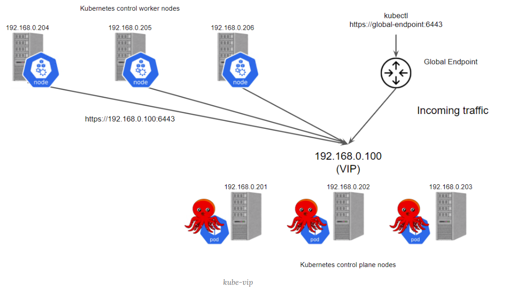
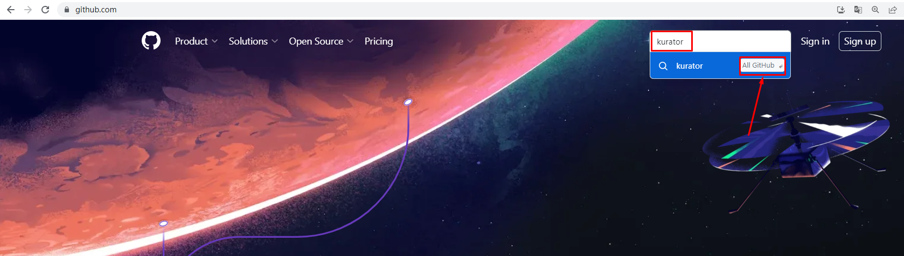
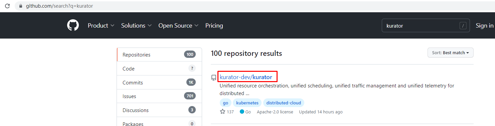
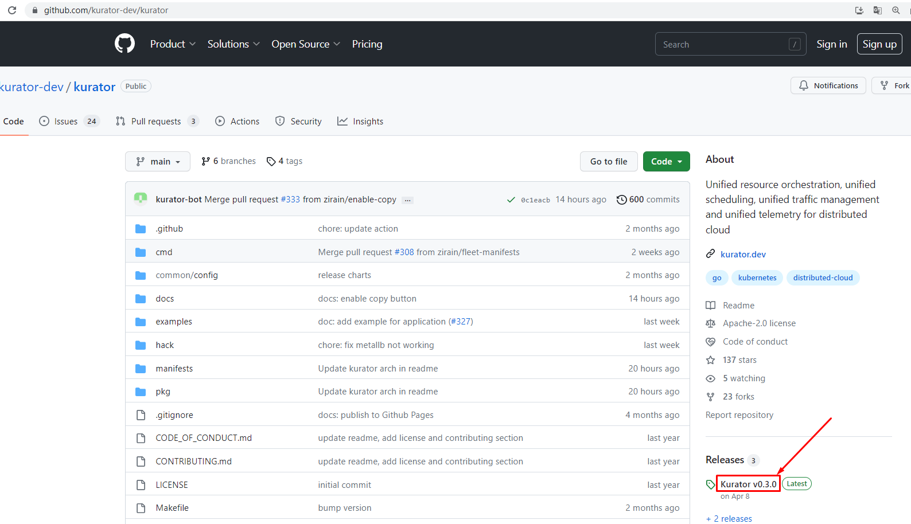
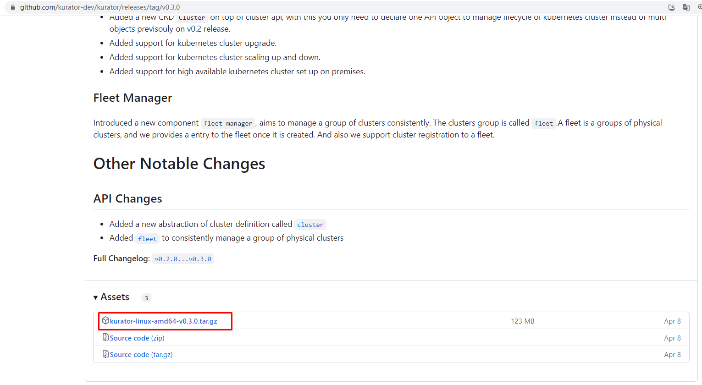
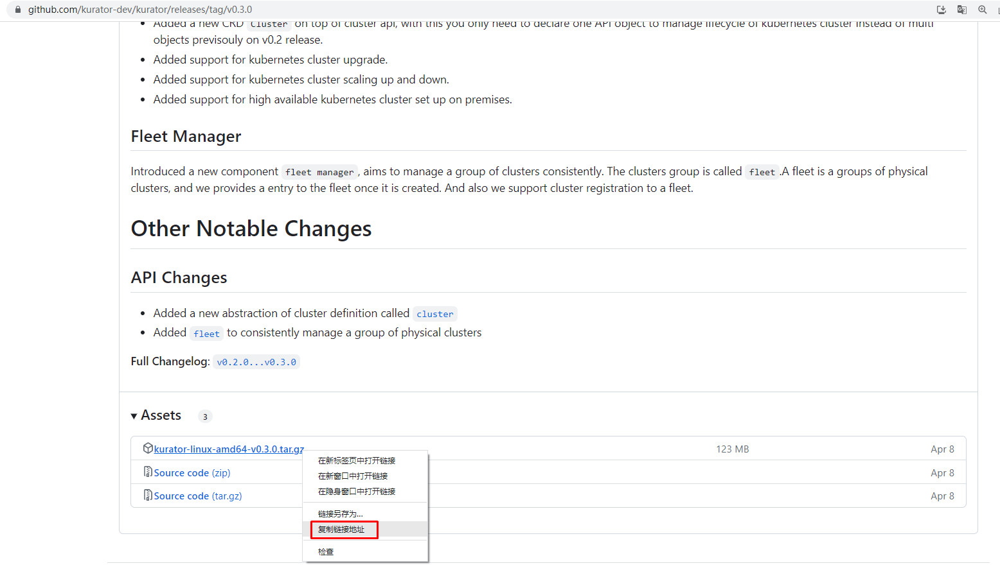
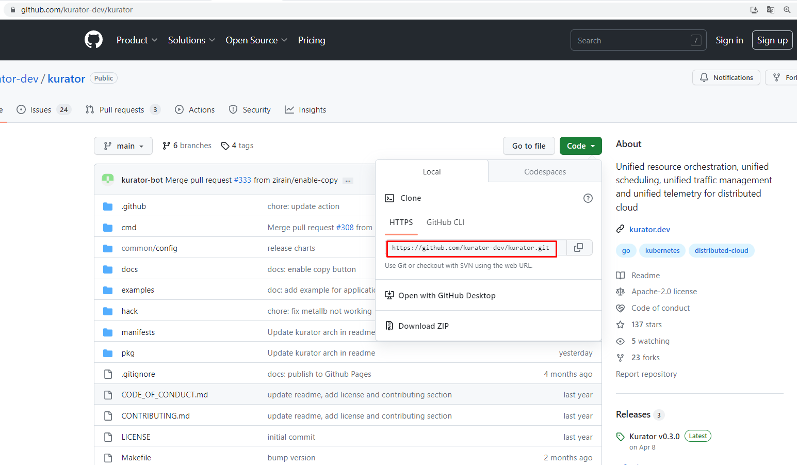

# kubernetes集群舰队管理 Kurator

# 一、Kurator介绍

## 1.1 Kurator是什么？

2023年4月8日，Kurator正式发布v0.3.0版本。

Kurator 是华为云推出的分布式云原生开源套件，通过集成业界主流开源技术栈，帮助用户一站式构建专属的分布式云原生基础设施，助力企业业务跨云跨边、分布式化升级。

Kurator v0.2 版本已具备管理多云基础设施和异构基础设施的核心能力，通过引入Cluster Operator组件，支持“AWS自建集群”和“本地数据中心集群”包括集群创建、清理等在内的生命周期管理特性。

在最新发布的v0.3.0版本中，Cluster Operator不仅分别对两类集群的生命周期管理能力进行了增强，也将v0.2.0版本中的多个API对象抽象成一个API对象cluster，方便用户使用。 

同时，在 cluster 对象基础上，Kurator引入了舰队的概念。每个舰队代表一个物理集群组，方便Kurator未来进行统一的编排、调度，统一的流量治理以及统一的监控运维。目前，Kurator的舰队管理支持多个特性，包括舰队控制平面的生命周期管理，以及集群注册和注销到舰队等。

至此，Kurator 通过集群舰队统一了集群视图。这意味着，Kurator开始具备了支持用户体验一致地管理分布在任何云上的集群的能力，从而进一步协助用户的分布式云原生架构的升级。

## 1.2 Kurator v0.3.0关键特性介绍

- 集群生命周期管理能力增强

Kurator 通过 Cluster Operator组件对集群的生命周期进行管理。基于Cluster API，Cluster Operator 不仅可以管理集群生命周期，还统一并简化了创建集群所需的配置，为用户在不同云平台上管理集群提供了简单易用的API。目前Cluster Operator 支持“本地数据中心集群”和“AWS自建集群”。

- 本地数据中心集群

Kurator基于kubespray对本地数据中心集群的生命周期进行管理。与 kubespray不同的地方在于，Kurator采用了更易于理解和配置的云原生声明式的方法管理集群。

相比较v0.2.0版本，v0.3.0版本的Kurator 带来了以下几个方面的增强特性：

- 批量的工作节点扩缩容。 现在Kurator支持以声明式的方式，在原有集群上增加、删除或者替换多个工作节点。 用户只需要声明集群所需要的最终工作节点状态，Kurator即可在没有任何外部干预的情况下完成节点的批量扩缩容。
- 集群版本升级。 用户可以在API对象上声明要升级到的Kubernetes版本，Kurator便会自动对目标集群的各节点进行升级。
- 增强集群控制面高可用。Kurator为用户提供了一种基于VIP的增强集群控制面高可用的方案。在这种方案下，Kurator利用kube-vip的能力，使用VIP实现跨多个控制平面副本的入站流量负载均衡。

## 1.3 云原生舰队管理

Kurator引入了代表物理集群组的逻辑单元“舰队”，旨在一致地管理一组集群，舰队允许您轻松、一致地管理分布在任何云中的集群。

Kurator通过Fleet Manager实现了对舰队控制平面生命周期管理，并且可以轻松的将集群添加到或从舰队中删除。 未来，Kurator将支持Fleet级的应用编排，并且在Fleet的所有集群中提供统一的命名空间、ServiceAccount、Service，以支持在多个集群之间实现服务发现和通信。此外，Kurator将汇总来自所有集群的监控指标。

Kurator Fleet Manager作为一个Kubernetes Operator运行，负责Fleet控制平面生命周期管理，也负责集群的注册和注销。

# 二、Kurator部署

## 2.1 k8s管理集群准备

> 使用kubespray或kubeasz快速部署一套K8S集群用于实现对其它集群进行管理操作。

~~~powershell
[root@kubespray ~]# cat > /etc/yum.repos.d/k8s.repo <<EOF
[kubernetes]
name=Kubernetes
baseurl=https://mirrors.aliyun.com/kubernetes/yum/repos/kubernetes-el7-x86_64/
enabled=1
gpgcheck=0
repo_gpgcheck=0
gpgkey=https://mirrors.aliyun.com/kubernetes/yum/doc/yum-key.gpg https://mirrors.aliyun.com/kubernetes/yum/doc/rpm-package-key.gpg
EOF
~~~

~~~powershell
[root@kubespray ~]# yum -y install kubectl-1.26.3
~~~

~~~powershell
需要在kubespray主机上准备kubeconfig文件,注意修改连接master节点的IP地址。
[root@kubespray ~]# ls /root/.kube/
config
~~~

~~~powershell
[root@kubespray ~]# kubectl get nodes
NAME    STATUS   ROLES           AGE   VERSION
node1   Ready    control-plane   40d   v1.26.3
node2   Ready    control-plane   40d   v1.26.3
node3   Ready    control-plane   40d   v1.26.3
node4   Ready    <none>          40d   v1.26.3
node5   Ready    <none>          40d   v1.26.3
~~~

## 2.2 安装Kurator客户端

~~~powershell
下载kurator工具包
[root@kubespray ~]# wget https://github.com/kurator-dev/kurator/releases/download/v0.3.0/kurator-linux-amd64-v0.3.0.tar.gz
~~~

~~~powershell
解压工具包
[root@kubespray ~]# tar xf kurator-linux-amd64-v0.3.0.tar.gz
~~~

~~~powershell
查看解压目录包含内容
[root@kubespray ~]# ls out
charts  linux-amd64
[root@kubespray ~]# ls out/linux-amd64/
cluster-operator  Dockerfile  fleet-manager  kurator
~~~

~~~powershell
复制kurator至/usr/bin目录完成安装
[root@kubespray ~]# cp out/linux-amd64/kurator /usr/bin/
~~~

~~~powershell
验证kurator客户端是否可用
[root@kubespray ~]# kurator
Kurator builds distributed cloud-native stacks.

Usage:
  kurator [command]

Available Commands:
  completion  Generate the autocompletion script for the specified shell
  help        Help about any command
  install     Install a target component
  join        Register a cluster or node
  tool        Tool information for the component
  version     Print the version of kurator

Flags:
      --context string           name of the kubeconfig context to use
      --dry-run                  console/log output only, make no changes.
  -h, --help                     help for kurator
      --home-dir string          install path, default to $HOME/.kurator (default "/root/.kurator")
  -c, --kubeconfig string        path to the kubeconfig file, default to karmada apiserver config (default "/etc/karmada/karmada-apiserver.config")
      --wait-interval duration   interval used for checking pod ready, default value is 1s. (default 1s)
      --wait-timeout duration    timeout used for checking pod ready, default value is 2m. (default 2m0s)

Use "kurator [command] --help" for more information about a command.
~~~

## 2.3 Cluster Operator安装

> 部署Cluster Operator，用于实现对自建K8S集群进行管理。

### 2.3.1 helm准备

> 部署Cluster Operator需要使用Helm部署。

~~~powershell
下载helm源文件
[root@kubespray ~]# wget https://get.helm.sh/helm-v3.12.0-linux-amd64.tar.gz
~~~

~~~powershell
解压helm源文件 
[root@kubespray ~]# tar xf helm-v3.12.0-linux-amd64.tar.gz
~~~

~~~powershell
安装helm
[root@kubespray ~]# cp linux-amd64/helm /usr/bin/
~~~

~~~powershell
验证helm版本
[root@kubespray ~]# helm version
version.BuildInfo{Version:"v3.12.0", GitCommit:"c9f554d75773799f72ceef38c51210f1842a1dea", GitTreeState:"clean", GoVersion:"go1.20.3"}
~~~

### 2.3.2 安装cert manager

> 证书管理器，关于cert manager更多介绍，可参考如下链接：https://cert-manager.io/docs/

由于Kurator cluster operator 需要 webhook 证书，默认情况下，使用Helm安装时会导入所需要的证书，当然也可以由cert manager进行自动注入，所以需要提前准备好cert manager证书管理器。cert manager的作用如下：

- cert-manager 将证书和证书颁发者作为资源类型添加到 Kubernetes 集群中，并简化了这些证书的获取、更新和使用过程。
- 它可以从各种受支持的来源颁发证书，包括 [Let's Encrypt](https://letsencrypt.org/)、[HashiCorp Vault](https://www.vaultproject.io/)和[Venafi](https://www.venafi.com/)以及私有 PKI。
- 它将确保证书有效且最新，并尝试在到期前的配置时间更新证书。

~~~powershell
添加cert manager部署使用的helm仓库
[root@kubespray ~]# helm repo add jetstack https://charts.jetstack.io
~~~

~~~powershell
更新仓库
[root@kubespray ~]# helm repo update
~~~

~~~powershell
在管理集群中创建命名空间
[root@kubespray ~]# kubectl create namespace cert-manager
~~~

~~~powershell
使用helm部署cert manager
[root@kubespray ~]# helm install -n cert-manager cert-manager jetstack/cert-manager --set installCRDs=true
~~~

~~~powershell
输出内容如下：
NAME: cert-manager
LAST DEPLOYED: Wed Jun 14 08:25:15 2023
NAMESPACE: cert-manager
STATUS: deployed
REVISION: 1
TEST SUITE: None
NOTES:
cert-manager v1.12.1 has been deployed successfully!

In order to begin issuing certificates, you will need to set up a ClusterIssuer
or Issuer resource (for example, by creating a 'letsencrypt-staging' issuer).

More information on the different types of issuers and how to configure them
can be found in our documentation:

https://cert-manager.io/docs/configuration/

For information on how to configure cert-manager to automatically provision
Certificates for Ingress resources, take a look at the `ingress-shim`
documentation:

https://cert-manager.io/docs/usage/ingress/
~~~

~~~powershell
查看命名空间创建情况
[root@kubespray ~]# kubectl get ns
NAME              STATUS   AGE
cert-manager      Active   126m
~~~

~~~powershell
查看命名空间中pod运行情况
[root@kubespray ~]# kubectl get pods -n cert-manager
NAME                                       READY   STATUS    RESTARTS   AGE
cert-manager-7b5cc56d74-v4zj2              1/1     Running   0          126m
cert-manager-cainjector-7d948796d5-bjdl6   1/1     Running   0          126m
cert-manager-webhook-68f677967c-czb76      1/1     Running   0          126m
~~~

### 2.3.3 Install cluster operator from release package

> 从发布版中安装Cluster Operator

~~~powershell
查看安装使用的源
[root@kubespray ~]# ls out/
charts  linux-amd64

[root@kubespray ~]# ls out/charts/
cluster-operator  cluster-operator-v0.3.0.tgz  fleet-manager  fleet-manager-v0.3.0.tgz
~~~

~~~powershell
使用helm安装Cluster Operator
[root@kubespray ~]# helm install kurator-cluster-operator out/charts/cluster-operator-v0.3.0.tgz -n kurator-system --create-namespace
~~~

~~~powershell
输出内容如下：
NAME: kurator-cluster-operator
LAST DEPLOYED: Wed Jun 14 09:02:55 2023
NAMESPACE: kurator-system
STATUS: deployed
REVISION: 1
TEST SUITE: None
~~~

~~~powershell
查看命名空间创建情况
[root@kubespray ~]# kubectl get ns
NAME              STATUS   AGE
cert-manager      Active   38m
default           Active   40d
ingress-nginx     Active   40d
kube-node-lease   Active   40d
kube-public       Active   40d
kube-system       Active   40d
kurator-system    Active   61s
~~~

~~~powershell
查看命名空间中pod创建情况
[root@kubespray ~]# kubectl get pods -n kurator-system
NAME                                        READY   STATUS    RESTARTS   AGE
kurator-cluster-operator-67d8bd6b68-t64db   1/1     Running   0          73s
~~~

## 2.4 安装 Fleet Manager

> 安装舰队管理器，用于对K8S集群进行逻辑分组

### 2.4.1 Install FluxCD with Helm

> Fleet Manager借助于FluxCD实现对应用程序的部署。参考：https://fluxcd.io

~~~powershell
添加FluxCD部署Charts库
[root@kubespray ~]# helm repo add fluxcd-community https://fluxcd-community.github.io/helm-charts
"fluxcd-community" has been added to your repositories
~~~

~~~powershell
查看
[root@kubespray ~]# helm repo list
NAME                    URL
jetstack                https://charts.jetstack.io
fluxcd-community        https://fluxcd-community.github.io/helm-charts
~~~

~~~powershell
更新
[root@kubespray ~]# helm repo update
~~~

~~~powershell
使用helm部署FluxCD
[root@kubespray ~]# cat <<EOF | helm install fluxcd fluxcd-community/flux2 --version 2.7.0 -n fluxcd-system --create-namespace -f -
imageAutomationController:
  create: false
imageReflectionController:
  create: false
notificationController:
  create: false
EOF
~~~

~~~powershell
输出内容如下：
NAME: fluxcd
LAST DEPLOYED: Wed Jun 14 09:09:28 2023
NAMESPACE: fluxcd-system
STATUS: deployed
REVISION: 1
TEST SUITE: None
~~~

~~~powershell
查看是否创建命名空间
[root@kubespray ~]# kubectl get ns
NAME              STATUS   AGE
cert-manager      Active   47m
default           Active   40d
fluxcd-system     Active   3m7s
~~~

~~~powershell
查看是否运行FluxCD组件
[root@kubespray ~]# kubectl get pods -n fluxcd-system
NAME                                    READY   STATUS    RESTARTS   AGE
helm-controller-7c5ff5d6b4-lwhp7        1/1     Running   0          3m12s
kustomize-controller-5b86757bb4-6mmgj   1/1     Running   0          3m12s
source-controller-79b7ddc9fc-9k6gz      1/1     Running   0          3m12s
~~~

### 2.4.2 Install fleet manager from release package

> 从发行版中安装Fleet Manager

~~~powershell
查看安装源
[root@kubespray ~]# ls out/
charts  linux-amd64
[root@kubespray ~]# ls out/charts/
cluster-operator  cluster-operator-v0.3.0.tgz  fleet-manager  fleet-manager-v0.3.0.tgz
~~~

~~~powershell
使用helm对Fleet-manager进行管理
[root@kubespray ~]# helm install --create-namespace kurator-fleet-manager out/charts/fleet-manager-v0.3.0.tgz -n kurator-system
~~~

~~~powershell
输出内容如下：
NAME: kurator-fleet-manager
LAST DEPLOYED: Wed Jun 14 09:15:24 2023
NAMESPACE: kurator-system
STATUS: deployed
REVISION: 1
TEST SUITE: None
~~~

~~~powershell
查看Fleet Manager部署情况
[root@kubespray ~]# kubectl get pods -n kurator-system
NAME                                        READY   STATUS    RESTARTS   AGE
kurator-cluster-operator-67d8bd6b68-t64db   1/1     Running   0          12m
kurator-fleet-manager-6dbf69dc9d-bh2jm      1/1     Running   0          19s
~~~

# 三、使用Cluster Operator部署企业生产级K8S集群

> Kurator借助KubeSpray实现对K8S集群快速部署，由于KubeSpray版本为2.20.0,目前仅能安装K8S 1.24.6版本。

## 3.1 需要准备用于部署K8S集群节点主机

> 本次准备3台用于部署K8S集群节点主机，仅需要配置主机名，主机IP地址，主机名与IP地址解析即可 。

~~~powershell
为新建集群主机准备主机名
# hostnamectl set-hostname  XXX

请把XXX替换为
master01
node01
node02
~~~

~~~powershell
为新建集群主机准备IP地址
[root@XXX ~]# vim /etc/sysconfig/network-scripts/ifcfg-ens33
[root@XXX ~]# cat /etc/sysconfig/network-scripts/ifcfg-ens33
TYPE="Ethernet"
PROXY_METHOD="none"
BROWSER_ONLY="no"
BOOTPROTO="none"
DEFROUTE="yes"
IPV4_FAILURE_FATAL="no"
IPV6INIT="yes"
IPV6_AUTOCONF="yes"
IPV6_DEFROUTE="yes"
IPV6_FAILURE_FATAL="no"
IPV6_ADDR_GEN_MODE="stable-privacy"
NAME="ens33"
UUID="063bfc1c-c7c2-4c62-89d0-35ae869e44e7"
DEVICE="ens33"
ONBOOT="yes"
IPADDR="192.168.10.14X"
PREFIX="24"
GATEWAY="192.168.10.2"
DNS1="119.29.29.29"

# systemctl restart network
~~~

~~~powershell
为新建集群主机准备主机名与IP地址解析文件
[root@XXX ~]# vim /etc/hosts
[root@XXX ~]# cat /etc/hosts
127.0.0.1 localhost localhost.localdomain localhost4 localhost4.localdomain4
::1 localhost6 localhost6.localdomain6 localhost6.localdomain
192.168.10.140 master01
192.168.10.141 node01
192.168.10.142 node02
~~~

## 3.2 准备ssh密钥

> 在kubespray节点或kubeasz节点

~~~powershell
生成密钥，注意：如已生成过密钥，不建议再生成，可使用原有密钥即可 。
[root@kubespray ~]# ssh-keygen
~~~

~~~powershell
同步密钥到其它主机
[root@kubespray ~]# ssh-copy-id 192.168.10.140

[root@kubespray ~]# ssh-copy-id 192.168.10.141

[root@kubespray ~]# ssh-copy-id 192.168.10.142
~~~

~~~powershell
基于ssh密钥创建secret
[root@kubespray ~]# kubectl create secret generic cluster-secret --from-file=ssh-privatekey=/root/.ssh/id_rsa
secret/cluster-secret created
~~~

~~~powershell
查看已创建secret
[root@kubespray kurator]# kubectl get secret
NAME             TYPE     DATA   AGE
cluster-secret   Opaque   1      9s
~~~

## 3.3 在虚拟机上部署K8S集群

### 3.3.1 准备部署文件

~~~powershell
准备kurator部署K8S集群文件
[root@kubespray ~]# git clone https://github.com/kurator-dev/kurator.git
~~~

~~~powershell
查看文件内容
[root@kubespray ~]# cd kurator/

[root@kubespray kurator]# ls
cmd  CODE_OF_CONDUCT.md  common  CONTRIBUTING.md  docs  examples  go.mod  go.sum  hack  LICENSE  Makefile  manifests  OWNERS  pkg  README.md  ROADMAP.md
~~~

~~~powershell
部署过程中，如果有报crds错误，可以先执行以下目录中的文件
[root@kubespray ~]# ls out/
charts  linux-amd64
[root@kubespray ~]# ls out/charts/
cluster-operator  cluster-operator-v0.3.0.tgz  fleet-manager  fleet-manager-v0.3.0.tgz
[root@kubespray ~]# ls out/charts/cluster-operator
Chart.yaml  crds  templates  values.yaml
[root@kubespray ~]# ls out/charts/cluster-operator/crds/
awsclustercontrolleridentities.infrastructure.cluster.x-k8s.io.yaml  eksconfigs.bootstrap.cluster.x-k8s.io.yaml
awsclusterroleidentities.infrastructure.cluster.x-k8s.io.yaml        eksconfigtemplates.bootstrap.cluster.x-k8s.io.yaml
awsclusters.infrastructure.cluster.x-k8s.io.yaml                     extensionconfigs.runtime.cluster.x-k8s.io.yaml
awsclusterstaticidentities.infrastructure.cluster.x-k8s.io.yaml      infrastructure.cluster.x-k8s.io_customclusters.yaml
awsclustertemplates.infrastructure.cluster.x-k8s.io.yaml             infrastructure.cluster.x-k8s.io_custommachines.yaml
awsfargateprofiles.infrastructure.cluster.x-k8s.io.yaml              ipaddressclaims.ipam.cluster.x-k8s.io.yaml
awsmachinepools.infrastructure.cluster.x-k8s.io.yaml                 ipaddresses.ipam.cluster.x-k8s.io.yaml
awsmachines.infrastructure.cluster.x-k8s.io.yaml                     kubeadmconfigs.bootstrap.cluster.x-k8s.io.yaml
awsmachinetemplates.infrastructure.cluster.x-k8s.io.yaml             kubeadmconfigtemplates.bootstrap.cluster.x-k8s.io.yaml
awsmanagedclusters.infrastructure.cluster.x-k8s.io.yaml              kubeadmcontrolplanes.controlplane.cluster.x-k8s.io.yaml
awsmanagedcontrolplanes.controlplane.cluster.x-k8s.io.yaml           kubeadmcontrolplanetemplates.controlplane.cluster.x-k8s.io.yaml
awsmanagedmachinepools.infrastructure.cluster.x-k8s.io.yaml          machinedeployments.cluster.x-k8s.io.yaml
clusterclasses.cluster.x-k8s.io.yaml                                 machinehealthchecks.cluster.x-k8s.io.yaml
cluster.kurator.dev_clusters.yaml                                    machinepools.cluster.x-k8s.io.yaml
clusterresourcesetbindings.addons.cluster.x-k8s.io.yaml              machines.cluster.x-k8s.io.yaml
clusterresourcesets.addons.cluster.x-k8s.io.yaml                     machinesets.cluster.x-k8s.io.yaml
clusters.cluster.x-k8s.io.yaml
~~~

~~~powershell
执行crds文件
[root@kubespray ~]# kubectl create -f out/charts/cluster-operator/crds
~~~

~~~powershell
查看执行后的结果
[root@kubespray ~]# kubectl get crds
NAME                                                             CREATED AT
awsclustercontrolleridentities.infrastructure.cluster.x-k8s.io   2023-06-15T07:19:01Z
awsclusterroleidentities.infrastructure.cluster.x-k8s.io         2023-06-15T07:19:01Z
awsclusters.infrastructure.cluster.x-k8s.io                      2023-06-15T07:19:01Z
awsclusterstaticidentities.infrastructure.cluster.x-k8s.io       2023-06-15T07:19:01Z
awsclustertemplates.infrastructure.cluster.x-k8s.io              2023-06-15T07:19:01Z
awsfargateprofiles.infrastructure.cluster.x-k8s.io               2023-06-15T07:19:01Z
awsmachinepools.infrastructure.cluster.x-k8s.io                  2023-06-15T07:19:01Z
awsmachines.infrastructure.cluster.x-k8s.io                      2023-06-15T07:19:01Z
awsmachinetemplates.infrastructure.cluster.x-k8s.io              2023-06-15T07:19:01Z
awsmanagedclusters.infrastructure.cluster.x-k8s.io               2023-06-15T07:19:01Z
awsmanagedcontrolplanes.controlplane.cluster.x-k8s.io            2023-06-15T07:19:01Z
awsmanagedmachinepools.infrastructure.cluster.x-k8s.io           2023-06-15T07:19:01Z
bgpconfigurations.crd.projectcalico.org                          2023-05-04T14:12:39Z
bgppeers.crd.projectcalico.org                                   2023-05-04T14:12:39Z
blockaffinities.crd.projectcalico.org                            2023-05-04T14:12:39Z
buckets.source.toolkit.fluxcd.io                                 2023-06-15T07:08:25Z
caliconodestatuses.crd.projectcalico.org                         2023-05-04T14:12:39Z
certificaterequests.cert-manager.io                              2023-06-15T07:03:55Z
certificates.cert-manager.io                                     2023-06-15T07:03:55Z
challenges.acme.cert-manager.io                                  2023-06-15T07:03:55Z
clusterclasses.cluster.x-k8s.io                                  2023-06-15T07:19:01Z
clusterinformations.crd.projectcalico.org                        2023-05-04T14:12:39Z
clusterissuers.cert-manager.io                                   2023-06-15T07:03:55Z
clusterresourcesetbindings.addons.cluster.x-k8s.io               2023-06-15T07:19:01Z
clusterresourcesets.addons.cluster.x-k8s.io                      2023-06-15T07:19:01Z
clusters.cluster.kurator.dev                                     2023-06-15T07:19:01Z
clusters.cluster.x-k8s.io                                        2023-06-15T07:19:01Z
customclusters.infrastructure.cluster.x-k8s.io                   2023-06-15T07:19:02Z
custommachines.infrastructure.cluster.x-k8s.io                   2023-06-15T07:19:02Z
eksconfigs.bootstrap.cluster.x-k8s.io                            2023-06-15T07:19:01Z
eksconfigtemplates.bootstrap.cluster.x-k8s.io                    2023-06-15T07:19:01Z
extensionconfigs.runtime.cluster.x-k8s.io                        2023-06-15T07:19:02Z
felixconfigurations.crd.projectcalico.org                        2023-05-04T14:12:39Z
fleet.fleet.kurator.dev                                          2023-06-15T07:09:17Z
gitrepositories.source.toolkit.fluxcd.io                         2023-06-15T07:08:25Z
globalnetworkpolicies.crd.projectcalico.org                      2023-05-04T14:12:39Z
globalnetworksets.crd.projectcalico.org                          2023-05-04T14:12:39Z
helmcharts.source.toolkit.fluxcd.io                              2023-06-15T07:08:25Z
helmreleases.helm.toolkit.fluxcd.io                              2023-06-15T07:08:25Z
helmrepositories.source.toolkit.fluxcd.io                        2023-06-15T07:08:25Z
hostendpoints.crd.projectcalico.org                              2023-05-04T14:12:39Z
ipaddressclaims.ipam.cluster.x-k8s.io                            2023-06-15T07:19:02Z
ipaddresses.ipam.cluster.x-k8s.io                                2023-06-15T07:19:02Z
ipamblocks.crd.projectcalico.org                                 2023-05-04T14:12:39Z
ipamconfigs.crd.projectcalico.org                                2023-05-04T14:12:39Z
ipamhandles.crd.projectcalico.org                                2023-05-04T14:12:39Z
ippools.crd.projectcalico.org                                    2023-05-04T14:12:39Z
ipreservations.crd.projectcalico.org                             2023-05-04T14:12:39Z
issuers.cert-manager.io                                          2023-06-15T07:03:55Z
kubeadmconfigs.bootstrap.cluster.x-k8s.io                        2023-06-15T07:19:02Z
kubeadmconfigtemplates.bootstrap.cluster.x-k8s.io                2023-06-15T07:19:02Z
kubeadmcontrolplanes.controlplane.cluster.x-k8s.io               2023-06-15T07:19:02Z
kubeadmcontrolplanetemplates.controlplane.cluster.x-k8s.io       2023-06-15T07:19:02Z
kubecontrollersconfigurations.crd.projectcalico.org              2023-05-04T14:12:39Z
kustomizations.kustomize.toolkit.fluxcd.io                       2023-06-15T07:08:25Z
machinedeployments.cluster.x-k8s.io                              2023-06-15T07:19:02Z
machinehealthchecks.cluster.x-k8s.io                             2023-06-15T07:19:02Z
machinepools.cluster.x-k8s.io                                    2023-06-15T07:19:02Z
machines.cluster.x-k8s.io                                        2023-06-15T07:19:02Z
machinesets.cluster.x-k8s.io                                     2023-06-15T07:19:02Z
networkpolicies.crd.projectcalico.org                            2023-05-04T14:12:39Z
networksets.crd.projectcalico.org                                2023-05-04T14:12:39Z
ocirepositories.source.toolkit.fluxcd.io                         2023-06-15T07:08:25Z
orders.acme.cert-manager.io                                      2023-06-15T07:03:55Z
~~~

~~~powershell
准备部署用K8S集群部署文件
[root@kubespray kurator]# cp -rfp examples/infra/customcluster examples/infra/my-customcluster
~~~

~~~powershell
进入准备好的K8S集群部署文件所在目录
[root@kubespray kurator]# cd examples/infra/my-customcluster/
[root@kubespray my-customcluster]# ls
cc-cluster.yaml  cc-customcluster.yaml  cc-custommachine.yaml  cc-kcp.yaml
~~~

~~~powershell
修改cc-cluster.yaml文件，主要指定pod与service网络
[root@kubespray my-customcluster]# vim cc-cluster.yaml
[root@kubespray kurator]# cat examples/infra/my-customcluster/cc-cluster.yaml
apiVersion: cluster.x-k8s.io/v1beta1
kind: Cluster
metadata:
  name: cc-cluster
  namespace: default
spec:
  clusterNetwork:
    pods:
      cidrBlocks:
        - 10.245.0.0/16
    services:
      cidrBlocks:
        - 10.97.0.0/16
    serviceDomain: kurator-service-domain
  controlPlaneRef:
    apiVersion: controlplane.cluster.x-k8s.io/v1beta1
    kind: KubeadmControlPlane
    name: cc-kcp
    namespace: default
  infrastructureRef:
    apiVersion: infrastructure.cluster.x-k8s.io/v1alpha1
    kind: CustomCluster
    name: cc-customcluster
    namespace: default

~~~

~~~powershell
修改cc-customcluster文件，指定网络插件，默认可以不修改
[root@kubespray my-customcluster]# vim cc-customcluster.yaml
[root@kubespray kurator]# cat examples/infra/my-customcluster/cc-customcluster.yaml
apiVersion: infrastructure.cluster.x-k8s.io/v1alpha1
kind: CustomCluster
metadata:
  name: cc-customcluster
  namespace: default
spec:
  cni:
    type: cilium
  machineRef:
    apiVersion: cluster.kurator.dev/v1alpha1
    kind: CustomMachine
    name: cc-custommachine
    namespace: default
~~~

~~~powershell
修改cc-custommachine，指定K8S集群master节点及worker节点
[root@kubespray my-customcluster]# vim cc-custommachine.yaml
[root@kubespray my-customcluster]# cat cc-custommachine.yaml
apiVersion: infrastructure.cluster.x-k8s.io/v1alpha1
kind: CustomMachine
metadata:
  name: cc-custommachine
  namespace: default
spec:
  master:
    - hostName: master01
      publicIP: 192.168.10.140
      privateIP: 192.168.10.140
      sshKey:
        apiVersion: v1
        kind: Secret
        name: cluster-secret
  node:
    - hostName: node01
      publicIP: 192.168.10.141
      privateIP: 192.168.10.141
      sshKey:
        apiVersion: v1
        kind: Secret
        name: cluster-secret
    - hostName: node02
      publicIP: 192.168.10.142
      privateIP: 192.168.10.142
      sshKey:
        apiVersion: v1
        kind: Secret
        name: cluster-secret
~~~

~~~powershell
修改cc-kcp文件，主要指定K8S集群版本，由于受到kubespray版本影响，本次可部署最新版本为1.24.6
[root@kubespray my-customcluster]# vim cc-kcp.yaml
[root@kubespray kurator]# cat examples/infra/my-customcluster/cc-kcp.yaml
apiVersion: controlplane.cluster.x-k8s.io/v1beta1
kind: KubeadmControlPlane
metadata:
  name: cc-kcp
  namespace: default
spec:
  kubeadmConfigSpec:
    clusterConfiguration:
      clusterName: kurator-cluster
      imageRepository:
      featureGates:
        PodOverhead: true
        NodeSwap: true
    initConfiguration:
    joinConfiguration:
  machineTemplate:
    infrastructureRef:
      apiVersion: infrastructure.cluster.x-k8s.io/v1alpha1
      kind: customMachine
      name: cc-custommachine
      namespace: default
  version: v1.24.6
~~~

### 3.3.2 Apply resource configuration deploy K8S

> 执行部署文件

~~~powershell
[root@kubespray kurator]# kubectl apply -f examples/infra/my-customcluster
~~~

~~~powershell
输出内容如下：
cluster.cluster.x-k8s.io/cc-cluster created
customcluster.infrastructure.cluster.x-k8s.io/cc-customcluster created
custommachine.infrastructure.cluster.x-k8s.io/cc-custommachine created
kubeadmcontrolplane.controlplane.cluster.x-k8s.io/cc-kcp created
~~~

~~~powershell
查看部署pod状态，需要下载kubespray镜像，共4G大小，需要等待一定时间。
[root@kubespray kurator]# kubectl get pods
NAME                    READY   STATUS              RESTARTS   AGE
cc-customcluster-init   0/1     ContainerCreating   0          4m17s
~~~

~~~powershell
查看部署过程日志
[root@kubespray kurator]# kubectl logs cc-customcluster-init -f
~~~

### 3.3.3 验证是否安装成功

~~~powershell
查看部署pod状态
[root@kubespray ~]# kubectl get pods
NAME                    READY   STATUS      RESTARTS   AGE
cc-customcluster-init   0/1     Completed   0          123m
~~~

~~~powershell
查看已部署K8S集群
[root@kubespray ~]# kubectl get clusters.cluster.x-k8s.io
NAME         PHASE          AGE    VERSION
cc-cluster   Provisioning   125m
~~~

>在目标集群主机上进行查看。

~~~powershell
[root@master01 ~]# kubectl get nodes
NAME       STATUS   ROLES           AGE    VERSION
master01   Ready    control-plane   108m   v1.24.6
node01     Ready    <none>          107m   v1.24.6
node02     Ready    <none>          107m   v1.24.6
~~~

~~~powershell
[root@kubespray ~]# kubectl get cc
NAME               AGE
cc-customcluster   126m
~~~

# 四、使用Cluster Operator实现对K8S高可用管理

> 使用kube-vip实现master节点高可用。
>
> 需要把原集群删除
>
> 需要为新添加的master节点准备ssh免密登录证书

## 4.1 准备多个k8s集群master节点

> master02 IP：192.168.10.143/24；master03 IP:192.168.10.144/24

~~~powershell
[root@localhost ~]# hostnamectl set-hostname master02
[root@localhost ~]# hostnamectl set-hostname master03
~~~

~~~powershell
[root@XXX ~]# cat /etc/sysconfig/network-scripts/ifcfg-ens33
TYPE="Ethernet"
PROXY_METHOD="none"
BROWSER_ONLY="no"
BOOTPROTO="none"
DEFROUTE="yes"
IPV4_FAILURE_FATAL="no"
IPV6INIT="yes"
IPV6_AUTOCONF="yes"
IPV6_DEFROUTE="yes"
IPV6_FAILURE_FATAL="no"
IPV6_ADDR_GEN_MODE="stable-privacy"
NAME="ens33"
UUID="063bfc1c-c7c2-4c62-89d0-35ae869e44e7"
DEVICE="ens33"
ONBOOT="yes"
IPADDR="192.168.10.14X"
PREFIX="24"
GATEWAY="192.168.10.2"
DNS1="119.29.29.29"

# systemctl restart network
~~~

## 4.2 修改声明文件

### 4.2.1 集群主机定义文件

>examples/infra/my-customcluster/cc-custommachine.yaml

~~~powershell
[root@kubespray kurator]# vim examples/infra/my-customcluster/cc-custommachine.yaml
[root@kubespray kurator]# cat examples/infra/my-customcluster/cc-custommachine.yaml
apiVersion: infrastructure.cluster.x-k8s.io/v1alpha1
kind: CustomMachine
metadata:
  name: cc-custommachine
  namespace: default
spec:
  master:
    - hostName: master01
      publicIP: 192.168.10.140
      privateIP: 192.168.10.140
      sshKey:
        apiVersion: v1
        kind: Secret
        name: cluster-secret
    - hostName: master02 添加新主机
      publicIP: 192.168.10.143
      privateIP: 192.168.10.143
      sshKey:
        apiVersion: v1
        kind: Secret
        name: cluster-secret
    - hostName: master03 添加新主机
      publicIP: 192.168.10.144
      privateIP: 192.168.10.144
      sshKey:
        apiVersion: v1
        kind: Secret
        name: cluster-secret
  node:
    - hostName: node01
      publicIP: 192.168.10.141
      privateIP: 192.168.10.141
      sshKey:
        apiVersion: v1
        kind: Secret
        name: cluster-secret
    - hostName: node02
      publicIP: 192.168.10.142
      privateIP: 192.168.10.142
      sshKey:
        apiVersion: v1
        kind: Secret
        name: cluster-secret
~~~

### 4.2.2 集群定义文件

>examples/infra/my-customcluster/customcluster.yaml

~~~powershell
添加如下内容：
# add config
  controlPlaneConfig:
    # address is your VIP, assume your VIP is 192.x.x.0
    address: 192.168.10.100
    # loadBalancerDomainName is an optional field that sets the load balancer domain name. 
    # If not specified, the default name, controlPlaneConfig.address is used. 
    loadBalancerDomainName: lb.kubemsb.com
    # optional, sets extra Subject Alternative Names for the API Server signing cert. 
    # If you don't have any want to add, you can directly remove this field.
    certSANs: [192.168.10.140,192.168.10.143,192.168.10.144]
~~~

~~~powershell
[root@kubespray kurator]# vim examples/infra/my-customcluster/cc-customcluster.yaml
[root@kubespray kurator]# cat examples/infra/my-customcluster/cc-customcluster.yaml
apiVersion: infrastructure.cluster.x-k8s.io/v1alpha1
kind: CustomCluster
metadata:
  name: cc-customcluster
  namespace: default
spec:
  cni:
    type: cilium
  controlPlaneConfig:
    address: 192.168.10.100
    loadBalancerDomainName: lb.kubemsb.com
    certSANs: [192.168.10.140,192.168.10.143,192.168.10.144]
  machineRef:
    apiVersion: cluster.kurator.dev/v1alpha1
    kind: CustomMachine
    name: cc-custommachine
    namespace: default

~~~

## 4.3 应用资源文件创建多master节点集群

~~~powershell
[root@kubespray kurator]# kubectl apply -f examples/infra/my-customcluster/
~~~

~~~powershell
输出内容如下：
cluster.cluster.x-k8s.io/cc-cluster created
customcluster.infrastructure.cluster.x-k8s.io/cc-customcluster created
custommachine.infrastructure.cluster.x-k8s.io/cc-custommachine created
kubeadmcontrolplane.controlplane.cluster.x-k8s.io/cc-kcp created
~~~

~~~powershell
[root@kubespray kurator]# kubectl logs cc-customcluster-init -f
~~~

> 在k8s集群节点上查看

~~~powershell
[root@master01 ~]# kubectl get po -A | grep kube-vip
kube-system   kube-vip-master01                  1/1     Running   0              9m29s
kube-system   kube-vip-master02                  1/1     Running   0              7m31s
kube-system   kube-vip-master03                  1/1     Running   0              7m31s
~~~

~~~powershell
[root@master01 ~]# cat /root/.kube/config
apiVersion: v1
clusters:
- cluster:
    certificate-authority-data: LS0tLS1CRUdJTiBDRVJUSUZJQ0FURS0tLS0tCk1JSUMvakNDQWVhZ0F3SUJBZ0lCQURBTkJna3Foa2lHOXcwQkFRc0ZBREFWTVJNd0VRWURWUVFERXdwcmRXSmwKY201bGRHVnpNQjRYRFRJek1EWXhOREEwTkRVeU1sb1hEVE16TURZeE1UQTBORFV5TWxvd0ZURVRNQkVHQTFVRQpBeE1LYTNWaVpYSnVaWFJsY3pDQ0FTSXdEUVlKS29aSWh2Y05BUUVCQlFBRGdnRVBBRENDQVFvQ2dnRUJBTmdrCjZFOTdBVjNlYXRwUXh5VG9acFA4c1duSFJoa1pTRVdBd01JSVI0N0w1U0hBcktwSDVuQVZiaS92VFdHaFNEQjIKUEsyb08xQlRYUzFNTmtxUCs4SEtvZ2s4R2RiOUllUUszbm9CaDYrR21nSEpQZkxpL1NHS3VlcC8xZHpDb3hTUgpUbE1PWVd1QmNiRUxibWJ6ZDFjMzBIRkYraHd5cHNCZE9STmlmZlZBZW5SYkx2NzdFZThrQlc5UTNDczJmdmpnClBEdzllWEl0Sitzc1F6aTNzb2I1b3RFREtKSTE0clBCYTFzaUN3eUZSYmhIZFlrSnBIZlJjNHI2NnMzQmE5dVIKMzF6QzI4R1UwRnA0RDZuUFZRMWZkVEZMS0tsYzlTeHJsdTFCcEtpbUY5WnYwYlIzMDNDd2ZVU0V0VEVMQTRvdQpNVDZya1p2cFpKcVhwNkZ1V2RFQ0F3RUFBYU5aTUZjd0RnWURWUjBQQVFIL0JBUURBZ0trTUE4R0ExVWRFd0VCCi93UUZNQU1CQWY4d0hRWURWUjBPQkJZRUZHQkRldG15OGxOQzM2dnlXU1VnT09JbVNHeERNQlVHQTFVZEVRUU8KTUF5Q0NtdDFZbVZ5Ym1WMFpYTXdEUVlKS29aSWh2Y05BUUVMQlFBRGdnRUJBS0pMcUljUlBITVBFT1BNN0ltcgpuTExPWElvWlBWd3ZTN01PcGxVL3ZITzBRWjVtZFR5T0pnYk5GL2RpL2ozRTVLbTc2b0gvbXNqTUxYbnNyZmlGCkU5KzZRY3UvNEJUYkpuK21qV05wYk1VOW10OFkvQWdseEorYmpWaGdoMzF1VGdFaUJFYTVOYklmM01Td3h2TjUKL0dBU1VFU3FIaEdTNE5hMkcwQ0wzQ0ZNMW1BUWJIOFpvNk1hWlVHbHhVbE5XSG9lZU5XaFNvRU5SNWFHanM3cgpkTndkK241UkZzV2huR1NzMFFCSzViS2grSjVCSmZEVlp1WHVJVEpIeWxMNTR1cndPOWc3UkVQdmhSWUtJbEVZCms4OG5zempWNjRWdXJHaENScU1sSzFtTlphYlVaL0ZzdCtLa0w0Q1hIZC81VVhQWkRmMUJkeTdaVWVFdEN0OHYKQnhjPQotLS0tLUVORCBDRVJUSUZJQ0FURS0tLS0tCg==
    server: https://192.168.10.100:6443
  name: cluster.local
contexts:
- context:
    cluster: cluster.local
    user: kubernetes-admin
  name: kubernetes-admin@cluster.local
current-context: kubernetes-admin@cluster.local
kind: Config
preferences: {}
users:
- name: kubernetes-admin
  user:
    client-certificate-data: LS0tLS1CRUdJTiBDRVJUSUZJQ0FURS0tLS0tCk1JSURJVENDQWdtZ0F3SUJBZ0lJQjZFRnB3NC91UGt3RFFZSktvWklodmNOQVFFTEJRQXdGVEVUTUJFR0ExVUUKQXhNS2EzVmlaWEp1WlhSbGN6QWVGdzB5TXpBMk1UUXdORFExTWpKYUZ3MHlOREEyTVRNd05EUTFNak5hTURReApGekFWQmdOVkJBb1REbk41YzNSbGJUcHRZWE4wWlhKek1Sa3dGd1lEVlFRREV4QnJkV0psY201bGRHVnpMV0ZrCmJXbHVNSUlCSWpBTkJna3Foa2lHOXcwQkFRRUZBQU9DQVE4QU1JSUJDZ0tDQVFFQXZPQ2xVaUFEcDZmQXFIcUYKYUE4SjZLSzdiS0EvV2plNmFhUU1xZ3dvWkJhVG1uVkQyN0J3YWpqcXMva3dHOHZHWG5nNjVhVHNTZ3l2QUczNQpTdFFyeXVNV1ZxRW43SERKYWIrc3VyNVpYeEZyczZSOGUramdjRmJDM3dLT01JNDg0N2taZ2t6L2VxUjREbTkxCkxJLytXT3RFNXJtcGY5OXdhYVRCWnlBK2hSaFdiYzJSOTd0eEdEZU1XTzZpWUdNWS92K2V0R1ZmRm81bUNtUzUKVWpudzM5eGE0VlJtS2xwcUhmbWhCRk1wSDVhdElPNnZUdGE2bEZsS21qeFBDVmI2UmQ2YU9iN1ZkSUhMWC9ubgpBcU8yaHZCQ3J5a2prY2NzWHNGa0QxVldVbjNXeEVrV2tWdmFYaGtvZk1vUUxjMHNhQUE4UUhrZ3pxZDQwNHl1CkVZZllPUUlEQVFBQm8xWXdWREFPQmdOVkhROEJBZjhFQkFNQ0JhQXdFd1lEVlIwbEJBd3dDZ1lJS3dZQkJRVUgKQXdJd0RBWURWUjBUQVFIL0JBSXdBREFmQmdOVkhTTUVHREFXZ0JSZ1EzclpzdkpUUXQrcjhsa2xJRGppSmtocwpRekFOQmdrcWhraUc5dzBCQVFzRkFBT0NBUUVBSjBRZlpnc3UrNXlyemhOa0JqMC9JQm9uYTh5a1dldERhSWc3CktaZURuMHYraXZxTWFzanNtUS82OWlCWU15R0ZwOTlZY2FTcTEvUDV1a2pSV0taWXRIRzRDR0tKV3grdVIzVU8KUHZQcklJUVBkMGp4MFR6dkM5dmQ3NWlodVpmM0VJTmdoZzZBWWxtbDkveXdHV2NhaDltdWduclRwcjBrMm12OApCY0FHYnpZT2RxaHlnQzZjT1YveU1MZEhXcTF1OERHaFkzSHVwdFIydEhTTlIzV3NoQ1RUdHNRQ1NNVE82Sm1NCktFcWpIN25oSit3WWkyNGZJTGdoNWpQR0V4QXRwMTZqSzZkUXpXNUFKdFFsZjhoZURTdCs3Y2NEYkIzRU1GZmsKQmxtOG1DU2l4RzFQdFhYS2FJelhmZDNhQ2NxREpMcldKUVFkbXp2WjE1SlhnczhqaVE9PQotLS0tLUVORCBDRVJUSUZJQ0FURS0tLS0tCg==
    client-key-data: LS0tLS1CRUdJTiBSU0EgUFJJVkFURSBLRVktLS0tLQpNSUlFcEFJQkFBS0NBUUVBdk9DbFVpQURwNmZBcUhxRmFBOEo2S0s3YktBL1dqZTZhYVFNcWd3b1pCYVRtblZECjI3Qndhampxcy9rd0c4dkdYbmc2NWFUc1NneXZBRzM1U3RRcnl1TVdWcUVuN0hESmFiK3N1cjVaWHhGcnM2UjgKZStqZ2NGYkMzd0tPTUk0ODQ3a1pna3ovZXFSNERtOTFMSS8rV090RTVybXBmOTl3YWFUQlp5QStoUmhXYmMyUgo5N3R4R0RlTVdPNmlZR01ZL3YrZXRHVmZGbzVtQ21TNVVqbnczOXhhNFZSbUtscHFIZm1oQkZNcEg1YXRJTzZ2ClR0YTZsRmxLbWp4UENWYjZSZDZhT2I3VmRJSExYL25uQXFPMmh2QkNyeWtqa2Njc1hzRmtEMVZXVW4zV3hFa1cKa1Z2YVhoa29mTW9RTGMwc2FBQThRSGtnenFkNDA0eXVFWWZZT1FJREFRQUJBb0lCQUc3VWd5M0ZpMTk5bUJkRQpqYk9aMzM2YXZzL20yRVhnSFlxUHNMNjNrNXZuZzRWRytpS1hUZCtHdG5JVTdwM2czTzNpTHUxQjhVVWlYQzRzCldmUUd2QXU1WlFwQVZtVHZhY0Nic0llRDJuMW1nNFJPS0oyczhNWDZveTZwR1RaMHdGWC83Mi8rTG91UXBzSVIKdFBnSkpuNld6ejkwQW5uK2FzQVM1VW5XS2RsK2hGRE5CcExPU05oOWhqMU5OTHNVWVpCaWVTV2p3NFVtaVlpVgpqQkI2NmppMFp1WmVpUFFpdSs4blNPT2kyNkJ3Nm5STGZadzE4RG5GTlF6dS92ZDZteDZaMFVlQ2Yzc1dhOXdTCm5pUXFvY1lVOElML3VCSkQxWEpPSVhHTSsrbXVmcnpZUTlmanpITTFuQ05MamIvS0xMakhSamJlQnZLdnpyUmgKaXVyK0NlRUNnWUVBNGViN1pFaUNaZ3V3a3NZdE9FR1RReWdiL2xvdlJUQUFxNHpIanRSaFBWMXhyZU5yd0ZWdwp5MzZDbmVuUlUyUTlwNTFDRG5BL1RJNkVGMU9VQlVXcld1ci9UeGc4TWpzUjhTZmtFWWFUK0xzcTA3a2E3ckMzCmNWM1dwN1diQmc4QzRCUHFlQ01ESHVhbE1oT2dsblYzZERtcFFxcE5aaHU5OVltd2dCR25ZNHNDZ1lFQTFnclYKTjl0L3k2N080T1dtMDVDTy9nUUY2YTlIL01OL2FWVzdSeHBmSjE2alY2aGxzbFE0NnJaekxXd2ZoNk1XRDFUNwptQWZ5a3U1UGx2VFVhVCtqbmVpMlpOZzBrazRkTk9XYU5uaWw0Z0ZOUHFpZXhuZUpOV1hDWlhCNmVoUURkSUtGCjZyN1JmTHp3R3hrUlNscC90VWtaeW5lN3pPaFYvRUhzWDhOczI4c0NnWUVBMkxMdGhtWjBDQlhBblJ0VDkzb1kKSEx6V0ZhbEhYUlJPSUVJY2tDdTAxOXZTbDk3bjF3bGUrU1h6Z0MzeWFnOW5nV2srRzRHYmh3SFRQbGtqVGVkbQpHQUlEUlVsWFBVd2l5dlhjTnQrbEJGM3ZHRWloeUVSbXhHNGk0cUE0QkpqVHhrWDBqcWZ2YjI0TEc3MXVOOGFZCi96bnMzeEZreThWaTlLM1BUUnNpT2o4Q2dZRUFpN0lVU05sOGhkNDRiWFhWTk4xelJmd3dNNzFQbVh1cXEzL2wKczlsVll5ZVVLZ0RoSnN0clBsMEh2UXlGWTR3Z09LOTVhVmMrallEMTl3c2htdk9MQU9QQ0x2MGhDcC9xMWZ4SQpjdWE1TlZFdUxnZjFZSWpoeHpUNzlDSzkvUEVVOURTLzNGN2Y4SzZMY3RRZ2djdWc4QnVldHBNQXdoS2RFLytlCm16Mjd6Wk1DZ1lCbWY3MkcvVXBVcktFcjNvNGNEL0crSHFvYWNCL09JdklobkRwWXJKNWJxY29TdHZKektldjgKS041WXN2MEZnVE5IQ0VPeEpUOTFuRVRnanU2WDVuaEJiNzhKdzd5cWxiRkh6cU4rZzREZDBvY05mTjdoVVprSQp4THZGdWtxNWYzaWF6RjRHQ3VhdVVPaldaOWhDZDhuSnArY29HWVI3dmpaby8ycnozdVVhOXc9PQotLS0tLUVORCBSU0EgUFJJVkFURSBLRVktLS0tLQo=
~~~

# 五、使用Cluster Operator对K8S进行扩展

>借助 Kurator，可以以声明方式添加、删除或替换 VM 上的多个工作节点。执行缩放时，应避免修改主机名，以防同一 VM 配置了多个名称。只需要在目标 customMachine 上声明想要的最终工作节点状态，Kurator 就可以在没有任何外部干预的情况下完成节点缩放。

## 5.1 扩展工作节点

~~~powershell
[root@localhost ~]# hostnamectl set-hostname node3
[root@localhost ~]# vim /etc/sysconfig/network-scripts/ifcfg-ens33 
[root@localhost ~]# cat /etc/sysconfig/network-scripts/ifcfg-ens33 
TYPE="Ethernet"
PROXY_METHOD="none"
BROWSER_ONLY="no"
BOOTPROTO="none"
DEFROUTE="yes"
IPV4_FAILURE_FATAL="no"
IPV6INIT="yes"
IPV6_AUTOCONF="yes"
IPV6_DEFROUTE="yes"
IPV6_FAILURE_FATAL="no"
IPV6_ADDR_GEN_MODE="stable-privacy"
NAME="ens33"
UUID="063bfc1c-c7c2-4c62-89d0-35ae869e44e7"
DEVICE="ens33"
ONBOOT="yes"
IPADDR="192.168.10.145"
PREFIX="24"
GATEWAY="192.168.10.2"
DNS1="119.29.29.29"
[root@localhost ~]# systemctl restart network
~~~

~~~powershell
[root@kubespray kurator]# ssh-copy-id 192.168.10.145
~~~

~~~powershell
[root@kubespray kurator]# cp examples/infra/my-customcluster/cc-custommachine.yaml examples/infra/my-customcluster/scale.yaml
~~~

~~~powershell
[root@kubespray kurator]# vi examples/infra/my-customcluster/scale.yaml
[root@kubespray kurator]# cat examples/infra/my-customcluster/scale.yaml
apiVersion: infrastructure.cluster.x-k8s.io/v1alpha1
kind: CustomMachine
metadata:
  name: cc-custommachine
  namespace: default
spec:
  master:
    - hostName: master01
      publicIP: 192.168.10.140
      privateIP: 192.168.10.140
      sshKey:
        apiVersion: v1
        kind: Secret
        name: cluster-secret
    - hostName: master02
      publicIP: 192.168.10.143
      privateIP: 192.168.10.143
      sshKey:
        apiVersion: v1
        kind: Secret
        name: cluster-secret
    - hostName: master03
      publicIP: 192.168.10.144
      privateIP: 192.168.10.144
      sshKey:
        apiVersion: v1
        kind: Secret
        name: cluster-secret
  node:
    - hostName: node01
      publicIP: 192.168.10.141
      privateIP: 192.168.10.141
      sshKey:
        apiVersion: v1
        kind: Secret
        name: cluster-secret
    - hostName: node02
      publicIP: 192.168.10.142
      privateIP: 192.168.10.142
      sshKey:
        apiVersion: v1
        kind: Secret
        name: cluster-secret
    - hostName: node03
      publicIP: 192.168.10.145
      privateIP: 192.168.10.145
      sshKey:
        apiVersion: v1
        kind: Secret
        name: cluster-secret
~~~

~~~powershell
[root@kubespray kurator]# kubectl apply -f examples/infra/my-customcluster/scale.yaml

custommachine.infrastructure.cluster.x-k8s.io/cc-custommachine configured
~~~

~~~powershell
[root@kubespray kurator]# kubectl get pods
NAME                        READY   STATUS      RESTARTS   AGE
cc-customcluster-init       0/1     Completed   0          60m
cc-customcluster-scale-up   1/1     Running     0          29s
~~~

~~~powershell
[root@kubespray kurator]# kubectl logs cc-customcluster-scale-up -f
~~~

~~~powershell
[root@master01 ~]# kubectl get nodes
NAME       STATUS   ROLES           AGE   VERSION
master01   Ready    control-plane   85m   v1.24.6
master02   Ready    control-plane   84m   v1.24.6
master03   Ready    control-plane   83m   v1.24.6
node01     Ready    <none>          21m   v1.24.6
node02     Ready    <none>          21m   v1.24.6
node03     Ready    <none>          31m   v1.24.6
~~~

## 5.2 删除节点

> 在examples/infra/my-customcluster/scale.yaml文件中删除或注释相应的集群节点后，再使用kubectl apply -f examples/infra/my-customcluster/scale.yaml即可 。

# 六、使用Cluster Operator对K8S集群版本进行升级

>需要做的就是在 kcp 上声明所需的 Kubernetes 版本，Kurator 将在没有任何外部干预的情况下完成集群升级。由于升级实现依赖kubeadm，建议避免跳过小版本。例如，您可以从v1.22.0 升级到v1.23.9，但不能**从**v1.22.0 一步升级到v1.24.0。要声明所需的升级版本，只需编辑 kcp 的 CRD 以反映所需的升级版本

~~~powershell
[root@master01 ~]# kubectl get nodes
NAME       STATUS   ROLES           AGE   VERSION
master01   Ready    control-plane   91m   v1.24.5
master02   Ready    control-plane   90m   v1.24.5
master03   Ready    control-plane   89m   v1.24.5
node01     Ready    <none>          27m   v1.24.5
node02     Ready    <none>          27m   v1.24.5
node03     Ready    <none>          37m   v1.24.5
~~~

~~~powershell
[root@kubespray kurator]# kubectl get kcp
NAME     CLUSTER      INITIALIZED   API SERVER AVAILABLE   REPLICAS   READY   UPDATED   UNAVAILABLE   AGE    VERSION
cc-kcp   cc-cluster                                                                                   108m   v1.24.5
~~~

~~~powershell
[root@kubespray kurator]# kubectl edit kcp cc-kcp
原内容：
machineTemplate:
    infrastructureRef:
      apiVersion: infrastructure.cluster.x-k8s.io/v1alpha1
      kind: customMachine
      name: cc-custommachine
      namespace: default
    metadata: {}
  replicas: 1
  rolloutStrategy:
    rollingUpdate:
      maxSurge: 1
    type: RollingUpdate
  version: v1.24.5
......

修改为：
machineTemplate:
    infrastructureRef:
      apiVersion: infrastructure.cluster.x-k8s.io/v1alpha1
      kind: customMachine
      name: cc-custommachine
      namespace: default
    metadata: {}
  replicas: 1
  rolloutStrategy:
    rollingUpdate:
      maxSurge: 1
    type: RollingUpdate
  version: v1.24.6
......
~~~

~~~powershell
[root@kubespray kurator]# kubectl get kcp
NAME  CLUSTER  INITIALIZED API SERVER AVAILABLE REPLICAS READY UPDATED UNAVAILABLE AGE  VERSION
cc-kcp   cc-cluster                                                               110m   v1.24.6
~~~

~~~powershell
[root@kubespray kurator]# kubectl get pods
NAME                       READY   STATUS      RESTARTS   AGE
cc-customcluster-init      0/1     Completed   0          54m
cc-customcluster-upgrade   1/1     Running     0          13s
~~~

~~~powershell
要确认升级工作器正在运行,命令如下：

# kubectl get pod -A | grep -i upgrade
~~~

# 七、使用Cluster Operator删除K8S集群

## 7.1 查找集群资源

~~~powershell
[root@kubespray kurator]# kubectl get clusters.cluster.x-k8s.io
NAME         PHASE          AGE    VERSION
cc-cluster   Provisioning   166m
~~~

## 7.2 删除自定义集群资源

> 整个集群删除大约需要5分钟

~~~powershell
[root@kubespray kurator]# kubectl delete clusters.cluster.x-k8s.io cc-cluster
cluster.cluster.x-k8s.io "cc-cluster" deleted
~~~

## 7.3 查看是否删除完成

>可以在终端中打开一个新的命令选项卡来检查终止 pod 的状态,当此pod消失时 表示执行完成。

~~~powershell
[root@kubespray ~]# kubectl get pods
NAME                         READY   STATUS    RESTARTS   AGE
cc-customcluster-terminate   1/1     Running   0          88s

[root@kubespray ~]# watch kubectl get pods
~~~

# 八、使用kurator实现多集群管理

> 需要准备2套k8s集群主机。

## 8.1 创建多K8S集群

> 创建K8S集群前需要准备crds

~~~powershell
[root@kubespray infra]# pwd
/root/kurator/examples/infra
[root@kubespray infra]# ls
customcluster  first-customcluster  second-customcluster
~~~

### 8.1.1 创建first-customcluster集群

~~~powershell
[root@kubespray infra]# cd first-customcluster/

[root@kubespray first-customcluster]# ls
cc-cluster.yaml  cc-customcluster.yaml  cc-custommachine.yaml  cc-kcp.yaml
[root@kubespray first-customcluster]# vim cc-cluster.yaml
[root@kubespray first-customcluster]# cat cc-cluster.yaml
apiVersion: cluster.x-k8s.io/v1beta1
kind: Cluster
metadata:
  name: first-cluster
  namespace: default
spec:
  clusterNetwork:
    pods:
      cidrBlocks:
        - 10.245.0.0/16
    services:
      cidrBlocks:
        - 10.97.0.0/16
    serviceDomain: kurator-service-domain
  controlPlaneRef:
    apiVersion: controlplane.cluster.x-k8s.io/v1beta1
    kind: KubeadmControlPlane
    name: cc-kcp-first
    namespace: default
  infrastructureRef:
    apiVersion: infrastructure.cluster.x-k8s.io/v1alpha1
    kind: CustomCluster
    name: cc-customcluster-first
    namespace: default
    
    
[root@kubespray first-customcluster]# vim cc-customcluster.yaml
[root@kubespray first-customcluster]# cat cc-customcluster.yaml
apiVersion: infrastructure.cluster.x-k8s.io/v1alpha1
kind: CustomCluster
metadata:
  name: cc-customcluster-first
  namespace: default
spec:
  cni:
    type: cilium
  machineRef:
    apiVersion: cluster.kurator.dev/v1alpha1
    kind: CustomMachine
    name: cc-custommachine-first
    namespace: default

[root@kubespray first-customcluster]# vim cc-custommachine.yaml
[root@kubespray first-customcluster]# cat cc-custommachine.yaml
apiVersion: infrastructure.cluster.x-k8s.io/v1alpha1
kind: CustomMachine
metadata:
  name: cc-custommachine-first
  namespace: default
spec:
  master:
    - hostName: master01
      publicIP: 192.168.10.140
      privateIP: 192.168.10.140
      sshKey:
        apiVersion: v1
        kind: Secret
        name: cluster-secret
  node:
    - hostName: node01
      publicIP: 192.168.10.141
      privateIP: 192.168.10.141
      sshKey:
        apiVersion: v1
        kind: Secret
        name: cluster-secret
    - hostName: node02
      publicIP: 192.168.10.142
      privateIP: 192.168.10.142
      sshKey:
        apiVersion: v1
        kind: Secret
        name: cluster-secret

[root@kubespray first-customcluster]# vim cc-kcp.yaml
[root@kubespray first-customcluster]# cat cc-kcp.yaml
apiVersion: controlplane.cluster.x-k8s.io/v1beta1
kind: KubeadmControlPlane
metadata:
  name: cc-kcp-first
  namespace: default
spec:
  kubeadmConfigSpec:
    clusterConfiguration:
      clusterName: kurator-cluster-first
      imageRepository:
      featureGates:
        PodOverhead: true
        NodeSwap: true
    initConfiguration:
    joinConfiguration:
  machineTemplate:
    infrastructureRef:
      apiVersion: infrastructure.cluster.x-k8s.io/v1alpha1
      kind: customMachine
      name: cc-custommachine-first
      namespace: default
  version: v1.24.6
~~~

~~~powershell
[root@kubespray kurator]# kubectl apply -f examples/infra/first-customcluster
cluster.cluster.x-k8s.io/first-cluster created
customcluster.infrastructure.cluster.x-k8s.io/cc-customcluster created
custommachine.infrastructure.cluster.x-k8s.io/cc-custommachine created
kubeadmcontrolplane.controlplane.cluster.x-k8s.io/cc-kcp-first created
~~~

~~~powershell
[root@kubespray kurator]# kubectl get pods
NAME                          READY   STATUS    RESTARTS   AGE
cc-customcluster-first-init   1/1     Running   0          36s
~~~

~~~powershell
[root@master01 ~]# kubectl get nodes
NAME       STATUS   ROLES           AGE    VERSION
master01   Ready    control-plane   163m   v1.24.6
node01     Ready    <none>          162m   v1.24.6
node02     Ready    <none>          162m   v1.24.6
~~~

### 8.1.2 创建second-customcluster集群

~~~powershell
[root@kubespray infra]# cd second-customcluster/
[root@kubespray second-customcluster]# ls
cc-cluster.yaml  cc-customcluster.yaml  cc-custommachine.yaml  cc-kcp.yaml

[root@kubespray second-customcluster]# vim cc-cluster.yaml
[root@kubespray second-customcluster]# cat cc-cluster.yaml
apiVersion: cluster.x-k8s.io/v1beta1
kind: Cluster
metadata:
  name: cc-cluster-second
  namespace: default
spec:
  clusterNetwork:
    pods:
      cidrBlocks:
        - 10.246.0.0/16
    services:
      cidrBlocks:
        - 10.98.0.0/16
    serviceDomain: kurator-service-domain
  controlPlaneRef:
    apiVersion: controlplane.cluster.x-k8s.io/v1beta1
    kind: KubeadmControlPlane
    name: cc-kcp-second
    namespace: default
  infrastructureRef:
    apiVersion: infrastructure.cluster.x-k8s.io/v1alpha1
    kind: CustomCluster
    name: cc-customcluster-second
    namespace: default
    
[root@kubespray second-customcluster]# vim cc-customcluster.yaml
[root@kubespray second-customcluster]# cat cc-customcluster.yaml
apiVersion: infrastructure.cluster.x-k8s.io/v1alpha1
kind: CustomCluster
metadata:
  name: cc-customcluster-second
  namespace: default
spec:
  cni:
    type: cilium
  machineRef:
    apiVersion: cluster.kurator.dev/v1alpha1
    kind: CustomMachine
    name: cc-custommachine-second
    namespace: default

[root@kubespray second-customcluster]# vim cc-custommachine.yaml
[root@kubespray second-customcluster]# cat cc-custommachine.yaml
apiVersion: infrastructure.cluster.x-k8s.io/v1alpha1
kind: CustomMachine
metadata:
  name: cc-custommachine-second
  namespace: default
spec:
  master:
    - hostName: master01
      publicIP: 192.168.10.143
      privateIP: 192.168.10.143
      sshKey:
        apiVersion: v1
        kind: Secret
        name: cluster-secret
  node:
    - hostName: node01
      publicIP: 192.168.10.144
      privateIP: 192.168.10.144
      sshKey:
        apiVersion: v1
        kind: Secret
        name: cluster-secret
    - hostName: node02
      publicIP: 192.168.10.145
      privateIP: 192.168.10.145
      sshKey:
        apiVersion: v1
        kind: Secret
        name: cluster-secret
        
[root@kubespray second-customcluster]# vim cc-kcp.yaml
[root@kubespray second-customcluster]# cat cc-kcp.yaml
apiVersion: controlplane.cluster.x-k8s.io/v1beta1
kind: KubeadmControlPlane
metadata:
  name: cc-kcp-second
  namespace: default
spec:
  kubeadmConfigSpec:
    clusterConfiguration:
      clusterName: kurator-cluster-second
      imageRepository:
      featureGates:
        PodOverhead: true
        NodeSwap: true
    initConfiguration:
    joinConfiguration:
  machineTemplate:
    infrastructureRef:
      apiVersion: infrastructure.cluster.x-k8s.io/v1alpha1
      kind: customMachine
      name: cc-custommachine-second
      namespace: default
  version: v1.24.6
~~~

~~~powershell
[root@kubespray kurator]# kubectl apply -f examples/infra/second-customcluster
cluster.cluster.x-k8s.io/cc-cluster-second created
customcluster.infrastructure.cluster.x-k8s.io/cc-customcluster created
custommachine.infrastructure.cluster.x-k8s.io/cc-custommachine created
kubeadmcontrolplane.controlplane.cluster.x-k8s.io/cc-kcp-second created
custommachine.infrastructure.cluster.x-k8s.io/cc-custommachine created
~~~

~~~powershell
[root@kubespray kurator]# kubectl get pods
NAME                    READY   STATUS    RESTARTS   AGE
cc-customcluster-second-init   1/1     Running   0          101s
~~~

~~~powershell
[root@master01 ~]# kubectl get nodes
NAME       STATUS   ROLES           AGE   VERSION
master01   Ready    control-plane   44m   v1.24.6
node01     Ready    <none>          43m   v1.24.6
node02     Ready    <none>          43m   v1.24.6
~~~

## 8.2 创建用于连接集群secret

### 8.2.1 准备kubeconfig文件

~~~powershell
[root@kubespray ~]# scp 192.168.10.140:/root/.kube/config /root/.kube/kurator-member1.config
~~~

~~~powershell
[root@kubespray ~]# scp 192.168.10.143:/root/.kube/config /root/.kube/kurator-member2.config
~~~

~~~powershell
[root@kubespray ~]# ls /root/.kube/
cache  config  kurator-member1.config  kurator-member2.config
~~~

> 注意修改config文件中server地址部分为每一个K8S集群master节点IP地址。注：修改集群名称、上下文名称、管理员名称等。

~~~powershell
[root@kubespray ~]# cat /root/.kube/kurator-member1.config
apiVersion: v1
clusters:
- cluster:
    certificate-authority-data: LS0tLS1CRUdJTiBDRVJUSUZJQ0FURS0tLS0tCk1JSUMvakNDQWVhZ0F3SUJBZ0lCQURBTkJna3Foa2lHOXcwQkFRc0ZBREFWTVJNd0VRWURWUVFERXdwcmRXSmwKY201bGRHVnpNQjRYRFRJek1EWXhOVEE1TURjek9Gb1hEVE16TURZeE1qQTVNRGN6T0Zvd0ZURVRNQkVHQTFVRQpBeE1LYTNWaVpYSnVaWFJsY3pDQ0FTSXdEUVlKS29aSWh2Y05BUUVCQlFBRGdnRVBBRENDQVFvQ2dnRUJBTnYyCmd3MXJSeTUrMGRLWE5CRDN4QkR2V0NDc1RnSDJhRUhEQ3pIU3BQaVhab3I4YVhKT3p1QzMvdFZZOXV0N01DbC8KZTBwTDRxMWV4UnBaWDErYUVrUWNhalFXWWQrc2daUWFDQXlPWnJGQVZQOGpNdkhTVEx5N0NJZVg4U3NyR2RPQgoyQjFyenJXRXZ3V1RGUklsSFdKQ0s4ZWZ4N2F3WnhHdDVQQSt5MmVVbno1QWxKVWN2ZDEreHlDV0F1UDY5Ulc3Cm1Bdzd1N2pDRytlby9MeTVOTlVLK1hQQUxhMk9LdmloODNaZi80NkJOeHNKZER3NkZialpRN1BpN2ZLNWZqeTkKb0JBenNhL084andtT0xPQUY2VUJjeCtnK3lQMVJaQldkZGNWeEZMbEJWYlhVZjRUTTZ3NlVvc092cENsMldxcApYcDBCWXhNcTZxVEd6em9VNHVVQ0F3RUFBYU5aTUZjd0RnWURWUjBQQVFIL0JBUURBZ0trTUE4R0ExVWRFd0VCCi93UUZNQU1CQWY4d0hRWURWUjBPQkJZRUZFVTVTZ1dqMWpMSE42OEJWL3hrYmV1c0xBZ0JNQlVHQTFVZEVRUU8KTUF5Q0NtdDFZbVZ5Ym1WMFpYTXdEUVlKS29aSWh2Y05BUUVMQlFBRGdnRUJBTkdOWEFtMUozTHJGdnByNVVQRApRV2VWdm92VGJhTC9sQlRwV3Ewb1grOE1mVHRUVEVUbUQrL21TM1MwWWdPalBCbDFxbGtUVnJMWlVHcmxkOUNZCmRaOHViemJkRklMRTU0Q0ZxM3hyMS9yTlJFaGcyZzdkaWZGdkU4TzZyK0hWZ0RnRlNOekl3b2Fsd1kwUzltUWoKbVhSeVh6UC9UeWp3cnQ0S1FQMU9rZlJxNlBGeGFCeGNZV1VHa1ZuRTIzMVRMa01MUHI5MmpWTU00OXBIVEJMMwpCOFlkNE9WNUMyYTNuWkp1bVpJVFFkWkVoNW9rZlEydUphV0diZWhyL05MVmViM05xTXFQQmlNcDc0ZHBYeitNCklKaGN6M1hmaldNbUprOEZlUXMwR29hUmNwb1kyVS85dlpHWjhlaXhWT1BPNU0zTGtGdjIvS3dyQk5ic01uK1EKdS9ZPQotLS0tLUVORCBDRVJUSUZJQ0FURS0tLS0tCg==
    server: https://192.168.10.140:6443
  name: member1
contexts:
- context:
    cluster: member1
    user: member1-admin
  name: kurator-member1
current-context: kurator-memeber1
kind: Config
preferences: {}
users:
- name: member1-admin
  user:
    client-certificate-data: LS0tLS1CRUdJTiBDRVJUSUZJQ0FURS0tLS0tCk1JSURJVENDQWdtZ0F3SUJBZ0lJYzIycW5PcDRjVGt3RFFZSktvWklodmNOQVFFTEJRQXdGVEVUTUJFR0ExVUUKQXhNS2EzVmlaWEp1WlhSbGN6QWVGdzB5TXpBMk1UVXdPVEEzTXpoYUZ3MHlOREEyTVRRd09UQTNNemhhTURReApGekFWQmdOVkJBb1REbk41YzNSbGJUcHRZWE4wWlhKek1Sa3dGd1lEVlFRREV4QnJkV0psY201bGRHVnpMV0ZrCmJXbHVNSUlCSWpBTkJna3Foa2lHOXcwQkFRRUZBQU9DQVE4QU1JSUJDZ0tDQVFFQTBPYWpQcFFINDczMGhUbG0KQVVYMXJTc3FOQ1VNQXNzNEgyK1hKZ1V5RnpiL2ZpamN5RDZnQ2h5TXlzbTFtNlNHVXA2c2thMGt3WEE5cGx0Ngo4eTUzeVpHcEFDNHdqWWhVSEUyWjk5TzVwUVR6TElrdVg5SjRpdjA3NzVWRHU1TnZINmsxc3BualhxbkpDVnVQClJJR1pGaFI4TFdhVEVuTDhiRFRoWXdSMHVOSnBOZmRRSGZ4Q0RhS29rbjd1eHlVR0ZTcldRblV5enl2YUMzQmUKeEw2TTlnZ2VnRTRnOGdpWnE3SDFrc3FLeG9TK251Qy9ZTHE0bi9aQXprd013MHQ0TjFBZmhxWGRRZHRNMVduRApEaUZGY0pHNHExUkdiU1BKUTFkeS9IajVSU1Q3UkhYZnN1T1hUSzMySStoZUxWUGJYWVNOV05QZ3h2alAxK2NGCjEyaVpmUUlEQVFBQm8xWXdWREFPQmdOVkhROEJBZjhFQkFNQ0JhQXdFd1lEVlIwbEJBd3dDZ1lJS3dZQkJRVUgKQXdJd0RBWURWUjBUQVFIL0JBSXdBREFmQmdOVkhTTUVHREFXZ0JSRk9Vb0ZvOVl5eHpldkFWZjhaRzNyckN3SQpBVEFOQmdrcWhraUc5dzBCQVFzRkFBT0NBUUVBVnJQSEFRZ2x0ZTE4QlVNWlJHOGNKS3JXNUhTSGNFZWFPM3NzCmo5QThndk5LNFNFcENJSlJlTzZvMGtnQ09zYWpJKzE1Skc2dERtZTJTMndSOStIWnNCZ3h5eVFLYkZIREEwenQKZGJKL2h5TzBFUGVrNVIvSksxWVpqa01qNHVkRXJLSUlQSHJmbDhxeldSd05Ka2lPVUtzdzRsRjB4OFROVjJ3agpXZFZ6TUxIakR2NmpleHJta3hSYVdrTVBrZUM5ZWdrV1NIZlZoVjRCMFBCWUpHejUzS3BjdkVIaGhWRis2M2MwCkRnOUNjWk9qYUhteG00T05DbFA5emNxOVRCRE82anBneEpENjhHZVlhM3Z3bU54aTQzRStXSXl6em9aS1N6M3kKV0N1QmppYmJiUGEwVmxjZG9uV0RzZGtTWU90YzdhYSs0TXBmb1hDalB5dU9yakJSWEE9PQotLS0tLUVORCBDRVJUSUZJQ0FURS0tLS0tCg==
    client-key-data: LS0tLS1CRUdJTiBSU0EgUFJJVkFURSBLRVktLS0tLQpNSUlFcEFJQkFBS0NBUUVBME9halBwUUg0NzMwaFRsbUFVWDFyU3NxTkNVTUFzczRIMitYSmdVeUZ6Yi9maWpjCnlENmdDaHlNeXNtMW02U0dVcDZza2Ewa3dYQTlwbHQ2OHk1M3laR3BBQzR3alloVUhFMlo5OU81cFFUekxJa3UKWDlKNGl2MDc3NVZEdTVOdkg2azFzcG5qWHFuSkNWdVBSSUdaRmhSOExXYVRFbkw4YkRUaFl3UjB1TkpwTmZkUQpIZnhDRGFLb2tuN3V4eVVHRlNyV1FuVXl6eXZhQzNCZXhMNk05Z2dlZ0U0ZzhnaVpxN0gxa3NxS3hvUytudUMvCllMcTRuL1pBemt3TXcwdDROMUFmaHFYZFFkdE0xV25ERGlGRmNKRzRxMVJHYlNQSlExZHkvSGo1UlNUN1JIWGYKc3VPWFRLMzJJK2hlTFZQYlhZU05XTlBneHZqUDErY0YxMmlaZlFJREFRQUJBb0lCQVFDVVpUSlRzdDZENXAxNwp3aEYzR0JaMGhEUS94STFxc3FmVWxQVy9PWE9pMEJ2Z3AvQm1neTQyNEo4WE13RENaclpRbkkwa0V1WUlUODVMCmpiS2lhMEVHdkdWY1RuT0pKdTN4Q1NNMXpINlUvaFlzYmVxMmdSSEdVaXV3ZnMwVnc1N3QwOHJrYTdMN3ZRcWwKamhnUTV5c3paeXZyS0hHVGFvRnI4SWluU1RRTlVZbmx0cTY1bEFkWVljdTRuNUZONXc3MUJqaEMxSkR2SVZDYQpwTnpWTm1wa0ZFemRIMFpCMVE5L3NXN2VtWFFJRDI4YmQraEppOHhpNEh5a1hBQjMvYXlLVlkyeFdYT1I2SGRBCmdXdWpSSEdCWWJrOWh4a1lnTXc2T2xjeUM4clFPOE1BaWF3dkkzRm42Vm5tbStQTkVaMjRvLytvR21DNmQwajcKOFFPcTcrRWhBb0dCQVBYZ1BmRldnK0pwSnN0WVFQcnR0YmhqQ3NVNnRlK0xxaHo1NG1BR2J5MWtzaGtGYXBuYwpKWDZudjBzTW1QSzFaK0VhM0Frd1JwK3g4MTloUGhBZm9ndFB3QTlwNFI0VTVvZ1RGZElpNi9IaGt1N2FlR0lFCmYwTVVJM2FLNWd4eVZKeVQ4eFpSUmhONFZXbzhKbnFQVGltU2lPM20xd2tSck42cHN4aW1EVjVGQW9HQkFObUEKcFNZQjVEN1NyMEdOV0VsN0Q2YkJUUm5Jd01QbWhtWEdNZy8wVnpIa01IRkMxL0NBK0cybllWbU5tVk9uRGE2Vwp2MXNTQ2V6dlhzT05MTzRTcFEvWGNlM1JBb0ZMZVlRWHJ1V3JlRzR0K003Q0NhSklFV1J1b290S2pkS3FTNHNYClc2dFFoQTdFZlF5T29KZFpIK1JzMDhiQUtqbkpkSmZCcnI3NW5IM1pBb0dCQUkvZ3pwNkE3OS8zaERvTnhNaVIKZlhzT2llanIrRGJhMVlyck51cldHUXpKRmViS1lwenlWQWFQaHNNVjloSmcwUTdLdHVPeG1rSXMwYXVJcmRhbApqQjl1WlljZmdCb29STlp2eEo4WXpGVFltVENvS3pYQVIvQXF3cTNGamVUT3FuQ05xdnZ1UjBGeGN4b2RaSzduCldPZSsxZDNRN1JoamZYTTJmcFQzNW02NUFvR0FCT2JlVWZYMjgrZUJwYU9PMnRFWU1EVHBET3kyVTNQdGtYdWYKQXpjSmhBbFZnaWYwZitvWUx6aDNmREl4dzIzZlpCRG5yU0RCOG9JT2k2K3gxSWU5Q3BkYmJQV3A3Y29LcWd4eQpsNkIrclZVQjUzNytBcGRITlJFOVBwQm1rOW5jcS96Unh4R2dlRWk3WEw0V0puTU93ZklsNzdQQy85eG5jVWdmCkxSU3BEemtDZ1lBQXl2emUrQnlrWkVnVFcydWExL3NTN2xWMnVOaE5mWTR2RzFaaHJOOXZEckJvMU1wL01meE4KbWo0R2NCRG9wZG15dk5QSXpOc2loaVErdjZtTHdEWkZJckJHNFZadmxLM2d3WEFiMEtzNWpMbVdKa1E1ekVIKwpaTTFHdHVDTjdZVEhHdjc2NmlRSzhFOEdWR05KcDBTSVhvYzdpUzVIcDVRWStMNnBPanA4Rnc9PQotLS0tLUVORCBSU0EgUFJJVkFURSBLRVktLS0tLQo=
~~~

~~~powershell
[root@kubespray ~]# cat /root/.kube/kurator-member2.config
apiVersion: v1
clusters:
- cluster:
    certificate-authority-data: LS0tLS1CRUdJTiBDRVJUSUZJQ0FURS0tLS0tCk1JSUMvakNDQWVhZ0F3SUJBZ0lCQURBTkJna3Foa2lHOXcwQkFRc0ZBREFWTVJNd0VRWURWUVFERXdwcmRXSmwKY201bGRHVnpNQjRYRFRJek1EWXhOVEE1TURRd01Gb1hEVE16TURZeE1qQTVNRFF3TUZvd0ZURVRNQkVHQTFVRQpBeE1LYTNWaVpYSnVaWFJsY3pDQ0FTSXdEUVlKS29aSWh2Y05BUUVCQlFBRGdnRVBBRENDQVFvQ2dnRUJBSzViCkZNZXRnRklPUzREekJtcWNyTm1SV0tmZjYxN0ZqRENBVjQrYkxpTEFaUzU0SkU1Yml0SlQzRkJYNU5oaTBneW0KWTdHZHg1NVl6QXJSS0RXbUowbTBKRm0rQXJMSGxUWGNqNzZ5WnBaeGc4MStFdjJ3dnZrcDJINndpaUc5c3diZQplMDhKRTZuQjc5NlpXNnIwRzN5aWdOMmFoOXAxL241OXJoelhYUFUwZXhSZCtwNTlNRW4zK2M5ODdqZnFtTWE4CjA1TFV3bnZnYTNTNGhBWUFGMDFkdDhGVFh4bVBWa01LSU9uTDV2T2EwTUY5LzhHNExRSlpvWUwyOTZsMnFJV0UKV2JQN0phODN1SXVWazN1N1hyZEhub21qVUpENlpHTC8wL0RNdk9EUGQ4a2JSYzN6eDZpek5lVWhnZ0VMMnRzdApOd2s5NlZTNERURXFubkIra0hVQ0F3RUFBYU5aTUZjd0RnWURWUjBQQVFIL0JBUURBZ0trTUE4R0ExVWRFd0VCCi93UUZNQU1CQWY4d0hRWURWUjBPQkJZRUZNVVJ3S090VlRid3lpVlludFRBOG9jRy9IdlBNQlVHQTFVZEVRUU8KTUF5Q0NtdDFZbVZ5Ym1WMFpYTXdEUVlKS29aSWh2Y05BUUVMQlFBRGdnRUJBS0pkRHQwU0pqQjVDczBEYnJLagpEcm8zRkp3RkEzYjd5NzhJN1VYRWtoUFlOYUNGRHdYWUZhOTVPZTRLWm4yZXY5UTRzQy9GZHRaZUpCKzFyR0hTClZXSVBGQzdZK0pJdHUxYUhuaGJRQ2lRM3lmWGozM1MrMXJSUCtTNkpJdU1mRHZ3N0NWNDF0T3JMYnhlSFZhMWsKYVV4RGdwOTJldFl1TWNEWnRwT0pSVTB1TDFlU0FaU000c3c3ejNmTWVtblMzY1dCNmFZTkRxWFlHbUNyK0tkcApVWE9HakpvQkYyRnFnSThHK2VOSWZQcm05QjN3YXljcXZQL3Fod29yK1paL3ZZN2JXeUR4c255aG5BbVEwM2JlCkYrdzVZNnNjaFhmQTZsUzIvL2djRkRucS9RcVAvU3g0Y2MrQ081SWhHYTJoS0NDbGN2NTUwWHVZY2V4N2V2TEMKNUZZPQotLS0tLUVORCBDRVJUSUZJQ0FURS0tLS0tCg==
    server: https://192.168.10.143:6443
  name: member2
contexts:
- context:
    cluster: member2
    user: member2-admin
  name: kurator-member2
current-context: kurator-member2
kind: Config
preferences: {}
users:
- name: member2-admin
  user:
    client-certificate-data: LS0tLS1CRUdJTiBDRVJUSUZJQ0FURS0tLS0tCk1JSURJVENDQWdtZ0F3SUJBZ0lJR25sd0QzNVVldmd3RFFZSktvWklodmNOQVFFTEJRQXdGVEVUTUJFR0ExVUUKQXhNS2EzVmlaWEp1WlhSbGN6QWVGdzB5TXpBMk1UVXdPVEEwTURCYUZ3MHlOREEyTVRRd09UQTBNREZhTURReApGekFWQmdOVkJBb1REbk41YzNSbGJUcHRZWE4wWlhKek1Sa3dGd1lEVlFRREV4QnJkV0psY201bGRHVnpMV0ZrCmJXbHVNSUlCSWpBTkJna3Foa2lHOXcwQkFRRUZBQU9DQVE4QU1JSUJDZ0tDQVFFQXlEays0SCtTSkVFV0NKV2wKRG0wb2FxMEZETFZiMjlIaVBQWWgxcDVWZW5CaFZNM2Mrc0pJVjBZR2EwbHpYV252Zy9qazF2bTdPTkZBMzZVUQpLZmlzKy9mS24wWFJYQkUvRjFTREFpU0YrZDRtT1Jkc0lrejRPRTF1eStmWGd4K3RCNllFZ2VRaDBRVzVsTDlxClZoYVJmNzM4MHY4RzB5T1JkaHd6VlB6eGJRUDE5NzBWbWluMm9XanRVNm40a201RGhYOUpMdlBJY0NXMVVLRzEKaGtqSlQ2SCtJK1VZajBiV0Q1bjFYTFhaZXZaYTREaHlCcnlWcVo0bVdtYnVjVkpjRDh0KzlIQkhiTEVnbWhrZQpna2ZoQVRWV043YzBDT0FPU21pdEZsSTF0UGZ1UHZaVmErbzVkMk0yVU81OGM0Uit5SUFFZTZieXZtYlYrMXFOCjVQUkhGd0lEQVFBQm8xWXdWREFPQmdOVkhROEJBZjhFQkFNQ0JhQXdFd1lEVlIwbEJBd3dDZ1lJS3dZQkJRVUgKQXdJd0RBWURWUjBUQVFIL0JBSXdBREFmQmdOVkhTTUVHREFXZ0JURkVjQ2pyVlUyOE1vbFdKN1V3UEtIQnZ4Nwp6ekFOQmdrcWhraUc5dzBCQVFzRkFBT0NBUUVBUnNXRmoxVkpVZDVaZXlBMU9VZ2RTanJJS0lpMFdYMFFiZTIzCmswb3RISzNxNkdDZ2kxUTdJUGhZM1hJbFBXdmhjd2lLWVYyYUJVcDRwQXZwRmNtMnN5SkViM3FMLzVpQ3A3ZDgKN1BQb1RXS01xemxHQUlIa2NJdE4wQnBxbWxodG8vc1MvbHVqbzlveDBEZ2tvNDBPTHVSWGZoeVZ0QmNlSzY1ZgpYdEVYRlVpdmxhZVFOQ2ZTZmFVcXVMcGxHaHM0ci9TblMvTXIyR01YdnF2QjVOK3ZOK2NBOW1ab2JlMllQYXFtCkszVnZTQ1F6NWpBaE5ZRU4xdFlJSzlWcFgrQ3hrWVhvb0RWS1J3OWxpM1EzS0VhMmtiTGR6RGFXWUN1OC9oYUwKQ2R0K0hhVUJHV0pia0NlQmdMRXd6S0hIS1dhcjJycDQxUEhmWk9CNittZkFiN3Erb0E9PQotLS0tLUVORCBDRVJUSUZJQ0FURS0tLS0tCg==
    client-key-data: LS0tLS1CRUdJTiBSU0EgUFJJVkFURSBLRVktLS0tLQpNSUlFb2dJQkFBS0NBUUVBeURrKzRIK1NKRUVXQ0pXbERtMG9hcTBGRExWYjI5SGlQUFloMXA1VmVuQmhWTTNjCitzSklWMFlHYTBselhXbnZnL2prMXZtN09ORkEzNlVRS2ZpcysvZktuMFhSWEJFL0YxU0RBaVNGK2Q0bU9SZHMKSWt6NE9FMXV5K2ZYZ3grdEI2WUVnZVFoMFFXNWxMOXFWaGFSZjczODB2OEcweU9SZGh3elZQenhiUVAxOTcwVgptaW4yb1dqdFU2bjRrbTVEaFg5Skx2UEljQ1cxVUtHMWhrakpUNkgrSStVWWowYldENW4xWExYWmV2WmE0RGh5CkJyeVZxWjRtV21idWNWSmNEOHQrOUhCSGJMRWdtaGtlZ2tmaEFUVldON2MwQ09BT1NtaXRGbEkxdFBmdVB2WlYKYStvNWQyTTJVTzU4YzRSK3lJQUVlNmJ5dm1iVisxcU41UFJIRndJREFRQUJBb0lCQUcxbmFrWDlMdnVFWE9lLwo3UHFmQnJDVGJlanR5QTJxOTNYYi84MW5vc2xPVXNDbDVCTll5WEoybnRkTXdTN1B6Y0pNNDYzYnMwTnVnNFl3CmlVNkZ4Ty9CREFSUGdBQlFwQ3E1VVFTQXRIdzl1S0VGZlY2WXRDRC9ub1RvWDhnVUxOVzdEMGR5UWxBV1VydEcKaEhJWnp0TUFHditudmpEc2hIVUhINzFXb1F5eFgwUnZpYkZuN1gxWllrclQ2N2RGcGpLdG9RRTkyUkpRdHpQSApOb0FjMTRCa1VNVEt5ZFpISkUxTmVCRGZ5dStaOXJmeEwxbURuWDBhQWhJdS9XMkdrejZVYitTaFpXL0hsei9XClZSSFgvcHBYWnRQU3RiejJEVlZQZlBrZUtjUVh3QXFWdzMxZnNXNzV4VmZFWWNXR1JYKzZoUlA3SDdRQTV4TnYKaWsramlERUNnWUVBODdLZ3Q0QTJUK3Z5eTduUkpJYjh3ZjdwMVVXajdNWTF3bHBMNTRJUXFWK0pkU2FLRVozdgprait3V3kvUk5NV2pKVlM1M3NVbVgyN0lkWDdoeXIzdU5td2UzSW9pTlg5V09oNTRNdHlWb2E2QXkyNkIxV2wzCmsrZlBMTWxZcGZ4UUtyUDEvV1VtNU10S2dVS2FSbENhVHM0V1hTbG1HL1g3eEQvMWR2NFVMMjBDZ1lFQTBsVEsKSkFSM0RnZHdLRXB2cHBITm9UVUFvV1ovRVJmVXI5VEM0VGtjYnRMYnYxUEdJR1kzcWJHN1V6MzYyVnRRajlJMgpJa2tEd09YZUFQT2xvR2JGR0JkWVNmMmlJOUhJSkQwYm1qaC9UVEI5cU1ZVW9ZMXYrM1J6bUpMbGpYbUkxa1ZDCk5uWXRLQXRlSHNhK0QzMk1LSllWOHY3UGdPY25aNmllSEVUMGloTUNnWUJNdkFaWFFZdllocGNoQnhXUHh1RjMKeEdpa3V4VHV6VXJJTTk2S3V5Mjc1MVZGQ2ltWGVuK2hNV1M2a2NmeU1mazVIQUNhNE1GQWM0V3pXWXlIWmw3SAp6Q3U3amROUHZSVE5vQ0tCQVd3c1NPSk5MREs5bkVRRzBvc3Rzd2l5MjB2eTVrK2l4bU1Feis1WjNUcnV3UnFWCmpkY0U1ckE4UmF4TkUwYWJmVTJsMFFLQmdHY3ovWCtReFU0WDdqdUcwcVA3dE5jZDU3SktWWnp3Z1liSk1kcEwKS0oxa1R6amhCVDFPaW85MFN3TThUVUtyb0tzQkxWakRWTmtvc1Ric1ZsK1BMYlIxZC9mT1FPbXNmTFR6V3dEZwpLZTZaRlg5anVpbk8rWng3ZG1EdDZ6N3czR2l1MFI5aCt5UkQ5Nm5JUU9mZTVZL2duT0ovanhlajFGenppcWs2CldIY0xBb0dBVzJNTDlHeFVwalFmV2EyZW5qWTlybW1yaHVZU0Vmbk4zYlU3ZDBLQzdqWnl4K3RvYVBjQWFZUG4KUTkrN28yWERVa1k0OWw0U0RHZFU5dU1zUnZjaFNseDkydXc0WDNsL3M2U2tERENPUFh4LzBVcmtkbHhweGhGVQoxTUZuRmFxdy8vb2wxaXFmWGxLSnRINTJKdStBZERNUGp1L0cwZmhQY3hoYURJdEoyVjQ9Ci0tLS0tRU5EIFJTQSBQUklWQVRFIEtFWS0tLS0tCg==
~~~

### 8.2.2 创建secret

~~~powershell
[root@kubespray ~]# kubectl create secret generic kurator-member1 --from-file=kurator-member1.config=/root/.kube/kurator-member1.config
~~~

~~~powershell
[root@kubespray ~]# kubectl create secret generic kurator-member2 --from-file=kurator-member2.config=/root/.kube/kurator-member2.config
~~~

~~~powershell
[root@kubespray ~]# kubectl get secret
NAME              TYPE     DATA   AGE
cluster-secret    Opaque   1      11h
kurator-member1   Opaque   1      20s
kurator-member2   Opaque   1      7s
~~~

~~~powershell
[root@kubespray ~]# kubectl --kubeconfig=/root/.kube/kurator-member1.config get nodes
~~~

~~~powershell
[root@kubespray ~]# kubectl --kubeconfig=/root/.kube/kurator-member2.config get nodes
~~~

