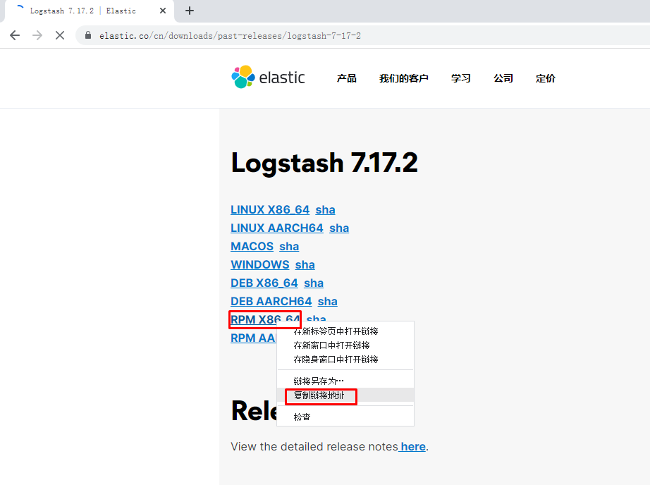

# kubernetes日志收集方案

# kubernetes日志收集方案 ELK

# 一、为什么收集日志

收集日志可以用于：

- 分析用户行为
- 监控服务器状态
- 增强系统或应用安全性等。

# 二、收集哪些日志

- kubernetes集群节点系统日志
- kubernetes集群节点应用程序日志
- kubernetes集群中部署的应用程序日志

# 三、日志收集方案

## 3.1 日志收集技术栈ELK(ELKB)  +  Filebeat

## 3.2 日志收集技术栈  EK(EFK)  + fluentd

# 四、ELK集群部署

> 为了增加ELK集群的运行效率，一般建议在k8s集群之外使用物理机部署ELK集群，当然也可以直接在k8s集群内部署。

## 4.1 主机准备

| 主机     | 软件          | 版本   | 配置 | IP             |
| -------- | ------------- | ------ | ---- | -------------- |
| kibana   | kibana        | 7.17.2 | 2C2G | 192.168.10.200 |
| elastic  | elasticsearch | 7.17.2 | 2C4G | 192.168.10.201 |
| logstash | logstash      | 7.17.2 | 2C4G | 192.168.10.202 |

~~~powershell
# hostname set-hostname xxx
~~~

~~~powershell
# cat /etc/hosts
192.168.10.200 kibana
192.168.10.201 elastic
192.168.10.202 logstash
~~~

## 4.2 软件安装

> 由于软件下载较慢，请提前准备好以下软件。

### 4.2.1 安装jdk

> 所有主机全部安装，可考虑使用openjdk也可以使用oracle jdk。

~~~powershell
[root@kibana ~]# yum -y install java-11-openjdk

[root@elastic ~]# yum -y install java-11-openjdk

[root@logstash ~]# yum -y install java-11-openjdk
~~~

### 4.2.2 安装kibana

或

~~~powershell
# wget https://artifacts.elastic.co/downloads/kibana/kibana-7.17.2-x86_64.rpm
~~~

~~~powershell
# yum -y install kibana-7.17.2-x86_64.rpm
~~~

### 4.2.3 安装elasticsearch

~~~powershell
# wget https://artifacts.elastic.co/downloads/elasticsearch/elasticsearch-7.17.2-x86_64.rpm
~~~

~~~powershell
# yum -y install elasticsearch-7.17.2-x86_64.rpm
~~~

### 4.2.4 安装logstash

~~~powershell
# wget https://artifacts.elastic.co/downloads/logstash/logstash-7.17.2-x86_64.rpm
~~~

~~~powershell
# yum -y install logstash-7.17.2-x86_64.rpm
~~~

## 4.3 软件配置及启动

### 4.3.1 kibana软件配置及启动

~~~powershell
[root@kibana ~]# cat -n /etc/kibana/kibana.yml | grep -v "#" | grep -v "^$"
     2  server.port: 5601
     7  server.host: "192.168.10.200"
    32  elasticsearch.hosts: ["http://192.168.10.201:9200"]
   115  i18n.locale: "zh-CN"
~~~

~~~powershell
说明：
server.port 是开启kibana监听端口
server.host 设置远程连接主机IP地址，用于远程访问使用
elasticsearch.hosts 设置elasticsearch.hosts主机IP，用于连接elasticsearch主机，可以为多个值
i18n.locale 设置语言支持，不需要再汉化，直接修改后即可支持中文
~~~

~~~powershell
[root@kibana ~]# systemctl enable kibana
[root@kibana ~]# systemctl start kibana
~~~

~~~powershell
[root@kibana ~]# ss -anput | grep ":5601"
tcp    LISTEN     0      128    192.168.10.200:5601                  *:*                   users:(("node",pid=2571,fd=71))
~~~

### 4.3.2 elasticsearch软件配置及启动

~~~powershell
修改配置文件
[root@elastic ~]#  cat -n /etc/elasticsearch/elasticsearch.yml | grep -v "#" | grep -v "^$"
    17  cluster.name: k8s-elastic
    23  node.name: elastic
    33  path.data: /var/lib/elasticsearch
    37  path.logs: /var/log/elasticsearch
    56  network.host: 192.168.10.201
    61  http.port: 9200
    70  discovery.seed_hosts: ["192.168.10.201"]
    74  cluster.initial_master_nodes: ["192.168.10.201"]
~~~

~~~powershell
说明
cluster.name 集群名称
node.name 节点名称
path.data 数据目录
path.logs 日志目录
network.host 主机IP
http.port 监听端口
discovery.seed_hosts 主机发现列表
cluster.initial_master_nodes 集群master节点
~~~

~~~powershell
启动服务并验证
[root@elastic ~]# systemctl enable elasticsearch
[root@elastic ~]# systemctl start elasticsearch
~~~

~~~powershell
[root@elastic ~]# ss -anput | grep ":9200"
tcp    LISTEN     0      128    [::ffff:192.168.10.201]:9200               [::]:*                   users:(("java",pid=9726,fd=219))
~~~

~~~powershell
[root@elastic ~]# curl http://192.168.10.201:9200
{
  "name" : "elastic",
  "cluster_name" : "k8s-elastic",
  "cluster_uuid" : "cW78ZkrhS4OV41DV5CtWWQ",
  "version" : {
    "number" : "7.17.2",
    "build_flavor" : "default",
    "build_type" : "rpm",
    "build_hash" : "de7261de50d90919ae53b0eff9413fd7e5307301",
    "build_date" : "2022-03-28T15:12:21.446567561Z",
    "build_snapshot" : false,
    "lucene_version" : "8.11.1",
    "minimum_wire_compatibility_version" : "6.8.0",
    "minimum_index_compatibility_version" : "6.0.0-beta1"
  },
  "tagline" : "You Know, for Search"
}
~~~

### 4.3.3 logstash软件配置及启动

#### 4.3.3.1 修改配置文件

~~~powershell
[root@logstash ~]# cat -n /etc/logstash/logstash.yml | grep -v "#" | grep -v "^$"
    19  node.name: logstash
    28  path.data: /var/lib/logstash
   133  api.http.host: 192.168.10.202
   139  api.http.port: 9600-9700
   280  path.logs: /var/log/logstash
   
分布式架构中 api.http.host一定要配置为logstash主机IP，不然无法远程访问。
~~~

#### 4.3.3.2 启动服务

**logstash进程不用预先启动，使用时启动即可**

#### 4.3.3.3 验证logstash可用性

~~~powershell
标准输入及标准输出验证
[root@logstash ~]# /usr/share/logstash/bin/logstash -e 'input {stdin{} } output {stdout {} }'
Using bundled JDK: /usr/share/logstash/jdk
OpenJDK 64-Bit Server VM warning: Option UseConcMarkSweepGC was deprecated in version 9.0 and will likely be removed in a future release.
WARNING: Could not find logstash.yml which is typically located in $LS_HOME/config or /etc/logstash. You can specify the path using --path.settings. Continuing using the defaults
Could not find log4j2 configuration at path /usr/share/logstash/config/log4j2.properties. Using default config which logs errors to the console
[INFO ] 2022-04-07 16:34:16.332 [main] runner - Starting Logstash {"logstash.version"=>"7.17.2", "jruby.version"=>"jruby 9.2.20.1 (2.5.8) 2021-11-30 2a2962fbd1 OpenJDK 64-Bit Server VM 11.0.14.1+1 on 11.0.14.1+1 +indy +jit [linux-x86_64]"}
[INFO ] 2022-04-07 16:34:16.339 [main] runner - JVM bootstrap flags: [-Xms1g, -Xmx1g, -XX:+UseConcMarkSweepGC, -XX:CMSInitiatingOccupancyFraction=75, -XX:+UseCMSInitiatingOccupancyOnly, -Djava.awt.headless=true, -Dfile.encoding=UTF-8, -Djruby.compile.invokedynamic=true, -Djruby.jit.threshold=0, -Djruby.regexp.interruptible=true, -XX:+HeapDumpOnOutOfMemoryError, -Djava.security.egd=file:/dev/urandom, -Dlog4j2.isThreadContextMapInheritable=true]
[INFO ] 2022-04-07 16:34:16.385 [main] settings - Creating directory {:setting=>"path.queue", :path=>"/usr/share/logstash/data/queue"}
[INFO ] 2022-04-07 16:34:16.423 [main] settings - Creating directory {:setting=>"path.dead_letter_queue", :path=>"/usr/share/logstash/data/dead_letter_queue"}
[WARN ] 2022-04-07 16:34:16.890 [LogStash::Runner] multilocal - Ignoring the 'pipelines.yml' file because modules or command line options are specified
[INFO ] 2022-04-07 16:34:16.956 [LogStash::Runner] agent - No persistent UUID file found. Generating new UUID {:uuid=>"608c9b46-8138-44b6-8cd8-c42d0fb08a90", :path=>"/usr/share/logstash/data/uuid"}
[INFO ] 2022-04-07 16:34:18.587 [Api Webserver] agent - Successfully started Logstash API endpoint {:port=>9600, :ssl_enabled=>false}
[INFO ] 2022-04-07 16:34:19.018 [Converge PipelineAction::Create<main>] Reflections - Reflections took 76 ms to scan 1 urls, producing 119 keys and 419 values
[WARN ] 2022-04-07 16:34:19.571 [Converge PipelineAction::Create<main>] line - Relying on default value of `pipeline.ecs_compatibility`, which may change in a future major release of Logstash. To avoid unexpected changes when upgrading Logstash, please explicitly declare your desired ECS Compatibility mode.
[WARN ] 2022-04-07 16:34:19.590 [Converge PipelineAction::Create<main>] stdin - Relying on default value of `pipeline.ecs_compatibility`, which may change in a future major release of Logstash. To avoid unexpected changes when upgrading Logstash, please explicitly declare your desired ECS Compatibility mode.
[INFO ] 2022-04-07 16:34:19.839 [[main]-pipeline-manager] javapipeline - Starting pipeline {:pipeline_id=>"main", "pipeline.workers"=>2, "pipeline.batch.size"=>125, "pipeline.batch.delay"=>50, "pipeline.max_inflight"=>250, "pipeline.sources"=>["config string"], :thread=>"#<Thread:0xc108bf4 run>"}
[INFO ] 2022-04-07 16:34:20.536 [[main]-pipeline-manager] javapipeline - Pipeline Java execution initialization time {"seconds"=>0.69}
WARNING: An illegal reflective access operation has occurred
WARNING: Illegal reflective access by com.jrubystdinchannel.StdinChannelLibrary$Reader (file:/usr/share/logstash/vendor/bundle/jruby/2.5.0/gems/jruby-stdin-channel-0.2.0-java/lib/jruby_stdin_channel/jruby_stdin_channel.jar) to field java.io.FilterInputStream.in
WARNING: Please consider reporting this to the maintainers of com.jrubystdinchannel.StdinChannelLibrary$Reader
WARNING: Use --illegal-access=warn to enable warnings of further illegal reflective access operations
WARNING: All illegal access operations will be denied in a future release
[INFO ] 2022-04-07 16:34:20.602 [[main]-pipeline-manager] javapipeline - Pipeline started {"pipeline.id"=>"main"}
The stdin plugin is now waiting for input:
[INFO ] 2022-04-07 16:34:20.662 [Agent thread] agent - Pipelines running {:count=>1, :running_pipelines=>[:main], :non_running_pipelines=>[]}
abc 输入abc字符，查看其输出
{
    "@timestamp" => 2022-04-07T08:35:24.663Z,
          "host" => "logstash",
       "message" => "abc",
      "@version" => "1"
}
以json格式输出abc内容
~~~

~~~powershell
使用logstash输入内容到elasticsearch验证

[root@logstash ~]# /usr/share/logstash/bin/logstash -e 'input { stdin{} } output { elasticsearch { hosts => ["192.168.10.201:9200"] index => "logstash-%{+YYYY.MM.dd}" } }'

hello elasticsearch

此内容将会通过kibana页面中的索引看到，但是需要在kibana页面中添加索引
~~~

## 4.4 kibana访问

## 4.5 编写logstash用于收集日志配置文件

> 通过filebeat进行收集

~~~powershell
[root@logstash ~]# cat /etc/logstash/conf.d/logstash-to-elastic.conf
input {
  beats {
    host => "0.0.0.0"
    port => "5044"
  }
}

filter {

}

output {
    elasticsearch {
      hosts => "192.168.10.201:9200"
      index => "k8s-%{+YYYY.MM.dd}"
    }
}
~~~

## 4.6 运行logstash

> 如果不涉及多个配置文件，可以直接使用systemctl start logstash;如果有多个配置文件，只想启动一个配置文件，可以使用如下方法。

### 4.6.1 直接在后台运行

~~~powershell
[root@logstash ~]# /usr/share/logstash/bin/logstash -f /etc/logstash/conf.d/logstash-to-elastic.conf --path.data /usr/share/logstash/data1 &
~~~

### 4.6.2 通过rc.local设置自动后台运行

~~~powershell
[root@logstash ~]# cat /etc/rc.local
...
/usr/share/logstash/bin/logstash -f /etc/logstash/conf.d/logstash-to-elastic.conf &

查看文件默认权限
[root@logstash ~]# ls -l /etc/rc.d/rc.local
-rw-r--r-- 1 root root 562 1月   9 13:40 /etc/rc.d/rc.local

修改文件权限
[root@logstash ~]# chmod +x  /etc/rc.d/rc.local

查看修改后文件权限
[root@logstash ~]# ls -l /etc/rc.d/rc.local
-rwxr-xr-x 1 root root 562 1月   9 13:40 /etc/rc.d/rc.local
~~~

# 五、收集k8s集群节点系统日志

>通过在work节点以DaemonSet方法运行filebeat应用实现

## 5.1 下载filebeat镜像

> 所有work节点

~~~powershell
下载filebeat镜像

[root@k8s-work1 ~]# docker pull elastic/filebeat:7.17.2
~~~

~~~powershell
[root@k8s-work1 ~]# docker images
REPOSITORY                  TAG                 IMAGE ID            CREATED             SIZE
docker.elastic/filebeat   7.17.2               00c5b17745d1        3 weeks ago         359MB

~~~

或

~~~powershell
使用containerd时使用
# crictl pull elastic/filebeat:7.17.2
~~~

~~~powershell
# crictl images
IMAGE                                           TAG                 IMAGE ID            SIZE
docker.io/elastic/filebeat                      7.17.2              2314640a78873       107MB
~~~

## 5.2 创建filebeat资源清单文件

~~~powershell
[root@k8s-master1 ~]# cat filebeat-to-logstash.yaml
apiVersion: v1
kind: ConfigMap
metadata:
  name: k8s-logs-filebeat-config
  namespace: kube-system

data:
  filebeat.yml: |
    filebeat.inputs:
      - type: log
        paths:
          - /var/log/messages
        fields:
          app: k8s
          type: module
        fields_under_root: true

    setup.ilm.enabled: false
    setup.template.name: "k8s-module"
    setup.template.pattern: "k8s-module-*"

    output.logstash:
      hosts: ['192.168.10.202:5044']
      index: "k8s-module-%{+yyyy.MM.dd}"

---

apiVersion: apps/v1
kind: DaemonSet
metadata:
  name: k8s-logs
  namespace: kube-system
spec:
  selector:
    matchLabels:
      project: k8s
      app: filebeat
  template:
    metadata:
      labels:
        project: k8s
        app: filebeat
    spec:
      containers:
      - name: filebeat
        image: docker.io/elastic/filebeat:7.17.2
        args: [
          "-c", "/etc/filebeat.yml",
          "-e",
        ]
        resources:
          requests:
            cpu: 100m
            memory: 100Mi
          limits:
            cpu: 500m
            memory: 500Mi
        securityContext:
          runAsUser: 0
        volumeMounts:
        - name: filebeat-config
          mountPath: /etc/filebeat.yml
          subPath: filebeat.yml
        - name: k8s-logs
          mountPath: /var/log/messages
      volumes:
      - name: k8s-logs
        hostPath:
          path: /var/log/messages
      - name: filebeat-config
        configMap:
          name: k8s-logs-filebeat-config
~~~

## 5.3 应用filebeat资源清单文件

~~~powershell
[root@k8s-master1 ~]# kubectl apply -f filebeat-to-logstash.yaml
~~~

## 5.4 验证结果

~~~powershell
查看pod
# kubectl get pods -n kube-system -o wide
NAME                                       READY   STATUS    RESTARTS   AGE   IP               NODE         
k8s-logs-s8qw6                             1/1     Running   0          15s   10.244.194.83    k8s-worker1   <none>           <none>
~~~

~~~powershell
查看pod输出日志
[root@k8s-master1 ~]# kubectl logs k8s-logs-6mqq5 -n kube-system
~~~

## 5.5 在kibana中添加索引

# 六、收集kubernetes节点应用程序日志

> 本案例在k8s-worker1主机上安装nginx并收集其日志

## 6.1 安装nginx应用

~~~powershell
# wget -O /etc/yum.repos.d/epel.repo http://mirrors.aliyun.com/repo/epel-7.repo
~~~

~~~powershell
# yum -y install nginx
~~~

~~~powershell
# cd /usr/share/nginx/html/

# ls
404.html  50x.html  en-US  icons  img  index.html  nginx-logo.png  poweredby.png

# echo "work1 web page" > index.html
~~~

~~~powershell

# systemctl enable nginx
# systemctl start nginx
~~~

~~~powershell
# curl http://192.168.10.15
work1 web page
~~~

## 6.2 编写filebeat资源清单文件

~~~powershell
[root@k8s-master1 ~]# cat filebeat-to-logstash-nginx.yaml
apiVersion: v1
kind: ConfigMap
metadata:
  name: k8s-filebeat-config-nginx-logs
  namespace: default

data:
  filebeat.yml: |
    filebeat.inputs:
      - type: log
        paths:
          - /var/log/nginx/access.log
        fields:
          app: k8s
          type: module
        fields_under_root: true

      - type: log
        paths:
          - /var/log/nginx/error.log
        fields:
          app: k8s
          type: module
        fields_under_root: true

    setup.ilm.enabled: false
    setup.template.name: "k8s-module"
    setup.template.pattern: "k8s-module-*"

    output.logstash:
      hosts: ['192.168.10.202:5055']

---

apiVersion: apps/v1
kind: DaemonSet
metadata:
  name: k8s-logs
  namespace: default
spec:
  selector:
    matchLabels:
      project: k8s
      app: filebeat
  template:
    metadata:
      labels:
        project: k8s
        app: filebeat
    spec:
      nodeName: k8s-worker1
      containers:
      - name: filebeat
        image: docker.io/elastic/filebeat:7.17.2
        imagePullPolicy: IfNotPresent
        args: [
          "-c", "/etc/filebeat.yml",
          "-e",
        ]
        resources:
          requests:
            cpu: 100m
            memory: 100Mi
          limits:
            cpu: 500m
            memory: 500Mi
        securityContext:
          runAsUser: 0
        volumeMounts:
        - name: filebeat-config
          mountPath: /etc/filebeat.yml
          subPath: filebeat.yml
        - name: nginx-access
          mountPath: /var/log/nginx/access.log
        - name: nginx-error
          mountPath: /var/log/nginx/error.log
      volumes:
      - name: nginx-access
        hostPath:
          path: /var/log/nginx/access.log
      - name: nginx-error
        hostPath:
          path: /var/log/nginx/error.log
      - name: filebeat-config
        configMap:
          name: k8s-filebeat-config-nginx-logs
~~~

## 6.3 编写logstash配置文件

~~~powershell
[root@logstash ~]# cat /etc/logstash/conf.d/nginx-logstash-to-elastic.conf
input {
  beats {
    host => "0.0.0.0"
    port => "5055"
  }
}

filter {

}

output {
    elasticsearch {
      hosts => "192.168.10.201:9200"
      index => "nginx-%{+YYYY.MM.dd}"
    }
}
~~~

## 6.4 重启logstash

~~~powershell
[root@logstash ~]# /usr/share/logstash/bin/logstash -f /etc/logstash/conf.d/nginx-logstash-to-elastic.conf --path.data /usr/share/logstash/data2 &
~~~

~~~powershell
[root@logstash ~]# ss -anput | grep ":5055"
tcp    LISTEN     0      128    [::]:5055               [::]:*                   users:(("java",pid=14296,fd=106))
~~~

## 6.5 应用filebeat资源清单文件

~~~powershell
[root@k8s-master1 ~]# kubectl apply -f filebeat-to-logstash-nginx.yaml
configmap/k8s-filebeat-config-nginx-logs created
daemonset.apps/k8s-logs created
~~~

~~~powershell
[root@k8s-master1 ~]# kubectl get pods -o wide
NAME             READY   STATUS    RESTARTS   AGE   IP              NODE          NOMINATED NODE   READINESS GATES
k8s-logs-ndznb   1/1     Running   0          14s   10.244.194.84   k8s-worker1   <none>           <none>
~~~

~~~powershell
[root@k8s-master1 ~]# # kubectl logs k8s-logs-ndznb
~~~

## 6.6 在kibana界面添加索引

# 七、收集kubernetes集群中以Pod方式运行的应用日志

> 通过在应用程序Pod中运行filebeat(sidecar)实现,本次将以tomcat为例进行说明。

## 7.1 准备tomcat数据目录

> 默认tomcat容器中没有网站首页文件，不添加会导致pod中容器无法正常运行。

~~~powershell
[root@k8s-worker1 ~]# mkdir /opt/tomcatwebroot
~~~

~~~powershell
[root@k8s-worker1 ~]# echo "tomcat running" > /opt/tomcatwebroot/index.html
~~~

## 7.2 编写tomcat应用资源清单文件

~~~powershell
[root@k8s-master1 ~]# cat tomcat-logs.yaml
apiVersion: apps/v1
kind: Deployment
metadata:
  name: tomcat-demo
  namespace: default
spec:
  replicas: 2
  selector:
    matchLabels:
      project: www
      app: tomcat-demo
  template:
    metadata:
      labels:
        project: www
        app: tomcat-demo
    spec:
      nodeName: k8s-worker1
      containers:
      - name: tomcat
        image: tomcat:latest
        imagePullPolicy: IfNotPresent
        ports:
        - containerPort: 8080
          name: web
          protocol: TCP
        resources:
          requests:
            cpu: 0.5
            memory: 1Gi
          limits:
            cpu: 1
            memory: 2Gi
        livenessProbe:
          httpGet:
            path: /
            port: 8080
          initialDelaySeconds: 60
          timeoutSeconds: 20
        readinessProbe:
          httpGet:
            path: /
            port: 8080
          initialDelaySeconds: 60
          timeoutSeconds: 20
        volumeMounts:
        - name: tomcat-logs
          mountPath: /usr/local/tomcat/logs
        - name: tomcatwebroot
          mountPath: /usr/local/tomcat/webapps/ROOT

      - name: filebeat
        image: docker.io/elastic/filebeat:7.17.2
        imagePullPolicy: IfNotPresent
        args: [
          "-c", "/etc/filebeat.yml",
          "-e",
        ]
        resources:
          limits:
            memory: 500Mi
          requests:
            cpu: 100m
            memory: 100Mi
        securityContext:
          runAsUser: 0
        volumeMounts:
        - name: filebeat-config
          mountPath: /etc/filebeat.yml
          subPath: filebeat.yml
        - name: tomcat-logs
          mountPath: /usr/local/tomcat/logs
      volumes:
      - name: tomcat-logs
        emptyDir: {}
      - name: tomcatwebroot
        hostPath:
          path: /opt/tomcatwebroot
          type: Directory
      - name: filebeat-config
        configMap:
          name: filebeat-config
---
apiVersion: v1
kind: ConfigMap
metadata:
  name: filebeat-config
  namespace: default

data:
  filebeat.yml: |-
    filebeat.inputs:
    - type: log
      paths:
        - /usr/local/tomcat/logs/catalina.*

      fields:
        app: www
        type: tomcat-catalina
      fields_under_root: true
      multiline:
        pattern: '^\['
        negate: true
        match: after

    setup.ilm.enabled: false
    setup.template.name: "tomcat-catalina"
    setup.template.pattern: "tomcat-catalina-*"

    output.logstash:
      hosts: ['192.168.10.202:5056']
~~~

## 7.3  编写logstash配置文件

~~~powershell
编写logstash配置文件，不影响以往配置文件
[root@logstash ~]# cat /etc/logstash/conf.d/tomcat-logstash-to-elastic.conf
input {
  beats {
    host => "0.0.0.0"
    port => "5056"
  }
}

filter {

}

output {
    elasticsearch {
      hosts => "192.168.10.201:9200"
      index => "tomcat-catalina-%{+yyyy.MM.dd}"
    }
}
~~~

~~~powershell
[root@logstash ~]# /usr/share/logstash/bin/logstash -f /etc/logstash/conf.d/tomcat-logstash-to-elastic.conf --path.data /usr/share/logstash/data3 &
~~~

~~~powershell
验证端口是否启动
[root@logstash ~]# ss -anput | grep ":5056"
tcp    LISTEN     0      128    [::]:5056               [::]:*                   users:(("java",pid=14144,fd=106))
~~~

## 7.4 应用tomcat应用资源清单文件

~~~powershell
[root@k8s-master1 ~]# kubectl apply -f tomcat-logs.yaml

[root@k8s-master1 ~]# kubectl get deployment.apps
NAME          READY   UP-TO-DATE   AVAILABLE   AGE
tomcat-demo   2/2     2            2           5m26s
[root@k8s-master1 ~]# kubectl get pods
NAME                           READY   STATUS    RESTARTS   AGE
tomcat-demo-664584f857-k8whd   2/2     Running   0          5m33s
tomcat-demo-664584f857-xncpk   2/2     Running   0          5m33s
~~~

## 7.5 验证Pod 中tomcat及filebeat是否正常

~~~powershell
查看tomcat产生日志
[root@k8s-master1 ~]# kubectl logs tomcat-demo-664584f857-k8whd -c tomcat

查看filebeat收集日志
[root@k8s-master1 ~]# kubectl logs tomcat-demo-664584f857-k8whd -c filebeat
~~~

## 7.6 在kibana页面中添加索引

# kubernetes 日志收集方案 EFK

# 一、EFK

## 1.1 EFK介绍

EFK为elasticsearch、fluentd、kibana的简称，本案例主要对kubernetes集群日志收集。

## 1.2 Fluentd介绍

fluentd是一款开源的日志收集工具，其于2016年11月8日被云原生计算基金会录取，并于2019年毕业。

Fluentd优势：

- 使用 JSON 进行统一日志记录
  - 其尽可能地把数据结构化为JSON，让下游数据处理容易。
- 可插拔架构
  - 利用插件，允许对其功能扩展
- 对计算机资源要求少
  - 其使用c语言和ruby结合编写，需要少量系统资源即可运行。
- 内置可靠性
  - 支持基于内存和文件的缓冲，防止节点间数据丢失
  - 支持强大故障转移并可设置为高可用性

# 二、EFK部署

## 2.1 获取EFK部署资源清单文件

~~~powershell
把EFK部署资源清单文件复制到本地主机，本次本地主机主要指k8s master节点
# git clone https://github.com/kubernetes/kubernetes.git
~~~

~~~powershell
进入目录并查看目录内容
# cd kubernetes/
# ls
api           cluster             docs    LICENSE   Makefile.generated_files  plugin             SUPPORT.md
build         cmd                 go.mod  LICENSES  OWNERS                    README.md          test
CHANGELOG     code-of-conduct.md  go.sum  logo      OWNERS_ALIASES            SECURITY_CONTACTS  third_party
CHANGELOG.md  CONTRIBUTING.md     hack    Makefile  pkg                       staging            vendor
~~~

~~~powershell
查看分支
# git branch
~~~

~~~powershell
切换对应版本的分支
# git checkout -b v1.21.10
~~~

~~~powershell
进入目录并查看目录内容
# cd cluster/addons/fluentd-elasticsearch
# ls
create-logging-namespace.yaml  es-statefulset.yaml        fluentd-es-image        OWNERS
es-image                       fluentd-es-configmap.yaml  kibana-deployment.yaml  podsecuritypolicies
es-service.yaml                fluentd-es-ds.yaml         kibana-service.yaml     README.md

~~~

## 2.2 安装ES

### 2.2.1 创建命名空间

~~~powershell
应用资源清单文件创建命名空间，非必须，可使用资源清单中默认的命名空间 kube-system
# kubectl create namespace logging
~~~

### 2.2.2 部署ES

~~~powershell
部署ES，注意部署前的配置
# kubectl apply -f es-statefulset.yaml
~~~

~~~powershell
应用前，请注释此文件中ClusterIP:None，并修改type类型为:NodePort，再执行
# kubectl apply -f es-service.yaml
~~~

### 2.2.3 查看安装情况

~~~powershell
查看ES部署的pod是否运行
# kubectl get pods -n logging
NAME                      READY   STATUS    RESTARTS   AGE
elasticsearch-logging-0   1/1     Running   0          8m
elasticsearch-logging-1   1/1     Running   1          5m50s
~~~

~~~powershell
查看ES部署后的SVC，验证其访问的方法
# kubectl get svc -n logging
NAME                    TYPE       CLUSTER-IP      EXTERNAL-IP   PORT(S)                         AGE
elasticsearch-logging   NodePort   10.107.97.124   <none>        9200:31885/TCP,9300:32214/TCP   68s
~~~

### 2.2.4 验证集群是否健康

~~~powershell
查看ES集群是否健康，下面状态为健康。
# curl 10.107.97.124:9200/_cat/health?pretty
1640939218 08:26:58 kubernetes-logging green 2 2 6 3 0 0 0 0 - 100.0%
~~~

## 2.3 部署fluentd

### 2.3.1 部署fluentd

~~~powershell
部署前对fluentd configmap进行配置，主要修改其连接ES的地址及对应的端口，此两项根据使用环境的不同，配置也不相同。
# vim fluentd-es-configmap.yaml

456   output.conf: |-
457     <match **>
458       @id elasticsearch
459       @type elasticsearch
460       @log_level info
461       type_name _doc
462       include_tag_key true
463       host elasticsearch-logging 修改此处为es主机地址
464       port 9200 使用NodePort时，此处也需要修改对应映射端口
465       logstash_format true
466       <buffer>

~~~

~~~powershell
应用资源清单文件
# kubectl apply -f fluentd-es-configmap.yaml
~~~

~~~powershell
修改资源清单文件
# vim fluentd-es-ds.yaml
 
 55   selector:
 56     matchLabels:
 57       k8s-app: fluentd-es
 58       version: v3.1.1
 59   template:
 60     metadata:
 61       labels:
 62         k8s-app: fluentd-es
 63         version: v3.1.1
 64     spec:
 65       #securityContext:
 66       #  seccompProfile:
 67       #    type: RuntimeDefault

~~~

~~~powershell
应用资源清单文件
# kubectl apply -f fluentd-es-ds.yaml
~~~

### 2.3.2 查看部署状态

~~~powershell
查看已部署的组件pod运行情况
# kubectl get pods -n logging
~~~

~~~powershell
输出结果：
NAME                      READY   STATUS    RESTARTS   AGE
elasticsearch-logging-0   1/1     Running   0          20m
elasticsearch-logging-1   1/1     Running   1          18m
fluentd-es-v3.1.1-2chjb   1/1     Running   0          64s
fluentd-es-v3.1.1-5gpmd   1/1     Running   0          64s
~~~

## 2.4 部署Kibana

### 2.4.1 部署Kibana

~~~powershell
修改资源清单文件
# vim kibana-deployment.yaml

 18     spec:
 		以下三行注释掉
 19      # securityContext: 
 20      #   seccompProfile:
 21      #     type: RuntimeDefault
 22       containers:
 23         - name: kibana-logging
 24           image: docker.elastic.co/kibana/kibana-oss:7.10.2
 25           resources:
 26             # need more cpu upon initialization, therefore burstable class
 27             limits:
 28               cpu: 1000m
 29             requests:
 30               cpu: 100m
 31           env:
 32             - name: ELASTICSEARCH_HOSTS
 33               value: http://elasticsearch-logging.logging.svc.cluster.local.:9200
 34             - name: SERVER_NAME
 35               value: kibana-logging
 				以下两行注释掉
 36             #- name: SERVER_BASEPATH
 37             #  value: /api/v1/namespaces/logging/services/kibana-logging/proxy

~~~

~~~powershell
应用资源清单文件
# kubectl apply -f kibana-deployment.yaml
~~~

~~~powershell
修改kibana service资源清单文件，以NodePort类型暴露服务，供K8S集群外用户访问
# vim kibana-service.yaml

spec:
  ports:
  - port: 5601
    protocol: TCP
    targetPort: ui
  selector:
    k8s-app: kibana-logging
  type: NodePort 添加此行内容

~~~

~~~powershell
应用资源清单文件
# kubectl apply -f kibana-service.yaml
~~~

### 2.4.2 查看Kibana部署状态

~~~powershell
查看已部署组件pod运行状态
# kubectl get pods -n logging
NAME                             READY   STATUS    RESTARTS   AGE
elasticsearch-logging-0          1/1     Running   0          25m
elasticsearch-logging-1          1/1     Running   1          22m
fluentd-es-v3.1.1-2chjb          1/1     Running   0          5m45s
fluentd-es-v3.1.1-5gpmd          1/1     Running   0          5m45s
kibana-logging-c46f6b9c5-g9fsl   1/1     Running   0          11s
~~~

~~~powershell
获取kibana对外提供的主机地址及对应的端口
# kubectl get svc -n logging
NAME                    TYPE       CLUSTER-IP      EXTERNAL-IP   PORT(S)                         AGE
elasticsearch-logging   NodePort   10.107.97.124   <none>        9200:31885/TCP,9300:32214/TCP   15m
kibana-logging          NodePort   10.99.171.38    <none>        5601:31739/TCP                  7s

~~~

~~~powershell
在K8S集群任意主机查看是否打开kibana对外的端口（服务类型为NodePort）

# ss -anput | grep "31739"
tcp    LISTEN     0      4096      *:31739                 *:*                   users:(("kube-proxy",pid=4569,fd=23))
~~~

> 通过浏览器访问kibana web界面。

