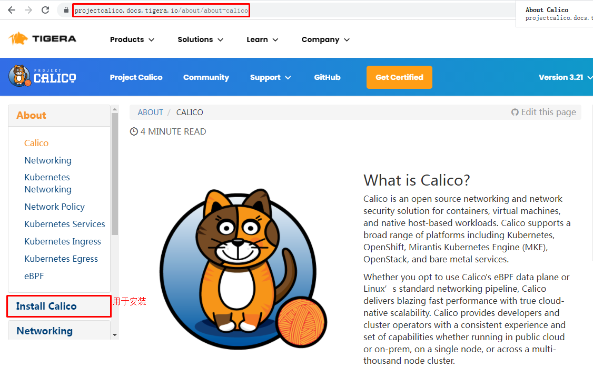
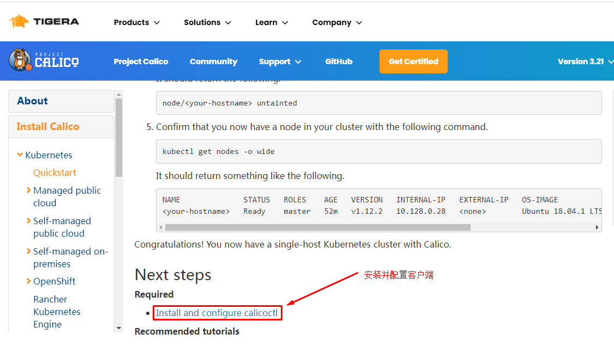

# kubeadm部署单Master节点kubernetes集群 1.21                                     

# 一、kubernetes 1.21发布

## 1.1 介绍

2021年04月，Kubernetes 1.21正式与大家见面，这是我们 2021 年的第一个版本！这个版本包含 51 个增强功能：13 个增强功能升级为稳定版，16 个增强功能升级为 beta 版，20 个增强功能进入 alpha 版，还有 2 个功能已经弃用。

## 1.2 主要变化

- CronJobs 毕业到稳定！

自 Kubernetes 1.8 以来，CronJobs一直是一个测试版功能！在 1.21 中，我们终于看到这个广泛使用的 API 毕业到稳定。

CronJobs 用于执行定期计划的操作，如备份、报告生成等。每个任务都应该被配置为无限期地重复出现（例如：一天/一周/一个月）；你可以在该间隔内定义作业应该启动的时间点。

- 不可变的 Secrets 和 ConfigMaps

Immutable Secrets和ConfigMaps为这些资源类型添加了一个新字段，如果设置了该字段，将拒绝对这些对象的更改。默认情况下，Secrets 和 ConfigMaps 是可变的，这对能够使用更改的 pod 是有益的。如果将错误的配置推送给使用它们的 pod，可变的 Secrets 和 ConfigMaps 也会导致问题。

通过将 Secrets 和 ConfigMaps 标记为不可变的，可以确保应用程序配置不会改变。如果你希望进行更改，则需要创建一个新的、唯一命名的 Secret 或 ConfigMap，并部署一个新的 pod 来消耗该资源。不可变资源也有伸缩性优势，因为控制器不需要轮询 API 服务器来观察变化。

这个特性在 Kubernetes 1.21 中已经毕业到稳定。

- IPv4/IPv6 双栈支持

IP 地址是一种可消耗的资源，集群操作人员和管理员需要确保它不会耗尽。特别是，公共 IPv4 地址现在非常稀少。双栈支持使原生 IPv6 路由到 pod 和服务，同时仍然允许你的集群在需要的地方使用 IPv4。双堆栈集群网络还改善了工作负载的可能伸缩限制。

Kubernetes 的双栈支持意味着 pod、服务和节点可以获得 IPv4 地址和 IPv6 地址。在 Kubernetes 1.21 中，双栈网络已经从 alpha 升级到 beta，并且已经默认启用了。

- 优雅的节点关闭

在这个版本中，优雅的节点关闭也升级到测试版（现在将提供给更大的用户群）！这是一个非常有益的特性，它允许 kubelet 知道节点关闭，并优雅地终止调度到该节点的 pod。

目前，当节点关闭时，pod 不会遵循预期的终止生命周期，也不会正常关闭。这可能会在许多不同的工作负载下带来问题。接下来，kubelet 将能够通过 systemd 检测到即将发生的系统关闭，然后通知正在运行的 pod，以便它们能够尽可能优雅地终止。

- PersistentVolume 健康监测器

持久卷（Persistent Volumes，PV）通常用于应用程序中获取本地的、基于文件的存储。它们可以以许多不同的方式使用，并帮助用户迁移应用程序，而不需要重新编写存储后端。

Kubernetes 1.21 有一个新的 alpha 特性，允许对 PV 进行监视，以了解卷的运行状况，并在卷变得不健康时相应地进行标记。工作负载将能够对运行状况状态作出反应，以保护数据不被从不健康的卷上写入或读取。

- 减少 Kubernetes 的构建维护

以前，Kubernetes 维护了多个构建系统。这常常成为新贡献者和当前贡献者的摩擦和复杂性的来源。

在上一个发布周期中，为了简化构建过程和标准化原生的 Golang 构建工具，我们投入了大量的工作。这应该赋予更广泛的社区维护能力，并降低新贡献者进入的门槛。

## 1.3 重大变化

- 弃用 PodSecurityPolicy

在 Kubernetes 1.21 中，PodSecurityPolicy 已被弃用。与 Kubernetes 所有已弃用的特性一样，PodSecurityPolicy 将在更多版本中继续可用并提供完整的功能。先前处于测试阶段的 PodSecurityPolicy 计划在 Kubernetes 1.25 中删除。

接下来是什么？我们正在开发一种新的内置机制来帮助限制 Pod 权限，暂定名为“PSP 替换策略”。我们的计划是让这个新机制覆盖关键的 PodSecurityPolicy 用例，并极大地改善使用体验和可维护性。

- 弃用 TopologyKeys

服务字段 topologyKeys 现在已弃用；所有使用该字段的组件特性以前都是 alpha 特性，现在也已弃用。我们用一种实现感知拓扑路由的方法替换了 topologyKeys，这种方法称为感知拓扑提示。支持拓扑的提示是 Kubernetes 1.21 中的一个 alpha 特性。你可以在拓扑感知提示中阅读关于替换特性的更多细节；相关的KEP解释了我们替换的背景。

# 二、kubernetes 1.21.0 部署工具介绍

## What is Kubeadm ?

`Kubeadm is a tool built to provide best-practice "fast paths" for creating Kubernetes clusters. It performs the actions necessary to get a minimum viable, secure cluster up and running in a user friendly way. Kubeadm's scope is limited to the local node filesystem and the Kubernetes API, and it is intended to be a composable building block of higher level tools.`

Kubeadm是为创建Kubernetes集群提供最佳实践并能够“快速路径”构建kubernetes集群的工具。它能够帮助我们执行必要的操作，以获得最小可行的、安全的集群，并以用户友好的方式运行。

## Common Kubeadm cmdlets

1. **kubeadm init** to bootstrap the initial Kubernetes control-plane node. `初始化`
2. **kubeadm join** to bootstrap a Kubernetes worker node or an additional control plane node, and join it to the cluster. `添加工作节点到kubernetes集群`
3. **kubeadm upgrade** to upgrade a Kubernetes cluster to a newer version. ` 更新kubernetes版本`
4. **kubeadm reset** to revert any changes made to this host by kubeadm init or kubeadm join. ` 重置kubernetes集群`

# 三、kubernetes 1.21.0 部署环境准备

## 3.1 主机操作系统说明

| 序号 | 操作系统及版本 | 备注 |
| :--: | :------------: | :--: |
|  1   |   CentOS7u9    |      |

## 3.2 主机硬件配置说明

| 需求 | CPU  | 内存 | 硬盘  | 角色         | 主机名   |
| ---- | ---- | ---- | ----- | ------------ | -------- |
| 值   | 4C   | 8G   | 100GB | master       | master01 |
| 值   | 4C   | 8G   | 100GB | worker(node) | worker01 |
| 值   | 4C   | 8G   | 100GB | worker(node) | worker02 |

## 3.3 主机配置

### 3.3.1 主机名配置

由于本次使用3台主机完成kubernetes集群部署，其中1台为master节点,名称为master01;其中2台为worker节点，名称分别为：worker01及worker02

~~~powershell
master节点,名称为master1
# hostnamectl set-hostname master01
~~~

~~~powershell
worker1节点,名称为worker1
# hostnamectl set-hostname worker01
~~~

~~~powershell
worker2节点,名称为worker2
# hostnamectl set-hostname worker02
~~~

### 3.3.2 主机IP地址配置

~~~powershell
master节点IP地址为：192.168.10.11/24
# vim /etc/sysconfig/network-scripts/ifcfg-ens33
TYPE="Ethernet"
PROXY_METHOD="none"
BROWSER_ONLY="no"
BOOTPROTO="none"
DEFROUTE="yes"
IPV4_FAILURE_FATAL="no"
IPV6INIT="yes"
IPV6_AUTOCONF="yes"
IPV6_DEFROUTE="yes"
IPV6_FAILURE_FATAL="no"
IPV6_ADDR_GEN_MODE="stable-privacy"
NAME="ens33"
DEVICE="ens33"
ONBOOT="yes"
IPADDR="192.168.10.11"
PREFIX="24"
GATEWAY="192.168.10.2"
DNS1="119.29.29.29"
~~~

~~~powershell
worker1节点IP地址为：192.168.10.12/24
# vim /etc/sysconfig/network-scripts/ifcfg-ens33
TYPE="Ethernet"
PROXY_METHOD="none"
BROWSER_ONLY="no"
BOOTPROTO="none"
DEFROUTE="yes"
IPV4_FAILURE_FATAL="no"
IPV6INIT="yes"
IPV6_AUTOCONF="yes"
IPV6_DEFROUTE="yes"
IPV6_FAILURE_FATAL="no"
IPV6_ADDR_GEN_MODE="stable-privacy"
NAME="ens33"
DEVICE="ens33"
ONBOOT="yes"
IPADDR="192.168.10.12"
PREFIX="24"
GATEWAY="192.168.10.2"
DNS1="119.29.29.29"
~~~

~~~powershell
worker2节点IP地址为：192.168.10.13/24
# vim /etc/sysconfig/network-scripts/ifcfg-ens33
TYPE="Ethernet"
PROXY_METHOD="none"
BROWSER_ONLY="no"
BOOTPROTO="none"
DEFROUTE="yes"
IPV4_FAILURE_FATAL="no"
IPV6INIT="yes"
IPV6_AUTOCONF="yes"
IPV6_DEFROUTE="yes"
IPV6_FAILURE_FATAL="no"
IPV6_ADDR_GEN_MODE="stable-privacy"
NAME="ens33"
DEVICE="ens33"
ONBOOT="yes"
IPADDR="192.168.10.13"
PREFIX="24"
GATEWAY="192.168.10.2"
DNS1="119.29.29.29"

~~~

### 3.3.3 主机名与IP地址解析

> 所有集群主机均需要进行配置。

~~~powershell
# cat /etc/hosts
127.0.0.1   localhost localhost.localdomain localhost4 localhost4.localdomain4
::1         localhost localhost.localdomain localhost6 localhost6.localdomain6
192.168.10.11 master01
192.168.10.12 worker01
192.168.10.13 worker02
~~~

### 3.3.4 防火墙配置

> 所有主机均需要操作。

~~~powershell
关闭现有防火墙firewalld
# systemctl disable firewalld
# systemctl stop firewalld
# firewall-cmd --state
not running
~~~

### 3.3.5 SELINUX配置

> 所有主机均需要操作。修改SELinux配置需要重启操作系统。

~~~powershell
# sed -ri 's/SELINUX=enforcing/SELINUX=disabled/' /etc/selinux/config
~~~

### 3.3.6 时间同步配置

>所有主机均需要操作。最小化安装系统需要安装ntpdate软件。

~~~powershell
# crontab -l
0 */1 * * * /usr/sbin/ntpdate time1.aliyun.com
~~~

### 3.3.7 升级操作系统内核

> 所有主机均需要操作。

~~~powershell
导入elrepo gpg key
# rpm --import https://www.elrepo.org/RPM-GPG-KEY-elrepo.org
~~~

~~~powershell
安装elrepo YUM源仓库
# yum -y install https://www.elrepo.org/elrepo-release-7.0-4.el7.elrepo.noarch.rpm
~~~

~~~powershell
安装kernel-ml版本，ml为长期稳定版本，lt为长期维护版本
# yum --enablerepo="elrepo-kernel" -y install kernel-ml.x86_64
~~~

~~~powershell
设置grub2默认引导为0
# grub2-set-default 0
~~~

~~~powershell
重新生成grub2引导文件
# grub2-mkconfig -o /boot/grub2/grub.cfg
~~~

~~~powershell
更新后，需要重启，使用升级的内核生效。
# reboot
~~~

~~~powershell
重启后，需要验证内核是否为更新对应的版本
# uname -r
~~~

### 3.3.8 配置内核转发及网桥过滤

>所有主机均需要操作。

~~~powershell
添加网桥过滤及内核转发配置文件
# cat /etc/sysctl.d/k8s.conf
net.bridge.bridge-nf-call-ip6tables = 1
net.bridge.bridge-nf-call-iptables = 1
net.ipv4.ip_forward = 1
vm.swappiness = 0
~~~

~~~powershell
加载br_netfilter模块
# modprobe br_netfilter
~~~

~~~powershell
查看是否加载
# lsmod | grep br_netfilter
br_netfilter           22256  0
bridge                151336  1 br_netfilter
~~~

~~~powershell
加载网桥过滤及内核转发配置文件
# sysctl -p /etc/sysctl.d/k8s.conf
net.bridge.bridge-nf-call-ip6tables = 1
net.bridge.bridge-nf-call-iptables = 1
net.ipv4.ip_forward = 1
vm.swappiness = 0
~~~

### 3.3.9 安装ipset及ipvsadm

> 所有主机均需要操作。主要用于实现service转发。

~~~powershell
安装ipset及ipvsadm
# yum -y install ipset ipvsadm
~~~

~~~powershell
配置ipvsadm模块加载方式
添加需要加载的模块
# cat > /etc/sysconfig/modules/ipvs.modules <<EOF
#!/bin/bash
modprobe -- ip_vs
modprobe -- ip_vs_rr
modprobe -- ip_vs_wrr
modprobe -- ip_vs_sh
modprobe -- nf_conntrack
EOF
~~~

~~~powershell
授权、运行、检查是否加载
# chmod 755 /etc/sysconfig/modules/ipvs.modules && bash /etc/sysconfig/modules/ipvs.modules && lsmod | grep -e ip_vs -e nf_conntrack
~~~

### 3.3.10 关闭SWAP分区

> 修改完成后需要重启操作系统，如不重启，可临时关闭，命令为swapoff -a

~~~powershell
永远关闭swap分区，需要重启操作系统
# cat /etc/fstab
......

# /dev/mapper/centos-swap swap                    swap    defaults        0 0

在上一行中行首添加#
~~~

## 3.4 Docker准备

> 所有集群主机均需操作。

### 3.4.1 获取YUM源

> 使用阿里云开源软件镜像站。

~~~powershell
# wget https://mirrors.aliyun.com/docker-ce/linux/centos/docker-ce.repo -O /etc/yum.repos.d/docker-ce.repo
~~~

### 3.4.2 查看可安装版本

~~~powershell
# yum list docker-ce.x86_64 --showduplicates | sort -r
~~~

### 3.4.3 安装指定版本并设置启动及开机自启动

~~~powershell
# yum -y install --setopt=obsoletes=0 docker-ce-20.10.9-3.el7
~~~

~~~powershell
# systemctl enable docker ; systemctl start docker
~~~

### 3.4.4 修改cgroup方式

~~~powershell
在/etc/docker/daemon.json添加如下内容

# cat /etc/docker/daemon.json
{
        "exec-opts": ["native.cgroupdriver=systemd"]
}
~~~

### 3.4.5 重启docker

~~~powershell
# systemctl restart docker
~~~

# 四、kubernetes 1.21.0  集群部署

## 4.1 集群软件及版本说明

|          | kubeadm                | kubelet                                       | kubectl                |
| -------- | ---------------------- | --------------------------------------------- | ---------------------- |
| 版本     | 1.21.0                 | 1.21.0                                        | 1.21.0                 |
| 安装位置 | 集群所有主机           | 集群所有主机                                  | 集群所有主机           |
| 作用     | 初始化集群、管理集群等 | 用于接收api-server指令，对pod生命周期进行管理 | 集群应用命令行管理工具 |

## 4.2 kubernetes YUM源准备

### 4.2.1 谷歌YUM源

~~~powershell
[kubernetes]
name=Kubernetes
baseurl=https://packages.cloud.google.com/yum/repos/kubernetes-el7-x86_64
enabled=1
gpgcheck=1
repo_gpgcheck=1
gpgkey=https://packages.cloud.google.com/yum/doc/yum-key.gpg
        https://packages.cloud.google.com/yum/doc/rpm-package-key.gpg
~~~

### 4.2.2 阿里云YUM源

~~~powershell
[kubernetes]
name=Kubernetes
baseurl=https://mirrors.aliyun.com/kubernetes/yum/repos/kubernetes-el7-x86_64/
enabled=1
gpgcheck=1
repo_gpgcheck=1
gpgkey=https://mirrors.aliyun.com/kubernetes/yum/doc/yum-key.gpg https://mirrors.aliyun.com/kubernetes/yum/doc/rpm-package-key.gpg
~~~

## 4.3 集群软件安装

~~~powershell
查看指定版本
# yum list kubeadm.x86_64 --showduplicates | sort -r
# yum list kubelet.x86_64 --showduplicates | sort -r
# yum list kubectl.x86_64 --showduplicates | sort -r
~~~

~~~powershell
安装指定版本
# yum -y install --setopt=obsoletes=0 kubeadm-1.21.0-0  kubelet-1.21.0-0 kubectl-1.21.0-0
~~~

## 4.4 配置kubelet

>为了实现docker使用的cgroupdriver与kubelet使用的cgroup的一致性，建议修改如下文件内容。

~~~powershell
# vim /etc/sysconfig/kubelet
KUBELET_EXTRA_ARGS="--cgroup-driver=systemd"
~~~

~~~powershell
设置kubelet为开机自启动即可，由于没有生成配置文件，集群初始化后自动启动
# systemctl enable kubelet
~~~

## 4.5 集群镜像准备

> 可使用VPN实现下载。

~~~powershell
# kubeadm config images list --kubernetes-version=v1.21.0
k8s.gcr.io/kube-apiserver:v1.21.0
k8s.gcr.io/kube-controller-manager:v1.21.0
k8s.gcr.io/kube-scheduler:v1.21.0
k8s.gcr.io/kube-proxy:v1.21.0
k8s.gcr.io/pause:3.4.1
k8s.gcr.io/etcd:3.4.13-0
k8s.gcr.io/coredns/coredns:v1.8.0
~~~

~~~powershell
# cat image_download.sh
#!/bin/bash
images_list='
k8s.gcr.io/kube-apiserver:v1.21.0
k8s.gcr.io/kube-controller-manager:v1.21.0
k8s.gcr.io/kube-scheduler:v1.21.0
k8s.gcr.io/kube-proxy:v1.21.0
k8s.gcr.io/pause:3.4.1
k8s.gcr.io/etcd:3.4.13-0
k8s.gcr.io/coredns/coredns:v1.8.0'

for i in $images_list
do
        docker pull $i
done

docker save -o k8s-1-21-0.tar $images_list
~~~

## 4.6 集群初始化

~~~powershell
[root@master01 ~]# kubeadm init --kubernetes-version=v1.21.0 --pod-network-cidr=10.244.0.0/16 --apiserver-advertise-address=192.168.10.11
~~~

~~~powershell
输出内容，一定保留，便于后继操作使用。
[init] Using Kubernetes version: v1.21.0
[preflight] Running pre-flight checks
[preflight] Pulling images required for setting up a Kubernetes cluster
[preflight] This might take a minute or two, depending on the speed of your internet connection
[preflight] You can also perform this action in beforehand using 'kubeadm config images pull'
[certs] Using certificateDir folder "/etc/kubernetes/pki"
[certs] Generating "ca" certificate and key
[certs] Generating "apiserver" certificate and key
[certs] apiserver serving cert is signed for DNS names [kubernetes kubernetes.default kubernetes.default.svc kubernetes.default.svc.cluster.local master01] and IPs [10.96.0.1 192.168.10.11]
[certs] Generating "apiserver-kubelet-client" certificate and key
[certs] Generating "front-proxy-ca" certificate and key
[certs] Generating "front-proxy-client" certificate and key
[certs] Generating "etcd/ca" certificate and key
[certs] Generating "etcd/server" certificate and key
[certs] etcd/server serving cert is signed for DNS names [localhost master01] and IPs [192.168.10.11 127.0.0.1 ::1]
[certs] Generating "etcd/peer" certificate and key
[certs] etcd/peer serving cert is signed for DNS names [localhost master01] and IPs [192.168.10.11 127.0.0.1 ::1]
[certs] Generating "etcd/healthcheck-client" certificate and key
[certs] Generating "apiserver-etcd-client" certificate and key
[certs] Generating "sa" key and public key
[kubeconfig] Using kubeconfig folder "/etc/kubernetes"
[kubeconfig] Writing "admin.conf" kubeconfig file
[kubeconfig] Writing "kubelet.conf" kubeconfig file
[kubeconfig] Writing "controller-manager.conf" kubeconfig file
[kubeconfig] Writing "scheduler.conf" kubeconfig file
[kubelet-start] Writing kubelet environment file with flags to file "/var/lib/kubelet/kubeadm-flags.env"
[kubelet-start] Writing kubelet configuration to file "/var/lib/kubelet/config.yaml"
[kubelet-start] Starting the kubelet
[control-plane] Using manifest folder "/etc/kubernetes/manifests"
[control-plane] Creating static Pod manifest for "kube-apiserver"
[control-plane] Creating static Pod manifest for "kube-controller-manager"
[control-plane] Creating static Pod manifest for "kube-scheduler"
[etcd] Creating static Pod manifest for local etcd in "/etc/kubernetes/manifests"
[wait-control-plane] Waiting for the kubelet to boot up the control plane as static Pods from directory "/etc/kubernetes/manifests". This can take up to 4m0s
[kubelet-check] Initial timeout of 40s passed.
[apiclient] All control plane components are healthy after 57.503834 seconds
[upload-config] Storing the configuration used in ConfigMap "kubeadm-config" in the "kube-system" Namespace
[kubelet] Creating a ConfigMap "kubelet-config-1.21" in namespace kube-system with the configuration for the kubelets in the cluster
[upload-certs] Skipping phase. Please see --upload-certs
[mark-control-plane] Marking the node master01 as control-plane by adding the labels: [node-role.kubernetes.io/master(deprecated) node-role.kubernetes.io/control-plane node.kubernetes.io/exclude-from-external-load-balancers]
[mark-control-plane] Marking the node master01 as control-plane by adding the taints [node-role.kubernetes.io/master:NoSchedule]
[bootstrap-token] Using token: 9kz5id.pp5rhvzahj51lb5q
[bootstrap-token] Configuring bootstrap tokens, cluster-info ConfigMap, RBAC Roles
[bootstrap-token] configured RBAC rules to allow Node Bootstrap tokens to get nodes
[bootstrap-token] configured RBAC rules to allow Node Bootstrap tokens to post CSRs in order for nodes to get long term certificate credentials
[bootstrap-token] configured RBAC rules to allow the csrapprover controller automatically approve CSRs from a Node Bootstrap Token
[bootstrap-token] configured RBAC rules to allow certificate rotation for all node client certificates in the cluster
[bootstrap-token] Creating the "cluster-info" ConfigMap in the "kube-public" namespace
[kubelet-finalize] Updating "/etc/kubernetes/kubelet.conf" to point to a rotatable kubelet client certificate and key
[addons] Applied essential addon: CoreDNS
[addons] Applied essential addon: kube-proxy

Your Kubernetes control-plane has initialized successfully!

To start using your cluster, you need to run the following as a regular user:

  mkdir -p $HOME/.kube
  sudo cp -i /etc/kubernetes/admin.conf $HOME/.kube/config
  sudo chown $(id -u):$(id -g) $HOME/.kube/config

Alternatively, if you are the root user, you can run:

  export KUBECONFIG=/etc/kubernetes/admin.conf

You should now deploy a pod network to the cluster.
Run "kubectl apply -f [podnetwork].yaml" with one of the options listed at:
  https://kubernetes.io/docs/concepts/cluster-administration/addons/

Then you can join any number of worker nodes by running the following on each as root:

kubeadm join 192.168.10.11:6443 --token 9kz5id.pp5rhvzahj51lb5q \
        --discovery-token-ca-cert-hash sha256:86f9c4471b6ef08090ecffadc798040fe5d8ef5975afe527e65d2f0aedf66493
~~~

## 4.7 集群应用客户端管理集群文件准备

~~~powershell
[root@master1 ~]# mkdir -p $HOME/.kube
[root@master1 ~]# cp -i /etc/kubernetes/admin.conf $HOME/.kube/config
[root@master1 ~]# chown $(id -u):$(id -g) $HOME/.kube/config
[root@master1 ~]# ls /root/.kube/
config
~~~

~~~powershell
# export KUBECONFIG=/etc/kubernetes/admin.conf
~~~

## 4.8 集群网络准备

> 使用calico部署集群网络
>
> 安装参考网址：https://projectcalico.docs.tigera.io/about/about-calico

### 4.8.1 calico安装

~~~powershell
下载operator资源清单文件
# wget https://docs.projectcalico.org/manifests/tigera-operator.yaml
~~~

~~~powershell
应用资源清单文件，创建operator
# kubectl apply -f tigera-operator.yaml
~~~

~~~powershell
通过自定义资源方式安装
# wget https://docs.projectcalico.org/manifests/custom-resources.yaml
~~~

~~~powershell
修改文件第13行，修改为使用kubeadm init ----pod-network-cidr对应的IP地址段
# vim custom-resources.yaml
......
 11     ipPools:
 12     - blockSize: 26
 13       cidr: 10.244.0.0/16 
 14       encapsulation: VXLANCrossSubnet
......
~~~

~~~powershell
应用资源清单文件
# kubectl apply -f custom-resources.yaml
~~~

~~~powershell
监视calico-sysem命名空间中pod运行情况
# watch kubectl get pods -n calico-system
~~~

>Wait until each pod has the `STATUS` of `Running`.

~~~powershell
删除 master 上的 taint
# kubectl taint nodes --all node-role.kubernetes.io/master-
~~~

~~~powershell
已经全部运行
# kubectl get pods -n calico-system
NAME                                      READY   STATUS    RESTARTS   AGE
calico-kube-controllers-666bb9949-dzp68   1/1     Running   0          11m
calico-node-jhcf4                         1/1     Running   4          11m
calico-typha-68b96d8d9c-7qfq7             1/1     Running   2          11m
~~~

~~~powershell
查看kube-system命名空间中coredns状态，处于Running状态表明联网成功。
# kubectl get pods -n kube-system
NAME                               READY   STATUS    RESTARTS   AGE
coredns-558bd4d5db-4jbdv           1/1     Running   0          113m
coredns-558bd4d5db-pw5x5           1/1     Running   0          113m
etcd-master01                      1/1     Running   0          113m
kube-apiserver-master01            1/1     Running   0          113m
kube-controller-manager-master01   1/1     Running   4          113m
kube-proxy-kbx4z                   1/1     Running   0          113m
kube-scheduler-master01            1/1     Running   3          113m
~~~

### 4.8.2 calico客户端安装

~~~powershell
下载二进制文件
# curl -L https://github.com/projectcalico/calico/releases/download/v3.21.4/calicoctl-linux-amd64 -o calicoctl

~~~

~~~powershell
安装calicoctl
# mv calicoctl /usr/bin/

为calicoctl添加可执行权限
# chmod +x /usr/bin/calicoctl

查看添加权限后文件
# ls /usr/bin/calicoctl
/usr/bin/calicoctl

查看calicoctl版本
# calicoctl  version
Client Version:    v3.21.4
Git commit:        220d04c94
Cluster Version:   v3.21.4
Cluster Type:      typha,kdd,k8s,operator,bgp,kubeadm
~~~

~~~powershell
通过~/.kube/config连接kubernetes集群，查看已运行节点
# DATASTORE_TYPE=kubernetes KUBECONFIG=~/.kube/config calicoctl get nodes
NAME
master01
~~~

## 4.9 集群工作节点添加

> 因容器镜像下载较慢，可能会导致报错，主要错误为没有准备好cni（集群网络插件），如有网络，请耐心等待即可。

~~~powershell
[root@worker01 ]# kubeadm join 192.168.10.11:6443 --token 9kz5id.pp5rhvzahj51lb5q \
        --discovery-token-ca-cert-hash sha256:86f9c4471b6ef08090ecffadc798040fe5d8ef5975afe527e65d2f0aedf66493
~~~

~~~powershell
[root@worker02 ~]# kubeadm join 192.168.10.11:6443 --token 9kz5id.pp5rhvzahj51lb5q \
        --discovery-token-ca-cert-hash sha256:86f9c4471b6ef08090ecffadc798040fe5d8ef5975afe527e65d2f0aedf66493
~~~

~~~powershell
在master节点上操作，查看网络节点是否添加
# DATASTORE_TYPE=kubernetes KUBECONFIG=~/.kube/config calicoctl get nodes
NAME
master01
worker01
worker02
~~~

## 4.10 验证集群可用性

~~~powershell
查看所有的节点
[root@master01 ~]# kubectl get nodes
NAME       STATUS   ROLES                  AGE    VERSION
master01   Ready    control-plane,master   169m   v1.21.0
worker01   Ready    <none>                 28m    v1.21.0
worker02   Ready    <none>                 28m    v1.21.0
~~~

~~~powershell
查看集群健康情况,理想状态
[root@master01 ~]# kubectl get cs
NAME                 STATUS    MESSAGE             ERROR
controller-manager   Healthy   ok
scheduler            Healthy   ok
etcd-0               Healthy   {"health":"true"}
~~~

~~~powershell
真实情况
# kubectl get cs
Warning: v1 ComponentStatus is deprecated in v1.19+
NAME                 STATUS      MESSAGE                                                                                       ERROR
scheduler            Unhealthy   Get "http://127.0.0.1:10251/healthz": dial tcp 127.0.0.1:10251: connect: connection refused
controller-manager   Unhealthy   Get "http://127.0.0.1:10252/healthz": dial tcp 127.0.0.1:10252: connect: connection refused
etcd-0               Healthy     {"health":"true"}
~~~

~~~powershell
查看kubernetes集群pod运行情况
[root@master01 ~]# kubectl get pods -n kube-system
NAME                               READY   STATUS    RESTARTS   AGE
coredns-558bd4d5db-4jbdv           1/1     Running   1          169m
coredns-558bd4d5db-pw5x5           1/1     Running   1          169m
etcd-master01                      1/1     Running   1          170m
kube-apiserver-master01            1/1     Running   1          170m
kube-controller-manager-master01   1/1     Running   14         170m
kube-proxy-kbx4z                   1/1     Running   1          169m
kube-proxy-rgtr8                   1/1     Running   0          29m
kube-proxy-sq9xv                   1/1     Running   0          29m
kube-scheduler-master01            1/1     Running   11         170m
~~~

~~~powershell
再次查看calico-system命名空间中pod运行情况。
[root@master01 ~]# kubectl get pods -n calico-system
NAME                                      READY   STATUS    RESTARTS   AGE
calico-kube-controllers-666bb9949-dzp68   1/1     Running   3          70m
calico-node-jhcf4                         1/1     Running   15         70m
calico-node-jxq9p                         1/1     Running   0          30m
calico-node-kf78q                         1/1     Running   0          30m
calico-typha-68b96d8d9c-7qfq7             1/1     Running   13         70m
calico-typha-68b96d8d9c-wz2zj             1/1     Running   0          20m
~~~

