# Kubernetes集群 服务暴露 Nginx Ingress Controller

# 一、ingress控制器

## 1.1 ingress控制器作用

ingress controller可以为kubernetes 集群外用户访问Kubernetes集群内部pod提供代理服务。

- 提供全局访问代理
- 访问流程
  - 用户-->ingress controller-->service-->pod


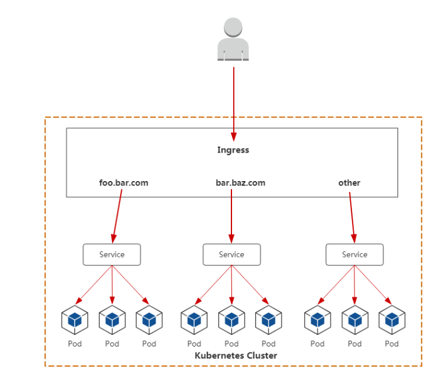


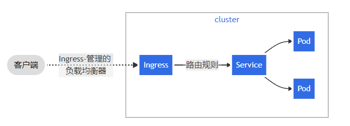


## 1.2 ingress控制器种类


### 1.2.1 Kubernetes Ingress Controller

- 参考链接：http://github.com/nginxinc/kubernetes-ingress


- 实现：Go/Lua（nginx 是用 C 写的）


- 许可证：Apache 2.0


- Kubernetes 的“官方”控制器（之所以称为官方，是想把它区别于 NGINX 公司的控制器）。这是社区开发的控制器，它基于 nginx Web 服务器，并补充了一组用于实现额外功能的 Lua 插件。


- 由于 NGINX 十分流行，再加上把它用作控制器时所需的修改较少，**它对于 K8s 普通工程师来说，可能是最简单和最直接的选择**。


### 1.2.2 NGINX Ingress Controller

- 参考链接：http://github.com/kubernetes/ingress-nginx


- 实现：Go


- 许可证：Apache 2.0


- 这是 NGINX 公司开发的官方产品，它也有一个基于 NGINX Plus 的商业版。NGINX 的控制器具有很高的稳定性、持续的向后兼容性，且没有任何第三方模块。


- 由于消除了 Lua 代码，和官方控制器相比，它保证了较高的速度，但也因此受到较大限制。相较之下，它的付费版本有更广泛的附加功能，如实时指标、JWT 验证、主动健康检查等。


- NGINX Ingress 重要的优势是对 TCP/UDP 流量的全面支持，最主要缺点是缺乏流量分配功能。


### 1.2.3 Kong Ingress


- 参考链接：http://github.com/Kong/kubernetes-ingress-controller


- 实现：Go


- 许可证：Apache 2.0


- Kong Ingress 由 Kong Inc 开发，有两个版本：商业版和免费版。它基于 NGINX 构建，并增加了扩展其功能的 Lua 模块。


- 最初，Kong Ingress 主要用作 API 网关，用于 API 请求的处理和路由。现在，它已经成为成熟的 Ingress 控制器，**主要优点是拥有大量易于安装和配置的附加模块、插件（包括第三方插件）**。它开启了控制器具备大量附加功能的先河，其内置函数也提供了许多可能性。Kong Ingress 配置是用 CRD 执行的。


- Kong Ingress 的一个重要特性是它只能在一个环境中运行（而不支持跨命名空间）。这是一个颇有争议的话题：有些人认为这是一个缺点，因为必须为每个环境生成实例；而另一些人认为这是一个特殊特性，因为它是更高级别的隔离，控制器故障的影响仅限于其所在的环境。


### 1.2.4 Traefik

- 参考链接：http://github.com/containous/traefik


- 实现：Go


- 许可证：MIT


- 最初，这个代理是为微服务请求及其动态环境的路由而创建的，因此具有许多有用的功能：**连续更新配置（不重新启动）、支持多种负载均衡算法、Web UI、指标导出、对各种服务的支持协议、REST API、Canary 版本**等。


- 支持开箱即用的 Let’s Encrypt 是它的另一个不错的功能，但它的主要缺点也很明显，就是为了控制器的高可用性，你必须安装并连接其 Key-value store。


- 在 2019 年 9 月发布的 Traefik v2.0 中，虽然它增加许多不错的新功能，如带有 SNI 的 TCP/SSL、金丝雀部署、流量镜像/shadowing 和经过改进的 Web UI，但一些功能（如 WAF 支持）还在策划讨论中。


- 与新版本同期推出的还有一个名叫 Mesh 的服务网格，它建在 Traefik 之上，对kubernetes内部服务访问做到受控及被监控。


### 1.2.5 HAProxy Ingress


- 参考链接：http://github.com/jcmoraisjr/haproxy-ingress


- 实现：Go（HAProxy 是用 C 写的）


- 许可证：Apache 2.0


- HAProxy 是众所周知的代理服务器和负载均衡器。作为 Kubernetes 集群的一部分，它提供了“软”配置更新（无流量损失）、基于 DNS 的服务发现和通过 API 进行动态配置。 HAProxy 还支持完全自定义配置文件模板（通过替换 ConfigMap）以及在其中使用 Spring Boot 函数。


- 通常，工程师会把重点放在已消耗资源的高速、优化和效率上。而 HAProxy 的优点之一正是支持大量负载均衡算法。值得一提的是，在2020年 6 月发布的 v2.0 中，HAProxy 增加了许多新功能，其即将推出的 v2.1 有望带来更多新功能（包括 OpenTracing 支持）。


### 1.2.6 Voyager

- 参考链接：http://github.com/appscode/voyager


- 实现：Go


- 许可证：Apache 2.0


- Voyager 基于 HAProxy，并作为一个通用的解决方案提供给大量供应商。它最具代表性的功能包括 L7 和 L4 上的流量负载均衡，其中，**TCP L4 流量负载均衡称得上是该解决方案最关键的功能之一**。


- 在2020年早些时候，尽管 Voyager 在 v9.0.0 中推出了对 HTTP/2 和 gRPC 协议的全面支持，但总的来看，对证书管理（Let’s Encrypt 证书）的支持仍是 Voyager 集成的最突出的新功能。


### 1.2.7 Contour

- 参考链接：http://github.com/heptio/contour


- 实现：Go


- 许可证：Apache 2.0


- Contour 和 Envoy 由同一个作者开发，它基于 Envoy。**它最特别的功能是可以通过 CRD（IngressRoute）管理 Ingress 资源**，对于多团队需要同时使用一个集群的组织来说，这有助于保护相邻环境中的流量，使它们免受 Ingress 资源更改的影响。


- 它还提供了一组扩展的负载均衡算法（镜像、自动重复、限制请求率等），以及详细的流量和故障监控。对某些工程师而言，它不支持粘滞会话可能是一个严重缺陷。


### 1.2.8 Istio Ingress


- 参考链接：http://istio.io/docs/tasks/traffic-management/ingress


- 实现：Go


- 许可证：Apache 2.0


- Istio 是 IBM、Google 和 Lyft 的联合开发项目，它是一个全面的服务网格解决方案——**不仅可以管理所有传入的外部流量（作为 Ingress 控制器），还可以控制集群内部的所有流量**。


- Istio 将 Envoy 用作每种服务的辅助代理。从本质上讲，它是一个可以执行几乎所有操作的大型处理器，其中心思想是最大程度的控制、可扩展性、安全性和透明性。


- 通过 Istio Ingress，你可以对流量路由、服务之间的访问授权、均衡、监控、金丝雀发布等进行优化。


### 1.2.9 Ambassador

- 参考链接：http://github.com/datawire/ambassador


- 实现：Python


- 许可证：Apache 2.0


- Ambassador 也是一个基于 Envoy 的解决方案，它有免费版和商业版两个版本。


- Ambassador 被称为“Kubernetes 原生 API 微服务网关”，它与 K8s 原语紧密集成，拥有你所期望的从 Ingress controller 获得的功能包，它还可以与各种服务网格解决方案，如 Linkerd、Istio 等一起使用。


- 顺便提一下，Ambassador 博客日前发布了一份基准测试结果，比较了 Envoy、HAProxy 和 NGINX 的基础性能。


### 1.2.10 Gloo

- 参考链接：http://github.com/solo-io/gloo


- 实现：Go


- 许可证：Apache 2.0


- Gloo 是在 Envoy 之上构建的新软件（于 2018 年 3 月发布），由于它的作者坚持认为“网关应该从功能而不是服务中构建 API”，它也被称为“功能网关”。其“功能级路由”的意思是它可以为后端实现是微服务、无服务器功能和遗留应用的混合应用路由流量。


- 由于拥有可插拔的体系结构，Gloo 提供了工程师期望的大部分功能，但是其中一些功能仅在其商业版本（Gloo Enterprise）中可用。


### 1.2.11 Skipper

- 参考链接：http://github.com/zalando/skipper


- 实现：Go


- 许可证：Apache 2.0


- Skipper 是 HTTP 路由器和反向代理，因此不支持各种协议。从技术上讲，它使用 Endpoints API（而不是 Kubernetes Services）将流量路由到 Pod。它的优点在于其丰富的过滤器集所提供的高级 HTTP 路由功能，工程师可以借此创建、更新和删除所有 HTTP 数据。


- Skipper 的路由规则可以在不停机的情况下更新。正如它的作者所述，Skipper 可以很好地与其他解决方案一起使用，比如 AWS ELB。


# 二、nginx ingress controller

## 2.1 nginx ingress controller位置


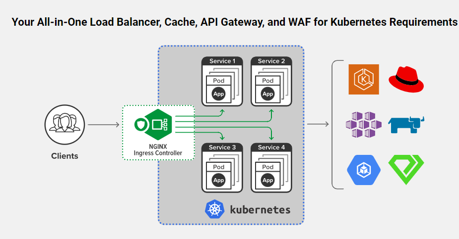


- 参考链接：<https://www.nginx.com/products/nginx/kubernetes-ingress-controller>


## 2.2  nginx ingress controller部署

- 项目地址：https://github.com/kubernetes/ingress-nginx


### 2.2.1 下载并修改配置文件

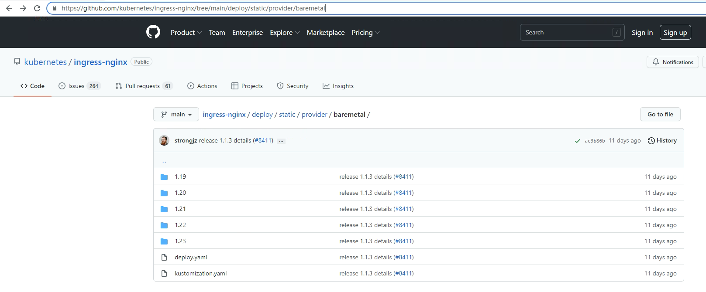


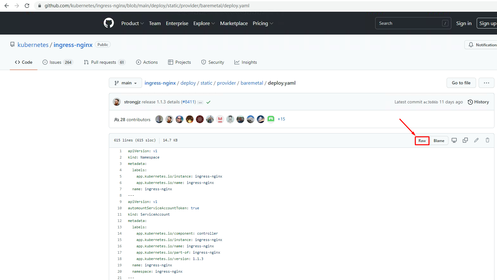


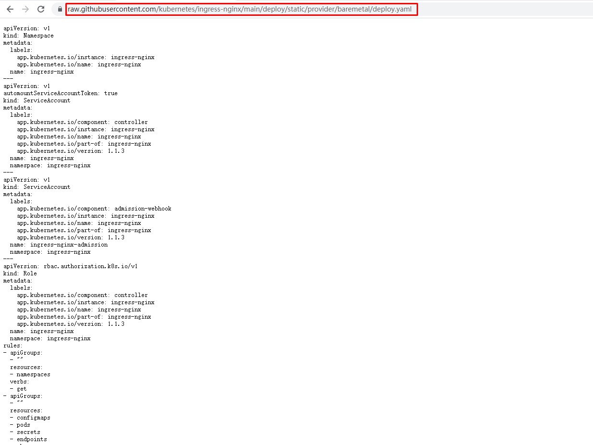


~~~powershell
[root@k8s-master1 ~]#  curl -k https://raw.githubusercontent.com/kubernetes/ingress-nginx/main/deploy/static/provider/baremetal/deploy.yaml  -o deploy.yaml
~~~


~~~powershell
[root@k8s-master1 ~]# ls
deploy.yaml
~~~


~~~powershell
[root@k8s-master1 ~]# vim deploy.yaml
......
323 spec:
324   ports:
325   - appProtocol: http
326     name: http
327     port: 80
328     protocol: TCP
329     targetPort: http
330   - appProtocol: https
331     name: https
332     port: 443
333     protocol: TCP
334     targetPort: https
335   selector:
336     app.kubernetes.io/component: controller
337     app.kubernetes.io/instance: ingress-nginx
338     app.kubernetes.io/name: ingress-nginx
339   type: NodePort

把339行修改为LoadBalancer
323 spec:
324   ports:
325   - appProtocol: http
326     name: http
327     port: 80
328     protocol: TCP
329     targetPort: http
330   - appProtocol: https
331     name: https
332     port: 443
333     protocol: TCP
334     targetPort: https
335   selector:
336     app.kubernetes.io/component: controller
337     app.kubernetes.io/instance: ingress-nginx
338     app.kubernetes.io/name: ingress-nginx
339   type: LoadBalancer

~~~


### 2.2.2 应用资源清单文件

~~~powershell
[root@k8s-master1 ~]# kubectl apply -f deploy.yaml
namespace/ingress-nginx created
serviceaccount/ingress-nginx created
serviceaccount/ingress-nginx-admission created
role.rbac.authorization.k8s.io/ingress-nginx created
role.rbac.authorization.k8s.io/ingress-nginx-admission created
clusterrole.rbac.authorization.k8s.io/ingress-nginx created
clusterrole.rbac.authorization.k8s.io/ingress-nginx-admission created
rolebinding.rbac.authorization.k8s.io/ingress-nginx created
rolebinding.rbac.authorization.k8s.io/ingress-nginx-admission created
clusterrolebinding.rbac.authorization.k8s.io/ingress-nginx created
clusterrolebinding.rbac.authorization.k8s.io/ingress-nginx-admission created
configmap/ingress-nginx-controller created
service/ingress-nginx-controller created
service/ingress-nginx-controller-admission created
deployment.apps/ingress-nginx-controller created
job.batch/ingress-nginx-admission-create created
job.batch/ingress-nginx-admission-patch created
ingressclass.networking.k8s.io/nginx created
validatingwebhookconfiguration.admissionregistration.k8s.io/ingress-nginx-admission created
~~~


### 2.2.3 验证部署结果

> 注意镜像较大，可提前下载至集群node节点

~~~powershell
[root@k8s-master1 ~]# kubectl get pods -n ingress-nginx
NAME                                      READY   STATUS      RESTARTS   AGE
ingress-nginx-admission-create-xdpgp      0/1     Completed   0          91s
ingress-nginx-admission-patch-lgnxs       0/1     Completed   1          91s
ingress-nginx-controller-9596689c-j9p9l   1/1     Running     0          91s
~~~


~~~powershell
[root@k8s-master1 ng]# kubectl get all -n ingress-nginx
NAME                                          READY   STATUS      RESTARTS   AGE
pod/ingress-nginx-admission-create-xdpgp      0/1     Completed   0          3m24s
pod/ingress-nginx-admission-patch-lgnxs       0/1     Completed   1          3m24s
pod/ingress-nginx-controller-9596689c-j9p9l   1/1     Running     0          3m24s

NAME                                         TYPE           CLUSTER-IP      EXTERNAL-IP     PORT(S)                      AGE
service/ingress-nginx-controller             LoadBalancer   10.96.183.188   192.168.10.91   80:32369/TCP,443:31775/TCP   3m25s
service/ingress-nginx-controller-admission   ClusterIP      10.96.212.14    <none>          443/TCP                      3m25s

NAME                                       READY   UP-TO-DATE   AVAILABLE   AGE
deployment.apps/ingress-nginx-controller   1/1     1            1           3m24s

NAME                                                DESIRED   CURRENT   READY   AGE
replicaset.apps/ingress-nginx-controller-9596689c   1         1         1       3m24s

NAME                                       COMPLETIONS   DURATION   AGE
job.batch/ingress-nginx-admission-create   1/1           2s         3m24s
job.batch/ingress-nginx-admission-patch    1/1           3s         3m24s
~~~


## 2.3 ingress对象应用案例

### 2.3 1 ingress-http案例

> 基于名称的负载均衡

#### 2.3.1.1 创建deployment控制器类型应用

```powershell
[root@k8s-master1 ~]# vim nginx.yml
apiVersion: apps/v1
kind: Deployment
metadata:
  name: nginx
  namespace: ingress-nginx
spec:
  replicas: 2
  selector:
    matchLabels:
      app: nginx
  template:
    metadata:
      labels:
        app: nginx
    spec:
      containers:
      - name: c1
        image: nginx:1.15-alpine
        imagePullPolicy: IfNotPresent
```

应用YAML

~~~powershell
[root@k8s-master1 ~]# kubectl apply -f nginx.yml
deployment.extensions/nginx created
~~~

验证pod

~~~powershell
[root@k8s-master1 ~]# kubectl get pods -n ingress-nginx
NAME                                        READY   STATUS    RESTARTS   AGE
nginx-79654d7b8-nhxpm                       1/1     Running   0          12s
nginx-79654d7b8-tp8wg                       1/1     Running   0          13s
nginx-ingress-controller-77db54fc46-kwwkt   1/1     Running   0          11m
~~~


#### 2.3.1.2 创建service

```powershell
[root@k8s-master1 ~]# vim nginx-service.yml
apiVersion: v1
kind: Service
metadata:
  name: nginx-service
  namespace: ingress-nginx
  labels:
    app: nginx
spec:
  ports:
  - port: 80
    targetPort: 80
  selector:
    app: nginx
```

应用YAML

~~~powershell
[root@k8s-master1 ~]# kubectl apply -f nginx-service.yml
service/nginx-service created
~~~

验证service

~~~powershell
[root@k8s-master1 ~]# kubectl get svc -n ingress-nginx
NAME            TYPE        CLUSTER-IP     EXTERNAL-IP   PORT(S)   AGE
nginx-service   ClusterIP   10.2.115.144   <none>        80/TCP    5s
~~~


#### 2.3.1.3 创建ingress对象

```powershell
[root@k8s-master1 ~]# vim ingress-nginx.yaml
apiVersion: networking.k8s.io/v1
kind: Ingress
metadata:
  name: ingress-nginx                    #自定义ingress名称
  namespace: ingress-nginx
  annotations:
    ingressclass.kubernetes.io/is-default-class: "true"
    kubernetes.io/ingress.class: nginx
spec:
  rules:
  - host: www.kubemsb.com                   # 自定义域名
    http:
      paths:
      - pathType: Prefix
        path: "/"
        backend:
          service:
            name: nginx-service     # 对应上面创建的service名称
            port:
              number: 80
```

应用YAML

~~~powershell
[root@k8s-master1 ~]# kubectl apply -f ingress-nginx.yaml
ingress.extensions/ingress-nginx created
~~~

验证ingress

~~~powershell
[root@k8s-master1 ~]# kubectl get ingress -n ingress-nginx
NAME            CLASS    HOSTS             ADDRESS         PORTS   AGE
ingress-nginx   <none>   www.kubemsb.com   192.168.10.12   80      113s
~~~

描述查看ingress信息

~~~powershell
[root@k8s-master1 ~]# kubectl describe ingress ingress-nginx -n ingress-nginx
Name:             ingress-nginx
Namespace:        ingress-nginx
Address:          192.168.10.12
Default backend:  default-http-backend:80 (<error: endpoints "default-http-backend" not found>)
Rules:
  Host             Path  Backends
  ----             ----  --------
  www.kubemsb.com
                   /   nginx-service:80 (10.244.159.160:80,10.244.194.110:80)
Annotations:       kubernetes.io/ingress.class: nginx
Events:
  Type    Reason  Age                 From                      Message
  ----    ------  ----                ----                      -------
  Normal  Sync    2m (x2 over 2m56s)  nginx-ingress-controller  Scheduled for sync
~~~

~~~powershell
[root@k8s-master1 ~]# kubectl get pods -o wide -n ingress-nginx
NAME                                      READY   STATUS      RESTARTS   AGE     IP               NODE          NOMINATED NODE   READINESS GATES

nginx-646d5c7b67-mpw9r                    1/1     Running     0          4m15s   10.244.194.110   k8s-worker1   <none>           <none>
nginx-646d5c7b67-v99gz                    1/1     Running     0          4m15s   10.244.159.160   k8s-master1   <none>           <none>
可以看到两个pod的IP正好对应ingress域名对应的IP
~~~


确认`nginx-ingress-controller`的podIP为`192.168.10.91`


#### 2.3.1.4 模拟客户端访问

1, 确认`nginx-ingress-controller`的podIP, 下面命令查询的结果为`192.168.10.91`

~~~powershell
[root@k8s-master1 ~]# kubectl get svc -n ingress-nginx  |grep ingress
ingress-nginx-controller             LoadBalancer   10.96.183.188   192.168.10.91   80:32369/TCP,443:31775/TCP   11m
ingress-nginx-controller-admission   ClusterIP      10.96.212.14    <none>          443/TCP                      11m
~~~

2, 在集群之外任一主机中添加上述域名与IP地址解析(模拟公网DNS)

```powershell
[root@otherhost ~]# vim /etc/hosts

192.168.10.91 www.kubemsb.com
```

3, 准备pod内容器运行的web主页

```powershell
[root@k8s-master1 ~]# kubectl get pods  -n ingress-nginx 
nginx-646d5c7b67-mpw9r                    1/1     Running     0          8m34s
nginx-646d5c7b67-v99gz                    1/1     Running     0          8m34s


[root@k8s-master1 ~]# kubectl exec -it nginx-646d5c7b67-mpw9r -n ingress-nginx  -- /bin/sh
/ # echo "ingress web1" > /usr/share/nginx/html/index.html
/ # exit

[root@k8s-master1 ~]# kubectl exec -it nginx-646d5c7b67-v99gz -n ingress-nginx -- /bin/sh
/ # echo "ingress web2" > /usr/share/nginx/html/index.html
/ # exit
```

4, 访问及结果展示

```powershell
[root@otherhost ~]# curl www.kubemsb.com
ingress web1
[root@otherhost ~]# curl www.kubemsb.com
ingress web2
```


### 2.3.2 ingress-http案例扩展

> 基于URI的负载均衡


#### 2.3.2.1 创建第一个应用

~~~powershell
[root@k8s-master1 ~]# vim nginx-uri-1.yml
apiVersion: apps/v1
kind: Deployment
metadata:
  name: nginx-uri-1
  namespace: ingress-nginx
spec:
  replicas: 2
  selector:
    matchLabels:
      app: nginx-uri-1
  template:
    metadata:
      labels:
        app: nginx-uri-1
    spec:
      containers:
      - name: c1
        image: nginx:1.15-alpine
        imagePullPolicy: IfNotPresent
~~~


~~~powershell
[root@k8s-master1 ~]# vim nginx-service-uri-1.yml
apiVersion: v1
kind: Service
metadata:
  name: nginx-service-uri-1
  namespace: ingress-nginx
  labels:
    app: nginx-uri-1
spec:
  ports:
  - port: 80
    targetPort: 80
  selector:
    app: nginx-uri-1
~~~


~~~powershell
# kubectl apply -f nginx-uri-1.yaml
~~~


~~~powershell
# kubectl apply -f nginx-service-uri-1.yaml
~~~


#### 2.3.2.2 创建第二个应用


~~~powershell
[root@k8s-master1 ~]# vim nginx-uri-2.yml
apiVersion: apps/v1
kind: Deployment
metadata:
  name: nginx-uri-2
  namespace: ingress-nginx
spec:
  replicas: 2
  selector:
    matchLabels:
      app: nginx-uri-2
  template:
    metadata:
      labels:
        app: nginx-uri-2
    spec:
      containers:
      - name: c1
        image: nginx:1.15-alpine
        imagePullPolicy: IfNotPresent
~~~


~~~powershell
[root@k8s-master1 ~]# vim nginx-service-uri-2.yml
apiVersion: v1
kind: Service
metadata:
  name: nginx-service-uri-2
  namespace: ingress-nginx
  labels:
    app: nginx-uri-2
spec:
  ports:
  - port: 80
    targetPort: 80
  selector:
    app: nginx-uri-2
~~~


~~~powershell
# kubectl apply -f nginx-uri-2.yaml
~~~


~~~powershell
# kubectl apply -f nginx-service-uri-2.yaml
~~~


~~~powershell
# kubectl get svc -n ingress-nginx
NAME                                 TYPE           CLUSTER-IP      EXTERNAL-IP     PORT(S)                      AGE

nginx-service-uri-1                  ClusterIP      10.96.171.135   <none>          80/TCP                       7m24s
nginx-service-uri-2                  ClusterIP      10.96.234.164   <none>          80/TCP                       4m11s
~~~


#### 2.3.2.3 创建ingress对象

```powershell
[root@k8s-master1 ~]# vim ingress-nginx.yaml
apiVersion: networking.k8s.io/v1
kind: Ingress
metadata:
  name: ingress-uri
  namespace: ingress-nginx
  annotations:
    ingressclass.kubernetes.io/is-default-class: "true"
    kubernetes.io/ingress.class: nginx
spec:
  rules:
  - host: www.kubemsburi.com
    http:
      paths:
      - path: /svc1
        pathType: Prefix
        backend:
          service:
            name: nginx-service-uri-1
            port:
              number: 80
      - path: /svc2
        pathType: Prefix
        backend:
          service:
            name: nginx-service-uri-2
            port:
              number: 80
```

应用YAML

~~~powershell
[root@master1 ~]# kubectl apply -f ingress-nginx-uri.yaml
ingress.networking.k8s.io/ingress-uri created
~~~

验证ingress

~~~powershell
[root@master1 ~]# kubectl get ingress -n ingress-nginx
NAME            CLASS    HOSTS             ADDRESS         PORTS   AGE
ingress-uri     <none>   www.kubemsburi.com                   80      13s
~~~

描述查看ingress信息

~~~powershell
[root@master1 ~]# kubectl describe ingress ingress-uri -n ingress-nginx
Name:             ingress-uri
Namespace:        ingress-nginx
Address:          192.168.10.12
Default backend:  default-http-backend:80 (<error: endpoints "default-http-backend" not found>)
Rules:
  Host                Path  Backends
  ----                ----  --------
  www.kubemsburi.com
                      /svc1   nginx-service-uri-1:80 (10.244.159.158:80,10.244.194.111:80)
                      /svc2   nginx-service-uri-2:80 (10.244.159.159:80,10.244.194.112:80)
Annotations:          kubernetes.io/ingress.class: nginx
Events:
  Type    Reason  Age               From                      Message
  ----    ------  ----              ----                      -------
  Normal  Sync    4s (x2 over 32s)  nginx-ingress-controller  Scheduled for sync
~~~

~~~powershell
[root@k8s-master1 ~]# kubectl get pods -o wide -n ingress-nginx
NAME                                      READY   STATUS      RESTARTS   AGE   IP               NODE          NOMINATED NODE   READINESS GATES

nginx-uri-1-7d7d75f86-dws96               1/1     Running     0          14m   10.244.159.158   k8s-master1   <none>           <none>
nginx-uri-1-7d7d75f86-s8js4               1/1     Running     0          14m   10.244.194.111   k8s-worker1   <none>           <none>
nginx-uri-2-7cdf7f89b7-8s4mg              1/1     Running     0          10m   10.244.194.112   k8s-worker1   <none>           <none>
nginx-uri-2-7cdf7f89b7-gj8x6              1/1     Running     0          10m   10.244.159.159   k8s-master1   <none>           <none>

~~~


确认`nginx-ingress-controller`的podIP为`192.168.10.91`


#### 2.3.1.4 模拟客户端访问

1, 确认`nginx-ingress-controller`的podIP, 下面命令查询的结果为`192.168.10.91`

~~~powershell
[root@k8s-master1 ~]# kubectl get svc -n ingress-nginx  |grep ingress
ingress-nginx-controller             LoadBalancer   10.96.183.188   192.168.10.91   80:32369/TCP,443:31775/TCP   11m
ingress-nginx-controller-admission   ClusterIP      10.96.212.14    <none>          443/TCP                      11m
~~~

2, 在集群之外任一主机中添加上述域名与IP地址解析(模拟公网DNS)

```powershell
[root@otherhost ~]# vim /etc/hosts

192.168.10.91 www.kubemsburi.com
```

3, 准备pod内容器运行的web主页

```powershell
[root@k8s-master1 ~]# kubectl exec -it nginx-uri-1-7d7d75f86-dws96 -n ingress-nginx -- /bin/sh
/ # mkdir /usr/share/nginx/html/svc1
/ # echo "sssvc1" > /usr/share/nginx/html/svc1/index.html
/ # exit
[root@k8s-master1 ~]# kubectl exec -it nginx-uri-1-7d7d75f86-s8js4 -n ingress-nginx -- /bin/sh
/ # mkdir /usr/share/nginx/html/svc1
/ # echo "sssvc1" > /usr/share/nginx/html/svc1/index.html
/ # exit
[root@k8s-master1 ~]# kubectl exec -it nginx-uri-2-7cdf7f89b7-8s4mg -n ingress-nginx -- /bin/sh
/ # mkdir /usr/share/nginx/html/svc2
/ # echo "sssvc2" > /usr/share/nginx/html/svc1/index.html
/ # exit
[root@k8s-master1 ~]# kubectl exec -it nginx-uri-2-7cdf7f89b7-gj8x6 -n ingress-nginx -- /bin/sh
/ # mkdir /usr/share/nginx/html/svc2
/ # echo "sssvc2" > /usr/share/nginx/html/svc1/index.html
/ # exit
```

4, 访问及结果展示

```powershell
[root@otherhost ~]# curl www.kubemsburi.com/svc1/index.html
sssvc1
[root@otherhost ~]# curl www.kubemsburi.com/svc2/index.html
sssvc2
```


### 2.3.3 ingress-https案例

#### 2.3.3.1 创建自签证书

~~~powershell
[root@k8s-master1 ~]# mkdir ingress-https
[root@k8s-master1 ~]# cd ingress-https/
[root@k8s-master1 ingress-https]# openssl genrsa -out nginx.key 2048
[root@k8s-master1 ingress-https]# openssl req -new -x509 -key nginx.key -out nginx.pem -days 365
......
......
Country Name (2 letter code) [XX]:CN
State or Province Name (full name) []:GD
Locality Name (eg, city) [Default City]:SZ
Organization Name (eg, company) [Default Company Ltd]:IT
Organizational Unit Name (eg, section) []:it
Common Name (eg, your name or your server's hostname) []:kubemsbhost
Email Address []:admin@kubemsbhost.com

[root@k8s-master1 ingress-https]# ls
nginx.key  nginx.pem
~~~

#### 2.3.3.2 将证书创建成secret

~~~powershell
[root@k8s-master1 ingress-https]# kubectl create secret tls nginx-tls-secret --cert=nginx.pem --key=nginx.key -n ingress-nginx
secret/nginx-tls-secret created

[root@k8s-master1 ingress-https]# kubectl get secrets -n ingress-nginx |grep nginx-tls-secret
nginx-tls-secret                           kubernetes.io/tls                     2      38s
~~~

#### 2.3.3.3 编排YAML并创建

~~~powershell
[root@k8s-master1 ingress-https]# vim ingress-https.yml
apiVersion: apps/v1
kind: Deployment
metadata:
  name: nginx2
  namespace: ingress-nginx
spec:
  replicas: 2
  selector:
    matchLabels:
      app: nginx2
  template:
    metadata:
      labels:
        app: nginx2
    spec:
      containers:
      - name: c1
        image: nginx:1.15-alpine
        imagePullPolicy: IfNotPresent
        ports:
        - name: http
          containerPort: 80
        - name: https
          containerPort: 443
---
apiVersion: v1
kind: Service
metadata:
  name: nginx-service2
  namespace: ingress-nginx
  labels:
    app: nginx2
spec:
  ports:
  - name: http
    port: 80
    targetPort: 80
  - name: https
    port: 443
    targetPort: 443
  selector:
    app: nginx2
---
apiVersion: networking.k8s.io/v1
kind: Ingress
metadata:
  name: ingress-nginx2
  namespace: ingress-nginx
  annotations:
    ingressclass.kubernetes.io/is-default-class: "true"
    kubernetes.io/ingress.class: nginx
spec:
  tls:
  - hosts:
    - www.kubemsbhost.com                                                     # 域名
    secretName: nginx-tls-secret                                  # 调用前面创建的secret
  rules:
  - host: www.kubemsbhost.com                                                 # 域名
    http:
      paths:
      - pathType: Prefix
        path: "/"
        backend:
          service:
            name: nginx-service2                     # 对应服务名
            port:
              number: 80
~~~


~~~powershell
[root@k8s-master1 ingress-https]# kubectl apply -f ingress-https.yml
deployment.apps/nginx2 created
service/nginx-service2 created
ingress.extensions/ingress-nginx2 created
~~~

验证

~~~powershell
[root@k8s-master1 ~]# kubectl get ingress -n ingress-nginx
NAME             CLASS    HOSTS                 ADDRESS         PORTS     AGE
ingress-nginx2   <none>   www.kubemsbhost.com   192.168.10.12   80, 443   2m14s
~~~


#### 2.3.3.4 模拟客户端访问

~~~powershell

[root@otherhost ~]# vim /etc/hosts

192.168.10.91 www.kubemsbhost.com					添加这行模拟DNS

[root@otherhost ~]# firefox https://www.kubemsbhost.com &
[1] 10892
~~~


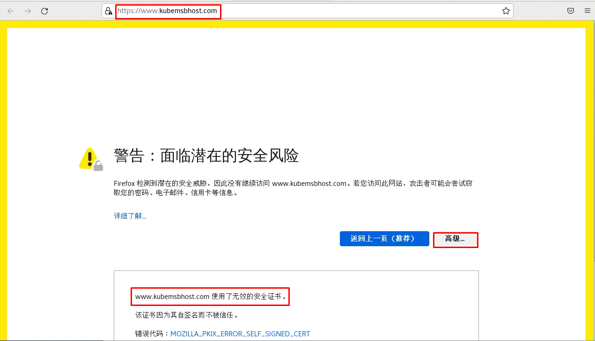


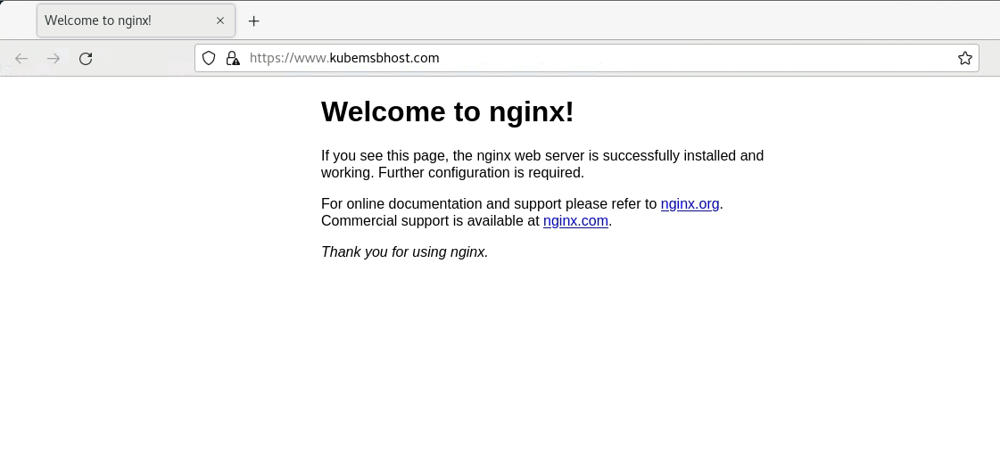

~~~powershell
关于可信任证书的说明：
如果需要在互联网中访问kubernetes集群中的服务是可信的，建议使用互联网中申请的SSL证书。

~~~


### 2.3.4 ingress+nodeport服务

~~~powershell
[root@k8s-master1 ~]# vim ingress-nodeport.yml
apiVersion: apps/v1
kind: Deployment
metadata:
  name: nginx3
  namespace: ingress-nginx
spec:
  replicas: 2
  selector:
    matchLabels:
      app: nginx3
  template:
    metadata:
      labels:
        app: nginx3
    spec:
      containers:
      - name: c1
        image: nginx:1.15-alpine
        imagePullPolicy: IfNotPresent
---
apiVersion: v1
kind: Service
metadata:
  name: nginx-service3
  namespace: ingress-nginx
  labels:
    app: nginx3
spec:
  type: NodePort						# NodePort类型服务
  ports:
  - port: 80
    targetPort: 80
  selector:
    app: nginx3
---
apiVersion: networking.k8s.io/v1
kind: Ingress
metadata:
  name: ingress-nginx3
  namespace: ingress-nginx
  annotations:
    ingressclass.kubernetes.io/is-default-class: "true"
    kubernetes.io/ingress.class: nginx
spec:
  rules:
  - host: www.kubemsb3.com                                                 # 域名
    http:
      paths:
      - pathType: Prefix
        path: "/"
        backend:
          service:
            name: nginx-service3                    # 对应服务名
            port:
              number: 80
~~~


~~~powershell
[root@k8s-master1 ~]# kubectl apply -f ingress-nodeport.yml
~~~


~~~powershell
root@k8s-master1 ~]# kubectl get svc -n ingress-nginx
NAME             TYPE        CLUSTER-IP     EXTERNAL-IP   PORT(S)          AGE
nginx-service    ClusterIP   10.2.115.144   <none>        80/TCP           22h
nginx-service2   ClusterIP   10.2.237.70    <none>        80/TCP,443/TCP   22h
nginx-service3   NodePort    10.2.75.250    <none>        80:26765/TCP     3m51s
nginx-service3是nodeport类型
~~~


~~~powershell
[root@otherhost ~]# vim /etc/hosts

192.168.10.91 www.kubemsb3.com					添加这行模拟DNS

[root@otherhost ~]# curl www.kubemsb3.com
~~~


# ingress nginx controller 1.4.0 最新版本部署方法

# 一、获取ingress nginx controller


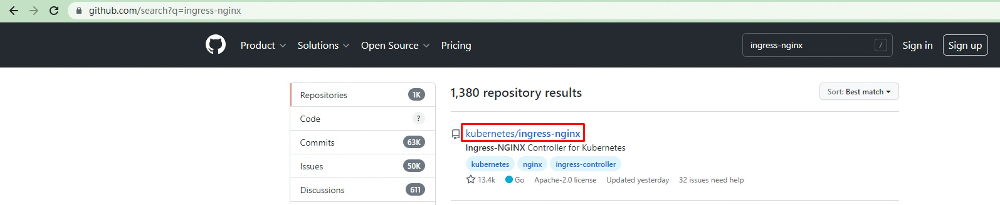


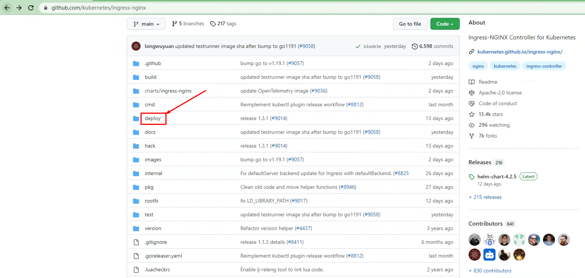


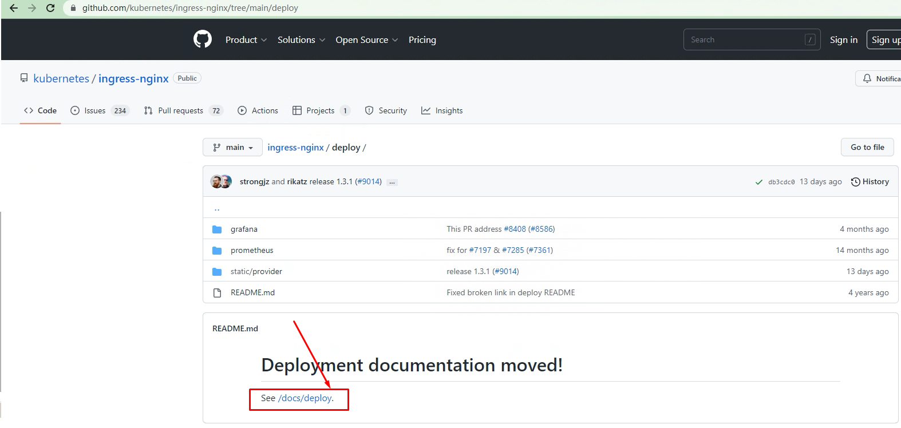


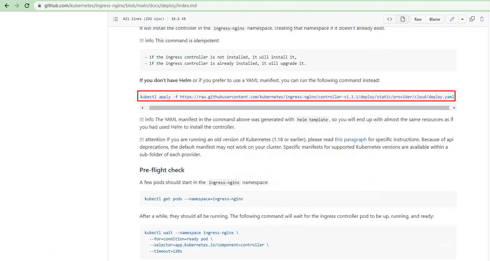


~~~powershell
# wget https://raw.githubusercontent.com/kubernetes/ingress-nginx/controller-v1.4.0/deploy/static/provider/cloud/deploy.yaml
~~~


# 二、部署ingress nginx controller

~~~powershell
# vim deploy.yaml
......

361 spec:
362   externalTrafficPolicy: Cluster  默认为local，修改为Cluster
363   ipFamilies:
364   - IPv4
365   ipFamilyPolicy: SingleStack
366   ports:
367   - appProtocol: http
368     name: http
369     port: 80
370     protocol: TCP
371     targetPort: http
372   - appProtocol: https
373     name: https
374     port: 443
375     protocol: TCP
376     targetPort: https
377   selector:
378     app.kubernetes.io/component: controller
379     app.kubernetes.io/instance: ingress-nginx
380     app.kubernetes.io/name: ingress-nginx
381   type: LoadBalancer  此处默认即为LoadBalancer,此版本不用修改。
~~~


~~~powershell
# kubectl apply -f deploy.yaml
~~~


~~~powershell
# kubectl get pods -n ingress-nginx
NAME                                       READY   STATUS      RESTARTS   AGE
ingress-nginx-admission-create-szjlp       0/1     Completed   0          13m
ingress-nginx-admission-patch-b8vnr        0/1     Completed   0          13m
ingress-nginx-controller-b4fcbcc8f-mg9vm   1/1     Running     0          13m
~~~

