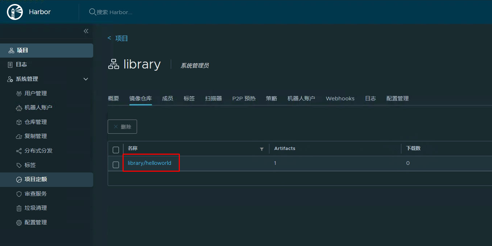
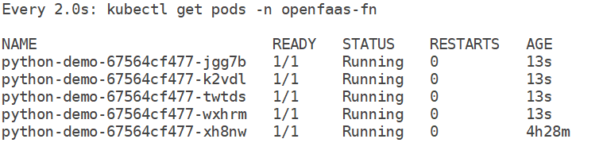

# Serverless之OpenFaaS 函数即服务

# 一、OpenFaaS介绍

Openfaas是一种serverless提供方式，可以使开发人员轻松地将事件驱动的功能和微服务部署到Kubernetes中，能够自动将你的代码或已有的二进制文件打包到Docker容器镜像中，快速实现部署并提供即时访问接口，且在运行过程中具有自动缩放和指标的高度扩展性。

**OpenFaas 特性**

- 开源函数框架 - 在任何云上运行函数，无需担心锁定
- 用任何语言编写函数并将它们打包到 Docker/OCI 格式的容器中
- 易于使用 - 内置 UI、强大的 CLI 和一键安装
- 随心所欲地扩展 - 处理流量高峰，并在空闲时缩减
- 活跃的社区 - 贡献和归属
- 开发人员社区版、专业版和生产支持

**Openfaas架构设计**

**function调用路径**

API网关为你的函数提供了一个外部路由，并通过Prometheus收集云原生指标。网关还有一个内置的UI界面，使得你可以从OpenFaaS的函数商店部署并调用自己的函数。

网关会根据需要自动伸缩函数，依据 Kubernetes的API来改变服务的副本数来做到。 在/system/alert端点接收AlertManager生成的自定义通知。

- 内置UI
- 部署自定义函数，或者函数商店中的函数
- Prometheus的仪表盘
- 通过AlertManager自动伸缩
- REST API

当Gateway作为一个入口，当CLI或者web页面发来要部署或者调用一个函数的时候，Gateway会将请求转发给Provider，同时会将监控指标发给Prometheus。AlterManager会根据需求，调用API自动伸缩函数。

nats是一个开源的，云原生的消息系统，类似于ActiveMQ、KafKa、RabbitMq。Apcera，百度，西门子，VMware，HTC和爱立信等公司都有在使用。

核心基于EventMachine开发，原理是基于消息发布订阅机制，每台服务器上的每个模块会根据自己的消息类别向MessageBus发布多个消息主题，而同时也向自己需要交互的模块，按照需要的主题订阅消息。能够达到每秒8-11百万个消息，整个程序很小只有3M Docker image，它不支持持久化消息，如果你离线，你就不能获得消息。使用nats streaming可以做到持久化，缓存等功能。

~~~powershell
# kubectl get pods -n openfaas
NAME                                READY   STATUS    RESTARTS      AGE
alertmanager-646f7b5cf4-w96hm       1/1     Running   1 (18h ago)   18h
basic-auth-plugin-957dfbfb7-v5jv7   1/1     Running   1 (18h ago)   18h
gateway-79458985bd-9g9xw            2/2     Running   4 (18h ago)   18h
nats-7f8c77747c-dbqrm               1/1     Running   1 (18h ago)   18h
prometheus-6f69c7b564-x8p8d         1/1     Running   1 (18h ago)   18h
queue-worker-78bd96497-dnvt5        1/1     Running   1 (18h ago)   18h
~~~

# 二、OpenFaaS运行基础环境

> 官网链接：www.openfaas.com

kubernetes现在已经成了环境管理及容器调度的实时标准了。openfaas的部署章节，推荐使用kubernetes进行部署和使用。

# 三、使用helm进行部署

## 3.1 helm安装

> 参考链接：https://github.com/openfaas/faas-netes/blob/master/chart/openfaas/README.md

~~~powershell
下载helm
curl -sSLf https://raw.githubusercontent.com/helm/helm/master/scripts/get-helm-3 | bash
~~~

~~~powershell
验证helm版本
helm version
~~~

## 3.2 使用helm部署openfaas

> 参考链接：https://github.com/openfaas/faas-netes/blob/master/chart/openfaas/README.md

~~~powershell
helm repo add openfaas https://openfaas.github.io/faas-netes/
~~~

~~~powershell
helm repo update
~~~

~~~powershell
kubectl apply -f https://raw.githubusercontent.com/openfaas/faas-netes/master/namespaces.yml
~~~

>- openfaas：用于核心组件
>- openfaas-fn：用于functions

~~~powershell
# kubectl get ns
NAME               STATUS   AGE
......
openfaas           Active   8s
openfaas-fn        Active   8s
~~~

~~~powershell
helm repo update \
 && helm upgrade openfaas --install openfaas/openfaas \
    --namespace openfaas  \
    --set functionNamespace=openfaas-fn \
    --set generateBasicAuth=true
~~~

~~~powershell
Release "openfaas" does not exist. Installing it now.
NAME: openfaas
LAST DEPLOYED: Thu Nov 24 11:21:14 2022
NAMESPACE: openfaas
STATUS: deployed
REVISION: 1
TEST SUITE: None
NOTES:
To verify that openfaas has started, run:

  kubectl -n openfaas get deployments -l "release=openfaas, app=openfaas"
To retrieve the admin password, run:

  echo $(kubectl -n openfaas get secret basic-auth -o jsonpath="{.data.basic-auth-password}" | base64 --decode)
~~~

## 3.3 openfaas部署验证

~~~powershell
# kubectl get all -n openfaas
NAME                                    READY   STATUS    RESTARTS      AGE
pod/alertmanager-646f7b5cf4-mpkxp       1/1     Running   0             112s
pod/basic-auth-plugin-957dfbfb7-6wbwb   1/1     Running   0             112s
pod/gateway-79458985bd-pd5lw            2/2     Running   0             112s
pod/nats-7f8c77747c-tsxlg               1/1     Running   0             112s
pod/prometheus-6f69c7b564-fn8vs         1/1     Running   0             112s
pod/queue-worker-78bd96497-gwr7m        1/1     Running   1 (99s ago)   112s

NAME                        TYPE        CLUSTER-IP    EXTERNAL-IP   PORT(S)          AGE
service/alertmanager        ClusterIP   10.96.0.255   <none>        9093/TCP         112s
service/basic-auth-plugin   ClusterIP   10.96.2.167   <none>        8080/TCP         112s
service/gateway             ClusterIP   10.96.3.110   <none>        8080/TCP         112s
service/gateway-external    NodePort    10.96.3.20    <none>        8080:31112/TCP   112s
service/gateway-provider    ClusterIP   10.96.1.95    <none>        8081/TCP         112s
service/nats                ClusterIP   10.96.3.5     <none>        4222/TCP         112s
service/prometheus          ClusterIP   10.96.2.177   <none>        9090/TCP         112s

NAME                                READY   UP-TO-DATE   AVAILABLE   AGE
deployment.apps/alertmanager        1/1     1            1           112s
deployment.apps/basic-auth-plugin   1/1     1            1           112s
deployment.apps/gateway             1/1     1            1           112s
deployment.apps/nats                1/1     1            1           112s
deployment.apps/prometheus          1/1     1            1           112s
deployment.apps/queue-worker        1/1     1            1           112s

NAME                                          DESIRED   CURRENT   READY   AGE
replicaset.apps/alertmanager-646f7b5cf4       1         1         1       112s
replicaset.apps/basic-auth-plugin-957dfbfb7   1         1         1       112s
replicaset.apps/gateway-79458985bd            1         1         1       112s
replicaset.apps/nats-7f8c77747c               1         1         1       112s
replicaset.apps/prometheus-6f69c7b564         1         1         1       112s
replicaset.apps/queue-worker-78bd96497        1         1         1       112s
~~~

# 四、访问gateway管理界面

>可以看到已经部署了NodePort service，暴露端口为`31112`，可以通过`http://<node-ip>:31112`打开gateway的管理界面了。

## 4.1 获取访问密码

~~~powershell
echo $(kubectl -n openfaas get secret basic-auth -o jsonpath="{.data.basic-auth-password}" | base64 --decode)

输出密码为：
8hG1vZOzFfBs
~~~

或

~~~powershell
PASSWORD=$(kubectl -n openfaas get secret basic-auth -o jsonpath="{.data.basic-auth-password}" | base64 --decode) && \
echo "OpenFaaS admin password: $PASSWORD"

输出密码为：
OpenFaaS admin password: 8hG1vZOzFfBs
~~~

## 4.2 访问gateway管理界面

>打开gateway界面，用户名为admin，密码为上面查到内容。

# 五、OpenFaaS初体验

~~~powershell
# kubectl get all -n openfaas-fn
NAME                       READY   STATUS    RESTARTS   AGE
pod/env-5f5d786cc7-wx9md   1/1     Running   0          7m43s

NAME          TYPE        CLUSTER-IP    EXTERNAL-IP   PORT(S)    AGE
service/env   ClusterIP   10.96.0.160   <none>        8080/TCP   7m43s

NAME                  READY   UP-TO-DATE   AVAILABLE   AGE
deployment.apps/env   1/1     1            1           7m43s

NAME                             DESIRED   CURRENT   READY   AGE
replicaset.apps/env-5f5d786cc7   1         1         1       7m43s
~~~

获取访问信息

# 六、开发和部署function

## 6.1 安装命令行工具 faas-cli

~~~powershell
 curl -sSL https://cli.openfaas.com | sh
~~~

~~~powershell
# faas-cli version
  ___                   _____           ____
 / _ \ _ __   ___ _ __ |  ___|_ _  __ _/ ___|
| | | | '_ \ / _ \ '_ \| |_ / _` |/ _` \___ \
| |_| | |_) |  __/ | | |  _| (_| | (_| |___) |
 \___/| .__/ \___|_| |_|_|  \__,_|\__,_|____/
      |_|

CLI:
 commit:  0074051aeb837f5f160ee8736341460468b5c190
 version: 0.15.4
~~~

## 6.2 登录faas-cli工具

~~~powershell
设置OpenFaas gateway的地址
export OPENFAAS_URL=192.168.10.160:31112
~~~

~~~powershell
获取OpenFaas gateway admin的密码
$ PASSWORD=$(kubectl -n openfaas get secret basic-auth -o jsonpath="{.data.basic-auth-password}" | base64 --decode) && echo "OpenFaaS admin password: $PASSWORD"
~~~

~~~powershell
 登录faas-cli
$ echo -n $PASSWORD | faas-cli login -g $OPENFAAS_URL -u admin --password-stdin
~~~

~~~powershell
登录提示：
Calling the OpenFaaS server to validate the credentials...
WARNING! You are not using an encrypted connection to the gateway, consider using HTTPS.
credentials saved for admin http://192.168.10.160:31112
~~~

## 6.3 获取模板列表

OpenFaas提供了各种语言的模板列表，可以通过以下命令获取最新的列表

~~~powershell
# faas-cli template pull
~~~

~~~powershell
下载提示：
Fetch templates from repository: https://github.com/openfaas/templates.git at
2022/11/24 12:25:08 Attempting to expand templates from https://github.com/openfaas/templates.git
2022/11/24 12:25:11 Fetched 17 template(s) : [csharp dockerfile go java11 java11-vert-x node node12 node12-debian node14 node16 node17 php7 php8 python python3 python3-debian ruby] from https://github.com/openfaas/templates.git
~~~

~~~powershell
查看模板列表
# faas-cli template store list

NAME                     SOURCE             DESCRIPTION
csharp                   openfaas           Classic C# template
dockerfile               openfaas           Classic Dockerfile template
go                       openfaas           Classic Golang template
java11                   openfaas           Java 11 template
java11-vert-x            openfaas           Java 11 Vert.x template
node17                   openfaas           HTTP-based Node 17 template
node16                   openfaas           HTTP-based Node 16 template
node14                   openfaas           HTTP-based Node 14 template
node12                   openfaas           HTTP-based Node 12 template
node                     openfaas           Classic NodeJS 8 template
puppeteer-nodelts        alexellis          A puppeteer template for headless Chrome
php7                     openfaas           Classic PHP 7 template
php8                     openfaas           Classic PHP 8 template
python                   openfaas           Classic Python 2.7 template
python3                  openfaas           Classic Python 3.6 template
python3-dlrs             intel              Deep Learning Reference Stack v0.4 for ML workloads
ruby                     openfaas           Classic Ruby 2.5 template
ruby-http                openfaas           Ruby 2.4 HTTP template
python27-flask           openfaas           Python 2.7 Flask template
python3-flask            openfaas           Python 3.7 Flask template
python3-flask-debian     openfaas           Python 3.7 Flask template based on Debian
python3-http             openfaas           Python 3.7 with Flask and HTTP
python3-http-debian      openfaas           Python 3.7 with Flask and HTTP based on Debian
golang-http              openfaas           Golang HTTP template
golang-middleware        openfaas           Golang Middleware template
python3-debian           openfaas           Python 3 Debian template
powershell-template      openfaas-incubator Powershell Core Ubuntu:16.04 template
powershell-http-template openfaas-incubator Powershell Core HTTP Ubuntu:16.04 template
rust                     booyaa             Rust template
crystal                  tpei               Crystal template
csharp-httprequest       distantcam         C# HTTP template
csharp-kestrel           burtonr            C# Kestrel HTTP template
vertx-native             pmlopes            Eclipse Vert.x native image template
swift                    affix              Swift 4.2 Template
lua53                    affix              Lua 5.3 Template
vala                     affix              Vala Template
vala-http                affix              Non-Forking Vala Template
quarkus-native           pmlopes            Quarkus.io native image template
perl-alpine              tmiklas            Perl language template based on Alpine image
crystal-http             koffeinfrei        Crystal HTTP template
rust-http                openfaas-incubator Rust HTTP template
bash-streaming           openfaas-incubator Bash Streaming template
cobol                    devries            COBOL Template
~~~

## 6.4 根据模板创建项目

> 需要本地容器镜像仓库harbor

~~~powershell
# faas-cli new helloworld --lang node17 -p 192.168.10.163/library
Folder: hellowoard created.
  ___                   _____           ____
 / _ \ _ __   ___ _ __ |  ___|_ _  __ _/ ___|
| | | | '_ \ / _ \ '_ \| |_ / _` |/ _` \___ \
| |_| | |_) |  __/ | | |  _| (_| | (_| |___) |
 \___/| .__/ \___|_| |_|_|  \__,_|\__,_|____/
      |_|

Function created in folder: helloworld
Stack file written: helloworld.yml

Notes:
You have created a new function which uses Node.js 17 and the OpenFaaS
of-watchdog which gives greater control over HTTP responses.

npm i --save can be used to add third-party packages like request or cheerio
npm documentation: https://docs.npmjs.com/

Unit tests are run at build time via "npm run", edit package.json to specify
how you want to execute them.
~~~

~~~powershell
# ls
hellowoard.yml 
~~~

~~~powershell
# vim hellowoard.yml
# cat hellowoard.yml
version: 1.0
provider:
  name: openfaas
  gateway: http://192.168.10.160:31112
functions:
  hellowoard:
    lang: node17
    handler: ./hellowoard
    image: 192.168.10.163/library/helloworld:latest
~~~

## 6.5 构建并发布function

~~~powershell
# docker login 192.168.10.163
Username: admin
Password:
WARNING! Your password will be stored unencrypted in /root/.docker/config.json.
Configure a credential helper to remove this warning. See
https://docs.docker.com/engine/reference/commandline/login/#credentials-store

Login Succeeded
~~~

~~~powershell
# faas-cli build -f hellowoard.yml
~~~

~~~powershell
输出内容：现场制作容器镜像
[0] > Building hellowoard.
Clearing temporary build folder: ./build/hellowoard/
Preparing: ./hellowoard/ build/hellowoard/function
Building: www.kubemsb.com/library/hellowoard:latest with node17 template. Please wait..
Sending build context to Docker daemon   12.8kB
Step 1/31 : FROM --platform=${TARGETPLATFORM:-linux/amd64} ghcr.io/openfaas/of-watchdog:0.9.10 as watchdog
 ---> 9f97468a4531
Step 2/31 : FROM --platform=${TARGETPLATFORM:-linux/amd64} node:17-alpine as ship
 ---> 57488723f087
Step 3/31 : ARG TARGETPLATFORM
 ---> Running in 0b7f8643414c
Removing intermediate container 0b7f8643414c
 ---> 6ca3a7a51d47
Step 4/31 : ARG BUILDPLATFORM
 ---> Running in 82454128d8c4
Removing intermediate container 82454128d8c4
 ---> 638ddef53476
Step 5/31 : COPY --from=watchdog /fwatchdog /usr/bin/fwatchdog
 ---> e653b619f59e
Step 6/31 : RUN chmod +x /usr/bin/fwatchdog
 ---> Running in 897382feb255
Removing intermediate container 897382feb255
 ---> 59c994b15db8
Step 7/31 : RUN apk --no-cache add curl ca-certificates     && addgroup -S app && adduser -S -g app app
 ---> Running in c4f01a1bc53f
fetch https://dl-cdn.alpinelinux.org/alpine/v3.15/main/x86_64/APKINDEX.tar.gz
fetch https://dl-cdn.alpinelinux.org/alpine/v3.15/community/x86_64/APKINDEX.tar.gz
(1/5) Installing ca-certificates (20220614-r0)
(2/5) Installing brotli-libs (1.0.9-r5)
(3/5) Installing nghttp2-libs (1.46.0-r0)
(4/5) Installing libcurl (7.80.0-r4)
(5/5) Installing curl (7.80.0-r4)
Executing busybox-1.34.1-r5.trigger
Executing ca-certificates-20220614-r0.trigger
OK: 10 MiB in 21 packages
Removing intermediate container c4f01a1bc53f
 ---> 5bf3224bb8a3
Step 8/31 : ENV NPM_CONFIG_LOGLEVEL warn
 ---> Running in 59f234b7e326
Removing intermediate container 59f234b7e326
 ---> a2d3940460fb
Step 9/31 : RUN chmod 777 /tmp
 ---> Running in 46a686ba987a
Removing intermediate container 46a686ba987a
 ---> 7ea73920ff98
Step 10/31 : USER app
 ---> Running in 13b8c0e7d772
Removing intermediate container 13b8c0e7d772
 ---> df386a70e76a
Step 11/31 : RUN mkdir -p /home/app/function
 ---> Running in 633412ec863d
Removing intermediate container 633412ec863d
 ---> 78bd26cddd01
Step 12/31 : WORKDIR /home/app
 ---> Running in 59176c2c8794
Removing intermediate container 59176c2c8794
 ---> 01d66992d0bb
Step 13/31 : COPY --chown=app:app package.json ./
 ---> 34e943bc9eff
Step 14/31 : RUN npm i
 ---> Running in e96cdf2a1bc7

added 57 packages, and audited 58 packages in 4s

7 packages are looking for funding
  run `npm fund` for details

found 0 vulnerabilities
npm notice
npm notice New major version of npm available! 8.11.0 -> 9.1.2
npm notice Changelog: <https://github.com/npm/cli/releases/tag/v9.1.2>
npm notice Run `npm install -g npm@9.1.2` to update!
npm notice
Removing intermediate container e96cdf2a1bc7
 ---> 2e8f491b4ee5
Step 15/31 : COPY --chown=app:app index.js ./
 ---> d101cde972b3
Step 16/31 : WORKDIR /home/app/function
 ---> Running in fe5700f37a20
Removing intermediate container fe5700f37a20
 ---> b1d49b003ebb
Step 17/31 : COPY --chown=app:app function/*.json ./
 ---> 3e7f5a4fe5ae
Step 18/31 : RUN npm i
 ---> Running in 37135d3aa520

up to date, audited 1 package in 137ms

found 0 vulnerabilities
Removing intermediate container 37135d3aa520
 ---> 997da5f36cd4
Step 19/31 : COPY --chown=app:app function/ ./
 ---> 7ca14d566a1d
Step 20/31 : RUN npm test
 ---> Running in 8ee1030b112f

> openfaas-function@1.0.0 test
> echo "Error: no test specified" && exit 0

Error: no test specified
Removing intermediate container 8ee1030b112f
 ---> 7b65e89a46eb
Step 21/31 : WORKDIR /home/app/
 ---> Running in 9cd82539cef8
Removing intermediate container 9cd82539cef8
 ---> d55568f994ac
Step 22/31 : ENV cgi_headers="true"
 ---> Running in 7640c091a499
Removing intermediate container 7640c091a499
 ---> 1d4a00728497
Step 23/31 : ENV fprocess="node index.js"
 ---> Running in f7fbb1c52b44
Removing intermediate container f7fbb1c52b44
 ---> bb1d909c9c06
Step 24/31 : ENV mode="http"
 ---> Running in 1fa2d2113def
Removing intermediate container 1fa2d2113def
 ---> 20398232e2c1
Step 25/31 : ENV upstream_url="http://127.0.0.1:3000"
 ---> Running in 5c9cf3fda8cb
Removing intermediate container 5c9cf3fda8cb
 ---> 15fd083830c6
Step 26/31 : ENV exec_timeout="10s"
 ---> Running in 686ede8f15b2
Removing intermediate container 686ede8f15b2
 ---> 4b061fc53091
Step 27/31 : ENV write_timeout="15s"
 ---> Running in d7cd8dcbb89c
Removing intermediate container d7cd8dcbb89c
 ---> 6415ecf24827
Step 28/31 : ENV read_timeout="15s"
 ---> Running in a9c708e4fa6c
Removing intermediate container a9c708e4fa6c
 ---> 92836ac38c09
Step 29/31 : ENV prefix_logs="false"
 ---> Running in 4fd948efe2ba
Removing intermediate container 4fd948efe2ba
 ---> a0c9c4a83ad6
Step 30/31 : HEALTHCHECK --interval=3s CMD [ -e /tmp/.lock ] || exit 1
 ---> Running in a7ea4775b045
Removing intermediate container a7ea4775b045
 ---> 0a8359a2c326
Step 31/31 : CMD ["fwatchdog"]
 ---> Running in 13af34489af2
Removing intermediate container 13af34489af2
 ---> 58ef3dc504a2
Successfully built 58ef3dc504a2
Successfully tagged 192.168.10.163/library/helloworld:latest
Image: 192.168.10.163/library/helloworld:latest built.
[0] < Building hellowoard done in 12.64s.
[0] Worker done.

Total build time: 12.64s
~~~

~~~powershell
# docker images
REPOSITORY                                TAG               IMAGE ID       CREATED          SIZE
192.168.10.163/library/helloworld        latest            58ef3dc504a2   53 seconds ago   194MB
~~~

~~~powershell
# # faas-cli push -f helloworld.yml
[0] > Pushing helloworld [192.168.10.163/library/helloworld:latest]
The push refers to repository [192.168.10.163/library/helloworld]
2f8ab7175cca: Pushed
72580dd28d28: Pushed
22e68554b4c4: Pushed
e9970376b1c4: Pushed
616e13af0ac0: Pushed
43158d5b82e4: Pushed
e272465983a4: Pushed
64af5fc26ddf: Pushed
896605964f7e: Pushed
79b014d8db02: Pushed
4607252a98e4: Pushed
e6a74996eabe: Pushed
db2e1fd51a80: Pushed
19ebba8d6369: Pushed
4fc242d58285: Pushed
latest: digest: sha256:0f8253da4a46655c9bf34a65c538a31efd62634e89f886668f734cd0a4270fd3 size: 3660
[0] < Pushing helloworld [192.168.10.163/library/helloworld:latest] done.
[0] Worker done.
~~~

~~~powershell
#  echo -n $PASSWORD | faas-cli login -g $OPENFAAS_URL -u admin --password-stdin
~~~

~~~powershell
# faas-cli deploy -f helloworld.yml
Deploying: helloworld.
WARNING! You are not using an encrypted connection to the gateway, consider using HTTPS.

Deployed. 202 Accepted.
URL: http://192.168.10.160:31112/function/helloworld
~~~

~~~powershell
# kubectl get pods -n openfaas-fn
NAME                          READY   STATUS    RESTARTS   AGE
helloworld-8668999bcc-qph5w   1/1     Running   0          17s
~~~

~~~powershell
# curl http://192.168.10.160:31112/function/helloworld -X POST -d 'kubemsb'

{"body":"{\"kubemsb\":\"\"}","content-type":"application/x-www-form-urlencoded"}
~~~

~~~powershell
# faas-cli remove -f helloworld.yml
Deleting: helloworld.
Removing old function.
~~~

# 七、部署其它编程语言模板function

~~~powershell
# mkdir pl
~~~

~~~powershell
# faas-cli new python-demo --lang python -p 192.168.10.163/library

2022/11/24 18:25:01 No templates found in current directory.
2022/11/24 18:25:01 Attempting to expand templates from https://github.com/openfaas/templates.git
2022/11/24 18:25:04 Fetched 17 template(s) : [csharp dockerfile go java11 java11-vert-x node node12 node12-debian node14 node16 node17 php7 php8 python python3 python3-debian ruby] from https://github.com/openfaas/templates.git
Folder: python-demo created.
  ___                   _____           ____
 / _ \ _ __   ___ _ __ |  ___|_ _  __ _/ ___|
| | | | '_ \ / _ \ '_ \| |_ / _` |/ _` \___ \
| |_| | |_) |  __/ | | |  _| (_| | (_| |___) |
 \___/| .__/ \___|_| |_|_|  \__,_|\__,_|____/
      |_|

Function created in folder: python-demo
Stack file written: python-demo.yml
~~~

~~~powershell
# ls
python-demo  python-demo.yml  template
~~~

~~~powershell
# vim python-demo.yml
# cat python-demo.yml
version: 1.0
provider:
  name: openfaas
  gateway: http://192.168.10.160:31112
functions:
  python-demo:
    lang: python
    handler: ./python-demo
    image: 192.168.10.163/library/python-demo:latest
~~~

~~~powershell
# cd python-demo/
[root@k8s-master01 python-demo]# ls
handler.py  requirements.txt
[root@k8s-master01 python-demo]# cat handler.py
def handle(req):
    """handle a request to the function
    Args:
        req (str): request body
    """

    return req
[root@k8s-master01 python-demo]# vim handler.py
[root@k8s-master01 python-demo]# cat handler.py
def handle(req):
    """handle a request to the function
    Args:
        req (str): request body
    """

    return "hello function " + req 添加了内容
~~~

~~~powershell
[root@k8s-master01 pl]# ls
python-demo  python-demo.yml  template
[root@k8s-master01 pl]# faas-cli build -f python-demo.yml
~~~

~~~powershell
输出内容：
[0] > Building python-demo.
Clearing temporary build folder: ./build/python-demo/
Preparing: ./python-demo/ build/python-demo/function
Building: 192.168.10.163/library/python-demo:latest with python template. Please wait..
Sending build context to Docker daemon  8.192kB
Step 1/31 : FROM --platform=${TARGETPLATFORM:-linux/amd64} ghcr.io/openfaas/classic-watchdog:0.2.1 as watchdog
0.2.1: Pulling from openfaas/classic-watchdog
e1749af664ff: Pulling fs layer
e1749af664ff: Verifying Checksum
e1749af664ff: Download complete
e1749af664ff: Pull complete
Digest: sha256:640de69b1d683cbfa73fd3b2d707d33a4e4570164c9795c3be028949688e5c61
Status: Downloaded newer image for ghcr.io/openfaas/classic-watchdog:0.2.1
 ---> 021a98fdbddd
Step 2/31 : FROM --platform=${TARGETPLATFORM:-linux/amd64} python:2.7-alpine
2.7-alpine: Pulling from library/python
aad63a933944: Pulling fs layer
259d822268fb: Pulling fs layer
10ba96d218d3: Pulling fs layer
44ba9f6a4209: Pulling fs layer
44ba9f6a4209: Waiting
aad63a933944: Download complete
aad63a933944: Pull complete
10ba96d218d3: Verifying Checksum
10ba96d218d3: Download complete
44ba9f6a4209: Verifying Checksum
44ba9f6a4209: Download complete
259d822268fb: Retrying in 5 seconds
259d822268fb: Retrying in 4 seconds
259d822268fb: Retrying in 3 seconds
259d822268fb: Retrying in 2 seconds
259d822268fb: Retrying in 1 second
259d822268fb: Verifying Checksum
259d822268fb: Download complete
259d822268fb: Pull complete
10ba96d218d3: Pull complete
44ba9f6a4209: Pull complete
Digest: sha256:724d0540eb56ffaa6dd770aa13c3bc7dfc829dec561d87cb36b2f5b9ff8a760a
Status: Downloaded newer image for python:2.7-alpine
 ---> 8579e446340f
Step 3/31 : ARG TARGETPLATFORM
 ---> Running in c26ca1bbf850
Removing intermediate container c26ca1bbf850
 ---> f40c5f5b8fd1
Step 4/31 : ARG BUILDPLATFORM
 ---> Running in a4151dd3cf5a
Removing intermediate container a4151dd3cf5a
 ---> 75659f182395
Step 5/31 : ARG ADDITIONAL_PACKAGE
 ---> Running in 76a400f5de60
Removing intermediate container 76a400f5de60
 ---> 737eaa099199
Step 6/31 : COPY --from=watchdog /fwatchdog /usr/bin/fwatchdog
 ---> 3b3e3e9fd519
Step 7/31 : RUN chmod +x /usr/bin/fwatchdog
 ---> Running in a714a0aa618b
Removing intermediate container a714a0aa618b
 ---> 73061af0ecbb
Step 8/31 : RUN apk --no-cache add ca-certificates ${ADDITIONAL_PACKAGE}
 ---> Running in d53508362f5b
fetch http://dl-cdn.alpinelinux.org/alpine/v3.11/main/x86_64/APKINDEX.tar.gz
fetch http://dl-cdn.alpinelinux.org/alpine/v3.11/community/x86_64/APKINDEX.tar.gz
OK: 11 MiB in 32 packages
Removing intermediate container d53508362f5b
 ---> 96dbdb8cba4c
Step 9/31 : RUN addgroup -S app && adduser app -S -G app
 ---> Running in e5a46359d098
Removing intermediate container e5a46359d098
 ---> d0e784d71ee6
Step 10/31 : WORKDIR /home/app/
 ---> Running in 46793fbe6fda
Removing intermediate container 46793fbe6fda
 ---> 05e976bdcd71
Step 11/31 : COPY index.py           .
 ---> d626bc3acb48
Step 12/31 : COPY requirements.txt   .
 ---> 7b9ba7660a76
Step 13/31 : RUN chown -R app /home/app &&   mkdir -p /home/app/python && chown -R app /home/app
 ---> Running in a35db473c903
Removing intermediate container a35db473c903
 ---> 8e262945a3f2
Step 14/31 : USER app
 ---> Running in f3a65f2901a9
Removing intermediate container f3a65f2901a9
 ---> cc12b9a6286e
Step 15/31 : ENV PATH=$PATH:/home/app/.local/bin:/home/app/python/bin/
 ---> Running in 3e11289adbb2
Removing intermediate container 3e11289adbb2
 ---> 54ad4e19a031
Step 16/31 : ENV PYTHONPATH=$PYTHONPATH:/home/app/python
 ---> Running in dbdeae97cf27
Removing intermediate container dbdeae97cf27
 ---> 666a540d411c
Step 17/31 : RUN pip install -r requirements.txt --target=/home/app/python
 ---> Running in a0e7f7380801
DEPRECATION: Python 2.7 reached the end of its life on January 1st, 2020. Please upgrade your Python as Python 2.7 is no longer maintained. A future version of pip will drop support for Python 2.7. More details about Python 2 support in pip, can be found at https://pip.pypa.io/en/latest/development/release-process/#python-2-support
WARNING: You are using pip version 20.0.2; however, version 20.3.4 is available.
You should consider upgrading via the '/usr/local/bin/python -m pip install --upgrade pip' command.
Removing intermediate container a0e7f7380801
 ---> 8f7a6ad3a148
Step 18/31 : RUN mkdir -p function
 ---> Running in 5bb68121e113
Removing intermediate container 5bb68121e113
 ---> fa0cff1f7478
Step 19/31 : RUN touch ./function/__init__.py
 ---> Running in 7da2f055434a
Removing intermediate container 7da2f055434a
 ---> fee8adecc37d
Step 20/31 : WORKDIR /home/app/function/
 ---> Running in 55c057bd93d4
Removing intermediate container 55c057bd93d4
 ---> a608325243c0
Step 21/31 : COPY function/requirements.txt     .
 ---> 34f27e58e110
Step 22/31 : RUN pip install -r requirements.txt --target=/home/app/python
 ---> Running in 676540bb1990
DEPRECATION: Python 2.7 reached the end of its life on January 1st, 2020. Please upgrade your Python as Python 2.7 is no longer maintained. A future version of pip will drop support for Python 2.7. More details about Python 2 support in pip, can be found at https://pip.pypa.io/en/latest/development/release-process/#python-2-support
WARNING: You are using pip version 20.0.2; however, version 20.3.4 is available.
You should consider upgrading via the '/usr/local/bin/python -m pip install --upgrade pip' command.
Removing intermediate container 676540bb1990
 ---> 4d7d1bbe8e3a
Step 23/31 : WORKDIR /home/app/
 ---> Running in 16e2280c32cb
Removing intermediate container 16e2280c32cb
 ---> d23c17c42492
Step 24/31 : USER root
 ---> Running in d1862e78e61b
Removing intermediate container d1862e78e61b
 ---> ebc5ad55b29f
Step 25/31 : COPY function           function
 ---> e88be2f10c60
Step 26/31 : RUN chown -R app:app ./ &&   chmod -R 777 /home/app/python
 ---> Running in 234f8fa7cf73
Removing intermediate container 234f8fa7cf73
 ---> 56489e89ba3f
Step 27/31 : USER app
 ---> Running in 5ac2c43773bf
Removing intermediate container 5ac2c43773bf
 ---> b1250cb46911
Step 28/31 : ENV fprocess="python index.py"
 ---> Running in 17abf9c8a7fb
Removing intermediate container 17abf9c8a7fb
 ---> b6046bf381f4
Step 29/31 : EXPOSE 8080
 ---> Running in 1a04f0d42be5
Removing intermediate container 1a04f0d42be5
 ---> fee47369368e
Step 30/31 : HEALTHCHECK --interval=3s CMD [ -e /tmp/.lock ] || exit 1
 ---> Running in 50ea1f87b1e9
Removing intermediate container 50ea1f87b1e9
 ---> 13b59f25fbc1
Step 31/31 : CMD ["fwatchdog"]
 ---> Running in 27403d3a56b2
Removing intermediate container 27403d3a56b2
 ---> 568fbf0171e5
Successfully built 568fbf0171e5
Successfully tagged 192.168.10.163/library/python-demo:latest
Image: 192.168.10.163/library/python-demo:latest built.
[0] < Building python-demo done in 154.40s.
[0] Worker done.

Total build time: 154.40s
~~~

~~~powershell
# docker images
REPOSITORY                                TAG               IMAGE ID       CREATED          SIZE
192.168.10.163/library/python-demo        latest            568fbf0171e5   54 seconds ago   87.3MB

~~~

~~~powershell
# faas-cli push -f python-demo.yml
[0] > Pushing python-demo [192.168.10.163/library/python-demo:latest]
The push refers to repository [192.168.10.163/library/python-demo]
4e80d6112849: Pushed
fb6d78c26a34: Pushed
820eb676a69e: Pushed
d587ee49c6a4: Pushed
8a8abd3ceddc: Pushed
d82f40d56cc4: Pushed
6c8a6f5c151c: Pushed
ff049ec38e28: Pushed
a3a372e107c7: Pushed
140e08eabde8: Pushed
4d263f56c46d: Pushed
cf79dfe6afa5: Pushed
1b5baba80737: Pushed
879c0d8666e3: Pushed
20a7b70bdf2f: Pushed
3fc750b41be7: Pushed
beee9f30bc1f: Pushed
latest: digest: sha256:cbcb9b1bbae25f13f335eabd08657fc40beb9039d26d1a07f129fa61c68ebca5 size: 4074
[0] < Pushing python-demo [192.168.10.163/library/python-demo:latest] done.
[0] Worker done.
~~~

~~~powershell
# faas-cli deploy -f python-demo.yml
Deploying: python-demo.
WARNING! You are not using an encrypted connection to the gateway, consider using HTTPS.

Deployed. 202 Accepted.
URL: http://192.168.10.160:31112/function/python-demo
~~~

~~~powershell
# faas-cli list
Function                        Invocations     Replicas
python-demo                     0               1
~~~

#  八、OpenFaaS自动扩缩容

## 8.1 自动扩缩容测试

> Auto-scaling

> 部署成功的Function是具有扩缩容能力的,可以使用 ab命令压测

- 压测之前，先观察pod的情况

~~~powershell
# kubectl get pods -n openfaas-fn
NAME                           READY   STATUS    RESTARTS   AGE
python-demo-67564cf477-xh8nw   1/1     Running   0          4h22m
~~~

- 执行压测命令

~~~powershell
# yum -y install httpd-tools
~~~

~~~powershell
# ab -c 10 -n 10000 -k http://192.168.10.160:31112/function/python-demo
This is ApacheBench, Version 2.3 <$Revision: 1430300 $>
Copyright 1996 Adam Twiss, Zeus Technology Ltd, http://www.zeustech.net/
Licensed to The Apache Software Foundation, http://www.apache.org/

Benchmarking 192.168.10.160 (be patient)
Completed 1000 requests
Completed 2000 requests
Completed 3000 requests
Completed 4000 requests
Completed 5000 requests
Completed 6000 requests
Completed 7000 requests
Completed 8000 requests
Completed 9000 requests
Completed 10000 requests
Finished 10000 requests

Server Software:
Server Hostname:        192.168.10.160
Server Port:            31112

Document Path:          /function/python-demo
Document Length:        16 bytes

Concurrency Level:      10
Time taken for tests:   89.722 seconds
Complete requests:      10000
Failed requests:        0
Write errors:           0
Keep-Alive requests:    10000
Total transferred:      2710000 bytes
HTML transferred:       160000 bytes
Requests per second:    111.46 [#/sec] (mean)
Time per request:       89.722 [ms] (mean)
Time per request:       8.972 [ms] (mean, across all concurrent requests)
Transfer rate:          29.50 [Kbytes/sec] received

Connection Times (ms)
              min  mean[+/-sd] median   max
Connect:        0    0   0.0      0       2
Processing:    33   90  31.7     88     502
Waiting:       32   90  31.7     87     502
Total:         34   90  31.7     88     502

Percentage of the requests served within a certain time (ms)
  50%     88
  66%     98
  75%    105
  80%    110
  90%    128
  95%    146
  98%    170
  99%    188
 100%    502 (longest request)
~~~

- 观察压测过程中pod变化

> 再打开一个终端

- 压测完成后pod变化

## 8.2 自定义参数使用Auto-Scaling实现自动扩缩容

>Function的扩缩容由Label来设置。

~~~powershell
$ faas-cli deploy -f helloworld.yml \
--label com.openfaas.scale.max=10 \
--label com.openfaas.scale.target=5 \
--label com.openfaas.scale.type=capacity \
--label com.openfaas.scale.target-proportion=1.0 \
--label com.openfaas.scale.zero=true \
--label com.openfaas.scale.zero-duration=5m
~~~

标签说明文档如下：

| 标签                                 | 含义                                                         | 默认值 |
| ------------------------------------ | ------------------------------------------------------------ | ------ |
| com.openfaas.scale.max               | 最多扩容到几个replicaset                                     | 20     |
| com.openfaas.scale.min               | 最小缩容到几个replicaset                                     | 1      |
| com.openfaas.scale.zero              | 是否允许缩容到0个，即关闭所有的replicaset                    | false  |
| com.openfaas.scale.zero-duration     | 空闲多久之后，缩容为0                                        | 15m    |
| com.openfaas.scale.target            | 当每个replicaset的压力达到多少时进行扩容                     | 50     |
| com.openfaas.scale.target-proportion | 扩容时的缩放系数，用来避免爆炸式扩容或扩容不足的发生。为一个浮点数 | 0.90   |
| com.openfaas.scale.type              | 扩缩容的模式，可选择rps、capacity、cpu                       | rps    |

~~~powershell
# faas-cli deploy -f helloworld.yml \
> --label com.openfaas.scale.max=10 \
> --label com.openfaas.scale.target=5 \
> --label com.openfaas.scale.type=capacity \
> --label com.openfaas.scale.target-proportion=1.0 \
> --label com.openfaas.scale.zero=true \
> --label com.openfaas.scale.zero-duration=5m
Deploying: helloworld.
WARNING! You are not using an encrypted connection to the gateway, consider using HTTPS.

Deployed. 202 Accepted.
URL: http://192.168.10.160:31112/function/helloworld
~~~

~~~powershell
ab -c 10 -n 10000 -k http://192.168.10.160:31112/function/helloworld
~~~

> 扩缩容计算公式：
>
> 扩缩容Replicaset个数 = 当前的replicaset个数 * (当前的压力 / ( (`com.openfaas.scale.target` * 当前的replicaset个数 ) * `com.openfaas.scale.target-proportion` ) )

`当前的压力`: 当扩缩容的模式为`capacity`时，可以理解为排队请求的个数，或者正在等待响应的请求个数。

**扩缩容模式**

一个关键的参数`com.openfaas.scale.type`的三种类型也需要精心选择。

- rps
   每秒钟完成的请求个数（Requests Per Second），适用于快速响应的函数类型
- capacity
   排队的请求个数，或者正在等待响应的请求个数，适用于响应较慢的函数，调用量不大但是容易发生堵塞的调用。
- cpu
   根据CPU的负载进行扩缩容，适用于CPU消耗很高的函数，比如AI计算函数。

