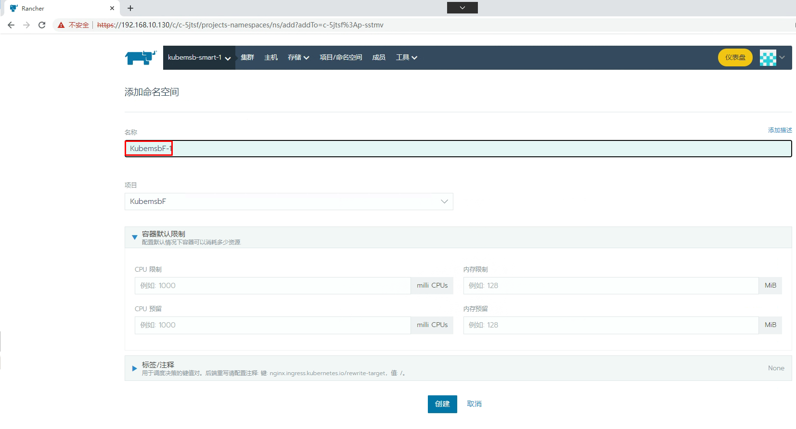

# Rancher容器云管理平台

# 一、主机硬件说明

| 序号 | 硬件                      | 操作及内核 |
| ---- | ------------------------- | ---------- |
| 1    | CPU 4 Memory 4G Disk 100G | CentOS7    |
| 2    | CPU 4 Memory 4G Disk 100G | CentOS7    |
| 3    | CPU 4 Memory 4G Disk 100G | CentOS7    |
| 4    | CPU 4 Memory 4G Disk 100G | CentOS7    |

# 二、主机配置

## 2.1 主机名

~~~powershell
# hostnamectl set-hostname rancherserver
~~~

~~~powershell
# hostnamectl set-hostname k8s-master01
~~~

~~~powershell
# hostnamectl set-hostname k8s-worker01
~~~

~~~powershell
# hostnamectl set-hostname k8s-worker02
~~~

## 2.2 IP地址

~~~powershell
[root@rancherserver ~]# vim /etc/sysconfig/network-scripts/ifcfg-ens33 
# cat /etc/sysconfig/network-scripts/ifcfg-ens33
TYPE="Ethernet"
PROXY_METHOD="none"
BROWSER_ONLY="no"
BOOTPROTO="none"
DEFROUTE="yes"
IPV4_FAILURE_FATAL="no"
IPV6INIT="yes"
IPV6_AUTOCONF="yes"
IPV6_DEFROUTE="yes"
IPV6_FAILURE_FATAL="no"
IPV6_ADDR_GEN_MODE="stable-privacy"
NAME="ens33"
UUID="ec87533a-8151-4aa0-9d0f-1e970affcdc6"
DEVICE="ens33"
ONBOOT="yes"
IPADDR="192.168.10.130"
PREFIX="24"
GATEWAY="192.168.10.2"
DNS1="119.29.29.29"
~~~

~~~powershell
[root@k8s-master01 ~]# vim /etc/sysconfig/network-scripts/ifcfg-ens33 
[root@k8s-master01 ~]# cat /etc/sysconfig/network-scripts/ifcfg-ens33
TYPE="Ethernet"
PROXY_METHOD="none"
BROWSER_ONLY="no"
BOOTPROTO="none"
DEFROUTE="yes"
IPV4_FAILURE_FATAL="no"
IPV6INIT="yes"
IPV6_AUTOCONF="yes"
IPV6_DEFROUTE="yes"
IPV6_FAILURE_FATAL="no"
IPV6_ADDR_GEN_MODE="stable-privacy"
NAME="ens33"
UUID="ec87533a-8151-4aa0-9d0f-1e970affcdc6"
DEVICE="ens33"
ONBOOT="yes"
IPADDR="192.168.10.131"
PREFIX="24"
GATEWAY="192.168.10.2"
DNS1="119.29.29.29"
~~~

~~~powershell
[root@k8s-worker01 ~]# vim /etc/sysconfig/network-scripts/ifcfg-ens33 
[root@k8s-worker01 ~]# cat /etc/sysconfig/network-scripts/ifcfg-ens33
TYPE="Ethernet"
PROXY_METHOD="none"
BROWSER_ONLY="no"
BOOTPROTO="none"
DEFROUTE="yes"
IPV4_FAILURE_FATAL="no"
IPV6INIT="yes"
IPV6_AUTOCONF="yes"
IPV6_DEFROUTE="yes"
IPV6_FAILURE_FATAL="no"
IPV6_ADDR_GEN_MODE="stable-privacy"
NAME="ens33"
UUID="ec87533a-8151-4aa0-9d0f-1e970affcdc6"
DEVICE="ens33"
ONBOOT="yes"
IPADDR="192.168.10.132"
PREFIX="24"
GATEWAY="192.168.10.2"
DNS1="119.29.29.29"
~~~

~~~powershell
[root@k8s-worker02 ~]# vim /etc/sysconfig/network-scripts/ifcfg-ens33 
[root@k8s-worker02 ~]# cat /etc/sysconfig/network-scripts/ifcfg-ens33
TYPE="Ethernet"
PROXY_METHOD="none"
BROWSER_ONLY="no"
BOOTPROTO="none"
DEFROUTE="yes"
IPV4_FAILURE_FATAL="no"
IPV6INIT="yes"
IPV6_AUTOCONF="yes"
IPV6_DEFROUTE="yes"
IPV6_FAILURE_FATAL="no"
IPV6_ADDR_GEN_MODE="stable-privacy"
NAME="ens33"
UUID="ec87533a-8151-4aa0-9d0f-1e970affcdc6"
DEVICE="ens33"
ONBOOT="yes"
IPADDR="192.168.10.133"
PREFIX="24"
GATEWAY="192.168.10.2"
DNS1="119.29.29.29"
~~~

## 2.3 主机名与IP地址解析

~~~powershell
# cat /etc/hosts
127.0.0.1   localhost localhost.localdomain localhost4 localhost4.localdomain4
::1         localhost localhost.localdomain localhost6 localhost6.localdomain6
192.168.10.130 rancherserver
192.168.10.131 k8s-master01
192.168.10.132 k8s-worker01
192.168.10.133 k8s-worker02
~~~

## 2.4 主机安全设置

~~~powershell
# systemctl stop firewalld;systemctl disable firewalld

# firewall-cmd --state
not running
~~~

~~~powershell
# sed -ri 's/SELINUX=enforcing/SELINUX=disabled/' /etc/selinux/config
~~~

## 2.5 主机时钟同步

~~~powershell
# crontab -l
0 */1 * * * ntpdate time1.aliyun.com
~~~

## 2.6 关闭swap

> 关闭k8s集群节点swap

~~~powershell
# cat /etc/fstab

默认开启，修改后关闭
#/dev/mapper/centos-swap swap                    swap    defaults        0 0
~~~

~~~powershell
临时关闭所有
# swapoff -a
~~~

## 2.7 配置内核路由转发

~~~powershell
# vim /etc/sysctl.conf
# cat /etc/sysctl.conf
...
net.ipv4.ip_forward=1
~~~

~~~powershell
# sysctl -p
net.ipv4.ip_forward = 1
~~~

# 三、docker-ce安装

> 所有主机安装docker-ce

~~~powershell
# wget -O /etc/yum.repos.d/docker-ce.repo https://mirrors.aliyun.com/docker-ce/linux/centos/docker-ce.repo
~~~

~~~powershell
# yum -y install docker-ce
~~~

~~~powershell
# systemctl enable --now docker
~~~

# 四、rancher安装

~~~powershell
[root@rancherserver ~]# docker pull rancher/rancher:v2.5.15
~~~

~~~powershell
[root@rancherserver ~]# mkdir -p /opt/data/rancher_data
~~~

~~~powershell
[root@rancherserver ~]# docker run -d --privileged -p 80:80 -p 443:443 -v /opt/data/rancher_data:/var/lib/rancher --restart=always --name rancher-2.5.15 rancher/rancher:v2.5.15
~~~

~~~powershell
[root@rancherserver ~]# docker ps
CONTAINER ID   IMAGE                     COMMAND           CREATED          STATUS          PORTS                                                                      NAMES
99e367eb35a3   rancher/rancher:v2.5.15   "entrypoint.sh"   26 seconds ago   Up 26 seconds   0.0.0.0:80->80/tcp, :::80->80/tcp, 0.0.0.0:443->443/tcp, :::443->443/tcp   rancher-2.5.15
~~~

# 五、通过Rancher部署kubernetes集群

## 5.1 Rancher访问

> 本次密码为Kubemsb123

## 5.2 通过Rancher创建Kubernetes集群

添加master节点主机

~~~powershell
[root@k8s-master01 ~]# docker run -d --privileged --restart=unless-stopped --net=host -v /etc/kubernetes:/etc/kubernetes -v /var/run:/var/run  rancher/rancher-agent:v2.5.15 --server https://192.168.10.130 --token 7985nkpc48854kwmgh6pnfb7hcrkwhlcmx6wxq8tb4vszxn2qv9xdd --ca-checksum f6d5f24fcd41aa057a205d4f6922dfd309001126d040431222bfba7aa93517b7 --etcd --controlplane --worker
~~~

~~~powershell
[root@k8s-master01 ~]# docker ps
CONTAINER ID   IMAGE                           COMMAND                  CREATED          STATUS          PORTS     NAMES
8e7e73b477dc   rancher/rancher-agent:v2.5.15   "run.sh --server htt…"   20 seconds ago   Up 18 seconds             brave_ishizaka
~~~

添加 worker节点

~~~powershell
[root@k8s-worker01 ~]# docker run -d --privileged --restart=unless-stopped --net=host -v /etc/kubernetes:/etc/kubernetes -v /var/run:/var/run  rancher/rancher-agent:v2.5.15 --server https://192.168.10.130 --token 7985nkpc48854kwmgh6pnfb7hcrkwhlcmx6wxq8tb4vszxn2qv9xdd --ca-checksum f6d5f24fcd41aa057a205d4f6922dfd309001126d040431222bfba7aa93517b7 --worker
~~~

~~~powershell
[root@k8s-worker02 ~]# docker run -d --privileged --restart=unless-stopped --net=host -v /etc/kubernetes:/etc/kubernetes -v /var/run:/var/run  rancher/rancher-agent:v2.5.15 --server https://192.168.10.130 --token 7985nkpc48854kwmgh6pnfb7hcrkwhlcmx6wxq8tb4vszxn2qv9xdd --ca-checksum f6d5f24fcd41aa057a205d4f6922dfd309001126d040431222bfba7aa93517b7 --worker
~~~

所有节点激活后状态

# 六、配置通过命令行访问Kubernetes集群

在集群节点命令行，如果访问呢？

~~~powershell
[root@k8s-master01 ~]# cat <<EOF > /etc/yum.repos.d/kubernetes.repo
[kubernetes]
name=Kubernetes
baseurl=https://mirrors.aliyun.com/kubernetes/yum/repos/kubernetes-el7-x86_64/
enabled=1
gpgcheck=1
repo_gpgcheck=1
gpgkey=https://mirrors.aliyun.com/kubernetes/yum/doc/yum-key.gpg https://mirrors.aliyun.com/kubernetes/yum/doc/rpm-package-key.gpg
EOF
~~~

修改gpgcheck=0及修改repo_gpgcheck=0

~~~powershell
[root@k8s-master01 ~]# vim /etc/yum.repos.d/kubernetes.repo
[root@k8s-master01 ~]# cat  /etc/yum.repos.d/kubernetes.repo
[kubernetes]
name=Kubernetes
baseurl=https://mirrors.aliyun.com/kubernetes/yum/repos/kubernetes-el7-x86_64/
enabled=1
gpgcheck=0
repo_gpgcheck=0
gpgkey=https://mirrors.aliyun.com/kubernetes/yum/doc/yum-key.gpg https://mirrors.aliyun.com/kubernetes/yum/doc/rpm-package-key.gpg
~~~

~~~powershell
[root@k8s-master01 ~]# yum -y install kubectl
~~~

~~~powershell
[root@k8s-master01 ~]# mkdir ~/.kube
~~~

~~~powershell
[root@k8s-master01 ~]# vim ~/.kube/config
[root@k8s-master01 ~]# cat ~/.kube/config
apiVersion: v1
kind: Config
clusters:
- name: "kubemsb-smart-1"
  cluster:
    server: "https://192.168.10.130/k8s/clusters/c-5jtsf"
    certificate-authority-data: "LS0tLS1CRUdJTiBDRVJUSUZJQ0FURS0tLS0tCk1JSUJwekNDQ\
      VUyZ0F3SUJBZ0lCQURBS0JnZ3Foa2pPUFFRREFqQTdNUnd3R2dZRFZRUUtFeE5rZVc1aGJXbGoKY\
      kdsemRHVnVaWEl0YjNKbk1Sc3dHUVlEVlFRREV4SmtlVzVoYldsamJHbHpkR1Z1WlhJdFkyRXdIa\
      GNOTWpJdwpPREUyTURZMU9UVTBXaGNOTXpJd09ERXpNRFkxT1RVMFdqQTdNUnd3R2dZRFZRUUtFe\
      E5rZVc1aGJXbGpiR2x6CmRHVnVaWEl0YjNKbk1Sc3dHUVlEVlFRREV4SmtlVzVoYldsamJHbHpkR\
      1Z1WlhJdFkyRXdXVEFUQmdjcWhrak8KUFFJQkJnZ3Foa2pPUFFNQkJ3TkNBQVJMbDZKOWcxMlJQT\
      G93dnVHZkM0YnR3ZmhHUDBpR295N1U2cjBJK0JZeAozZCtuVDBEc3ZWOVJWV1BDOGZCdGhPZmJQN\
      GNYckx5YzJsR081RHkrSXRlM28wSXdRREFPQmdOVkhROEJBZjhFCkJBTUNBcVF3RHdZRFZSMFRBU\
      UgvQkFVd0F3RUIvekFkQmdOVkhRNEVGZ1FVNnZYWXBRYm9IdXF0UlBuS1FrS3gKMjBSZzJqMHdDZ\
      1lJS29aSXpqMEVBd0lEU0FBd1JRSWdMTUJ6YXNDREU4T2tCUk40TWRuZWNRU0xjMFVXQmNseApGO\
      UFCem1MQWQwb0NJUUNlRWFnRkdBa1ZsUnV1czllSE1VRUx6ODl6VlY5L096b3hvY1ROYnA5amlBP\
      T0KLS0tLS1FTkQgQ0VSVElGSUNBVEUtLS0tLQ=="
- name: "kubemsb-smart-1-k8s-master01"
  cluster:
    server: "https://192.168.10.131:6443"
    certificate-authority-data: "LS0tLS1CRUdJTiBDRVJUSUZJQ0FURS0tLS0tCk1JSUM0VENDQ\
      WNtZ0F3SUJBZ0lCQURBTkJna3Foa2lHOXcwQkFRc0ZBREFTTVJBd0RnWURWUVFERXdkcmRXSmwKT\
      FdOaE1CNFhEVEl5TURneE5qQTNNVFV3TmxvWERUTXlNRGd4TXpBM01UVXdObG93RWpFUU1BNEdBM\
      VVFQXhNSAphM1ZpWlMxallUQ0NBU0l3RFFZSktvWklodmNOQVFFQkJRQURnZ0VQQURDQ0FRb0NnZ\
      0VCQUt4Qkh3S0RFZE5WCm1tU2JFZDZXaTZzRFNXcklPZEZ5dFN5Z1puVmk2cXFkYmxXODZRQ1Y1U\
      WdEckI5QU43aDJ1RHRZMlFiNGZOTmEKQWZkSVVhS2tjZ0taNnplS1Z3eEdRYkptcEovSk5yYWw2N\
      ENldng5QTU1UUFBL29FSzBVbkdackliSjQ5dEl4awp1TnMwNFVIRWxVVUZpWjlmckdBQU9sK3lVa\
      GxXQUlLQzhmMUZSeVhpaVZEN2FTcTVodHNWeC9qczBBUUo3R2dFCjMxQUdRcmF4S2s0STVCN1hBY\
      1pybHdrS1ljaGFPZnBlNkV6Ly9HZXVFekR5VnN3a09uK2h0ZGNIMlJVSHozUlcKWWVTMGw2ZzZpO\
      HcyUXRUakNwTUtId1FRTmQwSjdFM0k1aS9CRVA0azhXSHZIYjBkQk8ydVkyTml1cmNMWWw4dgpHO\
      DUyZ2ZibWt2OENBd0VBQWFOQ01FQXdEZ1lEVlIwUEFRSC9CQVFEQWdLa01BOEdBMVVkRXdFQi93U\
      UZNQU1CCkFmOHdIUVlEVlIwT0JCWUVGQkg4VzVBbmxKYVNrVXowSzNobms1Vm55MVNnTUEwR0NTc\
      UdTSWIzRFFFQkN3VUEKQTRJQkFRQmE0WmtsWmRINUFCOTNWaXhYOUhnMEYwYXdVZWduNkVSRGtRQ\
      VBlcHZNaG5ON1lyVGlFN3lUSGxvWApLNS9ROTJ5Y2FnRGVlNjlEbHpvWEppTlNzdEZWYmtaSVN0O\
      HVRZFhCYjFoSUtzbXBVYWlSeXFoRmVjbnRaSi85CmhCWmZMRjZnNitBNUlvVGxYOThqMERVU21IV\
      is2Q29raXhPV3ZESmJ6dkI2S3VXdnhQbTF5WFgveVpBTDd1U1gKcUNnTC84UjJjSm53dUZhTnFvS\
      3I3STE5bDBRNi9VWWQ0bWhralpmUTdqdGlraEpmQXpWRUFtWlVza0hZSkRtdwp6bzJKMUJLL0Jxb\
      m8rSFplbThFTExpK1ZhRXVlR280blF4ZmpaSlF2MWFXZHhCMnRrUWovdWNUa1QxRU1kUFBsCm0rd\
      kh2MWtYNW5BaHl5eWR0dG12UGRlOWFHOUwKLS0tLS1FTkQgQ0VSVElGSUNBVEUtLS0tLQo="

users:
- name: "kubemsb-smart-1"
  user:
    token: "kubeconfig-user-9cn9x.c-5jtsf:x57644qvmbfqpmh78fb4cbdnm8zbbxk9hmjb2bjggl5j2hvwnvj4c9"

contexts:
- name: "kubemsb-smart-1"
  context:
    user: "kubemsb-smart-1"
    cluster: "kubemsb-smart-1"
- name: "kubemsb-smart-1-k8s-master01"
  context:
    user: "kubemsb-smart-1"
    cluster: "kubemsb-smart-1-k8s-master01"

current-context: "kubemsb-smart-1"
~~~

~~~powershell
[root@k8s-master01 ~]# kubectl get nodes
NAME           STATUS   ROLES                      AGE   VERSION
k8s-master01   Ready    controlplane,etcd,worker   35m   v1.20.15
k8s-worker01   Ready    worker                     31m   v1.20.15
k8s-worker02   Ready    worker                     27m   v1.20.15
~~~

# 七、通过Rancher部署Nginx应用

~~~powershell
[root@k8s-master01 ~]# kubectl get svc -n kubemsbf-1
NAME               TYPE        CLUSTER-IP      EXTERNAL-IP   PORT(S)        AGE
myapp-1            ClusterIP   10.43.15.240    <none>        80/TCP         4m35s
myapp-1-nodeport   NodePort    10.43.214.118   <none>        80:32406/TCP   4m35s
~~~

# 八、通过Rancher部署mysql数据库

## 8.1 持久化存储类准备

### 8.1.1 NFS服务

~~~powershell
[root@nfsserver ~]# lsblk
NAME            MAJ:MIN RM  SIZE RO TYPE MOUNTPOINT
sda               8:0    0  100G  0 disk
├─sda1            8:1    0    1G  0 part /boot
└─sda2            8:2    0   99G  0 part
  ├─centos-root 253:0    0   50G  0 lvm  /
  ├─centos-swap 253:1    0    2G  0 lvm
  └─centos-home 253:2    0   47G  0 lvm  /home
sdb               8:16   0  100G  0 disk /sdb
~~~

~~~powershell
[root@nfsserver ~]# mkdir /sdb
~~~

~~~powershell
[root@nfsserver ~]# mkfs.xfs /dev/sdb
~~~

~~~powershell
[root@nfsserver ~]#vim /etc/fstab
[root@nfsserver ~]# cat /etc/fstab
......
/dev/sdb                /sdb                    xfs     defaults        0 0
~~~

~~~powershell
[root@nfsserver ~]# mount -a
~~~

~~~powershell
[root@nfsserver ~]# vim /etc/exports
[root@nfsserver ~]# cat /etc/exports
/sdb    *(rw,sync,no_root_squash)
~~~

~~~powershell
[root@nfsserver ~]# systemctl enable --now nfs-server
~~~

~~~powershell
[root@nfsserver ~]# showmount -e
Export list for nfs-server:
/sdb *
~~~

### 8.1.2 存储卷

~~~powershell
[root@k8s-master01  ~]# for file in class.yaml deployment.yaml rbac.yaml  ; do wget https://raw.githubusercontent.com/kubernetes-incubator/external-storage/master/nfs-client/deploy/$file ; done
~~~

> 需要修改class.yaml中资源对象名称为nfs-client
>
> 需要修改deployment.yaml中nfs server及其共享的目录、容器对应的镜像。

~~~powershell
 [root@k8s-master01  ~]# kubectl apply -f class.yaml
~~~

~~~powershell
[root@k8s-master01  ~]# kubectl apply -f rbac.yaml
~~~

~~~powershell
[root@k8s-master01 nfsdir]# vim deployment.yaml
[root@k8s-master01 nfsdir]# cat deployment.yaml
apiVersion: apps/v1
kind: Deployment
metadata:
  name: nfs-client-provisioner
  labels:
    app: nfs-client-provisioner
  # replace with namespace where provisioner is deployed
  namespace: default
spec:
  replicas: 1
  strategy:
    type: Recreate
  selector:
    matchLabels:
      app: nfs-client-provisioner
  template:
    metadata:
      labels:
        app: nfs-client-provisioner
    spec:
      serviceAccountName: nfs-client-provisioner
      containers:
        - name: nfs-client-provisioner
          image: registry.cn-beijing.aliyuncs.com/pylixm/nfs-subdir-external-provisioner:v4.0.0
          volumeMounts:
            - name: nfs-client-root
              mountPath: /persistentvolumes
          env:
            - name: PROVISIONER_NAME
              value: fuseim.pri/ifs
            - name: NFS_SERVER
              value: 192.168.10.133
            - name: NFS_PATH
              value: /sdb
      volumes:
        - name: nfs-client-root
          nfs:
            server: 192.168.10.133
            path: /sdb
~~~

~~~powershell
[root@k8s-master01  ~]# kubectl apply -f deployment.yaml
~~~

~~~powershell
[root@k8s-master01  ~]# kubectl get sc
NAME         PROVISIONER      RECLAIMPOLICY   VOLUMEBINDINGMODE   ALLOWVOLUMEEXPANSION   AGE
nfs-client   fuseim.pri/ifs   Delete          Immediate           false                  109m
~~~

## 8.2 MySQL数据库部署

### 8.2.1 PVC准备

~~~powershell
[root@k8s-master01 ~]# kubectl get pvc -n kubemsbdata
NAME       STATUS   VOLUME                                     CAPACITY   ACCESS MODES   STORAGECLASS   AGE
myvolume   Bound    pvc-52460d7f-db89-40ab-b09e-ab9d0cfcaa17   5Gi        RWO            nfs-client     80s
~~~

~~~powershell
[root@k8s-master01 ~]# kubectl get pv
NAME                                       CAPACITY   ACCESS MODES   RECLAIM POLICY   STATUS   CLAIM                  STORAGECLASS   REASON   AGE
pvc-52460d7f-db89-40ab-b09e-ab9d0cfcaa17   5Gi        RWO            Delete           Bound    kubemsbdata/myvolume   nfs-client              84s
~~~

~~~powershell
[root@nfsserver ~]# ls /sdb
kubemsbdata-myvolume-pvc-52460d7f-db89-40ab-b09e-ab9d0cfcaa17
~~~

### 8.2.2 MySQL部署

### 8.2.2 MySQL访问

#### 8.2.2.1 方案一 通过Rancher web界面访问

#### 8.2.2.2 方案二 通过主机访问

~~~powershell
[root@k8s-master01 ~]# ss -anput | grep ":32666"
tcp    LISTEN     0      128       *:32666                 *:*                   users:(("kube-proxy",pid=7654,fd=3))
~~~

~~~powershell
[root@k8s-master01 nfsdir]# mysql -h 192.168.10.131 -uroot -p123456 -P 32666
......
MySQL [(none)]> show databases;
+--------------------+
| Database           |
+--------------------+
| information_schema |
| kubemsb            |
| mysql              |
| performance_schema |
| sys                |
+--------------------+
5 rows in set (0.01 sec)
~~~

# 九、部署wordpress

~~~powershell
[root@k8s-master01 ~]# dig -t a mysqldata1-0.mysqldata1.kubemsbdata.svc.cluster.local @10.43.0.10

; <<>> DiG 9.11.4-P2-RedHat-9.11.4-26.P2.el7_9.8 <<>> -t a mysqldata1-0.mysqldata1.kubemsbdata.svc.cluster.local @10.43.0.10
;; global options: +cmd
;; Got answer:
;; WARNING: .local is reserved for Multicast DNS
;; You are currently testing what happens when an mDNS query is leaked to DNS
;; ->>HEADER<<- opcode: QUERY, status: NOERROR, id: 63314
;; flags: qr aa rd; QUERY: 1, ANSWER: 1, AUTHORITY: 0, ADDITIONAL: 1
;; WARNING: recursion requested but not available

;; OPT PSEUDOSECTION:
; EDNS: version: 0, flags:; udp: 4096
;; QUESTION SECTION:
;mysqldata1-0.mysqldata1.kubemsbdata.svc.cluster.local. IN A

;; ANSWER SECTION:
mysqldata1-0.mysqldata1.kubemsbdata.svc.cluster.local. 5 IN A 10.42.1.4

;; Query time: 0 msec
;; SERVER: 10.43.0.10#53(10.43.0.10)
;; WHEN: 二 8月 16 21:20:18 CST 2022
;; MSG SIZE  rcvd: 151
~~~

