# 使用RKE构建企业生产级Kubernetes集群

# 一、RKE工具介绍

- RKE是一款经过CNCF认证的开源Kubernetes发行版，可以在Docker容器内运行。

- 它通过删除大部分主机依赖项，并为部署、升级和回滚提供一个稳定的路径，从而解决了Kubernetes最常见的安装复杂性问题。

- 借助RKE，Kubernetes可以完全独立于正在运行的操作系统和平台，轻松实现Kubernetes的自动化运维。
- 只要运行受支持的Docker版本，就可以通过RKE部署和运行Kubernetes。仅需几分钟，RKE便可通过单条命令构建一个集群，其声明式配置使Kubernetes升级操作具备原子性且安全。

# 二、集群主机准备

## 2.1 集群主机配置要求

### 2.1.1 部署集群环境说明

部署Kubernetes集群机器需要满足以下几个条件：

1）一台或多台机器，操作系统 CentOS7

2）硬件配置：2GB或更多RAM，2个CPU或更多CPU，硬盘100GB或更多

3） 集群中所有机器之间网络互通

4）可以访问外网，需要拉取镜像，如果服务器不能上网，需要提前下载镜像并导入节点

5）禁止swap分区

### 2.1.2 软件环境

| 软件       | 版本     |
| ---------- | -------- |
| 操作系统   | CentOS7  |
| docker-ce  | 20.10.12 |
| kubernetes | 1.22.5   |

### 2.1.3 集群主机名称、IP地址及角色规划

| 主机名称 | IP地址        | 角色                       |
| -------- | ------------- | -------------------------- |
| master01 | 192.168.10.10 | controlplane、rancher、rke |
| master02 | 192.168.10.11 | controlpane                |
| worker01 | 192.168.10.12 | worker                     |
| worker02 | 192.168.10.13 | worker                     |
| etcd01   | 192.168.10.14 | etcd                       |

## 2.2 集群主机名称配置

> 所有集群主机均要配置对应的主机名称即可。

~~~powershell
# hostnamectl set-hostname xxx
~~~

~~~powershell
把xxx替换为对应的主机名
192.168.10.10 master01
192.168.10.11 master02
192.168.10.12 worker01
192.168.10.13 worker02
192.168.10.14 etcd01
~~~

## 2.3 集群主机IP地址配置

> 所有集群主机均要配置对应的主机IP地址即可。

~~~powershell
# vim /etc/sysconfig/network-scripts/ifcfg-ens33
# cat  /etc/sysconfig/network-scripts/ifcfg-ens33
TYPE="Ethernet"
PROXY_METHOD="none"
BROWSER_ONLY="no"
BOOTPROTO="none" 修改为静态
DEFROUTE="yes"
IPV4_FAILURE_FATAL="no"
IPV6INIT="yes"
IPV6_AUTOCONF="yes"
IPV6_DEFROUTE="yes"
IPV6_FAILURE_FATAL="no"
IPV6_ADDR_GEN_MODE="stable-privacy"
NAME="eth0"
DEVICE="eth0"
ONBOOT="yes"
添加如下内容：
IPADDR="192.168.10.XXX"
PREFIX="24"
GATEWAY="192.168.10.2"
DNS1="119.29.29.29"
~~~

## 2.4 主机名与IP地址解析

> 所有主机均要配置。

~~~powershell
# vim /etc/hosts
# cat /etc/hosts
127.0.0.1   localhost localhost.localdomain localhost4 localhost4.localdomain4
::1         localhost localhost.localdomain localhost6 localhost6.localdomain6
192.168.10.10 master01
192.168.10.11 master02
192.168.10.12 worker01
192.168.10.13 worker02
192.168.10.14 etcd01
~~~

## 2.5 配置ip_forward及过滤机制

> 所有主机均要配置

>将桥接的IPv4流量传递到iptables的链

~~~powershell
# vim /etc/sysctl.conf
# cat /etc/sysctl.conf
net.ipv4.ip_forward = 1
net.bridge.bridge-nf-call-ip6tables = 1
net.bridge.bridge-nf-call-iptables = 1
~~~

~~~powershell
# modprobe br_netfilter
~~~

~~~powershell
# sysctl -p /etc/sysctl.conf
~~~

## 2.6 主机安全设置

> 所有主机均要设置

### 2.6.1 防火墙

~~~powershell
# systemctl stop firewalld
# systemctl disable firewalld
~~~

~~~powershell
# firewall-cmd --state
~~~

### 2.6.2 selinux

> 修改完成后一定要重启操作系统

~~~powershell
永久关闭，一定要重启操作系统后生效。
sed -ri 's/SELINUX=enforcing/SELINUX=disabled/' /etc/selinux/config
~~~

~~~powershell
临时关闭，不重启操作系统，即刻生效。
# setenforce 0 
~~~

## 2.7 主机swap分区设置

> 所有主机均要配置

~~~powershell
永久关闭，需要重启操作系统生效。
# sed -ri 's/.*swap.*/#&/' /etc/fstab
~~~

~~~powershell
# cat /etc/fstab

......
#/dev/mapper/centos_192-swap swap                    swap    defaults        0 0
~~~

~~~powershell
临时关闭，不需要重启操作系统，即刻生效。
# swapoff -a
~~~

## 2.8 时间同步

> 所有主机均要配置

~~~powershell
# yum -y insall ntpdate
~~~

~~~powershell
# crontab -e
0 */1 * * *  ntpdate time1.aliyun.com
~~~

# 三、Docker部署

> 所有主机均要配置

## 3.1 配置Docker YUM源

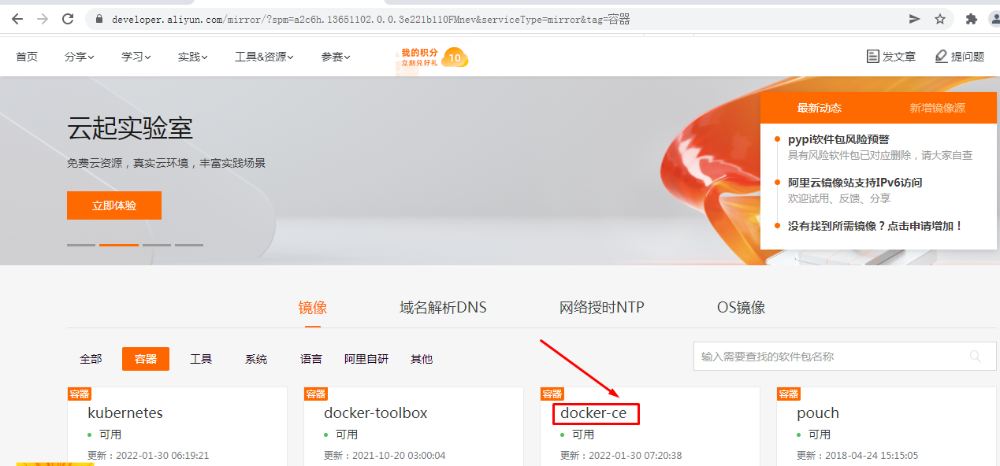

~~~powershell
# wget -O /etc/yum.repos.d/docker-ce.repo https://mirrors.aliyun.com/docker-ce/linux/centos/docker-ce.repo
~~~

## 3.2 安装Docker CE

~~~powershell
# yum -y install docker-ce
~~~

## 3.3 启动Docker服务

~~~powershell
# systemctl enable docker
# systemctl start docker
~~~

## 3.4 配置Docker容器镜像加速器

~~~powershell
# vim /etc/docker/daemon.json
# cat /etc/docker/daemon.json
{
  "registry-mirrors": ["https://s27w6kze.mirror.aliyuncs.com"]
}
~~~

# 四、docker compose安装

~~~powershell
# curl -L "https://github.com/docker/compose/releases/download/1.28.5/docker-compose-$(uname -s)-$(uname -m)" -o /usr/local/bin/docker-compose
~~~

~~~powershell
# chmod +x /usr/local/bin/docker-compose
~~~

~~~powershell
# ln -s /usr/local/bin/docker-compose /usr/bin/docker-compose
~~~

~~~powershell
# docker-compose --version
~~~

# 五、添加rancher用户

>使用CentOS时，不能使用 root 账号，因此要添加专用的账号进行 docker相关 操作。

>所有集群主机均需要操作

~~~powershell
# useradd rancher
~~~

~~~powershell
# usermod -aG docker rancher
~~~

~~~powershell
# echo 123 | passwd --stdin rancher
~~~

# 六、生成ssh证书用于部署集群

> rke二进制文件安装主机上创建密钥，即为control主机，用于部署集群。

## 6.1 生成ssh证书

~~~powershell
# ssh-keygen
~~~

## 6.2 复制证书到集群中所有主机

~~~powershell
# ssh-copy-id rancher@master01
~~~

~~~powershell
# ssh-copy-id rancher@master02
~~~

~~~powershell
# ssh-copy-id rancher@worker01
~~~

~~~powershell
# ssh-copy-id rancher@worker02
~~~

~~~powershell
# ssh-copy-id rancher@etcd01
~~~

## 6.3 验证ssh证书是否可用

> 本次在master01上部署rke二进制文件。

> 在rke二进制文件安装主机机测试连接其它集群主机，验证是否可使用docker ps命令即可。

~~~powershell
# ssh rancher@主机名
~~~

~~~powershell
远程主机# docker ps
~~~

# 七、rke工具下载

> 本次在master01上部署rke二进制文件。

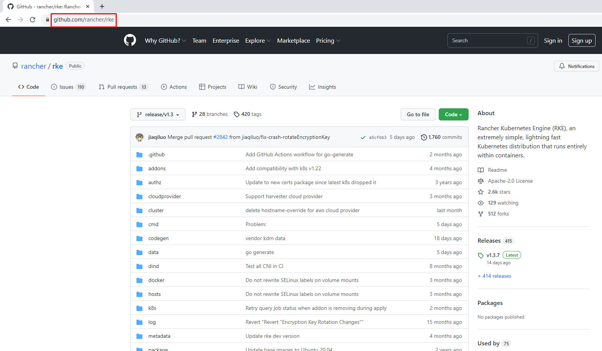

~~~powershell
# wget https://github.com/rancher/rke/releases/download/v1.3.7/rke_linux-amd64
~~~

~~~powershell
# mv rke_linux-amd64 /usr/local/bin/rke
~~~

~~~powershell
# chmod +x /usr/local/bin/rke
~~~

~~~powershell
# rke --version
rke version v1.3.7
~~~

# 八、初始化rke配置文件

~~~powershell
# mkdir -p /app/rancher
~~~

~~~powershell
# cd /app/rancher
~~~

~~~powershell
# rke config --name cluster.yml
[+] Cluster Level SSH Private Key Path [~/.ssh/id_rsa]: 集群私钥路径
[+] Number of Hosts [1]: 3 集群中有3个节点
[+] SSH Address of host (1) [none]: 192.168.10.10 第一个节点IP地址
[+] SSH Port of host (1) [22]: 22 第一个节点SSH访问端口
[+] SSH Private Key Path of host (192.168.10.10) [none]: ~/.ssh/id_rsa 第一个节点私钥路径
[+] SSH User of host (192.168.10.10) [ubuntu]: rancher 远程用户名
[+] Is host (192.168.10.10) a Control Plane host (y/n)? [y]: y 是否为k8s集群控制节点
[+] Is host (192.168.10.10) a Worker host (y/n)? [n]: n 不是worker节点
[+] Is host (192.168.10.10) an etcd host (y/n)? [n]: n 不是etcd节点
[+] Override Hostname of host (192.168.10.10) [none]: 不覆盖现有主机名
[+] Internal IP of host (192.168.10.10) [none]: 主机局域网IP地址
[+] Docker socket path on host (192.168.10.10) [/var/run/docker.sock]: 主机上docker.sock路径
[+] SSH Address of host (2) [none]: 192.168.10.12 第二个节点
[+] SSH Port of host (2) [22]: 22 远程端口
[+] SSH Private Key Path of host (192.168.10.12) [none]: ~/.ssh/id_rsa 私钥路径
[+] SSH User of host (192.168.10.12) [ubuntu]: rancher 远程访问用户
[+] Is host (192.168.10.12) a Control Plane host (y/n)? [y]: n 不是控制节点
[+] Is host (192.168.10.12) a Worker host (y/n)? [n]: y 是worker节点
[+] Is host (192.168.10.12) an etcd host (y/n)? [n]: n 不是etcd节点
[+] Override Hostname of host (192.168.10.12) [none]: 不覆盖现有主机名
[+] Internal IP of host (192.168.10.12) [none]: 主机局域网IP地址
[+] Docker socket path on host (192.168.10.12) [/var/run/docker.sock]: 主机上docker.sock路径
[+] SSH Address of host (3) [none]: 192.168.10.14 第三个节点
[+] SSH Port of host (3) [22]: 22 远程端口
[+] SSH Private Key Path of host (192.168.10.14) [none]: ~/.ssh/id_rsa 私钥路径
[+] SSH User of host (192.168.10.14) [ubuntu]: rancher 远程访问用户
[+] Is host (192.168.10.14) a Control Plane host (y/n)? [y]: n 不是控制节点
[+] Is host (192.168.10.14) a Worker host (y/n)? [n]: n 不是worker节点
[+] Is host (192.168.10.14) an etcd host (y/n)? [n]: y 是etcd节点
[+] Override Hostname of host (192.168.10.14) [none]: 不覆盖现有主机名
[+] Internal IP of host (192.168.10.14) [none]: 主机局域网IP地址
[+] Docker socket path on host (192.168.10.14) [/var/run/docker.sock]: 主机上docker.sock路径
[+] Network Plugin Type (flannel, calico, weave, canal, aci) [canal]: 使用的网络插件
[+] Authentication Strategy [x509]: 认证策略
[+] Authorization Mode (rbac, none) [rbac]: 认证模式
[+] Kubernetes Docker image [rancher/hyperkube:v1.21.9-rancher1]: 集群容器镜像
[+] Cluster domain [cluster.local]: 集群域名
[+] Service Cluster IP Range [10.43.0.0/16]: 集群中Servic IP地址范围
[+] Enable PodSecurityPolicy [n]: 是否开启Pod安装策略
[+] Cluster Network CIDR [10.42.0.0/16]: 集群Pod网络
[+] Cluster DNS Service IP [10.43.0.10]: 集群DNS Service IP地址
[+] Add addon manifest URLs or YAML files [no]: 是否增加插件manifest URL或配置文件
~~~

~~~powershell
[root@master01 rancher]# ls
cluster.yml
~~~

> 在cluster.yaml文件中
>
> ~~~powershell
> kube-controller:
>  image: ""
>  extra_args:
>    # 如果后面需要部署kubeflow或istio则一定要配置以下参数
>    cluster-signing-cert-file: "/etc/kubernetes/ssl/kube-ca.pem"
>    cluster-signing-key-file: "/etc/kubernetes/ssl/kube-ca-key.pem"
> ~~~
>
> 

# 九、集群部署

~~~powershell
# pwd
/app/rancher
~~~

~~~powershell
# rke up
~~~

~~~powershell
输出：
INFO[0000] Running RKE version: v1.3.7
INFO[0000] Initiating Kubernetes cluster
INFO[0000] [dialer] Setup tunnel for host [192.168.10.14]
INFO[0000] [dialer] Setup tunnel for host [192.168.10.10]
INFO[0000] [dialer] Setup tunnel for host [192.168.10.12]
INFO[0000] Checking if container [cluster-state-deployer] is running on host [192.168.10.14], try #1
INFO[0000] Checking if container [cluster-state-deployer] is running on host [192.168.10.10], try #1
INFO[0000] Checking if container [cluster-state-deployer] is running on host [192.168.10.12], try #1
INFO[0000] [certificates] Generating CA kubernetes certificates
INFO[0000] [certificates] Generating Kubernetes API server aggregation layer requestheader client CA certificates
INFO[0000] [certificates] GenerateServingCertificate is disabled, checking if there are unused kubelet certificates
INFO[0000] [certificates] Generating Kubernetes API server certificates
INFO[0000] [certificates] Generating Service account token key
INFO[0000] [certificates] Generating Kube Controller certificates
INFO[0000] [certificates] Generating Kube Scheduler certificates
INFO[0000] [certificates] Generating Kube Proxy certificates
INFO[0001] [certificates] Generating Node certificate
INFO[0001] [certificates] Generating admin certificates and kubeconfig
INFO[0001] [certificates] Generating Kubernetes API server proxy client certificates
INFO[0001] [certificates] Generating kube-etcd-192-168-10-14 certificate and key
INFO[0001] Successfully Deployed state file at [./cluster.rkestate]
INFO[0001] Building Kubernetes cluster
INFO[0001] [dialer] Setup tunnel for host [192.168.10.12]
INFO[0001] [dialer] Setup tunnel for host [192.168.10.14]
INFO[0001] [dialer] Setup tunnel for host [192.168.10.10]
INFO[0001] [network] Deploying port listener containers
INFO[0001] Image [rancher/rke-tools:v0.1.78] exists on host [192.168.10.14]
INFO[0001] Starting container [rke-etcd-port-listener] on host [192.168.10.14], try #1
INFO[0001] [network] Successfully started [rke-etcd-port-listener] container on host [192.168.10.14]
INFO[0001] Image [rancher/rke-tools:v0.1.78] exists on host [192.168.10.10]
INFO[0001] Starting container [rke-cp-port-listener] on host [192.168.10.10], try #1
INFO[0002] [network] Successfully started [rke-cp-port-listener] container on host [192.168.10.10]
INFO[0002] Image [rancher/rke-tools:v0.1.78] exists on host [192.168.10.12]
INFO[0002] Starting container [rke-worker-port-listener] on host [192.168.10.12], try #1
INFO[0002] [network] Successfully started [rke-worker-port-listener] container on host [192.168.10.12]
INFO[0002] [network] Port listener containers deployed successfully
INFO[0002] [network] Running control plane -> etcd port checks
INFO[0002] [network] Checking if host [192.168.10.10] can connect to host(s) [192.168.10.14] on port(s) [2379], try #1
INFO[0002] Image [rancher/rke-tools:v0.1.78] exists on host [192.168.10.10]
INFO[0002] Starting container [rke-port-checker] on host [192.168.10.10], try #1
INFO[0002] [network] Successfully started [rke-port-checker] container on host [192.168.10.10]
INFO[0002] Removing container [rke-port-checker] on host [192.168.10.10], try #1
INFO[0002] [network] Running control plane -> worker port checks
INFO[0002] [network] Checking if host [192.168.10.10] can connect to host(s) [192.168.10.12] on port(s) [10250], try #1
INFO[0002] Image [rancher/rke-tools:v0.1.78] exists on host [192.168.10.10]
INFO[0003] Starting container [rke-port-checker] on host [192.168.10.10], try #1
INFO[0003] [network] Successfully started [rke-port-checker] container on host [192.168.10.10]
INFO[0003] Removing container [rke-port-checker] on host [192.168.10.10], try #1
INFO[0003] [network] Running workers -> control plane port checks
INFO[0003] [network] Checking if host [192.168.10.12] can connect to host(s) [192.168.10.10] on port(s) [6443], try #1
INFO[0003] Image [rancher/rke-tools:v0.1.78] exists on host [192.168.10.12]
INFO[0003] Starting container [rke-port-checker] on host [192.168.10.12], try #1
INFO[0003] [network] Successfully started [rke-port-checker] container on host [192.168.10.12]
INFO[0003] Removing container [rke-port-checker] on host [192.168.10.12], try #1
INFO[0003] [network] Checking KubeAPI port Control Plane hosts
INFO[0003] [network] Removing port listener containers
INFO[0003] Removing container [rke-etcd-port-listener] on host [192.168.10.14], try #1
INFO[0003] [remove/rke-etcd-port-listener] Successfully removed container on host [192.168.10.14]
INFO[0003] Removing container [rke-cp-port-listener] on host [192.168.10.10], try #1
INFO[0003] [remove/rke-cp-port-listener] Successfully removed container on host [192.168.10.10]
INFO[0003] Removing container [rke-worker-port-listener] on host [192.168.10.12], try #1
INFO[0003] [remove/rke-worker-port-listener] Successfully removed container on host [192.168.10.12]
INFO[0003] [network] Port listener containers removed successfully
INFO[0003] [certificates] Deploying kubernetes certificates to Cluster nodes
INFO[0003] Checking if container [cert-deployer] is running on host [192.168.10.14], try #1
INFO[0003] Checking if container [cert-deployer] is running on host [192.168.10.10], try #1
INFO[0003] Checking if container [cert-deployer] is running on host [192.168.10.12], try #1
INFO[0003] Image [rancher/rke-tools:v0.1.78] exists on host [192.168.10.14]
INFO[0003] Image [rancher/rke-tools:v0.1.78] exists on host [192.168.10.12]
INFO[0003] Image [rancher/rke-tools:v0.1.78] exists on host [192.168.10.10]
INFO[0004] Starting container [cert-deployer] on host [192.168.10.14], try #1
INFO[0004] Starting container [cert-deployer] on host [192.168.10.12], try #1
INFO[0004] Starting container [cert-deployer] on host [192.168.10.10], try #1
INFO[0004] Checking if container [cert-deployer] is running on host [192.168.10.14], try #1
INFO[0004] Checking if container [cert-deployer] is running on host [192.168.10.12], try #1
INFO[0004] Checking if container [cert-deployer] is running on host [192.168.10.10], try #1
INFO[0009] Checking if container [cert-deployer] is running on host [192.168.10.14], try #1
INFO[0009] Removing container [cert-deployer] on host [192.168.10.14], try #1
INFO[0009] Checking if container [cert-deployer] is running on host [192.168.10.12], try #1
INFO[0009] Removing container [cert-deployer] on host [192.168.10.12], try #1
INFO[0009] Checking if container [cert-deployer] is running on host [192.168.10.10], try #1
INFO[0009] Removing container [cert-deployer] on host [192.168.10.10], try #1
INFO[0009] [reconcile] Rebuilding and updating local kube config
INFO[0009] Successfully Deployed local admin kubeconfig at [./kube_config_cluster.yml]
WARN[0009] [reconcile] host [192.168.10.10] is a control plane node without reachable Kubernetes API endpoint in the cluster
WARN[0009] [reconcile] no control plane node with reachable Kubernetes API endpoint in the cluster found
INFO[0009] [certificates] Successfully deployed kubernetes certificates to Cluster nodes
INFO[0009] [file-deploy] Deploying file [/etc/kubernetes/audit-policy.yaml] to node [192.168.10.10]
INFO[0009] Image [rancher/rke-tools:v0.1.78] exists on host [192.168.10.10]
INFO[0009] Starting container [file-deployer] on host [192.168.10.10], try #1
INFO[0009] Successfully started [file-deployer] container on host [192.168.10.10]
INFO[0009] Waiting for [file-deployer] container to exit on host [192.168.10.10]
INFO[0009] Waiting for [file-deployer] container to exit on host [192.168.10.10]
INFO[0009] Container [file-deployer] is still running on host [192.168.10.10]: stderr: [], stdout: []
INFO[0010] Waiting for [file-deployer] container to exit on host [192.168.10.10]
INFO[0010] Removing container [file-deployer] on host [192.168.10.10], try #1
INFO[0010] [remove/file-deployer] Successfully removed container on host [192.168.10.10]
INFO[0010] [/etc/kubernetes/audit-policy.yaml] Successfully deployed audit policy file to Cluster control nodes
INFO[0010] [reconcile] Reconciling cluster state
INFO[0010] [reconcile] This is newly generated cluster
INFO[0010] Pre-pulling kubernetes images
INFO[0010] Pulling image [rancher/hyperkube:v1.21.9-rancher1] on host [192.168.10.10], try #1
INFO[0010] Pulling image [rancher/hyperkube:v1.21.9-rancher1] on host [192.168.10.14], try #1
INFO[0010] Pulling image [rancher/hyperkube:v1.21.9-rancher1] on host [192.168.10.12], try #1
INFO[0087] Image [rancher/hyperkube:v1.21.9-rancher1] exists on host [192.168.10.10]
INFO[0090] Image [rancher/hyperkube:v1.21.9-rancher1] exists on host [192.168.10.12]
INFO[0092] Image [rancher/hyperkube:v1.21.9-rancher1] exists on host [192.168.10.14]
INFO[0092] Kubernetes images pulled successfully
INFO[0092] [etcd] Building up etcd plane..
INFO[0092] Image [rancher/rke-tools:v0.1.78] exists on host [192.168.10.14]
INFO[0092] Starting container [etcd-fix-perm] on host [192.168.10.14], try #1
INFO[0092] Successfully started [etcd-fix-perm] container on host [192.168.10.14]
INFO[0092] Waiting for [etcd-fix-perm] container to exit on host [192.168.10.14]
INFO[0092] Waiting for [etcd-fix-perm] container to exit on host [192.168.10.14]
INFO[0092] Container [etcd-fix-perm] is still running on host [192.168.10.14]: stderr: [], stdout: []
INFO[0093] Waiting for [etcd-fix-perm] container to exit on host [192.168.10.14]
INFO[0093] Removing container [etcd-fix-perm] on host [192.168.10.14], try #1
INFO[0093] [remove/etcd-fix-perm] Successfully removed container on host [192.168.10.14]
INFO[0093] Image [rancher/mirrored-coreos-etcd:v3.5.0] exists on host [192.168.10.14]
INFO[0093] Starting container [etcd] on host [192.168.10.14], try #1
INFO[0093] [etcd] Successfully started [etcd] container on host [192.168.10.14]
INFO[0093] [etcd] Running rolling snapshot container [etcd-snapshot-once] on host [192.168.10.14]
INFO[0093] Image [rancher/rke-tools:v0.1.78] exists on host [192.168.10.14]
INFO[0094] Starting container [etcd-rolling-snapshots] on host [192.168.10.14], try #1
INFO[0094] [etcd] Successfully started [etcd-rolling-snapshots] container on host [192.168.10.14]
INFO[0099] Image [rancher/rke-tools:v0.1.78] exists on host [192.168.10.14]
INFO[0099] Starting container [rke-bundle-cert] on host [192.168.10.14], try #1
INFO[0099] [certificates] Successfully started [rke-bundle-cert] container on host [192.168.10.14]
INFO[0099] Waiting for [rke-bundle-cert] container to exit on host [192.168.10.14]
INFO[0099] Container [rke-bundle-cert] is still running on host [192.168.10.14]: stderr: [], stdout: []
INFO[0100] Waiting for [rke-bundle-cert] container to exit on host [192.168.10.14]
INFO[0100] [certificates] successfully saved certificate bundle [/opt/rke/etcd-snapshots//pki.bundle.tar.gz] on host [192.168.10.14]
INFO[0100] Removing container [rke-bundle-cert] on host [192.168.10.14], try #1
INFO[0100] Image [rancher/rke-tools:v0.1.78] exists on host [192.168.10.14]
INFO[0100] Starting container [rke-log-linker] on host [192.168.10.14], try #1
INFO[0100] [etcd] Successfully started [rke-log-linker] container on host [192.168.10.14]
INFO[0100] Removing container [rke-log-linker] on host [192.168.10.14], try #1
INFO[0100] [remove/rke-log-linker] Successfully removed container on host [192.168.10.14]
INFO[0100] Image [rancher/rke-tools:v0.1.78] exists on host [192.168.10.14]
INFO[0101] Starting container [rke-log-linker] on host [192.168.10.14], try #1
INFO[0101] [etcd] Successfully started [rke-log-linker] container on host [192.168.10.14]
INFO[0101] Removing container [rke-log-linker] on host [192.168.10.14], try #1
INFO[0101] [remove/rke-log-linker] Successfully removed container on host [192.168.10.14]
INFO[0101] [etcd] Successfully started etcd plane.. Checking etcd cluster health
INFO[0101] [etcd] etcd host [192.168.10.14] reported healthy=true
INFO[0101] [controlplane] Building up Controller Plane..
INFO[0101] Checking if container [service-sidekick] is running on host [192.168.10.10], try #1
INFO[0101] Image [rancher/rke-tools:v0.1.78] exists on host [192.168.10.10]
INFO[0101] Image [rancher/hyperkube:v1.21.9-rancher1] exists on host [192.168.10.10]
INFO[0101] Starting container [kube-apiserver] on host [192.168.10.10], try #1
INFO[0101] [controlplane] Successfully started [kube-apiserver] container on host [192.168.10.10]
INFO[0101] [healthcheck] Start Healthcheck on service [kube-apiserver] on host [192.168.10.10]
INFO[0106] [healthcheck] service [kube-apiserver] on host [192.168.10.10] is healthy
INFO[0106] Image [rancher/rke-tools:v0.1.78] exists on host [192.168.10.10]
INFO[0107] Starting container [rke-log-linker] on host [192.168.10.10], try #1
INFO[0107] [controlplane] Successfully started [rke-log-linker] container on host [192.168.10.10]
INFO[0107] Removing container [rke-log-linker] on host [192.168.10.10], try #1
INFO[0107] [remove/rke-log-linker] Successfully removed container on host [192.168.10.10]
INFO[0107] Image [rancher/hyperkube:v1.21.9-rancher1] exists on host [192.168.10.10]
INFO[0107] Starting container [kube-controller-manager] on host [192.168.10.10], try #1
INFO[0107] [controlplane] Successfully started [kube-controller-manager] container on host [192.168.10.10]
INFO[0107] [healthcheck] Start Healthcheck on service [kube-controller-manager] on host [192.168.10.10]
INFO[0112] [healthcheck] service [kube-controller-manager] on host [192.168.10.10] is healthy
INFO[0112] Image [rancher/rke-tools:v0.1.78] exists on host [192.168.10.10]
INFO[0113] Starting container [rke-log-linker] on host [192.168.10.10], try #1
INFO[0113] [controlplane] Successfully started [rke-log-linker] container on host [192.168.10.10]
INFO[0113] Removing container [rke-log-linker] on host [192.168.10.10], try #1
INFO[0113] [remove/rke-log-linker] Successfully removed container on host [192.168.10.10]
INFO[0113] Image [rancher/hyperkube:v1.21.9-rancher1] exists on host [192.168.10.10]
INFO[0113] Starting container [kube-scheduler] on host [192.168.10.10], try #1
INFO[0113] [controlplane] Successfully started [kube-scheduler] container on host [192.168.10.10]
INFO[0113] [healthcheck] Start Healthcheck on service [kube-scheduler] on host [192.168.10.10]
INFO[0118] [healthcheck] service [kube-scheduler] on host [192.168.10.10] is healthy
INFO[0118] Image [rancher/rke-tools:v0.1.78] exists on host [192.168.10.10]
INFO[0119] Starting container [rke-log-linker] on host [192.168.10.10], try #1
INFO[0119] [controlplane] Successfully started [rke-log-linker] container on host [192.168.10.10]
INFO[0119] Removing container [rke-log-linker] on host [192.168.10.10], try #1
INFO[0119] [remove/rke-log-linker] Successfully removed container on host [192.168.10.10]
INFO[0119] [controlplane] Successfully started Controller Plane..
INFO[0119] [authz] Creating rke-job-deployer ServiceAccount
INFO[0119] [authz] rke-job-deployer ServiceAccount created successfully
INFO[0119] [authz] Creating system:node ClusterRoleBinding
INFO[0119] [authz] system:node ClusterRoleBinding created successfully
INFO[0119] [authz] Creating kube-apiserver proxy ClusterRole and ClusterRoleBinding
INFO[0119] [authz] kube-apiserver proxy ClusterRole and ClusterRoleBinding created successfully
INFO[0119] Successfully Deployed state file at [./cluster.rkestate]
INFO[0119] [state] Saving full cluster state to Kubernetes
INFO[0119] [state] Successfully Saved full cluster state to Kubernetes ConfigMap: full-cluster-state
INFO[0119] [worker] Building up Worker Plane..
INFO[0119] Checking if container [service-sidekick] is running on host [192.168.10.10], try #1
INFO[0119] Image [rancher/rke-tools:v0.1.78] exists on host [192.168.10.12]
INFO[0119] Image [rancher/rke-tools:v0.1.78] exists on host [192.168.10.14]
INFO[0119] [sidekick] Sidekick container already created on host [192.168.10.10]
INFO[0119] Image [rancher/hyperkube:v1.21.9-rancher1] exists on host [192.168.10.10]
INFO[0119] Starting container [kubelet] on host [192.168.10.10], try #1
INFO[0119] [worker] Successfully started [kubelet] container on host [192.168.10.10]
INFO[0119] [healthcheck] Start Healthcheck on service [kubelet] on host [192.168.10.10]
INFO[0119] Starting container [nginx-proxy] on host [192.168.10.14], try #1
INFO[0119] [worker] Successfully started [nginx-proxy] container on host [192.168.10.14]
INFO[0119] Image [rancher/rke-tools:v0.1.78] exists on host [192.168.10.14]
INFO[0119] Starting container [nginx-proxy] on host [192.168.10.12], try #1
INFO[0119] [worker] Successfully started [nginx-proxy] container on host [192.168.10.12]
INFO[0119] Image [rancher/rke-tools:v0.1.78] exists on host [192.168.10.12]
INFO[0119] Starting container [rke-log-linker] on host [192.168.10.14], try #1
INFO[0120] Starting container [rke-log-linker] on host [192.168.10.12], try #1
INFO[0120] [worker] Successfully started [rke-log-linker] container on host [192.168.10.14]
INFO[0120] Removing container [rke-log-linker] on host [192.168.10.14], try #1
INFO[0120] [remove/rke-log-linker] Successfully removed container on host [192.168.10.14]
INFO[0120] Checking if container [service-sidekick] is running on host [192.168.10.14], try #1
INFO[0120] Image [rancher/rke-tools:v0.1.78] exists on host [192.168.10.14]
INFO[0120] [worker] Successfully started [rke-log-linker] container on host [192.168.10.12]
INFO[0120] Removing container [rke-log-linker] on host [192.168.10.12], try #1
INFO[0120] Image [rancher/hyperkube:v1.21.9-rancher1] exists on host [192.168.10.14]
INFO[0120] [remove/rke-log-linker] Successfully removed container on host [192.168.10.12]
INFO[0120] Checking if container [service-sidekick] is running on host [192.168.10.12], try #1
INFO[0120] Image [rancher/rke-tools:v0.1.78] exists on host [192.168.10.12]
INFO[0120] Starting container [kubelet] on host [192.168.10.14], try #1
INFO[0120] [worker] Successfully started [kubelet] container on host [192.168.10.14]
INFO[0120] [healthcheck] Start Healthcheck on service [kubelet] on host [192.168.10.14]
INFO[0120] Image [rancher/hyperkube:v1.21.9-rancher1] exists on host [192.168.10.12]
INFO[0120] Starting container [kubelet] on host [192.168.10.12], try #1
INFO[0120] [worker] Successfully started [kubelet] container on host [192.168.10.12]
INFO[0120] [healthcheck] Start Healthcheck on service [kubelet] on host [192.168.10.12]
INFO[0124] [healthcheck] service [kubelet] on host [192.168.10.10] is healthy
INFO[0124] Image [rancher/rke-tools:v0.1.78] exists on host [192.168.10.10]
INFO[0124] Starting container [rke-log-linker] on host [192.168.10.10], try #1
INFO[0125] [worker] Successfully started [rke-log-linker] container on host [192.168.10.10]
INFO[0125] Removing container [rke-log-linker] on host [192.168.10.10], try #1
INFO[0125] [remove/rke-log-linker] Successfully removed container on host [192.168.10.10]
INFO[0125] Image [rancher/hyperkube:v1.21.9-rancher1] exists on host [192.168.10.10]
INFO[0125] Starting container [kube-proxy] on host [192.168.10.10], try #1
INFO[0125] [worker] Successfully started [kube-proxy] container on host [192.168.10.10]
INFO[0125] [healthcheck] Start Healthcheck on service [kube-proxy] on host [192.168.10.10]
INFO[0125] [healthcheck] service [kubelet] on host [192.168.10.14] is healthy
INFO[0125] Image [rancher/rke-tools:v0.1.78] exists on host [192.168.10.14]
INFO[0125] Starting container [rke-log-linker] on host [192.168.10.14], try #1
INFO[0125] [healthcheck] service [kubelet] on host [192.168.10.12] is healthy
INFO[0125] Image [rancher/rke-tools:v0.1.78] exists on host [192.168.10.12]
INFO[0125] [worker] Successfully started [rke-log-linker] container on host [192.168.10.14]
INFO[0125] Starting container [rke-log-linker] on host [192.168.10.12], try #1
INFO[0125] Removing container [rke-log-linker] on host [192.168.10.14], try #1
INFO[0126] [remove/rke-log-linker] Successfully removed container on host [192.168.10.14]
INFO[0126] Image [rancher/hyperkube:v1.21.9-rancher1] exists on host [192.168.10.14]
INFO[0126] Starting container [kube-proxy] on host [192.168.10.14], try #1
INFO[0126] [worker] Successfully started [rke-log-linker] container on host [192.168.10.12]
INFO[0126] Removing container [rke-log-linker] on host [192.168.10.12], try #1
INFO[0126] [worker] Successfully started [kube-proxy] container on host [192.168.10.14]
INFO[0126] [healthcheck] Start Healthcheck on service [kube-proxy] on host [192.168.10.14]
INFO[0126] [remove/rke-log-linker] Successfully removed container on host [192.168.10.12]
INFO[0126] Image [rancher/hyperkube:v1.21.9-rancher1] exists on host [192.168.10.12]
INFO[0126] Starting container [kube-proxy] on host [192.168.10.12], try #1
INFO[0126] [worker] Successfully started [kube-proxy] container on host [192.168.10.12]
INFO[0126] [healthcheck] Start Healthcheck on service [kube-proxy] on host [192.168.10.12]
INFO[0130] [healthcheck] service [kube-proxy] on host [192.168.10.10] is healthy
INFO[0130] Image [rancher/rke-tools:v0.1.78] exists on host [192.168.10.10]
INFO[0130] Starting container [rke-log-linker] on host [192.168.10.10], try #1
INFO[0130] [worker] Successfully started [rke-log-linker] container on host [192.168.10.10]
INFO[0130] Removing container [rke-log-linker] on host [192.168.10.10], try #1
INFO[0130] [remove/rke-log-linker] Successfully removed container on host [192.168.10.10]
INFO[0131] [healthcheck] service [kube-proxy] on host [192.168.10.14] is healthy
INFO[0131] Image [rancher/rke-tools:v0.1.78] exists on host [192.168.10.14]
INFO[0131] Starting container [rke-log-linker] on host [192.168.10.14], try #1
INFO[0131] [healthcheck] service [kube-proxy] on host [192.168.10.12] is healthy
INFO[0131] Image [rancher/rke-tools:v0.1.78] exists on host [192.168.10.12]
INFO[0131] [worker] Successfully started [rke-log-linker] container on host [192.168.10.14]
INFO[0131] Removing container [rke-log-linker] on host [192.168.10.14], try #1
INFO[0131] Starting container [rke-log-linker] on host [192.168.10.12], try #1
INFO[0131] [remove/rke-log-linker] Successfully removed container on host [192.168.10.14]
INFO[0131] [worker] Successfully started [rke-log-linker] container on host [192.168.10.12]
INFO[0131] Removing container [rke-log-linker] on host [192.168.10.12], try #1
INFO[0131] [remove/rke-log-linker] Successfully removed container on host [192.168.10.12]
INFO[0131] [worker] Successfully started Worker Plane..
INFO[0131] Image [rancher/rke-tools:v0.1.78] exists on host [192.168.10.12]
INFO[0131] Image [rancher/rke-tools:v0.1.78] exists on host [192.168.10.14]
INFO[0131] Image [rancher/rke-tools:v0.1.78] exists on host [192.168.10.10]
INFO[0132] Starting container [rke-log-cleaner] on host [192.168.10.14], try #1
INFO[0132] Starting container [rke-log-cleaner] on host [192.168.10.12], try #1
INFO[0132] Starting container [rke-log-cleaner] on host [192.168.10.10], try #1
INFO[0132] [cleanup] Successfully started [rke-log-cleaner] container on host [192.168.10.14]
INFO[0132] Removing container [rke-log-cleaner] on host [192.168.10.14], try #1
INFO[0132] [cleanup] Successfully started [rke-log-cleaner] container on host [192.168.10.12]
INFO[0132] Removing container [rke-log-cleaner] on host [192.168.10.12], try #1
INFO[0132] [cleanup] Successfully started [rke-log-cleaner] container on host [192.168.10.10]
INFO[0132] Removing container [rke-log-cleaner] on host [192.168.10.10], try #1
INFO[0132] [remove/rke-log-cleaner] Successfully removed container on host [192.168.10.14]
INFO[0132] [remove/rke-log-cleaner] Successfully removed container on host [192.168.10.12]
INFO[0132] [remove/rke-log-cleaner] Successfully removed container on host [192.168.10.10]
INFO[0132] [sync] Syncing nodes Labels and Taints
INFO[0132] [sync] Successfully synced nodes Labels and Taints
INFO[0132] [network] Setting up network plugin: canal
INFO[0132] [addons] Saving ConfigMap for addon rke-network-plugin to Kubernetes
INFO[0132] [addons] Successfully saved ConfigMap for addon rke-network-plugin to Kubernetes
INFO[0132] [addons] Executing deploy job rke-network-plugin
INFO[0137] [addons] Setting up coredns
INFO[0137] [addons] Saving ConfigMap for addon rke-coredns-addon to Kubernetes
INFO[0137] [addons] Successfully saved ConfigMap for addon rke-coredns-addon to Kubernetes
INFO[0137] [addons] Executing deploy job rke-coredns-addon
INFO[0142] [addons] CoreDNS deployed successfully
INFO[0142] [dns] DNS provider coredns deployed successfully
INFO[0142] [addons] Setting up Metrics Server
INFO[0142] [addons] Saving ConfigMap for addon rke-metrics-addon to Kubernetes
INFO[0142] [addons] Successfully saved ConfigMap for addon rke-metrics-addon to Kubernetes
INFO[0142] [addons] Executing deploy job rke-metrics-addon
INFO[0147] [addons] Metrics Server deployed successfully
INFO[0147] [ingress] Setting up nginx ingress controller
INFO[0147] [ingress] removing admission batch jobs if they exist
INFO[0147] [addons] Saving ConfigMap for addon rke-ingress-controller to Kubernetes
INFO[0147] [addons] Successfully saved ConfigMap for addon rke-ingress-controller to Kubernetes
INFO[0147] [addons] Executing deploy job rke-ingress-controller
INFO[0152] [ingress] removing default backend service and deployment if they exist
INFO[0152] [ingress] ingress controller nginx deployed successfully
INFO[0152] [addons] Setting up user addons
INFO[0152] [addons] no user addons defined
INFO[0152] Finished building Kubernetes cluster successfully
~~~

# 十、安装kubectl客户端

>  在master01主机上操作。

## 10.1 kubectl客户端安装

~~~powershell
# wget https://storage.googleapis.com/kubernetes-release/release/v1.21.9/bin/linux/amd64/kubectl
~~~

~~~powershell
# chmod +x kubectl 
~~~

~~~powershell
# mv kubectl /usr/local/bin/kubectl
~~~

~~~powershell
# kubectl version --client
Client Version: version.Info{Major:"1", Minor:"21", GitVersion:"v1.21.9", GitCommit:"f59f5c2fda36e4036b49ec027e556a15456108f0", GitTreeState:"clean", BuildDate:"2022-01-19T17:33:06Z", GoVersion:"go1.16.12", Compiler:"gc", Platform:"linux/amd64"}
~~~

## 10.2 kubectl客户端配置集群管理文件及应用验证

~~~powershell
[root@master01 ~]# ls /app/rancher/
cluster.rkestate  cluster.yml  kube_config_cluster.yml
~~~

~~~powershell
[root@master01 ~]# mkdir ./.kube
~~~

~~~powershell
[root@master01 ~]# cp /app/rancher/kube_config_cluster.yml /root/.kube/config
~~~

~~~powershell
[root@master01 ~]# kubectl get nodes
NAME            STATUS   ROLES          AGE     VERSION
192.168.10.10   Ready    controlplane   9m13s   v1.21.9
192.168.10.12   Ready    worker         9m12s   v1.21.9
192.168.10.14   Ready    etcd           9m12s   v1.21.9
~~~

~~~powershell
[root@master01 ~]# kubectl get pods -n kube-system
NAME                                         READY   STATUS      RESTARTS   AGE
calico-kube-controllers-5685fbd9f7-gcwj7     1/1     Running     0          9m36s
canal-fz2bg                                  2/2     Running     0          9m36s
canal-qzw4n                                  2/2     Running     0          9m36s
canal-sstjn                                  2/2     Running     0          9m36s
coredns-8578b6dbdd-ftnf6                     1/1     Running     0          9m30s
coredns-autoscaler-f7b68ccb7-fzdgc           1/1     Running     0          9m30s
metrics-server-6bc7854fb5-kwppz              1/1     Running     0          9m25s
rke-coredns-addon-deploy-job--1-x56w2        0/1     Completed   0          9m31s
rke-ingress-controller-deploy-job--1-wzp2b   0/1     Completed   0          9m21s
rke-metrics-addon-deploy-job--1-ltlgn        0/1     Completed   0          9m26s
rke-network-plugin-deploy-job--1-nsbfn       0/1     Completed   0          9m41s
~~~

# 十一、集群web管理 rancher

> 在master01运行

rancher控制面板主要方便用于控制k8s集群，查看集群状态，编辑集群等。

## 11.1 使用docker run启动一个rancher

~~~powershell
[root@master01 ~]# docker run -d --restart=unless-stopped --privileged --name rancher -p 80:80 -p 443:443 rancher/rancher:v2.5.9
~~~

~~~powershell
[root@master01 ~]# docker ps
CONTAINER ID   IMAGE                                COMMAND                  CREATED          STATUS          PORTS                                                                      NAMES
0fd46ee77655   rancher/rancher:v2.5.9               "entrypoint.sh"          5 seconds ago    Up 3 seconds    0.0.0.0:80->80/tcp, :::80->80/tcp, 0.0.0.0:443->443/tcp, :::443->443/tcp   rancher
~~~

## 11.2 访问rancher

~~~powershell
[root@master01 ~]# ss -anput | grep ":80"
tcp    LISTEN     0      128       *:80                    *:*                   users:(("docker-proxy",pid=29564,fd=4))
tcp    LISTEN     0      128    [::]:80                 [::]:*                   users:(("docker-proxy",pid=29570,fd=4))
~~~

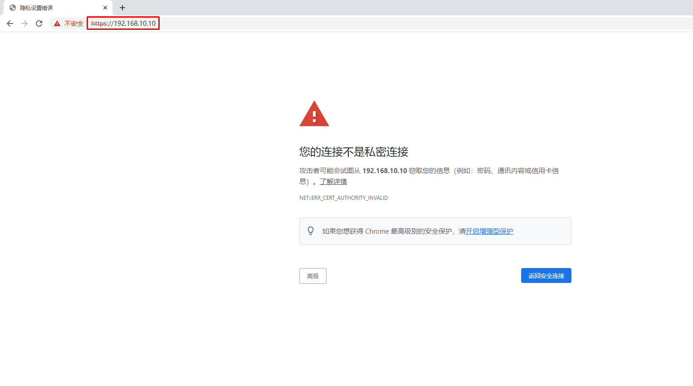

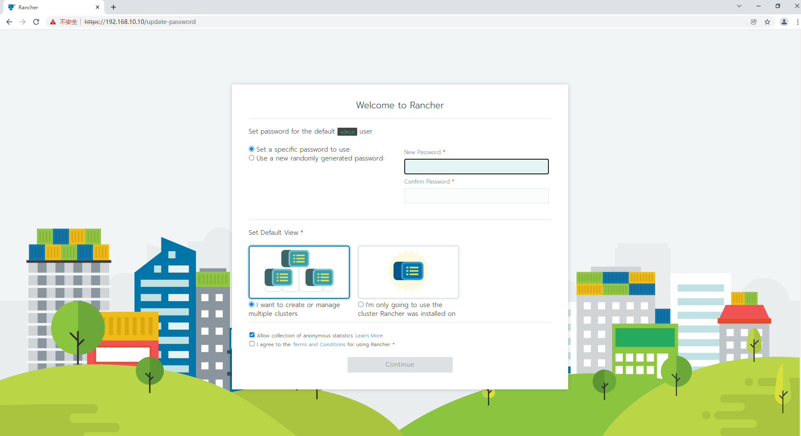

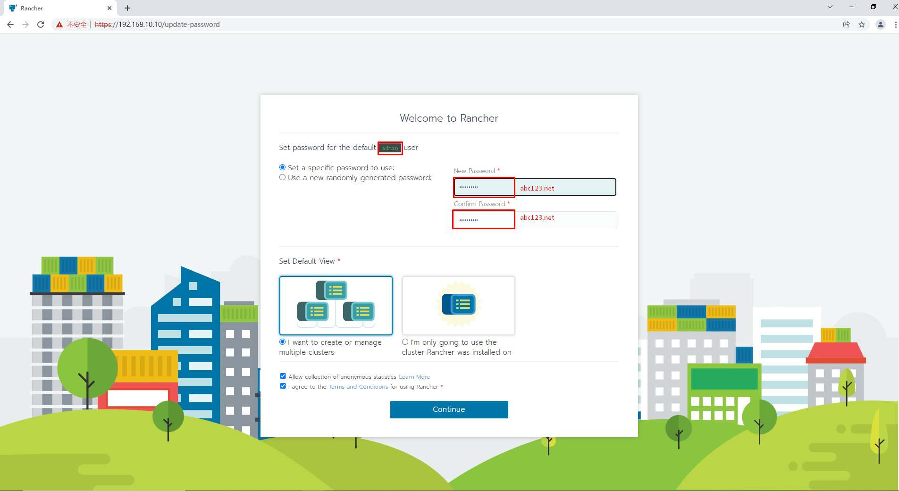

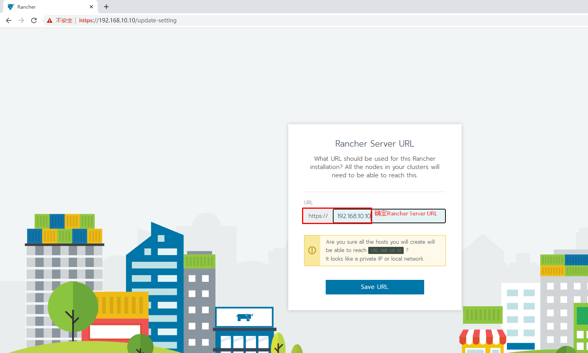

## 11.3 在rancher web界面添加kubernetes集群

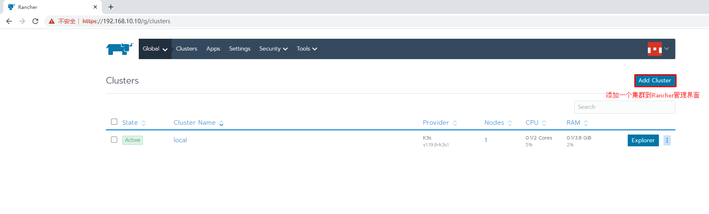

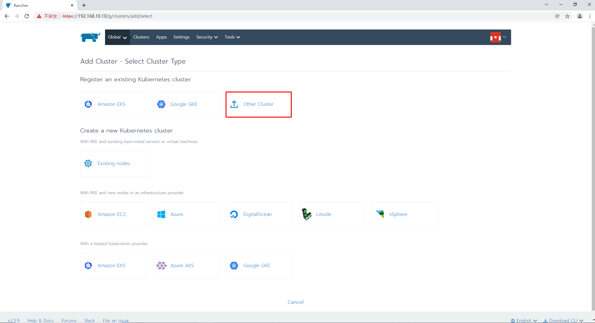

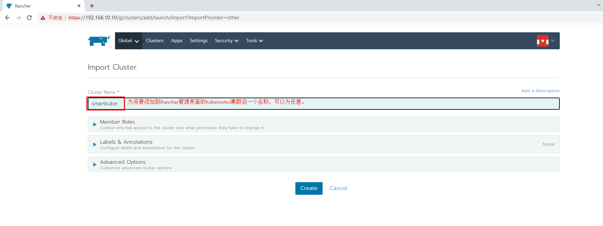

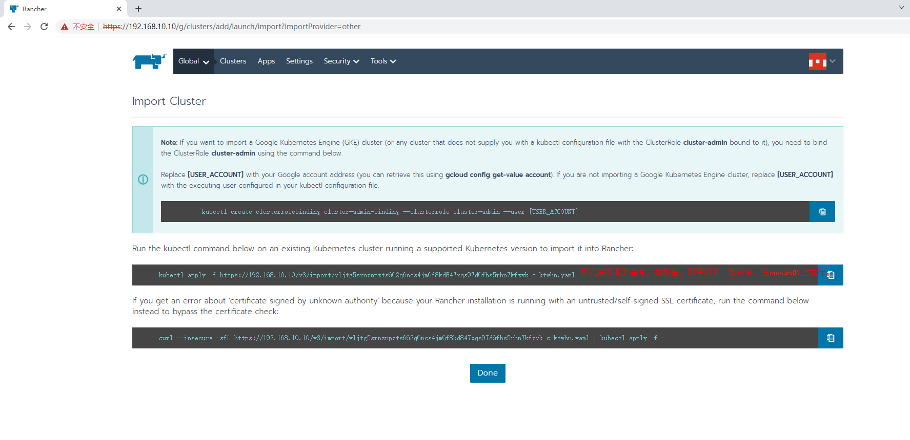

~~~powershell
使用第一条报错：
[root@master01 ~]# kubectl apply -f https://192.168.10.10/v3/import/vljtg5srnznpzts662q6ncs4jm6f8kd847xqs97d6fbs5rhn7kfzvk_c-ktwhn.yaml
Unable to connect to the server: x509: certificate is valid for 127.0.0.1, 172.17.0.2, not 192.168.10.10
~~~

~~~powershell
使用第二条：

第一次报错：
[root@master01 ~]# curl --insecure -sfL https://192.168.10.10/v3/import/vljtg5srnznpzts662q6ncs4jm6f8kd847xqs97d6fbs5rhn7kfzvk_c-ktwhn.yaml | kubectl apply -f -
error: no objects passed to apply

第二次成功：

[root@master01 ~]# curl --insecure -sfL https://192.168.10.10/v3/import/vljtg5srnznpzts662q6ncs4jm6f8kd847xqs97d6fbs5rhn7kfzvk_c-ktwhn.yaml | kubectl apply -f -
Warning: resource clusterroles/proxy-clusterrole-kubeapiserver is missing the kubectl.kubernetes.io/last-applied-configuration annotation which is required by kubectl apply. kubectl apply should only be used on resources created declaratively by either kubectl create --save-config or kubectl apply. The missing annotation will be patched automatically.
clusterrole.rbac.authorization.k8s.io/proxy-clusterrole-kubeapiserver configured
Warning: resource clusterrolebindings/proxy-role-binding-kubernetes-master is missing the kubectl.kubernetes.io/last-applied-configuration annotation which is required by kubectl apply. kubectl apply should only be used on resources created declaratively by either kubectl create --save-config or kubectl apply. The missing annotation will be patched automatically.
clusterrolebinding.rbac.authorization.k8s.io/proxy-role-binding-kubernetes-master configured
namespace/cattle-system created
serviceaccount/cattle created
clusterrolebinding.rbac.authorization.k8s.io/cattle-admin-binding created
secret/cattle-credentials-0619853 created
clusterrole.rbac.authorization.k8s.io/cattle-admin created
Warning: spec.template.spec.affinity.nodeAffinity.requiredDuringSchedulingIgnoredDuringExecution.nodeSelectorTerms[0].matchExpressions[0].key: beta.kubernetes.io/os is deprecated since v1.14; use "kubernetes.io/os" instead
deployment.apps/cattle-cluster-agent created
~~~

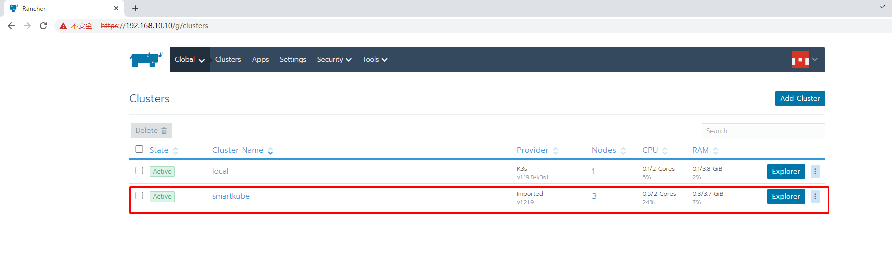

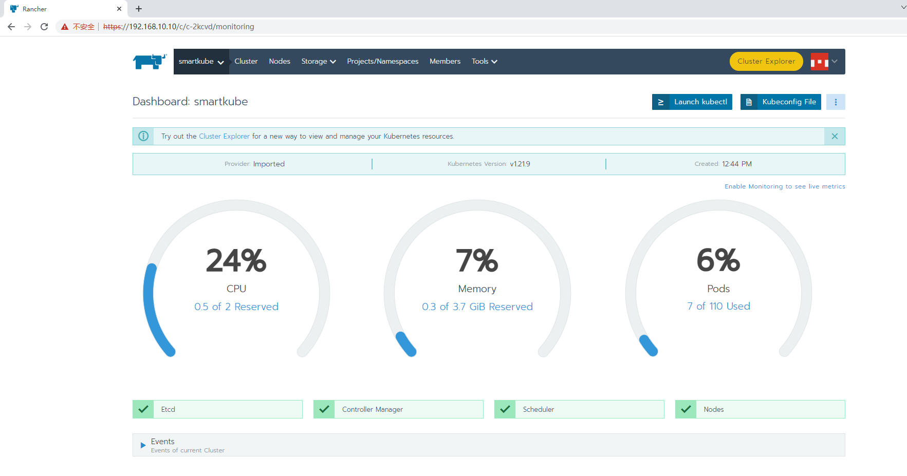

# 十二、集群节点更新

## 12.1 增加worker节点

RKE 支持为 worker 和 controlplane 主机添加或删除节点。

可以通过修改cluster.yml文件的内容，添加额外的节点，并指定它们在 Kubernetes 集群中的角色；或从cluster.yml中的节点列表中删除节点信息，以达到删除节点的目的。

通过运行rke up --update-only，您可以运行rke up --update-only命令，只添加或删除工作节点。这将会忽略除了cluster.yml中的工作节点以外的其他内容。

> 使用--update-only添加或删除 worker 节点时，可能会触发插件或其他组件的重新部署或更新。

> 添加一台节点环境也需要一致。安装docker, 创建用户，关闭swap等

### 12.1.1  集群主机名称配置

~~~powershell
# hostnamectl set-hostname xxx
~~~

### 12.1.2 集群主机IP地址配置

~~~powershell
# vim /etc/sysconfig/network-scripts/ifcfg-ens33
# cat  /etc/sysconfig/network-scripts/ifcfg-ens33
TYPE="Ethernet"
PROXY_METHOD="none"
BROWSER_ONLY="no"
BOOTPROTO="none" 修改为静态
DEFROUTE="yes"
IPV4_FAILURE_FATAL="no"
IPV6INIT="yes"
IPV6_AUTOCONF="yes"
IPV6_DEFROUTE="yes"
IPV6_FAILURE_FATAL="no"
IPV6_ADDR_GEN_MODE="stable-privacy"
NAME="eth0"
DEVICE="eth0"
ONBOOT="yes"
添加如下内容：
IPADDR="192.168.10.XXX"
PREFIX="24"
GATEWAY="192.168.10.2"
DNS1="119.29.29.29"
~~~

### 12.1.3 主机名与IP地址解析

~~~powershell
# vim /etc/hosts
# cat /etc/hosts
......
192.168.10.10 master01
192.168.10.11 master02
192.168.10.12 worker01
192.168.10.13 worker02
192.168.10.14 etcd01
~~~

### 12.1.4  配置ip_forward及过滤机制

~~~powershell
# vim /etc/sysctl.conf
# cat /etc/sysctl.conf
net.ipv4.ip_forward = 1
net.bridge.bridge-nf-call-ip6tables = 1
net.bridge.bridge-nf-call-iptables = 1
~~~

~~~powershell
# modprobe br_netfilter
~~~

~~~powershell
# sysctl -p /etc/sysctl.conf
~~~

### 12.1.5  主机安全设置

#### 12.1.5.1  防火墙

~~~powershell
# systemctl stop firewalld
# systemctl disable firewalld
~~~

~~~powershell
# firewall-cmd --state
~~~

#### 12.1.5.2 selinux

> 修改完成后一定要重启操作系统

~~~powershell
永久关闭，一定要重启操作系统后生效。
sed -ri 's/SELINUX=enforcing/SELINUX=disabled/' /etc/selinux/config
~~~

~~~powershell
临时关闭，不重启操作系统，即刻生效。
# setenforce 0 
~~~

### 12.1.6 主机swap分区设置

~~~powershell
永久关闭，需要重启操作系统生效。
# sed -ri 's/.*swap.*/#&/' /etc/fstab
~~~

~~~powershell
# cat /etc/fstab

......
#/dev/mapper/centos_192-swap swap                    swap    defaults        0 0
~~~

~~~powershell
临时关闭，不需要重启操作系统，即刻生效。
# swapoff -a
~~~

### 12.1.7  时间同步

~~~powershell
# yum -y insall ntpdate
~~~

~~~powershell
# crontab -e
0 */1 * * *  ntpdate time1.aliyun.com
~~~

### 12.1.8 Docker部署

#### 12.1.8.1 配置Docker YUM源

~~~powershell
# wget -O /etc/yum.repos.d/docker-ce.repo https://mirrors.aliyun.com/docker-ce/linux/centos/docker-ce.repo
~~~

#### 12.1.8.2  安装Docker CE

~~~powershell
# yum -y install docker-ce
~~~

#### 12.1.8.3  启动Docker服务

~~~powershell
# systemctl enable docker
# systemctl start docker
~~~

#### 12.1.8.4  配置Docker容器镜像加速器

~~~powershell
# vim /etc/docker/daemon.json
# cat /etc/docker/daemon.json
{
  "registry-mirrors": ["https://s27w6kze.mirror.aliyuncs.com"]
}
~~~

### 12.1.9 docker compose安装

~~~powershell
# curl -L "https://github.com/docker/compose/releases/download/1.28.5/docker-compose-$(uname -s)-$(uname -m)" -o /usr/local/bin/docker-compose
~~~

~~~powershell
# chmod +x /usr/local/bin/docker-compose
~~~

~~~powershell
# ln -s /usr/local/bin/docker-compose /usr/bin/docker-compose
~~~

~~~powershell
# docker-compose --version
~~~

### 12.1.10 添加rancher用户

>使用CentOS时，不能使用 root 账号，因此要添加专用的账号进行 docker相关 操作。重启系统以后才能生效，只重启Docker服务是不行的！重启后，rancher用户也可以直接使用docker ps命令

~~~powershell
# useradd rancher
~~~

~~~powershell
# usermod -aG docker rancher
~~~

~~~powershell
# echo 123 | passwd --stdin rancher
~~~

### 12.1.11 复制ssh证书

> 从rke二进制文件安装主机上复制，如果已经复制，则可不需要重复性复制。

#### 12.1.11.1 复制证书

~~~powershell
# ssh-copy-id rancher@worker02
~~~

#### 12.1.11.2  验证ssh证书是否可用

> 在rke二进制文件安装主机机测试连接其它集群主机，验证是否可使用docker ps命令即可。

~~~powershell
# ssh rancher@worker02
~~~

~~~powershell
远程主机# docker ps
~~~

### 12.1.12 编辑cluster.yml文件

> 在文件中添加worker节点信息

~~~powershell
# vim cluster.yml
......
- address: 192.168.10.13
  port: "22"
  internal_address: ""
  role:
  - worker
  hostname_override: 
  user: "rancher"
  docker_socket: /var/run/docker.sock
  ssh_key: ""
  ssh_key_path: ~/.ssh/id_rsa
  ssh_cert: ""
  ssh_cert_path: ""
  labels: {}
  taints: []
......
~~~

~~~powershell
# rke up --update-only
~~~

~~~powershell
输出
INFO[0000] Running RKE version: v1.3.7
INFO[0000] Initiating Kubernetes cluster
INFO[0000] [certificates] GenerateServingCertificate is disabled, checking if there are unused kubelet certificates
INFO[0000] [certificates] Generating admin certificates and kubeconfig
INFO[0000] Successfully Deployed state file at [./cluster.rkestate]
INFO[0000] Building Kubernetes cluster
INFO[0000] [dialer] Setup tunnel for host [192.168.10.13]
INFO[0000] [dialer] Setup tunnel for host [192.168.10.10]
INFO[0000] [dialer] Setup tunnel for host [192.168.10.14]
INFO[0000] [dialer] Setup tunnel for host [192.168.10.12]
INFO[0000] [network] Deploying port listener containers
INFO[0000] Image [rancher/rke-tools:v0.1.78] exists on host [192.168.10.14]
INFO[0000] Starting container [rke-etcd-port-listener] on host [192.168.10.14], try #1
INFO[0000] Image [rancher/rke-tools:v0.1.78] exists on host [192.168.10.10]
INFO[0000] Starting container [rke-cp-port-listener] on host [192.168.10.10], try #1
INFO[0000] Pulling image [rancher/rke-tools:v0.1.78] on host [192.168.10.13], try #1
INFO[0000] Image [rancher/rke-tools:v0.1.78] exists on host [192.168.10.12]
INFO[0001] Starting container [rke-worker-port-listener] on host [192.168.10.12], try #1
INFO[0031] Image [rancher/rke-tools:v0.1.78] exists on host [192.168.10.13]
INFO[0032] Starting container [rke-worker-port-listener] on host [192.168.10.13], try #1
INFO[0033] [network] Successfully started [rke-worker-port-listener] container on host [192.168.10.13]
INFO[0033] [network] Port listener containers deployed successfully
INFO[0033] [network] Running control plane -> etcd port checks
INFO[0033] [network] Checking if host [192.168.10.10] can connect to host(s) [192.168.10.14] on port(s) [2379], try #1
INFO[0033] Image [rancher/rke-tools:v0.1.78] exists on host [192.168.10.10]
INFO[0033] Starting container [rke-port-checker] on host [192.168.10.10], try #1
INFO[0033] [network] Successfully started [rke-port-checker] container on host [192.168.10.10]
INFO[0033] Removing container [rke-port-checker] on host [192.168.10.10], try #1
INFO[0033] [network] Running control plane -> worker port checks
INFO[0033] [network] Checking if host [192.168.10.10] can connect to host(s) [192.168.10.12 192.168.10.13] on port(s) [10250], try #1
INFO[0033] Image [rancher/rke-tools:v0.1.78] exists on host [192.168.10.10]
INFO[0033] Starting container [rke-port-checker] on host [192.168.10.10], try #1
INFO[0033] [network] Successfully started [rke-port-checker] container on host [192.168.10.10]
INFO[0033] Removing container [rke-port-checker] on host [192.168.10.10], try #1
INFO[0033] [network] Running workers -> control plane port checks
INFO[0033] [network] Checking if host [192.168.10.12] can connect to host(s) [192.168.10.10] on port(s) [6443], try #1
INFO[0033] [network] Checking if host [192.168.10.13] can connect to host(s) [192.168.10.10] on port(s) [6443], try #1
INFO[0033] Image [rancher/rke-tools:v0.1.78] exists on host [192.168.10.13]
INFO[0033] Image [rancher/rke-tools:v0.1.78] exists on host [192.168.10.12]
INFO[0034] Starting container [rke-port-checker] on host [192.168.10.13], try #1
INFO[0034] Starting container [rke-port-checker] on host [192.168.10.12], try #1
INFO[0034] [network] Successfully started [rke-port-checker] container on host [192.168.10.12]
INFO[0034] Removing container [rke-port-checker] on host [192.168.10.12], try #1
INFO[0034] [network] Successfully started [rke-port-checker] container on host [192.168.10.13]
INFO[0034] Removing container [rke-port-checker] on host [192.168.10.13], try #1
INFO[0034] [network] Checking KubeAPI port Control Plane hosts
INFO[0034] [network] Removing port listener containers
INFO[0034] Removing container [rke-etcd-port-listener] on host [192.168.10.14], try #1
INFO[0034] [remove/rke-etcd-port-listener] Successfully removed container on host [192.168.10.14]
INFO[0034] Removing container [rke-cp-port-listener] on host [192.168.10.10], try #1
INFO[0034] [remove/rke-cp-port-listener] Successfully removed container on host [192.168.10.10]
INFO[0034] Removing container [rke-worker-port-listener] on host [192.168.10.12], try #1
INFO[0034] Removing container [rke-worker-port-listener] on host [192.168.10.13], try #1
INFO[0034] [remove/rke-worker-port-listener] Successfully removed container on host [192.168.10.12]
INFO[0034] [remove/rke-worker-port-listener] Successfully removed container on host [192.168.10.13]
INFO[0034] [network] Port listener containers removed successfully
INFO[0034] [certificates] Deploying kubernetes certificates to Cluster nodes
INFO[0034] Checking if container [cert-deployer] is running on host [192.168.10.13], try #1
INFO[0034] Checking if container [cert-deployer] is running on host [192.168.10.14], try #1
INFO[0034] Checking if container [cert-deployer] is running on host [192.168.10.12], try #1
INFO[0034] Checking if container [cert-deployer] is running on host [192.168.10.10], try #1
INFO[0034] Image [rancher/rke-tools:v0.1.78] exists on host [192.168.10.13]
INFO[0034] Image [rancher/rke-tools:v0.1.78] exists on host [192.168.10.12]
INFO[0034] Image [rancher/rke-tools:v0.1.78] exists on host [192.168.10.14]
INFO[0034] Image [rancher/rke-tools:v0.1.78] exists on host [192.168.10.10]
INFO[0034] Starting container [cert-deployer] on host [192.168.10.13], try #1
INFO[0034] Starting container [cert-deployer] on host [192.168.10.14], try #1
INFO[0034] Starting container [cert-deployer] on host [192.168.10.12], try #1
INFO[0034] Starting container [cert-deployer] on host [192.168.10.10], try #1
INFO[0034] Checking if container [cert-deployer] is running on host [192.168.10.13], try #1
INFO[0035] Checking if container [cert-deployer] is running on host [192.168.10.12], try #1
INFO[0035] Checking if container [cert-deployer] is running on host [192.168.10.14], try #1
INFO[0035] Checking if container [cert-deployer] is running on host [192.168.10.10], try #1
INFO[0039] Checking if container [cert-deployer] is running on host [192.168.10.13], try #1
INFO[0039] Removing container [cert-deployer] on host [192.168.10.13], try #1
INFO[0040] Checking if container [cert-deployer] is running on host [192.168.10.12], try #1
INFO[0040] Checking if container [cert-deployer] is running on host [192.168.10.14], try #1
INFO[0040] Removing container [cert-deployer] on host [192.168.10.12], try #1
INFO[0040] Removing container [cert-deployer] on host [192.168.10.14], try #1
INFO[0040] Checking if container [cert-deployer] is running on host [192.168.10.10], try #1
INFO[0040] Removing container [cert-deployer] on host [192.168.10.10], try #1
INFO[0040] [reconcile] Rebuilding and updating local kube config
INFO[0040] Successfully Deployed local admin kubeconfig at [./kube_config_cluster.yml]
INFO[0040] [reconcile] host [192.168.10.10] is a control plane node with reachable Kubernetes API endpoint in the cluster
INFO[0040] [certificates] Successfully deployed kubernetes certificates to Cluster nodes
INFO[0040] [file-deploy] Deploying file [/etc/kubernetes/audit-policy.yaml] to node [192.168.10.10]
INFO[0040] Image [rancher/rke-tools:v0.1.78] exists on host [192.168.10.10]
INFO[0040] Starting container [file-deployer] on host [192.168.10.10], try #1
INFO[0040] Successfully started [file-deployer] container on host [192.168.10.10]
INFO[0040] Waiting for [file-deployer] container to exit on host [192.168.10.10]
INFO[0040] Waiting for [file-deployer] container to exit on host [192.168.10.10]
INFO[0040] Container [file-deployer] is still running on host [192.168.10.10]: stderr: [], stdout: []
INFO[0041] Waiting for [file-deployer] container to exit on host [192.168.10.10]
INFO[0041] Removing container [file-deployer] on host [192.168.10.10], try #1
INFO[0041] [remove/file-deployer] Successfully removed container on host [192.168.10.10]
INFO[0041] [/etc/kubernetes/audit-policy.yaml] Successfully deployed audit policy file to Cluster control nodes
INFO[0041] [reconcile] Reconciling cluster state
INFO[0041] [reconcile] Check etcd hosts to be deleted
INFO[0041] [reconcile] Check etcd hosts to be added
INFO[0041] [reconcile] Rebuilding and updating local kube config
INFO[0041] Successfully Deployed local admin kubeconfig at [./kube_config_cluster.yml]
INFO[0041] [reconcile] host [192.168.10.10] is a control plane node with reachable Kubernetes API endpoint in the cluster
INFO[0041] [reconcile] Reconciled cluster state successfully
INFO[0041] max_unavailable_worker got rounded down to 0, resetting to 1
INFO[0041] Setting maxUnavailable for worker nodes to: 1
INFO[0041] Setting maxUnavailable for controlplane nodes to: 1
INFO[0041] Pre-pulling kubernetes images
INFO[0041] Pulling image [rancher/hyperkube:v1.21.9-rancher1] on host [192.168.10.13], try #1
INFO[0041] Image [rancher/hyperkube:v1.21.9-rancher1] exists on host [192.168.10.12]
INFO[0041] Image [rancher/hyperkube:v1.21.9-rancher1] exists on host [192.168.10.14]
INFO[0041] Image [rancher/hyperkube:v1.21.9-rancher1] exists on host [192.168.10.10]
INFO[0130] Image [rancher/hyperkube:v1.21.9-rancher1] exists on host [192.168.10.13]
INFO[0130] Kubernetes images pulled successfully
INFO[0130] [etcd] Building up etcd plane..
INFO[0130] [etcd] Successfully started etcd plane.. Checking etcd cluster health
INFO[0130] [etcd] etcd host [192.168.10.14] reported healthy=true
INFO[0130] [controlplane] Now checking status of node 192.168.10.10, try #1
INFO[0130] [authz] Creating rke-job-deployer ServiceAccount
INFO[0130] [authz] rke-job-deployer ServiceAccount created successfully
INFO[0130] [authz] Creating system:node ClusterRoleBinding
INFO[0130] [authz] system:node ClusterRoleBinding created successfully
INFO[0130] [authz] Creating kube-apiserver proxy ClusterRole and ClusterRoleBinding
INFO[0130] [authz] kube-apiserver proxy ClusterRole and ClusterRoleBinding created successfully
INFO[0130] Successfully Deployed state file at [./cluster.rkestate]
INFO[0130] [state] Saving full cluster state to Kubernetes
INFO[0130] [state] Successfully Saved full cluster state to Kubernetes ConfigMap: full-cluster-state
INFO[0130] [worker] Now checking status of node 192.168.10.14, try #1
INFO[0130] [worker] Now checking status of node 192.168.10.12, try #1
INFO[0130] [worker] Upgrading Worker Plane..
INFO[0155] First checking and processing worker components for upgrades on nodes with etcd role one at a time
INFO[0155] [workerplane] Processing host 192.168.10.14
INFO[0155] [worker] Now checking status of node 192.168.10.14, try #1
INFO[0155] [worker] Getting list of nodes for upgrade
INFO[0155] [workerplane] Upgrade not required for worker components of host 192.168.10.14
INFO[0155] Now checking and upgrading worker components on nodes with only worker role 1 at a time
INFO[0155] [workerplane] Processing host 192.168.10.12
INFO[0155] [worker] Now checking status of node 192.168.10.12, try #1
INFO[0155] [worker] Getting list of nodes for upgrade
INFO[0155] [workerplane] Upgrade not required for worker components of host 192.168.10.12
INFO[0155] [workerplane] Processing host 192.168.10.13
INFO[0155] Image [rancher/rke-tools:v0.1.78] exists on host [192.168.10.13]
INFO[0156] Starting container [nginx-proxy] on host [192.168.10.13], try #1
INFO[0156] [worker] Successfully started [nginx-proxy] container on host [192.168.10.13]
INFO[0156] Image [rancher/rke-tools:v0.1.78] exists on host [192.168.10.13]
INFO[0156] Starting container [rke-log-linker] on host [192.168.10.13], try #1
INFO[0156] [worker] Successfully started [rke-log-linker] container on host [192.168.10.13]
INFO[0156] Removing container [rke-log-linker] on host [192.168.10.13], try #1
INFO[0156] [remove/rke-log-linker] Successfully removed container on host [192.168.10.13]
INFO[0156] Checking if container [service-sidekick] is running on host [192.168.10.13], try #1
INFO[0156] Image [rancher/rke-tools:v0.1.78] exists on host [192.168.10.13]
INFO[0156] Image [rancher/hyperkube:v1.21.9-rancher1] exists on host [192.168.10.13]
INFO[0156] Starting container [kubelet] on host [192.168.10.13], try #1
INFO[0156] [worker] Successfully started [kubelet] container on host [192.168.10.13]
INFO[0156] [healthcheck] Start Healthcheck on service [kubelet] on host [192.168.10.13]
INFO[0162] [healthcheck] service [kubelet] on host [192.168.10.13] is healthy
INFO[0162] Image [rancher/rke-tools:v0.1.78] exists on host [192.168.10.13]
INFO[0162] Starting container [rke-log-linker] on host [192.168.10.13], try #1
INFO[0162] [worker] Successfully started [rke-log-linker] container on host [192.168.10.13]
INFO[0162] Removing container [rke-log-linker] on host [192.168.10.13], try #1
INFO[0162] [remove/rke-log-linker] Successfully removed container on host [192.168.10.13]
INFO[0162] Image [rancher/hyperkube:v1.21.9-rancher1] exists on host [192.168.10.13]
INFO[0162] Starting container [kube-proxy] on host [192.168.10.13], try #1
INFO[0162] [worker] Successfully started [kube-proxy] container on host [192.168.10.13]
INFO[0162] [healthcheck] Start Healthcheck on service [kube-proxy] on host [192.168.10.13]
INFO[0167] [healthcheck] service [kube-proxy] on host [192.168.10.13] is healthy
INFO[0167] Image [rancher/rke-tools:v0.1.78] exists on host [192.168.10.13]
INFO[0168] Starting container [rke-log-linker] on host [192.168.10.13], try #1
INFO[0168] [worker] Successfully started [rke-log-linker] container on host [192.168.10.13]
INFO[0168] Removing container [rke-log-linker] on host [192.168.10.13], try #1
INFO[0168] [remove/rke-log-linker] Successfully removed container on host [192.168.10.13]
INFO[0168] [worker] Successfully upgraded Worker Plane..
INFO[0168] Image [rancher/rke-tools:v0.1.78] exists on host [192.168.10.14]
INFO[0168] Image [rancher/rke-tools:v0.1.78] exists on host [192.168.10.13]
INFO[0168] Image [rancher/rke-tools:v0.1.78] exists on host [192.168.10.12]
INFO[0168] Image [rancher/rke-tools:v0.1.78] exists on host [192.168.10.10]
INFO[0168] Starting container [rke-log-cleaner] on host [192.168.10.13], try #1
INFO[0168] Starting container [rke-log-cleaner] on host [192.168.10.14], try #1
INFO[0168] Starting container [rke-log-cleaner] on host [192.168.10.12], try #1
INFO[0168] [cleanup] Successfully started [rke-log-cleaner] container on host [192.168.10.13]
INFO[0168] Removing container [rke-log-cleaner] on host [192.168.10.13], try #1
INFO[0168] [cleanup] Successfully started [rke-log-cleaner] container on host [192.168.10.12]
INFO[0168] [cleanup] Successfully started [rke-log-cleaner] container on host [192.168.10.14]
INFO[0168] Removing container [rke-log-cleaner] on host [192.168.10.14], try #1
INFO[0168] [remove/rke-log-cleaner] Successfully removed container on host [192.168.10.13]
INFO[0168] Starting container [rke-log-cleaner] on host [192.168.10.10], try #1
INFO[0168] Removing container [rke-log-cleaner] on host [192.168.10.12], try #1
INFO[0168] [remove/rke-log-cleaner] Successfully removed container on host [192.168.10.12]
INFO[0168] [remove/rke-log-cleaner] Successfully removed container on host [192.168.10.14]
INFO[0169] [cleanup] Successfully started [rke-log-cleaner] container on host [192.168.10.10]
INFO[0169] Removing container [rke-log-cleaner] on host [192.168.10.10], try #1
INFO[0169] [remove/rke-log-cleaner] Successfully removed container on host [192.168.10.10]
INFO[0169] [sync] Syncing nodes Labels and Taints
INFO[0169] [sync] Successfully synced nodes Labels and Taints
INFO[0169] [network] Setting up network plugin: canal
INFO[0169] [addons] Saving ConfigMap for addon rke-network-plugin to Kubernetes
INFO[0169] [addons] Successfully saved ConfigMap for addon rke-network-plugin to Kubernetes
INFO[0169] [addons] Executing deploy job rke-network-plugin
INFO[0169] [addons] Setting up coredns
INFO[0169] [addons] Saving ConfigMap for addon rke-coredns-addon to Kubernetes
INFO[0169] [addons] Successfully saved ConfigMap for addon rke-coredns-addon to Kubernetes
INFO[0169] [addons] Executing deploy job rke-coredns-addon
INFO[0169] [addons] CoreDNS deployed successfully
INFO[0169] [dns] DNS provider coredns deployed successfully
INFO[0169] [addons] Setting up Metrics Server
INFO[0169] [addons] Saving ConfigMap for addon rke-metrics-addon to Kubernetes
INFO[0169] [addons] Successfully saved ConfigMap for addon rke-metrics-addon to Kubernetes
INFO[0169] [addons] Executing deploy job rke-metrics-addon
INFO[0169] [addons] Metrics Server deployed successfully
INFO[0169] [ingress] Setting up nginx ingress controller
INFO[0169] [ingress] removing admission batch jobs if they exist
INFO[0169] [addons] Saving ConfigMap for addon rke-ingress-controller to Kubernetes
INFO[0169] [addons] Successfully saved ConfigMap for addon rke-ingress-controller to Kubernetes
INFO[0169] [addons] Executing deploy job rke-ingress-controller
INFO[0169] [ingress] removing default backend service and deployment if they exist
INFO[0169] [ingress] ingress controller nginx deployed successfully
INFO[0169] [addons] Setting up user addons
INFO[0169] [addons] no user addons defined
INFO[0169] Finished building Kubernetes cluster successfully
~~~

~~~powershell
[root@master01 rancher]# kubectl get nodes
NAME            STATUS   ROLES          AGE   VERSION
192.168.10.10   Ready    controlplane   51m   v1.21.9
192.168.10.12   Ready    worker         51m   v1.21.9
192.168.10.13   Ready    worker         62s   v1.21.9
192.168.10.14   Ready    etcd           51m   v1.21.9
~~~

## 12.2 移除worker节点

>修改cluster.yml文件,将对应节点信息删除即可。

~~~powershell
# vim cluster.yml
......
- address: 192.168.10.13
  port: "22"
  internal_address: ""
  role:
  - worker
  hostname_override: 
  user: "rancher"
  docker_socket: /var/run/docker.sock
  ssh_key: ""
  ssh_key_path: ~/.ssh/id_rsa
  ssh_cert: ""
  ssh_cert_path: ""
  labels: {}
  taints: []
......
~~~

~~~powershell
[root@master01 rancher]# rke up --update-only
~~~

~~~powershell
[root@master01 rancher]# kubectl get nodes
NAME            STATUS   ROLES          AGE   VERSION
192.168.10.10   Ready    controlplane   53m   v1.21.9
192.168.10.12   Ready    worker         53m   v1.21.9
192.168.10.14   Ready    etcd           53m   v1.21.9
~~~

>但是worker节点上的pod是没有结束运行的。如果节点被重复使用，那么在创建新的 Kubernetes 集群时，将自动删除 pod。

~~~powershell
[root@worker02 ~]# docker ps
CONTAINER ID   IMAGE                              COMMAND                  CREATED         STATUS         PORTS     NAMES
b96aa2ac2c25   rancher/nginx-ingress-controller   "/usr/bin/dumb-init …"   3 minutes ago   Up 3 minutes             k8s_controller_nginx-ingress-controller-wxzv4_ingress-nginx_2f6d0569-6a92-4208-8fae-f46b23f2b123_0
f8e7f496e9af   rancher/mirrored-coredns-coredns   "/coredns -conf /etc…"   3 minutes ago   Up 3 minutes             k8s_coredns_coredns-8578b6dbdd-xqqdd_kube-system_f10a7413-1f1a-44bf-9070-b7420c296a39_0
7df4ce7aad96   rancher/mirrored-coreos-flannel    "/opt/bin/flanneld -…"   3 minutes ago   Up 3 minutes             k8s_kube-flannel_canal-6m2wj_kube-system_5a55b012-e6ba-4b41-aee4-323a7ce99871_0
38693983ea9c   rancher/mirrored-calico-node       "start_runit"            4 minutes ago   Up 3 minutes             k8s_calico-node_canal-6m2wj_kube-system_5a55b012-e6ba-4b41-aee4-323a7ce99871_0
c45bdddaba81   rancher/mirrored-pause:3.5         "/pause"                 4 minutes ago   Up 3 minutes             k8s_POD_nginx-ingress-controller-wxzv4_ingress-nginx_2f6d0569-6a92-4208-8fae-f46b23f2b123_29
7d97152ec302   rancher/mirrored-pause:3.5         "/pause"                 4 minutes ago   Up 3 minutes             k8s_POD_coredns-8578b6dbdd-xqqdd_kube-system_f10a7413-1f1a-44bf-9070-b7420c296a39_31
ea385d73aab9   rancher/mirrored-pause:3.5         "/pause"                 5 minutes ago   Up 5 minutes             k8s_POD_canal-6m2wj_kube-system_5a55b012-e6ba-4b41-aee4-323a7ce99871_0
~~~

## 12.3 增加etcd节点

### 12.3.1 主机准备

> 与添加worker节点主机准备一致,可单独准备2台新主机。

### 12.3.2 修改cluster.yml文件

~~~powershell
# vim cluster.yml
......
- address: 192.168.10.15
  port: "22"
  internal_address: ""
  role:
  - etcd
  hostname_override: ""
  user: rancher
  docker_socket: /var/run/docker.sock
  ssh_key: ""
  ssh_key_path: ~/.ssh/id_rsa
  ssh_cert: ""
  ssh_cert_path: ""
  labels: {}
  taints: []
- address: 192.168.10.16
  port: "22"
  internal_address: ""
  role:
  - etcd
  hostname_override: ""
  user: rancher
  docker_socket: /var/run/docker.sock
  ssh_key: ""
  ssh_key_path: ~/.ssh/id_rsa
  ssh_cert: ""
  ssh_cert_path: ""
  labels: {}
  taints: []
......
~~~

### 12.3.3 执行rke up命令

~~~powershell
# rke up --update-only
~~~

### 12.3.4 查看添加结果

~~~powershell
[root@master01 rancher]# kubectl get nodes
NAME            STATUS   ROLES          AGE    VERSION
192.168.10.10   Ready    controlplane   114m   v1.21.9
192.168.10.12   Ready    worker         114m   v1.21.9
192.168.10.14   Ready    etcd           114m   v1.21.9
192.168.10.15   Ready    etcd           99s    v1.21.9
192.168.10.16   Ready    etcd           85s    v1.21.9
~~~

~~~powershell
[root@etcd01 ~]# docker exec -it etcd /bin/sh
# etcdctl member list
746b681e35b1537c, started, etcd-192.168.10.16, https://192.168.10.16:2380, https://192.168.10.16:2379, false
b07954b224ba7459, started, etcd-192.168.10.15, https://192.168.10.15:2380, https://192.168.10.15:2379, false
e94295bf0a471a67, started, etcd-192.168.10.14, https://192.168.10.14:2380, https://192.168.10.14:2379, false
~~~

# 十三、部署应用

## 13.1 创建资源清单文件

~~~powershell
# vim nginx.yaml
# cat nginx.yaml
---
apiVersion: apps/v1
kind: Deployment
metadata:
  name: nginx-test
spec:
  selector:
    matchLabels:
      app: nginx
      env: test
      owner: rancher
  replicas: 2 # tells deployment to run 2 pods matching the template
  template:
    metadata:
      labels:
        app: nginx
        env: test
        owner: rancher
    spec:
      containers:
        - name: nginx-test
          image: nginx:1.19.9
          ports:
            - containerPort: 80
~~~

~~~powershell
# kubectl apply -f nginx.yaml
~~~

~~~powershell
# vim nginx-service.yaml
# cat nginx-service.yaml
---
apiVersion: v1
kind: Service
metadata:
  name: nginx-test
  labels:
    run: nginx
spec:
  type: NodePort
  ports:
  - port: 80
    protocol: TCP
  selector:
    owner: rancher
~~~

~~~powershell
# kubectl apply -f nginx-service.yaml
~~~

## 13.2 验证

~~~powershell
# kubectl get pods -o wide
NAME                          READY   STATUS    RESTARTS   AGE   IP           NODE            NOMINATED NODE   READINESS GATES
nginx-test-7d95fb4447-6k4p9   1/1     Running   0          55s   10.42.2.11   192.168.10.12   <none>           <none>
nginx-test-7d95fb4447-sfnsk   1/1     Running   0          55s   10.42.2.10   192.168.10.12   <none>           <none>
~~~

~~~powershell
# kubectl get svc -o wide
NAME         TYPE        CLUSTER-IP      EXTERNAL-IP   PORT(S)        AGE     SELECTOR
kubernetes   ClusterIP   10.43.0.1       <none>        443/TCP        120m    <none>
nginx-test   NodePort    10.43.158.143   <none>        80:32669/TCP   2m22s   owner=rancher
~~~

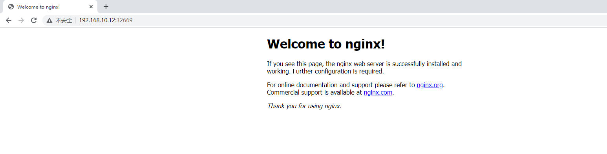

