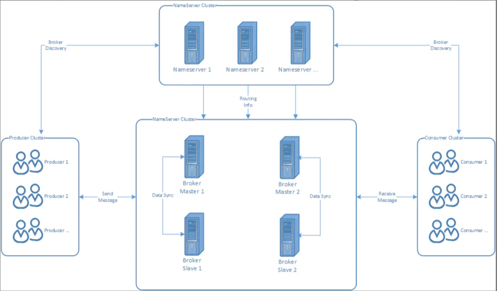
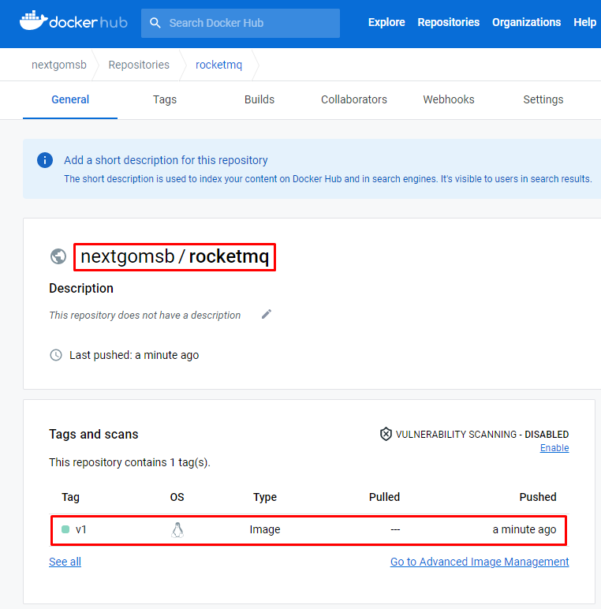
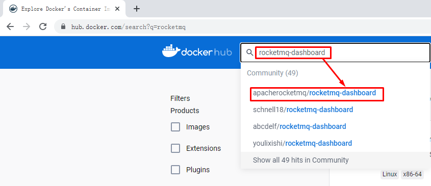
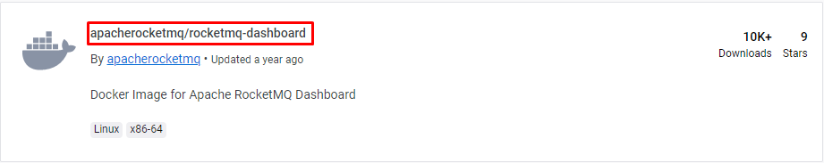
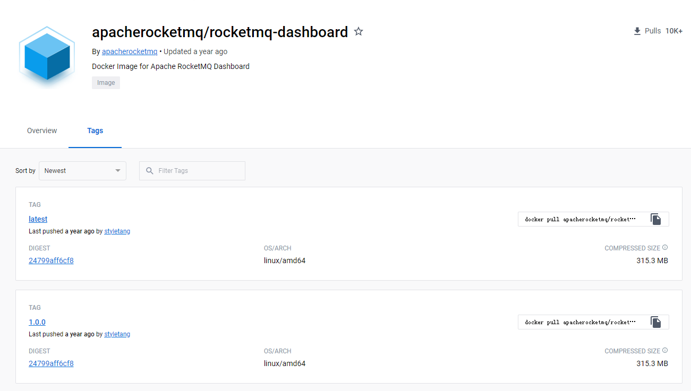
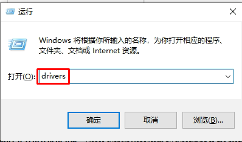
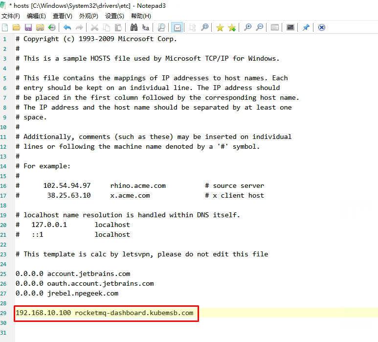
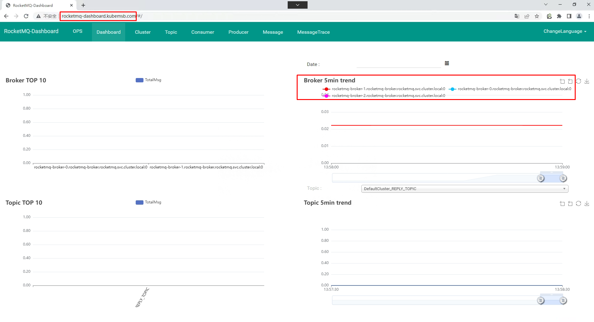
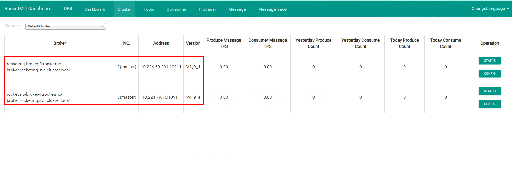
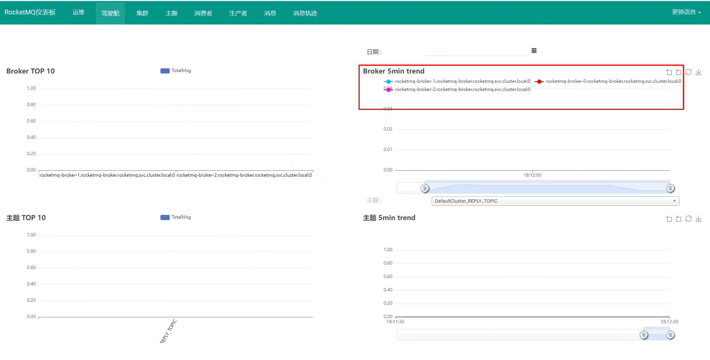

# rocketmq部署

# 一、rokectmq介绍

Apache RocketMQ是一个分布式消息传递和流媒体平台，具有低延迟、高性能和可靠性、万亿级别的容量和灵活的可伸缩性。

# 二、rokectmq特性

- 发布/订阅消息传递模型

- 定期消息传递

- 按时间或偏移量进行消息回溯

- 日志中心流

- 大数据集成

- 在同一队列中可靠的FIFO和严格的有序消息传递

- 有效的拉伸消费模式

- 在一个队列中有百万级的消息积累容量

- 多种消息传递协议，如JMS和OpenMessaging

- 灵活的分布式扩展部署体系结构
- 快速批量消息交换系统。

- 各种消息过滤机制，如SQL和标记

- 用于隔离测试和云隔离集群的Docker映像。

- 用于配置、度量和监视的功能丰富的管理仪表板

# 三、使用rocketmq理由

- 强调集群无单点，可扩展，任意一点高可用，水平可扩展

​    方便集群配置，而且容易扩展（横向和纵向），通过slave的方式每一点都可以实现高可用

- 支持上万个队列，顺序消息

​    顺序消费是实现在同一队列的，如果高并发的情况就需要队列的支持，rocketmq可以满足上万个队列同时存在

- 任性定制你的消息过滤

​    rocketmq提供了两种类型的消息过滤，也可以说三种可以通过topic进行消息过滤、可以通过tag进行消息过滤、还可以通过filter的方式任意定制过滤

- 消息的可靠性（无Buffer，持久化，容错，回溯消费）

​    消息无buffer就不用担心buffer回满的情况，rocketmq的所有消息都是持久化的，生产者本身可以进行错误重试，发布者也会按照时间阶梯的方式进行消息重发，消息回溯说的是可以按照指定的时间进行消息的重新消费，既可以向前也可以向后（前提条件是要注意消息的擦除时间）

- 海量消息堆积能力，消息堆积后，写入低延迟

​    针对于provider需要配合部署方式，对于consumer，如果是集群方式一旦master返现消息堆积会向consumer下发一个重定向指令，此时consumer就可以从slave进行数据消费了

- 分布式事务

  rocketmq对这一块说的不是很清晰，而且官方也说现在这块存在缺陷（会令系统pagecache过多），所以线上建议还是少用为好

- 消息失败重试机制

​    针对provider的重试，当消息发送到选定的broker时如果出现失败会自动选择其他的broker进行重发，默认重试三次，当然重试次数要在消息发送的超时时间范围内。

​    针对consumer的重试，如果消息因为各种原因没有消费成功，会自动加入到重试队列，一般情况如果是因为网络等问题连续重试也是照样失败，所以rocketmq也是采用阶梯重试的方式。

- 定时消费

​    除了上面的配置，在发送消息是也可以针对message设置setDelayTimeLevel

- 活跃的开源社区

​    现在rocketmq成为了apache的一款开源产品，活跃度也是不容怀疑的

- 成熟度

​    经过双十一考验

# 四、rocketmq核心概念

- NameServer

这里我们可以理解成类似于zk的一个注册中心，而且rocketmq最初也是基于zk作为注册中心的，现在相当于为rocketmq自定义了一个注册中心，代码不超过1000行。RocketMQ 有多种配置方式可以令客户端找到 Name Server, 然后通过 Name Server 再找到 Broker，分别如下，优先级由高到低，高优先级会覆盖低优先级。客户端提供http和ip:端口号的两种方式，推荐使用http的方式可以实现nameserver的热部署。

- Push Consumer

​    Consumer 的一种，应用通常通过 Consumer 对象注册一个 Listener 接口，一旦收到消息，Consumer 对象立刻回调 Listener 接口方法，类似于activemq的方式

- Pull Consumer

​    Consumer 的一种，应用通常主动调用 Consumer 的拉消息方法从 Broker 拉消息，主动权由应用控制

- Producer Group

​    一类producer的集合名称，这类producer通常发送一类消息，且发送逻辑一致

- Consumer Group

​    同上，consumer的集合名称

- Broker

​    消息中转的角色，负责存储消息（实际的存储是调用的store组件完成的），转发消息，一般也称为server，同jms中的provider

- Message Filter

​    可以实现高级的自定义的消息过滤

- Master/Slave

​    集群的主从关系，broker的name相同，brokerid=0的为主master，大于0的为从slave，可以一主多从，但一从只能有一主

# 五、rocketmq角色

RocketMQ由四部分构成：Producer、Consumer、Broker和NameServer

启动顺序：NameServer->Broker

为了消除单点故障，增加可靠性或增大吞吐量，可以在多台机器上部署多个nameserver和broker，并且为每个broker部署1个或多个slave

>Topic & message queue：一个分布式消息队列中间件部署好以后，可以给很多个业务提供服务，同一个业务也有不同类型的消息要投递，这些不同类型的消息以不同的 Topic 名称来区分。所以发送和接收消息前，先创建topic，针对某个 Topic 发送和接收消息。有了 Topic 以后，还需要解决性能问题 。 如果一个Topic 要发送和接收的数据量非常大， 需要能支持增加并行处理的机器来提高处理速度，这时候一个 Topic 可以根据需求设置一个或多个 Message Queue, Message Queue 类似分区或 Partition 。Topic有了多个 Message Queue 后，消息可以并行地向各个Message Queue 发送，消费者也可以并行地从多个 Message Queue 读取消息并消费 。

# 六、rocketmq集群部署方式

- 单Master模式

​    只有一个 Master节点

​    优点：配置简单，方便部署

​    缺点：这种方式风险较大，一旦Broker重启或者宕机时，会导致整个服务不可用，不建议线上环境使用

- 多Master模式

​    一个集群无 Slave，全是 Master，例如 2 个 Master 或者 3 个 Master

​    优点：配置简单，单个Master 宕机或重启维护对应用无影响，在磁盘配置为RAID10 时，即使机器宕机不可恢复情况下，由与 RAID10磁盘非常可靠，消息也不会丢（异步刷盘丢失少量消息，同步刷盘一条不丢）。性能最高。

​    缺点：单台机器宕机期间，这台机器上未被消费的消息在机器恢复之前不可订阅，消息实时性会受到受到影响

- 多Master多Slave模式（异步复制）

​    每个 Master 配置一个 Slave，有多对Master-Slave， HA，采用异步复制方式，主备有短暂消息延迟，毫秒级。

​    优点：即使磁盘损坏，消息丢失的非常少，且消息实时性不会受影响，因为Master 宕机后，消费者仍然可以从 Slave消费，此过程对应用透明。不需要人工干预。性能同多 Master 模式几乎一样。

​    缺点： Master 宕机，磁盘损坏情况，会丢失少量消息。

- 多Master多Slave模式（同步双写）

​    每个 Master 配置一个 Slave，有多对Master-Slave， HA采用同步双写方式，主备都写成功，向应用返回成功。

​    优点：数据与服务都无单点， Master宕机情况下，消息无延迟，服务可用性与数据可用性都非常高

​    缺点：性能比异步复制模式略低，大约低 10%左右，发送单个消息的 RT会略高。目前主宕机后，备机不能自动切换为主机，后续会支持自动切换功能

# 七、rocketmq集群部署

>rocketmq-operator都是不能很灵活的调整副本数，毕竟每个副本对应其唯一的配置的文件，不同的broker实例使用的配置文件都是不一样的，都存在差异，一旦副本变化了，就不能很好的和broker 的配置文件内容一 一对应起来。

>接下来我们创建一个基于k8s部署单master以及多master部署rocketmq集群，并且只需要一个broker配置文件，多个broker实例会自动基于该broker配置文件模板，自动生成不同broker实例的broker配置文件，扩容或者伸缩rocketmq集群 nameserver或者broker副本数的时候不需要理会配置文件，仅仅是调整实例的副本即可。

>    备注：该方案不适合有slave节点的部署方式。

## 7.1 环境说明

- 提供持久存储动态供给功能

~~~powershell
[root@k8s-master01 ~]# kubectl get storageclass
NAME         PROVISIONER      RECLAIMPOLICY   VOLUMEBINDINGMODE   ALLOWVOLUMEEXPANSION   AGE
nfs-client   fuseim.pri/ifs   Delete          Immediate           false                  8d
~~~

- 提供metallb功能

> 按官网提供的方式修改即可，链接：https://metallb.universe.tf/

~~~powershell
# kubectl apply -f https://raw.githubusercontent.com/metallb/metallb/v0.13.5/config/manifests/metallb-native.yaml
~~~

~~~powershell
# vim ippool.yaml
# cat ippool.yaml

apiVersion: metallb.io/v1beta1
kind: IPAddressPool
metadata:
  name: first-pool
  namespace: metallb-system
spec:
  addresses:
  - 192.168.10.100-192.168.100.110
~~~

~~~powershell
# kubectl create -f ippool.yaml
~~~

~~~powershell
# vim l2.yaml
# cat l2.yaml

apiVersion: metallb.io/v1beta1
kind: L2Advertisement
metadata:
  name: example
  namespace: metallb-system
~~~

~~~powershell
# kubectl create -f l2.yaml
~~~

- 提供ingress nginx controller

~~~powershell
# wget https://raw.githubusercontent.com/kubernetes/ingress-nginx/controller-v1.4.0/deploy/static/provider/cloud/deploy.yaml
~~~

~~~powershell
部署前修改362行,把Local修改为Cluster

# kubectl apply -f deploy.yaml
~~~

~~~powershell
# kubectl get ns
NAME               STATUS   AGE
ingress-nginx      Active   8s
~~~

~~~powershell
# kubectl get pods -n ingress-nginx
NAME                                        READY   STATUS      RESTARTS   AGE
ingress-nginx-admission-create-r9gqt        0/1     Completed   0          62s
ingress-nginx-admission-patch-r24d6         0/1     Completed   0          62s
ingress-nginx-controller-7844b9db77-mxrgn   1/1     Running     0          62s
~~~

~~~powershell
# kubectl get svc -n ingress-nginx
NAME                                 TYPE           CLUSTER-IP      EXTERNAL-IP      PORT(S)                      AGE
ingress-nginx-controller             LoadBalancer   10.96.21.124    192.168.10.100   80:31844/TCP,443:32294/TCP   49m
ingress-nginx-controller-admission   ClusterIP      10.109.18.235   <none>           443/TCP                      49m
~~~

- 容器镜像仓库

> 没有本地容器镜像仓库，可以使用hub.dockcer.com。

## 7.2 构建rocketmq镜像

rocketmq-namesrv和 rocketmq-broker共用同一个镜像，仅仅是启动命令和启动参数不一样，后期可灵活的通过调整启动命令和启动参数来实现不同的效果（比如通过挂载configMap的方式自定义rocketmq的配置文件，而不需要重建rocketmq的镜像。

~~~powershell
# vim Dockerfile
# cat Dockerfile
 
FROM   docker.io/library/openjdk:8u102-jdk AS JDK
 
LABEL mail=admin@kubemsb.com
 
RUN  rm -vf /etc/localtime \
     && ln -s /usr/share/zoneinfo/Asia/Shanghai /etc/localtime \
     && echo "Asia/Shanghai" > /etc/timezone \
     && export LANG=zh_CN.UTF-8
 
RUN     curl -k https://mirrors.tuna.tsinghua.edu.cn/apache/rocketmq/4.9.4/rocketmq-all-4.9.4-bin-release.zip \
         -o /tmp/rocketmq-all-4.9.4-bin-release.zip    \
     && unzip /tmp/rocketmq-all-4.9.4-bin-release.zip -d /tmp/ \
     && mv /tmp/rocketmq-all-4.9.4-bin-release /opt/rocketmq \
     && rm -rf /tmp/*
 
RUN  sed -ir '/-Xmx/c JAVA_OPT=${JAVA_OPT}' /opt/rocketmq/bin/runserver.sh \
     && sed -ir '/-Xmx/c JAVA_OPT=${JAVA_OPT}' /opt/rocketmq/bin/runbroker.sh
 
##  运行 MQ 应用时候可以通过环境变量设置 jvm 数值，如：JAVA_OPT="-server -Xms2g -Xmx2g -XX:MetaspaceSize=128m -XX:MaxMetaspaceSize=320m"
 
ENV     ROCKETMQ_HOME=/opt/rocketmq
 
WORKDIR $ROCKETMQ_HOME
~~~

~~~powershell
# docker build -t docker.io/nextgomsb/rocketmq:v1 . --no-cache
~~~

~~~powershell
# docker images
REPOSITORY                                TAG         IMAGE ID       CREATED          SIZE
nextgomsb/rocketmq                        v1          ed01df462eb3   31 seconds ago   677MB
~~~

~~~powershell
# docker login
Login with your Docker ID to push and pull images from Docker Hub. If you don't have a Docker ID, head over to https://hub.docker.com to create one.
Username: nextgomsb 替换为自己仓库的用户名
Password: 替换为自己仓库的用户名
WARNING! Your password will be stored unencrypted in /root/.docker/config.json.
Configure a credential helper to remove this warning. See
https://docs.docker.com/engine/reference/commandline/login/#credentials-store

Login Succeeded
~~~

~~~powershell
# docker push docker.io/nextgomsb/rocketmq:v1
~~~

## 7.3 获取rocketmq-dashboard镜像

 rocketmq-dashboard是一个可视化的rocketmq集群运维监控工具。

## 7.4 rocketmq部署描述文件编写

### 7.4.1 rocketmq-namesrv部署描述文件

~~~powershell
# vim rocketmq-namesrv.yaml
# cat rocketmq-namesrv.yaml

---
apiVersion: v1
kind: Namespace
metadata:
  name: rocketmq

---
apiVersion: apps/v1
kind: StatefulSet
metadata:
  name: rocketmq-namesrv
  namespace: rocketmq
spec:
  serviceName: rocketmq-namesrv
  replicas: 2
  selector:
    matchLabels:
      app: rocketmq-namesrv
  template:
    metadata:
      labels:
        app: rocketmq-namesrv
    spec:
      containers:
      - name: rocketmq-namesrv-container
        image: docker.io/nextgomsb/rocketmq:v1
        imagePullPolicy: IfNotPresent
        command:
        - bin/mqnamesrv
        env:
        - name: JAVA_OPT
          value: -server -Xms2g -Xmx2g -XX:MetaspaceSize=256m -XX:MaxMetaspaceSize=512m
---
apiVersion: v1
kind: Service
metadata:
  name: rocketmq-namesrv
  namespace: rocketmq
  labels:
    app: rocketmq-namesrv
spec:
  ports:
  - port: 9876
    protocol: TCP
    targetPort: 9876
  selector:
    app: rocketmq-namesrv
  type: ClusterIP
~~~

~~~powershell
# dig -t a rocketmq-namesrv.rocketmq.svc.cluster.local. @10.96.0.10
~~~

### 7.4.2 rocketmq-broker部署描述文件

~~~powershell
# vim rocketmq-broker.yaml
# cat rocketmq-broker.yaml

---
apiVersion: apps/v1
kind: StatefulSet
metadata:
  name: rocketmq-broker
  namespace: rocketmq
spec:
  serviceName: rocketmq-broker
  replicas: 2
  selector:
    matchLabels:
      app: rocketmq-broker
  template:
    metadata:
      labels:
        app: rocketmq-broker
    spec:
      containers:
      - name: rocketmq-broker
        image: nextgomsb/rocketmq:v1
        imagePullPolicy: IfNotPresent
        command:
        - bin/mqbroker
        - --namesrvAddr=rocketmq-namesrv.rocketmq.svc.cluster.local.:9876
        env:
        - name: JAVA_OPT
          value: -server -Xms1g -Xmx1g
      dnsPolicy: ClusterFirst
      restartPolicy: Always
      schedulerName: default-scheduler
      terminationGracePeriodSeconds: 30
  updateStrategy:
    rollingUpdate:
      partition: 0
    type: RollingUpdate
~~~

### 7.4.3 rocketmq-dashboard部署描述文件

> 部署一个能实现运维监控rocketmq的可视化web应用。

  部署rocketmq-dashboard应用时候重点关注部署文件里面的env环境变量参数JAVA_OPTS，该env环境变量（JAVA_OPTS）决定了应用是否能成功连接到 rocketmq-namesrv 服务。

~~~powershell
# vim rocketmq-dashboard.yaml
# cat rocketmq-dashboard.yaml

---
apiVersion: apps/v1
kind: Deployment
metadata:
  name: rocketmq-dashboard
  namespace: rocketmq
  labels:
    app: rocketmq-dashboard
spec:
  replicas: 1
  selector:
    matchLabels:
      app: rocketmq-dashboard
  template:
    metadata:
      labels:
        app: rocketmq-dashboard
    spec:
      containers:
      - name: rocketmq-dashboard
        image: apacherocketmq/rocketmq-dashboard:latest
        imagePullPolicy: IfNotPresent
        env:
        - name: JAVA_OPTS
          value: -Drocketmq.namesrv.addr=rocketmq-namesrv.rocketmq.svc.cluster.local.:9876
      dnsPolicy: ClusterFirst
      restartPolicy: Always
      schedulerName: default-scheduler
      securityContext: {}
      terminationGracePeriodSeconds: 30

---
apiVersion: v1
kind: Service
metadata:
  name: rocketmq-dashboard
  namespace: rocketmq
  labels:
    app: rocketmq-dashboard
spec:
  ports:
  - port: 8080
    protocol: TCP
    targetPort: 8080
  selector:
    app: rocketmq-dashboard
  type: ClusterIP
~~~

## 7.5 执行部署描述文件

### 7.5.1 rocketmq-namesrv部署

~~~powershell
# kubectl create -f rocketmq-namesrv.yaml
~~~

~~~powershell
# kubectl get pods -n rocketmq
NAME                                 READY   STATUS    RESTARTS   AGE
...
rocketmq-namesrv-0                   1/1     Running   0          14m
rocketmq-namesrv-1                   1/1     Running   0          13m
~~~

### 7.5.2 rocketmq-broker部署

~~~powershell
# kubectl create -f rocketmq-broker.yaml
~~~

~~~powershell
# kubectl get pods -n rocketmq
NAME                                 READY   STATUS    RESTARTS   AGE
rocketmq-broker-0                    1/1     Running   0          4m16s
rocketmq-broker-1                    1/1     Running   0          4m15s
~~~

### 7.5.3 rocketmq-dashboard部署

~~~powershell
# kubectl create -f rocketmq-dashboard.yaml
~~~

~~~powershell
# kubectl get pods -n rocketmq
NAME                                 READY   STATUS    RESTARTS   AGE
rocketmq-dashboard-f4ccdf496-sv984   1/1     Running   0          73s
~~~

## 7.6 调整副本

~~~powershell
调整rocket-namesrv副本数

kubectl scale sts rocketmq-namesrv --replicas=3 -n rocketmq
~~~

~~~powershell
# kubectl get pods -n rocketmq
NAME                                 READY   STATUS    RESTARTS   AGE
rocketmq-namesrv-0                   1/1     Running   0          15m
rocketmq-namesrv-1                   1/1     Running   0          14m
rocketmq-namesrv-2                   1/1     Running   0          4s
~~~

~~~powershell
调整rocket-broker副本数,集群节点内存要大于副本数中内存。
kubectl scale sts rocketmq-broker --replicas=3 -n rocketmq
~~~

## 7.7 创建ingress资源对象实现域名访问dashboard

~~~powershell
# vim rocketmq-dashboard-ingress.yaml
# cat rocketmq-dashboard-ingress.yaml
apiVersion: networking.k8s.io/v1
kind: Ingress
metadata:
  name: ingress-rocketmq-dashboard                    #自定义ingress名称
  namespace: rocketmq
  annotations:
    ingressclass.kubernetes.io/is-default-class: "true"
    kubernetes.io/ingress.class: nginx
spec:
  rules:
  - host: rocketmq-dashboard.kubemsb.com                   # 自定义域名
    http:
      paths:
      - pathType: Prefix
        path: "/"
        backend:
          service:
            name: rocketmq-dashboard     # 对应上面创建的service名称
            port:
              number: 8080
~~~

~~~powershell
# kubectl create -f rocketmq-dashboard-ingress.yaml
~~~

~~~powershell
# kubectl get ingress -n rocketmq
NAME                         CLASS    HOSTS                            ADDRESS   PORTS   AGE
ingress-rocketmq-dashboard   <none>   rocketmq-dashboard.kubemsb.com             80      31s
~~~

