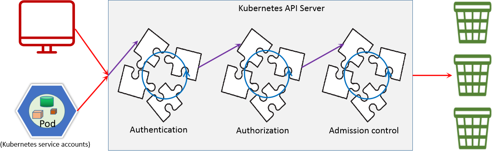
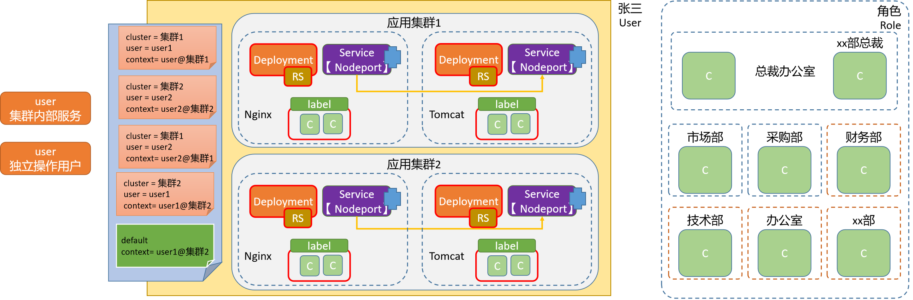
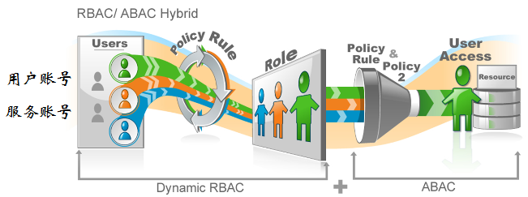
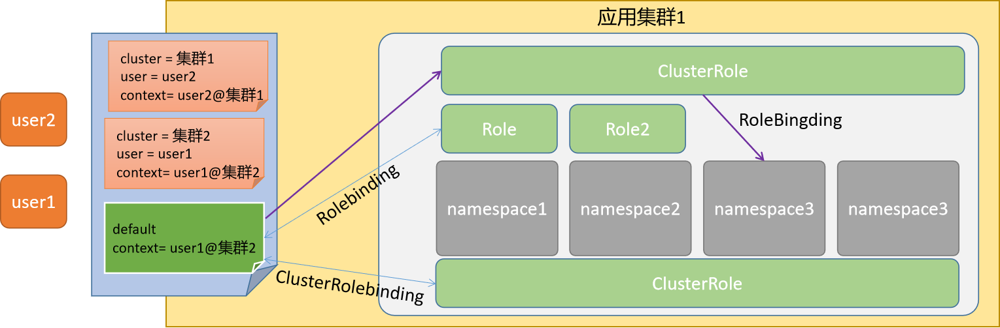
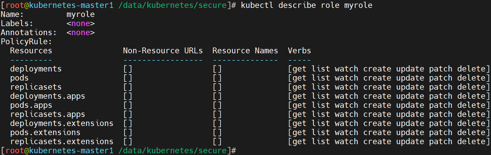
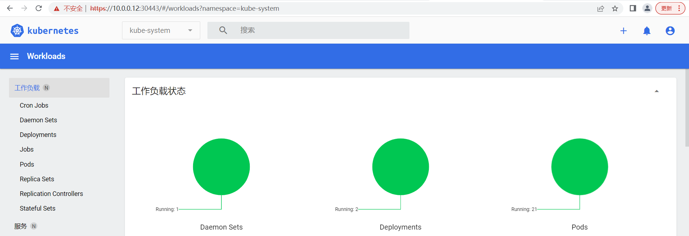
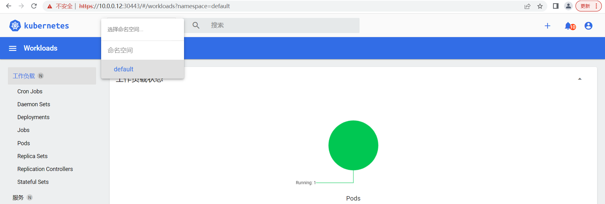
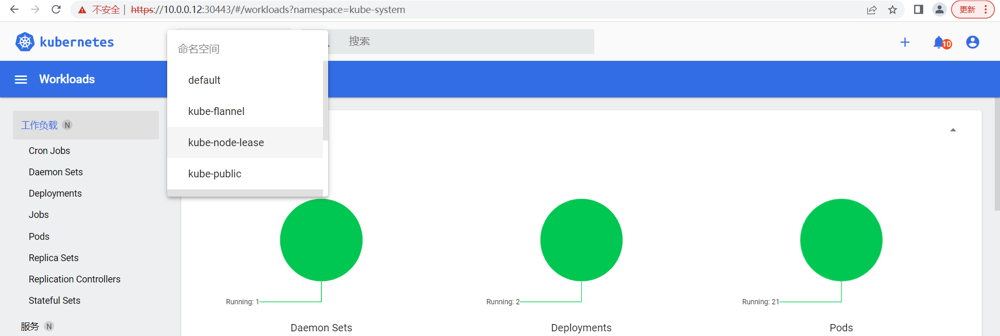

# 1 安全管理

## 1.1 安全框架

### 1.1.1 认证框架

**基础知识**

资源操作


```powershell
用户访问k8s业务应用的流程：
    方法一：无需api_server认证
        用户 -- ingress|service -- pod
    方法二：基于api_server认证
        管理k8s平台上各种应用对象
```

**认证流程**

简介

```powershell
对APIServer的访问一般都要经过的三个步骤，认证(Authn)+授权(Authz)、准入控制(Admission)，它也能在一定程度上提高安全性，不过更多是资源管理方面的作用。
注意：认证和授权功能都是以插件化的方式来实现的，这样可以最大化的用户自定义效果。
```



```powershell
认证(Authn)
	对用户身份进行基本的认证，只允许被当前系统许可的人进入集群内部
授权(Authz)
	不同的用户可以获取不同的资源操作权限，比如普通用户、超级用户、等
准入控制(Admission)
	类似于审计，主要侧重于 操作动作的校验、语法规范的矫正等写操作场景。
```

解析

```powershell
左侧：
	对于k8s来说，它主要面对两种用户：
		普通人类用户(交互模式) - User Account
		集群内部的pod用户(服务进程) - Service Account
中间：
	每个部分都是以插件的方式来整合到 k8s 集群环境中：
	- 认证和授权是按照 插件的顺序进行依次性的检测，并且遵循 "短路模型" 的认证方式
		所谓的"短路"即，失败的时候，到此结束,后续的规则不会进行。
	- 准入控制 由于仅用户写操作场景，所以它不遵循 "短路模型"，而是会全部检测
		原因在于，它要记录为什么不执行，原因是什么，方便后续审计等动作。
```


**小结**

```powershell

```


### 1.1.2 框架解读

学习目标

这一节，我们从 流程解读、对象梳理、小结 三个方面来学习。

**流程解读**

认证

```powershell
认证用户
	在我们的认证范围中，有一个术语叫Subject，它表示我们在集群中基于某些规则和动作尝试操作的对象，在k8s集群中定义了两种类型的subject资源：
	User Account：
		有外部独立服务进行管理的，对于用户的管理集群内部没有一个关联的资源对象
		如果需要操作k8s资源，需要集群内部证书的认证签名。
	Service Account
		通过Kubernetes API 来管理的一些用户帐号，和 namespace 进行关联的
		一般是内部资源对象操作资源的一种方式
```

```powershell
用户组
	单个控制用户的权限台繁琐，可以借助于用户组的机制实现批量用户的自动化管理，主要有以下几种
	system:unauthenticated
		未能通过任何一个授权插件检验的账号的所有未通过认证测试的用户统一隶属的用户组；	
	system:authenticated
		认证成功后的用户自动加入的一个专用组，用于快捷引用所有正常通过认证的用户账号；
	system:serviceaccounts
		所有名称空间中的所有ServiceAccount对象
	system:serviceaccounts:<namespace>
		特定名称空间内所有的ServiceAccount对象
```

```powershell
认证方式
	kubernetes的认证方式主要有两种：
		证书认证 - 本质上就是TLS双向认证
		令牌认证 - 大量手动配置TLS认证比较麻烦，可以将证书生成token进行间接使用。
```

授权

```powershell
	授权主要是在认证的基础上，用于对集群资源的访问控制权限设置，通过检查请求包含的相关属性值，与相对应的访问策略相比较，API请求必须满足某些策略才能被处理。常见授权机制有：
```

```powershell
Node
	主要针对节点的基本通信授权认证，比如kubelet的正常通信。
ABAC(Attribute Based Access Control)：
	基于属性的访问控制，与apiserver服务的本地策略规则紧密相关，一旦变动需要重启。
RBAC(Role Based Access Control)：
	基于角色的访问控制，这是1.6+版本主推的授权策略，可以使用API自定义角色和集群角色，并将角色和特定的用户，用户组，Service Account关联起来，可以用来实现多租户隔离功能（基于namespace资源）
```

准入控制

```powershell
	准入控制(Admission Control)，实际上是一个准入控制器插件列表，发送到APIServer的请求都需要经过这个列表中的每个准入控制器插件的检查，如果某一个控制器插件准入失败，就准入失败。它主要涉及到pod和容器对特定用户和特定权限之间的关联关系。
	比如操作的对象是否存在依赖关系、被操作的对象是否能够增删改查等限制。
```


**对象梳理**

资源对象


对象简介

```powershell
认证对象：SA、token
授权对象：Role、ClusterRole、RoleBinding、ClusterRoleBinding
准入对象：LimitRanger、ResourceQuota、PodSecurityPolicy等
```

**小结**

```powershell

```


## 1.2 认证实践

### 1.2.1 用户实践

学习目标

这一节，我们从 SA实践、UA实践、小结 三个方面来学习。

**SA实践**

资源属性

```powershell
apiVersion: v1  						# ServiceAccount所属的API群组及版本
kind: ServiceAccount  					# 资源类型标识
metadata:
  name <string>  						# 资源名称
  namespace <string>  					# ServiceAccount是名称空间级别的资源
automountServiceAccountToken <boolean>  # 是否让Pod自动挂载API令牌
secrets <[]Object>   					# 以该SA运行的Pod所要使用的Secret对象组成的列表
  apiVersion <string>  					# 引用的Secret对象所属的API群组及版本，可省略
  kind <string>   						# 引用的资源的类型，这里是指Secret，可省略
  name <string>   						# 引用的Secret对象的名称，通常仅给出该字段即可
  namespace <string>  					# 引用的Secret对象所属的名称空间
  uid  <string>   						# 引用的Secret对象的标识符；
imagePullSecrets <[]Object> 			# 引用的用于下载Pod中容器镜像的Secret对象列表
  name <string>   						# docker-registry类型的Secret资源的名称
```

命令解析

```powershell
命令格式：kubectl create serviceaccount NAME [--dry-run] [options]
作用：创建一个"服务账号"
参数详解
    --dry-run=false						模拟创建模式
    --generator='serviceaccount/v1'		设定api版本信息
    -o, --output=''						设定输出信息格式，常见的有：
    										json|yaml|name|template|...
    --save-config=false					保存配置信息
    --template=''						设定配置模板文件
```

简单实践

```powershell
创建专属目录
[root@kubernetes-master1 ~]# mkdir /data/kubernetes/secure -p; cd /data/kubernetes/secure
```

```powershell
手工创建SA账号
[root@kubernetes-master1 /data/kubernetes/secure]# kubectl create serviceaccount mysa
serviceaccount/mysa created

检查效果
[root@kubernetes-master1 /data/kubernetes/secure]# kubectl  get sa mysa
NAME   SECRETS   AGE
mysa   1         9s
```

```powershell
资源清单创建SA
[root@kubernetes-master1 /data/kubernetes/secure]# 01_kubernetes_secure_sa.yaml
apiVersion: v1
kind: ServiceAccount
metadata:
  name: superopsmsb
---
apiVersion: v1
kind: Pod
metadata:
  name: nginx-web
spec:
  containers:
  - name: nginx-web
    image: kubernetes-register.superopsmsb.com/superopsmsb/nginx_web:v0.1
  serviceAccountName: superopsmsb

应用资源清单
[root@kubernetes-master1 /data/kubernetes/secure]# kubectl  apply -f 01_kubernetes_secure_sa.yaml
serviceaccount/superopsmsb created
pod/nginx-web created
```

```powershell
查看资源属性
[root@kubernetes-master1 /data/kubernetes/secure]# kubectl describe pod nginx-web
Name:               nginx-web
... 
Containers:
  nginx-web:
    ...
    Mounts:
      /var/run/secrets/kubernetes.io/serviceaccount from kube-api-access-wqb6w (ro)
...
结果显示：
	用户信息挂载到容器的 /var/run/secrets/kubernetes.io/serviceaccount 目录下了
```

```powershell
容器内部的账号身份信息
[root@kubernetes-master1 /data/kubernetes/secure]# kubectl exec -it nginx-web -- /bin/sh
# ls /var/run/secrets/kubernetes.io/serviceaccount/
ca.crt  namespace  token
```

**UA实践**

简介

```powershell
	所谓的UA其实就是我们平常做CA时候的基本步骤，主要包括如下几步
	1 创建私钥文件
    2 基于私钥文件创建证书签名请求
    3 基于私钥和签名请求生成证书文件
```

1 创建私钥文件

```powershell
给用户 superopsmsb 创建一个私钥，命名成：superopsmsb.key(无加密)
[root@kubernetes-master1 ~]# cd /etc/kubernetes/pki/
[root@kubernetes-master1 /etc/kubernetes/pki]# (umask 077; openssl genrsa -out superopsmsb.key 2048)
G
命令解析：
    genrsa			该子命令用于生成RSA私钥，不会生成公钥，因为公钥提取自私钥
    -out filename	生成的私钥保存至filename文件，若未指定输出文件，则为标准输出
    -numbits		指定私钥的长度，默认1024，该项必须为命令行的最后一项参数
```

2 签名请求

```powershell
用刚创建的私钥创建一个证书签名请求文件：superopsmsb.csr
[root@kubernetes-master1 /etc/kubernetes/pki]# openssl req -new -key  superopsmsb.key -out superopsmsb.csr -subj "/CN=superopsmsb/O=superopsmsb"
参数说明：
    -new  	生成证书请求文件
    -key   	指定已有的秘钥文件生成签名请求，必须与-new配合使用
    -out 	输出证书文件名称
    -subj 	输入证书拥有者信息，这里指定 CN 以及 O 的值，/表示内容分隔
        CN以及O的值对于kubernetes很重要，因为kubernetes会从证书这两个值对应获取相关信息：
        	"CN"：Common Name，用于从证书中提取该字段作为请求的用户名 (User Name)；
        		浏览器使用该字段验证网站是否合法；
        	"O"：Organization，用于分组认证

检查效果：
[root@kubernetes-master1 /etc/kubernetes/pki]# ls superopsmsb.*
superopsmsb.csr  superopsmsb.key
结果显示：
	*.key 是我们的私钥，*.csr是我们的签名请求文件
```

3 生成证书

```powershell
利用Kubernetes集群的CA相关证书对UA文件进行认证
[root@kubernetes-master1 /etc/kubernetes/pki]# openssl x509 -req -in superopsmsb.csr -CA ./ca.crt  -CAkey ./ca.key  -CAcreateserial -out superopsmsb.crt -days 365
Signature ok
subject=/CN=superopsmsb/O=superopsmsb
Getting CA Private Key
参数说明：
    -req   				产生证书签发申请命令
    -in					指定需要签名的请求文件
    -CA 				指定CA证书文件
    -CAkey 			指定CA证书的秘钥文件
    -CAcreateserial	生成唯一的证书序列号
    -x509 				表示输出一个X509格式的证书
    -days 				指定证书过期时间为365天
    -out 				输出证书文件
检查文件效果
[root@kubernetes-master1 /etc/kubernetes/pki]# ls superopsmsb.*
superopsmsb.crt  superopsmsb.csr  superopsmsb.key
结果显示：
	*.crt就是我们最终生成的签证证书
```

```powershell
提取信息效果
]# openssl x509 -in superopsmsb.crt -text -noout
Certificate:
   ...
    Signature Algorithm: sha256WithRSAEncryption
        Issuer: CN=kubernetes
        ...
        Subject: CN=superopsmsb, O=superopsmsb
结果显示：
	Issuer: 表示是哪个CA机构帮我们认证的
	我们关注的重点在于Subject内容中的请求用户所属的组信息
```

**小结**

```powershell

```


### 1.2.2 集群用户

学习目标

这一节，我们从 config基础、简单实践、小结 三个方面来学习。

**config基础**

简介

```powershell
	根据我们之前对kubernetes集群的了解，我们主要是通过config文件来进入到kubernetes集群内部的，然后具有操作相关资源的权限。
```



```powershell
在config文件内部主要做了四件事情：
	1 创建登录k8s集群的用户
		基于证书和秘钥信息创建用户
	2 创建登录k8s集群的地址
	3 将登录用户和目标k8s集群关联在一起，形成k8s集群入口
	4 设定默认的k8s集群入口
	
注意：
	这里的k8s集群入口其实就类似于我们 通过ssh登录远程主机的一个入口，示例如下：
		ssh root@10.0.0.12
```

命令解读

```powershell
集群操作
	get-clusters    显示 kubeconfig 文件中定义的集群
	delete-cluster  删除 kubeconfig 文件中指定的集群
	set-cluster     Set a cluster entry in kubeconfig
	
用户操作 
	delete-user     Delete the specified user from the kubeconfig
	get-users       Display users defined in the kubeconfig
	set-credentials Set a user entry in kubeconfig
	
上下文操作 
	current-context Display the current-context
	delete-context  删除 kubeconfig 文件中指定的 context
	get-contexts    描述一个或多个 contexts
	rename-context  Rename a context from the kubeconfig file
	set-context     Set a context entry in kubeconfig
	use-context     Set the current-context in a kubeconfig file
	
其他操作 
    set             Set an individual value in a kubeconfig file
    unset           Unset an individual value in a kubeconfig file	  
    view            显示合并的 kubeconfig 配置或一个指定的 kubeconfig 文件
```

**简单实践**

创建用户

```powershell
创建用户
[root@kubernetes-master1 /etc/kubernetes/pki]# kubectl config set-credentials superopsmsb --client-certificate=./superopsmsb.crt --client-key=./superopsmsb.key  --embed-certs=true --kubeconfig=/tmp/superopsmsb.conf
参数详解：
    set-credentials 	子命令的作用就是给kubeconfig认证文件创建一个用户条目
    --client-certificate=path/to/certfile	指定用户的签证证书文件
    --client-key=path/to/keyfile				指定用户的私钥文件
    --embed-certs=true，在kubeconfig中为用户条目嵌入客户端证书/密钥，默认值是false，
    --kubeconfig=/path/to/other_config.file 表示将属性信息单独输出到一个文件，不指定的话，表示存到默认的 ~/.kube/config文件中
```

创建集群

```powershell
创建集群
[root@kubernetes-master1 /etc/kubernetes/pki]# kubectl config set-cluster mycluster  --server="https://10.0.0.200:6443" --certificate-authority=/etc/kubernetes/pki/ca.crt --embed-certs=true --kubeconfig=/tmp/superopsmsb.conf
参数详解：
	--server=cluster_api_server
	--certificate-authority=path/to/certificate/authority
```

关联用户和集群

```powershell
配置上下文信息
[root@kubernetes-master1 /etc/kubernetes/pki]# kubectl  config set-context superopsmsb@mycluster --cluster=mycluster --user=superopsmsb  --kubeconfig=/tmp/superopsmsb.conf
属性详解
    --cluster=cluster_nickname		关联的集群名称
    --user=user_nickname			关联的用户名称
    --namespace=namespace			可以设置该生效的命名空间
```

设定默认的入口

```powershell
更改默认登录kubernetes的用户
[root@kubernetes-master1 /etc/kubernetes/pki]# kubectl config use-context superopsmsb@mycluster --kubeconfig=/tmp/superopsmsb.conf
```

测试效果

```powershell
查看配置文件内容
[root@kubernetes-master1 /etc/kubernetes/pki]# kubectl config view --kubeconfig=/tmp/superopsmsb.conf
apiVersion: v1
clusters:
- cluster:
    certificate-authority-data: DATA+OMITTED
    server: https://10.0.0.200:6443
  name: mycluster
contexts:
- context:
    cluster: mycluster
    user: superopsmsb
  name: superopsmsb@mycluster
current-context: superopsmsb@mycluster
kind: Config
preferences: {}
users:
- name: superopsmsb
  user:
    client-certificate-data: REDACTED
    client-key-data: REDACTED
```

```powershell
查看资源测试
[root@kubernetes-master1 /etc/kubernetes/pki]# kubectl get pod --kubeconfig=/tmp/superopsmsb.conf
Error from server (Forbidden): pods is forbidden: User "superopsmsb" cannot list resource "pods" in API group "" in the namespace "default"
结果显示：
	虽然提示报错，但是这也证明了用户已经被kubernetes承认了
```


**小结**

```powershell

```


### 1.2.3 授权基础

学习目标

这一节，我们从 基础知识、Role实践、clusterRole实践、小结 四个方面来学习。

**基础知识**

授权场景


授权机制

```powershell
	RBAC使用rbac.authorization.k8s.io API Group 来实现授权决策，允许管理员通过 Kubernetes API 动态配置策略，要启用RBAC，需要在 apiserver 中添加参数--authorization-mode=RBAC，kubeadm安装的集群默认开启了RBAC，我们可以通过查看 Master 节点上 apiserver 的静态Pod定义文件：
[root@kubernetes-master1 ~]# grep authorization-mode /etc/kubernetes/manifests/kube-apiserver.yaml
    - --authorization-mode=Node,RBAC
```

```powershell
	Kubernetes的基本特性就是它的所有资源对象都是模型化的 API 对象，我们可以基于api-server对各种资源进行增、删、改、查等操作，但是这些操作涉及到的不仅仅是资源本身和动作，而且还涉及到资源和动作之间的内容，比如api的分组版本和资源和api的关联即权限授权等。
```

授权



```powershell
	所谓的授权，其实指的是，将某些subject对象赋予执行某些资源动作的权限。我们有时候会将其称为Group(权限组)，而这个组其实是有两部分组成：组名和组关联(也称绑定)。
简单来说：所谓的授权，其实是为用户授予xx角色
	关于kubernetes的授权属性，主要包括如下三个层次：namespace级别、cluster级别、混合级别
```

授权级别



```powershell
namespace级别
	rules 
		- 规则，是一组属于不同 API Group 资源上的权限操作的集合
	role 
		- 表示在一个namespace中基于rules使用资源的权限，主要涉及到操作和对象
	RoleBingding 
		- 将Subject和Role绑定在一起，表示Subject具有指定资源的role操作权限
```

```powershell
cluster级别
	ClusterRole 
		- 表示在一个Cluster中基于rules使用资源的权限
	ClusterRoleBingding 
		- 将Subject和ClusterRole绑定在一起，表示Subject指定资源的ClusterRole操作权限
```

```powershell
混合级别
	RoleBingding 
		- 将Subject基于RoleBingding与ClusterRole绑定在一起
		- 表示Subject可以使用所有ClusterRole中指定资源的role角色
		- 但是限制在了只能操作某个命名空间的资源。
		- 也就是所谓的"权限降级"
```

```
场景1：
	多个namespace中的role角色都一致，如果都使用内部的RoleBingding的话，每个namespace都必须单独创建role，而使用ClusterRole的话，只需要一个就可以了，大大的减轻批量使用namespace中的RoleBingding 操作。
场景2：
	我们对A用户要提升权限，但是，由于A处于考察期，那么我们暂时给他分配一个区域，测试一下它的运行效果。生活中的场景，提升张三为公司副总裁，但是由于是新手，所以加了一个限制 -- 主管销售范围的副总裁。
```


**简单实践**

属性解析

```powershell
我们可以使用 kubectl explain role 的方式来查看一下Role的属性信息：

    apiVersion <string>
    kind <string>
    metadata     <Object>
    rules        <[]Object>
      apiGroups    			<[]string>
      nonResourceURLs      	<[]string>
      resourceNames        	<[]string>
      resources    			<[]string>
      verbs        			<[]string> -required-
    结果显示：
        对于role来说，其核心的内容主要是rules的权限规则
        在这么多rules属性中，最重要的是verbs权限条目，而且所有的属性都是可以以列表的形式累加存在
```

```powershell
命令行创建role，查看具有pod资源的get、list权限的属性信息
[root@kubernetes-master1 ~]# kubectl create role pods-reader --verb=get,list --resource=pods --dry-run -o yaml
apiVersion: rbac.authorization.k8s.io/v1
kind: Role
metadata:
  creationTimestamp: null		时间信息
  name: pods-reader				role的名称
rules:							授权规则
- apiGroups:					操作的对象
  - ""								所有权限
  resources:					资源对象
  - pods							pod的对象
  verbs:							对pod允许的权限
  - get								获取
  - list								查看
结果显示：
    对于一个role必备的rules来说，他主要有三部分组成：apiGroup、resources、verbs
    apiGroups	设定包含资源的api组，如果是多个，表示只要属于api组范围中的任意资源都可以操作
    resources	位于apiGroup范围中的某些具体的资源对象
    verbs		针对具体资源对象的一些具体操作
注意：
	关于api组的信息获取，可以参照https://kubernetes.io/docs/reference/#api-reference
```

简单实践

```powershell
按照上面的role格式，我们写一个role资源文件,允许用户操作 Deployment、Pod、RS 的所有权限
[root@kubernetes-master1 /data/kubernetes/secure]# 02_kubernetes_secure_role.yaml
apiVersion: rbac.authorization.k8s.io/v1
kind: Role
metadata:
  name: myrole
rules:
- apiGroups: ["", "extensions", "apps"]
  resources: ["pods", "deployments", "replicasets"]
  verbs: ["get", "list", "watch", "create", "update", "patch", "delete"]
属性解析：
    Pod属于 core 的 API Group，在YAML中用空字符就可以，Deployment 属于 apps 的 API Group，ReplicaSets属于extensions这个 API Group，所以 rules 下面的 apiGroups 的内容：["", "extensions", "apps"]
    verbs是可以对这些资源对象执行的操作，如果是所有动作，也可以使用["*"]来代替。
```

查看资源对象

```powershell
初始化实例对象
[root@kubernetes-master1 /data/kubernetes/secure]# kubectl  apply -f 02_kubernetes_secure_role.yaml
role.rbac.authorization.k8s.io/myrole created

查看效果
[root@kubernetes-master1 /data/kubernetes/secure]# kubectl describe role myrole 
```



Role用户授权实践

```powershell
限定用户只能访问命名空间资源
[root@kubernetes-master1 /data/kubernetes/secure]# kubectl create rolebinding super-rolebind --role=myrole --user=superopsmsb
rolebinding.rbac.authorization.k8s.io/super-rolebind created

查看资源效果
[root@kubernetes-master1 /data/kubernetes/secure]# kubectl  get pod --kubeconfig=/tmp/superopsmsb.conf
NAME        READY   STATUS    RESTARTS   AGE
nginx-web   1/1     Running   0          56m
[root@kubernetes-master1 /data/kubernetes/secure]# kubectl  get svc --kubeconfig=/tmp/superopsmsb.conf
Error from server (Forbidden): services is forbidden: User "superopsmsb" cannot list resource "services" in API group "" in the namespace "default"
[root@kubernetes-master1 /data/kubernetes/secure]# kubectl  get svc --kubeconfig=/tmp/superopsmsb.conf -n kube-system
Error from server (Forbidden): services is forbidden: User "superopsmsb" cannot list resource "services" in API group "" in the namespace "kube-system"

清理授权
[root@kubernetes-master1 /data/kubernetes/secure]# kubectl delete rolebindings super-rolebind
rolebinding.rbac.authorization.k8s.io "super-rolebind" deleted
```

**ClusterRole实践**

属性解析

```powershell
[root@kubernetes-master1 /data/kubernetes/secure]# kubectl explain clusterrole
aggregationRule      <Object>
apiVersion <string>
kind <string>
metadata     <Object>
rules        <[]Object>
    apiGroups    			<[]string>
    nonResourceURLs      	<[]string>
    resourceNames        	<[]string>
    resources    			<[]string>
    verbs        			<[]string> -required-
结果显示：
	clusterrole相对于role的属性多了一个集中控制器的属性aggregationRule，而这是一个可选的属性
```

```powershell
命令行创建clusterrole，查看具有pod资源的get、list权限的属性信息
[root@kubernetes-master1 ~]# kubectl create clusterrole myclusterrole --verb=get,list --resource=pods --dry-run -o yaml
apiVersion: rbac.authorization.k8s.io/v1
kind: ClusterRole
metadata:
  creationTimestamp: null		时间信息
  name: myclusterrole			role的名称
rules:							授权规则
- apiGroups:					操作的对象
  - ""								所有权限
  resources:					资源对象
  - pods							pod的对象
  verbs:							对pod允许的权限
  - get								获取
  - list								查看
结果显示：
    ClusterRole与role的配置一样，也由三部分组成：apiGroup、resources、verbs
```

简单实践

```powershell
按照上面的clusterrole格式，我们写一个clusterrole资源文件,允许用户操作 Deployment、Pod、RS 的所有权限
[root@kubernetes-master1 /data/kubernetes/secure]# 03_kubernetes_secure_clusterrole.yaml
apiVersion: rbac.authorization.k8s.io/v1
kind: ClusterRole
metadata:
  name: myclusterrole
rules:
- apiGroups: [""]
  resources: ["pods"]
  verbs: ["get", "list", "watch"]
  
创建资源对象
[root@kubernetes-master1 /data/kubernetes/secure]# kubectl  apply -f 03_kubernetes_secure_clusterrole.yaml
clusterrole.rbac.authorization.k8s.io/myclusterrole created

查看效果
[root@kubernetes-master1 /data/kubernetes/secure]# kubectl describe clusterrole myclusterrole
Name:         myclusterrole
Labels:       <none>
Annotations:  <none>
PolicyRule:
  Resources  Non-Resource URLs  Resource Names  Verbs
  ---------  -----------------  --------------  -----
  pods       []                 []              [get list watch]
```


ClusterRole用户授权实践

```powershell
限定用户只能访问命名空间资源
[root@kubernetes-master1 /data/kubernetes/secure]# kubectl create clusterrolebinding super-clusterrolebind --clusterrole=myclusterrole --user=superopsmsb

查看资源效果
[root@kubernetes-master1 /data/kubernetes/secure]# kubectl  get pod --kubeconfig=/tmp/superopsmsb.conf
NAME        READY   STATUS    RESTARTS   AGE
nginx-web   1/1     Running   0          68m
[root@kubernetes-master1 /data/kubernetes/secure]# kubectl  get svc --kubeconfig=/tmp/superopsmsb.conf
Error from server (Forbidden): services is forbidden: User "superopsmsb" cannot list resource "services" in API group "" in the namespace "default"
[root@kubernetes-master1 /data/kubernetes/secure]# kubectl  get pod --kubeconfig=/tmp/superopsmsb.conf -n kube-system
NAME                                         READY   STATUS    RESTARTS         AGE
coredns-5d555c984-hzq8q                      1/1     Running   0                9h

清理授权
[root@kubernetes-master1 /data/kubernetes/secure]# kubectl delete clusterrolebinding super-clusterrolebind
rolebinding.rbac.authorization.k8s.io "super-clusterrolebind" deleted
```


**小结**

```powershell

```

### 1.2.4 授权案例

学习目标

这一节，我们从 案例解读、文件实践、小结 三个方面来学习。

**案例解读**

简介

```powershell
	接下来我们在kubernetes的默认dashboard上面，来综合演示一下用户的安全管理操作。
```


```powershell
对于dashboard来说，他的认证方法主要有两种：令牌认证和文件认证。由于涉及面比较多，我们通过两节的内容来进行讲解，在这里我们用令牌的方式来学习完整的服务认证流程。

令牌认证	
	- 基于认证用户的唯一令牌来进行认证，有默认的超时机制，一会儿就失效了
文件认证
	- 基于账号的token信息，创建kubeconfig文件，实现长久的认证方式。
```

```powershell
根据我们之前对serviceaccount的工作流程的学习，对于dashboard的配置也应该遵循相应的操作流程：
	1、创建专用的serviceaccount
	2、创建对应的权限角色
	3、将serviceaccount和权限角色进行关联绑定
```

**令牌认证**

集群级别

```powershell
资源定义文件方式 
[root@kubernetes-master1 /data/kubernetes/secure]# 04_kubernetes_secure_dashboard_cluster.yaml
kind: ClusterRoleBinding
apiVersion: rbac.authorization.k8s.io/v1
metadata:
  name: dashboard-admin
  annotations:
    rbac.authorization.kubernetes.io/autoupdate: "true"
roleRef:
  kind: ClusterRole
  name: cluster-admin
  apiGroup: rbac.authorization.k8s.io
subjects:
- kind: ServiceAccount
  name: dashboard-admin
  namespace: kube-system

---
apiVersion: v1
kind: ServiceAccount
metadata:
  name: dashboard-admin
  namespace: kube-system
  labels:
    kubernetes.io/cluster-service: "true"
    addonmanager.kubernetes.io/mode: Reconcile
    
创建资源对象
[root@kubernetes-master1 /data/kubernetes/secure]# kubectl  apply -f 04_kubernetes_secure_dashboard_cluster.yaml
clusterrolebinding.rbac.authorization.k8s.io/dashboard-admin created
serviceaccount/dashboard-admin created
```

```powershell
获取token信息
[root@kubernetes-master1 /data/kubernetes/secure]# kubectl describe secrets -n kube-system $(kubectl -n kube-system get secret | awk '/dashboard-admin/{print $1}')
Name:         dashboard-admin-token-4cdrd
...
token:      eyJhbG...qU3__b9ITbLHEytrA

复制token到浏览器查看效果
```



用户级别

```powershell
资源定义文件方式 
[root@kubernetes-master1 /data/kubernetes/secure]# 05_kubernetes_secure_dashboard_namespace.yaml
apiVersion: v1
kind: ServiceAccount
metadata:
  name: dashboard-ns
  namespace: default
---
apiVersion: rbac.authorization.k8s.io/v1
kind: RoleBinding
metadata:
  name: dashboard-ns
  namespace: default
roleRef:
  apiGroup: rbac.authorization.k8s.io
  kind: ClusterRole
  name: admin
subjects:
- kind: ServiceAccount
  name: dashboard-ns
  namespace: default
    
创建资源对象
[root@kubernetes-master1 /data/kubernetes/secure]# kubectl  apply -f 05_kubernetes_secure_dashboard_namespace.yaml serviceaccount/dashboard-ns created
rolebinding.rbac.authorization.k8s.io/dashboard-ns created
```

```powershell
获取token信息
[root@kubernetes-master1 /data/kubernetes/secure]# kubectl describe secrets $(kubectl get secret | awk '/dashboard-ns/{print $1}')
Name:         dashboard-ns-token-btq6w
...
token:       eyJhbG...qU3__8Kqc0Q

复制token到浏览器查看效果
```

**文件实践**

namespace文件实践

```powershell
设置集群信息
kubectl config set-cluster kubernetes --certificate-authority=/etc/kubernetes/pki/ca.crt  --server="https://10.0.0.200:6443" --embed-certs=true --kubeconfig=/root/dashboard-ns.conf
```

```powershell
获取秘钥信息
[root@kubernetes-master1 /data/kubernetes/secure]# NAMESPACE_TOKEN=$(kubectl get secret  $(kubectl get secret | awk '/dashboard-ns/{print $1}')  -o jsonpath={.data.token} |base64 -d)

设置用户信息
kubectl config set-credentials dashboard-ns --token=$NAMESPACE_TOKEN --kubeconfig=/root/dashboard-ns.conf 
```

```powershell
配置上下文信息
kubectl config set-context dashboard-ns@kubernetes --cluster=kubernetes --user=def-ns-admin --kubeconfig=/root/dashboard-ns.conf
切换用户
kubectl config use-context dashboard-ns@kubernetes --kubeconfig=/root/dashboard-ns.conf 
```

```powershell
查看效果
[root@kubernetes-master1 /data/kubernetes/secure]# kubectl  config view --kubeconfig=/root/dashboard-ns.conf
apiVersion: v1
clusters:
- cluster:
    certificate-authority-data: DATA+OMITTED
    server: https://10.0.0.200:6443
  name: kubernetes
contexts:
- context:
    cluster: kubernetes
    user: def-ns-admin
  name: dashboard-ns@kubernetes
current-context: dashboard-ns@kubernetes
kind: Config
preferences: {}
users:
- name: dashboard-ns
  user:
    token: REDACTED
- name: def-ns-admin
  user:
    token: REDACTED
```

```powershell
下载dashboard-ns.conf到windows主机，然后在浏览器上，以kubeconfig文件方式登录dashboard
```


cluster文件实践

```powershell
设置集群信息
kubectl config set-cluster kubernetes --certificate-authority=/etc/kubernetes/pki/ca.crt  --server="https://10.0.0.200:6443" --embed-certs=true --kubeconfig=/root/dashboard-cluster.conf
```

```powershell
获取秘钥信息
[root@kubernetes-master1 /data/kubernetes/secure]# CLUSTER_TOKEN=$(kubectl get secret -n kube-system $(kubectl get secret -n kube-system | awk '/dashboard-admin/{print $1}')  -o jsonpath={.data.token} |base64 -d)

设置用户信息
kubectl config set-credentials dashboard-cluster --token=$CLUSTER_TOKEN --kubeconfig=/root/dashboard-cluster.conf 
```

```powershell
配置上下文信息
kubectl config set-context dashboard-cluster@kubernetes --cluster=kubernetes --user=dashboard-cluster --kubeconfig=/root/dashboard-cluster.conf
切换用户
kubectl config use-context dashboard-cluster@kubernetes --kubeconfig=/root/dashboard-cluster.conf 
```

```powershell
查看效果
[root@kubernetes-master1 /data/kubernetes/secure]# kubectl config view --kubeconfig=/root/dashboard-cluster.conf
apiVersion: v1
clusters:
- cluster:
    certificate-authority-data: DATA+OMITTED
    server: https://10.0.0.200:6443
  name: kubernetes
contexts:
- context:
    cluster: kubernetes
    user: dashboard-cluster
  name: dashboard-cluster@kubernetes
current-context: dashboard-cluster@kubernetes
kind: Config
preferences: {}
users:
- name: dashboard-cluster
  user:
    token: REDACTED
```

```powershell
下载dashboard-cluster.conf到windows主机，然后在浏览器上，以kubeconfig文件方式登录dashboard
```



**小结**

```powershell

```


