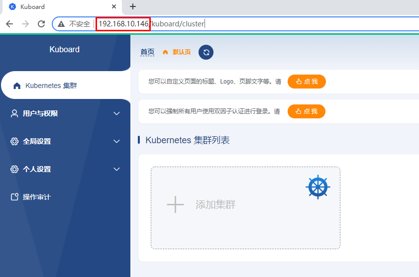
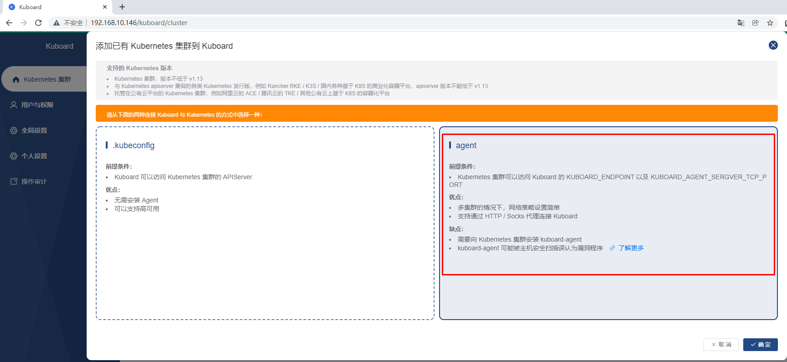
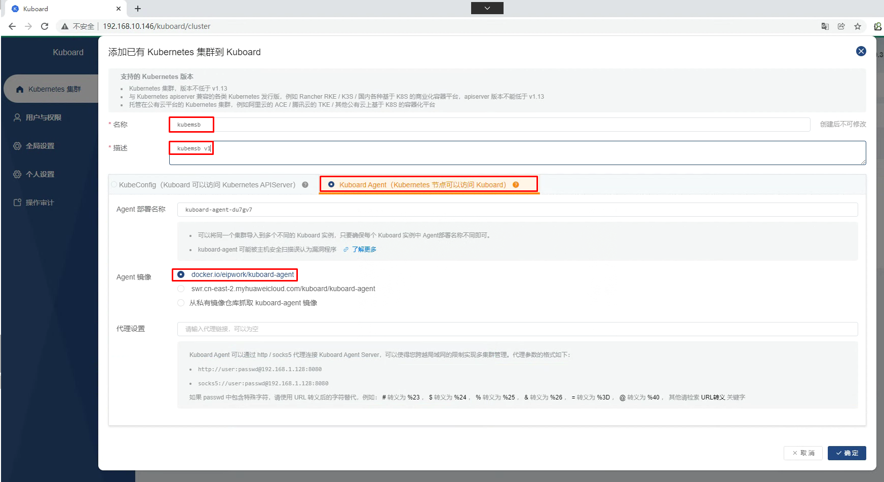
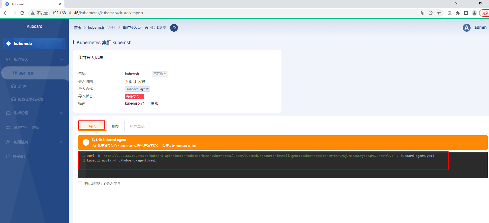
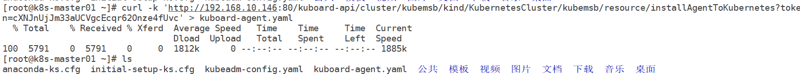
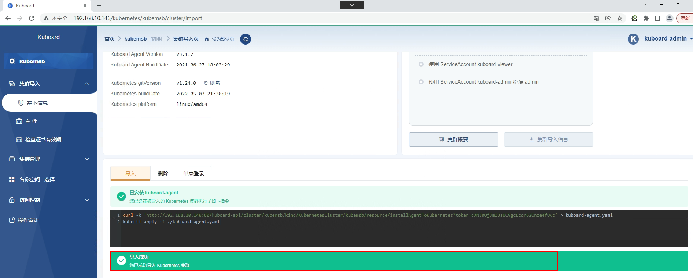
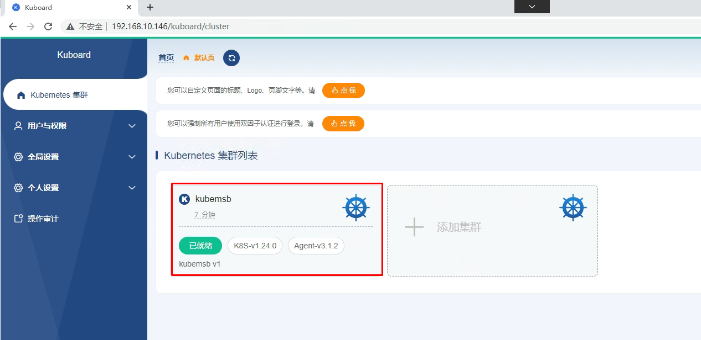
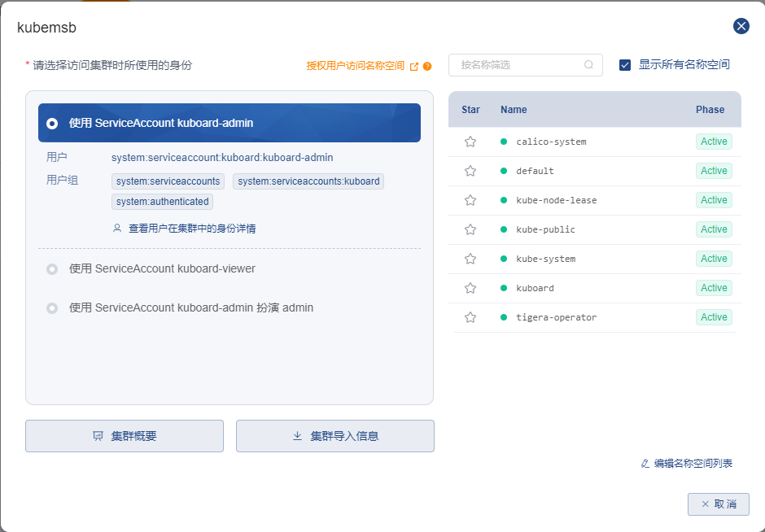
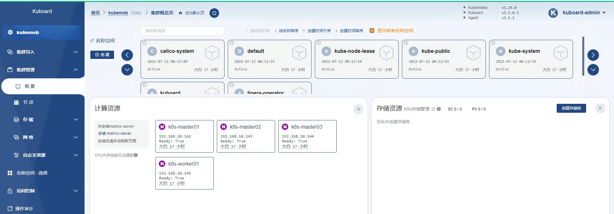

# 使用sealos部署kubernetes集群并实现集群管理

> 本次使用4台主机完成，其中3台主机为master节点，1台主机为worker节点。

# 一、主机准备

## 1.1 配置主机名

~~~powershell
# hostnamectl set-hostname xxx

k8s-master01
k8s-master02
k8s-master03
k8s-worker01
~~~

## 1.2 设置静态IP地址

| 序号 | 主机名       | 主机IP         |
| ---- | ------------ | -------------- |
| 1    | k8s-master01 | 192.168.10.142 |
| 2    | k8s-master02 | 192.168.10.143 |
| 3    | k8s-master03 | 192.168.10.144 |
| 4    | k8s-worker01 | 192.168.10.145 |

~~~powershell
# vim /etc/sysconfig/network-scripts/ifcfg-ens33
TYPE="Ethernet"
PROXY_METHOD="none"
BROWSER_ONLY="no"
BOOTPROTO="none"
DEFROUTE="yes"
IPV4_FAILURE_FATAL="no"
IPV6INIT="yes"
IPV6_AUTOCONF="yes"
IPV6_DEFROUTE="yes"
IPV6_FAILURE_FATAL="no"
IPV6_ADDR_GEN_MODE="stable-privacy"
NAME="ens33"
UUID="ec87533a-8151-4aa0-9d0f-1e970affcdc6"
DEVICE="ens33"
ONBOOT="yes"
IPADDR="192.168.10.xxx"
PREFIX="24"
GATEWAY="192.168.10.2"
DNS1="119.29.29.29"
~~~

## 1.3 配置主机名与IP地址解析

> 下面解析是管理员添加，sealos在运行过程中，也会自动添加主机名与IP地址解析关系。

~~~powershell
# /etc/hosts
192.168.10.142 k8s-master01
192.168.10.143 k8s-master02
192.168.10.144 k8s-master03
192.168.10.145 k8s-worker01
~~~

## 1.4 升级内核

~~~powershell
rpm --import https://www.elrepo.org/RPM-GPG-KEY-elrepo.org

yum -y install https://www.elrepo.org/elrepo-release-7.0-4.el7.elrepo.noarch.rpm

yum --enablerepo="elrepo-kernel" -y install kernel-lt.x86_64

awk -F \' '$1=="menuentry " {print i++ " : " $2}' /etc/grub2.cfg

grub2-set-default "CentOS Linux (5.4.204-1.el7.elrepo.x86_64) 7 (Core)"

reboot
~~~

# 二、sealos准备

~~~powershell
wget -c https://sealyun-home.oss-cn-beijing.aliyuncs.com/sealos-4.0/latest/sealos-amd64 -O sealos &&     chmod +x sealos && mv sealos /usr/bin
~~~

~~~powershell
# sealos version
{"gitVersion":"4.0.0","gitCommit":"7146cfe","buildDate":"2022-06-30T14:24:31Z","goVersion":"go1.17.11","compiler":"gc","platform":"linux/amd64"}
~~~

# 三、使用sealos部署kubernetes集群

> kubernetes集群默认使用containerd

~~~powershell
sealos run labring/kubernetes:v1.24.0 labring/calico:v3.22.1     --masters 192.168.10.142,192.168.10.143,192.168.10.144     --nodes 192.168.10.145     --passwd centos
~~~

~~~powershell
# kubectl get nodes
NAME           STATUS   ROLES           AGE   VERSION
k8s-master01   Ready    control-plane   16h   v1.24.0
k8s-master02   Ready    control-plane   16h   v1.24.0
k8s-master03   Ready    control-plane   16h   v1.24.0
k8s-worker01   Ready    <none>          16h   v1.24.0
~~~

~~~powershell
# kubectl get pods -n kube-system
NAME                                   READY   STATUS    RESTARTS      AGE
coredns-6d4b75cb6d-59ph5               1/1     Running   1 (15h ago)   16h
coredns-6d4b75cb6d-wz6tx               1/1     Running   1 (15h ago)   16h
etcd-k8s-master01                      1/1     Running   1 (15h ago)   16h
etcd-k8s-master02                      1/1     Running   1 (15h ago)   16h
etcd-k8s-master03                      1/1     Running   1 (15h ago)   16h
kube-apiserver-k8s-master01            1/1     Running   3 (15h ago)   16h
kube-apiserver-k8s-master02            1/1     Running   1 (15h ago)   16h
kube-apiserver-k8s-master03            1/1     Running   1 (15h ago)   16h
kube-controller-manager-k8s-master01   1/1     Running   3 (15h ago)   16h
kube-controller-manager-k8s-master02   1/1     Running   1 (15h ago)   16h
kube-controller-manager-k8s-master03   1/1     Running   1 (15h ago)   16h
kube-proxy-5l26r                       1/1     Running   1 (15h ago)   16h
kube-proxy-cfbkh                       1/1     Running   1 (15h ago)   16h
kube-proxy-g92fs                       1/1     Running   1 (15h ago)   16h
kube-proxy-zsjxv                       1/1     Running   1 (15h ago)   16h
kube-scheduler-k8s-master01            1/1     Running   3 (15h ago)   16h
kube-scheduler-k8s-master02            1/1     Running   1 (15h ago)   16h
kube-scheduler-k8s-master03            1/1     Running   1 (15h ago)   16h
kube-sealyun-lvscare-k8s-worker01      1/1     Running   1 (15h ago)   16h
~~~

# 四、使用kuboard实现k8s集群托管

| 序号 | 主机名         | 主机IP         |
| ---- | -------------- | -------------- |
| 1    | kuboard-server | 192.168.10.146 |

## 4.1 kuboard部署及访问

~~~powershell
wget https://mirrors.aliyun.com/docker-ce/linux/centos/docker-ce.repo -O /etc/yum.repos.d/docker-ce.repo
~~~

~~~powershell
yum -y install docker-ce
~~~

~~~powershell
systemctl enable --now docker
~~~

~~~powershell
docker run -d   --restart=unless-stopped   --name=kuboard   -p 80:80/tcp   -p 10081:10081/tcp   -e KUBOARD_ENDPOINT="http://192.168.10.146:80"   -e KUBOARD_AGENT_SERVER_TCP_PORT="10081"   -v /root/kuboard-data:/data   eipwork/kuboard:v3
~~~

> 用户名和密码分别为：admin及Kuboard123

## 4.2 kuboard添加k8s集群

~~~powershell
[root@k8s-master01 ~]# kubectl apply -f kuboard-agent.yaml

namespace/kuboard created
serviceaccount/kuboard-admin created
clusterrolebinding.rbac.authorization.k8s.io/kuboard-admin-crb created
serviceaccount/kuboard-viewer created
clusterrolebinding.rbac.authorization.k8s.io/kuboard-viewer-crb created
deployment.apps/kuboard-agent-du7gv7 created
deployment.apps/kuboard-agent-du7gv7-2 created
~~~

~~~powershell
[root@k8s-master01 ~]# kubectl get pods -n kuboard
NAME                                      READY   STATUS    RESTARTS   AGE
kuboard-agent-du7gv7-2-84f65f77b8-rcb4x   1/1     Running   0          54s
kuboard-agent-du7gv7-56c7cb9564-m78qx     1/1     Running   0          54s
~~~

