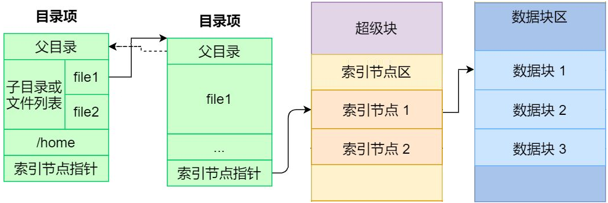
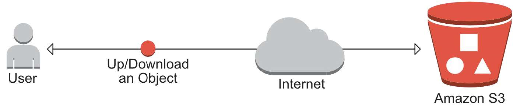
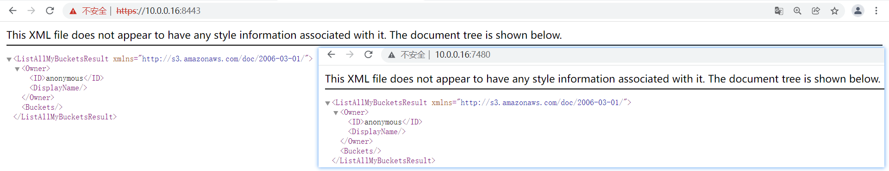
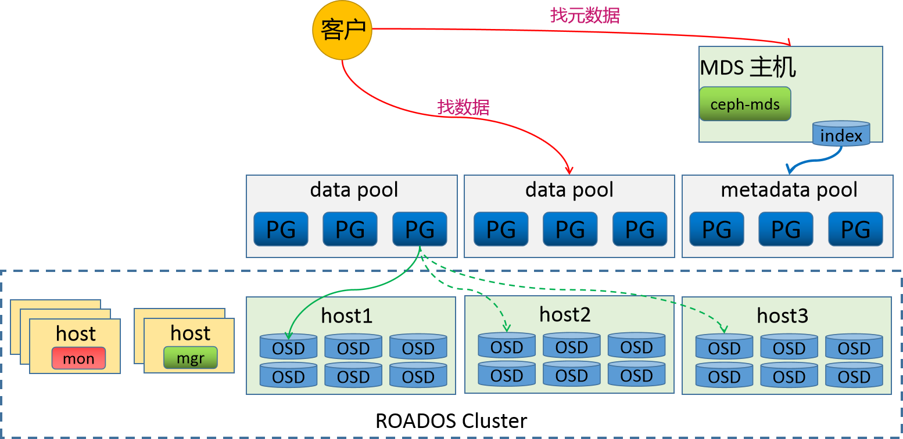
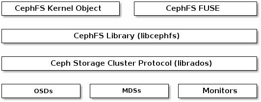
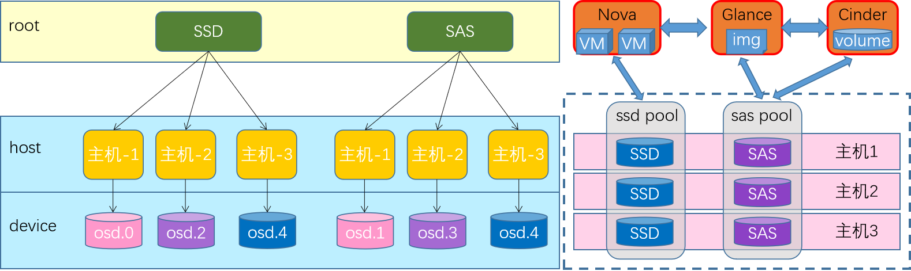
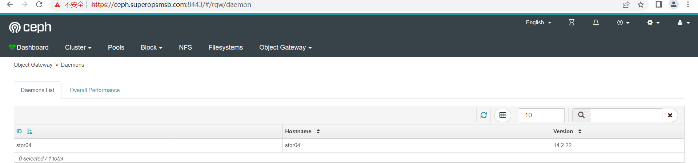
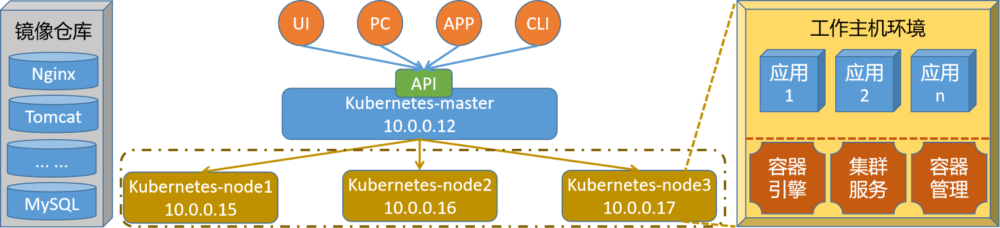
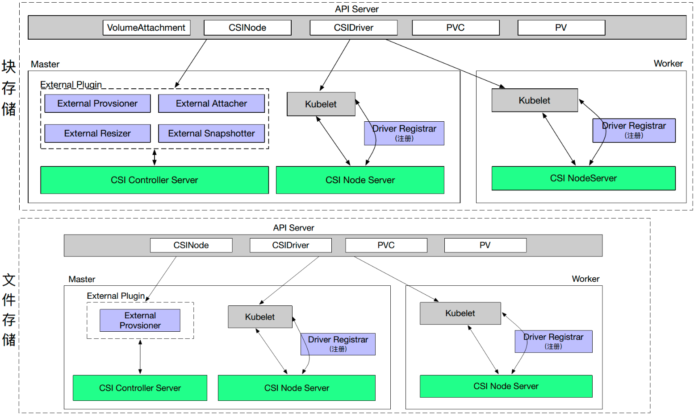

# 存储解决方案 Ceph

# 1 快速入门

## 1.1 基础知识

### 1.1.1 存储基础

学习目标

这一节，我们从 基础知识、文件系统、小结 三个方面来学习。

**基础知识**

存储基础

```powershell
	我们知道，对于一个计算机设备来说，其存储功能是非常重要的，也就是说，任何一台电脑上，必须包含一个设备--磁盘。这个磁盘就是用于数据存储的目的的。
```

```powershell
常见的存储设备接口：
DAS设备：IDE、SATA、SCSI、SAS、USB
	无论是那种接口，他都是存储设备驱动下的磁盘设备，而磁盘设备其实就是一种存储，这种存储是直接接入到主板总线上去的。
	- 基于数据块来进行访问
	- 基于服务器方式实现互联访问，操作简单、成本低。
NAS设备：NFS、CIFS
	几乎所有的网络存储设备基本上都是以文件系统样式进行使用，无法进一步格式化操作。
	- 基于文件系统方式访问
	- 没有网络区域限制，支持多种协议操作文件。
SAN:scsi协议、FC SAN、iSCSI
	基于SAN方式提供给客户端操作系统的是一种块设备接口，所以这些设备间主要是通过scsi协议来完成正常的通信。
	scsi的结构类似于TCP/IP协议，也有很多层，但是scsi协议主要是用来进行存储数据操作的。既然是分层方式实现的，那就是说，有部分层可以被替代。比如将物理层基于FC方式来实现，就形成了FCSAN，如果基于以太网方式来传递数据，就形成了iSCSI模式。
	- 基于数据块来实现访问
	- 不受服务器约束，通过存储池实现资源的高效利用，扩展性好
```


存储使用

```powershell
	对于存储的使用，我们需要借助于文件系统的方式来实现，而存储在使用前往往需要进行格式化。
```

**文件系统**

简介

```powershell
	文件系统的基本数据单位是文件，它的目的是对磁盘上的文件进行组织管理，那组织的方式不同，就会形成不同的文件系统。	Linux 文件系统会为每个文件分配两个数据结构：索引节点(index node)和目录项(directory entry)，它们主要用来记录文件的元信息和目录层次结构。

索引节点 
	- 用来记录文件的元信息，比如 inode 编号、文件大小、访问权限、创建时间、等信息。
	- 索引节点是文件的唯一标识，它们之间一一对应，也同样都会被存储在硬盘中，所以索引节点同样占用磁盘空间。
	- 用户查找的时候，会根据inode的信息，找到对应的数据块，我们可以将inode理解为数据块的路由信息。
目录项
	- 用来记录文件的名字、索引节点指针以及与其他目录项的层级关联关系。多个目录项关联起来，形成目录结构
	- 它与索引节点不同，目录项是由内核维护的一个数据结构，不存放于磁盘，而是缓存在内存。
	- 目录项和索引节点的关系是多对一
```

数据存储

```powershell
数据块
	磁盘读写的最小单位是扇区，扇区的大小只有 512B 大小，文件系统把多个扇区组成了一个逻辑块，每次读写的最小单位就是逻辑块（数据块），Linux 中的逻辑块大小为 4KB，也就是一次性读写 8 个扇区，这将大大提高了磁盘的读写的效率。
	磁盘想要被文件系统使用，需要进行格式化，此时磁盘会被分成三个存储区域
		- 超级块，用来存储文件系统的详细信息，比如块个数、块大小、空闲块等等。 
		- 索引节点区，用来存储索引节点；
		- 数据块区，用来存储文件或目录数据；
```

存储应用的基本方式



```powershell
为了加速文件的访问，通常会把相关信息加载到内存中，但是考虑到内存的容量限制，它们加载进内存的时机是不同的：
	超级块：当文件系统挂载时进入内存；
	索引节点区：当文件被访问时进入内存；
	数据块：文件数据使用的时候进入内；
```

文件存储

```powershell
	文件的数据是要存储在硬盘上面的，数据在磁盘上的存放方式，有两种方式：
		连续空间存放方式 
			- 同一个文件存放到一个连续的存储空间
			- 一旦文件删除可能导致磁盘空间碎片
			- 文件内容长度扩展不方便，综合效率是非常低的。
		非连续空间存放方式
			- 同一个文件存放到一个不连续的存储空间，每个空间会关联下一个空间
			- 可以消除磁盘碎片，可大大提高磁盘空间的利用率，同时文件的长度可以动态扩展。
			- 查找效率低，需要额外的资源消耗。
```


**小结**

```

```

### 1.1.2 DFS概述

学习目标

这一节，我们从 DFS简介、原理解读、小结 三个方面来学习。

**DFS简介**

存储基础

```powershell
存储处理能力不足：
	传统的IDE的io值是100次/秒，SATA固态磁盘500次/秒，NVMe固态硬盘达到2000-4000次/秒。即时磁盘的io能力再大数十倍，难道能够抗住网站访问高峰期数十万、数百万甚至上亿用户的同时访问么？这还受到网络io能力的限制。

存储空间能力不足：
	单块磁盘的容量再大，也无法满足用户的正常访问所需的数据容量限制。

需求：
	可以实现横向扩展的存储系统，这种存储系统在市面中的表现样式很多，不过他们有一个统一的称呼 -- 分布式存储系统。
```

分布式文件系统

```powershell
	随着传输技术发展，操作系统读写数据的方式，不再局限于本地I/O技术，开始支持远距离的TCP/IP方式获取数据。它相当于新增一种可以远距离传输的I/O技术，使得分散的存储设备和用户操作系统可以通过网络方式接入联合在一起，形成更大容量，更易于拓展伸缩的存储系统，对此人们引入分布式文件系统的概念。 
```

```powershell
	分布式文件系统（Distributed File System，DFS）是指文件系统管理的物理存储资源不一定直接连接在本地节点上，而是通过计算机网络与节点相连；或是若干不同的逻辑磁盘分区或卷标组合在一起而形成的完整的有层次的文件系统。
	分布式文件系统的发展现后经历了三个阶段：网络文件系统、共享SAN文件系统、面向对象的并行文件系统。
```

```powershell
	从本质上来说，分布式文件系统跟传统的文件系统没本质的差别，只不过是需要额外考虑多节点网络连接的可靠性、接入的存储设备的复杂性，需要文件系统、网络环境、存储策略共同协作而已。
	由于文件系统与传统一致，网络环境不受控制，所以，我们平常所说的分布式文件系统，也等同于分布式存储系统。
```

DSS简介

```powershell
	分布式存储系统，是将数据分散存储在多台独立的设备上，从而解决传统的存储系统的容量和性能限制。所以如果存储服务器的可靠性和安全性无法满足大规模存储应用的需要，那么它就会成为分布式文件系统的性能瓶颈。
	其实，分布式存储系统可以理解为多台单机存储系统的各司其职、协同合作，统一的对外提供存储的服务。
```

```powershell
	分布式网络存储系统采用可扩展的系统结构，利用多台存储服务器分担存储负荷，利用位置服务器定位存储信息，它不但提高了系统的可靠性、可用性和存取效率，还易于扩展。
	按照分布式存储系统的作用场景，我们可以将其划分为 存储非结构化数据的分布式文件系统、存储结构化数据的分布式数据库、存储半结构化数据的分布式NoSQL数据库等。
```

常见的文件系统


**原理解读**

分布式数据存储


存储角色

```powershell
节点角色
	当我们将数据存储到分布式系统上的时候，就需要有一个路由机制，能够将我们的请求转交给对应的存储节点上。所以，根据我们对数据在单节点上的存储原理，我们就需要有一个单独的节点来存储所有数据的元数据信息，然后，分布式存储就作为block的存储区域，专门用户数据存储。
	存储元素据的节点我们把它称为NameNode，存储具体数据的节点我们称为DataNode。
	
数据拆分：
	当我们要存储的数据非常大，比如说5个G，所以我们在存储的时候，将存储的数据信息发送给元数据控制节点，然后元数据控制节点根据自定义的存储策略，将要存储的数据进行拆分(64M一块)--也就是数据切片，将切分后的数据作为一个独立的文件，然后基于同样的路由逻辑，将其分散存储到不同的存储节点上。
	元数据控制节点，在进行数据切分的时候，还需要能够组合起来，所以拆分后的数据块大小、组合时候的偏移信息、路由到的节点等信息都应该有针对性的记录。
	在切片的时候，还可以实现并行的存储逻辑效果。每一个数据块都称为一个shard。
```

数据高可用

```powershell
元数据高可用
	由于NameNode保存了非常重要的数据信息，所以为了避免因为NameNode故障导致的问题，我们一定要对NameNode进行高可用处理。
	由于元数据非常小(几k)，所以NameNode上的数据是 非常密集而且io量非常小的。所以为了提高数据的查询和存储效率，我们一般将这些数据保存到内存中。所以为了防止主机断电导致数据丢失，所以我们需要随时的进行数据同步到磁盘中，因为没有办法判断每一次到底是哪种数据被访问或更改，所以在磁盘数据同步的时候，随机io是非常大的。
	同时，为了避免单节点的数据文件丢失，我们需要通过共享存储的方式将数据保存在第三方的存储设备上，同时还需要对数据存储主机进行高可用
```

```powershell
数据高可用
	由于我们对元数据进行了数据切片的方式，实现了数据的高效率存取，但是我们知道，一旦这些数据块中，任意丢弃一块，就会导致所有的数据无法正常的使用。所以有必要对这些数据进行高可用的操作。对于高可用的方式，我们一般会有两种方式来实现数据的冗余。
	节点级：
		通过对主机节点进行高可用，从而实现数据的冗余，这种机制，成本太高了，不值得。
	数据级：
		我们对拆分后的数据块进行副本操作，而且还可以根据节点的数量，自定义冗余的副本数量。这是推荐的。
		主角色的数据块称为 primary shard，副本数据块称为 replica shard。
```

```powershell
	在进行数据块数据冗余的时候，这些副本的策略机制是有元数据节点来进行控制的，当一个DataNode故障的时候：
		- 如果主shard没有了，从所有的副本shard中选择一个主。
		- 如果副本shard没有了，再创建一个副本shard即可。
		- 一旦DataNode节点数量多于副本数量，控制副本数据在另一个DataNode节点上复制一个新的副本
			从而保证副本的总体是满足预期的。
	
	为了防止数据副本节点在同一个物理机架上的时候，因为机架故障，导致所有副本无效，所以我们在考虑冗余的时候，还需要考虑地理位置区域的冗余。
```

**小结**

```

```

### 1.1.3 存储简介

学习目标

这一节，我们从 存储类型、ceph简介、小结 三个方面来学习。

**存储类型**

三种存储


块存储

```powershell
	块存储是将裸磁盘空间整个映射给主机使用的，主机层面操作系统识别出硬盘，与我们服务器内置的硬盘没有什么差异,可以自由的进行磁盘进行分区、格式化，
	块存储不仅仅是直接使用物理设备，间接使用物理设备的也叫块设备，比如虚机创建虚拟磁盘、虚机磁盘格式包括raw、qcow2等。	
	常见解决方案：
		ABS(Azure Block Storage)、GBS(Google Block Storage)、EBS(Elastic Block Storag)
		Cinder、Ceph RBD、sheepdog
```

文件系统存储

```powershell
	最常见、最容易、最经典实现的一种存储接口。它可以直接以文件系统挂载的方式，为主机提供存储空间资源。它有别于块存储的特点就在于，可以实现共享效果，但是有可能受网络因素限制导致速度较慢。
	
	常见解决方案：
		AFS(Azure FileStorage)、GFS(Google FileStorage)、EFS(Elastic File Storage)
		Swift、CephFS、HDFS、NFS、CIFS、Samba、FTP
```

对象存储

```powershell
	其核心是将 数据读或写 和 元数据 分离，并且基于对象存储设备(Object-based Storage Device，OSD)构建存储系统，然后借助于对象存储设备的管理功能，自动管理该设备上的数据分布。
	对象存储主要包括四部分：对象、对象存储设备、元数据服务器、对象存储系统的客户端
	
	简单地说，块存储读写块，不利于共享，文件存储读写慢，利于共享，而对象存储综合了两者的优点。
	常见的解决方案：
		AS(Azure Storage)、GCS(Google Cloud Storage)、S3(Simple Storage Service)
		Swift、Ceph OSD
```

**Ceph简介**

官方介绍

```
	Ceph is the future of storage; where traditional(传统的) systems fail to deliver, Ceph is designed to excel(出色). Leverage(利用) your data for better business(业务) decisions(决策) and achieve(实现) operational(运营) excellence(卓越) through scalable, intelligent(智能), reliable(可靠) and highly available(可用) storage software. Ceph supports object, block and file storage, all in one unified(统一) storage system.
```

```powershell
来源：
	Ceph项目最早起源于Sage就读博士期间的工作（最早的成果于2004年发表，论文发表于2006年），并随后贡献给开源社区。
```

```powershell
参考资料：
	官方地址：https://ceph.com/en/
	官方文档：https://docs.ceph.com/en/latest/#
	github地址：https://github.com/ceph/ceph
	最新版本：Quincy-17.2.3(2022-04-19)、Pacific-16.2.10(2021-03-31)、Octopus-15.2.17(2020-03-23)
	系统支持：
		全系列最好的系统支持是Ubuntu
		Ceph的发展对于Centos系列和Redhat系列不友好，新版本不支持旧版本系统。
```


软件特点


```powershell
为什么很多人用ceph？
	1 创新，Ceph能够同时提供对象存储、块存储和文件系统存储三种存储服务的统一存储架构
	2 算法，Ceph得以摒弃了传统的集中式存储元数据寻址方案，通过Crush算法的寻址操作，有相当强大的扩展性。
	3 可靠，Ceph中的数据副本数量可以由管理员自行定义，并可以通过Crush算法指定副本的物理存储位置以分隔故障域，支持数据强一致性的特性也使Ceph具有了高可靠性，可以忍受多种故障场景并自动尝试并行修复。
```

基本结构


```powershell
	Ceph是一个多版本存储系统，它把每一个待管理的数据流（例如一个文件） 切分为一到多个固定大小的对象数据，并以其为原子单元完成数据存取。
	对象数据的底层存储服务是由多个主机（host）组成的存储集群，该集群也被称之为 RADOS（Reliable Automatic Distributed Object Store）存储集群，即可靠、自动化、 分布式对象存储系统 
	librados是RADOS存储集群的API，它支持C、C++、Java、Python、Ruby和PHP等编程语言。
```

应用场景

```
	Ceph uniquely(独特的) delivers object, block, and file storage in one unified(统一) system. 
	注意：这个介绍在官网这几年基本没有变化
```


```
	RadosGW、RBD和CephFS都是RADOS存储服务的客户端，它们把RADOS的存储服务接口(librados)分别从不同的角度做了进一步抽象，因而各自适用于不同的应用场景。
	也就是说，ceph将三种存储类型统一在一个平台中，从而实现了更强大的适用性。
```


```
LIBRADOS	- 通过自编程方式实现数据的存储能力
RADOSGW		- 通过标准的RESTful接口，提供一种云存储服务
RBD			- 将ceph提供的空间，模拟出来一个一个的独立块设备使用。
				而且，ceph环境部署完毕后，服务端就准备好了rbd接口
CFS			- 通过一个标准的文件系统接口来进行数据的存储

参考图例：https://docs.ceph.com/en/pacific/_images/stack.png
```


**小结**

```

```

### 1.1.4 组件解析

学习目标

这一节，我们从 组件介绍、流程解读、小结 三个方面来学习。

**组件介绍**

组件简介

```
	无论您是想向云平台提供 Ceph 对象存储和 Ceph 块设备服务、部署 Ceph 文件系统还是将 Ceph 用于其他目的，所有 Ceph 存储集群部署都从设置每个 Ceph 节点、您的网络和 Ceph 开始 存储集群。
    一个 Ceph 存储集群至少需要一个 Ceph Monitor、Ceph Manager 和 Ceph OSD（对象存储守护进程）。 运行 Ceph 文件系统客户端时也需要 Ceph 元数据服务器。
```


| 组件      | 解析                                                         |
| --------- | ------------------------------------------------------------ |
| Monitors  | Ceph Monitor (守护进程ceph-mon) 维护集群状态的映射，包括监视器映射、管理器映射、OSD 映射、MDS 映射和 CRUSH 映射。 这些映射是 Ceph 守护进程相互协调所需的关键集群状态。 监视器还负责管理守护进程和客户端之间的身份验证。 通常至少需要三个监视器才能实现冗余和高可用性。基于 paxos 协议实现节点间的信息同步。 |
| Managers  | Ceph 管理器 (守护进程ceph-mgr) 负责跟踪运行时指标和 Ceph 集群的当前状态，包括存储利用率、当前性能指标和系统负载。 Ceph 管理器守护进程还托管基于 Python 的模块来管理和公开 Ceph 集群信息，包括基于 Web 的 Ceph 仪表板和 REST API。 高可用性通常至少需要两个管理器。基于 raft 协议实现节点间的信息同步。 |
| Ceph OSDs | Ceph OSD（对象存储守护进程，ceph-osd）存储数据，处理数据复制、恢复、重新平衡，并通过检查其他 Ceph OSD 守护进程的心跳来向 Ceph 监视器和管理器提供一些监控信息。 通常至少需要 3 个 Ceph OSD 来实现冗余和高可用性。本质上osd就是一个个host主机上的存储磁盘。 |
| MDSs      | Ceph 元数据服务器（MDS[Metadata Server]、ceph-mds）代表 Ceph 文件系统存储元数据。 Ceph 元数据服务器允许 POSIX（为应用程序提供的接口标准） 文件系统用户执行基本命令（如 ls、find 等），而不会给 Ceph 存储集群带来巨大负担。 |
| PG        | PG全称Placement Grouops，是一个逻辑的概念，一个PG包含多个OSD。引入PG这一层其实是为了更好的分配数据和定位数据。写数据的时候，写入主osd，冗余两份。 |

**流程解读**

综合效果图


```powershell
Ceph 将数据作为对象存储在逻辑存储池中，主要包括两步：
	把对象数据 映射给 PG	
		- 计算出哪个归置组应该包含该对象
		- 这部分功能是由Hash算法实现的
	把 PG 映射到 host的OSD 
		- 计算出哪个 Ceph OSD Daemon 应该存储该归置组
		- 这部分由 CRUSH算法来决定的，CRUSH 算法使 Ceph 存储集群能够动态扩展、重新平衡和恢复。
```

数据存储逻辑


**小结**

```

```

### 1.1.5 存储原理

学习目标

这一节，我们从 存储解读、案例解读、小结 三个方面来学习。

**存储解读**

存储数据

```powershell
	Ceph 存储集群从 Ceph 客户端接收数据,无论是通过 Ceph 块设备、Ceph 对象存储、Ceph 文件系统还是您使用 librados 创建的自定义实现, 这些数据存储为 RADOS 对象, 每个对象都存储在一个对象存储设备上。
	Ceph OSD 守护进程处理存储驱动器上的读、写和复制操作。它主要基于两种文件方式实现：
    	- Filestore方式，每个 RADOS 对象都作为一个单独的文件存储在传统文件系统（通常是 XFS）上。 
    	- BlueStore方式，对象以类似整体数据库的方式存储，这是新版本ceph默认的存储方式。
	
	注意：在Ceph中，每一个文件都会被拆分为多个独立的object，然后按照上面的逻辑进行持久化。
```


```powershell
	Ceph OSD 守护进程将"数据"作为对象存储在平面命名空间中,该对象包括如下部分：
		标识符	- 在内存中唯一查找的标识
		二进制数据 - 每个对象的真实数据
		属性数据 - 由一组名称/值对组成的元数据，语义完全取决于 Ceph 客户端。 
	例如，CephFS 使用元数据来存储文件属性，例如文件所有者、创建日期、上次修改日期等。
	
注意：
	对象 ID 在整个集群中是唯一的，而不仅仅是本地文件系统.
```


**案例解读**

存储示例

```powershell
存储一个大小为16M的文件，存储的时候，需要首先进行切割，假设每个对象(object)大小为4M,然后通过hash方式将object存储到对应的PG上，然后通过 CRUSH 策略将对应的数据关联到不同的host上。
	这个时候遇到一个问题：osd是一个磁盘设备，那么如何来进行存储数据
	
常见的处理措施主要有两种：
	第一种：将osd格式化为文件系统，然后挂载到对应目录，然后就可以使用了
	第二种：osd有自己的守护进程，那么直接在守护进程空间中实现数据的处理
```

方法1 - FileStore


```powershell
这个时候，osd就变成一个文件系统中的文件(目录)了。
	因此，OSD需要维护object的对象属性信息，object的元数据保存到 osd(文件系统)的元数据区。
	但是文件系统的元数据区只能存放文件的 属主、属组、权限、时间戳等信息。对于ceph来说，object的元数据信息却包含很多相关信息，那么这些数据保存到哪里？
```

```powershell
那么为了保存文件系统默认能够保存的数据之外的元数据(object对象的其他元数据信息)，我们就需要将OSD做成一个XFS文件系统，在这个文件系统中，需要有一个单独的数据库(LevelDB)，来维护ceph的元数据信息，效果如下
```


```powershell
由于这种方式是基于文件系统映射的方式来实现 ceph的属性存储，所以我们把这种文件的存储方式称为 FiltStore。
劣势：
	由于我们的object本来已经称为对象了，而在FileStore中，我们需要将其转换为文件方式来进行数据属性的存储，所以效率有些慢
	
附注：
	XFS是被开发用于高容量磁盘以及高性能文件系统之用的。主要规划为三个部分：
	资料区（data section）- 存储包括inode、block、superblock等数据
	文件系统活动登录区（log section） - 用来记录文件系统的变化
	实时运作（realtime section）- 数据真正存储的地方
```

方法2 - BlueStore

```powershell
	因为osd对象是由一个ceph-osd守护进程来实现存储数据、处理数据复制、恢复、重新平衡等管理操作的。所以新版的Ceph的osd进程中，维护了一个RocksDB用于存储objects的元数据属性信息.
	RocksDB为了实现数据的存储还需要一个文件系统，所以Ceph就为它开发了一个文件系统 BlueFS。
	
	RocksDB + BlueFS 共同实现了objects的元数据的存储，所以我们把这种存储方式称为 BlueStore。新版的Ceph的存储机制，默认采用的就是 BlueStore机制。
```


**小结**

```

```

## 1.2 集群部署

### 1.2.1 环境概述

学习目标

这一节，我们从 基础知识、环境规划、小结 三个方面来学习。

**基础知识**

注意事项

```powershell
	在Ceph系统的搭建过程中,会出现各种意想不到或者预想到问题，就算整个过程中每一步都没问题，还是会出现各种问题，这些问题不仅仅在网上找不到，甚至在官网中找不到，甚至玩ceph数年的人都解决不了。
	尤其是，就算你第一次成功后，第二次重试就会出现问题。所以，如果出现问题怎么办？一步一步踏踏实实的进行研究，分析解决问题，并进行总结并梳理成册就可以了。
```

简介

```powershell
ceph的环境部署是非常繁琐的，所以，官方帮我们提供了很多的快捷部署方式。
参考资料：
	https://docs.ceph.com/en/pacific/install/
```

```powershell
推荐方法：
Cephadm 
	使用容器和 systemd 安装和管理 Ceph 集群，并与 CLI 和仪表板 GUI 紧密集成。
	仅支持 Octopus 和更新版本，需要容器和 Python3支持
	与新的编排 API 完全集成
Rook
	在 Kubernetes 中运行的 Ceph 集群，同时还支持通过 Kubernetes API 管理存储资源和配置。
 	仅支持 Nautilus 和较新版本的 Ceph
 	
其他方法
ceph-ansible 	使用Ansible部署Ceph集群，对于新的编排器功能、管理功能和仪表板支持不好。
ceph-deploy 	是一个快速部署集群的工具，不支持Centos8
DeepSea			使用 Salt 安装 Ceph
ceph-mon		使用 Juju 安装 Ceph
Puppet-ceph		通过 Puppet 安装 Ceph
二进制源码		 手工安装
windows图形	   在windows主机上，通过鼠标点点点的方式进行部署。
```

版本的选择

```powershell
版本地址：https://docs.ceph.com/en/latest/releases/
最新版本：官网版本 v16.2.10 Pacific
版本特性：x.0.z(开发版)、x.1.z(候选版)、x.2.z(稳定、修正版)
```

**环境规划**

网络规划


```powershell
公有网络(public)：
	- 用于用户的数据通信
	- 10.0.0.0/16
集群网络(cluster)：
	- 用于集群内部的管理通信
	- 192.168.8.0/16
```

主机规划

```powershell
磁盘规划
	磁盘1 - VM的系统盘
	磁盘2和磁盘3 - Ceph的OSD
```

```powershell
主机名规划	
	主机名    公有网络     私有网络 	  	磁盘		   其他角色
	admin	10.0.0.12	192.168.8.12 	sdb、sdc
	stor01	10.0.0.13	192.168.8.13  	sdb、sdc		mon01
	stor02	10.0.0.14	192.168.8.14  	sdb、sdc		mon02
	stor03	10.0.0.15	192.168.8.15 	sdb、sdc 	mon03
	stor04	10.0.0.16	192.168.8.16  	sdb、sdc		
	stor05	10.0.0.17	192.168.8.17 	sdb、sdc
	stor06	10.0.0.18	192.168.8.18  	sdb、sdc
```

```powershell
注意：
	由于生产中，ceph的集群角色是非常多的，当我们的主机量少的时候，只能让一台主机节点运行多个角色。
		stor01~03 这三台主机，还同时兼具 mon的角色，视情况兼容mgr角色
		主机名的完整格式是： xxx.superopsmsb.com 
```

其他准备

```powershell
管理用户
	由于我们接下来的所有操作，基本上都在 admin这个主机上来运行，所以，我们不推荐直接使用root用户来管理，倾向于通过一个普通用户来操作接下来的操作。
	由于后续的安装软件，涉及到root用户权限的操作，所以这个普通用户最好具备sudo的权限。
```

```powershell
时间同步
	对于任何一个集群来说，时间同步是非常重要的。
```

```powershell
主机名规划
	随着生产中的主机节点越来越多，我们通过手工定制主机名的方式就不太适合集群的主机管理了。所以在企业中，我们的主机名相关的信息，倾向于通过内网dns来进行管理。
	尤其是等我们到 radosgw的时候，必须通过泛域名解析的机制来实现，更强大的面向客户端的主机名管理体系。
```

VM主机准备


```powershell
所有节点都准备三块盘，两块网卡
虚拟网络设置：
	VMnet1 设定为 192.168.8.0 网段， VMnet8 设定为 10.0.0.0 网段
虚拟机设置
	额外添加两块盘，每个根据自己的情况设定容量，我这里设定为20G
	额外更加一块网络适配器，使用仅主机模式 -- VMnet1，mac地址必须要重新生成，避免冲突
```

**小结**

```powershell

```

### 1.2.2 准备工作

学习目标

这一节，我们从 基本环境、软件安装、小结 三个方面来学习。

**基本环境**

主机名管理

```powershell
编辑 /etc/hosts 文件
10.0.0.12 admin.superopsmsb.com admin
10.0.0.13 stor01.superopsmsb.com stor01 mon01.superopsmsb.com mon01
10.0.0.14 stor02.superopsmsb.com stor02 mon02.superopsmsb.com mon02
10.0.0.15 stor03.superopsmsb.com stor03 mon03.superopsmsb.com mon03
10.0.0.16 stor04.superopsmsb.com stor04
10.0.0.17 stor05.superopsmsb.com stor05
10.0.0.18 stor06.superopsmsb.com stor06
注意：
	后续可能会涉及到k8s环境的部署，所以hosts文件有可能会发生变动。
```

防火墙管理

```powershell
关闭防火墙
systemctl stop iptables firewalld 
systemctl disable iptables firewalld
systemctl status iptables firewalld 
```

跨主机通信

```powershell
脚本文件名称 01_remote_host_auth.sh 
#!/bin/bash
# 功能: 批量设定远程主机免密码认证
# 版本: v0.2
# 作者: 书记
# 联系: superopsmsb.com

# 准备工作
user_dir='/root'
host_file='/etc/hosts'
login_user='root'
login_pass='123456'
target_type=(部署 免密 同步 主机名 退出)

# 菜单
menu(){
  echo -e "\e[31m批量设定远程主机免密码认证管理界面\e[0m"
  echo "====================================================="
  echo -e "\e[32m 1: 部署环境   2: 免密认证   3: 同步hosts \e[0m"
  echo -e "\e[32m 4: 设定主机名 5：退出操作 \e[0m"
  echo "====================================================="
}
# expect环境
expect_install(){
  if [ -f /usr/bin/expect ]
  then
     echo -e "\e[33mexpect环境已经部署完毕\e[0m"
  else
     yum install expect -y >> /dev/null 2>&1 && echo -e "\e[33mexpect软件安装完毕\e[0m" || (echo -e "\e[33mexpect软件安装失败\e[0m" && exit)
  fi
}
# 秘钥文件生成环境
create_authkey(){
  # 保证历史文件清空
  [ -d ${user_dir}/.ssh ] && rm -rf ${user_dir}/.ssh/* || mkdir -p ${user_dir}/.ssh 
  # 构建秘钥文件对
  /usr/bin/ssh-keygen -t rsa -P "" -f ${user_dir}/.ssh/id_rsa
  echo -e "\e[33m秘钥文件已经创建完毕\e[0m"
}
# expect自动匹配逻辑
expect_autoauth_func(){
  # 接收外部参数
  command="$@"
  expect -c "
    spawn ${command}
    expect {
      \"yes/no\" {send \"yes\r\"; exp_continue}
      \"*password*\" {send \"${login_pass}\r\"; exp_continue}
      \"*password*\" {send \"${login_pass}\r\"}
   }"
}
# 跨主机传输文件认证
sshkey_auth_func(){
  # 接收外部的参数
  local host_list="$*"
  for ip in ${host_list}
  do
     # /usr/bin/ssh-copy-id -i ${user_dir}/.ssh/id_rsa.pub root@10.0.0.12
     cmd="/usr/bin/ssh-copy-id -i ${user_dir}/.ssh/id_rsa.pub"
     remote_host="${login_user}@${ip}"
     expect_autoauth_func ${cmd} ${remote_host}
  done
}

# 跨主机同步hosts文件
scp_hosts_func(){
  # 接收外部的参数
  local host_list="$*"
  for ip in ${host_list}
  do
     remote_host="${login_user}@${ip}"
     scp ${host_file} ${remote_host}:${host_file}
  done
}

# 跨主机设定主机名规划
set_hostname_func(){
  # 接收外部的参数
  local host_list="$*"
  for ip in ${host_list}
  do
     host_name=$(grep ${ip} ${host_file}|awk '{print $NF}')
     remote_host="${login_user}@${ip}"
     ssh ${remote_host} "hostnamectl set-hostname ${host_name}"
  done
}
# 帮助信息逻辑
Usage(){
  echo "请输入有效的操作id"
}
# 逻辑入口
while true
do
  menu
  read -p "请输入有效的操作id: " target_id
  if [ ${#target_type[@]} -ge ${target_id} ]
  then
    if [ ${target_type[${target_id}-1]} == "部署" ]
    then
       echo "开始部署环境操作..."
       expect_install
       create_authkey
    elif [ ${target_type[${target_id}-1]} == "免密" ]
    then
       read -p "请输入需要批量远程主机认证的主机列表范围(示例: {12..19}): " num_list
       ip_list=$(eval echo 10.0.0.$num_list)
       echo "开始执行免密认证操作..."
       sshkey_auth_func ${ip_list}
    elif [ ${target_type[${target_id}-1]} == "同步" ]
    then
       read -p "请输入需要批量远程主机同步hosts的主机列表范围(示例: {12..19}): " num_list
       ip_list=$(eval echo 10.0.0.$num_list)
       echo "开始执行同步hosts文件操作..."
       scp_hosts_func ${ip_list}
    elif [ ${target_type[${target_id}-1]} == "主机名" ]
    then
       read -p "请输入需要批量设定远程主机主机名的主机列表范围(示例: {12..19}): " num_list
       ip_list=$(eval echo 10.0.0.$num_list)
       echo "开始执行设定主机名操作..."
       set_hostname_func ${ip_list}
    elif [ ${target_type[${target_id}-1]} == "退出" ]
    then
       echo "开始退出管理界面..."
       exit
    fi
  else
    Usage
  fi
done
```

```powershell
执行脚本文件
[root@localhost ~]# /bin/bash /data/scripts/01_remote_host_auth.sh
批量设定远程主机免密码认证管理界面
=====================================================
 1: 部署环境   2: 免密认证   3: 同步hosts
 4: 设定主机名 5：退出操作
=====================================================
请输入有效的操作id: 1
开始部署环境操作...
expect环境已经部署完毕
Generating public/private rsa key pair.
Your identification has been saved in /root/.ssh/id_rsa.
Your public key has been saved in /root/.ssh/id_rsa.pub.
The key fingerprint is:
SHA256:DNQAfWAD3MYPywK4W0BrNsgK+u3ysliuI6QdF3BOuyc root@localhost
The key's randomart image is:
+---[RSA 2048]----+
|.o .o**+         |
|= + +o*.o        |
|oO * +.=         |
|B o = oo.        |
|oo   +  S        |
|.o..E .          |
|o.oo.o           |
|+++.             |
|+oo=o            |
+----[SHA256]-----+
秘钥文件已经创建完毕
批量设定远程主机免密码认证管理界面
=====================================================
 1: 部署环境   2: 免密认证   3: 同步hosts
 4: 设定主机名 5：退出操作
=====================================================
请输入有效的操作id: 2
请输入需要批量远程主机认证的主机列表范围(示例: {12..19}): {12..18}
开始执行免密认证操作...
...
Now try logging into the machine, with:   "ssh 'root@10.0.0.12'"
and check to make sure that only the key(s) you wanted were added.
...
Now try logging into the machine, with:   "ssh 'root@10.0.0.18'"
and check to make sure that only the key(s) you wanted were added.

批量设定远程主机免密码认证管理界面
=====================================================
 1: 部署环境   2: 免密认证   3: 同步hosts
 4: 设定主机名 5：退出操作
=====================================================
请输入有效的操作id: 3
请输入需要批量远程主机同步hosts的主机列表范围(示例: {12..19}): {12..18}
开始执行同步hosts文件操作...
hosts 	100%  520     1.2MB/s   00:00
...
hosts	100%  520   403.3KB/s   00:00
批量设定远程主机免密码认证管理界面
=====================================================
 1: 部署环境   2: 免密认证   3: 同步hosts
 4: 设定主机名 5：退出操作
=====================================================
请输入有效的操作id: 4
请输入需要批量设定远程主机主机名的主机列表范围(示例: {12..19}): {12..18}
开始执行设定主机名操作...
批量设定远程主机免密码认证管理界面
=====================================================
 1: 部署环境   2: 免密认证   3: 同步hosts
 4: 设定主机名 5：退出操作
=====================================================
请输入有效的操作id: 5
开始退出管理界面...
```

```powershell
测试效果
[root@localhost ~]# for i in {12..18}; do hostname=$(ssh root@10.0.0.$i "hostname"); echo "10.0.0.$i - $hostname"; done
10.0.0.12 - admin
10.0.0.13 - mon01
10.0.0.14 - mon02
10.0.0.15 - mon03
10.0.0.16 - stor04
10.0.0.17 - stor05
10.0.0.18 - stor06
```

**软件安装**

用户管理

```powershell
创建普通用户
useradd -m cephadm -s /bin/bash
echo cephadm:123456 | chpasswd

为用户配置root权限
echo "cephadm ALL = (root) NOPASSWD:ALL" | sudo tee /etc/sudoers.d/cephadm 
chmod 0440 /etc/sudoers.d/cephadm
```

```powershell
切换用户时候不输出最近登录信息
[root@admin ~]# grep  "se.*postlogin" /etc/pam.d/su
# session               include         postlogin
```

```powershell
脚本方法 02_create_ceph_user.sh 
#!/bin/bash
# 功能: 创建专属的ceph管理用户
# 版本: v0.1
# 作者: 书记
# 联系: superopsmsb.com

# 准备工作
login_user='cephadm'
login_pass='123456'

# 设定普通用户
useradd -m ${login_user} -s /bin/bash
echo ${login_user}:${login_pass} | chpasswd
echo "${login_user} ALL = (root) NOPASSWD:ALL" | sudo tee /etc/sudoers.d/${login_user} 
chmod 0440 /etc/sudoers.d/${login_user}
```

```powershell
批量执行
for i in {13..18}
do
  ssh root@10.0.0.$i "mkdir /data/scripts -p"
  scp /data/scripts/02_create_ceph_user.sh root@10.0.0.$i:/data/scripts/02_create_ceph_user.sh
  ssh root@10.0.0.$i "/bin/bash /data/scripts/02_create_ceph_user.sh"
done
```

```powershell
确认效果
[root@localhost ~]# for i in {12..18}; do usermsg=$(ssh root@10.0.0.$i "id cephadm"); echo "10.0.0.$i - $usermsg"; done
10.0.0.12 - uid=1001(cephadm) gid=1001(cephadm) 组=1001(cephadm)
10.0.0.13 - uid=1001(cephadm) gid=1001(cephadm) 组=1001(cephadm)
10.0.0.14 - uid=1001(cephadm) gid=1001(cephadm) 组=1001(cephadm)
10.0.0.15 - uid=1001(cephadm) gid=1001(cephadm) 组=1001(cephadm)
10.0.0.16 - uid=1001(cephadm) gid=1001(cephadm) 组=1001(cephadm)
10.0.0.17 - uid=1001(cephadm) gid=1001(cephadm) 组=1001(cephadm)
10.0.0.18 - uid=1001(cephadm) gid=1001(cephadm) 组=1001(cephadm)
```

跨主机免密码认证

```powershell
脚本文件内容 /data/scripts/03_remote_cephadm_auth.sh
#!/bin/bash
# 功能: 批量设定远程主机免密码认证
# 版本: v0.3
# 作者: 书记
# 联系: superopsmsb.com

# 准备工作
user_dir='/home/cephadm'
login_user='cephadm'
login_pass='123456'
host_file='/etc/hosts'
target_type=(部署 免密 退出)

# 菜单
menu(){
  echo -e "\e[31m批量设定远程主机免密码认证管理界面\e[0m"
  echo "====================================================="
  echo -e "\e[32m 1: 部署环境   2: 免密认证   3: 退出操作 \e[0m"
  echo "====================================================="
}
# expect环境
expect_install(){
  if [ -f /usr/bin/expect ]
  then
     echo -e "\e[33mexpect环境已经部署完毕\e[0m"
  else
     sudo yum install expect -y >> /dev/null 2>&1 && echo -e "\e[33mexpect软件安装完毕\e[0m" || (echo -e "\e[33mexpect软件安装失败\e[0m" && exit)
  fi
}
# 秘钥文件生成环境
create_authkey(){
  # 保证历史文件清空
  [ -d ${user_dir}/.ssh ] && rm -rf ${user_dir}/.ssh/*
  # 构建秘钥文件对
  /usr/bin/ssh-keygen -t rsa -P "" -f ${user_dir}/.ssh/id_rsa
  echo -e "\e[33m秘钥文件已经创建完毕\e[0m"
}
# expect自动匹配逻辑
expect_autoauth_func(){
  # 接收外部参数
  command="$@"
  expect -c "
    spawn ${command}
    expect {
      \"yes/no\" {send \"yes\r\"; exp_continue}
      \"*password*\" {send \"${login_pass}\r\"; exp_continue}
      \"*password*\" {send \"${login_pass}\r\"}
   }"
}
# 跨主机传输文件认证
sshkey_auth_func(){
  # 接收外部的参数
  local host_list="$*"
  for ip in ${host_list}
  do
     # /usr/bin/ssh-copy-id -i ${user_dir}/.ssh/id_rsa.pub root@10.0.0.12
     cmd="/usr/bin/ssh-copy-id -i ${user_dir}/.ssh/id_rsa.pub"
     remote_host="${login_user}@${ip}"
     host_name=$(grep ${ip} ${host_file}|awk '{print $NF}')
     remote_host1="${login_user}@${host_name}"
     remote_host2="${login_user}@${host_name}.superopsmsb.com"
     expect_autoauth_func ${cmd} ${remote_host}
     expect_autoauth_func ${cmd} ${remote_host1}
     expect_autoauth_func ${cmd} ${remote_host2}
  done
}

# 帮助信息逻辑
Usage(){
  echo "请输入有效的操作id"
}
# 逻辑入口
while true
do
  menu
  read -p "请输入有效的操作id: " target_id
  if [ ${#target_type[@]} -ge ${target_id} ]
  then
    if [ ${target_type[${target_id}-1]} == "部署" ]
    then
       echo "开始部署环境操作..."
       expect_install
       create_authkey
    elif [ ${target_type[${target_id}-1]} == "免密" ]
    then
       read -p "请输入需要批量远程主机认证的主机列表范围(示例: {12..19}): " num_list
       ip_list=$(eval echo 10.0.0.$num_list)
       echo "开始执行免密认证操作..."
       sshkey_auth_func ${ip_list}
    elif [ ${target_type[${target_id}-1]} == "退出" ]
    then
       echo "开始退出管理界面..."
       exit
    fi
  else
    Usage
  fi
done
```

```powershell
更改文件权限
chown cephadm:cephadm /data/scripts/03_remote_cephadm_auth.sh

切换用户
su - cephadm
```

```powershell
执行脚本文件
[cephadm@admin ~]$ /bin/bash /data/scripts/03_remote_cephadm_auth.sh
批量设定远程主机免密码认证管理界面
=====================================================
 1: 部署环境   2: 免密认证   3: 退出操作
=====================================================
请输入有效的操作id: 1
开始部署环境操作...
expect环境已经部署完毕
Generating public/private rsa key pair.
Your identification has been saved in /home/cephadm/.ssh/id_rsa.
Your public key has been saved in /home/cephadm/.ssh/id_rsa.pub.
The key fingerprint is:
SHA256:EvrdtcF4q+e2iyVVOovFkoHOisorCem+1eSG7WO+NCQ cephadm@admin
The key's randomart image is:
+---[RSA 2048]----+
|                 |
|         .       |
|      . . .   .  |
|     . +   * o   |
| . E.o. S + @    |
|o   Oo + . B *   |
|o. o.Bo . + =    |
|oo..+o.    =o    |
|.+=.o+o   o++o   |
+----[SHA256]-----+
秘钥文件已经创建完毕
批量设定远程主机免密码认证管理界面
=====================================================
 1: 部署环境   2: 免密认证   3: 退出操作
=====================================================
请输入有效的操作id: 2
请输入需要批量远程主机认证的主机列表范围(示例: {12..19}): {12..18}
开始执行免密认证操作...
...
Now try logging into the machine, with:   "ssh 'cephadm@10.0.0.18'"
and check to make sure that only the key(s) you wanted were added.

批量设定远程主机免密码认证管理界面
=====================================================
 1: 部署环境   2: 免密认证   3: 退出操作
=====================================================
请输入有效的操作id: 3
开始退出管理界面...
```

```powershell
测试效果
[cephadm@admin ~]$ for i in {12..18}; do hostname=$(ssh cephadm@10.0.0.$i "hostname"); echo "10.0.0.$i - $hostname"; done
10.0.0.12 - admin
10.0.0.13 - mon01
10.0.0.14 - mon02
10.0.0.15 - mon03
10.0.0.16 - stor04
10.0.0.17 - stor05
10.0.0.18 - stor06
```

```powershell
因为10.0.0.13-15 有两个角色，所以我们需要将相关角色的免密认证
num_list={1..3}
for i in $(eval echo stor0$num_list stor0$num_list.superopsmsb.com); do ssh-copy-id cephadm@$i; done
```


定制软件源

```powershell
	对于ceph-deploy方式部署Ceph来说，Ceph的官方仓库路径是http://download.ceph.com/，包括各种ceph版本，比如octopus、pacific、quincy等，它根据不同OS系统环境，分别位于rpm-版本号 或者 debian-版本号 的noarch目录下。比如pacific版本的软件相关源在 rpm-octopus/el7/noarch/ceph-release-1-1.el7.noarch.rpm。
	注意：
		el7代表支持Red Hat 7.x、CentOS 7.x 系统的软件
		el8代表支持Red Hat 8.x、CentOS 8.x 系统的软件
		pacific版本及其更新版本，只支持CentOS 8.x环境
```

```powershell
	Ceph的pacific和Quincy版本，仅仅支持CentOS8.X，Octopus版本虽然有CentOS7的版本，不仅仅软件不全，而且对于底层GCC库和GLIBC库要求比较高，如果升级CentOS7的底层库，会导致其他软件受到影响，无法正常使用，另外没有配套的ceph-deploy。所以对于CentOS7来说，只能部署Nautilus版本和更低版本。
	对于Ubuntu系统来说，即使多个版本对于底层环境要求有些区别，但是经过测试，问题不大，也就是说Ubuntu系统可以安装Ceph的全系列
```

```powershell
安装软件源
yum install -y https://mirrors.aliyun.com/ceph/rpm-nautilus/el7/noarch/ceph-release-1-1.el7.noarch.rpm

更新软件源
yum makecache fast
```

```powershell
所有ceph节点部署软件源
for i in {12..18}
do 
  ssh root@10.0.0.$i yum install -y  https://mirrors.aliyun.com/ceph/rpm-nautilus/el7/noarch/ceph-release-1-1.el7.noarch.rpm
  ssh root@10.0.0.$i yum makecache fast
done
```

部署依赖

```powershell
admin主机安装ceph软件
yum update -y
yum install  ceph-deploy python-setuptools python2-subprocess32 -y

测试效果
su - cephadm -c "ceph-deploy --help"
```

命令解析

```powershell
查看命令帮助
[root@admin ~]# su - cephadm
[cephadm@admin ~]$ ceph-deploy --help
usage: ceph-deploy [-h] [-v | -q] [--version] [--username USERNAME]
                   [--overwrite-conf] [--cluster NAME] [--ceph-conf CEPH_CONF]
                   COMMAND ...

Easy Ceph deployment

    -^-
   /   \
   |O o|  ceph-deploy v1.5.25
   ).-.(
  '/|||\`
  | '|` |
    '|`

Full documentation can be found at: http://ceph.com/ceph-deploy/docs

optional arguments:
  -h, --help            show this help message and exit
  -v, --verbose         be more verbose
  -q, --quiet           be less verbose
  --version             the current installed version of ceph-deploy
  --username USERNAME   the username to connect to the remote host
  --overwrite-conf      overwrite an existing conf file on remote host (if
                        present)
  --cluster NAME        name of the cluster
  --ceph-conf CEPH_CONF
                        use (or reuse) a given ceph.conf file

commands:
  COMMAND               description
    # 创建一个集群
    new                 Start deploying a new cluster, and write a
                        CLUSTER.conf and keyring for it.
    install             Install Ceph packages on remote hosts.
    rgw                 Deploy ceph RGW on remote hosts.
    mds                 Deploy ceph MDS on remote hosts.
    mon                 Deploy ceph monitor on remote hosts.
    gatherkeys          Gather authentication keys for provisioning new nodes.
    disk                Manage disks on a remote host.
    osd                 Prepare a data disk on remote host.
    # 同步admin秘钥信息
    admin               Push configuration and client.admin key to a remote host.
    # 同步ceph.conf文件
    config              Push configuration file to a remote host.
    uninstall           Remove Ceph packages from remote hosts.
    purgedata           Purge (delete, destroy, discard, shred) any Ceph data
                        from /var/lib/ceph
    purge               Remove Ceph packages from remote hosts and purge all data.
    forgetkeys          Remove authentication keys from the local directory.
    pkg                 Manage packages on remote hosts.
    calamari            Install and configure Calamari nodes. Assumes that a
                        repository with Calamari packages is already
                        configured. Refer to the docs for examples
                        (http://ceph.com/ceph-deploy/docs/conf.html)
```

**小结**

```

```

### 1.2.3 Ceph部署

学习目标

这一节，我们从 集群创建、Mon环境、小结 三个方面来学习。

**集群创建**

准备工作

```powershell
首先在管理节点上以cephadm用户创建集群相关的配置文件目录：
su - cephadm
mkdir ceph-cluster && cd ceph-cluster
```

初始化集群解析

```powershell
操作解析
	ceph-deploy new --help
	初始化第一个MON节点的命令格式为”ceph-deploy new {initial-monitor-node(s)}“，
		- mon01即为第一个MON节点名称，其名称必须与节点当前实际使用的主机名称(uname -n)保存一致
		- 可以是短名称，也可以是长名称，但是最终用的仍然是短名称,但是会导致如下报错：
			ceph-deploy new: error: hostname:  xxx is not resolvable
		- 推荐使用完整写法：
			格式 hostname:fqdn，比如 mon01:mon01.superopsmsb.com
注意：
	如果初始化的时候，希望同时部署多个节点的换，使用空格隔开hostname:fqdn即可
	如果部署过程出现问题，需要清空
        ceph-deploy forgetkeys
        ceph-deploy purge mon01
        ceph-deploy purgedata mon01
        rm ceph.*
```

集群初始化

```powershell
部署3个mon节点
	[cephadm@admin ceph-cluster]$ ceph-deploy new --public-network 10.0.0.0/24 --cluster-network 192.168.8.0/24 mon01:mon01.superopsmsb.com mon02:mon02.superopsmsb.com mon03:mon03.superopsmsb.com --no-ssh-copykey
	...
	[ceph_deploy.new][DEBUG ] Resolving host mon03.superopsmsb.com
    [ceph_deploy.new][DEBUG ] Monitor mon03 at 10.0.0.15
    [ceph_deploy.new][DEBUG ] Monitor initial members are ['mon01', 'mon02', 'mon03']
    [ceph_deploy.new][DEBUG ] Monitor addrs are [u'10.0.0.13', u'10.0.0.14', u'10.0.0.15']
    [ceph_deploy.new][DEBUG ] Creating a random mon key...
    [ceph_deploy.new][DEBUG ] Writing monitor keyring to ceph.mon.keyring...
    [ceph_deploy.new][DEBUG ] Writing initial config to ceph.conf...
```

```powershell
注意：
	如果出现如下报错：
	[ceph_deploy][ERROR ] AttributeError: 'module' object has no attribute 'needs_ssh'
	在执行命令的时候，添加一个 --no-ssh-copykey 参数即可
	这主要是因为免密认证的时候，没有进行 ssh cephadm@主机名 导致的
```

查看效果

```powershell
查看初始化后的文件内容
[cephadm@admin ceph-cluster]$ ls
ceph.conf  ceph.log  ceph.mon.keyring

查看集群的配置文件
[cephadm@admin ceph-cluster]$ cat ceph.conf
[global]
fsid = 7738ce65-2d87-481c-8253-9d0d4b29e8eb  # 这个地方很重要的，每次都不一样，不要乱动
public_network = 10.0.0.0/24
cluster_network = 192.168.8.0/24
mon_initial_members = mon01, mon02, mon03
mon_host = 10.0.0.13,10.0.0.14,10.0.0.15
auth_cluster_required = cephx
auth_service_required = cephx
auth_client_required = cephx
filestore_xattr_use_omap = true

查看集群通信的认证信息
[cephadm@admin ceph-cluster]$ cat ceph.mon.keyring
[mon.]
key = AQBZ9y1jAAAAABAAKnVONZ3l+EEpjUOjtK8Xmw==
caps mon = allow *

查看集群初始化的日志信息
[cephadm@admin ceph-cluster]$ cat ceph.log
[ceph_deploy.conf][DEBUG ] found configuration file at: /home/cephadm/.cephdeploy.conf
...
```

**部署Mon**

部署mon软件

```powershell
操作解析：
	ceph-deploy命令能够以远程的方式连入Ceph集群各节点完成程序包安装等操作
	
命令格式：
	ceph-deploy install {ceph-node} [{ceph-node} ...]
	示例：ceph-deploy install --nogpgcheck admin mon01 mon02 mon03
	注意：
		这里主要是ceph的工作角色的的节点
		一般情况下，不推荐使用这种直接的方法来进行安装，效率太低，而且容易干扰其他主机环境
```

```powershell
注意：	
	上面会在所有节点上都来进行正常的安装部署其实还有另外一种方法，手工在所有节点上安装ceph软件-- 推荐
	yum install -y ceph ceph-osd ceph-mds ceph-mon ceph-radosgw
	
	最后在admin角色主机上安装
	ceph-deploy install --no-adjust-repos --nogpgcheck admin mon01 mon02 mon03
```

```powershell
执行过程
[cephadm@admin ceph-cluster]$ ceph-deploy install --no-adjust-repos --nogpgcheck admin mon01 mon02 mon03
[ceph_deploy.conf][DEBUG ] found configuration file at: /home/cephadm/.cephdeploy.conf
[ceph_deploy.cli][INFO  ] Invoked (1.5.25): /bin/ceph-deploy install --no-adjust-repos admin mon01 mon02 mon03
[ceph_deploy.install][DEBUG ] Installing stable version hammer on cluster ceph hosts admin mon01 mon02 mon03
[ceph_deploy.install][DEBUG ] Detecting platform for host mon01 ...
[admin][DEBUG ] connection detected need for sudo
[admin][DEBUG ] connected to host: admin
...
[mon03][DEBUG ] 完毕！
[mon03][INFO  ] Running command: sudo ceph --version
[mon03][DEBUG ] ceph version 14.2.22 (ca74598065096e6fcbd8433c8779a2be0c889351) nautilus (stable)
```

集群通信认证

```powershell
配置初始MON节点,同时向所有节点同步配置
ceph-deploy mon create-initial
注意：
	为了避免因为认证方面导致的通信失败，尤其是在现有环境上，推荐使用 --overwrite-conf 参数
	ceph-deploy --overwrite-conf config push mon01 mon02 mon03
```

```powershell
执行效果
[cephadm@admin ceph-cluster]$ ceph-deploy mon create-initial
[ceph_deploy.conf][DEBUG ] found configuration file at: /home/cephadm/.cephdeploy.conf
[ceph_deploy.cli][INFO  ] Invoked (2.0.1): /bin/ceph-deploy mon create-initial
...
[mon01][DEBUG ] ********************************************************************************
[mon01][DEBUG ] status for monitor: mon.mon01
[mon01][DEBUG ] {
[mon01][DEBUG ]   "election_epoch": 0,
[mon01][DEBUG ]   "extra_probe_peers": [
...
[mon01][DEBUG ]   "feature_map": {
...
[mon01][DEBUG ]   },
[mon01][DEBUG ]   "features": {
...
[mon01][DEBUG ]   },
[mon01][DEBUG ]   "monmap": {
...
[mon01][DEBUG ]     "mons": [
[mon01][DEBUG ]       {
[mon01][DEBUG ]         "addr": "10.0.0.13:6789/0",
[mon01][DEBUG ]         "name": "mon01",
[mon01][DEBUG ]         "public_addr": "10.0.0.13:6789/0",
[mon01][DEBUG ]         "public_addrs": {
[mon01][DEBUG ]           "addrvec": [
[mon01][DEBUG ]             {
[mon01][DEBUG ]               "addr": "10.0.0.13:3300",
[mon01][DEBUG ]               "nonce": 0,
[mon01][DEBUG ]               "type": "v2"
[mon01][DEBUG ]             },
[mon01][DEBUG ]             {
[mon01][DEBUG ]               "addr": "10.0.0.13:6789",
[mon01][DEBUG ]               "nonce": 0,
[mon01][DEBUG ]               "type": "v1"
[mon01][DEBUG ]             }
[mon01][DEBUG ]           ]
[mon01][DEBUG ]         },
[mon01][DEBUG ]         "rank": 0
[mon01][DEBUG ]       },
[mon01][DEBUG ]       {
[mon01][DEBUG ]         "addr": "0.0.0.0:0/1",
[mon01][DEBUG ]         "name": "mon02",
...
[mon01][DEBUG ]         "rank": 1
[mon01][DEBUG ]       },
[mon01][DEBUG ]       {
[mon01][DEBUG ]         "addr": "0.0.0.0:0/2",
[mon01][DEBUG ]         "name": "mon03",
...
[mon01][DEBUG ]         "rank": 2
[mon01][DEBUG ]       }
[mon01][DEBUG ]     ]
[mon01][DEBUG ]   },
[mon01][DEBUG ]   "name": "mon01",
[mon01][DEBUG ]   "outside_quorum": [
[mon01][DEBUG ]     "mon01"
[mon01][DEBUG ]   ],
[mon01][DEBUG ]   "quorum": [],
[mon01][DEBUG ]   "rank": 0,
[mon01][DEBUG ]   "state": "probing",
[mon01][DEBUG ]   "sync_provider": []
[mon01][DEBUG ] }
[mon01][DEBUG ] ********************************************************************************
[mon01][INFO  ] monitor: mon.mon01 is running
[mon01][INFO  ] Running command: sudo ceph --cluster=ceph --admin-daemon /var/run/ceph/ceph-mon.mon01.asok mon_status
...
[ceph_deploy.gatherkeys][INFO  ] Storing ceph.bootstrap-osd.keyring
[ceph_deploy.gatherkeys][INFO  ] Storing ceph.bootstrap-rgw.keyring
[ceph_deploy.gatherkeys][INFO  ] Destroy temp directory /tmp/tmpyal7qW
```

```powershell
到mon的节点上查看mon的守护进程
[cephadm@admin ceph-cluster]$ for i in {13..15}; do ssh cephadm@10.0.0.$i "ps aux | grep -v grep | grep ceph-mon"; done
ceph        2189  0.1  1.8 504004 34644 ?        Ssl  11:55   0:00 /usr/bin/ceph-mon -f --cluster ceph --id mon01 --setuser ceph --setgroup ceph
ceph        2288  0.1  1.7 502984 33328 ?        Ssl  11:55   0:00 /usr/bin/ceph-mon -f --cluster ceph --id mon02 --setuser ceph --setgroup ceph
ceph        2203  0.1  1.7 502988 32912 ?        Ssl  11:55   0:00 /usr/bin/ceph-mon -f --cluster ceph --id mon03 --setuser ceph --setgroup ceph
结果显示：
	在所有的节点主机上，都有一套ceph-mon的进程在进行。
```

```powershell
集群在初始化的时候，会为对应的mon节点生成配套的认证信息
[cephadm@admin ceph-cluster]$ ls /home/cephadm/ceph-cluster
ceph.bootstrap-mds.keyring  ceph.bootstrap-osd.keyring  ceph.client.admin.keyring  
ceph-deploy-ceph.log 		ceph.bootstrap-mgr.keyring  ceph.bootstrap-rgw.keyring
ceph.conf                  	ceph.mon.keyring
```

```powershell
结果显示：
	这里生成了一系列的与ceph集群相关的 认证文件
	ceph.bootstrap-mds.keyring		引导启动 mds的秘钥文件
	ceph.bootstrap-osd.keyring		引导启动 osd的秘钥文件
	ceph.client.admin.keyring		ceph客户端和管理端通信的认证秘钥，是最重要的
	ceph-deploy-ceph.log		   
	ceph.bootstrap-mgr.keyring		引导启动 mgr的秘钥文件
	ceph.bootstrap-rgw.keyring		引导启动 rgw的秘钥文件
	ceph.conf
	ceph.mon.keyring
	注意：
		ceph.client.admin.keyring 拥有ceph集群的所有权限，一定不能有误。
```

**小结**

```

```


### 1.2.4 Ceph部署2

学习目标

这一节，我们从 Mon认证、Mgr环境、小结、三个方面来学习

**Mon认证**

```powershell
	为了方便后续的监控环境认证操作，在admin角色主机上，把配置文件和admin密钥拷贝Ceph集群各监控角色节点,拷贝前秘钥文件前的各个mon节点效果
[cephadm@admin ceph-cluster]$ for i in {13..15}; do ssh cephadm@10.0.0.$i "echo -----$i-----; ls /etc/ceph"; done
-----13-----
ceph.conf
rbdmap
tmpc8lO0G
-----14-----
ceph.conf
rbdmap
tmpkmxmh3
-----15-----
ceph.conf
rbdmap
tmp4GwYSs
```

```powershell
原则上要求，所有mon节点上的 ceph.conf 内容必须一致，如果不一致的话，可以通过下面命令同步
	ceph-deploy --overwrite-conf config push mon01 mon02 mon03
	
执行集群的认证文件的拷贝动作
ceph-deploy admin mon01 mon02 mon03
```

```powershell
执行认证文件信息同步
[cephadm@admin ceph-cluster]$ ceph-deploy admin mon01 mon02 mon03
[ceph_deploy.conf][DEBUG ] found configuration file at: /home/cephadm/.cephdeploy.conf
...
[ceph_deploy.admin][DEBUG ] Pushing admin keys and conf to mon01
...
[mon01][DEBUG ] write cluster configuration to /etc/ceph/{cluster}.conf
[ceph_deploy.admin][DEBUG ] Pushing admin keys and conf to mon02
...
[mon02][DEBUG ] write cluster configuration to /etc/ceph/{cluster}.conf
[ceph_deploy.admin][DEBUG ] Pushing admin keys and conf to mon03
...
[mon03][DEBUG ] write cluster configuration to /etc/ceph/{cluster}.conf
```

```powershell
查看效果
[cephadm@admin ceph-cluster]$ for i in {13..15}; do ssh cephadm@10.0.0.$i "echo -----$i-----; ls /etc/ceph"; done
-----13-----
ceph.client.admin.keyring
ceph.conf
rbdmap
tmpc8lO0G
-----14-----
ceph.client.admin.keyring
ceph.conf
rbdmap
tmpkmxmh3
-----15-----
ceph.client.admin.keyring
ceph.conf
rbdmap
tmp4GwYSs
结果显示：
	所有的mon节点上多了一个 ceph的客户端与服务端进行认证的秘钥文件了。
	ceph.client.admin.keyring 主要用于 ceph客户端与管理端的一个通信认证。
	注意：如果我们不做交互式操作的话，这个文件可以不用复制。
```

认证文件权限

```powershell
	虽然我们把认证文件传递给对应的监控角色主机了，但是我们的服务式通过普通用户cephadm来进行交流的。而默认情况下，传递过去的认证文件，cephadm普通用户是无法正常访问的
[cephadm@admin ceph-cluster]$ for i in {13..15}; do ssh cephadm@10.0.0.$i "echo -----$i-----; ls /etc/ceph/ceph.cl* -l"; done
-----13-----
-rw------- 1 root root 151 9月  25 12:06 /etc/ceph/ceph.client.admin.keyring
-----14-----
-rw------- 1 root root 151 9月  25 12:06 /etc/ceph/ceph.client.admin.keyring
-----15-----
-rw------- 1 root root 151 9月  25 12:06 /etc/ceph/ceph.client.admin.keyring
```

```powershell
我们需要在Ceph集群中需要运行ceph命令的的节点上，以root用户的身份设定普通用户cephadm能够读
取/etc/ceph/ceph.client.admin.keyring文件的权限。
[cephadm@admin ceph-cluster]$ for i in {13..15}; do ssh cephadm@10.0.0.$i "sudo setfacl -m u:cephadm:r /etc/ceph/ceph.client.admin.keyring"; done

查看文件权限效果
[cephadm@admin ceph-cluster]$ for i in {13..15}; do ssh cephadm@10.0.0.$i "echo -----$i-----; ls /etc/ceph/ceph.cl* -l"; done
-----13-----
-rw-r-----+ 1 root root 151 9月  25 12:06 /etc/ceph/ceph.client.admin.keyring
-----14-----
-rw-r-----+ 1 root root 151 9月  25 12:06 /etc/ceph/ceph.client.admin.keyring
-----15-----
-rw-r-----+ 1 root root 151 9月  25 12:06 /etc/ceph/ceph.client.admin.keyring

查看文件的授权信息
[root@mon01 ~]# getfacl /etc/ceph/ceph.client.admin.keyring
getfacl: Removing leading '/' from absolute path names
# file: etc/ceph/ceph.client.admin.keyring
# owner: root
# group: root
user::rw-
user:cephadm:r--
group::---
mask::r--
other::---
```

```powershell
监控节点就可以自己来收集相关的数据了，比如我们在mon01上执行如下命令
[root@mon01 ~]# ceph -s
  cluster:
    id:     1d4e5773-619a-479d-861a-66ba451ce945
    health: HEALTH_WARN
            mons are allowing insecure global_id reclaim

  services:
    mon: 3 daemons, quorum mon01,mon02,mon03 (age 18m)
    mgr: no daemons active
    osd: 0 osds: 0 up, 0 in

  data:
    pools:   0 pools, 0 pgs
    objects: 0 objects, 0 B
    usage:   0 B used, 0 B / 0 B avail
    pgs:
结果显示：
	我们的cluster状态不是正常的
	对于service来说，有三个mon服务，选举的节点有三个，其他的服务没有。
```

```powershell
集群状态不正常的原因，我们可以通过 ceph health命令来进行确认，效果如下
[root@mon01 ~]# ceph health
HEALTH_WARN mons are allowing insecure global_id reclaim
[root@mon01 ~]# ceph health detail
HEALTH_WARN mons are allowing insecure global_id reclaim
AUTH_INSECURE_GLOBAL_ID_RECLAIM_ALLOWED mons are allowing insecure global_id reclaim
    mon.mon01 has auth_allow_insecure_global_id_reclaim set to true
    mon.mon02 has auth_allow_insecure_global_id_reclaim set to true
    mon.mon03 has auth_allow_insecure_global_id_reclaim set to true
结果显示：
	我们在所有的mon节点上进行提示属性的设定
```

```powershell
[root@mon01 ~]# ceph config set mon auth_allow_insecure_global_id_reclaim false
[root@mon01 ~]# ceph health detail
HEALTH_OK
结果显示：
	集群状态问题已经解决了
```

**Mgr环境**

需求

```powershell
	Ceph-MGR工作的模式是事件驱动型的，简单来说，就是等待事件，事件来了则处理事件返回结果，又继续等待。Ceph MGR 是 Ceph 12.2 依赖主推的功能之一，它负责 Ceph 集群管理的组件，它主要功能是把集群的一些指标暴露给外界使用。根据官方的架构原则上来说，mgr要有两个节点来进行工作。
	对于我们的学习环境来说，其实一个就能够正常使用了,为了节省资源的使用，我们这里将mon01 和mon02主机节点兼做MGR节点，为了后续的节点扩充实践，我们暂时先安装一个节点，后面再安装一个节点。
```

```powershell
未部署mgr节点的集群状态效果
[cephadm@admin ceph-cluster]$ ssh mon01  ceph -s
  cluster:
    id:     1d4e5773-619a-479d-861a-66ba451ce945
    health: HEALTH_OK

  services:
    mon: 3 daemons, quorum mon01,mon02,mon03 (age 29m)
    mgr: no daemons active
    osd: 0 osds: 0 up, 0 in

  data:
    pools:   0 pools, 0 pgs
    objects: 0 objects, 0 B
    usage:   0 B used, 0 B / 0 B avail
    pgs:
```

mgr服务配置

```powershell
配置Manager节点，启动ceph-mgr进程：
[cephadm@admin ceph-cluster]$ ceph-deploy mgr create mon01
[ceph_deploy.conf][DEBUG ] found configuration file at: /home/cephadm/.cephdeploy.conf
[ceph_deploy.cli][INFO  ] Invoked (2.0.1): /bin/ceph-deploy mgr create mon01
[ceph_deploy.cli][INFO  ] ceph-deploy options:
...
[ceph_deploy.cli][INFO  ]  mgr                           : [('mon01', 'mon01')]
...
[mon01][INFO  ] Running command: sudo systemctl start ceph-mgr@mon

```

```powershell
在指定的mgr节点上，查看守护进程
[cephadm@admin ceph-cluster]$ ssh mon01 ps aux | grep -v grep | grep ceph-mgr
ceph        3065  2.8  6.6 1037824 124244 ?      Ssl  12:27   0:01 /usr/bin/ceph-mgr -f --cluster ceph --id mon01 --setuser ceph --setgroup ceph
结果显示：
	在mon01上，部署了一个mgr的服务进程
```

```powershell
查看集群服务的运行状态
[cephadm@admin ceph-cluster]$ ssh mon01  ceph -s
  cluster:
    ...
  services:
    mon: 3 daemons, quorum mon01,mon02,mon03 (age 33m)
    mgr: mon01(active, since 86s)
    osd: 0 osds: 0 up, 0 in
  data:
    ...
结果显示：
	这个时候，service上，多了一个mgr的服务，在mon01节点上，服务状态是 active。
```

admin查看状态

```powershell
远程查看状态方式不太方便，我们可以在admin主机上进行一下操作来实现admin主机查看集群状态
sudo yum -y install ceph-common
ceph-deploy admin admin
sudo setfacl -m u:cephadm:rw /etc/ceph/ceph.client.admin.keyring
```

```powershell
确认效果
[cephadm@admin ceph-cluster]$ ceph -s
  cluster:
    id:     1d4e5773-619a-479d-861a-66ba451ce945
    health: HEALTH_WARN
            OSD count 0 < osd_pool_default_size 3

  services:
    mon: 3 daemons, quorum mon01,mon02,mon03 (age 37m)
    mgr: mon01(active, since 4m)
    osd: 0 osds: 0 up, 0 in

  data:
    pools:   0 pools, 0 pgs
    objects: 0 objects, 0 B
    usage:   0 B used, 0 B / 0 B avail
    pgs:
```

**小结**

```

```

### 1.2.5 OSD环境

学习目标

这一节，我们从 基本环境、OSD实践、小结、三个方面来学习。

**基本环境**

简介

```powershell
	我们知道对于osd来说，它进行真正数据的存储的引擎有两种：BlueStore和FileStore，自动Ceph L版之后，默认都是BlueStore了。
```

基本流程

```powershell
一般来说，我们可以通过一下四个步骤来设置OSD环境：
	1 要知道对应的主机上有哪些磁盘可以提供给主机来进行正常的使用。
	2 格式化磁盘(非必须)
	3 ceph擦除磁盘上的数据
	4 添加osd
```

1 确保提供专属数据磁盘，然后进行格式化

```powershell
根据我们的了解，我们为所有的节点主机都准备了两块额外的磁盘，
fdisk -l
```

2 进行磁盘格式化

```powershell
我们在所有的osd角色的主机上，进行磁盘的格式化操作,对所有的osd节点主机进行磁盘格式化。
mkfs.ext4  /dev/sdb
mkfs.ext4  /dev/sdc
```

```powershell
查看磁盘格式化效果，以mon03为例
[root@mon03 ~]# blkid | egrep "sd[bc]"
/dev/sdb: UUID="49b5be7c-76dc-4ac7-a3e6-1f54526c83df" TYPE="ext4"
/dev/sdc: UUID="ecdc0ce6-8045-4caa-b272-2607e70700ee" TYPE="ext4"
```

3 ceph擦除磁盘上的数据

```powershell
保证所有包含OSD磁盘上主机上，安装ceph的命令
yum install -y ceph radosgw
```

```powershell
检查并列出OSD节点上所有可用的磁盘的相关信息
[cephadm@admin ceph-cluster]$ ceph-deploy disk list stor01 stor02 stor03
[ceph_deploy.conf][DEBUG ] found configuration file at: /home/cephadm/.cephdeploy.conf
[ceph_deploy.cli][INFO  ] Invoked (2.0.1): /bin/ceph-deploy disk list stor01 stor02 stor03
...
[stor01][DEBUG ] connection detected need for sudo
...
[stor01][INFO  ] Running command: sudo fdisk -l
[stor02][DEBUG ] connection detected need for sudo
...
[stor02][INFO  ] Running command: sudo fdisk -l
[stor03][DEBUG ] connection detected need for sudo
...
[stor03][INFO  ] Running command: sudo fdisk -l
```

```powershell
在管理节点上使用ceph-deploy命令擦除计划专用于OSD磁盘上的所有分区表和数据以便用于OSD，
[cephadm@admin ceph-cluster]$ for i in {1..3}
do 
   ceph-deploy disk zap stor0$i /dev/sdb /dev/sdc
done
...
[stor03][WARNIN]  stderr: 记录了10+0 的读入
[stor03][WARNIN] 记录了10+0 的写出
[stor03][WARNIN] 10485760字节(10 MB)已复制
[stor03][WARNIN]  stderr: ，0.018883 秒，555 MB/秒
[stor03][WARNIN] --> Zapping successful for: <Raw Device: /dev/sdc>
```

**OSD实践**

命令解析

```powershell
对于osd的相关操作，可以通过 ceph-deploy osd 命令来进行，帮助信息如下
[cephadm@admin ceph-cluster]$ ceph-deploy osd --help
usage: ceph-deploy osd [-h] {list,create} ...

Create OSDs from a data disk on a remote host:
    ceph-deploy osd create {node} --data /path/to/device

For bluestore, optional devices can be used::
    ceph-deploy osd create {node} --data /path/to/data --block-db /path/to/db-device
    ceph-deploy osd create {node} --data /path/to/data --block-wal /path/to/wal-device
    ceph-deploy osd create {node} --data /path/to/data --block-db /path/to/db-device --block-wal /path/to/wal-device

For filestore, the journal must be specified, as well as the objectstore::
    ceph-deploy osd create {node} --filestore --data /path/to/data --journal /path/to/journal

For data devices, it can be an existing logical volume in the format of:
vg/lv, or a device. For other OSD components like wal, db, and journal, it
can be logical volume (in vg/lv format) or it must be a GPT partition.

positional arguments:
  {list,create}
    list         List OSD info from remote host(s)
    create       Create new Ceph OSD daemon by preparing and activating a device
...
```

```powershell
帮助显示：这里提示了两类的存储机制：
	对于bluestore来说，它主要包括三类数据：
		--data /path/to/data						ceph 保存的对象数据
		--block-db /path/to/db-device 		     	ceph 保存的对象数据
		--block-wal /path/to/wal-device		      	数据库的 wal 日志
	对于filestore来说，它主要包括两类数据	
		--data /path/to/data 		  		   		ceph的文件数据
		--journal /path/to/journal			     	文件系统日志数据
	对于 osd来说，它主要有两个动作：
		list	列出osd相关的信息
		create	创建osd设备
```

添加OSD命令解读

```powershell
对于osd的创建来说，我们来看一下他的基本格式
[cephadm@admin ceph-cluster]$ ceph-deploy osd create --help
usage: ceph-deploy osd create [-h] [--data DATA] [--journal JOURNAL]
                              [--zap-disk] [--fs-type FS_TYPE] [--dmcrypt]
                              [--dmcrypt-key-dir KEYDIR] [--filestore]
                              [--bluestore] [--block-db BLOCK_DB]
                              [--block-wal BLOCK_WAL] [--debug]
                              [HOST]

positional arguments:
  HOST                  Remote host to connect

optional arguments:
  -h, --help            show this help message and exit
  --data DATA           The OSD data logical volume (vg/lv) or absolute path
                        to device
  --journal JOURNAL     Logical Volume (vg/lv) or path to GPT partition
  --zap-disk            DEPRECATED - cannot zap when creating an OSD
  --fs-type FS_TYPE     filesystem to use to format DEVICE (xfs, btrfs)
  --dmcrypt             use dm-crypt on DEVICE
  --dmcrypt-key-dir KEYDIR
                        directory where dm-crypt keys are stored
  --filestore           filestore objectstore
  --bluestore           bluestore objectstore
  --block-db BLOCK_DB   bluestore block.db path
  --block-wal BLOCK_WAL
                        bluestore block.wal path
  --debug               Enable debug mode on remote ceph-volume calls
结果显示：
	对于osd的创建，默认情况下用的就是 bluestore类型，
```

4 添加osd

```powershell
创建osd，我们这里全部用于存储数据。
ceph-deploy --overwrite-conf osd create stor01 --data /dev/sdb
ceph-deploy --overwrite-conf osd create stor01 --data /dev/sdc
注意：
	这里只能一个磁盘一个磁盘的添加
```

```powershell
查看效果
[cephadm@admin ceph-cluster]$ ceph-deploy --overwrite-conf osd create stor01 --data /dev/sdc
[ceph_deploy.conf][DEBUG ] found configuration file at: /home/cephadm/.cephdeploy.conf
[ceph_deploy.cli][INFO  ] Invoked (2.0.1): /bin/ceph-deploy --overwrite-conf osd create stor01 --data /dev/sdc
...
[stor01][WARNIN] --> ceph-volume lvm activate successful for osd ID: 1
[stor01][WARNIN] --> ceph-volume lvm create successful for: /dev/sdc
[stor01][INFO  ] checking OSD status...
[stor01][DEBUG ] find the location of an executable
[stor01][INFO  ] Running command: sudo /bin/ceph --cluster=ceph osd stat --format=json
[ceph_deploy.osd][DEBUG ] Host stor01 is now ready for osd use.
```

```powershell
查看命令执行后的ceph的集群状态
[cephadm@admin ceph-cluster]$ ceph -s
  cluster:
    ...

  services:
    mon: 3 daemons, quorum mon01,mon02,mon03 (age 59m)
    mgr: mon01(active, since 27m)
    osd: 2 osds: 2 up (since 98s), 2 in (since 98s)

  data:
    ...
结果显示：
	在services部分，的osd多了信息，有两个osd是up的状态,而且都加入到了集群中。
```

```powershell
接下来，我们通过批量操作的方式，将其他节点主机的磁盘都格式化
for i in 2 3
do
  ceph-deploy --overwrite-conf osd create stor0$i --data /dev/sdb
  ceph-deploy --overwrite-conf osd create stor0$i --data /dev/sdc
done

执行后的效果如下：
```

```powershell
再次查看集群状态
[cephadm@admin ceph-cluster]$ ceph -s
  cluster:
    ...
  services:
    mon: 3 daemons, quorum mon01,mon02,mon03 (age 66m)
    mgr: mon01(active, since 34m)
    osd: 6 osds: 6 up (since 5s), 6 in (since 5s)

  data:
    ...
结果显示：
	osd的磁盘数量达到了 6个，都是处于up的状态。
	对于ceph集群的数据容量来说，一共有120G的磁盘空间可以使用
```

查看节点磁盘状态

```powershell
[cephadm@admin ceph-cluster]$ ceph-deploy osd list stor01
[ceph_deploy.conf][DEBUG ] found configuration file at: /home/cephadm/.cephdeploy.conf
[ceph_deploy.cli][INFO  ] Invoked (2.0.1): /bin/ceph-deploy osd list stor01
...
[stor01][DEBUG ] connection detected need for sudo
[stor01][DEBUG ] connected to host: stor01
[stor01][DEBUG ] detect platform information from remote host
[stor01][DEBUG ] detect machine type
[stor01][DEBUG ] find the location of an executable
[ceph_deploy.osd][INFO  ] Distro info: CentOS Linux 7.9.2009 Core
[ceph_deploy.osd][DEBUG ] Listing disks on stor01...
[stor01][DEBUG ] find the location of an executable
[stor01][INFO  ] Running command: sudo /usr/sbin/ceph-volume lvm list
[stor01][DEBUG ]
[stor01][DEBUG ]
[stor01][DEBUG ] ====== osd.0 =======
[stor01][DEBUG ]
...
[stor01][DEBUG ]       type                      block
[stor01][DEBUG ]       vdo                       0
[stor01][DEBUG ]       devices                   /dev/sdb
[stor01][DEBUG ]
[stor01][DEBUG ] ====== osd.1 =======
[stor01][DEBUG ]
...
[stor01][DEBUG ]       type                      block
[stor01][DEBUG ]       vdo                       0
[stor01][DEBUG ]       devices                   /dev/sdc
```

OSD的磁盘状态查看

```powershell
对于osd来说，它还有一个专门用于osd管理的 命令 ceph，相关的帮助信息如下
ceph osd --help
帮助解析：
	这里面有几个是与osd信息查看相关的
	ls		       	查看所有OSD的id值
	dump	     	查看 OSD 的概述性信息
	status			查看 OSD 的详细的状态信息
	stat			查看 OSD 的精简的概述性信息
```

```powershell
查看所有OSD的id值 
[cephadm@admin ceph-cluster]$ ceph osd ls
0
1
2
3
4
5

查看 OSD 的概述性信息
[cephadm@admin ceph-cluster]$ ceph osd dump
epoch 25
...
max_osd 6
osd.0 up   in  weight 1 up_from 5 up_thru 0 down_at 0 last_clean_interval [0,0) [v2:10.0.0.13:6802/5544,v1:10.0.0.13:6803/5544] [v2:192.168.8.13:6800/5544,v1:192.168.8.13:6801/5544] exists,up 78bd7a7e-9dcf-4d91-be20-d5de2fbec7dd
...

查看 OSD 的精简的概述性信息
[cephadm@admin ceph-cluster]$ ceph osd stat
6 osds: 6 up (since 4m), 6 in (since 4m); epoch: e25


```


**小结**

```

```


### 1.2.6 OSD操作

学习目标

这一节，我们从 基本实践、进阶实践、小结、三个方面来学习。

**基本实践**

简介

```powershell
	OSD全称Object Storage Device，负责响应客户端请求返回具体数据的进程。一个Ceph集群中，有专门的osd角色主机，在这个主机中一般有很多个OSD设备。
```

```powershell
对于osd来说，它还有一个专门用于osd管理的 命令 ceph，相关的帮助信息如下
	ceph osd --help
帮助解析：
	这里面有几个是与osd信息查看相关的
	ls		       	查看所有OSD的id值
	dump	     	查看 OSD 的概述性信息
	status			查看 OSD 的详细的状态信息
	stat			查看 OSD 的精简的概述性信息
	tree 			查看 OSD 在主机上的分布信息
	perf			查看 OSD 磁盘的延迟统计信息
	df				查看 OSD 磁盘的使用率信息
```

命令查看

```powershell
查看所有OSD的id值 
[cephadm@admin ceph-cluster]$ ceph osd ls
0
1
2
3
4
5
```

```powershell
查看 OSD 的数据映射信息
[cephadm@admin ceph-cluster]$ ceph osd dump
epoch 25
...
max_osd 6
osd.0 up   in  weight 1 up_from 5 up_thru 0 down_at 0 last_clean_interval [0,0) [v2:10.0.0.13:6802/5544,v1:10.0.0.13:6803/5544] [v2:192.168.8.13:6800/5544,v1:192.168.8.13:6801/5544] exists,up 78bd7a7e-9dcf-4d91-be20-d5de2fbec7dd
...

查看指定OSD节点的信息
[cephadm@admin ceph-cluster]$ ceph osd dump 3
epoch 3
fsid 1d4e5773-619a-479d-861a-66ba451ce945
...
osd.0 down out weight 0 up_from 0 up_thru 0 down_at 0 last_clean_interval [0,0)   exists,new 78bd7a7e-9dcf-4d91-be20-d5de2fbec7dd
```

```powershell
查看 OSD 的精简的概述性信息
[cephadm@admin ceph-cluster]$ ceph osd stat
6 osds: 6 up (since 4m), 6 in (since 4m); epoch: e25
状态解析：
	OSD节点数量(osds)
	集群内(in)、集群外(out)
	运行(up)、不再运行(down)
	OSD 的每一次状态变更的历史信息(epoch)
```

```powershell
查看 OSD 的详细的状态信息
[cephadm@admin ceph-cluster]$ ceph osd status
+----+-------+-------+-------+--------+---------+--------+---------+-----------+
| id |  host |  used | avail | wr ops | wr data | rd ops | rd data |   state   |
+----+-------+-------+-------+--------+---------+--------+---------+-----------+
| 0  | mon01 | 1027M | 18.9G |    0   |     0   |    0   |     0   | exists,up |
| 1  | mon01 | 1027M | 18.9G |    0   |     0   |    0   |     0   | exists,up |
| 2  | mon02 | 1027M | 18.9G |    0   |     0   |    0   |     0   | exists,up |
| 3  | mon02 | 1027M | 18.9G |    0   |     0   |    0   |     0   | exists,up |
| 4  | mon03 | 1027M | 18.9G |    0   |     0   |    0   |     0   | exists,up |
| 5  | mon03 | 1027M | 18.9G |    0   |     0   |    0   |     0   | exists,up |
+----+-------+-------+-------+--------+---------+--------+---------+-----------+
```

```powershell
查看OSD在各个主机上的分布情况
[cephadm@admin ceph-cluster]$ ceph osd tree
ID CLASS WEIGHT  TYPE NAME      STATUS REWEIGHT PRI-AFF
-1       0.11691 root default
-3       0.03897     host mon01
 0   hdd 0.01949         osd.0      up  1.00000 1.00000
 1   hdd 0.01949         osd.1      up  1.00000 1.00000
-5       0.03897     host mon02
 2   hdd 0.01949         osd.2      up  1.00000 1.00000
 3   hdd 0.01949         osd.3      up  1.00000 1.00000
-7       0.03897     host mon03
 4   hdd 0.01949         osd.4      up  1.00000 1.00000
 5   hdd 0.01949         osd.5      up  1.00000 1.00000
```

```powershell
查看OSD磁盘的延迟统计信息
[cephadm@admin ceph-cluster]$ ceph osd perf
osd commit_latency(ms) apply_latency(ms)
  5                  0                 0
  4                  0                 0
  0                  0                 0
  1                  0                 0
  2                  0                 0
  3                  0                 0
结果显示：
	主要解决单块磁盘问题，如果有问题及时剔除OSD。统计的是平均值
	commit_latency 表示从接收请求到设置commit状态的时间间隔
	apply_latency 表示从接收请求到设置apply状态的时间间隔
```

```powershell
查看OSD磁盘的使用率信息
[cephadm@admin ceph-cluster]$ ceph osd df
ID CLASS WEIGHT  REWEIGHT SIZE    RAW USE DATA    OMAP META  AVAIL   %USE VAR  PGS STATUS
 0   hdd 0.01949  1.00000  20 GiB 1.0 GiB 3.2 MiB  0 B 1 GiB  19 GiB 5.02 1.00   0     up
 1   hdd 0.01949  1.00000  20 GiB 1.0 GiB 3.2 MiB  0 B 1 GiB  19 GiB 5.02 1.00   0     up
 2   hdd 0.01949  1.00000  20 GiB 1.0 GiB 3.2 MiB  0 B 1 GiB  19 GiB 5.02 1.00   0     up
 3   hdd 0.01949  1.00000  20 GiB 1.0 GiB 3.2 MiB  0 B 1 GiB  19 GiB 5.02 1.00   0     up
 4   hdd 0.01949  1.00000  20 GiB 1.0 GiB 3.2 MiB  0 B 1 GiB  19 GiB 5.02 1.00   0     up
 5   hdd 0.01949  1.00000  20 GiB 1.0 GiB 3.2 MiB  0 B 1 GiB  19 GiB 5.02 1.00   0     up
                    TOTAL 120 GiB 6.0 GiB  20 MiB  0 B 6 GiB 114 GiB 5.02
MIN/MAX VAR: 1.00/1.00  STDDEV: 0
```

**进阶实践**

osd 暂停开启

```powershell
命令格式：
	ceph osd pause		集群暂停接收数据
	ceph osd unpause	集群开始接收数据
```

```powershell
[cephadm@admin ceph-cluster]$ ceph osd pause
pauserd,pausewr is set
[cephadm@admin ceph-cluster]$ ceph -s
  ...
  services:
    mon: 3 daemons, quorum mon01,mon02,mon03 (age 2h)
    mgr: mon01(active, since 2h)
    osd: 6 osds: 6 up (since 107m), 6 in (since 107m)
         flags pauserd,pausewr			# 可以看到，多了pause的标签
  ...

[cephadm@admin ceph-cluster]$ ceph osd unpause
pauserd,pausewr is unset
[cephadm@admin ceph-cluster]$ ceph -s
  ...
  services:
    mon: 3 daemons, quorum mon01,mon02,mon03 (age 2h)
    mgr: mon01(active, since 2h)
    osd: 6 osds: 6 up (since 107m), 6 in (since 107m)
  ...									# 可以看到，pause的标签已经被移除
```

osd数据操作比重

```powershell
命令格式：
	osd节点上线：ceph osd crush reweight osd.编号 权重值
```

```powershell
查看默认的OSD操作权重值
[cephadm@admin ceph-cluster]$ ceph osd crush tree
ID CLASS WEIGHT  TYPE NAME
-1       0.11691 root default
-3       0.03897     host mon01
 0   hdd 0.01949         osd.0
 1   hdd 0.01949         osd.1
...

修改osd的数据操作权重值
[cephadm@admin ceph-cluster]$ ceph osd crush reweight osd.0 0.1
reweighted item id 0 name 'osd.0' to 0.1 in crush map
[cephadm@admin ceph-cluster]$ ceph osd crush tree
ID CLASS WEIGHT  TYPE NAME
-1       0.19742 root default
-3       0.11948     host mon01
 0   hdd 0.09999         osd.0
 1   hdd 0.01949         osd.1
...

恢复osd的数据操作权重值 
[cephadm@admin ceph-cluster]$ ceph osd crush reweight osd.0 0.01949
reweighted item id 0 name 'osd.0' to 0.01949 in crush map
[cephadm@admin ceph-cluster]$ ceph osd crush tree
ID CLASS WEIGHT  TYPE NAME
-1       0.11691 root default
-3       0.03897     host mon01
 0   hdd 0.01949         osd.0
 1   hdd 0.01949         osd.1

```

osd上下线

```powershell
命令格式：
	osd节点上线：ceph osd down osd编号
	osd节点下线：ceph osd up osd编号
注意：
	由于OSD有专门的管理服务器控制，一旦发现被下线，会尝试启动它
```

```powershell
将磁盘快速下线，然后查看状态
[cephadm@admin ceph-cluster]$ ceph osd down 0 ; ceph osd tree
marked down osd.0.
ID CLASS WEIGHT  TYPE NAME      STATUS REWEIGHT PRI-AFF
-1       0.11691 root default
-3       0.03897     host mon01
 0   hdd 0.01949         osd.0    down  1.00000 1.00000
...

等待一秒钟后查看状态，指定的节点又上线了
[cephadm@admin ceph-cluster]$ ceph osd tree
ID CLASS WEIGHT  TYPE NAME      STATUS REWEIGHT PRI-AFF
-1       0.11691 root default
-3       0.03897     host mon01
 0   hdd 0.01949         osd.0      up  1.00000 1.00000
...
```

驱逐加入OSD对象

```
命令格式：
	ceph osd out osd编号
	ceph osd in osd编号
注意：
	所谓的从OSD集群中驱离或者加入OSD对象，本质上Ceph集群数据操作的权重值调整
```

```powershell
将0号OSD下线
[cephadm@admin ceph-cluster]$ ceph osd out 0
marked out osd.0.
[cephadm@admin ceph-cluster]$ ceph osd tree
ID CLASS WEIGHT  TYPE NAME      STATUS REWEIGHT PRI-AFF
-1       0.11691 root default
-3       0.03897     host mon01
 0   hdd 0.01949         osd.0      up        0 1.00000
... 

将0号OSD上线
[cephadm@admin ceph-cluster]$ ceph osd in 0;
marked in osd.0.
[cephadm@admin ceph-cluster]$ ceph osd tree
ID CLASS WEIGHT  TYPE NAME      STATUS REWEIGHT PRI-AFF
-1       0.11691 root default
-3       0.03897     host mon01
 0   hdd 0.01949         osd.0      up  1.00000 1.00000
...
结果显示：
	OSD在上下线实践的时候，所谓的REWEIGHT会进行调整，1代表上线，空代表下线
```

**小结**

```powershell

```

### 1.2.7 OSD节点

学习目标

这一节，我们从 OSD删除、OSD添加、小结 三个方面来学习

**OSD删除**

基本步骤

```powershell
将OSD删除需要遵循一定的步骤：
	1 修改osd的数据操作权重值，让数据不分布在这个节点上
	2 到指定节点上，停止指定的osd进程
	3 将移除OSD节点状态标记为out
	4 从crush中移除OSD节点，该节点不作为数据的载体
	5 删除OSD节点
	6 删除OSD节点的认证信息
```

删除OSD节点实践

```powershell
修改osd的数据操作权重值
[cephadm@admin ceph-cluster]$ ceph osd crush reweight osd.5 0
reweighted item id 5 name 'osd.5' to 0 in crush map
[cephadm@admin ceph-cluster]$ ceph osd crush tree
ID CLASS WEIGHT  TYPE NAME
...
-7       0.01949     host mon03
 4   hdd 0.01949         osd.4
 5   hdd       0         osd.5
```

```powershell
到指定节点上，停止指定的osd进程
[cephadm@admin ceph-cluster]$ ssh mon03 sudo systemctl disable ceph-osd@5
Removed symlink /etc/systemd/system/ceph-osd.target.wants/ceph-osd@5.service.
[cephadm@admin ceph-cluster]$ ssh mon03 sudo systemctl stop ceph-osd@5
[cephadm@admin ceph-cluster]$ ssh mon03 sudo systemctl status ceph-osd@5
...
9月 25 15:25:32 mon03 systemd[1]: Stopped Ceph object storage daemon osd.5.
```

```powershell
将移除OSD节点状态标记为out
[cephadm@admin ceph-cluster]$ ceph osd out osd.5
marked out osd.5.
[cephadm@admin ceph-cluster]$ ceph osd tree
ID CLASS WEIGHT  TYPE NAME      STATUS REWEIGHT PRI-AFF
...
-7       0.01949     host mon03
 4   hdd 0.01949         osd.4      up  1.00000 1.00000
 5   hdd       0         osd.5    down        0 1.00000
```

```powershell
从crush中移除OSD节点，该节点不作为数据的载体
[cephadm@admin ceph-cluster]$ ceph osd crush remove osd.5
removed item id 5 name 'osd.5' from crush map

查看效果
[cephadm@admin ceph-cluster]$ ceph osd crush tree
ID CLASS WEIGHT  TYPE NAME
...
-7       0.01949     host mon03
 4   hdd 0.01949         osd.4
结果显示：
	osd.5 已经被移除了
```

```powershell
删除OSD节点前查看效果
[cephadm@admin ceph-cluster]$ ceph osd tree
ID CLASS WEIGHT  TYPE NAME      STATUS REWEIGHT PRI-AFF
...
-7       0.01949     host mon03
 4   hdd 0.01949         osd.4      up  1.00000 1.00000
 5             0 osd.5            down        0 1.00000
 
移除无效的osd节点
[cephadm@admin ceph-cluster]$ ceph osd rm osd.5
removed osd.5

再次确认效果
[cephadm@admin ceph-cluster]$ ceph osd tree
ID CLASS WEIGHT  TYPE NAME      STATUS REWEIGHT PRI-AFF
...
-7       0.01949     host mon03
 4   hdd 0.01949         osd.4      up  1.00000 1.00000
结果显示：
	osd节点已经被移除了
```

```powershell
查看历史认证信息
[cephadm@admin ceph-cluster]$ ceph auth ls
...
osd.5
        key: AQCy4C9jI1wzDhAAaPjSPSQpMdu8NUPIRecctQ==
        caps: [mgr] allow profile osd
        caps: [mon] allow profile osd
        caps: [osd] allow *
...

删除OSD节点的认证信息
[cephadm@admin ceph-cluster]$ ceph auth del osd.5
updated
[cephadm@admin ceph-cluster]$ ceph auth ls
...
结果显示：
	已经没有历史的节点信息了
```

**OSD添加**

基本步骤

```powershell
将OSD增加到集群需要遵循一定的步骤：
	1 确定OSD节点没有被占用
	2 磁盘格式化
	3 ceph擦除磁盘上的数据
	4 添加OSD到集群
```

添加OSD节点实践简介

```powershell
确定OSD节点没有被占用
[root@mon03 ~]# blkid | egrep 'sd[bc]'
/dev/sdb: UUID="h3NNr5-Sgr8-nJ8k-QWbY-UiRu-Pbmu-nxs3pZ" TYPE="LVM2_member"
/dev/sdc: UUID="VdOW5k-zxMN-4Se5-Bxlc-8h93-uhPA-R30P3u" TYPE="LVM2_member"

格式化磁盘失败
[root@mon03 ~]# mkfs.ext4 /dev/sdc
mke2fs 1.42.9 (28-Dec-2013)
/dev/sdc is entire device, not just one partition!
无论如何也要继续? (y,n) y
/dev/sdc is apparently in use by the system; will not make a 文件系统 here!
```

```powershell
查看被占用的磁盘
[root@mon03 ~]# dmsetup status
ceph--9dd352be--1b6e--4d60--957e--81c59eafa7b3-osd--block--49251ee9--b1cc--432f--aed7--3af897911b60: 0 41934848 linear
ceph--3712fe04--cc04--4ce4--a75e--f7f746d62d6f-osd--block--99787a7e--40ee--48ae--802a--491c4f326d0c: 0 41934848 linear

1 确定OSD节点没有被占用，注意ceph的osd挂载目录
[root@mon03 ~]# cat /var/lib/ceph/osd/ceph-4/fsid
49251ee9-b1cc-432f-aed7-3af897911b60

移除被占用磁盘
[root@mon03 ~]# dmsetup remove ceph--3712fe04--cc04--4ce4--a75e--f7f746d62d6f-osd--block--99787a7e--40ee--48ae--802a--491c4f326d0c
[root@mon03 ~]# dmsetup status | grep 99787a7e
```

```powershell
2 磁盘格式化
[root@mon03 ~]# mkfs.ext4 /dev/sdc
```

```powershell
3 ceph擦除磁盘上的数据
[cephadm@admin ceph-cluster]$ ceph-deploy disk zap stor03 /dev/sdc
```

```powershell
4 添加OSD到集群
ceph-deploy --overwrite-conf osd create stor03 --data /dev/sdc
```

```powershell
确认效果
[cephadm@admin ceph-cluster]$ ceph osd tree
ID CLASS WEIGHT  TYPE NAME      STATUS REWEIGHT PRI-AFF
...
-7       0.03897     host mon03
 4   hdd 0.01949         osd.4      up  1.00000 1.00000
 5   hdd 0.01949         osd.5      up  1.00000 1.00000
结果显示：
	之前被移除的osd节点已经被找回来了
```


**小结**

```

```


### 1.2.8 存储实践

学习目标

这一节，我们从 基本环境、OSD实践、小结、三个方面来学习。

**基本环境**

存储术语

```powershell
Pool
	RADOS存储集群提供的基础存储服务需要由“存储池（pool）”分割为逻辑存储 区域，此类的逻辑区域亦是对象数据的名称空间。

PG
	归置组（Placement Group）是用于跨OSD将数据存储在某个存储池中的内部数据 结构
	相对于存储池来说，PG是一个虚拟组件，它是对象映射到存储池时使用的虚拟层
	是实现大容量集群的关键效率技术
	
PGP	
	 (Placement Group for Placement)是用于维持PG和OSD的一种策略。
	 防止OSD重新分配时候，PG找不到之前的OSD，从而引起大范围的数据迁移
	 
CRUSH
	把对象直接映射到OSD之上会导致二者之间的紧密耦合关系，在OSD设备变动时不可避免地对整个集群产生扰动。所以需要一种策略算法来处理这种问题。
	Ceph将一个对象映射进RADOS集群的过程分为两步
    	- 首先是以一致性哈希算法将对象名称映射到PG 
    	- 而后是将PG ID基于CRUSH算法映射到OSD
	CRUSH(Controlled Replication Under Scalable Hashing),它是一种数据分布式算法，类似于一致性哈希算法，用于为RADOS存储集群控制数据分布。
```

基本逻辑图


需求

```powershell
	OSD平台的目的就是数据的存在，我们这里就先来简单的演示一下，OSD环境的数据操作。这里主要临时演示两个功能:
	数据存储 - 客户端连接至RADOS集群上某存储池,根据相关的CRUSH规则完成数据对象存储.
	数据删除 - 集合配套的命令，实现数据的移除功能。
```

**OSD实践**

创建存储池

```powershell
命令格式
	ceph osd pool create <pool-name> <pg-num> [pgp-num] [replicated] \ [crush-rule-name] [expected-num-objects]
	参数解析：
		pool-name：存储池名称，在一个RADOS存储集群上必须具有唯一性；
		pg-num：当前存储池中的PG数量，一定要合理
		pgp-num ：用于归置的PG数量，其值应该等于PG的数量
		replicated：存储池类型；副本存储池需更多原始存储空间，但已实现Ceph支持的所有操 作
		crush-ruleset-name：此存储池所用的CRUSH规则集的名称，引用的规则集必须事先存在
查看命令
	ceph osd pool ls
	rados lspools
```

```powershell
创建一个存储池，名称为mypool，pg数量和pgp数量都是16
[cephadm@admin ceph-cluster]$ ceph osd pool create mypool 16 16
pool 'mypool' created

查看存储池的列表
[cephadm@admin ceph-cluster]$ ceph osd pool ls
mypool
[cephadm@admin ceph-cluster]$ rados lspools
mypool
```

数据的上传

```powershell
命令格式：
	虽然我们目前没有形成专用的数据接口，但是ceph提供了一个原理的文件测试接口 -- rados命令
	rados put 文件对象名(id) /path/to/file --pool=存储池 
```

```powershell
提交文件到对应的osd里面
[cephadm@admin ceph-cluster]$ rados put ceph-file /home/cephadm/ceph-cluster/ceph.conf --pool=mypool

确认上传数据效果
[cephadm@admin ceph-cluster]$ rados ls --pool=mypool
ceph-file
```

查看数据的存储关系

```powershell
命令格式：
	通过属性的方式获取到存储池中数据对象的具体位置信息
	ceph osd map 存储池 文件对象名(id)
```

```powershell
查看ceph-file文件对象的内部属性关系
[cephadm@admin ceph-cluster]$ ceph osd map mypool ceph-file
osdmap e51 pool 'mypool' (1) object 'ceph-file' -> pg 1.7753490d (1.d) -> up ([2,1,5], p2) acting ([2,1,5], p2)
结果解析：
	可以看到文件对象的内部属性关系
	[ num ] 是副本所存储的osd id的值
```

数据删除实践

```powershell
命令格式：
	将文件对象从pool里面删除
	rados rm 文件对象名(id) --pool=存储池
```

```powershell
将刚才添加的文件对象从存储池里面移除
[cephadm@admin ceph-cluster]$ rados rm ceph-file --pool=mypool

查看存储池的内容
[cephadm@admin ceph-cluster]$ rados ls --pool=mypool
[cephadm@admin ceph-cluster]$
```

**小结**

```

```

### 1.2.9 存储解析

学习目标

这一节，我们从 存储解析、存储删除、小结、三个方面来学习。

**基本环境**

数据存储逻辑


```powershell
pool 是ceph存储数据时的逻辑分区，它起到据不同的用户场景，基于namespace实现隔离故障域的作用。
每个pool包含一定数量的PG, PG里的对象被映射到不同的OSD上。
OSD分散到所有的主机磁盘上
```

存储池基本信息

```powershell
命令格式
	ceph osd pool ls [detail]
	ceph osd pool stats {<poolname>}
```

```powershell
查看存储池名称
[cephadm@admin ceph-cluster]$ ceph osd pool ls
mypool

查看存储池详情
[cephadm@admin ceph-cluster]$ ceph osd pool ls detail
pool 1 'mypool' replicated size 3 min_size 2 crush_rule 0 object_hash rjenkins pg_num 16 pgp_num 16 autoscale_mode warn last_change 51 flags hashpspool stripe_width 0

确认存储池状态
[cephadm@admin ceph-cluster]$ ceph osd pool stats mypool
pool mypool id 1
  nothing is going on
结果显示：
	对于mypool来说，它的id是1，该存储池里面的所有pg都是以1为开头的
```

存储池&PG

```powershell
通过 pg 查找 pool
	ceph pg dump | grep "^{poolid}\."
 
通过 pool 查找 pg
	ceph pg ls-by-pool {poolname}
	ceph pg ls {poolid}
```

```powershell
根据pg查找pools
[cephadm@admin ceph-cluster]$ ceph pg dump | grep "^1. "
...
[cephadm@admin ceph-cluster]$ ceph pg dump pools
POOLID OBJECTS ...
1            0 ...

根据存储池找PG
[cephadm@admin ceph-cluster]$ ceph pg ls-by-pool mypool | awk '{print $1,$2,$15}'
PG OBJECTS ACTING
1.0 0 [3,5,0]p3
...
1.e 0 [2,1,5]p2
1.f 0 [3,1,4]p3

看出mypool的pg都是以1开头的,确定pg的分布情况
[cephadm@admin ceph-cluster]$ ceph pg dump pgs|grep ^1|awk '{print $1,$2,$15,$19}'
dumped pgs
1.f 0 0'0 [3,1,4]
...
1.9 0 0'0 [3,4,1]
结果显示：
	每个pg都会分布在三个osd上，整个集群有6个osd
```

PG & OSD

```powershell
通过 pg 查找 osd
	ceph pg map {pgid}
通过 osd 查找 pg
	ceph pg ls-by-osd osd.{osdid}
```

```powershell
根据pg找osd的分布
[cephadm@admin ceph-cluster]$ ceph pg map 1.1
osdmap e51 pg 1.1 (1.1) -> up [5,0,2] acting [5,0,2]

根据osd找pg的分布
[cephadm@admin ceph-cluster]$ ceph pg ls-by-osd osd.1 | awk '{print $1,$2,$10,$14,$15}'
PG OBJECTS STATE UP ACTING
1.3 0 active+clean [1,2,5]p1 [1,2,5]p1
...
1.f 0 active+clean [3,1,4]p3 [3,1,4]p3
* NOTE: and soon afterwards
```

**存储删除**

存储池删除

```powershell
命令格式：
	删除存储池命令存在数据丢失的风险，Ceph于是默认禁止此类操作。
	管理员需要在ceph.conf配置文件中启用支持删除动作
	ceph osd pool rm 存储池名 存储池名 --yes-i-really-really-mean-it
	注意：
		存储池名称必须出现两遍，后面的 参数代表是强制
```

删除实践

```powershell
默认情况下删除存储池
[cephadm@admin ceph-cluster]$ ceph osd pool rm mypool mypool --yes-i-really-really-mean-it
Error EPERM: pool deletion is disabled; you must first set the mon_allow_pool_delete config option to true before you can destroy a pool
```

```powershell
主节点上修改ceph.conf文件，增加两行配置，让其运行删除pool
[cephadm@admin ceph-cluster]$ tail -n2 ceph.conf
[mon]
mon allow pool delete = true

同步ceph.conf文件到所有的ceph节点上
[cephadm@admin ceph-cluster]$ ceph-deploy --overwrite-conf config push admin mon01 mon02 mon03

重启所有的mon节点上的ceph-mon服务
[cephadm@admin ceph-cluster]$ for i in mon0{1..3}; do ssh $i "sudo systemctl restart ceph-mon.target"; done
```

```powershell
将刚才添加的文件对象从存储池里面移除
[cephadm@admin ceph-cluster]$ ceph osd pool rm mypool mypool --yes-i-really-really-mean-it
pool 'mypool' removed

确认效果
[cephadm@admin ceph-cluster]$ ceph osd pool stats
there are no pools!
[cephadm@admin ceph-cluster]$ ceph osd pool ls
[cephadm@admin ceph-cluster]$
```

**小结**

```powershell

```


### 1.2.10 环境完善

学习目标

这一节，我们从 扩展mon、扩展mgr、小结、三个方面来学习。

**扩展mon**

操作mon节点基础

```powershell
命令格式：
	ceph-deploy mon add mon节点名称
	注意：如果add换成destroy，则变成移除mon节点
```

```powershell
查看ceph的mon状态
[cephadm@admin ceph-cluster]$ ceph -s
  cluster:
	...
  services:
    mon: 3 daemons, quorum mon01,mon02,mon03 (age 3m)
    mgr: mon01(active, since 4h)
    osd: 6 osds: 6 up (since 60m), 6 in (since 60m)
    
[cephadm@admin ceph-cluster]$ ceph mon stat
e1: 3 mons at {mon01=[v2:10.0.0.13:3300/0,v1:10.0.0.13:6789/0],mon02=[v2:10.0.0.14:3300/0,v1:10.0.0.14:6789/0],mon03=[v2:10.0.0.15:3300/0,v1:10.0.0.15:6789/0]}, election epoch 6, leader 0 mon01, quorum 0,1,2 mon01,mon02,mon03
```

移除实践

```powershell
移除mon节点
[cephadm@admin ceph-cluster]$ ceph-deploy mon destroy mon03
[ceph_deploy.conf][DEBUG ] found configuration file at: /home/cephadm/.cephdeploy.conf
...

查看效果
[cephadm@admin ceph-cluster]$ ceph -s
  cluster:
    ...
  services:
    mon: 2 daemons, quorum mon01,mon02 (age 9s)
    mgr: mon01(active, since 4h)
    osd: 6 osds: 6 up (since 63m), 6 in (since 63m)
结果显示：
	mon03已经被移除了
```

扩展实践

```powershell
扩展mon实践
[cephadm@admin ceph-cluster]$ ceph-deploy mon add mon03
...

确认效果
[cephadm@admin ceph-cluster]$ ceph -s
  cluster:
    ...
  services:
    mon: 3 daemons, quorum mon01,mon02,mon03 (age 2s)
    mgr: mon01(active, since 4h)
    osd: 6 osds: 6 up (since 65m), 6 in (since 65m)
结果显示：
	mon03已经被添加到集群了
```

**扩展mgr**

简介

```powershell
	Ceph Manager在高可用的场景下，守护进程以“Active/Standby”模式运行，部署其它ceph-mgr守护程序可确保在Active节点或其上的ceph-mgr守护进程故障时，其中的一个Standby实例可以在不中断服务的情况下接管其任务。如果只有一个mgr服务器的话，守护进程的状态是Active。
```

```powershell
确认效果
[cephadm@admin ceph-cluster]$ ceph -s
  cluster:
    ...
  services:
    mon: 3 daemons, quorum mon01,mon02,mon03 (age 2s)
    mgr: mon01(active, since 4h)
    osd: 6 osds: 6 up (since 65m), 6 in (since 65m)
```

扩展实践

```powershell
在当前的环境中，添加mgr节点
[cephadm@admin ceph-cluster]$ ceph-deploy mgr create mon02
[ceph_deploy.conf][DEBUG ] found configuration file at: /home/cephadm/.cephdeploy.conf
...

查看效果
[cephadm@admin ceph-cluster]$ ceph -s
  cluster:
    ...
  services:
    mon: 3 daemons, quorum mon01,mon02,mon03 (age 3m)
    mgr: mon01(active, since 4h), standbys: mon02
    osd: 6 osds: 6 up (since 69m), 6 in (since 69m)
结果显示：
	mon01节点就是我们的主角色节点，mon02是我们的从角色节点。
```

**小结**

```

```

# 1 核心实践

## 1.1 认证管理

### 1.1.1 认证基础

学习目标

这一节，我们从 基础知识、简单实践、小结 三个方面来学习。

**基础知识**

简介

```powershell
	Ceph作为一个分布式存储系统，支持对象存储、块设备和文件系统。为了在网络传输中防止数据被篡改，做到较高程度的安全性，加入了Cephx加密认证协议。其目的是客户端和管理端之间的身份识别，加密、验证传输中的数据。
	注意：所谓的client就是使用ceph命令的客户端
	
```

```powershell
ceph集群默认开启了cephx协议功能
[cephadm@admin ceph-cluster]$ cat ceph.conf
[global]
...
auth_cluster_required = cephx
auth_service_required = cephx
auth_client_required = cephx
...

如果我们提供的是公共的信息 -- 不需要进行认证，所以我们可以禁用CephX功能。将对应的属性值设置为 none即可，比如
auth_cluster_required = none
```

认证场景

```powershell
命令行与Ceph集群操作，包括：
    RadosGW 对象网关认证（对象网关认证系统+cephx）
    RBD 认证
    CephFS 用户认证（文件路径+cephx）
Ceph集群内部组件之间通信
	执行ceph命令时，会使用client.admin 用户并加载 /etc/ceph/ceph.client.admin.keyring文件
```

认证和授权

```powershell
	在ceph系统中，所有元数据保存在mon节点的ceph-mon的进程中，mon保存了系统中重要的认证相关元数据，例如每个用户的key以及权限。样式结构如下：
	
    名称				key		Caps（权限）
    client.admin	xxxxxx	  osd allow rw, mon allow rw
    
    
```

```powershell
对于ceph的认证和授权来说，主要涉及到三个内容：ceph用户、资源权限、用户授权。
	- Ceph用户必须拥有执行权限才能执行Ceph的管理命令
	- Ceph用户需要拥有存储池访问权限才能到ceph中读取和写入数据
```

基本概念

```powershell
用户 
	- ceph创建出来的用户，可以进入到ceph集群里面
	- ceph支持多种类型，可管理的用户属于Client类型
	- MON、OSD和MDS等系统组件属于系统参与者客户端
授权
	- 将某些资源的使用权限交给特定的用户。
	- allow
权限
	- 描述用户可针对MON、OSD或MDS等资源的使用权限范围或级别
	- MON具备的权限包括r、w、x和allow profile cap
	- OSD具备的权限包括r、w、x和class-read、class-write和profile osd、存储池和名称空间设置
	- OSD具备的权限包括allow
```

权限解析

```powershell
allow
	需先于守护进程的访问设置指定，标识赋予的xx权限
r：读取权限，访问MON以检索CRUSH时依赖此使能
w：对象写入权限
x：调用类方法（读取和写入）的能力，以及在MON上执行auth操作的能力
class-read：x能力的子集，授予用户调用类读取方法的能力
class-write：x的子集，授予用户调用类写入方法的能力
*：授予用户对特定守护进程/存储池的读取、写入和执行权限，以及执行管理命令的能力
```

```powershell
profile osd
	授予用户以某个OSD身份连接到其他OSD或监视器的权限
profile mds
	授予用户以某个MDS身份连接到其他MDS或监视器的权限
profile bootstrap-osd
	授予用户引导OSD的权限，在部署时候产生
profile bootstrap-mds
	授予用户引导元数据服务器的权限，在部署时候产生
```

**简单实践**

CephX身份验正流程


```powershell
	client和osd都有一个叫做monclient的模块负责认证和密钥交换。而monitor上有一个AuthMonitor的服务模块负责与monclient对话。
```

```powershell
Ceph使用cephx协议对客户端进行身份认证
	每个MON都可以对客户端进行身份验正并分发密钥，不存在单点故障和性能瓶颈,MON会返回用于身份验正的数据结构，其包含获取Ceph服务时用到的session key.
	- session key通过客户端密钥进行加密
	- 客户端使用session key向MON请求所需的服务
	- MON向客户端提供一个ticket，用于向实际处理数据的OSD等验正客户端身份
	- MON和OSD共享同一个secret，因此OSD会信任由MON发放的ticket
	- ticket存在有效期限
注意：
	CephX身份验正功能仅限制Ceph的各组件之间，它不能扩展到其它非Ceph组件；
	它并不解决数据传输加密的问题；
```

CephX身份验正-MDS和OSD


```powershell
1 当client与Monitor实现基本的认证后，monitor与后端的mds和osd会自动进行认证信息的同步
2 当client与Monitor实现基本的通信认证后
	可以独立与后端的MDS服务发送请求。
	可以独立与后端的OSD服务发送请求
```

**小结**

```

```


### 1.1.2 用户基础

学习目标

这一节，我们从 基础知识、简单实践、小结 三个方面来学习。

**基础知识**

简介

```powershell
Ceph集群管理员能够直接在Ceph集群中创建、更新和删除用户
注意：
	创建用户时，可能需要将密钥分发到客户端，以便将密钥添加到密钥环
```

常见命令

```powershell
列出用户
	命令：ceph auth list
	用户标识：TYPE.ID，因此，osd.0表示OSD类型的用户，用户ID为0

检索特定用户
	命令：ceph auth get TYPE.ID或者ceph auth export TYPE.ID
	
列出用户的密钥
	命令：ceph auth print-key TYPE.ID
```

**简单实践**

信息查看

```powershell
查看用户账号
[cephadm@admin ceph-cluster]$ ceph auth list
osd.0
        key: AQCv3i9j34BWKhAAII3+THENuLJTv5Yr2NwDxA==
        caps: [mgr] allow profile osd
        caps: [mon] allow profile osd
        caps: [osd] allow *
...
结果显示：
	每个osd都有类似的caps权限信息
	client.admin具备的权限是非常多的
```

```powershell
查看制定的认证信息
[cephadm@admin ceph-cluster]$ ceph auth get osd.0
[osd.0]
        key = AQCv3i9j34BWKhAAII3+THENuLJTv5Yr2NwDxA==
        caps mgr = "allow profile osd"
        caps mon = "allow profile osd"
        caps osd = "allow *"
exported keyring for osd.0
```

```powershell
查看秘钥文件信息
[cephadm@admin ceph-cluster]$ ls /etc/ceph/
ceph.client.admin.keyring  ceph.conf  rbdmap  tmpr0oj5H
	
查看秘钥环相关的信息
[cephadm@admin ceph-cluster]$ cat /etc/ceph/ceph.client.admin.keyring
[client.admin]
        key = AQAr0S9jK8RNLxAAD/xpDZgnAx1kQEV3+/utWw==
        caps mds = "allow *"
        caps mgr = "allow *"
        caps mon = "allow *"
        caps osd = "allow *"
注意：
	一个秘钥环里面可以存放很多秘钥信息的
```

```powershell
列出用户秘钥信息
[cephadm@admin ceph-cluster]$ ceph auth print-key mgr.mon01
AQC12C9j/hAgKhAA6lOZiUpz5kqA55PFv3eHng==
```

**小结**

```

```

### 1.1.3 用户实践

学习目标

这一节，我们从 基础知识、简单实践、小结 三个方面来学习。

**基础知识**

简介

```powershell
	在ceph中，针对用户主要有两种场景：增删和导出导入
```

命令解析

```powershell
添加用户
	ceph auth add：创建用户、生成密钥并添加指定的caps
	ceph auth get-or-create：创建用户并返回密钥文件格式的密钥信息，用户存在时返回密钥信息
	ceph auth get-or-create-key：创建用户并返回密钥信息，用户存在时返回密钥信息

注意：
	典型的用户至少对 Ceph monitor 具有读取功能，并对 Ceph OSD 具有读取和写入功能；
	另外，用户的 OSD 权限通常应该限制为只能访问特定的存储池，
	否则，他将具有访问集群中所有存储池的权限
```

```powershell
导入用户
	命令：ceph auth import

修改用户caps
	命令：ceph auth caps
		会覆盖用户现有的caps，因此建立事先使用ceph auth get TYPE.ID命令查看用户的caps
	若是为添加caps，则需要先指定现有的caps,命令格式如下：
		ceph auth caps TYPE.ID daemon 'allow [r|w|x|*|...] [pool=pool-name]' ...

删除用户
	命令：ceph auth del TYPE.ID
```

**简单实践**

添加用户

```powershell
查看帮助信息
[cephadm@admin ceph-cluster]$ ceph auth --help

 General usage:
 ==============
usage: ceph [-h] [-c CEPHCONF] [-i INPUT_FILE] [-o OUTPUT_FILE]
            [--setuser SETUSER] [--setgroup SETGROUP] [--id CLIENT_ID]
            [--name CLIENT_NAME] [--cluster CLUSTER]
            [--admin-daemon ADMIN_SOCKET] [-s] [-w] [--watch-debug]
            [--watch-info] [--watch-sec] [--watch-warn] [--watch-error]
            [--watch-channel {cluster,audit,*}] [--version] [--verbose]
            [--concise] [-f {json,json-pretty,xml,xml-pretty,plain}]
            [--connect-timeout CLUSTER_TIMEOUT] [--block] [--period PERIOD]
```

```powershell
创建普通用户
[cephadm@admin ceph-cluster]$ ceph auth add client.testuser mon 'allow r' osd 'allow rw pool=rdbpool'
added key for client.testuser

获取创建的用户信息
[cephadm@admin ceph-cluster]$ ceph auth get client.testuser
[client.testuser]
        key = AQDfOTBjsmRaEhAATcpXwDluXBpshy4420/zgg==
        caps mon = "allow r"
        caps osd = "allow rw pool=rdbpool"
exported keyring for client.testuser

列出用户的秘钥信息
[cephadm@admin ceph-cluster]$ ceph auth print-key client.testuser
AQDfOTBjsmRaEhAATcpXwDluXBpshy4420/zgg==
```

用户授权

```powershell
修改用户的授权
[cephadm@admin ceph-cluster]$ ceph auth caps client.testuser mon 'allow rw' osd 'allow rw pool=rdbpool1'
updated caps for client.testuser

查看修改后的授权信息
[cephadm@admin ceph-cluster]$ ceph auth get client.testuser
[client.testuser]
        key = AQDfOTBjsmRaEhAATcpXwDluXBpshy4420/zgg==
        caps mon = "allow rw"
        caps osd = "allow rw pool=rdbpool1"
exported keyring for client.testuser
```

导出用户

```powershell
查看导出信息
[cephadm@admin ceph-cluster]$ ceph auth export client.testuser
[client.testuser]
        key = AQDfOTBjsmRaEhAATcpXwDluXBpshy4420/zgg==
        caps mon = "allow rw"
        caps osd = "allow rw pool=rdbpool1"
export auth(key=AQDfOTBjsmRaEhAATcpXwDluXBpshy4420/zgg==)
```

```powershell
导出信息到一个备份文件
[cephadm@admin ceph-cluster]$ ceph auth export client.testuser > testuser.file
export auth(key=AQDfOTBjsmRaEhAATcpXwDluXBpshy4420/zgg==)

[cephadm@admin ceph-cluster]$ cat testuser.file
[client.testuser]
        key = AQDfOTBjsmRaEhAATcpXwDluXBpshy4420/zgg==
        caps mon = "allow rw"
        caps osd = "allow rw pool=rdbpool1"
```

删除用户

```powershell
删除用户信息
[cephadm@admin ceph-cluster]$ ceph auth del client.testuser
updated

查看效果
[cephadm@admin ceph-cluster]$ ceph auth get client.testuser
Error ENOENT: failed to find client.testuser in keyring
```

导入用户

```powershell
导入用户文件
[cephadm@admin ceph-cluster]$ ceph auth  import -i testuser.file
imported keyring

查看文件效果
[cephadm@admin ceph-cluster]$ ceph auth get client.testuser
[client.testuser]
        key = AQDfOTBjsmRaEhAATcpXwDluXBpshy4420/zgg==
        caps mon = "allow rw"
        caps osd = "allow rw pool=rdbpool1"
exported keyring for client.testuser
```

尝试创建一个未知的用户

```powershell
创建一个已知的用户
[cephadm@admin ceph-cluster]$ ceph auth get-or-create client.testuser
[client.testuser]
        key = AQDfOTBjsmRaEhAATcpXwDluXBpshy4420/zgg==
结果显示：
	如果是一个已存在的用户名，则会返回具体的信息，而且不会覆盖现有的用户信息
	
[cephadm@admin ceph-cluster]$ ceph auth get client.testuser
[client.testuser]
        key = AQDfOTBjsmRaEhAATcpXwDluXBpshy4420/zgg==
        caps mon = "allow rw"
        caps osd = "allow rw pool=rdbpool1"
exported keyring for client.testuser
```

```powershell
创建一个未知的用户
[cephadm@admin ceph-cluster]$ ceph auth get-or-create client.testuser2 mon 'allow r' osd 'allow rw pool=rdbpool'
[client.testuser2]
        key = AQAwPDBjHPByABAA+nMEvAXztrzE8FSCZkNGgg==
        
如果从未出现过的用户，则直接创建新的用户
[cephadm@admin ceph-cluster]$ ceph auth get client.testuser2
[client.testuser2]
        key = AQAwPDBjHPByABAA+nMEvAXztrzE8FSCZkNGgg==
        caps mon = "allow r"
        caps osd = "allow rw pool=rdbpool"
exported keyring for client.testuser2
```

**小结**

```

```


### 1.1.4 秘钥管理

学习目标

这一节，我们从 基础知识、简单实践、小结 三个方面来学习。

**基础知识**

keyring

```powershell
	密钥环文件是“存储机密、密码、密钥、证书并使它们可用于应用程序的组件的集合”。密钥环文件存储一个或多个 Ceph 身份验证密钥以及可能的相关功能规范。

注意：
	每个键都与一个实体名称相关联，形式为 {client,mon,mds,osd}.name。
	ceph-authtool 是一个用于创建、查看和修改 Ceph 密钥环文件的实用程序。
```

秘钥环文件信息

```powershell
访问Ceph集群时，客户端会于本地查找密钥环，只有，认证成功的对象，才可以正常使用。

默认情况下，Ceph会使用以下四个密钥环名称预设密钥环
	/etc/ceph/cluster-name.user-name.keyring：保存单个用户的keyring
	/etc/ceph/cluster.keyring：保存多个用户的keyring
	/etc/ceph/keyring
	/etc/ceph/keyring.bin
	注意：
		cluster-name是为集群名称，user-name是为用户标识（TYPE.ID）
		client.admin用户的在名为ceph的集群上的密钥环文件名为ceph.client.admin.keyring
```

keyring的管理

```powershell
创建keyring
	ceph auth add等命令添加的用户还需要额外使用ceph-authtool命令为其创建用户密钥环文件,ceph客户端通过keyring文件查找用户名并检索密钥
	命令：ceph-authtool --create-keyring /path/to/kerying
注意
	keyring文件一般应该保存于/etc/ceph目录中，以便客户端能自动查找
	创建包含多个用户的keyring文件时，应该使用cluster-name.keyring作为文件名
	创建仅包含单个用户的kerying文件时，应该使用cluster-name.user-name.keyring作为文件名
```

```powershell
将用户添加至keyring
	可将某个用户从包含多个用户的keyring中导出，并保存于一个专用的keyring文件
	命令：ceph auth get TYPE.ID -o /etc/ceph/cluster-name.user-name.keyring

	也可将用户的keyring合并至一个统一的keyring文件中
	命令：ceph-authtool /etc/ceph/cluster-name.keyring --import-key /etc/ceph/clustername.
user-name.keyring
```

```powershell
ceph-authtool命令可直接创建用户、授予caps并创建keyring
	ceph-authtool keyringfile [-C | --create-keyring] [-n | --name entityname] [--genkey]
[-a | --add-key base64_key] [--cap | --caps capfile]
	
注意：
	此种方式添加的用户仅存在于keyring文件中，管理员还需要额外将其添加至Ceph集群上；
	命令： ceph auth add TYPE.ID -i /PATH/TO/keyring
```


**简单实践**

创建携带秘钥环的账号

```powershell
创建普通格式的用户
[cephadm@admin ceph-cluster]$ ceph auth get-or-create client.kube mon 'allow r' osd 'allow * pool=kube'
[client.kube]
        key = AQA11TBjzq6NEhAAF2tyvEY0L+XYMP7IOykkcQ==
```

```powershell
查看用户信息
[cephadm@admin ceph-cluster]$ ceph auth get client.kube
[client.kube]
        key = AQA11TBjzq6NEhAAF2tyvEY0L+XYMP7IOykkcQ==
        caps mon = "allow r"
        caps osd = "allow * pool=kube"
exported keyring for client.kube

查看文件
[cephadm@admin ceph-cluster]$ ls
ceph.bootstrap-mds.keyring  ceph.bootstrap-rgw.keyring  ceph-deploy-ceph.log
ceph.bootstrap-mgr.keyring  ceph.client.admin.keyring   ceph.mon.keyring
ceph.bootstrap-osd.keyring  ceph.conf                   testuser.file                  
结果显示：
	没有生成对应的用户秘钥环文件
```

导出秘钥环文件

```powershell
将普通的用户导出为keyring
[cephadm@admin ceph-cluster]$ ceph auth get client.kube -o ceph.client.kube.keyring
exported keyring for client.kube
```

```powershell
查看效果
[cephadm@admin ceph-cluster]$ ll *kube*
-rw-rw-r-- 1 cephadm cephadm 117 9月  26 06:26 ceph.client.kube.keyring
[cephadm@admin ceph-cluster]$ cat ceph.client.kube.keyring
[client.kube]
        key = AQA11TBjzq6NEhAAF2tyvEY0L+XYMP7IOykkcQ==
        caps mon = "allow r"
        caps osd = "allow * pool=kube"
```

合并秘钥环文件

```powershell
创建要合并的文件
[cephadm@admin ceph-cluster]$ ceph-authtool --create-keyring cluster.keyring
creating cluster.keyring
[cephadm@admin ceph-cluster]$ ll cluster.keyring
-rw------- 1 cephadm cephadm 0 9月  26 06:28 cluster.keyring

合并要导入的keyring文件
[cephadm@admin ceph-cluster]$ ceph-authtool cluster.keyring --import-keyring ceph.client.kube.keyring
importing contents of ceph.client.kube.keyring into cluster.keyring
[cephadm@admin ceph-cluster]$ cat cluster.keyring
[client.kube]
        key = AQA11TBjzq6NEhAAF2tyvEY0L+XYMP7IOykkcQ==
        caps mon = "allow r"
        caps osd = "allow * pool=kube"
```

```powershell
再来合并一个用户
c[cephadm@admin ceph-cluster]$ ceph-authtool cluster.keyring --import-keyring ceph.client.admin.keyring
importing contents of ceph.client.admin.keyring into cluster.keyring

查看合并后效果
[cephadm@admin ceph-cluster]$ cat cluster.keyring
[client.admin]
        key = AQAr0S9jK8RNLxAAD/xpDZgnAx1kQEV3+/utWw==
        caps mds = "allow *"
        caps mgr = "allow *"
        caps mon = "allow *"
        caps osd = "allow *"
[client.kube]
        key = AQA11TBjzq6NEhAAF2tyvEY0L+XYMP7IOykkcQ==
        caps mon = "allow r"
        caps osd = "allow * pool=kube"
```

```powershell
专用查看keyring的内容
[cephadm@admin ceph-cluster]$ ceph-authtool -l cluster.keyring
[client.admin]
        key = AQAr0S9jK8RNLxAAD/xpDZgnAx1kQEV3+/utWw==
        caps mds = "allow *"
        caps mgr = "allow *"
        caps mon = "allow *"
        caps osd = "allow *"
[client.kube]
        key = AQA11TBjzq6NEhAAF2tyvEY0L+XYMP7IOykkcQ==
        caps mon = "allow r"
        caps osd = "allow * pool=kube"
```

**小结**

```

```


## 1.2 RBD接口

### 1.2.1 基础知识

学习目标

这一节，我们从 基础知识、简单实践、小结 三个方面来学习。

**基础知识**

简介


```powershell
	Ceph块设备，也称为RADOS块设备（简称RBD），是一种基于RADOS存储系统支持超配（thin-provisioned）、可伸缩的条带化数据存储系统，它通过librbd库与OSD进行交互。RBD为KVM等虚拟化技术和云OS（如OpenStack和CloudStack）提供高性能和无限可扩展性的存储后端，这些系统依赖于libvirt和QEMU实用程序与RBD进行集成。
```

RBD

```powershell
RBD，全称RADOS Block Devices，是一种建构在RADOS存储集群之上为客户端提供块设备接口的存储服务中间层.
	- 这类的客户端包括虚拟化程序KVM（结合qemu）和云的计算操作系统OpenStack和CloudStack等

RBD基于RADOS存储集群中的多个OSD进行条带化，支持存储空间的简配（thinprovisioning）和动态扩容等特性，并能够借助于RADOS集群实现快照、副本和一致性。同时，RBD自身也是RADOS存储集群的客户端，它通过将存储池提供的存储服务抽象为一到多个image（表现为块设备）向客户端提供块级别的存储接口
	- RBD支持两种格式的image，不过v1格式因特性较少等原因已经处于废弃状态
	- 当前默认使用的为v2格式
```

```powershell
客户端访问RBD设备的方式有两种
	- 通过内核模块rbd.ko将image映射为节点本地的块设备，相关的设备文件一般为/dev/rdb#（#为设备编号，例如rdb0等）
	- 通过librbd提供的API接口，它支持C/C++和Python等编程语言，qemu即是此类接口的客户端
```

操作逻辑

```powershell
	RBD接口在ceph环境创建完毕后，就在服务端自动提供了; 客户端基于librbd库即可将RADOS存储集群用作块设备。不过，RADOS集群体用块设备需要经过一系列的"额外操作"才能够为客户端提供正常的存储功能。
	这个过程步骤，主要有以下几步：
		- 1 创建一个专用的存储池
			ceph osd pool create {pool-name} {pg-num} {pgp-num}
		- 2 对存储池启用rbd功能
			ceph osd pool application enable {pool-name} rbd
		- 3 对存储池进行环境初始化
			rbd pool init -p {pool-name}
		- 4 基于存储池创建专用的磁盘镜像
			rbd create --size <megabytes> --pool <pool-name> <image-name>
```

```powershell
其他命令
	存储池中的各image名称需要惟一，“rbd ls”命令能够列出指定存储池中的image
	rbd ls [-p <pool-name>] [--format json|xml] [--pretty-format] <pool-name>

	要获取指定image的详细信息，则通常使用“rbd info”命令
	rbd info [--pool <pool>] [--image <image>]  [--format <format>] ...
```


**简单实践**

创建专用存储池

```powershell
[cephadm@admin ceph-cluster]$ ceph osd pool create rbddata 64
pool 'rbddata' created

注意：
	这里面的pg数量，我们定制为64个
```

对存储池启用rbd功能

```powershell
启用存储池的rbd功能
[cephadm@admin ceph-cluster]$ ceph osd pool application enable rbddata rbd
enabled application 'rbd' on pool 'rbddata'
注意：
	如果关闭应用的话，使用disable
	
查看rbc的效果
[cephadm@admin ceph-cluster]$ ceph osd pool application get rbddata
{
    "rbd": {}
}
```

对存储池进行环境初始化

```powershell
环境初始化
[cephadm@admin ceph-cluster]$ rbd pool init -p rbddata

查看效果
[cephadm@admin ceph-cluster]$ rbd pool stats rbddata
Total Images: 0
Total Snapshots: 0
Provisioned Size: 0 B
```

基于存储池创建专用的磁盘镜像

```powershell
创建镜像
[cephadm@admin ceph-cluster]$ rbd create img1 --size 1024 --pool rbddata
[cephadm@admin ceph-cluster]$ rbd ls -p rbddata
img1

查看状态
[cephadm@admin ceph-cluster]$ rbd pool stats rbddata
Total Images: 1
Total Snapshots: 0
Provisioned Size: 1 GiB
```

```powershell
注意：
	这个时候，我们创建出来的磁盘影响文件，就可以在客户端上，通过内核机制，直接导入到内核中，在内核中被当成一个磁盘设备来进行使用，样式就是 /dev/xxx，然后就可以针对这个rdb磁盘设备，进行各种后续分区、格式化等操作。
```

查看磁盘信息

```powershell
查看方法1：
[cephadm@admin ceph-cluster]$ rbd info rbddata/img1
[cephadm@admin ceph-cluster]$ rbd --image img1 --pool rbddata info
rbd image 'img1':
        size 1 GiB in 256 objects
        order 22 (4 MiB objects)
        snapshot_count: 0
        id: 3817a3738fac
        block_name_prefix: rbd_data.3817a3738fac
        format: 2
        features: layering, exclusive-lock, object-map, fast-diff, deep-flatten
        op_features:
        flags:
        create_timestamp: Mon Sep 26 10:46:25 2062
        access_timestamp: Mon Sep 26 10:46:25 2062
        modify_timestamp: Mon Sep 26 10:46:25 2062
```

```powershell
size : 就是这个块的大小，即1024MB=1G，1024MB/256 = 4M,共分成了256个对象(object)，每个对象4M。
order 22： 有效范围为12-25。22是个幂编号，4M是22， 8M是23，也就是2^22 bytes = 4MB, 2^23 bytes = 8MB
block_name_prefix : 这个是块的最重要的属性了，这是每个块在ceph中的唯一前缀编号，有了这个前缀，把主机上的OSD都拔下来带回家，就能复活所有的VM了
format : 格式有两种，1和2
features：当前image启用的功能特性，其值是一个以逗号分隔的字符串列表，例如
        	layering, exclusive-lock, object-map
op_features：可选的功能特性；
```

磁盘设备的删除

```powershell
删除设备
[cephadm@admin ceph-cluster]$ rbd rm rbddata/img1
Removing image: 100% complete...done.

查看效果
[cephadm@admin ceph-cluster]$ rbd ls -p rbddata
[cephadm@admin ceph-cluster]$ rbd pool stats rbddata
Total Images: 0
Total Snapshots: 0
Provisioned Size: 0 B

删除存储池
[cephadm@admin ceph-cluster]$ ceph osd pool rm rbddata rbddata --yes-i-really-really-mean-it
pool 'rbddata' removed
```

**小结**

```

```


### 1.2.2 镜像管理

学习目标

这一节，我们从 基础知识、简单实践、小结 三个方面来学习。

**基础知识**

镜像属性

| 属性           | 解析                                                         |
| -------------- | ------------------------------------------------------------ |
| layering       | 分层克隆机制，磁盘的数据分层获取克隆机制                     |
| striping       | 是否支持数据对象间的数据条带化                               |
| exclusive-lock | 排它锁的机制，磁盘应用于多路读写机制场景。限制同时仅能有一个客户端访问当前image |
| object-map     | 对象位图机制，主要用于加速导入、导出及已用容量统计等操作，依赖于exclusive-lock特性 |
| fast-diff      | 快照定制机制，快速对比数据差异，便于做快照管理，依赖于object-map特性 |
| deep-flatten   | 数据处理机制，解除父子image及快照的依赖关系                  |
| journaling     | 磁盘日志机制，将image的所有修改操作进行日志化，便于异地备份，依赖于exclusive-lock特性 |
| data-pool      | 是否支持将image的数据对象存储于纠删码存储池，主要用于将image的元数据与数据放置于不同的存储池； |

属性操作

```powershell
镜像功能命令
cephadm@admin:~/ceph-cluster$ rbd --help | grep feature
    feature disable                   Disable the specified image feature.
    feature enable                    Enable the specified image feature.
```

**简单实践**

准备工作

```powershell
创建存储池
[cephadm@admin ceph-cluster]$ ceph osd pool create kube 64 64
pool 'kube' created
[cephadm@admin ceph-cluster]$ ceph osd pool ls
kube


启动rbd功能
[cephadm@admin ceph-cluster]$ ceph osd pool application enable kube rbd
enabled application 'rbd' on pool 'kube'


rbd环境初始化
[cephadm@admin ceph-cluster]$ rbd pool init kube
```


创建镜像

```powershell
方法2：通过参数属性方式，创建一个2G的镜像文件
[cephadm@admin ceph-cluster]$ rbd create --pool super --size 2G --image vol01

查看镜像
[cephadm@admin ceph-cluster]$ rbd ls --pool kube
vol01
```

```powershell
方法2：通过<image-spec>方式，创建一个2G的镜像文件
[cephadm@admin ceph-cluster]$ rbd create --size 2G kube/vol02

查看镜像
[cephadm@admin ceph-cluster]$ rbd ls --pool kube
vol01
vol02
```

```powershell
查看详情信息 -l
[cephadm@admin ceph-cluster]$ rbd ls --pool kube -l
NAME   SIZE   PARENT  FMT  PROT  LOCK
vol01  2 GiB            2
vol02  2 GiB            2

以json格式查看详情 --format json --pretty-format
[cephadm@admin ceph-cluster]$ rbd ls --pool kube -l --format json --pretty-format
[
    {
        "image": "vol01",
        "size": 2147483648,
        "format": 2
    },
    {
        "image": "vol02",
        "size": 2147483648,
        "format": 2
    }
]
```

```powershell
查看镜像属性
[cephadm@admin ceph-cluster]$ rbd info kube/vol01
rbd image 'vol01':
        size 2 GiB in 512 objects
        order 22 (4 MiB objects)
        snapshot_count: 0
        id: 386ed735e96b
        block_name_prefix: rbd_data.386ed735e96b
        format: 2
        features: layering, exclusive-lock, object-map, fast-diff, deep-flatten
        ...
```


镜像属性

```powershell
禁用磁盘镜像功能
[cephadm@admin ceph-cluster]$ rbd feature disable kube/vol01 object-map fast-diff deep-flatten
[cephadm@admin ceph-cluster]$ rbd info --pool kube --image vol01
rbd image 'vol01':
        size 2 GiB in 512 objects
        ...
        features: layering, exclusive-lock
        ...
```

```powershell
启用磁盘镜像功能
[cephadm@admin ceph-cluster]$ rbd feature enable kube/vol01 object-map fast-diff
[cephadm@admin ceph-cluster]$ rbd info --pool kube --image vol01
rbd image 'vol01':
        size 2 GiB in 512 objects
        ...
        flags: object map invalid, fast diff invalid
        ...
```


**小结**

```

```


### 1.2.3 镜像实践

学习目标

这一节，我们从 基础知识、简单实践、小结 三个方面来学习。

**基础知识**

磁盘使用

```powershell
使用方法1：通过内核级别的ceph模块，将rdb设备提供给相关主机使用
	初始化存储池后，创建image
	最好禁用 object-map，fast-diff，deep-flatten功能
	需要直接与monitor角色进行通信
		- 若存储集群端启用了CephX认证，还需要指定用户名和keyring文件
	使用rdb命令的map子命令，进行磁盘文件的映射
	
注意：
	在客户端上可以通过 rbd showmapped 查看已经映射的image
	在客户端上可以通过 rbd unmap 命令断开已经映射的image
```

admin主机管理image镜像文件的权限

```powershell
禁用无效的属性
[cephadm@admin ceph-cluster]$ rbd feature disable kube/vol01 object-map fast-diff
[cephadm@admin ceph-cluster]$ rbd info --pool kube --image vol01
rbd image 'vol01':
        size 2 GiB in 512 objects
        ...
        features: layering, exclusive-lock
```

映射命令的帮助

```powershell
[cephadm@admin ceph-cluster]$ rbd help map
usage: rbd map [--device-type <device-type>] [--pool <pool>]
               [--namespace <namespace>] [--image <image>] [--snap <snap>]
               [--read-only] [--exclusive] [--options <options>]
               <image-or-snap-spec>
...
```

**简单实践**

客户端主机安装基本环境

```powershell
客户端主机安装环境
[root@stor06 ~]# yum install ceph ceph-common -y
```

```powershell
查看模块效果
[root@stor06 ~]# modinfo ceph
filename:       /lib/modules/3.10.0-1160.el7.x86_64/kernel/fs/ceph/ceph.ko.xz
license:        GPL
description:    Ceph filesystem for Linux
author:         Patience Warnick <patience@newdream.net>
author:         Yehuda Sadeh <yehuda@hq.newdream.net>
author:         Sage Weil <sage@newdream.net>
alias:          fs-ceph
retpoline:      Y
rhelversion:    7.9
srcversion:     EB765DDC1F7F8219F09D34C
depends:        libceph
intree:         Y
vermagic:       3.10.0-1160.el7.x86_64 SMP mod_unload modversions
signer:         CentOS Linux kernel signing key
sig_key:        E1:FD:B0:E2:A7:E8:61:A1:D1:CA:80:A2:3D:CF:0D:BA:3A:A4:AD:F5
sig_hashalgo:   sha256
```

管理端主机传递相关文件

```powershell
查看认证信息
[cephadm@admin ceph-cluster]$ ceph auth get client.kube
[client.kube]
        key = AQA11TBjzq6NEhAAF2tyvEY0L+XYMP7IOykkcQ==
        caps mon = "allow r"
        caps osd = "allow * pool=super"
exported keyring for client.kube
[cephadm@admin ceph-cluster]$ ls *kube*
ceph.client.kube.keyring

传递认证文件
[cephadm@admin ceph-cluster]$ sudo scp ceph.client.kube.keyring root@stor06:/etc/ceph/
```

```powershell
传递正常的ceph集群的配置文件
[cephadm@admin ceph-cluster]$ sudo scp ceph.conf root@stor06:/etc/ceph/
```

客户端简单使用

```powershell
默认情况下，是无法正常连接ceph集群的
root@stor06:~# ceph -s
[root@stor06 ~]# ceph -s
2062-09-26 11:05:04.530 7f7cca27f700 -1 auth: unable to find a keyring on /etc/ceph/ceph.client.admin.keyring,/etc/ceph/ceph.keyring,/etc/ceph/keyring,/etc/ceph/keyring.bin,: (2) No such file or directory
...
[errno 2] error connecting to the cluster
结果显示：
	默认采用的认证用户是 client.admin账号，而我们没有。
	
通过--user参数，使用指定的用户来访问ceph
[root@stor06 ~]# ceph --user kube -s
  cluster:
    id:     1d4e5773-619a-479d-861a-66ba451ce945
    health: HEALTH_OK
    ...
```

rdb文件的使用

```powershell
查看当前的系统磁盘效果
[root@stor06 ~]# fdisk -l | grep '磁盘 '
磁盘 /dev/sda：21.5 GB, 21474836480 字节，41943040 个扇区
磁盘 /dev/sdb：21.5 GB, 21474836480 字节，41943040 个扇区
磁盘 /dev/sdc：21.5 GB, 21474836480 字节，41943040 个扇区
```

```powershell
映射远程ceph的磁盘文件到本地
root@stor06:~# rbd --user kube map kube/vol01
/dev/rbd0

查看效果
[root@stor06 ~]# fdisk -l | grep '磁盘 '
...
磁盘 /dev/rbd0：2147 MB, 2147483648 字节，4194304 个扇区
```

```powershell
格式化磁盘
[root@stor06 ~]# mkfs.ext4 /dev/rbd0
mke2fs 1.45.5 (07-Jan-2020)
...
写入超级块和文件系统账户统计信息： 已完成
```

```powershell
挂载操作
[root@stor06 ~]# mount /dev/rbd0 /mnt
[root@stor06 ~]# mount | grep rbd
/dev/rbd0 on /mnt type ext4 (rw,relatime,stripe=1024,data=ordered)

尝试使用磁盘文件
[root@stor06 ~]# cp /etc/issue /mnt/
[root@stor06 ~]# cat /mnt/issue
```

```powershell
卸载操作
[root@stor06 ~]# umount /mnt
```

我们还可以在客户端上，使用 rbd命令对rbd设备进行管理

```powershell
客户端挂载操作
[root@stor06 ~]# mount /dev/rbd0 /mnt

确认效果
[root@stor06 ~]# rbd showmapped
id pool namespace image snap device
0  kube           vol01 -    /dev/rbd0
```

```powershell
主服务器上，查看挂载效果
[cephadm@admin ceph-cluster]$ rbd ls --pool kube -l
NAME  SIZE  PARENT FMT PROT LOCK
vol01 2 GiB          2      excl
vol02 2 GiB          2
```

磁盘卸载操作

```powershell
卸载操作
[root@stor06 ~]# rbd unmap /dev/rbd0
rbd: sysfs write failed
rbd: unmap failed: (16) Device or resource busy

卸载磁盘
[root@stor06 ~]# umount /mnt
[root@stor06 ~]# rbd unmap /dev/rbd0

查看挂载效果
[root@stor06 ~]# rbd showmapped

主节点查看挂载效果
[cephadm@admin ceph-cluster]$ rbd ls --pool kube -l
NAME   SIZE   PARENT  FMT  PROT  LOCK
vol01  2 GiB            2
vol02  2 GiB            2
```

**小结**

```

```


### 1.2.4 容量管理

学习目标

这一节，我们从 基础知识、简单实践、小结 三个方面来学习。

**基础知识**

容量

```powershell
如果有必要的话，我们可以针对镜像文件的大小进行容量的调整。
[cephadm@admin ceph-cluster]$ rbd help resize
usage: rbd resize [--pool <pool>] [--namespace <namespace>]
                  [--image <image>] --size <size> [--allow-shrink]
                  [--no-progress]
                  <image-spec>
```

调整image的大小

```powershell
增大：
	rbd resize [--pool <pool>] [--image <image>] --size <size>
减少：
	rbd resize [--pool <pool>] [--image <image>] --size <size> [--allow-shrink]
```

删除image

```powershell
命令格式
	rbd remove [--pool <pool>] [--image <image>] ... 
	注意：
		删除image会导致数据丢失，且不可恢复；
```

```powershell
	如果删除一些敏感的image，为了保险，推荐使用回收站功能trash，确定不再需要时再从trash中删除；
命令格式：
	rbd trash {list|move|purge|remove|restore}
```


**简单实践**

image的容量扩展

```powershell
查看当前的image容量
[cephadm@admin ceph-cluster]$ rbd ls -p kube -l
NAME   SIZE   PARENT  FMT  PROT  LOCK
vol01  2 GiB            2
vol02  2 GiB            2

调整image容量
[cephadm@admin ceph-cluster]$ rbd resize -s 5G kube/vol01
Resizing image: 100% complete...done.

再次确认image容量大小
[cephadm@admin ceph-cluster]$ rbd ls -p kube -l
NAME   SIZE   PARENT  FMT  PROT  LOCK
vol01  5 GiB            2
vol02  2 GiB            2
```

image容量的缩小

```powershell
调整image容量
[cephadm@admin ceph-cluster]$ rbd resize -s 3G kube/vol01 --allow-shrink
Resizing image: 100% complete...done.

再次确认image容量大小
[cephadm@admin ceph-cluster]$ rbd ls -p kube -l
NAME   SIZE   PARENT  FMT  PROT  LOCK
vol01  3 GiB            2
vol02  2 GiB            2
```

删除image文件

```powershell
删除image文件
[cephadm@admin ceph-cluster]$ rbd rm kube/vol02
Removing image: 100% complete...done.

查看image文件效果
[cephadm@admin ceph-cluster]$ rbd ls -p kube -l
NAME   SIZE   PARENT  FMT  PROT  LOCK
vol01  3 GiB            2
注意：
	image文件的删除是不可修复的
```

image文件恢复

```powershell
查看trash命令帮助
[cephadm@admin ceph-cluster]$ rbd trash --help | grep trash
    trash list (trash ls)             List trash images.
    trash move (trash mv)             Move an image to the trash.
    trash purge                       Remove all expired images from trash.
    trash remove (trash rm)           Remove an image from trash.
    trash restore                     Restore an image from trash.
```

简介

```powershell
查看回收站
[cephadm@admin ceph-cluster]$ rbd trash ls -p kube

移动文件到回收站
[cephadm@admin ceph-cluster]$ rbd trash move kube/vol01

查看回收站
[cephadm@admin ceph-cluster]$ rbd trash ls -p kube
386ed735e96b vol01

查看文件
[cephadm@admin ceph-cluster]$ rbd ls -p kube -l
[cephadm@admin ceph-cluster]$
```

```powershell
恢复image文件
[cephadm@admin ceph-cluster]$ rbd trash restore -p kube --image vol01 --image-id 386ed735e96b

查看回收站
[cephadm@admin ceph-cluster]$ rbd trash ls -p kube

查看image文件
[cephadm@admin ceph-cluster]$ rbd ls -p kube -l
NAME  SIZE  PARENT FMT PROT LOCK
vol01 3 GiB          2
```

**小结**

```

```


### 1.2.5 快照管理

学习目标

这一节，我们从 基础知识、简单实践、小结 三个方面来学习。

**基础知识**

快照

```powershell
	RBD支持image快照技术，借助于快照可以保留image的状态历史。Ceph还支持快照“分层”机制，从而可实现快速克隆VM映像。
```

常见命令

```powershell
创建快照
	rbd snap create [--pool <pool>] --image <image> --snap <snap>
	或者 rbd snap create [<pool-name>/]<image-name>@<snapshot-name>
注意：
	在创建映像快照之前应停止image上的IO操作，且image上存在文件系统时，还要确保其处于一致状态；
```

```powershell
列出快照
	rbd snap ls [--pool <pool>] --image <image> ...
```

```powershell
回滚快照
	rbd snap rollback [--pool <pool>] --image <image> --snap <snap> ...
注意：
	意味着会使用快照中的数据重写当前版本的image，回滚所需的时间将随映像大小的增加而延长
```

```powershell
限制快照数量
	快照数量过多，必然会导致image上的原有数据第一次修改时的IO压力恶化
	rbd snap limit set [--pool <pool>] [--image <image>] ...

解除限制
	rbd snap limit clear [--pool <pool>] [--image <image>]
```

```powershell
删除快照
	rbd snap rm [--pool <pool>] [--image <image>] [--snap <snap>] [--no-progress]
[--force]
提示：
	Ceph OSD会以异步方式删除数据，因此删除快照并不能立即释放磁盘空间;
```

```powershell
清理快照
	删除一个image的所有快照，可以使用rbd snap purge命令
	rbd snap purge [--pool <pool>] --image <image> [--no-progress]
```


**简单实践**

查看快照命令

```powershell
[cephadm@admin ceph-cluster]$ rbd --help | grep '  snap '
    snap create (snap add)            Create a snapshot.
    snap limit clear                  Remove snapshot limit.
    snap limit set                    Limit the number of snapshots.
    snap list (snap ls)               Dump list of image snapshots.
    snap protect                      Prevent a snapshot from being deleted.
    snap purge                        Delete all unprotected snapshots.
    snap remove (snap rm)             Delete a snapshot.
    snap rename                       Rename a snapshot.
    snap rollback (snap revert)       Rollback image to snapshot.
    snap unprotect                    Allow a snapshot to be deleted.
```

客户端准备rbd文件

```powershell
客户端挂载rbd文件
[root@stor06 ~]# rbd --user kube map kube/vol01
/dev/rbd0

查看效果
[root@stor06 ~]# rbd showmapped
id  pool  namespace  image  snap  device
0   kube             vol01  -     /dev/rbd0

挂载操作
[root@stor06 ~]# mount /dev/rbd0 /mnt
[root@stor06 ~]# ls /mnt/
issue  lost+found
结果显示：
	虽然容量调整过了，但是就有的文件仍然存在
```

管理端创建快照

```powershell
查看快照
[cephadm@admin ceph-cluster]$ rbd snap list kube/vol01

创建快照
[cephadm@admin ceph-cluster]$ rbd snap create kube/vol01@snap01

查看快照
[cephadm@admin ceph-cluster]$ rbd snap list kube/vol01
SNAPID NAME   SIZE  PROTECTED TIMESTAMP
     4 snap01 3 GiB           Mon Sep 26 11:34:20 2062
```

恢复快照动作

```powershell
客户端将文件删除
[root@stor06 ~]# ls /mnt/
issue  lost+found
[root@stor06 ~]# rm -f /mnt/issue
[root@stor06 ~]# ls /mnt/
lost+found

客户端解除磁盘的占用
root@stor06:~# umount /mnt
root@stor06:~# rbd unmap /dev/rbd0
root@stor06:~# rbd showmapped
```

```powershell
服务端恢复快照
[cephadm@admin ceph-cluster]$ rbd snap rollback kube/vol01@snap01
Rolling back to snapshot: 100% complete...done.

客户端重新加载磁盘文件
[root@stor06 ~]# rbd --user kube map kube/vol01
/dev/rbd0
[root@stor06 ~]# mount /dev/rbd0 /mnt
[root@stor06 ~]# ls /mnt/
issue  lost+found
结果显示：
	快照数据恢复过来了
```

删除快照

```powershell
删除之前查看效果
[cephadm@admin ceph-cluster]$ rbd snap list kube/vol01
SNAPID NAME   SIZE  PROTECTED TIMESTAMP
     4 snap01 3 GiB           Mon Sep 26 11:34:20 2062
     
删除快照
[cephadm@admin ceph-cluster]$ rbd snap rm kube/vol01@snap01
Removing snap: 100% complete...done.

确认删除效果
[cephadm@admin ceph-cluster]$ rbd snap list kube/vol01
[cephadm@admin ceph-cluster]$ 
```

快照数量的限制

```powershell
设定快照数量的限制
[cephadm@admin ceph-cluster]$ rbd snap limit set --pool kube --image vol01 --limit 5

确认效果
[cephadm@admin ceph-cluster]$ rbd snap create kube/vol01@snap01
...
[cephadm@admin ceph-cluster]$ rbd snap create kube/vol01@snap06
rbd: failed to create snapshot: (122) Disk quota exceeded

解除快照限制
[cephadm@admin ceph-cluster]$ rbd snap limit clear --pool kube --image vol01

确认效果
[cephadm@admin ceph-cluster]$ rbd snap create kube/vol01@snap06
Creating snap: 100% complete...done.
[cephadm@admin ceph-cluster]$ rbd snap list kube/vol01
SNAPID NAME   SIZE  PROTECTED TIMESTAMP
     6 snap01 3 GiB           Mon Sep 26 11:38:25 2022
     ...
    13 snap06 3 GiB           Mon Sep 26 11:39:07 2022
```

清理所有快照

```powershell
清理所有快照
[cephadm@admin ceph-cluster]$ rbd snap purge --pool kube --image vol01

确认效果
[cephadm@admin ceph-cluster]$ rbd snap list kube/vol01
```


**小结**

```

```


### 1.2.6 快照分层

学习目标

这一节，我们从 基础知识、简单实践、小结 三个方面来学习。

**基础知识**

简介

```powershell
	Ceph支持在一个块设备快照的基础上创建一到多个COW或COR（Copy-On-Read）类型的克隆，这种中间快照层机制提了一种极速创建image的方式.用户可以创建一个基础image并为其创建一个只读快照层，而后可以在此快照层上创建任意个克隆进行读写操作，甚至能够进行多级克隆
	
例如:
	实践中可以为Qemu虚拟机创建一个image并安装好基础操作系统环境作为模板，对其创建创建快照层后，便可按需创建任意多个克隆作为image提供给多个不同的VM（虚拟机）使用，或者每创建一个克隆后进行按需修改，而后对其再次创建下游的克隆.
```

```powershell
	通过克隆生成的image在其功能上与直接创建的image几乎完全相同，它同样支持读、写、克隆、空间扩缩容等功能，惟一的不同之处是克隆引用了一个只读的上游快照，而且此快照必须要置于“保护”模式之下
```

```powershell
Ceph的快照支持COW和COR两种类型
	COW是为默认的类型，仅在数据首次写入时才需要将它复制到克隆的image中
	COR则是在数据首次被读取时复制到当前克隆中，随后的读写操作都将直接基于此克隆中的对象进行
```

分层快照使用

```powershell
在RBD上使用分层克隆的方法非常简单：
	创建一个image，对image创建一个快照并将其置入保护模式，而克隆此快照即可
	
创建克隆的image时，
	需要指定引用的存储池、镜像和镜像快照，以及克隆的目标image的存储池和镜像名称，
	因此，克隆镜像支持跨存储池进行
```


```powershell
简单来说，这里的快照分层，主要说的就是：
	基础的模板快照和特有应用快照
```


命令实践

```powershell
保护上游的原始快照
	下游image需要引用上游快照中的数据，快照的意外删除必将导致数据服务的中止，因此在克隆操作之外，必须将上游的快照置于保护模式
	rbd snap protect [--pool <pool>] --image <image> --snap <snap>
```

```powershell
克隆快照
	rbd clone [--pool <pool>] --image <image> --snap <snap> --dest-pool <dest-pool> ...
	rbd clone [<pool-name>/]<image-name>@<snapshot-name> [<pool-name>/]<image-name>
```

```powershell
列出快照的子项
	rbd children [--pool <pool>] --image <image> --snap <snap>
```

```powershell
展平克隆的image
	克隆的映像会保留对父快照的引用，删除子克隆对父快照的引用时，可通过将信息从快照复制到克隆，进行image的“展平”操作
	展平克隆所需的时间随着映像大小的增加而延长
	要删除某拥有克隆子项的快照，必须先平展其子image
	命令： rbd flatten [--pool <pool>] --image <image> --no-progress
```

```powershell
取消快照保护
	必须先取消保护快照，然后才能删除它
	用户无法删除克隆所引用的快照，需要先平展其每个克隆，然后才能删除快照
	命令：rbd snap unprotect [--pool <pool>] --image <image> --snap <snap>
```

**简单实践**

清理环境

```powershell
在客户端将磁盘取消应用
[root@stor06 ~]# umount /mnt
[root@stor06 ~]# rbd unmap /dev/rbd0
[root@stor06 ~]# rbd showmapped
```

服务端定制基础快照

```powershell
定制基础快照
[cephadm@admin ceph-cluster]$ rbd snap create kube/vol01@clonetpl01
[cephadm@admin ceph-cluster]$ rbd snap ls kube/vol01
SNAPID NAME       SIZE  PROTECTED TIMESTAMP
    20 clonetpl01 3 GiB           Mon Sep 26 11:42:51 2062
```

```powershell
将快照置于保护模式
[cephadm@admin ceph-cluster]$ rbd snap protect kube/vol01@clonetpl01
[cephadm@admin ceph-cluster]$ rbd snap ls kube/vol01
SNAPID NAME       SIZE  PROTECTED TIMESTAMP
    20 clonetpl01 3 GiB yes       Mon Sep 26 11:42:51 2062
结果显示：
	该快照已经被处于保护模式了
```

基于快照来进行克隆操作

```powershell
基于基础模板克隆一个镜像
[cephadm@admin ceph-cluster]$ rbd clone kube/vol01@clonetpl01 kube/myimg01
[cephadm@admin ceph-cluster]$ rbd clone kube/vol01@clonetpl01 kube/myimg02

查看效果
[cephadm@admin ceph-cluster]$ rbd ls -p kube
myimg01
myimg02
vol01

查看模板镜像的所有子镜像文件
[cephadm@admin ceph-cluster]$ rbd children kube/vol01@clonetpl01
kube/myimg01
kube/myimg02
```

```powershell
客户端尝试应用一下clone文件
[root@stor06 ~]# rbd --user kube map kube/myimg01
/dev/rbd0

查看效果
[root@stor06 ~]# rbd showmapped
id pool namespace image   snap device
0  kube           myimg01 -    /dev/rbd0

挂载操作
[root@stor06 ~]# mount /dev/rbd0 /mnt
[root@stor06 ~]# ls /mnt
issue  lost+found
[root@stor06 ~]# echo myimg1 >> /mnt/issue
结果显示：
	该clone镜像文件可以正常的使用
```

```powershell
客户端再次应用clone文件
[root@stor06 ~]# rbd --user kube map kube/myimg02
/dev/rbd1

查看效果
[root@stor06 ~]# rbd showmapped
id pool namespace image   snap device
0  kube           myimg01 -    /dev/rbd0
1  kube           myimg02 -    /dev/rbd1

挂载操作
[root@stor06 ~]# mkdir /mnt1
[root@stor06 ~]# mount /dev/rbd1 /mnt1
[root@stor06 ~]# cat /mnt1/issue
\S
Kernel \r on an \m
结果显示：
	多个clone镜像文件可以独立的正常使用
```

卸载操作

```powershell
客户端卸载myimg02
[root@stor06 ~]# umount /mnt1
[root@stor06 ~]# rbd unmap kube/myimg02

管理端删除image镜像
[cephadm@admin ceph-cluster]$ rbd rm kube/myimg02
Removing image: 100% complete...done.
[cephadm@admin ceph-cluster]$ rbd children kube/vol01@clonetpl01
kube/myimg01
```

展平快照文件

```powershell
	如果我们要删除底层的模板快照文件，为了避免对上层镜像的文件产生不好的影响，我们可以将底层快照的文件转移到上层clone文件中一份，这个动作叫展平快照文件
```

```powershell
展平数据
[cephadm@admin ceph-cluster]$ rbd flatten kube/myimg01
Image flatten: 100% complete...done.

取消保护基础快照模板文件
[cephadm@admin ceph-cluster]$ rbd snap unprotect kube/vol01@clonetpl01

移除底层的模板文件
[cephadm@admin ceph-cluster]$ rbd snap rm kube/vol01@clonetpl01
Removing snap: 100% complete...done.

查看效果
[cephadm@admin ceph-cluster]$ rbd snap ls kube/vol01
[cephadm@admin ceph-cluster]$ 
```

```powershell
在客户端上不影响子clone文件的操作
[root@stor06 ~]# ls /mnt
[root@stor06 ~]# cat /mnt/issue
```


**小结**

```

```


### 1.2.7 RBD实践

学习目标

这一节，我们从 案例需求、简单实践、小结 三个方面来学习。

**基础知识**

简介

```powershell
	ceph提供的块存储能够可以为其他虚拟机提供磁盘设备来进行使用，所以接下来我们准备将ceph的磁盘文件提供给kvm进行使用。
```

```powershell
	我们需要按照如下的步骤来进行相关的实践：
		1 kvm环境和ceph环境准备
		2 ceph和kvm认证集成
		3 kvm到ceph中创建镜像文件
		4 启动kvm虚拟机测试ceph磁盘使用效果
```

准备系统文件

```powershell
获取镜像文件
mkdir /data/images/ && cd /data/images/
wget http://download.cirros-cloud.net/0.5.2/cirros-0.5.2-x86_64-disk.img
```

部署kvm环境

```powershell
判断CPU是否支持硬件虚拟化
[root@stor05 ~]# egrep '(vmx|svm)' --color=always /proc/cpuinfo | wc -l
2

检查kvm模块是否加载
[root@stor05 ~]# lsmod | grep kvm
kvm_intel             188740  0
kvm                   637289  1 kvm_intel
irqbypass              13503  1 kvm
```

```powershell
安装软件
[root@stor05 ~]# yum install -y virt-manager libvirt qemu-kvm kvm
注意：
	libvirt 虚拟机管理
	virt 虚拟机安装克隆
	qemu-kvm 管理虚拟机磁盘
```

```powershell
启动服务
systemctl start libvirtd.service

确认效果
systemctl status libvirtd.service
```

```powershell
查看虚拟网络
[root@stor05 ~]# virsh net-list
 名称               状态     自动开始  持久
----------------------------------------------------------
 default              活动     是           是

查看虚拟主机
[root@stor05 ~]# virsh list
 Id    名称                         状态
----------------------------------------------------
```

部署ceph环境

```powershell
安装ceph软件
[root@stor05 ~]# yum install ceph ceph-common -y
```


**简单实践**

确认kvm环境支持rdb磁盘

```powershell
内置的qemu-kvm包已经支持RBD块设备
[root@stor05 ~]# qemu-img --help | grep rbd
Supported formats: vvfat vpc vmdk vhdx vdi ssh sheepdog rbd ...

[root@stor05 ~]# ldd /usr/libexec/qemu-kvm | grep rbd
        librbd.so.1 => /lib64/librbd.so.1 (0x00007f9badca9000)
        
结果显示：
	qemu-kvm具备访问RBD的能力。
```

ceph创建专属的pool和秘钥

```powershell
Ceph建立一个Pool，
[cephadm@admin ceph-cluster]$ ceph osd pool create superopsmsb 16 16
pool 'superopsmsb' created

启动rbd功能
[cephadm@admin ceph-cluster]$ ceph osd pool application enable superopsmsb rbd
enabled application 'rbd' on pool 'superopsmsb'

rbd环境初始化
[cephadm@admin ceph-cluster]$ rbd pool init superopsmsb
```

```powershell
创建superopsmsb的pool专属认证权限
[cephadm@admin ceph-cluster]$ ceph auth get-or-create client.superopsmsb mon 'allow r' osd 'allow class-read object_prefix rbd_children, allow rwx pool=superopsmsb'
[client.superopsmsb]
        key = AQD5JzFjymapKxAASoWCRgp/yQt4dFGRmZDI8w==
```

```powershell
创建专属用户的秘钥文件
[cephadm@admin ceph-cluster]$ ceph auth get client.superopsmsb -o ceph.client.superopsmsb.keyring
exported keyring for client.superopsmsb
```

```powershell
传递认证文件
[cephadm@admin ceph-cluster]$ sudo scp ceph.client.superopsmsb.keyring root@stor05:/etc/ceph/
[cephadm@admin ceph-cluster]$ sudo scp ceph.client.admin.keyring root@stor05:/etc/ceph/

传递正常的ceph集群的配置文件
[cephadm@admin ceph-cluster]$ sudo scp ceph.conf root@stor05:/etc/ceph/
```

```powershell
确认效果
[root@stor05 ~]# ceph --user superopsmsb -s
  cluster:
    id:     1d4e5773-619a-479d-861a-66ba451ce945
    ...
```

kvm 集成ceph

```powershell
创建认证文件 ceph-client-superopsmsb-secret.xml
<secret ephemeral='no' private='no'>
	<usage type='ceph'> 
		<name>client.superopsmsb secret</name>
	</usage>
</secret>
```

```powershell
使用virsh创建secret
[root@stor05 /data/conf]# virsh secret-define --file ceph-client-superopsmsb-secret.xml
生成 secret caf4336b-d2de-4699-8aee-94569531559b
```

```powershell
将ceph的client.superopsmsb的密钥导⼊secret中
[root@stor05 /data/conf]# virsh secret-set-value --secret caf4336b-d2de-4699-8aee-94569531559b --base64 $(ceph auth get-key client.superopsmsb)
secret 值设定

确认效果
[root@stor05 /data/conf]# virsh secret-list
 UUID                                  用量
--------------------------------------------------------------------------------
 caf4336b-d2de-4699-8aee-94569531559b  ceph client.superopsmsb secret
```

镜像创建

```powershell
创建空的image，或者导⼊已经的磁盘镜像内容
方法1：导入镜像
qemu-img convert -f qcow2 -O raw /path/to/image.img rbd:<pool-name>/<image-name>
方法2：创建镜像
qemu-img xxx create -f rbd rbd:<pool-name>/<image-name> size
```

```powershell
创建镜像
[root@stor05 /data/conf]# qemu-img create -f rbd rbd:superopsmsb/superopsmsb-image 1G
Formatting 'rbd:superopsmsb/superopsmsb-image', fmt=rbd size=10737418240 cluster_size=0
```

```powershell
确认镜像文件
[root@stor05 /data/conf]# qemu-img info /data/images/cirros-0.5.2-x86_64-disk.img
image: cirros-0.5.2-x86_64-disk.img
file format: qcow2
...

导入镜像文件到rdb
[root@stor05 /data/conf]# qemu-img convert -f qcow2 -O raw /data/images/cirros-0.5.2-x86_64-disk.img rbd:superopsmsb/cirros-0.5.2
```

```powershell
确认效果
[root@stor05 ~]# rbd --user superopsmsb ls superopsmsb -l
NAME              SIZE    PARENT FMT PROT LOCK
cirros-0.5.2      112 MiB          2
superopsmsb-image  10 GiB          2
注意：
	因为是远程查看，所以信息展示有可能缓慢，我们可以直接在admin主机上进行快速查看
```

虚拟机创建

```powershell
定制虚拟机配置文件 /data/conf/node1.xml
<domain type='kvm'>
  <name>node1</name>
  <memory unit='KiB'>512000</memory>
  <currentMemory unit='KiB'>512000</currentMemory>
  <vcpu placement='static'>1</vcpu>
  <os>
    <type arch='x86_64'>hvm</type>
  </os>
  <devices>
    <emulator>/usr/libexec/qemu-kvm</emulator>
    <disk type='network' device='disk'>
      <source protocol='rbd' name='superopsmsb/cirros-0.5.2'>
        <host name='mon01' port='6789' />
      </source>
      <auth username='superopsmsb'>
        <secret type='ceph' uuid='caf4336b-d2de-4699-8aee-94569531559b'/>
      </auth>
      <target dev='vda' bus='virtio'/>
    </disk>
    <interface type='network'>
      <mac address='52:54:01:74:1c:9e'/>
      <source network='default'/>
      <model type='virtio'/>
    </interface>
    <serial type='pty'>
      <target type='isa-serial' port='0'>
        <model name='isa-serial'/>
      </target>
    </serial>
    <console type='pty'>
      <target type='serial' port='0'/>
    </console>
    <graphics type='vnc' port='-1' autoport='yes'>
      <listen type='address' address='0.0.0.0'/>
    </graphics>
  </devices>
</domain>
```

```powershell
创建虚拟机
[root@stor05 /data/conf]# virsh define node1.xml
定义域 node1（从 node1.xml）
[root@stor05 /data/conf]# virsh start node1
域 node1 已开始
```

```powershell
查看主机状态
[root@stor05 /data/conf]# virsh list --all
 Id    名称                         状态
----------------------------------------------------
 2     node1                          running

查看设备信息
[root@stor05 /data/conf]# virsh domblklist node1
目标     源
------------------------------------------------
vda        superopsmsb/cirros-0.5.2

可以借助于vnc viewer 连接到虚拟机查看效果
注意：
	启动很慢，但是运行需要等待3分钟左右
```

磁盘挂载

```powershell
关闭虚拟机
[root@stor05 /data/conf]# virsh destroy node1
域 node1 被删除
```

```powershell
编写专有设备文件 device.xml 
<disk type='network' device='disk'>
  <driver name='qemu' type='raw'/>
  <auth username='superopsmsb'>
    <secret type='ceph' uuid='caf4336b-d2de-4699-8aee-94569531559b'/>
  </auth>
  <source protocol='rbd' name='superopsmsb/superopsmsb-image'>
    <host name='mon01' port='6789'/>
  </source>
  <target dev='vdc' bus='virtio'/>
</disk>
```

```powershell
将设备追加到虚拟机中
[root@stor05 /data/conf]# virsh attach-device node1 device.xml --persistent
成功附加设备

确认磁盘挂载效果
[root@stor05 /data/conf]# virsh domblklist node1
目标     源
------------------------------------------------
vda        superopsmsb/cirros-0.5.2
vdc        superopsmsb/superopsmsb-image
```

环境还原

```powershell
删除虚拟机
[root@stor05 /data/conf]# virsh undefine node1
```

```powershell
删除pool
[cephadm@admin ceph-cluster]$ ceph osd pool rm superopsmsb superopsmsb --yes-i-really-really-mean-it
pool 'superopsmsb' removed
[cephadm@admin ceph-cluster]$ ceph osd pool rm kube kube  --yes-i-really-really-mean-it
pool 'kube' removed
```


**小结**

```

```


## 1.3 RGW接口

### 1.3.1 基础知识

学习目标

这一节，我们从 基础知识、简单实践、小结 三个方面来学习。

**基础知识**

OSS简介

```powershell
对象存储(Object Storage) 是无层次结构的数据存储方法，通常用于云计算环境中。不同于其他数据存储方法，基于对象的存储不使用目录树
	数据作为单独的对象进行存储
	数据并不放置在目录层次结构中，而是存在于平面地址空间内的同一级别
	应用通过唯一地址来识别每个单独的数据对象
	每个对象可包含有助于检索的元数据
	专为使用API在应用级别（而非用户级别）进行访问而设计
```

对象

```powershell
对象是对象存储系统中数据存储的基本单位，每个Object是数据和数据属性集的综合体，数据属性可以根据应用的需求进行设置，包括数据分布、服务质量等
	每个对象自我维护其属性，从而简化了存储系统的管理任务
	对象的大小可以不同，甚至可以包含整个数据结构，如文件、数据库表项等
```

```powershell
对象存储系统一般是一类智能设备，它具有自己的存储介质、处理器、内存以及网络系统等，负责管理本地的对象，是对象存储系统的核心.
```


术语解析

```powershell
一般说来，一个对象存储系统的核心资源类型应该包括用户（User）、存储桶（ bucket）和对象（object）
它们之间的关系是：
	- User将Object存储到存储系统上的Bucket
	- 存储桶属于某个用户并可以容纳对象，一个存储桶用于存储多个对象
	- 同一个用户可以拥有多个存储桶，不同用户允许使用相同名称的bucket
```



常见方案

```powershell
各种存储方案，虽然在设计与实现上有所区别，但大多数对象存储系统对外呈现的核心资源类型大同小异
```

| 方案            | 描述                                                         |
| --------------- | ------------------------------------------------------------ |
| Amazon S3       | 提供了user、bucket和object分别表示用户、存储桶和对象，其中bucket隶属于user，因此user名称即可做为bucket的名称空间，不同用户允许使用相同名称的bucket |
| OpenStack Swift | 提供了user、container和object分别对应于用户、存储桶和对象，不过它还额外为user提供了父级组件account，用于表示一个项目或租户，因此一个account中可包含一到多个user，它们可共享使用同一组container，并为container提供名称空间 |
| RadosGW         | 提供了user、subuser、bucket和object，其中的user对应于S3的user，而subuser则对应于Swift的user，不过user和subuser都不支持为bucket提供名称空间，因此 ，不同用户的存储桶也不允许同名；不过，自Jewel版本起，RadosGW引入了tenant（租户）用于为user和bucket提供名称空间，但它是个可选组件<br>Jewel版本之前，radosgw的所有user位于同一名称空间，它要求所有user的ID必须惟一，并且即便是不同user的bucket也不允许使用相同的bucket ID |

**简单实践**

简介

```powershell
	Ceph对象存储使用Ceph对象网关守护进程（radosgw），它是用于与Ceph存储群集进行交互的HTTP服务器。由于它提供与OpenStack Swift和Amazon S3兼容的接口，因此Ceph对象网关具有自己的用户管理。Ceph对象网关可以将数据存储在用于存储来自Ceph文件系统客户端或Ceph块设备客户端的数据的同一Ceph存储群集中。S3和Swift API共享一个公共的名称空间，因此可以使用一个API编写数据，而使用另一个API检索数据。
```

```powershell
Ceph RGW基于librados，是为应用提供RESTful类型的对象存储接口。RGW提供两种类型的接口：
　　1) S3：兼容Amazon S3RESTful API；
　　2) Swift：兼容OpenStack Swift API。
　　
同时，RGW为了实现RESTful接口的功能，默认使用Civetweb作为其Web Sevice，而Civetweb默认使用端口7480提供服务，如果想修改端口（如80端口），就需要修改Ceph的配置文件。
```

要点

```powershell
RGW在创建的时候，自动会初始化自己的存储池，而且RGW还需要自己独有的守护进程服务才可以正常的使用

RGW并非必须的接口，仅在需要用到与S3和Swift兼容的RESTful接口时才需要部署RGW实例
```


RGW内部逻辑处理层级结构图


```powershell
HTTP 前端: 
	接收数据操作请求。
REST API接口：
	从http请求中解析出 S3 或 Swift 数据并进行一系列检查。
API操作逻辑:
	经Restful 接口检查通过后，根据内部业务逻辑交由不同业务模块进行数据处理。
RADOS接口：
	如果需要写入或者操作ceph集群数据，则经由RADOS + librados 调用将数据发送给集群的后端主机
```

常见属性

```powershell
	自0.80版本起，Ceph放弃了基于apache和fastcgi提供radosgw服务的传统而代之以默认嵌入在ceph-radosgw进程中的Citeweb，这种新的实现方式更加轻便和简洁，但直到Ceph 11.0.1版本，Citeweb才开始支持SSL协议.
	
	Citeweb默认监听于TCP协议的7480端口提供http服务，修改配置需要编辑ceph.conf配置文件，以如下格式进行定义
	[client.rgw.<gateway-node>]
	rgw_host = <hostname OR ipaddr>
	rgw_frontends = "civetweb port=80"
	
	配置完成后需要重启ceph-radosgw进程以生效新配置
	ceph-radosgw@rgw.<gateway-node>
```

```powershell
其他相关的配置 
配置https
	额外添加参数ssl_certificate=/PATH/TO/PEM_FILE
	定义port=443s，或者port=80+443s

其它配置参数
	num_threads：Citeweb以线程模型处理客户端请求，它为每个连接请求分配一个专用线
程，因而此参数定义了其支持的最大并发连接数，默认值为50
	request_timeout_ms：网络发送与接收操作的超时时长，以ms为单位，默认值为30000
；可以在必要时通过增大此值实现长连接的效果
	access_log_file：访问日志的文件路径，默认为空
	error_log_file：错误日志的文件路径，默认为空
	rgw_dns_name： 定制专属的dns服务解析域名
```

**小结**

```

```


### 1.3.2 基础操作

学习目标

这一节，我们从 基础知识、简单实践、小结 三个方面来学习。

**基础知识**

部署RGW主机

```powershell
到stor04主机上的部署ceph环境
[root@stor04 ~]# yum install -y ceph-radosgw
```

```powershell
admin节点上，创建rgw的主机环境
[cephadm@admin ceph-cluster]$ ceph-deploy rgw create stor04
[ceph_deploy.conf][DEBUG ] found configuration file at: /home/cephadm/.cephdeploy.conf
...
[ceph_deploy.rgw][INFO  ] The Ceph Object Gateway (RGW) is now running on host stor04 and default port 7480
```

查看效果

```powershell
查看集群的状态
[cephadm@admin ceph-cluster]$ ceph -s
  cluster:
    ...
  services:
    mon: 3 daemons, quorum mon01,mon02,mon03 (age 3h)
    mgr: mon01(active, since 30h), standbys: mon02
    osd: 6 osds: 6 up (since 26h), 6 in (since 26h)
    rgw: 1 daemon active (stor04)
	...
```

```powershell
查看服务状况
[root@stor04 ~]# netstat -tnulp | grep radosgw
tcp        0      0 0.0.0.0:7480   0.0.0.0:*  LISTEN      4295/radosgw
tcp6       0      0 :::7480        :::*       LISTEN      4295/radosgw

查看服务进程
[root@stor04 ~]# ps aux | grep -v grep | grep radosgw
ceph       4295  0.5  2.1 5145976 39612 ?       Ssl  18:37   0:00 /usr/bin/radosgw -f --cluster ceph --name client.rgw.stor04 --setuser ceph --setgroup ceph
```

```powershell
RGW会在rados集群上生成包括如下存储池的一系列存储池
[cephadm@admin ceph-cluster]$ ceph osd pool ls
.rgw.root
default.rgw.control
default.rgw.meta
default.rgw.log
结果显示：
	默认情况下，rgw自动创建4个存储池
```

RGW提供了一个简单的web接口，用于数据的交流

```powershell
web访问接口
	RGW提供的是REST接口，客户端通过http与其进行交互，完成数据的增删改查等管理操作。浏览器查看 10.0.0.16:7480 的web简单应用效果
```


**简单实践**

更改端口实践

```powershell
默认情况下，RGW实例监听于TCP协议的7480端口7480，需要定制的话，可以通过在运行RGW的节点上编辑其主配置文件ceph.conf进行修改，相关参数如下所示：
[root@stor04 ~]# cat /etc/ceph/ceph.conf
...
[client.rgw.stor04]
rgw_frontends = "civetweb port=8080"
```

```powershell
重启服务
[root@stor04 ~]# systemctl restart ceph-radosgw@rgw.stor04
[root@stor04 ~]# systemctl status ceph-radosgw@rgw.stor04
	
查看效果
[root@stor04 ~]# netstat -tnulp | grep 8080
tcp     0   0 0.0.0.0:8080    0.0.0.0:*    LISTEN  152636/radosgw
```


ssl通信

```
需要提供pem证书文件，需要将 证书和私钥文件放在同一个文件里面
```

```powershell
生成秘钥
[root@stor04 ~]# mkdir /etc/ceph/ssl && cd /etc/ceph/ssl
[root@stor04 /etc/ceph/ssl]# openssl genrsa -out civetweb.key 2048

生成证书
[root@stor04 /etc/ceph/ssl]# openssl req -new -x509 -key civetweb.key -out civetweb.crt -days 3650 -subj "/CN=stor04.superopsmsb.com"
[root@stor04 /etc/ceph/ssl]# ls
civetweb.crt  civetweb.key

合并证书信息
root@stor04:/etc/ceph/ssl# cat civetweb.key civetweb.crt > civetweb.pem
```

修改认证信息

```powershell
在运行RGW的节点上编辑其主配置文件ceph.conf进行修改，相关参数如下所示：
[root@stor04 ~]# cat /etc/ceph/ceph.conf
...
[client.rgw.stor04]
rgw_frontends = "civetweb port=8443s ssl_certificate=/etc/ceph/ssl/civetweb.pem"
注意：
	这里的8443s，最后的s代表必须使用ssl通信方式
```

```powershell
重启服务
[root@stor04 ~]# systemctl restart ceph-radosgw@rgw.stor04
[root@stor04 ~]# systemctl status ceph-radosgw@rgw.stor04
	
查看效果
[root@stor04 ~]# netstat -tnulp | grep 8443
tcp        0      0 0.0.0.0:8443   0.0.0.0:*     LISTEN      153319/radosgw
```


同时开启 https和http方式来进行访问

```powershell
在运行RGW的节点上编辑其主配置文件ceph.conf进行修改，相关参数如下所示：
[root@stor04 ~]# cat ceph.conf
...
[client.rgw.stor04]
rgw_frontends = "civetweb port=7480+8443s ssl_certificate=/etc/ceph/ssl/civetweb.pem"
注意：
	通过 port+port 的方式实现多端口开启服务
```

```powershell
重启服务
[root@stor04 ~]# systemctl restart ceph-radosgw@rgw.stor04
[root@stor04 ~]# systemctl status ceph-radosgw@rgw.stor04
	
查看效果
[root@stor04 ~]# netstat -tnulp | grep radosgw
tcp        0      0 0.0.0.0:7480   0.0.0.0:*     LISTEN      153941/radosgw
tcp        0      0 0.0.0.0:8443   0.0.0.0:*     LISTEN      153941/radosgw
```



高并发配置

```
对于ceph来说，它内部的高并发主要是通过线程方式定义的，而且默认值是50，如果我们要调整并发数量的话，可以调整num_threads的属性值

配置示例：
	[client.rgw.stor04]
    rgw_frontends = "civetweb port=7480+8443s ssl_certificate=/etc/ceph/ssl/civetweb.pem num_threads=2000"
```

**小结**

```

```


### 1.3.3 泛域名实践

学习目标

这一节，我们从 基础知识、简单实践、小结 三个方面来学习。

**基础知识**

简介

```powershell
S3的存储桶是用于存储对象的容器，每个对象都必须储存在一个特定的存储桶中，且每个对象都要直接通过RESTful API基于URL进行访问，URL格式为
	“http(s)://bucket-name.radowgw-host[:port]/key”
```

```powershell
	例如，对于存储在rgw01.superopsmsb.io上的S3 API对象存储系统上eshop存储桶中的名为images/1.jpg 的对象，可通过 http://eshop.rgw01.superopsmsb.io/images/1.jpg对其进行寻址
```

```powershell
	因此，radosgw的S3 API接口的功能强依赖于DNS的泛域名解析服务，它必须能够正常解析任何“<bucket-name>.<radowgw-host>”格式的名称至radosgw主机。
	除此之外，我们还需要配置每个radowgw守护进程的rgw_dns_name为其DNS名称
```

dns环境配置

```powershell
安装软件
[root@admin ~]# yum -y install bind bind-chroot bind-utils bind-libs
备注：
  bind           提供了域名服务的主要程序及相关文件  
  bind-utils     提供了对DNS服务器的测试工具程序（如nslookup、dig等）
  bind-chroot    为bind提供一个伪装的根目录以增强安全性
  
启动服务
[root@admin ~]# systemctl  start named
[root@admin ~]# systemctl  status named
```

```powershell
查看版本信息
[root@admin ~]# named -v
BIND 9.11.4-P2-RedHat-9.11.4-26.P2.el7_9.9 (Extended Support Version) <id:7107deb>

查看配置文件
[root@admin ~]# rpm -ql bind | grep named.conf
/etc/named.conf
/usr/lib/tmpfiles.d/named.conf
/usr/share/doc/bind-9.11.4/man.named.conf.html
/usr/share/doc/bind-9.11.4/named.conf.default
/usr/share/doc/bind-9.11.4/sample/etc/named.conf
/usr/share/man/man5/named.conf.5.gz

查看暴露端口
[root@admin ~]# netstat -tnulp | grep 53
tcp        0      0 127.0.0.1:53    0.0.0.0:*    LISTEN    17563/named
tcp        0      0 127.0.0.1:953   0.0.0.0:*    LISTEN    17563/named
tcp6       0      0 ::1:53          :::*         LISTEN    17563/named
tcp6       0      0 ::1:953         :::*         LISTEN    17563/named
udp        0      0 127.0.0.1:53    0.0.0.0:*              17563/named
udp6       0      0 ::1:53          :::*                   17563/named
```


**简单实践**

定制zone的配置

```powershell
定制正向解析zone的配置
[root@admin ~]# tail /etc/named.conf -n 9
options {
        listen-on port 53 { any; };  // 监听任何ip对53端口的请求
        ...
        allow-query     { any; }; // 接收任何来源查询dns记录
		...
};
...
// 定制网站主域名的zone配置
zone "superopsmsb.com" IN {
        type master;
        file "superopsmsb.com.zone";
};

// 定制泛域名网站的zone配置
zone "stor04.superopsmsb.com" IN {
        type master;
        file "stor04.superopsmsb.com.zone";

};
...
include "/etc/named.rfc1912.zones";
include "/etc/named.root.key";
```

```powershell
定制主域名的zone文件
[root@admin ~]# cat /var/named/superopsmsb.com.zone
;
; BIND reverse data file for local loopback interface
;
$TTL    604800
@       IN      SOA     ns.superopsmsb.com. admin.superopsmsb.com. (
                              1         ; Serial
                         604800         ; Refresh
                          86400         ; Retry
                        2419200         ; Expire
                         604800 )       ; Negative Cache TTL
;
        IN      NS      ns
ns      IN      A       10.0.0.12
stor02  IN      A       10.0.0.14
stor03  IN      A       10.0.0.15
stor04  IN     NS    ns
```

```powershell
定制泛域名的zone文件
[root@admin ~]# cat /var/named/stor04.superopsmsb.com.zone
;
; BIND reverse data file for local loopback interface
;
$TTL    604800
@       IN      SOA     ns.superopsmsb.com. admin.superopsmsb.com. (
                              1         ; Serial
                         604800         ; Refresh
                          86400         ; Retry
                        2419200         ; Expire
                         604800 )       ; Negative Cache TTL
;
        IN      NS      ns
ns      IN      A       10.0.0.12
*        IN     A       10.0.0.16
```

```powershell
检查配置文件
[root@admin ~]# named-checkconf

重启dns服务
[root@admin ~]# systemctl restart named
[root@admin ~]# systemctl status named

定制本地主机专属的dns域名服务器
[root@admin ~]# cat /etc/resolv.conf
# Generated by NetworkManager
search localhost
nameserver 10.0.0.12
```

```
确认dns解析效果
[root@admin ~]# host -a stor02.superopsmsb.com
[root@admin ~]# host -a stor02.superopsmsb.com 10.0.0.12
[root@admin ~]# host -a stor02.superopsmsb.com 10.0.0.12
Trying "stor02.superopsmsb.com"
Using domain server:
Name: 10.0.0.12
Address: 10.0.0.12#53
Aliases:
...
;; QUESTION SECTION:
;stor02.superopsmsb.com.                IN      ANY

;; ANSWER SECTION:
stor02.superopsmsb.com. 604800  IN      A       10.0.0.14

;; AUTHORITY SECTION:
superopsmsb.com.        604800  IN      NS      ns.superopsmsb.com.

;; ADDITIONAL SECTION:
ns.superopsmsb.com.     604800  IN      A       10.0.0.12

Received 89 bytes from 10.0.0.12#53 in 0 ms
```

```powershell
[root@admin ~]# nslookup stor02.superopsmsb.com 
[root@admin ~]# nslookup stor02.superopsmsb.com 10.0.0.12
Server:         10.0.0.12
Address:        10.0.0.12#53

Name:   stor02.superopsmsb.com
Address: 10.0.0.14
```

```powershell
确认dns解析效果
[root@admin ~]# dig file.stor04.superopsmsb.com
[root@admin ~]# dig img.stor04.superopsmsb.com @10.0.0.12

; <<>> DiG 9.11.4-P2-RedHat-9.11.4-26.P2.el7_9.9 <<>> img.stor04.superopsmsb.com @10.0.0.12
...
;; ANSWER SECTION:
img.stor04.superopsmsb.com. 604800 IN   A       10.0.0.16

;; AUTHORITY SECTION:
stor04.superopsmsb.com. 604800  IN      NS      ns.stor04.superopsmsb.com.

;; ADDITIONAL SECTION:
ns.stor04.superopsmsb.com. 604800 IN    A       10.0.0.12

;; Query time: 0 msec
;; SERVER: 10.0.0.12#53(10.0.0.12)
;; WHEN: 一 9月 26 19:46:57 CST 2022
;; MSG SIZE  rcvd: 104
```

配置rgw存储节点的dns相关配置

```powershell
定制stor04的dns域名配置
[root@stor04 ~]# tail -n4 /etc/ceph/ceph.conf
[client.rgw.stor04]
rgw_host = stor04
rgw_frontends = "civetweb port=7480+8443s ssl_certificate=/etc/ceph/ssl/civetweb.pem"
rgw_dns_name = stor04.superopsmsb.com
属性解析：
	通过 rgw_dns_name 属性制定当前节点的域名
	
重启当前节点的服务效果
[root@stor04 ~]# systemctl restart ceph-radosgw@rgw.stor04
[root@stor04 ~]# systemctl status ceph-radosgw@rgw.stor04
```


**小结**

```

```


### 1.3.4 S3测试

学习目标

这一节，我们从 基础知识、简单实践、小结 三个方面来学习。

**基础知识**

S3 API接口简介

```powershell
	S3服务的REST API使用用户账号（user）、存储桶（bucket）和对象（object）三个组件来组织存储的数据对象，对象保存于存储桶中，而存储桶则支持授权给特定账号进行读写及创建/删除等操作
```

```powershell
	radosgw-admin是用于管理radowgw服务的命令行接口，它有着众多的分别用于不同管理功能的命令，例如user、subuser、key、bucket和object等
	命令格式：
		radosgw-admin user create --uid="s3user" --display-name="S3 Testing User"
```

```powershell
而后即可通过其API接口进行访问测试，或者使用s3cmd命令进行
- 使用s3cmd命令之前需要事先配置其工作环境，包括指定Access Key和Secret Key，以及S3服务的访问端点和默认的Region（Ceph的新版本中称作zonegroup）等
	命令格式：
		s3cmd --configure

- 配置的结果将保存于~/.s3cmd.cfg配置文件中，用户随后可通过编辑此文件修改配置参数，或者再次运行此配置命令为其指定新的配置信息
	s3cmd有众多的子命令
```

```powershell
参考资料：
	https://docs.ceph.com/en/latest/radosgw/s3/python/#using-s3-api-extensions
```


**简单实践**

S3 API接口专用账号

```powershell
创建专属账号
[cephadm@admin ceph-cluster]$ radosgw-admin user create --uid='s3user' --display-name='S3 Testing user'
{
    "user_id": "s3user",
    "display_name": "S3 Testing user",
    "email": "",
    "suspended": 0,
    "max_buckets": 1000,
    "subusers": [],
    "keys": [
        {
            "user": "s3user",
            "access_key": "BX2IDCO5ADZ8IWZ4AVX7",
            "secret_key": "wKXAiBBspTx9kl1NpcAi4eOCHxvQD7ORHnrmvBlf"
        }
    ],
    ...
}
```

```powershell
查看认证用户
[cephadm@admin ceph-cluster]$ radosgw-admin user list
[
    "s3user"
]

查看详情
[cephadm@admin ceph-cluster]$ radosgw-admin user info --uid s3user
{
    "user_id": "s3user",
    ...
    "keys": [
        {
            "user": "s3user",
            "access_key": "BX2IDCO5ADZ8IWZ4AVX7",
            "secret_key": "wKXAiBBspTx9kl1NpcAi4eOCHxvQD7ORHnrmvBlf"
        }
    ],
    ...
}
```

客户端配置

```powershell
在客户端上安装测试命令 s3cmd
[root@stor04 ~]# yum install s3cmd -y
```

```powershell
使用s3之前，需要做一些预设的配置
[root@stor04 ~]# s3cmd --configure

Enter new values or accept defaults in brackets with Enter.
Refer to user manual for detailed description of all options.

Access key and Secret key are your identifiers for Amazon S3. Leave them empty for using the env variables.
# 下面的两个属性是来自于之前的账号信息
Access Key: BX2IDCO5ADZ8IWZ4AVX7		
Secret Key: wKXAiBBspTx9kl1NpcAi4eOCHxvQD7ORHnrmvBlf
Default Region [US]:		# 此处可以使用默认的

Use "s3.amazonaws.com" for S3 Endpoint and not modify it to the target Amazon S3.
# 此处的域名是否用，我们自己定义的内容
S3 Endpoint [s3.amazonaws.com]: stor04.superopsmsb.com:7480

Use "%(bucket)s.s3.amazonaws.com" to the target Amazon S3. "%(bucket)s" and "%(location)s" vars can be used
if the target S3 system supports dns based buckets.
# 关于存储桶的定制，需要使用自己的域名，但是格式一样
DNS-style bucket+hostname:port template for accessing a bucket [%(bucket)s.s3.amazonaws.com]: %(bucket)s.stor04.superopsmsb.com:7480

Encryption password is used to protect your files from reading
by unauthorized persons while in transfer to S3
Encryption password:						# 这里不需要密码
Path to GPG program [/usr/bin/gpg]:			# 使用默认的gpg命令路径

When using secure HTTPS protocol all communication with Amazon S3
servers is protected from 3rd party eavesdropping. This method is
slower than plain HTTP, and can only be proxied with Python 2.7 or newer
Use HTTPS protocol [Yes]: No				# 不使用HTTPs协议

On some networks all internet access must go through a HTTP proxy.
Try setting it here if you can't connect to S3 directly
HTTP Proxy server name:						# 不使用代理，因为是本地访问

New settings:
  Access Key: NOF182FGP8Q38CWLZ8WQ
  Secret Key: zP2ZWJPXTsZWQXg2hKY4Wv4OpoolKZEOwfheJlx3
  Default Region: US
  S3 Endpoint: stor04.superopsmsb.com:7480
  DNS-style bucket+hostname:port template for accessing a bucket: %(bucket)s.stor04.superopsmsb.com:7480
  Encryption password:
  Path to GPG program: /usr/bin/gpg
  Use HTTPS protocol: False
  HTTP Proxy server name:
  HTTP Proxy server port: 0

Test access with supplied credentials? [Y/n] Y		# 确认最后的信息
Please wait, attempting to list all buckets...
Success. Your access key and secret key worked fine :-)

Now verifying that encryption works...
Not configured. Never mind.

Save settings? [y/N] y								# 保存信息
Configuration saved to '/root/.s3cfg'
```

```powershell
查看常见的帮助信息
[root@stor04 ~]# s3cmd
Usage: s3cmd [options] COMMAND [parameters]
...
Commands:
  Make bucket
      s3cmd mb s3://BUCKET
  Remove bucket
      s3cmd rb s3://BUCKET
  List objects or buckets
      s3cmd ls [s3://BUCKET[/PREFIX]]
  List all object in all buckets
      s3cmd la
  Put file into bucket
      s3cmd put FILE [FILE...] s3://BUCKET[/PREFIX]
  Get file from bucket
      s3cmd get s3://BUCKET/OBJECT LOCAL_FILE
  Delete file from bucket
      s3cmd del s3://BUCKET/OBJECT
  Delete file from bucket (alias for del)
      s3cmd rm s3://BUCKET/OBJECT
  Restore file from Glacier storage
      s3cmd restore s3://BUCKET/OBJECT
...
```

域名解析

```powershell
定制专属的dns域名，让客户端找到 stor04.superopsmsb.com 主机名。
[root@stor04 ~]# cat /etc/resolv.conf
# Generated by NetworkManager
nameserver 10.0.0.12
      ...
[root@stor04 ~]# nslookup file.stor04.superopsmsb.com 10.0.0.12
Server:         10.0.0.12
Address:        10.0.0.12#53

Name:   file.stor04.superopsmsb.com
Address: 10.0.0.16
```

存储桶创建实践

```powershell
创建存储桶
[root@stor04 ~]# s3cmd mb s3://images
Bucket 's3://images/' created
[root@stor04 ~]# s3cmd mb s3://dir
Bucket 's3://dir/' created

查看存储桶
[root@stor04 ~]# s3cmd ls
2062-09-26 14:21  s3://dir
2062-09-26 13:57  s3://images
```

文件上传下载实践

```powershell
上传文件到存储桶中，存储同目录可以随意玩耍
[root@stor04 ~]# s3cmd put /etc/issue s3://images/linux/issue
upload: '/etc/issue' -> 's3://images/linux/issue'  [1 of 1]
 23 of 23   100% in    1s    12.79 B/s  done
 
查看文件对象效果
[root@stor04 ~]# s3cmd ls s3://images/linux
                          DIR  s3://images/linux/
[root@stor04 ~]# s3cmd ls s3://images/linux/issue
2062-09-26 13:58           23  s3://images/linux/issue
```

```powershell
下载文件对象
[root@stor04 ~]# s3cmd get s3://images/linux/issue
download: 's3://images/linux/issue' -> './issue'  [1 of 1]
 23 of 23   100% in    0s     3.42 KB/s  done
[root@stor04 ~]# s3cmd get s3://images/linux/issue /tmp/issue-bak
download: 's3://images/linux/issue' -> '/tmp/issue-bak'  [1 of 1]
 23 of 23   100% in    0s     3.38 KB/s  done
 
查看效果
[root@stor04 ~]# ls
anaconda-ks.cfg  issue
[root@stor04 ~]# ls /tmp/issue-bak
/tmp/issue-bak
```

```powershell
对于一个大的RGW Object，会被切割成多个独立的RGW Object上传，称为multipart。multipar的优势是断点续传。s3接口默认切割大小为15MB。
[root@stor04 /data/scripts]# dd if=/dev/zero of=a.txt bs=1M count=60
记录了60+0 的读入
记录了60+0 的写出
62914560字节(63 MB)已复制，0.0495739 秒，1.3 GB/秒

[root@stor04 /data/scripts]# ll a.txt
-rw-r--r-- 1 root root 62914560 9月  27 11:06 a.txt
[root@stor04 /data/scripts]#  s3cmd put a.txt s3://images/linux/
upload: 'a.txt' -> 's3://images/linux/a.txt'  [part 1 of 4, 15MB] [1 of 1]
 15728640 of 15728640   100% in    0s    25.99 MB/s  done
upload: 'a.txt' -> 's3://images/linux/a.txt'  [part 2 of 4, 15MB] [1 of 1]
 15728640 of 15728640   100% in    0s    27.90 MB/s  done
upload: 'a.txt' -> 's3://images/linux/a.txt'  [part 3 of 4, 15MB] [1 of 1]
 15728640 of 15728640   100% in    0s    28.93 MB/s  done
upload: 'a.txt' -> 's3://images/linux/a.txt'  [part 4 of 4, 15MB] [1 of 1]
 15728640 of 15728640   100% in    0s    31.85 MB/s  done
```


目录上传下载实践

```powershell
准备目录结构
[root@stor04 ~]# mkdir /data/test/{scripts,conf,file} -p
[root@stor04 ~]# touch /data/test/{scripts/{1..4}.sh,conf/{1..3}.conf,file/{1..5}.txt}
[root@stor04 ~]# echo scripts-1 > /data/test/scripts/1.sh
[root@stor04 ~]# echo conf-2 > /data/test/conf/2.conf
[root@stor04 ~]# echo file-5 > /data/test/file/5.txt

上传目录 
[root@stor04 ~]# s3cmd put /data/test/ s3://dir/etc/ --recursive
upload: '/data/test/conf/1.conf' -> 's3://dir/etc/conf/1.conf'  [1 of 12]
 0 of 0     0% in    0s     0.00 B/s  done
...
upload: '/data/test/scripts/4.sh' -> 's3://dir/etc/scripts/4.sh'  [12 of 12]
 0 of 0     0% in    0s     0.00 B/s  done
 
查看效果
[root@stor04 ~]# s3cmd ls s3://dir
                          DIR  s3://dir/etc/
[root@stor04 ~]# s3cmd ls s3://dir/etc				# 查看目录的时候，必须在最后添加/
                          DIR  s3://dir/etc/
[root@stor04 ~]# s3cmd ls s3://dir/etc/
                          DIR  s3://dir/etc/conf/
                          DIR  s3://dir/etc/file/
                          DIR  s3://dir/etc/scripts/
[root@stor04 ~]# s3cmd ls s3://dir/etc/conf/
2062-09-26 14:23            0  s3://dir/etc/conf/1.conf
2062-09-26 14:23            7  s3://dir/etc/conf/2.conf
2062-09-26 14:23            0  s3://dir/etc/conf/3.conf
```

```powershell
下载目录对象
[root@stor04 ~]# s3cmd get s3://dir/  --recursive
download: 's3://dir/etc/conf/1.conf' -> './etc/conf/1.conf'  [1 of 12]
 0 of 0     0% in    0s     0.00 B/s  done
...
注意：
	如果按照上传目录结构方式下载文件的时候，不要加子目录，
	
下载子目录
[root@stor04 ~]# s3cmd get s3://dir/etc/  --recursive
download: 's3://dir/etc/conf/1.conf' -> './conf/1.conf'  [1 of 12]
 0 of 0     0% in    0s     0.00 B/s  done
...
结果显示：
	它是将子目录下载到当前目录了
```

文件删除

```powershell
删除文件文件对象
[root@stor04 ~]# s3cmd del s3://images/linux/issue
delete: 's3://images/linux/issue'
[root@stor04 ~]# s3cmd ls s3://images/linux/issue
[root@stor04 ~]#

删除目录对象
[root@stor04 ~]# s3cmd del s3://images/linux/issue
delete: 's3://images/linux/issue'
[root@stor04 ~]# s3cmd del s3://dir/etc/  --recursive
delete: 's3://dir/etc/conf/1.conf'
...
delete: 's3://dir/etc/scripts/4.sh'

删除存储桶
[root@stor04 ~]# s3cmd rb  s3://images
Bucket 's3://images/' removed
[root@stor04 ~]# s3cmd rb  s3://dir
Bucket 's3://dir/' removed
```

python测试

```powershell
安装测试模块
[root@stor04 ~]# yum -y install python-boto
```

```powershell
定制测试脚本
[root@stor04 ~]# cat /data/scripts/tests3.py
import boto.s3.connection

access_key = 'BX2IDCO5ADZ8IWZ4AVX7'
secret_key = 'wKXAiBBspTx9kl1NpcAi4eOCHxvQD7ORHnrmvBlf'
conn = boto.connect_s3(
        aws_access_key_id=access_key,
        aws_secret_access_key=secret_key,
        host='10.0.0.16', port=7480,
        is_secure=False, calling_format=boto.s3.connection.OrdinaryCallingFormat(),
       )

bucket = conn.create_bucket('ceph-s3-bucket')
for bucket in conn.get_all_buckets():
    print "{name} {created}".format(
        name=bucket.name,
        created=bucket.creation_date,
    )
```

```powershell
测试效果
[root@stor04 ~]# python /data/scripts/tests3.py
ceph-s3-bucket 2062-09-26T14:41:42.505Z
```


**小结**

```

```

### 1.3.5 Swift测试

学习目标

这一节，我们从 基础知识、简单实践、小结 三个方面来学习。

**基础知识**

Swift API接口简介

```powershell
Swift的用户账号对应于radosgw中的subuser（子用户），它隶属于某个事先存在的user（用户账号）
	radosgw-admin user create --uid="swiftuser" --display-name="Swift Testing User"
	radosgw-admin subuser create --uid=swiftuser --subuser=swiftuser:swift --access=full
	
Swift API的上下文中，存储桶以container表示，而非S3中的bucket，但二者在功用上类同，都是对象数据的容器
```

```powershell
Python Swiftclient是一个用于与Swift API交互的Python客户端程序，它包含了Python API（swift 模块）和一个命令行工具swift.
	环境安装如下
	pip instal --upgrade python-swiftclient

swift命令可以通过Swift API完成容器和对象数据的管理操作，其基础语法格式为“
	swift [-A Auth URL] [-U username] [-K password] subcommand
```

**简单实践**

用户创建

```powershell
swift的实践用户，我们直接使用上面s3创建的用户来创建
[cephadm@admin ceph-cluster]$ radosgw-admin user list
[
    "s3user"
]
```

```powershell
基于s3user用户创建swift拥有所有权限的用户
[cephadm@admin ceph-cluster]$ radosgw-admin subuser create --uid s3user --subuser=s3user:swift --access=full
{
    "user_id": "s3user",
    ...
    "subusers": [
        {
            "id": "s3user:swift",
            "permissions": "full-control"
        }
    ],
    "keys": [
        {
            "user": "s3user",
            "access_key": "BX2IDCO5ADZ8IWZ4AVX7",
            "secret_key": "wKXAiBBspTx9kl1NpcAi4eOCHxvQD7ORHnrmvBlf"
        }
    ],
    "swift_keys": [
        {
            "user": "s3user:swift",
            "secret_key": "pZ5DGT3YDBqdAtb10aFiNGeO2AtJKJN4rLKuI4wU"
        }
    ],
    ...
}
```

```powershell
生成 s3user:swift 对应的secret_key
[cephadm@admin ceph-cluster]$ radosgw-admin key create --subuser=s3user:swift --key-type=swift --gen-secret
{
    "user_id": "s3user",
    "display_name": "S3 Testing user",
    "email": "",
    "suspended": 0,
    "max_buckets": 1000,
    "subusers": [
        {
            "id": "s3user:swift",
            "permissions": "full-control"
        }
    ],
    "keys": [
        {
            "user": "s3user",
            "access_key": "BX2IDCO5ADZ8IWZ4AVX7",
            "secret_key": "wKXAiBBspTx9kl1NpcAi4eOCHxvQD7ORHnrmvBlf"
        }
    ],
    "swift_keys": [
        {
            "user": "s3user:swift",
            "secret_key": "O7On31ApRWE6aZkSPby9bTp4y19srGTfDKl7IA04"
        }
    ],
    ...
}
```

客户端环境

```powershell
安装swift命令
[root@stor04 ~]# yum -y install python-setuptools python-pip
[root@stor04 ~]# pip install python-swiftclient==3.4.0
注意：
	如果需要安装最新版本的话，需要提前将Python版本提升到3.6+
	https://pypi.org/project/python-swiftclient/
```

```powershell
命令解析：
	swift -A 认证URL/auth -U 用户名称:swift -K secret_key 命令

命令测试效果
[root@stor04 ~]# swift -A http://10.0.0.16:7480/auth -U s3user:swift -K O7On31ApRWE6aZkSPby9bTp4y19srGTfDKl7IA04 list
ceph-s3-bucket
```

```powershell
配置环境变量
cat > ~/.swift << EOF
export ST_AUTH=http://10.0.0.16:7480/auth
export ST_USER=s3user:swift
export ST_KEY=O7On31ApRWE6aZkSPby9bTp4y19srGTfDKl7IA04
EOF
```

```powershell
加载环境变量
[root@stor04 ~]# source ~/.swift

确认效果
[root@stor04 ~]# swift list
ceph-s3-bucket
```

```powershell
查看状态信息
[root@stor04 ~]# swift stat
                                    Account: v1
                                 Containers: 2
                                    Objects: 1
                                      Bytes: 23
Objects in policy "default-placement-bytes": 0
  Bytes in policy "default-placement-bytes": 0
   Containers in policy "default-placement": 2
      Objects in policy "default-placement": 1
        Bytes in policy "default-placement": 23
                     X-Openstack-Request-Id: tx00000000000000000012c-0063324b45-63ad-default
                X-Account-Bytes-Used-Actual: 4096
                                 X-Trans-Id: tx00000000000000000012c-0063324b45-63ad-default
                                X-Timestamp: 1664240453.17581
                               Content-Type: text/plain; charset=utf-8
                              Accept-Ranges: bytes
```


存储桶增删测试

```powershell
创建存储桶
[root@stor04 ~]# swift post swift-super

删除存储桶
[root@stor04 ~]# swift delete ceph-s3-bucket
ceph-s3-bucket

查看存储桶
[root@stor04 ~]# swift list
swift-super
```

文件上传操作

```powershell
上传文件
[root@stor04 ~]# swift upload swift-super /etc/passwd
etc/passwd

查看效果
[root@stor04 ~]# swift list swift-super
etc/passwd
```

目录上传操作

```powershell
上传目录操作
[root@stor04 ~]# swift upload swift-super /data/test
data/test/scripts/4.sh
...
data/test/file/3.txt

查看效果
[root@stor04 ~]# swift list swift-super
data/test/conf/1.conf
...
etc/passwd
```

文件下载操作

```powershell
下载文件
[root@stor04 ~]# swift download swift-super etc/passwd
etc/passwd [auth 0.014s, headers 0.023s, total 0.024s, 0.120 MB/s]
[root@stor04 ~]# ls etc/passwd
etc/passwd

下载所有
[root@stor04 ~]# swift download --all
swift-super/data/test/file/4.txt [auth 0.008s, headers 0.019s, total 0.019s, 0.000 MB/s]
...
注意：
	它对于目录的递归下载不是太友好
```

文件删除操作

```powershell
删除文件
[root@stor04 ~]# swift delete swift-super etc/passwd
etc/passwd
注意：
	它不支持目录删除，但是可以通过批量删除来实现

批量删除
[root@stor04 ~]# swift delete swift-super --prefix=data
data/test/file/4.txt
...
data/test/scripts/1.sh

批量删除
[root@stor04 ~]# swift delete swift-super --all
```

**小结**

```

```

### 1.3.6 对象访问

学习目标

这一节，我们从 基础知识、简单实践、小结 三个方面来学习。

**基础知识**

简介

```powershell
作为OSS对象存储，我们可以在互联网上以http(s):// 的方式来访问对象文件，基本格式如下：
	对于存储在rgw01.superopsmsb.com上的S3 API对象存储系统上bucket存储桶中的名为images/1.jpg 的对象，可通过 http://bucket.rgw01.superopsmsb.com/images/1.jpg对其进行访问。
```

```powershell
默认情况下，这种情况是拒绝的
[root@stor04 ~]# s3cmd ls s3://images/linux/issue
2062-09-27 00:49           23  s3://images/linux/issue
[root@stor04 ~]# curl http://images.stor04.superopsmsb.com:7480/linux/issue
<?xml version="1.0" encoding="UTF-8"?><Error><Code>AccessDenied</Code><BucketName>images</BucketName><RequestId>tx00000000000000000012f-0063324d15-63ad-default</RequestId><HostId>63ad-default-default</HostId></Error>
结果显示：
	这里拒绝的原因就是 AccessDenied，是需要我们通过专用的访问策略方式来进行功能实现。
```

解析

```powershell
在使用http方式访问对象存储的时候，我们需要注意的是：
	1 资源对象的访问方式
		http 还是 https，依赖于rgw的基本配置
	2 资源对象的访问控制
		通过定制策略的方式来实现
	3 资源对象的跨域问题
		通过定制cors的方式来实现
	4 资源对象在浏览器端的缓存机制
		rgw的基本配置定制
```

```powershell
参考资料：
	https://docs.ceph.com/en/latest/radosgw/bucketpolicy/
	https://docs.ceph.com/en/latest/radosgw/s3/python/
```

命令解析

```powershell
[root@stor04 /data/conf]# s3cmd --help
Usage: s3cmd [options] COMMAND [parameters]
...
  Modify Bucket Policy
      s3cmd setpolicy FILE s3://BUCKET
  Delete Bucket Policy
      s3cmd delpolicy s3://BUCKET
  Modify Bucket CORS
      s3cmd setcors FILE s3://BUCKET
  Delete Bucket CORS
      s3cmd delcors s3://BUCKET
  ...
  Upload a lifecycle policy for the bucket
      s3cmd setlifecycle FILE s3://BUCKET
  Get a lifecycle policy for the bucket
      s3cmd getlifecycle s3://BUCKET
  Remove a lifecycle policy for the bucket
      s3cmd dellifecycle s3://BUCKET
  ...
```

查看默认策略

```powershell
[root@stor04 /data/conf]# s3cmd info s3://swift-super
s3://swift-super/ (bucket):
   Location:  default
   Payer:     BucketOwner
   Expiration Rule: none
   Policy:    none
   CORS:      none
   ACL:       S3 Testing user: FULL_CONTROL
```

**简单实践**

定制策略

```powershell
定制访问策略文件 cat /data/conf/policy.json
{
        "Statement": [{
                "Effect": "Allow",
                "Principal": "*",
                "Action": ["s3:GetObject"],
                "Resource": "*"
        }]
}
属性解析：
	Resource参数匹配某一种文件：Resource:["*.jpg","*.png"]
	Action可以设置较多参数，
参考资料：
	https://docs.ceph.com/docs/master/radosgw/bucketpolicy/
```


```powershell
应用访问策略
[root@stor04 /data/conf]# s3cmd setpolicy policy.json s3://images --acl-public
s3://images/: Policy updated

确认效果
[root@stor04 /data/conf]# s3cmd info s3://images
s3://images/ (bucket):
   Location:  default
   Payer:     BucketOwner
   Expiration Rule: none
   Policy:    {
        "Statement": [{
                "Effect": "Allow",
                "Principal": "*",
                "Action": ["s3:GetObject"],
                "Resource": "*"
        }]
}

   CORS:      none
   ACL:       S3 Testing user: FULL_CONTROL
```

设置访问限制

```powershell
定制cors的策略文件 /data/conf/rules.xml 
<CORSConfiguration>
  <CORSRule> 
    <ID>Allow everything</ID>  
    <AllowedOrigin>*</AllowedOrigin>  
    <AllowedMethod>GET</AllowedMethod>  
    <AllowedMethod>HEAD</AllowedMethod>  
    <AllowedMethod>PUT</AllowedMethod>  
    <AllowedMethod>POST</AllowedMethod>  
    <AllowedMethod>DELETE</AllowedMethod>  
    <AllowedHeader>*</AllowedHeader>  
    <MaxAgeSeconds>30</MaxAgeSeconds>
  </CORSRule>
</CORSConfiguration>
```

```powershell
应用浏览器跨域设置文件
[root@stor04 /data/conf]# s3cmd setcors rules.xml s3://images
查看效果
[root@stor04 /data/conf]# s3cmd info s3://images
s3://images/ (bucket):
   Location:  default
   Payer:     BucketOwner
   Expiration Rule: none
   Policy:    {
        ...
}

   CORS:      <CORSConfiguration xmlns=...</CORSConfiguration>
   ACL:       S3 Testing user: FULL_CONTROL
```

访问效果

```powershell
[root@stor04 /data/conf]# curl http://images.stor04.superopsmsb.com:7480/linux/issue
\S
Kernel \r on an \m
```

脚本测试

```powershell
定制访问测试脚本 /data/scripts/tests4.py
import boto.s3.connection

access_key = 'BX2IDCO5ADZ8IWZ4AVX7'
secret_key = 'wKXAiBBspTx9kl1NpcAi4eOCHxvQD7ORHnrmvBlf'
conn = boto.connect_s3(
        aws_access_key_id=access_key,
        aws_secret_access_key=secret_key,
        host='10.0.0.16', port=7480,
        is_secure=False, calling_format=boto.s3.connection.OrdinaryCallingFormat(),
       )
def get_object_url(bucket_name, object_name):
    try:
        bucket = conn.get_bucket(bucket_name)
        plans_key = bucket.get_key(object_name)
        plans_url = plans_key.generate_url(0, query_auth=False,
                                           force_http=False)
        return plans_url
    except Exception as e:
        print("get {} error:{}".format(object_name, e))
        return False
print(get_object_url("images", "linux/issue"))
```

```powershell
获取资源对象的url效果
[root@stor04 /data/scripts]# python tests4.py
http://10.0.0.16:7480/images/linux/issue?x-amz-meta-s3cmd-attrs=atime%3A1664200700/ctime%3A1654585109/gid%3A0/gname%3Aroot/md5%3Af078fe086dfc22f64b5dca2e1b95de2c/mode%3A33188/mtime%3A1603464839/uid%3A0/uname%3Aroot
访问url的效果
[root@stor04 /data/scripts]# curl http://10.0.0.16:7480/images/linux/issue?x-amz-meta-s3cmd-attrs=atime%3A1664200700/ctime%3A1654585109/gid%3A0/gname%3Aroot/md5%3Af078fe086dfc22f64b5dca2e1b95de2c/mode%3A33188/mtime%3A1603464839/uid%3A0/uname%3Aroot
\S
Kernel \r on an \m
```


**小结**

```

```

### 1.3.7 底层数据

学习目标

这一节，我们从 基础知识、简单实践、小结 三个方面来学习。

**基础知识**

简介

```powershell
	RGW是一个对象处理网关。数据实际存储在ceph集群中。利用librados的接口，与ceph集群通信。RGW主要存储三类数据：元数据(metadata)、索引数据(bucket index)、数据(data)。
	- 元数据信息：包括user(用户信息)，bucket(存储桶关系)，bucket.instance(存储桶实例)。
    - 索引数据信息: 主要k/v的结构来维护bucket中rgw对象的索引信息，val是关于rgw对象的元数据信息
    - 数据信息: 其实就是rgw object内容，它存放在一个或多个rados object中
```

```powershell
这三类数据一般存储在不同的pool中，元数据也分多种元数据，存在不同的ceph pool中。
```

```powershell
默认情况下，RGW安装完毕后，会在rados集群上生成包括如下存储池的一系列存储池
[cephadm@admin ceph-cluster]$ ceph osd pool ls
.rgw.root
default.rgw.control
default.rgw.meta
default.rgw.log

当我们开始基于对象存储的方式实现数据访问后，它就会生成另外一些存储池
[cephadm@admin ~]$ ceph osd pool ls
.rgw.root						# 包含的都是zone,zonegroup,realm等信息
default.rgw.control				# pool中对象的控制信息
default.rgw.meta				# 包含的是元数据信息
default.rgw.log					# 包含的是日志处理信息，包括垃圾回收机制
default.rgw.buckets.index		# 包含的是存储桶和对象的映射信息
default.rgw.buckets.data		# 包含的是存储桶的对象数据信息
注意：
	这里的default指的是 ceph的zone区域。
	control利用librados提供的对象watch-notify功能，当有数据更新时，通知其他RGW刷新cache。
```

元数据

```powershell
查看元数据
[cephadm@admin ~]$ radosgw-admin metadata list
[
    "bucket",
    "bucket.instance",
    "otp",		# One-time password 一次性密码机制
    "user"
]
```

```powershell
查看用户
[cephadm@admin ~]$ radosgw-admin metadata list user
[
    "s3user"
]

获取用户细节信息
[cephadm@admin ~]$ radosgw-admin metadata list user:s3user
...
```

```powershell
查看存储桶
[cephadm@admin ~]$ radosgw-admin metadata list bucket
[
    "images",
    "swift-super"
]

获取存储桶信息
[cephadm@admin ~]$ radosgw-admin metadata get bucket:images:
...
```

```powershell
获取存储桶实例
[cephadm@admin ~]$ radosgw-admin metadata list bucket.instance
[
    "images:09d0b6f1-fc49-4838-bda1-08cc60553e29.15577.7",
    "swift-super:09d0b6f1-fc49-4838-bda1-08cc60553e29.15577.4"
]

获取存储桶实例信息
[cephadm@admin ~]$ radosgw-admin metadata get bucket.instance:images:09d0b6f1-fc49-4838-bda1-08cc60553e29.15577.7
...
```


**简单实践**

元数据存储池

```pow
{zone}.rgw.meta 存放的是元数据
	root: bucket及bucket-instance
    users.keys: 用户key
    users.email:用户Email,object的key值=email
    users.swift: swift账号
    users.uid: s3用户及用户的Bucket信息
    roles：
    heap：
```

```powershell
查看用户的uid信息
[cephadm@admin ~]$ rados -p default.rgw.meta -N users.uid ls
s3user
s3user.buckets
```

```powershell
获取用户管理的buckets
[cephadm@admin ~]$ rados -p default.rgw.meta  -N users.uid listomapkeys s3user.buckets
images
swift-super

默认查看bucket信息是二进制，所以我们需要将其保存到一个文件中，通过专用命令进行查看
[cephadm@admin ~]$ rados -p default.rgw.meta  -N users.uid getomapval s3user.buckets images images_bucket
Writing to images_bucket

查看加密文件信息
[cephadm@admin ~]$ ceph-dencoder import images_bucket type cls_user_bucket_entry decode dump_json
{
    "bucket": {
        "name": "images",
        "marker": "09d0b6f1-fc49-4838-bda1-08cc60553e29.15577.7",
        "bucket_id": "09d0b6f1-fc49-4838-bda1-08cc60553e29.15577.7"
    },
    "size": 23,
    "size_rounded": 4096,
    "creation_time": "2022-09-27 00:49:53.839482Z",
    "count": 1,
    "user_stats_sync": "true"
}
```

```powershell
其他信息获取
	bucket信息： rados -p default.rgw.meta -N root ls
	bucket元数据：rados -p default.rgw.meta -N root get {bucket_id} meta_file

```

索引数据存储池

```powershell
获取buckets的索引信息
[cephadm@admin ~]$ rados -p default.rgw.buckets.index ls
.dir.09d0b6f1-fc49-4838-bda1-08cc60553e29.15577.4
.dir.09d0b6f1-fc49-4838-bda1-08cc60553e29.15577.7
```

```powershell
查看存储桶的对象信息
[cephadm@admin ~]$ rados -p default.rgw.buckets.index listomapkeys .dir.09d0b6f1-fc49-4838-bda1-08cc60553e29.15577.7
linux/issue
```

```powershell
查看对象元数据信息
[cephadm@admin ~]$ rados -p default.rgw.buckets.index getomapval .dir.09d0b6f1-fc49-4838-bda1-08cc60553e29.15577.7 linux/issue object_key
Writing to object_key

查看文件内容信息
[cephadm@admin ~]$ ceph-dencoder type rgw_bucket_dir_entry import object_key decode dump_json         {
    "name": "linux/issue",
    "instance": "",
    "ver": {
        "pool": 11,
        "epoch": 1
    },
    "locator": "",
    "exists": "true",
    ...
}
```

```powershell
文件对象的header中记录了一些统计信息
[cephadm@admin ~]$ rados -p default.rgw.buckets.index getomapheader .dir.09d0b6f1-fc49-4838-bda1-08cc60553e29.15577.7 index_object_header
Writing to index_object_header

查看统计信息
[cephadm@admin ~]$ ceph-dencoder type rgw_bucket_dir_header import index_object_header decode dump_json
{
    "ver": 2,
    "master_ver": 0,
    "stats": [
        1,
        {
            "total_size": 23,
            "total_size_rounded": 4096,
            "num_entries": 1,
            "actual_size": 23
        }
    ],
    "new_instance": {
        "reshard_status": "not-resharding",
        "new_bucket_instance_id": "",
        "num_shards": -1
    }
}
```

数据信息存储池

```powershell
查看数据对象
[cephadm@admin ~]$ rados -p default.rgw.buckets.data ls
09d0b6f1-fc49-4838-bda1-08cc60553e29.15577.7_linux/issue

查看对象数据的属性信息
[cephadm@admin ~]$ rados -p default.rgw.buckets.data listxattr 09d0b6f1-fc49-4838-bda1-08cc60553e29.15577.7_linux/issue
user.rgw.acl
user.rgw.content_type
user.rgw.etag
user.rgw.idtag
user.rgw.manifest
user.rgw.pg_ver
user.rgw.source_zone
user.rgw.storage_class
user.rgw.tail_tag
user.rgw.x-amz-content-sha256
user.rgw.x-amz-date
user.rgw.x-amz-meta-s3cmd-attrs
```

```powershell
获取对象的manifest的信息
[cephadm@admin ~]$ rados -p default.rgw.buckets.data getxattr 09d0b6f1-fc49-4838-bda1-08cc60553e29.15577.7_linux/issue user.rgw.manifest > manifest
查看信息详情
[cephadm@admin ~]$ ceph-dencoder type RGWObjManifest import manifest decode dump_json
{
    "objs": [],
    ...
```

**小结**

```

```

### 1.3.8 进阶方案

学习目标

这一节，我们从 基础知识、案例解读、小结 三个方面来学习。

**基础知识**

简介

```powershell
	ceph分布式存储机制，随着大量应用的普及，在生产中的存储地位越来越高了，但是自我搭建存储云的成本太高了，所以我们在实际应用的过程中，往往是混合云(公有云+私有云)的方式来实现,借助于公有云的可扩展、低成本实现大量普通数据的存储，借助于私有云的高度可控实现敏感数据的安全控制。
```

```powershell
混合云存储的特点：
	高性能：敏感活动数据存储在私有云存储中，普通数据存储到公有云存储中。利用公有云的特性，实现负载的分散，从而提供一个较高的综合访问性能；
	安全可控：混合云存储中的私有云部分的软硬件资源都是高度控制的，所以可以实现敏感数据的可控制性和安全性；
	高度扩展：借助于公有云存储的扩展特性，混合云存储也具备了高度扩展容量的特性；
	相对低成本：普通数据存储到公有云存储中，节省了私有云存储的成本，还拥有公有云存储的成本优势，混合云存储具有低成本的优势。
```

ceph解决方案

```powershell
	混合云存储相较于公有云存储和私有云存储会更加全面，更加完善。Ceph 的对象存储针对混合云的场景，也相应的提供了解决方案，即云同步Cloud Sync功能。Ceph RGW 的Cloud Sync 功能是基于RGW Multisite 机制实现的，先看下RGW Multisite 机制。
```

```powershell
	Ceph RGW 的 Multisite 机制用于实现多个Ceph 对象存储集群间数据同步，其涉及到的核心概念包括：
        zone：对应于一个独立的集群，由一组 RGW 对外提供服务。
        zonegroup：每个 zonegroup 可以对应多个zone，zone 之间同步数据和元数据。
        realm：每个realm都是独立的命名空间，可以包含多个 zonegroup，zonegroup 之间同步元数据。
```


```powershell
	Multisite 是一个zone 层面的功能处理机制，所以默认情况下，是 zone 级的数据同步，所以说操作粒度过于粗糙。而基于RGW multisite 实现了 Cloud Sync，支持将Ceph 中的对象数据同步到支持 S3 接口的公有云存储中，作为slave zone不再是一个具体的对象存储集群，而是一个抽象程度更高的概念，可以代表任何一个对象存储集群，从而实现了混合云的基本能力。
	Cloud Sync 功能正是将支持 S3 接口的存储集群，抽象为 slave zone 的概念，然后通过Multisite 机制，实现将 Ceph 中的对象数据同步到外部对象存储中。
```

局限性

```powershell
	在使用 Ceph 对象存储时， RGW 的 Cloud Sync 功能实际上是基本可以满足混合云存储的应用场景的，当然劣势是不可避免的：
	1 支持的同步粒度最细为存储桶级，在某些应用场景下，存储桶级的同步粒度是不太合适的；
	2 RGW Multisite 的数据同步因为涉及到多云环境，所以时间控制要求高，一些时间敏感的场景并不适用。
```


**案例解读**

存储分级管理

```powershell
存储介质：
	出于对访问性能、成本等因素的考虑，同时引入多种存储介质的分级管理，实现高效数据存储。
存储策略：
	主要针对的是数据级别的副本设定(默认3副本)和存储厂商的指定。
存放规则：
	针对应用场景的不同，对不同的数据实现各自的数据存放规则。但是因为是zone级别的，所以有些场景不合适。
```

对象周期管理

```powershell
	作为对象存储，它的最大特点就是基于web形式来进行访问，不可避免的涉及到缓存的管理，所以对象生命周期管理是非常重要的事项。
	目前来说，对象存储的周期管理主要有两种方式：迁移处理和过期删除处理
```

自动迁移管理

```powershell
	根据存储桶日志中的操作记录等属性参数，我们可以实现对存储桶中的对象数据的热度进行分析，并按照分析结果自动生成迁移策略，从而实现对象数据的自动化管理。
	从 target bucket 中读取存储桶日志；
    对日记记录进行过滤、分析，得到用户配置的规则中所标定的对象数据的访问热度；
    生成相应的生命周期管理规则；
    将生成的生命周期管理规则配置到相应的存储桶上。
```


**小结**

```

```


## 1.4 CephFS接口

### 1.4.1 基础知识

学习目标

这一节，我们从 基础知识、简单实践、小结 三个方面来学习。

**基础知识**

场景

```powershell
	有了 RBD，远程磁盘挂载的问题就解决了，但 RBD 的问题是不能多个主机共享一个磁盘，如果有一份数据很多客户端都要读写该怎么办呢？这时 CephFS 作为文件系统存储解决方案就派上用场了。
```

简介

```powershell
	Ceph 文件系统（Ceph FS）是个 POSIX 兼容的文件系统，它直接使用 Ceph 存储集群来存储数据。 Ceph 文件系统与 Ceph 块设备、同时提供 S3 和 Swift API 的 Ceph 对象存储、或者原生库（ librados ）的实现机制稍显不同。
```

要点



```powershell
	CephFS需要至少运行一个元数据服务器（MDS）守护进程（ceph-mds），此进程管理与CephFS上存储的文件相关的元数据，并协调对Ceph存储集群的访问。
	因此，若要使用CephFS接口，需要在存储集群中至少部署一个MDS实例。
```

```powershell
注意：
	MDS虽然称为元数据服务，但是它却不存储任何元数据信息，它存在的目的仅仅是 让我们rados集群提供的存储接口能够兼容POSIX 的文件系统接口 -- 简单来说，它是真正元数据信息的索引服务。
	客户端在访问文件接口的时候，首先连接到 MDS上，在MDS的内存里面维持元数据的索引信息，这些信息真正的保存在RADOS集群的metadata pool上面，而对应的数据，保存在对应的 data pool上面。
	而且以将元数据服务作为一个非状态的效果，便于扩展。
```

```powershell
相较于NFS来说，它主要有以下特点优势：
	1 底层数据冗余的功能，底层的roados 提供了基本的数据冗余功能，因此不存在nfs的单点故障因素。
	2 底层的roados系统有n个存储节点组成，所以数据的存储可以分散IO，吞吐量较高。
	3 底层的roados系统有n个存储节点组成，所以ceph提供的扩展性要想当的高
```


**简单实践**

部署mds主机

```powershell
在admin主机上为stor05上部署mds服务
[cephadm@admin ceph-cluster]$ ceph-deploy mds create stor05

在stor05上，并确认是否开启了守护进程
[cephadm@admin ceph-cluster]$ ssh stor05 "ps aux | grep ceph-mds | grep -v grep"
ceph       14471  0.1  1.2 384316 22504 ?        Ssl  11:48   0:00 /usr/bin/ceph-mds -f --cluster ceph --id stor05 --setuser ceph --setgroup ceph
```

```powershell
在admin主机上通过 ceph -s 中查看mds的状态
[cephadm@admin ceph-cluster]$  ceph -s
  cluster:
    ...
  services:
    mon: 3 daemons, quorum mon01,mon02,mon03 (age 6m)
    mgr: mon01(active, since 47h), standbys: mon02
    mds:  1 up:standby		# 一个mds部署成功
    osd: 6 osds: 6 up (since 6m), 6 in (since 43h)
    rgw: 1 daemon active (stor04)
注意：
	在没有为fs准备存储池的前提下，是看不到效果的
```

```powershell
需要专用的命令来进行查看mds的状态效果
[cephadm@admin ceph-cluster]$ ceph mds stat
 1 up:standby
结果显示：
	查看MDS的相关状态可以发现，刚添加的MDS处于Standby模式
```

创建专属存储池

```powershell
创建元数据存储池
ceph osd pool create cephfs-metadata 32 32
ceph osd pool create cephfs-data 64 64
```

```powershell
将刚才创建的存储池组合为fs专属存储池
[cephadm@admin ceph-cluster]$ ceph fs new cephfs cephfs-metadata cephfs-data
new fs with metadata pool 14 and data pool 15
```

确认效果

```powershell
确认效果
[cephadm@admin ceph-cluster]$ ceph -s
  cluster:
    ...
  services:
    mon: 3 daemons, quorum mon01,mon02,mon03 (age 11m)
    mgr: mon01(active, since 47h), standbys: mon02
    mds: cephfs:1 {0=stor05=up:active}
    osd: 6 osds: 6 up (since 11m), 6 in (since 43h)
    rgw: 1 daemon active (stor04)
    ...
```

```powershell
查看状态
[cephadm@admin ceph-cluster]$ ceph fs status cephfs
cephfs - 0 clients
======
+------+--------+--------+---------------+-------+-------+
| Rank | State  |  MDS   |    Activity   |  dns  |  inos |
+------+--------+--------+---------------+-------+-------+
|  0   | active | stor05 | Reqs:    0 /s |   10  |   13  |
+------+--------+--------+---------------+-------+-------+
+-----------------+----------+-------+-------+
|       Pool      |   type   |  used | avail |
+-----------------+----------+-------+-------+
| cephfs-metadata | metadata | 1536k | 35.8G |
|   cephfs-data   |   data   |    0  | 35.8G |
+-----------------+----------+-------+-------+
+-------------+
| Standby MDS |
+-------------+
+-------------+
MDS version: ceph version 14.2.22 (ca74598065096e6fcbd8433c8779a2be0c889351) nautilus (stable)
```

**小结**

```

```


### 1.4.2 接口使用

学习目标

这一节，我们从 基础知识、简单实践、小结 三个方面来学习。

**基础知识**

客户端使用cephFS方式



```powershell
客户端使用cephFS，主要有两种方式：
	内核文件系统 - Ceph、libcephfs
	用户空间文件系统 - FUSE(Filesystem in USErspace)
前提：
	1 至少一个节点运行ceph-mds守护进程
	2 创建存储池 ceph-metadata、ceph-data
	3 激活文件系统
	4 无论那种客户端使用cephFS的方式，都需要有专门的认证机制。
```

准备认证文件

```powershell
在admin节点上，准备认证账号
[cephadm@admin ceph-cluster]$ ceph auth get-or-create client.fsclient mon 'allow r' mds 'allow rw' osd 'allow rwx pool=cephfs-data' -o ceph.client.fsclient.keyring
	注意：我们只需要对data的存储池进行操作即可，不需要对metadata存储池进行授权。  
```

```powershell
查看账号信息
[cephadm@admin ceph-cluster]$ ceph auth get client.fsclient

查看认证文件信息
[cephadm@admin ceph-cluster]$ ls *fsclient*
ceph.client.fsclient.keyring
[cephadm@admin ceph-cluster]$ cat ceph.client.fsclient.keyring
[client.fsclient]
        key = AQBgdTJj+LVdFBAAZOjGIsw4t+o1swZlW4CvKQ== 
```

秘钥管理

```powershell
	客户端挂载cephFS的时候，需要指定用户名和key，而这两项是有不同的两个选项来指定的，所以我们应该将这两个内容分开存储

获取相关的秘钥信息
[cephadm@admin ceph-cluster]$ ceph-authtool -p -n client.fsclient ceph.client.fsclient.keyring
AQBgdTJj+LVdFBAAZOjGIsw4t+o1swZlW4CvKQ==
[cephadm@admin ceph-cluster]$ ceph auth print-key client.fsclient
AQBgdTJj+LVdFBAAZOjGIsw4t+o1swZlW4CvKQ==
```

```powershell
保存用户账号的密钥信息于secret文件，用于客户端挂载操作认证之用
[cephadm@admin ceph-cluster]$ ceph auth print-key client.fsclient > fsclient.key
[cephadm@admin ceph-cluster]$ cat fsclient.key
AQBgdTJj+LVdFBAAZOjGIsw4t+o1swZlW4CvKQ==
```

**简单实践**

ceph客户端的需求

```powershell
客户端主机环境准备
	内核模块ceph.ko
		yum install ceph
	安装ceph-common程序包
		yum install ceph-common
	提供ceph.conf配置文件
		ceph-deploy --overwrite-conf config push stor06
	获取到用于认证的密钥文件
		sudo scp fsclient.key stor06:/etc/ceph/
```

cephFS客户端准备

```powershell
我们准备将 stor06 作为cephFS的客户端主机，检查stor06的ceph模块加载情况
[root@stor06 ~]# modinfo ceph
...

保证 stor06上有ceph相关的配置文件
[root@stor06 ~]# ls /etc/ceph/
ceph.client.kube.keyring ...  ceph.conf  fsclient.key  rbdmap
```

挂载cephFS

```powershell
创建专属的数据目录
[root@stor06 ~]# mkdir /cephfs-data/

挂载cephFS对象
[root@stor06 ~]# mount -t ceph mon01:6789,mon02:6789,mon03:6789:/ /cephfs-data/ -o name=fsclient,secretfile=/etc/ceph/fsclient.key
注意：
	内核空间挂载ceph文件系统，要求必须指定ceph文件系统的挂载路径
	
确认挂载效果
[root@stor06 ~]# mount | grep cephfs
10.0.0.13:6789,10.0.0.14:6789,10.0.0.15:6789:/ on /cephfs-data type ceph (rw,relatime,name=fsclient,secret=<hidden>,acl,wsize=16777216)
```

```powershell
查看挂载点的效果
[root@stor06 ~]# stat -f /cephfs-data/
  文件："/cephfs-data/"
    ID：c931549bd8ae8624 文件名长度：255     类型：ceph
块大小：4194304    基本块大小：4194304
    块：总计：9182       空闲：9182       可用：9182
Inodes: 总计：0          空闲：-1
结果显示：
	挂载点的类型是 ceph。
	
确认文件系统使用效果
[root@stor06 ~]# echo nihao cephfs > /cephfs-data/cephfs.txt
[root@stor06 ~]# cat /cephfs-data/cephfs.txt
nihao cephfs
```

开机自启动挂载cephFS

```powershell
卸载刚才挂载的cephFS
[root@stor06 ~]# umount /cephfs-data
[root@stor06 ~]# mount | grep ceph

设置开机自启动
[root@stor06 ~]# echo 'mon01:6789,mon02:6789,mon03:6789:/  /cephfs-data  ceph name=fsclient,secretfile=/etc/ceph/fsclient.key,_netdev,noatime 0 0' >> /etc/fstab
属性解析：
	_netdev - 告诉挂载程序，一旦超时，自动跳过去。
	noatime - 在读文件时不去更改文件的access time属性，提高性能
```

```powershell
挂载磁盘
[root@stor06 ~]# mount -a
[root@stor06 ~]# mount | grep ceph
10.0.0.13:6789,10.0.0.14:6789,10.0.0.15:6789:/ on /cephfs-data type ceph (rw,noatime,name=fsclient,secret=<hidden>,acl)

查看效果
[root@stor06 ~]# cat /cephfs-data/cephfs.txt
nihao cephfs
```

**小结**

```

```


### 1.4.3 FUSE实践

学习目标

这一节，我们从 基础知识、简单实践、小结 三个方面来学习。

**基础知识**

简介

```powershell
	对于某些操作系统来说，它没有提供对应的ceph内核模块，我们还需要使用cephFS的话，可以通过 FUSE方式来实现，FUSE全称Filesystem in Userspace，用于非特权用户能够无需操作内核而创建文件系统。
```

```powershell
如果我们在非内核的环境下使用cephFS的话，需要对客户端主机的环境做一些准备工作：
	安装ceph-fuse程序包
		yum install -y ceph-fuse ceph-common
	获取到客户端账号的keyring文件和ceph.conf配置文件
		ceph-deploy --overwrite-conf config push stor06
		sudo scp ceph.client.fsclient.keyring root@stor06:/etc/ceph/
```

**简单实践**

客户端环境准备

```powershell
我们准备将 stor06 作为cephFS的客户端主机，安装对应的软件
[root@stor06 ~]# yum install ceph-fuse ceph-common -y

保证 stor06上有ceph相关的配置文件
[root@stor06 ~]# ls /etc/ceph/
ceph.client.kube.keyring ...  ceph.conf  fsclient.key  rbdmap
```

挂载cephFS

```powershell
创建专属的数据目录
[root@stor06 ~]# mkdir /cephfs-data-user/

挂载cephFS对象
[root@stor06 ~]# ceph-fuse -n client.fsclient -m mon01:6789,mon02:6789,mon03:6789 /cephfs-data-user/
ceph-fuse[7963]: starting ceph client2062-09-27 12:23:47.905 7f6e97de4f80 -1 init, newargv = 0x5637c9545540 newargc=9
ceph-fuse[7963]: starting fuse

确认挂载效果
[root@stor06 ~]# mount | grep cephfs
ceph-fuse on /cephfs-data-user type fuse.ceph-fuse (rw,nosuid,nodev,relatime,user_id=0,group_id=0,allow_other)
```

```powershell
查看挂载点的效果
[root@stor06 ~]# stat -f /cephfs-data-user/
  文件："/cephfs-data-user/"
    ID：0        文件名长度：255     类型：fuseblk
块大小：4194304    基本块大小：4194304
    块：总计：9182       空闲：9182       可用：9182
Inodes: 总计：1          空闲：0
	
确认文件系统使用效果
[root@stor06 ~]# echo nihao cephfs user > /cephfs-data-user/cephfs.txt
[root@stor06 ~]# cat /cephfs-data-user/cephfs.txt
nihao cephfs -user
```

开机自启动挂载cephFS

```powershell
卸载刚才挂载的cephFS
[root@stor06 ~]# umount /cephfs-data-user
[root@stor06 ~]# mount | grep ceph

设置开机自启动
[root@stor06 ~]# echo 'none  /cephfs-data-user   fuse.ceph   ceph.id=fsclient,ceph.conf=/etc/ceph/ceph.conf,_netdev,noatime 0 0' >> /etc/fstab
属性解析：
	_netdev - 告诉挂载程序，一旦超时，自动跳过去。
	noatime - 在读文件时不去更改文件的access time属性，提高性能
```

```powershell
挂载磁盘
[root@stor06 ~]# mount -a
[root@stor06 ~]# mount | grep ceph
ceph-fuse on /cephfs-data-user type fuse.ceph-fuse (rw,nosuid,nodev,noatime,user_id=0,group_id=0,allow_other)

查看效果
[root@stor06 ~]# cat /cephfs-data-user/cephfs.txt
nihao cephfs user

专用的卸载命令
[root@stor06 ~]# fusermount -u /cephfs-data-user
[root@stor06 ~]# mount | grep cephfs
```


**小结**

```

```


## 1.5 集群管理

### 1.5.1 集群状态

学习目标

这一节，我们从 基础知识、集群管理、小结 三个方面来学习。

**基础知识**

检查集群状态

```powershell
[cephadm@admin ceph-cluster]$ ceph -s
  cluster: 查看集群ID 和 集群运行状况
    id:     1d4e5773-619a-479d-861a-66ba451ce945
    health: HEALTH_OK

  services: 各种服务的状态监控
    mon: 3 daemons, quorum mon01,mon02,mon03 (age 48m)
    mgr: mon01(active, since 2d), standbys: mon02
    mds: cephfs:1 {0=stor05=up:active}
    osd: 6 osds: 6 up (since 48m), 6 in (since 44h)
    rgw: 1 daemon active (stor04)

  task status:  任务状态

  data: 存储数据相关的监控，包括存储池、存储对象、存储统计数量等
    pools:   10 pools, 352 pgs
    objects: 270 objects, 60 MiB
    usage:   6.3 GiB used, 114 GiB / 120 GiB avail
    pgs:     352 active+clean  
```

检查集群即时状态

```powershell
查看pg的状态
[cephadm@admin ceph-cluster]$ ceph pg stat
352 pgs: 352 active+clean; 60 MiB data, 314 MiB used, 114 GiB / 120 GiB avail; 4.0 KiB/s rd, 0 B/s wr, 6 op/s

查看pool的状态
[cephadm@admin ceph-cluster]$ ceph osd pool stats
pool .rgw.root id 6
  nothing is going on
  ...
```

```powershell
查看ceph的存储空间状态
[cephadm@admin ceph-cluster]$ ceph df [detail]
RAW STORAGE:
    CLASS     SIZE        AVAIL       USED        RAW USED     %RAW USED
    hdd       120 GiB     114 GiB     314 MiB      6.3 GiB          5.26
    TOTAL     120 GiB     114 GiB     314 MiB      6.3 GiB          5.26

POOLS:
    POOL         ID  PGS  STORED    OBJECTS  USED      %USED    MAX AVAIL
    .rgw.root    6   32   1.2 KiB   4        768 KiB   0        36 GiB
...
```

查看osd状态

```powershell
查看osd的基本状态
[cephadm@admin ceph-cluster]$ ceph osd stat
6 osds: 6 up (since 52m), 6 in (since 44h); epoch: e150

查看osd的属性详情
[cephadm@admin ceph-cluster]$ ceph osd dump
epoch 150
fsid 1d4e5773-619a-479d-861a-66ba451ce945
...

查看osd的归属结构Ceph将列显CRUSH树及主机、它的OSD、OSD是否已启动及其权重
[cephadm@admin ceph-cluster]$ ceph osd tree
ID CLASS WEIGHT  TYPE NAME      STATUS REWEIGHT PRI-AFF
-1       0.11691 root default
-3       0.03897     host mon01
 0   hdd 0.01949         osd.0      up  1.00000 1.00000
 1   hdd 0.01949         osd.1      up  1.00000 1.00000
...
```

查看mon状态

```powershell
	集群中存在多个Mon主机时，应该在启动集群之后读取或写入数据之前检查Mon的仲裁状态；事实上，管理员也应该定期检查这种仲裁结果
	
显示监视器映射
[cephadm@admin ceph-cluster]$ ceph mon stat
e3: 3 mons at {mon01=[v2:10.0.0.13:3300/0,v1:10.0.0.13:6789/0],mon02=[v2:10.0.0.14:3300/0,v1:10.0.0.14:6789/0],mon03=[v2:10.0.0.15:3300/0,v1:10.0.0.15:6789/0]}, election epoch 36, leader 0 mon01, quorum 0,1,2 mon01,mon02,mon03

[cephadm@admin ceph-cluster]$ ceph mon dump
...
0: [v2:10.0.0.13:3300/0,v1:10.0.0.13:6789/0] mon.mon01
1: [v2:10.0.0.14:3300/0,v1:10.0.0.14:6789/0] mon.mon02
2: [v2:10.0.0.15:3300/0,v1:10.0.0.15:6789/0] mon.mon03
dumped monmap epoch 3
```

```powershell
普通方式查看多个mon节点的选举状态
[cephadm@admin ceph-cluster]$ ceph quorum_status

以格式化方式查看选举状态
[cephadm@admin ceph-cluster]$ ceph quorum_status -f json-pretty
```

**集群管理**

集群管理套接字

```powershell
Ceph的管理套接字接口常用于查询守护进程
	资源对象文件保存的目录 /var/lib/ceph目录
	套接字默认保存 于/var/run/ceph目录
	此接口的使用不能以远程方式进程
```

借助于socket文件实现ceph属性的动态管理

```powershell
命令的使用格式：
	ceph --admin-daemon /var/run/ceph/socket-name
	获取使用帮助：
	ceph --admin-daemon /var/run/ceph/socket-name help
```

```powershell
简单示例
	ceph --admin-daemon /var/run/ceph/ceph-mgr.mon01.asok help
	ceph --admin-daemon /var/run/ceph/ceph-mon.mon01.asok help
	ceph --admin-daemon /var/run/ceph/ceph-osd.0.asok help
	ceph --admin-daemon /var/run/ceph/ceph-osd.1.asok help
```


**小结**

```

```


### 1.5.2 配置文件

学习目标

这一节，我们从 基础知识、简单实践、小结 三个方面来学习。

**基础知识**

文件目录

```powershell
ceph软件安装完成后，就会生成专用的家目录

root@mon01:~# ls /etc/ceph/
ceph.client.admin.keyring  ceph.conf  rbdmap  tmpzvyyulv9
```

```powershell
ceph配置文件就是 ceph.conf，该文件遵循 ini文件的语法格式。

root@mon01:~# cat /etc/ceph/ceph.conf
[global]
fsid = 22fc9b8e-6d30-463d-b312-89dc91ee0969
public_network = 10.0.0.0/24
cluster_network = 192.168.8.0/24
...

[mon]
mon allow pool delete = true
```

配置结构

```powershell
对于ceph.conf文件来说，它主要有四部分组成：
	[global] 	ceph存储的全局性配置
	[osd]		所有影响 Ceph 存储集群中 ceph-osd 守护进程的相关配置，会覆盖global的相同属性
	[mon]		所有影响 Ceph 存储集群中 ceph-mon 守护进程的相关配置，会覆盖global的相同属性
	[client]	所有影响 Ceph 客户端管理的相关配置，比如 块设备客户端、fs客户端、oss客户端等
	
注意：ceph.conf主要是针对整体来进行设置的，如果我们需要针对某一个对象来进行修改的话，可以使用
	"对象.主机名|id" 的方式来进行针对性定制。
	比如：[mon.mon01]、[osd.1]
```

配置文件的加载

```powershell
对于ceph来说，它的配置文件，不仅仅有 /etc/ceph/ceph.conf 一种样式，他还有更多的样式 -- 主要是作用的范围不一样

全局范围：
	/etc/ceph/ceph.conf
	$CEPH_CONF
	-c path/to/ceph.conf
局部范围
	~/.ceph/config
	./ceph/conf
```


**简单实践**

元参数

```
	在ceph环境中，它提供了很多可以直接拿过来使用的元数据变量。这些变量可以直接从环境中获取到指定的信息，方便我们进行后续处理。
	这些信息，不仅仅可以在运行时使用，还可以在配置文件中进行定制。
```

```powershell
常见的变量信息有：
- $cluster：当前Ceph集群的名称
- $type：当前服务的类型名称，可能会展开为osd或mon；
- $id：进程的标识符，例如对osd.0来说，其标识符为0；
- $host：守护进程所在主机的主机名；
- $name：其值为$type.$id
```

运行时使用

```powershell
我们在ceph运行过程中，可以通过 以下方式来获取不同的属性信息内容
	查看配置信息
	ceph daemon {daemon-type}.{id} config show
	查看帮助信息
	ceph daemon {daemon-type}.{id} help
	查看指定参数信息
	ceph daemon {daemon-type}.{id} config get {parameter}
	修改特定的信息
	ceph tell {daemon-type}.{daemon id or *} injectargs --{name} {value} [--{name} {value}]
	设定特定的属性
	ceph daemon {daemon-type}.{id} set {name} {value}
```

```powershell
获取所有配置属性
[root@mon01 ~]# ceph daemon osd.0 config show
{
    "name": "osd.0",
    "cluster": "ceph",
    "admin_socket": "/var/run/ceph/ceph-osd.0.asok",
    "admin_socket_mode": "",
    ...
    "threadpool_empty_queue_max_wait": "2",
    "throttler_perf_counter": "true"
}
[root@mon01 ~]# ceph daemon osd.0 config show | wc -l
1644
```

```powershell
获取帮助信息
[root@mon01 ~]# ceph daemon mon.mon01 help
{
    "add_bootstrap_peer_hint": "add peer address as potential bootstrap peer for cluster bringup",
    ...
    "sessions": "list existing sessions",
    "smart": "Query health metrics for underlying device",
    "sync_force": "force sync of and clear monitor store",
    "version": "get ceph version"
}
```

```powershell
获取制定信息
[root@mon01 ~]# ceph daemon mon.mon01 config get admin_socket
{
    "admin_socket": "/var/run/ceph/ceph-mon.mon01.asok"
}

[root@mon01 ~]# ceph daemon osd.0 config get admin_socket
{
    "admin_socket": "/var/run/ceph/ceph-osd.0.asok"
}
```

更改属性

```powershell
查看当前的属性信息
[root@mon01 ~]# ceph daemon osd.0 config get debug_osd
{
    "debug_osd": "1/5"
}

修改制定的属性
[root@mon01 ~]# ceph tell osd.0 injectargs '--debug-osd 0/5'

查看修改后的属性信息
[root@mon01 ~]# ceph daemon osd.0 config get debug_osd
{
    "debug_osd": "0/5"
}
```

```powershell
修改制定的属性
ceph daemon osd.0 config set debug_osd 1/5
ceph daemon osd.0 config get debug_osd
```

**小结**

```

```


### 1.5.3 磁盘管理

学习目标

这一节，我们从 场景需求、简单实践、小结 三个方面来学习。

**场景需求**

简介

```powershell
	在ceph分布式存储集群里，数以千计万计的磁盘数量规模下，磁盘出现故障是不可避免，所以服务器更换故障磁盘就成为大规模机房的日常运维工作之一，而ceph存储集群中就需要在物理磁盘更换的前提下，需要不断重复的完成OSD磁盘的更换的操作。
```

操作步骤

```powershell
	在ceph集群环境中，主要有三套方法来实现磁盘的更换操作，但是这些操作各有优劣，甚至对于某些场景来说，不能够使用xx方式的磁盘更换操作，所以我们需要了解一下这些常见的磁盘管理操作。
	注意：
		这里主要介绍多种磁盘更换的思路和区别，里面的一些数据，仅供参考。
```

```powershell
更换方式1：
	1 到指定节点上，停止指定的osd进程
    2 将移除OSD节点状态标记为out
    3 从crush中移除OSD节点，该节点不作为数据的载体
    4 删除OSD节点和对应的认证信息
    5 增加一个新的 OSD
   	注意：
   		1、2、3、4、5 这几步都会发生数据迁移的动作
```

```powershell
更换方式2：
	1 修改osd的数据操作权重值，让数据不分布在这个节点上
	2 到指定节点上，停止指定的osd进程
	3 将移除OSD节点状态标记为out
	4 从crush中移除OSD节点，该节点不作为数据的载体
	5 删除OSD节点和对应的认证信息
	6 增加一个新的 OSD
	注意：
		1、5、6 这几步会发生数据迁移动作
```

```powershell
更换方式3：
	1 对ceph集群的osd设置禁止数据迁移的标记
	2 修改osd的数据操作权重值，让数据不分布在这个节点上
	3 到指定节点上，停止指定的osd进程
	4 从crush中移除OSD节点，该节点不作为数据的载体
	5 删除OSD节点和对应的认证信息
	6 增加一个新的 OSD
	7 移除ceph集群的osd禁止数据迁移标记
	注意：
		因为添加了标记，所以1-6这几步的数据迁移都不会执行，只有7这一步会发生数据迁移动作。
```

```powershell
注意：
	如果想要查看每次数据迁移的状态，可以查看当前pg的状态效果
	ceph pg dump pgs|awk '{print $1,$15}'|grep -v pg > pg_base.txt
	每次执行数据迁移动作后，可以再次保存，然后对比此次数据迁移的效果
	diff -y -W 100 pg_end.txt pg_base.txt --suppress-common-lines | wc -l
```


**简单实践**

磁盘更换方式1实践

```powershell
1 到指定节点上，停止指定的osd进程
[root@mon01 ~]# systemctl  stop  ceph-osd@1
[root@mon01 ~]# ceph osd tree
ID CLASS WEIGHT  TYPE NAME      STATUS REWEIGHT PRI-AFF
...
 1   hdd 0.01949         osd.1    down  1.00000 1.00000
```

```powershell
2 将移除OSD节点状态标记为out
[root@mon01 ~]# ceph osd out 1
marked out osd.1.
[root@mon01 ~]# ceph osd tree
ID CLASS WEIGHT  TYPE NAME      STATUS REWEIGHT PRI-AFF
 ...
 1   hdd 0.01949         osd.1    down        0 1.00000
```

```powershell
标记状态的改变，会导致pg的迁移，查看pgs的状态
[root@mon01 ~]# ceph pg dump pgs
10.1d         0     ...   0 active+clean ...
...
注意：
	pg迁移过程中，会有一些异常状态 active+recovering+undersized+remapped 
	
我们还有另外一种方式来进行检查数据迁移效果
[cephadm@admin ceph-cluster]$ ceph -s
  ...
  services:
    ...
    osd: 7 osds: 6 up (since 20s), 6 in (since 20s); 17 remapped pgs
    rgw: 1 daemon active (stor04)

  task status:

  data:
    pools:   10 pools, 352 pgs
    objects: 270 objects, 60 MiB
    usage:   6.4 GiB used, 114 GiB / 120 GiB avail
    pgs:     0.284% pgs not active
             158/810 objects degraded (19.506%)
             14/810 objects misplaced (1.728%)
             327 active+clean
             17  active+recovery_wait+undersized+degraded+remapped
             3   active+recovery_wait+degraded
             1   active+recovery_wait
             1   active+recovery_wait+remapped
             1   active+recovering+degraded
             1   activating
             1   active+recovering+undersized+remapped

  io:
    recovery: 3.1 MiB/s, 4 objects/s
```

```powershell
3 从crush中移除OSD节点，该节点不作为数据的载体
[root@mon01 ~]# ceph osd crush remove osd.1
removed item id 1 name 'osd.1' from crush map
```

```powershell
4 移除无效的osd节点,并移除认证信息
[cephadm@admin ceph-cluster]$ ceph osd rm osd.1
removed osd.1
[cephadm@admin ceph-cluster]$ ceph auth del osd.1
updated
```

```powershell
5-1 清理磁盘
dmsetup status
cat /var/lib/ceph/osd/ceph-1/fsid
dmsetup remove ceph-1的id
mkfs.ext4 /dev/sdc

5-2 擦除磁盘上的数据
[cephadm@admin ceph-cluster]$ ceph-deploy disk zap mon01 /dev/sdc

5-3 添加磁盘数据
[cephadm@admin ceph-cluster]$ ceph-deploy --overwrite-conf osd create mon01 --data /dev/sdc
```

磁盘更换方式2实践

```powershell
这次以mon02 主机为例
[root@mon02 ~]# ceph osd tree
ID CLASS WEIGHT  TYPE NAME      STATUS REWEIGHT PRI-AFF
...
-5       0.03897     host mon02
 2   hdd 0.01949         osd.2      up  1.00000 1.00000
 3   hdd 0.01949         osd.3      up  1.00000 1.00000
...
```

```powershell
1 修改osd的数据操作权重值，让数据不分布在这个节点上
[root@mon02 ~]# ceph osd crush reweight osd.3 0
reweighted item id 3 name 'osd.3' to 0 in crush map
```

```powershell
2 到指定节点上，停止指定的osd进程
[root@mon02 ~]# sudo systemctl stop ceph-osd@3

3 将移除OSD节点状态标记为out
[cephadm@admin ceph-cluster]$ ceph osd out osd.3
marked out osd.3.
```

```powershell
4 从crush中移除OSD节点，该节点不作为数据的载体
[root@mon02 ~]# ceph osd crush remove osd.3
removed item id 3 name 'osd.3' from crush map
```

```powershell
5 移除无效的osd节点后删除认证信息
[cephadm@admin ceph-cluster]$ ceph osd rm osd.3
removed osd.3
[cephadm@admin ceph-cluster]$ ceph auth del osd.3
updated
```

```powershell
6-1 清理磁盘
dmsetup status
cat /var/lib/ceph/osd/ceph-2/fsid
dmsetup remove ceph-3的id
mkfs.ext4 /dev/sdc

6-2 擦除磁盘上的数据后添加磁盘
[cephadm@admin ceph-cluster]$ ceph-deploy disk zap mon02 /dev/sdc
[cephadm@admin ceph-cluster]$ ceph-deploy --overwrite-conf osd create mon02 --data /dev/sdc
```

磁盘更换方式3实践

```powershell
1 对ceph集群的osd设置禁止数据迁移的标记
[cephadm@admin ceph-cluster]$ ceph osd set norebalance
norebalance is set
[cephadm@admin ceph-cluster]$ ceph osd set nobackfill
nobackfill is set
[cephadm@admin ceph-cluster]$ ceph osd set norecover
norecover is set

查看状态后，osd会有相应标签
[cephadm@admin ceph-cluster]$ ceph -s
  ...
  services:
    ...
    osd: 6 osds: 6 up (since 16m), 6 in (since 16m)
         flags nobackfill,norebalance,norecover
    rgw: 1 daemon active (stor04)
```

```powershell
2 修改osd的数据操作权重值，让数据不分布在这个节点上
[cephadm@admin ceph-cluster]$ ceph osd crush reweight osd.5 0
reweighted item id 5 name 'osd.5' to 0 in crush map

因为集群已经禁止数据迁移了，所以这个时候，并不会发生数据迁移动作
[cephadm@admin ceph-cluster]$ ceph -s
  cluster:
    id:     1d4e5773-619a-479d-861a-66ba451ce945
    health: HEALTH_WARN
            nobackfill,norebalance,norecover flag(s) set
            Reduced data availability: 16 pgs inactive, 20 pgs peering
            Degraded data redundancy: 104/810 objects degraded (12.840%), 30 pgs degraded, 1 pg undersized
	...
  data:
    pools:   10 pools, 352 pgs
    objects: 270 objects, 60 MiB
    usage:   6.5 GiB used, 114 GiB / 120 GiB avail
    pgs:     27.273% pgs not active
             104/810 objects degraded (12.840%)
             6/810 objects misplaced (0.741%)
             226 active+clean
             95  peering
             16  active+recovery_wait+degraded
             14  active+recovery_wait+undersized+degraded+remapped
             1   remapped+peering
```

```powershell
3 到指定节点上，停止指定的osd进程
[root@mon03 ~]# sudo systemctl stop ceph-osd@5

4 从crush中移除OSD节点，该节点不作为数据的载体
[root@mon02 ~]# ceph osd crush remove osd.5
removed item id 5 name 'osd.5' from crush map

5 移除无效的osd节点后删除认证信息
[cephadm@admin ceph-cluster]$ ceph osd rm osd.5
removed osd.5
[cephadm@admin ceph-cluster]$ ceph auth del osd.5
updated
```

```powershell
6-1 清理磁盘
dmsetup status
cat /var/lib/ceph/osd/ceph-5/fsid
dmsetup remove ceph-5的id
mkfs.ext4 /dev/sdc

6-2 擦除磁盘上的数据后添加磁盘
[cephadm@admin ceph-cluster]$ ceph-deploy disk zap mon03 /dev/sdc
[cephadm@admin ceph-cluster]$ ceph-deploy --overwrite-conf osd create mon03 --data /dev/sdc
```

```powershell
7 移除ceph集群的osd禁止数据迁移标记
[cephadm@admin ceph-cluster]$ ceph osd unset norebalance
norebalance is unset
[cephadm@admin ceph-cluster]$ ceph osd unset nobackfill
nobackfill is unset
[cephadm@admin ceph-cluster]$ ceph osd unset norecover
norecover is unset
```

```powershell
稍等一会查看ceph的状态
[cephadm@admin ceph-cluster]$ ceph -s
  ...
  data:
    pools:   10 pools, 352 pgs
    objects: 270 objects, 60 MiB
    usage:   6.5 GiB used, 113 GiB / 120 GiB avail
    pgs:     352 active+clean
结果显示：
	这个时候，才会发生数据迁移的动作
```

生产技巧

```powershell
	当我们遇到ceph宿主机重启的场景，如果不想发生频繁的数据迁移动作，可以手工临时禁用ceph自带数据恢复平衡功能即可

禁用ceph集群数据迁移：
    ceph osd set noout
    ceph osd set nobackfill
    ceph osd set norecover
启用ceph集群数据迁移：
    ceph osd unset noout
    ceph osd unset nobackfill
    ceph osd unset norecover
```


**小结**

```

```


### 1.5.4 性能调优

学习目标

这一节，我们从 基础知识、常见策略、小结 三个方面来学习。

**基础知识**

简介

```powershell
	性能优化没有一个标准的定义，如果用大白话来说的话，他就是在现有主机资源的前提下，发挥业务最大的处理能力。也理解为：通过空间(资源消耗)优化换取时间(业务处理)效益
	它主要体现在几个方面：改善业务逻辑处理的速度、提升业务数据吞吐量、优化主机资源的消耗量。
```

```powershell
	性能优化没有一个基准值，我们只能通过自我或者普遍的场景工作经验，设定一个阶段性的目标，然后通过物理手段、配置手段、代码手段等方式提高主机资源的业务处理能力。
```

通用处理措施

```powershell
基础设施
	合适设备 - 多云环境、新旧服务器结合、合适网络等
	研发环境 - 应用架构、研发平台、代码规范等
应用软件
	多级缓存 - 浏览器缓存、缓存服务器、服务器缓存、应用缓存、代码缓存、数据缓存等。
	数据压缩 - 数据构建压缩、数据传输压缩、缓存数据压缩、数据对象压缩、清理无效数据等。
	数据预热 - 缓冲数据、预取数据、预置主机、数据同步等。
业务处理
	削峰填谷 - 延时加载、分批发布、限流控制、异步处理、超时降级等
	任务批处理 - 数据打包传输、数据批量传输、延迟数据处理等
```

ceph环境

```powershell
	Ceph分布式存储环境是以集群服务器来进行承载存储服务的，所以对于Ceph的性能优化主要体现在基础设施层的合适设备、应用项目的多级缓存和数据压缩、业务处理的任务批处理。
```

**常见策略**

基础设施

```powershell
	Ceph集群的各个服务守护进程在 Linux 服务器上运行，所以适当调优操作系统能够对ceph存储集群的性能产生积极的影响。它主要涉及到以下几个方面：
	- 选择合适的CPU和内存。
		不同角色具有不同的 CPU 需求，MDS(4)>OSD(2)>MON(1)，纠删代码功能需要更多 CPU。
		不同角色具有不同的 内存 需求，MON>OSD
	- 选择合适的磁盘容量	
    	合理评估阶段性业务量，计算节点数量及各个节点的磁盘容量需求。
    	选择合适的 SAS、SATA、SSD，实现分级存储的能力。
    	OS系统、数据、日志使用独立的SSD硬盘，使整体吞吐量最大化
    - 选择合适的网络设备
    	Ceph集群对于网络数据传输能力要求高，需要支持巨型帧(9000字节，默认1500字节)功能
    	Ceph集群数据传输量很大，需要所有设备的 MTU 设置必须一致
    	如果可以的话，网络带宽一定要大，最好以3倍需求量的方式采购
    - 配置合适的文件系统
    	推荐使用vfs文件系统，ceph借助于xfs扩展属性在创建和挂载文件系统场景中提高索引数据缓存
    	osd_mkfs_options_xfs、osd_mount_options_xfs
    - 搭建内部时间服务器
    	ceph集群对于时间要求比较高，为了保证数据的通信一致性，最好采用内部时间服务器
    - 合理采用多云环境
    	将合适的业务负载转移到公有云环境。
```

应用软件

```powershell
	Ceph集群的很多功能都是以各种服务配置的方式来进行实现的，所以我们有必要结合不同的配置属性，实现ceph集群环境级别的性能优化：
	- 数据访问
		采用public网络和cluster网络机制，实现数据操作网络的可靠性，避免外部网络攻击的安全性。
		配置属性：public_network、cluster_network、max_open_file等
	- 数据存储
		设定合理的存储池的PG 数量，集群PGs总数 = (OSD总数 * 100 / 最大副本数)
		更多数据存储规划：https://docs.ceph.com/en/latest/rados/operations/placement-groups/#choosing-the-number-of-placement-groups
	- 多级缓存
		根据实际情况开启RDBCache(rbd_cache_xxx)、RGWCache(rgw_cache_xxx)、OSDCache、MDSCache
		建立合理的SSD缓存pool，设定合理的cache age、target size 等参数
		理清业务场景，根据缓存模式(write-back、readproxy、readonly等)，启用cache-tiering机制。
```

业务处理

```powershell
	ceph集群在大规模数据处理的时候，可以通过数据批处理能力来实现数据的高效传输。
	- 数据批处理
		filestore_max|min_sync_interval 从日志到数据盘最大|小同步间隔(seconds)
		filestore_queue_max_ops|bytes 数据盘单次最大接受的操作数|字节数
		filestore_queue_committing_max_ops|bytes 数据盘单次最大处理的操作数|字节数
		journal_max_write_ops|bytes 日志一次性写入的最大操作数|字节数(bytes)
		journal_queue_max_ops|bytes 日志一次性查询的最大操作数|字节数(bytes)
		osd_max_write_size	OSD一次可写入的最大值(MB)
		osd_recovery_max_active	同一时间内活跃的恢复请求数
```


**小结**

```

```


### 1.5.5 性能测试

学习目标

这一节，我们从 基准测试、rados测试、小结 三个方面来学习。

**基准测试**

磁盘测试

```powershell
准备工作-清理缓存
[root@mon03 ~]# echo 3 > /proc/sys/vm/drop_caches^C
[root@mon03 ~]# cat /proc/sys/vm/drop_caches
0
[root@mon03 ~]# echo 3 > /proc/sys/vm/drop_caches

查看磁盘
[root@mon03 ~]# ls /var/lib/ceph/osd/
ceph-4  ceph-5
```

```powershell
OSD 磁盘写性能
[root@mon03 ~]# dd if=/dev/zero of=/var/lib/ceph/osd/ceph-4/write_test bs=1M count=100
...
104857600字节(105 MB)已复制，0.4009 秒，262 MB/秒

OSD 磁盘读性能
[root@mon03 ~]# dd if=/var/lib/ceph/osd/ceph-4/write_test of=/dev/null bs=1M count=100
...
104857600字节(105 MB)已复制，0.0233439 秒，4.5 GB/秒

清理环境
[root@mon03 ~]# rm -f /var/lib/ceph/osd/ceph-4/write_test
```

```powershell
参考资料：
	https://www.thomas-krenn.com/en/wiki/Linux_I/O_Performance_Tests_using_dd
```

网络测试

```powershell
在多台主机上准备网络基准测试工具
yum install iperf -y
服务端命令参数
	-s 以server模式启动
	-p 指定服务器端使用的端口或客户端所连接的端口
客户端命令参数
	-d 同时进行双向传输测试
	-n 指定传输的字节数
```

```powershell
节点1执行命令
[root@admin ~]# iperf -s -p 6900
```

```powershell
客户端执行命令
[root@mon03 ~]# iperf -c admin -p 6900
------------------------------------------------------------
Client connecting to admin, TCP port 6900
TCP window size:  552 KByte (default)
------------------------------------------------------------
[  3] local 10.0.0.15 port 48376 connected with 10.0.0.12 port 6900
[ ID] Interval       Transfer     Bandwidth
[  3]  0.0-10.0 sec  2.58 GBytes  2.21 Gbits/sec
```

```powershell
注意：
	无论是磁盘测试还是网络测试，都需要多次测试后，获取平均值效果
```

**rados测试**

bench性能测试工具

```powershell
它是Ceph 自带的 rados bench 测试工具，命令格式如下：
	rados bench -p <存储池> <秒数> <操作模式> -b <块大小> -t 并行数 --no-cleanup
参数解读：
	操作模式：包括三种，分别是write：写，seq：顺序读；rand：随机读
	块大小：默认为4M
	并行数: 读/写并行数，默认为 16
	--no-cleanup 表示测试完成后不删除测试用数据。
		- 在做读测试之前，需要使用该参数来运行一遍写测试来产生测试数据，
		- 在测试结束后运行 rados -p <存储池> cleanup 清理测试数据。
注意：
	曾经的bench-write已经被整合到bench中了
```

```powershell
创建测试存储池
[root@admin ~]# ceph osd pool create pool-test 32 32
pool 'pool-test' created
```

```powershell
写测试：
[root@admin ~]# rados bench -p pool-test 10 write --no-cleanup
hints = 1
Maintaining 16 concurrent writes of 4194304 bytes to objects of size 4194304 for up to 10 seconds or 0 objects
Object prefix: benchmark_data_admin_5683
  sec Cur ops   started  finished  avg MB/s  cur MB/s last lat(s)  avg lat(s)
    0       0         0         0         0         0           -           0
	...
   10      16       147       131   52.3689        64     1.18095     1.16048
Total time run:         10.9577
...
Min latency(s):         0.202
```

```powershell
顺序读测试
[root@admin ~]# rados bench -p pool-test 10 seq
hints = 1
  sec Cur ops   started  finished  avg MB/s  cur MB/s last lat(s)  avg lat(s)
    0       0         0         0         0         0           -           0
   	...
   10      15       139       124   45.0608         8     9.09797     0.93913
Total time run:       11.5093
...
Min latency(s):       0.0240264
```

```powershell
随机读测试
[root@admin ~]# rados bench -p pool-test 10 rand
hints = 1
  sec Cur ops   started  finished  avg MB/s  cur MB/s last lat(s)  avg lat(s)
    0       0         0         0         0         0           -           0
    ...
   10      16       589       573   229.081       244     0.20209    0.272096
Total time run:       10.2428
...
Min latency(s):       0.0225745
```

```powershell
清理环境
[root@admin ~]# rados -p pool-test cleanup
Removed 148 objects
```

load-gen性能测试工具

```powershell
Ceph 自带的 rados 性能测试工具，可在集群内产生混合类型的负载，相较于bench，load-gen只做吞吐量测试。命令格式如下：
	rados -p 存储池 load-gen 
参数解读：
	...
    --num-objects     	# 初始生成测试用的对象数
    --min-object-size 	# 最小对象大小
    --max-object-size 	# 最大对象大小
    --max-ops         	# 最大操作数目
    --min-op-len      	# 最小操作长度，相当于iodepth
    --max-op-len      	# 最大操作长度
    --read-percent    	# 读操作的百分比
    --target-throughput # 单次提交IO的累计吞吐量上线，单位 MB/s
    --run-length      	# 运行时长，单位秒
    --percent			# 读写混合中，读操作占用比例
    --max_backlog		# 单次提交IO的吞吐量上限
    
注意：
	iodepth就是io队列深度(io队列里面允许出现几个命令等待操作)，它的作用是
		- 控制硬盘操作的过程中的负载情况，避免系统一直发送指令，出现磁盘受不了导致系统崩溃的现象
```

```powershell
在pool-test存储池中，初始对象50个，单次io的最大数量16，顺序写入4M的数据块,测试时间10秒。
[root@mon03 ~]# rados -p pool-test load-gen --num-objects 50 --min-object-size 4M --max-object-size 4M --max-object-size 4M --max-ops 16 --min-op-len 4M  --max-op-len 4M --percent 5 --target-throughput 40 --run-length 10
run length 10 seconds
preparing 50 objects
load-gen will run 10 seconds
    1: throughput=0MB/sec pending data=0
READ : oid=obj-AF5uiLtTtxSNSNR off=0 len=4194304
op 0 completed, throughput=3.86MB/sec
    ...
    9: throughput=0.442MB/sec pending data=0
waiting for all operations to complete
cleaning up objects
```

**小结**

```

```

# 1 综合实践

## 1.1 存储池

### 1.1.1 创建实践

学习目标

这一节，我们从 基础知识、简单实践、小结 三个方面来学习。

**基础知识**

简介

```powershell
	存储的常用管理操作包括列出、创建、重命名和删除等操作，常用相关的工具都是 “ceph osd pool”的子命令，包括ls、create、rename和rm等
```

创建存储池

```powershell
副本型存储池创建命令
	ceph osd pool create <pool-name> <pg-num> [pgp-num] [replicated] \ [crush-rule-name] [expected-num-objects]
	
纠删码池创建命令
	ceph osd pool create <pool-name> <pg-num> <pgp-num> erasure \ [erasure-code-profile] [crush-rule-name] [expected-num-objects]
```

```powershell
命令格式中常用的参数
	pool-name：存储池名称，在一个RADOS存储集群上必须具有唯一性；
	pg-num：当前存储池中的PG数量，合理的PG数量对于存储池的数据分布及性能表现来说至关重要；
	pgp-num ：用于归置的PG数量，其值应该等于PG的数量
	replicated|erasure：存储池类型；副本存储池需更多原始存储空间，但已实现Ceph支持的所有操作，而纠删码存储池所需原始存储空间较少，但目前仅实现了Ceph的部分操作
	crush-ruleset-name：此存储池所用的CRUSH规则集的名称，不过，引用的规则集必须事先存在
```

获取存储池

```powershell
列出存储池
	ceph osd pool ls [detail]

获取存储池的统计数据
	ceph osd pool stats [pool-name]

显示存储池的用量信息
	rados df
```

重命名存储池

```powershell
重命名存储池
	ceph osd pool rename old-name new-name
```


**简单实践**

查看存储池信息

```powershell
列出所有存储池名称
[cephadm@admin ceph-cluster]$ ceph osd pool ls
.rgw.root
default.rgw.control
default.rgw.meta
default.rgw.log
default.rgw.buckets.index
default.rgw.buckets.data
default.rgw.otp
default.rgw.buckets.non-ec
cephfs-metadata
cephfs-data

获取所有存储池的详细信息
[cephadm@admin ceph-cluster]$ ceph osd pool ls detail
pool 6 '.rgw.root' replicated size 3 min_size 2 crush_rule 0 object_hash rjenkins pg_num 32 pgp_num 32 autoscale_mode warn last_change 117 flags hashpspool stripe_width 0 application rgw
...
结果显示：
	可以看到，所有存储池的详情信息
```

```powershell
获取所有存储池的统计数据
[cephadm@admin ceph-cluster]$ ceph osd pool stats
pool .rgw.root id 6
  nothing is going on
...
pool cephfs-data id 15
  nothing is going on
  
获取制定存储池的统计数据
[cephadm@admin ceph-cluster]$ ceph osd pool stats cephfs-data
pool cephfs-data id 15
  nothing is going on
```

```powershell
显示存储池的用量信息
[cephadm@admin ceph-cluster]$ rados df
POOL_NAME                     USED OBJECTS ... RD_OPS      RD WR_OPS      WR ...
.rgw.root                  768 KiB       4 ...      0     0 B      4   4 KiB ...
...
default.rgw.otp                0 B       0 ...      0     0 B      0     0 B ...

total_objects    328
total_used       7.0 GiB
total_avail      113 GiB
total_space      120 GiB
```

创建副本存储池

```powershell
创建副本型存储池
[cephadm@admin ceph-cluster]$ ceph osd pool create replicated-pool 32 32
pool 'replicated-pool' created

查看副本统计信息
[cephadm@admin ceph-cluster]$ ceph osd pool stats replicated-pool
pool replicated-pool id 18
  nothing is going on

查看副本详情信息
[cephadm@admin ceph-cluster]$ ceph osd pool ls detail | grep replicated-pool
pool 18 'replicated-pool' replicated size 3 min_size 2 crush_rule 0 object_hash rjenkins pg_num 32 pgp_num 32 autoscale_mode warn last_change 507 flags hashpspool stripe_width 0
```

创建纠偏码池

```powershell
创建纠删码池
[cephadm@admin ceph-cluster]$ ceph osd pool create erasure-pool 16 16 erasure
pool 'erasure-pool' created

查看副本统计信息
[cephadm@admin ceph-cluster]$ ceph osd pool stats erasure-pool
pool erasure-pool id 19
  nothing is going on

查看副本详情信息
[cephadm@admin ceph-cluster]$ ceph osd pool ls detail | grep erasure-pool
pool 19 'erasure-pool' erasure size 3 min_size 2 crush_rule 1 object_hash rjenkins pg_num 16 pgp_num 16 autoscale_mode warn last_change 511 flags hashpspool stripe_width 8192
```


**小结**

```

```

 

### 1.1.2 删除实践

学习目标

这一节，我们从 基础知识、简单实践、小结 三个方面来学习。

**基础知识**

简介

```powershell
意外删除存储池会导致数据丢失，因此 Ceph 实施了两个机制来防止删除存储池，要删除存储池，必须先禁用这两个机制
```

```powershell
第一个机制是NODELETE标志，其值需要为false，默认也是false
	查看命令：ceph osd pool get pool-name nodelete
	修改命令：ceph osd pool set pool-name nodelete false

第二个机制是集群范围的配置参数mon allow pool delete，其默认值为 “false”，这表示默认不能删除存储池，临时设定的方法如下
	ceph tell mon.* injectargs --mon-allow-pool-delete={true|false}
	建议删除之前将其值设置为true，删除完成后再改为false
```

```powershell
删除存储池命令格式
ceph osd pool rm pool-name pool-name --yes-i-really-really-mean-it
```


**简单实践**

删除存储池

```powershell
查看删除标识
[cephadm@admin ceph-cluster]$ ceph osd pool get replicated-pool nodelete
nodelete: false

删除存储池
[cephadm@admin ceph-cluster]$ ceph osd pool rm replicated-pool replicated-pool --yes-i-really-really-mean-it
Error EPERM: pool deletion is disabled; you must first set the mon_allow_pool_delete config option to true before you can destroy a pool
结果显示:
	默认无法删除存储池
```

```powershell
修改删除标识
[cephadm@admin ceph-cluster]$ ceph tell mon.* injectargs --mon-allow-pool-delete=true
mon.mon01: injectargs:mon_allow_pool_delete = 'true'
mon.mon02: injectargs:mon_allow_pool_delete = 'true'
mon.mon03: injectargs:mon_allow_pool_delete = 'true'

再次删除存储池
[cephadm@admin ceph-cluster]$ ceph osd pool rm replicated-pool replicated-pool --yes-i-really-really-mean-it
pool 'replicated-pool' removed
```

永久删除方法

```powershell
将所有的ceph.conf文件中，增加默认允许删除存储池的配置
[cephadm@admin ceph-cluster]$ cat /etc/ceph/ceph.conf
...
[mon]
mon_allow_pool_delete = true

然后同步到所有节点，重启mon服务
[cephadm@admin ceph-cluster]$ ceph-deploy --overwrite-conf config push admin mon01 mon02 mon03
[cephadm@admin ceph-cluster]$ for i in mon0{1..3}; do ssh $i "sudo systemctl restart ceph-mon.target"; done
```

```powershell
修改删除标识
[cephadm@admin ceph-cluster]$ ceph tell mon.* injectargs --mon-allow-pool-delete=false

创建存储池
[cephadm@admin ceph-cluster]$ ceph osd pool create replicated-pool 16 16
pool 'replicated-pool' created

删除存储池
[cephadm@admin ceph-cluster]$ ceph osd pool rm replicated-pool replicated-pool --yes-i-really-really-mean-it
pool 'replicated-pool' removed
```

**小结**

```

```


### 1.1.3 配额管理

学习目标

这一节，我们从 基础知识、简单实践、小结 三个方面来学习。

**基础知识**

设置存储池配额

```powershell
Ceph支持为存储池设置可存储对象的最大数量（max_objects）和可占用的最大空间（ max_bytes）两个纬度的配额
	ceph osd pool set-quota <pool-name> max_objects|max_bytes <val>

获取存储池配额的相关信息
	ceph osd pool get-quota <pool-name>
```

配置存储池参数

```powershell
存储池的诸多配置属性保存于配置参数中
	获取配置：ceph osd pool get <pool-name>
	设定配置：ceph osd pool set <pool-name> <key> 
```

```powershell
常用的可配置参数
    size：			存储池中的对象副本数；
    min_size：		I/O所需要的最小副本数；
    pg_num：			存储池的PG数量；
    pgp_num：		计算数据归置时要使用的PG的有效数量；
    crush_ruleset：	用于在集群中映射对象归置的规则组；
    nodelete：		控制是否可删除存储池；
    nopgchange：		控制是否可更改存储池的pg_num和pgp_num；
    nosizechange：	控制是否可更改存储池的大小；
    noscrub和nodeep-scrub：	控制是否可整理或深层整理存储池以解决临时高I/O负载的问题
    scrub_min_interval：	集群负载较低时整理存储池的最小时间间隔；
                默认值为0，表示其取值来自于配置文件中的osd_scrub_min_interval参数；
    scrub_max_interval：整理存储池的最大时间间隔；
                默认值为0，表示其取值来自于配置文件中的osd_scrub_max_interval参数；
    deep_scrub_interval：深层整理存储池的间隔；
                默认值为0，表示其取值来自于配置文件中的osd_deep_scrub参数；
```


**简单实践**

设置存储池配额

```powershell
获取存储池配额的相关信息
[cephadm@admin ceph-cluster]$ ceph osd pool get-quota erasure-pool
quotas for pool 'erasure-pool':
  max objects: N/A		# 表示没有限制
  max bytes  : N/A		# 表示没有限制

设置存储池配额的值
[cephadm@admin ceph-cluster]$ ceph osd pool set-quota erasure-pool max_objects 10000
set-quota max_objects = 10000 for pool erasure-pool
[cephadm@admin ceph-cluster]$ ceph osd pool set-quota erasure-pool max_bytes 1024000
set-quota max_bytes = 1024000 for pool erasure-pool
[cephadm@admin ceph-cluster]$ ceph osd pool get-quota erasure-pool
quotas for pool 'erasure-pool':
  max objects: 10k objects
  max bytes  : 1000 KiB
```

配置存储池参数

```powershell
创建存储池
[cephadm@admin ceph-cluster]$ ceph osd pool create replicated-pool 16 16
pool 'replicated-pool' created

获取配置
[cephadm@admin ceph-cluster]$ ceph osd pool get replicated-pool size
size: 3
```

```powershell
调整配置属性
[cephadm@admin ceph-cluster]$ ceph osd pool set replicated-pool size 4
set pool 21 size to 4
[cephadm@admin ceph-cluster]$ ceph osd pool get replicated-pool size
size: 4

调整配置属性
[cephadm@admin ceph-cluster]$ ceph osd pool set replicated-pool size 3
set pool 21 size to 3
[cephadm@admin ceph-cluster]$ ceph osd pool get replicated-pool size
size: 3
```

**小结**

```

```


### 1.1.4 快照管理

学习目标

这一节，我们从 基础知识、简单实践、小结 三个方面来学习。

**基础知识**

简介

```powershell
关于存储池快照
	存储池快照是指整个存储池的状态快照
	通过存储池快照，可以保留存储池状态的历史
	创建存储池快照可能需要大量存储空间，具体取决于存储池的大小
```

常见操作

```powershell
创建存储池快照
	ceph osd pool mksnap <pool-name> <snap-name>
	rados -p <pool-name> mksnap <snap-name>

列出存储池的快照
	rados -p <pool-name> lssnap

回滚存储池至指定的快照
	rados -p <pool-name> rollback <snap-name>

删除存储池快照
	ceph osd pool rmsnap <pool-name> <snap-name>
	rados -p <pool-name> rmsnap <snap-name>
```


**简单实践**

查看快照

```powershell
查看制定存储池的快照数量
[cephadm@admin ceph-cluster]$ rados -p replicated-pool lssnap
0 snaps
[cephadm@admin ceph-cluster]$ rados -p erasure-pool lssnap
0 snaps
```

制作快照

```powershell
创建快照
[cephadm@admin ceph-cluster]$ ceph osd pool mksnap replicated-pool replicated-snap
created pool replicated-pool snap replicated-snap
[cephadm@admin ceph-cluster]$ ceph osd pool mksnap erasure-pool erasure-snap
created pool erasure-pool snap erasure-snap

查看效果
[cephadm@admin ceph-cluster]$ rados -p replicated-pool lssnap
1       replicated-snap 2062.09.28 22:28:33
1 snaps
[cephadm@admin ceph-cluster]$ rados -p erasure-pool lssnap
1       erasure-snap    2062.09.28 22:28:43
1 snaps

结果分析：
	创建过image的存储池无法再创建存储池快照了，因为存储池当前已经为unmanaged snaps mode 或者 selfmanaged_snaps模式，而没有创建image的，就可以做存储池快照。
```

快照还原

```powershell
添加文件
[cephadm@admin ceph-cluster]$ rados put ceph-file /home/cephadm/ceph-cluster/ceph.conf --pool=erasure-pool
[cephadm@admin ceph-cluster]$ rados ls --pool=erasure-pool
ceph-file

添加快照
[cephadm@admin ceph-cluster]$ ceph osd pool mksnap erasure-pool erasure-snap1
created pool erasure-pool snap erasure-snap1
[cephadm@admin ceph-cluster]$ rados -p erasure-pool lssnap
1       erasure-snap    2062.09.28 22:28:43
2       erasure-snap1   2062.09.28 22:30:17
2 snaps

回滚快照
[cephadm@admin ceph-cluster]$ rados -p erasure-pool rollback ceph.conf erasure-snap
rolled back pool erasure-pool to snapshot erasure-snap
```

删除快照

```powershell
删除快照
[cephadm@admin ceph-cluster]$ ceph osd pool rmsnap erasure-pool erasure-snap1
removed pool erasure-pool snap erasure-snap1
[cephadm@admin ceph-cluster]$ ceph osd pool rmsnap erasure-pool erasure-snap
removed pool erasure-pool snap erasure-snap
[cephadm@admin ceph-cluster]$ rados --pool=erasure-pool lssnap
0 snaps
```


**小结**

```

```


### 1.1.5 压缩管理

学习目标

这一节，我们从 基础知识、简单实践、小结 三个方面来学习。

**基础知识**

简介

```powershell
	BlueStore存储引擎提供即时数据压缩，以节省磁盘空间
```

启用压缩

```powershell
ceph osd pool set <pool-name> compression_algorithm snappy
	压缩算法有none、zlib、lz4、zstd和snappy等几种，默认为snappy；
	zstd有较好的压缩比，但比较消耗CPU；
	lz4和snappy对CPU占用比例较低；
	不建议使用zlib；

ceph osd pool set <pool-name> compression_mode aggressive
	压缩模式：none、aggressive、passive和force，默认值为none；
	none：不压缩
	passive：若提示COMPRESSIBLE，则压缩
	aggressive：除非提示INCOMPRESSIBLE，否则就压缩；
	force：始终压缩
	
注意：如果需要全局压缩，最好在配置文件中定制
```

```powershell
其它可用的压缩参数
	compression_required_ratio：指定压缩比，取值格式为双精度浮点型，其值为
SIZE_COMPRESSED/SIZE_ORIGINAL，即压缩后的大小与原始内容大小的比值，默认为 .875；
	compression_max_blob_size：压缩对象的最大体积，无符号整数型数值，默认为0；
	compression_min_blob_size：压缩对象的最小体积，无符号整数型数值，默认为0；
```

```powershell
全局压缩选项
	可在ceph配置文件中设置压缩属性，它将对所有的存储池生效，可设置的相关参数如下
	bluestore_compression_algorithm
	bluestore_compression_mode
	bluestore_compression_required_ratio
	bluestore_compression_min_blob_size
	bluestore_compression_max_blob_size
	bluestore_compression_min_blob_size_ssd
	bluestore_compression_max_blob_size_ssd
	bluestore_compression_min_blob_size_hdd
	bluestore_compression_max_blob_size_hdd
```


**简单实践**

查看默认的算法

```powershell
[root@mon01 ~]# ceph daemon osd.0 config show | grep compression
    "bluestore_compression_algorithm": "snappy",
    ...
    "bluestore_compression_mode": "none",
    "bluestore_compression_required_ratio": "0.875000",
    ...
    "rbd_compression_hint": "none",
结果显示：
	默认的压缩算法是 snappy,默认的压缩模式是 node,压缩比例是0.875
注意：
	这条命令最好指定节点下执行
```

更改压缩算法

```powershell
管理节点设定压缩算法
[cephadm@admin ceph-cluster]$ ceph osd pool set erasure-pool compression_algorithm zstd
set pool 19 compression_algorithm to zstd

存储池查看效果
[cephadm@admin ceph-cluster]$ ceph osd pool ls detail | grep erasure-pool
pool 19 'erasure-pool' erasure ... compression_algorithm zstd
```

更改算法模式

```powershell
更改算法模式
[cephadm@admin ceph-cluster]$ ceph osd pool set erasure-pool compression_mode aggressive
set pool 19 compression_mode to aggressive

查看存储池算法模式
[cephadm@admin ceph-cluster]$ ceph osd pool ls detail | grep erasure-pool
pool 19 'erasure-pool' erasure ... compression_mode aggressive
```

还原算法模式和算法

```powershell
还原算法和模式
ceph osd pool set erasure-pool compression_algorithm snappy
ceph osd pool set erasure-pool compression_mode none

查看效果
[cephadm@admin ceph-cluster]$ ceph osd pool ls detail | grep erasure-pool
pool 19 'erasure-pool' erasure ... compression_algorithm snappy compression_mode none
```


**小结**

```

```


### 1.1.6 纠删码基础

学习目标

这一节，我们从 基础知识、简单实践、小结 三个方面来学习。

**基础知识**

场景介绍

```powershell
	纠删码理论(erasure coding，EC)始于 20 世纪 60 年代,它是一种数据保护方法。从原理上说，它将数据分割成片段，把冗余数据块扩展、编码，并将其存储在不同的位置，比如磁盘、存储节点或者其它地理位置。
	总数据块 = 原始数据块 + 校验块， 常见表示为，n = k + m
	当冗余级别为n时，将这些数据块分别存放在n个硬盘上，这样就能容忍小于m个（假设初始数据有k个）硬盘发生故障。当不超过m个硬盘发生故障时，只需任意选取k个正常的数据块就能计算得到所有的原始数据。
	在云存储中，我们通常会使用副本的方式来保证系统的可用性。问题是当存储达到 PB 级别后要求的容量将会非常高。通过使用纠删码技术可以在保证相同可用性的情况下，节省大量存储空间，从而大大的降低 TCO（总体成本）。Ceph 从 Firefly 版本开始支持纠删码。
```

```powershell
	比如8块磁盘的总数(N)，5个数据盘(K), 通过5个数据块计算出3个校验块(m)，我们可以用RS(5,3)来代表。在这样的场景中，每份数据都会切分5份--5*5的逆向矩阵，它可以容忍任意 3 块磁盘的故障。如果某些数据块丢失，可以通过剩下的可用数据恢复出原始的数据内容。
```


ceph纠偏码

```powershell
	Ceph纠删码实现了高速的计算，但有2个缺点：速度慢、只支持对象的部分操作。ceph中的EC编码是以插件的形式来提供的。EC编码有三个指标：空间利用率、数据可靠性和恢复效率。ceph提供以下几种纠删码插件：clay(coupled-layer)、jerasure、lrc、shec、isa等
```

```powershell
	Ceph支持以插件方式加载使用的纠删编码插件，存储管理员可根据存储场景的需要优化选择合用的插件。
jerasure：
	最为通用的和灵活的纠删编码插件，它也是纠删码池默认使用的插件；不过，任何一个OSD成员的丢失，都需要余下的所有成员OSD参与恢复过程；另外，使用此类插件时，管理员还可以通过technique选项指定要使用的编码技术：
	reed_sol_van：最灵活的编码技术，管理员仅需提供k和m参数即可；
	cauchy_good：更快的编码技术，但需要小心设置PACKETSIZE参数；
	reed_sol_r6_op、liberation、blaum_roth或liber8tion：
			仅支持使用m=2的编码技术，功能特性类同于RAID 6；
lrc：
	全称为Locally Repairable Erasure Code，即本地修复纠删码，除了默认的m个编码块之外，它会额外在本地创建指定数量（l）的奇偶校验块，从而在一个OSD丢失时，可以仅通过l个奇偶校验块完成恢复

isa：
	仅支持运行在intel CPU之上的纠删编码插件，它支持reed_sol_van和cauchy两种技术

shec：
	shec(k,m,l)，k为数据块，m为校验块，l代表计算校验块时需要的数据块数量。
	其最大允许失效数据块为：ml/k，恢复失效的单个数据块（data chunk）只需要额外读取l个数据块。
```

基础概念

```powershell
块（chunk）
	基于纠删码编码时，每次编码将产生若干大小相同的块(有序)。
	ceph通过数量相等的PG将这些分别存储在不同的osd中。
条带（strip）
	如果编码对象太大，可分多次进行编码，每次完成编码的部分称为条带。同一个对内的条带时有序的。
分片（shared）
	同一个对象中所有序号相同的块位于同一个PG上，他们组成对象的一个分片，分片的编号就是块的序号。
```

```powershell
空间利用率（rate）：
	通过k/n计算。
对象尺寸： 
	Ceph 存储集群里的对象有最大可配置尺寸，对象尺寸必须足够大,而且应该是条带单元的整数倍。
条带数量（strip_size）： 
	Ceph 客户端把一系列条带单元写入由条带数量所确定的一系列对象，这一系列的对象称为一个对象集。
	客户端写到对象集内的最后一个对象时，再返回到第一个。
条带宽度（strip_width）： 
	条带都有可配置的单元尺寸。Ceph 客户端把数据等分成适合写入对象的条带单元。
	strip_width = chunk_size * strip_size
```

```powershell
	假设有EC（k=4，m=2），strip_size=4，chunk_size=1K，那么strip_width=4K。在ceph中，strip_width默认为4K。
	假如object对象内容是 ABCDEFGHIJKL；将该数据对象写入pool时，纠删码函数把object分4个数据块：第1个是ABC,第2个是DEF，第3个是GHI，第4个是JKL；如果object的长度不是K的倍数，object会被填充一些内容；纠删码函数同时创建2个编码块：第4个是xxx，第5个是yyy；
```


**简单实践**

创建纠删码池

```powershell
命令格式
	ceph osd pool create <pool-name> <pg-num> <pgp-num> erasure [erasure-code-profile] [crush-rule-name] [expected-num-objects]

要点解析
	未指定要使用的纠删编码配置文件时，创建命令会为其自动创建一个，并在创建相关的CRUSH规则集时使用到它
	默认配置文件自动定义k=2和m=1，这意味着Ceph将通过三个OSD扩展对象数据，并且可以丢失其中一个OSD而不会丢失数据，因此，在冗余效果上，它相当于一个大小为2的副本池 ，不过，其存储空间有效利用率为2/3而非1/2。
```

其他命令

```powershell
列出纠删码配置文件
	ceph osd erasure-code-profile ls

获取指定的配置文件的相关内容
	ceph osd erasure-code-profile get default

自定义纠删码配置文件
	ceph osd erasure-code-profile set <name> [<directory=directory>] [<plugin=plugin>] [<crush-device-class>] [<crush-failure-domain>] [<key=value> ...] [--force]
	- directory：加载纠删码插件的目录路径，默认为/usr/lib/ceph/erasure-code；
	- plugin：用于生成及恢复纠删码块的插件名称，默认为jerasure；
	- crush-device-class：设备类别，例如hdd或ssd，默认为none，即无视类别；
	- crush-failure-domain：故障域，默认为host，支持使用的包括osd、host、rack、row和room等 ；
	- --force：强制覆盖现有的同名配置文件；
```

```powershell
示例：
	例如，如果所需的体系结构必须承受两个OSD的丢失，并且存储开销为40％
	ceph osd erasure-code-profile set myprofile  k=4  m=2 crush-failure-domain=osd
	例如，下面的命令创建了一个使用lrc插件的配置文件LRCprofile，其本地奇偶校验块为3，故障域为osd
	ceph osd erasure-code-profile set LRCprofile plugin=lrc k=4 m=2 l=3 crush-failure-domain=osd
```


查看纠删码池

```powershell
列出纠删码配置文件
[cephadm@admin ceph-cluster]$ ceph osd erasure-code-profile ls
default

获取指定的配置文件的相关内容
[cephadm@admin ceph-cluster]$ ceph osd erasure-code-profile get default
k=2
m=1
plugin=jerasure
technique=reed_sol_van
```

自定义纠删码配置

```powershell
创建纠删码配置
[cephadm@admin ceph-cluster]$ ceph osd erasure-code-profile set myprofile  k=4  m=2 crush-failure-domain=osd

查看纠删码配置信息
[cephadm@admin ceph-cluster]$ ceph osd erasure-code-profile ls
default
myprofile
[cephadm@admin ceph-cluster]$ ceph osd erasure-code-profile get myprofile
crush-device-class=
crush-failure-domain=osd
crush-root=default
jerasure-per-chunk-alignment=false
k=4
m=2
plugin=jerasure
technique=reed_sol_van
w=8
```

```powershell
创建定制的纠偏码池
[cephadm@admin ceph-cluster]$ ceph osd pool create erasure-pool-myprofile 8 8 erasure myprofile
pool 'erasure-pool-myprofile' created

查看效果
[cephadm@admin ceph-cluster]$ ceph osd pool ls detail | grep erasure-pool-myprofile
pool 22 'erasure-pool-myprofile' erasure size 6 min_size 5 crush_rule 2 object_hash rjenkins pg_num 8 pgp_num 8 autoscale_mode warn last_change 540 flags hashpspool stripe_width 16384
解析：
	erasure size 6 代表有(K+m)6个osd磁盘
```

基于插件定制纠偏码配置

```powershell
基于纠偏码算法定制专属配置
[cephadm@admin ceph-cluster]$ ceph osd erasure-code-profile set LRCprofile plugin=lrc k=4 m=2 l=3 crush-failure-domain=osd

查看纠删码配置信息
[cephadm@admin ceph-cluster]$ ceph osd erasure-code-profile ls
LRCprofile
default
myprofile
[cephadm@admin ceph-cluster]$ ceph osd erasure-code-profile get LRCprofile
crush-device-class=
crush-failure-domain=osd
crush-root=default
k=4
l=3
m=2
plugin=lrc
```

```powershell
创建定制配置的纠偏码池
[cephadm@admin ceph-cluster]$ ceph osd pool create erasure-pool-LRCprofile 1 1 erasure LRCprofile
pool 'erasure-pool-LRCprofile' created

查看效果
[cephadm@admin ceph-cluster]$ ceph osd pool ls detail | grep erasure-pool-LRCprofile
pool 23 'erasure-pool-LRCprofile' ... flags hashpspool stripe_width 16384
```


**小结**

```

```

### 1.1.7 纠删码实践

学习目标

这一节，我们从 数据实践、异常实践、小结三个方面来学习。

**数据实践**

纠删码池数据实践

```powershell
创建存储池
[cephadm@admin ceph-cluster]$ ceph osd pool create ecpool 12 12 erasure
pool 'ecpool' created
```

```powershell
数据写入实践
[cephadm@admin ceph-cluster]$ echo ABCDEFGHI | rados --pool ecpool put object_data -

数据读取实践
[cephadm@admin ceph-cluster]$ rados --pool ecpool get object_data -
ABCDEFGHI

注意：
	数据写入和读取的实践命令末尾必须有一个 - 
```

```powershell
文件写入实践
[cephadm@admin ceph-cluster]$ echo test > test.txt
[cephadm@admin ceph-cluster]$ rados -p ecpool put test test.txt

文件读取实践
[cephadm@admin ceph-cluster]$ rados -p ecpool get test file.txt
[cephadm@admin ceph-cluster]$ cat file.txt
test
```

纠删码池不支持部分image功能

```powershell
启用rbd功能
[cephadm@admin ceph-cluster]$ ceph osd pool application enable ecpool rbd
enabled application 'rbd' on pool 'ecpool'

创建image操作
[cephadm@admin ceph-cluster]$ rbd create myimg -p ecpool --size 1024
2062-09-29 01:01:01.144 7faafbfff700 -1 librbd::image::ValidatePoolRequest: handle_overwrite_rbd_info: pool missing required overwrite support
2062-09-29 01:01:01.144 7faafbfff700 -1 librbd::image::CreateRequest: 0x55a667ec7190 handle_validate_data_pool: pool does not support RBD images
rbd: create error: (22) Invalid argument
结果显示：
	纠偏码池不支持RBD images的参数操作
```


**异常实践**

```powershell
创建纠删码配置
[cephadm@admin ceph-cluster]$ ceph osd erasure-code-profile  set Ecprofile crush-failure-domain=osd k=3 m=2

查看纠删码配置信息
[cephadm@admin ceph-cluster]$ ceph osd erasure-code-profile ls
Ecprofile
[cephadm@admin ceph-cluster]$ ceph osd erasure-code-profile get  Ecprofile
crush-device-class=
crush-failure-domain=osd
crush-root=default
jerasure-per-chunk-alignment=false
k=3
m=2
plugin=jerasure
technique=reed_sol_van
w=8
```

```powershell
基于纠删码配置文件创建erasure类型的Ceph池：
[cephadm@admin ceph-cluster]$ ceph osd pool create Ecpool 16 16 erasure Ecprofile
pool 'Ecpool' created

确认效果
[cephadm@admin ceph-cluster]$ ceph osd dump | grep Ecpool
pool 25 'Ecpool' erasure size 5 min_size 4 crush_rule 4 object_hash rjenkins pg_num 16 pgp_num 16 autoscale_mode warn last_change 566 flags hashpspool stripe_width 12288
结果显示：
	erasure size 5 表示 3+2=5 个osd磁盘来存储数据和校验码
```

```powershell
创建文件后提交文件到纠删码池
[cephadm@admin ceph-cluster]$ echo test_ecpool > test_file.txt
[cephadm@admin ceph-cluster]$ rados put -p Ecpool object1 test_file.txt
[cephadm@admin ceph-cluster]$ rados -p Ecpool ls
object1
```

```powershell
检查纠删码池中和object1的OSDmap
[cephadm@admin ceph-cluster]$ ceph osd map Ecpool object1
osdmap e566 pool 'Ecpool' (25) object 'object1' -> pg 25.bac5debc (25.c) -> up ([2,1,0,4,5], p2) acting ([2,1,0,4,5], p2)
结果显示：
	0-5的osd磁盘上都有我们的数据库和校验块
```

测试效果

```powershell
找到两台节点，将两个被用到的osd移除，比如mon02主机上的osd2，mon03主机上的osd5
[cephadm@admin ceph-cluster]$ ssh mon03 sudo systemctl stop ceph-osd@5
[cephadm@admin ceph-cluster]$ ssh mon02 sudo systemctl stop ceph-osd@2
[cephadm@admin ceph-cluster]$ ceph osd tree
ID CLASS WEIGHT  TYPE NAME      STATUS REWEIGHT PRI-AFF
...
-5       0.03897     host mon02
 2   hdd 0.01949         osd.2    down  1.00000 1.00000
 3   hdd 0.01949         osd.3      up  1.00000 1.00000
-7       0.03897     host mon03
 4   hdd 0.01949         osd.4      up  1.00000 1.00000
 5   hdd 0.01949         osd.5    down  1.00000 1.00000
```

```powershell
检查EC池和object1的OSDmap
[cephadm@admin ceph-cluster]$ ceph osd map Ecpool object1
osdmap e574 pool 'Ecpool' (25) object 'object1' -> pg 25.bac5debc (25.c) -> up ([NONE,1,0,4,NONE], p1) acting ([NONE,1,0,4,NONE], p1)
结果显示：
	osd.5和osd.2 已经不管用了
	
获取文件查看
[cephadm@admin ceph-cluster]$ rados -p Ecpool get object1 ok.txt
结果显示：
	查看文件失败，可以看到，不允许有超过2个osd失败的效果
```

```powershell

```


**小结**

```

```


## 1.2 存储进阶

### 1.2.1 原理解读

学习目标

这一节，我们从 基础知识、简单实践、小结 三个方面来学习。

**基础知识**

存储池

```powershell
	RADOS存储集群提供的基础存储服务需要由“pool”分割为逻辑存储区域 -- 对象数据的名称空间。我们在部署ceph集群的过程中，涉及到大量的应用程序，而这些应用程序在创建的时候，需要专属的数据存储空间--存储池，比如rbd存储池、rgw存储池、cephfs存储池等。
	存储池还可以再进一步细分为一至多个子名称空间，比如我们在看pool的时候
	[cephadm@admin ceph-cluster]$ ceph osd pool ls
    .rgw.root
    default.rgw.control
    {根命名空间}.{应用命名空间}.{子空间}
```

```powershell
	对于Ceph集群来说，它的存储池主要由默认的副本池(replicated pool)和纠删码池(erasure code) 两种类型组成。
	客户端在使用这些存储池的时候，往往依赖于相关用户信息的认证机制。
```

数据存储逻辑


```powershell
	Ceph 在 RADOS 集群中动态存储、复制和重新平衡数据对象。由于许多不同的用户在无数 OSD 上出于不同目的将对象存储在不同的池中，因此 Ceph 操作需要一些数据放置规划。Ceph 中主要的数据放置规划概念包括：
```

```powershell
Pools（池）：
	Ceph 将数据存储在pool中，pool是用于存储对象的逻辑组。首次部署集群而不创建pool时，Ceph 使用默认pool来存储数据。
	pool主要管理的内容有：PG的数量、副本的数量和pool的 CRUSH 规则。
	当然了。要将数据存储在池中，您必须有一个经过身份验证的用户，该用户具有该池的权限。
参考资料：https://docs.ceph.com/en/quincy/rados/operations/pools/
```

```powershell
Placement Groups（归置组）：
	归置组 (PG) 是 Ceph 如何分发数据的内部实现细节。
	Ceph 将对象映射到归置组(PG)，归置组(PG)是逻辑对象池的分片或片段，它们将对象作为一个组放置到OSD中。当 Ceph 将数据存储在 OSD 中时，放置组会减少每个对象的元数据量。
	每个 PG 都属于一个特定的Pool，因此当多个Pool使用相同的 OSD 时，必须注意每个OSD的PG副本的总和不能超过OSD自身允许的PG数量阈值。
参考资料：https://docs.ceph.com/en/quincy/rados/operations/placement-groups
```

```powershell
CRUSH Maps（CRUSH 映射）： 
	CRUSH 是让 Ceph 在正常运行情况下进行数据扩展的重要部分。CRUSH 映射为 CRUSH 算法提供集群的物理拓扑数据，以确定对象及其副本的数据应该存储在哪里，以及如何跨故障域以增加数据安全等。
参考资料：https://docs.ceph.com/en/quincy/rados/operations/crush-map。
```

```powershell
Balancer：
	平衡器是一个功能，它会自动优化PG跨设备的分布，以实现数据的均衡分布，最大化集群中可以存储的数据量，并在OSD之间平均分配工作负载。
```

```powershell
Pool数量、CRUSH规则和PG数量决定了 Ceph 将如何放置数据
```


**简单实践**

```powershell
Ceph 的 RADOS中，引入了 PG 的概念用以更好地管理数据。PG 的引入降低对数量巨大的对象的管理难度。
	1、对象数量时刻处于变化中。而PG的数量经过人工规划因而严格可控。
	2、PG数量远小于对象，且生命周期稳定。因此以PG为单位进行数据同步或者迁移，相比较对象难度更小。

PG 最引人注目之处在于其可以在OSD之间（根据CRUSH的实时计算结果）自由迁移，这是ceph赖以实现自动数据恢复、自动数据平衡等高级特性的基础。
```

```powershell
	RADOS 提供的是基于 Object 的存储功能，每个 Object 会先通过简单的 Hash 算法归到一个 PG 中，PGID 再作为"参数"通过 CRUSH 计算置入到多个 OSD 中。
	Object - 可以理解为一个文件
	PG     - 可以理解为一个目录
	OSD    - 可以理解我一个PG目录下的简易文件系统
```

```powershell
存储池在操作资源对象的时候，需要设置：对象的所有权/访问权、归置组的数量、CRUSH 规则 
```

PG 映射到 OSD


```powershell
	每个Pool都有许多归置组。当 Ceph 客户端存储对象时，CRUSH 会将每个对象映射到一个归置组,然后CRUSH 将 PG 动态映射到 OSD。
	所以说，PG相当于 OSD守护进程 和 Ceph客户端之间的一个中间层：
		1 通过CRUSH实现数据对象动态平衡的分散到所有OSD中，同时也可以让客户端知道数据在哪个OSD中
		2 中间层还允许新加入的OSD和其他OSD在数据负载时候实现动态平衡
```

PG id

```powershell
	当 Ceph客户端绑定到 Ceph Mon节点时，它会检索 Cluster Map的最新副本。客户端可以通过Cluster Map了解集群中的所有监视器、OSD和元数据服务器信息。由于数据对象与Cluster Map无关，所以它对对象位置一无所知。
	客户端操作数据对象的时候，需要指定 对象ID(就是对象名称)和Pool。
```

```powershell
CRUSH算法允许客户端计算对象应该存储在哪里，从而实现客户端能够快速联系主 OSD 以存储或检索对象。
	1 Ceph 客户端输入Pool名称和对象ID
		rados put {object_name} /path/to/local_file --pool={pool_name}
	2 Ceph 获取对象ID后对其进行hash处理
		hash(对象ID名称)%PG_num
	3 Ceph 基于PG数为模对PG进行哈希计算后获取 PG ID，比如 58
	4 Ceph 根据pool名称获取Pool ID，比如 4
	5 Ceph 将pool ID 附加到 PG ID，比如 4.58
```

```powershell
	Ceph OSD 守护进程会检查彼此的心跳并向 Ceph Mon节点报告状态信息。
	Ceph OSD 守护进程会将同一组PG中所有对象的状态进行一致性同步，同步异常往往会自动解决
```

数据一致性

```powershell
	为了保证Ceph 存储集群的数据安全向，它被设计为存储至少两个对象副本，以便它可以在保持数据安全的同时继续在某个状态下运行。
	[root@mon01 ~]# ceph daemon osd.0 config show | grep default_size
    "osd_pool_default_size": "3",
    [root@mon01 ~]# ceph osd pool get ecpool size
	size: 3
	所以PG在关联的时候，往往会关联多个OSD的id值，我们会将同一个PG关联的多个OSD集合称为 Acting Set，注意该Set是一个有序集合。其中第一个OSD，我们将其称为 Primary OSD，然后依次类推为 Secondary OSD等等。注意Primary OSD守护进程会维护同一组PG的所有OSD副本数据状态的一致性。
```

```powershell
	对于Acting Set的 Ceph OSD 守护进程状态主要有四种：
		UP(启动已运行)、Down(关闭未运行)、In(集群中)、Out(集群外),
	
	我们可以通过 ceph -s、ceph osd tree、ceph osd stat来查看OSD的状态信息
	[root@mon01 ~]# ceph osd stat
	6 osds: 6 up (since 14h), 6 in (since 14h); epoch: e631
	注意：
		OSD和PG上的每一次状态变更的历史信息，我们称为epoch
```


**小结**

```

```


### 1.2.2 归置组

学习目标

这一节，我们从 基础知识、简单实践、小结 三个方面来学习。

**基础知识**

PG简介

```powershell
	当用户在Ceph存储集群中创建存储池Pool的时候，我们往往会为它创建PG和PGS，如果我们没有指定PG和PGP的话，则Ceph使用配置文件中的默认值来创建Pool的PG和PGP。通常情况下，我们建议用户根据实际情况在配置文件中自定义pool的对象副本数量和PG数目。
参考资料：
	https://docs.ceph.com/en/latest/rados/configuration/pool-pg-config-ref/
```

```powershell
	关于对象副本数目，用户可以根据自身对于数据安全性的要求程度进行设置，Ceph默认存储一份主数据对象和两个副本数据(osd pool default size = 3)。对于PG数目，假如数据对象副本数目为N，集群OSD数量为M，则每个OSD上的PG数量为X，官方提供了一个默认的PG数量计算公式。
	PG|PGP 数量 = M * X / N
注意：
	官方推荐X默认的值为100
	再一个，PG算出来的数据往往不是一个整数，但是我们往往将该值取为最接近2的幂次方值。	
```

```powershell
PG数量计数：
	假如Ceph集群有100个OSD，数据副本为3，则PG数量值为 100*100/3=3333.33,该值不是一个整数，我们将该值取为4096(2^12),所以我们可以将PG相关的属性设置为
	[global]
    osd pool default size = 4
    osd pool default min size = 1
    osd pool default pg mum = 4096
    osd pool default pgp mum = 4096

常见数量统计：
	OSD<5个，pg_num 设置为 256；5个<OSD<10个，pg_num 设置为 512；
	10个<OSD<50个，pg_num 设置为 2048；50个<OSD，pg_num 设置为 4096；
```

信息查看

```powershell
存储池的归置组数量设置好之后，还可以增加，但不可以减少
[cephadm@admin cephadm-cluster]$ ceph osd pool create mypool 128
pool 'mypool' created

获取PG和PGP的数量
[cephadm@admin cephadm-cluster]$ ceph osd pool get mypool pg_num
pg_num: 128
[cephadm@admin cephadm-cluster]$ ceph osd pool get mypool pgp_num
pgp_num: 128
```

```powershell
调整PG的数量
[cephadm@admin cephadm-cluster]$ ceph osd pool set mypool pg_num 256
set pool 7 pg_num to 256

调整PGP的数量(不允许大于PG梳理)
[cephadm@admin cephadm-cluster]$ ceph osd pool set mypool pgp_num 512
Error EINVAL: specified pgp_num 512 > pg_num 256
[cephadm@admin cephadm-cluster]$ ceph osd pool set mypool pgp_num 256
set pool 7 pgp_num to 256
```

```powershell
获取完整的PG的统计信息
[cephadm@admin cephadm-cluster]$ ceph pg dump
[cephadm@admin cephadm-cluster]$ ceph pg dump --format=json
[cephadm@admin cephadm-cluster]$ ceph pg dump --format=json-pretty
```

```powershell
获取精简的PG统计信息
[cephadm@admin cephadm-cluster]$ ceph -s | grep pgs
    pools:   1 pools, 256 pgs
    pgs:     256 active+clean
[cephadm@admin cephadm-cluster]$ ceph pg dump_stuck
ok

查看所有PG的状态
[cephadm@admin cephadm-cluster]$ ceph pg stat
256 pgs: 256 active+clean; 0 B data, 122 MiB used, 114 GiB / 120 GiB avail
```


```powershell
查看指定PG值的统计信息
[cephadm@admin cephadm-cluster]$ ceph pg 7.c4 query
```


状态

```powershell
检查集群状态时(ceph -s)， Ceph 会报告归置组状态,其最优状态为 active+clean。其他常见状态有：
    Creating 			Ceph 仍在创建归置组。
    Active				Ceph 可处理到归置组的请求。
    Clean				Ceph 把归置组内的对象复制了规定次数。
    Down				包含必备数据的副本挂了，所以归置组离线。
    Replay				某 OSD 崩溃后，归置组在等待客户端重放操作。
    Splitting			Ceph 正在把一归置组分割为多个。（实现了？）
    Scrubbing			Ceph 正在检查归置组的一致性。
    Degraded			归置组内的对象还没复制到规定次数。
    Inconsistent		Ceph 检测到了归置组内一或多个副本间不一致现象。
    Peering				归置组正在互联。
    Repair				Ceph 正在检查归置组、并试图修复发现的不一致（如果可能的话）。
    Recovering			Ceph 正在迁移/同步对象及其副本。
    Backfill			Ceph 正在扫描并同步整个归置组的内容，Backfill 是恢复的一种特殊情况。
    Wait-backfill		归置组正在排队，等候回填。
    Backfill-toofull	一回填操作在等待，因为目标 OSD 使用率超过了占满率。
    Incomplete			Ceph 探测到某一归置组异常。
    Stale				归置组处于一种未知状态，从归置组运行图变更起就没再收到它的更新。
    Remapped			归置组被临时映射到了另外一组 OSD ，它们不是 CRUSH 算法指定的。
    Undersized			此归置组的副本数小于配置的存储池副本水平。
    Peered				此归置组已互联，因为副本数没有达到标准，不能向客户端提供服务
    
异常状态标识
	Inactive 			归置组不能处理读写，因为它们在等待一个有最新数据的 OSD 复活且进入集群。
	Unclean 			归置组含有复制数未达到期望数量的对象，它们应该在恢复中。
	Stale 				归置组处于未知状态：存储它们的 OSD 有段时间没向监视器报告了。
```

**简单实践**

获取特殊状态的PG

```powershell
[cephadm@admin cephadm-cluster]$ ceph pg dump_stuck stale
ok
注意：
	其他的异常状态有：inactive|unclean|stale|undersized|degraded
```

列举不一致pg信息

```powershell
列出不一致的PG：
[cephadm@admin cephadm-cluster]$ rados list-inconsistent-pg mypool
[]
列出不一致的 rados 对象：
[cephadm@admin cephadm-cluster]$ rados list-inconsistent-obj 7.c4
{"epoch":156,"inconsistents":[]}

列出给定置放群组中不一致的快照集：
[cephadm@admin cephadm-cluster]$ rados list-inconsistent-snapset 7.c4
{"epoch":156,"inconsistents":[]}
```

修复损坏pg信息

```powershell
[cephadm@admin cephadm-cluster]$ ceph pg repair 7.c4
instructing pg 7.c4 on osd.4 to repair
```


临时PG

```powershell
	假设一个PG的acting set为[0,1,2]列表。此时如果osd0出现故障，导致CRUSH算法重新分配该PG的acting set为[3,1,2]。此时osd3为该PG的主OSD，但是OSD3为新加入的OSD，并不能负担该PG上的读操作。所以PG向Monitor申请一个临时的PG，osd1为临时的主OSD，这是up set变为[1,3,2]，acting set依然为[3,1,2]，导致acting set和up set不同。当osd3完成Backfill过程之后，临时PG被取消，该PG的up set修复为acting set，此时acting set和up set都是[3,1,2]列表。
```


**小结**

```

```


### 1.2.3 运行图

学习目标

这一节，我们从 基础知识、简单实践、小结 三个方面来学习。

**基础知识**

map简介

```powershell
	对于Ceph集群来说，有个非常重要的特点就是高性能，而高性能有一个非常突出的特点就是单位时间内处理业务数据的量。Ceph为了实现业务数据的精准高效操作，它主要是通过五种Map分别来实现特定的功能：
	Monitor Map
		Mon节点和所有节点的连接信息，包括ceph集群ID，monitor 节点名称，IP地址和端口等。
	CRUSH Map 
		让 Ceph 在正常运行情况下进行高效数据操作的重要支撑部分，包括数据的写入和查询用到的设备列表、存储桶信息、故障域结构，故障域规则等。
	OSD Map
		保存OSD的基本信息，包括ID，状态，副本、PG、OSD信息等，便于数据的均衡性操作。
	MDS Map
		保存MDS的基本信息，包括版本号、创建和修改时间、数据和元数据存储池、数量、MDS状态等。
	PG Map
		保存PG的基本信息，包括PG的ID、数量、状态、版本号、时间戳、容量百分比等。
```


**简单实践**

基本map关联关系

```powershell
查看mon相关的关联关系
[cephadm@admin cephadm-cluster]$  ceph mon dump
epoch 3
fsid d932ded6-3765-47c1-b0dc-e6957051e31a
...
2: [v2:10.0.0.15:3300/0,v1:10.0.0.15:6789/0] mon.mon03
dumped monmap epoch 3
```

```powershell
查看osd相关信息
[cephadm@admin cephadm-cluster]$ ceph osd dump
epoch 158
fsid d932ded6-3765-47c1-b0dc-e6957051e31a
...
osd.5 up   in  weight 1 up_from 146 up_thru 156 down_at 145 last_clean_interval [125,142) [v2:10.0.0.15:6800/1274,v1:10.0.0.15:6805/1274] [v2:192.168.8.15:6804/1274,v1:192.168.8.15:6805/1274] exists,up 67282205-0c58-49c8-9af6-878198d05f2e
```

```powershell
查看mds相关信息
[cephadm@admin cephadm-cluster]$ ceph mds dump
```

```powershell
查看crush相关信息
[cephadm@admin cephadm-cluster]$ ceph osd crush dump
{
    "devices": [ 					# 设备列表信息
        {
            "id": 0,
            "name": "osd.0",
            "class": "hdd"
        },
        ...
    ],
    "types": [						# 资源类型列表12类，主要有
        {							# osd、host、chassis、rack
            "type_id": 0,			# row、pdu、pod、room
            "name": "osd"			# datacenter、zone、region、root
        },
        ...
    ],
    "buckets": [					# 存储桶列表
        {
            "id": -1,
            "name": "default",
            ...
        },
        ...
    ],
    "rules": [						# 数据映射规则列表
        {
            "rule_id": 0,
            "rule_name": "replicated_rule",
            ...
    ],
    "tunables": {					# 可调节的相关属性
        "choose_local_tries": 0,
        ...
    },
    "choose_args": {}				# 可选择的其他参数
}
```

查看PG的相关信息

```powershell
查看pg相关的信息
[cephadm@admin cephadm-cluster]$ ceph pg dump
version 3481
stamp 2062-10-08 20:54:41.007647
last_osdmap_epoch 0
last_pg_scan 0
...
OSD_STAT USED    AVAIL   USED_RAW TOTAL   HB_PEERS    PG_SUM PRIMARY_PG_SUM
5         20 MiB  19 GiB  1.0 GiB  20 GiB [0,1,2,3,4]    137             44
...
sum      122 MiB 114 GiB  6.1 GiB 120 GiB
...
```

```powershell
查看PG-OSD关系图
[cephadm@admin cephadm-cluster]$ ceph pg map 7.c4
osdmap e158 pg 7.c4 (7.c4) -> up [4,2,1] acting [4,2,1]
```

```powershell
提交文件到对应的osd里面
[cephadm@admin ceph-cluster]$ rados put ceph-file /home/cephadm/ceph-cluster/ceph.conf --pool=mypool
object-PG-OSD关系图 查看ceph-file文件对象的内部属性关系
[cephadm@admin ceph-cluster]$ ceph osd map mypool ceph-file
osdmap e51 pool 'mypool' (1) object 'ceph-file' -> pg 1.7753490d (1.d) -> up ([2,1,5], p2) acting ([2,1,5], p2)
```

**小结**

```

```


### 1.2.4 CRUSH

学习目标

这一节，我们从 基础知识、简单实践、小结 三个方面来学习。

**基础知识**

简介

```powershell
	CRUSH(Controlled Replication Under Scalable Hashing)是ceph的核心设计之一，它本质上是Ceph存储集群使用的一种数据分发算法，类似于OpenStack的Swift和AQS的对象存储所使用的哈希和一致性hash数据分布算法。
	CRUSH算法通过接受多维参数，通过一定的计算对客户端对象数据进行分布存储位置的确定，来解决数据动态分发的问题。因此ceph客户端无需经过传统查表的方式来获取数据的索引，进而根据索引来读写数据，只需通过crush算法计算后直接和对应的OSD交互进行数据读写。这样，ceph就避免了查表这种传统中心化架构存在的单点故障、性能瓶颈以及不易扩展的缺陷。这也是Ceph相较于其他分布式存储系统具有高扩展性、高可用和高性能特点的主要原因。
```

CRUSH Map简介

```powershell
Ceph中的寻址至少要经历以下三次映射：
	File 和 object 映射：文件数据object的数据块切片操作，便于多数据的并行化处理。
	Object 和 PG 映射：将文件数据切分后的每一个Object通过简单的 Hash 算法归到一个 PG 中。
	PG 和 OSD 映射：将PG映射到主机实际的OSD数据磁盘上。
```

```powershell
	CRUSH算法提供了配置和更改和数据动态再平衡等关键特性，而CRUSH算法存储数据对象的过程可通过CRUSH Map控制并进行自定义修改，CRUSH Map是Ceph集群物理拓扑结构、副本策略以及故障域等信息抽象配置段，借助于CRUSH Map可以将数据伪随机地分布到集群的各个OSD上。
```


```powershell
CRUSH Map 由不同层次的逻辑Buckets 和 Devices组成：
	Buckets - Root指的是多区域，datacenter是数据中心，room是机房、rack是机柜，host是主机
	Devices - 主要指各种OSD存储设备
注意：
	对于每一个Ceph集群来说，CRUSH Map在正式上线前已经确定好了，如果用户需要自定义更改CRUSH Map的话，必须在集群上线前进行更改和核实，然后应用到CRUSH算法中。
```

Buckets

```powershell
CRUSH Map中的Buckets是用户自定义增加的，每个层级的Bucket对应不同的故障域，在实际应用中，为了更加精细化地隔离故障域，用户还可以增加PDU、POD、ROW、CHASSIS等，这些名称是用户随意定义的。
对于Ceph N版本来说，它默认声明了12种Buckets。
	root-根分区、region-可用区域、zone-数据区域、datacenter-数据中心
	room-机房、pod-机房单间、pdu-电源插座、row-机柜排
	rack-机柜、chassis-机箱、host-主机、osd-磁盘
```

配置文件解读

```powershell

# begin crush map  设定修正bug、优化算法、以及向后兼容老版本等属性信息
tunable choose_local_tries 0			# 为做向后兼容应保持为0
tunable choose_local_fallback_tries 0	# 为做向后兼容应保持为0
tunable choose_total_tries 50			# 选择bucket的最大重试次数
tunable chooseleaf_descend_once 1		# 为做向后兼容应保持为1
tunable chooseleaf_vary_r 1				# 修复旧bug，为做向后兼容应保持为1
tunable chooseleaf_stable 1				# 避免不必要的pg迁移，为做向后兼容应保持为1
tunable straw_calc_version 1			# straw算法版本，为做向后兼容应保持为1
tunable allowed_bucket_algs 54			# 允许使用的bucket选择算法，通过位运算计算得出的值

# devices 该部分保存了 Ceph 集群中所有 OSD 设备和 ceph-osd 守护进程的映射关系。
# 格式： device {num} {osd.name} [class {class}]
device 0 osd.0 class hdd
...
device 5 osd.5 class hdd

# types 该部分定义了在 CRUSH 层次结构中用到的 buckets 类型。
# 格式：type {num} {bucket-name}
type 0 osd			# OSD守护进程编号（如：osd.1,osd.2等）
type 1 host			# OSD所在主机名称
type 2 chassis		# host所在机箱名称
type 3 rack			# 机箱所在机柜名称
type 4 row			# 机柜所在排名称
type 5 pdu			# 机柜排所在的电源插座
type 6 pod			# 电源插座专属的单间
type 7 room			# 房间所属的机房
type 8 datacenter	# 机房所属的数据中心
type 9 zone			# 数据中心所属的数据区域
type 10 region		# 数据区域所属的可用区域
type 11 root		# 设备管理的根路径

# buckets 该部分定义了一个个具体的type类型的设备区域
host mon01 {
        id -3           # do not change unnecessarily
        id -4 class hdd         # do not change unnecessarily
        # weight 0.039
        alg straw2		# straw2算法减少了集群发生了改变后的数据移动
        hash 0  # bucket使用的hash算法，默认是rjenkins1
        item osd.0 weight 0.019		# 低一层级的bucket名称，以及其对应的weight
        item osd.1 weight 0.019
}
...

# rules 部分定义了存储池的属性，以及存储池中数据的存放方式，尤其是复制(replication)和放置(placement)数据的策略。默认的 CRUSH map 包含了适用于默认存储池 rbd 的一条规则。
rule replicated_rule {
        id 0				# 定制所属规则集
        type replicated		# 作用副本存储池范围
        min_size 1			# 副本少于1个，规则失效
        max_size 10			# 副本大于10个，规则失效
        step take default	# 作用于default类型的bucket
        step chooseleaf firstn 0 type host	# 作用于包含3个子bucket的host
        step emit  # 表示数据处理的方式，处理完数据后，清理处理过程
}

# end crush map
```

```powershell
bucket 实例的属性解析
[bucket类型] [bucket名称] {
   id [负整数表示bucket唯一ID]
   weight [表示设备容量之间的权重差异，权重1.00代表1T容量，权重0.5代表500G容量]
   alg [bucket类型的算法选择: uniform|list|tree|straw|straw2，它是性能和效率之间的一种妥协]
   hash [hash算法类型: 0 是默认的rjenkins1算法]
   item [当前bucket的子项元素] weight [相对权重值]
}

算法解读：
	uniform 每次设备变动，数据都会进行均衡处理，要求所有设备的权重一致，效率极低
	list 设备的变动场景以链表方式实现，大规模设备场景下，效率极其低下。
	tree 设备的变动场景以二叉树方式实现，综合数据处理性能叫均衡。
	straw 设备的变动场景在list和tree之间选择最优方式进行，同时支持副本放置时公平竞争处理和二级权重处理
	straw2 进阶版的straw，即使出现数据变动，不会影响到跨高层的数据操作。
```

```powershell
rule 实例的属性解析
rule <rule名称>{
    ruleset <当前规则所属的规则集，整数标识>
    type [指定rule作用的存储池类型 replicated|erasure]
    min_size <存储池的副本份数小于min_size值后，rule不起作用>
    max_size <存储池的副本份数大于max_size值后，rule不起作用>
    step take <获取一个 bucket类型名称，开始遍历其结构>
    step [choose|chooseleaf] [firstn|indep] <num> <bucket-type>
    step emit
}
注意：
	choose：选择到预期数量和类型的bucket即可结束
	chooseleaf：选择到预期数量和类型的bucket，并最终从这些bucket中选出叶子节点
	---
	当出现osd 异常情况时，
		副本池选择firstn方式，表示新节点以追加方式追加到osd列表
		纠删码池选择indep方式，表示新节点以原位置插入添加到osd列表，其他保持有序状态
	---
	如果 num==0，选择 N 个 bucket。
  	如果 num > 0 并且 num<N，选择 num 个 bucket。
  	如果 num < 0，选择 N-num 个 bucket
```

```powershell
举例1：
  	step choose firstn 1 type row
  	num=1，存储池的副本份数为3，0<num<3，因此，crush map会选择包含 1 个 bucket 的row进行处理。
  	
  	step chooseleaf firstn 0 type row
  	num=0，存储池的副本份数为3，num==0，因此，crush map会从包含 3 个 bucket 的row的每一个叶子节点中选择一个子元素。
```

```powershell
举例2：
	一个PG的5个副本分布在OSD 1，2，3，4，5上，然后3 down了。
	在firstn模式下：
		CRUSH算法发现3其down掉后，最后在末尾追加一个新的未down的OSD 6，OSD变迁过程为：
			1，2，3，4，5 -> 1，2，4，5，6。
	在indep模式下：
		CRUSH算法发现3其down掉后，会在3位置插入一个新的未down的OSD 6，OSD变迁过程为：
			1，2，3，4，5 -> 1，2，6，4，5。
```

**简单实践**

Crush map操作步骤解读

```powershell
crush 相关的信息，我们可以通过两种方法来进行操作：
	1 获取crush相关信息
		ceph osd crush dump
	2 操作crush相关信息
		获取crush map信息后进行格式转换，编辑文件后再次应用crush map数据
```

操作crush信息

```powershell
1、从monitor节点上获取CRUSH map
[cephadm@admin cephadm-cluster]$ ceph osd getcrushmap -o crushmap_file
23

默认获取的文件并不是普通的文本文件，无法直接查看
[cephadm@admin cephadm-cluster]$ file crushmap_file
crushmap_file: MS Windows icon resource - 8 icons, 1-colors
```

```powershell
2、获取该crushmap文件后，编译为可读文件
[cephadm@admin cephadm-cluster]$ crushtool -d crushmap_file -o crushmap_file.txt
[cephadm@admin cephadm-cluster]$ file crushmap_file.txt
crushmap_file.txt: ASCII text
```

```powershell
查看文件内容
[cephadm@admin cephadm-cluster]$ cat crushmap_file.txt
...  # 参考上述的文件格式解读
```

crush map信息修改

```powershell
修改crushmap_file文件内容
[cephadm@admin cephadm-cluster]$ vim crushmap_file.txt
...
rule replicated_rule {
        ...
        max_size 20     # 修改该值
        ...
}

3、将修改后的crushmap_file.txt编译为二进制文件
[cephadm@admin cephadm-cluster]$ crushtool -c crushmap_file.txt -o new_crushmap_file.txt
```

```powershell
4、将新的crushmap注入到ceph集群
[cephadm@admin cephadm-cluster]$ ceph osd setcrushmap -i new_crushmap_file.txt
24

确认效果
[cephadm@admin cephadm-cluster]$ ceph osd crush dump | grep max_size
            "max_size": 20,
[cephadm@admin cephadm-cluster]$ ceph osd crush rule dump | grep max_size
        "max_size": 20,
结果显示：
	crush map的数据修改成功了
```

**小结**

```

```


### 1.2.5 实践解读

学习目标

这一节，我们从 基础知识、简单实践、小结 三个方面来学习。

**基础知识**

案例需求

```powershell
	随着存储技术的发展，目前存储平台中的存储介质的类型也越来越多了，目前主要有两大类型：SSD磁盘和SAS|SATA磁盘。我们可以根据应用对于场景的使用特点，高性能场景的数据存储使用SSD磁盘，而普通数据的存储我们采用SAS磁盘，所以在SSD场景中，我们就可以基于SSD磁盘组成高性能POOL，将基于SAS|SATA磁盘组成常规POOL。
	以OpenStack场景为例，对于VM实例来说，Nova对于实时数据IO要求较高，所以推荐使用SSD存储池；VM实例创建过程中不高的冷数据，比如Glance镜像数据和Cinder块设备备份数据，推荐使用SAS|SATA的常规POOL。
```

场景规划



```powershell
	为了区分SSD和SAS磁盘，需要在CRUSH Map中增加Root层，增加SAS和SSD区域。
        业务A对性能要求较高，将SSD作为数据盘，需创建3副本的SSD存储池
        业务B对性能要求不高，但数据量较大，将SAS作为数据盘降低成本，需创建3副本的SAS存储池
```


**简单实践**

定制crush map

```powershell
定制专属文件
[cephadm@admin cephadm-cluster]$ cat crushmap_file_case.txt
# begin crush map
tunable choose_local_tries 0
tunable choose_local_fallback_tries 0
tunable choose_total_tries 50
tunable chooseleaf_descend_once 1
tunable chooseleaf_vary_r 1
tunable chooseleaf_stable 1
tunable straw_calc_version 1
tunable allowed_bucket_algs 54

# devices
device 0 osd.0 class ssd
device 1 osd.1 class sas
device 2 osd.2 class ssd
device 3 osd.3 class sas
device 4 osd.4 class ssd
device 5 osd.5 class sas

# types
type 0 osd
type 1 host
type 2 chassis
type 3 rack
type 4 row
type 5 pdu
type 6 pod
type 7 room
type 8 datacenter
type 9 zone
type 10 region
type 11 root

# buckets
host mon01-ssd {
        id -3           # do not change unnecessarily
        id -4 class ssd         # do not change unnecessarily
        # weight 0.039
        alg straw2
        hash 0  # rjenkins1
        item osd.0 weight 0.019
}

host mon02-ssd {
        id -5           # do not change unnecessarily
        id -6 class ssd         # do not change unnecessarily
        # weight 0.039
        alg straw2
        hash 0  # rjenkins1
        item osd.2 weight 0.019
}
host mon03-ssd {
        id -7           # do not change unnecessarily
        id -8 class ssd         # do not change unnecessarily
        # weight 0.039
        alg straw2
        hash 0  # rjenkins1
        item osd.4 weight 0.019
}
host mon01-sas {
        id -9 class sas
        alg straw2
        hash 0
        item osd.1 weight 0.019
}
host mon02-sas {
        id -10 class sas
        alg straw2
        hash 0
        item osd.3 weight 0.019
}
host mon03-sas {
        id -11 class sas
        alg straw2
        hash 0
        item osd.5 weight 0.019
}

root ssd {
    id -1
    id -2 class ssd
    alg straw2
    hash 0
    item mon01-ssd weight 0.019
    item mon02-ssd weight 0.019
    item mon03-ssd weight 0.019
}
root sas {
    id -127
    id -128 class sas
    alg straw2
    hash 0
    item mon01-sas weight 0.019
    item mon02-sas weight 0.019
    item mon03-sas weight 0.019
}

# rules
rule ssd_rule {
    id 0
    type replicated
    min_size 1
    max_size 10
    step take ssd
    step chooseleaf firstn 0 type host
    step emit

}
rule sas_rule {
    id 1
    type replicated
    min_size 1
    max_size 10
    step take sas
    step chooseleaf firstn 0 type host
    step emit
}

# end crush map
注意：
	每个元素都应该有自己的id值
	原则上来说，每个bucket名称最好不要一致，即使是同一台主机
```

```powershell
3、将修改后的crushmap_file.txt编译为二进制文件
[cephadm@admin cephadm-cluster]$ crushtool -c crushmap_file_case.txt -o crushmap_file_case
```

```powershell
4、将新的crushmap注入到ceph集群
[cephadm@admin cephadm-cluster]$ ceph osd setcrushmap -i crushmap_file_case
25
```

```powershell
确认效果
[cephadm@admin cephadm-cluster]$ ceph osd crush dump
        ...
[cephadm@admin cephadm-cluster]$ ceph osd crush rule dump
        ...
结果显示：
	crush map的数据修改成功了
```

```powershell
确认osd的状态树
[cephadm@admin cephadm-cluster]$ ceph osd tree
ID   CLASS WEIGHT  TYPE NAME          STATUS REWEIGHT PRI-AFF
-127       0.05699 root sas
 -12       0.01900     host mon01-sas
   1   sas 0.01900         osd.1          up  1.00000 1.00000
 -13       0.01900     host mon02-sas
   3   sas 0.01900         osd.3          up  1.00000 1.00000
 -14       0.01900     host mon03-sas
   5   sas 0.01900         osd.5          up  1.00000 1.00000
  -1       0.05699 root ssd
  -3       0.01900     host mon01-ssd
   0   ssd 0.01900         osd.0          up  1.00000 1.00000
  -5       0.01900     host mon02-ssd
   2   ssd 0.01900         osd.2          up  1.00000 1.00000
  -7       0.01900     host mon03-ssd
   4   ssd 0.01900         osd.4          up  1.00000 1.00000
```

```powershell
创建ssd存储池
[cephadm@admin cephadm-cluster]$ ceph osd pool create ssd_pool 16 16 replicated ssd_rule
pool 'ssd_pool' created

创建sas存储池
[cephadm@admin cephadm-cluster]$ ceph osd pool create sas_pool 16 16 replicated sas_rule
pool 'sas_pool' created
```

```powershell
确认不同的pool所使用的osd效果
[cephadm@admin cephadm-cluster]$ ceph pg ls-by-pool  ssd_pool |awk '{print $1,$2,$15}'
PG OBJECTS ACTING
15.0 0 [4,0,2]p4
...
15.f 0 [2,4,0]p2

[cephadm@admin cephadm-cluster]$ ceph pg ls-by-pool  sas_pool |awk '{print $1,$2,$15}'
PG OBJECTS ACTING
16.0 0 [3,5,1]p3
...
16.f 0 [5,3,1]p5
```


**小结**

```powershell

```


## 1.3 可视化

### 1.3.1 dashboard

学习目标

这一节，我们从 基础知识、简单实践、小结 三个方面来学习。

**基础知识**

简介

```powershell
	Ceph dashboard 是通过一个web界面，对已经运行的ceph集群进行状态查看以及功能配置等功能，早起ceph使用的是第三方的dashboard组件。
	
	关于dashboard是通过模块的方式来进行加载的，而且默认情况下，该模块是具备输出所有ceph集群状态的一个模块，因为这里面涉及到某些敏感信息，所以默认情况下，使用https协议来进行访问。
```

```powershell
参考资料：
	https://docs.ceph.com/en/latest/mgr/dashboard/
```

常见 监控模块工具

| 工具      | 解析                                                         |
| --------- | ------------------------------------------------------------ |
| calamari  | 对外提供了十分漂亮的web管理和监控界面，以及一套改进的REST API接口，在一定程度上简化了ceph管理，最初calamari是作为lnktank公司的ceph企业级商业产品来销售，红帽2015年收购后为了更好地推动ceph的发展，对外宣布calamari开源 |
| VSM       | Virtual Storage Manager是Inter公司研发并且开源的一款ceph集群管理和监控软件，简化了一些ceph集群部署的一些步骤，可以简单的通过web页面来操作 |
| Inksope   | Inksope是一个ceph的管理和监控系统，依赖于ceph提供的API，使用MongoDB来存储实时的监控数据和历史信息 |
| dashboard | 是用python开发的一个ceph的监控面板，用来监控ceph的运行状态。同时提供REST API来访问状态数据，该插件必须安装在mgr节点上。 |

查看模块相关的命令

```powershell
查与模块相关的功能
[cephadm@admin cephadm-cluster]$ ceph mgr --help | grep module
mgr module disable <module>                               disable mgr module
mgr module enable <module> {--force}                      enable mgr module
mgr module ls                                             list active mgr modules
...
```

```powershell
查看模块功能
[cephadm@admin cephadm-cluster]$ ceph mgr module ls
{
    "always_on_modules": [
        "balancer",
        "crash",
        "devicehealth",
        "orchestrator_cli",
        "progress",
        "rbd_support",
        "status",
        "volumes"
    ],
    "enabled_modules": [
        "iostat",
        "restful"
    ],
    "disabled_modules":
        {
            "name": "alerts",
            ...
```

部署dashboard模块

```powershell
默认情况下，ceph是没有dashboard模块的
[cephadm@admin cephadm-cluster]$ ceph mgr module ls | grep dashboard
[cephadm@admin cephadm-cluster]$
```

```powershell
在所有的mgr节点上部署dashoard模块
[cephadm@admin cephadm-cluster]$ for i in mon01 mon02
> do
> ssh cephadm@$i "sudo yum install ceph-mgr-dashboard -y"
> done
```

```powershell
确认ceph集群是否启动了dashboard的模块
[cephadm@admin cephadm-cluster]$ ceph mgr module ls | grep dashboard                          "name": "dashboard",
```

**简单实践**

启用dashboard

```powershell
启用dashboard模块
[cephadm@admin cephadm-cluster]$ ceph mgr module enable dashboard

查看已经启用的功能模块
[cephadm@admin cephadm-cluster]$ ceph mgr module ls | grep -A4 "enabled_modules"
    "enabled_modules": [
        "dashboard",
        "iostat",
        "restful"
    ],
```

查看状态

```powershell
关闭dashboard的tls功能
[cephadm@admin cephadm-cluster]$ ceph config set mgr mgr/dashboard/ssl false
```

```powershell
确认dashboard的服务效果
[cephadm@admin cephadm-cluster]$ ceph mgr services
{
    "dashboard": "http://stor01.superopsmsb.com:8080/"
}

查看服务器启动端口
[cephadm@admin cephadm-cluster]$ for i in mon01 mon02; do ssh cephadm@$i "sudo netstat -tnulp | grep 8080"; done
tcp6       0      0 :::8080       :::*       LISTEN      1963/ceph-mgr
tcp6       0      0 :::8080       :::*       LISTEN      1903/ceph-mgr
```

配置模块

```powershell
配置dashboard监听的mon节点地址和端⼝：
[cephadm@admin ceph-cluster]$ ceph config set mgr mgr/dashboard/mon01/server_addr 10.0.0.13 
[cephadm@admin ceph-cluster]$ ceph config set mgr mgr/dashboard/mon01/server_port 8080
[cephadm@admin ceph-cluster]$ ceph config set mgr mgr/dashboard/mon02/server_addr 10.0.0.14 
[cephadm@admin ceph-cluster]$ ceph config set mgr mgr/dashboard/mon02/server_port 8080
```

```powershell
重启mgr服务
[root@mon01 ~]# systemctl restart ceph-mgr.target
[root@mon02 ~]# systemctl restart ceph-mgr.target
```

```powershell
再次确认监听端口的效果
[cephadm@admin cephadm-cluster]$ for i in mon01 mon02; do ssh cephadm@$i "sudo netstat -tnulp | grep 8080"; done
tcp        0      0 10.0.0.13:8080   0.0.0.0:*    LISTEN      2549/ceph-mgr
tcp        0      0 10.0.0.14:8080   0.0.0.0:*    LISTEN      2211/ceph-mgr
```

```powershell
浏览器访问：10.0.0.13:8080 或者 10.0.0.14:8080 查看效果
```


设定登录密码

```powershell
设定登录的用户名和密码
[cephadm@admin ceph-cluster]$ echo "12345678" >> dashboard_passwd.txt
[cephadm@admin ceph-cluster]$ ceph dashboard set-login-credentials admin -i dashboard_passwd.txt
******************************************************************
***          WARNING: this command is deprecated.              ***
*** Please use the ac-user-* related commands to manage users. ***
******************************************************************
Username and password updated
```

```powershell
使用用户(admin)和密码(12345678),浏览器登录dashboard的效果
```


**小结**

```

```


### 1.3.2 tls实践

学习目标

这一节，我们从 基础知识、简单实践、小结 三个方面来学习。

**基础知识**

简介

```powershell
	如果我们希望ceph具有更加安全的访问能力的话，我们可以为dashboard能力提供tls能力。对于ceph来说，它的tls能力主要有两种方式：
	- 使用默认的tls能力
	- 使用自签证书实现tls能力
```

```powershell
注意：
	对于tls能力来说，我们需要提前对于ceph启用tls的功能
	ceph config set mgr mgr/dashboard/ssl true
```

基本步骤

```powershell
方法1：使用默认的tls能力
	ceph dashboard create-self-signed-cert
方法2：使用自签证书实现tls能力
	openssl req -new -nodes -x509 -subj "/O=IT/CN=ceph.superopsmsb.com" -days 3650 -keyout dashboard.key -out dashboard.crt -extensions v3_ca

配置dashboard加载证书
ceph config-key set mgr mgr/dashboard/crt -i dashboard.crt 
ceph config-key set mgr mgr/dashboard/key -i dashboard.key
```


**简单实践**

使用自动生成证书

```powershell
重启模块
[cephadm@admin ceph-cluster]$ mkdir tls && cd tls
[cephadm@admin tls]$ ceph mgr module disable dashboard
[cephadm@admin tls]$ ceph mgr module enable dashboard

启用tls服务
[cephadm@admin tls]$ ceph config set mgr mgr/dashboard/ssl true
```


```powershell
生成自签证书
[cephadm@admin tls]$ ceph dashboard create-self-signed-cert
Self-signed certificate created

创建 web 登录用户密码
[cephadm@admin tls]$ echo "12345678" >> dashboard_passwd.txt
[cephadm@admin tls]$ ceph dashboard set-login-credentials admin -i dashboard_passwd.txt
```

```powershell
重启mgr服务
[root@mon01 ~]# systemctl restart ceph-mgr.target
[root@mon02 ~]# systemctl restart ceph-mgr.target
```

```powershell
再次确认监听端口的效果
[cephadm@admin tls]$ for i in mon01 mon02; do ssh cephadm@$i "sudo netstat -tnulp | grep ceph-mgr"; done
...
tcp        0      0 10.0.0.13:8443    0.0.0.0:*     LISTEN      3093/ceph-mgr
tcp        0      0 10.0.0.14:8443    0.0.0.0:*     LISTEN      2491/ceph-mgr
```

```powershell
使用用户(admin)和密码(12345678),浏览器访问：https://10.0.0.13:8443 或者 https://10.0.0.14:8443 查看效果
```


使用自签名证书

```powershell
重启模块
[cephadm@admin tls]$ ceph mgr module disable dashboard
[cephadm@admin tls]$ ceph mgr module enable dashboard
```

```powershell
生成自签证书
[cephadm@admin tls]$ openssl req -new -nodes -x509 -subj "/O=IT/CN=ceph.superopsmsb.com" -days 3650 -keyout dashboard.key -out dashboard.crt -extensions v3_ca
Generating a 2048 bit RSA private key
.......+++
...................+++
writing new private key to 'dashboard.key'
-----
查看效果
[cephadm@admin tls]$ ls
dashboard.crt  dashboard.key  dashboard_passwd.txt
```

```powershell
应用自签证书
[cephadm@admin tls]$ ceph config-key set mgr mgr/dashboard/crt -i dashboard.crt 
[cephadm@admin tls]$ ceph config-key set mgr mgr/dashboard/key -i dashboard.key

创建 web 登录用户密码
[cephadm@admin tls]$ echo "12345678" >> dashboard_passwd.txt
[cephadm@admin tls]$ ceph dashboard set-login-credentials admin-openssl -i dashboard_passwd.txt
******************************************************************
***          WARNING: this command is deprecated.              ***
*** Please use the ac-user-* related commands to manage users. ***
******************************************************************
Username and password updated
```

```powershell
宿主机hosts 文件定制
10.0.0.13 ceph.superopsmsb.com
```

```powershell
使用用户(admin-openssl)和密码(12345678),浏览器访问 https://ceph.superopsmsb.com:8443 效果：
```


**小结**

```

```


### 1.3.3 RGW实践

学习目标

这一节，我们从 基础知识、简单实践、小结 三个方面来学习。

**基础知识**

简介

```powershell
	ceph的dashboard很多都是可以直接使用的，但是对于 rgw,cephfs,iscsi,监控等功能，需要基于手工方式启用功能。
```


准备rgw环境

```powershell
查看rgw的效果
[cephadm@admin cephadm-cluster]$ ceph -s | grep rgw
    rgw: 1 daemon active (stor04)
```


**简单实践**

用户准备

```powershell
创建专属的用户信息
[cephadm@admin cephadm-cluster]$ radosgw-admin user create --uid=rgw --display-name=rgw --system
{
    "user_id": "rgw",
    ...
    "keys": [
        {
            "user": "rgw",
            "access_key": "NAS972R98010Q2HUYW1F",
            "secret_key": "AvQO7AepS0017A75ClRAZxkhFmzFwXxahkyQFHdX"
        }
    ],
    ...
    
确认效果
[cephadm@admin cephadm-cluster]$ radosgw-admin user info --uid=rgw
```

为Dashboard设置access_key 和 secret_key

```powershell
注意：ceph的rgw属性定制是使用文件方式来实现
```

```powershell
定制access-key认证信息
[cephadm@admin cephadm-cluster]$ echo 'NAS972R98010Q2HUYW1F' > access-key.file
[cephadm@admin cephadm-cluster]$ ceph dashboard set-rgw-api-access-key -i access-key.file
Option RGW_API_ACCESS_KEY updated

定制secret_key认证信息
[cephadm@admin cephadm-cluster]$ echo 'AvQO7AepS0017A75ClRAZxkhFmzFwXxahkyQFHdX' > secret_key.file
[cephadm@admin cephadm-cluster]$ ceph dashboard set-rgw-api-secret-key -i secret_key.file
Option RGW_API_SECRET_KEY updated
```

重启mgr服务

```powershell
[root@mon01 ~]# systemctl restart ceph-mgr.target
[root@mon02 ~]# systemctl restart ceph-mgr.target
```

```powershell
查看dashboard的RGW效果
```



**小结**

```

```

### 1.3.4 NFS实践

学习目标

这一节，我们从 基础知识、简单实践、小结 三个方面来学习。

**基础知识**

简介

```powershell
	ceph的dashboard很多都是可以直接使用的，但是对于 rgw,nfs,iscsi,监控等功能，需要基于手工方式启用功能。自从Ceph 的J版本开始，ceph引入了 nfs-ganesha软件，ganesha通过rgw和cephfs两种方式实现ceph以nfs的方式实现外部功能访问。从Ceph Nautilus版本开始，Ceph Dashboard中可以直接支持配置这两种方式的NFS。
	- FSAL_RGW 调用librgw2将NFS协议转义为S3协议再通过RGW存入到Ceph中
	- FSAL_CEPH 调用libcephfs2将NFS转义为Cephfs协议再存入到Ceph 中
```


```powershell
参考资料：
	https://docs.ceph.com/en/latest/cephfs/nfs/#nfs
```

我们以stor04主机为ganesha节点

```powershell
查看是否安装librgw2和libcephfs2软件包
[root@stor04 ~]# rpm -qa |grep librgw
librgw2-14.2.22-0.el7.x86_64
[root@stor04 ~]# rpm -qa |grep libcephfs
libcephfs2-14.2.22-0.el7.x86_64
```

```powershell
定制软件源
cat >> /etc/yum.repos.d/nfs-ganesha.repo<< eof
[nfs-ganesha]
name=nfs-ganesha
baseurl=http://us-west.ceph.com/nfs-ganesha/rpm-V2.7-stable/nautilus/x86_64/
enabled=1
priority=1
eof
```

```powershell
部署ganesha服务
[root@stor04 ~]# yum install nfs-ganesha nfs-ganesha-ceph nfs-ganesha-rgw -y
```

```powershell
启动服务
[root@stor04 ~]# systemctl start nfs-ganesha.service
[root@stor04 ~]# systemctl status nfs-ganesha.service
[root@stor04 ~]# systemctl enable nfs-ganesha.service
```

**简单实践**

定制存储池

```powershell
新建 ganesha_data的pool，用来存放一些dashboard的nfs相关配置文件
[cephadm@admin cephadm-cluster]$ ceph osd pool create ganesha_data 16 16
pool 'ganesha_data' created
```

```powershell
新建空的daemon.txt文本文件。
[cephadm@admin cephadm-cluster]$  touch daemon.txt

导入daemon文件到ganesha_data pool中
[cephadm@admin cephadm-cluster]$ rados -p ganesha_data put conf-stor04.localdomain daemon.txt
```

```powershell
注意事项：
	存入rados的文件名必须要是conf-<daemon_id>格式，其中<daemon_id>对应于运行此服务的节点名称。
	后续Dashboard创建NFS后，conf-<daemon_id>会有内容，每个conf-<daemon_id>都包含指向NFS-Ganesha守护程序应服务的导出的RADOS URL。
		格式为：%url rados://<pool_name>[/<namespace>]/export-<id>
	conf-<daemon_id>和export-<id>对象必须存储在同一个RADOS池/命名空间
```

```powershell
确认效果
[cephadm@admin cephadm-cluster]$ rados -p ganesha_data ls
conf-mon02.localdomain
conf-mon03.localdomain
conf-mon01.localdomain
```

确定rgw认证信息

```powershell
查看当前Ceph节点的rgw认证信息
[cephadm@admin cephadm-cluster]$ ceph auth get client.rgw.stor04
[client.rgw.stor04]
        key = AQCkOEJj/uBgIRAALPAxf3NIp0EbGiCDgLegig==
        caps mon = "allow rw"
        caps osd = "allow rwx"
exported keyring for client.rgw.stor04
```

配置ganesha配置文件

```powershell
修改所有rgw节点上的ganesha配置文件 
[root@stor04 ~]# cat /etc/ganesha/ganesha.conf
...
# 定制rados的连接配置
RADOS_URLS {
    ceph_conf = "/etc/ceph/ceph.conf";
    Userid = "admin";
    watch_url = "rados://ganesha_data/conf-stor04.localdomain";
}
%url rados://ganesha_data/conf-stor04.localdomain
# 定制rgw的连接配置
RGW {
        ceph_conf = "/etc/ceph/ceph.conf";
        name = "client.rgw.stor04.localdomain";
        cluster = "ceph";
}
```

```powershell
配置解析：
	RADOS_URLS 定制rados的连接配置
		watch_url 指定rados的专属文件地址
	RGW 定制rgw的连接配置
		name 定制rgw的专属认证账户信息
```

```powershell
重启ganesha服务
[root@stor04 /etc/ceph]# systemctl restart nfs-ganesha
```


启用NFS-Ganesha能力

```powershell
设定dashboard的nfs配置所在位置
[cephadm@admin cephadm-cluster]$ ceph dashboard set-ganesha-clusters-rados-pool-namespace ganesha_data
Option GANESHA_CLUSTERS_RADOS_POOL_NAMESPACE updated
```

```powershell
重启mgr服务
[root@mon01 ~]# systemctl restart ceph-mgr.target
[root@mon02 ~]# systemctl restart ceph-mgr.target
```

```powershell
重新查看Dashboard的NFS功能效果
```


**小结**

```

```


## 1.4 监控

### 1.4.1 prom基础

学习目标

这一节，我们从 基础知识、术语解析、小结 三个方面来学习。

**基础知识**

软件简介

```powershell
    Prometheus 作为生态圈 Cloud Native Computing Foundation（CNCF）中的重要一员

    Prometheus 本身基于Go语言开发的一套开源的系统监控报警框架和时序列数据库(TSDB)。它启发于 Google 的 borgmon 监控系统，在一定程度上可以理解为，Google BorgMon监控系统的开源版本。
    该软件由工作在 SoundCloud 的 google 前员工在 2012 年创建，作为社区开源项目进行开发，并于 2015 年正式发布。2016 年，Prometheus 正式加入 Cloud Native Computing Foundation，随着容器技术的迅速发展，Kubernetes 已然成为大家追捧的容器集群管理系统。其活跃度仅次于 Kubernetes的开源项目, 现已广泛用于容器集群的监控系统中，当然不仅限于容器集群。。
    Prometheus功能更完善、更全面，性能也足够支撑上万台规模的集群。
```

```powershell
网站：https://prometheus.io/
github：https://github.com/prometheus
最新版本：2.39.1 / 2022-10-07
```

prometheus的架构效果图如下：


```
	从上图可以看出，Prometheus 的主要模块包括：Prometheus server, exporters, Pushgateway, PromQL, Alertmanager 以及图形界面。
```

其大概的工作流程是：

    1 Prometheus server 定期从配置好的 jobs 或者 exporters 中拉 metrics，或者接收来自 Pushgateway 发过来的 metrics，或者从其他的 Prometheus server 中拉 metrics。
    2 Prometheus server 在本地存储收集到的 metrics，并运行已定义好的 alert.rules，记录新的时间序列或者向 Alertmanager 推送警报，实现一定程度上的完全冗余功能。
    3 Alertmanager 根据配置文件，对接收到的警报进行去重分组，根据路由配置，向对应主机发出告警。
    4 集成Grafana或其他API作为图形界面，用于可视化收集的数据。

Prometheus 由几个主要的软件组件组成，其职责概述如下。

| 组件               | 解析                                                         |
| ------------------ | ------------------------------------------------------------ |
| Prometheus Server  | 彼此独立运行，仅依靠其本地存储来实现其核心功能：抓取时序数据，规则处理和警报等。 |
| Client Library     | 客户端库，为需要监控的服务生成相应的 metrics 并暴露给 Prometheus server。当 Prometheus server 来 pull 时，直接返回实时状态的 metrics。 |
| Push Gateway       | 主要用于短期的 jobs。由于这类 jobs 存在时间较短，可能在 Prometheus 来 pull 之前就消失了。为此，这次 jobs 可以直接向 Prometheus server 端推送它们的 metrics。这种方式主要用于服务层面的 metrics，对于机器层面的 metrices，需要使用 node exporter。 |
| Exporters          | 部署到第三方软件主机上，用于暴露已有的第三方服务的 metrics 给 Prometheus。 |
| Alertmanager       | 从 Prometheus server 端接收到 alerts 后，会进行去除重复数据，分组，并路由到对应的接受方式，以高效向用户完成告警信息发送。常见的接收方式有：电子邮件，pagerduty，OpsGenie, webhook 等,一些其他的工具。 |
| Data Visualization | Prometheus Web UI （Prometheus Server内建），及Grafana等     |
| Service Discovery  | 动态发现待监控的Target，从而完成监控配置的重要组件，在容器化环境中尤为有用；该组件目前由Prometheus Server内建支持； |

	在上诉的组件中，大多数都是用Go编写的，因此易于构建和部署为静态二进制文件。


**术语解析**

metrics

```powershell
	Prometheus中存储的数据为时间序列，即基于同一度量标准或者同一时间维度的数据流。除了时间序列数据的正常存储之外，Prometheus还会基于原始数据临时生成新的时间序列数据，用于后续查询的依据或结果。
	每个时间序列都由metric名称和标签(可选键值对)组合成唯一标识。
	
	查询语言允许基于这些维度进行过滤和聚合。更改任何标签值，包括添加或删除标签，都会创建一个新的时间序列。
```


数据获取

```powershell
	这些metric数据，是基于HTTP call方式来进行获取的，从对方的配置文件中指定的网络端点(endpoint)上周期性获取指标数据。每一个端点上几乎不可能只有一个数据指标。
	用Prometheus术语来说，一个单独 scrape(host:port;)的目标称为instance，通常对应于单个进程。 一组同种类型的 instances集合称为jobs，主要用于保证可扩展性和可靠性。
```


**小结**

```

```

### 1.4.2 prom部署

学习目标

这一节，我们从 prometheus部署、grafana部署、exporter部署、小结 四个方面来学习。

**prometheus部署**

准备工作

```powershell
创建软件目录
mkdir /data/{server,softs} -p
cd /data/softs

注意：
	以上所有的prometheus软件都去https://prometheus.io/download/网站下载。
	https://github.com/prometheus/prometheus/releases/download/v2.39.1/prometheus-2.39.1.linux-amd64.tar.gz
```

```powershell
解压软件
tar xf prometheus-2.39.1.linux-amd64.tar.gz -C /data/server/
cd /data/server
ln -s /data/server/prometheus-2.39.1.linux-amd64 /data/server/prometheus
```

安装软件

```powershell
配置准备
mkdir /data/server/prometheus/{data,cfg,logs,bin} -p
cd /data/server/prometheus
mv prometheus promtool bin/
mv prometheus.yml cfg/
```

```powershell
环境变量定制
]# cat /etc/profile.d/prometheus.sh 
#!/bin/bash
# set prometheus env
export PROMETHEUS_HOME=/data/server/prometheus
export PATH=$PATH:${PROMETHEUS_HOME}/bin

应用环境变量文件
]# source /etc/profile.d/prometheus.sh 
]# chmod +x /etc/profile.d/prometheus.sh
```

服务定制

```powershell
定制prometheus服务文件
]# cat /usr/lib/systemd/system/prometheus.service
[Unit]
Description=prometheus server project
After=network.target

[Service]
Type=simple
ExecStart=/data/server/prometheus/bin/prometheus --config.file=/data/server/prometheus/cfg/prometheus.yml --storage.tsdb.path=/data/server/prometheus/data
Restart=on-failure

[Install]
WantedBy=multi-user.target

配置解析：
	在这里，我们需要将定制的prometheus的配置文件和数据目录作为启动参数配置好
	其它的参数，我们可以基于prometheus --help 查看更多
	
启动服务
systemctl daemon-reload
systemctl start prometheus.service
systemctl status prometheus.service
systemctl enable prometheus.service
```

```powershell
检查效果
]# netstat -tnulp | egrep 'Pro|pro'
Proto Recv-Q Send-Q Local Address           Foreign Address         State       PID/Program name    
tcp6       0      0 :::9090                 :::*                    LISTEN      25082/prometheus 
结果显示：
	可以看到当前主机上可以看到一个端口9090，我们可通过可以看到prometheus的服务页面
	
浏览器访问 http://10.0.0.18:9090/，查看效果
```


**grafana部署**

准备工作

```powershell
创建软件目录
cd /data/softs
wget https://dl.grafana.com/enterprise/release/grafana-enterprise-9.2.0-1.x86_64.rpm
注意：
	grafana软件从 https://grafana.com/grafana/download 下载
```

安装软件

```powershell
安装软件
sudo yum install grafana-enterprise-9.2.0-1.x86_64.rpm
注意：
	这里安装的是本地文件，所以要加文件路径

安装插件
grafana-cli plugins list-remote
grafana-cli plugins install grafana-piechart-panel
grafana-cli plugins ls

启动服务
systemctl daemon-reload
systemctl start grafana-server.service
systemctl status grafana-server.service
systemctl enable grafana-server.service
```

```powershell
检查效果
]# netstat -tnulp | egrep 'Pro|gra'
Proto Recv-Q Send-Q Local Address           Foreign Address         State       PID/Program name    
tcp6       0      0 :::3000                 :::*                    LISTEN      25839/grafana-serve 
结果显示：
	当前主机上出现了一个端口3000
	
浏览器访问 http://10.0.0.18:3000/，查看效果
```


```powershell
输入用户名和密码：admin/admin，就会进入到更改密码的页面，重置过密码后，查看效果
```


```powershell
添加数据源: 点击 "Add your data source" 选择 "Prometheus" 出现添加界面
```


```powershell
点击最下面的 save & test
```


**exporter部署**

准备工作

```powershell
解压软件
cd /data/softs
tar xf node_exporter-1.4.0.linux-amd64.tar.gz -C /data/server/
```

```powershell
配置命令
ln -s /data/server/node_exporter-1.4.0.linux-amd64 /data/server/node_exporter
mkdir /data/server/node_exporter/bin
cd /data/server/node_exporter
mv node_exporter bin/

配置环境变量
# cat /etc/profile.d/node_exporter.sh
#!/bin/bash
# set node_exporter env
export PROMETHEUS_HOME=/data/server/node_exporter
export PATH=$PATH:${PROMETHEUS_HOME}/bin
```


```powershell
服务文件
]# cat /usr/lib/systemd/system/node_exporter.service
[Unit]
Description=node exporter project
After=network.target

[Service]
Type=simple
ExecStart=/data/server/node_exporter/bin/node_exporter
Restart=on-failure

[Install]
WantedBy=multi-user.target

启动服务
systemctl daemon-reload
systemctl start node_exporter.service
systemctl status node_exporter.service
systemctl enable node_exporter.service
```

```powershell
检查效果
]# netstat -tnulp | egrep 'Pro|node'    
Proto Recv-Q Send-Q Local Address           Foreign Address         State       PID/Program name    
tcp6       0      0 :::9100                 :::*                    LISTEN      24650/node_exporter 
结果显示：
	可以看到当前主机上可以看到一个端口9100
```

```powershell
访问http://10.0.0.18:9100/metrics 就可以看到node export所在节点的所有定制好的监控项。
[root@stor06 /data/server/node_exporter]# curl -s http://10.0.0.18:9100/metrics | head
# HELP go_gc_duration_seconds A summary of the pause duration of garbage collection cycles.
# TYPE go_gc_duration_seconds summary
go_gc_duration_seconds{quantile="0"} 0.000104469
go_gc_duration_seconds{quantile="0.25"} 0.000104469
```

环境集成

```powershell
编辑prometheus配置文件
]# vim /data/server/prometheus/cfg/prometheus.yml
...
scrape_configs:
  ...
  - job_name: 'node_exporter'
    static_configs:
    - targets: ['10.0.0.12:9100']
    
    属性解析：
        新增一个job_name 和 static_configs的属性
        targets 就是我们在基本概念中讲到的instance，格式就是"ip:port"
        
重启服务        
systemctl restart prometheus.service    
```

```powershell
浏览器访问 http://10.0.0.18:9090/targets 就可以看到node_exporter已经被prometheus加载到监控中了，效果如下
```


```powershell
登录到Grafana界面，点击左侧边栏"+",选择"import",在dashboard的输入框中输入 https://grafana.com/dashboards/8919,查看效果
```


```powershell
点击完 load后，在当前界面的下方找到数据集 prometheus，最后点击 import，效果如下
```


**小结**

```

```


### 1.4.3 ceph监控

学习目标

这一节，我们从 基础知识、简单实践、小结 三个方面来学习。

**基础知识**

简介

```powershell
	Ceph Manager内置了众多模块，包括prometheus模块，⽤于直接输出Prometheus⻛格的指标数据。我们只需要开启该功能即可，Prometheus模块默认监听于TCP协议的9283端⼝。
```

开启ceph的prometheus模块

````powershell
开启ceph的监听模块
[cephadm@admin ceph-cluster]$ ceph mgr module enable prometheus

查看模块效果
[cephadm@admin ceph-cluster]$ ceph mgr module ls
{
    ...
    "enabled_modules": [
        "dashboard",
        "iostat",
        "nfs",
        "prometheus",
        "restful"
    ],

检查mgr的暴露端口
root@mon02:~# netstat -tnulp | grep mgr
tcp        0      0 10.0.0.14:8443          0.0.0.0:*    LISTEN      8111/ceph-mgr
tcp6       0      0 :::9283                 :::*         LISTEN      8111/ceph-mgr
````

配置prometheus的监控配置

```powershell
]# vim /data/server/prometheus/cfg/prometheus.yml
...
scrape_configs:
  ...
  - job_name: 'ceph'
    static_configs:
    - targets: ['10.0.0.13:9283']
    
    属性解析：
        新增一个job_name 和 static_configs的属性
        targets 就是我们在基本概念中讲到的instance，格式就是"ip:port"
        
重启服务        
systemctl restart prometheus.service    

浏览器访问 http://10.0.0.18:9090/targets 就可以看到node_exporter已经被prometheus加载到监控中了，效果如下
```


```powershell
登录到Grafana界面，点击左侧边栏"+",选择"import",在dashboard的输入框中输入 https://grafana.com/dashboards/2842,查看效果
```


**小结**

```

```

## 1.5 k8s实践

### 1.5.1 基础环境

学习目标

这一节，我们从 集群规划、主机认证、小结 三个方面来学习。

**集群规划**

简介

```powershell
在这里，我们以单主分布式的主机节点效果来演示kubernetes的最新版本的集群环境部署。
```



节点集群组件规划


```powershell
master节点
	kubeadm(集群环境)、kubectl(集群管理)、kubelet(节点状态)
	kube-apiserver、kube-controller-manager、kube-scheduler、etcd
	containerd(docker方式部署)、flannel(插件部署)
node节点
	kubeadm(集群环境)、kubelet(节点状态)
	kube-proxy、containerd(docker方式部署)、flannel(插件部署)
```

主机名规划

| 序号 | 主机ip    | 主机名规划                                           |
| ---- | --------- | ---------------------------------------------------- |
| 1    | 10.0.0.19 | kubernetes-master.superopsmsb.com  kubernetes-master |
| 2    | 10.0.0.20 | kubernetes-node1.superopsmsb.com  kubernetes-node1   |
| 3    | 10.0.0.21 | kubernetes-node2.superopsmsb.com  kubernetes-node2   |

```powershell
修改master节点主机的hosts文件
[root@localhost ~]# cat /etc/hosts
10.0.0.19 kubernetes-master.superopsmsb.com kubernetes-master
10.0.0.20 kubernetes-node1.superopsmsb.com  kubernetes-node1
10.0.0.21 kubernetes-node2.superopsmsb.com  kubernetes-node2
```


**主机认证**

简介

```powershell
	因为整个集群节点中的很多文件配置都是一样的，所以我们需要配置跨主机免密码认证方式来定制集群的认证通信机制，这样后续在批量操作命令的时候，就非常轻松了。
```

脚本内容

```powershell
[root@localhost ~]# cat /data/scripts/01_remote_host_auth.sh
#!/bin/bash
# 功能: 批量设定远程主机免密码认证
# 版本: v0.2
# 作者: 书记
# 联系: superopsmsb.com

# 准备工作
user_dir='/root'
host_file='/etc/hosts'
login_user='root'
login_pass='123456'
target_type=(部署 免密 同步 主机名 退出)

# 菜单
menu(){
  echo -e "\e[31m批量设定远程主机免密码认证管理界面\e[0m"
  echo "====================================================="
  echo -e "\e[32m 1: 部署环境   2: 免密认证   3: 同步hosts \e[0m"
  echo -e "\e[32m 4: 设定主机名 5：退出操作 \e[0m"
  echo "====================================================="
}
# expect环境
expect_install(){
  if [ -f /usr/bin/expect ]
  then
     echo -e "\e[33mexpect环境已经部署完毕\e[0m"
  else
     yum install expect -y >> /dev/null 2>&1 && echo -e "\e[33mexpect软件安装完毕\e[0m" || (echo -e "\e[33mexpect软件安装失败\e[0m" && exit)
  fi
}
# 秘钥文件生成环境
create_authkey(){
  # 保证历史文件清空
  [ -d ${user_dir}/.ssh ] && rm -rf ${user_dir}/.ssh/*
  # 构建秘钥文件对
  /usr/bin/ssh-keygen -t rsa -P "" -f ${user_dir}/.ssh/id_rsa
  echo -e "\e[33m秘钥文件已经创建完毕\e[0m"
}
# expect自动匹配逻辑
expect_autoauth_func(){
  # 接收外部参数
  command="$@"
  expect -c "
    spawn ${command}
    expect {
      \"yes/no\" {send \"yes\r\"; exp_continue}
      \"*password*\" {send \"${login_pass}\r\"; exp_continue}
      \"*password*\" {send \"${login_pass}\r\"}
   }"
}
# 跨主机传输文件认证
sshkey_auth_func(){
  # 接收外部的参数
  local host_list="$*"
  for ip in ${host_list}
  do
     # /usr/bin/ssh-copy-id -i ${user_dir}/.ssh/id_rsa.pub root@10.0.0.12
     cmd="/usr/bin/ssh-copy-id -i ${user_dir}/.ssh/id_rsa.pub"
     remote_host="${login_user}@${ip}"
     expect_autoauth_func ${cmd} ${remote_host}
  done
}

# 跨主机同步hosts文件
scp_hosts_func(){
  # 接收外部的参数
  local host_list="$*"
  for ip in ${host_list}
  do
     remote_host="${login_user}@${ip}"
     scp ${host_file} ${remote_host}:${host_file}
  done
}

# 跨主机设定主机名规划
set_hostname_func(){
  # 接收外部的参数
  local host_list="$*"
  for ip in ${host_list}
  do
     host_name=$(grep ${ip} ${host_file}|awk '{print $NF}')
     remote_host="${login_user}@${ip}"
     ssh ${remote_host} "hostnamectl set-hostname ${host_name}"
  done
}
# 帮助信息逻辑
Usage(){
  echo "请输入有效的操作id"
}
# 逻辑入口
while true
do
  menu
  read -p "请输入有效的操作id: " target_id
  if [ ${#target_type[@]} -ge ${target_id} ]
  then
    if [ ${target_type[${target_id}-1]} == "部署" ]
    then
       echo "开始部署环境操作..."
       expect_install
       create_authkey
    elif [ ${target_type[${target_id}-1]} == "免密" ]
    then
       read -p "请输入需要批量远程主机认证的主机列表范围(示例: {12..19}): " num_list
       ip_list=$(eval echo 10.0.0.$num_list)
       echo "开始执行免密认证操作..."
       sshkey_auth_func ${ip_list}
    elif [ ${target_type[${target_id}-1]} == "同步" ]
    then
       read -p "请输入需要批量远程主机同步hosts的主机列表范围(示例: {12..19}): " num_list
       ip_list=$(eval echo 10.0.0.$num_list)
       echo "开始执行同步hosts文件操作..."
       scp_hosts_func ${ip_list}
    elif [ ${target_type[${target_id}-1]} == "主机名" ]
    then
       read -p "请输入需要批量设定远程主机主机名的主机列表范围(示例: {12..19}): " num_list
       ip_list=$(eval echo 10.0.0.$num_list)
       echo "开始执行设定主机名操作..."
       set_hostname_func ${ip_list}
    elif [ ${target_type[${target_id}-1]} == "退出" ]
    then
       echo "开始退出管理界面..."
       exit
    fi
  else
    Usage
  fi
done
```

```powershell
为了更好的把环境部署成功，最好提前更新一下软件源信息
[root@localhost ~]# yum makecache
```

```powershell
查看脚本执行效果
[root@localhost ~]# /bin/bash /data/scripts/01_remote_host_auth.sh
批量设定远程主机免密码认证管理界面
=====================================================
 1: 部署环境   2: 免密认证   3: 同步hosts
 4: 设定主机名 5：退出操作
=====================================================
请输入有效的操作id: 1
开始部署环境操作...
expect环境已经部署完毕
Generating public/private rsa key pair.
Your identification has been saved in /root/.ssh/id_rsa.
Your public key has been saved in /root/.ssh/id_rsa.pub.
The key fingerprint is:
SHA256:u/Tzk0d9sNtG6r9Kx+6xPaENNqT3Lw178XWXQhX1yMw root@kubernetes-master
The key's randomart image is:
+---[RSA 2048]----+
|               .+|
|             + o.|
|              E .|
|             o.  |
|        S   +  +.|
|         . . *=+B|
|        o   o+B%O|
|       . o. +.O+X|
|        . .o.=+XB|
+----[SHA256]-----+
秘钥文件已经创建完毕
批量设定远程主机免密码认证管理界面
=====================================================
 1: 部署环境   2: 免密认证   3: 同步hosts
 4: 设定主机名 5：退出操作
=====================================================
请输入有效的操作id: 2
请输入需要批量远程主机认证的主机列表范围(示例: {12..19}): {19..21}
开始执行免密认证操作...
spawn /usr/bin/ssh-copy-id -i /root/.ssh/id_rsa.pub root@10.0.0.19
...
Now try logging into the machine, with:   "ssh 'root@10.0.0.21'"
and check to make sure that only the key(s) you wanted were added.

批量设定远程主机免密码认证管理界面
=====================================================
 1: 部署环境   2: 免密认证   3: 同步hosts
 4: 设定主机名 5：退出操作
=====================================================
请输入有效的操作id: 3
请输入需要批量远程主机同步hosts的主机列表范围(示例: {12..19}): {19..21}
开始执行同步hosts文件操作...
hosts                                    100%  470   226.5KB/s   00:00
hosts                                    100%  470   458.8KB/s   00:00
hosts                                    100%  470   533.1KB/s   00:00
批量设定远程主机免密码认证管理界面
=====================================================
 1: 部署环境   2: 免密认证   3: 同步hosts
 4: 设定主机名 5：退出操作
=====================================================
请输入有效的操作id: 4
请输入需要批量设定远程主机主机名的主机列表范围(示例: {12..19}): {19..21}
开始执行设定主机名操作...
批量设定远程主机免密码认证管理界面
=====================================================
 1: 部署环境   2: 免密认证   3: 同步hosts
 4: 设定主机名 5：退出操作
=====================================================
请输入有效的操作id: 5
开始退出管理界面...
```

检查效果

```powershell
[root@localhost ~]# exec /bin/bash
[root@kubernetes-master ~]# for i in {19..21}
> do
> name=$(ssh root@10.0.0.$i "hostname")
> echo 10.0.0.$i $name
> done
10.0.0.19 kubernetes-master
10.0.0.20 kubernetes-node1
10.0.0.21 kubernetes-node2
```


**小结**

```

```


### 1.5.2 集群准备

学习目标

这一节，我们从 内核调整、软件源配置、小结 三个方面来学习。

**内核调整**

简介

```powershell
根据kubernetes官方资料的相关信息，我们需要对kubernetes集群是所有主机进行内核参数的调整。
```

禁用swap

```powershell
	部署集群时，kubeadm默认会预先检查当前主机是否禁用了Swap设备，并在未禁用时强制终止部署过程。因此，在主机内存资源充裕的条件下，需要禁用所有的Swap设备，否则，就需要在后文的kubeadm init及kubeadm join命令执行时额外使用相关的选项忽略检查错误

关闭Swap设备，需要分两步完成。
首先是关闭当前已启用的所有Swap设备：
swapoff -a
        
而后编辑/etc/fstab配置文件，注释用于挂载Swap设备的所有行。
方法一：手工编辑
vim /etc/fstab
# UUID=0a55fdb5-a9d8-4215-80f7-f42f75644f69 none  swap    sw      0       0

方法二：
sed -i 's/.*swap.*/#&/' /etc/fstab 
 	替换后位置的&代表前面匹配的整行内容
注意：
	只需要注释掉自动挂载SWAP分区项即可，防止机子重启后swap启用

内核(禁用swap)参数
cat >> /etc/sysctl.d/k8s.conf << EOF
vm.swappiness=0
EOF
sysctl -p /etc/sysctl.d/k8s.conf
```

网络参数

```powershell
配置iptables参数，使得流经网桥的流量也经过iptables/netfilter防火墙
cat >> /etc/sysctl.d/k8s.conf << EOF
net.bridge.bridge-nf-call-ip6tables = 1
net.bridge.bridge-nf-call-iptables = 1
net.ipv4.ip_forward = 1
EOF

配置生效
modprobe br_netfilter
modprobe overlay
sysctl -p /etc/sysctl.d/k8s.conf
```

```powershell
脚本方式
[root@localhost ~]# cat /data/scripts/02_kubernetes_kernel_conf.sh
#!/bin/bash
# 功能: 批量设定kubernetes的内核参数调整
# 版本: v0.1
# 作者: 书记
# 联系: superopsmsb.com

# 禁用swap
swapoff -a
sed -i 's/.*swap.*/#&/' /etc/fstab
cat >> /etc/sysctl.d/k8s.conf << EOF
vm.swappiness=0
EOF
sysctl -p /etc/sysctl.d/k8s.conf

# 打开网络转发
cat >> /etc/sysctl.d/k8s.conf << EOF
net.bridge.bridge-nf-call-ip6tables = 1
net.bridge.bridge-nf-call-iptables = 1
net.ipv4.ip_forward = 1
EOF

# 加载相应的模块
modprobe br_netfilter
modprobe overlay
sysctl -p /etc/sysctl.d/k8s.conf
```

脚本执行

```powershell
master主机执行效果
[root@kubernetes-master ~]# /bin/bash /data/scripts/02_kubernetes_kernel_conf.sh
vm.swappiness = 0
vm.swappiness = 0
net.bridge.bridge-nf-call-ip6tables = 1
net.bridge.bridge-nf-call-iptables = 1
net.ipv4.ip_forward = 1
```

```powershell
所有node主机执行效果
[root@kubernetes-master ~]# for i in 20 21;do ssh root@10.0.0.$i mkdir /data/scripts -p; scp /data/scripts/02_kubernetes_kernel_conf.sh root@10.0.0.$i:/data/scripts/02_kubernetes_kernel_conf.sh;ssh root@10.0.0.$i "/bin/bash /data/scripts/02_kubernetes_kernel_conf.sh";done
```

**软件源配置**

简介

```powershell
	由于我们需要在多台主机上初始化kubernetes主机环境，所以我们需要在多台主机上配置kubernetes的软件源，以最简便的方式部署kubernetes环境。
```

定制阿里云软件源

```powershell
定制阿里云的关于kubernetes的软件源
[root@kubernetes-master ~]# cat > /etc/yum.repos.d/kubernetes.repo << EOF
[kubernetes]
name=Kubernetes
baseurl=https://mirrors.aliyun.com/kubernetes/yum/repos/kubernetes-el7-x86_64
enabled=1
gpgcheck=0
repo_gpgcheck=0
gpgkey=https://mirrors.aliyun.com/kubernetes/yum/doc/yum-key.gpg https://mirrors.aliyun.com/kubernetes/yum/doc/rpm-package-key.gpg
EOF

更新软件源
[root@kubernetes-master ~]# yum makecache fast
[root@kubernetes-master ~]# yum install kubeadm-1.23.9-0 kubectl-1.23.9-0 kubelet-1.23.9-0 -y
```

其他节点主机同步软件源

```powershell
[root@kubernetes-master ~]# for i in 20 21;do scp /etc/yum.repos.d/kubernetes.repo root@10.0.0.$i:/etc/yum.repos.d/kubernetes.repo;ssh root@10.0.0.$i "yum makecache fast; yum install kubeadm-1.23.9-0 kubelet-1.23.9-0 -y";done

```


**小结**

```

```


### 1.5.3 容器环境

学习目标

这一节，我们从 Docker环境、环境配置、小结 三个方面来学习。

**Docker环境**

简介

```powershell
	由于kubernetes1.24版本才开始将默认支持的容器引擎转换为了Containerd了，所以这里我们还是以Docker软件作为后端容器的引擎，因为目前的CKA考试环境是以kubernetes1.23版本为基准的。
```

软件源配置

```powershell
安装基础依赖软件
[root@kubernetes-master ~]# yum install -y yum-utils device-mapper-persistent-data lvm2

定制专属的软件源
[root@kubernetes-master ~]# yum-config-manager --add-repo http://mirrors.aliyun.com/docker-ce/linux/centos/docker-ce.repo
```

安装软件

```powershell
确定最新版本的docker
[root@kubernetes-master ~]# yum list docker-ce --showduplicates | sort -r

安装最新版本的docker
[root@kubernetes-master ~]# yum install -y docker-ce
```

检查效果

```powershell
启动docker服务
[root@kubernetes-master ~]# systemctl restart docker

检查效果
[root@kubernetes-master ~]# docker version
Client: Docker Engine - Community
 Version:           20.10.17
 API version:       1.41
 Go version:        go1.17.11
 Git commit:        100c701
 Built:             Mon Jun  6 23:05:12 2022
 OS/Arch:           linux/amd64
 Context:           default
 Experimental:      true

Server: Docker Engine - Community
 Engine:
  Version:          20.10.17
  API version:      1.41 (minimum version 1.12)
  Go version:       go1.17.11
  Git commit:       a89b842
  Built:            Mon Jun  6 23:03:33 2022
  OS/Arch:          linux/amd64
  Experimental:     false
 containerd:
  Version:          1.6.6
  GitCommit:        10c12954828e7c7c9b6e0ea9b0c02b01407d3ae1
 runc:
  Version:          1.1.2
  GitCommit:        v1.1.2-0-ga916309
 docker-init:
  Version:          0.19.0
  GitCommit:        de40ad0
```


**环境配置**

需求

```powershell
1 镜像仓库
	默认安装的docker会从官方网站上获取docker镜像，有时候会因为网络因素无法获取，所以我们需要配置国内镜像仓库的加速器
2 kubernetes的改造
	kubernetes的创建容器，需要借助于kubelet来管理Docker，而默认的Docker服务进程的管理方式不是kubelet的类型，所以需要改造Docker的服务启动类型为systemd方式。
	
注意：
	默认情况下，Docker的服务修改有两种方式：
		1 Docker服务 - 需要修改启动服务文件，需要重载服务文件，比较繁琐。
		2 daemon.json文件 - 修改文件后，只需要重启docker服务即可，该文件默认情况下不存在。
```

定制docker配置文件

```powershell
定制配置文件
[root@kubernetes-master ~]# cat >> /etc/docker/daemon.json <<-EOF
{
  "registry-mirrors": [
    "http://74f21445.m.daocloud.io",
    "https://registry.docker-cn.com",
    "http://hub-mirror.c.163.com",
    "https://docker.mirrors.ustc.edu.cn"
  ], 
  "insecure-registries": ["10.0.0.20:80"], 
  "exec-opts": ["native.cgroupdriver=systemd"]
}
EOF

重启docker服务
[root@kubernetes-master ~]# systemctl restart docker
```

检查效果

```powershell
查看配置效果
[root@kubernetes-master ~]# docker info
Client:
 ...

Server:
 ...
 Cgroup Driver: systemd
 ...
 Insecure Registries:
  10.0.0.20:80
  127.0.0.0/8
 Registry Mirrors:
  http://74f21445.m.daocloud.io/
  https://registry.docker-cn.com/
  http://hub-mirror.c.163.com/
  https://docker.mirrors.ustc.edu.cn/
 Live Restore Enabled: false
```

docker环境定制脚本

```powershell
查看脚本内容
[root@localhost ~]# cat /data/scripts/03_kubernetes_docker_install.sh
#!/bin/bash
# 功能: 安装部署Docker容器环境
# 版本: v0.1
# 作者: 书记
# 联系: superopsmsb.com

# 准备工作

# 软件源配置
softs_base(){
  # 安装基础软件
  yum install -y yum-utils device-mapper-persistent-data lvm2
  # 定制软件仓库源
  yum-config-manager --add-repo http://mirrors.aliyun.com/docker-ce/linux/centos/docker-ce.repo
  # 更新软件源
  systemctl restart network
  yum makecache fast
}

# 软件安装
soft_install(){
  # 安装最新版的docker软件
  yum install -y docker-ce
  # 重启docker服务
  systemctl restart docker
}

# 加速器配置
speed_config(){
  # 定制加速器配置
cat > /etc/docker/daemon.json <<-EOF
{
  "registry-mirrors": [
    "http://74f21445.m.daocloud.io",
    "https://registry.docker-cn.com",
    "http://hub-mirror.c.163.com",
    "https://docker.mirrors.ustc.edu.cn"
  ],
  "insecure-registries": ["10.0.0.20:80"],
  "exec-opts": ["native.cgroupdriver=systemd"]
}
EOF
  # 重启docker服务
  systemctl restart docker
}

# 环境监测
docker_check(){
  process_name=$(docker info | grep 'p D' | awk '{print $NF}')
  [ "${process_name}" == "systemd" ] && echo "Docker软件部署完毕" || (echo "Docker软件部署失败" && exit)
}

# 软件部署
main(){
  softs_base
  soft_install
  speed_config
  docker_check
}

# 调用主函数
main
```

```powershell
其他主机环境部署docker
[root@kubernetes-master ~]# for i in {19..21}; do ssh root@10.0.0.$i "mkdir -p /data/scripts"; scp /data/scripts/03_kubernetes_docker_install.sh root@10.0.0.$i:/data/scripts/03_kubernetes_docker_install.sh; done

其他主机各自执行下面的脚本
/bin/bash /data/scripts/03_kubernetes_docker_install.sh
```


**小结**

```

```


### 1.5.4 k8s环境

学习目标

这一节，我们从 集群部署、其他配置、小结 三个方面来学习。

**集群部署**

镜像获取

```powershell
镜像获取脚本内容
[root@localhost ~]# cat /data/scripts/04_kubernetes_get_images.sh
#!/bin/bash
# 功能: 获取kubernetes依赖的Docker镜像文件
# 版本: v0.1
# 作者: 书记
# 联系: superopsmsb.com
# 定制普通环境变量
ali_mirror='registry.aliyuncs.com'
harbor_mirror='kubernetes-register.superopsmsb.com'
harbor_repo='google_containers'

# 环境定制
kubernetes_image_get(){
  # 获取脚本参数
  kubernetes_version="$1"
  # 获取制定kubernetes版本所需镜像
  images=$(kubeadm config images list --kubernetes-version=${kubernetes_version} | awk -F "/" '{print $NF}')

  # 获取依赖镜像
  for i in ${images}
  do
    docker pull ${ali_mirror}/${harbor_repo}/$i
    docker tag ${ali_mirror}/${harbor_repo}/$i  ${harbor_mirror}/${harbor_repo}/$i
    docker rmi ${ali_mirror}/${harbor_repo}/$i
  done
}

# 脚本的帮助
Usage(){
  echo "/bin/bash $0 "
}

# 脚本主流程
if [ $# -eq 0 ]
then
   read -p "请输入要获取kubernetes镜像的版本(示例: v1.23.9): " kubernetes_version
   kubernetes_image_get ${kubernetes_version}
else
   Usage
fi
```

```powershell
脚本执行效果
[root@kubernetes-master ~]# /bin/bash /data/scripts/04_kubernetes_get_images.sh
请输入要获取kubernetes镜像的版本(示例: v1.23.9): v1.23.9
...
```

```powershell
node节点获取镜像
docker pull registry.aliyuncs.com/google_containers/kube-proxy:v1.23.9
docker pull registry.aliyuncs.com/google_containers/pause:3.6
```


master环境初始化

```powershell
环境初始化命令
kubeadm init --kubernetes-version=1.23.9 \
--apiserver-advertise-address=10.0.0.19 \
--image-repository registry.aliyuncs.com/google_containers \
--service-cidr=10.96.0.0/12 \
--pod-network-cidr=10.244.0.0/16 \
--ignore-preflight-errors=Swap
```

```powershell
设定kubernetes的认证权限
[root@kubernetes-master ~]# mkdir -p $HOME/.kube
[root@kubernetes-master ~]# sudo cp -i /etc/kubernetes/admin.conf $HOME/.kube/config
[root@kubernetes-master ~]# sudo chown $(id -u):$(id -g) $HOME/.kube/config

再次检测
[root@kubernetes-master ~]# kubectl get nodes
NAME                STATUS     ROLES                  AGE     VERSION
kubernetes-master   NotReady   control-plane,master   4m10s   v1.23.9
```


node环境初始化

```powershell
node节点环境初始化
kubeadm join 10.0.0.19:6443 --token vfiiwc.se99g4ai8wl2md9r  --discovery-token-ca-cert-hash sha256:0c552edf7b884431dfc1877e6f09a0660460ddbdc567d2366dae43dbc10e9554
```


**其他配置**

网络环境配置

```powershell
创建基本目录
mkdir /data/kubernetes/flannel -p
cd /data/kubernetes/flannel

获取配置文件
wget https://raw.githubusercontent.com/flannel-io/flannel/master/Documentation/kube-flannel.yml
```

```powershell
所有节点获取镜像
docker pull docker.io/rancher/mirrored-flannelcni-flannel-cni-plugin:v1.1.0
docker pull docker.io/rancher/mirrored-flannelcni-flannel:v0.19.2
```

```powershell
应用网络环境配置文件
kubectl apply -f kube-flannel.yml
```

```powershell
确认效果
[root@localhost /data/kubernetes/flannel]# kubectl  get nodes
NAME                STATUS   ROLES                  AGE     VERSION
kubernetes-master   Ready    control-plane,master   10m     v1.23.9
kubernetes-node1    Ready    <none>                 9m56s   v1.23.9
kubernetes-node2    Ready    <none>                 9m52s   v1.23.9
```

命令优化

```powershell
放到当前用户的环境文件中
[root@kubernetes-master ~]# echo "source <(kubectl completion bash)" >> ~/.bashrc
[root@kubernetes-master ~]# echo "source <(kubeadm completion bash)" >> ~/.bashrc
[root@kubernetes-master ~]# source ~/.bashrc

测试效果
[root@kubernetes-master ~]# kubectl get n
namespaces                         networkpolicies.networking.k8s.io  nodes
[root@kubernetes-master ~]# kubeadm co
completion  config
```


**小结**

```

```


### 1.5.5 rbd实践

学习目标

这一节，我们从 基础知识、简单实践、小结 三个方面来学习。

**基础知识**

简介

```powershell
自从k8s1.13版本以来，ceph与k8s的集成越来越紧密。ceph为k8s提供存储服务主要有两种方式，cephfs和ceph rdb；cephfs方式支持k8s的pv的3种访问模式ReadWriteOnce，ReadOnlyMany，ReadWriteMany ，RBD支持ReadWriteOnce，ReadOnlyMany。
```

准备工作

```powershell
跨主机免密码认证
[root@admin /data/scripts]# /bin/bash 01_remote_host_auth.sh
批量设定远程主机免密码认证管理界面
=====================================================
 1: 部署环境   2: 免密认证   3: 同步hosts
 4: 设定主机名 5：退出操作
=====================================================
请输入有效的操作id: 2
请输入需要批量远程主机认证的主机列表范围(示例: {12..19}): {19..21}
开始执行免密认证操作...
spawn /usr/bin/ssh-copy-id -i /root/.ssh/id_rsa.pub root@10.0.0.19
...
Now try logging into the machine, with:   "ssh 'root@10.0.0.21'"
and check to make sure that only the key(s) you wanted were added.

批量设定远程主机免密码认证管理界面
=====================================================
 1: 部署环境   2: 免密认证   3: 同步hosts
 4: 设定主机名 5：退出操作
=====================================================
请输入有效的操作id: 5
开始退出管理界面...
```

```powershell
ceph环境准备工作
[root@admin /data/scripts]# for i in {19..21}
do
  scp /etc/yum.repos.d/ceph.repo root@10.0.0.$i:/etc/yum.repos.d/
  ssh root@10.0.0.$i "yum install ceph -y"
done
```

```powershell
准备文件
[root@admin /data/scripts]# for i in {19..21};do scp 02_create_ceph_user.sh 03_remote_cephadm_auth.sh root@10.0.0.$i:/data/scripts; done

准备专属用户
/bin/bash /data/scripts/02_create_ceph_user.sh
```

```powershell
定制数据目录的认证
[cephadm@admin cephadm-cluster]$ /bin/bash /data/scripts/03_remote_cephadm_auth.sh
批量设定远程主机免密码认证管理界面
=====================================================
 1: 部署环境   2: 免密认证   3: 退出操作
=====================================================
请输入有效的操作id: 2
请输入需要批量远程主机认证的主机列表范围(示例: {12..19}): {19..21}
开始执行免密认证操作...
spawn /usr/bin/ssh-copy-id -i /home/cephadm/.ssh/id_rsa.pub cephadm@10.0.0.19
...
```

```powershell
同步配置文件
[cephadm@admin cephadm-cluster]$ ceph-deploy config push kubernetes-master kubernetes-node1 kubernetes-node2
```

创建rbd相关的存储池

```powershell
创建存储池
[cephadm@admin ceph-cluster]$ ceph osd pool create kube-rbddata 16 16
pool 'kube-rbddata' created

启用rbd功能
[cephadm@admin ceph-cluster]$ ceph osd pool application enable kube-rbddata rbd
enabled application 'rbd' on pool 'kube-rbddata'

存储池初始化
[cephadm@admin ceph-cluster]$ rbd pool init -p kube-rbddata

创建存储镜像
[cephadm@admin ceph-cluster]$ rbd create kube-rbddata/kubeimg --size 2Gi

查看效果
[cephadm@admin ceph-cluster]$ rbd ls -p kube-rbddata -l
NAME     SIZE   PARENT  FMT  PROT  LOCK
kubeimg  2 GiB            2

查看镜像属性
[cephadm@admin cephadm-cluster]$ rbd info kube-rbddata/kubeimg
rbd image 'kubeimg':
        size 2 GiB in 512 objects
        ...
        features: layering, exclusive-lock, object-map, fast-diff, deep-flatten
```

```powershell
注意：
	有可能在k8s使用rbd的时候，提示不支持 object-map, fast-diff, deep-flatten 属性，那么我们到时候执行如下命令：
	rbd feature disable kube-rbddata/kubeimg exclusive-lock object-map fast-diff deep-flatten
```

创建专属的访问存储池的用户账号

```powershell
创建专属的账号信息
[cephadm@admin ceph-cluster]$ ceph auth get-or-create client.k8s mon 'allow r' osd 'allow * pool=kube-rbddata' -o ceph.client.k8s.keyring

查看秘钥环文件
[cephadm@admin ceph-cluster]$ cat ceph.client.k8s.keyring
[client.k8s]
        key = AQCAR0hj6rCdNhAAFPIDxBTzujdX3SpFDE+pOQ==
 
完善秘钥环文件
[cephadm@admin cephadm-cluster]$ ceph auth get client.k8s -o ceph.client.k8s.keyring
exported keyring for client.k8s
[cephadm@admin cephadm-cluster]$ cat ceph.client.k8s.keyring
[client.k8s]
        key = AQCAR0hj6rCdNhAAFPIDxBTzujdX3SpFDE+pOQ==
        caps mon = "allow r"
```

```powershell
传递秘钥环文件到所有k8s节点
for i in {19..21}
do
  scp ceph.client.k8s.keyring root@10.0.0.$i:/etc/ceph/
done
```

```powershell
查看效果
[root@kubernetes-master ~]# rbd --user k8s -p kube-rbddata ls
kubeimg
[root@kubernetes-master ~]# ceph --user k8s -s
  cluster:
    id:     d932ded6-3765-47c1-b0dc-e6957051e31a
    health: HEALTH_WARN
            application not enabled on 1 pool(s)
            ...
```

ceph查看效果

```powershell
查看当前ceph的pool信息
[root@kubernetes-master ~]# ceph --user k8s osd pool ls | grep kube
kube-rbddata

创建对应的镜像信息
[root@kubernetes-master ~]# rbd --user k8s create kube-rbddata/podimg02 --size 1G
[root@kubernetes-master ~]# rbd --user k8s ls -p kube-rbddata | grep od
podimg01
```


**简单实践**

准备工作

```powershell
待测试客户端准备镜像
[root@kubernetes-node1 ~]# docker pull redis:6.2.5
```

定制pod测试1 

```powershell
定制专属的pod测试资源清单文件 01-ceph-k8s-pod-test.yaml
apiVersion: v1
kind: Pod
metadata:
  name: redis-with-rdb-test
spec:
  nodeName: kubernetes-node1
  containers:
  - name: redis
    image: redis:6.2.5
    imagePullPolicy: IfNotPresent
    volumeMounts:
    - mountPath: "/data"
      name: redis-cephrbd-vol
  volumes:
  - name: redis-cephrbd-vol
    rbd:
      monitors:
      - 10.0.0.13:6789
      - 10.0.0.14:6789
      - 10.0.0.15:6789
      pool: kube-rbddata
      image: kubeimg
      fsType: xfs
      user: k8s
      keyring: /etc/ceph/ceph.client.k8s.keyring
      
应用资源清单文件
kubectl apply -f 01-ceph-k8s-pod-test.yaml
```

```powershell
检查效果
[root@kubernetes-master /data/kubernetes/ceph]# kubectl get pod -o wide
NAME                  READY   STATUS    RESTARTS   AGE   IP           NODE      ...
redis-with-rdb-test   1/1     Running   0          22s   10.244.1.2   k8s-node1 ...

查看信息
[root@kubernetes-master /data/kubernetes/ceph]# kubectl describe  pod redis-with-rdb-test
```

```powershell
查看宿主机绑定效果
[root@kubernetes-node1 ~]# rbd showmapped
id pool         namespace image   snap device
0  kube-rbddata           kubeimg -    /dev/rbd0
[root@kubernetes-node1 ~]# mount | grep rbd
/dev/rbd0 on /var/lib/kubelet/plugins/kubernetes.io/rbd/mounts/kube-rbddata-image-kubeimg type xfs (rw,relatime,attr2,inode64,sunit=8192,swidth=8192,noquota)
/dev/rbd0 on /var/lib/kubelet/pods/006fb6bd-6623-4f29-88d9-53e6f4fe5222/volumes/kubernetes.io~rbd/redis-cephrbd-vol type xfs (rw,relatime,attr2,inode64,sunit=8192,swidth=8192,noquota)
```

```powershell
查看pod
[root@kubernetes-master /data/kubernetes/ceph]# kubectl get pod
NAME                  READY   STATUS    RESTARTS   AGE
redis-with-rdb-test   1/1     Running   0          7m39s

进入pod查看效果
[root@kubernetes-master /data/kubernetes/ceph]# kubectl  exec -it redis-with-rdb-test -- bash
root@redis-with-rdb-test:/data# mount | grep rbd
/dev/rbd0 on /data type xfs (rw,relatime,attr2,inode64,sunit=8192,swidth=8192,noquota)

redis使用rdb效果
root@redis-with-rdb-test:/data# ls
lost+found
root@redis-with-rdb-test:/data# redis-cli
127.0.0.1:6379> set nihao nihao
OK
127.0.0.1:6379> set buhao buhao
OK
127.0.0.1:6379> keys *
1) "buhao"
2) "nihao"
127.0.0.1:6379> BGSAVE
Background saving started
127.0.0.1:6379> exit
root@redis-with-rdb-test:/data# ls
dump.rdb  lost+found
```

```powershell
宿主机确认效果
[root@kubernetes-node1 ~]# ls /var/lib/kubelet/plugins/kubernetes.io/rbd/mounts/kube-rbddata-image-kubeimg
dump.rdb
```

```powershell
收尾动作
[root@kubernetes-master /data/kubernetes/ceph]# kubectl  delete -f 01-ceph-k8s-pod-test.yaml
pod "redis-with-rdb-test" deleted
```


定制pod实践2

```powershell
创建专属的镜像磁盘
[cephadm@admin ceph-cluster]$ rbd create kube-rbddata/kubeimg02 --size 2Gi
[cephadm@admin ceph-cluster]$ rbd ls -p kube-rbddata -l
NAME       SIZE   PARENT  FMT  PROT  LOCK
kubeimg    2 GiB            2        excl
kubeimg02  2 GiB            2

清理磁盘格式
[cephadm@admin ceph-cluster]$ rbd feature disable kube-rbddata/kubeimg02 exclusive-lock object-map fast-diff deep-flatten
```

```powershell
查看ceph的keyring的信息
[cephadm@admin ceph-cluster]$ cat ceph.client.k8s.keyring
[client.k8s]
        key = AQDh47ZhqWklMRAAY+6UM0wkbSRc2DeLctQY+A==
        
[cephadm@admin ceph-cluster]$ ceph auth print-key client.k8s
AQDh47ZhqWklMRAAY+6UM0wkbSRc2DeLctQY+A==

生成对应的base64编码信息
[cephadm@admin ceph-cluster]$ ceph auth print-key client.k8s | base64
QVFEaDQ3WmhxV2tsTVJBQVkrNlVNMHdrYlNSYzJEZUxjdFFZK0E9PQ==
```

```powershell
定制专属的pod测试资源清单文件 02-ceph-k8s-pod-secret.yaml
apiVersion: v1
kind: Secret
metadata:
  name: ceph-secret
type: "kubernetes.io/rbd"
data:
  key: QVFEaDQ3WmhxV2tsTVJBQVkrNlVNMHdrYlNSYzJEZUxjdFFZK0E9PQ==
---
apiVersion: v1
kind: Pod
metadata:
  name: redis-with-secret-test
spec:
  nodeName: kubernetes-node1
  containers:
  - name: redis
    image: redis:6.2.5
    imagePullPolicy: IfNotPresent
    volumeMounts:
    - mountPath: "/data"
      name: redis-cephrbd-vol
  volumes:
  - name: redis-cephrbd-vol
    rbd:
      monitors:
      - 10.0.0.13:6789
      - 10.0.0.14:6789
      - 10.0.0.15:6789
      pool: kube-rbddata
      image: kubeimg02
      fsType: xfs
      readOnly: false
      user: k8s
      secretRef:
        name: ceph-secret
      
应用资源清单文件
kubectl apply -f 02-ceph-k8s-pod-secret.yaml
```

```powershell
查看效果
[root@kubernetes-master /data/kubernetes/ceph]# kubectl  get pod -o wide
NAME                     READY   STATUS    RESTARTS   AGE   IP           NODE      ...
redis-with-secret-test   1/1     Running   0          13s   10.244.2.3   k8s-node2 ...
```

```powershell
收尾动作
[root@kubernetes-master /data/kubernetes/ceph]# kubectl delete -f 02-ceph-k8s-pod-secret.yaml
secret "ceph-secret" deleted
pod "redis-with-secret-test" deleted
```


**小结**

```

```


### 1.5.6 CephFS实践

学习目标

这一节，我们从 基础知识、简单实践、小结 三个方面来学习。

**基础知识**

需求

```powershell
k8s对ceph rbd模式不支持ReadWriteMany（RWX）,为了满足k8s的灵活性需求,采用支持多点挂载的cephfs工作模式
```

准备工作

```powershell
检查cephfs环境
[cephadm@admin cephadm-cluster]$ ceph  fs  ls
name: cephfs, metadata pool: cephfs-metadata, data pools: [cephfs-data ]
[cephadm@admin cephadm-cluster]$ ceph -s | grep mds
    mds: cephfs:1 {0=stor05=up:active}
```

```powershell
保存用户账号的密钥信息于secret文件，用于客户端挂载操作认证之用
[cephadm@admin ceph-cluster]$ ceph auth print-key client.fsclient > fsclient.key
[cephadm@admin ceph-cluster]$ cat fsclient.key
AQBgdTJj+LVdFBAAZOjGIsw4t+o1swZlW4CvKQ==
```

```powershell
将秘钥文件传递给所有的k8s节点主机
for i in {19..21}
do
  scp fsclient.key root@10.0.0.$i:/etc/ceph/
done
```

```powershell
创建专属的数据目录
[root@kubernetes-node2 ~]# mkdir /cephfs-data/

挂载cephFS对象
[root@kubernetes-node2 ~]# mount -t ceph 10.0.0.13:6789,10.0.0.14:6789,10.0.0.15:6789:/ /cephfs-data/ -o name=fsclient,secretfile=/etc/ceph/fsclient.key
注意：
	内核空间挂载ceph文件系统，要求必须指定ceph文件系统的挂载路径
	
确认挂载效果
[root@kubernetes-node2 ~]# mount | grep cephfs
10.0.0.13:6789,10.0.0.14:6789,10.0.0.15:6789:/ on /cephfs-data type ceph (rw,relatime,name=fsclient,secret=<hidden>,acl,wsize=16777216)
```


**简单实践**

创建资源清单文件

```powershell
获取秘钥信息
[root@kubernetes-master /data/kubernetes/ceph]# cat /etc/ceph/fsclient.key
AQDYCUpjmLjUDxAAYkfNGUG5FUYaFVE6jlFgrQ==

生成专属的秘钥信息
[root@kubernetes-master /data/kubernetes/ceph]# echo -n 'AQDYCUpjmLjUDxAAYkfNGUG5FUYaFVE6jlFgrQ==' | base64
QVFEWUNVcGptTGpVRHhBQVlrZk5HVUc1RlVZYUZWRTZqbEZnclE9PQ==
```

```powershell
创建secret资源清单文件 03-cephfs-k8s-test.yaml
apiVersion: v1
kind: Secret
metadata:
  name: ceph-secret
data:
  key: QVFEWUNVcGptTGpVRHhBQVlrZk5HVUc1RlVZYUZWRTZqbEZnclE9PQ==
---
apiVersion: v1
kind: PersistentVolume
metadata:
  name: cephfs-pv
  labels:
    pv: cephfs-pv
spec:
  capacity:
    storage: 1Gi
  accessModes:
    - ReadWriteMany
  cephfs:
    monitors:
      - 10.0.0.13:6789
      - 10.0.0.14:6789
      - 10.0.0.15:6789
    user: fsclient
    secretRef:
      name: ceph-secret
    readOnly: false
  persistentVolumeReclaimPolicy: Delete
---
kind: PersistentVolumeClaim
apiVersion: v1
metadata:
  name: cephfs-pvc
spec:
  accessModes:
    - ReadWriteMany
  resources:
    requests:
      storage: 1Gi
  selector:
    matchLabels:
      pv: cephfs-pv
```

```powershell
定制资源清单 04-cephfs-k8s-pod-redis.yaml
apiVersion: v1
kind: Pod
metadata:
  name: superopsmsb-redis
spec:
  nodeName: kubernetes-node1
  volumes:
    - name: redis-cephfs-vol
      persistentVolumeClaim:
        claimName: cephfs-pvc
  containers:
  - name: redis
    image: redis:6.2.5
    imagePullPolicy: IfNotPresent
    volumeMounts:
    - mountPath: "/data"
      name: redis-cephfs-vol
```

测试效果

```powershell
应用资源清单文件
[root@kubernetes-master /data/kubernetes/ceph]# kubectl  apply -f 03-cephfs-k8s-test.yaml -f 04-cephfs-k8s-pod-redis.yaml

确认效果
[root@kubernetes-master /data/kubernetes/ceph]# kubectl describe pod superopsmsb-redis
```

```powershell
客户端确认效果
[root@kubernetes-node1 ~]# mount | grep ceph
10.0.0.13:6789,10.0.0.14:6789,10.0.0.15:6789:/ on /var/lib/kubelet/pods/41a1af23-da66-486c-b80d-a2e084f75edc/volumes/kubernetes.io~cephfs/cephfs-pv type ceph (rw,relatime,name=fsclient,secret=<hidden>,acl,wsize=16777216)
```

```powershell
收尾操作
[root@kubernetes-master /data/kubernetes/ceph]# kubectl  delete -f 04-cephfs-k8s-pod-redis.yaml -f 03-cephfs-k8s-test.yaml
```


**小结**

```

```

### 1.5.7 SC基础

学习目标

这一节，我们从 基础知识、简单实践、小结 三个方面来学习。

**基础知识**

需求

```powershell
    对于手工方式为应用提供指定的存储能力是可行的，但是在k8s动态变化的场景中，尤其是面对无状态的集群服务，如何自由的提供存储能力，是想当要考量的一个话题，对于这种场景，我们可以在SC的基础上，实现动态的为应用服务提供存储能力。
```

ceph-csi

```powershell
	ceph-csi扩展各种存储类型的卷的管理能力，实现第三方存储ceph的各种操作能力与k8s存储系统的结合。调用第三方存储ceph的接口或命令，从而提供ceph数据卷的创建/删除、挂载/解除挂载的具体操作实现。前面分析组件中的对于数据卷的创建/删除、挂载/解除挂载操作，全是调用ceph-csi，然后由ceph-csi调用ceph提供的命令或接口来完成最终的操作。
	自从kubernetes 1.13版本之后，ceph-csi为k8s环境动态地提供相关的存储能力。
```

版本支持

| Ceph CSI Version | Container Orchestrator Name | Version Tested      |
| ---------------- | --------------------------- | ------------------- |
| v3.7.1           | Kubernetes                  | v1.22, v1.23, v1.24 |
| v3.7.0           | Kubernetes                  | v1.22, v1.23, v1.24 |
| v3.6.1           | Kubernetes                  | v1.21, v1.22, v1.23 |
| v3.6.0           | Kubernetes                  | v1.21, v1.22, v1.23 |

**简单实践**

组件功能

```powershell
创建 pvc:
	external-provisioner组件监听到pvc创建事件后，负责拼接请求，然后调用ceph-csi的CreateVolume方法来创建存储；
删除 pvc:
	pv对象状态由bound变为release，external-provisioner监听到pv更新事件后，负责调用ceph-csi的DeleteVolume方法来删除存储。

pod关联pvc:
	kubelet会调用ceph-csi组件将创建好的存储从ceph集群挂载到pod所在的node上，然后再挂载到pod相应的目录上；

pod断开pvc:
	kubelet会调用ceph-csi组件相应方法，解除存储在pod目录上的挂载，再解除存储在node上的挂载。
```

服务组成

```powershell
	ceph-csi含有rbdType、cephfsType、livenessType三大类型服务,它们可以通过启动参数指定一种服务来进行启动。
	- rbdType主要进行rbd的操作完成与ceph的交互
	- cephfsType主要进行cephfs的操作完成与ceph交互
	- livenessType该服务主要是定时向csi endpoint探测csi组件的存活，然后统计到prometheus指标中。
```

```powershell
rbdType、cephfsType类型的服务可以细分为如下三个子服务：
	- ControllerServer：主要负责创建、删除cephfs/rbd存储等操作。
	- NodeServer：部署在k8s中的每个node上，主要负责cephfs、rbd在node节点上相关的操作。
	- IdentityServer：主要是返回自身服务的相关信息，如返回服务身份信息、服务能力、暴露存活探测接口等
	
注意：
	其中NodeServer与ControllerServer只能选其一进行启动
	IdentityServer会伴随着NodeServer或ControllerServer的启动而启动。
```


应用组件

```powershell
	ceph-csi 在部署的时候，主要涉及到以下组件
external-provisioner（csi-provisioner）：
	- 创建provision环境，然后负责监听pvc是否需要动态创建和删除存储卷
	
external-attacher（csi-attacher）：
	- 负责获取PV的所有信息，然后判断是否调用CSI Plugin的ControllerPublish做attach，还是调用CntrollerUnpublish接口做detach
	
external-snapshotter：
	- 对镜像文件进行快照相关操作，同时负责判断PVC中是否调整需求的存储容量空间大小
	
node-driver-registrar
	调用CSI Plugin的接口获取插件信息，通过Kubelet的插件注册机制将CSI Plugin注册到kubelet

livenessprobe
	调用CSI Plugin的Probe接口，同时在/healthz暴露HTTP健康检查探针
```



部署解读

```powershell
	对于ceph-csi环境的部署来说，主要涉及到两个文件：
	csi-xxxplugin-provisioner.yaml部署的相关组件：
		csi-provisioner	 核心sc服务能力，负责根据pvc来管理pv对象，动态的管理ceph中的image
		csi-snapshotter  负责处理存储快照相关的操作
		csi-attacher	 负责操作VolumeAttachment对象，并没有操作存储。
		csi-resizer		 负责处理存储扩容相关的操作
		csi-xxxplugin	 核心的ceph-csi组件，负责与kubernetes对接存储相关的操作
		liveness-prometheus	负责探测并上报csi-rbdplugin服务的存活情况
	csi-xxxplugin.yaml部署的相关组件：
		driver-registrar 向kubelet传入csi-xxxplugin容器提供服务的socket地址等信息。
		csi-xxxplugin	 负责与kubernetes对接存储相关的操作
		liveness-prometheus  负责探测并上报csi-xxxplugin服务的存活情况	
	注意：
		xxx 主要有两类：rdb和cephfs
```


**小结**

```

```


### 1.5.8 SC-rbd实践

学习目标

这一节，我们从 基础环境、简单实践、小结 三个方面来学习。

**基础知识**

```powershell
参考资料：
	https://docs.ceph.com/en/quincy/rbd/rbd-kubernetes/
```

准备工作

```powershell
获取代码环境
cd /data/kubernetes/
git clone https://github.com/ceph/ceph-csi.git
cd ceph-csi/deploy/rbd/kubernetes/
```

```powershell
获取基本状态信息
[cephadm@admin cephadm-cluster]$ ceph mon dump
epoch 3
fsid d932ded6-3765-47c1-b0dc-e6957051e31a
last_changed 2062-09-30 23:25:47.516433
created 2062-09-30 19:05:03.907227
min_mon_release 14 (nautilus)
0: [v2:10.0.0.13:3300/0,v1:10.0.0.13:6789/0] mon.mon01
1: [v2:10.0.0.14:3300/0,v1:10.0.0.14:6789/0] mon.mon02
2: [v2:10.0.0.15:3300/0,v1:10.0.0.15:6789/0] mon.mon03
这里重点关注：
	fsid-ceph集群的id 和 mon节点的列表
```


部署rbd环境

```powershell
修改核心配置文件 csi-config-map.yaml
---
apiVersion: v1
kind: ConfigMap
metadata:
  name: "ceph-csi-config"
data:
  config.json: |-
    [
      {
        "clusterID": "d932ded6-3765-47c1-b0dc-e6957051e31a",
        "monitors": [
          "10.0.0.13:6789",
          "10.0.0.14:6789",
          "10.0.0.15:6789"
        ]
      }
    ]
注意：
	修改 clusterID 和 monitors 部分内容
```

```powershell
创建依赖的configmap文件
cat <<EOF > ceph-config-map.yaml
---
apiVersion: v1
kind: ConfigMap
data:
  config.json: |-
    {}
metadata:
  name: ceph-csi-encryption-kms-config
---
apiVersion: v1
kind: ConfigMap
data:
  ceph.conf: |
    [global]
    auth_cluster_required = cephx
    auth_service_required = cephx
    auth_client_required = cephx
  keyring: |
metadata:
  name: ceph-config
EOF
```

```powershell
修改部署资源清单文件 csi-rbdplugin-provisioner.yaml
...
kind: Deployment
apiVersion: apps/v1
metadata:
  name: csi-rbdplugin-provisioner
  # replace with non-default namespace name
  namespace: default
spec:
  replicas: 2   # 将3修改为2
  ...
```

```powershell
部署资源清单文件
kubectl apply -f csi-config-map.yaml
kubectl apply -f ceph-config-map.yaml
kubectl apply -f csidriver.yaml
kubectl apply -f csi-provisioner-rbac.yaml
kubectl apply -f csi-nodeplugin-rbac.yaml
kubectl apply -f csi-rbdplugin-provisioner.yaml
kubectl apply -f csi-rbdplugin.yaml
注意：
	csidriver.yaml 对于pod挂载pvc是非常重要的，如果不执行会导致挂载失败
```

确认效果

```powershell
检查效果
[root@kubernetes-master /data/kubernetes/ceph-csi/deploy/rbd/kubernetes]# kubectl  get pod
NAME                                         READY   STATUS    RESTARTS   AGE
csi-rbdplugin-8xq6m                          3/3     Running   0          53s
csi-rbdplugin-nbf8g                          3/3     Running   0          53s
csi-rbdplugin-provisioner-8599998d64-77zqd   7/7     Running   0          54s
csi-rbdplugin-provisioner-8599998d64-p48wm   7/7     Running   0          54s
```

**简单实践**

ceph环境准备

```powershell
创建专属的存储池
[cephadm@admin cephadm-cluster]$ ceph osd pool create kubernetes 64
pool 'kubernetes' created
[cephadm@admin cephadm-cluster]$ rbd pool init kubernetes
```

```powershell
创建专属的用户 -- 可选
[cephadm@admin cephadm-cluster]$ ceph auth get-or-create client.kubernetes mon 'profile rbd' osd 'profile rbd pool=kubernetes' mgr 'profile rbd pool=kubernetes'
[client.kubernetes]
        key = AQA7VUpjyHt/OxAAh1GTn8eWEWBmW2lJ61NmjQ==
```

```powershell
我们这里以admin用户为例 
[cephadm@admin cephadm-cluster]$ ceph auth get client.admin
[client.admin]
        key = AQByzTZjaEaCCRAAolAFknx1x/LgTYhNyy50cw==
        ...
```

应用测试

```powershell
进入专属测试文件目录
cd /data/kubernetes/ceph-csi/examples/rbd/
```

```powershell
修改secret文件  secret.yaml
...
stringData:
  userID: admin
  userKey: AQByzTZjaEaCCRAAolAFknx1x/LgTYhNyy50cw==
...
修改：
	根据提示信息修改 userID 和 userKey 的信息
	这里的userKey无需进行base64加密
```

```powershell
修改SC配置 storageclass.yaml
...
parameters:
...
  clusterID: d932ded6-3765-47c1-b0dc-e6957051e31a
  ...
  pool: kubernetes
  ...
修改：
	根据提示信息修改 clusterID 和 pool 的信息
```

```powershell
应用资源清单文件
kubectl  apply -f secret.yaml
kubectl  apply -f storageclass.yaml
kubectl  apply -f pvc.yaml
kubectl  apply -f pod.yaml
```

测试效果

```powershell
确定pvc和pv的效果
[root@kubernetes-master /data/kubernetes/ceph-csi/examples/rbd]# kubectl  get  pvc
NAME      STATUS   VOLUME                                     CAPACITY   ...
rbd-pvc   Bound    pvc-441dbf43-5051-4130-b8d7-a539e5395ba1   1Gi        ...
[root@kubernetes-master /data/kubernetes/ceph-csi/examples/rbd]# kubectl  get  pv
NAME                                       CAPACITY   ACCESS MODES   ...
pvc-441dbf43-5051-4130-b8d7-a539e5395ba1   1Gi        RWO            ...
```

```powershell
确定pod效果
[root@kubernetes-master /data/kubernetes/ceph-csi/examples/rbd]# kubectl  describe pod csi-rbd-demo-pod  | grep -A3 Volumes:
Volumes:
  mypvc:
    Type:       PersistentVolumeClaim (a reference to a PersistentVolumeClaim in the same namespace)
    ClaimName:  rbd-pvc
```

```powershell
ceph环境中确认效果
[cephadm@admin cephadm-cluster]$ rbd ls --pool kubernetes -l
NAME                                         SIZE  PARENT FMT PROT LOCK
csi-vol-0a8bcde0-ddd0-4ca8-a194-70bf61aaf691 1 GiB          2
```

移除应用

```powershell
移除应用
kubectl  delete -f pod.yaml
kubectl  delete -f pvc.yaml

ceph环境中确认效果
[cephadm@admin cephadm-cluster]$ rbd ls --pool kubernetes -l
[cephadm@admin cephadm-cluster]$
```

环境收尾

```powershell
清理应用环境
cd /data/kubernetes/ceph-csi/examples/rbd
kubectl  delete -f storageclass.yaml -f secret.yaml

清理sc环境
cd /data/kubernetes/ceph-csi/deploy/rbd/kubernetes
kubectl  delete -f ./
```

```powershell
清理ceph环境
ceph osd pool rm kubernetes kubernetes --yes-i-really-really-mean-it
ceph auth rm client.kubernetes
```


**小结**

```

```

### 1.5.9 SC-cephfs实践

学习目标

这一节，我们从 基础环境、简单实践、小结 三个方面来学习。

**基础知识**

准备工作

```powershell
获取代码环境
cd /data/kubernetes/ceph-csi/deploy/cephfs/kubernetes/
```

```powershell
获取基本状态信息
[cephadm@admin cephadm-cluster]$ ceph mon dump
epoch 3
fsid d932ded6-3765-47c1-b0dc-e6957051e31a
last_changed 2062-09-30 23:25:47.516433
created 2062-09-30 19:05:03.907227
min_mon_release 14 (nautilus)
0: [v2:10.0.0.13:3300/0,v1:10.0.0.13:6789/0] mon.mon01
1: [v2:10.0.0.14:3300/0,v1:10.0.0.14:6789/0] mon.mon02
2: [v2:10.0.0.15:3300/0,v1:10.0.0.15:6789/0] mon.mon03
这里重点关注：
	fsid-ceph集群的id 和 mon节点的列表
```


部署rbd环境

```powershell
修改核心配置文件 csi-config-map.yaml
---
apiVersion: v1
kind: ConfigMap
metadata:
  name: "ceph-csi-config"
data:
  config.json: |-
    [
      {
        "clusterID": "d932ded6-3765-47c1-b0dc-e6957051e31a",
        "monitors": [
          "10.0.0.13:6789",
          "10.0.0.14:6789",
          "10.0.0.15:6789"
        ]
      }
    ]
注意：
	修改 clusterID 和 monitors 部分内容
```

```powershell
创建依赖的configmap文件
cat <<EOF > ceph-config-map.yaml
---
apiVersion: v1
kind: ConfigMap
data:
  ceph.conf: |
    [global]
    auth_cluster_required = cephx
    auth_service_required = cephx
    auth_client_required = cephx
  keyring: |
metadata:
  name: ceph-config
EOF
```

```powershell
修改部署资源清单文件 csi-cephfsplugin-provisioner.yaml
...
kind: Deployment
apiVersion: apps/v1
metadata:
  name: csi-cephfsplugin-provisioner
spec:
  selector:
    matchLabels:
      app: csi-cephfsplugin-provisioner
  replicas: 2   # 将3修改为2
  ...
      containers:
        - name: csi-provisioner
          ...
            - "--extra-create-metadata=false"
        - name: csi-snapshotter
          ...
            - "--extra-create-metadata=false"
注意：
	一定要将 --extra-create-metadata 的值设为 false，否则后续对于subvolume要求较高，报错信息：
		API call not implemented server-side: No handler found for 'fs subvolume metadata set'
```

```powershell
部署资源清单文件
kubectl  apply -f ./

注意：
	csidriver.yaml 对于pod挂载pvc是非常重要的，如果不执行会导致挂载失败	
```

确认效果

```powershell
检查效果
[root@kubernetes-master /data/kubernetes/ceph-csi/deploy/cephfs/kubernetes]# kubectl  get pod
NAME                                            READY   STATUS    RESTARTS   AGE
csi-cephfsplugin-dtdsn                          3/3     Running   0          27s
csi-cephfsplugin-provisioner-65d8546b95-k2rzt   5/5     Running   0          27s
csi-cephfsplugin-provisioner-65d8546b95-zwhws   5/5     Running   0          26s
csi-cephfsplugin-sd9rk                          3/3     Running   0          27s

```


**简单实践**

ceph环境准备

```powershell
如果没有cephfs环境的话，执行如下命令
ceph osd pool create cephfs-data 16 16
ceph osd pool create cephfs-metadata 16 16
ceph fs new cephfs cephfs-metadata cephfs-data
```

```powershell
确认当前的cephfs环境
[cephadm@admin cephadm-cluster]$ ceph fs ls
name: cephfs, metadata pool: cephfs-metadata, data pools: [cephfs-data ]
```

```powershell
创建专属的用户 -- 可选
[cephadm@admin cephadm-cluster]$ ceph auth get-or-create client.fsclient mon 'allow r' mds 'allow rw' osd 'allow rwx pool=cephfs-data' -o ceph.client.fsclient.keyring
```

```powershell
我们这里以admin 和 fsclient用户为例 
[cephadm@admin cephadm-cluster]$ ceph auth get-key client.fsclient
AQDYCUpjmLjUDxAAYkfNGUG5FUYaFVE6jlFgrQ==

[cephadm@admin cephadm-cluster]$ ceph auth get-key client.admin
AQByzTZjaEaCCRAAolAFknx1x/LgTYhNyy50cw==
```

应用测试

```powershell
进入专属测试文件目录
cd /data/kubernetes/ceph-csi/examples/cephfs/
```

```powershell
修改secret文件  secret.yaml
...
stringData:
  # Required for statically provisioned volumes
  userID: fsclient
  userKey: AQDYCUpjmLjUDxAAYkfNGUG5FUYaFVE6jlFgrQ==

  # Required for dynamically provisioned volumes
  adminID: admin
  adminKey: AQByzTZjaEaCCRAAolAFknx1x/LgTYhNyy50cw==
...
修改：
	根据提示信息修改 userID 和 userKey 的信息
	这里的userKey无需进行base64加密
```

```powershell
修改SC配置 storageclass.yaml
...
parameters:
...
  clusterID: d932ded6-3765-47c1-b0dc-e6957051e31a
  ...
  fsName: cephfs
  # (optional) Ceph pool into which volume data shall be stored
  pool: cephfs-data
  ...
  mounter: kernel
  ...
mountOptions:
  - discard
修改：
	根据提示信息修改 clusterID、fsName、pool、mounter 的信息
```

```powershell
应用资源清单文件
kubectl  apply -f secret.yaml
kubectl  apply -f storageclass.yaml
kubectl  apply -f pvc.yaml
kubectl  apply -f pod.yaml
```

测试效果

```powershell
确定pvc和pv的效果
[root@kubernetes-master /data/kubernetes/ceph-csi/examples/cephfs]# kubectl  get  pvc
NAME             STATUS   VOLUME                                     CAPACITY   ...
csi-cephfs-pvc   Bound    pvc-6868b7d4-5daa-4c56-ba38-02334bc7a3aa   1Gi        ...
[root@kubernetes-master /data/kubernetes/ceph-csi/examples/cephfs]# kubectl  get  pv
NAME                                       CAPACITY   ACCESS MODES   ...
pvc-6868b7d4-5daa-4c56-ba38-02334bc7a3aa   1Gi        RWX            ...
```

```powershell
确定pod效果
[root@kubernetes-master /data/kubernetes/ceph-csi/examples/rbd]# kubectl  describe pod csi-cephfs-demo-pod  | grep -A3 Volumes:
Volumes:
  mypvc:
    Type:       PersistentVolumeClaim (a reference to a PersistentVolumeClaim in the same namespace)
    ClaimName:  csi-cephfs-pvc
```

```powershell
pod环境中确认效果
[root@kubernetes-master /data/kubernetes/ceph-csi/deploy/cephfs/kubernetes]# kubectl  exec -it csi-cephfs-demo-pod -- mount | grep ceph
10.0.0.13:6789,10.0.0.14:6789,10.0.0.15:6789:/volumes/csi/csi-vol-b7cd7860-8d68-4a20-91ee-b3031ef8c3a9/78b1871c-1274-4c47-8bd6-1f255a5275ed on /var/lib/www type ceph (rw,relatime,name=admin,secret=<hidden>,fsid=00000000-0000-0000-0000-000000000000,acl,mds_namespace=cephfs,wsize=16777216)
```

环境收尾

```powershell
清理应用环境
cd /data/kubernetes/ceph-csi/examples/rbd
kubectl  delete -f pod.yaml -f pvc.yaml
kubectl  delete -f storageclass.yaml -f secret.yaml

清理sc环境
cd /data/kubernetes/ceph-csi/deploy/rbd/kubernetes
kubectl  delete -f ./
```

```powershell
清理ceph环境
ceph osd pool rm kubernetes kubernetes --yes-i-really-really-mean-it
ceph auth rm client.kubernetes
```


**小结**

```

```


### 1.5.10 集群部署

学习目标

这一节，我们从 基础知识、简单实践、小结 三个方面来学习。

**基础知识**

简介

```powershell
	Rook 是 Kubernetes 的开源云原生存储编排器，为各种存储解决方案提供平台、框架和支持，以与云原生环境进行原生集成。
	Rook 将存储软件转变为自我管理、自我扩展和自我修复的存储服务。它通过自动化部署、引导、配置、供应、扩展、升级、迁移、灾难恢复、监控和资源管理来实现这一点。Rook 使用底层云原生容器管理、调度和编排平台提供的设施来履行其职责。	Rook 利用扩展点深度集成到云原生环境中，并为调度、生命周期管理、资源管理、安全性、监控和用户体验提供无缝体验。
	Rook 是用 golang 实现的。Ceph 是用 C++ 实现的，其中数据路径经过高度优化。
```

```powershell
	Rook是一个自管理的分布式存储编排系统，可以为Kubernetes提供便利的存储解决方案，Rook本身并不提供存储，而是在Kubernetes和存储之间提供适配层，简化存储系统的部署和维护工作。目前，主要支持存储系统包括但不限于Ceph(主推)、Cassandra、NFS。
	从本质上来说，Rook 是一个可以提供 Ceph 集群管理能力的 Operator。Rook 使用 CRD 一个控制器来对 Ceph 之类的资源进行部署和管理。
```

```powershell
最新版本: 1.10.3
官方地址：https://rook.io/docs/rook/v1.9/ceph-storage.html
github: https://github.com/rook/rook
```


环境要求

```powershell
1) K8s集群，1.16版本+
2) K8s至少3个工作节点
3) 每个工作节点有一块未使用的硬盘
4) Rook支持部署Ceph Nautilus以上版本
```

准备工作

```powershell
查看master节点的污点
[root@kubernetes-master ~]# kubectl describe nodes kubernetes-master | grep Taints:
Taints:             node-role.kubernetes.io/master:NoSchedule

移除master节点的污点
[root@kubernetes-master ~]# kubectl taint nodes kubernetes-master node-role.kubernetes.io/master:NoSchedule-
node/kubernetes-master untainted

确认效果
[root@kubernetes-master ~]# kubectl describe nodes kubernetes-master | grep Taints:
Taints:             <none>
```

部署环境

```powershell
获取软件
cd /data/kubernetes
git clone https://github.com/rook/rook.git
cd rook/deploy/examples
```

```powershell
创建rook
kubectl apply -f crds.yaml -f common.yaml -f operator.yaml
```

```powershell
部署ceph
kubectl apply -f cluster.yaml
```

```powershell
部署Rook Ceph工具
kubectl apply -f toolbox.yaml
```

```powershell
部署Ceph UI
kubectl apply -f dashboard-external-https.yaml
```

检查效果

```powershell
检查pod
[root@kubernetes-master /data/kubernetes/rook/deploy/examples]# kubectl  get pod -n rook-ceph
NAME                                                          READY   ...
csi-cephfsplugin-cs9z7                                        2/2     ...
csi-cephfsplugin-l2bgm                                        2/2     ...
csi-cephfsplugin-provisioner-657868fc8c-66nsc                 5/5     ...
csi-cephfsplugin-provisioner-657868fc8c-phdxm                 5/5     ...
csi-cephfsplugin-x7d7k                                        2/2     ...
csi-rbdplugin-425nc                                           2/2     ...
csi-rbdplugin-kthc2                                           2/2     ...
csi-rbdplugin-provisioner-9d6787bcd-4pzvf                     5/5     ...
csi-rbdplugin-provisioner-9d6787bcd-q6gnf                     5/5     ...
csi-rbdplugin-zt2qc                                           2/2     ...
rook-ceph-crashcollector-kubernetes-master-6795cf77b5-k6m98   1/1     ...
rook-ceph-crashcollector-kubernetes-node1-7986cf44b-m7fdv     1/1     ...
rook-ceph-crashcollector-kubernetes-node2-7d666d4f7c-lhvcw    1/1     ...
rook-ceph-mgr-a-567fc6fbf9-tr9kq                              2/2     ...
rook-ceph-mgr-b-56496f5b65-7mtzb                              2/2     ...
rook-ceph-mon-a-74dd858bcf-rn6bs                              1/1     ...
rook-ceph-mon-b-7dbffc8dd8-ddvsl                              1/1     ...
rook-ceph-mon-c-6f7567b6dc-n7c47                              1/1     ...
rook-ceph-operator-785cc8f794-l8dc5                           1/1     ...
rook-ceph-osd-0-98876dbd6-49wl4                               1/1     ...
rook-ceph-osd-1-c867b6ddc-clc6c                               1/1     ...
rook-ceph-osd-2-d74bd646-rhwbs                                1/1     ...
rook-ceph-osd-3-779b6dc974-q6lbm                              1/1     ...
rook-ceph-osd-4-5646549855-crjqf                              1/1     ...
rook-ceph-osd-5-7b96ffbf6c-jsdsm                              1/1     ...
rook-ceph-osd-prepare-kubernetes-master-fxtbp                 0/1     ...
rook-ceph-osd-prepare-kubernetes-node1-l4f2s                  0/1     ...
rook-ceph-osd-prepare-kubernetes-node2-k6wx4                  0/1     ...
rook-ceph-tools-7c8ddb978b-sqlj2                              1/1     ...
```

```powershell
检查svc
[root@kubernetes-master /data/kubernetes/rook/deploy/examples]# kubectl  get svc -n rook-ceph
NAME                                     TYPE        ...  PORT(S)             AGE
rook-ceph-mgr                            ClusterIP   ...  9283/TCP            26m
rook-ceph-mgr-dashboard                  ClusterIP   ...  8443/TCP            26m
rook-ceph-mgr-dashboard-external-https   NodePort    ...  8443:31825/TCP      44m
rook-ceph-mon-a                          ClusterIP   ...  6789/TCP,3300/TCP   36m
rook-ceph-mon-b                          ClusterIP   ...  6789/TCP,3300/TCP   35m
rook-ceph-mon-c                          ClusterIP   ...  6789/TCP,3300/TCP   29m
```

查看dashboard

```powershell
获取Ceph Dashboard登录密码
[root@kubernetes-master /data/kubernetes/rook/deploy/examples]# kubectl -n rook-ceph get secret rook-ceph-dashboard-password -o jsonpath="{['data']['password']}" | base64 -d
^B7+jmpcdh+}u^[*@n)K
```

```powershell
浏览器访问： https://10.0.0.19:31825，输入用户名admin，密码^B7+jmpcdh+}u^[*@n)K
```


命令环境监测

```powershell
获取ceph-tools工具
[root@kubernetes-master ~]# kubectl  get pod -n rook-ceph  | grep tools
rook-ceph-tools-7c8ddb978b-sqlj2     1/1     Running     0             18m

进入到专用工具环境
[root@kubernetes-master ~]# kubectl -n rook-ceph exec -it rook-ceph-tools-7c8ddb978b-sqlj2 -- /bin/bash
bash-4.4$
```

```powershell
检查ceph环境
[root@kubernetes-master ~]# kubectl -n rook-ceph exec -it rook-ceph-tools-7c8ddb978b-sqlj2 -- /bin/bash
bash-4.4$ ceph -s
  cluster:
    id:     d20c23c6-4d4f-4926-a0ca-fed583a907a0
    health: HEALTH_WARN
            clock skew detected on mon.c

  services:
    mon: 3 daemons, quorum a,b,c (age 17m)
    mgr: b(active, since 19m), standbys: a
    osd: 6 osds: 6 up (since 18m), 6 in (since 22m)

  data:
    pools:   1 pools, 1 pgs
    objects: 2 objects, 449 KiB
    usage:   92 MiB used, 120 GiB / 120 GiB avail
    pgs:     1 active+clean
```

```powershell
bash-4.4$ ceph df
--- RAW STORAGE ---
CLASS     SIZE    AVAIL    USED  RAW USED  %RAW USED
hdd    120 GiB  120 GiB  92 MiB    92 MiB       0.08
TOTAL  120 GiB  120 GiB  92 MiB    92 MiB       0.08

--- POOLS ---
POOL  ID  PGS   STORED  OBJECTS     USED  %USED  MAX AVAIL
.mgr   1    1  449 KiB        2  449 KiB      0     38 GiB
```

部署rbd 和 cephfs环境

```powershell
部署rbd环境
kubectl apply -f csi/rbd/storageclass.yaml

部署cephfs环境
kubectl apply -f filesystem.yaml
kubectl apply -f csi/cephfs/storageclass.yaml
```

```powershell
检查环境
[root@kubernetes-master /data/kubernetes/rook/deploy/examples]# kubectl  get sc
NAME              PROVISIONER                     RECLAIMPOLICY   ...
rook-ceph-block   rook-ceph.rbd.csi.ceph.com      Delete          ...
rook-cephfs       rook-ceph.cephfs.csi.ceph.com   Delete          ...
```

**简单实践**

存储测试

```powershell
定制资源清单文件 pvc.yaml
apiVersion: v1
kind: PersistentVolumeClaim
metadata:
  name: mysql-pv-claim
  labels:
    app: wordpress
spec:
  storageClassName: rook-ceph-block
  accessModes:
  - ReadWriteOnce
  resources:
    requests:
      storage: 20Gi
```

```powershell
应用资源对象文件
kubectl apply -f pvc.yaml
```

```powershell
确定效果
[root@kubernetes-master /data/kubernetes/rook/deploy/examples]# kubectl  get pvc
NAME             STATUS        VOLUME                                     ...
mysql-pv-claim   Bound         pvc-fa8d837b-a087-471f-8d00-0c8a9fe65835   ...

[root@kubernetes-master /data/kubernetes/rook/deploy/examples]# kubectl -n rook-ceph exec -it rook-ceph-tools-7c8ddb978b-sqlj2 -- rbd ls --pool replicapool -l
NAME                                          SIZE    PARENT  FMT  PROT  LOCK
csi-vol-c7d28742-4ca9-11ed-bffb-d22d32d7a8e9  20 GiB            2
```

wordpress测试

```powershell
应用资源对象文件
kubectl  apply -f mysql.yaml -f wordpress.yaml
```

```powershell
获取pvc的效果
[root@kubernetes-master /data/kubernetes/rook/deploy/examples]# kubectl get pvc -l app=wordpress
NAME             STATUS   VOLUME                                     ...   AGE
mysql-pv-claim   Bound    pvc-38487272-e3cf-46a2-be06-0e20af42054f   ...   25s
wp-pv-claim      Bound    pvc-17da7479-cb6d-46b5-a4fe-0f230f0ae780   ...   25s

获取pod的效果
[root@kubernetes-master /data/kubernetes/rook/deploy/examples]# kubectl get pods -l app=wordpress
NAME                               READY   STATUS    RESTARTS   AGE
wordpress-b98c66fff-gbxbc          1/1     Running   0          38s
wordpress-mysql-79966d6c5b-6g82t   1/1     Running   0          38s

获取svc的效果
[root@kubernetes-master /data/kubernetes/rook/deploy/examples]# kubectl get svc -l app=wordpress
NAME              TYPE           CLUSTER-IP      EXTERNAL-IP   PORT(S)        AGE
wordpress         LoadBalancer   10.98.101.125   <pending>     80:31606/TCP   47s
wordpress-mysql   ClusterIP      None            <none>        3306/TCP       47s
```

```powershell
浏览器访问： http://10.0.0.19:31606，可以看到wordpress的部署页面
```


**小结**

```

```

