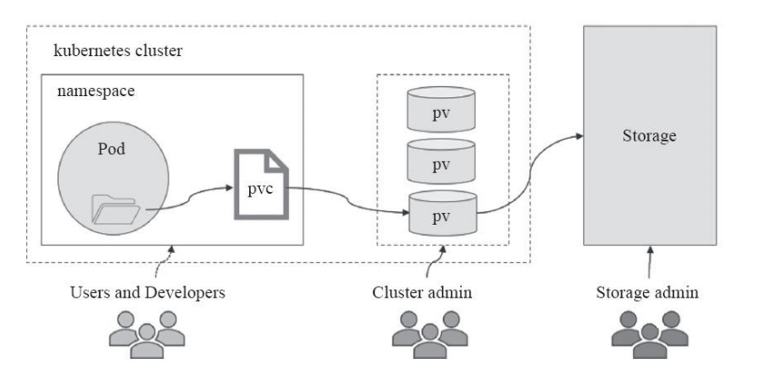
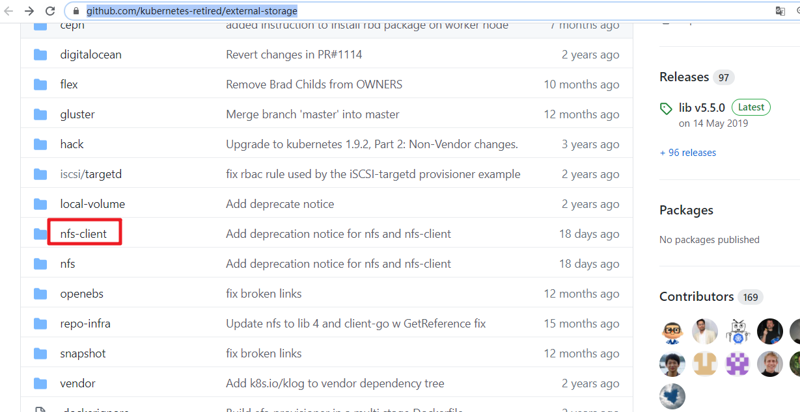
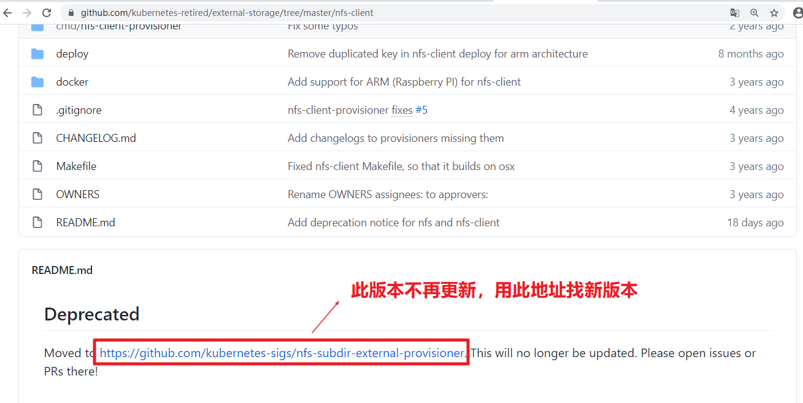
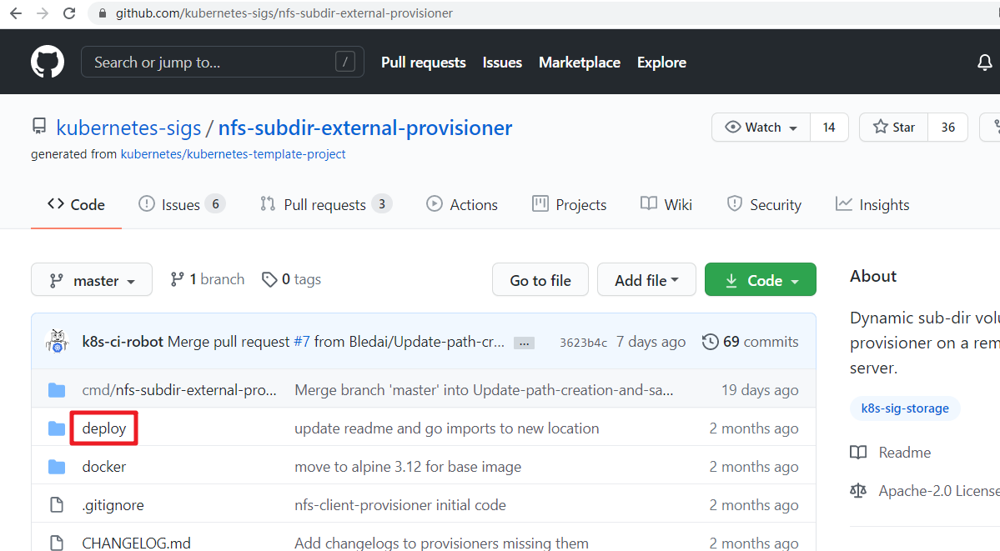
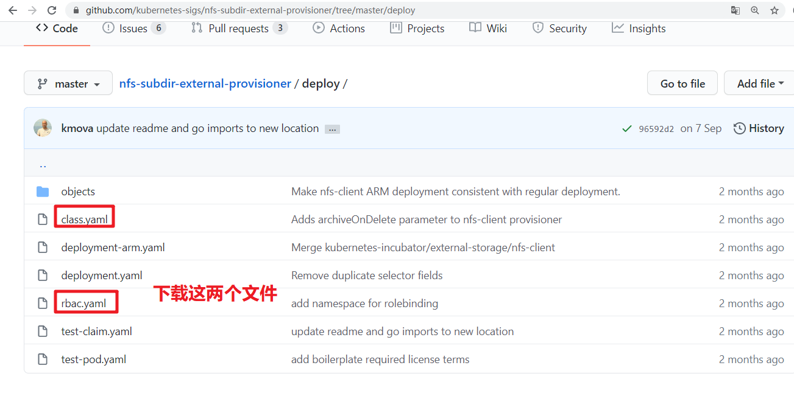

# kubernetes持久化存储卷

# 一、存储卷介绍

pod有生命周期，生命周期结束后pod里的数据会消失(如配置文件,业务数据等)。

**解决: 我们需要将数据与pod分离,将数据放在专门的存储卷上**


pod在k8s集群的节点中是可以调度的, 如果pod挂了被调度到另一个节点,那么数据和pod的联系会中断。

**解决: 所以我们需要与集群节点分离的存储系统才能实现数据持久化**


简单来说: **volume提供了在容器上挂载外部存储的能力**


# 二、存储卷的分类

kubernetes支持的存储卷类型非常丰富,使用下面的命令查看:

```powershell
# kubectl explain pod.spec.volumes
```

或者参考: https://kubernetes.io/docs/concepts/storage/

kubernetes支持的存储卷列表如下:

- [awsElasticBlockStore](https://kubernetes.io/docs/concepts/storage/#awselasticblockstore)
- [azureDisk](https://kubernetes.io/docs/concepts/storage/#azuredisk)
- [azureFile](https://kubernetes.io/docs/concepts/storage/#azurefile)
- [cephfs](https://kubernetes.io/docs/concepts/storage/#cephfs)
- [cinder](https://kubernetes.io/docs/concepts/storage/#cinder)
- [configMap](https://kubernetes.io/docs/concepts/storage/#configmap)
- [csi](https://kubernetes.io/docs/concepts/storage/#csi)
- [downwardAPI](https://kubernetes.io/docs/concepts/storage/#downwardapi)
- [emptyDir](https://kubernetes.io/docs/concepts/storage/#emptydir)
- [fc (fibre channel)](https://kubernetes.io/docs/concepts/storage/#fc)
- [flexVolume](https://kubernetes.io/docs/concepts/storage/#flexVolume)
- [flocker](https://kubernetes.io/docs/concepts/storage/#flocker)
- [gcePersistentDisk](https://kubernetes.io/docs/concepts/storage/#gcepersistentdisk)
- [gitRepo (deprecated)](https://kubernetes.io/docs/concepts/storage/#gitrepo)
- [glusterfs](https://kubernetes.io/docs/concepts/storage/#glusterfs)
- [hostPath](https://kubernetes.io/docs/concepts/storage/#hostpath)
- [iscsi](https://kubernetes.io/docs/concepts/storage/#iscsi)
- [local](https://kubernetes.io/docs/concepts/storage/#local)
- [nfs](https://kubernetes.io/docs/concepts/storage/#nfs)
- [persistentVolumeClaim](https://kubernetes.io/docs/concepts/storage/#persistentvolumeclaim)
- [projected](https://kubernetes.io/docs/concepts/storage/#projected)
- [portworxVolume](https://kubernetes.io/docs/concepts/storage/#portworxvolume)
- [quobyte](https://kubernetes.io/docs/concepts/storage/#quobyte)
- [rbd](https://kubernetes.io/docs/concepts/storage/#rbd)
- [scaleIO](https://kubernetes.io/docs/concepts/storage/#scaleio)
- [secret](https://kubernetes.io/docs/concepts/storage/#secret)
- [storageos](https://kubernetes.io/docs/concepts/storage/#storageos)
- [vsphereVolume](https://kubernetes.io/docs/concepts/storage/#vspherevolume)


我们将上面的存储卷列表进行简单的分类: 

- 本地存储卷 
  - emptyDir    pod删除,数据也会被清除, 用于数据的临时存储
  - hostPath     宿主机目录映射(本地存储卷)
- 网络存储卷
  - NAS类           nfs等
  - SAN类           iscsi,FC等
  - 分布式存储   glusterfs,cephfs,rbd,cinder等
  - 云存储           aws,azurefile等


# 三、存储卷的选择

市面上的存储产品种类繁多, 但按应用角度主要分为三类:

- 文件存储  如:nfs,glusterfs,cephfs等
  - 优点: 数据共享(多pod挂载可以同读同写)
  - 缺点: 性能较差
- 块存储  如: iscsi,rbd等
  - 优点: 性能相对于文件存储好
  - 缺点: 不能实现数据共享（部分）
- 对象存储 如: ceph对象存储
  - 优点: 性能好, 数据共享
  - 缺点: 使用方式特殊,支持较少

面对kubernetes支持的形形色色的存储卷,如何选择成了难题。在选择存储时,我们要抓住核心需求:

- 数据是否需要持久性   
- 数据可靠性  如存储集群节点是否有单点故障,数据是否有副本等
- 性能  
- 扩展性  如是否能方便扩容,应对数据增长的需求
- 运维难度  存储的运维难度是比较高的,尽量选择稳定的开源方案或商业产品
- 成本

总之, 存储的选择是需要考虑很多因素的, 熟悉各类存储产品, 了解它们的优缺点，结合自身需求才能选择合适自己的。


# 四、本地存储卷之emptyDir

- 应用场景

  实现pod内容器之间数据共享

- 特点

  随着pod被删除，该卷也会被删除


1.创建yaml文件

```powershell
[root@k8s-master1 ~]# vim volume-emptydir.yml
apiVersion: v1
kind: Pod
metadata:
  name: volume-emptydir
spec:
  containers:
  - name: write
    image: centos
    imagePullPolicy: IfNotPresent
    command: ["bash","-c","echo haha > /data/1.txt ; sleep 6000"]
    volumeMounts:
    - name: data
      mountPath: /data

  - name: read
    image: centos
    imagePullPolicy: IfNotPresent
    command: ["bash","-c","cat /data/1.txt; sleep 6000"]
    volumeMounts:
    - name: data
      mountPath: /data
      
  volumes:
  - name: data
    emptyDir: {}
```


2.基于yaml文件创建pod

```powershell
[root@k8s-master1 ~]# kubectl apply -f volume-emptydir.yml
pod/volume-emptydir created
```


3.查看pod启动情况

```powershell
[root@k8s-master1 ~]# kubectl get pods |grep volume-emptydir
NAME                               READY   STATUS    RESTARTS   AGE
volume-emptydir                    2/2     Running   0          15s
```


4.查看pod描述信息

```powershell
[root@k8s-master1 ~]# kubectl describe pod volume-emptydir | tail -10
Events:
  Type    Reason     Age   From               Message
  ----    ------     ----  ----               -------
  Normal  Scheduled  50s   default-scheduler  Successfully assigned default/volume-emptydir to k8s-worker1
  Normal  Pulling    50s   kubelet            Pulling image "centos:centos7"
  Normal  Pulled     28s   kubelet            Successfully pulled image "centos:centos7" in 21.544912361s
  Normal  Created    28s   kubelet            Created container write
  Normal  Started    28s   kubelet            Started container write
  Normal  Pulled     28s   kubelet            Container image "centos:centos7" already present on machine
  Normal  Created    28s   kubelet            Created container read
  Normal  Started    28s   kubelet            Started container read
```


5.验证

```powershell
[root@k8s-master1 ~]# kubectl logs volume-emptydir -c write

[root@k8s-master1 ~]# kubectl logs volume-emptydir -c read
haha
```


# 五、本地存储卷之hostPath

- 应用场景

  pod内与集群节点目录映射（pod中容器想访问节点上数据，例如监控，只有监控访问到节点主机文件才能知道集群节点主机状态）

- 缺点

  如果集群节点挂掉，控制器在另一个集群节点拉起容器，数据就会变成另一台集群节点主机的了（无法实现数据共享)


1.创建yaml文件

~~~powershell
[root@k8s-master1 ~]# vim volume-hostpath.yml
apiVersion: v1
kind: Pod
metadata:
  name: volume-hostpath
spec:
  containers:
  - name: busybox
    image: busybox
    imagePullPolicy: IfNotPresent
    command: ["/bin/sh","-c","echo haha > /data/1.txt ; sleep 600"]
    volumeMounts:
    - name: data
      mountPath: /data
      
  volumes:
  - name: data
    hostPath:
      path: /opt
      type: Directory

~~~

2.基于yaml文件创建pod

~~~powershell
[root@k8s-master1 ~]# kubectl apply  -f volume-hostpath.yml
pod/volume-hostpath created
~~~

3.查看pod状态

~~~powershell
[root@k8s-master1 ~]# kubectl get pods -o wide |grep volume-hostpath
volume-hostpath     1/1   Running   0    29s     10.224.194.120   k8s-worker1   <none>     <none>
可以看到pod是在k8s-worker1节点上
~~~

4.验证pod所在机器上的挂载文件

~~~powershell
[root@k8s-worker1 ~]# cat /opt/1.txt
haha
~~~


# 六、网络存储卷之nfs

1.搭建nfs服务器

~~~powershell
[root@nfsserver ~]# mkdir -p /data/nfs
[root@nfsserver ~]# vim /etc/exports
/data/nfs       *(rw,no_root_squash,sync)
[root@nfsserver ~]# systemctl restart nfs-server
[root@nfsserver ~]# systemctl enable nfs-server
~~~


2.所有node节点安装nfs客户端相关软件包

```powershell
[root@k8s-worker1 ~]# yum install nfs-utils -y

[root@k8s-worker2 ~]# yum install nfs-utils -y
```


3.验证nfs可用性

```powershell
[root@node1 ~]# showmount -e 192.168.10.129
Export list for 192.168.10.129:
/data/nfs *

[root@node2 ~]# showmount -e 192.168.10.129
Export list for 192.168.10.129:
/data/nfs *
```


4.master节点上创建yaml文件

```powershell
[root@k8s-master1 ~]# vim volume-nfs.yml
apiVersion: apps/v1
kind: Deployment
metadata:
  name: volume-nfs
spec:
  replicas: 2
  selector:
    matchLabels:
      app: nginx
  template:
    metadata:
      labels:
        app: nginx
    spec:
      containers:
      - name: nginx
        image: nginx:1.15-alpine
        imagePullPolicy: IfNotPresent
        volumeMounts:
        - name: documentroot
          mountPath: /usr/share/nginx/html
        ports:
        - containerPort: 80
      volumes:
      - name: documentroot
        nfs:
          server: 192.168.10.129
          path: /data/nfs
```

5.应用yaml创建

```powershell
[root@k8s-master1 ~]#  kubectl apply -f volume-nfs.yml
deployment.apps/nginx-deployment created
```


6.在nfs服务器共享目录中创建验证文件

```powershell
[root@nfsserver ~]# echo "volume-nfs" > /data/nfs/index.html
```


7.验证pod

```powershell
[root@k8s-master1 ~]# kubectl get pod |grep volume-nfs
volume-nfs-649d848b57-qg4bz   1/1     Running   0          10s
volume-nfs-649d848b57-wrnpn   1/1     Running   0          10s


[root@k8s-master1 ~]# kubectl exec -it volume-nfs-649d848b57-qg4bz -- /bin/sh
/ # ls /usr/share/nginx/html/
index.html
/ # cat /usr/share/nginx/html/index.html
volume-nfs										# 文件内容与nfs服务器上创建的一致
/ # exit


[root@k8s-master1 ~]# kubectl exec -it volume-nfs-649d848b57-wrnpn -- /bin/sh
/ # ls /usr/share/nginx/html/
index.html
/ # cat /usr/share/nginx/html/index.html
volume-nfs										# 文件内容与nfs服务器上创建的一致
/ # exit
```


# 七、PV(持久存储卷)与PVC(持久存储卷声明)

## 7.1 认识pv与pvc

kubernetes存储卷的分类太丰富了,每种类型都要写相应的接口与参数才行，这就让维护与管理难度加大。


persistenvolume(**PV**) 是配置好的一段存储(可以是任意类型的存储卷)

- 也就是说将网络存储共享出来,配置定义成PV。


PersistentVolumeClaim(**PVC**)是用户pod使用PV的申请请求。

- 用户不需要关心具体的volume实现细节,只需要关心使用需求。


## 7.2 pv与pvc之间的关系

- pv提供存储资源(生产者)

- pvc使用存储资源(消费者)

- 使用pvc绑定pv

  




## 7.3 实现nfs类型pv与pvc

1.编写创建pv的YAML文件

~~~powershell
[root@k8s-master1 ~]# vim pv-nfs.yml
apiVersion: v1
kind: PersistentVolume						# 类型为PersistentVolume(pv)
metadata:		
  name: pv-nfs								# 名称
spec:
  capacity:
    storage: 1Gi							# 大小
  accessModes:
    - ReadWriteMany							# 访问模式
  nfs:
    path: /data/nfs							# nfs共享目录
    server: 192.168.10.129					# nfs服务器IP
~~~

访问模式有3种       参考: https://kubernetes.io/docs/concepts/storage/persistent-volumes/#access-modes

- ReadWriteOnce 单节点读写挂载
- ReadOnlyMany  多节点只读挂载
- ReadWriteMany  多节点读写挂载

cephfs存储卷3种类型都支持, 我们要实现多个nginx跨节点之间的数据共享,所以选择ReadWriteMany模式。


2.创建pv并验证

~~~powershell
[root@k8s-master1 ~]# kubectl apply -f pv-nfs.yml
persistentvolume/pv-nfs created
~~~

~~~powershell
[root@k8s-master1 ~]# kubectl get pv
NAME     CAPACITY   ACCESS MODES   RECLAIM POLICY   STATUS      CLAIM   STORAGECLASS   REASON   AGE
pv-nfs   1Gi        RWX            Retain           Available                                   81s
~~~

说明: 

- RWX为ReadWriteMany的简写
- Retain是回收策略  
  - Retain表示需要不使用了需要手动回收
  - 参考: https://kubernetes.io/docs/concepts/storage/persistent-volumes/#reclaim-policy


3.编写创建pvc的YAML文件

~~~powershell
[root@k8s-master1 ~]# vim pvc-nfs.yml
apiVersion: v1
kind: PersistentVolumeClaim				# 类型为PersistentVolumeClaim(pvc)
metadata:
  name: pvc-nfs							# pvc的名称
spec:
  accessModes:
    - ReadWriteMany						# 访问模式
  resources:
    requests:
      storage: 1Gi						# 大小要与pv的大小保持一致
~~~


4.创建pvc并验证

~~~powershell
[root@k8s-master1 ~]# kubectl apply -f pvc-nfs.yml
persistentvolumeclaim/pvc-nfs created
~~~

~~~powershell
[root@k8s-master1 ~]# kubectl get pvc
NAME      STATUS   VOLUME   CAPACITY   ACCESS MODES   STORAGECLASS   AGE
pvc-nfs   Bound    pv-nfs   1Gi        RWX                           38s
~~~

**注意:** STATUS必须为Bound状态(Bound状态表示pvc与pv绑定OK)


5.编写deployment的YMAL

~~~powershell
[root@k8s-master1 ~]# vim deploy-nginx-nfs.yml
apiVersion: apps/v1
kind: Deployment
metadata:
  name: deploy-nginx-nfs
spec:
  replicas: 2
  selector:
    matchLabels:
      app: nginx
  template:
    metadata:
      labels:
        app: nginx
    spec:
      containers:
      - name: nginx
        image: nginx:1.15-alpine
        imagePullPolicy: IfNotPresent
        ports:
        - containerPort: 80
        volumeMounts:
        - name: www
          mountPath: /usr/share/nginx/html
      volumes:
      - name: www
        persistentVolumeClaim:
          claimName: pvc-nfs
~~~

6.应用YAML创建deploment

~~~powershell
[root@k8s-master1 ~]# kubectl apply -f deploy-nginx-nfs.yml
deployment.apps/deploy-nginx-nfs created
~~~

7.验证pod

~~~powershell
[root@k8s-master1 ~]# kubectl get pod |grep deploy-nginx-nfs
deploy-nginx-nfs-6f9bc4546c-gbzcl   1/1     Running   0          1m46s
deploy-nginx-nfs-6f9bc4546c-hp4cv   1/1     Running   0          1m46s
~~~

8.验证pod内卷的数据

~~~powershell
[root@k8s-master1 ~]# kubectl exec -it deploy-nginx-nfs-6f9bc4546c-gbzcl -- /bin/sh
/ # ls /usr/share/nginx/html/
index.html
/ # cat /usr/share/nginx/html/index.html
volume-nfs
/ # exit


[root@k8s-master1 ~]# kubectl exec -it deploy-nginx-nfs-6f9bc4546c-hp4cv -- /bin/sh
/ # ls /usr/share/nginx/html/
index.html
/ # cat /usr/share/nginx/html/index.html
volume-nfs
/ # exit
~~~


## 7.4 subpath使用

subpath是指可以把相同目录中不同子目录挂载到容器中不同的目录中使用的方法。以下通过案例演示：


~~~powershell
编辑文件
# vim 01_create_pod.yaml

编辑后查看，保持内容一致即可
# cat 01_create_pod.yaml
apiVersion: v1
kind: Pod
metadata:
  name: pod1
spec:
  containers:
  - name: c1
    image: busybox
    command: ["/bin/sleep","100000"]
    volumeMounts:
      - name: data
        mountPath: /opt/data1
        subPath: data1
      - name: data
        mountPath: /opt/data2
        subPath: data2
  volumes:
    - name: data
      persistentVolumeClaim:
        claimName: pvc-nfs
~~~


~~~powershell
执行文件，创建pod
# kubectl apply -f 01_create_pod.yaml
pod/pod1 created
~~~


~~~powershell
编辑文件
# vim 02_create_pvc.yaml

查看编辑后文件，保持内容一致即可
# cat 02_create_pvc.yaml
apiVersion: v1
kind: PersistentVolumeClaim                             # 类型为PersistentVolumeClaim(pvc)
metadata:
  name: pvc-nfs                                                 # pvc的名称
spec:
  accessModes:
    - ReadWriteMany                                             # 访问模式
  resources:
    requests:
      storage: 1Gi                                              # 大小要与pv的大小保持一致
~~~


~~~powershell
执行文件，创建pvc
# kubectl apply  -f 02_create_pvc.yaml
persistentvolumeclaim/pvc-nfs created
~~~


~~~powershell
编辑文件
# vim 03_create_pv_nfs.yaml

查看编辑后文件，保持内容一致，注意修改nfs服务器及其共享的目录
# cat 03_create_pv_nfs.yaml
apiVersion: v1
kind: PersistentVolume                                          # 类型为PersistentVolume(pv)
metadata:
  name: pv-nfs                                                          # 名称
spec:
  capacity:
    storage: 1Gi                                                        # 大小
  accessModes:
    - ReadWriteMany                                              # 访问模式
  nfs:
    path: /sdb                                                     # nfs共享目录
    server: 192.168.10.214
~~~


~~~powershell
执行文件，创建pv
# kubectl apply -f 03_create_pv_nfs.yaml
persistentvolume/pv-nfs created
~~~


~~~powershell
在nfs服务器查看pod中目录是否自动添加到nfs服务器/sdb目录中
[root@nfsserver ~]# ls /sdb
data1  data2
~~~


# 八、存储的动态供给

## 8.1 什么是动态供给


每次使用存储要先创建pv, 再创建pvc，真累!   所以我们可以实现使用存储的动态供给特性。

* 静态存储需要用户申请PVC时保证容量和读写类型与预置PV的容量及读写类型完全匹配, 而动态存储则无需如此.
* 管理员无需预先创建大量的PV作为存储资源


Kubernetes从1.4版起引入了一个新的资源对象StorageClass，可用于将存储资源定义为具有显著特性的类（Class）而不是具体

的PV。用户通过PVC直接向意向的类别发出申请，匹配由管理员事先创建的PV，或者由其按需为用户动态创建PV，这样就免去

了需要先创建PV的过程。


## 8.2 使用NFS文件系统创建存储动态供给

PV对存储系统的支持可通过其插件来实现，目前，Kubernetes支持如下类型的插件。

官方地址：https://kubernetes.io/docs/concepts/storage/storage-classes/

官方插件是不支持NFS动态供给的，但是我们可以用第三方的插件来实现


第三方插件地址: https://github.com/kubernetes-retired/external-storage














1.下载并创建storageclass

~~~powershell
[root@k8s-master1 ~]# wget https://raw.githubusercontent.com/kubernetes-sigs/nfs-subdir-external-provisioner/master/deploy/class.yaml

[root@k8s-master1 ~]# mv class.yaml storageclass-nfs.yml
~~~

~~~powershell
[root@k8s-master1 ~]# cat storageclass-nfs.yml
apiVersion: storage.k8s.io/v1
kind: StorageClass				# 类型
metadata:
  name: nfs-client		# 名称,要使用就需要调用此名称
provisioner: k8s-sigs.io/nfs-subdir-external-provisioner 	# 动态供给插件
parameters:
  archiveOnDelete: "false"		# 删除数据时是否存档，false表示不存档，true表示存档
~~~

~~~powershell
[root@k8s-master1 ~]# kubectl apply -f storageclass-nfs.yml
storageclass.storage.k8s.io/managed-nfs-storage created
~~~

~~~powershell
[root@k8s-master1 ~]# kubectl get storageclass
NAME         PROVISIONER                                   RECLAIMPOLICY   VOLUMEBINDINGMODE   ALLOWVOLUMEEXPANSION   AGE
nfs-client   k8s-sigs.io/nfs-subdir-external-provisioner   Delete          Immediate           false                  10s

# RECLAIMPOLICY pv回收策略，pod或pvc被删除后，pv是否删除还是保留。
# VOLUMEBINDINGMODE Immediate 模式下PVC与PV立即绑定，主要是不等待相关Pod调度完成，不关心其运行节点，直接完成绑定。相反的 WaitForFirstConsumer模式下需要等待Pod调度完成后进行PV绑定。
# ALLOWVOLUMEEXPANSION pvc扩容
~~~


2.下载并创建rbac

因为storage自动创建pv需要经过kube-apiserver，所以需要授权。

~~~powershell
[root@k8s-master1 ~]# wget https://raw.githubusercontent.com/kubernetes-sigs/nfs-subdir-external-provisioner/master/deploy/rbac.yaml

[root@k8s-master1 ~]# mv rbac.yaml storageclass-nfs-rbac.yaml
~~~


~~~powershell
[root@k8s-master1 ~]# cat storageclass-nfs-rbac.yaml
apiVersion: v1
kind: ServiceAccount
metadata:
  name: nfs-client-provisioner
  # replace with namespace where provisioner is deployed
  namespace: default
---
kind: ClusterRole
apiVersion: rbac.authorization.k8s.io/v1
metadata:
  name: nfs-client-provisioner-runner
rules:
  - apiGroups: [""]
    resources: ["persistentvolumes"]
    verbs: ["get", "list", "watch", "create", "delete"]
  - apiGroups: [""]
    resources: ["persistentvolumeclaims"]
    verbs: ["get", "list", "watch", "update"]
  - apiGroups: ["storage.k8s.io"]
    resources: ["storageclasses"]
    verbs: ["get", "list", "watch"]
  - apiGroups: [""]
    resources: ["events"]
    verbs: ["create", "update", "patch"]
---
kind: ClusterRoleBinding
apiVersion: rbac.authorization.k8s.io/v1
metadata:
  name: run-nfs-client-provisioner
subjects:
  - kind: ServiceAccount
    name: nfs-client-provisioner
    # replace with namespace where provisioner is deployed
    namespace: default
roleRef:
  kind: ClusterRole
  name: nfs-client-provisioner-runner
  apiGroup: rbac.authorization.k8s.io
---
kind: Role
apiVersion: rbac.authorization.k8s.io/v1
metadata:
  name: leader-locking-nfs-client-provisioner
  # replace with namespace where provisioner is deployed
  namespace: default
rules:
  - apiGroups: [""]
    resources: ["endpoints"]
    verbs: ["get", "list", "watch", "create", "update", "patch"]
---
kind: RoleBinding
apiVersion: rbac.authorization.k8s.io/v1
metadata:
  name: leader-locking-nfs-client-provisioner
  # replace with namespace where provisioner is deployed
  namespace: default
subjects:
  - kind: ServiceAccount
    name: nfs-client-provisioner
    # replace with namespace where provisioner is deployed
    namespace: default
roleRef:
  kind: Role
  name: leader-locking-nfs-client-provisioner
  apiGroup: rbac.authorization.k8s.io

~~~


~~~powershell
[root@k8s-master1 ~]# kubectl apply -f rbac.yaml
serviceaccount/nfs-client-provisioner created
clusterrole.rbac.authorization.k8s.io/nfs-client-provisioner-runner created
clusterrolebinding.rbac.authorization.k8s.io/run-nfs-client-provisioner created
role.rbac.authorization.k8s.io/leader-locking-nfs-client-provisioner created
rolebinding.rbac.authorization.k8s.io/leader-locking-nfs-client-provisioner created
~~~


3.创建动态供给的deployment

需要一个deployment来专门实现pv与pvc的自动创建

~~~powershell
[root@k8s-master1 ~]# vim deploy-nfs-client-provisioner.yml
apiVersion: apps/v1
kind: Deployment
metadata:
  name: nfs-client-provisioner
spec:
  replicas: 1
  strategy:
    type: Recreate
  selector:
    matchLabels:
      app: nfs-client-provisioner
  template:
    metadata:
      labels:
        app: nfs-client-provisioner
    spec:
      serviceAccount: nfs-client-provisioner
      containers:
        - name: nfs-client-provisioner
          image: registry.cn-beijing.aliyuncs.com/pylixm/nfs-subdir-external-provisioner:v4.0.0
          volumeMounts:
            - name: nfs-client-root
              mountPath: /persistentvolumes
          env:
            - name: PROVISIONER_NAME
              value: k8s-sigs.io/nfs-subdir-external-provisioner
            - name: NFS_SERVER
              value: 192.168.10.129
            - name: NFS_PATH
              value: /data/nfs
      volumes:
        - name: nfs-client-root
          nfs:
            server: 192.168.10.129
            path: /data/nfs
~~~

~~~powershell
[root@k8s-master1 ~]# kubectl apply -f deploy-nfs-client-provisioner.yml
deployment.apps/nfs-client-provisioner created
~~~

~~~powershell
[root@k8s-master1 ~]# kubectl get pods |grep nfs-client-provisioner
nfs-client-provisioner-5b5ddcd6c8-b6zbq   1/1     Running   0          34s
~~~


~~~powershell
测试存储动态供给是否可用

# vim nginx-sc.yaml

---
apiVersion: v1
kind: Service
metadata:
  name: nginx
  labels:
    app: nginx
spec:
  ports:
  - port: 80
    name: web
  clusterIP: None
  selector:
    app: nginx
---
apiVersion: apps/v1
kind: StatefulSet
metadata:
  name: web
spec:
  selector:
    matchLabels:
      app: nginx
  serviceName: "nginx"
  replicas: 2
  template:
    metadata:
      labels:
        app: nginx
    spec:
      imagePullSecrets:
      - name: huoban-harbor
      terminationGracePeriodSeconds: 10
      containers:
      - name: nginx
        image: nginx:latest
        ports:
        - containerPort: 80
          name: web
        volumeMounts:
        - name: www
          mountPath: /usr/share/nginx/html
  volumeClaimTemplates:
  - metadata:
      name: www
    spec:
      accessModes: [ "ReadWriteOnce" ]
      storageClassName: "nfs-client"
      resources:
        requests:
          storage: 1Gi
~~~


~~~powershell
[root@k8s-master1 nfs]# kubectl get pods
NAME                                     READY   STATUS    RESTARTS   AGE
nfs-client-provisioner-9c988bc46-pr55n   1/1     Running   0          95s
web-0                                    1/1     Running   0          95s
web-1                                    1/1     Running   0          61s
~~~


~~~powershell
[root@nfsserver ~]# ls /data/nfs/
default-www-web-0-pvc-c4f7aeb0-6ee9-447f-a893-821774b8d11f  default-www-web-1-pvc-8b8a4d3d-f75f-43af-8387-b7073d07ec01 
~~~


**扩展：**

~~~powershell
批量下载文件：
# for file in class.yaml deployment.yaml rbac.yaml  ; do wget https://raw.githubusercontent.com/kubernetes-incubator/external-storage/master/nfs-client/deploy/$file ; done
~~~


# k8s集群存储解决方案 GlusterFS


# 一、存储解决方案介绍

## 1.1 GlusterFS

- GlusterFS是一个开源的分布式文件系统
- 具有强大的横向扩展能力
- 通过扩展能够支持数PB存储容量和处理数千客户端
- GlusterFS借助TCP/IP或InfiniBandRDMA网络将物理分布的存储资源聚集在一起，使用单一全局命名空间来管理数据。

## 1.2 Heketi

- Heketi（https://github.com/heketi/heketi），是一个基于RESTful API的GlusterFS卷管理框架。

- Heketi可以方便地和云平台整合，提供RESTful API供Kubernetes调用，实现多GlusterFS集群的卷管理
- Heketi还有保证bricks和它对应的副本均匀分布在集群中的不同可用区的优点。


# 二、环境说明

## 2.1 k8s集群

| kubeadm  | kubelet  | kubectl  | docker   | 节点数          |
| -------- | -------- | -------- | -------- | --------------- |
| v1.21.10 | v1.21.10 | v1.21.10 | 20.10-17 | 3;1master2slave |


|   主机   |    IP地址     | Heketi               |
| :------: | :-----------: | -------------------- |
| master01 | 192.168.10.11 | heketi heketi-client |
| worker01 | 192.168.10.12 | heketi-client        |
| worker02 | 192.168.10.13 | heketi-client        |


## 2.2 GlusterFS集群


| 主机 | IP地址        | 硬盘     | 硬盘容量 |
| ---- | ------------- | -------- | -------- |
| g1   | 192.168.10.60 | /dev/sdb | 100G     |
| g2   | 192.168.10.61 | /dev/sdb | 100G     |
| g3   | 192.168.10.62 | /dev/sdb | 100G     |


# 三、GlusterFS集群部署


## 3.1 主机准备

### 3.1.1 主机名配置


~~~powershell
[root@localhost ~]# hostnamectl set-hostname gX

X为1，2，3
~~~


### 3.1.2 IP配置


~~~powershell
[root@localhost ~]# cat /etc/sysconfig/network-scripts/ifcfg-eth0
DEVICE=eth0
TYPE=Ethernet
ONBOOT=yes
BOOTPROTO=static
IPADDR=192.168.10.6X
NETMASK=255.255.255.0
GATEWAY=192.168.10.2
DNS1=119.29.29.29

X为0，1，2
~~~


### 3.1.3 主机名解析设置


~~~powershell
[root@localhost ~]# cat /etc/hosts
127.0.0.1   localhost localhost.localdomain localhost4 localhost4.localdomain4
::1         localhost localhost.localdomain localhost6 localhost6.localdomain6
192.168.10.60 g1
192.168.10.61 g2
192.168.10.62 g3
~~~


### 3.1.4 主机间免密登录设置

> 在g1主机操作，然后copy到其它主机即可。


~~~powershell
[root@g1 ~]# ssh-keygen -t rsa -f /root/.ssh/id_rsa -N ''
Generating public/private rsa key pair.
Your identification has been saved in /root/.ssh/id_rsa.
Your public key has been saved in /root/.ssh/id_rsa.pub.
The key fingerprint is:
SHA256:FuKHUe57eCqUjIwH9q9zXNsQt/6BHDNZcSOixGBHXs0 root@g1
The key's randomart image is:
+---[RSA 2048]----+
|      o+= ooo o  |
|     . *.o .E+ . |
|      o =   .    |
|  o  . =...o     |
| . = oo.So=.     |
|  . = +oo+.=     |
|   . + .o== .    |
|    . = .+o  .   |
|    .+ ..  ..    |
+----[SHA256]-----+


[root@g1 ~]# cd /root/.ssh

[root@g1 .ssh]# ls
id_rsa  id_rsa.pub 
[root@g1 .ssh]# cp id_rsa.pub authorized_keys
[root@g1 .ssh]# ls
authorized_keys  id_rsa  id_rsa.pub 

[root@g1 .ssh]# cd ..
[root@g1 ~]# scp -r /root/.ssh g2:/root

[root@g1 ~]# scp -r /root/.ssh g3:/root

~~~


### 3.1.5 硬盘准备


#### 3.1.5.1 查看硬盘

> 所有GlusterFS集群节点全部操作，仅在g1主机演示操作方法。

~~~powershell
[root@gX ~]# lsblk
NAME            MAJ:MIN RM  SIZE RO TYPE MOUNTPOINT
vda             252:0    0   20G  0 disk
├─vda1          252:1    0    1G  0 part /boot
└─vda2          252:2    0   19G  0 part
  ├─centos-root 253:0    0   17G  0 lvm  /
  └─centos-swap 253:1    0    2G  0 lvm  [SWAP]
sdb             252:16   0  100G  0 disk
~~~


#### 3.1.5.2 格式化硬盘

~~~powershell
[root@gX ~]# mkfs.xfs /dev/sdb
meta-data=/dev/sdb               isize=512    agcount=4, agsize=6553600 blks
         =                       sectsz=512   attr=2, projid32bit=1
         =                       crc=1        finobt=0, sparse=0
data     =                       bsize=4096   blocks=26214400, imaxpct=25
         =                       sunit=0      swidth=0 blks
naming   =version 2              bsize=4096   ascii-ci=0 ftype=1
log      =internal log           bsize=4096   blocks=12800, version=2
         =                       sectsz=512   sunit=0 blks, lazy-count=1
realtime =none                   extsz=4096   blocks=0, rtextents=0
~~~


### 3.1.6 硬盘自动挂载准备

#### 3.1.6.1 准备挂载目录

~~~powershell
[root@g1 ~]# mkdir /glustersdb

[root@g2 ~]# mkdir /glustersdb

[root@g3~]# mkdir /glustersdb
~~~


#### 3.1.6.2 修改/etc/fstab文件实现自动挂载

~~~powershell
[root@gX ~]# cat /etc/fstab

......
/dev/sdb                /glustersdb             xfs     defaults        0 0
~~~


~~~powershell
挂载所有
[root@gX ~]# mount -a

查看文件系统挂载情况
[root@gX ~]# df -h
文件系统                 容量  已用  可用 已用% 挂载点
/dev/mapper/centos-root   17G  1.1G   16G    7% /
devtmpfs                 988M     0  988M    0% /dev
tmpfs                   1000M     0 1000M    0% /dev/shm
tmpfs                   1000M  8.6M  991M    1% /run
tmpfs                   1000M     0 1000M    0% /sys/fs/cgroup
/dev/vda1               1014M  133M  882M   14% /boot
tmpfs                     98M     0   98M    0% /run/user/0
/dev/sdb                 100G   33M  100G    1% /glustersdb
~~~


## 3.2  安全设置

### 3.2.1 firewalld设置

~~~powershell
[root@gX ~]# systemctl disable firewalld
[root@gX ~]# systemctl stop firewalld
[root@gX ~]# firewall-cmd --state
not running
~~~


### 3.2.2 SELinux设置

> 所有主机均要修改，修改后，请重启系统让修改生效。


~~~powershell
[root@gX ~]# sed -ri 's/SELINUX=enforcing/SELINUX=disabled/' /etc/selinux/config
~~~


## 3.3 时间同步设置


~~~powershell
[root@gX ~]# crontab -l
0 */1 * * * ntpdate time1.aliyun.com
~~~


## 3.4 GlusterFS安装

### 3.4.1 YUM源准备


~~~powershell
[root@gX ~]# yum -y install centos-release-gluster

[root@gX ~]# ls /etc/yum.repos.d/
CentOS-Gluster-7.repo  CentOS-Storage-common.repo  tuna.repo
~~~


### 3.4.2 GlusterFS安装

> 关于软件的依赖，待补充。

~~~powershell
[root@gX ~]# yum -y install glusterfs glusterfs-server glusterfs-fuse glusterfs-rdma fuse
~~~

### 3.4.3 启动GlusterFS 服务


~~~powershell
[root@gX ~]# systemctl enable glusterd
[root@gX ~]# systemctl start glusterd
~~~


## 3.5 GlusterFS集群配置


> 在GlusterFS集群g1主机上添加g2和g3 2台主机。


~~~powershell
[root@g1 ~]# gluster peer probe g2
peer probe: success.
[root@g1 ~]# gluster peer probe g3
peer probe: success.
~~~


~~~powershell
[root@g1 ~]# gluster peer status
Number of Peers: 2

Hostname: g2
Uuid: 7660736f-056b-414e-8b0c-b5272265946c
State: Peer in Cluster (Connected)

Hostname: g3
Uuid: 75b7c358-edbe-438c-ad72-2ce16ffabf9d
State: Peer in Cluster (Connected)

[root@g2 ~]# gluster peer status
Number of Peers: 2

Hostname: g1
Uuid: 920e9070-1336-4bff-8bfd-eb6161d035d3
State: Peer in Cluster (Connected)

Hostname: g3
Uuid: 75b7c358-edbe-438c-ad72-2ce16ffabf9d
State: Peer in Cluster (Connected)

[root@g3 ~]# gluster peer status
Number of Peers: 2

Hostname: g1
Uuid: 920e9070-1336-4bff-8bfd-eb6161d035d3
State: Peer in Cluster (Connected)

Hostname: g2
Uuid: 7660736f-056b-414e-8b0c-b5272265946c
State: Peer in Cluster (Connected)
~~~


## 3.6 添加复制卷验证GlusterFS集群可用性


> 如果是为K8S集群提供持久化存储，请不要再继续验证GlusterFS集群可用性或验证完成后，重新添加硬盘。


> 在GlusterFS集群任意节点均可完成


### 3.6.1 创建复制卷

~~~powershell
[root@g1 ~]# gluster volume create k8s-test-volume replica 3 g1:/glustersdb/r1 g2:/glustersdb/r2 g3:/glustersdb/r3
volume create: k8s-test-volume: success: please start the volume to access data

[root@g1 ~]# ls /glustersdb
r1

[root@g2 ~]# ls /glustersdb
r2

[root@g3 ~]# ls /glustersdb
r3
~~~


### 3.6.2 启动复制卷

~~~powershell
[root@g1 ~]# gluster volume start k8s-test-volume
volume start: k8s-test-volume: success
~~~


### 3.6.3 查询复制卷状态


~~~powershell
[root@g1 ~]# gluster volume status k8s-test-volume
Status of volume: k8s-test-volume
Gluster process                             TCP Port  RDMA Port  Online  Pid
------------------------------------------------------------------------------
Brick g1:/glustersdb/r1                     49152     0          Y       6622
Brick g2:/glustersdb/r2                     49152     0          Y       6518
Brick g3:/glustersdb/r3                     49152     0          Y       6518
Self-heal Daemon on localhost               N/A       N/A        Y       6643
Self-heal Daemon on g3                      N/A       N/A        Y       6539
Self-heal Daemon on g2                      N/A       N/A        Y       6539

Task Status of Volume k8s-test-volume
------------------------------------------------------------------------------
There are no active volume tasks
~~~


### 3.6.4 查看复制卷信息


~~~powershell
[root@g1 ~]# gluster volume info k8s-test-volume

Volume Name: k8s-test-volume
Type: Replicate
Volume ID: 0529c5f6-1ac0-40ea-a29c-6c4f85dc54cb
Status: Started
Snapshot Count: 0
Number of Bricks: 1 x 3 = 3
Transport-type: tcp
Bricks:
Brick1: g1:/glustersdb/r1
Brick2: g2:/glustersdb/r2
Brick3: g3:/glustersdb/r3
Options Reconfigured:
transport.address-family: inet
storage.fips-mode-rchecksum: on
nfs.disable: on
performance.client-io-threads: off
~~~


### 3.6.5 如果某一个brick不在线会影响客户端挂载(可选)


> 设置后，可以允许volume中的某块brick不在线的情况


~~~powershell
[root@g1 glusterfs]# gluster volume set k8s-test-volume cluster.server-quorum-type none
volume set: success

[root@g1 glusterfs]# gluster volume set k8s-test-volume cluster.quorum-type none
volume set: success
~~~


### 3.6.6 限额问题(可选)


~~~powershell
[root@g1 ~]# gluster volume quota k8s-test-volume enable 
volume quota : success

[root@g1 ~]# gluster volume quota k8s-test-volume limit-usage / 10GB
volume quota : success
~~~


## 3.7 在k8s集群工作节点验证GlusterFS集群可用性


> 由于仅使用一个工作节点验证GlusterFS集群可用性，因此没有必要为所有工作节点全部安装GlusterFS客户端。


### 3.7.1 准备YUM源


~~~powershell
[root@worker01 ~]# yum -y install centos-release-gluster
~~~


### 3.7.2 在k8s集群work1节点安装glusterfs


~~~powershell
[root@worker01 ~]# yum -y install glusterfs glusterfs-fuse
~~~


### 3.7.3 创建用于挂载目录


~~~powershell
[root@worker01 ~]# mkdir /k8s-glusterfs-test-volume
~~~


### 3.7.4 手动挂载GlusterFS集群中的复制卷


> 如果使用主机名挂载，g1,g2,g3主机名需要添加到解析。


~~~powershell
[root@worker01 ~]# mount -t glusterfs g1:/k8s-test-volume /k8s-glusterfs-test-volume
~~~


### 3.7.5 验证挂载情况


~~~powershell
[root@worker01 ~]# df -h
文件系统                                                                       容量  已用  可用 已用% 挂载点
......
g1:/k8s-test-volume                                                          100G  1.1G  99G 2% /k8s-glusterfs-test-volume
~~~


### 3.7.6  验证完成后需要卸载


~~~powershell
[root@worker01 ~]# umount /k8s-glusterfs-test-volume
~~~


# 四、Heketi安装


>heketi是为glusterfs提供RESETFUL的API， 相当于给glusterfs和k8s之间架通了桥梁。k8s集群可以通过heketi提供的RESETFUL API完成对Glusterfs的PV申请和管理。


## 4.1 配置Heketi YUM源


> k8s集群所有节点均需要


~~~powershell
[root@master01 ~]# yum -y install centos-release-gluster

[root@worker01 ~]# yum -y install centos-release-gluster

[root@worker02 ~]# yum -y install centos-release-gluster
~~~


## 4.2 安装Heketi


### 4.2.1 k8s集群master节点安装


~~~powershell
[root@master01 ~]# yum -y install heketi heketi-client
~~~


### 4.2.2 k8s集群工作节点安装


~~~powershell
[root@worker01 ~]# yum -y install heketi-client

[root@worker02 ~]# yum -y install heketi-client
~~~


## 4.3 在k8s集群master节点修改Heketi配置文件


### 4.3.1 在k8s集群master节点查看并备份文件


~~~powershell
[root@master01 ~]# ls /etc/heketi/
heketi.json


[root@master01 ~]# cp /etc/heketi/heketi.json{,.bak}

[root@master01 ~]# ls /etc/heketi/
heketi.json  heketi.json.bak
~~~


### 4.3.2 在k8s集群master节点修改配置文件


~~~powershell
[root@master01 ~]# cat /etc/heketi/heketi.json
{
  "_port_comment": "Heketi Server Port Number",
  "port": "18080", 修改为18080，防止与其它端口冲突

  "_use_auth": "Enable JWT authorization. Please enable for deployment",
  "use_auth": true, 开启用户认证

  "_jwt": "Private keys for access",
  "jwt": {
    "_admin": "Admin has access to all APIs",
    "admin": {
      "key": "adminkey" 用户认证的key
    },
    "_user": "User only has access to /volumes endpoint",
    "user": {
      "key": "My Secret"
    }
  },

  "_glusterfs_comment": "GlusterFS Configuration",
  "glusterfs": {
    "_executor_comment": [
      "Execute plugin. Possible choices: mock, ssh",
      "mock: This setting is used for testing and development.",
      "      It will not send commands to any node.",
      "ssh:  This setting will notify Heketi to ssh to the nodes.",
      "      It will need the values in sshexec to be configured.",
      "kubernetes: Communicate with GlusterFS containers over",
      "            Kubernetes exec api."
    ],
    "executor": "ssh", 访问glusterfs集群的方法

    "_sshexec_comment": "SSH username and private key file information",
    "sshexec": {
      "keyfile": "/etc/heketi/heketi_key", 访问glusterfs集群使用的私钥，需要提前在k8s集群master节点生成并copy到glusterfs集群所有节点,需要从/root/.ssh/id_rsa复制到此处才可以使用。
      "user": "root", 认证使用的用户
      "port": "22", ssh连接使用的端口
      "fstab": "/etc/fstab" 挂载的文件系统
    },

    "_kubeexec_comment": "Kubernetes configuration",
    "kubeexec": {
      "host" :"https://kubernetes.host:8443",
      "cert" : "/path/to/crt.file",
      "insecure": false,
      "user": "kubernetes username",
      "password": "password for kubernetes user",
      "namespace": "OpenShift project or Kubernetes namespace",
      "fstab": "Optional: Specify fstab file on node.  Default is /etc/fstab"
    },

    "_db_comment": "Database file name",
    "db": "/var/lib/heketi/heketi.db", 数据库位置

    "_loglevel_comment": [
      "Set log level. Choices are:",
      "  none, critical, error, warning, info, debug",
      "Default is warning"
    ],
    "loglevel" : "warning" 修改日志级别
  }
}
~~~


> 需要说明的是，heketi有三种executor，分别为mock、ssh、kubernetes，建议在测试环境使用mock，生产环境使用ssh，当glusterfs以容器的方式部署在kubernetes上时，才使用kubernetes。我们这里将glusterfs和heketi独立部署，使用ssh的方式。


## 4.4 配置ssh密钥

在上面我们配置heketi的时候使用了ssh的executor，那么就需要heketi服务器能通过ssh密钥的方式连接到所有glusterfs节点进行管理操作，所以需要先生成ssh密钥


### 4.4.1 生成密钥

~~~powershell
[root@master01 ~]# ssh-keygen -t rsa -f /root/.ssh/id_rsa -N ''
Generating public/private rsa key pair.
Your identification has been saved in /root/.ssh/id_rsa.
Your public key has been saved in /root/.ssh/id_rsa.pub.
The key fingerprint is:
SHA256:EG1ql3V+ExAqMTubL4AqSgCMGZ0mZliSsVH2n83TT28 root@master01
The key's randomart image is:
+---[RSA 2048]----+
|**+.  ..o   oo   |
|*X+.   .o+... .  |
|B+  . .o+o.o   . |
|.    oo=o*  . o  |
|.   ..+.S . .. . |
|.  .   . o o .   |
|...     . . . E  |
|o.       .   .   |
|.                |
+----[SHA256]-----+
~~~


### 4.4.2 复制密钥到远程主机

~~~powershell
[root@master01 ~]# ssh-copy-id 192.168.10.60

[root@master01 ~]# ssh-copy-id 192.168.10.61

[root@master01 ~]# ssh-copy-id 192.168.10.62
~~~


### 4.4.3 验证密钥的可用性

~~~powershell
[root@master01 ~]# ssh 192.168.10.60
Last login: Wed Jan 29 20:17:39 2020 from 192.168.10.1
[root@g1 ~]# exit
登出
Connection to 192.168.10.60 closed.
[root@master01 ~]# ssh 192.168.10.61
Last login: Wed Jan 29 20:17:51 2020 from 192.168.10.1
[root@g2 ~]# exit
登出
Connection to 192.168.10.61 closed.
[root@master01 ~]# ssh 192.168.10.62
Last login: Wed Jan 29 20:18:04 2020 from 192.168.10.1
[root@g3 ~]# exit
登出
Connection to 192.168.10.62 closed.

~~~


### 4.4.4 复制私密到/etc/heketi目录


~~~powershell
[root@master01 ~]# cp .ssh/id_rsa /etc/heketi/heketi_key

[root@master01 ~]# ls /etc/heketi/
heketi.json  heketi.json.bak  heketi_key
~~~


## 4.5 启动Heketi


>默认yum安装后，/etc/heketi及/var/lib/heketi目录所有者是root, 但是安装提供的service文件的user又是heketi. 导致不修改权限就是启动不起来,因此需要修改权限再启动服务。


~~~powershell
[root@master01 heketi]# chown heketi:heketi /etc/heketi/ -R || chown heketi:heketi /var/lib/heketi -R
~~~


~~~powershell
[root@master01 ~]# systemctl enable heketi
[root@master01 ~]# systemctl start heketi
[root@master01 ~]# systemctl status heketi
● heketi.service - Heketi Server
   Loaded: loaded (/usr/lib/systemd/system/heketi.service; enabled; vendor preset: disabled)
   Active: active (running) since 三 2020-01-29 22:13:52 CST; 2min 31s ago
 Main PID: 23664 (heketi)
    Tasks: 11
   Memory: 8.8M
   CGroup: /system.slice/heketi.service
           └─23664 /usr/bin/heketi --config=/etc/heketi/heketi.json

1月 29 22:13:52 master01 systemd[1]: Started Heketi Server.
1月 29 22:13:52 master01 heketi[23664]: Heketi 9.0.0
1月 29 22:13:52 master01 heketi[23664]: Authorization loaded
1月 29 22:13:52 master01 heketi[23664]: Listening on port 18080
~~~


## 4.6 验证Heketi


~~~powershell
验证是否可以创建集群
[root@master01 ~]# heketi-cli --user admin --secret adminkey --server http://192.168.10.11:18080 --json  cluster create
{"id":"1c8824939237ea79aa17a127e958fc92","nodes":[],"volumes":[],"block":true,"file":true,"blockvolumes":[]}

删除已创建的集群
[root@master01 ~]# heketi-cli --user admin --secret adminkey --server http://192.168.10.11:18080 --json  cluster delete 1c8824939237ea79aa17a127e958fc92
Cluster 1c8824939237ea79aa17a127e958fc92 deleted

~~~


## 4.7 创建集群

~~~powershell
[root@master01 ~]# heketi-cli --user admin --secret adminkey --server http://192.168.10.11:18080 --json  cluster create
{"id":"dd456dbc15f1206e980fdb5345117085","nodes":[],"volumes":[],"block":true,"file":true,"blockvolumes":[]}

说明
192.168.10.11 为在k8s集群master节点IP
~~~


## 4.8 添加节点

~~~powershell
添加g1
[root@master01 ~]# heketi-cli --user admin --secret adminkey --server http://192.168.10.11:18080 --json  node add --cluster "dd456dbc15f1206e980fdb5345117085" --management-host-name 192.168.10.60  --storage-host-name 192.168.10.60  --zone 1
{"zone":1,"hostnames":{"manage":["192.168.10.60"],"storage":["192.168.10.60"]},"cluster":"dd456dbc15f1206e980fdb5345117085","id":"217899105fa01434f9f29625e7ad9cfb","state":"online","devices":[]}

添加g2
[root@master01 ~]# heketi-cli --user admin --secret adminkey --server http://192.168.10.11:18080 --json  node add --cluster "dd456dbc15f1206e980fdb5345117085" --management-host-name 192.168.10.61  --storage-host-name 192.168.10.61  --zone 1
{"zone":1,"hostnames":{"manage":["192.168.10.61"],"storage":["192.168.10.61"]},"cluster":"dd456dbc15f1206e980fdb5345117085","id":"b8cb7ce3f753fea41bb170f2639a1554","state":"online","devices":[]}

添加g3
[root@master01 ~]# heketi-cli --user admin --secret adminkey --server http://192.168.10.11:18080 --json  node add --cluster "dd456dbc15f1206e980fdb5345117085" --management-host-name 192.168.10.62  --storage-host-name 192.168.10.62  --zone 1
{"zone":1,"hostnames":{"manage":["192.168.10.62"],"storage":["192.168.10.62"]},"cluster":"dd456dbc15f1206e980fdb5345117085","id":"bd7637215a852092583d7e5cd84b6c9e","state":"online","devices":[]}
~~~


~~~powershell
查看集群中node列表
[root@master01 ~]# heketi-cli --user admin --secret adminkey --server http://192.168.10.11:18080   node list
Id:217899105fa01434f9f29625e7ad9cfb     Cluster:dd456dbc15f1206e980fdb5345117085
Id:b8cb7ce3f753fea41bb170f2639a1554     Cluster:dd456dbc15f1206e980fdb5345117085
Id:bd7637215a852092583d7e5cd84b6c9e     Cluster:dd456dbc15f1206e980fdb5345117085
~~~


## 4.9 添加设备

### 4.9.1 错误的示范

~~~powershell
[root@master01 ~]# heketi-cli --user admin --secret adminkey --server http://192.168.10.11:18080   device add --name "/dev/sdb" --node 217899105fa01434f9f29625e7ad9cfb
Error: Setup of device /dev/sdb failed (already initialized or contains data?):   Can't open /dev/sdb exclusively.  Mounted filesystem?
  Can't open /dev/sdb exclusively.  Mounted filesystem?
~~~


### 4.9.2 添加新硬盘

> 如果没有做使用测试，可以不操作此步骤。

~~~powershell
[root@g1 ~]# lsblk
NAME            MAJ:MIN RM  SIZE RO TYPE MOUNTPOINT
vda             252:0    0   20G  0 disk
├─vda1          252:1    0    1G  0 part /boot
└─vda2          252:2    0   19G  0 part
  ├─centos-root 253:0    0   17G  0 lvm  /
  └─centos-swap 253:1    0    2G  0 lvm  [SWAP]
sdb             252:16   0  100G  0 disk /glustersdb
sdc             252:32   0   50G  0 disk

[root@g2 ~]# lsblk
NAME            MAJ:MIN RM  SIZE RO TYPE MOUNTPOINT
vda             252:0    0   20G  0 disk
├─vda1          252:1    0    1G  0 part /boot
└─vda2          252:2    0   19G  0 part
  ├─centos-root 253:0    0   17G  0 lvm  /
  └─centos-swap 253:1    0    2G  0 lvm  [SWAP]
sdb             252:16   0  100G  0 disk /glustersdb
sdc             252:32   0   50G  0 disk

[root@g3 ~]# lsblk
NAME            MAJ:MIN RM  SIZE RO TYPE MOUNTPOINT
vda             252:0    0   20G  0 disk
├─vda1          252:1    0    1G  0 part /boot
└─vda2          252:2    0   19G  0 part
  ├─centos-root 253:0    0   17G  0 lvm  /
  └─centos-swap 253:1    0    2G  0 lvm  [SWAP]
sdb             252:16   0  100G  0 disk /glustersdb
sdc             252:32   0   50G  0 disk
~~~


### 4.9.3 添加GlusterFS集群节点中的设备到Heketi集群

~~~powershell
[root@master01 ~]# heketi-cli --user admin --secret adminkey --server http://192.168.10.11:18080   device add --name "/dev/sdc" --node 217899105fa01434f9f29625e7ad9cfb
Device added successfully

[root@master01 ~]# heketi-cli --user admin --secret adminkey --server http://192.168.10.11:18080   device add --name "/dev/sdc" --node b8cb7ce3f753fea41bb170f2639a1554
Device added successfully

[root@master01 ~]# heketi-cli --user admin --secret adminkey --server http://192.168.10.11:18080   device add --name "/dev/sdc" --node bd7637215a852092583d7e5cd84b6c9e
Device added successfully
~~~


### 4.9.4 验证节点及设备添加情况


~~~powershell
[root@master01 ~]# heketi-cli --user admin --secret adminkey --server http://192.168.10.11:18080  topology info

或

[root@master01 ~]# heketi-cli --user admin --secret adminkey --server http://192.168.10.11:18080  topology info --json
~~~


## 4.10 测试通过Heketi在GlusterFS集群中添加volume


### 4.10.1 在k8s集群master节点查看是否有volume


~~~powershell
[root@master01 ~]# heketi-cli --user admin --secret adminkey --server http://192.168.10.11:18080 volume list
~~~


### 4.10.2 在k8s集群master节点创建volume


~~~powershell
获取帮助
[root@master01 ~]# heketi-cli --user admin --secret adminkey --server http://192.168.10.11:18080 volume create -h
~~~


~~~powershell
创建一个复制卷，共5G大小。卷的名称自动生成。
[root@master01 ~]# heketi-cli --user admin --secret adminkey --server http://192.168.10.11:18080 volume create --size=5 --replica=2
Name: vol_80539c6510a73f70ad3453c221901334
Size: 5
Volume Id: 80539c6510a73f70ad3453c221901334
Cluster Id: dd456dbc15f1206e980fdb5345117085
Mount: 192.168.10.60:vol_80539c6510a73f70ad3453c221901334
Mount Options: backup-volfile-servers=192.168.10.61,192.168.10.62
Block: false
Free Size: 0
Reserved Size: 0
Block Hosting Restriction: (none)
Block Volumes: []
Durability Type: replicate
Distribute Count: 1
Replica Count: 2
~~~


~~~powershell
验证卷是否创建
[root@master01 ~]# heketi-cli --user admin --secret adminkey --server http://192.168.10.11:18080 volume list
Id:80539c6510a73f70ad3453c221901334    Cluster:dd456dbc15f1206e980fdb5345117085    Name:vol_80539c6510a73f70ad3453c221901334

在GlusterFS集群节点中验证即可看到已创建的卷。
[root@g1 ~]# gluster volume list
k8s-test-volume
vol_80539c6510a73f70ad3453c221901334
~~~


# 五、K8S集群使用GlusterFS集群


> 提示：k8s中使用glusterfs的时候， 会根据pvc的申请自动创建对应的pv， 然后绑定。

## 5.1 在k8s集群master节点创建storageclass资源清单文件


~~~powershell
[root@master01 yaml]# cat storageclass-gluserfs.yaml
apiVersion: storage.k8s.io/v1
kind: StorageClass
metadata:
  name: glusterfs
provisioner: kubernetes.io/glusterfs #表示存储分配器，需要根据后端存储的不同而变更
parameters:
  resturl: "http://192.168.10.11:18080" #heketi API服务提供的URL,为k8s集群master节点IP
  restauthenabled: "true" #可选参数，默认为"false",heketi服务开启认证时，必须设置为"true"
  restuser: "admin" #可选参数，开启认证时设置相应用户名
  restuserkey: "adminkey" #可选，开启认证时设置密码
  volumetype: "replicate:2" #可选参数，设置卷类型及其参数，如果未分配卷类型，则有分配器决定卷类型；如”volumetype: replicate:3”表示3副本的replicate卷，”volumetype: disperse:4:2”表示disperse卷，其中‘4’是数据，’2’是冗余校验，”volumetype: none”表示distribute卷
~~~


## 5.2 在k8s集群master节点应用上述资源清单文件


~~~powershell
[root@master01 yaml]# kubectl apply -f storageclass-gluserfs.yaml
storageclass.storage.k8s.io/glusterfs created
~~~


## 5.3 在k8s集群master节点验证是否创建storageclass存储对象


~~~powershell
[root@master01 yaml]# kubectl get sc
NAME                  PROVISIONER               RECLAIMPOLICY   VOLUMEBINDINGMODE   ALLOWVOLUMEEXPANSION   AGE
glusterfs             kubernetes.io/glusterfs   Delete          Immediate           false                  48s
~~~


## 5.4 在k8s集群master节点创建用于创建PVC的资源清单文件


~~~powershell
[root@master01 yaml]# cat glusterfs-pvc.yaml
kind: PersistentVolumeClaim
apiVersion: v1
metadata:
  name: glusterfs-mysql
  namespace: default
  annotations:
    volume.beta.kubernetes.io/storage-class: "glusterfs"
spec:
  accessModes:
  - ReadWriteMany
  resources:
    requests:
      storage: 2Gi
~~~


## 5.5  在k8s集群master节点应用上述资源清单文件


~~~powershell
[root@master01 yaml]# kubectl apply -f glusterfs-pvc.yaml
persistentvolumeclaim/glusterfs-mysql created
~~~


## 5.6 在k8s集群master节点验证是否创建PVC


~~~powershell
[root@master01 yaml]# kubectl get pv,pvc
NAME                                                        CAPACITY   ACCESS MODES   RECLAIM POLICY   STATUS   CLAIM                                            STORAGECLASS          REASON   AGE

persistentvolume/pvc-77d6fca6-f284-49fb-a0f3-8f5664690562   2Gi        RWX            Delete           Bound    default/glusterfs-mysql                          glusterfs                      2s

NAME                                    STATUS   VOLUME                                     CAPACITY   ACCESS MODES   STORAGECLASS   AGE
persistentvolumeclaim/glusterfs-mysql   Bound    pvc-77d6fca6-f284-49fb-a0f3-8f5664690562   2Gi        RWX            glusterfs      3s

~~~


## 5.7 在k8s集群master节点创建Pod时使用上述创建的PVC


~~~powershell
[root@master01 yaml]# cat mysql.yaml
apiVersion: v1
kind: Service
metadata:
  name: mysql-svc
  labels:
    app: mysql-svc
spec:
  ports:
  - port: 3306
    name: mysql
  clusterIP: None
  selector:
    name: mysql
---
apiVersion: apps/v1
kind: StatefulSet
metadata:
  name: mysql
  namespace: default
spec:
  serviceName: mysql-svc
  selector:
    matchLabels:
      name: mysql
  replicas: 1
  template:
    metadata:
      labels:
        name: mysql
    spec:
      containers:
      - name: mysql
        image: mysql:5.7
        imagePullPolicy: IfNotPresent
        env:
        - name: MYSQL_ROOT_PASSWORD
          value: "123456"
        ports:
          - containerPort: 3306
            name: mysql
        volumeMounts:
        - name: glusterfs-mysql-data
          mountPath: "/var/lib/mysql"

      volumes:
      - name: glusterfs-mysql-data
        persistentVolumeClaim:
          claimName: glusterfs-mysql
~~~


~~~powershell
[root@master01 yaml]# kubectl apply -f mysql.yaml
service/mysql-svc created
statefulset.apps/mysql created
~~~


~~~powershell
[root@master01 ~]# kubectl get pods
NAME                                      READY   STATUS    RESTARTS   AGE
busybox-pod                               1/1     Running   247        14d
mysql-0                                   1/1     Running   0          27s
nfs-client-provisioner-5786f95795-x7bcs   1/1     Running   1          30h
[root@master01 ~]# kubectl exec -it mysql-0 sh
# mysql -uroot -p123456
mysql: [Warning] Using a password on the command line interface can be insecure.
Welcome to the MySQL monitor.  Commands end with ; or \g.
Your MySQL connection id is 2
Server version: 5.7.29 MySQL Community Server (GPL)

Copyright (c) 2000, 2020, Oracle and/or its affiliates. All rights reserved.

Oracle is a registered trademark of Oracle Corporation and/or its
affiliates. Other names may be trademarks of their respective
owners.

Type 'help;' or '\h' for help. Type '\c' to clear the current input statement.
mysql> show databases;
+--------------------+
| Database           |
+--------------------+
| information_schema |
| mysql              |
| performance_schema |
| sys                |
+--------------------+
4 rows in set (0.01 sec)

mysql> create database k8sonline;
Query OK, 1 row affected (0.01 sec)

mysql> show databases;
+--------------------+
| Database           |
+--------------------+
| information_schema |
| k8sonline          |
| mysql              |
| performance_schema |
| sys                |
+--------------------+
5 rows in set (0.01 sec)
~~~


~~~powershell
查看GlusterFS集群数据存储位置

在g1节点
[root@g1 ~]# gluster volume list
vol_80539c6510a73f70ad3453c221901334


[root@g1 ~]# gluster volume info vol_80539c6510a73f70ad3453c221901334

Volume Name: vol_80539c6510a73f70ad3453c221901334
Type: Replicate
Volume ID: 5df33cf0-093d-4a6c-9a2c-d2b4ec195c9e
Status: Started
Snapshot Count: 0
Number of Bricks: 1 x 2 = 2
Transport-type: tcp
Bricks:
Brick1: 192.168.10.61:/var/lib/heketi/mounts/vg_d62a7a4a632dd4864edc367c952d0fa9/brick_f7d134a34348c334a369b84604db9a40/brick
Brick2: 192.168.10.60:/var/lib/heketi/mounts/vg_6e8d391aec35995a4ee82e53e986bf70/brick_b4caa8e338233c536fd98966eeccce98/brick
Options Reconfigured:
user.heketi.id: 80539c6510a73f70ad3453c221901334
transport.address-family: inet
storage.fips-mode-rchecksum: on
nfs.disable: on
performance.client-io-threads: off

在g2节点
[root@g2 ~]# ls /var/lib/heketi/mounts/vg_d62a7a4a632dd4864edc367c952d0fa9/brick_834718f2a0236b913b3aa14609b34819/brick/
auto.cnf         ib_buffer_pool  k8sonline           server-cert.pem
ca-key.pem       ibdata1         mysql               server-key.pem
ca.pem           ib_logfile0     performance_schema  sys
client-cert.pem  ib_logfile1     private_key.pem
client-key.pem   ibtmp1          public_key.pem
~~~


## 5.8 关于storageclass资源清单的扩展

以上将userkey明文写入配置文件创建storageclass的方式，官方推荐将key使用secret保存。


~~~powershell
# glusterfs-secret.yaml内容如下：

apiVersion: v1
kind: Secret
metadata:
  name: heketi-secret
  namespace: default
data:
  # base64 encoded password. E.g.: echo -n "mypassword" | base64
  key: TFRTTkd6TlZJOEpjUndZNg==
type: kubernetes.io/glusterfs
~~~


~~~powershell
# storageclass-glusterfs.yaml内容修改如下：

apiVersion: storage.k8s.io/v1beta1
kind: StorageClass
metadata:
  name: glusterfs
provisioner: kubernetes.io/glusterfs
parameters:
  resturl: "http://192.168.10.11:18080"
  clusterid: "dd456dbc15f1206e980fdb5345117085"
  restauthenabled: "true"
  restuser: "admin"
  secretNamespace: "default"
  secretName: "heketi-secret"
  #restuserkey: "adminkey"
  gidMin: "40000"
  gidMax: "50000"
  volumetype: "replicate:2"
~~~


## 5.9 FAQ

### 问题

- heketi有些卷明明存在但是却删不了
   直接删除heketi存储目录/var/lib/heketi/ 下的mounts/文件夹，然后> heketi.db 清空db文件，重新来


- Can't initialize physical volume "/dev/sdb1" of volume group "vg1" without –ff
   这是因为没有卸载之前的vg和pv,使用命令vgremove,pvremove依次删除卷组，逻辑卷即可


