# Kubernetes集群 服务暴露 Traefik

# 一、认识traefik

## 1.1 traefik简介

- 参考链接: https://traefik.cn/

- [traefik的yaml文件](../../img/kubernetes/kubernetes_traefik/traefik.zip)

- 是一个为了让部署微服务更加便捷而诞生的现代HTTP反向代理、负载均衡工具。 

- 它支持多种后台 ([Docker](https://www.docker.com/), [Swarm](https://docs.docker.com/swarm), [Kubernetes](https://kubernetes.io/), [Marathon](https://mesosphere.github.io/marathon/), [Mesos](https://github.com/apache/mesos), [Consul](https://www.consul.io/), [Etcd](https://coreos.com/etcd/), [Zookeeper](https://zookeeper.apache.org/), [BoltDB](https://github.com/boltdb/bolt), Rest API, file…) 来自动化、动态的应用它的配置文件设置。

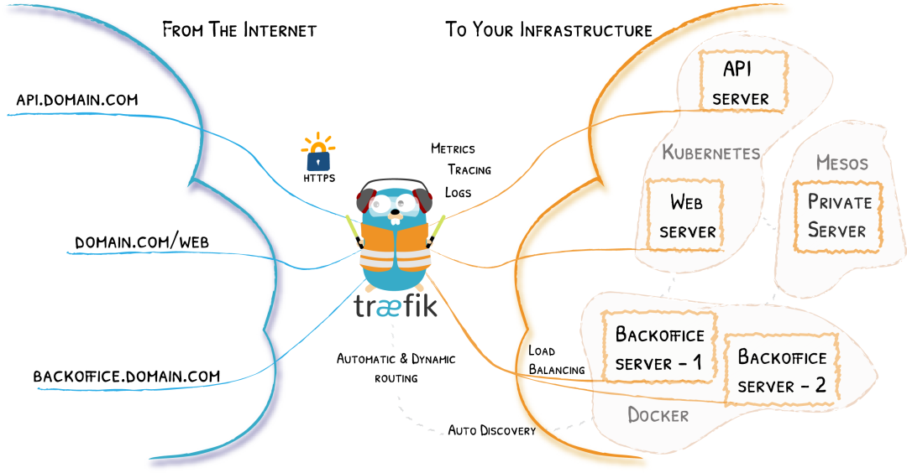

## 1.2 traefix 特性

- 非常快
- 无需安装其他依赖，通过Go语言编写的单一可执行文件
- 支持 Rest API
- 多种后台支持：Docker, Swarm, Kubernetes, Marathon, Mesos, Consul, Etcd, 并且还会更多
- 后台监控, 可以监听后台变化进而自动化应用新的配置文件设置
- 配置文件热更新。无需重启进程
- 正常结束http连接
- 后端断路器
- 轮询，rebalancer 负载均衡
- Rest Metrics
- 支持最小化官方docker 镜像
- 前、后台支持SSL
- 清爽的AngularJS前端页面
- 支持Websocket
- 支持HTTP/2
- 网络错误重试
- 支持[Let’s Encrypt](https://letsencrypt.org/) (自动更新HTTPS证书)
- 高可用集群模式

## 1.3 traefik与nginx ingress对比

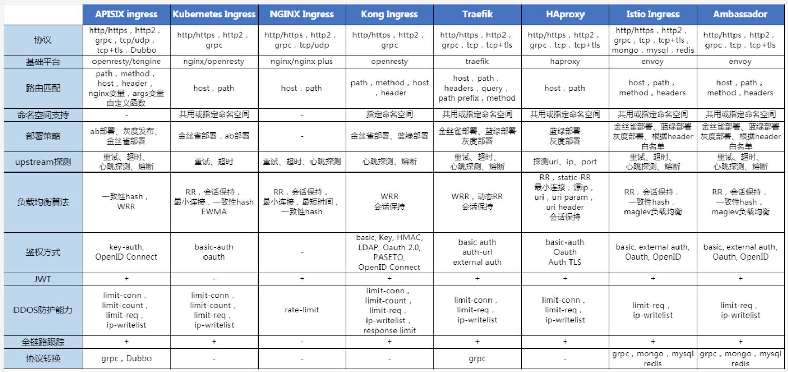

## 1.4 traefik核心概念及能力

Traefik是一个边缘路由器，它会拦截外部的请求并根据逻辑规则选择不同的操作方式，这些规则决定着这些请求到底该如何处理。Traefik提供自动发现能力，会实时检测服务，并自动更新路由规则。

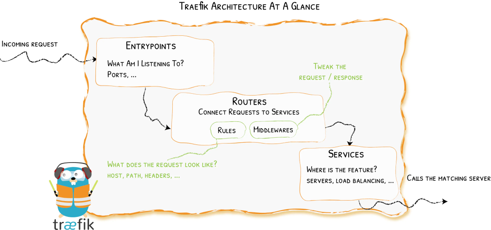

从上图可知，请求首先会连接到entrypoints，然后分析这些请求是否与定义的rules匹配，如果匹配，则会通过一系列middlewares，再到对应的services上。

这就涉及到以下几个重要的核心组件。

- Providers
- Entrypoints
- Routers
- Services
- Middlewares

下面分别介绍一下：

- Providers

Providers是基础组件，Traefik的配置发现是通过它来实现的，它可以是协调器，容器引擎，云提供商或者键值存储。

Traefik通过查询Providers的API来查询路由的相关信息，一旦检测到变化，就会动态的更新路由。

- 
  Entrypoints

Entrypoints是Traefik的网络入口，它定义接收请求的接口，以及是否监听TCP或者UDP。

- 
  Routers

Routers主要用于分析请求，并负责将这些请求连接到对应的服务上去，在这个过程中，Routers还可以使用Middlewares来更新请求，比如在把请求发到服务之前添加一些Headers。

- 
  Services

Services负责配置如何到达最终将处理传入请求的实际服务。

- 
  Middlewares

Middlewares用来修改请求或者根据请求来做出一些判断（authentication, rate limiting, headers, …），中间件被附件到路由上，是一种在请求发送到你的服务之前（或者在服务的响应发送到客户端之前）调整请求的一种方法。

# 二、traefik部署

## 2.1 获取traefik部署前置资源清单文件

### 2.1.1 创建CRD资源

>本次Traefik 是部署在 kube-system Namespace 下，如果不想部署到配置的 Namespace，需要修改下面部署文件中的 Namespace 参数。
>
>此yaml资源清单文件可在traefik.io网站直接复制使用：https://doc.traefik.io/traefik/v2.5/reference/dynamic-configuration/kubernetes-crd/#definitions

~~~powershell
# vim traefik-crd.yaml
---
apiVersion: apiextensions.k8s.io/v1
kind: CustomResourceDefinition
metadata:
  annotations:
    controller-gen.kubebuilder.io/version: v0.6.2
  creationTimestamp: null
  name: ingressroutes.traefik.containo.us
spec:
  group: traefik.containo.us
  names:
    kind: IngressRoute
    listKind: IngressRouteList
    plural: ingressroutes
    singular: ingressroute
  scope: Namespaced
  versions:
  - name: v1alpha1
    schema:
      openAPIV3Schema:
        description: IngressRoute is an Ingress CRD specification.
        properties:
          apiVersion:
            description: 'APIVersion defines the versioned schema of this representation
              of an object. Servers should convert recognized schemas to the latest
              internal value, and may reject unrecognized values. More info: https://git.k8s.io/community/contributors/devel/sig-architecture/api-conventions.md#resources'
            type: string
          kind:
            description: 'Kind is a string value representing the REST resource this
              object represents. Servers may infer this from the endpoint the client
              submits requests to. Cannot be updated. In CamelCase. More info: https://git.k8s.io/community/contributors/devel/sig-architecture/api-conventions.md#types-kinds'
            type: string
          metadata:
            type: object
          spec:
            description: IngressRouteSpec is a specification for a IngressRouteSpec
              resource.
            properties:
              entryPoints:
                items:
                  type: string
                type: array
              routes:
                items:
                  description: Route contains the set of routes.
                  properties:
                    kind:
                      enum:
                      - Rule
                      type: string
                    match:
                      type: string
                    middlewares:
                      items:
                        description: MiddlewareRef is a ref to the Middleware resources.
                        properties:
                          name:
                            type: string
                          namespace:
                            type: string
                        required:
                        - name
                        type: object
                      type: array
                    priority:
                      type: integer
                    services:
                      items:
                        description: Service defines an upstream to proxy traffic.
                        properties:
                          kind:
                            enum:
                            - Service
                            - TraefikService
                            type: string
                          name:
                            description: Name is a reference to a Kubernetes Service
                              object (for a load-balancer of servers), or to a TraefikService
                              object (service load-balancer, mirroring, etc). The
                              differentiation between the two is specified in the
                              Kind field.
                            type: string
                          namespace:
                            type: string
                          passHostHeader:
                            type: boolean
                          port:
                            anyOf:
                            - type: integer
                            - type: string
                            x-kubernetes-int-or-string: true
                          responseForwarding:
                            description: ResponseForwarding holds configuration for
                              the forward of the response.
                            properties:
                              flushInterval:
                                type: string
                            type: object
                          scheme:
                            type: string
                          serversTransport:
                            type: string
                          sticky:
                            description: Sticky holds the sticky configuration.
                            properties:
                              cookie:
                                description: Cookie holds the sticky configuration
                                  based on cookie.
                                properties:
                                  httpOnly:
                                    type: boolean
                                  name:
                                    type: string
                                  sameSite:
                                    type: string
                                  secure:
                                    type: boolean
                                type: object
                            type: object
                          strategy:
                            type: string
                          weight:
                            description: Weight should only be specified when Name
                              references a TraefikService object (and to be precise,
                              one that embeds a Weighted Round Robin).
                            type: integer
                        required:
                        - name
                        type: object
                      type: array
                  required:
                  - kind
                  - match
                  type: object
                type: array
              tls:
                description: "TLS contains the TLS certificates configuration of the
                  routes. To enable Let's Encrypt, use an empty TLS struct, e.g. in
                  YAML: \n \t tls: {} # inline format \n \t tls: \t   secretName:
                  # block format"
                properties:
                  certResolver:
                    type: string
                  domains:
                    items:
                      description: Domain holds a domain name with SANs.
                      properties:
                        main:
                          type: string
                        sans:
                          items:
                            type: string
                          type: array
                      type: object
                    type: array
                  options:
                    description: Options is a reference to a TLSOption, that specifies
                      the parameters of the TLS connection.
                    properties:
                      name:
                        type: string
                      namespace:
                        type: string
                    required:
                    - name
                    type: object
                  secretName:
                    description: SecretName is the name of the referenced Kubernetes
                      Secret to specify the certificate details.
                    type: string
                  store:
                    description: Store is a reference to a TLSStore, that specifies
                      the parameters of the TLS store.
                    properties:
                      name:
                        type: string
                      namespace:
                        type: string
                    required:
                    - name
                    type: object
                type: object
            required:
            - routes
            type: object
        required:
        - metadata
        - spec
        type: object
    served: true
    storage: true
status:
  acceptedNames:
    kind: ""
    plural: ""
  conditions: []
  storedVersions: []

---
apiVersion: apiextensions.k8s.io/v1
kind: CustomResourceDefinition
metadata:
  annotations:
    controller-gen.kubebuilder.io/version: v0.6.2
  creationTimestamp: null
  name: ingressroutetcps.traefik.containo.us
spec:
  group: traefik.containo.us
  names:
    kind: IngressRouteTCP
    listKind: IngressRouteTCPList
    plural: ingressroutetcps
    singular: ingressroutetcp
  scope: Namespaced
  versions:
  - name: v1alpha1
    schema:
      openAPIV3Schema:
        description: IngressRouteTCP is an Ingress CRD specification.
        properties:
          apiVersion:
            description: 'APIVersion defines the versioned schema of this representation
              of an object. Servers should convert recognized schemas to the latest
              internal value, and may reject unrecognized values. More info: https://git.k8s.io/community/contributors/devel/sig-architecture/api-conventions.md#resources'
            type: string
          kind:
            description: 'Kind is a string value representing the REST resource this
              object represents. Servers may infer this from the endpoint the client
              submits requests to. Cannot be updated. In CamelCase. More info: https://git.k8s.io/community/contributors/devel/sig-architecture/api-conventions.md#types-kinds'
            type: string
          metadata:
            type: object
          spec:
            description: IngressRouteTCPSpec is a specification for a IngressRouteTCPSpec
              resource.
            properties:
              entryPoints:
                items:
                  type: string
                type: array
              routes:
                items:
                  description: RouteTCP contains the set of routes.
                  properties:
                    match:
                      type: string
                    middlewares:
                      description: Middlewares contains references to MiddlewareTCP
                        resources.
                      items:
                        description: ObjectReference is a generic reference to a Traefik
                          resource.
                        properties:
                          name:
                            type: string
                          namespace:
                            type: string
                        required:
                        - name
                        type: object
                      type: array
                    services:
                      items:
                        description: ServiceTCP defines an upstream to proxy traffic.
                        properties:
                          name:
                            type: string
                          namespace:
                            type: string
                          port:
                            anyOf:
                            - type: integer
                            - type: string
                            x-kubernetes-int-or-string: true
                          proxyProtocol:
                            description: ProxyProtocol holds the ProxyProtocol configuration.
                            properties:
                              version:
                                type: integer
                            type: object
                          terminationDelay:
                            type: integer
                          weight:
                            type: integer
                        required:
                        - name
                        - port
                        type: object
                      type: array
                  required:
                  - match
                  type: object
                type: array
              tls:
                description: "TLSTCP contains the TLS certificates configuration of
                  the routes. To enable Let's Encrypt, use an empty TLS struct, e.g.
                  in YAML: \n \t tls: {} # inline format \n \t tls: \t   secretName:
                  # block format"
                properties:
                  certResolver:
                    type: string
                  domains:
                    items:
                      description: Domain holds a domain name with SANs.
                      properties:
                        main:
                          type: string
                        sans:
                          items:
                            type: string
                          type: array
                      type: object
                    type: array
                  options:
                    description: Options is a reference to a TLSOption, that specifies
                      the parameters of the TLS connection.
                    properties:
                      name:
                        type: string
                      namespace:
                        type: string
                    required:
                    - name
                    type: object
                  passthrough:
                    type: boolean
                  secretName:
                    description: SecretName is the name of the referenced Kubernetes
                      Secret to specify the certificate details.
                    type: string
                  store:
                    description: Store is a reference to a TLSStore, that specifies
                      the parameters of the TLS store.
                    properties:
                      name:
                        type: string
                      namespace:
                        type: string
                    required:
                    - name
                    type: object
                type: object
            required:
            - routes
            type: object
        required:
        - metadata
        - spec
        type: object
    served: true
    storage: true
status:
  acceptedNames:
    kind: ""
    plural: ""
  conditions: []
  storedVersions: []

---
apiVersion: apiextensions.k8s.io/v1
kind: CustomResourceDefinition
metadata:
  annotations:
    controller-gen.kubebuilder.io/version: v0.6.2
  creationTimestamp: null
  name: ingressrouteudps.traefik.containo.us
spec:
  group: traefik.containo.us
  names:
    kind: IngressRouteUDP
    listKind: IngressRouteUDPList
    plural: ingressrouteudps
    singular: ingressrouteudp
  scope: Namespaced
  versions:
  - name: v1alpha1
    schema:
      openAPIV3Schema:
        description: IngressRouteUDP is an Ingress CRD specification.
        properties:
          apiVersion:
            description: 'APIVersion defines the versioned schema of this representation
              of an object. Servers should convert recognized schemas to the latest
              internal value, and may reject unrecognized values. More info: https://git.k8s.io/community/contributors/devel/sig-architecture/api-conventions.md#resources'
            type: string
          kind:
            description: 'Kind is a string value representing the REST resource this
              object represents. Servers may infer this from the endpoint the client
              submits requests to. Cannot be updated. In CamelCase. More info: https://git.k8s.io/community/contributors/devel/sig-architecture/api-conventions.md#types-kinds'
            type: string
          metadata:
            type: object
          spec:
            description: IngressRouteUDPSpec is a specification for a IngressRouteUDPSpec
              resource.
            properties:
              entryPoints:
                items:
                  type: string
                type: array
              routes:
                items:
                  description: RouteUDP contains the set of routes.
                  properties:
                    services:
                      items:
                        description: ServiceUDP defines an upstream to proxy traffic.
                        properties:
                          name:
                            type: string
                          namespace:
                            type: string
                          port:
                            anyOf:
                            - type: integer
                            - type: string
                            x-kubernetes-int-or-string: true
                          weight:
                            type: integer
                        required:
                        - name
                        - port
                        type: object
                      type: array
                  type: object
                type: array
            required:
            - routes
            type: object
        required:
        - metadata
        - spec
        type: object
    served: true
    storage: true
status:
  acceptedNames:
    kind: ""
    plural: ""
  conditions: []
  storedVersions: []

---
apiVersion: apiextensions.k8s.io/v1
kind: CustomResourceDefinition
metadata:
  annotations:
    controller-gen.kubebuilder.io/version: v0.6.2
  creationTimestamp: null
  name: middlewares.traefik.containo.us
spec:
  group: traefik.containo.us
  names:
    kind: Middleware
    listKind: MiddlewareList
    plural: middlewares
    singular: middleware
  scope: Namespaced
  versions:
  - name: v1alpha1
    schema:
      openAPIV3Schema:
        description: Middleware is a specification for a Middleware resource.
        properties:
          apiVersion:
            description: 'APIVersion defines the versioned schema of this representation
              of an object. Servers should convert recognized schemas to the latest
              internal value, and may reject unrecognized values. More info: https://git.k8s.io/community/contributors/devel/sig-architecture/api-conventions.md#resources'
            type: string
          kind:
            description: 'Kind is a string value representing the REST resource this
              object represents. Servers may infer this from the endpoint the client
              submits requests to. Cannot be updated. In CamelCase. More info: https://git.k8s.io/community/contributors/devel/sig-architecture/api-conventions.md#types-kinds'
            type: string
          metadata:
            type: object
          spec:
            description: MiddlewareSpec holds the Middleware configuration.
            properties:
              addPrefix:
                description: AddPrefix holds the AddPrefix configuration.
                properties:
                  prefix:
                    type: string
                type: object
              basicAuth:
                description: BasicAuth holds the HTTP basic authentication configuration.
                properties:
                  headerField:
                    type: string
                  realm:
                    type: string
                  removeHeader:
                    type: boolean
                  secret:
                    type: string
                type: object
              buffering:
                description: Buffering holds the request/response buffering configuration.
                properties:
                  maxRequestBodyBytes:
                    format: int64
                    type: integer
                  maxResponseBodyBytes:
                    format: int64
                    type: integer
                  memRequestBodyBytes:
                    format: int64
                    type: integer
                  memResponseBodyBytes:
                    format: int64
                    type: integer
                  retryExpression:
                    type: string
                type: object
              chain:
                description: Chain holds a chain of middlewares.
                properties:
                  middlewares:
                    items:
                      description: MiddlewareRef is a ref to the Middleware resources.
                      properties:
                        name:
                          type: string
                        namespace:
                          type: string
                      required:
                      - name
                      type: object
                    type: array
                type: object
              circuitBreaker:
                description: CircuitBreaker holds the circuit breaker configuration.
                properties:
                  expression:
                    type: string
                type: object
              compress:
                description: Compress holds the compress configuration.
                properties:
                  excludedContentTypes:
                    items:
                      type: string
                    type: array
                type: object
              contentType:
                description: ContentType middleware - or rather its unique `autoDetect`
                  option - specifies whether to let the `Content-Type` header, if
                  it has not been set by the backend, be automatically set to a value
                  derived from the contents of the response. As a proxy, the default
                  behavior should be to leave the header alone, regardless of what
                  the backend did with it. However, the historic default was to always
                  auto-detect and set the header if it was nil, and it is going to
                  be kept that way in order to support users currently relying on
                  it. This middleware exists to enable the correct behavior until
                  at least the default one can be changed in a future version.
                properties:
                  autoDetect:
                    type: boolean
                type: object
              digestAuth:
                description: DigestAuth holds the Digest HTTP authentication configuration.
                properties:
                  headerField:
                    type: string
                  realm:
                    type: string
                  removeHeader:
                    type: boolean
                  secret:
                    type: string
                type: object
              errors:
                description: ErrorPage holds the custom error page configuration.
                properties:
                  query:
                    type: string
                  service:
                    description: Service defines an upstream to proxy traffic.
                    properties:
                      kind:
                        enum:
                        - Service
                        - TraefikService
                        type: string
                      name:
                        description: Name is a reference to a Kubernetes Service object
                          (for a load-balancer of servers), or to a TraefikService
                          object (service load-balancer, mirroring, etc). The differentiation
                          between the two is specified in the Kind field.
                        type: string
                      namespace:
                        type: string
                      passHostHeader:
                        type: boolean
                      port:
                        anyOf:
                        - type: integer
                        - type: string
                        x-kubernetes-int-or-string: true
                      responseForwarding:
                        description: ResponseForwarding holds configuration for the
                          forward of the response.
                        properties:
                          flushInterval:
                            type: string
                        type: object
                      scheme:
                        type: string
                      serversTransport:
                        type: string
                      sticky:
                        description: Sticky holds the sticky configuration.
                        properties:
                          cookie:
                            description: Cookie holds the sticky configuration based
                              on cookie.
                            properties:
                              httpOnly:
                                type: boolean
                              name:
                                type: string
                              sameSite:
                                type: string
                              secure:
                                type: boolean
                            type: object
                        type: object
                      strategy:
                        type: string
                      weight:
                        description: Weight should only be specified when Name references
                          a TraefikService object (and to be precise, one that embeds
                          a Weighted Round Robin).
                        type: integer
                    required:
                    - name
                    type: object
                  status:
                    items:
                      type: string
                    type: array
                type: object
              forwardAuth:
                description: ForwardAuth holds the http forward authentication configuration.
                properties:
                  address:
                    type: string
                  authRequestHeaders:
                    items:
                      type: string
                    type: array
                  authResponseHeaders:
                    items:
                      type: string
                    type: array
                  authResponseHeadersRegex:
                    type: string
                  tls:
                    description: ClientTLS holds TLS specific configurations as client.
                    properties:
                      caOptional:
                        type: boolean
                      caSecret:
                        type: string
                      certSecret:
                        type: string
                      insecureSkipVerify:
                        type: boolean
                    type: object
                  trustForwardHeader:
                    type: boolean
                type: object
              headers:
                description: Headers holds the custom header configuration.
                properties:
                  accessControlAllowCredentials:
                    description: AccessControlAllowCredentials is only valid if true.
                      false is ignored.
                    type: boolean
                  accessControlAllowHeaders:
                    description: AccessControlAllowHeaders must be used in response
                      to a preflight request with Access-Control-Request-Headers set.
                    items:
                      type: string
                    type: array
                  accessControlAllowMethods:
                    description: AccessControlAllowMethods must be used in response
                      to a preflight request with Access-Control-Request-Method set.
                    items:
                      type: string
                    type: array
                  accessControlAllowOriginList:
                    description: AccessControlAllowOriginList is a list of allowable
                      origins. Can also be a wildcard origin "*".
                    items:
                      type: string
                    type: array
                  accessControlAllowOriginListRegex:
                    description: AccessControlAllowOriginListRegex is a list of allowable
                      origins written following the Regular Expression syntax (https://golang.org/pkg/regexp/).
                    items:
                      type: string
                    type: array
                  accessControlExposeHeaders:
                    description: AccessControlExposeHeaders sets valid headers for
                      the response.
                    items:
                      type: string
                    type: array
                  accessControlMaxAge:
                    description: AccessControlMaxAge sets the time that a preflight
                      request may be cached.
                    format: int64
                    type: integer
                  addVaryHeader:
                    description: AddVaryHeader controls if the Vary header is automatically
                      added/updated when the AccessControlAllowOriginList is set.
                    type: boolean
                  allowedHosts:
                    items:
                      type: string
                    type: array
                  browserXssFilter:
                    type: boolean
                  contentSecurityPolicy:
                    type: string
                  contentTypeNosniff:
                    type: boolean
                  customBrowserXSSValue:
                    type: string
                  customFrameOptionsValue:
                    type: string
                  customRequestHeaders:
                    additionalProperties:
                      type: string
                    type: object
                  customResponseHeaders:
                    additionalProperties:
                      type: string
                    type: object
                  featurePolicy:
                    description: 'Deprecated: use PermissionsPolicy instead.'
                    type: string
                  forceSTSHeader:
                    type: boolean
                  frameDeny:
                    type: boolean
                  hostsProxyHeaders:
                    items:
                      type: string
                    type: array
                  isDevelopment:
                    type: boolean
                  permissionsPolicy:
                    type: string
                  publicKey:
                    type: string
                  referrerPolicy:
                    type: string
                  sslForceHost:
                    description: 'Deprecated: use RedirectRegex instead.'
                    type: boolean
                  sslHost:
                    description: 'Deprecated: use RedirectRegex instead.'
                    type: string
                  sslProxyHeaders:
                    additionalProperties:
                      type: string
                    type: object
                  sslRedirect:
                    description: 'Deprecated: use EntryPoint redirection or RedirectScheme
                      instead.'
                    type: boolean
                  sslTemporaryRedirect:
                    description: 'Deprecated: use EntryPoint redirection or RedirectScheme
                      instead.'
                    type: boolean
                  stsIncludeSubdomains:
                    type: boolean
                  stsPreload:
                    type: boolean
                  stsSeconds:
                    format: int64
                    type: integer
                type: object
              inFlightReq:
                description: InFlightReq limits the number of requests being processed
                  and served concurrently.
                properties:
                  amount:
                    format: int64
                    type: integer
                  sourceCriterion:
                    description: SourceCriterion defines what criterion is used to
                      group requests as originating from a common source. If none
                      are set, the default is to use the request's remote address
                      field. All fields are mutually exclusive.
                    properties:
                      ipStrategy:
                        description: IPStrategy holds the ip strategy configuration.
                        properties:
                          depth:
                            type: integer
                          excludedIPs:
                            items:
                              type: string
                            type: array
                        type: object
                      requestHeaderName:
                        type: string
                      requestHost:
                        type: boolean
                    type: object
                type: object
              ipWhiteList:
                description: IPWhiteList holds the ip white list configuration.
                properties:
                  ipStrategy:
                    description: IPStrategy holds the ip strategy configuration.
                    properties:
                      depth:
                        type: integer
                      excludedIPs:
                        items:
                          type: string
                        type: array
                    type: object
                  sourceRange:
                    items:
                      type: string
                    type: array
                type: object
              passTLSClientCert:
                description: PassTLSClientCert holds the TLS client cert headers configuration.
                properties:
                  info:
                    description: TLSClientCertificateInfo holds the client TLS certificate
                      info configuration.
                    properties:
                      issuer:
                        description: TLSClientCertificateDNInfo holds the client TLS
                          certificate distinguished name info configuration. cf https://tools.ietf.org/html/rfc3739
                        properties:
                          commonName:
                            type: boolean
                          country:
                            type: boolean
                          domainComponent:
                            type: boolean
                          locality:
                            type: boolean
                          organization:
                            type: boolean
                          province:
                            type: boolean
                          serialNumber:
                            type: boolean
                        type: object
                      notAfter:
                        type: boolean
                      notBefore:
                        type: boolean
                      sans:
                        type: boolean
                      serialNumber:
                        type: boolean
                      subject:
                        description: TLSClientCertificateDNInfo holds the client TLS
                          certificate distinguished name info configuration. cf https://tools.ietf.org/html/rfc3739
                        properties:
                          commonName:
                            type: boolean
                          country:
                            type: boolean
                          domainComponent:
                            type: boolean
                          locality:
                            type: boolean
                          organization:
                            type: boolean
                          province:
                            type: boolean
                          serialNumber:
                            type: boolean
                        type: object
                    type: object
                  pem:
                    type: boolean
                type: object
              plugin:
                additionalProperties:
                  x-kubernetes-preserve-unknown-fields: true
                type: object
              rateLimit:
                description: RateLimit holds the rate limiting configuration for a
                  given router.
                properties:
                  average:
                    format: int64
                    type: integer
                  burst:
                    format: int64
                    type: integer
                  period:
                    anyOf:
                    - type: integer
                    - type: string
                    x-kubernetes-int-or-string: true
                  sourceCriterion:
                    description: SourceCriterion defines what criterion is used to
                      group requests as originating from a common source. If none
                      are set, the default is to use the request's remote address
                      field. All fields are mutually exclusive.
                    properties:
                      ipStrategy:
                        description: IPStrategy holds the ip strategy configuration.
                        properties:
                          depth:
                            type: integer
                          excludedIPs:
                            items:
                              type: string
                            type: array
                        type: object
                      requestHeaderName:
                        type: string
                      requestHost:
                        type: boolean
                    type: object
                type: object
              redirectRegex:
                description: RedirectRegex holds the redirection configuration.
                properties:
                  permanent:
                    type: boolean
                  regex:
                    type: string
                  replacement:
                    type: string
                type: object
              redirectScheme:
                description: RedirectScheme holds the scheme redirection configuration.
                properties:
                  permanent:
                    type: boolean
                  port:
                    type: string
                  scheme:
                    type: string
                type: object
              replacePath:
                description: ReplacePath holds the ReplacePath configuration.
                properties:
                  path:
                    type: string
                type: object
              replacePathRegex:
                description: ReplacePathRegex holds the ReplacePathRegex configuration.
                properties:
                  regex:
                    type: string
                  replacement:
                    type: string
                type: object
              retry:
                description: Retry holds the retry configuration.
                properties:
                  attempts:
                    type: integer
                  initialInterval:
                    anyOf:
                    - type: integer
                    - type: string
                    x-kubernetes-int-or-string: true
                type: object
              stripPrefix:
                description: StripPrefix holds the StripPrefix configuration.
                properties:
                  forceSlash:
                    type: boolean
                  prefixes:
                    items:
                      type: string
                    type: array
                type: object
              stripPrefixRegex:
                description: StripPrefixRegex holds the StripPrefixRegex configuration.
                properties:
                  regex:
                    items:
                      type: string
                    type: array
                type: object
            type: object
        required:
        - metadata
        - spec
        type: object
    served: true
    storage: true
status:
  acceptedNames:
    kind: ""
    plural: ""
  conditions: []
  storedVersions: []

---
apiVersion: apiextensions.k8s.io/v1
kind: CustomResourceDefinition
metadata:
  annotations:
    controller-gen.kubebuilder.io/version: v0.6.2
  creationTimestamp: null
  name: middlewaretcps.traefik.containo.us
spec:
  group: traefik.containo.us
  names:
    kind: MiddlewareTCP
    listKind: MiddlewareTCPList
    plural: middlewaretcps
    singular: middlewaretcp
  scope: Namespaced
  versions:
  - name: v1alpha1
    schema:
      openAPIV3Schema:
        description: MiddlewareTCP is a specification for a MiddlewareTCP resource.
        properties:
          apiVersion:
            description: 'APIVersion defines the versioned schema of this representation
              of an object. Servers should convert recognized schemas to the latest
              internal value, and may reject unrecognized values. More info: https://git.k8s.io/community/contributors/devel/sig-architecture/api-conventions.md#resources'
            type: string
          kind:
            description: 'Kind is a string value representing the REST resource this
              object represents. Servers may infer this from the endpoint the client
              submits requests to. Cannot be updated. In CamelCase. More info: https://git.k8s.io/community/contributors/devel/sig-architecture/api-conventions.md#types-kinds'
            type: string
          metadata:
            type: object
          spec:
            description: MiddlewareTCPSpec holds the MiddlewareTCP configuration.
            properties:
              ipWhiteList:
                description: TCPIPWhiteList holds the TCP ip white list configuration.
                properties:
                  sourceRange:
                    items:
                      type: string
                    type: array
                type: object
            type: object
        required:
        - metadata
        - spec
        type: object
    served: true
    storage: true
status:
  acceptedNames:
    kind: ""
    plural: ""
  conditions: []
  storedVersions: []

---
apiVersion: apiextensions.k8s.io/v1
kind: CustomResourceDefinition
metadata:
  annotations:
    controller-gen.kubebuilder.io/version: v0.6.2
  creationTimestamp: null
  name: serverstransports.traefik.containo.us
spec:
  group: traefik.containo.us
  names:
    kind: ServersTransport
    listKind: ServersTransportList
    plural: serverstransports
    singular: serverstransport
  scope: Namespaced
  versions:
  - name: v1alpha1
    schema:
      openAPIV3Schema:
        description: ServersTransport is a specification for a ServersTransport resource.
        properties:
          apiVersion:
            description: 'APIVersion defines the versioned schema of this representation
              of an object. Servers should convert recognized schemas to the latest
              internal value, and may reject unrecognized values. More info: https://git.k8s.io/community/contributors/devel/sig-architecture/api-conventions.md#resources'
            type: string
          kind:
            description: 'Kind is a string value representing the REST resource this
              object represents. Servers may infer this from the endpoint the client
              submits requests to. Cannot be updated. In CamelCase. More info: https://git.k8s.io/community/contributors/devel/sig-architecture/api-conventions.md#types-kinds'
            type: string
          metadata:
            type: object
          spec:
            description: ServersTransportSpec options to configure communication between
              Traefik and the servers.
            properties:
              certificatesSecrets:
                description: Certificates for mTLS.
                items:
                  type: string
                type: array
              disableHTTP2:
                description: Disable HTTP/2 for connections with backend servers.
                type: boolean
              forwardingTimeouts:
                description: Timeouts for requests forwarded to the backend servers.
                properties:
                  dialTimeout:
                    anyOf:
                    - type: integer
                    - type: string
                    description: The amount of time to wait until a connection to
                      a backend server can be established. If zero, no timeout exists.
                    x-kubernetes-int-or-string: true
                  idleConnTimeout:
                    anyOf:
                    - type: integer
                    - type: string
                    description: The maximum period for which an idle HTTP keep-alive
                      connection will remain open before closing itself.
                    x-kubernetes-int-or-string: true
                  responseHeaderTimeout:
                    anyOf:
                    - type: integer
                    - type: string
                    description: The amount of time to wait for a server's response
                      headers after fully writing the request (including its body,
                      if any). If zero, no timeout exists.
                    x-kubernetes-int-or-string: true
                type: object
              insecureSkipVerify:
                description: Disable SSL certificate verification.
                type: boolean
              maxIdleConnsPerHost:
                description: If non-zero, controls the maximum idle (keep-alive) to
                  keep per-host. If zero, DefaultMaxIdleConnsPerHost is used.
                type: integer
              peerCertURI:
                description: URI used to match against SAN URI during the peer certificate
                  verification.
                type: string
              rootCAsSecrets:
                description: Add cert file for self-signed certificate.
                items:
                  type: string
                type: array
              serverName:
                description: ServerName used to contact the server.
                type: string
            type: object
        required:
        - metadata
        - spec
        type: object
    served: true
    storage: true
status:
  acceptedNames:
    kind: ""
    plural: ""
  conditions: []
  storedVersions: []

---
apiVersion: apiextensions.k8s.io/v1
kind: CustomResourceDefinition
metadata:
  annotations:
    controller-gen.kubebuilder.io/version: v0.6.2
  creationTimestamp: null
  name: tlsoptions.traefik.containo.us
spec:
  group: traefik.containo.us
  names:
    kind: TLSOption
    listKind: TLSOptionList
    plural: tlsoptions
    singular: tlsoption
  scope: Namespaced
  versions:
  - name: v1alpha1
    schema:
      openAPIV3Schema:
        description: TLSOption is a specification for a TLSOption resource.
        properties:
          apiVersion:
            description: 'APIVersion defines the versioned schema of this representation
              of an object. Servers should convert recognized schemas to the latest
              internal value, and may reject unrecognized values. More info: https://git.k8s.io/community/contributors/devel/sig-architecture/api-conventions.md#resources'
            type: string
          kind:
            description: 'Kind is a string value representing the REST resource this
              object represents. Servers may infer this from the endpoint the client
              submits requests to. Cannot be updated. In CamelCase. More info: https://git.k8s.io/community/contributors/devel/sig-architecture/api-conventions.md#types-kinds'
            type: string
          metadata:
            type: object
          spec:
            description: TLSOptionSpec configures TLS for an entry point.
            properties:
              alpnProtocols:
                items:
                  type: string
                type: array
              cipherSuites:
                items:
                  type: string
                type: array
              clientAuth:
                description: ClientAuth defines the parameters of the client authentication
                  part of the TLS connection, if any.
                properties:
                  clientAuthType:
                    description: ClientAuthType defines the client authentication
                      type to apply.
                    enum:
                    - NoClientCert
                    - RequestClientCert
                    - RequireAnyClientCert
                    - VerifyClientCertIfGiven
                    - RequireAndVerifyClientCert
                    type: string
                  secretNames:
                    description: SecretName is the name of the referenced Kubernetes
                      Secret to specify the certificate details.
                    items:
                      type: string
                    type: array
                type: object
              curvePreferences:
                items:
                  type: string
                type: array
              maxVersion:
                type: string
              minVersion:
                type: string
              preferServerCipherSuites:
                type: boolean
              sniStrict:
                type: boolean
            type: object
        required:
        - metadata
        - spec
        type: object
    served: true
    storage: true
status:
  acceptedNames:
    kind: ""
    plural: ""
  conditions: []
  storedVersions: []

---
apiVersion: apiextensions.k8s.io/v1
kind: CustomResourceDefinition
metadata:
  annotations:
    controller-gen.kubebuilder.io/version: v0.6.2
  creationTimestamp: null
  name: tlsstores.traefik.containo.us
spec:
  group: traefik.containo.us
  names:
    kind: TLSStore
    listKind: TLSStoreList
    plural: tlsstores
    singular: tlsstore
  scope: Namespaced
  versions:
  - name: v1alpha1
    schema:
      openAPIV3Schema:
        description: TLSStore is a specification for a TLSStore resource.
        properties:
          apiVersion:
            description: 'APIVersion defines the versioned schema of this representation
              of an object. Servers should convert recognized schemas to the latest
              internal value, and may reject unrecognized values. More info: https://git.k8s.io/community/contributors/devel/sig-architecture/api-conventions.md#resources'
            type: string
          kind:
            description: 'Kind is a string value representing the REST resource this
              object represents. Servers may infer this from the endpoint the client
              submits requests to. Cannot be updated. In CamelCase. More info: https://git.k8s.io/community/contributors/devel/sig-architecture/api-conventions.md#types-kinds'
            type: string
          metadata:
            type: object
          spec:
            description: TLSStoreSpec configures a TLSStore resource.
            properties:
              defaultCertificate:
                description: DefaultCertificate holds a secret name for the TLSOption
                  resource.
                properties:
                  secretName:
                    description: SecretName is the name of the referenced Kubernetes
                      Secret to specify the certificate details.
                    type: string
                required:
                - secretName
                type: object
            required:
            - defaultCertificate
            type: object
        required:
        - metadata
        - spec
        type: object
    served: true
    storage: true
status:
  acceptedNames:
    kind: ""
    plural: ""
  conditions: []
  storedVersions: []

---
apiVersion: apiextensions.k8s.io/v1
kind: CustomResourceDefinition
metadata:
  annotations:
    controller-gen.kubebuilder.io/version: v0.6.2
  creationTimestamp: null
  name: traefikservices.traefik.containo.us
spec:
  group: traefik.containo.us
  names:
    kind: TraefikService
    listKind: TraefikServiceList
    plural: traefikservices
    singular: traefikservice
  scope: Namespaced
  versions:
  - name: v1alpha1
    schema:
      openAPIV3Schema:
        description: TraefikService is the specification for a service (that an IngressRoute
          refers to) that is usually not a terminal service (i.e. not a pod of servers),
          as opposed to a Kubernetes Service. That is to say, it usually refers to
          other (children) services, which themselves can be TraefikServices or Services.
        properties:
          apiVersion:
            description: 'APIVersion defines the versioned schema of this representation
              of an object. Servers should convert recognized schemas to the latest
              internal value, and may reject unrecognized values. More info: https://git.k8s.io/community/contributors/devel/sig-architecture/api-conventions.md#resources'
            type: string
          kind:
            description: 'Kind is a string value representing the REST resource this
              object represents. Servers may infer this from the endpoint the client
              submits requests to. Cannot be updated. In CamelCase. More info: https://git.k8s.io/community/contributors/devel/sig-architecture/api-conventions.md#types-kinds'
            type: string
          metadata:
            type: object
          spec:
            description: ServiceSpec defines whether a TraefikService is a load-balancer
              of services or a mirroring service.
            properties:
              mirroring:
                description: Mirroring defines a mirroring service, which is composed
                  of a main load-balancer, and a list of mirrors.
                properties:
                  kind:
                    enum:
                    - Service
                    - TraefikService
                    type: string
                  maxBodySize:
                    format: int64
                    type: integer
                  mirrors:
                    items:
                      description: MirrorService defines one of the mirrors of a Mirroring
                        service.
                      properties:
                        kind:
                          enum:
                          - Service
                          - TraefikService
                          type: string
                        name:
                          description: Name is a reference to a Kubernetes Service
                            object (for a load-balancer of servers), or to a TraefikService
                            object (service load-balancer, mirroring, etc). The differentiation
                            between the two is specified in the Kind field.
                          type: string
                        namespace:
                          type: string
                        passHostHeader:
                          type: boolean
                        percent:
                          type: integer
                        port:
                          anyOf:
                          - type: integer
                          - type: string
                          x-kubernetes-int-or-string: true
                        responseForwarding:
                          description: ResponseForwarding holds configuration for
                            the forward of the response.
                          properties:
                            flushInterval:
                              type: string
                          type: object
                        scheme:
                          type: string
                        serversTransport:
                          type: string
                        sticky:
                          description: Sticky holds the sticky configuration.
                          properties:
                            cookie:
                              description: Cookie holds the sticky configuration based
                                on cookie.
                              properties:
                                httpOnly:
                                  type: boolean
                                name:
                                  type: string
                                sameSite:
                                  type: string
                                secure:
                                  type: boolean
                              type: object
                          type: object
                        strategy:
                          type: string
                        weight:
                          description: Weight should only be specified when Name references
                            a TraefikService object (and to be precise, one that embeds
                            a Weighted Round Robin).
                          type: integer
                      required:
                      - name
                      type: object
                    type: array
                  name:
                    description: Name is a reference to a Kubernetes Service object
                      (for a load-balancer of servers), or to a TraefikService object
                      (service load-balancer, mirroring, etc). The differentiation
                      between the two is specified in the Kind field.
                    type: string
                  namespace:
                    type: string
                  passHostHeader:
                    type: boolean
                  port:
                    anyOf:
                    - type: integer
                    - type: string
                    x-kubernetes-int-or-string: true
                  responseForwarding:
                    description: ResponseForwarding holds configuration for the forward
                      of the response.
                    properties:
                      flushInterval:
                        type: string
                    type: object
                  scheme:
                    type: string
                  serversTransport:
                    type: string
                  sticky:
                    description: Sticky holds the sticky configuration.
                    properties:
                      cookie:
                        description: Cookie holds the sticky configuration based on
                          cookie.
                        properties:
                          httpOnly:
                            type: boolean
                          name:
                            type: string
                          sameSite:
                            type: string
                          secure:
                            type: boolean
                        type: object
                    type: object
                  strategy:
                    type: string
                  weight:
                    description: Weight should only be specified when Name references
                      a TraefikService object (and to be precise, one that embeds
                      a Weighted Round Robin).
                    type: integer
                required:
                - name
                type: object
              weighted:
                description: WeightedRoundRobin defines a load-balancer of services.
                properties:
                  services:
                    items:
                      description: Service defines an upstream to proxy traffic.
                      properties:
                        kind:
                          enum:
                          - Service
                          - TraefikService
                          type: string
                        name:
                          description: Name is a reference to a Kubernetes Service
                            object (for a load-balancer of servers), or to a TraefikService
                            object (service load-balancer, mirroring, etc). The differentiation
                            between the two is specified in the Kind field.
                          type: string
                        namespace:
                          type: string
                        passHostHeader:
                          type: boolean
                        port:
                          anyOf:
                          - type: integer
                          - type: string
                          x-kubernetes-int-or-string: true
                        responseForwarding:
                          description: ResponseForwarding holds configuration for
                            the forward of the response.
                          properties:
                            flushInterval:
                              type: string
                          type: object
                        scheme:
                          type: string
                        serversTransport:
                          type: string
                        sticky:
                          description: Sticky holds the sticky configuration.
                          properties:
                            cookie:
                              description: Cookie holds the sticky configuration based
                                on cookie.
                              properties:
                                httpOnly:
                                  type: boolean
                                name:
                                  type: string
                                sameSite:
                                  type: string
                                secure:
                                  type: boolean
                              type: object
                          type: object
                        strategy:
                          type: string
                        weight:
                          description: Weight should only be specified when Name references
                            a TraefikService object (and to be precise, one that embeds
                            a Weighted Round Robin).
                          type: integer
                      required:
                      - name
                      type: object
                    type: array
                  sticky:
                    description: Sticky holds the sticky configuration.
                    properties:
                      cookie:
                        description: Cookie holds the sticky configuration based on
                          cookie.
                        properties:
                          httpOnly:
                            type: boolean
                          name:
                            type: string
                          sameSite:
                            type: string
                          secure:
                            type: boolean
                        type: object
                    type: object
                type: object
            type: object
        required:
        - metadata
        - spec
        type: object
    served: true
    storage: true
status:
  acceptedNames:
    kind: ""
    plural: ""
  conditions: []
  storedVersions: []
~~~

### 2.1.2 创建RBAC权限

> 基于角色的访问控制（RBAC）策略，方便对Kubernetes资源和API进行细粒度控制
>
> traefik需要一定的权限，需要提前创建ServiceAccount并分配一定的权限。

~~~powershell
# vim traefik-rbac.yaml
apiVersion: v1
kind: ServiceAccount
metadata:
  namespace: kube-system
  name: traefik-ingress-controller
---
apiVersion: rbac.authorization.k8s.io/v1
kind: ClusterRole
metadata:
  name: traefik-ingress-controller
rules:
  - apiGroups:
      - ""
    resources:
      - services
      - endpoints
      - secrets
    verbs:
      - get
      - list
      - watch
  - apiGroups:
      - extensions
      - networking.k8s.io
    resources:
      - ingresses
      - ingressclasses
    verbs:
      - get
      - list
      - watch
  - apiGroups:
      - extensions
    resources:
      - ingresses/status
    verbs:
      - update
  - apiGroups:
      - traefik.containo.us
    resources:
      - middlewares
      - middlewaretcps
      - ingressroutes
      - traefikservices
      - ingressroutetcps
      - ingressrouteudps
      - tlsoptions
      - tlsstores
      - serverstransports
    verbs:
      - get
      - list
      - watch
---
apiVersion: rbac.authorization.k8s.io/v1
kind: ClusterRoleBinding
metadata:
  name: traefik-ingress-controller
roleRef:
  apiGroup: rbac.authorization.k8s.io
  kind: ClusterRole
  name: traefik-ingress-controller
subjects:
  - kind: ServiceAccount
    name: traefik-ingress-controller
    namespace: kube-system
~~~

### 2.1.3 创建traefik配置文件

> 由traefik配置很多，通过CLI定义不方便，一般都通过配置文件对traefik进行参数配置，例如使用ConfigMap将配置挂载至traefik中

~~~powershell
# vim traefik-configmap.yaml
apiVersion: v1
kind: ConfigMap
metadata:
  name: traefik
  namespace: kube-system
data:
  traefik.yaml: |-
    serversTransport:
      insecureSkipVerify: true ## 略验证代理服务的 TLS 证书
    api:
      insecure: true  ## 允许 HTTP 方式访问 API
      dashboard: true  ## 启用 Dashboard
      debug: true  ## 启用 Debug 调试模式
    metrics:
      prometheus: ""  ## 配置 Prometheus 监控指标数据，并使用默认配置
    entryPoints:
      web:
        address: ":80" ## 配置 80 端口，并设置入口名称为 web
      websecure:
        address: ":443"  ## 配置 443 端口，并设置入口名称为 websecure
      metrics:
        address: ":8082" ## 配置 8082端口，并设置入口名称为 metrics
      tcpep:
        address: ":8083"  ## 配置 8083端口，并设置入口名称为 tcpep,做为tcp入口
      udpep:
        address: ":8084/udp"  ## 配置 8084端口，并设置入口名称为 udpep，做为udp入口
    providers:
      kubernetesCRD: ""  ## 启用 Kubernetes CRD 方式来配置路由规则
      kubernetesingress: ""  ## 启用 Kubernetes Ingress 方式来配置路由规则
      kubernetesGateway: "" ## 启用 Kubernetes Gateway API
    experimental:
      kubernetesGateway: true  ## 允许使用 Kubernetes Gateway API
    log:
      filePath: "" ## 设置调试日志文件存储路径，如果为空则输出到控制台
      level: error ## 设置调试日志级别
      format: json  ## 设置调试日志格式
    accessLog:
      filePath: ""  ## 设置访问日志文件存储路径，如果为空则输出到控制台
      format: json  ## 设置访问调试日志格式
      bufferingSize: 0  ## 设置访问日志缓存行数
      filters:
        retryAttempts: true  ## 设置代理访问重试失败时，保留访问日志
        minDuration: 20   ## 设置保留请求时间超过指定持续时间的访问日志
      fields:             ## 设置访问日志中的字段是否保留（keep 保留、drop 不保留）
        defaultMode: keep ## 设置默认保留访问日志字段
        names:
          ClientUsername: drop  
        headers:
          defaultMode: keep  ##  设置 Header 中字段是否保留,设置默认保留 Header 中字段
          names:  ## 针对 Header 中特别字段特别配置保留模式
            User-Agent: redact
            Authorization: drop
            Content-Type: keep
~~~

### 2.1.4 应用上述资源清单文件

~~~powershell
# kubectl apply -f traefik-crd.yaml
~~~

~~~powershell
# kubectl apply -f traefik-rbac.yaml
~~~

~~~powershell
# kubectl apply -f traefik-config.yaml
~~~

### 2.1.5 设置节点Label

> 由于使用DaemonSet方式部署Traefik，所以需要为节点设置label，当应用部署时会根据节点Label进行选择。

~~~powershell
设置节点标签
# kubectl label nodes --all IngressProxy=true
~~~

~~~powershell
查看节点标签
# kubectl get nodes --show-labels
~~~

~~~powershell
如需要取消时，可执行下述命令
# kubectl label nodes --all IngressProxy-
~~~

## 2.2 部署Traefik

### 2.2.1 deploy资源清单文件准备

> 本次将用Daemonset方式部署traefik,便于后期扩展
>
> 本次部署通过hostport方式把Pod中容器内的80、443映射到物理机，方便集群外访问。

~~~powershell
# vim traefik-deploy.yaml
apiVersion: apps/v1
kind: DaemonSet
metadata:
  namespace: kube-system
  name: traefik
  labels:
    app: traefik
spec:
  selector:
    matchLabels:
      app: traefik
  template:
    metadata:
      labels:
        app: traefik
    spec:
      serviceAccountName: traefik-ingress-controller
      containers:
        - name: traefik
          image: traefik:v2.5.7
          args:
            - --configfile=/config/traefik.yaml
          volumeMounts:
            - mountPath: /config
              name: config
          ports:
            - name: web
              containerPort: 80
              hostPort: 80  ## 将容器端口绑定所在服务器的 80 端口
            - name: websecure
              containerPort: 443
              hostPort: 443  ## 将容器端口绑定所在服务器的 443 端口
            - name: admin
              containerPort: 8080  ## Traefik Dashboard 端口
            - name: tcpep
              containerPort: 8083
              hostPort: 8083  ## 将容器端口绑定所在服务器的 8083 端口
            - name: udpep
              containerPort: 8084
              hostPort: 8084  ## 将容器端口绑定所在服务器的 8084 端口
              protocol: UDP
      volumes:
        - name: config
          configMap:
            name: traefik
      tolerations:              ## 设置容忍所有污点，防止节点被设置污点
        - operator: "Exists"
      nodeSelector:             ## 设置node筛选器，在特定label的节点上启动
        IngressProxy: "true"
~~~

~~~powershell
验证端口配置是否正确
# kubectl get daemonset traefik -n kube-system -o yaml
~~~

### 2.2.2 应用deploy资源清单文件

~~~powershell
# kubectl apply -f traefix-deploy.yaml
~~~

### 2.2.3 service资源清单文件准备

~~~powershell
# vim traefix-service.yaml
apiVersion: v1
kind: Service
metadata:
  name: traefik
  namespace: kube-system
spec:
  ports:
    - protocol: TCP
      name: web
      port: 80
    - protocol: TCP
      name: admin
      port: 8080
    - protocol: TCP
      name: websecure
      port: 443
    - protocol: TCP
      name: tcpep
      port: 8083
    - protocol: UDP
      name: udpep
      port: 8084
  selector:
    app: traefik
~~~

### 2.2.4 应用service资源清单文件

~~~powershell
# kubectl apply -f traefik-service.yaml
~~~

## 2.3 配置访问traefik dashboard路由规则

>Traefik 应用已经部署完成，但是想让外部访问 Kubernetes 内部服务，还需要配置路由规则，上面部署 Traefik 时开启了 Traefik Dashboard，这是 Traefik 提供的视图看板，所以，首先配置基于 HTTP 的 Traefik Dashboard 路由规则，使外部能够访问 Traefik Dashboard。这里使用 IngressRoute方式进行演示。

### 2.3.1 Traefik创建路由规则方法

- 原生ingress
- CRD IngressRoute
- Gateway API

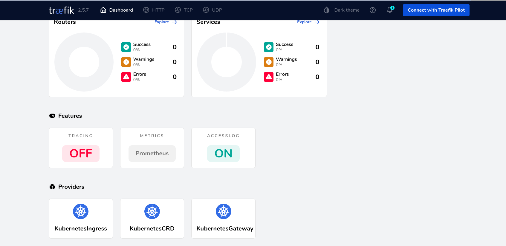

### 2.3.2 通过原生ingress方式暴露traefik dashboard

~~~powershell
# kubectl get svc -n kube-system
NAME             TYPE        CLUSTER-IP     EXTERNAL-IP   PORT(S)                                     AGE
traefik          ClusterIP   10.96.174.88   <none>        80/TCP,8080/TCP,443/TCP,8083/TCP,8084/UDP   6h44m
~~~

~~~powershell
# kubectl get endpoints -n kube-system
NAME             ENDPOINTS                                                           AGE
traefik          10.244.135.204:80,10.244.159.141:80,10.244.194.92:80 + 17 more...   6h44m
~~~

~~~powershell
# cat traefik-dashboard-native-ingress.yaml
apiVersion: networking.k8s.io/v1
kind: Ingress
metadata:
  name: traefik-dashboard-ingress
  namespace: kube-system
  annotations:
    kubernetes.io/ingress.class: traefik
    traefik.ingress.kubernetes.io/router.entrypoints: web
spec:
  rules:
  - host: tfni.kubemsb.com
    http:
      paths:
      - pathType: Prefix
        path: /
        backend:
          service:
            name: traefik
            port:
              number: 8080
~~~

~~~powershell
# kubectl apply -f traefik-dashboard-native-ingress.yaml
~~~

~~~powershell
# kubectl get ingress -n kube-system
NAME                        CLASS    HOSTS              ADDRESS   PORTS   AGE
traefik-dashboard-ingress   <none>   tfni.kubemsb.com             80      56m
~~~

~~~powershell
# kubectl describe ingress traefik-dashboard-ingress -n kube-system
Name:             traefik-dashboard-ingress
Namespace:        kube-system
Address:
Default backend:  default-http-backend:80 (<error: endpoints "default-http-backend" not found>)
Rules:
  Host              Path  Backends
  ----              ----  --------
  tfni.kubemsb.com
                    /   traefik:8080 (10.244.135.204:8080,10.244.159.141:8080,10.244.194.92:8080 + 1 more...)
Annotations:        kubernetes.io/ingress.class: traefik
                    traefik.ingress.kubernetes.io/router.entrypoints: web
Events:             <none>
~~~

**在集群之外主机访问**

~~~powershell
# vim /etc/hosts
......
192.168.10.12 tfni.kubemsb.com
~~~

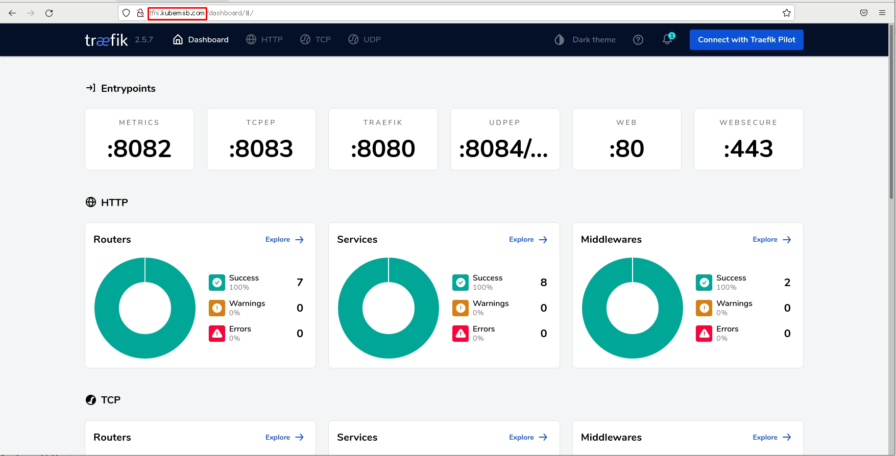

### 2.3.3 创建dashboard ingress route资源清单文件

~~~powershell
# vim traefik-dashboard-ingress-route.yaml
apiVersion: traefik.containo.us/v1alpha1
kind: IngressRoute
metadata:
  name: traefik
  namespace: kube-system
spec:
  entryPoints:
    - web
  routes:
  - match: Host(`traefik.kubemsb.com`) && PathPrefix(`/`)
    kind: Rule
    services:
    - name: traefik
      port: 8080
~~~

### 2.3.4 应用资源清单文件

~~~powershell
# kubectl apply -f traefik-dashboard-ingress-route.yaml
~~~

### 2.3.5 在集群内或集群外主机配置域名解析

~~~powershell
把域名解析为kubernetes集群任意节点IP既可。
# vim /etc/hosts
192.168.10.12 traefik.kubemsb.com
~~~

### 2.3.6 通过域名访问traefik dashboard

~~~powershell
# firefox http://traefik.kubemsb.com &
~~~

# 三、traefik基础应用

## 3.1 配置kubernetes dashboard路由规则

> 必须使用SSL证书创建secret密钥

### 3.1.1 查看kubernetes dashboard service状态

~~~powershell
# kubectl get svc -n kubernetes-dashboard
NAME                        TYPE        CLUSTER-IP    EXTERNAL-IP   PORT(S)         AGE
dashboard-metrics-scraper   ClusterIP   10.96.100.4   <none>        8000/TCP        21d
kubernetes-dashboard        NodePort    10.96.19.1    <none>        443:30000/TCP   21d
~~~

### 3.1.2 编写访问kubernetes dashboard 路由规则

~~~powershell
# ls
6864844_kubemsb.com_nginx.zip  kubemsb.key  kubemsb.pem
~~~

~~~powershell
# kubectl create secret tls kubemsb-tls --cert=kubemsb.pem --key=kubemsb.key
secret/kubemsb-tls created
~~~

~~~powershell
# kubectl get secret
NAME                                 TYPE                                  DATA   AGE
default-token-x4qbc                  kubernetes.io/service-account-token   3      24d
kubemsb-tls                          kubernetes.io/tls                     2      11s
~~~

~~~powershell
# vim kubernetes-dashboard-ir.yaml
apiVersion: traefik.containo.us/v1alpha1
kind: IngressRoute
metadata:
  name: kubernetes-dashboard
  namespace: kubernetes-dashboard
spec:
  entryPoints:
    - websecure
  routes:
  - match: Host(`dashboard.kubemsb.com`)
    kind: Rule
    services:
    - name: kubernetes-dashboard
      port: 443
  tls:
    secretName: kubemsb-tls
~~~

### 3.1.3 应用上述路由规则文件

~~~powershell
# kubectl apply -f kubernetes-dashboard-ir.yaml
~~~

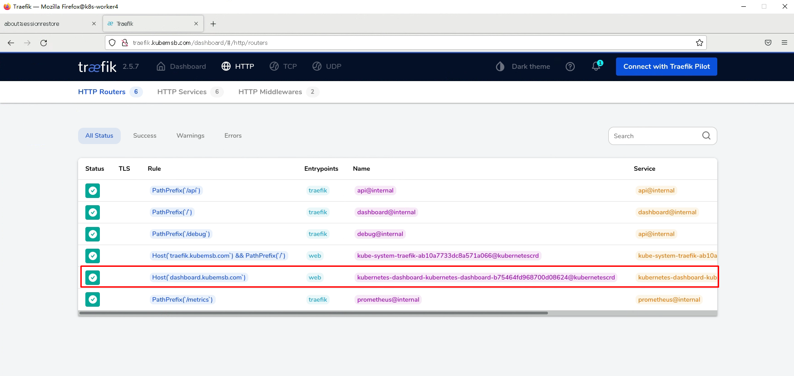

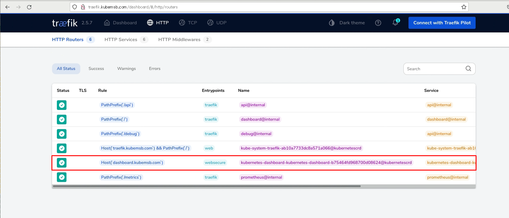

### 3.1.4 配置域名解析及访问

~~~powershell
# vim /etc/hosts
192.168.10.12 dashboard.kubemsb.com
~~~

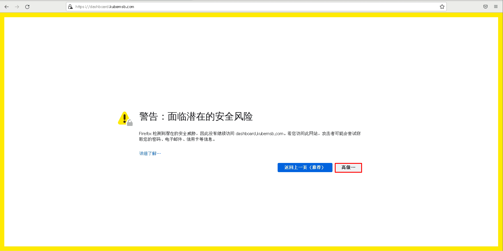

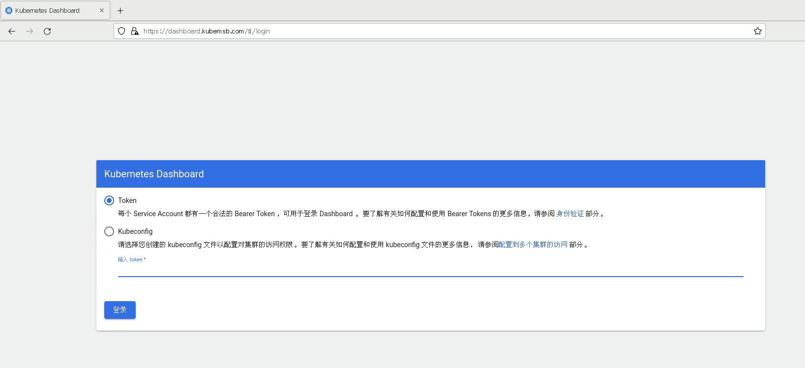

~~~powershell
# kubectl get secret -n kubernetes-dashboard
NAME                               TYPE                                  DATA   AGE
......
kubernetes-dashboard-token-8tm5n   kubernetes.io/service-account-token   3      21d
~~~

~~~powershell
# kubectl describe secret kubernetes-dashboard-token-8tm5n -n kubernetes-dashboard
Name:         kubernetes-dashboard-token-8tm5n
Namespace:    kubernetes-dashboard
Labels:       <none>
Annotations:  kubernetes.io/service-account.name: kubernetes-dashboard
              kubernetes.io/service-account.uid: 47d19e14-e3ed-4733-9799-02396dfb436a

Type:  kubernetes.io/service-account-token

Data
====
ca.crt:     1359 bytes
namespace:  20 bytes
token:      eyJhbGciOiJSUzI1NiIsImtpZCI6ImVGc2xjT05uekl0MlVOZ0VCSlhHSURfOXd6WGFvVnZFZmNwREwtVk1STlEifQ.eyJpc3MiOiJrdWJlcm5ldGVzL3NlcnZpY2VhY2NvdW50Iiwia3ViZXJuZXRlcy5pby9zZXJ2aWNlYWNjb3VudC9uYW1lc3BhY2UiOiJrdWJlcm5ldGVzLWRhc2hib2FyZCIsImt1YmVybmV0ZXMuaW8vc2VydmljZWFjY291bnQvc2VjcmV0Lm5hbWUiOiJrdWJlcm5ldGVzLWRhc2hib2FyZC10b2tlbi04dG01biIsImt1YmVybmV0ZXMuaW8vc2VydmljZWFjY291bnQvc2VydmljZS1hY2NvdW50Lm5hbWUiOiJrdWJlcm5ldGVzLWRhc2hib2FyZCIsImt1YmVybmV0ZXMuaW8vc2VydmljZWFjY291bnQvc2VydmljZS1hY2NvdW50LnVpZCI6IjQ3ZDE5ZTE0LWUzZWQtNDczMy05Nzk5LTAyMzk2ZGZiNDM2YSIsInN1YiI6InN5c3RlbTpzZXJ2aWNlYWNjb3VudDprdWJlcm5ldGVzLWRhc2hib2FyZDprdWJlcm5ldGVzLWRhc2hib2FyZCJ9.rY5YFoJD3ZUg1e31uxrPhKl0a_mslAmVG5r1ZDia0z7WKKtGjs8XwSu5cIDqKa-1FUV6ixxgfDwm5Rd-nK8TCMVRrDY_7r2I5-u2ebh4rEAXCBvQw0gtJu16-e1Z_TQqNuc73E9fDS0AqHr2qGOWAQcz_FjWGAGjZKzYlKPcA3mFI2wsAIRgxh29-S2f4SxB2zgWyYQdbW-fiHDHWK6dQ-a3glIlCk4jnPtzrX1HNK3BSRPoKaZg_9Ot0dABex2ro5QkQ0wyuT3NLio-n8v21MbhKG5ehBEFRNrTcTPM2CLt4XaUJezphKHShdc3VbUlizPge5DleAJcp9JrFzyqBQ
~~~

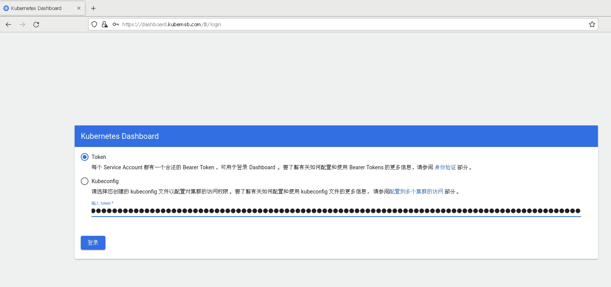

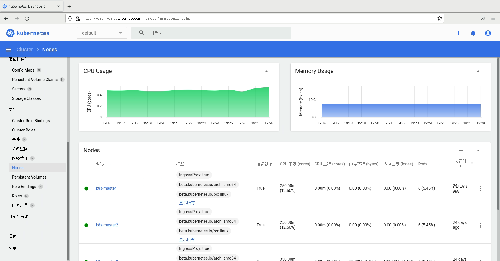

## 3.2 配置HTTP路由规则

### 3.2.1 创建应用及服务资源清单文件并应用

~~~powershell
# vim whoami.yaml
kind: Deployment
apiVersion: apps/v1
metadata:
  name: whoami
  namespace: default
  labels:
    app: traefiklabs
    name: whoami

spec:
  replicas: 2
  selector:
    matchLabels:
      app: traefiklabs
      task: whoami
  template:
    metadata:
      labels:
        app: traefiklabs
        task: whoami
    spec:
      containers:
        - name: whoami
          image: traefik/whoami
          ports:
            - containerPort: 80

---
apiVersion: v1
kind: Service
metadata:
  name: whoami
  namespace: default

spec:
  ports:
    - name: http
      port: 80
  selector:
    app: traefiklabs
    task: whoami

---
kind: Deployment
apiVersion: apps/v1
metadata:
  name: whoamitcp
  namespace: default
  labels:
    app: traefiklabs
    name: whoamitcp

spec:
  replicas: 2
  selector:
    matchLabels:
      app: traefiklabs
      task: whoamitcp
  template:
    metadata:
      labels:
        app: traefiklabs
        task: whoamitcp
    spec:
      containers:
        - name: whoamitcp
          image: traefik/whoamitcp
          ports:
            - containerPort: 8080

---
apiVersion: v1
kind: Service
metadata:
  name: whoamitcp
  namespace: default

spec:
  ports:
    - protocol: TCP
      port: 8080
  selector:
    app: traefiklabs
    task: whoamitcp

---
kind: Deployment
apiVersion: apps/v1
metadata:
  name: whoamiudp
  namespace: default
  labels:
    app: traefiklabs
    name: whoamiudp

spec:
  replicas: 2
  selector:
    matchLabels:
      app: traefiklabs
      task: whoamiudp
  template:
    metadata:
      labels:
        app: traefiklabs
        task: whoamiudp
    spec:
      containers:
        - name: whoamiudp
          image: traefik/whoamiudp:latest
          ports:
            - containerPort: 8080

---
apiVersion: v1
kind: Service
metadata:
  name: whoamiudp
  namespace: default

spec:
  ports:
    - port: 8080
      protocol: UDP
  selector:
    app: traefiklabs
    task: whoamiudp
~~~

~~~powershell
# kubectl apply -f whoami.yaml
~~~

~~~powershell
# kubectl get all
NAME                            READY   STATUS    RESTARTS   AGE
pod/whoami-7d666f84d8-ffbdv     1/1     Running   0          35m
pod/whoami-7d666f84d8-n75wb     1/1     Running   0          35m
pod/whoamitcp-744cc4b47-g98fv   1/1     Running   0          35m
pod/whoamitcp-744cc4b47-s2m7h   1/1     Running   0          35m
pod/whoamiudp-58f6cf7b8-54552   1/1     Running   0          35m
pod/whoamiudp-58f6cf7b8-dzxpg   1/1     Running   0          35m

NAME                    TYPE           CLUSTER-IP      EXTERNAL-IP     PORT(S)          AGE
service/kubernetes      ClusterIP      10.96.0.1       <none>          443/TCP          25d
service/nginx-metallb   LoadBalancer   10.96.109.6     192.168.10.90   8090:30259/TCP   14d
service/whoami          ClusterIP      10.96.251.213   <none>          80/TCP           35m
service/whoamitcp       ClusterIP      10.96.20.1      <none>          8080/TCP         35m
service/whoamiudp       ClusterIP      10.96.85.175    <none>          8080/UDP         35m

NAME                        READY   UP-TO-DATE   AVAILABLE   AGE
deployment.apps/whoami      2/2     2            2           35m
deployment.apps/whoamitcp   2/2     2            2           35m
deployment.apps/whoamiudp   2/2     2            2           35m

NAME                                  DESIRED   CURRENT   READY   AGE
replicaset.apps/whoami-7d666f84d8     2         2         2       35m
replicaset.apps/whoamitcp-744cc4b47   2         2         2       35m
replicaset.apps/whoamiudp-58f6cf7b8   2         2         2       35m
~~~

### 3.2.2 创建whoami应用ingress route资源清单文件并应用

~~~powershell
# vim whoami-ingressroute.yaml
apiVersion: traefik.containo.us/v1alpha1
kind: IngressRoute
metadata:
  name: myingressroute
  namespace: default
spec:
  entryPoints:
    - web

  routes:
  - match: Host(`whoami.kubemsb.com`) && PathPrefix(`/`)
    kind: Rule
    services:
    - name: whoami
      port: 80
~~~

~~~powershell
# kubectl apply -f whoami-ingressroute.yaml
~~~

~~~powershell
# kubectl get ingressroute
NAME             AGE
myingressroute   29m
~~~

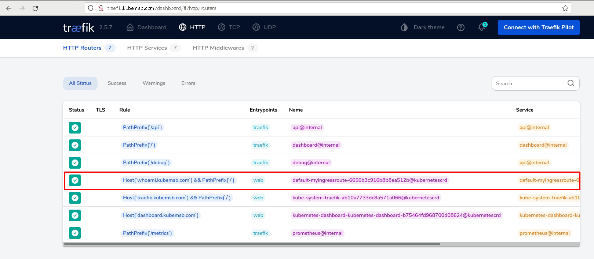

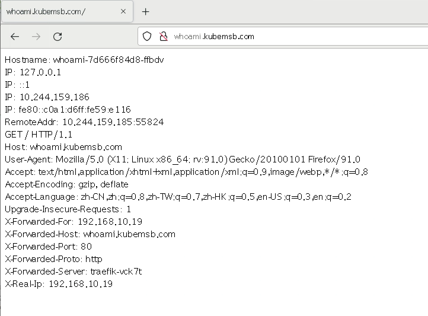

## 3.3 配置HTTPS路由规则

如果我们需要用 HTTPS 来访问我们这个应用的话，就需要监听 websecure 这个入口点，也就是通过 443 端口来访问，同样用 HTTPS 访问应用必然就需要证书

### 3.3.1 自签名证书

~~~powershell
# openssl req -x509 -nodes -days 365 -newkey rsa:2048 -keyout tls.key -out tls.crt -subj "/CN=whoamissl.kubemsb.com"
~~~

### 3.3.2  创建secret

~~~powershell
# kubectl create secret tls who-tls --cert=tls.crt --key=tls.key
~~~

### 3.3.3 创建https应用路由规则

~~~powershell
# vim whoamissl-ingressroute.yaml
apiVersion: traefik.containo.us/v1alpha1
kind: IngressRoute
metadata:
  name: ingressroutetls
spec:
  entryPoints:
    - websecure
  routes:
  - match: Host(`whoamissl.kubemsb.com`)
    kind: Rule
    services:
    - name: whoami
      port: 80
  tls:
    secretName: who-tls
~~~

~~~powershell
# kubectl apply -f whoamissl-ingressroute.yaml
~~~

~~~powershell
# kubectl get ingressroute
NAME              AGE
ingressroutetls   17s
~~~

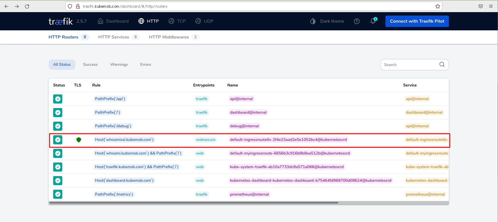

~~~powershell
# cat /etc/hosts
192.168.10.12 whoamissl.kubemsb.com
~~~

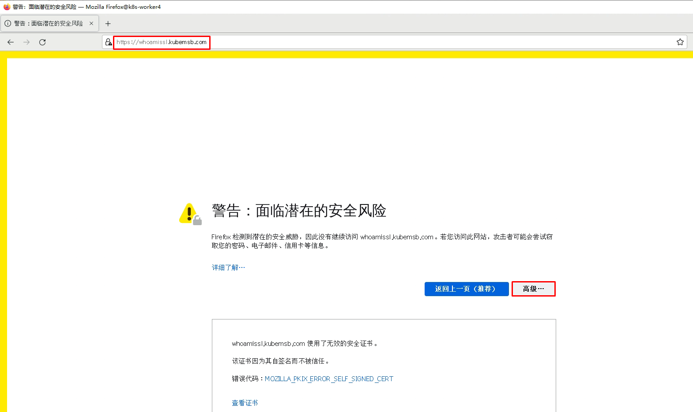

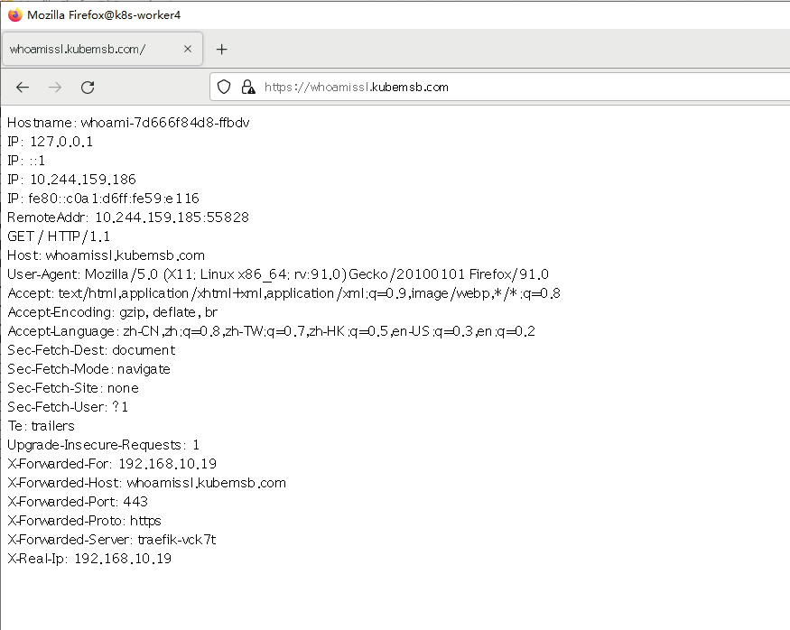

## 3.4 配置TCP路由规则

> SNI为服务名称标识，是 TLS 协议的扩展。因此，只有 TLS 路由才能使用该规则指定域名。但是，非 TLS 路由必须使用带有 `*` 的规则（每个域）来声明每个非 TLS 请求都将由路由进行处理。

### 3.4.1 实验案例配置

~~~powershell
# vim whoami-ingressroutetcp.yaml
apiVersion: traefik.containo.us/v1alpha1
kind: IngressRouteTCP
metadata:
  name: ingressroutetcpwho
spec:
  entryPoints:
    - tcpep
  routes:
  - match: HostSNI(`*`)
    services:
    - name: whoamitcp
      port: 8080
~~~

~~~powershell
# kubectl get ingressroutetcp
NAME                 AGE
ingressroutetcpwho   17s
~~~

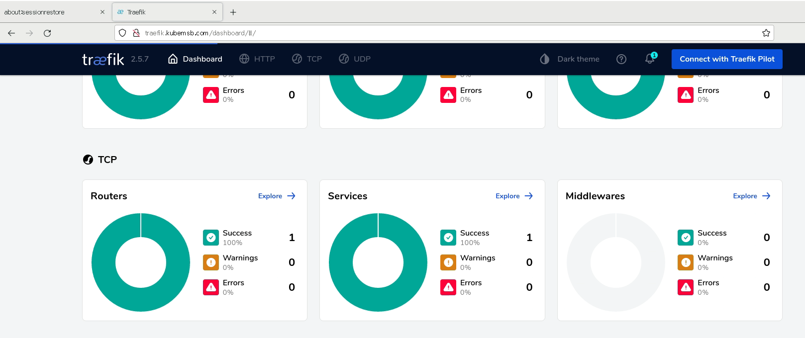

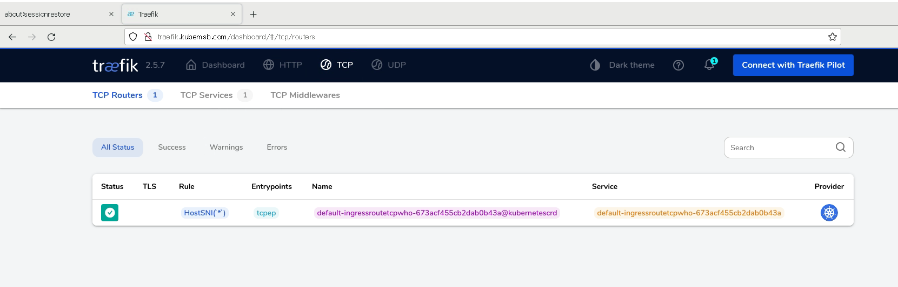

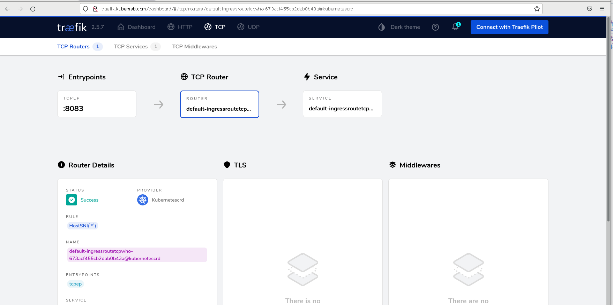

### 3.4.2 生产案例配置 MySQL部署及traefik代理

#### 3.4.2.1 修改traefik-configmap.yaml

~~~powershell
# cat traefik-configmap.yaml
apiVersion: v1
kind: ConfigMap
metadata:
  name: traefik
  namespace: kube-system
data:
  traefik.yaml: |-
    serversTransport:
      insecureSkipVerify: true
    api:
      insecure: true
      dashboard: true
      debug: true
    metrics:
      prometheus: ""
    entryPoints:
      web:
        address: ":80"
      websecure:
        address: ":443"
      metrics:
        address: ":8082"
      tcpep:
        address: ":8083"
      udpep:
        address: ":8084/udp"
      mysql:
        address: ":3312"
    providers:
      kubernetesCRD: ""
      kubernetesingress: ""
    log:
      filePath: ""
      level: error
      format: json
    accessLog:
      filePath: ""
      format: json
      bufferingSize: 0
      filters:
        retryAttempts: true
        minDuration: 20
      fields:
        defaultMode: keep
        names:
          ClientUsername: drop
        headers:
          defaultMode: keep
          names:
            User-Agent: redact
            Authorization: drop
            Content-Type: keep
~~~

#### 3.4.2.2 修改traefik-deploy.yaml

~~~powershell
# vim traefik-deploy.yaml
apiVersion: apps/v1
kind: DaemonSet
metadata:
  namespace: kube-system
  name: traefik
  labels:
    app: traefik
spec:
  selector:
    matchLabels:
      app: traefik
  template:
    metadata:
      labels:
        app: traefik
    spec:
      serviceAccountName: traefik-ingress-controller
      containers:
        - name: traefik
          image: traefik:v2.5.7
          args:
            - --configfile=/config/traefik.yaml
          volumeMounts:
            - mountPath: /config
              name: config
          ports:
            - name: web
              containerPort: 80
              hostPort: 80
            - name: websecure
              containerPort: 443
              hostPort: 443
            - name: admin
              containerPort: 8080
            - name: tcpep
              containerPort: 8083
              hostPort: 8083
            - name: udpep
              containerPort: 8084
              hostPort: 8084
              protocol: UDP
            - name: mysql
              containerPort: 3312
              hostPort: 3306
      volumes:
        - name: config
          configMap:
            name: traefik
~~~

~~~powershell
# vim traefik-service.yaml
apiVersion: v1
kind: Service
metadata:
  name: traefik
  namespace: kube-system
spec:
  ports:
    - protocol: TCP
      name: web
      port: 80
    - protocol: TCP
      name: admin
      port: 8080
    - protocol: TCP
      name: websecure
      port: 443
    - protocol: TCP
      name: tcpep
      port: 8083
    - protocol: UDP
      name: udpep
      port: 8084
    - protocol: TCP
      name: mysql
      port: 3312
  selector:
    app: traefik
~~~

~~~powershell
删除以前的配置及应用
# kubectl delete -f traefix-configmap.yaml
# kubectl delete -f traefix-deploy.yaml
# kubectl delete -f traefix-service.yaml
~~~

~~~powershell
重新部署
# kubectl apply -f traefix-configmap.yaml
# kubectl apply -f traefix-deploy.yaml
# kubectl apply -f traefix-service.yaml
~~~

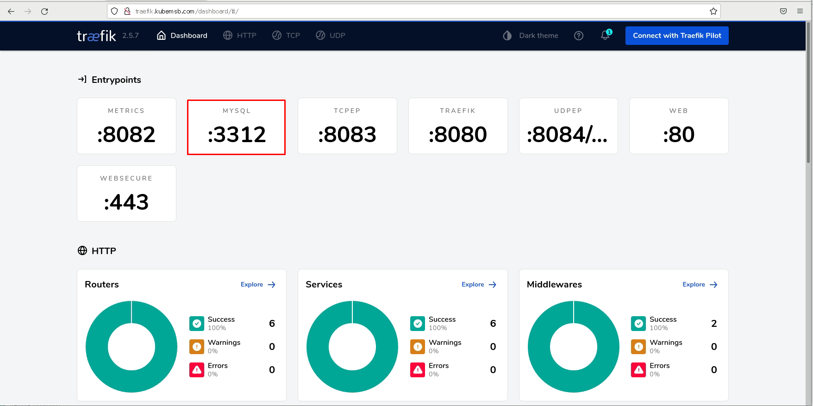

#### 3.4.2.3 部署mysql应用

> 关于端口的说明：
>traefik Pod：3312:3306（traefik Pod:k8s Node），3312是traefik配置的mysql入口点的端口，3306是k8s Node的端口，traefik请求入口

~~~powershell
# vim mysql-configmap.yaml
apiVersion: v1
kind: ConfigMap
metadata:
  name: mysql
  labels:
    app: mysql
  namespace: default
data:
  my.cnf: |
    [mysqld]
    character-set-server = utf8mb4
    collation-server = utf8mb4_unicode_ci
    skip-character-set-client-handshake = 1
    default-storage-engine = INNODB
    max_allowed_packet = 500M
    explicit_defaults_for_timestamp = 1
    long_query_time = 10
~~~

~~~powershell
# vim mysql-deploy.yaml
apiVersion: apps/v1
kind: Deployment
metadata:
  labels:
    app: mysql
  name: mysql
  namespace: default
spec:
  selector:
    matchLabels:
      app: mysql
  template:
    metadata:
      labels:
        app: mysql
    spec:
      containers:
      - name: mysql
        image: mysql:5.7
        imagePullPolicy: IfNotPresent
        env:
        - name: MYSQL_ROOT_PASSWORD
          value: abc123
        ports:
        - containerPort: 3306
        volumeMounts:
        - mountPath: /var/lib/mysql
          name: pv
        - mountPath: /etc/mysql/conf.d/my.cnf
          subPath: my.cnf
          name: cm
      volumes:
        - name: pv
          hostPath:
            path: /opt/mysqldata
        - name: cm
          configMap:
            name: mysql
~~~

~~~powershell
# vim mysql-service.yaml
apiVersion: v1
kind: Service
metadata:
  name: mysql
  namespace: default
spec:
  ports:
    - port: 3306
      protocol: TCP
      targetPort: 3306
  selector:
    app: mysql
~~~

~~~powershell
# kubectl apply -f mysql-configmap.yaml
configmap/mysql created
~~~

~~~powershell
# kubectl apply -f mysql-deploy.yaml
deployment.apps/mysql created
~~~

~~~powershell
# kubectl apply -f mysql-service.yaml
service/mysql created
~~~

#### 3.4.2.4 为mysql应用创建ingressroute

~~~powershell
# vim mysql-ingressroutetcp.yaml
apiVersion: traefik.containo.us/v1alpha1
kind: IngressRouteTCP
metadata:
  name: mysql
  namespace: default
spec:
  entryPoints:
    - mysql
  routes:
  - match: HostSNI(`*`)
    services:
    - name: mysql
      port: 3306
~~~

~~~powershell
# kubectl apply -f mysql-ingressroutetcp.yaml
ingressroutetcp.traefik.containo.us/mysql created
~~~

~~~powershell
# kubectl get ingressroutetcp
NAME                 AGE
mysql                8s
~~~

#### 3.4.2.5 验证

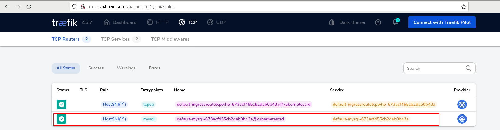

**在集群之外主机上执行如下操作**

~~~powershell
# cat /etc/hosts
......
192.168.10.12 mysql.kubemsb.com
~~~

~~~powershell
# mysql -h mysql.kubemsb.com  -uroot -pabc123 -P3306
mysql: [Warning] Using a password on the command line interface can be insecure.
Welcome to the MySQL monitor.  Commands end with ; or \g.
Your MySQL connection id is 3
Server version: 5.7.36 MySQL Community Server (GPL)

Copyright (c) 2000, 2022, Oracle and/or its affiliates.

Oracle is a registered trademark of Oracle Corporation and/or its
affiliates. Other names may be trademarks of their respective
owners.

Type 'help;' or '\h' for help. Type '\c' to clear the current input statement.

mysql>
~~~

### 3.4.3 生产案例 Redis部署及traefik代理

~~~powershell
# vim  redis.yaml
apiVersion: apps/v1
kind: Deployment
metadata:
  name: redis
  namespace: default
spec:
  selector:
    matchLabels:
        app: redis
  template:
    metadata:
      labels:
        app: redis
    spec:
      containers:
      - name: redis
        image: redis:6.2.6
        ports:
        - containerPort: 6379
          protocol: TCP

---
apiVersion: v1
kind: Service
metadata:
  name: redis
  namespace: default
spec:
  ports:
  - port: 6379
    targetPort: 6379
  selector:
    app: redis
~~~

~~~powershell
# kubectl apply -f redis.yaml
deployment.apps/redis created
service/redis created
~~~

~~~powershell
# vim traefik-configmap.yaml
apiVersion: v1
kind: ConfigMap
metadata:
  name: traefik
  namespace: kube-system
data:
  traefik.yaml: |-
    serversTransport:
      insecureSkipVerify: true
    api:
      insecure: true
      dashboard: true
      debug: true
    metrics:
      prometheus: ""
    entryPoints:
      web:
        address: ":80"
      websecure:
        address: ":443"
      metrics:
        address: ":8082"
      tcpep:
        address: ":8083"
      udpep:
        address: ":8084/udp"
      mysql:
        address: ":3312"
      redis:
        address: ":6379"
    providers:
      kubernetesCRD: ""
      kubernetesingress: ""
    log:
      filePath: ""
      level: error
      format: json
    accessLog:
      filePath: ""
      format: json
      bufferingSize: 0
      filters:
        retryAttempts: true
        minDuration: 20
      fields:
        defaultMode: keep
        names:
          ClientUsername: drop
        headers:
          defaultMode: keep
          names:
            User-Agent: redact
            Authorization: drop
            Content-Type: keep
~~~

~~~powershell
删除原configmap,再重新创建
# kubectl delete -f traefik-configmap.yaml

# kubectl apply -f traefik-configmap.yaml

~~~

~~~powershell
# vim traefix-deploy.yaml
apiVersion: apps/v1
kind: DaemonSet
metadata:
  namespace: kube-system
  name: traefik
  labels:
    app: traefik
spec:
  selector:
    matchLabels:
      app: traefik
  template:
    metadata:
      labels:
        app: traefik
    spec:
      serviceAccountName: traefik-ingress-controller
      containers:
        - name: traefik
          image: traefik:v2.5.7
          args:
            - --configfile=/config/traefik.yaml
          volumeMounts:
            - mountPath: /config
              name: config
          ports:
            - name: web
              containerPort: 80
              hostPort: 80
            - name: websecure
              containerPort: 443
              hostPort: 443
            - name: admin
              containerPort: 8080
            - name: tcpep
              containerPort: 8083
              hostPort: 8083
            - name: udpep
              containerPort: 8084
              hostPort: 8084
              protocol: UDP
            - name: mysql
              containerPort: 3312
              hostPort: 3306
            - name: redis
              containerPort: 6379
              hostPort: 6379
      volumes:
        - name: config
          configMap:
            name: traefik
~~~

~~~powershell
删除原deploy,再重新创建
# kubectl delete -f traefik-deploy.yaml

# kubectl apply -f traefik-deploy.yaml
~~~

~~~powershell
验证是否添加成功
# kubectl get daemonset traefik -n kube-system -o yaml
...
- containerPort: 6379
          hostPort: 6379
          name: redis
          protocol: TCP
...
~~~

~~~powershell
# vim  redis-ingressroutetcp.yaml
apiVersion: traefik.containo.us/v1alpha1
kind: IngressRouteTCP
metadata:
  name: redis
  namespace: default
spec:
  entryPoints:
  - redis
  routes:
  - match: HostSNI(`*`)
    services:
    - name: redis
      port: 6379
~~~

~~~powershell
# kubectl get ingressroutetcp
NAME                 AGE
redis                8s
~~~

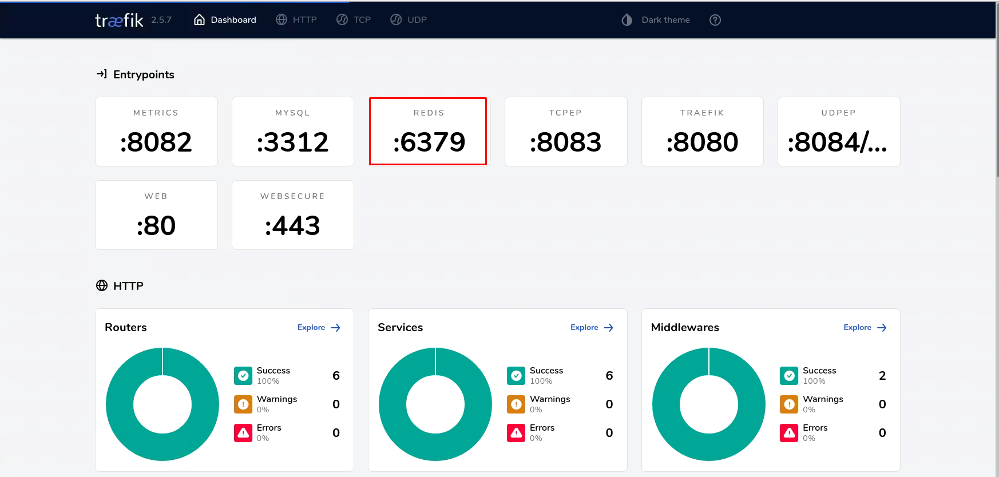

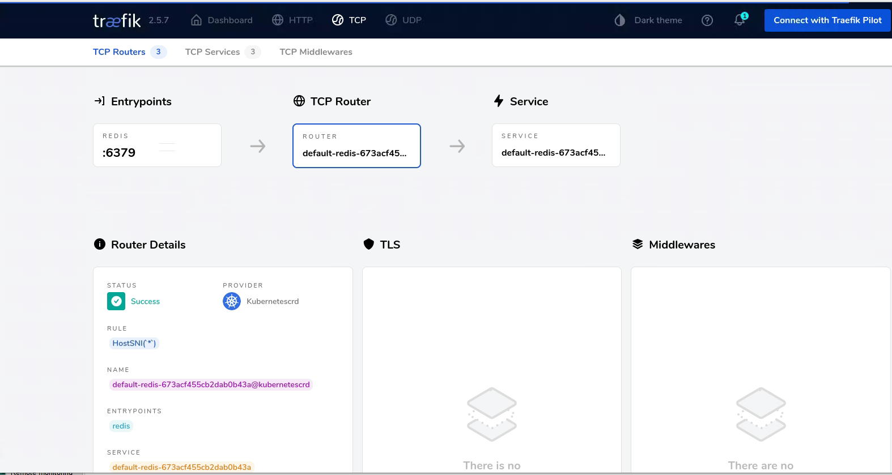

**在集群之外主机添加域名解析**

~~~powershell
# cat /etc/hosts
192.168.10.15 redis.kubemsb.com
~~~

~~~powershell
 # wget http://download.redis.io/releases/redis-3.2.8.tar.gz
 # tar xf redis-3.2.8.tar.gz
 # make
~~~

~~~powershell
# ./src/redis-cli -h redis.kubemsb.com -p 6379
redis.kubemsb.com:6379> ping
PONG
redis.kubemsb.com:6379> set hello world
OK
redis.kubemsb.com:6379> get hello
"world"
~~~

## 3.5 配置UDP路由规则

~~~powershell
# vim whoami-ingressrouteudp.yaml
apiVersion: traefik.containo.us/v1alpha1
kind: IngressRouteUDP
metadata:
  name: ingressrouteudpwho
spec:
  entryPoints:                  
    - udpep
  routes:                      
  - services:                  
    - name: whoamiudp                 
      port: 8080
~~~

~~~powershell
# kubectl get ingressrouteudp
NAME                 AGE
ingressrouteudpwho   11s
~~~

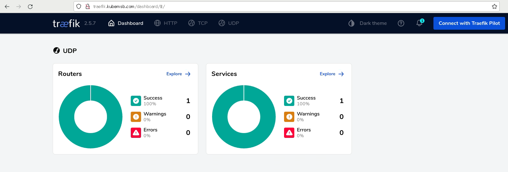

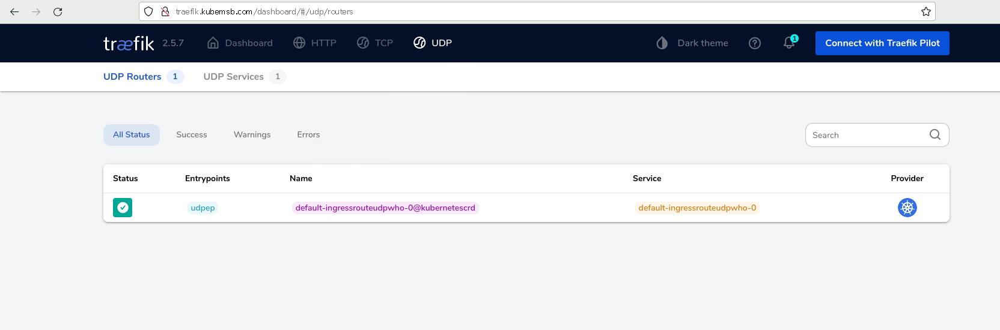

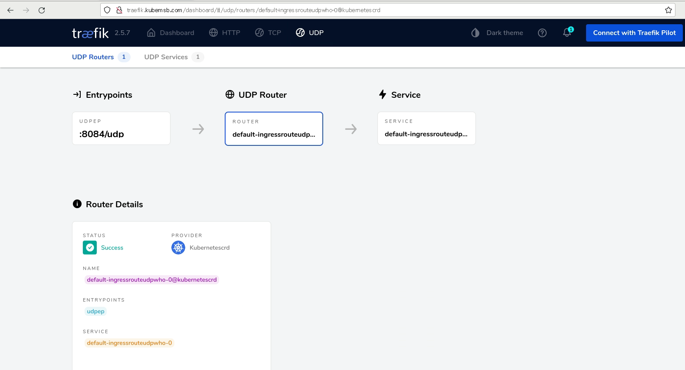

**验证可有性**

~~~powershell
# kubectl get svc
NAME            TYPE           CLUSTER-IP      EXTERNAL-IP     PORT(S)          AGE

whoamiudp       ClusterIP      10.96.85.175    <none>          8080/TCP         6h35m
~~~

~~~powershell
echo "WHO" | socat - udp4-datagram:10.96.85.175:8080
~~~

~~~powershell
echo "othermessage" | socat - udp4-datagram:10.96.85.175:8080
~~~

**输出**

~~~powershell
# echo "WHO" | socat - udp4-datagram:192.168.10.12:8084
Hostname: whoamiudp-58f6cf7b8-54552
IP: 127.0.0.1
IP: ::1
IP: 10.244.159.187
IP: fe80::1cb4:e1ff:fe66:d9b
~~~

~~~powershell
# echo "othermessage" | socat - udp4-datagram:192.168.10.12:8084
Received: othermessage
~~~

# 四、traefik中间件 MiddleWare

## 4.1 traefik中间件介绍 MiddleWare

中间件是 Traefik2.0 中一个非常有特色的功能，我们可以根据自己的各种需求去选择不同的中间件来满足服务，Traefik 官方已经内置了许多不同功能的中间件，其中包括修改请求头信息；重定向；身份验证等等，而且中间件还可以通过链式组合的方式来适用各种情况。例如：强制跳转https、去除访问前缀、访问白名单等。

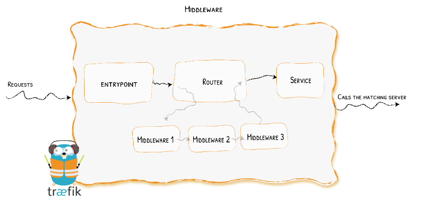

## 4.2 traefik 中间件应用案例  ipWhiteList

> 在工作 中，有一些URL并不希望对外暴露，比如prometheus、grafana等，我们就可以通过白名单IP来过到要求，可以使用Traefix中的ipWhiteList中间件来完成。

~~~powershell
# vim deploy-service.yaml
kind: Deployment
apiVersion: apps/v1
metadata:
  name: nginx-web-middleware
  namespace: default
spec:
  replicas: 1
  selector:
    matchLabels:
      app: middle
  template:
    metadata:
      labels:
        app: middle
    spec:
      containers:
        - name: nginx-web-c
          image: nginx:latest
          ports:
            - containerPort: 80

---
apiVersion: v1
kind: Service
metadata:
  name: service-middle
  namespace: default

spec:
  ports:
    - name: http
      port: 80
  selector:
    app: middle
~~~

~~~powershell
# kubectl apply -f deploy-service.yaml
deployment.apps/nginx-web-middleware created
service/service-middle created
~~~

~~~powershell
# vim middleware-ipwhitelist.yaml
apiVersion: traefik.containo.us/v1alpha1
kind: Middleware
metadata:
  name: gs-ipwhitelist
spec:
  ipWhiteList:
    sourceRange:
      - 127.0.0.1
      - 10.244.0.0/16
      - 10.96.0.0/12
      - 192.168.10.0/24
~~~

~~~powershell
# kubectl apply -f middleware-ipwhitelist.yaml
middleware.traefik.containo.us/gs-ipwhitelist created
~~~

~~~powershell
# vim deploy-service-middle.yaml
apiVersion: traefik.containo.us/v1alpha1
kind: IngressRoute
metadata:
  name: ingressroutemiddle
  namespace: default

spec:
  entryPoints:
    - web
  routes:
  - match: Host(`middleware.kubemsb.com`) && PathPrefix(`/`)
    kind: Rule
    services:
    - name: service-middle
      port: 80
      namespace: default
    middlewares:
    - name: gs-ipwhitelist
~~~

~~~powershell
# kubectl apply -f deploy-service-middle.yaml
ingressroute.traefik.containo.us/ingressroutemiddle created
~~~

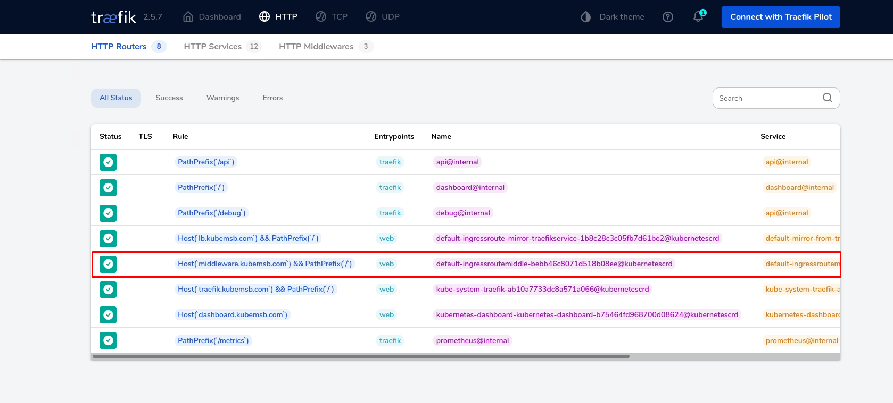

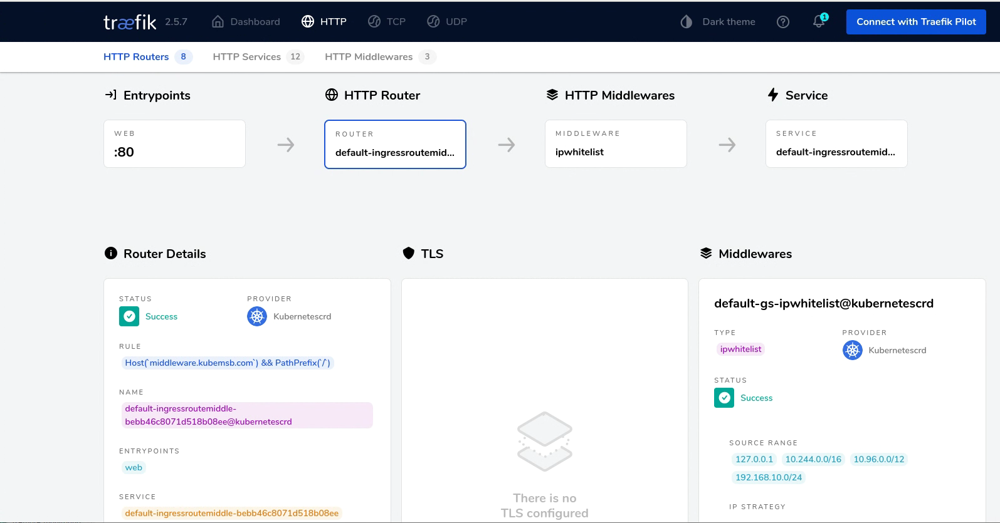

**在集群之外的主机上访问**

~~~powershell
# vim  /etc/hosts
192.168.10.15 middleware.kubemsb.com
~~~

~~~powershell
# curl http://middleware.kubemsb.com
~~~

**把集群外主机所在的网段从白名单中删除，发现无法访问。**

~~~powershell
# cat middleware-ipwhitelist.yaml
apiVersion: traefik.containo.us/v1alpha1
kind: Middleware
metadata:
  name: gs-ipwhitelist
spec:
  ipWhiteList:
    sourceRange:
      - 127.0.0.1
      - 10.244.0.0/16
      - 10.96.0.0/12
~~~

~~~powershell
# kubectl apply -f middleware-ipwhitelist.yaml
middleware.traefik.containo.us/gs-ipwhitelist configured
~~~

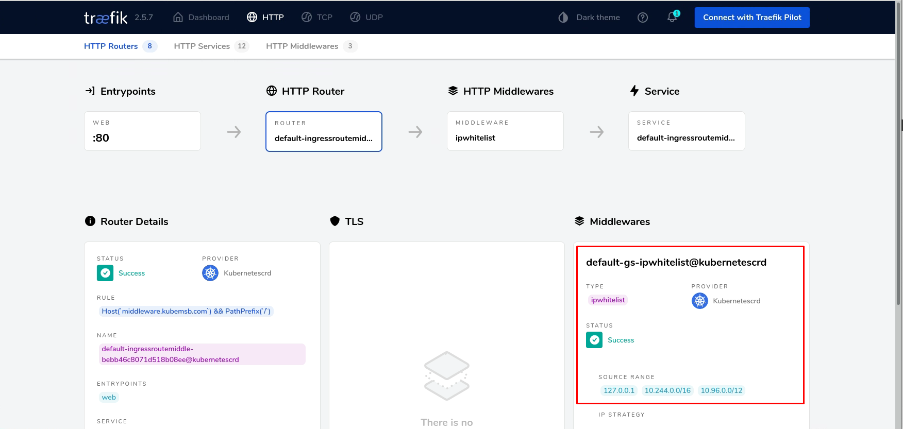

**在集群外主机访问**

~~~powershell
# curl http://middleware.kubemsb.com
Forbidden
~~~

# 五、traefik高级应用

在实际的生产环境，除了上线业务之外，还有更复杂的使用要求。
在开始traefik的高级用法之前，还需要了解一个TraefikService，通过把TraefikService注册到CRD来实现更复杂的请求设置。

~~~powershell
TraefikService 目前能用于以下功能
    servers  load balancing.（负载均衡）
    services  Weighted Round Robin load balancing.（权重轮询）
    services  mirroring.（镜像）
~~~

## 5.1 负载均衡

### 5.1.1 创建deployment控制器类型应用

~~~powershell
# vim loadbalancer-deploy.yaml
kind: Deployment
apiVersion: apps/v1
metadata:
  name: nginx-web1
  namespace: default
spec:
  replicas: 1
  selector:
    matchLabels:
      app: v1
  template:
    metadata:
      labels:
        app: v1
    spec:
      containers:
        - name: nginx-web-c
          image: nginx:latest
          ports:
            - containerPort: 80
---
kind: Deployment
apiVersion: apps/v1
metadata:
  name: nginx-web2
  namespace: default
spec:
  replicas: 1
  selector:
    matchLabels:
      app: v2
  template:
    metadata:
      labels:
        app: v2
    spec:
      containers:
        - name: nginx-web-c
          image: nginx:latest
          ports:
            - containerPort: 80
~~~

~~~powershell
# kubectl apply -f loadbalancer-deploy.yaml
~~~

**修改容器中网站页面信息**

~~~powershell
# kubectl get pods
NAME                          READY   STATUS    RESTARTS   AGE
nginx-web1-856c759646-58snd   1/1     Running   0          2m34s
nginx-web2-5d547f7c5f-vd8n7   1/1     Running   0          2m34s
~~~

~~~powershell
# kubectl exec -it nginx-web1-856c759646-58snd -- sh
# echo "svc1" > /usr/share/nginx/html/index.html
# exit

# kubectl exec -it nginx-web2-5d547f7c5f-vd8n7 -- sh
# echo "svc2" > /usr/share/nginx/html/index.html
# exit

~~~

~~~powershell
# vim loadbalancer-deploy.yaml
kind: Deployment
apiVersion: apps/v1
metadata:
  name: nginx-web1
  namespace: default
spec:
  replicas: 1
  selector:
    matchLabels:
      app: v1
  template:
    metadata:
      labels:
        app: v1
    spec:
      containers:
        - name: nginx-web-c
          image: nginx:latest
          lifecycle:
            postStart:
              exec:
                command:  ["/bin/sh", "-c", "echo svc1 > /usr/share/nginx/html/index.html"]
          ports:
            - containerPort: 80
---
kind: Deployment
apiVersion: apps/v1
metadata:
  name: nginx-web2
  namespace: default
spec:
  replicas: 1
  selector:
    matchLabels:
      app: v2
  template:
    metadata:
      labels:
        app: v2
    spec:
      containers:
        - name: nginx-web-c
          image: nginx:latest
          lifecycle:
            postStart:
              exec:
                command:  ["/bin/sh", "-c", "echo svc2 > /usr/share/nginx/html/index.html"]
          ports:
            - containerPort: 80
~~~

### 5.1.2 创建service

~~~powershell
# vim loadbalancer-deploy-service.yaml
apiVersion: v1
kind: Service
metadata:
  name: svc1
  namespace: default

spec:
  ports:
    - name: http
      port: 80
  selector:
    app: v1
---
apiVersion: v1
kind: Service
metadata:
  name: svc2
  namespace: default

spec:
  ports:
    - name: http
      port: 80
  selector:
    app: v2
~~~

~~~powershell
# kubectl apply -f loadbalancer-deploy-service.yaml
~~~

~~~powershell
# kubectl get svc
NAME            TYPE           CLUSTER-IP      EXTERNAL-IP     PORT(S)          AGE
svc1            ClusterIP      10.96.136.245   <none>          80/TCP           3s
svc2            ClusterIP      10.96.2.4       <none>          80/TCP           3s

~~~

~~~powershell
# curl http://10.96.136.245
svc1

# curl http://10.96.2.4
svc2

~~~

### 5.1.3 创建ingressroute

~~~powershell
# vim loadbalancer-deploy-service-ingressroute.yaml
apiVersion: traefik.containo.us/v1alpha1
kind: IngressRoute
metadata:
  name: ingressrouteweblb
  namespace: default

spec:
  entryPoints:
    - web
  routes:
  - match: Host(`lb.kubemsb.com`) && PathPrefix(`/`)
    kind: Rule
    services:
    - name: svc1
      port: 80
      namespace: default
    - name: svc2
      port: 80
      namespace: default
~~~

~~~powershell
# kubectl apply -f loadbalancer-deploy-service-ingressroute.yaml
~~~

~~~powershell
# kubectl get ingressroute
NAME                AGE
ingressrouteweblb   9s
~~~

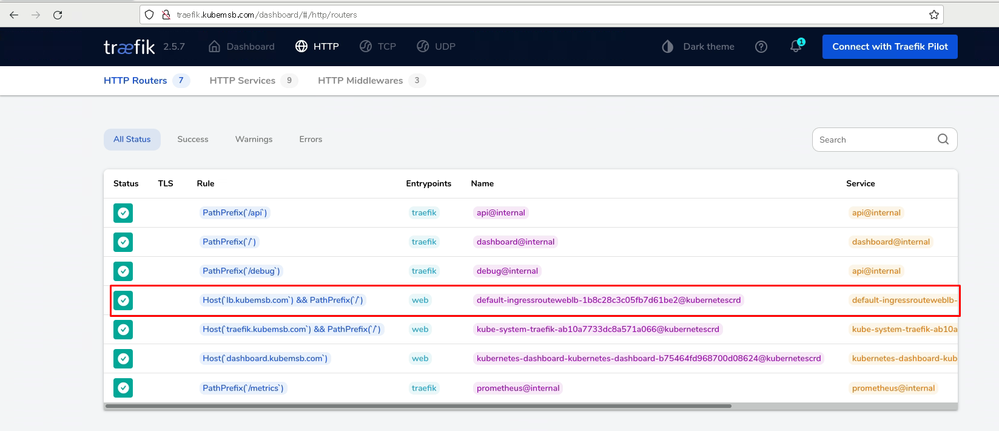

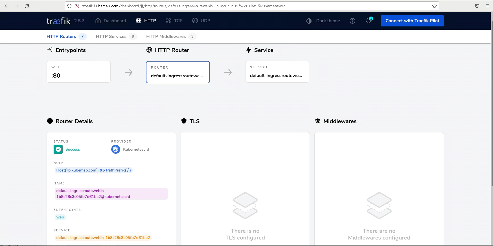

### 5.1.4 访问验证

> 在集群之外的主机上访问

~~~powershell
# cat /etc/hosts
192.168.10.15 lb.kubemsb.com
~~~

~~~powershell
# curl http://lb.kubemsb.com
svc1

# curl http://lb.kubemsb.com
svc2

~~~

## 5.2 灰度发布

> 基于上述负载均衡案例基础之上实施。
>
> 灰度发布也称为金丝雀发布，让一部分即将上线的服务发布到线上，观察是否达到上线要求，主要通过权重轮询的方式实现。

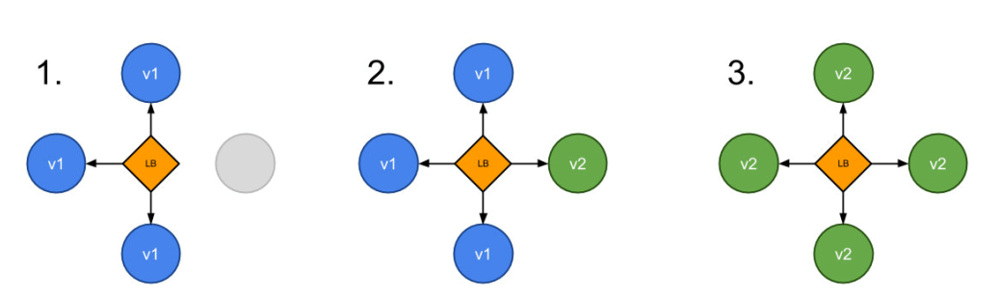

### 5.2.1 创建TraefikService

~~~powershell
# vim traefikservice.yaml
apiVersion: traefik.containo.us/v1alpha1
kind: TraefikService
metadata:
  name: wrr
  namespace: default

spec:
  weighted:
    services:
      - name: svc1    
        port: 80
        weight: 3          # 定义权重
        kind: Service      # 可选，默认就是 Service 
      - name: svc2
        port: 80     
        weight: 1
~~~

~~~powershell
# kubectl apply -f traefikservice.yaml
traefikservice.traefik.containo.us/wrr created
~~~

### 5.2.2 创建ingressroute

>需要注意的是现在我们配置的 Service 不再是直接的 Kubernetes 对象了，而是上面我们定义的 TraefikService 对象

~~~powershell
# vim traefik-wrr.yaml
apiVersion: traefik.containo.us/v1alpha1
kind: IngressRoute
metadata:
  name: ingressroutewrr
  namespace: default

spec:
  entryPoints:
    - web
  routes:
  - match: Host(`lb.kubemsb.com`) && PathPrefix(`/`)
    kind: Rule
    services:
    - name: wrr
      namespace: default
      kind: TraefikService
~~~

~~~powershell
# kubectl apply -f traefik-wrr.yaml
ingressroute.traefik.containo.us/ingressroutewrr created
~~~

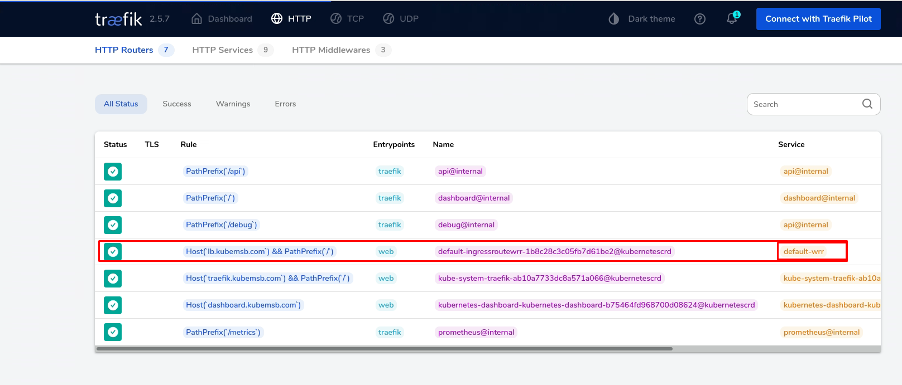

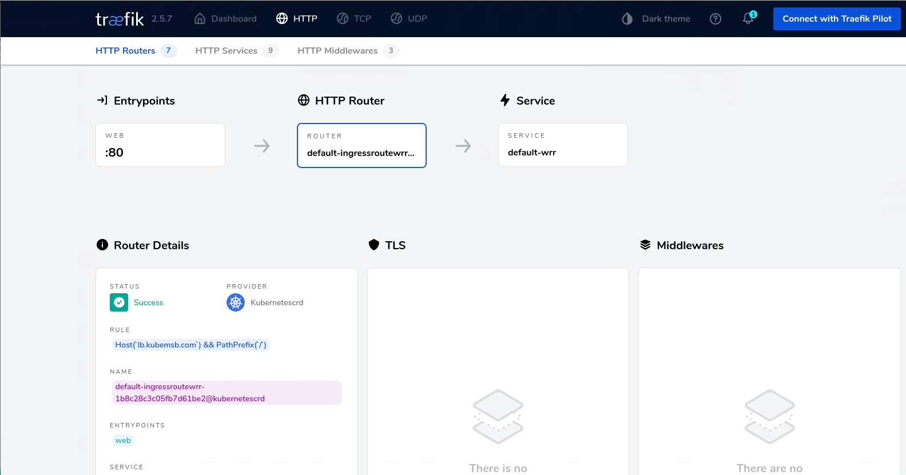

~~~powershell
第一次
# curl http://lb.kubemsb.com
svc1

第二次
# curl http://lb.kubemsb.com
svc1

第三次
# curl http://lb.kubemsb.com
svc2

第四次
# curl http://lb.kubemsb.com
svc1

~~~

## 5.3 流量复制

> 在负责均衡案例基础之上实施
>
> 所谓的流量复制，也称为镜像服务是指将请求的流量按规则复制一份发送给其它服务，并且会忽略这部分请求的响应，这个功能在做一些压测或者问题复现的时候很有用。

### 5.3.1 指定流量来自己于kubernetes service对象

~~~powershell
# vim mirror_from_service.yaml
apiVersion: traefik.containo.us/v1alpha1
kind: TraefikService
metadata:
  name: mirror-from-service
  namespace: default

spec:
  mirroring:
    name: svc1       # 发送 100% 的请求到 K8S 的 Service "v1"
    port: 80
    mirrors:
      - name: svc2   # 然后复制 20% 的请求到 v2
        port: 80
        percent: 20
~~~

~~~powershell
# kubectl apply -f mirror_from_service.yaml
traefikservice.traefik.containo.us/mirror-from-service created
~~~

~~~powershell
# vim mirror-from-service-ingressroute.yaml
apiVersion: traefik.containo.us/v1alpha1
kind: IngressRoute
metadata:
  name: ingressroute-mirror
  namespace: default

spec:
  entryPoints:
    - web
  routes:
  - match: Host(`lb.kubemsb.com`) && PathPrefix(`/`) 
    kind: Rule
    services:
    - name: mirror-from-service         
      namespace: default
      kind: TraefikService
~~~

~~~powershell
# kubectl apply -f mirror-from-service-ingressroute.yaml
ingressroute.traefik.containo.us/ingressroute-mirror created
~~~

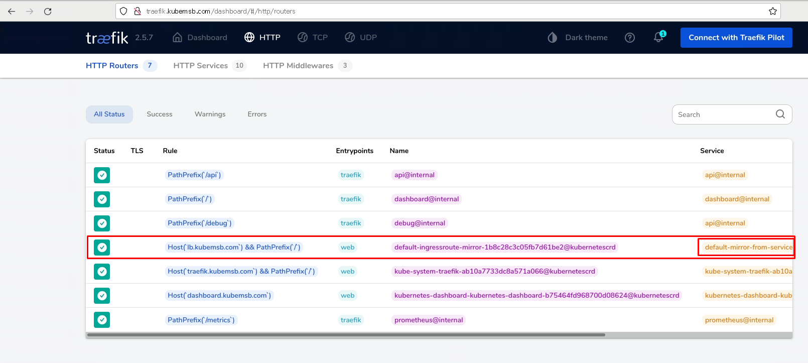

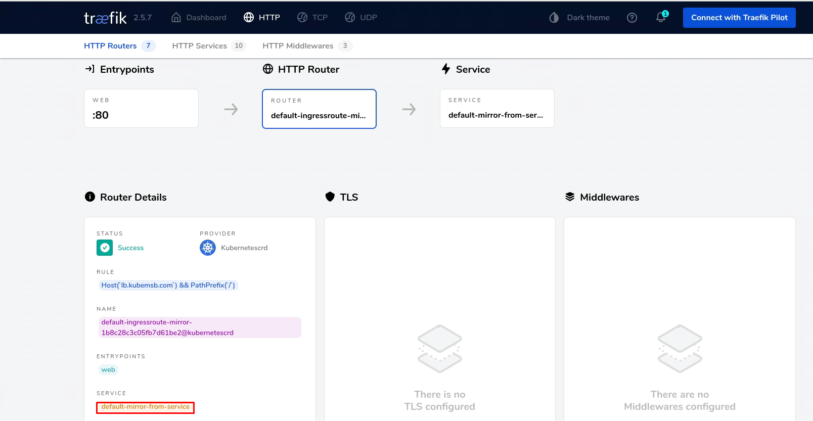

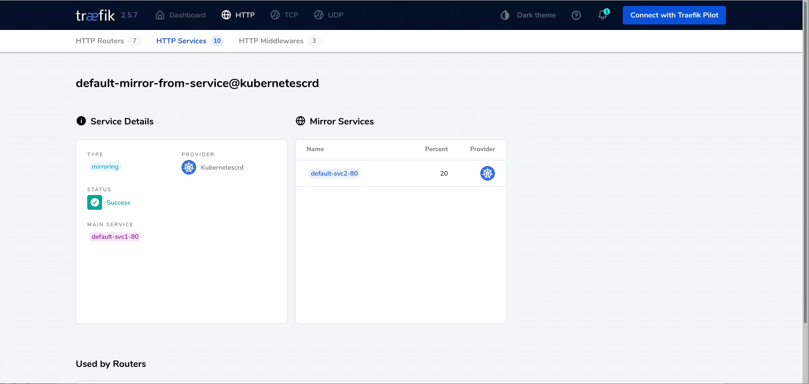

~~~powershell
# while true
do
curl http://lb.kubemsb.com
sleep 1
done
~~~

### 5.3.2 通过traefikservice导入流量

~~~powershell
# vim mirror-from-traefikservice.yaml
apiVersion: traefik.containo.us/v1alpha1
kind: TraefikService
metadata:
  name: mirror-from-traefikservice
  namespace: default

spec:
  mirroring:
    name: mirror-from-service      #流量入口从TraefikService 来
    kind: TraefikService
    mirrors:
    - name: svc2
      port: 80
      percent: 20
~~~

~~~powershell
# kubectl apply -f mirror-from-traefikservice.yaml
traefikservice.traefik.containo.us/mirror-from-traefikservice created
~~~

~~~powershell
# vim mirror-from-traefikservice-ingressroute.yaml
apiVersion: traefik.containo.us/v1alpha1
kind: IngressRoute
metadata:
  name: ingressroute-mirror-traefikservice
  namespace: default

spec:
  entryPoints:
    - web
  routes:
  - match: Host(`lb.kubemsb.com`) && PathPrefix(`/`)  
    kind: Rule
    services:
    - name: mirror-from-traefikservice         
      namespace: default
      kind: TraefikService
~~~

~~~powershell
# kubectl apply -f mirror-from-tradfikservice-ingressroute.yaml
ingressroute.traefik.containo.us/ingressroute-mirror-traefikservice created
~~~

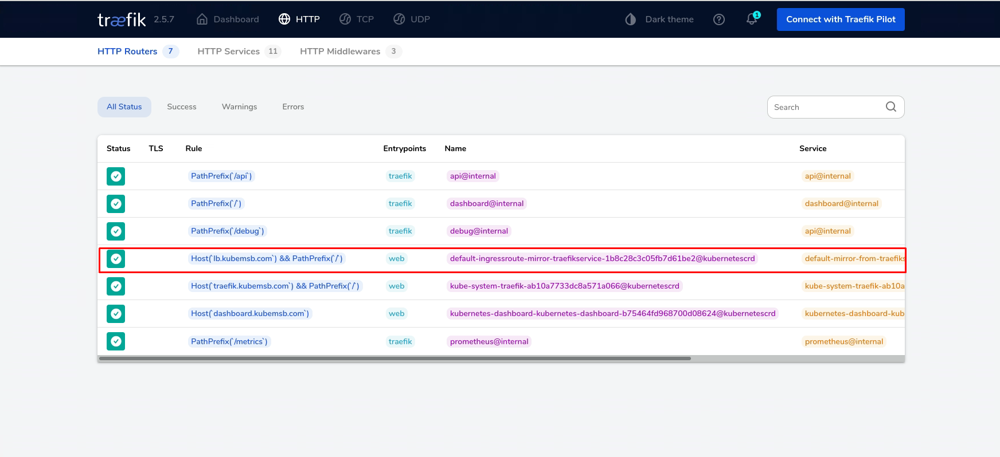

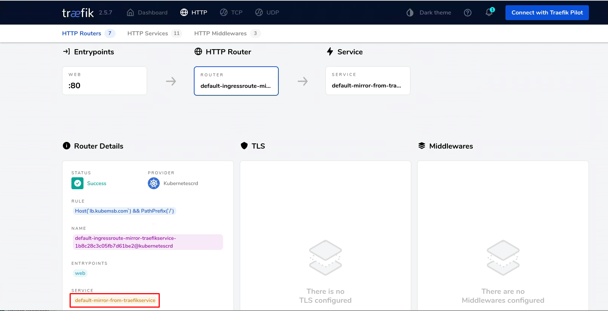

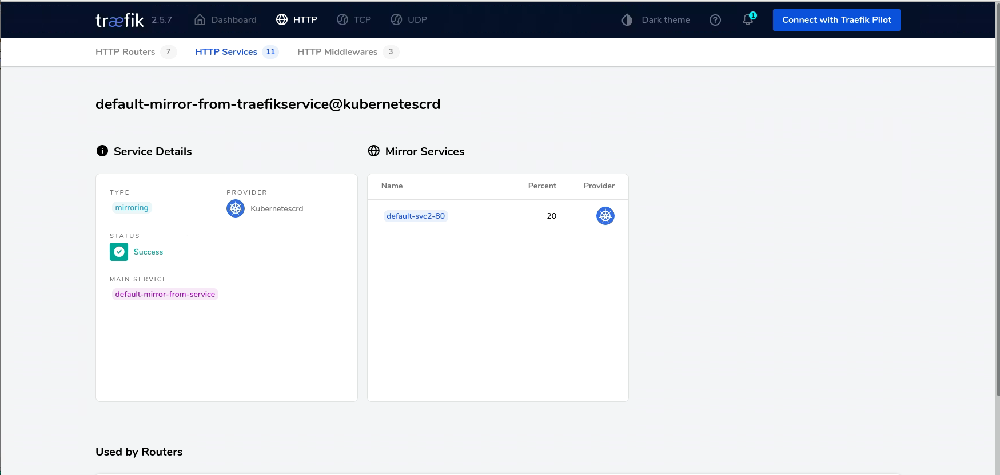

~~~powershell
# while true; do curl http://lb.kubemsb.com; sleep 1; done
~~~

### 5.3.3 流量复制小结

通过上述的演示我们会发现所有的流量100%发送了svc1,有20%的流量被复制到svc2，且用户收到响应均来自svc1，svc2并没有响应，可通过查看svc1及svc2应用日志获取访问日志。

# 六、Kubernetes Gateway API

## 6.1 Gateway API介绍

### 6.1.1 Gateway API架构

Gateway API（之前叫 Service API）是由 SIG-NETWORK 社区管理的开源项目，项目地址：https://gateway-api.sigs.k8s.io/。主要原因是 Ingress 资源对象不能很好的满足网络需求，很多场景下 Ingress 控制器都需要通过定义 annotations 或者 crd 来进行功能扩展，这对于使用标准和支持是非常不利的，新推出的 Gateway API 旨在通过可扩展的面向角色的接口来增强服务网络。

Gateway API 是 Kubernetes 中的一个 API 资源集合，包括 GatewayClass、Gateway、HTTPRoute、TCPRoute、Service 等，这些资源共同为各种网络用例构建模型。

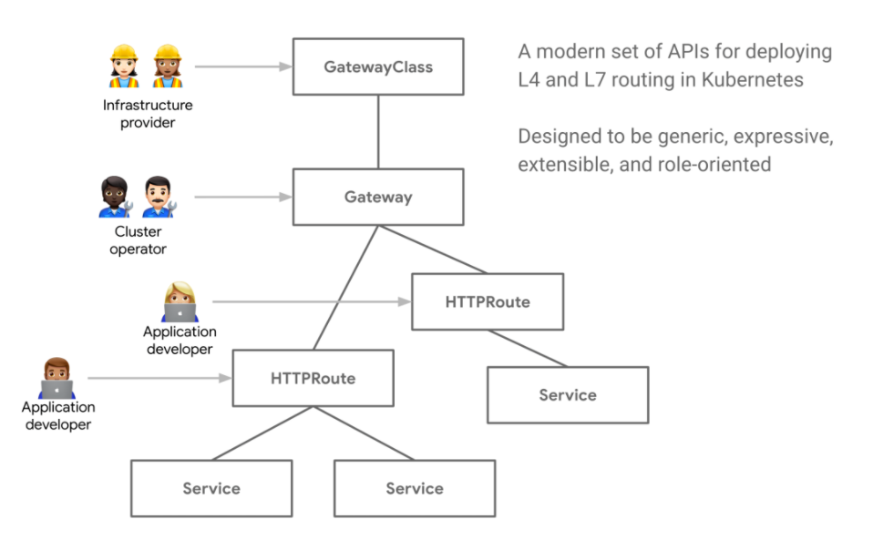

Gateway API 的改进比当前的 Ingress 资源对象有很多更好的设计：

- 面向角色 - Gateway 由各种 API 资源组成，这些资源根据使用和配置 Kubernetes 服务网络的角色进行建模。
- 通用性 - 和 Ingress 一样是一个具有众多实现的通用规范，Gateway API 是一个被设计成由许多实现支持的规范标准。
- 更具表现力 - Gateway API 资源支持基于 Header 头的匹配、流量权重等核心功能，这些功能在 Ingress 中只能通过自定义注解才能实现。
- 可扩展性 - Gateway API 允许自定义资源链接到 API 的各个层，这就允许在 API 结构的适当位置进行更精细的定制。

还有一些其他值得关注的功能：

- GatewayClasses - GatewayClasses 将负载均衡实现的类型形式化，这些类使用户可以很容易了解到通过 Kubernetes 资源可以获得什么样的能力。
- 共享网关和跨命名空间支持 - 它们允许共享负载均衡器和 VIP，允许独立的路由资源绑定到同一个网关，这使得团队可以安全地共享（包括跨命名空间）基础设施，而不需要直接协调。
- 规范化路由和后端 - Gateway API 支持类型化的路由资源和不同类型的后端，这使得 API 可以灵活地支持各种协议（如 HTTP 和 gRPC）和各种后端服务（如 Kubernetes Service、存储桶或函数）。

### 6.1.2 面向角色设计

无论是道路、电力、数据中心还是 Kubernetes 集群，基础设施都是为了共享而建的，然而共享基础设施提供了一个共同的挑战，那就是如何为基础设施用户提供灵活性的同时还能被所有者控制。

Gateway API 通过对 Kubernetes 服务网络进行面向角色的设计来实现这一目标，平衡了灵活性和集中控制。它允许共享的网络基础设施（硬件负载均衡器、云网络、集群托管的代理等）被许多不同的团队使用，所有这些都受到集群运维设置的各种策略和约束。下面的例子显示了是如何在实践中运行的。

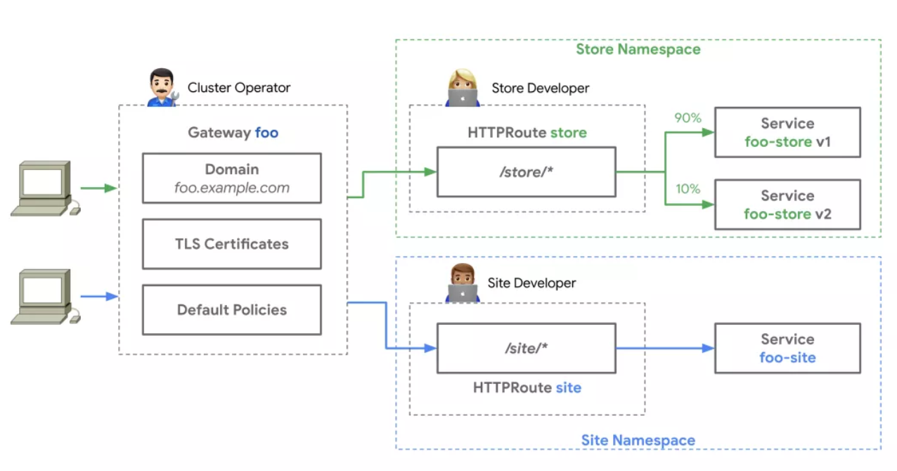

一个集群运维人员创建了一个基于 GatewayClass 的 Gateway 资源，这个 Gateway 部署或配置了它所代表的基础网络资源，集群运维和特定的团队必须沟通什么可以附加到这个 Gateway 上来暴露他们的应用。集中的策略，如 TLS，可以由集群运维在 Gateway 上强制执行，同时，Store 和 Site 应用在他们自己的命名空间中运行，但将他们的路由附加到相同的共享网关上，允许他们独立控制他们的路由逻辑。

这种关注点分离的设计可以使不同的团队能够管理他们自己的流量，同时将集中的策略和控制留给集群运维。

### 6.1.3 Gateway API概念

在整个 Gateway API 中涉及到3个角色：基础设施提供商、集群管理员、应用开发人员，在某些场景下可能还会涉及到应用管理员等角色。Gateway API 中定义了3种主要的资源模型：GatewayClass、Gateway、Route。

#### 6.1.3.1 GatewayClass

GatewayClass 定义了一组共享相同配置和动作的网关。每个GatewayClass 由一个控制器处理，是一个集群范围的资源，必须至少有一个 GatewayClass 被定义。

这与 Ingress 的 IngressClass 类似，在 Ingress v1beta1 版本中，与 GatewayClass 类似的是 ingress-class 注解，而在Ingress V1 版本中，最接近的就是 IngressClass 资源对象。

#### 6.1.3.2 Gateway

Gateway 网关描述了如何将流量转化为集群内的服务，也就是说，它定义了一个请求，要求将流量从不了解 Kubernetes 的地方转换到集群内的服务。例如，由云端负载均衡器、集群内代理或外部硬件负载均衡器发送到 Kubernetes 服务的流量。

它定义了对特定负载均衡器配置的请求，该配置实现了 GatewayClass 的配置和行为规范，该资源可以由管理员直接创建，也可以由处理 GatewayClass 的控制器创建。

Gateway 可以附加到一个或多个路由引用上，这些路由引用的作用是将流量的一个子集导向特定的服务。

#### 6.1.3.3 Route 资源

路由资源定义了特定的规则，用于将请求从网关映射到 Kubernetes 服务。

从 v1alpha2 版本开始，API 中包含四种 Route 路由资源类型，对于其他未定义的协议，鼓励采用特定实现的自定义路由类型，当然未来也可能会添加新的路由类型。

##### 6.1.3.3.1 HTTPRoute

HTTPRoute 适用于 HTTP 或 HTTPS 连接，适用于我们想要检查 HTTP 请求并使用 HTTP 请求进行路由或修改的场景，比如使用 HTTP Headers 头进行路由，或在请求过程中对它们进行修改。

##### 6.1.3.3.2 TLSRoute

TLSRoute 用于 TLS 连接，通过 SNI 进行区分，它适用于希望使用 SNI 作为主要路由方法的地方，并且对 HTTP 等更高级别协议的属性不感兴趣，连接的字节流不经任何检查就被代理到后端。

##### 6.1.3.3.3 TCPRoute 和 UDPRoute

TCPRoute（和UDPRoute）旨在用于将一个或多个端口映射到单个后端。在这种情况下，没有可以用来选择同一端口的不同后端的判别器，所以每个 TCPRoute 在监听器上需要一个不同的端口。你可以使用 TLS，在这种情况下，未加密的字节流会被传递到后端，当然也可以不使用 TLS，这样加密的字节流将传递到后端。

### 6.1.4 Gateway API概念之间关系

GatewayClass、Gateway、xRoute 和 Service 的组合定义了一个可实施的负载均衡器。下图说明了不同资源之间的关系:

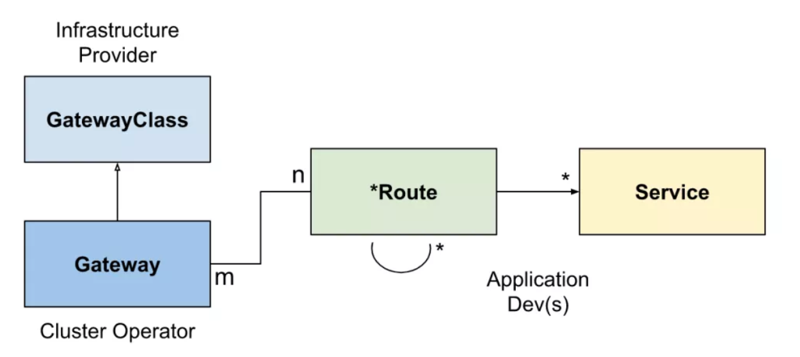

使用反向代理实现的网关的典型客户端/网关 API 请求流程如下所示：

1. 客户端向 http://foo.example.com 发出请求
2. DNS 将域名解析为 Gateway 网关地址
3. 反向代理在监听器上接收请求，并使用 Host Header 来匹配HTTPRoute
4. (可选)反向代理可以根据 HTTPRoute 的匹配规则进行路由
5. (可选)反向代理可以根据 HTTPRoute 的过滤规则修改请求，即添加或删除 headers
6. 最后，反向代理根据 HTTPRoute 的 forwardTo 规则，将请求转发给集群中的一个或多个对象，即服务。

## 6.2 kubernetes gateway CRD安装

要在 Traefik 中使用 Gateway API，首先我们需要先手动安装 Gateway API 的 CRDs，使用如下命令即可安装，这将安装包括 GatewayClass、Gateway、HTTPRoute、TCPRoute 等 CRDs：

~~~powershell
#  kubectl apply -k "github.com/kubernetes-sigs/service-apis/config/crd?ref=v0.3.0"

输出：
customresourcedefinition.apiextensions.k8s.io/gatewayclasses.gateway.networking.k8s.io created
customresourcedefinition.apiextensions.k8s.io/gateways.gateway.networking.k8s.io created
customresourcedefinition.apiextensions.k8s.io/httproutes.gateway.networking.k8s.io created
customresourcedefinition.apiextensions.k8s.io/referencepolicies.gateway.networking.k8s.io created
customresourcedefinition.apiextensions.k8s.io/tcproutes.gateway.networking.k8s.io created
customresourcedefinition.apiextensions.k8s.io/tlsroutes.gateway.networking.k8s.io created
customresourcedefinition.apiextensions.k8s.io/udproutes.gateway.networking.k8s.io created
~~~

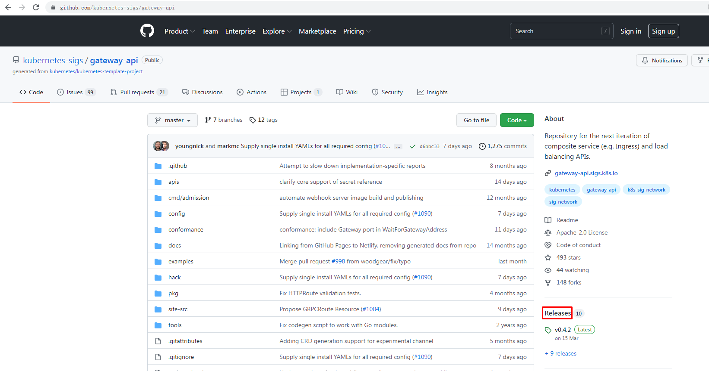

## 6.3 为traefik授权（RBAC）

~~~powershell
# vim traefik-gatewayapi-rbac.yaml
---
apiVersion: rbac.authorization.k8s.io/v1
kind: ClusterRole
metadata:
  name: gateway-role
rules:
  - apiGroups:
      - ""
    resources:
      - services
      - endpoints
      - secrets
    verbs:
      - get
      - list
      - watch
  - apiGroups:
      - networking.x-k8s.io
    resources:
      - gatewayclasses
      - gateways
      - httproutes
      - tcproutes
      - tlsroutes
    verbs:
      - get
      - list
      - watch
  - apiGroups:
      - networking.x-k8s.io
    resources:
      - gatewayclasses/status
      - gateways/status
      - httproutes/status
      - tcproutes/status
      - tlsroutes/status
    verbs:
      - update

---
apiVersion: rbac.authorization.k8s.io/v1
kind: ClusterRoleBinding
metadata:
  name: gateway-controller

roleRef:
  apiGroup: rbac.authorization.k8s.io
  kind: ClusterRole
  name: gateway-role
subjects:
  - kind: ServiceAccount
    name: traefik-ingress-controller
    namespace: kube-system 
~~~

## 6.4 Traefik开启Gateway api支持

~~~powershell
# vim traefik-configmap.yaml
......
    providers:
      kubernetesCRD: ""
      kubernetesingress: ""
      kubernetesGateway: "" 添加此行
    experimental: 添加此行
      kubernetesGateway: true 添加此行
......
~~~

~~~powershell
删除
# kubectl delete  -f traefik-configmap.yaml
# kubectl delete -f traefik-deploy.yaml
~~~

~~~powershell
重新运行
# kubectl apply  -f traefik-configmap.yaml
# kubectl apply  -f traefik-deploy.yaml
~~~

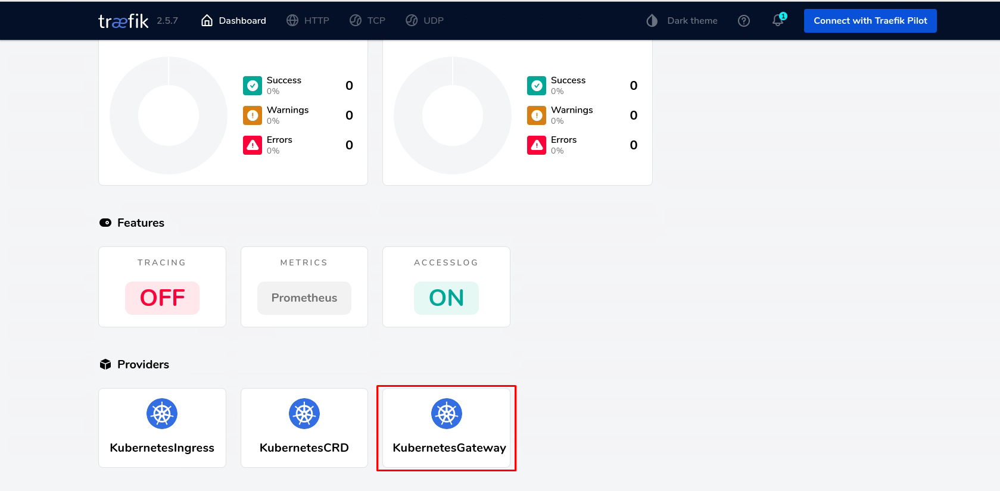

## 6.5 创建Gateway API的GatewayClass

~~~powershell
# vim gatewayclass.yaml
apiVersion: networking.x-k8s.io/v1alpha1
kind: GatewayClass
metadata:
  name: traefik
spec:
  controller: traefik.io/gateway-controller
~~~

~~~powershell
# kubectl apply -f gatewayclass.yaml
~~~

~~~powershell
# kubectl get gatewayclass
NAME      CONTROLLER                      AGE
traefik   traefik.io/gateway-controller   2m59s
~~~

## 6.6 Gateway API应用案例

### 6.6.1 通过Gateway API方式暴露traefik dashboard

#### 6.6.1.1 创建gateway

~~~powershell
# vim gateway.yaml
apiVersion: networking.x-k8s.io/v1alpha1
kind: Gateway
metadata: 
  name: http-gateway
  namespace: kube-system 
spec: 
  gatewayClassName: traefik
  listeners: 
    - protocol: HTTP
      port: 80 
      routes: 
        kind: HTTPRoute
        namespaces:
          from: All
        selector:
          matchLabels:
            app: traefik
~~~

~~~powershell
# kubectl apply -f gateway.yaml
gateway.networking.x-k8s.io/http-gateway created
~~~

~~~powershell
# kubectl get gateway
NAME           CLASS     AGE
http-gateway   traefik   6s
~~~

#### 6.5.1.2 创建HTTPRoute

~~~powershell
# vim httproute.yaml
apiVersion: networking.x-k8s.io/v1alpha1
kind: HTTPRoute
metadata:
  name: traefix-dashboard-gateway-api-route 
  namespace: kube-system
  labels:
    app: traefik
spec:
  hostnames:
    - "traefikdashboard.kubemsb.com"
  rules:
    - matches:
        - path:
            type: Prefix
            value: /
      forwardTo:
        - serviceName: traefik 
          port: 8080
          weight: 1
~~~

~~~powershell
# kubectl apply -f httproute.yaml
httproute.networking.x-k8s.io/traefix-dashboard-gateway-api-route created
~~~

~~~powershell
# kubectl get httproute
NAME                                  HOSTNAMES                          AGE
traefix-dashboard-gateway-api-route   ["traefikdashboard.kubemsb.com"]   6s
~~~

#### 6.5.1.3 在集群之外主机访问

~~~powershell
# vim /etc/hosts
192.168.10.12 traefikdashboard.kubemsb.com
~~~

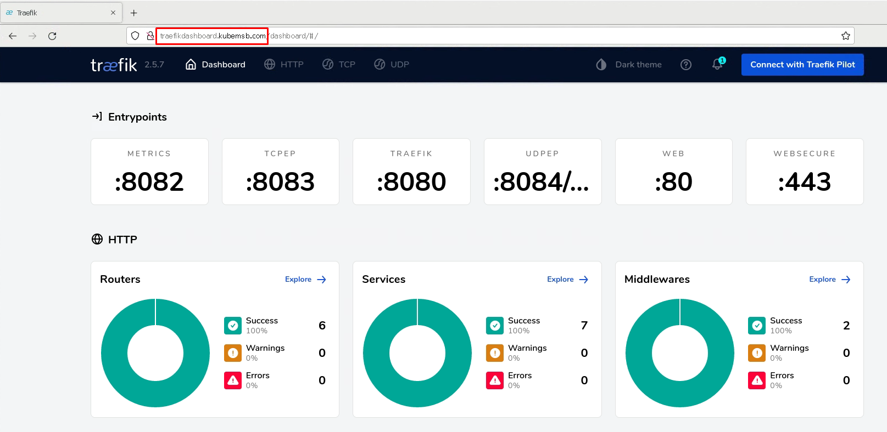

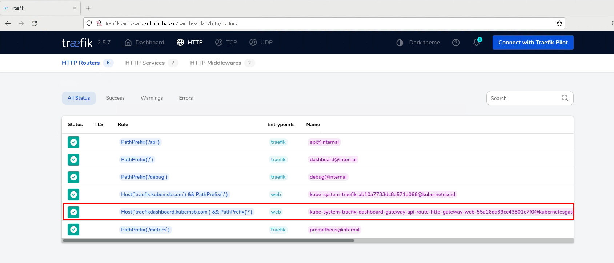

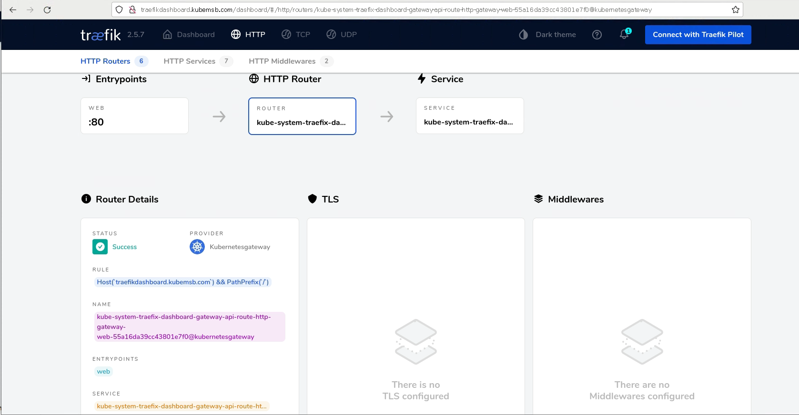

### 6.6.2 通过Gateway API方式暴露WEB应用

~~~powershell
# cat gatewayapi-web.yaml
kind: Deployment
apiVersion: apps/v1
metadata:
  name: nginx-web-gatewayapi
  namespace: default
spec:
  replicas: 1
  selector:
    matchLabels:
      app: gatewayweb
  template:
    metadata:
      labels:
        app: gatewayweb
    spec:
      containers:
        - name: nginx-web
          image: nginx:latest
          lifecycle:
            postStart:
              exec:
                command:  ["/bin/sh", "-c", "echo gatewayweb > /usr/share/nginx/html/index.html"]
          ports:
            - containerPort: 80
---
apiVersion: v1
kind: Service
metadata:
  name: nginx-web-gatewayapi-svc
  namespace: default

spec:
  ports:
    - name: http
      port: 80
  selector:
    app: gatewayweb
~~~

~~~powershell
# kubectl apply -f gatewayapi-web.yaml
deployment.apps/nginx-web-gatewayapi created
service/nginx-web-gatewayapi-svc created
~~~

~~~powershell
# vim gatewayapi-web-gateway.yaml
apiVersion: networking.x-k8s.io/v1alpha1
kind: Gateway
metadata:
  name: nginx-web-gateway
spec:
  gatewayClassName: traefik
  listeners:
    - protocol: HTTP
      port: 80
      routes:
        kind: HTTPRoute
        namespaces:
          from: All
        selector:
          matchLabels:
            app: gatewayweb
~~~

~~~powershell
# kubectl apply -f gatewayapi-web-gateway.yaml
gateway.networking.x-k8s.io/nginx-web-gateway created
~~~

~~~powershell
# kubectl get gateway
NAME                CLASS     AGE
nginx-web-gateway   traefik   7s
~~~

~~~powershell
# kubectl describe gateway nginx-web-gateway
~~~

~~~powershell
# cat gatewayapi-web-httproute.yaml
apiVersion: networking.x-k8s.io/v1alpha1
kind: HTTPRoute
metadata:
  name: nginx-web-gateway-api-route
  labels:
    app: gatewayweb
spec:
  hostnames:
    - "nginx.kubemsb.com"
  rules:
    - matches:
        - path:
            type: Prefix
            value: /
      forwardTo:
        - serviceName: nginx-web-gatewayapi-svc
          port: 80
          weight: 1
~~~

~~~powershell
# kubectl apply -f gatewayapi-web-httproute.yaml
httproute.networking.x-k8s.io/nginx-web-gateway-api-route created
~~~

~~~powershell
kubectl get httproute
NAME                          HOSTNAMES               AGE
nginx-web-gateway-api-route   ["nginx.kubemsb.com"]   6s
~~~

**在集群之外主机访问**

~~~powershell
# vim /etc/hosts
192.168.10.12 nginx.kubemsb.com
~~~

~~~powershell
# curl http://nginx.kubemsb.com
gatewayweb
~~~

### 6.6.3 金丝雀发布

>Gateway APIs 规范可以支持的另一个功能是金丝雀发布，假设你想在一个端点上运行两个不同的服务（或同一服务的两个版本），并将一部分请求路由到每个端点，则可以通过修改你的 HTTPRoute 来实现。

~~~powershell
# vim gateway-cn-deploy.yaml
kind: Deployment
apiVersion: apps/v1
metadata:
  name: nginx-web1
  namespace: kube-system
spec:
  replicas: 1
  selector:
    matchLabels:
      app: v1
  template:
    metadata:
      labels:
        app: v1
    spec:
      containers:
        - name: nginx-web-c
          image: nginx:latest
          lifecycle:
            postStart:
              exec:
                command:  ["/bin/sh", "-c", "echo svc1 > /usr/share/nginx/html/index.html"]
          ports:
            - containerPort: 80
---
kind: Deployment
apiVersion: apps/v1
metadata:
  name: nginx-web2
  namespace: kube-system
spec:
  replicas: 1
  selector:
    matchLabels:
      app: v2
  template:
    metadata:
      labels:
        app: v2
    spec:
      containers:
        - name: nginx-web-c
          image: nginx:latest
          lifecycle:
            postStart:
              exec:
                command:  ["/bin/sh", "-c", "echo svc2 > /usr/share/nginx/html/index.html"]
          ports:
            - containerPort: 80
~~~

~~~powershell
# kubectl apply -f gateway-cn-deploy.yaml
~~~

~~~powershell
# vim gateway-cn-deploy-svc.yaml
apiVersion: v1
kind: Service
metadata:
  name: svc1
  namespace: kube-system

spec:
  ports:
    - name: http
      port: 80
  selector:
    app: v1
---
apiVersion: v1
kind: Service
metadata:
  name: svc2
  namespace: kube-system

spec:
  ports:
    - name: http
      port: 80
  selector:
    app: v2
~~~

~~~powershell
# kubectl apply -fgateway-cn-deploy-svc.yaml
~~~

~~~powershell
# vim gateway-cn-httproute.yaml
apiVersion: networking.x-k8s.io/v1alpha1
kind: HTTPRoute
metadata:
  labels:
    app: traefik
  name: nginxweb-app
  namespace: kube-system
spec:
  hostnames:
    - canary.kubemsb.com
  rules:
    - forwardTo:
        - port: 80
          serviceName: svc1
          weight: 3  # 3/4 的请求到svc1
        - port: 80
          serviceName: svc2
          weight: 1  # 1/4 的请求到svc2
~~~

~~~powershell
# kubectl apply -f gateway-cn-httproute.yaml
httproute.networking.x-k8s.io/nginxweb-app created
~~~

~~~powershell
# kubectl get httproute -n kube-system
NAME                          HOSTNAMES                AGE
nginxweb-app                  ["canary.kubemsb.com"]   7s
~~~

**在 集群之外主机访问**

~~~powershell
# vim /etc/hosts
192.168.10.12 canary.kubemsb.com
~~~

~~~powershell
[root@dockerhost ~]# curl http://canary.kubemsb.com
svc1
[root@dockerhost ~]# curl http://canary.kubemsb.com
svc1
[root@dockerhost ~]# curl http://canary.kubemsb.com
svc1
[root@dockerhost ~]# curl http://canary.kubemsb.com
svc2
~~~

>以上使用 Traefik 来测试了 Kubernetes Gateway APIs 的使用。目前，Traefik 对 Gateway APIs 的实现是基于 v1alpha1 版本的规范，目前最新的规范是 v1alpha2，所以和最新的规范可能有一些出入的地方。

