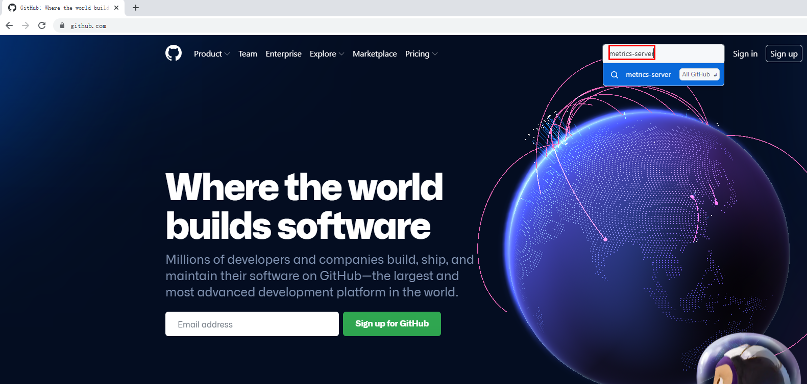

# Kubernetes集群UI及主机资源监控

# 一、Kubernetes dashboard作用

- 通过dashboard能够直观了解Kubernetes集群中运行的资源对象
- 通过dashboard可以直接管理（创建、删除、重启等操作）资源对象

# 二、获取Kubernetes dashboard资源清单文件

~~~powershell
wget https://raw.githubusercontent.com/kubernetes/dashboard/v2.5.1/aio/deploy/recommended.yaml
~~~

# 三、修改并部署kubernetes dashboard资源清单文件

~~~powershell
[root@k8s-master1 ~]# vi recommended.yaml
......
上述内容不变

为了方便在容器主机上访问，下面的service需要添加NodePort类型及端口
---

kind: Service
apiVersion: v1
metadata:
  labels:
    k8s-app: kubernetes-dashboard
  name: kubernetes-dashboard
  namespace: kubernetes-dashboard
spec:
  type: NodePort
  ports:
    - port: 443
      targetPort: 8443
      nodePort: 30000
  selector:
    k8s-app: kubernetes-dashboard

此证书不注释，对于早期版本需要注释。
---

apiVersion: v1
kind: Secret
metadata:
  labels:
    k8s-app: kubernetes-dashboard
  name: kubernetes-dashboard-certs
  namespace: kubernetes-dashboard
type: Opaque

---
......

中间内容不用改变

需要修改登录kubernetes dashboard后用户的身份，不然无法显示资源情况
---

apiVersion: rbac.authorization.k8s.io/v1
kind: ClusterRoleBinding
metadata:
  name: kubernetes-dashboard
roleRef:
  apiGroup: rbac.authorization.k8s.io
  kind: ClusterRole
  name: cluster-admin   一定要把原来的kubernetes-dashboard修改为cluster-admin，不然进入UI后会报错。
subjects:
  - kind: ServiceAccount
    name: kubernetes-dashboard
    namespace: kubernetes-dashboard

......

以下内容暂不修改
~~~

~~~powershell
kubectl apply -f recommended.yaml
~~~

# 四、访问Kubernetes dashboard

使用：https://192.168.10.12:30000 访问

~~~powershell
kubectl get secret -n kubernetes-dashboard
NAME                               TYPE                                  DATA   AGE
default-token-dzr9f                kubernetes.io/service-account-token   3      3m59s
kubernetes-dashboard-certs         Opaque                                0      3m59s
kubernetes-dashboard-csrf          Opaque                                1      3m59s
kubernetes-dashboard-key-holder    Opaque                                2      3m59s
kubernetes-dashboard-token-g6pq7   kubernetes.io/service-account-token   3      3m59s 用此token
~~~

~~~powershell
kubectl describe secret kubernetes-dashboard-token-g6pq7 -n kubernetes-dashboard
Name:         kubernetes-dashboard-token-g6pq7
Namespace:    kubernetes-dashboard
Labels:       <none>
Annotations:  kubernetes.io/service-account.name: kubernetes-dashboard
              kubernetes.io/service-account.uid: 46292f26-3046-411a-a9df-eac200290722

Type:  kubernetes.io/service-account-token

Data
====
namespace:  20 bytes
token:      eyJhbGciOiJSUzI1NiIsImtpZCI6ImVGc2xjT05uekl0MlVOZ0VCSlhHSURfOXd6WGFvVnZFZmNwREwtVk1STlEifQ.eyJpc3MiOiJrdWJlcm5ldGVzL3NlcnZpY2VhY2NvdW50Iiwia3ViZXJuZXRlcy5pby9zZXJ2aWNlYWNjb3VudC9uYW1lc3BhY2UiOiJrdWJlcm5ldGVzLWRhc2hib2FyZCIsImt1YmVybmV0ZXMuaW8vc2VydmljZWFjY291bnQvc2VjcmV0Lm5hbWUiOiJrdWJlcm5ldGVzLWRhc2hib2FyZC10b2tlbi1nNnBxNyIsImt1YmVybmV0ZXMuaW8vc2VydmljZWFjY291bnQvc2VydmljZS1hY2NvdW50Lm5hbWUiOiJrdWJlcm5ldGVzLWRhc2hib2FyZCIsImt1YmVybmV0ZXMuaW8vc2VydmljZWFjY291bnQvc2VydmljZS1hY2NvdW50LnVpZCI6IjQ2MjkyZjI2LTMwNDYtNDExYS1hOWRmLWVhYzIwMDI5MDcyMiIsInN1YiI6InN5c3RlbTpzZXJ2aWNlYWNjb3VudDprdWJlcm5ldGVzLWRhc2hib2FyZDprdWJlcm5ldGVzLWRhc2hib2FyZCJ9.qJMnfpKvpZNziXfkamdtYyIHrPnwisJBjlyCg_XWHoVPs5gNouGfrYkcxUKMdP9pBa7n1TwrurL3ppZTOAJRNSGO94F7BOXIFZ8O1-Ff1LZicWQrikSXDDyyWWEWypPHBIgOTGN_HMFJnIF98JnYd8vzrVVZBfiXco6lkVOK4eTQY87FgB0iJtXWh5LITefkNJm2d8o0tn2zrVnRUZ_TYisnirJOOrlx-GzfnwlXQxdaQRxdgEHHK3-lNZli54XtjB7IwP5jaER4mQ_sMTxrEMC-If46_ftMQqKn3R6YTGTG8UP49Xji_tPp--L3RUQI7vakr0x5-Cv_y0JlKEmlog 复制token全部内容
ca.crt:     1359 bytes
~~~

# 五、使用metrics-server实现主机资源监控

## 5.1 获取metrics-server资源清单文件

~~~powershell
wget  https://github.com/kubernetes-sigs/metrics-server/releases/download/v0.6.1/components.yaml
~~~

## 5.2 修改metrics-server资源清单文件

~~~powershell
# vim components.yaml

spec:
      containers:
      - args:
        - --cert-dir=/tmp
        - --secure-port=4443
        - --kubelet-preferred-address-types=InternalIP,InternalDNS,ExternalDNS,ExternalIP,Hostname
        - --kubelet-use-node-status-port
        - --metric-resolution=15s
        - --kubelet-insecure-tls 添加此行内容

~~~

## 5.3 部署metrics-server资源清单文件

~~~powershell
# kubectl top nodes

error: Metrics API not available
~~~

~~~powershell
# kubectl top pods

error: Metrics API not available
~~~

~~~powershell
kubectl apply -f components.yaml
~~~

## 5.4 验证及授权

~~~powershell
kubectl get pods -n kube-system
NAME                                       READY   STATUS    RESTARTS   AGE
calico-kube-controllers-7cc8dd57d9-fk777   1/1     Running   1          2d1h
calico-node-57vrc                          1/1     Running   0          2d1h
calico-node-7828d                          1/1     Running   0          2d1h
calico-node-n264t                          1/1     Running   0          2d1h
calico-node-nkxrs                          1/1     Running   0          2d1h
coredns-675db8b7cc-jp54h                   1/1     Running   0          2d1h
metrics-server-8bb87844c-4ttp9             1/1     Running   0          9m52s 此pod
~~~

~~~powershell
# kubectl top nodes

Error from server (ServiceUnavailable): the server is currently unable to handle the request (get nodes.metrics.k8s.io)
~~~

~~~powershell
kubectl create clusterrolebinding system:anonymous --clusterrole=cluster-admin --user=system:anonymous
~~~

~~~powershell
# kubectl top nodes

NAME          CPU(cores)   CPU%   MEMORY(bytes)   MEMORY%
k8s-master1   97m          4%     2497Mi          65%
k8s-master2   133m         6%     2290Mi          60%
k8s-master3   95m          4%     2215Mi          58%
k8s-worker1   45m          2%     1062Mi          27%
~~~

~~~powershell
]# kubectl top pods

NAME              CPU(cores)   MEMORY(bytes)
nginx-web-bbh48   0m           1Mi
nginx-web-x85nl   0m           1Mi
~~~

