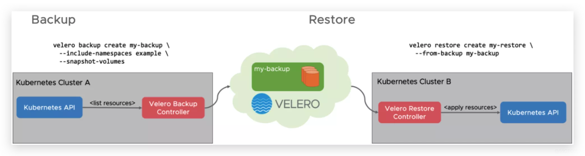
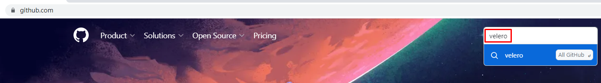
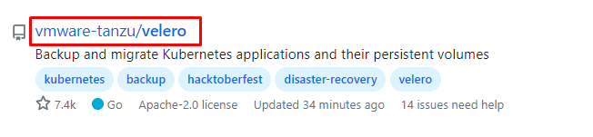
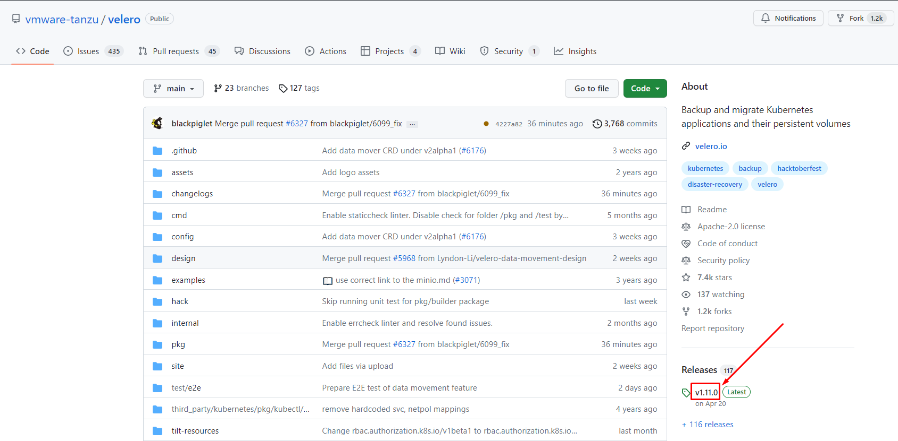
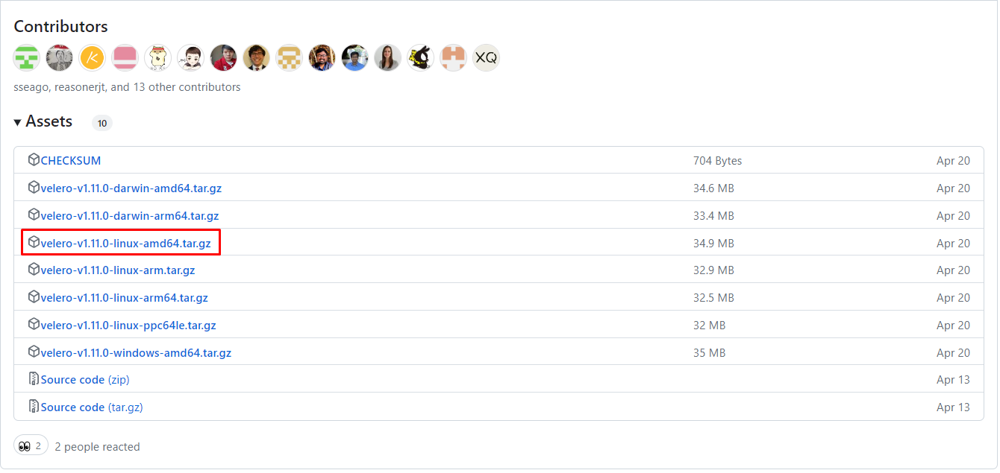
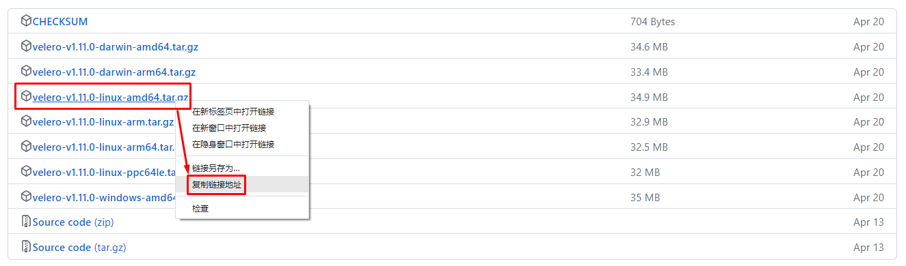
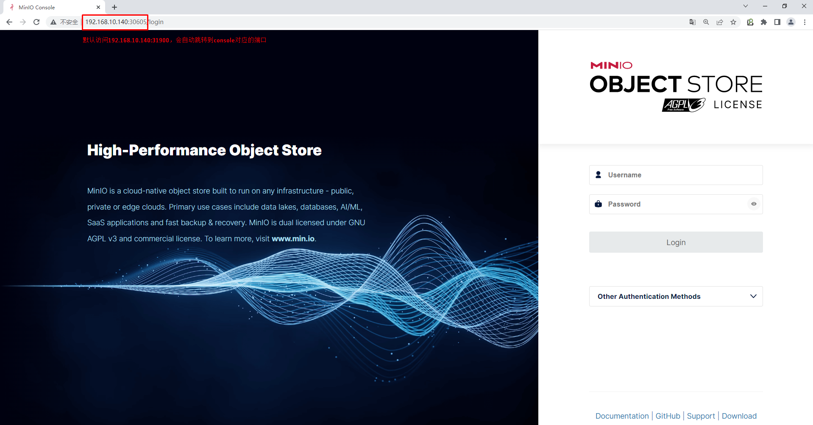
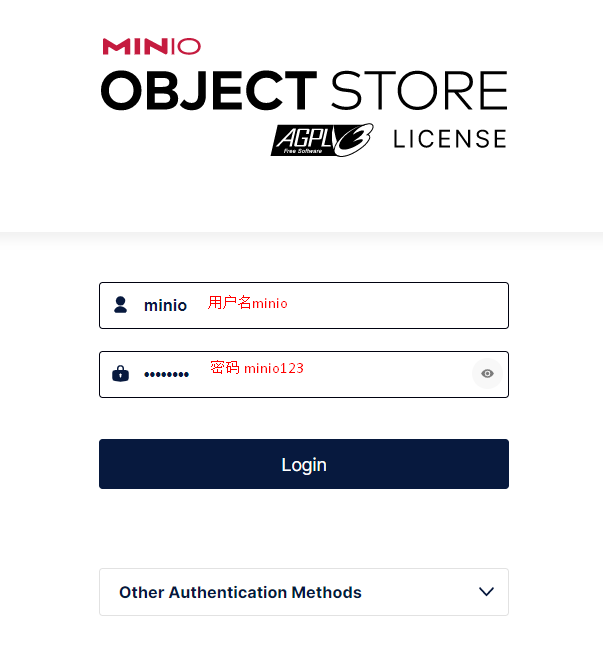
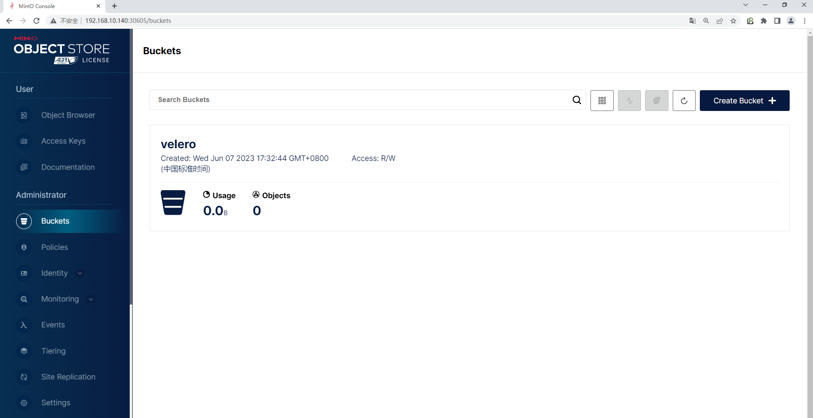
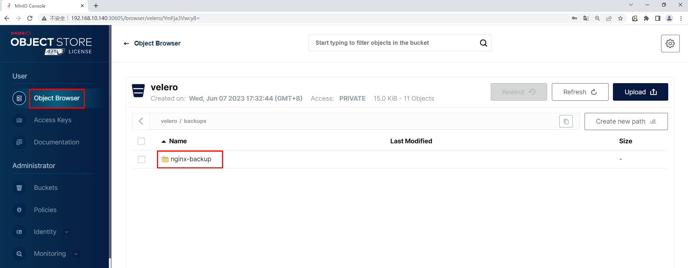

# kubernetes集群备份与恢复管理利器Velero

# 一、Velero简介

Velero 是一款可以安全的备份、恢复和迁移 Kubernetes 集群资源和持久卷等资源的备份恢复软件。

Velero 实现的 kubernetes 资源备份能力，可以轻松实现 Kubernetes 集群的数据备份和恢复、复制 kubernetes 集群资源到其他 kubernetes 集群或者快速复制生产环境到测试环境等功能，这种备份就类似于把资源的 yaml 文件进行整体备份，从而保障资源的完整性。

Velero 对存储的支持较好，可以支持很多种存储资源，比如 AWS S3、Azure Blob、Google Cloud Storage、Alibaba Cloud OSS、Swift、MinIO 等等.

# 二、Velero工作流程

# 三、Velero备份过程

- 本地 Velero 客户端发送备份指令。
- Kubernetes 集群内就会创建一个 Backup 对象。
- BackupController 监测 Backup 对象并开始备份过程。
- BackupController 会向 API Server 查询相关数据。
- BackupController 将查询到的数据备份到远端的对象存储。

# 四、Velero特性

Velero 目前包含以下特性：

- 支持 Kubernetes 集群数据备份和恢复
- 支持复制当前 Kubernetes 集群的资源到其它 Kubernetes 集群
- 支持复制生产环境到开发以及测试环境

# 五、Velero组件

Velero 组件一共分两部分，分别是服务端和客户端。

- 服务端：运行在你 Kubernetes 的集群中
- 客户端：是一些运行在本地的命令行的工具，需要已配置好 kubectl 及集群 kubeconfig 的机器上

# 六、Velero支持备份存储

- AWS S3 以及兼容 S3 的存储，比如：Minio
- Azure BloB 存储
- Google Cloud 存储
- 阿里云OSS

# 七、Velero适用场景

- 灾备场景：提供备份恢复k8s集群的能力
- 迁移场景：提供拷贝集群资源到其他集群的能力（复制同步开发，测试，生产环境的集群配置，简化环境配置）

# 八、Velero备份与etcd备份的区别

- 与 Etcd 备份相比，直接备份 Etcd 是将集群的全部资源备份起来。
- Velero 可以对 Kubernetes 集群内对象级别进行备份。
- 除了对 Kubernetes 集群进行整体备份外，Velero 还可以通过对 Type、Namespace、Label 等对象进行分类备份或者恢复。

> 注意：备份过程中创建的对象是不会被备份的。

# 九、Velero部署

|                |                                           |                                        |
| -------------- | ----------------------------------------- | -------------------------------------- |
| Velero version | Expected Kubernetes version compatibility | Tested on Kubernetes version           |
| 1.11           | 1.18-latest                               | 1.23.10, 1.24.9, 1.25.5, and 1.26.1    |
| 1.10           | 1.18-latest                               | 1.22.5, 1.23.8, 1.24.6 and 1.25.1      |
| 1.9            | 1.18-latest                               | 1.20.5, 1.21.2, 1.22.5, 1.23, and 1.24 |
| 1.8            | 1.18-latest                               |                                        |

~~~powershell
[root@k8s-master01 ~]# kubectl get nodes
NAME           STATUS   ROLES           AGE   VERSION
k8s-master01   Ready    control-plane   55d   v1.25.0
k8s-worker01   Ready    <none>          55d   v1.25.0
k8s-worker02   Ready    <none>          55d   v1.25.0
~~~

## 9.1 Velero工具获取

~~~powershell
[root@k8s-master01 ~]# wget https://github.com/vmware-tanzu/velero/releases/download/v1.11.0/velero-v1.11.0-linux-amd64.tar.gz
~~~

~~~powershell
[root@k8s-master01 ~]# ls
velero-v1.11.0-linux-amd64.tar.gz
~~~

## 9.2 部署Velero依赖后端存储MinIo

~~~powershell
[root@k8s-master01 ~]# tar xf velero-v1.11.0-linux-amd64.tar.gz
~~~

~~~powershell
[root@k8s-master01 ~]# ls
velero-v1.11.0-linux-amd64 

[root@k8s-master01 ~]# cd velero-v1.11.0-linux-amd64/

[root@k8s-master01 velero-v1.11.0-linux-amd64]# ls
examples  LICENSE  velero

[root@k8s-master01 velero-v1.11.0-linux-amd64]# cd examples/

[root@k8s-master01 examples]# ls
minio  nginx-app
~~~

~~~powershell
[root@k8s-master01 examples]# cd minio/
[root@k8s-master01 minio]# ls
00-minio-deployment.yaml
~~~

~~~powershell
[root@k8s-master01 minio]# vim 00-minio-deployment.yaml

[root@k8s-master01 minio]# cat 00-minio-deployment.yaml
# Copyright 2017 the Velero contributors.
#
# Licensed under the Apache License, Version 2.0 (the "License");
# you may not use this file except in compliance with the License.
# You may obtain a copy of the License at
#
#     http://www.apache.org/licenses/LICENSE-2.0
#
# Unless required by applicable law or agreed to in writing, software
# distributed under the License is distributed on an "AS IS" BASIS,
# WITHOUT WARRANTIES OR CONDITIONS OF ANY KIND, either express or implied.
# See the License for the specific language governing permissions and
# limitations under the License.

---
apiVersion: v1
kind: Namespace
metadata:
  name: velero

---
apiVersion: apps/v1
kind: Deployment
metadata:
  namespace: velero
  name: minio
  labels:
    component: minio
spec:
  strategy:
    type: Recreate
  selector:
    matchLabels:
      component: minio
  template:
    metadata:
      labels:
        component: minio
    spec:
      volumes:
      - name: storage
        emptyDir: {}
      - name: config
        emptyDir: {}
      containers:
      - name: minio
        image: minio/minio:latest
        imagePullPolicy: IfNotPresent
        args:
        - server
        - /storage
        - --config-dir=/config
        - --console-address
        - ":30605"
        env:
        - name: MINIO_ACCESS_KEY
          value: "minio"
        - name: MINIO_SECRET_KEY
          value: "minio123"
        ports:
        - name: web
          containerPort: 9000
        - name: console
          containerPort: 30605
        volumeMounts:
        - name: storage
          mountPath: "/storage"
        - name: config
          mountPath: "/config"

---
apiVersion: v1
kind: Service
metadata:
  namespace: velero
  name: minio
  labels:
    component: minio
spec:
  # ClusterIP is recommended for production environments.
  # Change to NodePort if needed per documentation,
  # but only if you run Minio in a test/trial environment, for example with Minikube.
  type: NodePort
  ports:
    - name: web
      port: 9000
      targetPort: 9000
      nodePort: 31900
      protocol: TCP
    - name: console
      port: 30605
      targetPort: 30605
      nodePort: 30605
      protocol: TCP
  selector:
    component: minio

---
apiVersion: batch/v1
kind: Job
metadata:
  namespace: velero
  name: minio-setup
  labels:
    component: minio
spec:
  template:
    metadata:
      name: minio-setup
    spec:
      restartPolicy: OnFailure
      volumes:
      - name: config
        emptyDir: {}
      containers:
      - name: mc
        image: minio/mc:latest
        imagePullPolicy: IfNotPresent
        command:
        - /bin/sh
        - -c
        - "mc --config-dir=/config config host add velero http://minio:9000 minio minio123 && mc --config-dir=/config mb -p velero/velero"
        volumeMounts:
        - name: config
          mountPath: "/config"
~~~

~~~powershell
[root@k8s-master01 minio]# pwd
/root/velero-v1.11.0-linux-amd64/examples/minio

[root@k8s-master01 minio]# ls
00-minio-deployment.yaml

[root@k8s-master01 minio]# kubectl apply -f 00-minio-deployment.yaml
namespace/velero created
deployment.apps/minio created
service/minio created
job.batch/minio-setup created
~~~

> 注意：访问用户名为minio，密码为minio123

~~~powershell
[root@k8s-master01 minio]# kubectl get all -n velero
NAME                         READY   STATUS      RESTARTS   AGE
pod/minio-6959795f76-fc4ls   1/1     Running     0          2m52s
pod/minio-setup-fsfvm        0/1     Completed   0          2m51s

NAME            TYPE       CLUSTER-IP   EXTERNAL-IP   PORT(S)                          AGE
service/minio   NodePort   10.96.2.7    <none>        9000:31900/TCP,30605:30605/TCP   2m52s

NAME                    READY   UP-TO-DATE   AVAILABLE   AGE
deployment.apps/minio   1/1     1            1           2m52s

NAME                               DESIRED   CURRENT   READY   AGE
replicaset.apps/minio-6959795f76   1         1         1       2m52s

NAME                    COMPLETIONS   DURATION   AGE
job.batch/minio-setup   1/1           4s         2m52s
~~~

## 9.3 安装Velero

### 9.3.1 创建访问minio密钥

~~~powershell
[root@k8s-master01 velero-v1.11.0-linux-amd64]# vim cred-velero
[root@k8s-master01 velero-v1.11.0-linux-amd64]# cat cred-velero
[default]
aws_access_key_id = minio
aws_secret_access_key = minio123
~~~

或

~~~powershell
[root@k8s-master01 velero-v1.11.0-linux-amd64]# cat > cred-velero << EOF
[default]
aws_access_key_id = minio
aws_secret_access_key = minio123
EOF
~~~

### 9.3.2 安装Velero客户端到当前系统

~~~powershell
[root@k8s-master01 velero-v1.11.0-linux-amd64]# pwd
/root/velero-v1.11.0-linux-amd64
[root@k8s-master01 velero-v1.11.0-linux-amd64]# ls
examples  LICENSE  velero
[root@k8s-master01 velero-v1.11.0-linux-amd64]# cp velero /usr/bin/
[root@k8s-master01 velero-v1.11.0-linux-amd64]# ls /usr/bin/velero
/usr/bin/velero
~~~

### 9.3.3 在K8S集群快速安装Velero

~~~powershell
[root@k8s-master01 ~]# velero completion bash
~~~

~~~powershell
[root@k8s-master01 ~]# dig -t a minio.velero.svc.cluster.local. @10.96.0.10

; <<>> DiG 9.11.4-P2-RedHat-9.11.4-26.P2.el7_9.9 <<>> -t a minio.velero.svc.cluster.local. @10.96.0.10
;; global options: +cmd
;; Got answer:
;; WARNING: .local is reserved for Multicast DNS
;; You are currently testing what happens when an mDNS query is leaked to DNS
;; ->>HEADER<<- opcode: QUERY, status: NOERROR, id: 43950
;; flags: qr aa rd; QUERY: 1, ANSWER: 1, AUTHORITY: 0, ADDITIONAL: 1
;; WARNING: recursion requested but not available

;; OPT PSEUDOSECTION:
; EDNS: version: 0, flags:; udp: 4096
;; QUESTION SECTION:
;minio.velero.svc.cluster.local.        IN      A

;; ANSWER SECTION:
minio.velero.svc.cluster.local. 30 IN   A       10.96.2.7

;; Query time: 0 msec
;; SERVER: 10.96.0.10#53(10.96.0.10)
;; WHEN: 三 6月 07 18:06:18 CST 2023
;; MSG SIZE  rcvd: 105
~~~

~~~powershell
[root@k8s-master01 velero-v1.11.0-linux-amd64]# ls
cred-velero  examples  LICENSE  velero  velero.sh
[root@k8s-master01 velero-v1.11.0-linux-amd64]# vim velero.sh
[root@k8s-master01 velero-v1.11.0-linux-amd64]# cat velero.sh
velero install \
     --provider aws \
     --plugins velero/velero-plugin-for-aws:v1.0.0 \
     --bucket velero \
     --secret-file ./cred-velero \
     --use-volume-snapshots=false \
     --backup-location-config region=minio,s3ForcePathStyle="true",s3Url=http://minio.velero.svc.cluster.local.:9000
~~~

~~~powershell
[root@k8s-master01 velero-v1.11.0-linux-amd64]# sh velero.sh
CustomResourceDefinition/backuprepositories.velero.io: attempting to create resource
CustomResourceDefinition/backuprepositories.velero.io: attempting to create resource client
CustomResourceDefinition/backuprepositories.velero.io: created
CustomResourceDefinition/backups.velero.io: attempting to create resource
CustomResourceDefinition/backups.velero.io: attempting to create resource client
CustomResourceDefinition/backups.velero.io: created
CustomResourceDefinition/backupstoragelocations.velero.io: attempting to create resource
CustomResourceDefinition/backupstoragelocations.velero.io: attempting to create resource client
CustomResourceDefinition/backupstoragelocations.velero.io: created
CustomResourceDefinition/deletebackuprequests.velero.io: attempting to create resource
CustomResourceDefinition/deletebackuprequests.velero.io: attempting to create resource client
CustomResourceDefinition/deletebackuprequests.velero.io: created
CustomResourceDefinition/downloadrequests.velero.io: attempting to create resource
CustomResourceDefinition/downloadrequests.velero.io: attempting to create resource client
CustomResourceDefinition/downloadrequests.velero.io: created
CustomResourceDefinition/podvolumebackups.velero.io: attempting to create resource
CustomResourceDefinition/podvolumebackups.velero.io: attempting to create resource client
CustomResourceDefinition/podvolumebackups.velero.io: created
CustomResourceDefinition/podvolumerestores.velero.io: attempting to create resource
CustomResourceDefinition/podvolumerestores.velero.io: attempting to create resource client
CustomResourceDefinition/podvolumerestores.velero.io: created
CustomResourceDefinition/restores.velero.io: attempting to create resource
CustomResourceDefinition/restores.velero.io: attempting to create resource client
CustomResourceDefinition/restores.velero.io: created
CustomResourceDefinition/schedules.velero.io: attempting to create resource
CustomResourceDefinition/schedules.velero.io: attempting to create resource client
CustomResourceDefinition/schedules.velero.io: created
CustomResourceDefinition/serverstatusrequests.velero.io: attempting to create resource
CustomResourceDefinition/serverstatusrequests.velero.io: attempting to create resource client
CustomResourceDefinition/serverstatusrequests.velero.io: created
CustomResourceDefinition/volumesnapshotlocations.velero.io: attempting to create resource
CustomResourceDefinition/volumesnapshotlocations.velero.io: attempting to create resource client
CustomResourceDefinition/volumesnapshotlocations.velero.io: created
Waiting for resources to be ready in cluster...
Namespace/velero: attempting to create resource
Namespace/velero: attempting to create resource client
Namespace/velero: already exists, proceeding
Namespace/velero: created
ClusterRoleBinding/velero: attempting to create resource
ClusterRoleBinding/velero: attempting to create resource client
ClusterRoleBinding/velero: created
ServiceAccount/velero: attempting to create resource
ServiceAccount/velero: attempting to create resource client
ServiceAccount/velero: created
Secret/cloud-credentials: attempting to create resource
Secret/cloud-credentials: attempting to create resource client
Secret/cloud-credentials: created
BackupStorageLocation/default: attempting to create resource
BackupStorageLocation/default: attempting to create resource client
BackupStorageLocation/default: created
Deployment/velero: attempting to create resource
Deployment/velero: attempting to create resource client
Deployment/velero: created
Velero is installed! ⛵ Use 'kubectl logs deployment/velero -n velero' to view the status.
~~~

~~~powershell
[root@k8s-master01 velero-v1.11.0-linux-amd64]# kubectl api-versions | grep velero
velero.io/v1
~~~

~~~powershell
[root@k8s-master01 velero-v1.11.0-linux-amd64]# kubectl get pods -n velero
NAME                      READY   STATUS      RESTARTS   AGE
minio-6959795f76-fc4ls    1/1     Running     0          38m
minio-setup-fsfvm         0/1     Completed   0          38m
velero-84fff5d559-rr6bw   1/1     Running     0          93s
~~~

# 十、velero命令介绍

~~~powershell
[root@k8s-master01 ~]# velero create backup --help
Create a backup

Usage:
  velero create backup NAME [flags]

Examples:
  # Create a backup containing all resources.
  velero backup create backup1

  # Create a backup including only the nginx namespace.
  velero backup create nginx-backup --include-namespaces nginx

  # Create a backup excluding the velero and default namespaces.
  velero backup create backup2 --exclude-namespaces velero,default

  # Create a backup based on a schedule named daily-backup.
  velero backup create --from-schedule daily-backup

  # View the YAML for a backup that doesn't snapshot volumes, without sending it to the server.
  velero backup create backup3 --snapshot-volumes=false -o yaml

  # Wait for a backup to complete before returning from the command.
  velero backup create backup4 --wait

~~~

~~~powershell
# 剔除 namespace
--exclude-namespaces stringArray                  namespaces to exclude from the backup

# 剔除资源类型
--exclude-resources stringArray                   resources to exclude from the backup, formatted as resource.group, such as storageclasses.storage.k8s.io

# 包含集群资源类型 
--include-cluster-resources optionalBool[=true]   include cluster-scoped resources in the backup

# 包含 namespace
--include-namespaces stringArray                  namespaces to include in the backup (use '*' for all namespaces) (default *)

# 包含 namespace 资源类型
--include-resources stringArray                   resources to include in the backup, formatted as resource.group, such as storageclasses.storage.k8s.io (use '*' for all resources)

# 给这个备份加上标签
--labels mapStringString                          labels to apply to the backup
-o, --output string                               Output display format. For create commands, display the object but do not send it to the server. Valid formats are 'table', 'json', and 'yaml'. 'table' is not valid for the install command.

# 对指定标签的资源进行备份
-l, --selector labelSelector                      only back up resources matching this label selector (default <none>)

# 对 PV 创建快照
--snapshot-volumes optionalBool[=true]            take snapshots of PersistentVolumes as part of the backup

# 指定备份的位置
--storage-location string                         location in which to store the backup

# 备份数据多久删掉

--ttl duration                                    how long before the backup can be garbage collected (default 720h0m0s)

# 指定快照的位置，也就是哪一个公有云驱动
--volume-snapshot-locations strings               list of locations (at most one per provider) where volume snapshots should be stored
~~~

# 十一、使用velero实现k8s资源对象备份

## 11.1 创建用于备份测试应用

~~~powershell
[root@k8s-master01 ~]# ls velero-v1.11.0-linux-amd64
cred-velero  examples  LICENSE  velero  velero.sh

[root@k8s-master01 ~]# ls velero-v1.11.0-linux-amd64/examples/
minio  nginx-app

[root@k8s-master01 ~]# ls velero-v1.11.0-linux-amd64/examples/nginx-app/
base.yaml  README.md  with-pv.yaml

[root@k8s-master01 ~]# cat velero-v1.11.0-linux-amd64/examples/nginx-app/base.yaml
# Copyright 2017 the Velero contributors.
#
# Licensed under the Apache License, Version 2.0 (the "License");
# you may not use this file except in compliance with the License.
# You may obtain a copy of the License at
#
#     http://www.apache.org/licenses/LICENSE-2.0
#
# Unless required by applicable law or agreed to in writing, software
# distributed under the License is distributed on an "AS IS" BASIS,
# WITHOUT WARRANTIES OR CONDITIONS OF ANY KIND, either express or implied.
# See the License for the specific language governing permissions and
# limitations under the License.

---
apiVersion: v1
kind: Namespace
metadata:
  name: nginx-example
  labels:
    app: nginx

---
apiVersion: apps/v1
kind: Deployment
metadata:
  name: nginx-deployment
  namespace: nginx-example
spec:
  replicas: 2
  selector:
    matchLabels:
      app: nginx
  template:
    metadata:
      labels:
        app: nginx
    spec:
      containers:
      - image: nginx:1.17.6
        name: nginx
        ports:
        - containerPort: 80

---
apiVersion: v1
kind: Service
metadata:
  labels:
    app: nginx
  name: my-nginx
  namespace: nginx-example
spec:
  ports:
  - port: 80
    targetPort: 80
  selector:
    app: nginx
  type: LoadBalancer
~~~

~~~powershell
[root@k8s-master01 ~]# kubectl apply -f velero-v1.11.0-linux-amd64/examples/nginx-app/base.yaml
namespace/nginx-example created
deployment.apps/nginx-deployment created
service/my-nginx created
~~~

~~~powershell
[root@k8s-master01 ~]# kubectl get all -n nginx-example
NAME                                    READY   STATUS    RESTARTS   AGE
pod/nginx-deployment-747864f4b5-5r7kd   1/1     Running   0          39s
pod/nginx-deployment-747864f4b5-9n5gz   1/1     Running   0          39s

NAME               TYPE           CLUSTER-IP    EXTERNAL-IP   PORT(S)        AGE
service/my-nginx   LoadBalancer   10.96.1.113   <pending>     80:32403/TCP   39s

NAME                               READY   UP-TO-DATE   AVAILABLE   AGE
deployment.apps/nginx-deployment   2/2     2            2           39s

NAME                                          DESIRED   CURRENT   READY   AGE
replicaset.apps/nginx-deployment-747864f4b5   2         2         2       39s
~~~

## 11.2 创建备份

~~~powershell
[root@k8s-master01 ~]# velero backup create nginx-backup --include-namespaces nginx-example
Backup request "nginx-backup" submitted successfully.
Run `velero backup describe nginx-backup` or `velero backup logs nginx-backup` for more details.
~~~

## 11.3 查看备份

~~~powershell
[root@k8s-master01 ~]# velero backup describe nginx-backup
Name:         nginx-backup
Namespace:    velero
Labels:       velero.io/storage-location=default
Annotations:  velero.io/source-cluster-k8s-gitversion=v1.25.5
              velero.io/source-cluster-k8s-major-version=1
              velero.io/source-cluster-k8s-minor-version=25

Phase:  Completed

Namespaces:
  Included:  nginx-example
  Excluded:  <none>

Resources:
  Included:        *
  Excluded:        <none>
  Cluster-scoped:  auto

Label selector:  <none>

Storage Location:  default

Velero-Native Snapshot PVs:  auto

TTL:  720h0m0s

CSISnapshotTimeout:    10m0s
ItemOperationTimeout:  1h0m0s

Hooks:  <none>

Backup Format Version:  1.1.0

Started:    2023-06-08 10:49:07 +0800 CST
Completed:  2023-06-08 10:49:08 +0800 CST

Expiration:  2023-07-08 10:49:07 +0800 CST

Velero-Native Snapshots: <none included>
~~~

~~~powershell
查看备份位置
[root@k8s-master01 ~]# velero backup-location get
NAME      PROVIDER   BUCKET/PREFIX   PHASE       LAST VALIDATED                  ACCESS MODE   DEFAULT
default   aws        velero          Available   2023-06-09 10:16:49 +0800 CST   ReadWrite     true
~~~

~~~powershell
查看备份文件
[root@k8s-master01 ~]# kubectl get backups.velero.io -n velero
NAME                 AGE
nginx-backup         23h
~~~

# 十二、使用velero实现对K8S资源对象进行恢复

## 12.1 删除备份测试应用

~~~powershell
[root@k8s-master01 ~]# kubectl delete -f velero-v1.11.0-linux-amd64/examples/nginx-app/base.yaml
namespace "nginx-example" deleted
deployment.apps "nginx-deployment" deleted
service "my-nginx" deleted
~~~

## 12.2 恢复备份测试应用

~~~powershell
[root@k8s-master01 ~]# velero restore create --from-backup nginx-backup --wait
Restore request "nginx-backup-20230608111349" submitted successfully.
Waiting for restore to complete. You may safely press ctrl-c to stop waiting - your restore will continue in the background.

Restore completed with status: Completed. You may check for more information using the commands `velero restore describe nginx-backup-20230608111349` and `velero restore logs nginx-backup-20230608111349`.
~~~

~~~powershell
[root@k8s-master01 ~]# kubectl get pods -n nginx-example
NAME                                READY   STATUS    RESTARTS   AGE
nginx-deployment-747864f4b5-5r7kd   1/1     Running   0          37s
nginx-deployment-747864f4b5-9n5gz   1/1     Running   0          37s
~~~

# 十三、周期性备份任务

~~~powershell
# Create a backup every 6 hours
velero create schedule NAME --schedule="0 */6 * * *"

# Create a backup every 6 hours with the @every notation
velero create schedule NAME --schedule="@every 6h"

# Create a daily backup of the web namespace
velero create schedule NAME --schedule="@every 24h" --include-namespaces web

# Create a weekly backup, each living for 90 days (2160 hours)
velero create schedule NAME --schedule="@every 168h" --ttl 2160h0m0s

# 每日对anchnet-devops-dev/anchnet-devops-test/anchnet-devops-prod/xxxxx-devops-common-test 名称空间进行备份
velero create schedule anchnet-devops-dev --schedule="@every 24h" --include-namespaces xxxxx-devops-dev 
velero create schedule anchnet-devops-test --schedule="@every 24h" --include-namespaces xxxxx-devops-test
velero create schedule anchnet-devops-prod --schedule="@every 24h" --include-namespaces xxxxx-devops-prod 
velero create schedule anchnet-devops-common-test --schedule="@every 24h" --include-namespaces xxxxx-devops-common-test
~~~

~~~powershell
案例：
[root@k8s-master01 ~]# velero create schedule nginx-backups --schedule="0 */1 * * *" --include-namespaces nginx-example
Schedule "nginx-backups" created successfully.

[root@k8s-master01 ~]# velero get schedules
NAME            STATUS    CREATED                         SCHEDULE      BACKUP TTL   LAST BACKUP   SELECTOR   PAUSED
nginx-backups   Enabled   2023-06-09 10:36:08 +0800 CST   0 */1 * * *   0s           n/a           <none>     false
~~~

> 注意事项：
>
> - 在velero备份的时候，备份过程中创建的对象是不会被备份的。
> - velero restore 恢复不会覆盖已有的资源，只恢复当前集群中不存在的资源。已有的资源不会回滚到之前的版本，如需要回滚，需在restore之前提前删除现有的资源。
> - velero也可作为一个crontjob来运行，定期备份数据。

# 十四、在其它K8S集群中部署velero及恢复应用

## 14.1 在其它K8S集群中部署velero

~~~powershell
从第一个K8S集群中复制文件到第二个K8S集群master节点
[root@k8s-master01 ~]# scp -r velero-v1.11.0-linux-amd64 192.168.10.160:/root
~~~

~~~powershell
[root@k8s-master01 ~]# cp velero-v1.11.0-linux-amd64/velero /usr/bin/
~~~

~~~powershell
[root@k8s-master01 velero-v1.11.0-linux-amd64]# cat cred-velero
[default]
aws_access_key_id = minio
aws_secret_access_key = minio123

[root@k8s-master01 velero-v1.11.0-linux-amd64]# cat velero.sh
velero install \
     --provider aws \
     --plugins velero/velero-plugin-for-aws:v1.0.0 \
     --bucket velero \
     --secret-file ./cred-velero \
     --use-volume-snapshots=false \
     --backup-location-config region=minio,s3ForcePathStyle="true",s3Url=http://minio.velero.svc.cluster.local.:9000
     
     
[root@k8s-master01 velero-v1.11.0-linux-amd64]# vim velero.sh
[root@k8s-master01 velero-v1.11.0-linux-amd64]# cat velero.sh
velero install \
     --provider aws \
     --plugins velero/velero-plugin-for-aws:v1.0.0 \
     --bucket velero \
     --secret-file ./cred-velero \
     --use-volume-snapshots=false \
     --backup-location-config region=minio,s3ForcePathStyle="true",s3Url=http://192.168.10.140:31900
~~~

~~~powershell
[root@k8s-master01 velero-v1.11.0-linux-amd64]# sh velero.sh
CustomResourceDefinition/backuprepositories.velero.io: attempting to create resource
CustomResourceDefinition/backuprepositories.velero.io: attempting to create resource client
CustomResourceDefinition/backuprepositories.velero.io: created
CustomResourceDefinition/backups.velero.io: attempting to create resource
CustomResourceDefinition/backups.velero.io: attempting to create resource client
CustomResourceDefinition/backups.velero.io: created
CustomResourceDefinition/backupstoragelocations.velero.io: attempting to create resource
CustomResourceDefinition/backupstoragelocations.velero.io: attempting to create resource client
CustomResourceDefinition/backupstoragelocations.velero.io: created
CustomResourceDefinition/deletebackuprequests.velero.io: attempting to create resource
CustomResourceDefinition/deletebackuprequests.velero.io: attempting to create resource client
CustomResourceDefinition/deletebackuprequests.velero.io: created
CustomResourceDefinition/downloadrequests.velero.io: attempting to create resource
CustomResourceDefinition/downloadrequests.velero.io: attempting to create resource client
CustomResourceDefinition/downloadrequests.velero.io: created
CustomResourceDefinition/podvolumebackups.velero.io: attempting to create resource
CustomResourceDefinition/podvolumebackups.velero.io: attempting to create resource client
CustomResourceDefinition/podvolumebackups.velero.io: created
CustomResourceDefinition/podvolumerestores.velero.io: attempting to create resource
CustomResourceDefinition/podvolumerestores.velero.io: attempting to create resource client
CustomResourceDefinition/podvolumerestores.velero.io: created
CustomResourceDefinition/restores.velero.io: attempting to create resource
CustomResourceDefinition/restores.velero.io: attempting to create resource client
CustomResourceDefinition/restores.velero.io: created
CustomResourceDefinition/schedules.velero.io: attempting to create resource
CustomResourceDefinition/schedules.velero.io: attempting to create resource client
CustomResourceDefinition/schedules.velero.io: created
CustomResourceDefinition/serverstatusrequests.velero.io: attempting to create resource
CustomResourceDefinition/serverstatusrequests.velero.io: attempting to create resource client
CustomResourceDefinition/serverstatusrequests.velero.io: created
CustomResourceDefinition/volumesnapshotlocations.velero.io: attempting to create resource
CustomResourceDefinition/volumesnapshotlocations.velero.io: attempting to create resource client
CustomResourceDefinition/volumesnapshotlocations.velero.io: created
Waiting for resources to be ready in cluster...
Namespace/velero: attempting to create resource
Namespace/velero: attempting to create resource client
Namespace/velero: already exists, proceeding
Namespace/velero: created
ClusterRoleBinding/velero: attempting to create resource
ClusterRoleBinding/velero: attempting to create resource client
ClusterRoleBinding/velero: created
ServiceAccount/velero: attempting to create resource
ServiceAccount/velero: attempting to create resource client
ServiceAccount/velero: created
Secret/cloud-credentials: attempting to create resource
Secret/cloud-credentials: attempting to create resource client
Secret/cloud-credentials: created
BackupStorageLocation/default: attempting to create resource
BackupStorageLocation/default: attempting to create resource client
BackupStorageLocation/default: created
Deployment/velero: attempting to create resource
Deployment/velero: attempting to create resource client
Deployment/velero: created
Velero is installed! ⛵ Use 'kubectl logs deployment/velero -n velero' to view the status.
~~~

~~~powershell
[root@k8s-master01 velero-v1.11.0-linux-amd64]# kubectl get pods -n velero
NAME                      READY   STATUS      RESTARTS   AGE
velero-84fff5d559-x82gh   1/1     Running     0          50s
~~~

## 14.2 恢复应用到新K8S集群

~~~powershell
查看备份位置 
[root@k8s-master01 velero-v1.11.0-linux-amd64]# velero backup-location get
NAME      PROVIDER   BUCKET/PREFIX   PHASE       LAST VALIDATED                  ACCESS MODE   DEFAULT
default   aws        velero          Available   2023-06-09 10:16:44 +0800 CST   ReadWrite     true
~~~

~~~powershell
查看备份文件
[root@k8s-master01 velero-v1.11.0-linux-amd64]# kubectl get backups.velero.io -n velero
NAME                 AGE
nginx-backup         4m7s
~~~

~~~powershell
恢复备份到新K8S集群
[root@k8s-master01 ~]# velero restore create \
--namespace velero \
--from-backup nginx-backup --wait
~~~

~~~powershell
查看备份恢复情况
[root@k8s-master01 ~]# kubectl get ns
NAME               STATUS   AGE
calico-apiserver   Active   56d
calico-system      Active   56d
default            Active   56d
kube-node-lease    Active   56d
kube-public        Active   56d
kube-system        Active   56d
nginx-example      Active   7s
tigera-operator    Active   56d
velero             Active   6m17s

[root@k8s-master01 ~]# kubectl get pods -n nginx-example
NAME                                READY   STATUS    RESTARTS   AGE
nginx-deployment-747864f4b5-5r7kd   1/1     Running   0          22s
nginx-deployment-747864f4b5-9n5gz   1/1     Running   0          22s
~~~

