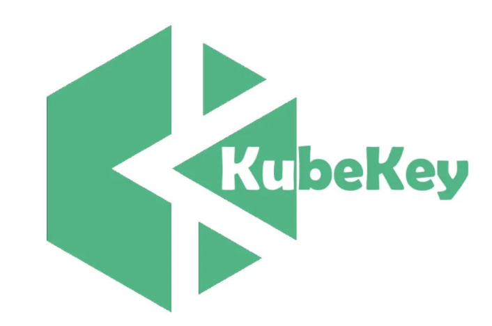
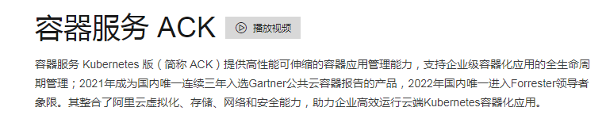
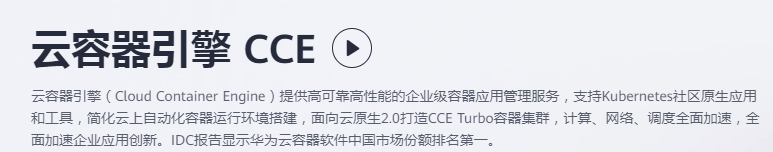
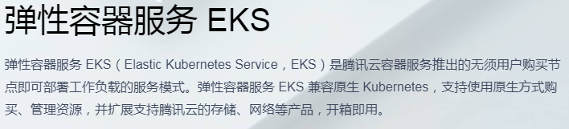

# Kubernetes集群部署方式说明

# 一、本地化部署

## 1.1 kubeadm

- Kubeadm 是一个工具，旨在提供创建 Kubernetes 集群`kubeadm init`的`kubeadm join`最佳实践“快速路径”。

- kubeadm 执行必要的操作以启动并运行最小的可行集群。
- 按照设计，它只关心引导，而不关心配置机器。
- 同样，安装各种不错的插件，如 Kubernetes 仪表板、监控解决方案和特定于云的插件，也不在范围内。
- 相反，我们希望在 kubeadm 之上构建更高级别和更量身定制的工具，理想情况下，使用 kubeadm 作为所有部署的基础将更容易创建符合要求的集群。

- 用法参考链接
  - https://kubernetes.io/docs/reference/setup-tools/kubeadm/

## 1.2 minikube

- minikube适合用于部署本地kubernetes集群，此集群主要用于测试目的
- minikube可以快速让你在单主机上部署kubernetes集群
- 可以跨平台部署kubernetes集群（Linux、MAC、Windowns）

## 1.3 二进制部署方式

- 纯人肉方式部署
- 企业生产级别的部署方式
- 部署时间长
- 需要配置内容：
  - 证书
  - 服务配置文件
  - 使用systemd管理服务管理文件
  - kubeconfig

## 1.4 国内第三方部署工具

- rke
  - 是一个快速的，多功能的kubernetes集群部署工具
  - 仅通过一个配置文件就可以快速完成kubernetes集群部署
  - 方便在kubernetes中添加任何节点数量的主机

- kubekey

- kubeykey是KubeSphere基于Go语言开发的kubernetes集群安装工具，可以轻松、高效、灵活地单独或整体安装Kubernetes和KubeSphere，底层使用Kubeadm在多个节点上并行安装Kubernetes 集群，支持创建、扩缩和升级 Kubernetes 集群。

- KubeKey 提供内置高可用模式，支持一键安装高可用 Kubernetes 集群。
- KubeKey 不仅能帮助用户在线创建集群，还能作为离线安装解决方案。
- KubeKey可以用于以下三种安装场景：
  - 仅安装 Kubernetes集群
  - 一键安装 Kubernetes 和 KubeSphere
  - 已有Kubernetes集群，使用ks-installer 在其上部署 KubeSphere

- kubeasz

项目致力于提供快速部署高可用k8s集群的工具, 同时也努力成为k8s实践、使用的参考书；基于二进制方式部署和利用ansible-playbook实现自动化；既提供一键安装脚本, 也可以根据安装指南分步执行安装各个组件。

- 集群特性 TLS双向认证、RBAC授权、多Master高可用、支持Network Policy、备份恢复、离线安装
- 集群版本 kubernetes v1.20, v1.21, v1.22, v1.23
- 操作系统 CentOS/RedHat 7, Debian 9/10, Ubuntu 16.04/18.04/20.04
- 运行时 docker 19.03.x, 20.10.x containerd v1.5.8
- 网络 calico, cilium, flannel, kube-ovn, kube-router
- 项目代码托管网址：https://github.com/easzlab/kubeasz

# 二、公有云平台部署

## 2.1 公有云平台提供容器云服务

- 阿里云
  - ACK

- 华为云
  - CCE

- 腾讯云
  - EKS

## 2.2 在公有云平台部署

- kubeadm
- minikube
- 二进制方式部署
- rke
- kubekey
- kubeasz

