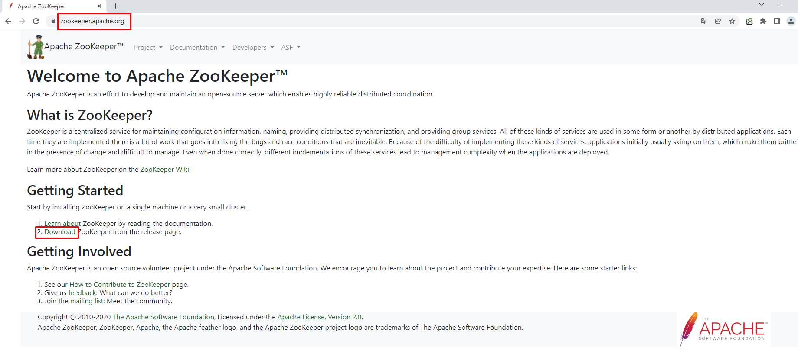
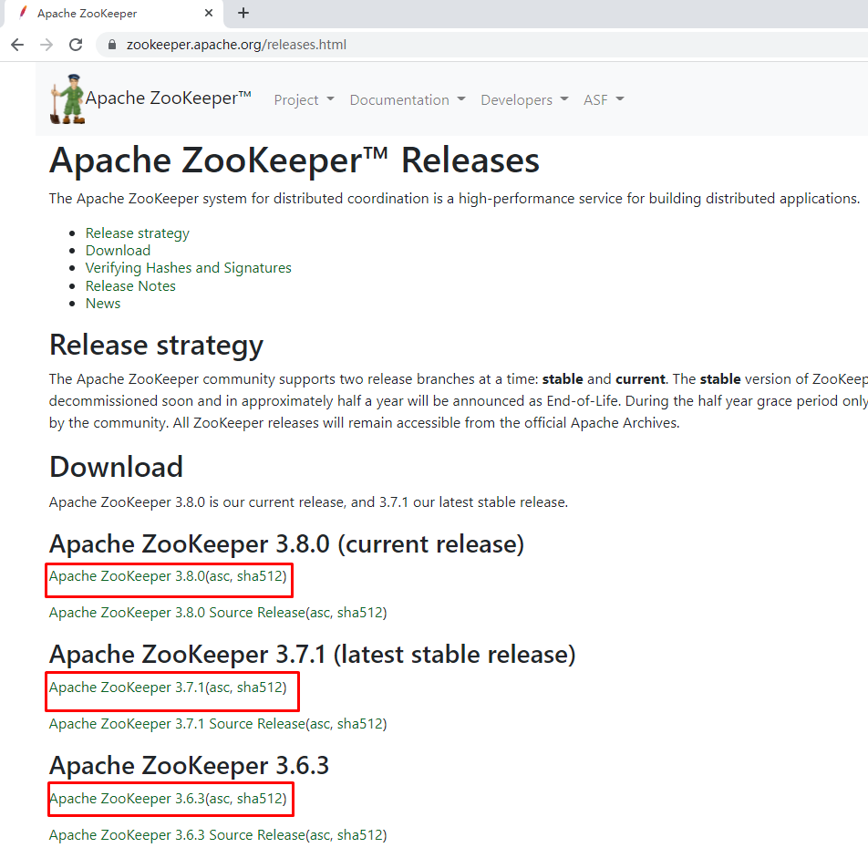
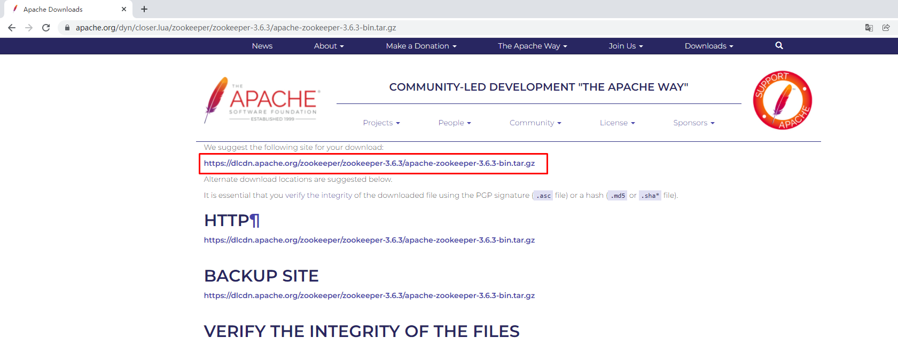

# 企业级中间件上云部署 zookeeper

# 一、环境说明

- storageclass
- ingress

# 二、zookeeper部署YAML资源清单准备

~~~powershell
# vim zookeeper.yaml

# cat zookeeper.yaml
---
apiVersion: v1
kind: Namespace
metadata:
  name: smart

---
apiVersion: v1
kind: Service
metadata:
  name: zk-headless
  namespace: smart
  labels:
    app: zk
spec:
  ports:
  - port: 2888
    name: server
  - port: 3888
    name: leader-election
  clusterIP: None
  selector:
    app: zk
---
apiVersion: v1
kind: Service
metadata:
  name: zk-np
  namespace: smart
  labels:
    app: zk
spec:
  type: NodePort
  ports:
  - port: 2181
    targetPort: 2181
    name: client
    nodePort: 32181
  selector:
    app: zk
---
apiVersion: policy/v1
kind: PodDisruptionBudget
metadata:
  name: zk-pdb
  namespace: smart
spec:
  selector:
    matchLabels:
      app: zk
  maxUnavailable: 1
---
apiVersion: apps/v1
kind: StatefulSet
metadata:
  name: zookeeper
  namespace: smart
spec:
  serviceName: zk-headless
  replicas: 3
  updateStrategy:
    type: RollingUpdate
  selector:
    matchLabels:
      app: zk
  template:
    metadata:
      labels:
        app: zk
    spec:
      affinity:
        podAntiAffinity:
          requiredDuringSchedulingIgnoredDuringExecution:
            - labelSelector:
                matchExpressions:
                  - key: "app"
                    operator: In
                    values:
                    - zk
              topologyKey: "kubernetes.io/hostname"
      containers:
      - name: kubernetes-zookeeper
        image: k8s.gcr.io/kubernetes-zookeeper:1.0-3.4.10
        imagePullPolicy: Always
        resources:
          requests:
            memory: "1Gi"
            cpu: "0.5"
        ports:
        - containerPort: 2181
          name: client
        - containerPort: 2888
          name: server
        - containerPort: 3888
          name: leader-election
        command:
        - sh
        - -c
        - "start-zookeeper \
          --servers=3 \
          --data_dir=/var/lib/zookeeper/data \
          --data_log_dir=/var/lib/zookeeper/data/log \
          --conf_dir=/opt/zookeeper/conf \
          --client_port=2181 \
          --election_port=3888 \
          --server_port=2888 \
          --tick_time=2000 \
          --init_limit=10 \
          --sync_limit=5 \
          --heap=512M \
          --max_client_cnxns=60 \
          --snap_retain_count=3 \
          --purge_interval=12 \
          --max_session_timeout=40000 \
          --min_session_timeout=4000 \
          --log_level=INFO"
        readinessProbe:
          exec:
            command:
            - sh
            - -c
            - "zookeeper-ready 2181"
          initialDelaySeconds: 10
          timeoutSeconds: 5
        livenessProbe:
          exec:
            command:
            - sh
            - -c
            - "zookeeper-ready 2181"
          initialDelaySeconds: 10
          timeoutSeconds: 5
        volumeMounts:
        - name: datadir
          mountPath: /var/lib/zookeeper
        - name: localtime
          mountPath: /etc/localtime
      volumes:
      - name: localtime
        hostPath:
          path: /etc/localtime
          type: ''

  volumeClaimTemplates:
  - metadata:
      name: datadir
      annotations:
        volume.alpha.kubernetes.io/storage-class: anything
    spec:
      accessModes: [ "ReadWriteOnce" ]
      storageClassName: "nfs-client"
      resources:
        requests:
          storage: 1Gi
~~~

**注意：**

Pod Disruption Budget (pod 中断 预算)，含义其实是 终止pod前 通过labelSelector机制获取正常运行的pod数目的限制，目的是对主动驱逐的保护措施。

- 场景
  节点维护或升级时(kubectl drain)
  对应用的自动缩容操作(autoscaling down)
  由于节点不可用(not ready)导致的Pod驱逐就不能称之为主动

- 特性
  PDB指定一个pod集合在一段时间内存活的最小实例数量或者百分比
  作用于一组被同一个控制器管理的pod。例如：RC或者statefulapp
  使用PodDisruptionBudget控制器本身无法真正保障指定数量或者百分比的pod存活，PodDisruptionBudget控制器只能保证POD主动逃离的情况下业务不中断或者业务SLA不降级

- 场景局限于：主动驱逐
  主动驱逐的场景，如果能够保持存活pod数量，将会非常有用。通过使用Pod Disruption Budget 对象，应用可以保证那些主动移除pod的集群操作永远不会同一时间停掉太多pod，导致服务中断或者服务降级。

kubectl drain 操作时遵循PDB对象的设定，如果在该节点上运行了属于统一服务的多个pod，则为了保证最少存活数量，系统会确保每终止一个pod就会在健康的node上启动新的pod后，再继续终止下一个pod容器。

从版本1.7开始可以通过两个参数来配置PodDisruptionBudget：

1、  MinAvailable参数：表示最小可用POD数，表示应用POD集群处于运行状态的最小POD数量，或者是运行状态的POD数同总POD数的最小百分比。

2、  MaxUnavailable参数：表示最大不可用PO数，表示应用POD集群处于不可用状态的最大POD数，或者是不可用状态的POD数同总POD数的最大百分比。

这里需要注意的是，MinAvailable参数和MaxUnavailable参数是互斥的，也就是说如果使用了其中一个参数，那么就不能使用另外一个参数了。

比如当进行kubectl drain或者POD主动逃离的时候，kubernetes可以通过下面几种情况来判断是否允许：

1、  minAvailable设置成了数值5：应用POD集群中最少要有5个健康可用的POD，那么就可以进行操作。

2、  minAvailable设置成了百分数30%：应用POD集群中最少要有30%的健康可用POD，那么就可以进行操作。

3、  maxUnavailable设置成了数值5：应用POD集群中最多只能有5个不可用POD，才能进行操作。

4、  maxUnavailable设置成了百分数30%：应用POD集群中最多只能有30%个不可用POD，才能进行操作。

在极端的情况下，比如将maxUnavailable设置成0，或者设置成100%，那么就表示不能进行kubectl drain操作。同理将minAvailable设置成100%，或者设置成应用POD集群最大副本数，也表示不能进行kubectl drain操作。

这里面需要注意的是，使用PodDisruptionBudget控制器并不能保证任何情况下都对业务POD集群进行约束，PodDisruptionBudget控制器只能保证POD主动逃离的情况下业务不中断或者业务SLA不降级，例如在执行kubectldrain命令时。

# 三、zookeeper部署及部署验证

~~~powershell
# kubectl apply -f zookeeper.yaml
~~~

~~~powershell
# kubectl get sts -n smart
NAME        READY   AGE
zookeeper   3/3     21m
~~~

~~~powershell
# kubectl get pods -n smart
NAME          READY   STATUS    RESTARTS   AGE
zookeeper-0   1/1     Running   0          22m
zookeeper-1   1/1     Running   0          21m
zookeeper-2   1/1     Running   0          21m
~~~

~~~powershell
# kubectl get svc -n smart
NAME          TYPE        CLUSTER-IP    EXTERNAL-IP   PORT(S)             AGE
zk-headless   ClusterIP   None          <none>        2888/TCP,3888/TCP   22m
zk-np         NodePort    10.96.0.124   <none>        2181:32181/TCP      22m
~~~

# 四、zookeeper应用验证

zookeeper访问连接信息验证

~~~powershell
# dig -t a zk-headless.smart.svc.cluster.local @10.96.0.10
~~~

~~~powershell
# dig -t a zk-np.smart.svc.cluster.local @10.96.0.10
~~~

在kubernetes集群内访问验证

~~~powershell
# kubectl get pods -n smart
NAME          READY   STATUS    RESTARTS   AGE
zookeeper-0   1/1     Running   0          24m
zookeeper-1   1/1     Running   0          24m
zookeeper-2   1/1     Running   0          23m
~~~

~~~powershell
# kubectl exec -it zookeeper-0 -n smart -- bash
~~~

~~~powershell
root@zookeeper-0:/# zkCli.sh
[zk: localhost:2181(CONNECTED) 0] create /key100 values100
Created /key100
[zk: localhost:2181(CONNECTED) 1] get /key100
values100
[zk: localhost:2181(CONNECTED) 2] quit
~~~

在kubernetes集群外访问验证

~~~powershell
# wget https://dlcdn.apache.org/zookeeper/zookeeper-3.6.3/apache-zookeeper-3.6.3-bin.tar.gz
~~~

~~~powershell
# ls
apache-zookeeper-3.6.3-bin.tar.gz
# tar xf apache-zookeeper-3.6.3-bin.tar.gz
# ls
apache-zookeeper-3.6.3-bin.tar.gz
apache-zookeeper-3.6.3-bin
~~~

~~~powershell
# cd apache-zookeeper-3.6.3-bin/
[root@localhost apache-zookeeper-3.6.3-bin]# cd bin/
[root@localhost bin]# ls
README.txt    zkCli.cmd  zkEnv.cmd  zkServer.cmd            zkServer.sh            zkSnapShotToolkit.sh  zkTxnLogToolkit.sh
zkCleanup.sh  zkCli.sh   zkEnv.sh   zkServer-initialize.sh  zkSnapShotToolkit.cmd  zkTxnLogToolkit.cmd

~~~

~~~powershell
[root@localhost bin]# ./zkCli.sh -server 192.168.10.142:32181
~~~

~~~powershell
[zk: 192.168.10.142:32181(CONNECTED) 0] create /key200 values200
Created /key200
[zk: 192.168.10.142:32181(CONNECTED) 1] get /key200
values200
~~~
