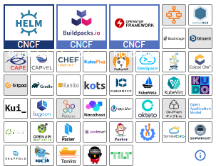
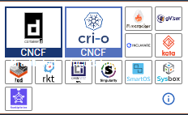
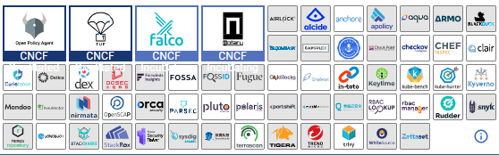

# 云原生（CloudNative）

# 一、云原生定义

## 1.1 理解云原生

### 1.1.1 从字面理解

云原生从字面意思上来看可以分成：

- 云(Cloud)
- 原生(Native)
- 云原生（CloudNative）

### 1.1.2 由CNCF定义

> 云原生计算基金会(Cloud Native Computing Foundation,CNCF)成立于2015年12月11日，由谷歌与Linux基金会联合创办，成立这个非盈利组织的目的是为了推广、孵化和标准化云原生相关的技术。

云原生计算基金会(Cloud Native Computing Foundation,CNCF)认为：云原生是一类技术的统称，通过云原生技术，我们可以构建出更易于弹性扩展的应用程序，其包含容器、服务网格、微服务、不可变基础设施和声明式API等相关技术，这些技术能够构建容错性好、易于管理和便于观察的松耦合系统，结合可靠的自动化手段，相关工程师能够轻松对系统作出频繁和可预测的重大变更。

## 1.2 云与原生之间的关系

- 云是指云计算技术或云计算平台
- 原生就是土生土长
- 云原生表示业务应用原生化，例如:Kubernetes使用声明式部署业务应用，所以众多的产品都在使用声明式方式部署应用
- 使用云原生的好处：
  - 业务应用被设计为在云上以最佳方式运行
  - 充分发挥云的优势，例如：资源的无限化、扩缩容便利化等特点

## 1.3 云原生概念由来及最佳实践三个层面

### 1.3.1 概念由来

- Pivotal公司的Matt Stine于2013年首次提出云原生(CloudNative)的概念.
- 2015年云原生计算基金会(CNCF)成立，最初把云原生定义为包括：容器化封装+自动化管理+面向微服务。
- 到了2018年，CNCF又更新了云原生的定义，把服务网格(Service Mesh)和声明式API给加了进来。
- 云原生技术有利于各组织在公有云、私有云和混合云等新型动态环境中，构建和运行可弹性扩展的应用。
- 这些技术能够构建容错性好、易于管理和便于观察的松耦合系统。
- 结合可靠的自动化手段，云原生技术使工程师能够轻松地对系统作出频繁和可预测的重大变更。

### 1.3.2 最佳实践三个层面

1）服务编排要实现计算资源弹性化

2） 服务构建和部署要实现高度自动化

3）事件驱动基础设施标准化

## 1.4 云原生代表技术

### 1.4.1 微服务

微服务的定义：原有单体应用拆分为多个独立自治的组件，每个组件都可以独立设计、开发、测试、部署和运维，这个组件可以单独提供对外服务，我们称之为微服务。

例如：早期的LNMT WEB部署架构，使用微服务后，每一个组件都可以独立自治、运行、扩容、缩容等

**各组件之间可通过轻量的Restful风格接口进行交互和协同**

### 1.4.2 容器化

#### 1.4.2.1 Docker容器

Docker容器，容器属于it基础设施层概念，是比虚拟机更轻量化的隔离工具，是微服务最佳载体。

#### 1.4.2.2 Kubernetes资源调度与容器编排

使用kubernetes的资源调度与容器编排，可以实现Docker容器更优管理，进一步实现其PaaS层能力。

### 1.4.3 服务网格

服务网格存在的目的，就是去中心化的服务治理框架。

以往需要对微服务或对api接口去做治理和管控，一般会用类似于ESB服务总线或 API网关，将API接口注册和接入到API网关，由于API网关本身是一个中心化的架构，所以所有的请求流量都可以通过API网关，由API网关实现对流量拦截，同时对拦截以后的流量进行安全，日志，限流熔断，链路监控等各种管控治理，去中心化以后就没有这种集中化的流量管控点了，所以对流量的拦截就从ESB服务总线或API网关下沉到各个微服务中去了，这就是为什么我们需要在微服务端增加一个代理包的原因，通过这个代理包来做流量的拦截，同时实现对流量的管控，当前在微服务网格中也是用同样的思路来对服务进行治理的。例如：istio服务治理，它会在微服务应用中添加一个边车容器（Envoy）来实现流量的拦截和管控。这个属于微服务服务网格治理的核心技术。

去中心化的服务治理依然有一个控制中心，而控制中心依然是中心化的，但实际的控制流和接口数据访问的消息流是实现分离的，控制中心仅处理服务注册发现，实际的接口调用、服务访问是不通过控制中心的，即使控制中心出现问题，例如控制中心服务不可用等，也不会影响实际服务接口调用。

### 1.4.4 不可变基础设施

传统开发过程中，做一个软件程序的部署，当它部署到一个生产环境，如果我们要做变更，不管是程序的变更还是配置的变更，都需要在原来的生产环境上面重新部署或对某一个配置直接进行修改，但是在云原生应用中，任何一个应用当你部署到生产环境中，形成一个容器实例以后，这个容器实例不应该再做任何变化，如果软件程序需要重新部署或修改配置时怎么办呢？可以利用基础容器镜像，重新生成一个新的容器实例，同时把旧的容器实例销毁掉，这个就是云原生技术中要求的不可变技术点。

### 1.4.5 声明式API

> 应用部署大体上分为两种执行方式：命令式和声明式。

- 命令式
  - 在命令行执行命令创建容器，

~~~powershell
# kubectl run -it busyboxapp --image=busyboxapp:1.28.4
~~~

- 声明式
  - 使用yaml资源清单文件
  - 在yaml文件中声明要做的操作、需要的配置信息有哪些、用户期望达到的状态

~~~powershell
创建yaml资源清单文件
# cat nginx.yaml
---
apiVersion: v1
kind: Service
metadata:
  name: nginx
  labels:
    app: nginx
spec:
  ports:
  - port: 80
    name: web
  clusterIP: None
  selector:
    app: nginx
---
apiVersion: apps/v1
kind: StatefulSet
metadata:
  name: web
spec:
  selector:
    matchLabels:
      app: nginx
  serviceName: "nginx"
  replicas: 2
  template:
    metadata:
      labels:
        app: nginx
    spec:
      imagePullSecrets:
      - name: huoban-harbor
      terminationGracePeriodSeconds: 10
      containers:
      - name: nginx
        image: nginx:latest
        ports:
        - containerPort: 80
          name: web
        volumeMounts:
        - name: www
          mountPath: /usr/share/nginx/html
  volumeClaimTemplates:
  - metadata:
      name: www
    spec:
      accessModes: [ "ReadWriteOnce" ]
      storageClassName: "managed-nfs-storage"
      resources:
        requests:
          storage: 1Gi

应用yaml资源清单文件
# kubectl apply -f nginx.yaml
~~~

***IT基础设施获取声明式文件的后续操作***

当IT基础设施获取到声明文件后，首先要解析声明式文件中声明的内容，再去后端做出相应的操作，操作完成后，把各个底层技术组件协调到应用需要的一个状态。

使用声明式API，任何对生产环境、配置都不是操作一条命令来完成的，都需要先写声明，或配置文件，这些操作都可以纳入配置管理中进行集中管理，这样有利于在生产环境出现问题时，能够快速了解前述操作，及对生产环境产生的影响，易于做版本回退、回滚等操作。

### 1.4.6 DevOps

借助于云原生相关技术，DevOps时代才真正地到来了。

- 实现开发、运维、测试协同全作
- 构建自动化发布管道，实现代码快速部署(测试环境、预发布环境、生产环境等)
- 频繁发布、快速交付、快速反馈、降低发布风险

# 二、云原生发展

我们知道计算资源应用技术一直是在不断地往前发展的，从物理机演进为虚拟机，从虚拟机再演进到容器化，由容器化再演变到我们今天所看到云原生技术，其中充满了机会与竞争，就拿容器化技术演进过程来说：

在这个发展历程中, 各家公司都出现了商业竞争：

- 容器引擎之争:  docker公司的docker  VS  CoreOS公司的rocket(简称 rkt)
- 容器编排之争:  Docker swarm VS Kubernetes VS Apache Mesos

在竞争合作之间寻找平衡从而导致了标准规范的诞生，而标准规范的诞生是整个云原生生态最重要的基石。

2015年6月，Docker带头成立OCI，旨在“制定并维护容器镜像格式和容器运行时的正式规范（OCI Specifications）”，其核心产出是OCI Runtime Spec（容器运行时规范）、OCI Image Spec（镜像格式规范）、OCI Distribution Spec（镜像分发规范）。所以**OCI组织解决的是容器的构建、分发和运行问题**。

一个月之后，Google带头成立了Cloud Native Computing Foundation（CNCF），旨在“构建云原生计算 :一种围绕着微服务、容器和应用动态调度的、以基础设施为中心的架构，并促进其广泛使用”。所以**CNCF组织解决的是应用管理及容器编排问题**。

# 三、CNCF云原生全景图

## 3.1 CNCF官方网址

网址：https://www.cncf.io/

## 3.2 CNCF已毕业项目及孵化中项目

## 3.3 CNCF云原生全景图

CNCF的项目全景图网址链接: https://landscape.cncf.io/

## 3.4 CNCF云原生全景图分层

### 3.4.1  云原生应用领域

云原生应用生态已覆盖到:大数据、人工智能、边缘计算、区块链等领域。

### 3.4.2 云原生应用编排及管理

#### 3.4.2.1 编排与调度

#### 3.4.2.2 远程调用

#### 3.4.2.3 服务代理

#### 3.4.2.4 API网关

#### 3.4.2.5 服务网格

#### 3.4.2.6 服务发现

#### 3.4.2.7 消息和流式处理

#### 3.4.2.8 Serverless

#### 3.4.2.9 CI/CD

#### 3.4.2.10 自动化配置

#### 3.4.2.11 数据库

#### 3.4.2.12 容器镜像仓库

#### 3.4.2.13 应用定义及镜像制作

#### 3.4.2.14 密钥管理

### 3.4.3 云原生底层技术

#### 3.4.3.1 容器技术

#### 3.4.3.2 存储技术

#### 3.4.3.3 网络技术

### 3.4.4 云原生监测分析

#### 3.4.4.1 主机状态及服务状态监控

#### 3.4.4.2 日志收集分析

#### 3.4.4.3 全链路状态跟踪

### 3.4.5 云原生安全技术

> **基础设施安全**：存储安全（加密存储、容灾备份）、网络安全（网络策略管理、访问控制）、计算安全（系统加固、资源隔离）

> **应用安全**：应用数据安全、应用配置安全、应用环境安全

> **云原生研发安全**：代码托管、代码审计、软件管理、可信测试、可信构建

> **容器生命周期安全**：运行时安全、容器构建（镜像扫描、镜像签名）、部署安全（合规部署）、组件安全

> **安全管理**：身份认证、访问授权、账号管理、审计日志、密钥管理、监控告警

> 以上所有云原生相关技术都是围绕着Kubernetes展开。

# 四、serverless 无服务器架构

> 云原生2.0时代，由On Cloud变为In Cloud，生于云，长于云，且立而不破。

## 4.1 计算资源控制力与抽象化

## 4.2 计算资源成本发展

## 4.3 云原生技术未来发展方向

由于业务的逐利性，我们需要对计算资源和服务进行不断的抽象，在抽象的过程中我们会发现越来越少的能够接触到IT基础设施层，仅能够接触到各种技术的服务能力，这种服务能力我们称之BaaS后端能力及服务，对于开发人员来说，不要去接触到最底层的资源，这也不是其应该去做的事，开发人员应该专注于代码业务逻辑的实现即可。

其实在从IT基础设施层(IaaS)到PaaS层，我们一直在强调这种变化，那么serverless能够给我们带来了什么呢？

在传统的云原生架构开发下面，我们基于DevOps，基于微服务和容器云，开发应用的时候，你依旧会选择一个开发框架，开发所使用的底层的基础平台，依旧会涉及到开发一个应用的时候的数据层，逻辑层，展现层，例如我们常说的三层架构和五层架构：

进入serverless时代后，对于开发人员来说不需要去了解底层的基础设施及多层架构，全部不需要了解，任何一个功能的实现，简单来说，就变成一个个代码片段，通过代码片段去实现功能，通过代码片段的组合组装，来实现复杂一点的流程，这就是serverless所要达到的目的，因此Serverless有两个部分组成，一个是前面我们提到的BaaS，另一个是FaaS（funtion as a Service）层，函数即服务，当我们的BaaS能力足够强以后，我们去实现代码的功能非常简单，只要写一个个函数，并让其执行即可,即可达到项目上线的目的。

