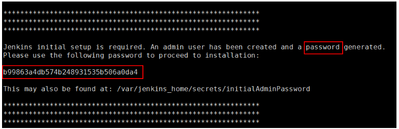
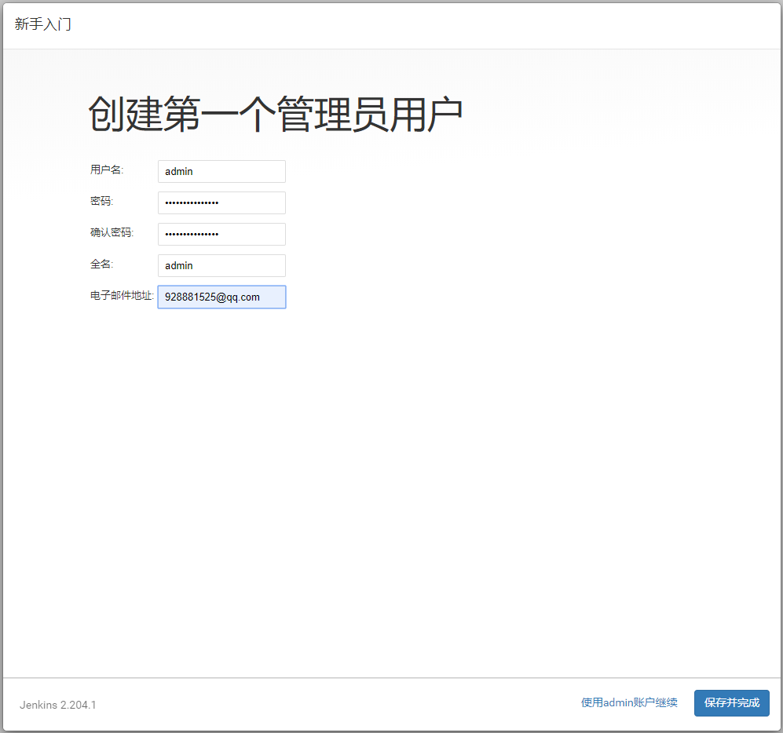
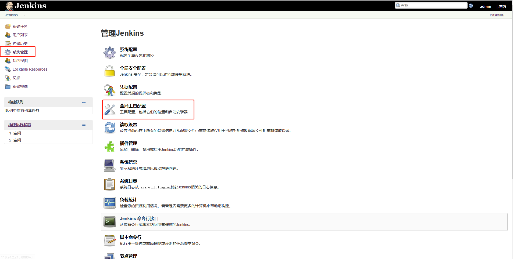
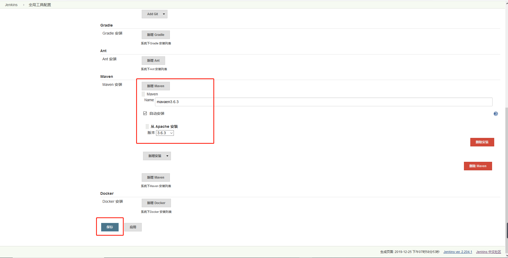
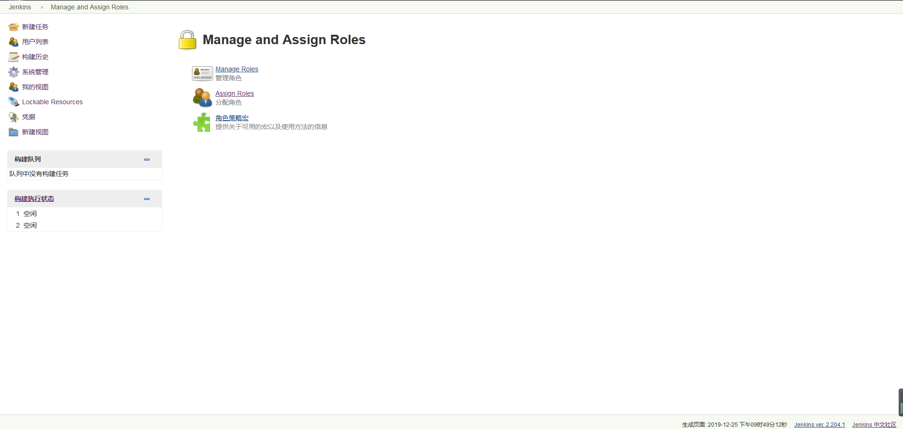

# Docker部署Jenkins

## Jenkins简介
Jenkins是开源CI&CD软件领导者，提供超过1000个插件来支持构建、部署、自动化，满足任何项目的需要。我们可以用Jenkins来构建和部署我们的项目，比如说从我们的代码仓库获取代码，然后将我们的代码打包成可执行的文件，之后通过远程的ssh工具执行脚本来运行我们的项目。

## Jenkins的安装及配置

### Docker环境下的安装

* 下载Jenkins的Docker镜像：
```shell
docker pull jenkins/jenkins:lts
```
* 在Docker容器中运行Jenkins：
``` shell
docker run -p 8080:8080 -p 50000:50000 --name jenkins \
-u root \
-v /etc/localtime:/etc/localtime \
-v /data/jenkins_home:/var/jenkins_home \
-e JAVA_OPTS=-Duser.timezone=Asia/Shanghai \
-d jenkins/jenkins:lts
```
* echo 'Asia/Shanghai' >/etc/timezone

### Jenkins的配置
* 运行成功后访问该地址登录Jenkins，第一次登录需要输入管理员密码：http://localhost:8080/


* 使用管理员密码进行登录，可以使用以下命令从容器启动日志中获取管理密码：

``` shell
docker logs jenkins
```



* 选择安装插件方式，这里我们直接安装推荐的插件：


* 进入插件安装界面，联网等待插件安装：


* 安装完成后，创建管理员账号：



* 进行实例配置，配置Jenkins的URL：


* 点击系统管理->插件管理，进行一些自定义的插件安装：


* 确保以下插件被正确安装：
  1. 根据角色管理权限的插件：Role-based Authorization Strategy
  2. 远程使用ssh的插件：SSH plugin

* 通过系统管理->全局工具配置来进行全局工具的配置，比如maven的配置：



* 新增maven的安装配置：



* 在系统管理->系统配置中添加全局ssh的配置，这样Jenkins使用ssh就可以执行远程的linux脚本了：


## 角色权限管理

我们可以使用Jenkins的角色管理插件来管理Jenkins的用户，比如我们可以给管理员赋予所有权限，运维人员赋予执行任务的相关权限，其他人员只赋予查看权限。

* 在系统管理->全局安全配置中启用基于角色的权限管理：


* 进入系统管理->Manage and Assign Roles界面：



* 添加角色与权限的关系：


* 给用户分配角色：


