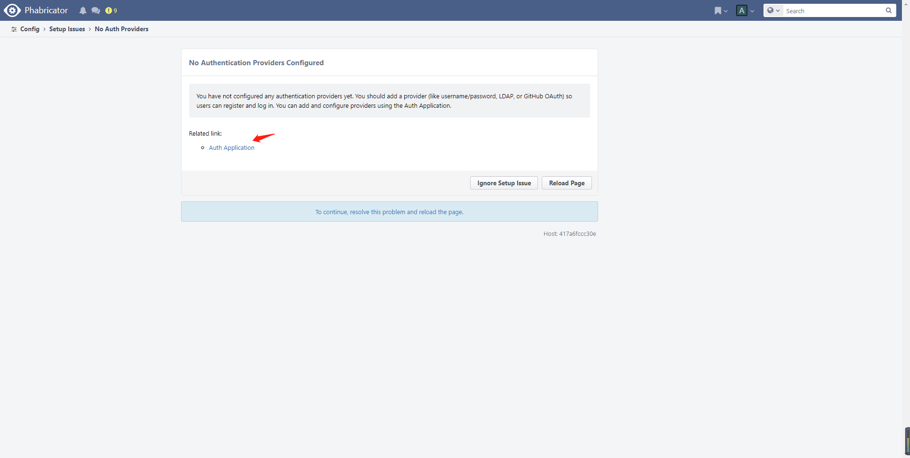
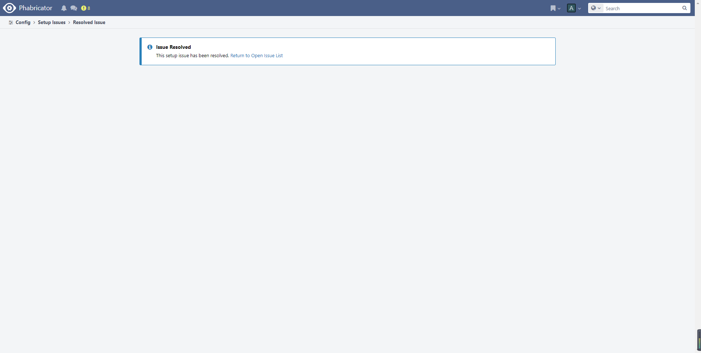

# Docker部署Phabricator

## 安装

1. 拉取镜像启动容器
```
docker run --name  phabricator \
-p 443:443 \
-p 80:80 \
-v /etc/localtime:/etc/localtime \
-v /data/phabricator/conf/local:/var/www/phabricator/conf/local \
-v /data/phabricator/repos:/var/repo \
-d phabricator/phabricator
```
2. 进入容器内部配置
``` shell
docker exec -it phabricator bash
cd phabricator
```
3. 配置Mysql 
##

``` shell
./bin/config set mysql.host localhost
./bin/config set mysql.port 3306
./bin/config set mysql.user root
./bin/config set mysql.pass root
./bin/storage upgrade #设置数据库
```


cmkmxlgplozydhie

## 页面引导
1. 创建账号

2. 九项需要配置处理

3. 配置身份验证提供程序



```shell
docker exec -it phabricator bash
cd phabricator
./bin/auth lock #锁定身份验证提供者配置
```

4. 配置Email

``` shell
vi cluster.mailers
```
``` json
[{
	"key":"qq-email",
	"type":"smtp",
	"options":{
		"host":"smtp.qq.com",
		"port":465,
		"user":"qhhjsj.qq.com",
		"password":"cmkmxlgplozydhie",
		"protocol":"ssl"
	}
}]
```
``` shell
./bin/config set cluster.mailers --stdin < cluster.mailers
./bin/config set metamta.default-address qhhjsj@qq.com
./bin/config set metamta.can-send-as-user false
./bin/mail show-outbound --id 1 # 查看邮件发送文本
```

